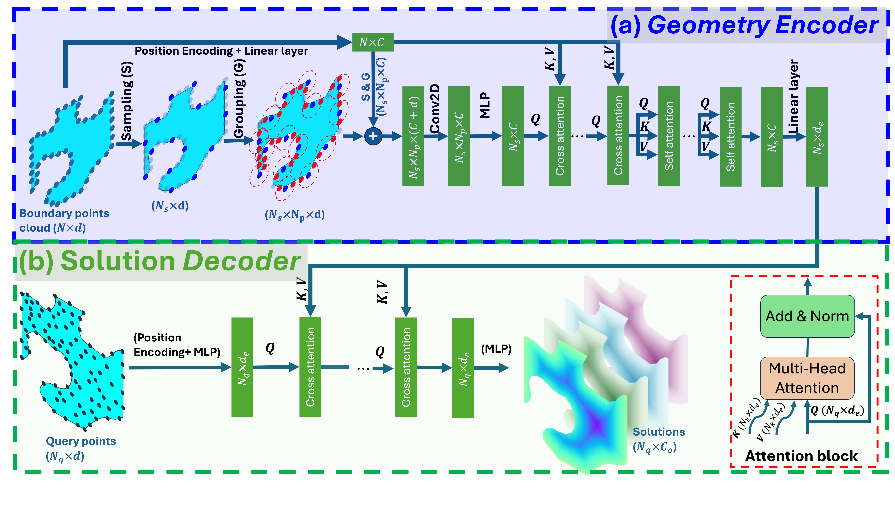

# Geometry-Informed Neural Operator Transformer

Figure 1: Overview of GINOT architecture. The boundary points cloud is initially processed through
    sampling and grouping layers to extract local geometric features. These local
    features are then fused with global geometric information via a cross-attention
    layer. This is followed by a series of self-attention layers and a final
    linear layer, producing the KEY and VALUE matrices for the cross-attention layer
    in the solution decoder. In the solution decoder, an MLP encodes the query points
    into the QUERY matrix for the cross-attention layer, which integrates the
    geometry information from the encoder. The output of the cross-attention layer
    is subsequently decoded into solution fields at the query points using another
    MLP.

## Examples

Figure 2: Visualization of Mises stress and displacement solutions for the median testing case of the micro-periodic unit cell. The first column shows the input surface points cloud, the second column presents the true stress on the actual deformed shape, the third column depicts the predicted stress on the predicted deformed shape, and the fourth column highlights the absolute error of stress on the actual deformed shape.

  <!-- Paste your HTML content here -->
  <!DOCTYPE html>
<html>
  <head>
    <meta http-equiv="Content-type" content="text/html; charset=utf-8"/>
    <meta name="viewport" content="width=device-width, height=device-height, initial-scale=1, maximum-scale=1, minimum-scale=1, user-scalable=no">
  </head>
  <body>
    

<script type="text/javascript">
!function(){var e={334:function(){const e=document.querySelector("head");e&&[16,32,96,160,196].forEach((t=>{const n=document.createElement("link");n.setAttribute("rel","icon"),n.setAttribute("href",`https://kitware.github.io/vtk-js/icon/favicon-${t}x${t}.png`),n.setAttribute("sizes",`${t}x${t}`),n.setAttribute("type","image/png"),e.appendChild(n)}))},819:function(e,t,n){"use strict";n.r(t),n.d(t,{initLocalFileLoader:function(){return cI},load:function(){return lI}});var r={};n.r(r),n.d(r,{add:function(){return Q},adjoint:function(){return v},clone:function(){return u},copy:function(){return d},create:function(){return c},determinant:function(){return y},equals:function(){return re},exactEquals:function(){return ne},frob:function(){return Z},fromQuat:function(){return k},fromQuat2:function(){return V},fromRotation:function(){return O},fromRotationTranslation:function(){return D},fromRotationTranslationScale:function(){return _},fromRotationTranslationScaleOrigin:function(){return F},fromScaling:function(){return P},fromTranslation:function(){return w},fromValues:function(){return p},fromXRotation:function(){return R},fromYRotation:function(){return M},fromZRotation:function(){return E},frustum:function(){return G},getRotation:function(){return N},getScaling:function(){return B},getTranslation:function(){return L},identity:function(){return g},invert:function(){return h},lookAt:function(){return q},mul:function(){return oe},multiply:function(){return T},multiplyScalar:function(){return ee},multiplyScalarAndAdd:function(){return te},ortho:function(){return K},orthoNO:function(){return j},orthoZO:function(){return $},perspective:function(){return z},perspectiveFromFieldOfView:function(){return H},perspectiveNO:function(){return U},perspectiveZO:function(){return W},rotate:function(){return C},rotateX:function(){return S},rotateY:function(){return A},rotateZ:function(){return I},scale:function(){return x},set:function(){return f},str:function(){return Y},sub:function(){return ae},subtract:function(){return J},targetTo:function(){return X},translate:function(){return b},transpose:function(){return m}});var o={};n.r(o),n.d(o,{add:function(){return Me},adjoint:function(){return me},clone:function(){return le},copy:function(){return ce},create:function(){return ie},determinant:function(){return he},equals:function(){return Be},exactEquals:function(){return Le},frob:function(){return Re},fromMat2d:function(){return Ae},fromMat4:function(){return se},fromQuat:function(){return Ie},fromRotation:function(){return Ce},fromScaling:function(){return Se},fromTranslation:function(){return xe},fromValues:function(){return ue},identity:function(){return pe},invert:function(){return ge},mul:function(){return Ne},multiply:function(){return ve},multiplyScalar:function(){return De},multiplyScalarAndAdd:function(){return Ve},normalFromMat4:function(){return we},projection:function(){return Pe},rotate:function(){return Te},scale:function(){return be},set:function(){return de},str:function(){return Oe},sub:function(){return _e},subtract:function(){return Ee},translate:function(){return ye},transpose:function(){return fe}}),n(334);var a=1e-6,i="undefined"!=typeof Float32Array?Float32Array:Array;Math.random;var s=Math.PI/180;function l(e){return e*s}function c(){var e=new i(16);return i!=Float32Array&&(e[1]=0,e[2]=0,e[3]=0,e[4]=0,e[6]=0,e[7]=0,e[8]=0,e[9]=0,e[11]=0,e[12]=0,e[13]=0,e[14]=0),e[0]=1,e[5]=1,e[10]=1,e[15]=1,e}function u(e){var t=new i(16);return t[0]=e[0],t[1]=e[1],t[2]=e[2],t[3]=e[3],t[4]=e[4],t[5]=e[5],t[6]=e[6],t[7]=e[7],t[8]=e[8],t[9]=e[9],t[10]=e[10],t[11]=e[11],t[12]=e[12],t[13]=e[13],t[14]=e[14],t[15]=e[15],t}function d(e,t){return e[0]=t[0],e[1]=t[1],e[2]=t[2],e[3]=t[3],e[4]=t[4],e[5]=t[5],e[6]=t[6],e[7]=t[7],e[8]=t[8],e[9]=t[9],e[10]=t[10],e[11]=t[11],e[12]=t[12],e[13]=t[13],e[14]=t[14],e[15]=t[15],e}function p(e,t,n,r,o,a,s,l,c,u,d,p,f,g,m,h){var v=new i(16);return v[0]=e,v[1]=t,v[2]=n,v[3]=r,v[4]=o,v[5]=a,v[6]=s,v[7]=l,v[8]=c,v[9]=u,v[10]=d,v[11]=p,v[12]=f,v[13]=g,v[14]=m,v[15]=h,v}function f(e,t,n,r,o,a,i,s,l,c,u,d,p,f,g,m,h){return e[0]=t,e[1]=n,e[2]=r,e[3]=o,e[4]=a,e[5]=i,e[6]=s,e[7]=l,e[8]=c,e[9]=u,e[10]=d,e[11]=p,e[12]=f,e[13]=g,e[14]=m,e[15]=h,e}function g(e){return e[0]=1,e[1]=0,e[2]=0,e[3]=0,e[4]=0,e[5]=1,e[6]=0,e[7]=0,e[8]=0,e[9]=0,e[10]=1,e[11]=0,e[12]=0,e[13]=0,e[14]=0,e[15]=1,e}function m(e,t){if(e===t){var n=t[1],r=t[2],o=t[3],a=t[6],i=t[7],s=t[11];e[1]=t[4],e[2]=t[8],e[3]=t[12],e[4]=n,e[6]=t[9],e[7]=t[13],e[8]=r,e[9]=a,e[11]=t[14],e[12]=o,e[13]=i,e[14]=s}else e[0]=t[0],e[1]=t[4],e[2]=t[8],e[3]=t[12],e[4]=t[1],e[5]=t[5],e[6]=t[9],e[7]=t[13],e[8]=t[2],e[9]=t[6],e[10]=t[10],e[11]=t[14],e[12]=t[3],e[13]=t[7],e[14]=t[11],e[15]=t[15];return e}function h(e,t){var n=t[0],r=t[1],o=t[2],a=t[3],i=t[4],s=t[5],l=t[6],c=t[7],u=t[8],d=t[9],p=t[10],f=t[11],g=t[12],m=t[13],h=t[14],v=t[15],y=n*s-r*i,T=n*l-o*i,b=n*c-a*i,x=r*l-o*s,C=r*c-a*s,S=o*c-a*l,A=u*m-d*g,I=u*h-p*g,w=u*v-f*g,P=d*h-p*m,O=d*v-f*m,R=p*v-f*h,M=y*R-T*O+b*P+x*w-C*I+S*A;return M?(M=1/M,e[0]=(s*R-l*O+c*P)*M,e[1]=(o*O-r*R-a*P)*M,e[2]=(m*S-h*C+v*x)*M,e[3]=(p*C-d*S-f*x)*M,e[4]=(l*w-i*R-c*I)*M,e[5]=(n*R-o*w+a*I)*M,e[6]=(h*b-g*S-v*T)*M,e[7]=(u*S-p*b+f*T)*M,e[8]=(i*O-s*w+c*A)*M,e[9]=(r*w-n*O-a*A)*M,e[10]=(g*C-m*b+v*y)*M,e[11]=(d*b-u*C-f*y)*M,e[12]=(s*I-i*P-l*A)*M,e[13]=(n*P-r*I+o*A)*M,e[14]=(m*T-g*x-h*y)*M,e[15]=(u*x-d*T+p*y)*M,e):null}function v(e,t){var n=t[0],r=t[1],o=t[2],a=t[3],i=t[4],s=t[5],l=t[6],c=t[7],u=t[8],d=t[9],p=t[10],f=t[11],g=t[12],m=t[13],h=t[14],v=t[15];return e[0]=s*(p*v-f*h)-d*(l*v-c*h)+m*(l*f-c*p),e[1]=-(r*(p*v-f*h)-d*(o*v-a*h)+m*(o*f-a*p)),e[2]=r*(l*v-c*h)-s*(o*v-a*h)+m*(o*c-a*l),e[3]=-(r*(l*f-c*p)-s*(o*f-a*p)+d*(o*c-a*l)),e[4]=-(i*(p*v-f*h)-u*(l*v-c*h)+g*(l*f-c*p)),e[5]=n*(p*v-f*h)-u*(o*v-a*h)+g*(o*f-a*p),e[6]=-(n*(l*v-c*h)-i*(o*v-a*h)+g*(o*c-a*l)),e[7]=n*(l*f-c*p)-i*(o*f-a*p)+u*(o*c-a*l),e[8]=i*(d*v-f*m)-u*(s*v-c*m)+g*(s*f-c*d),e[9]=-(n*(d*v-f*m)-u*(r*v-a*m)+g*(r*f-a*d)),e[10]=n*(s*v-c*m)-i*(r*v-a*m)+g*(r*c-a*s),e[11]=-(n*(s*f-c*d)-i*(r*f-a*d)+u*(r*c-a*s)),e[12]=-(i*(d*h-p*m)-u*(s*h-l*m)+g*(s*p-l*d)),e[13]=n*(d*h-p*m)-u*(r*h-o*m)+g*(r*p-o*d),e[14]=-(n*(s*h-l*m)-i*(r*h-o*m)+g*(r*l-o*s)),e[15]=n*(s*p-l*d)-i*(r*p-o*d)+u*(r*l-o*s),e}function y(e){var t=e[0],n=e[1],r=e[2],o=e[3],a=e[4],i=e[5],s=e[6],l=e[7],c=e[8],u=e[9],d=e[10],p=e[11],f=e[12],g=e[13],m=e[14],h=e[15];return(t*i-n*a)*(d*h-p*m)-(t*s-r*a)*(u*h-p*g)+(t*l-o*a)*(u*m-d*g)+(n*s-r*i)*(c*h-p*f)-(n*l-o*i)*(c*m-d*f)+(r*l-o*s)*(c*g-u*f)}function T(e,t,n){var r=t[0],o=t[1],a=t[2],i=t[3],s=t[4],l=t[5],c=t[6],u=t[7],d=t[8],p=t[9],f=t[10],g=t[11],m=t[12],h=t[13],v=t[14],y=t[15],T=n[0],b=n[1],x=n[2],C=n[3];return e[0]=T*r+b*s+x*d+C*m,e[1]=T*o+b*l+x*p+C*h,e[2]=T*a+b*c+x*f+C*v,e[3]=T*i+b*u+x*g+C*y,T=n[4],b=n[5],x=n[6],C=n[7],e[4]=T*r+b*s+x*d+C*m,e[5]=T*o+b*l+x*p+C*h,e[6]=T*a+b*c+x*f+C*v,e[7]=T*i+b*u+x*g+C*y,T=n[8],b=n[9],x=n[10],C=n[11],e[8]=T*r+b*s+x*d+C*m,e[9]=T*o+b*l+x*p+C*h,e[10]=T*a+b*c+x*f+C*v,e[11]=T*i+b*u+x*g+C*y,T=n[12],b=n[13],x=n[14],C=n[15],e[12]=T*r+b*s+x*d+C*m,e[13]=T*o+b*l+x*p+C*h,e[14]=T*a+b*c+x*f+C*v,e[15]=T*i+b*u+x*g+C*y,e}function b(e,t,n){var r,o,a,i,s,l,c,u,d,p,f,g,m=n[0],h=n[1],v=n[2];return t===e?(e[12]=t[0]*m+t[4]*h+t[8]*v+t[12],e[13]=t[1]*m+t[5]*h+t[9]*v+t[13],e[14]=t[2]*m+t[6]*h+t[10]*v+t[14],e[15]=t[3]*m+t[7]*h+t[11]*v+t[15]):(r=t[0],o=t[1],a=t[2],i=t[3],s=t[4],l=t[5],c=t[6],u=t[7],d=t[8],p=t[9],f=t[10],g=t[11],e[0]=r,e[1]=o,e[2]=a,e[3]=i,e[4]=s,e[5]=l,e[6]=c,e[7]=u,e[8]=d,e[9]=p,e[10]=f,e[11]=g,e[12]=r*m+s*h+d*v+t[12],e[13]=o*m+l*h+p*v+t[13],e[14]=a*m+c*h+f*v+t[14],e[15]=i*m+u*h+g*v+t[15]),e}function x(e,t,n){var r=n[0],o=n[1],a=n[2];return e[0]=t[0]*r,e[1]=t[1]*r,e[2]=t[2]*r,e[3]=t[3]*r,e[4]=t[4]*o,e[5]=t[5]*o,e[6]=t[6]*o,e[7]=t[7]*o,e[8]=t[8]*a,e[9]=t[9]*a,e[10]=t[10]*a,e[11]=t[11]*a,e[12]=t[12],e[13]=t[13],e[14]=t[14],e[15]=t[15],e}function C(e,t,n,r){var o,i,s,l,c,u,d,p,f,g,m,h,v,y,T,b,x,C,S,A,I,w,P,O,R=r[0],M=r[1],E=r[2],D=Math.hypot(R,M,E);return D<a?null:(R*=D=1/D,M*=D,E*=D,o=Math.sin(n),s=1-(i=Math.cos(n)),l=t[0],c=t[1],u=t[2],d=t[3],p=t[4],f=t[5],g=t[6],m=t[7],h=t[8],v=t[9],y=t[10],T=t[11],b=R*R*s+i,x=M*R*s+E*o,C=E*R*s-M*o,S=R*M*s-E*o,A=M*M*s+i,I=E*M*s+R*o,w=R*E*s+M*o,P=M*E*s-R*o,O=E*E*s+i,e[0]=l*b+p*x+h*C,e[1]=c*b+f*x+v*C,e[2]=u*b+g*x+y*C,e[3]=d*b+m*x+T*C,e[4]=l*S+p*A+h*I,e[5]=c*S+f*A+v*I,e[6]=u*S+g*A+y*I,e[7]=d*S+m*A+T*I,e[8]=l*w+p*P+h*O,e[9]=c*w+f*P+v*O,e[10]=u*w+g*P+y*O,e[11]=d*w+m*P+T*O,t!==e&&(e[12]=t[12],e[13]=t[13],e[14]=t[14],e[15]=t[15]),e)}function S(e,t,n){var r=Math.sin(n),o=Math.cos(n),a=t[4],i=t[5],s=t[6],l=t[7],c=t[8],u=t[9],d=t[10],p=t[11];return t!==e&&(e[0]=t[0],e[1]=t[1],e[2]=t[2],e[3]=t[3],e[12]=t[12],e[13]=t[13],e[14]=t[14],e[15]=t[15]),e[4]=a*o+c*r,e[5]=i*o+u*r,e[6]=s*o+d*r,e[7]=l*o+p*r,e[8]=c*o-a*r,e[9]=u*o-i*r,e[10]=d*o-s*r,e[11]=p*o-l*r,e}function A(e,t,n){var r=Math.sin(n),o=Math.cos(n),a=t[0],i=t[1],s=t[2],l=t[3],c=t[8],u=t[9],d=t[10],p=t[11];return t!==e&&(e[4]=t[4],e[5]=t[5],e[6]=t[6],e[7]=t[7],e[12]=t[12],e[13]=t[13],e[14]=t[14],e[15]=t[15]),e[0]=a*o-c*r,e[1]=i*o-u*r,e[2]=s*o-d*r,e[3]=l*o-p*r,e[8]=a*r+c*o,e[9]=i*r+u*o,e[10]=s*r+d*o,e[11]=l*r+p*o,e}function I(e,t,n){var r=Math.sin(n),o=Math.cos(n),a=t[0],i=t[1],s=t[2],l=t[3],c=t[4],u=t[5],d=t[6],p=t[7];return t!==e&&(e[8]=t[8],e[9]=t[9],e[10]=t[10],e[11]=t[11],e[12]=t[12],e[13]=t[13],e[14]=t[14],e[15]=t[15]),e[0]=a*o+c*r,e[1]=i*o+u*r,e[2]=s*o+d*r,e[3]=l*o+p*r,e[4]=c*o-a*r,e[5]=u*o-i*r,e[6]=d*o-s*r,e[7]=p*o-l*r,e}function w(e,t){return e[0]=1,e[1]=0,e[2]=0,e[3]=0,e[4]=0,e[5]=1,e[6]=0,e[7]=0,e[8]=0,e[9]=0,e[10]=1,e[11]=0,e[12]=t[0],e[13]=t[1],e[14]=t[2],e[15]=1,e}function P(e,t){return e[0]=t[0],e[1]=0,e[2]=0,e[3]=0,e[4]=0,e[5]=t[1],e[6]=0,e[7]=0,e[8]=0,e[9]=0,e[10]=t[2],e[11]=0,e[12]=0,e[13]=0,e[14]=0,e[15]=1,e}function O(e,t,n){var r,o,i,s=n[0],l=n[1],c=n[2],u=Math.hypot(s,l,c);return u<a?null:(s*=u=1/u,l*=u,c*=u,r=Math.sin(t),i=1-(o=Math.cos(t)),e[0]=s*s*i+o,e[1]=l*s*i+c*r,e[2]=c*s*i-l*r,e[3]=0,e[4]=s*l*i-c*r,e[5]=l*l*i+o,e[6]=c*l*i+s*r,e[7]=0,e[8]=s*c*i+l*r,e[9]=l*c*i-s*r,e[10]=c*c*i+o,e[11]=0,e[12]=0,e[13]=0,e[14]=0,e[15]=1,e)}function R(e,t){var n=Math.sin(t),r=Math.cos(t);return e[0]=1,e[1]=0,e[2]=0,e[3]=0,e[4]=0,e[5]=r,e[6]=n,e[7]=0,e[8]=0,e[9]=-n,e[10]=r,e[11]=0,e[12]=0,e[13]=0,e[14]=0,e[15]=1,e}function M(e,t){var n=Math.sin(t),r=Math.cos(t);return e[0]=r,e[1]=0,e[2]=-n,e[3]=0,e[4]=0,e[5]=1,e[6]=0,e[7]=0,e[8]=n,e[9]=0,e[10]=r,e[11]=0,e[12]=0,e[13]=0,e[14]=0,e[15]=1,e}function E(e,t){var n=Math.sin(t),r=Math.cos(t);return e[0]=r,e[1]=n,e[2]=0,e[3]=0,e[4]=-n,e[5]=r,e[6]=0,e[7]=0,e[8]=0,e[9]=0,e[10]=1,e[11]=0,e[12]=0,e[13]=0,e[14]=0,e[15]=1,e}function D(e,t,n){var r=t[0],o=t[1],a=t[2],i=t[3],s=r+r,l=o+o,c=a+a,u=r*s,d=r*l,p=r*c,f=o*l,g=o*c,m=a*c,h=i*s,v=i*l,y=i*c;return e[0]=1-(f+m),e[1]=d+y,e[2]=p-v,e[3]=0,e[4]=d-y,e[5]=1-(u+m),e[6]=g+h,e[7]=0,e[8]=p+v,e[9]=g-h,e[10]=1-(u+f),e[11]=0,e[12]=n[0],e[13]=n[1],e[14]=n[2],e[15]=1,e}function V(e,t){var n=new i(3),r=-t[0],o=-t[1],a=-t[2],s=t[3],l=t[4],c=t[5],u=t[6],d=t[7],p=r*r+o*o+a*a+s*s;return p>0?(n[0]=2*(l*s+d*r+c*a-u*o)/p,n[1]=2*(c*s+d*o+u*r-l*a)/p,n[2]=2*(u*s+d*a+l*o-c*r)/p):(n[0]=2*(l*s+d*r+c*a-u*o),n[1]=2*(c*s+d*o+u*r-l*a),n[2]=2*(u*s+d*a+l*o-c*r)),D(e,t,n),e}function L(e,t){return e[0]=t[12],e[1]=t[13],e[2]=t[14],e}function B(e,t){var n=t[0],r=t[1],o=t[2],a=t[4],i=t[5],s=t[6],l=t[8],c=t[9],u=t[10];return e[0]=Math.hypot(n,r,o),e[1]=Math.hypot(a,i,s),e[2]=Math.hypot(l,c,u),e}function N(e,t){var n=new i(3);B(n,t);var r=1/n[0],o=1/n[1],a=1/n[2],s=t[0]*r,l=t[1]*o,c=t[2]*a,u=t[4]*r,d=t[5]*o,p=t[6]*a,f=t[8]*r,g=t[9]*o,m=t[10]*a,h=s+d+m,v=0;return h>0?(v=2*Math.sqrt(h+1),e[3]=.25*v,e[0]=(p-g)/v,e[1]=(f-c)/v,e[2]=(l-u)/v):s>d&&s>m?(v=2*Math.sqrt(1+s-d-m),e[3]=(p-g)/v,e[0]=.25*v,e[1]=(l+u)/v,e[2]=(f+c)/v):d>m?(v=2*Math.sqrt(1+d-s-m),e[3]=(f-c)/v,e[0]=(l+u)/v,e[1]=.25*v,e[2]=(p+g)/v):(v=2*Math.sqrt(1+m-s-d),e[3]=(l-u)/v,e[0]=(f+c)/v,e[1]=(p+g)/v,e[2]=.25*v),e}function _(e,t,n,r){var o=t[0],a=t[1],i=t[2],s=t[3],l=o+o,c=a+a,u=i+i,d=o*l,p=o*c,f=o*u,g=a*c,m=a*u,h=i*u,v=s*l,y=s*c,T=s*u,b=r[0],x=r[1],C=r[2];return e[0]=(1-(g+h))*b,e[1]=(p+T)*b,e[2]=(f-y)*b,e[3]=0,e[4]=(p-T)*x,e[5]=(1-(d+h))*x,e[6]=(m+v)*x,e[7]=0,e[8]=(f+y)*C,e[9]=(m-v)*C,e[10]=(1-(d+g))*C,e[11]=0,e[12]=n[0],e[13]=n[1],e[14]=n[2],e[15]=1,e}function F(e,t,n,r,o){var a=t[0],i=t[1],s=t[2],l=t[3],c=a+a,u=i+i,d=s+s,p=a*c,f=a*u,g=a*d,m=i*u,h=i*d,v=s*d,y=l*c,T=l*u,b=l*d,x=r[0],C=r[1],S=r[2],A=o[0],I=o[1],w=o[2],P=(1-(m+v))*x,O=(f+b)*x,R=(g-T)*x,M=(f-b)*C,E=(1-(p+v))*C,D=(h+y)*C,V=(g+T)*S,L=(h-y)*S,B=(1-(p+m))*S;return e[0]=P,e[1]=O,e[2]=R,e[3]=0,e[4]=M,e[5]=E,e[6]=D,e[7]=0,e[8]=V,e[9]=L,e[10]=B,e[11]=0,e[12]=n[0]+A-(P*A+M*I+V*w),e[13]=n[1]+I-(O*A+E*I+L*w),e[14]=n[2]+w-(R*A+D*I+B*w),e[15]=1,e}function k(e,t){var n=t[0],r=t[1],o=t[2],a=t[3],i=n+n,s=r+r,l=o+o,c=n*i,u=r*i,d=r*s,p=o*i,f=o*s,g=o*l,m=a*i,h=a*s,v=a*l;return e[0]=1-d-g,e[1]=u+v,e[2]=p-h,e[3]=0,e[4]=u-v,e[5]=1-c-g,e[6]=f+m,e[7]=0,e[8]=p+h,e[9]=f-m,e[10]=1-c-d,e[11]=0,e[12]=0,e[13]=0,e[14]=0,e[15]=1,e}function G(e,t,n,r,o,a,i){var s=1/(n-t),l=1/(o-r),c=1/(a-i);return e[0]=2*a*s,e[1]=0,e[2]=0,e[3]=0,e[4]=0,e[5]=2*a*l,e[6]=0,e[7]=0,e[8]=(n+t)*s,e[9]=(o+r)*l,e[10]=(i+a)*c,e[11]=-1,e[12]=0,e[13]=0,e[14]=i*a*2*c,e[15]=0,e}function U(e,t,n,r,o){var a,i=1/Math.tan(t/2);return e[0]=i/n,e[1]=0,e[2]=0,e[3]=0,e[4]=0,e[5]=i,e[6]=0,e[7]=0,e[8]=0,e[9]=0,e[11]=-1,e[12]=0,e[13]=0,e[15]=0,null!=o&&o!==1/0?(a=1/(r-o),e[10]=(o+r)*a,e[14]=2*o*r*a):(e[10]=-1,e[14]=-2*r),e}Math.hypot||(Math.hypot=function(){for(var e=0,t=arguments.length;t--;)e+=arguments[t]*arguments[t];return Math.sqrt(e)});var z=U;function W(e,t,n,r,o){var a,i=1/Math.tan(t/2);return e[0]=i/n,e[1]=0,e[2]=0,e[3]=0,e[4]=0,e[5]=i,e[6]=0,e[7]=0,e[8]=0,e[9]=0,e[11]=-1,e[12]=0,e[13]=0,e[15]=0,null!=o&&o!==1/0?(a=1/(r-o),e[10]=o*a,e[14]=o*r*a):(e[10]=-1,e[14]=-r),e}function H(e,t,n,r){var o=Math.tan(t.upDegrees*Math.PI/180),a=Math.tan(t.downDegrees*Math.PI/180),i=Math.tan(t.leftDegrees*Math.PI/180),s=Math.tan(t.rightDegrees*Math.PI/180),l=2/(i+s),c=2/(o+a);return e[0]=l,e[1]=0,e[2]=0,e[3]=0,e[4]=0,e[5]=c,e[6]=0,e[7]=0,e[8]=-(i-s)*l*.5,e[9]=(o-a)*c*.5,e[10]=r/(n-r),e[11]=-1,e[12]=0,e[13]=0,e[14]=r*n/(n-r),e[15]=0,e}function j(e,t,n,r,o,a,i){var s=1/(t-n),l=1/(r-o),c=1/(a-i);return e[0]=-2*s,e[1]=0,e[2]=0,e[3]=0,e[4]=0,e[5]=-2*l,e[6]=0,e[7]=0,e[8]=0,e[9]=0,e[10]=2*c,e[11]=0,e[12]=(t+n)*s,e[13]=(o+r)*l,e[14]=(i+a)*c,e[15]=1,e}var K=j;function $(e,t,n,r,o,a,i){var s=1/(t-n),l=1/(r-o),c=1/(a-i);return e[0]=-2*s,e[1]=0,e[2]=0,e[3]=0,e[4]=0,e[5]=-2*l,e[6]=0,e[7]=0,e[8]=0,e[9]=0,e[10]=c,e[11]=0,e[12]=(t+n)*s,e[13]=(o+r)*l,e[14]=a*c,e[15]=1,e}function q(e,t,n,r){var o,i,s,l,c,u,d,p,f,m,h=t[0],v=t[1],y=t[2],T=r[0],b=r[1],x=r[2],C=n[0],S=n[1],A=n[2];return Math.abs(h-C)<a&&Math.abs(v-S)<a&&Math.abs(y-A)<a?g(e):(d=h-C,p=v-S,f=y-A,o=b*(f*=m=1/Math.hypot(d,p,f))-x*(p*=m),i=x*(d*=m)-T*f,s=T*p-b*d,(m=Math.hypot(o,i,s))?(o*=m=1/m,i*=m,s*=m):(o=0,i=0,s=0),l=p*s-f*i,c=f*o-d*s,u=d*i-p*o,(m=Math.hypot(l,c,u))?(l*=m=1/m,c*=m,u*=m):(l=0,c=0,u=0),e[0]=o,e[1]=l,e[2]=d,e[3]=0,e[4]=i,e[5]=c,e[6]=p,e[7]=0,e[8]=s,e[9]=u,e[10]=f,e[11]=0,e[12]=-(o*h+i*v+s*y),e[13]=-(l*h+c*v+u*y),e[14]=-(d*h+p*v+f*y),e[15]=1,e)}function X(e,t,n,r){var o=t[0],a=t[1],i=t[2],s=r[0],l=r[1],c=r[2],u=o-n[0],d=a-n[1],p=i-n[2],f=u*u+d*d+p*p;f>0&&(u*=f=1/Math.sqrt(f),d*=f,p*=f);var g=l*p-c*d,m=c*u-s*p,h=s*d-l*u;return(f=g*g+m*m+h*h)>0&&(g*=f=1/Math.sqrt(f),m*=f,h*=f),e[0]=g,e[1]=m,e[2]=h,e[3]=0,e[4]=d*h-p*m,e[5]=p*g-u*h,e[6]=u*m-d*g,e[7]=0,e[8]=u,e[9]=d,e[10]=p,e[11]=0,e[12]=o,e[13]=a,e[14]=i,e[15]=1,e}function Y(e){return"mat4("+e[0]+", "+e[1]+", "+e[2]+", "+e[3]+", "+e[4]+", "+e[5]+", "+e[6]+", "+e[7]+", "+e[8]+", "+e[9]+", "+e[10]+", "+e[11]+", "+e[12]+", "+e[13]+", "+e[14]+", "+e[15]+")"}function Z(e){return Math.hypot(e[0],e[1],e[2],e[3],e[4],e[5],e[6],e[7],e[8],e[9],e[10],e[11],e[12],e[13],e[14],e[15])}function Q(e,t,n){return e[0]=t[0]+n[0],e[1]=t[1]+n[1],e[2]=t[2]+n[2],e[3]=t[3]+n[3],e[4]=t[4]+n[4],e[5]=t[5]+n[5],e[6]=t[6]+n[6],e[7]=t[7]+n[7],e[8]=t[8]+n[8],e[9]=t[9]+n[9],e[10]=t[10]+n[10],e[11]=t[11]+n[11],e[12]=t[12]+n[12],e[13]=t[13]+n[13],e[14]=t[14]+n[14],e[15]=t[15]+n[15],e}function J(e,t,n){return e[0]=t[0]-n[0],e[1]=t[1]-n[1],e[2]=t[2]-n[2],e[3]=t[3]-n[3],e[4]=t[4]-n[4],e[5]=t[5]-n[5],e[6]=t[6]-n[6],e[7]=t[7]-n[7],e[8]=t[8]-n[8],e[9]=t[9]-n[9],e[10]=t[10]-n[10],e[11]=t[11]-n[11],e[12]=t[12]-n[12],e[13]=t[13]-n[13],e[14]=t[14]-n[14],e[15]=t[15]-n[15],e}function ee(e,t,n){return e[0]=t[0]*n,e[1]=t[1]*n,e[2]=t[2]*n,e[3]=t[3]*n,e[4]=t[4]*n,e[5]=t[5]*n,e[6]=t[6]*n,e[7]=t[7]*n,e[8]=t[8]*n,e[9]=t[9]*n,e[10]=t[10]*n,e[11]=t[11]*n,e[12]=t[12]*n,e[13]=t[13]*n,e[14]=t[14]*n,e[15]=t[15]*n,e}function te(e,t,n,r){return e[0]=t[0]+n[0]*r,e[1]=t[1]+n[1]*r,e[2]=t[2]+n[2]*r,e[3]=t[3]+n[3]*r,e[4]=t[4]+n[4]*r,e[5]=t[5]+n[5]*r,e[6]=t[6]+n[6]*r,e[7]=t[7]+n[7]*r,e[8]=t[8]+n[8]*r,e[9]=t[9]+n[9]*r,e[10]=t[10]+n[10]*r,e[11]=t[11]+n[11]*r,e[12]=t[12]+n[12]*r,e[13]=t[13]+n[13]*r,e[14]=t[14]+n[14]*r,e[15]=t[15]+n[15]*r,e}function ne(e,t){return e[0]===t[0]&&e[1]===t[1]&&e[2]===t[2]&&e[3]===t[3]&&e[4]===t[4]&&e[5]===t[5]&&e[6]===t[6]&&e[7]===t[7]&&e[8]===t[8]&&e[9]===t[9]&&e[10]===t[10]&&e[11]===t[11]&&e[12]===t[12]&&e[13]===t[13]&&e[14]===t[14]&&e[15]===t[15]}function re(e,t){var n=e[0],r=e[1],o=e[2],i=e[3],s=e[4],l=e[5],c=e[6],u=e[7],d=e[8],p=e[9],f=e[10],g=e[11],m=e[12],h=e[13],v=e[14],y=e[15],T=t[0],b=t[1],x=t[2],C=t[3],S=t[4],A=t[5],I=t[6],w=t[7],P=t[8],O=t[9],R=t[10],M=t[11],E=t[12],D=t[13],V=t[14],L=t[15];return Math.abs(n-T)<=a*Math.max(1,Math.abs(n),Math.abs(T))&&Math.abs(r-b)<=a*Math.max(1,Math.abs(r),Math.abs(b))&&Math.abs(o-x)<=a*Math.max(1,Math.abs(o),Math.abs(x))&&Math.abs(i-C)<=a*Math.max(1,Math.abs(i),Math.abs(C))&&Math.abs(s-S)<=a*Math.max(1,Math.abs(s),Math.abs(S))&&Math.abs(l-A)<=a*Math.max(1,Math.abs(l),Math.abs(A))&&Math.abs(c-I)<=a*Math.max(1,Math.abs(c),Math.abs(I))&&Math.abs(u-w)<=a*Math.max(1,Math.abs(u),Math.abs(w))&&Math.abs(d-P)<=a*Math.max(1,Math.abs(d),Math.abs(P))&&Math.abs(p-O)<=a*Math.max(1,Math.abs(p),Math.abs(O))&&Math.abs(f-R)<=a*Math.max(1,Math.abs(f),Math.abs(R))&&Math.abs(g-M)<=a*Math.max(1,Math.abs(g),Math.abs(M))&&Math.abs(m-E)<=a*Math.max(1,Math.abs(m),Math.abs(E))&&Math.abs(h-D)<=a*Math.max(1,Math.abs(h),Math.abs(D))&&Math.abs(v-V)<=a*Math.max(1,Math.abs(v),Math.abs(V))&&Math.abs(y-L)<=a*Math.max(1,Math.abs(y),Math.abs(L))}var oe=T,ae=J;function ie(){var e=new i(9);return i!=Float32Array&&(e[1]=0,e[2]=0,e[3]=0,e[5]=0,e[6]=0,e[7]=0),e[0]=1,e[4]=1,e[8]=1,e}function se(e,t){return e[0]=t[0],e[1]=t[1],e[2]=t[2],e[3]=t[4],e[4]=t[5],e[5]=t[6],e[6]=t[8],e[7]=t[9],e[8]=t[10],e}function le(e){var t=new i(9);return t[0]=e[0],t[1]=e[1],t[2]=e[2],t[3]=e[3],t[4]=e[4],t[5]=e[5],t[6]=e[6],t[7]=e[7],t[8]=e[8],t}function ce(e,t){return e[0]=t[0],e[1]=t[1],e[2]=t[2],e[3]=t[3],e[4]=t[4],e[5]=t[5],e[6]=t[6],e[7]=t[7],e[8]=t[8],e}function ue(e,t,n,r,o,a,s,l,c){var u=new i(9);return u[0]=e,u[1]=t,u[2]=n,u[3]=r,u[4]=o,u[5]=a,u[6]=s,u[7]=l,u[8]=c,u}function de(e,t,n,r,o,a,i,s,l,c){return e[0]=t,e[1]=n,e[2]=r,e[3]=o,e[4]=a,e[5]=i,e[6]=s,e[7]=l,e[8]=c,e}function pe(e){return e[0]=1,e[1]=0,e[2]=0,e[3]=0,e[4]=1,e[5]=0,e[6]=0,e[7]=0,e[8]=1,e}function fe(e,t){if(e===t){var n=t[1],r=t[2],o=t[5];e[1]=t[3],e[2]=t[6],e[3]=n,e[5]=t[7],e[6]=r,e[7]=o}else e[0]=t[0],e[1]=t[3],e[2]=t[6],e[3]=t[1],e[4]=t[4],e[5]=t[7],e[6]=t[2],e[7]=t[5],e[8]=t[8];return e}function ge(e,t){var n=t[0],r=t[1],o=t[2],a=t[3],i=t[4],s=t[5],l=t[6],c=t[7],u=t[8],d=u*i-s*c,p=-u*a+s*l,f=c*a-i*l,g=n*d+r*p+o*f;return g?(g=1/g,e[0]=d*g,e[1]=(-u*r+o*c)*g,e[2]=(s*r-o*i)*g,e[3]=p*g,e[4]=(u*n-o*l)*g,e[5]=(-s*n+o*a)*g,e[6]=f*g,e[7]=(-c*n+r*l)*g,e[8]=(i*n-r*a)*g,e):null}function me(e,t){var n=t[0],r=t[1],o=t[2],a=t[3],i=t[4],s=t[5],l=t[6],c=t[7],u=t[8];return e[0]=i*u-s*c,e[1]=o*c-r*u,e[2]=r*s-o*i,e[3]=s*l-a*u,e[4]=n*u-o*l,e[5]=o*a-n*s,e[6]=a*c-i*l,e[7]=r*l-n*c,e[8]=n*i-r*a,e}function he(e){var t=e[0],n=e[1],r=e[2],o=e[3],a=e[4],i=e[5],s=e[6],l=e[7],c=e[8];return t*(c*a-i*l)+n*(-c*o+i*s)+r*(l*o-a*s)}function ve(e,t,n){var r=t[0],o=t[1],a=t[2],i=t[3],s=t[4],l=t[5],c=t[6],u=t[7],d=t[8],p=n[0],f=n[1],g=n[2],m=n[3],h=n[4],v=n[5],y=n[6],T=n[7],b=n[8];return e[0]=p*r+f*i+g*c,e[1]=p*o+f*s+g*u,e[2]=p*a+f*l+g*d,e[3]=m*r+h*i+v*c,e[4]=m*o+h*s+v*u,e[5]=m*a+h*l+v*d,e[6]=y*r+T*i+b*c,e[7]=y*o+T*s+b*u,e[8]=y*a+T*l+b*d,e}function ye(e,t,n){var r=t[0],o=t[1],a=t[2],i=t[3],s=t[4],l=t[5],c=t[6],u=t[7],d=t[8],p=n[0],f=n[1];return e[0]=r,e[1]=o,e[2]=a,e[3]=i,e[4]=s,e[5]=l,e[6]=p*r+f*i+c,e[7]=p*o+f*s+u,e[8]=p*a+f*l+d,e}function Te(e,t,n){var r=t[0],o=t[1],a=t[2],i=t[3],s=t[4],l=t[5],c=t[6],u=t[7],d=t[8],p=Math.sin(n),f=Math.cos(n);return e[0]=f*r+p*i,e[1]=f*o+p*s,e[2]=f*a+p*l,e[3]=f*i-p*r,e[4]=f*s-p*o,e[5]=f*l-p*a,e[6]=c,e[7]=u,e[8]=d,e}function be(e,t,n){var r=n[0],o=n[1];return e[0]=r*t[0],e[1]=r*t[1],e[2]=r*t[2],e[3]=o*t[3],e[4]=o*t[4],e[5]=o*t[5],e[6]=t[6],e[7]=t[7],e[8]=t[8],e}function xe(e,t){return e[0]=1,e[1]=0,e[2]=0,e[3]=0,e[4]=1,e[5]=0,e[6]=t[0],e[7]=t[1],e[8]=1,e}function Ce(e,t){var n=Math.sin(t),r=Math.cos(t);return e[0]=r,e[1]=n,e[2]=0,e[3]=-n,e[4]=r,e[5]=0,e[6]=0,e[7]=0,e[8]=1,e}function Se(e,t){return e[0]=t[0],e[1]=0,e[2]=0,e[3]=0,e[4]=t[1],e[5]=0,e[6]=0,e[7]=0,e[8]=1,e}function Ae(e,t){return e[0]=t[0],e[1]=t[1],e[2]=0,e[3]=t[2],e[4]=t[3],e[5]=0,e[6]=t[4],e[7]=t[5],e[8]=1,e}function Ie(e,t){var n=t[0],r=t[1],o=t[2],a=t[3],i=n+n,s=r+r,l=o+o,c=n*i,u=r*i,d=r*s,p=o*i,f=o*s,g=o*l,m=a*i,h=a*s,v=a*l;return e[0]=1-d-g,e[3]=u-v,e[6]=p+h,e[1]=u+v,e[4]=1-c-g,e[7]=f-m,e[2]=p-h,e[5]=f+m,e[8]=1-c-d,e}function we(e,t){var n=t[0],r=t[1],o=t[2],a=t[3],i=t[4],s=t[5],l=t[6],c=t[7],u=t[8],d=t[9],p=t[10],f=t[11],g=t[12],m=t[13],h=t[14],v=t[15],y=n*s-r*i,T=n*l-o*i,b=n*c-a*i,x=r*l-o*s,C=r*c-a*s,S=o*c-a*l,A=u*m-d*g,I=u*h-p*g,w=u*v-f*g,P=d*h-p*m,O=d*v-f*m,R=p*v-f*h,M=y*R-T*O+b*P+x*w-C*I+S*A;return M?(M=1/M,e[0]=(s*R-l*O+c*P)*M,e[1]=(l*w-i*R-c*I)*M,e[2]=(i*O-s*w+c*A)*M,e[3]=(o*O-r*R-a*P)*M,e[4]=(n*R-o*w+a*I)*M,e[5]=(r*w-n*O-a*A)*M,e[6]=(m*S-h*C+v*x)*M,e[7]=(h*b-g*S-v*T)*M,e[8]=(g*C-m*b+v*y)*M,e):null}function Pe(e,t,n){return e[0]=2/t,e[1]=0,e[2]=0,e[3]=0,e[4]=-2/n,e[5]=0,e[6]=-1,e[7]=1,e[8]=1,e}function Oe(e){return"mat3("+e[0]+", "+e[1]+", "+e[2]+", "+e[3]+", "+e[4]+", "+e[5]+", "+e[6]+", "+e[7]+", "+e[8]+")"}function Re(e){return Math.hypot(e[0],e[1],e[2],e[3],e[4],e[5],e[6],e[7],e[8])}function Me(e,t,n){return e[0]=t[0]+n[0],e[1]=t[1]+n[1],e[2]=t[2]+n[2],e[3]=t[3]+n[3],e[4]=t[4]+n[4],e[5]=t[5]+n[5],e[6]=t[6]+n[6],e[7]=t[7]+n[7],e[8]=t[8]+n[8],e}function Ee(e,t,n){return e[0]=t[0]-n[0],e[1]=t[1]-n[1],e[2]=t[2]-n[2],e[3]=t[3]-n[3],e[4]=t[4]-n[4],e[5]=t[5]-n[5],e[6]=t[6]-n[6],e[7]=t[7]-n[7],e[8]=t[8]-n[8],e}function De(e,t,n){return e[0]=t[0]*n,e[1]=t[1]*n,e[2]=t[2]*n,e[3]=t[3]*n,e[4]=t[4]*n,e[5]=t[5]*n,e[6]=t[6]*n,e[7]=t[7]*n,e[8]=t[8]*n,e}function Ve(e,t,n,r){return e[0]=t[0]+n[0]*r,e[1]=t[1]+n[1]*r,e[2]=t[2]+n[2]*r,e[3]=t[3]+n[3]*r,e[4]=t[4]+n[4]*r,e[5]=t[5]+n[5]*r,e[6]=t[6]+n[6]*r,e[7]=t[7]+n[7]*r,e[8]=t[8]+n[8]*r,e}function Le(e,t){return e[0]===t[0]&&e[1]===t[1]&&e[2]===t[2]&&e[3]===t[3]&&e[4]===t[4]&&e[5]===t[5]&&e[6]===t[6]&&e[7]===t[7]&&e[8]===t[8]}function Be(e,t){var n=e[0],r=e[1],o=e[2],i=e[3],s=e[4],l=e[5],c=e[6],u=e[7],d=e[8],p=t[0],f=t[1],g=t[2],m=t[3],h=t[4],v=t[5],y=t[6],T=t[7],b=t[8];return Math.abs(n-p)<=a*Math.max(1,Math.abs(n),Math.abs(p))&&Math.abs(r-f)<=a*Math.max(1,Math.abs(r),Math.abs(f))&&Math.abs(o-g)<=a*Math.max(1,Math.abs(o),Math.abs(g))&&Math.abs(i-m)<=a*Math.max(1,Math.abs(i),Math.abs(m))&&Math.abs(s-h)<=a*Math.max(1,Math.abs(s),Math.abs(h))&&Math.abs(l-v)<=a*Math.max(1,Math.abs(l),Math.abs(v))&&Math.abs(c-y)<=a*Math.max(1,Math.abs(c),Math.abs(y))&&Math.abs(u-T)<=a*Math.max(1,Math.abs(u),Math.abs(T))&&Math.abs(d-b)<=a*Math.max(1,Math.abs(d),Math.abs(b))}var Ne=ve,_e=Ee,Fe=n(152),ke=n.n(Fe),Ge=n(177);const Ue=n.n(Ge)()(),ze={vtkObject:()=>null};function We(e){if(null==e)return e;if(e.isA)return e;if(!e.vtkClass)return Ue.console&&Ue.console.error&&Ue.console.error("Invalid VTK object"),null;const t=ze[e.vtkClass];if(!t)return Ue.console&&Ue.console.error&&Ue.console.error(`No vtk class found for Object of type ${e.vtkClass}`),null;const n={...e};Object.keys(n).forEach((e=>{n[e]&&"object"==typeof n[e]&&n[e].vtkClass&&(n[e]=We(n[e]))}));const r=t(n);return r&&r.modified&&r.modified(),r}We.register=function(e,t){ze[e]=t};class He extends Array{push(){for(let e=0;e<arguments.length;e++)this.includes(arguments[e])||super.push(arguments[e]);return this.length}}let je=0;const Ke=Symbol("void"),$e={};function qe(){}["log","debug","info","warn","error","time","timeEnd","group","groupEnd"].forEach((e=>{$e[e]=qe})),Ue.console=console.hasOwnProperty("log")?console:$e;const Xe={debug:qe,error:Ue.console.error||qe,info:Ue.console.info||qe,log:Ue.console.log||qe,warn:Ue.console.warn||qe};function Ye(e,t){Xe[e]&&(Xe[e]=t||qe)}function Ze(){Xe.log(...arguments)}function Qe(){Xe.info(...arguments)}function Je(){Xe.debug(...arguments)}function et(){Xe.error(...arguments)}function tt(){Xe.warn(...arguments)}const nt={};function rt(e){nt[e]||(Xe.error(e),nt[e]=!0)}const ot=Object.create(null);ot.Float32Array=Float32Array,ot.Float64Array=Float64Array,ot.Uint8Array=Uint8Array,ot.Int8Array=Int8Array,ot.Uint16Array=Uint16Array,ot.Int16Array=Int16Array,ot.Uint32Array=Uint32Array,ot.Int32Array=Int32Array,ot.Uint8ClampedArray=Uint8ClampedArray;try{ot.BigInt64Array=BigInt64Array,ot.BigUint64Array=BigUint64Array}catch{}function at(e){for(var t=arguments.length,n=new Array(t>1?t-1:0),r=1;r<t;r++)n[r-1]=arguments[r];return new(ot[e]||Float64Array)(...n)}function it(e){for(var t=arguments.length,n=new Array(t>1?t-1:0),r=1;r<t;r++)n[r-1]=arguments[r];return(ot[e]||Float64Array).from(...n)}function st(e){return e.charAt(0).toUpperCase()+e.slice(1)}function lt(e){return st("_"===e[0]?e.slice(1):e)}function ct(e){return e.charAt(0).toLowerCase()+e.slice(1)}function ut(e){let t=arguments.length>1&&void 0!==arguments[1]?arguments[1]:2,n=arguments.length>2&&void 0!==arguments[2]?arguments[2]:1e3;const r=["TB","GB","MB","KB"];let o=Number(e),a="B";for(;o>n;)o/=n,a=r.pop();return`${o.toFixed(t)} ${a}`}function dt(e){let t=arguments.length>1&&void 0!==arguments[1]?arguments[1]:" ";const n=[];let r=e;for(;r>1e3;)n.push(("000"+r%1e3).slice(-3)),r=Math.floor(r/1e3);return r>0&&n.push(r),n.reverse(),n.join(t)}function pt(e){Object.keys(e).forEach((t=>{Array.isArray(e[t])&&(e[t]=[].concat(e[t]))}))}function ft(e){return Object.values(ot).some((t=>e instanceof t))}function gt(e,t){if(e===t)return!0;if(Array.isArray(e)&&Array.isArray(t)){if(e.length!==t.length)return!1;for(let n=0;n<e.length;n++)if(e[n]!==t[n])return!1;return!0}return!1}function mt(e){return e&&e.isA?e.getState():e}function ht(e){setTimeout(e,0)}function vt(e,t){const n=performance.now();e.finally((()=>{const e=performance.now()-n;t(e)}))}function yt(){let e=arguments.length>0&&void 0!==arguments[0]?arguments[0]:{},t=arguments.length>1&&void 0!==arguments[1]?arguments[1]:{};pt(t);const n=[];if(Number.isInteger(t.mtime)||(t.mtime=++je),"classHierarchy"in t){if(!(t.classHierarchy instanceof He)){const e=new He;for(let n=0;n<t.classHierarchy.length;n++)e.push(t.classHierarchy[n]);t.classHierarchy=e}}else t.classHierarchy=new He("vtkObject");function r(e){n[e]=null}function o(e){return Object.freeze({unsubscribe:function(){r(e)}})}return e.isDeleted=()=>!!t.deleted,e.modified=r=>{t.deleted?et("instance deleted - cannot call any method"):r&&r<e.getMTime()||(t.mtime=++je,n.forEach((t=>t&&t(e))))},e.onModified=e=>{if(t.deleted)return et("instance deleted - cannot call any method"),null;const r=n.length;return n.push(e),o(r)},e.getMTime=()=>t.mtime,e.isA=e=>{let n=t.classHierarchy.length;for(;n--;)if(t.classHierarchy[n]===e)return!0;return!1},e.getClassName=function(){let e=arguments.length>0&&void 0!==arguments[0]?arguments[0]:0;return t.classHierarchy[t.classHierarchy.length-1-e]},e.set=function(){let n=arguments.length>0&&void 0!==arguments[0]?arguments[0]:{},r=arguments.length>1&&void 0!==arguments[1]&&arguments[1],o=arguments.length>2&&void 0!==arguments[2]&&arguments[2],a=!1;return Object.keys(n).forEach((i=>{const s=o?null:e[`set${st(i)}`];s&&Array.isArray(n[i])&&s.length>1?a=s(...n[i])||a:s?a=s(n[i])||a:(-1!==["mtime"].indexOf(i)||r||tt(`Warning: Set value to model directly ${i}, ${n[i]}`),a=t[i]!==n[i]||a,t[i]=n[i])})),a},e.get=function(){for(var e=arguments.length,n=new Array(e),r=0;r<e;r++)n[r]=arguments[r];if(!n.length)return t;const o={};return n.forEach((e=>{o[e]=t[e]})),o},e.getReferenceByName=e=>t[e],e.delete=()=>{Object.keys(t).forEach((e=>delete t[e])),n.forEach(((e,t)=>r(t))),t.deleted=!0},e.getState=()=>{if(t.deleted)return null;const n={...t,vtkClass:e.getClassName()};Object.keys(n).forEach((e=>{null===n[e]||void 0===n[e]||"_"===e[0]?delete n[e]:n[e].isA?n[e]=n[e].getState():Array.isArray(n[e])?n[e]=n[e].map(mt):ft(n[e])&&(n[e]=Array.from(n[e]))}));const r={};return Object.keys(n).sort().forEach((e=>{r[e]=n[e]})),r.mtime&&delete r.mtime,r},e.shallowCopy=function(n){let r=arguments.length>1&&void 0!==arguments[1]&&arguments[1];if(n.getClassName()!==e.getClassName())throw new Error(`Cannot ShallowCopy ${n.getClassName()} into ${e.getClassName()}`);const o=n.get(),a=Object.keys(t).sort(),i=Object.keys(o).sort();i.forEach((e=>{const n=a.indexOf(e);-1===n?r&&Je(`add ${e} in shallowCopy`):a.splice(n,1),t[e]=o[e]})),a.length&&r&&Je(`Untouched keys: ${a.join(", ")}`),e.modified()},e.toJSON=function(){return e.getState()},e}const Tt={object:(e,t,n)=>function(){return{...t[n.name]}}};function bt(e,t,n){n.forEach((n=>{if("object"==typeof n){const r=Tt[n.type];e[`get${lt(n.name)}`]=r?r(e,t,n):()=>t[n.name]}else e[`get${lt(n)}`]=()=>t[n]}))}const xt={enum(e,t,n){const r=`_on${lt(n.name)}Changed`;return o=>{if("string"==typeof o){if(void 0!==n.enum[o])return t[n.name]!==n.enum[o]&&(t[n.name]=n.enum[o],e.modified(),!0);throw et(`Set Enum with invalid argument ${n}, ${o}`),new RangeError("Set Enum with invalid string argument")}if("number"==typeof o){if(t[n.name]!==o){if(-1!==Object.keys(n.enum).map((e=>n.enum[e])).indexOf(o)){const a=t[n.name];return t[n.name]=o,t[r]?.(e,t,o,a),e.modified(),!0}throw et(`Set Enum outside numeric range ${n}, ${o}`),new RangeError("Set Enum outside numeric range")}return!1}throw et(`Set Enum with invalid argument (String/Number) ${n}, ${o}`),new TypeError("Set Enum with invalid argument (String/Number)")}},object(e,t,n){1===n.params?.length&&tt('Setter of type "object" with a single "param" field is not supported');const r=`_on${lt(n.name)}Changed`;return function(){for(var o=arguments.length,a=new Array(o),i=0;i<o;i++)a[i]=arguments[i];let s;if(s=a.length>1&&n.params?.length?n.params.reduce(((e,t,n)=>Object.assign(e,{[t]:a[n]})),{}):a[0],!ke()(t[n.name],s)){const o=t[n.name];return t[n.name]=s,t[r]?.(e,t,s,o),e.modified(),!0}return!1}}};function Ct(e){if("object"==typeof e){const t=xt[e.type];if(t)return(n,r)=>t(n,r,e);throw et(`No setter for field ${e}`),new TypeError("No setter for field")}return function(t,n){const r=`_on${lt(e)}Changed`;return function(o){if(n.deleted)return et("instance deleted - cannot call any method"),!1;if(n[e]!==o){const a=n[e.name];return n[e]=o,n[r]?.(t,n,o,a),t.modified(),!0}return!1}}}function St(e,t,n){n.forEach((n=>{"object"==typeof n?e[`set${lt(n.name)}`]=Ct(n)(e,t):e[`set${lt(n)}`]=Ct(n)(e,t)}))}function At(e,t,n){bt(e,t,n),St(e,t,n)}function It(e,t,n){n.forEach((n=>{e[`get${lt(n)}`]=()=>t[n]?Array.from(t[n]):t[n],e[`get${lt(n)}ByReference`]=()=>t[n]}))}function wt(e,t,n,r){let o=arguments.length>4&&void 0!==arguments[4]?arguments[4]:void 0;n.forEach((n=>{if(t[n]&&r&&t[n].length!==r)throw new RangeError(`Invalid initial number of values for array (${n})`);const a=`_on${lt(n)}Changed`;e[`set${lt(n)}`]=function(){if(t.deleted)return et("instance deleted - cannot call any method"),!1;for(var i=arguments.length,s=new Array(i),l=0;l<i;l++)s[l]=arguments[l];let c,u=s,d=!1;if(1===u.length&&(null==u[0]||u[0].length>=0)&&(u=u[0],d=!0),null==u)c=t[n]!==u;else{if(r&&u.length!==r){if(!(u.length<r&&void 0!==o))throw new RangeError(`Invalid number of values for array setter (${n})`);for(u=Array.from(u),d=!1;u.length<r;)u.push(o)}c=null==t[n]||t[n].length!==u.length;for(let e=0;!c&&e<u.length;++e)c=t[n][e]!==u[e];c&&d&&(u=Array.from(u))}if(c){const r=t[n.name];t[n]=u,t[a]?.(e,t,u,r),e.modified()}return c},e[`set${lt(n)}From`]=e=>{const r=t[n];e.forEach(((e,t)=>{r[t]=e}))}}))}function Pt(e,t,n,r){let o=arguments.length>4&&void 0!==arguments[4]?arguments[4]:void 0;It(e,t,n),wt(e,t,n,r,o)}function Ot(e,t,n){for(let e=0;e<n.length;e++){const r=n[e];void 0!==t[r]&&(t[`_${r}`]=t[r],delete t[r])}}function Rt(e,t,n,r){function o(n){let r=arguments.length>1&&void 0!==arguments[1]?arguments[1]:0;t.deleted?et("instance deleted - cannot call any method"):r>=t.numberOfInputs?et(`algorithm ${e.getClassName()} only has ${t.numberOfInputs} input ports. To add more input ports, use addInputData()`):(t.inputData[r]!==n||t.inputConnection[r])&&(t.inputData[r]=n,t.inputConnection[r]=null,e.modified&&e.modified())}function a(n){let r=arguments.length>1&&void 0!==arguments[1]?arguments[1]:0;if(t.deleted)et("instance deleted - cannot call any method");else{if(r>=t.numberOfInputs){let n=`algorithm ${e.getClassName()} only has `;return n+=`${t.numberOfInputs}`,n+=" input ports. To add more input ports, use addInputConnection()",void et(n)}t.inputData[r]=null,t.inputConnection[r]=n}}function i(){let e=t.numberOfInputs;for(;e&&!t.inputData[e-1]&&!t.inputConnection[e-1];)e--;return e===t.numberOfInputs&&t.numberOfInputs++,e}function s(){let n=arguments.length>0&&void 0!==arguments[0]?arguments[0]:0;return t.deleted?(et("instance deleted - cannot call any method"),null):(e.shouldUpdate()&&e.update(),t.output[n])}if(t.inputData?t.inputData=t.inputData.map(We):t.inputData=[],t.inputConnection?t.inputConnection=t.inputConnection.map(We):t.inputConnection=[],t.output?t.output=t.output.map(We):t.output=[],t.inputArrayToProcess?t.inputArrayToProcess=t.inputArrayToProcess.map(We):t.inputArrayToProcess=[],t.numberOfInputs=n,e.shouldUpdate=()=>{const n=e.getMTime();let o=1/0,a=r;for(;a--;){if(!t.output[a]||t.output[a].isDeleted())return!0;const e=t.output[a].getMTime();if(e<n)return!0;e<o&&(o=e)}for(a=t.numberOfInputs;a--;)if(t.inputConnection[a]?.filter.shouldUpdate()||e.getInputData(a)?.getMTime()>o)return!0;return!1},t.numberOfInputs){let n=t.numberOfInputs;for(;n--;)t.inputData.push(null),t.inputConnection.push(null);e.setInputData=o,e.setInputConnection=a,e.addInputData=function(e){t.deleted?et("instance deleted - cannot call any method"):o(e,i())},e.addInputConnection=function(e){t.deleted?et("instance deleted - cannot call any method"):a(e,i())},e.getInputData=function(){let e=arguments.length>0&&void 0!==arguments[0]?arguments[0]:0;return t.inputConnection[e]&&(t.inputData[e]=t.inputConnection[e]()),t.inputData[e]},e.getInputConnection=function(){let e=arguments.length>0&&void 0!==arguments[0]?arguments[0]:0;return t.inputConnection[e]}}r&&(e.getOutputData=s,e.getOutputPort=function(){let t=arguments.length>0&&void 0!==arguments[0]?arguments[0]:0;const n=()=>s(t);return n.filter=e,n}),e.update=()=>{const n=[];if(t.numberOfInputs){let r=0;for(;r<t.numberOfInputs;)n[r]=e.getInputData(r),r++}e.shouldUpdate()&&e.requestData&&e.requestData(n,t.output)},e.getNumberOfInputPorts=()=>t.numberOfInputs,e.getNumberOfOutputPorts=()=>r||t.output.length,e.getInputArrayToProcess=e=>{const n=t.inputArrayToProcess[e],r=t.inputData[e];return n&&r?r[`get${n.fieldAssociation}`]().getArray(n.arrayName):null},e.setInputArrayToProcess=function(e,n,r){let o=arguments.length>3&&void 0!==arguments[3]?arguments[3]:"Scalars";for(;t.inputArrayToProcess.length<e;)t.inputArrayToProcess.push(null);t.inputArrayToProcess[e]={arrayName:n,fieldAssociation:r,attributeType:o}}}const Mt=Symbol("Event abort");function Et(e,t,n){const r=[],o=e.delete;let a=1;function i(e){for(let t=0;t<r.length;++t){const[n]=r[t];if(n===e)return void r.splice(t,1)}}function s(e){return Object.freeze({unsubscribe:function(){i(e)}})}e[`invoke${lt(n)}`]=function(){if(t.deleted)return void et("instance deleted - cannot call any method");const n=r.slice();for(let t=0;t<n.length;++t){const[,r,o]=n[t];if(r)if(o<0)setTimeout((()=>r.apply(e,arguments)),1-o);else if(r.apply(e,arguments)===Mt)break}},e[`on${lt(n)}`]=function(e){let o=arguments.length>1&&void 0!==arguments[1]?arguments[1]:0;if(!e.apply)return console.error(`Invalid callback for event ${n}`),null;if(t.deleted)return et("instance deleted - cannot call any method"),null;const i=a++;return r.push([i,e,o]),r.sort(((e,t)=>t[2]-e[2])),s(i)},e.delete=()=>{o(),r.forEach((e=>{let[t]=e;return i(t)}))}}function Dt(e,t){const n=function(){let t=arguments.length>0&&void 0!==arguments[0]?arguments[0]:{};const n={},r={};return e(r,n,t),Object.freeze(r)};return t&&We.register(t,n),n}function Vt(){for(var e=arguments.length,t=new Array(e),n=0;n<e;n++)t[n]=arguments[n];return function(){for(var e=arguments.length,n=new Array(e),r=0;r<e;r++)n[r]=arguments[r];return t.filter((e=>!!e)).map((e=>e(...n)))}}function Lt(e){return e&&e.isA&&e.isA("vtkObject")}function Bt(e,t){let n=arguments.length>2&&void 0!==arguments[2]?arguments[2]:[],r=arguments.length>3&&void 0!==arguments[3]?arguments[3]:[];if(Lt(e)){if(r.indexOf(e)>=0)return n;r.push(e);const o=t(e);void 0!==o&&n.push(o);const a=e.get();Object.keys(a).forEach((e=>{const o=a[e];Array.isArray(o)?o.forEach((e=>{Bt(e,t,n,r)})):Bt(o,t,n,r)}))}return n}function Nt(e,t,n){var r=this;let o;const a=function(){for(var a=arguments.length,i=new Array(a),s=0;s<a;s++)i[s]=arguments[s];const l=r,c=()=>{o=null,n||e.apply(l,i)},u=n&&!o;clearTimeout(o),o=setTimeout(c,t),u&&e.apply(l,i)};return a.cancel=()=>clearTimeout(o),a}function _t(e,t){let n=!1,r=null;function o(){n=!1,null!==r&&(a(...r),r=null)}function a(){for(var a=arguments.length,i=new Array(a),s=0;s<a;s++)i[s]=arguments[s];n?r=i:(n=!0,e(...i),setTimeout(o,t))}return a}function Ft(e,t){let n=arguments.length>2&&void 0!==arguments[2]?arguments[2]:{};t.keystore=Object.assign(t.keystore||{},n),e.setKey=(e,n)=>{t.keystore[e]=n},e.getKey=e=>t.keystore[e],e.getAllKeys=()=>Object.keys(t.keystore),e.deleteKey=e=>delete t.keystore[e],e.clearKeystore=()=>e.getAllKeys().forEach((e=>delete t.keystore[e]))}let kt=1;const Gt="__root__";function Ut(e,t){Ft(e,t);const n=e.delete;t.proxyId=""+kt++,t.ui=JSON.parse(JSON.stringify(t.ui||[])),bt(e,t,["proxyId","proxyGroup","proxyName"]),At(e,t,["proxyManager"]);const r={},o={};function a(e,t){o[t]||(o[t]=[]);const n=o[t];for(let t=0;t<e.length;t++)n.push(e[t].name),r[e[t].name]=e[t],e[t].children&&e[t].children.length&&a(e[t].children,e[t].name)}function i(){let e=arguments.length>0&&void 0!==arguments[0]?arguments[0]:Gt;return o[e]}function s(){let n=arguments.length>0&&void 0!==arguments[0]?arguments[0]:Gt;const r=[],o=t.proxyId,a=i(n)||[];for(let t=0;t<a.length;t++){const n=a[t],i=e[`get${lt(n)}`],l={id:o,name:n,value:i?i():void 0},c=s(n);c.length&&(l.children=c),r.push(l)}return r}a(t.ui,Gt),e.updateUI=n=>{t.ui=JSON.parse(JSON.stringify(n||[])),Object.keys(r).forEach((e=>delete r[e])),Object.keys(o).forEach((e=>delete o[e])),a(t.ui,Gt),e.modified()},e.updateProxyProperty=(e,t)=>{const n=r[e];n?Object.assign(n,t):r[e]={...t}},e.activate=()=>{if(t.proxyManager){const n=`setActive${lt(e.getProxyGroup().slice(0,-1))}`;t.proxyManager[n]&&t.proxyManager[n](e)}},t.propertyLinkSubscribers={},e.registerPropertyLinkForGC=(e,n)=>{n in t.propertyLinkSubscribers||(t.propertyLinkSubscribers[n]=[]),t.propertyLinkSubscribers[n].push(e)},e.gcPropertyLinks=n=>{const r=t.propertyLinkSubscribers[n]||[];for(;r.length;)r.pop().unbind(e)},t.propertyLinkMap={},e.getPropertyLink=function(e){let n=arguments.length>1&&void 0!==arguments[1]&&arguments[1];if(t.propertyLinkMap[e])return t.propertyLinkMap[e];let r=null;const o=[];let a=0,i=!1;function s(n){let s=arguments.length>1&&void 0!==arguments[1]&&arguments[1];if(i)return null;const l=[];let c=null;for(a=o.length;a--;){const e=o[a];e.instance===n?c=e:l.push(e)}if(!c)return null;const u=c.instance[`get${lt(c.propertyName)}`]();if(!gt(u,r)||s){for(r=u,i=!0;l.length;){const e=l.pop();e.instance.set({[e.propertyName]:r})}i=!1}return t.propertyLinkMap[e].persistent&&(t.propertyLinkMap[e].value=u),u}function l(e,t){const n=[];for(a=o.length;a--;){const r=o[a];r.instance!==e||r.propertyName!==t&&void 0!==t||(r.subscription.unsubscribe(),n.push(a))}for(;n.length;)o.splice(n.pop(),1)}function c(n,r){let a=arguments.length>2&&void 0!==arguments[2]&&arguments[2];const i=n.onModified(s),c=o[0];return o.push({instance:n,propertyName:r,subscription:i}),a&&(t.propertyLinkMap[e].persistent&&void 0!==t.propertyLinkMap[e].value?n.set({[r]:t.propertyLinkMap[e].value}):c&&s(c.instance,!0)),{unsubscribe:()=>l(n,r)}}function u(){for(;o.length;)o.pop().subscription.unsubscribe()}const d={bind:c,unbind:l,unsubscribe:u,persistent:n};return t.propertyLinkMap[e]=d,d},e.listPropertyNames=()=>s().map((e=>e.name)),e.getPropertyByName=e=>s().find((t=>t.name===e)),e.getPropertyDomainByName=e=>(r[e]||{}).domain,e.getProxySection=()=>({id:t.proxyId,name:t.proxyGroup,ui:t.ui,properties:s()}),e.delete=()=>{const r=Object.keys(t.propertyLinkMap);let o=r.length;for(;o--;)t.propertyLinkMap[r[o]].unsubscribe();Object.keys(t.propertyLinkSubscribers).forEach(e.gcPropertyLinks),n()},e.getState=()=>null,ht((function(){if(t.links)for(let n=0;n<t.links.length;n++){const{link:r,property:o,persistent:a,updateOnBind:i,type:s}=t.links[n];if("application"===s){const n=t.proxyManager.getPropertyLink(r,a);e.registerPropertyLinkForGC(n,"application"),n.bind(e,o,i)}}}))}function zt(e,t,n){const r=e.delete,o=[],a=Object.keys(n);let i=a.length;for(;i--;){const r=a[i],{modelKey:s,property:l,modified:c=!0}=n[r],u=lt(l),d=lt(r);e[`get${d}`]=t[s][`get${u}`],e[`set${d}`]=t[s][`set${u}`],c&&o.push(t[s].onModified(e.modified))}e.delete=()=>{for(;o.length;)o.pop().unsubscribe();r()}}function Wt(e,t){let n=arguments.length>2&&void 0!==arguments[2]?arguments[2]:{},r=arguments.length>3&&void 0!==arguments[3]?arguments[3]:{};function o(e){const n=Object.keys(e);let r=n.length;for(;r--;){const o=n[r];t[o].set(e[o])}}t.this=e;const a=Object.keys(r);let i=a.length;for(;i--;){const s=a[i];t[s]=r[s];const l=n[s];e[`set${lt(s)}`]=n=>{n!==t[s]&&(t[s]=n,o(l[n]),e.modified())}}a.length&&bt(e,t,a)}function Ht(e){let t=0,n=0,r=0,o=0;return"detail"in e&&(n=e.detail),"wheelDelta"in e&&(n=-e.wheelDelta/120),"wheelDeltaY"in e&&(n=-e.wheelDeltaY/120),"wheelDeltaX"in e&&(t=-e.wheelDeltaX/120),"axis"in e&&e.axis===e.HORIZONTAL_AXIS&&(t=n,n=0),r=10*t,o=10*n,"deltaY"in e&&(o=e.deltaY),"deltaX"in e&&(r=e.deltaX),(r||o)&&e.deltaMode&&(1===e.deltaMode?(r*=40,o*=40):(r*=800,o*=800)),r&&!t&&(t=r<1?-1:1),o&&!n&&(n=o<1?-1:1),{spinX:t,spinY:n||t,pixelX:r,pixelY:o||r}}var jt={algo:Rt,capitalize:st,chain:Vt,debounce:Nt,enumToString:function(e,t){return Object.keys(e).find((n=>e[n]===t))},event:Et,EVENT_ABORT:Mt,formatBytesToProperUnit:ut,formatNumbersWithThousandSeparator:dt,get:bt,getArray:It,getCurrentGlobalMTime:function(){return je},getStateArrayMapFunc:mt,isVtkObject:Lt,keystore:Ft,measurePromiseExecution:vt,moveToProtected:Ot,newInstance:Dt,newTypedArray:at,newTypedArrayFrom:it,normalizeWheel:Ht,obj:yt,proxy:Ut,proxyPropertyMapping:zt,proxyPropertyState:Wt,safeArrays:pt,set:St,setArray:wt,setGet:At,setGetArray:Pt,setImmediate:ht,setLoggerFunction:Ye,throttle:_t,traverseInstanceTree:Bt,TYPED_ARRAYS:ot,uncapitalize:ct,VOID:Ke,vtkDebugMacro:Je,vtkErrorMacro:et,vtkInfoMacro:Qe,vtkLogMacro:Ze,vtkOnceErrorMacro:rt,vtkWarningMacro:tt,objectSetterMap:xt},Kt=Object.freeze({__proto__:null,VOID:Ke,setLoggerFunction:Ye,vtkLogMacro:Ze,vtkInfoMacro:Qe,vtkDebugMacro:Je,vtkErrorMacro:et,vtkWarningMacro:tt,vtkOnceErrorMacro:rt,TYPED_ARRAYS:ot,newTypedArray:at,newTypedArrayFrom:it,capitalize:st,_capitalize:lt,uncapitalize:ct,formatBytesToProperUnit:ut,formatNumbersWithThousandSeparator:dt,setImmediateVTK:ht,measurePromiseExecution:vt,obj:yt,get:bt,set:St,setGet:At,getArray:It,setArray:wt,setGetArray:Pt,moveToProtected:Ot,algo:Rt,EVENT_ABORT:Mt,event:Et,newInstance:Dt,chain:Vt,isVtkObject:Lt,traverseInstanceTree:Bt,debounce:Nt,throttle:_t,keystore:Ft,proxy:Ut,proxyPropertyMapping:zt,proxyPropertyState:Wt,normalizeWheel:Ht,default:jt});const{vtkErrorMacro:$t}=jt;function qt(e,t){t.classHierarchy.push("vtkViewNode"),e.build=e=>{},e.render=e=>{},e.traverse=n=>{const r=n.getTraverseOperation(),o=e[r];if(o)o(n);else{e.apply(n,!0);for(let e=0;e<t.children.length;e++)t.children[e].traverse(n);e.apply(n,!1)}},e.apply=(t,n)=>{const r=e[t.getOperation()];r&&r(n,t)},e.getViewNodeFor=n=>{if(t.renderable===n)return e;for(let e=0;e<t.children.length;++e){const r=t.children[e].getViewNodeFor(n);if(r)return r}},e.getFirstAncestorOfType=e=>t._parent?t._parent.isA(e)?t._parent:t._parent.getFirstAncestorOfType(e):null,e.getLastAncestorOfType=e=>{if(!t._parent)return null;return t._parent.getLastAncestorOfType(e)||(t._parent.isA(e)?t._parent:null)},e.addMissingNode=n=>{if(!n)return;const r=t._renderableChildMap.get(n);if(void 0!==r)return r.setVisited(!0),r;const o=e.createViewNode(n);return o?(o.setParent(e),o.setVisited(!0),t._renderableChildMap.set(n,o),t.children.push(o),o):void 0},e.addMissingNodes=t=>{if(t&&t.length)for(let n=0;n<t.length;++n){const r=t[n];e.addMissingNode(r)}},e.addMissingChildren=n=>{if(n&&n.length)for(let r=0;r<n.length;++r){const o=n[r];if(-1===t.children.indexOf(o)){o.setParent(e),t.children.push(o);const n=o.getRenderable();n&&t._renderableChildMap.set(n,o)}o.setVisited(!0)}},e.removeNode=e=>{const n=t.children.findIndex((t=>t===e));if(n<0)return!1;const r=e.getRenderable();return r&&t._renderableChildMap.delete(r),e.delete(),t.children.splice(n,1),!0},e.prepareNodes=()=>{for(let e=0;e<t.children.length;++e)t.children[e].setVisited(!1)},e.setVisited=e=>{t.visited=e},e.removeUnusedNodes=()=>{let e=0;for(let n=0;n<t.children.length;++n){const r=t.children[n];if(r.getVisited())t.children[e++]=r,r.setVisited(!1);else{const e=r.getRenderable();e&&t._renderableChildMap.delete(e),r.delete()}}t.children.length=e},e.createViewNode=e=>{if(!t.myFactory)return $t("Cannot create view nodes without my own factory"),null;const n=t.myFactory.createNode(e);return n&&n.setRenderable(e),n};const n=e.delete;e.delete=()=>{for(let e=0;e<t.children.length;e++)t.children[e].delete();n()}}const Xt={renderable:null,myFactory:null,children:[],visited:!1};function Yt(e,t){let n=arguments.length>2&&void 0!==arguments[2]?arguments[2]:{};Object.assign(t,Xt,n),jt.obj(e,t),jt.event(e,t,"event"),t._renderableChildMap=new Map,jt.get(e,t,["visited"]),jt.setGet(e,t,["_parent","renderable","myFactory"]),jt.getArray(e,t,["children"]),jt.moveToProtected(e,t,["parent"]),qt(e,t)}var Zt={newInstance:jt.newInstance(Yt,"vtkViewNode"),extend:Yt,PASS_TYPES:["Build","Render"]};function Qt(e,t){t.overrides||(t.overrides={}),t.classHierarchy.push("vtkViewNodeFactory"),e.createNode=n=>{if(n.isDeleted())return null;let r=0,o=n.getClassName(r++),a=!1;const i=Object.keys(t.overrides);for(;o&&!a;)-1!==i.indexOf(o)?a=!0:o=n.getClassName(r++);if(!a)return null;const s=t.overrides[o]();return s.setMyFactory(e),s}}const Jt={};function en(e,t){let n=arguments.length>2&&void 0!==arguments[2]?arguments[2]:{};Object.assign(t,Jt,n),jt.obj(e,t),Qt(e,t)}var tn={newInstance:jt.newInstance(en,"vtkViewNodeFactory"),extend:en};const nn=Object.create(null);function rn(e,t){nn[e]=t}function on(e,t){t.classHierarchy.push("vtkOpenGLViewNodeFactory")}const an={};function sn(e,t){let n=arguments.length>2&&void 0!==arguments[2]?arguments[2]:{};Object.assign(t,an,n),t.overrides=nn,tn.extend(e,t,n),on(0,t)}var ln={newInstance:jt.newInstance(sn,"vtkOpenGLViewNodeFactory"),extend:sn};function cn(e,t){t.classHierarchy.push("vtkOpenGLCamera"),e.buildPass=n=>{n&&(t._openGLRenderer=e.getFirstAncestorOfType("vtkOpenGLRenderer"),t._openGLRenderWindow=t._openGLRenderer.getParent(),t.context=t._openGLRenderWindow.getContext())},e.opaquePass=e=>{if(e){const e=t._openGLRenderer.getTiledSizeAndOrigin();t.context.viewport(e.lowerLeftU,e.lowerLeftV,e.usize,e.vsize),t.context.scissor(e.lowerLeftU,e.lowerLeftV,e.usize,e.vsize)}},e.translucentPass=e.opaquePass,e.zBufferPass=e.opaquePass,e.opaqueZBufferPass=e.opaquePass,e.volumePass=e.opaquePass,e.getKeyMatrices=n=>{if(n!==t.lastRenderer||t._openGLRenderWindow.getMTime()>t.keyMatrixTime.getMTime()||e.getMTime()>t.keyMatrixTime.getMTime()||n.getMTime()>t.keyMatrixTime.getMTime()||t.renderable.getMTime()>t.keyMatrixTime.getMTime()){d(t.keyMatrices.wcvc,t.renderable.getViewMatrix()),se(t.keyMatrices.normalMatrix,t.keyMatrices.wcvc),ge(t.keyMatrices.normalMatrix,t.keyMatrices.normalMatrix),m(t.keyMatrices.wcvc,t.keyMatrices.wcvc);const e=t._openGLRenderer.getAspectRatio();d(t.keyMatrices.vcpc,t.renderable.getProjectionMatrix(e,-1,1)),m(t.keyMatrices.vcpc,t.keyMatrices.vcpc),T(t.keyMatrices.wcpc,t.keyMatrices.vcpc,t.keyMatrices.wcvc),t.keyMatrixTime.modified(),t.lastRenderer=n}return t.keyMatrices}}const un={context:null,lastRenderer:null,keyMatrixTime:null,keyMatrices:null};const dn=Dt((function(e,t){let n=arguments.length>2&&void 0!==arguments[2]?arguments[2]:{};Object.assign(t,un,n),Zt.extend(e,t,n),t.keyMatrixTime={},yt(t.keyMatrixTime),t.keyMatrices={normalMatrix:new Float64Array(9),vcpc:new Float64Array(16),wcvc:new Float64Array(16),wcpc:new Float64Array(16)},At(e,t,["context","keyMatrixTime"]),cn(e,t)}));rn("vtkCamera",dn);const{vtkDebugMacro:pn}=Kt;function fn(e,t){t.classHierarchy.push("vtkOpenGLRenderer"),e.buildPass=n=>{if(n){if(!t.renderable)return;e.updateLights(),e.prepareNodes(),e.addMissingNode(t.renderable.getActiveCamera()),e.addMissingNodes(t.renderable.getViewPropsWithNestedProps()),e.removeUnusedNodes()}},e.updateLights=()=>{let e=0;const n=t.renderable.getLightsByReference();for(let t=0;t<n.length;++t)n[t].getSwitch()>0&&e++;return e||(pn("No lights are on, creating one."),t.renderable.createLight()),e},e.zBufferPass=n=>{if(n){let n=0;const r=t.context;t.renderable.getTransparent()||(t.context.clearColor(1,0,0,1),n|=r.COLOR_BUFFER_BIT),t.renderable.getPreserveDepthBuffer()||(r.clearDepth(1),n|=r.DEPTH_BUFFER_BIT,t.context.depthMask(!0));const o=e.getTiledSizeAndOrigin();r.enable(r.SCISSOR_TEST),r.scissor(o.lowerLeftU,o.lowerLeftV,o.usize,o.vsize),r.viewport(o.lowerLeftU,o.lowerLeftV,o.usize,o.vsize),r.colorMask(!0,!0,!0,!0),n&&r.clear(n),r.enable(r.DEPTH_TEST)}},e.opaqueZBufferPass=t=>e.zBufferPass(t),e.cameraPass=t=>{t&&e.clear()},e.getAspectRatio=()=>{const e=t._parent.getSizeByReference(),n=t.renderable.getViewportByReference();return e[0]*(n[2]-n[0])/((n[3]-n[1])*e[1])},e.getTiledSizeAndOrigin=()=>{const e=t.renderable.getViewportByReference(),n=[0,0,1,1],r=e[0]-n[0],o=e[1]-n[1],a=t._parent.normalizedDisplayToDisplay(r,o),i=Math.round(a[0]),s=Math.round(a[1]),l=e[2]-n[0],c=e[3]-n[1],u=t._parent.normalizedDisplayToDisplay(l,c);let d=Math.round(u[0])-i,p=Math.round(u[1])-s;return d<0&&(d=0),p<0&&(p=0),{usize:d,vsize:p,lowerLeftU:i,lowerLeftV:s}},e.clear=()=>{let n=0;const r=t.context;if(!t.renderable.getTransparent()){const e=t.renderable.getBackgroundByReference();r.clearColor(e[0],e[1],e[2],e[3]),n|=r.COLOR_BUFFER_BIT}t.renderable.getPreserveDepthBuffer()||(r.clearDepth(1),n|=r.DEPTH_BUFFER_BIT,r.depthMask(!0)),r.colorMask(!0,!0,!0,!0);const o=e.getTiledSizeAndOrigin();r.enable(r.SCISSOR_TEST),r.scissor(o.lowerLeftU,o.lowerLeftV,o.usize,o.vsize),r.viewport(o.lowerLeftU,o.lowerLeftV,o.usize,o.vsize),n&&r.clear(n),r.enable(r.DEPTH_TEST)},e.releaseGraphicsResources=()=>{null!==t.selector&&t.selector.releaseGraphicsResources(),t.renderable&&t.renderable.getViewProps().forEach((e=>{e.modified()}))},e.setOpenGLRenderWindow=n=>{t._openGLRenderWindow!==n&&(e.releaseGraphicsResources(),t._openGLRenderWindow=n,t.context=null,n&&(t.context=t._openGLRenderWindow.getContext()))}}const gn={context:null,_openGLRenderWindow:null,selector:null};const mn=Dt((function(e,t){let n=arguments.length>2&&void 0!==arguments[2]?arguments[2]:{};Object.assign(t,gn,n),Zt.extend(e,t,n),bt(e,t,["shaderCache"]),At(e,t,["selector"]),Ot(0,t,["openGLRenderWindow"]),fn(e,t)}),"vtkOpenGLRenderer");function hn(e,t){t.classHierarchy.push("vtkOpenGLActor"),e.buildPass=n=>{if(n){t._openGLRenderWindow=e.getLastAncestorOfType("vtkOpenGLRenderWindow"),t._openGLRenderer=e.getFirstAncestorOfType("vtkOpenGLRenderer"),t.context=t._openGLRenderWindow.getContext(),e.prepareNodes(),e.addMissingNodes(t.renderable.getTextures()),e.addMissingNode(t.renderable.getMapper()),e.removeUnusedNodes(),t.ogltextures=null,t.activeTextures=null;for(let e=0;e<t.children.length;e++){const n=t.children[e];n.isA("vtkOpenGLTexture")?(t.ogltextures||(t.ogltextures=[]),t.ogltextures.push(n)):t.oglmapper=n}}},e.traverseZBufferPass=n=>{t.renderable&&t.renderable.getNestedVisibility()&&(!t._openGLRenderer.getSelector()||t.renderable.getNestedPickable())&&(e.apply(n,!0),t.oglmapper.traverse(n),e.apply(n,!1))},e.traverseOpaqueZBufferPass=t=>e.traverseOpaquePass(t),e.traverseOpaquePass=n=>{t.renderable&&t.renderable.getNestedVisibility()&&t.renderable.getIsOpaque()&&(!t._openGLRenderer.getSelector()||t.renderable.getNestedPickable())&&(e.apply(n,!0),t.oglmapper.traverse(n),e.apply(n,!1))},e.traverseTranslucentPass=n=>{!t.renderable||!t.renderable.getNestedVisibility()||t.renderable.getIsOpaque()||t._openGLRenderer.getSelector()&&!t.renderable.getNestedPickable()||(e.apply(n,!0),t.oglmapper.traverse(n),e.apply(n,!1))},e.activateTextures=()=>{if(t.ogltextures){t.activeTextures=[];for(let e=0;e<t.ogltextures.length;e++){const n=t.ogltextures[e];n.render(),n.getHandle()&&t.activeTextures.push(n)}}},e.queryPass=(e,n)=>{if(e){if(!t.renderable||!t.renderable.getVisibility())return;t.renderable.getIsOpaque()?n.incrementOpaqueActorCount():n.incrementTranslucentActorCount()}},e.zBufferPass=(t,n)=>e.opaquePass(t,n),e.opaqueZBufferPass=(t,n)=>e.opaquePass(t,n),e.opaquePass=(n,r)=>{if(n)t.context.depthMask(!0),e.activateTextures();else if(t.activeTextures)for(let e=0;e<t.activeTextures.length;e++)t.activeTextures[e].deactivate()},e.translucentPass=(n,r)=>{if(n)t.context.depthMask(t._openGLRenderer.getSelector()&&t.renderable.getNestedPickable()),e.activateTextures();else if(t.activeTextures)for(let e=0;e<t.activeTextures.length;e++)t.activeTextures[e].deactivate()},e.getKeyMatrices=()=>(t.renderable.getMTime()>t.keyMatrixTime.getMTime()&&(t.renderable.computeMatrix(),d(t.keyMatrices.mcwc,t.renderable.getMatrix()),m(t.keyMatrices.mcwc,t.keyMatrices.mcwc),t.renderable.getIsIdentity()?pe(t.keyMatrices.normalMatrix):(se(t.keyMatrices.normalMatrix,t.keyMatrices.mcwc),ge(t.keyMatrices.normalMatrix,t.keyMatrices.normalMatrix),fe(t.keyMatrices.normalMatrix,t.keyMatrices.normalMatrix)),t.keyMatrixTime.modified()),t.keyMatrices)}rn("vtkRenderer",mn);const vn={context:null,keyMatrixTime:null,keyMatrices:null,activeTextures:null};const yn=Dt((function(e,t){let n=arguments.length>2&&void 0!==arguments[2]?arguments[2]:{};Object.assign(t,vn,n),Zt.extend(e,t,n),t.keyMatrixTime={},yt(t.keyMatrixTime,{mtime:0}),t.keyMatrices={normalMatrix:pe(new Float64Array(9)),mcwc:g(new Float64Array(16))},At(e,t,["context"]),bt(e,t,["activeTextures"]),hn(e,t)}));function Tn(e,t){t.classHierarchy.push("vtkOpenGLActor2D"),e.buildPass=n=>{if(n){if(!t.renderable)return;t._openGLRenderWindow=e.getLastAncestorOfType("vtkOpenGLRenderWindow"),t._openGLRenderer=e.getFirstAncestorOfType("vtkOpenGLRenderer"),t.context=t._openGLRenderWindow.getContext(),e.prepareNodes(),e.addMissingNodes(t.renderable.getTextures()),e.addMissingNode(t.renderable.getMapper()),e.removeUnusedNodes(),t.ogltextures=null,t.activeTextures=null;for(let e=0;e<t.children.length;e++){const n=t.children[e];n.isA("vtkOpenGLTexture")?(t.ogltextures||(t.ogltextures=[]),t.ogltextures.push(n)):t.oglmapper=n}}},e.queryPass=(e,n)=>{if(e){if(!t.renderable||!t.renderable.getVisibility())return;n.incrementOverlayActorCount()}},e.traverseOpaquePass=n=>{t.oglmapper&&t.renderable&&t.renderable.getNestedVisibility()&&t.renderable.getIsOpaque()&&(!t._openGLRenderer.getSelector()||t.renderable.getNestedPickable())&&(e.apply(n,!0),t.oglmapper.traverse(n),e.apply(n,!1))},e.traverseTranslucentPass=n=>{t.oglmapper&&t.renderable&&t.renderable.getNestedVisibility()&&!t.renderable.getIsOpaque()&&(!t._openGLRenderer.getSelector()||t.renderable.getNestedPickable())&&(e.apply(n,!0),t.oglmapper.traverse(n),e.apply(n,!1))},e.traverseOverlayPass=n=>{t.oglmapper&&t.renderable&&t.renderable.getNestedVisibility()&&(!t._openGLRenderer.getSelector()||t.renderable.getNestedPickable)&&(e.apply(n,!0),t.oglmapper.traverse(n),e.apply(n,!1))},e.activateTextures=()=>{if(t.ogltextures){t.activeTextures=[];for(let e=0;e<t.ogltextures.length;e++){const n=t.ogltextures[e];n.render(),n.getHandle()&&t.activeTextures.push(n)}}},e.opaquePass=(n,r)=>{if(n)t.context.depthMask(!0),e.activateTextures();else if(t.activeTextures)for(let e=0;e<t.activeTextures.length;e++)t.activeTextures[e].deactivate()},e.translucentPass=(n,r)=>{if(n)t.context.depthMask(!1),e.activateTextures();else if(t.activeTextures)for(let e=0;e<t.activeTextures.length;e++)t.activeTextures[e].deactivate()},e.overlayPass=(n,r)=>{if(n)t.context.depthMask(!0),e.activateTextures();else if(t.activeTextures)for(let e=0;e<t.activeTextures.length;e++)t.activeTextures[e].deactivate()}}rn("vtkActor",yn);const bn={context:null,activeTextures:null};const xn=Dt((function(e,t){let n=arguments.length>2&&void 0!==arguments[2]?arguments[2]:{};Object.assign(t,bn,n),Zt.extend(e,t,n),At(e,t,["context"]),bt(e,t,["activeTextures"]),Tn(e,t)}));function Cn(){var e=new i(3);return i!=Float32Array&&(e[0]=0,e[1]=0,e[2]=0),e}function Sn(e){var t=e[0],n=e[1],r=e[2];return Math.hypot(t,n,r)}function An(e,t,n){var r=new i(3);return r[0]=e,r[1]=t,r[2]=n,r}function In(e,t,n,r){return e[0]=t,e[1]=n,e[2]=r,e}function wn(e,t,n){return e[0]=t[0]+n[0],e[1]=t[1]+n[1],e[2]=t[2]+n[2],e}function Pn(e,t,n){return e[0]=t[0]-n[0],e[1]=t[1]-n[1],e[2]=t[2]-n[2],e}function On(e,t,n){return e[0]=t[0]*n,e[1]=t[1]*n,e[2]=t[2]*n,e}function Rn(e,t){return e[0]=1/t[0],e[1]=1/t[1],e[2]=1/t[2],e}function Mn(e,t){var n=t[0],r=t[1],o=t[2],a=n*n+r*r+o*o;return a>0&&(a=1/Math.sqrt(a)),e[0]=t[0]*a,e[1]=t[1]*a,e[2]=t[2]*a,e}function En(e,t){return e[0]*t[0]+e[1]*t[1]+e[2]*t[2]}function Dn(e,t,n){var r=t[0],o=t[1],a=t[2],i=n[0],s=n[1],l=n[2];return e[0]=o*l-a*s,e[1]=a*i-r*l,e[2]=r*s-o*i,e}function Vn(e,t,n){var r=t[0],o=t[1],a=t[2],i=n[3]*r+n[7]*o+n[11]*a+n[15];return i=i||1,e[0]=(n[0]*r+n[4]*o+n[8]*a+n[12])/i,e[1]=(n[1]*r+n[5]*o+n[9]*a+n[13])/i,e[2]=(n[2]*r+n[6]*o+n[10]*a+n[14])/i,e}function Ln(e,t,n){var r=t[0],o=t[1],a=t[2];return e[0]=r*n[0]+o*n[3]+a*n[6],e[1]=r*n[1]+o*n[4]+a*n[7],e[2]=r*n[2]+o*n[5]+a*n[8],e}function Bn(e,t){return e[0]===t[0]&&e[1]===t[1]&&e[2]===t[2]}function Nn(e,t){var n=e[0],r=e[1],o=e[2],i=t[0],s=t[1],l=t[2];return Math.abs(n-i)<=a*Math.max(1,Math.abs(n),Math.abs(i))&&Math.abs(r-s)<=a*Math.max(1,Math.abs(r),Math.abs(s))&&Math.abs(o-l)<=a*Math.max(1,Math.abs(o),Math.abs(l))}rn("vtkActor2D",xn);var _n=Pn,Fn=(Cn(),Math.sqrt(50)),kn=Math.sqrt(10),Gn=Math.sqrt(2);function Un(e,t,n){var r=(t-e)/Math.max(0,n),o=Math.floor(Math.log(r)/Math.LN10),a=r/Math.pow(10,o);return o>=0?(a>=Fn?10:a>=kn?5:a>=Gn?2:1)*Math.pow(10,o):-Math.pow(10,-o)/(a>=Fn?10:a>=kn?5:a>=Gn?2:1)}function zn(e,t){return null==e||null==t?NaN:e<t?-1:e>t?1:e>=t?0:NaN}function Wn(e){let t=e,n=e,r=e;function o(e,t,o=0,a=e.length){if(o<a){if(0!==n(t,t))return a;do{const n=o+a>>>1;r(e[n],t)<0?o=n+1:a=n}while(o<a)}return o}return 1===e.length&&(t=(t,n)=>e(t)-n,n=zn,r=(t,n)=>zn(e(t),n)),{left:o,center:function(e,n,r=0,a=e.length){const i=o(e,n,r,a-1);return i>r&&t(e[i-1],n)>-t(e[i],n)?i-1:i},right:function(e,t,o=0,a=e.length){if(o<a){if(0!==n(t,t))return a;do{const n=o+a>>>1;r(e[n],t)<=0?o=n+1:a=n}while(o<a)}return o}}}const Hn=Wn(zn),jn=Hn.right;Hn.left,Wn((function(e){return null===e?NaN:+e})).center;var Kn=jn;function $n(e,t,n){e.prototype=t.prototype=n,n.constructor=e}function qn(e,t){var n=Object.create(e.prototype);for(var r in t)n[r]=t[r];return n}function Xn(){}var Yn=.7,Zn=1/Yn,Qn="\\s*([+-]?\\d+)\\s*",Jn="\\s*([+-]?(?:\\d*\\.)?\\d+(?:[eE][+-]?\\d+)?)\\s*",er="\\s*([+-]?(?:\\d*\\.)?\\d+(?:[eE][+-]?\\d+)?)%\\s*",tr=/^#([0-9a-f]{3,8})$/,nr=new RegExp(`^rgb\\(${Qn},${Qn},${Qn}\\)$`),rr=new RegExp(`^rgb\\(${er},${er},${er}\\)$`),or=new RegExp(`^rgba\\(${Qn},${Qn},${Qn},${Jn}\\)$`),ar=new RegExp(`^rgba\\(${er},${er},${er},${Jn}\\)$`),ir=new RegExp(`^hsl\\(${Jn},${er},${er}\\)$`),sr=new RegExp(`^hsla\\(${Jn},${er},${er},${Jn}\\)$`),lr={aliceblue:15792383,antiquewhite:16444375,aqua:65535,aquamarine:8388564,azure:15794175,beige:16119260,bisque:16770244,black:0,blanchedalmond:16772045,blue:255,blueviolet:9055202,brown:10824234,burlywood:14596231,cadetblue:6266528,chartreuse:8388352,chocolate:13789470,coral:16744272,cornflowerblue:6591981,cornsilk:16775388,crimson:14423100,cyan:65535,darkblue:139,darkcyan:35723,darkgoldenrod:12092939,darkgray:11119017,darkgreen:25600,darkgrey:11119017,darkkhaki:12433259,darkmagenta:9109643,darkolivegreen:5597999,darkorange:16747520,darkorchid:10040012,darkred:9109504,darksalmon:15308410,darkseagreen:9419919,darkslateblue:4734347,darkslategray:3100495,darkslategrey:3100495,darkturquoise:52945,darkviolet:9699539,deeppink:16716947,deepskyblue:49151,dimgray:6908265,dimgrey:6908265,dodgerblue:2003199,firebrick:11674146,floralwhite:16775920,forestgreen:2263842,fuchsia:16711935,gainsboro:14474460,ghostwhite:16316671,gold:16766720,goldenrod:14329120,gray:8421504,green:32768,greenyellow:11403055,grey:8421504,honeydew:15794160,hotpink:16738740,indianred:13458524,indigo:4915330,ivory:16777200,khaki:15787660,lavender:15132410,lavenderblush:16773365,lawngreen:8190976,lemonchiffon:16775885,lightblue:11393254,lightcoral:15761536,lightcyan:14745599,lightgoldenrodyellow:16448210,lightgray:13882323,lightgreen:9498256,lightgrey:13882323,lightpink:16758465,lightsalmon:16752762,lightseagreen:2142890,lightskyblue:8900346,lightslategray:7833753,lightslategrey:7833753,lightsteelblue:11584734,lightyellow:16777184,lime:65280,limegreen:3329330,linen:16445670,magenta:16711935,maroon:8388608,mediumaquamarine:6737322,mediumblue:205,mediumorchid:12211667,mediumpurple:9662683,mediumseagreen:3978097,mediumslateblue:8087790,mediumspringgreen:64154,mediumturquoise:4772300,mediumvioletred:13047173,midnightblue:1644912,mintcream:16121850,mistyrose:16770273,moccasin:16770229,navajowhite:16768685,navy:128,oldlace:16643558,olive:8421376,olivedrab:7048739,orange:16753920,orangered:16729344,orchid:14315734,palegoldenrod:15657130,palegreen:10025880,paleturquoise:11529966,palevioletred:14381203,papayawhip:16773077,peachpuff:16767673,peru:13468991,pink:16761035,plum:14524637,powderblue:11591910,purple:8388736,rebeccapurple:6697881,red:16711680,rosybrown:12357519,royalblue:4286945,saddlebrown:9127187,salmon:16416882,sandybrown:16032864,seagreen:3050327,seashell:16774638,sienna:10506797,silver:12632256,skyblue:8900331,slateblue:6970061,slategray:7372944,slategrey:7372944,snow:16775930,springgreen:65407,steelblue:4620980,tan:13808780,teal:32896,thistle:14204888,tomato:16737095,turquoise:4251856,violet:15631086,wheat:16113331,white:16777215,whitesmoke:16119285,yellow:16776960,yellowgreen:10145074};function cr(){return this.rgb().formatHex()}function ur(){return this.rgb().formatRgb()}function dr(e){var t,n;return e=(e+"").trim().toLowerCase(),(t=tr.exec(e))?(n=t[1].length,t=parseInt(t[1],16),6===n?pr(t):3===n?new hr(t>>8&15|t>>4&240,t>>4&15|240&t,(15&t)<<4|15&t,1):8===n?fr(t>>24&255,t>>16&255,t>>8&255,(255&t)/255):4===n?fr(t>>12&15|t>>8&240,t>>8&15|t>>4&240,t>>4&15|240&t,((15&t)<<4|15&t)/255):null):(t=nr.exec(e))?new hr(t[1],t[2],t[3],1):(t=rr.exec(e))?new hr(255*t[1]/100,255*t[2]/100,255*t[3]/100,1):(t=or.exec(e))?fr(t[1],t[2],t[3],t[4]):(t=ar.exec(e))?fr(255*t[1]/100,255*t[2]/100,255*t[3]/100,t[4]):(t=ir.exec(e))?Cr(t[1],t[2]/100,t[3]/100,1):(t=sr.exec(e))?Cr(t[1],t[2]/100,t[3]/100,t[4]):lr.hasOwnProperty(e)?pr(lr[e]):"transparent"===e?new hr(NaN,NaN,NaN,0):null}function pr(e){return new hr(e>>16&255,e>>8&255,255&e,1)}function fr(e,t,n,r){return r<=0&&(e=t=n=NaN),new hr(e,t,n,r)}function gr(e){return e instanceof Xn||(e=dr(e)),e?new hr((e=e.rgb()).r,e.g,e.b,e.opacity):new hr}function mr(e,t,n,r){return 1===arguments.length?gr(e):new hr(e,t,n,null==r?1:r)}function hr(e,t,n,r){this.r=+e,this.g=+t,this.b=+n,this.opacity=+r}function vr(){return`#${xr(this.r)}${xr(this.g)}${xr(this.b)}`}function yr(){const e=Tr(this.opacity);return`${1===e?"rgb(":"rgba("}${br(this.r)}, ${br(this.g)}, ${br(this.b)}${1===e?")":`, ${e})`}`}function Tr(e){return isNaN(e)?1:Math.max(0,Math.min(1,e))}function br(e){return Math.max(0,Math.min(255,Math.round(e)||0))}function xr(e){return((e=br(e))<16?"0":"")+e.toString(16)}function Cr(e,t,n,r){return r<=0?e=t=n=NaN:n<=0||n>=1?e=t=NaN:t<=0&&(e=NaN),new Ar(e,t,n,r)}function Sr(e){if(e instanceof Ar)return new Ar(e.h,e.s,e.l,e.opacity);if(e instanceof Xn||(e=dr(e)),!e)return new Ar;if(e instanceof Ar)return e;var t=(e=e.rgb()).r/255,n=e.g/255,r=e.b/255,o=Math.min(t,n,r),a=Math.max(t,n,r),i=NaN,s=a-o,l=(a+o)/2;return s?(i=t===a?(n-r)/s+6*(n<r):n===a?(r-t)/s+2:(t-n)/s+4,s/=l<.5?a+o:2-a-o,i*=60):s=l>0&&l<1?0:i,new Ar(i,s,l,e.opacity)}function Ar(e,t,n,r){this.h=+e,this.s=+t,this.l=+n,this.opacity=+r}function Ir(e){return(e=(e||0)%360)<0?e+360:e}function wr(e){return Math.max(0,Math.min(1,e||0))}function Pr(e,t,n){return 255*(e<60?t+(n-t)*e/60:e<180?n:e<240?t+(n-t)*(240-e)/60:t)}function Or(e,t,n,r,o){var a=e*e,i=a*e;return((1-3*e+3*a-i)*t+(4-6*a+3*i)*n+(1+3*e+3*a-3*i)*r+i*o)/6}$n(Xn,dr,{copy(e){return Object.assign(new this.constructor,this,e)},displayable(){return this.rgb().displayable()},hex:cr,formatHex:cr,formatHex8:function(){return this.rgb().formatHex8()},formatHsl:function(){return Sr(this).formatHsl()},formatRgb:ur,toString:ur}),$n(hr,mr,qn(Xn,{brighter(e){return e=null==e?Zn:Math.pow(Zn,e),new hr(this.r*e,this.g*e,this.b*e,this.opacity)},darker(e){return e=null==e?Yn:Math.pow(Yn,e),new hr(this.r*e,this.g*e,this.b*e,this.opacity)},rgb(){return this},clamp(){return new hr(br(this.r),br(this.g),br(this.b),Tr(this.opacity))},displayable(){return-.5<=this.r&&this.r<255.5&&-.5<=this.g&&this.g<255.5&&-.5<=this.b&&this.b<255.5&&0<=this.opacity&&this.opacity<=1},hex:vr,formatHex:vr,formatHex8:function(){return`#${xr(this.r)}${xr(this.g)}${xr(this.b)}${xr(255*(isNaN(this.opacity)?1:this.opacity))}`},formatRgb:yr,toString:yr})),$n(Ar,(function(e,t,n,r){return 1===arguments.length?Sr(e):new Ar(e,t,n,null==r?1:r)}),qn(Xn,{brighter(e){return e=null==e?Zn:Math.pow(Zn,e),new Ar(this.h,this.s,this.l*e,this.opacity)},darker(e){return e=null==e?Yn:Math.pow(Yn,e),new Ar(this.h,this.s,this.l*e,this.opacity)},rgb(){var e=this.h%360+360*(this.h<0),t=isNaN(e)||isNaN(this.s)?0:this.s,n=this.l,r=n+(n<.5?n:1-n)*t,o=2*n-r;return new hr(Pr(e>=240?e-240:e+120,o,r),Pr(e,o,r),Pr(e<120?e+240:e-120,o,r),this.opacity)},clamp(){return new Ar(Ir(this.h),wr(this.s),wr(this.l),Tr(this.opacity))},displayable(){return(0<=this.s&&this.s<=1||isNaN(this.s))&&0<=this.l&&this.l<=1&&0<=this.opacity&&this.opacity<=1},formatHsl(){const e=Tr(this.opacity);return`${1===e?"hsl(":"hsla("}${Ir(this.h)}, ${100*wr(this.s)}%, ${100*wr(this.l)}%${1===e?")":`, ${e})`}`}}));var Rr=e=>()=>e;function Mr(e,t){var n=t-e;return n?function(e,t){return function(n){return e+n*t}}(e,n):Rr(isNaN(e)?t:e)}var Er=function e(t){var n=function(e){return 1==(e=+e)?Mr:function(t,n){return n-t?function(e,t,n){return e=Math.pow(e,n),t=Math.pow(t,n)-e,n=1/n,function(r){return Math.pow(e+r*t,n)}}(t,n,e):Rr(isNaN(t)?n:t)}}(t);function r(e,t){var r=n((e=mr(e)).r,(t=mr(t)).r),o=n(e.g,t.g),a=n(e.b,t.b),i=Mr(e.opacity,t.opacity);return function(t){return e.r=r(t),e.g=o(t),e.b=a(t),e.opacity=i(t),e+""}}return r.gamma=e,r}(1);function Dr(e){return function(t){var n,r,o=t.length,a=new Array(o),i=new Array(o),s=new Array(o);for(n=0;n<o;++n)r=mr(t[n]),a[n]=r.r||0,i[n]=r.g||0,s[n]=r.b||0;return a=e(a),i=e(i),s=e(s),r.opacity=1,function(e){return r.r=a(e),r.g=i(e),r.b=s(e),r+""}}}function Vr(e,t){var n,r=t?t.length:0,o=e?Math.min(r,e.length):0,a=new Array(o),i=new Array(r);for(n=0;n<o;++n)a[n]=Ur(e[n],t[n]);for(;n<r;++n)i[n]=t[n];return function(e){for(n=0;n<o;++n)i[n]=a[n](e);return i}}function Lr(e,t){var n=new Date;return e=+e,t=+t,function(r){return n.setTime(e*(1-r)+t*r),n}}function Br(e,t){return e=+e,t=+t,function(n){return e*(1-n)+t*n}}function Nr(e,t){var n,r={},o={};for(n in null!==e&&"object"==typeof e||(e={}),null!==t&&"object"==typeof t||(t={}),t)n in e?r[n]=Ur(e[n],t[n]):o[n]=t[n];return function(e){for(n in r)o[n]=r[n](e);return o}}Dr((function(e){var t=e.length-1;return function(n){var r=n<=0?n=0:n>=1?(n=1,t-1):Math.floor(n*t),o=e[r],a=e[r+1],i=r>0?e[r-1]:2*o-a,s=r<t-1?e[r+2]:2*a-o;return Or((n-r/t)*t,i,o,a,s)}})),Dr((function(e){var t=e.length;return function(n){var r=Math.floor(((n%=1)<0?++n:n)*t),o=e[(r+t-1)%t],a=e[r%t],i=e[(r+1)%t],s=e[(r+2)%t];return Or((n-r/t)*t,o,a,i,s)}}));var _r=/[-+]?(?:\d+\.?\d*|\.?\d+)(?:[eE][-+]?\d+)?/g,Fr=new RegExp(_r.source,"g");function kr(e,t){var n,r,o,a=_r.lastIndex=Fr.lastIndex=0,i=-1,s=[],l=[];for(e+="",t+="";(n=_r.exec(e))&&(r=Fr.exec(t));)(o=r.index)>a&&(o=t.slice(a,o),s[i]?s[i]+=o:s[++i]=o),(n=n[0])===(r=r[0])?s[i]?s[i]+=r:s[++i]=r:(s[++i]=null,l.push({i:i,x:Br(n,r)})),a=Fr.lastIndex;return a<t.length&&(o=t.slice(a),s[i]?s[i]+=o:s[++i]=o),s.length<2?l[0]?function(e){return function(t){return e(t)+""}}(l[0].x):function(e){return function(){return e}}(t):(t=l.length,function(e){for(var n,r=0;r<t;++r)s[(n=l[r]).i]=n.x(e);return s.join("")})}function Gr(e,t){t||(t=[]);var n,r=e?Math.min(t.length,e.length):0,o=t.slice();return function(a){for(n=0;n<r;++n)o[n]=e[n]*(1-a)+t[n]*a;return o}}function Ur(e,t){var n,r=typeof t;return null==t||"boolean"===r?Rr(t):("number"===r?Br:"string"===r?(n=dr(t))?(t=n,Er):kr:t instanceof dr?Er:t instanceof Date?Lr:function(e){return ArrayBuffer.isView(e)&&!(e instanceof DataView)}(t)?Gr:Array.isArray(t)?Vr:"function"!=typeof t.valueOf&&"function"!=typeof t.toString||isNaN(t)?Nr:Br)(e,t)}function zr(e,t){return e=+e,t=+t,function(n){return Math.round(e*(1-n)+t*n)}}function Wr(e){return+e}var Hr=[0,1];function jr(e){return e}function Kr(e,t){return(t-=e=+e)?function(n){return(n-e)/t}:function(e){return function(){return e}}(isNaN(t)?NaN:.5)}function $r(e,t,n){var r=e[0],o=e[1],a=t[0],i=t[1];return o<r?(r=Kr(o,r),a=n(i,a)):(r=Kr(r,o),a=n(a,i)),function(e){return a(r(e))}}function qr(e,t,n){var r=Math.min(e.length,t.length)-1,o=new Array(r),a=new Array(r),i=-1;for(e[r]<e[0]&&(e=e.slice().reverse(),t=t.slice().reverse());++i<r;)o[i]=Kr(e[i],e[i+1]),a[i]=n(t[i],t[i+1]);return function(t){var n=Kn(e,t,1,r)-1;return a[n](o[n](t))}}function Xr(e,t){return t.domain(e.domain()).range(e.range()).interpolate(e.interpolate()).clamp(e.clamp()).unknown(e.unknown())}function Yr(){return function(){var e,t,n,r,o,a,i=Hr,s=Hr,l=Ur,c=jr;function u(){var e,t,n,l=Math.min(i.length,s.length);return c!==jr&&(e=i[0],t=i[l-1],e>t&&(n=e,e=t,t=n),c=function(n){return Math.max(e,Math.min(t,n))}),r=l>2?qr:$r,o=a=null,d}function d(t){return null==t||isNaN(t=+t)?n:(o||(o=r(i.map(e),s,l)))(e(c(t)))}return d.invert=function(n){return c(t((a||(a=r(s,i.map(e),Br)))(n)))},d.domain=function(e){return arguments.length?(i=Array.from(e,Wr),u()):i.slice()},d.range=function(e){return arguments.length?(s=Array.from(e),u()):s.slice()},d.rangeRound=function(e){return s=Array.from(e),l=zr,u()},d.clamp=function(e){return arguments.length?(c=!!e||jr,u()):c!==jr},d.interpolate=function(e){return arguments.length?(l=e,u()):l},d.unknown=function(e){return arguments.length?(n=e,d):n},function(n,r){return e=n,t=r,u()}}()(jr,jr)}function Zr(e,t){switch(arguments.length){case 0:break;case 1:this.range(e);break;default:this.range(t).domain(e)}return this}var Qr,Jr=/^(?:(.)?([<>=^]))?([+\-( ])?([$#])?(0)?(\d+)?(,)?(\.\d+)?(~)?([a-z%])?$/i;function eo(e){if(!(t=Jr.exec(e)))throw new Error("invalid format: "+e);var t;return new to({fill:t[1],align:t[2],sign:t[3],symbol:t[4],zero:t[5],width:t[6],comma:t[7],precision:t[8]&&t[8].slice(1),trim:t[9],type:t[10]})}function to(e){this.fill=void 0===e.fill?" ":e.fill+"",this.align=void 0===e.align?">":e.align+"",this.sign=void 0===e.sign?"-":e.sign+"",this.symbol=void 0===e.symbol?"":e.symbol+"",this.zero=!!e.zero,this.width=void 0===e.width?void 0:+e.width,this.comma=!!e.comma,this.precision=void 0===e.precision?void 0:+e.precision,this.trim=!!e.trim,this.type=void 0===e.type?"":e.type+""}function no(e,t){if((n=(e=t?e.toExponential(t-1):e.toExponential()).indexOf("e"))<0)return null;var n,r=e.slice(0,n);return[r.length>1?r[0]+r.slice(2):r,+e.slice(n+1)]}function ro(e){return(e=no(Math.abs(e)))?e[1]:NaN}function oo(e,t){var n=no(e,t);if(!n)return e+"";var r=n[0],o=n[1];return o<0?"0."+new Array(-o).join("0")+r:r.length>o+1?r.slice(0,o+1)+"."+r.slice(o+1):r+new Array(o-r.length+2).join("0")}eo.prototype=to.prototype,to.prototype.toString=function(){return this.fill+this.align+this.sign+this.symbol+(this.zero?"0":"")+(void 0===this.width?"":Math.max(1,0|this.width))+(this.comma?",":"")+(void 0===this.precision?"":"."+Math.max(0,0|this.precision))+(this.trim?"~":"")+this.type};var ao={"%":(e,t)=>(100*e).toFixed(t),b:e=>Math.round(e).toString(2),c:e=>e+"",d:function(e){return Math.abs(e=Math.round(e))>=1e21?e.toLocaleString("en").replace(/,/g,""):e.toString(10)},e:(e,t)=>e.toExponential(t),f:(e,t)=>e.toFixed(t),g:(e,t)=>e.toPrecision(t),o:e=>Math.round(e).toString(8),p:(e,t)=>oo(100*e,t),r:oo,s:function(e,t){var n=no(e,t);if(!n)return e+"";var r=n[0],o=n[1],a=o-(Qr=3*Math.max(-8,Math.min(8,Math.floor(o/3))))+1,i=r.length;return a===i?r:a>i?r+new Array(a-i+1).join("0"):a>0?r.slice(0,a)+"."+r.slice(a):"0."+new Array(1-a).join("0")+no(e,Math.max(0,t+a-1))[0]},X:e=>Math.round(e).toString(16).toUpperCase(),x:e=>Math.round(e).toString(16)};function io(e){return e}var so,lo,co,uo=Array.prototype.map,po=["y","z","a","f","p","n","µ","m","","k","M","G","T","P","E","Z","Y"];function fo(e){var t=e.domain;return e.ticks=function(e){var n=t();return function(e,t,n){var r,o,a,i,s=-1;if(n=+n,(e=+e)==(t=+t)&&n>0)return[e];if((r=t<e)&&(o=e,e=t,t=o),0===(i=Un(e,t,n))||!isFinite(i))return[];if(i>0){let n=Math.round(e/i),r=Math.round(t/i);for(n*i<e&&++n,r*i>t&&--r,a=new Array(o=r-n+1);++s<o;)a[s]=(n+s)*i}else{i=-i;let n=Math.round(e*i),r=Math.round(t*i);for(n/i<e&&++n,r/i>t&&--r,a=new Array(o=r-n+1);++s<o;)a[s]=(n+s)/i}return r&&a.reverse(),a}(n[0],n[n.length-1],null==e?10:e)},e.tickFormat=function(e,n){var r=t();return function(e,t,n,r){var o,a=function(e,t,n){var r=Math.abs(t-e)/Math.max(0,n),o=Math.pow(10,Math.floor(Math.log(r)/Math.LN10)),a=r/o;return a>=Fn?o*=10:a>=kn?o*=5:a>=Gn&&(o*=2),t<e?-o:o}(e,t,n);switch((r=eo(null==r?",f":r)).type){case"s":var i=Math.max(Math.abs(e),Math.abs(t));return null!=r.precision||isNaN(o=function(e,t){return Math.max(0,3*Math.max(-8,Math.min(8,Math.floor(ro(t)/3)))-ro(Math.abs(e)))}(a,i))||(r.precision=o),co(r,i);case"":case"e":case"g":case"p":case"r":null!=r.precision||isNaN(o=function(e,t){return e=Math.abs(e),t=Math.abs(t)-e,Math.max(0,ro(t)-ro(e))+1}(a,Math.max(Math.abs(e),Math.abs(t))))||(r.precision=o-("e"===r.type));break;case"f":case"%":null!=r.precision||isNaN(o=function(e){return Math.max(0,-ro(Math.abs(e)))}(a))||(r.precision=o-2*("%"===r.type))}return lo(r)}(r[0],r[r.length-1],null==e?10:e,n)},e.nice=function(n){null==n&&(n=10);var r,o,a=t(),i=0,s=a.length-1,l=a[i],c=a[s],u=10;for(c<l&&(o=l,l=c,c=o,o=i,i=s,s=o);u-- >0;){if((o=Un(l,c,n))===r)return a[i]=l,a[s]=c,t(a);if(o>0)l=Math.floor(l/o)*o,c=Math.ceil(c/o)*o;else{if(!(o<0))break;l=Math.ceil(l*o)/o,c=Math.floor(c*o)/o}r=o}return e},e}function go(){var e=Yr();return e.copy=function(){return Xr(e,go())},Zr.apply(e,arguments),fo(e)}so=function(e){var t,n,r=void 0===e.grouping||void 0===e.thousands?io:(t=uo.call(e.grouping,Number),n=e.thousands+"",function(e,r){for(var o=e.length,a=[],i=0,s=t[0],l=0;o>0&&s>0&&(l+s+1>r&&(s=Math.max(1,r-l)),a.push(e.substring(o-=s,o+s)),!((l+=s+1)>r));)s=t[i=(i+1)%t.length];return a.reverse().join(n)}),o=void 0===e.currency?"":e.currency[0]+"",a=void 0===e.currency?"":e.currency[1]+"",i=void 0===e.decimal?".":e.decimal+"",s=void 0===e.numerals?io:function(e){return function(t){return t.replace(/[0-9]/g,(function(t){return e[+t]}))}}(uo.call(e.numerals,String)),l=void 0===e.percent?"%":e.percent+"",c=void 0===e.minus?"−":e.minus+"",u=void 0===e.nan?"NaN":e.nan+"";function d(e){var t=(e=eo(e)).fill,n=e.align,d=e.sign,p=e.symbol,f=e.zero,g=e.width,m=e.comma,h=e.precision,v=e.trim,y=e.type;"n"===y?(m=!0,y="g"):ao[y]||(void 0===h&&(h=12),v=!0,y="g"),(f||"0"===t&&"="===n)&&(f=!0,t="0",n="=");var T="$"===p?o:"#"===p&&/[boxX]/.test(y)?"0"+y.toLowerCase():"",b="$"===p?a:/[%p]/.test(y)?l:"",x=ao[y],C=/[defgprs%]/.test(y);function S(e){var o,a,l,p=T,S=b;if("c"===y)S=x(e)+S,e="";else{var A=(e=+e)<0||1/e<0;if(e=isNaN(e)?u:x(Math.abs(e),h),v&&(e=function(e){e:for(var t,n=e.length,r=1,o=-1;r<n;++r)switch(e[r]){case".":o=t=r;break;case"0":0===o&&(o=r),t=r;break;default:if(!+e[r])break e;o>0&&(o=0)}return o>0?e.slice(0,o)+e.slice(t+1):e}(e)),A&&0==+e&&"+"!==d&&(A=!1),p=(A?"("===d?d:c:"-"===d||"("===d?"":d)+p,S=("s"===y?po[8+Qr/3]:"")+S+(A&&"("===d?")":""),C)for(o=-1,a=e.length;++o<a;)if(48>(l=e.charCodeAt(o))||l>57){S=(46===l?i+e.slice(o+1):e.slice(o))+S,e=e.slice(0,o);break}}m&&!f&&(e=r(e,1/0));var I=p.length+e.length+S.length,w=I<g?new Array(g-I+1).join(t):"";switch(m&&f&&(e=r(w+e,w.length?g-S.length:1/0),w=""),n){case"<":e=p+e+S+w;break;case"=":e=p+w+e+S;break;case"^":e=w.slice(0,I=w.length>>1)+p+e+S+w.slice(I);break;default:e=w+p+e+S}return s(e)}return h=void 0===h?6:/[gprs]/.test(y)?Math.max(1,Math.min(21,h)):Math.max(0,Math.min(20,h)),S.toString=function(){return e+""},S}return{format:d,formatPrefix:function(e,t){var n=d(((e=eo(e)).type="f",e)),r=3*Math.max(-8,Math.min(8,Math.floor(ro(t)/3))),o=Math.pow(10,-r),a=po[8+r/3];return function(e){return n(o*e)+a}}}}({thousands:",",grouping:[3],currency:["$",""]}),lo=so.format,co=so.formatPrefix;var mo=n(640),ho=n.n(mo);const vo=[1,0,0,0,0,1,0,0,0,0,1,0,0,0,0,1],yo=[1,0,0,0,1,0,0,0,1],To=1e-6,bo=1e-12,{vtkErrorMacro:xo,vtkWarningMacro:Co}=jt;let So=0;function Ao(e){return()=>xo(`vtkMath::${e} - NOT IMPLEMENTED`)}function Io(e,t,n,r){let o;for(let a=0;a<t;a++)o=e[n*t+a],e[n*t+a]=e[r*t+a],e[r*t+a]=o}function wo(e,t,n,r){let o;for(let a=0;a<t;a++)o=e[a*t+n],e[a*t+n]=e[a*t+r],e[a*t+r]=o}function Po(){let e=arguments.length>0&&void 0!==arguments[0]?arguments[0]:3;const t=Array(e);for(let n=0;n<e;++n)t[n]=0;return t}function Oo(e){return e/180*Math.PI}function Ro(e){return 180*e/Math.PI}const{round:Mo,floor:Eo,ceil:Do,min:Vo,max:Lo}=Math;const Bo=Ao("ceilLog2"),No=Ao("factorial");function _o(e){let t=1;for(;t<e;)t*=2;return t}function Fo(e){return e===_o(e)}const ko=Ao("gaussian");function Go(e,t,n){return n[0]=e[0]+t[0],n[1]=e[1]+t[1],n[2]=e[2]+t[2],n}function Uo(e,t,n){return n[0]=e[0]-t[0],n[1]=e[1]-t[1],n[2]=e[2]-t[2],n}function zo(e,t){return e[0]*=t,e[1]*=t,e[2]*=t,e}function Wo(e,t){return e[0]*=t,e[1]*=t,e}function Ho(e,t,n,r){return r[0]=e[0]+t[0]*n,r[1]=e[1]+t[1]*n,r[2]=e[2]+t[2]*n,r}function jo(e,t){return e[0]*t[0]+e[1]*t[1]+e[2]*t[2]}function Ko(e,t,n){const r=e[1]*t[2]-e[2]*t[1],o=e[2]*t[0]-e[0]*t[2],a=e[0]*t[1]-e[1]*t[0];return n[0]=r,n[1]=o,n[2]=a,n}function $o(e){let t=arguments.length>1&&void 0!==arguments[1]?arguments[1]:3;switch(t){case 1:return Math.abs(e);case 2:return Math.sqrt(e[0]*e[0]+e[1]*e[1]);case 3:return Math.sqrt(e[0]*e[0]+e[1]*e[1]+e[2]*e[2]);default:{let n=0;for(let r=0;r<t;r++)n+=e[r]*e[r];return Math.sqrt(n)}}}function qo(e){const t=$o(e);return 0!==t&&(e[0]/=t,e[1]/=t,e[2]/=t),t}function Xo(e,t){return e[0]*t[0]+e[1]*t[1]}function Yo(e,t){return(e[0]-t[0])*(e[0]-t[0])+(e[1]-t[1])*(e[1]-t[1])+(e[2]-t[2])*(e[2]-t[2])}function Zo(e){return Math.sqrt(e[0]*e[0]+e[1]*e[1])}function Qo(e){const t=Zo(e);return 0!==t&&(e[0]/=t,e[1]/=t),t}function Jo(){for(var e=arguments.length,t=new Array(e),n=0;n<e;n++)t[n]=arguments[n];return 2===t.length?t[0][0]*t[1][1]-t[1][0]*t[0][1]:4===t.length?t[0]*t[3]-t[1]*t[2]:Number.NaN}function ea(e,t,n){const r=e[0]*t[0]+e[1]*t[1]+e[2]*t[2],o=e[3]*t[0]+e[4]*t[1]+e[5]*t[2],a=e[6]*t[0]+e[7]*t[1]+e[8]*t[2];n[0]=r,n[1]=o,n[2]=a}function ta(e,t,n){const r=[...e],o=[...t];for(let e=0;e<3;e++)n[e]=r[0]*o[e]+r[1]*o[e+3]+r[2]*o[e+6],n[e+3]=r[3]*o[e]+r[4]*o[e+3]+r[5]*o[e+6],n[e+6]=r[6]*o[e]+r[7]*o[e+3]+r[8]*o[e+6]}function na(e,t){let n;n=e[3],t[3]=e[1],t[1]=n,n=e[6],t[6]=e[2],t[2]=n,n=e[7],t[7]=e[5],t[5]=n,t[0]=e[0],t[4]=e[4],t[8]=e[8]}function ra(e){return e[0]*e[4]*e[8]+e[3]*e[7]*e[2]+e[6]*e[1]*e[5]-e[0]*e[7]*e[5]-e[3]*e[1]*e[8]-e[6]*e[4]*e[2]}function oa(e,t){let n=arguments.length>2&&void 0!==arguments[2]?arguments[2]:To;if(e.length!==t.length)return!1;function r(e,r){return Math.abs(e-t[r])<=n}return e.every(r)}const aa=oa;function ia(e){for(let t=0;t<3;t++)e[3*t]=e[3*t+1]=e[3*t+2]=0,e[3*t+t]=1}function sa(e,t){for(let n=0;n<e;n++){for(let r=0;r<e;r++)t[n*e+r]=0;t[n*e+n]=1}return t}function la(e,t){const n=e[0]*e[0],r=e[0]*e[1],o=e[0]*e[2],a=e[0]*e[3],i=e[1]*e[1],s=e[2]*e[2],l=e[3]*e[3],c=e[1]*e[2],u=e[1]*e[3],d=e[2]*e[3],p=i+s+l;let f=1/(n+p);const g=(n-p)*f;f*=2,t[0]=i*f+g,t[3]=(c+a)*f,t[6]=(u-o)*f,t[1]=(c-a)*f,t[4]=s*f+g,t[7]=(d+r)*f,t[2]=(u+o)*f,t[5]=(d-r)*f,t[8]=l*f+g}function ca(e){let t=arguments.length>1&&void 0!==arguments[1]?arguments[1]:0;if(!`${e}`.includes("e"))return+`${Math.round(`${e}e+${t}`)}e-${t}`;const n=`${e}`.split("e");let r="";return+n[1]+t>0&&(r="+"),+`${Math.round(`${+n[0]}e${r}${+n[1]+t}`)}e-${t}`}function ua(e){let t=arguments.length>1&&void 0!==arguments[1]?arguments[1]:[0,0,0],n=arguments.length>2&&void 0!==arguments[2]?arguments[2]:0;return t[0]=ca(e[0],n),t[1]=ca(e[1],n),t[2]=ca(e[2],n),t}function da(e,t,n,r){let o,a,i,s,l,c,u,d,p,f,g,m,h,v,y,T;const b=Po(t),x=Po(t),C=(e,t,n)=>{v=e[t],h=e[n],e[t]=v-m*(h+v*f),e[n]=h+m*(v-h*f)};for(sa(t,r),l=0;l<t;l++)b[l]=n[l]=e[l+l*t],x[l]=0;for(o=0;o<20;o++){for(g=0,l=0;l<t-1;l++)for(s=l+1;s<t;s++)g+=Math.abs(e[l*t+s]);if(0===g)break;for(u=o<3?.2*g/(t*t):0,l=0;l<t-1;l++)for(s=l+1;s<t;s++)if(v=100*Math.abs(e[l*t+s]),o>3&&Math.abs(n[l])+v===Math.abs(n[l])&&Math.abs(n[s])+v===Math.abs(n[s]))e[l*t+s]=0;else if(Math.abs(e[l*t+s])>u){for(h=n[s]-n[l],Math.abs(h)+v===Math.abs(h)?p=e[l*t+s]/h:(d=.5*h/e[l*t+s],p=1/(Math.abs(d)+Math.sqrt(1+d*d)),d<0&&(p=-p)),y=1/Math.sqrt(1+p*p),m=p*y,f=m/(1+y),h=p*e[l*t+s],x[l]-=h,x[s]+=h,n[l]-=h,n[s]+=h,e[l*t+s]=0,a=0;a<=l-1;a++)C(e,a*t+l,a*t+s);for(a=l+1;a<=s-1;a++)C(e,l*t+a,a*t+s);for(a=s+1;a<t;a++)C(e,l*t+a,s*t+a);for(a=0;a<t;a++)C(r,a*t+l,a*t+s)}for(l=0;l<t;l++)b[l]+=x[l],n[l]=b[l],x[l]=0}if(o>=20)return Co("vtkMath::Jacobi: Error extracting eigenfunctions"),0;for(a=0;a<t-1;a++){for(i=a,T=n[i],o=a+1;o<t;o++)(n[o]>=T||Math.abs(n[o]-T)<bo)&&(i=o,T=n[i]);i!==a&&(n[i]=n[a],n[a]=T,wo(r,t,a,i))}const S=(t>>1)+(1&t);for(c=0,o=0;o<t*t;o++)r[o]>=0&&c++;if(c<S)for(o=0;o<t;o++)r[o*t+a]*=-1;return 1}function pa(e,t){const n=[0,0,0,0,0,0,0,0,0,0,0,0,0,0,0,0];n[0]=e[0]+e[4]+e[8],n[5]=e[0]-e[4]-e[8],n[10]=-e[0]+e[4]-e[8],n[15]=-e[0]-e[4]+e[8],n[1]=n[4]=e[7]-e[5],n[2]=n[8]=e[2]-e[6],n[3]=n[12]=e[3]-e[1],n[6]=n[9]=e[3]+e[1],n[7]=n[13]=e[2]+e[6],n[11]=n[14]=e[7]+e[5];const r=[0,0,0,0,0,0,0,0,0,0,0,0,0,0,0,0];da([...n],4,[0,0,0,0],r),t[0]=r[0],t[1]=r[4],t[2]=r[8],t[3]=r[12]}function fa(e,t){for(let n=0;n<9;n++)t[n]=e[n];const n=Po(3),r=Po(3);let o;for(let e=0;e<3;e++){const r=Math.abs(t[3*e]),a=Math.abs(t[3*e+1]),i=Math.abs(t[3*e+2]);o=a>r?a:r,o=i>o?i:o,n[e]=1,0!==o&&(n[e]/=o)}const a=Math.abs(t[0])*n[0],i=Math.abs(t[3])*n[1],s=Math.abs(t[6])*n[2];r[0]=0,o=a,i>=o&&(o=i,r[0]=1),s>=o&&(r[0]=2),0!==r[0]&&(wo(t,3,r[0],0),n[r[0]]=n[0]);const l=Math.abs(t[4])*n[1],c=Math.abs(t[7])*n[2];r[1]=1,o=l,c>=o&&(r[1]=2,wo(t,3,1,2)),r[2]=2;let u=0;if(ra(t)<0){u=1;for(let e=0;e<9;e++)t[e]=-t[e]}const d=Po(4);if(pa(t,d),la(d,t),u)for(let e=0;e<9;e++)t[e]=-t[e];1!==r[1]&&wo(t,3,r[1],1),0!==r[0]&&wo(t,3,r[0],0)}function ga(e,t,n){let r,o,a,i,s,l;if(da([...e],3,t,n),t[0]!==t[1]||t[0]!==t[2]){for(na(n,n),r=0;r<3;r++)if(t[(r+1)%3]===t[(r+2)%3]){for(l=Math.abs(n[3*r]),i=0,o=1;o<3;o++)l<(s=Math.abs(n[3*r+o]))&&(l=s,i=o);i!==r&&(s=t[i],t[i]=t[r],t[r]=s,Io(n,3,r,i)),n[3*i+i]<0&&(n[3*i]=-n[3*i],n[3*i+1]=-n[3*i+1],n[3*i+2]=-n[3*i+2]),o=(i+1)%3,a=(i+2)%3,n[3*o]=0,n[3*o+1]=0,n[3*o+2]=0,n[3*o+o]=1;const e=Ko([n[3*i],n[3*i+1],n[3*i+2]],[n[3*o],n[3*o+1],n[3*o+2]],[]);qo(e);const c=Ko(e,[n[3*i],n[3*i+1],n[3*i+2]],[]);for(let t=0;t<3;t++)n[3*a+t]=e[t],n[3*o+t]=c[t];return void na(n,n)}for(l=Math.abs(n[0]),i=0,r=1;r<3;r++)l<(s=Math.abs(n[3*r]))&&(l=s,i=r);if(0!==i){const e=t[i];t[i]=t[0],t[0]=e,Io(n,3,i,0)}if(Math.abs(n[4])<Math.abs(n[7])){const e=t[2];t[2]=t[1],t[1]=e,Io(n,3,1,2)}for(r=0;r<2;r++)n[3*r+r]<0&&(n[3*r]=-n[3*r],n[3*r+1]=-n[3*r+1],n[3*r+2]=-n[3*r+2]);ra(n)<0&&(n[6]=-n[6],n[7]=-n[7],n[8]=-n[8]),na(n,n)}else ia(n)}function ma(e,t,n){let r,o,a,i,s,l,c,u=0;const d=Po(n);for(r=0;r<n;r++){for(i=0,o=0;o<n;o++)(c=Math.abs(e[r*n+o]))>i&&(i=c);if(0===i)return Co("Unable to factor linear system"),0;d[r]=1/i}for(o=0;o<n;o++){for(r=0;r<o;r++){for(s=e[r*n+o],a=0;a<r;a++)s-=e[r*n+a]*e[a*n+o];e[r*n+o]=s}for(i=0,r=o;r<n;r++){for(s=e[r*n+o],a=0;a<o;a++)s-=e[r*n+a]*e[a*n+o];e[r*n+o]=s,(l=d[r]*Math.abs(s))>=i&&(i=l,u=r)}if(o!==u){for(a=0;a<n;a++)l=e[u*n+a],e[u*n+a]=e[o*n+a],e[o*n+a]=l;d[u]=d[o]}if(t[o]=u,Math.abs(e[o*n+o])<=bo)return Co("Unable to factor linear system"),0;if(o!==n-1)for(l=1/e[o*n+o],r=o+1;r<n;r++)e[r*n+o]*=l}return 1}function ha(e,t,n,r){let o,a,i,s,l;for(i=-1,o=0;o<r;o++){if(s=t[o],l=n[s],n[s]=n[o],i>=0)for(a=i;a<=o-1;a++)l-=e[o*r+a]*n[a];else 0!==l&&(i=o);n[o]=l}for(o=r-1;o>=0;o--){for(l=n[o],a=o+1;a<r;a++)l-=e[o*r+a]*n[a];n[o]=l/e[o*r+o]}}function va(e,t,n){if(2===n){const n=Po(2),r=Jo(e[0],e[1],e[2],e[3]);return 0===r?0:(n[0]=(e[3]*t[0]-e[1]*t[1])/r,n[1]=(-e[2]*t[0]+e[0]*t[1])/r,t[0]=n[0],t[1]=n[1],1)}if(1===n)return 0===e[0]?0:(t[0]/=e[0],1);const r=Po(n);return 0===ma(e,r,n)?0:(ha(e,r,t,n),1)}function ya(e,t,n){let r=arguments.length>3&&void 0!==arguments[3]?arguments[3]:null,o=arguments.length>4&&void 0!==arguments[4]?arguments[4]:null;const a=r||Po(n),i=o||Po(n);if(0===ma(e,a,n))return null;for(let r=0;r<n;r++){for(let e=0;e<n;e++)i[e]=0;i[r]=1,ha(e,a,i,n);for(let e=0;e<n;e++)t[e*n+r]=i[e]}return t}function Ta(e,t,n,r){if(e<n)return Co("Insufficient number of samples. Underdetermined."),0;let o,a,i;const s=Po(n*n),l=Po(n),c=Po(n*n);for(i=0;i<e;i++)for(o=0;o<n;o++)for(a=o;a<n;a++)s[o*n+a]+=t[i*n+o]*t[i*n+a];for(o=0;o<n;o++)for(a=0;a<o;a++)s[o*n+a]=s[a*n+o];for(da(s,n,l,c),o=0;o<n;o++)r[o]=c[o*n+n-1];return 1}function ba(e,t){let n,r;const[o,a,i]=e,s=1/6;let l=o,c=o;a>l?l=a:a<c&&(c=a),i>l?l=i:i<c&&(c=i);const u=l;r=u>0?(l-c)/l:0,r>0?(n=o===l?s*(a-i)/(l-c):a===l?.3333333333333333+s*(i-o)/(l-c):.6666666666666666+s*(o-a)/(l-c),n<0&&(n+=1)):n=0,t[0]=n,t[1]=r,t[2]=u}function xa(e,t){const[n,r,o]=e,a=1/3,i=1/6,s=2/3,l=5/6;let c,u,d;n>i&&n<=a?(u=1,c=(a-n)/i,d=0):n>a&&n<=.5?(u=1,d=(n-a)/i,c=0):n>.5&&n<=s?(d=1,u=(s-n)/i,c=0):n>s&&n<=l?(d=1,c=(n-s)/i,u=0):n>l&&n<=1?(c=1,d=(1-n)/i,u=0):(c=1,u=n/i,d=0),c=r*c+(1-r),u=r*u+(1-r),d=r*d+(1-r),c*=o,u*=o,d*=o,t[0]=c,t[1]=u,t[2]=d}function Ca(e,t){const[n,r,o]=e;let a=(n+16)/116,i=r/500+a,s=a-o/200;a**3>.008856?a**=3:a=(a-16/116)/7.787,i**3>.008856?i**=3:i=(i-16/116)/7.787,s**3>.008856?s**=3:s=(s-16/116)/7.787,t[0]=.9505*i,t[1]=1*a,t[2]=1.089*s}function Sa(e,t){const[n,r,o]=e;let a=n/.9505,i=r/1,s=o/1.089;a>.008856?a**=1/3:a=7.787*a+16/116,i>.008856?i**=1/3:i=7.787*i+16/116,s>.008856?s**=1/3:s=7.787*s+16/116,t[0]=116*i-16,t[1]=500*(a-i),t[2]=200*(i-s)}function Aa(e,t){const[n,r,o]=e;let a=3.2406*n+-1.5372*r+-.4986*o,i=-.9689*n+1.8758*r+.0415*o,s=.0557*n+-.204*r+1.057*o;a>.0031308?a=1.055*a**(1/2.4)-.055:a*=12.92,i>.0031308?i=1.055*i**(1/2.4)-.055:i*=12.92,s>.0031308?s=1.055*s**(1/2.4)-.055:s*=12.92;let l=a;l<i&&(l=i),l<s&&(l=s),l>1&&(a/=l,i/=l,s/=l),a<0&&(a=0),i<0&&(i=0),s<0&&(s=0),t[0]=a,t[1]=i,t[2]=s}function Ia(e,t){let[n,r,o]=e;n>.04045?n=((n+.055)/1.055)**2.4:n/=12.92,r>.04045?r=((r+.055)/1.055)**2.4:r/=12.92,o>.04045?o=((o+.055)/1.055)**2.4:o/=12.92,t[0]=.4124*n+.3576*r+.1805*o,t[1]=.2126*n+.7152*r+.0722*o,t[2]=.0193*n+.1192*r+.9505*o}function wa(e,t){const n=[0,0,0];Ia(e,n),Sa(n,t)}function Pa(e,t){const n=[0,0,0];Ca(e,n),Aa(n,t)}function Oa(e){return e[0]=1,e[1]=-1,e[2]=1,e[3]=-1,e[4]=1,e[5]=-1,e}function Ra(e){return!(e[1]-e[0]<0)}function Ma(e,t,n){return e<t?t:e>n?n:e}function Ea(e,t,n){let r=arguments.length>3&&void 0!==arguments[3]?arguments[3]:[0,0,0];return r[0]=Ma(e[0],t[0],n[0]),r[1]=Ma(e[1],t[1],n[1]),r[2]=Ma(e[2],t[2],n[2]),r}const Da=Ao("GetScalarTypeFittingRange"),Va=Ao("GetAdjustedScalarRange");const La=e=>!Number.isFinite(e),{isFinite:Ba,isNaN:Na}=Number,_a=Na;function Fa(){return[].concat([Number.MAX_VALUE,-Number.MAX_VALUE,Number.MAX_VALUE,-Number.MAX_VALUE,Number.MAX_VALUE,-Number.MAX_VALUE])}function ka(e){let t=arguments.length>1&&void 0!==arguments[1]?arguments[1]:3;const n=new Array(t),r=new Array(t);for(let e=0;e<t;++e)n[e]=e,r[e]=e;for(let o=t-1;o>0;o--){let a=-1/0,i=0,s=0;for(let l=0;l<=o;++l){const c=n[l];for(let n=0;n<=o;++n){const o=r[n],u=Math.abs(e[c+t*o]);u>a&&(a=u,i=l,s=n)}}[n[o],n[i]]=[n[i],n[o]],[r[o],r[s]]=[r[s],r[o]]}const o=new Array(t*t).fill(0);for(let a=0;a<t;++a){const i=n[a]+t*r[a];o[i]=e[i]<0?-1:1}return o}function Ga(e){const t=Math.floor(255*e);return t>15?t.toString(16):`0${t.toString(16)}`}function Ua(e){return Math.round(255*e)}var za={Pi:()=>Math.PI,ldexp:function(e,t){return t>1023?e*2**1023*2**(t-1023):t<-1074?5e-324*e*2**(t+1074):e*2**t},radiansFromDegrees:Oo,degreesFromRadians:Ro,round:Mo,floor:Eo,ceil:Do,ceilLog2:Bo,min:Vo,max:Lo,arrayMin:function(e){let t=arguments.length>1&&void 0!==arguments[1]?arguments[1]:0,n=arguments.length>2&&void 0!==arguments[2]?arguments[2]:1,r=1/0;for(let o=t,a=e.length;o<a;o+=n)e[o]<r&&(r=e[o]);return r},arrayMax:function(e){let t=arguments.length>1&&void 0!==arguments[1]?arguments[1]:0,n=arguments.length>2&&void 0!==arguments[2]?arguments[2]:1,r=-1/0;for(let o=t,a=e.length;o<a;o+=n)r<e[o]&&(r=e[o]);return r},arrayRange:function(e){let t=arguments.length>1&&void 0!==arguments[1]?arguments[1]:0,n=arguments.length>2&&void 0!==arguments[2]?arguments[2]:1,r=1/0,o=-1/0;for(let a=t,i=e.length;a<i;a+=n)e[a]<r&&(r=e[a]),o<e[a]&&(o=e[a]);return[r,o]},isPowerOfTwo:Fo,nearestPowerOfTwo:_o,factorial:No,binomial:function(e,t){let n=1;for(let r=1;r<=t;++r)n*=(e-r+1)/r;return Math.floor(n)},beginCombination:function(e,t){if(e<t)return 0;const n=Po(t);for(let e=0;e<t;++e)n[e]=e;return n},nextCombination:function(e,t,n){let r=0;for(let o=t-1;o>=0;--o)if(n[o]<e-t+o){let e=n[o]+1;for(;o<t;)n[o++]=e++;r=1;break}return r},randomSeed:function(e){ho()(`${e}`,{global:!0}),So=e},getSeed:function(){return So},random:function(){let e=arguments.length>0&&void 0!==arguments[0]?arguments[0]:0,t=arguments.length>1&&void 0!==arguments[1]?arguments[1]:1;const n=t-e;return e+n*Math.random()},gaussian:ko,add:Go,subtract:Uo,multiplyScalar:zo,multiplyScalar2D:Wo,multiplyAccumulate:Ho,multiplyAccumulate2D:function(e,t,n,r){return r[0]=e[0]+t[0]*n,r[1]=e[1]+t[1]*n,r},dot:jo,outer:function(e,t,n){n[0]=e[0]*t[0],n[1]=e[0]*t[1],n[2]=e[0]*t[2],n[3]=e[1]*t[0],n[4]=e[1]*t[1],n[5]=e[1]*t[2],n[6]=e[2]*t[0],n[7]=e[2]*t[1],n[8]=e[2]*t[2]},cross:Ko,norm:$o,normalize:qo,perpendiculars:function(e,t,n,r){const o=e[0]*e[0],a=e[1]*e[1],i=e[2]*e[2],s=Math.sqrt(o+a+i);let l,c,u;o>a&&o>i?(l=0,c=1,u=2):a>i?(l=1,c=2,u=0):(l=2,c=0,u=1);const d=e[l]/s,p=e[c]/s,f=e[u]/s,g=Math.sqrt(d*d+f*f);if(0!==r){const e=Math.sin(r),o=Math.cos(r);t&&(t[l]=(f*o-d*p*e)/g,t[c]=e*g,t[u]=(-d*o-p*f*e)/g),n&&(n[l]=(-f*e-d*p*o)/g,n[c]=o*g,n[u]=(d*e-p*f*o)/g)}else t&&(t[l]=f/g,t[c]=0,t[u]=-d/g),n&&(n[l]=-d*p/g,n[c]=g,n[u]=-p*f/g)},projectVector:function(e,t,n){const r=jo(t,t);if(0===r)return n[0]=0,n[1]=0,n[2]=0,!1;const o=jo(e,t)/r;for(let e=0;e<3;e++)n[e]=t[e];return zo(n,o),!0},projectVector2D:function(e,t,n){const r=Xo(t,t);if(0===r)return n[0]=0,n[1]=0,!1;const o=Xo(e,t)/r;for(let e=0;e<2;e++)n[e]=t[e];return Wo(n,o),!0},distance2BetweenPoints:Yo,angleBetweenVectors:function(e,t){const n=[0,0,0];return Ko(e,t,n),Math.atan2($o(n),jo(e,t))},gaussianAmplitude:function(e,t,n){const r=Math.abs(e-n);return 1/Math.sqrt(2*Math.PI*t)*Math.exp(-(r**2)/(2*t))},gaussianWeight:function(e,t,n){const r=Math.abs(e-n);return Math.exp(-(r**2)/(2*t))},dot2D:Xo,outer2D:function(e,t,n){n[0]=e[0]*t[0],n[1]=e[0]*t[1],n[2]=e[1]*t[0],n[3]=e[1]*t[1]},norm2D:Zo,normalize2D:Qo,determinant2x2:Jo,LUFactor3x3:function(e,t){let n,r,o;const a=[0,0,0];for(let t=0;t<3;t++)o=Math.abs(e[3*t]),(r=Math.abs(e[3*t+1]))>o&&(o=r),(r=Math.abs(e[3*t+2]))>o&&(o=r),a[t]=1/o;o=a[0]*Math.abs(e[0]),n=0,(r=a[1]*Math.abs(e[3]))>=o&&(o=r,n=1),(r=a[2]*Math.abs(e[6]))>=o&&(n=2),0!==n&&(Io(e,3,n,0),a[n]=a[0]),t[0]=n,e[3]/=e[0],e[6]/=e[0],e[4]-=e[3]*e[1],e[7]-=e[6]*e[1],o=a[1]*Math.abs(e[4]),n=1,(r=a[2]*Math.abs(e[7]))>=o&&(n=2,Io(e,3,1,2),a[2]=a[1]),t[1]=n,e[7]/=e[4],e[5]-=e[3]*e[2],e[8]-=e[6]*e[2]+e[7]*e[5],t[2]=2},LUSolve3x3:function(e,t,n){let r=n[t[0]];n[t[0]]=n[0],n[0]=r,r=n[t[1]],n[t[1]]=n[1],n[1]=r-e[3]*n[0],r=n[t[2]],n[t[2]]=n[2],n[2]=r-e[6]*n[0]-e[7]*n[1],n[2]/=e[8],n[1]=(n[1]-e[5]*n[2])/e[4],n[0]=(n[0]-e[1]*n[1]-e[2]*n[2])/e[0]},linearSolve3x3:function(e,t,n){const r=e[0],o=e[1],a=e[2],i=e[3],s=e[4],l=e[5],c=e[6],u=e[7],d=e[8],p=+Jo(s,u,l,d),f=-Jo(i,c,l,d),g=+Jo(i,c,s,u),m=-Jo(o,u,a,d),h=+Jo(r,c,a,d),v=-Jo(r,c,o,u),y=+Jo(o,s,a,l),T=-Jo(r,i,a,l),b=+Jo(r,i,o,s),x=r*p+o*f+a*g,C=p*t[0]+m*t[1]+y*t[2],S=f*t[0]+h*t[1]+T*t[2],A=g*t[0]+v*t[1]+b*t[2];n[0]=C/x,n[1]=S/x,n[2]=A/x},multiply3x3_vect3:ea,multiply3x3_mat3:ta,multiplyMatrix:function(e,t,n,r,o,a,i){r!==o&&xo("Number of columns of A must match number of rows of B.");const s=[...e],l=[...t];for(let e=0;e<n;e++)for(let t=0;t<a;t++){i[e*a+t]=0;for(let n=0;n<r;n++)i[e*a+t]+=s[e*r+n]*l[t+a*n]}},transpose3x3:na,invert3x3:function(e,t){const n=e[0],r=e[1],o=e[2],a=e[3],i=e[4],s=e[5],l=e[6],c=e[7],u=e[8],d=+Jo(i,c,s,u),p=-Jo(a,l,s,u),f=+Jo(a,l,i,c),g=-Jo(r,c,o,u),m=+Jo(n,l,o,u),h=-Jo(n,l,r,c),v=+Jo(r,i,o,s),y=-Jo(n,a,o,s),T=+Jo(n,a,r,i),b=n*d+r*p+o*f;0===b&&Co("Matrix has 0 determinant"),t[0]=d/b,t[3]=p/b,t[6]=f/b,t[1]=g/b,t[4]=m/b,t[7]=h/b,t[2]=v/b,t[5]=y/b,t[8]=T/b},identity3x3:ia,identity:sa,isIdentity:function(e){let t=arguments.length>1&&void 0!==arguments[1]?arguments[1]:To;return aa(e,vo,t)},isIdentity3x3:function(e){let t=arguments.length>1&&void 0!==arguments[1]?arguments[1]:To;return aa(e,yo,t)},determinant3x3:ra,quaternionToMatrix3x3:la,areEquals:oa,areMatricesEqual:aa,roundNumber:ca,roundVector:ua,matrix3x3ToQuaternion:pa,multiplyQuaternion:function(e,t,n){const r=e[0]*t[0],o=e[0]*t[1],a=e[0]*t[2],i=e[0]*t[3],s=e[1]*t[0],l=e[1]*t[1],c=e[1]*t[2],u=e[1]*t[3],d=e[2]*t[0],p=e[2]*t[1],f=e[2]*t[2],g=e[2]*t[3],m=e[3]*t[0],h=e[3]*t[1],v=e[3]*t[2],y=e[3]*t[3];n[0]=r-l-f-y,n[1]=o+s+g-v,n[2]=a-u+d+h,n[3]=i+c-p+m},orthogonalize3x3:fa,diagonalize3x3:ga,singularValueDecomposition3x3:function(e,t,n,r){let o;const a=[...e],i=ra(a);if(i<0)for(o=0;o<9;o++)a[o]=-a[o];fa(a,t),na(a,a),ta(a,t,r),ga(r,n,r),ta(t,r,t),na(r,r),i<0&&(n[0]=-n[0],n[1]=-n[1],n[2]=-n[2])},solveLinearSystem:va,invertMatrix:ya,luFactorLinearSystem:ma,luSolveLinearSystem:ha,estimateMatrixCondition:function(e,t){let n=+Number.MAX_VALUE,r=-Number.MAX_VALUE;for(let n=0;n<t;n++)for(let o=n;o<t;o++)Math.abs(e[n*t+o])>r&&(r=Math.abs(e[n*t+o]));for(let r=0;r<t;r++)Math.abs(e[r*t+r])<n&&(n=Math.abs(e[r*t+r]));return 0===n?Number.MAX_VALUE:r/n},jacobi:function(e,t,n){return da(e,3,t,n)},jacobiN:da,solveHomogeneousLeastSquares:Ta,solveLeastSquares:function(e,t,n,r,o,a){let i=!(arguments.length>6&&void 0!==arguments[6])||arguments[6];if(e<n||e<o)return Co("Insufficient number of samples. Underdetermined."),0;const s=Po(o);let l,c,u,d,p=1,f=0,g=0;if(i){for(u=0;u<o;u++)s[u]=1;for(c=0;c<e;c++)for(u=0;u<o;u++)Math.abs(r[c*o+u])>bo&&(p=0,s[u]=0);if(p&&1===o)return Co("Detected homogeneous system (Y=0), calling SolveHomogeneousLeastSquares()"),Ta(e,t,n,a);if(p)g=1;else for(u=0;u<o;u++)s[u]&&(g=1)}g&&(l=Po(n),f=Ta(e,t,n,l));const m=Po(n*n),h=Po(n*n),v=Po(n*o);for(d=0;d<e;d++)for(c=0;c<n;c++){for(u=c;u<n;u++)m[c*n+u]+=t[d*n+c]*t[d*n+u];for(u=0;u<o;u++)v[c*o+u]+=t[d*n+c]*r[d*o+u]}for(c=0;c<n;c++)for(u=0;u<c;u++)m[c*n+u]=m[u*n+c];const y=ya(m,h,n);if(y)for(c=0;c<n;c++)for(u=0;u<o;u++)for(a[c*o+u]=0,d=0;d<n;d++)a[c*o+u]+=h[c*n+d]*v[d*o+u];if(g)for(u=0;u<o;u++)if(s[u])for(c=0;c<n;c++)a[c*o+u]=l[c*o];return g?f&&y:y},hex2float:function(e){let t=arguments.length>1&&void 0!==arguments[1]?arguments[1]:[0,.5,1];switch(e.length){case 3:return t[0]=17*parseInt(e[0],16)/255,t[1]=17*parseInt(e[1],16)/255,t[2]=17*parseInt(e[2],16)/255,t;case 4:return t[0]=17*parseInt(e[1],16)/255,t[1]=17*parseInt(e[2],16)/255,t[2]=17*parseInt(e[3],16)/255,t;case 6:return t[0]=parseInt(e.substr(0,2),16)/255,t[1]=parseInt(e.substr(2,2),16)/255,t[2]=parseInt(e.substr(4,2),16)/255,t;case 7:return t[0]=parseInt(e.substr(1,2),16)/255,t[1]=parseInt(e.substr(3,2),16)/255,t[2]=parseInt(e.substr(5,2),16)/255,t;case 9:return t[0]=parseInt(e.substr(1,2),16)/255,t[1]=parseInt(e.substr(3,2),16)/255,t[2]=parseInt(e.substr(5,2),16)/255,t[3]=parseInt(e.substr(7,2),16)/255,t;default:return t}},rgb2hsv:ba,hsv2rgb:xa,lab2xyz:Ca,xyz2lab:Sa,xyz2rgb:Aa,rgb2xyz:Ia,rgb2lab:wa,lab2rgb:Pa,uninitializeBounds:Oa,areBoundsInitialized:Ra,computeBoundsFromPoints:function(e,t,n){return n[0]=Math.min(e[0],t[0]),n[1]=Math.max(e[0],t[0]),n[2]=Math.min(e[1],t[1]),n[3]=Math.max(e[1],t[1]),n[4]=Math.min(e[2],t[2]),n[5]=Math.max(e[2],t[2]),n},clampValue:Ma,clampVector:Ea,clampAndNormalizeValue:function(e,t){let n=0;return t[0]!==t[1]&&(n=e<t[0]?t[0]:e>t[1]?t[1]:e,n=(n-t[0])/(t[1]-t[0])),n},getScalarTypeFittingRange:Da,getAdjustedScalarRange:Va,extentIsWithinOtherExtent:function(e,t){if(!e||!t)return 0;for(let n=0;n<6;n+=2)if(e[n]<t[n]||e[n]>t[n+1]||e[n+1]<t[n]||e[n+1]>t[n+1])return 0;return 1},boundsIsWithinOtherBounds:function(e,t,n){if(!e||!t)return 0;for(let r=0;r<6;r+=2)if(e[r]+n[r/2]<t[r]||e[r]-n[r/2]>t[r+1]||e[r+1]+n[r/2]<t[r]||e[r+1]-n[r/2]>t[r+1])return 0;return 1},pointIsWithinBounds:function(e,t,n){if(!e||!t||!n)return 0;for(let r=0;r<3;r++)if(e[r]+n[r]<t[2*r]||e[r]-n[r]>t[2*r+1])return 0;return 1},solve3PointCircle:function(e,t,n,r){const o=Po(3),a=Po(3),i=Po(3),s=Po(3),l=Po(3),c=Po(3);for(let r=0;r<3;++r)o[r]=e[r]-t[r],a[r]=t[r]-n[r],i[r]=n[r]-e[r],s[r]=-o[r],l[r]=-a[r],c[r]=-i[r];const u=$o(s),d=$o(l),p=$o(i),f=Po(3);Ko(o,a,f);const g=$o(f),m=u*d*p/(2*g),h=2*g*g,v=d*d*jo(o,c)/h,y=p*p*jo(s,a)/h,T=u*u*jo(i,l)/h;for(let o=0;o<3;++o)r[o]=v*e[o]+y*t[o]+T*n[o];return m},inf:1/0,negInf:-1/0,isInf:La,isNan:Na,isNaN:Na,isFinite:Ba,createUninitializedBounds:Fa,getMajorAxisIndex:function(e){let t=-1,n=-1;for(let r=0;r<e.length;r++){const o=Math.abs(e[r]);o>t&&(n=r,t=o)}return n},getSparseOrthogonalMatrix:ka,floatToHex2:Ga,floatRGB2HexCode:function(e){let t=arguments.length>1&&void 0!==arguments[1]?arguments[1]:"#";return`${t}${e.map(Ga).join("")}`},float2CssRGBA:function(e){return 3===e.length?`rgb(${e.map(Ua).join(", ")})`:`rgba(${Ua(e[0]||0)}, ${Ua(e[1]||0)}, ${Ua(e[2]||0)}, ${e[3]||0})`}};function Wa(e,t){t.classHierarchy.push("vtkImplicitFunction"),e.functionValue=n=>{if(!t.transform)return e.evaluateFunction(n);const r=[];return t.transform.transformPoint(n,r),e.evaluateFunction(r)},e.evaluateFunction=e=>{jt.vtkErrorMacro("not implemented")}}const Ha={};function ja(e,t){let n=arguments.length>2&&void 0!==arguments[2]?arguments[2]:{};Object.assign(t,Ha,n),jt.obj(e,t),jt.setGet(e,t,["transform"]),Wa(e,t)}var Ka={newInstance:jt.newInstance(ja,"vtkImplicitFunction"),extend:ja};const $a=1e-6,qa="coincide",Xa="disjoint";function Ya(e,t,n){const r=n[0]*(e[0]-t[0])+n[1]*(e[1]-t[1])+n[2]*(e[2]-t[2]);return Math.abs(r)}function Za(e,t,n,r){const o=[];Uo(e,t,o);const a=jo(n,o);r[0]=e[0]-a*n[0],r[1]=e[1]-a*n[1],r[2]=e[2]-a*n[2]}function Qa(e,t,n){const r=jo(e,t);let o=jo(t,t);return 0===o&&(o=1),n[0]=e[0]-r*t[0]/o,n[1]=e[1]-r*t[1]/o,n[2]=e[2]-r*t[2]/o,n}function Ja(e,t,n,r){const o=[];Uo(e,t,o);const a=jo(n,o),i=jo(n,n);0!==i?(r[0]=e[0]-a*n[0]/i,r[1]=e[1]-a*n[1]/i,r[2]=e[2]-a*n[2]/i):(r[0]=e[0],r[1]=e[1],r[2]=e[2])}function ei(e,t,n,r){const o={intersection:!1,betweenPoints:!1,t:Number.MAX_VALUE,x:[]},a=[],i=[];Uo(t,e,a),Uo(n,e,i);const s=jo(r,i),l=jo(r,a);let c,u;return c=l<0?-l:l,u=s<0?-s*$a:s*$a,c<=u||(o.t=s/l,o.x[0]=e[0]+o.t*a[0],o.x[1]=e[1]+o.t*a[1],o.x[2]=e[2]+o.t*a[2],o.intersection=!0,o.betweenPoints=o.t>=0&&o.t<=1),o}function ti(e,t,n,r){const o={intersection:!1,l0:[],l1:[],error:null},a=[];Ko(t,r,a);const i=a.map((e=>Math.abs(e)));if(i[0]+i[1]+i[2]<$a){const r=[];return Uo(e,n,r),0===jo(t,r)?o.error=qa:o.error=Xa,o}let s;s=i[0]>i[1]&&i[0]>i[2]?"x":i[1]>i[2]?"y":"z";const l=[],c=-jo(t,e),u=-jo(r,n);switch(s){case"x":l[0]=0,l[1]=(u*t[2]-c*r[2])/a[0],l[2]=(c*r[1]-u*t[1])/a[0];break;case"y":l[0]=(c*r[2]-u*t[2])/a[1],l[1]=0,l[2]=(u*t[0]-c*r[0])/a[1];break;case"z":l[0]=(u*t[1]-c*r[1])/a[2],l[1]=(c*r[0]-u*t[0])/a[2],l[2]=0}return o.l0=l,Go(l,a,o.l1),o.intersection=!0,o}const ni={evaluate:function(e,t,n){return e[0]*(n[0]-t[0])+e[1]*(n[1]-t[1])+e[2]*(n[2]-t[2])},distanceToPlane:Ya,projectPoint:Za,projectVector:Qa,generalizedProjectPoint:Ja,intersectWithLine:ei,intersectWithPlane:ti,DISJOINT:Xa,COINCIDE:qa};function ri(e,t){t.classHierarchy.push("vtkPlane"),e.distanceToPlane=e=>Ya(e,t.origin,t.normal),e.projectPoint=(e,n)=>{Za(e,t.origin,t.normal,n)},e.projectVector=(e,n)=>Qa(e,t.normal,n),e.push=e=>{if(0!==e)for(let n=0;n<3;n++)t.origin[n]+=e*t.normal[n]},e.generalizedProjectPoint=(e,n)=>{Ja(e,t.origin,t.normal,n)},e.evaluateFunction=(e,n,r)=>Array.isArray(e)?t.normal[0]*(e[0]-t.origin[0])+t.normal[1]*(e[1]-t.origin[1])+t.normal[2]*(e[2]-t.origin[2]):t.normal[0]*(e-t.origin[0])+t.normal[1]*(n-t.origin[1])+t.normal[2]*(r-t.origin[2]),e.evaluateGradient=e=>[t.normal[0],t.normal[1],t.normal[2]],e.intersectWithLine=(e,n)=>ei(e,n,t.origin,t.normal),e.intersectWithPlane=(e,n)=>ti(e,n,t.origin,t.normal)}const oi={normal:[0,0,1],origin:[0,0,0]};function ai(e,t){let n=arguments.length>2&&void 0!==arguments[2]?arguments[2]:{};Object.assign(t,oi,n),Ka.extend(e,t,n),jt.setGetArray(e,t,["normal","origin"],3),ri(e,t)}var ii={newInstance:jt.newInstance(ai,"vtkPlane"),extend:ai,...ni};const si=[Number.MAX_VALUE,-Number.MAX_VALUE,Number.MAX_VALUE,-Number.MAX_VALUE,Number.MAX_VALUE,-Number.MAX_VALUE];function li(e,t){return e[0]===t[0]&&e[1]===t[1]&&e[2]===t[2]&&e[3]===t[3]&&e[4]===t[4]&&e[5]===t[5]}function ci(e){return e?.length>=6&&e[0]<=e[1]&&e[2]<=e[3]&&e[4]<=e[5]}function ui(e,t){return e[0]=t[0],e[1]=t[1],e[2]=t[2],e[3]=t[3],e[4]=t[4],e[5]=t[5],e}function di(e){return ui(e,si)}function pi(e,t,n,r){const[o,a,i,s,l,c]=e;return e[0]=o<t?o:t,e[1]=a>t?a:t,e[2]=i<n?i:n,e[3]=s>n?s:n,e[4]=l<r?l:r,e[5]=c>r?c:r,e}function fi(e,t){if(0===t.length)return e;if(Array.isArray(t[0]))for(let n=0;n<t.length;++n)pi(e,...t[n]);else for(let n=0;n<t.length;n+=3)pi(e,...t.slice(n,n+3));return e}function gi(e,t,n,r,o,a,i){const[s,l,c,u,d,p]=e;return void 0===i?(e[0]=Math.min(t[0],s),e[1]=Math.max(t[1],l),e[2]=Math.min(t[2],c),e[3]=Math.max(t[3],u),e[4]=Math.min(t[4],d),e[5]=Math.max(t[5],p)):(e[0]=Math.min(t,s),e[1]=Math.max(n,l),e[2]=Math.min(r,c),e[3]=Math.max(o,u),e[4]=Math.min(a,d),e[5]=Math.max(i,p)),e}function mi(e,t,n,r){const[o,a,i,s,l,c]=e;return e[0]=t,e[1]=t>a?t:a,e[2]=n,e[3]=n>s?n:s,e[4]=r,e[5]=r>c?r:c,o!==t||i!==n||l!==r}function hi(e,t,n,r){const[o,a,i,s,l,c]=e;return e[0]=t<o?t:o,e[1]=t,e[2]=n<i?n:i,e[3]=n,e[4]=r<l?r:l,e[5]=r,a!==t||s!==n||c!==r}function vi(e,t){return e[0]-=t,e[1]+=t,e[2]-=t,e[3]+=t,e[4]-=t,e[5]+=t,e}function yi(e,t,n,r){return!!ci(e)&&(t>=0?(e[0]*=t,e[1]*=t):(e[0]=t*e[1],e[1]=t*e[0]),n>=0?(e[2]*=n,e[3]*=n):(e[2]=n*e[3],e[3]=n*e[2]),r>=0?(e[4]*=r,e[5]*=r):(e[4]=r*e[5],e[5]=r*e[4]),!0)}function Ti(e){return[.5*(e[0]+e[1]),.5*(e[2]+e[3]),.5*(e[4]+e[5])]}function bi(e,t){return e[2*t+1]-e[2*t]}function xi(e){return[bi(e,0),bi(e,1),bi(e,2)]}function Ci(e){return e.slice(0,2)}function Si(e){return e.slice(2,4)}function Ai(e){return e.slice(4,6)}function Ii(e){const t=xi(e);return t[0]>t[1]?t[0]>t[2]?t[0]:t[2]:t[1]>t[2]?t[1]:t[2]}function wi(e){if(ci(e)){const t=xi(e);return Math.sqrt(t[0]*t[0]+t[1]*t[1]+t[2]*t[2])}return null}function Pi(e){return[e[0],e[2],e[4]]}function Oi(e){return[e[1],e[3],e[5]]}function Ri(e,t){return e<=0&&t>=0||e>=0&&t<=0}function Mi(e,t){let n=0;for(let r=0;r<2;r++)for(let o=2;o<4;o++)for(let a=4;a<6;a++)t[n++]=[e[r],e[o],e[a]];return t}function Ei(e,t,n){return t[0]=e[0],t[1]=e[2],t[2]=e[4],n[0]=e[1],n[1]=e[3],n[2]=e[5],t}function Di(e,t){let n=arguments.length>2&&void 0!==arguments[2]?arguments[2]:[];const r=Mi(e,[]);for(let e=0;e<r.length;++e)Vn(r[e],r[e],t);return di(n),fi(n,r)}function Vi(e){let t=arguments.length>1&&void 0!==arguments[1]?arguments[1]:[];return t[0]=.5*(e[1]-e[0]),t[1]=.5*(e[3]-e[2]),t[2]=.5*(e[5]-e[4]),t}function Li(e,t,n,r){const o=[].concat(si),a=e.getData();for(let e=0;e<a.length;e+=3){const i=[a[e],a[e+1],a[e+2]],s=jo(i,t);o[0]=Math.min(s,o[0]),o[1]=Math.max(s,o[1]);const l=jo(i,n);o[2]=Math.min(l,o[2]),o[3]=Math.max(l,o[3]);const c=jo(i,r);o[4]=Math.min(c,o[4]),o[5]=Math.max(c,o[5])}return o}function Bi(e,t,n,r,o){let a=!0;const i=[];let s=0;const l=[],c=[0,0,0];for(let n=0;n<3;n++)t[n]<e[2*n]?(i[n]=1,c[n]=e[2*n],a=!1):t[n]>e[2*n+1]?(i[n]=0,c[n]=e[2*n+1],a=!1):i[n]=2;if(a)return r[0]=t[0],r[1]=t[1],r[2]=t[2],o[0]=0,1;for(let e=0;e<3;e++)2!==i[e]&&0!==n[e]?l[e]=(c[e]-t[e])/n[e]:l[e]=-1;for(let e=0;e<3;e++)l[s]<l[e]&&(s=e);if(l[s]>1||l[s]<0)return 0;o[0]=l[s];for(let o=0;o<3;o++)if(s!==o){if(r[o]=t[o]+l[s]*n[o],r[o]<e[2*o]||r[o]>e[2*o+1])return 0}else r[o]=c[o];return 1}function Ni(e,t,n){const r=[];let o=0,a=1,i=1;for(let s=4;s<=5;++s){r[2]=e[s];for(let s=2;s<=3;++s){r[1]=e[s];for(let s=0;s<=1;++s)if(r[0]=e[s],o=ii.evaluate(n,t,r),i&&(a=o>=0?1:-1,i=0),0===o||a>0&&o<0||a<0&&o>0)return 1}}return 0}function _i(e,t){if(!ci(e)||!ci(t))return!1;const n=[0,0,0,0,0,0];let r;for(let o=0;o<3;o++)if(r=!1,t[2*o]>=e[2*o]&&t[2*o]<=e[2*o+1]?(r=!0,n[2*o]=t[2*o]):e[2*o]>=t[2*o]&&e[2*o]<=t[2*o+1]&&(r=!0,n[2*o]=e[2*o]),t[2*o+1]>=e[2*o]&&t[2*o+1]<=e[2*o+1]?(r=!0,n[2*o+1]=t[2*o+1]):e[2*o+1]>=t[2*o]&&e[2*o+1]<=t[2*o+1]&&(r=!0,n[2*o+1]=e[2*o+1]),!r)return!1;return e[0]=n[0],e[1]=n[1],e[2]=n[2],e[3]=n[3],e[4]=n[4],e[5]=n[5],!0}function Fi(e,t){if(!ci(e)||!ci(t))return!1;for(let n=0;n<3;n++)if(!(t[2*n]>=e[2*n]&&t[2*n]<=e[2*n+1]||e[2*n]>=t[2*n]&&e[2*n]<=t[2*n+1]||t[2*n+1]>=e[2*n]&&t[2*n+1]<=e[2*n+1]||e[2*n+1]>=t[2*n]&&e[2*n+1]<=t[2*n+1]))return!1;return!0}function ki(e,t,n,r){return!(t<e[0]||t>e[1]||n<e[2]||n>e[3]||r<e[4]||r>e[5])}function Gi(e,t,n){const r=[[0,1,2,3,4,5,6,7],[0,1,4,5,2,3,6,7],[0,2,4,6,1,3,5,7]],o=[0,0,0,0,0,0,0,0];let a=0;for(let r=0;r<2;r++)for(let i=2;i<4;i++)for(let s=4;s<6;s++){const l=[e[r],e[i],e[s]];o[a++]=ii.evaluate(n,t,l)}let i=2;for(;i--&&!(Ri(o[r[i][0]],o[r[i][4]])&&Ri(o[r[i][1]],o[r[i][5]])&&Ri(o[r[i][2]],o[r[i][6]])&&Ri(o[r[i][3]],o[r[i][7]])););if(i<0)return!1;const s=Math.sign(n[i]),l=Math.abs((e[2*i+1]-e[2*i])*n[i]);let c=s>0?1:0;for(let e=0;e<4;e++){if(0===l)continue;const t=Math.abs(o[r[i][e]])/l;s>0&&t<c&&(c=t),s<0&&t>c&&(c=t)}const u=(1-c)*e[2*i]+c*e[2*i+1];return s>0?e[2*i]=u:e[2*i+1]=u,!0}class Ui{constructor(e){this.bounds=e,this.bounds||(this.bounds=new Float64Array(si))}getBounds(){return this.bounds}equals(e){return li(this.bounds,e)}isValid(){return ci(this.bounds)}setBounds(e){return ui(this.bounds,e)}reset(){return di(this.bounds)}addPoint(){for(var e=arguments.length,t=new Array(e),n=0;n<e;n++)t[n]=arguments[n];return pi(this.bounds,...t)}addPoints(e){return fi(this.bounds,e)}addBounds(e,t,n,r,o,a){return gi(this.bounds,e,t,n,r,o,a)}setMinPoint(e,t,n){return mi(this.bounds,e,t,n)}setMaxPoint(e,t,n){return hi(this.bounds,e,t,n)}inflate(e){return vi(this.bounds,e)}scale(e,t,n){return yi(this.bounds,e,t,n)}getCenter(){return Ti(this.bounds)}getLength(e){return bi(this.bounds,e)}getLengths(){return xi(this.bounds)}getMaxLength(){return Ii(this.bounds)}getDiagonalLength(){return wi(this.bounds)}getMinPoint(){return Pi(this.bounds)}getMaxPoint(){return Oi(this.bounds)}getXRange(){return Ci(this.bounds)}getYRange(){return Si(this.bounds)}getZRange(){return Ai(this.bounds)}getCorners(e){return Mi(this.bounds,e)}computeCornerPoints(e,t){return Ei(this.bounds,e,t)}computeLocalBounds(e,t,n){return Li(this.bounds,e,t,n)}transformBounds(e){let t=arguments.length>1&&void 0!==arguments[1]?arguments[1]:[];return Di(this.bounds,e,t)}computeScale3(e){return Vi(this.bounds,e)}cutWithPlane(e,t){return Gi(this.bounds,e,t)}intersectBox(e,t,n,r){return Bi(this.bounds,e,t,n,r)}intersectPlane(e,t){return Ni(this.bounds,e,t)}intersect(e){return _i(this.bounds,e)}intersects(e){return Fi(this.bounds,e)}containsPoint(e,t,n){return ki(this.bounds,e,t,n)}contains(e){return Fi(this.bounds,e)}}var zi,Wi={newInstance:function(e){const t=e&&e.bounds;return new Ui(t)},equals:li,isValid:ci,setBounds:ui,reset:di,addPoint:pi,addPoints:fi,addBounds:gi,setMinPoint:mi,setMaxPoint:hi,inflate:vi,scale:yi,scaleAboutCenter:function(e,t,n,r){if(!ci(e))return!1;const o=Ti(e);return e[0]-=o[0],e[1]-=o[0],e[2]-=o[1],e[3]-=o[1],e[4]-=o[2],e[5]-=o[2],yi(e,t,n,r),e[0]+=o[0],e[1]+=o[0],e[2]+=o[1],e[3]+=o[1],e[4]+=o[2],e[5]+=o[2],!0},getCenter:Ti,getLength:bi,getLengths:xi,getMaxLength:Ii,getDiagonalLength:wi,getMinPoint:Pi,getMaxPoint:Oi,getXRange:Ci,getYRange:Si,getZRange:Ai,getCorners:Mi,computeCornerPoints:Ei,computeLocalBounds:Li,transformBounds:Di,computeScale3:Vi,cutWithPlane:Gi,intersectBox:Bi,intersectPlane:Ni,intersect:_i,intersects:Fi,containsPoint:ki,contains:function(e,t){return!!Fi(e,t)&&!!ki(e,...Pi(t))&&!!ki(e,...Oi(t))},INIT_BOUNDS:si};function Hi(e,t,n){var r=t[0],o=t[1],a=t[2],i=t[3];return e[0]=n[0]*r+n[4]*o+n[8]*a+n[12]*i,e[1]=n[1]*r+n[5]*o+n[9]*a+n[13]*i,e[2]=n[2]*r+n[6]*o+n[10]*a+n[14]*i,e[3]=n[3]*r+n[7]*o+n[11]*a+n[15]*i,e}function ji(){var e=new i(4);return i!=Float32Array&&(e[0]=0,e[1]=0,e[2]=0),e[3]=1,e}function Ki(e,t,n){n*=.5;var r=Math.sin(n);return e[0]=r*t[0],e[1]=r*t[1],e[2]=r*t[2],e[3]=Math.cos(n),e}function $i(e,t,n){var r=t[0],o=t[1],a=t[2],i=t[3],s=n[0],l=n[1],c=n[2],u=n[3];return e[0]=r*u+i*s+o*c-a*l,e[1]=o*u+i*l+a*s-r*c,e[2]=a*u+i*c+r*l-o*s,e[3]=i*u-r*s-o*l-a*c,e}zi=new i(4),i!=Float32Array&&(zi[0]=0,zi[1]=0,zi[2]=0,zi[3]=0);var qi=function(e,t,n,r){var o=new i(4);return o[0]=e,o[1]=t,o[2]=n,o[3]=r,o};Cn(),An(1,0,0),An(0,1,0),ji(),ji(),ie();var Xi={CoordinateSystem:{DISPLAY:0,WORLD:1}};const{CoordinateSystem:Yi}=Xi;function Zi(e){return()=>jt.vtkErrorMacro(`vtkProp::${e} - NOT IMPLEMENTED`)}function Qi(e,t){t.classHierarchy.push("vtkProp"),e.getMTime=()=>{let e=t.mtime;for(let n=0;n<t.textures.length;++n){const r=t.textures[n].getMTime();r>e&&(e=r)}return e},e.processSelectorPixelBuffers=(e,t)=>{},e.getNestedProps=()=>null,e.getActors=()=>[],e.getActors2D=()=>[],e.getVolumes=()=>[],e.pick=Zi("pick"),e.hasKey=Zi("hasKey"),e.getNestedVisibility=()=>t.visibility&&(!t._parentProp||t._parentProp.getNestedVisibility()),e.getNestedPickable=()=>t.pickable&&(!t._parentProp||t._parentProp.getNestedPickable()),e.getNestedDragable=()=>t.dragable&&(!t._parentProp||t._parentProp.getNestedDragable()),e.getRedrawMTime=()=>t.mtime,e.setEstimatedRenderTime=e=>{t.estimatedRenderTime=e,t.savedEstimatedRenderTime=e},e.restoreEstimatedRenderTime=()=>{t.estimatedRenderTime=t.savedEstimatedRenderTime},e.addEstimatedRenderTime=e=>{t.estimatedRenderTime+=e},e.setAllocatedRenderTime=e=>{t.allocatedRenderTime=e,t.savedEstimatedRenderTime=t.estimatedRenderTime,t.estimatedRenderTime=0},e.getSupportsSelection=()=>!1,e.getTextures=()=>t.textures,e.hasTexture=e=>-1!==t.textures.indexOf(e),e.addTexture=n=>{n&&!e.hasTexture(n)&&(t.textures=t.textures.concat(n),e.modified())},e.removeTexture=n=>{const r=t.textures.filter((e=>e!==n));t.textures.length!==r.length&&(t.textures=r,e.modified())},e.removeAllTextures=()=>{t.textures=[],e.modified()},e.setCoordinateSystemToWorld=()=>e.setCoordinateSystem(Yi.WORLD),e.setCoordinateSystemToDisplay=()=>e.setCoordinateSystem(Yi.DISPLAY)}const Ji={allocatedRenderTime:10,coordinateSystem:Yi.WORLD,dragable:!0,estimatedRenderTime:0,paths:null,pickable:!0,renderTimeMultiplier:1,savedEstimatedRenderTime:0,textures:[],useBounds:!0,visibility:!0};function es(e,t){let n=arguments.length>2&&void 0!==arguments[2]?arguments[2]:{};Object.assign(t,Ji,n),jt.obj(e,t),jt.get(e,t,["estimatedRenderTime","allocatedRenderTime"]),jt.setGet(e,t,["_parentProp","coordinateSystem","dragable","pickable","renderTimeMultiplier","useBounds","visibility"]),jt.moveToProtected(e,t,["parentProp"]),Qi(e,t)}var ts={newInstance:jt.newInstance(es,"vtkProp"),extend:es,...Xi};function ns(e,t){t.classHierarchy.push("vtkProp3D"),e.addPosition=n=>{t.position=t.position.map(((e,t)=>e+n[t])),e.modified()},e.getOrientationWXYZ=()=>{const e=ji();N(e,t.rotation);const n=new Float64Array(3),r=function(e,t){var n=2*Math.acos(t[3]),r=Math.sin(n/2);return r>a?(e[0]=t[0]/r,e[1]=t[1]/r,e[2]=t[2]/r):(e[0]=1,e[1]=0,e[2]=0),n}(n,e);return[Ro(r),n[0],n[1],n[2]]},e.getOrientationQuaternion=function(){let e=arguments.length>0&&void 0!==arguments[0]?arguments[0]:[];return N(e,t.rotation)},e.rotateX=n=>{0!==n&&(S(t.rotation,t.rotation,Oo(n)),e.modified())},e.rotateY=n=>{0!==n&&(A(t.rotation,t.rotation,Oo(n)),e.modified())},e.rotateZ=n=>{0!==n&&(I(t.rotation,t.rotation,Oo(n)),e.modified())},e.rotateWXYZ=(n,r,o,a)=>{if(0===n||0===r&&0===o&&0===a)return;const i=Oo(n),s=ji();Ki(s,[r,o,a],i);const l=new Float64Array(16);k(l,s),T(t.rotation,t.rotation,l),e.modified()},e.rotateQuaternion=n=>{if(Math.abs(n[3])>=.999999)return;const r=k(new Float64Array(16),n);T(t.rotation,t.rotation,r),e.modified()},e.setOrientation=(n,r,o)=>(n!==t.orientation[0]||r!==t.orientation[1]||o!==t.orientation[2])&&(t.orientation=[n,r,o],g(t.rotation),e.rotateZ(o),e.rotateX(n),e.rotateY(r),e.modified(),!0),e.setUserMatrix=n=>!aa(t.userMatrix,n)&&(d(t.userMatrix,n),e.modified(),!0),e.getMatrix=()=>(e.computeMatrix(),t.matrix),e.computeMatrix=()=>{if(e.getMTime()>t.matrixMTime.getMTime()){g(t.matrix),t.userMatrix&&T(t.matrix,t.matrix,t.userMatrix),b(t.matrix,t.matrix,t.origin),b(t.matrix,t.matrix,t.position),T(t.matrix,t.matrix,t.rotation),x(t.matrix,t.matrix,t.scale),b(t.matrix,t.matrix,[-t.origin[0],-t.origin[1],-t.origin[2]]),m(t.matrix,t.matrix),t.isIdentity=!0;for(let e=0;e<4;++e)for(let n=0;n<4;++n)(e===n?1:0)!==t.matrix[e+4*n]&&(t.isIdentity=!1);t.matrixMTime.modified()}},e.getCenter=()=>Wi.getCenter(t.bounds),e.getLength=()=>Wi.getLength(t.bounds),e.getXRange=()=>Wi.getXRange(t.bounds),e.getYRange=()=>Wi.getYRange(t.bounds),e.getZRange=()=>Wi.getZRange(t.bounds),e.getUserMatrix=()=>t.userMatrix,e.onModified((function(){e.computeMatrix()}))}const rs={origin:[0,0,0],position:[0,0,0],orientation:[0,0,0],rotation:null,scale:[1,1,1],bounds:[1,-1,1,-1,1,-1],userMatrix:null,userMatrixMTime:null,cachedProp3D:null,isIdentity:!0,matrixMTime:null};function os(e,t){let n=arguments.length>2&&void 0!==arguments[2]?arguments[2]:{};Object.assign(t,rs,n),ts.extend(e,t,n),t.matrixMTime={},jt.obj(t.matrixMTime),jt.get(e,t,["bounds","isIdentity"]),jt.getArray(e,t,["orientation"]),jt.setGetArray(e,t,["origin","position","scale"],3),t.matrix=g(new Float64Array(16)),t.rotation=g(new Float64Array(16)),t.userMatrix=g(new Float64Array(16)),t.transform=null,ns(e,t)}var as={newInstance:jt.newInstance(os,"vtkProp3D"),extend:os};const is={FLAT:0,GOURAUD:1,PHONG:2},ss={POINTS:0,WIREFRAME:1,SURFACE:2};var ls={Shading:is,Representation:ss,Interpolation:is};const{Representation:cs,Interpolation:us}=ls;function ds(e){return()=>jt.vtkErrorMacro(`vtkProperty::${e} - NOT IMPLEMENTED`)}function ps(e,t){t.classHierarchy.push("vtkProperty"),e.setColor=(n,r,o)=>{Array.isArray(n)?t.color[0]===n[0]&&t.color[1]===n[1]&&t.color[2]===n[2]||(t.color[0]=n[0],t.color[1]=n[1],t.color[2]=n[2],e.modified()):t.color[0]===n&&t.color[1]===r&&t.color[2]===o||(t.color[0]=n,t.color[1]=r,t.color[2]=o,e.modified()),e.setDiffuseColor(t.color),e.setAmbientColor(t.color),e.setSpecularColor(t.color)},e.computeCompositeColor=ds("ComputeCompositeColor"),e.getColor=()=>{let e=0;t.ambient+t.diffuse+t.specular>0&&(e=1/(t.ambient+t.diffuse+t.specular));for(let n=0;n<3;n++)t.color[n]=e*(t.ambient*t.ambientColor[n]+t.diffuse*t.diffuseColor[n]+t.specular*t.specularColor[n]);return[].concat(t.color)},e.setSpecularPower=n=>{const r=1/Math.max(1,n);t.roughness===r&&t.specularPower===n||(t.specularPower=n,t.roughness=r,e.modified())},e.addShaderVariable=ds("AddShaderVariable"),e.setInterpolationToFlat=()=>e.setInterpolation(us.FLAT),e.setInterpolationToGouraud=()=>e.setInterpolation(us.GOURAUD),e.setInterpolationToPhong=()=>e.setInterpolation(us.PHONG),e.getInterpolationAsString=()=>jt.enumToString(us,t.interpolation),e.setRepresentationToWireframe=()=>e.setRepresentation(cs.WIREFRAME),e.setRepresentationToSurface=()=>e.setRepresentation(cs.SURFACE),e.setRepresentationToPoints=()=>e.setRepresentation(cs.POINTS),e.getRepresentationAsString=()=>jt.enumToString(cs,t.representation)}const fs={color:[1,1,1],ambientColor:[1,1,1],diffuseColor:[1,1,1],specularColor:[1,1,1],edgeColor:[0,0,0],ambient:0,diffuse:1,metallic:0,roughness:.6,normalStrength:1,emission:1,baseIOR:1.45,specular:0,specularPower:1,opacity:1,interpolation:us.GOURAUD,representation:cs.SURFACE,edgeVisibility:!1,backfaceCulling:!1,frontfaceCulling:!1,pointSize:1,lineWidth:1,lighting:!0,shading:!1,materialName:null};function gs(e,t){let n=arguments.length>2&&void 0!==arguments[2]?arguments[2]:{};Object.assign(t,fs,n),jt.obj(e,t),jt.setGet(e,t,["lighting","interpolation","ambient","diffuse","metallic","roughness","normalStrength","emission","baseIOR","specular","specularPower","opacity","edgeVisibility","lineWidth","pointSize","backfaceCulling","frontfaceCulling","representation","diffuseTexture","metallicTexture","roughnessTexture","normalTexture","ambientOcclusionTexture","emissionTexture"]),jt.setGetArray(e,t,["ambientColor","specularColor","diffuseColor","edgeColor"],3),ps(e,t)}var ms={newInstance:jt.newInstance(gs,"vtkProperty"),extend:gs,...ls};const{vtkDebugMacro:hs}=jt;function vs(e,t){t.classHierarchy.push("vtkActor");const n={...e};e.getActors=()=>[e],e.getIsOpaque=()=>{if(t.forceOpaque)return!0;if(t.forceTranslucent)return!1;t.property||e.getProperty();let n=t.property.getOpacity()>=1;return n=n&&(!t.texture||!t.texture.isTranslucent()),n=n&&(!t.mapper||t.mapper.getIsOpaque()),n},e.hasTranslucentPolygonalGeometry=()=>null!==t.mapper&&(null===t.property&&e.setProperty(e.makeProperty()),!e.getIsOpaque()),e.makeProperty=ms.newInstance,e.getProperty=()=>(null===t.property&&(t.property=e.makeProperty()),t.property),e.getBounds=()=>{if(null===t.mapper)return t.bounds;const n=t.mapper.getBounds();if(!n||6!==n.length)return n;if(n[0]>n[1])return t.mapperBounds=n.concat(),t.bounds=[1,-1,1,-1,1,-1],t.boundsMTime.modified(),n;if(!t.mapperBounds||n[0]!==t.mapperBounds[0]||n[1]!==t.mapperBounds[1]||n[2]!==t.mapperBounds[2]||n[3]!==t.mapperBounds[3]||n[4]!==t.mapperBounds[4]||n[5]!==t.mapperBounds[5]||e.getMTime()>t.boundsMTime.getMTime()){hs("Recomputing bounds..."),t.mapperBounds=n.concat();const r=[];Wi.getCorners(n,r),e.computeMatrix();const o=new Float64Array(16);m(o,t.matrix),r.forEach((e=>Vn(e,e,o))),t.bounds[0]=t.bounds[2]=t.bounds[4]=Number.MAX_VALUE,t.bounds[1]=t.bounds[3]=t.bounds[5]=-Number.MAX_VALUE,t.bounds=t.bounds.map(((e,t)=>t%2==0?r.reduce(((e,n)=>e>n[t/2]?n[t/2]:e),e):r.reduce(((e,n)=>e<n[(t-1)/2]?n[(t-1)/2]:e),e))),t.boundsMTime.modified()}return t.bounds},e.getMTime=()=>{let e=n.getMTime();if(null!==t.property){const n=t.property.getMTime();e=n>e?n:e}if(null!==t.backfaceProperty){const n=t.backfaceProperty.getMTime();e=n>e?n:e}return e},e.getRedrawMTime=()=>{let e=t.mtime;if(null!==t.mapper){let n=t.mapper.getMTime();e=n>e?n:e,null!==t.mapper.getInput()&&(t.mapper.getInputAlgorithm().update(),n=t.mapper.getInput().getMTime(),e=n>e?n:e)}return e},e.getSupportsSelection=()=>!!t.mapper&&t.mapper.getSupportsSelection(),e.processSelectorPixelBuffers=(e,n)=>{t.mapper&&t.mapper.processSelectorPixelBuffers&&t.mapper.processSelectorPixelBuffers(e,n)}}const ys={mapper:null,property:null,backfaceProperty:null,forceOpaque:!1,forceTranslucent:!1,bounds:[1,-1,1,-1,1,-1]};function Ts(e,t){let n=arguments.length>2&&void 0!==arguments[2]?arguments[2]:{};Object.assign(t,ys,n),as.extend(e,t,n),t.boundsMTime={},jt.obj(t.boundsMTime),jt.set(e,t,["property"]),jt.setGet(e,t,["backfaceProperty","forceOpaque","forceTranslucent","mapper"]),vs(e,t)}var bs={newInstance:jt.newInstance(Ts,"vtkActor"),extend:Ts};const xs={Int8Array:1,Uint8Array:1,Uint8ClampedArray:1,Int16Array:2,Uint16Array:2,Int32Array:4,Uint32Array:4,Float32Array:4,Float64Array:8},Cs={VOID:"",CHAR:"Int8Array",SIGNED_CHAR:"Int8Array",UNSIGNED_CHAR:"Uint8Array",UNSIGNED_CHAR_CLAMPED:"Uint8ClampedArray",SHORT:"Int16Array",UNSIGNED_SHORT:"Uint16Array",INT:"Int32Array",UNSIGNED_INT:"Uint32Array",FLOAT:"Float32Array",DOUBLE:"Float64Array"};var Ss={DefaultDataType:Cs.FLOAT,DataTypeByteSize:xs,VtkDataTypes:Cs};const{vtkErrorMacro:As}=Kt,{DefaultDataType:Is}=Ss,ws=1e-6;function Ps(e,t,n){const r=e.length;let o,a,i=Number.MAX_VALUE,s=-Number.MAX_VALUE;for(a=t;a<r;a+=n)if(!Number.isNaN(e[a])){i=e[a],s=i;break}for(;a<r;a+=n)o=e[a],o<i?i=o:o>s&&(s=o);return{min:i,max:s}}function Os(e){let t=arguments.length>1&&void 0!==arguments[1]?arguments[1]:0,n=arguments.length>2&&void 0!==arguments[2]?arguments[2]:1;if(t<0&&n>1){const t=e.length/n,r=new Float64Array(t);for(let o=0,a=0;o<t;++o){for(let t=a+n;a<t;++a)r[o]+=e[a]*e[a];r[o]**=.5}return Ps(r,0,1)}return Ps(e,t<0?0:t,n)}function Rs(e){let t=arguments.length>1&&void 0!==arguments[1]?arguments[1]:0;const n=e||[];for(;n.length<=t;)n.push(null);return n}function Ms(e){return Object.prototype.toString.call(e).slice(8,-1)}const Es={computeRange:Os,createRangeHelper:function(){let e=Number.MAX_VALUE,t=-Number.MAX_VALUE,n=0,r=0;return{add(o){e>o&&(e=o),t<o&&(t=o),n++,r+=o},get:()=>({min:e,max:t,count:n,sum:r,mean:r/n}),getRange:()=>({min:e,max:t})}},fastComputeRange:Ps,getDataType:Ms,getMaxNorm:function(e){const t=e.getNumberOfComponents();let n=0;const r=new Array(t);for(let o=0;o<e.getNumberOfTuples();++o){e.getTuple(o,r);const a=$o(r,t);a>n&&(n=a)}return n}};function Ds(e,t){function n(n){if(n<0)return!1;const r=e.getNumberOfComponents(),o=t.values.length/(r>0?r:1);if(n===o)return!0;if(n>o){const e=t.values;return t.values=at(t.dataType,(n+o)*r),t.values.set(e),!0}return t.size>n*r&&(t.size=n*r,e.dataChange()),!0}t.classHierarchy.push("vtkDataArray"),e.dataChange=()=>{t.ranges=null,e.modified()},e.resize=r=>{n(r);const o=r*e.getNumberOfComponents();return t.size!==o&&(t.size=o,e.dataChange(),!0)},e.initialize=()=>{e.resize(0)},e.getElementComponentSize=()=>t.values.BYTES_PER_ELEMENT,e.getComponent=function(e){let n=arguments.length>1&&void 0!==arguments[1]?arguments[1]:0;return t.values[e*t.numberOfComponents+n]},e.setComponent=(n,r,o)=>{o!==t.values[n*t.numberOfComponents+r]&&(t.values[n*t.numberOfComponents+r]=o,e.dataChange())},e.getValue=n=>{const r=n/t.numberOfComponents,o=n%t.numberOfComponents;return e.getComponent(r,o)},e.setValue=(n,r)=>{const o=n/t.numberOfComponents,a=n%t.numberOfComponents;e.setComponent(o,a,r)},e.getData=()=>t.size===t.values.length?t.values:t.values.subarray(0,t.size),e.getRange=function(){let n=arguments.length>0&&void 0!==arguments[0]?arguments[0]:-1,r=n;r<0&&(r=1===t.numberOfComponents?0:t.numberOfComponents);let o=null;return t.ranges||(t.ranges=Rs(t.ranges,t.numberOfComponents)),o=t.ranges[r],o?(t.rangeTuple[0]=o.min,t.rangeTuple[1]=o.max,t.rangeTuple):(o=Os(e.getData(),n,t.numberOfComponents),t.ranges[r]=o,t.rangeTuple[0]=o.min,t.rangeTuple[1]=o.max,t.rangeTuple)},e.setRange=(e,n)=>{t.ranges||(t.ranges=Rs(t.ranges,t.numberOfComponents));const r={min:e.min,max:e.max};return t.ranges[n]=r,t.rangeTuple[0]=r.min,t.rangeTuple[1]=r.max,t.rangeTuple},e.setTuple=(e,n)=>{const r=e*t.numberOfComponents;for(let e=0;e<t.numberOfComponents;e++)t.values[r+e]=n[e]},e.setTuples=(e,n)=>{let r=e*t.numberOfComponents;const o=Math.min(n.length,t.size-r);for(let e=0;e<o;)t.values[r++]=n[e++]},e.insertTuple=(r,o)=>(t.size<=r*t.numberOfComponents&&(t.size=(r+1)*t.numberOfComponents,n(r+1)),e.setTuple(r,o),r),e.insertTuples=(r,o)=>{const a=r+o.length/t.numberOfComponents;return t.size<a*t.numberOfComponents&&(t.size=a*t.numberOfComponents,n(a)),e.setTuples(r,o),a},e.insertNextTuple=n=>{const r=t.size/t.numberOfComponents;return e.insertTuple(r,n)},e.insertNextTuples=n=>{const r=t.size/t.numberOfComponents;return e.insertTuples(r,n)},e.findTuple=function(e){let n=arguments.length>1&&void 0!==arguments[1]?arguments[1]:ws;for(let r=0;r<t.size;r+=t.numberOfComponents)if(Math.abs(e[0]-t.values[r])<=n){let o=!0;for(let a=1;a<t.numberOfComponents;++a)if(Math.abs(e[a]-t.values[r+a])>n){o=!1;break}if(o)return r/t.numberOfComponents}return-1},e.getTuple=function(e){let n=arguments.length>1&&void 0!==arguments[1]?arguments[1]:[];const r=t.numberOfComponents||1,o=e*r;switch(r){case 4:n[3]=t.values[o+3];case 3:n[2]=t.values[o+2];case 2:n[1]=t.values[o+1];case 1:n[0]=t.values[o];break;default:for(let e=r-1;e>=0;--e)n[e]=t.values[o+e]}return n},e.getTuples=(n,r)=>{const o=(n??0)*t.numberOfComponents,a=(r??e.getNumberOfTuples())*t.numberOfComponents,i=e.getData().subarray(o,a);return i.length>0?i:null},e.getTupleLocation=function(){let e=arguments.length>0&&void 0!==arguments[0]?arguments[0]:1;return e*t.numberOfComponents},e.getNumberOfComponents=()=>t.numberOfComponents,e.getNumberOfValues=()=>t.size,e.getNumberOfTuples=()=>t.size/t.numberOfComponents,e.getDataType=()=>t.dataType,e.newClone=()=>Bs({empty:!0,name:t.name,dataType:t.dataType,numberOfComponents:t.numberOfComponents}),e.getName=()=>(t.name||(e.modified(),t.name=`vtkDataArray${e.getMTime()}`),t.name),e.setData=(n,r)=>{t.values=n,t.size=n.length,t.dataType=Ms(n),r&&(t.numberOfComponents=r),t.size%t.numberOfComponents!=0&&(t.numberOfComponents=1),e.dataChange()},e.getState=()=>{if(t.deleted)return null;const n={...t,vtkClass:e.getClassName()};n.values=Array.from(n.values),delete n.buffer,Object.keys(n).forEach((e=>{n[e]||delete n[e]}));const r={};return Object.keys(n).sort().forEach((e=>{r[e]=n[e]})),r.mtime&&delete r.mtime,r},e.deepCopy=n=>{const r=e.getDataType(),o=t.values;e.shallowCopy(n),o?.length>=n.getNumberOfValues()&&r===n.getDataType()?(o.set(n.getData()),t.values=o,e.dataChange()):e.setData(n.getData().slice())},e.interpolateTuple=(n,r,o,a,i,s)=>{const l=t.numberOfComponents||1;l===r.getNumberOfComponents()&&l===a.getNumberOfComponents()||As("numberOfComponents must match");const c=r.getTuple(o),u=a.getTuple(i),d=[];switch(d.length=l,l){case 4:d[3]=c[3]+(u[3]-c[3])*s;case 3:d[2]=c[2]+(u[2]-c[2])*s;case 2:d[1]=c[1]+(u[1]-c[1])*s;case 1:d[0]=c[0]+(u[0]-c[0])*s;break;default:for(let e=0;e<l;e++)d[e]=c[e]+(u[e]-c[e])*s}return e.insertTuple(n,d)}}const Vs={name:"",numberOfComponents:1,dataType:Is,rangeTuple:[0,0]};function Ls(e,t){let n=arguments.length>2&&void 0!==arguments[2]?arguments[2]:{};if(Object.assign(t,Vs,n),Array.isArray(n.values)&&void 0===n.dataType&&console.warn("vtkDataArray.newInstance: no dataType provided, converting to Float32Array"),!t.empty&&!t.values&&!t.size)throw new TypeError("Cannot create vtkDataArray object without: size > 0, values");if(t.values?Array.isArray(t.values)&&(t.values=it(t.dataType,t.values)):t.values=at(t.dataType,t.size),t.values&&(t.size=t.size??t.values.length,t.dataType=Ms(t.values)),yt(e,t),St(e,t,["name","numberOfComponents"]),t.size%t.numberOfComponents!=0)throw new RangeError("model.size is not a multiple of model.numberOfComponents");Ds(e,t)}const Bs=Dt(Ls,"vtkDataArray");var Ns={newInstance:Bs,extend:Ls,...Es,...Ss};function _s(e,t){t.classHierarchy.push("vtkAbstractMapper"),e.update=()=>{e.getInputData()},e.addClippingPlane=n=>!!n.isA("vtkPlane")&&!t.clippingPlanes.includes(n)&&(t.clippingPlanes.push(n),e.modified(),!0),e.getNumberOfClippingPlanes=()=>t.clippingPlanes.length,e.removeAllClippingPlanes=()=>0!==t.clippingPlanes.length&&(t.clippingPlanes.length=0,e.modified(),!0),e.removeClippingPlane=n=>{const r=t.clippingPlanes.indexOf(n);return-1!==r&&(t.clippingPlanes.splice(r,1),e.modified(),!0)},e.getClippingPlanes=()=>t.clippingPlanes,e.setClippingPlanes=t=>{if(t)if(Array.isArray(t)){const n=t.length;for(let r=0;r<n&&r<6;r++)e.addClippingPlane(t[r])}else e.addClippingPlane(t)},e.getClippingPlaneInDataCoords=(e,n,r)=>{const o=t.clippingPlanes,a=e;if(o){const e=o.length;if(n>=0&&n<e){const e=o[n],t=e.getNormal(),i=e.getOrigin(),s=t[0],l=t[1],c=t[2],u=-(s*i[0]+l*i[1]+c*i[2]);return r[0]=s*a[0]+l*a[4]+c*a[8]+u*a[12],r[1]=s*a[1]+l*a[5]+c*a[9]+u*a[13],r[2]=s*a[2]+l*a[6]+c*a[10]+u*a[14],void(r[3]=s*a[3]+l*a[7]+c*a[11]+u*a[15])}}jt.vtkErrorMacro(`Clipping plane index ${n} is out of range.`)}}const Fs={clippingPlanes:[]};var ks=function(e,t){let n=arguments.length>2&&void 0!==arguments[2]?arguments[2]:{};Object.assign(t,Fs,n),jt.obj(e,t),jt.algo(e,t,1,0),t.clippingPlanes||(t.clippingPlanes=[]),_s(e,t)};function Gs(e,t){e.getBounds=()=>(jt.vtkErrorMacro("vtkAbstractMapper3D.getBounds - NOT IMPLEMENTED"),Fa()),e.getCenter=()=>{const n=e.getBounds();return t.center=Wi.isValid(n)?Wi.getCenter(n):null,t.center?.slice()},e.getLength=()=>{const t=e.getBounds();return Wi.getDiagonalLength(t)}}const Us=e=>({bounds:[...Wi.INIT_BOUNDS],center:[0,0,0],viewSpecificProperties:{},...e});var zs=function(e,t){let n=arguments.length>2&&void 0!==arguments[2]?arguments[2]:{};Object.assign(t,Us(n)),ks(e,t,n),jt.setGet(e,t,["viewSpecificProperties"]),Gs(e,t)};const{vtkErrorMacro:Ws,vtkWarningMacro:Hs}=jt;function js(e,t){t.classHierarchy.push("vtkFieldData");const n=e.getState;t.arrays&&(t.arrays=t.arrays.map((e=>({data:We(e.data)})))),e.initialize=()=>{e.initializeFields(),e.copyAllOn(),e.clearFieldFlags()},e.initializeFields=()=>{t.arrays=[],t.copyFieldFlags={},e.modified()},e.copyStructure=n=>{e.initializeFields(),t.copyFieldFlags=n.getCopyFieldFlags().map((e=>e)),t.arrays=n.arrays().map((e=>({array:e})))},e.getNumberOfArrays=()=>t.arrays.length,e.getNumberOfActiveArrays=()=>t.arrays.length,e.addArray=n=>{const r=n.getName(),{array:o,index:a}=e.getArrayWithIndex(r);return null!=o?(t.arrays[a]={data:n},a):(t.arrays=[].concat(t.arrays,{data:n}),t.arrays.length-1)},e.removeAllArrays=()=>{t.arrays=[]},e.removeArray=n=>{const r=t.arrays.findIndex((e=>e.data.getName()===n));return e.removeArrayByIndex(r)},e.removeArrayByIndex=e=>-1!==e&&e<t.arrays.length&&(t.arrays.splice(e,1),!0),e.getArrays=()=>t.arrays.map((e=>e.data)),e.getArray=t=>"number"==typeof t?e.getArrayByIndex(t):e.getArrayByName(t),e.getArrayByName=e=>t.arrays.reduce(((t,n,r)=>n.data.getName()===e?n.data:t),null),e.getArrayWithIndex=e=>{const n=t.arrays.findIndex((t=>t.data.getName()===e));return{array:-1!==n?t.arrays[n].data:null,index:n}},e.getArrayByIndex=e=>e>=0&&e<t.arrays.length?t.arrays[e].data:null,e.hasArray=t=>e.getArrayWithIndex(t).index>=0,e.getArrayName=e=>{const n=t.arrays[e];return n?n.data.getName():""},e.getCopyFieldFlags=()=>t.copyFieldFlags,e.getFlag=e=>t.copyFieldFlags[e],e.passData=function(n){let r=arguments.length>1&&void 0!==arguments[1]?arguments[1]:-1,o=arguments.length>2&&void 0!==arguments[2]?arguments[2]:-1;n.getArrays().forEach((a=>{const i=e.getFlag(a.getName());if(!1!==i&&(!t.doCopyAllOff||!0===i)&&a){let t=e.getArrayByName(a.getName());if(t)if(a.getNumberOfComponents()===t.getNumberOfComponents())if(r>-1&&r<a.getNumberOfTuples()){const e=o>-1?o:r;t.insertTuple(e,a.getTuple(r))}else t.insertTuples(0,a.getTuples());else Ws("Unhandled case in passData");else if(r<0||r>a.getNumberOfTuples())e.addArray(a),n.getAttributes(a).forEach((t=>{e.setAttribute(a,t)}));else{const i=a.getNumberOfComponents();let s=a.getNumberOfValues();const l=o>-1?o:r;s<=l*i&&(s=(l+1)*i),t=Ns.newInstance({name:a.getName(),dataType:a.getDataType(),numberOfComponents:i,values:jt.newTypedArray(a.getDataType(),s),size:0}),t.insertTuple(l,a.getTuple(r)),e.addArray(t),n.getAttributes(a).forEach((n=>{e.setAttribute(t,n)}))}}}))},e.interpolateData=function(n){let r=arguments.length>1&&void 0!==arguments[1]?arguments[1]:-1,o=arguments.length>2&&void 0!==arguments[2]?arguments[2]:-1,a=arguments.length>3&&void 0!==arguments[3]?arguments[3]:-1,i=arguments.length>4&&void 0!==arguments[4]?arguments[4]:.5;n.getArrays().forEach((s=>{const l=e.getFlag(s.getName());if(!1!==l&&(!t.doCopyAllOff||!0===l)&&s){let t=e.getArrayByName(s.getName());if(t)if(s.getNumberOfComponents()===t.getNumberOfComponents())if(r>-1&&r<s.getNumberOfTuples()){const e=a>-1?a:r;t.interpolateTuple(e,s,r,s,o,i),Hs("Unexpected case in interpolateData")}else t.insertTuples(s.getTuples());else Ws("Unhandled case in interpolateData");else if(r<0||o<0||r>s.getNumberOfTuples())e.addArray(s),n.getAttributes(s).forEach((t=>{e.setAttribute(s,t)}));else{const l=s.getNumberOfComponents();let c=s.getNumberOfValues();const u=a>-1?a:r;c<=u*l&&(c=(u+1)*l),t=Ns.newInstance({name:s.getName(),dataType:s.getDataType(),numberOfComponents:l,values:jt.newTypedArray(s.getDataType(),c),size:0}),t.interpolateTuple(u,s,r,s,o,i),e.addArray(t),n.getAttributes(s).forEach((n=>{e.setAttribute(t,n)}))}}}))},e.copyFieldOn=e=>{t.copyFieldFlags[e]=!0},e.copyFieldOff=e=>{t.copyFieldFlags[e]=!1},e.copyAllOn=()=>{t.doCopyAllOn&&!t.doCopyAllOff||(t.doCopyAllOn=!0,t.doCopyAllOff=!1,e.modified())},e.copyAllOff=()=>{!t.doCopyAllOn&&t.doCopyAllOff||(t.doCopyAllOn=!1,t.doCopyAllOff=!0,e.modified())},e.clearFieldFlags=()=>{t.copyFieldFlags={}},e.deepCopy=e=>{t.arrays=e.getArrays().map((e=>{const t=e.newClone();return t.deepCopy(e),{data:t}}))},e.copyFlags=e=>e.getCopyFieldFlags().map((e=>e)),e.reset=()=>t.arrays.forEach((e=>e.data.reset())),e.getMTime=()=>t.arrays.reduce(((e,t)=>t.data.getMTime()>e?t.data.getMTime():e),t.mtime),e.getNumberOfComponents=()=>t.arrays.reduce(((e,t)=>e+t.data.getNumberOfComponents()),0),e.getNumberOfTuples=()=>t.arrays.length>0?t.arrays[0].getNumberOfTuples():0,e.getState=()=>{const e=n();return e&&(e.arrays=t.arrays.map((e=>({data:e.data.getState()})))),e}}const Ks={arrays:[],copyFieldFlags:[],doCopyAllOn:!0,doCopyAllOff:!1};function $s(e,t){let n=arguments.length>2&&void 0!==arguments[2]?arguments[2]:{};Object.assign(t,Ks,n),jt.obj(e,t),js(e,t)}var qs={newInstance:jt.newInstance($s,"vtkFieldData"),extend:$s};const Xs={DEFAULT:0,SINGLE:1,DOUBLE:2};var Ys={AttributeCopyOperations:{COPYTUPLE:0,INTERPOLATE:1,PASSDATA:2,ALLCOPY:3},AttributeLimitTypes:{MAX:0,EXACT:1,NOLIMIT:2},AttributeTypes:{SCALARS:0,VECTORS:1,NORMALS:2,TCOORDS:3,TENSORS:4,GLOBALIDS:5,PEDIGREEIDS:6,EDGEFLAG:7,NUM_ATTRIBUTES:8},CellGhostTypes:{DUPLICATECELL:1,HIGHCONNECTIVITYCELL:2,LOWCONNECTIVITYCELL:4,REFINEDCELL:8,EXTERIORCELL:16,HIDDENCELL:32},DesiredOutputPrecision:Xs,PointGhostTypes:{DUPLICATEPOINT:1,HIDDENPOINT:2},ghostArrayName:"vtkGhostType"};const{AttributeTypes:Zs,AttributeCopyOperations:Qs}=Ys,{vtkWarningMacro:Js}=jt;function el(e,t){const n=["Scalars","Vectors","Normals","TCoords","Tensors","GlobalIds","PedigreeIds"];function r(e){let t=n.find((t=>Zs[t.toUpperCase()]===e||"number"!=typeof e&&t.toLowerCase()===e.toLowerCase()));return void 0===t&&(t=null),t}t.classHierarchy.push("vtkDataSetAttributes");const o={...e};e.checkNumberOfComponents=e=>!0,e.setAttribute=(n,o)=>{const a=r(o);if(n&&"PEDIGREEIDS"===a.toUpperCase()&&!n.isA("vtkDataArray"))return Js(`Cannot set attribute ${a}. The attribute must be a vtkDataArray.`),-1;if(n&&!e.checkNumberOfComponents(n,a))return Js(`Cannot set attribute ${a}. Incorrect number of components.`),-1;let i=t[`active${a}`];if(i>=0&&i<t.arrays.length){if(t.arrays[i]===n)return i;e.removeArrayByIndex(i)}return n?(i=e.addArray(n),t[`active${a}`]=i):t[`active${a}`]=-1,e.modified(),t[`active${a}`]},e.getAttributes=t=>n.filter((n=>e[`get${n}`]()===t)),e.setActiveAttributeByName=(t,n)=>e.setActiveAttributeByIndex(e.getArrayWithIndex(t).index,n),e.setActiveAttributeByIndex=(n,o)=>{const a=r(o);if(n>=0&&n<t.arrays.length){if("PEDIGREEIDS"!==a.toUpperCase()){const t=e.getArrayByIndex(n);if(!t.isA("vtkDataArray"))return Js(`Cannot set attribute ${a}. Only vtkDataArray subclasses can be set as active attributes.`),-1;if(!e.checkNumberOfComponents(t,a))return Js(`Cannot set attribute ${a}. Incorrect number of components.`),-1}return t[`active${a}`]=n,e.modified(),n}return-1===n&&(t[`active${a}`]=n,e.modified()),-1},e.getActiveAttribute=t=>{const n=r(t);return e[`get${n}`]()},e.removeAllArrays=()=>{n.forEach((e=>{t[`active${e}`]=-1})),o.removeAllArrays()},e.removeArrayByIndex=e=>(-1!==e&&n.forEach((n=>{e===t[`active${n}`]?t[`active${n}`]=-1:e<t[`active${n}`]&&(t[`active${n}`]-=1)})),o.removeArrayByIndex(e)),n.forEach((n=>{const r=`active${n}`;e[`get${n}`]=()=>e.getArrayByIndex(t[r]),e[`set${n}`]=t=>e.setAttribute(t,n),e[`setActive${n}`]=t=>e.setActiveAttributeByIndex(e.getArrayWithIndex(t).index,n),e[`copy${n}Off`]=()=>{const e=n.toUpperCase();t.copyAttributeFlags[Qs.PASSDATA][Zs[e]]=!1},e[`copy${n}On`]=()=>{const e=n.toUpperCase();t.copyAttributeFlags[Qs.PASSDATA][Zs[e]]=!0}})),e.initializeAttributeCopyFlags=()=>{t.copyAttributeFlags=[],Object.keys(Qs).filter((e=>"ALLCOPY"!==e)).forEach((e=>{t.copyAttributeFlags[Qs[e]]=Object.keys(Zs).filter((e=>"NUM_ATTRIBUTES"!==e)).reduce(((e,t)=>(e[Zs[t]]=!0,e)),[])})),t.copyAttributeFlags[Qs.COPYTUPLE][Zs.GLOBALIDS]=!1,t.copyAttributeFlags[Qs.INTERPOLATE][Zs.GLOBALIDS]=!1,t.copyAttributeFlags[Qs.COPYTUPLE][Zs.PEDIGREEIDS]=!1},e.initialize=jt.chain(e.initialize,e.initializeAttributeCopyFlags),t.dataArrays&&Object.keys(t.dataArrays).length&&Object.keys(t.dataArrays).forEach((n=>{t.dataArrays[n].ref||"vtkDataArray"!==t.dataArrays[n].type||e.addArray(Ns.newInstance(t.dataArrays[n]))}));const a=e.shallowCopy;e.shallowCopy=(e,n)=>{a(e,n),t.arrays=e.getArrays().map((e=>{const t=e.newClone();return t.shallowCopy(e,n),{data:t}}))},e.initializeAttributeCopyFlags()}const tl={activeScalars:-1,activeVectors:-1,activeTensors:-1,activeNormals:-1,activeTCoords:-1,activeGlobalIds:-1,activePedigreeIds:-1};function nl(e,t){let n=arguments.length>2&&void 0!==arguments[2]?arguments[2]:{};Object.assign(t,tl,n),qs.extend(e,t,n),jt.setGet(e,t,["activeScalars","activeNormals","activeTCoords","activeVectors","activeTensors","activeGlobalIds","activePedigreeIds"]),t.arrays||(t.arrays={}),el(e,t)}var rl={newInstance:jt.newInstance(nl,"vtkDataSetAttributes"),extend:nl,...Ys};const ol=["pointData","cellData","fieldData"];function al(e,t){t.classHierarchy.push("vtkDataSet"),ol.forEach((e=>{t[e]?t[e]=We(t[e]):t[e]=rl.newInstance()}));const n=e.shallowCopy;e.shallowCopy=function(e){let r=arguments.length>1&&void 0!==arguments[1]&&arguments[1];n(e,r),ol.forEach((n=>{t[n]=rl.newInstance(),t[n].shallowCopy(e.getReferenceByName(n))}))}}const il={};function sl(e,t){let n=arguments.length>2&&void 0!==arguments[2]?arguments[2]:{};Object.assign(t,il,n),jt.obj(e,t),jt.setGet(e,t,ol),al(e,t)}var ll={newInstance:jt.newInstance(sl,"vtkDataSet"),extend:sl,FieldDataTypes:{UNIFORM:0,DATA_OBJECT_FIELD:0,COORDINATE:1,POINT_DATA:1,POINT:2,POINT_FIELD_DATA:2,CELL:3,CELL_FIELD_DATA:3,VERTEX:4,VERTEX_FIELD_DATA:4,EDGE:5,EDGE_FIELD_DATA:5,ROW:6,ROW_DATA:6},FieldAssociations:{FIELD_ASSOCIATION_POINTS:0,FIELD_ASSOCIATION_CELLS:1,FIELD_ASSOCIATION_NONE:2,FIELD_ASSOCIATION_POINTS_THEN_CELLS:3,FIELD_ASSOCIATION_VERTICES:4,FIELD_ASSOCIATION_EDGES:5,FIELD_ASSOCIATION_ROWS:6,NUMBER_OF_ASSOCIATIONS:7}};const cl={UNCHANGED:0,SINGLE_POINT:1,X_LINE:2,Y_LINE:3,Z_LINE:4,XY_PLANE:5,YZ_PLANE:6,XZ_PLANE:7,XYZ_GRID:8,EMPTY:9};var ul={StructuredType:cl};const{StructuredType:dl}=ul;var pl={getDataDescriptionFromExtent:function(e){let t=0;for(let n=0;n<3;++n)e[2*n]<e[2*n+1]&&t++;return e[0]>e[1]||e[2]>e[3]||e[4]>e[5]?dl.EMPTY:3===t?dl.XYZ_GRID:2===t?e[0]===e[1]?dl.YZ_PLANE:e[2]===e[3]?dl.XZ_PLANE:dl.XY_PLANE:1===t?e[0]<e[1]?dl.X_LINE:e[2]<e[3]?dl.Y_LINE:dl.Z_LINE:dl.SINGLE_POINT},...ul};const{vtkErrorMacro:fl}=jt;function gl(e,t){t.classHierarchy.push("vtkImageData"),e.setExtent=function(){if(t.deleted)return fl("instance deleted - cannot call any method"),!1;for(var n=arguments.length,r=new Array(n),o=0;o<n;o++)r[o]=arguments[o];const a=1===r.length?r[0]:r;if(6!==a.length)return!1;const i=t.extent.some(((e,t)=>e!==a[t]));return i&&(t.extent=a.slice(),t.dataDescription=pl.getDataDescriptionFromExtent(t.extent),e.modified()),i},e.setDimensions=function(){let n,r,o;if(t.deleted)fl("instance deleted - cannot call any method");else{if(1===arguments.length){const e=arguments.length<=0?void 0:arguments[0];n=e[0],r=e[1],o=e[2]}else{if(3!==arguments.length)return void fl("Bad dimension specification");n=arguments.length<=0?void 0:arguments[0],r=arguments.length<=1?void 0:arguments[1],o=arguments.length<=2?void 0:arguments[2]}e.setExtent(0,n-1,0,r-1,0,o-1)}},e.getDimensions=()=>[t.extent[1]-t.extent[0]+1,t.extent[3]-t.extent[2]+1,t.extent[5]-t.extent[4]+1],e.getNumberOfCells=()=>{const t=e.getDimensions();let n=1;for(let e=0;e<3;e++){if(0===t[e])return 0;t[e]>1&&(n*=t[e]-1)}return n},e.getNumberOfPoints=()=>{const t=e.getDimensions();return t[0]*t[1]*t[2]},e.getPoint=n=>{const r=e.getDimensions();if(0===r[0]||0===r[1]||0===r[2])return fl("Requesting a point from an empty image."),null;const o=new Float64Array(3);switch(t.dataDescription){case cl.EMPTY:return null;case cl.SINGLE_POINT:break;case cl.X_LINE:o[0]=n;break;case cl.Y_LINE:o[1]=n;break;case cl.Z_LINE:o[2]=n;break;case cl.XY_PLANE:o[0]=n%r[0],o[1]=n/r[0];break;case cl.YZ_PLANE:o[1]=n%r[1],o[2]=n/r[1];break;case cl.XZ_PLANE:o[0]=n%r[0],o[2]=n/r[0];break;case cl.XYZ_GRID:o[0]=n%r[0],o[1]=n/r[0]%r[1],o[2]=n/(r[0]*r[1]);break;default:fl("Invalid dataDescription")}const a=[0,0,0];return e.indexToWorld(o,a),a},e.getBounds=()=>e.extentToBounds(e.getSpatialExtent()),e.extentToBounds=e=>Wi.transformBounds(e,t.indexToWorld),e.getSpatialExtent=()=>Wi.inflate([...t.extent],.5),e.computeTransforms=()=>{w(t.indexToWorld,t.origin),t.indexToWorld[0]=t.direction[0],t.indexToWorld[1]=t.direction[1],t.indexToWorld[2]=t.direction[2],t.indexToWorld[4]=t.direction[3],t.indexToWorld[5]=t.direction[4],t.indexToWorld[6]=t.direction[5],t.indexToWorld[8]=t.direction[6],t.indexToWorld[9]=t.direction[7],t.indexToWorld[10]=t.direction[8],x(t.indexToWorld,t.indexToWorld,t.spacing),h(t.worldToIndex,t.indexToWorld)},e.indexToWorld=function(e){let n=arguments.length>1&&void 0!==arguments[1]?arguments[1]:[];return Vn(n,e,t.indexToWorld),n},e.indexToWorldVec3=e.indexToWorld,e.worldToIndex=function(e){let n=arguments.length>1&&void 0!==arguments[1]?arguments[1]:[];return Vn(n,e,t.worldToIndex),n},e.worldToIndexVec3=e.worldToIndex,e.indexToWorldBounds=function(e){let n=arguments.length>1&&void 0!==arguments[1]?arguments[1]:[];return Wi.transformBounds(e,t.indexToWorld,n)},e.worldToIndexBounds=function(e){let n=arguments.length>1&&void 0!==arguments[1]?arguments[1]:[];return Wi.transformBounds(e,t.worldToIndex,n)},e.onModified(e.computeTransforms),e.computeTransforms(),e.getCenter=()=>Wi.getCenter(e.getBounds()),e.computeHistogram=function(t){let n=arguments.length>1&&void 0!==arguments[1]?arguments[1]:null;const r=[0,0,0,0,0,0];e.worldToIndexBounds(t,r);const o=[0,0,0],a=[0,0,0];Wi.computeCornerPoints(r,o,a),ua(o,o),ua(a,a);const i=e.getDimensions();Ea(o,[0,0,0],[i[0]-1,i[1]-1,i[2]-1],o),Ea(a,[0,0,0],[i[0]-1,i[1]-1,i[2]-1],a);const s=i[0],l=i[0]*i[1],c=e.getPointData().getScalars().getData();let u=-1/0,d=1/0,p=0,f=0,g=0;for(let e=o[2];e<=a[2];e++)for(let t=o[1];t<=a[1];t++){let i=o[0]+t*s+e*l;for(let s=o[0];s<=a[0];s++){if(!n||n([s,t,e],r)){const e=c[i];e>u&&(u=e),e<d&&(d=e),p+=e*e,f+=e,g+=1}++i}}const m=g>0?f/g:0,h=g?Math.abs(p/g-m*m):0,v=Math.sqrt(h);return{minimum:d,maximum:u,average:m,variance:h,sigma:v,count:g}},e.computeIncrements=function(e){let t=arguments.length>1&&void 0!==arguments[1]?arguments[1]:1;const n=[];let r=t;for(let t=0;t<3;++t)n[t]=r,r*=e[2*t+1]-e[2*t]+1;return n},e.computeOffsetIndex=t=>{let[n,r,o]=t;const a=e.getExtent(),i=e.getPointData().getScalars().getNumberOfComponents(),s=e.computeIncrements(a,i);return Math.floor((Math.round(n)-a[0])*s[0]+(Math.round(r)-a[2])*s[1]+(Math.round(o)-a[4])*s[2])},e.getOffsetIndexFromWorld=t=>{const n=e.getExtent(),r=e.worldToIndex(t);for(let e=0;e<3;++e)if(r[e]<n[2*e]||r[e]>n[2*e+1])return fl(`GetScalarPointer: Pixel ${r} is not in memory. Current extent = ${n}`),NaN;return e.computeOffsetIndex(r)},e.getScalarValueFromWorld=function(t){let n=arguments.length>1&&void 0!==arguments[1]?arguments[1]:0;const r=e.getPointData().getScalars().getNumberOfComponents();if(n<0||n>=r)return fl(`GetScalarPointer: Scalar Component ${n} is not within bounds. Current Scalar numberOfComponents: ${r}`),NaN;const o=e.getOffsetIndexFromWorld(t);return Number.isNaN(o)?o:e.getPointData().getScalars().getComponent(o,n)}}const ml={direction:null,indexToWorld:null,worldToIndex:null,spacing:[1,1,1],origin:[0,0,0],extent:[0,-1,0,-1,0,-1],dataDescription:cl.EMPTY};function hl(e,t){let n=arguments.length>2&&void 0!==arguments[2]?arguments[2]:{};Object.assign(t,ml,n),ll.extend(e,t,n),t.direction?Array.isArray(t.direction)&&(t.direction=new Float64Array(t.direction.slice(0,9))):t.direction=pe(new Float64Array(9)),t.indexToWorld=new Float64Array(16),t.worldToIndex=new Float64Array(16),jt.get(e,t,["indexToWorld","worldToIndex"]),jt.setGetArray(e,t,["origin","spacing"],3),jt.setGetArray(e,t,["direction"],9),jt.getArray(e,t,["extent"],6),gl(e,t)}var vl={newInstance:jt.newInstance(hl,"vtkImageData"),extend:hl};const yl={LUMINANCE:1,LUMINANCE_ALPHA:2,RGB:3,RGBA:4};var Tl={VectorMode:{MAGNITUDE:0,COMPONENT:1,RGBCOLORS:2},ScalarMappingTarget:yl},bl={ColorMode:{DEFAULT:0,MAP_SCALARS:1,DIRECT_SCALARS:2},GetArray:{BY_ID:0,BY_NAME:1},ScalarMode:{DEFAULT:0,USE_POINT_DATA:1,USE_CELL_DATA:2,USE_POINT_FIELD_DATA:3,USE_CELL_FIELD_DATA:4,USE_FIELD_DATA:5}};const{ScalarMappingTarget:xl,VectorMode:Cl}=Tl,{VtkDataTypes:Sl}=Ns,{ColorMode:Al}=bl,{vtkErrorMacro:Il}=jt;function wl(e){return e}function Pl(e){return Math.floor(255*e+.5)}function Ol(e,t){t.classHierarchy.push("vtkScalarsToColors"),e.setVectorModeToMagnitude=()=>e.setVectorMode(Cl.MAGNITUDE),e.setVectorModeToComponent=()=>e.setVectorMode(Cl.COMPONENT),e.setVectorModeToRGBColors=()=>e.setVectorMode(Cl.RGBCOLORS),e.build=()=>{},e.isOpaque=()=>!0,e.setAnnotations=(n,r)=>{if(!(n&&!r||!n&&r))if(n&&r&&n.length!==r.length)Il("Values and annotations do not have the same number of tuples so ignoring");else{if(t.annotationArray=[],r&&n){const e=r.length;for(let o=0;o<e;o++)t.annotationArray.push({value:n[o],annotation:String(r[o])})}e.updateAnnotatedValueMap(),e.modified()}},e.setAnnotation=(n,r)=>{let o=e.checkForAnnotatedValue(n),a=!1;return o>=0?t.annotationArray[o].annotation!==r&&(t.annotationArray[o].annotation=r,a=!0):(t.annotationArray.push({value:n,annotation:r}),o=t.annotationArray.length-1,a=!0),a&&(e.updateAnnotatedValueMap(),e.modified()),o},e.getNumberOfAnnotatedValues=()=>t.annotationArray.length,e.getAnnotatedValue=e=>e<0||e>=t.annotationArray.length?null:t.annotationArray[e].value,e.getAnnotation=e=>void 0===t.annotationArray[e]?null:t.annotationArray[e].annotation,e.getAnnotatedValueIndex=n=>t.annotationArray.length?e.checkForAnnotatedValue(n):-1,e.removeAnnotation=n=>{const r=e.checkForAnnotatedValue(n),o=r>=0;return o&&(t.annotationArray.splice(r,1),e.updateAnnotatedValueMap(),e.modified()),o},e.resetAnnotations=()=>{t.annotationArray=[],t.annotatedValueMap=[],e.modified()},e.getAnnotationColor=(n,r)=>{if(t.indexedLookup){const t=e.getAnnotatedValueIndex(n);e.getIndexedColor(t,r)}else e.getColor(parseFloat(n),r),r[3]=1},e.checkForAnnotatedValue=t=>e.getAnnotatedValueIndexInternal(t),e.getAnnotatedValueIndexInternal=e=>{if(void 0!==t.annotatedValueMap[e]){const n=t.annotationArray.length;return t.annotatedValueMap[e]%n}return-1},e.getIndexedColor=(e,t)=>{t[0]=0,t[1]=0,t[2]=0,t[3]=0},e.updateAnnotatedValueMap=()=>{t.annotatedValueMap=[];const e=t.annotationArray.length;for(let n=0;n<e;n++)t.annotatedValueMap[t.annotationArray[n].value]=n},e.mapScalars=(t,n,r)=>{const o=t.getNumberOfComponents();let a=null;if(n===Al.DEFAULT&&(t.getDataType()===Sl.UNSIGNED_CHAR||t.getDataType()===Sl.UNSIGNED_CHAR_CLAMPED)||n===Al.DIRECT_SCALARS&&t)a=e.convertToRGBA(t,o,t.getNumberOfTuples());else{const n={type:"vtkDataArray",name:"temp",numberOfComponents:4,dataType:Sl.UNSIGNED_CHAR},i=jt.newTypedArray(n.dataType,4*t.getNumberOfTuples());n.values=i,n.size=i.length,a=Ns.newInstance(n);let s=r;s<0&&o>1?e.mapVectorsThroughTable(t,a,xl.RGBA,-1,-1):(s<0&&(s=0),s>=o&&(s=o-1),e.mapScalarsThroughTable(t,a,xl.RGBA,s))}return a},e.mapVectorsToMagnitude=(e,t,n)=>{const r=e.getNumberOfTuples(),o=e.getNumberOfComponents(),a=t.getData(),i=e.getData();for(let e=0;e<r;e++){let t=0;for(let r=0;r<n;r++)t+=i[e*o+r]*i[e*o+r];a[e]=Math.sqrt(t)}},e.mapVectorsThroughTable=(t,n,r,o,a)=>{let i=e.getVectorMode(),s=a,l=o;const c=t.getNumberOfComponents();i===Cl.COMPONENT?(-1===l&&(l=e.getVectorComponent()),l<0&&(l=0),l>=c&&(l=c-1)):(-1===s&&(s=e.getVectorSize()),s<=0?(l=0,s=c):(l<0&&(l=0),l>=c&&(l=c-1),l+s>c&&(s=c-l)),i!==Cl.MAGNITUDE||1!==c&&1!==s||(i=Cl.COMPONENT));let u=0;switch(l>0&&(u=l),i){case Cl.COMPONENT:e.mapScalarsThroughTable(t,n,r,u);break;case Cl.RGBCOLORS:break;case Cl.MAGNITUDE:default:{const o=Ns.newInstance({numberOfComponents:1,values:new Float32Array(t.getNumberOfTuples())});e.mapVectorsToMagnitude(t,o,s),e.mapScalarsThroughTable(o,n,r,0);break}}},e.luminanceToRGBA=(e,t,n,r)=>{const o=r(n),a=t.getData(),i=e.getData(),s=a.length;let l=0;for(let e=0;e<s;e+=1){const t=r(a[e]);i[4*l]=t,i[4*l+1]=t,i[4*l+2]=t,i[4*l+3]=o,l++}},e.luminanceAlphaToRGBA=(e,t,n,r)=>{const o=t.getData(),a=e.getData(),i=o.length;let s=0;for(let e=0;e<i;e+=2){const t=r(o[e]);a[s]=t,a[s+1]=t,a[s+2]=t,a[s+3]=r(o[e+1])*n,s+=4}},e.rGBToRGBA=(e,t,n,r)=>{const o=Pl(n),a=t.getData(),i=e.getData(),s=a.length;let l=0;for(let e=0;e<s;e+=3)i[4*l]=r(a[e]),i[4*l+1]=r(a[e+1]),i[4*l+2]=r(a[e+2]),i[4*l+3]=o,l++},e.rGBAToRGBA=(e,t,n,r)=>{const o=t.getData(),a=e.getData(),i=o.length;let s=0;for(let e=0;e<i;e+=4)a[4*s]=r(o[e]),a[4*s+1]=r(o[e+1]),a[4*s+2]=r(o[e+2]),a[4*s+3]=r(o[e+3])*n,s++},e.convertToRGBA=(n,r,o)=>{let{alpha:a}=t;if(4===r&&a>=1&&n.getDataType()===Sl.UNSIGNED_CHAR)return n;const i=Ns.newInstance({numberOfComponents:4,empty:!0,size:4*o,dataType:Sl.UNSIGNED_CHAR});if(o<=0)return i;a=a>0?a:0,a=a<1?a:1;let s=wl;switch(n.getDataType()!==Sl.FLOAT&&n.getDataType()!==Sl.DOUBLE||(s=Pl),r){case 1:e.luminanceToRGBA(i,n,a,s);break;case 2:e.luminanceAlphaToRGBA(i,n,s);break;case 3:e.rGBToRGBA(i,n,a,s);break;case 4:e.rGBAToRGBA(i,n,a,s);break;default:return Il("Cannot convert colors"),null}return i},e.usingLogScale=()=>!1,e.getNumberOfAvailableColors=()=>16777216,e.setRange=(t,n)=>e.setMappingRange(t,n),e.getRange=()=>e.getMappingRange(),e.areScalarsOpaque=(n,r,o)=>{if(!n)return e.isOpaque();const a=n.getNumberOfComponents();return(r!==Al.DEFAULT||n.getDataType()!==Sl.UNSIGNED_CHAR)&&r!==Al.DIRECT_SCALARS||(3===a||1===a?t.alpha>=1:255===n.getRange(a-1)[0])}}const Rl={alpha:1,vectorComponent:0,vectorSize:-1,vectorMode:Cl.COMPONENT,mappingRange:null,annotationArray:null,annotatedValueMap:null,indexedLookup:!1};function Ml(e,t){let n=arguments.length>2&&void 0!==arguments[2]?arguments[2]:{};Object.assign(t,Rl,n),jt.obj(e,t),t.mappingRange=[0,255],t.annotationArray=[],t.annotatedValueMap=[],jt.setGet(e,t,["vectorSize","vectorComponent","vectorMode","alpha","indexedLookup"]),jt.setArray(e,t,["mappingRange"],2),jt.getArray(e,t,["mappingRange"]),Ol(e,t)}var El={newInstance:jt.newInstance(Ml,"vtkScalarsToColors"),extend:Ml,...Tl};const{vtkErrorMacro:Dl}=jt;function Vl(e,t){t.classHierarchy.push("vtkLookupTable"),e.isOpaque=()=>{if(t.opaqueFlagBuildTime.getMTime()<e.getMTime()){let e=!0;t.nanColor[3]<1&&(e=0),t.useBelowRangeColor&&t.belowRangeColor[3]<1&&(e=0),t.useAboveRangeColor&&t.aboveRangeColor[3]<1&&(e=0);for(let n=3;n<t.table.length&&e;n+=4)t.table[n]<255&&(e=!1);t.opaqueFlag=e,t.opaqueFlagBuildTime.modified()}return t.opaqueFlag},e.usingLogScale=()=>!1,e.getNumberOfAvailableColors=()=>t.table.length/4-3,e.linearIndexLookup=(e,t)=>{let n=0;const r=Number(e);return r<t.range[0]?n=t.maxIndex+0+1.5:r>t.range[1]?n=t.maxIndex+1+1.5:(n=(r+t.shift)*t.scale,n=n<t.maxIndex?n:t.maxIndex),Math.floor(n)},e.linearLookup=(t,n,r)=>{let o=0;o=_a(t)?Math.floor(r.maxIndex+1.5+2):e.linearIndexLookup(t,r);const a=4*o;return n.slice(a,a+4)},e.indexedLookupFunction=(n,r,o)=>{let a=e.getAnnotatedValueIndexInternal(n);-1===a&&(a=t.numberOfColors+2);const i=4*a;return[r[i],r[i+1],r[i+2],r[i+3]]},e.lookupShiftAndScale=(e,t)=>{t.shift=-e[0],t.scale=Number.MAX_VALUE,e[1]>e[0]&&(t.scale=(t.maxIndex+1)/(e[1]-e[0]))},e.mapScalarsThroughTable=(n,r,o,a)=>{let i=e.linearLookup;t.indexedLookup&&(i=e.indexedLookupFunction);const s=e.getMappingRange(),l={maxIndex:e.getNumberOfColors()-1,range:s,shift:0,scale:0};e.lookupShiftAndScale(s,l);const c=e.getAlpha(),u=n.getNumberOfTuples(),d=n.getNumberOfComponents(),p=r.getData(),f=n.getData();if(c>=1){if(o===yl.RGBA)for(let e=0;e<u;e++){const n=i(f[e*d+a],t.table,l);p[4*e]=n[0],p[4*e+1]=n[1],p[4*e+2]=n[2],p[4*e+3]=n[3]}}else if(o===yl.RGBA)for(let e=0;e<u;e++){const n=i(f[e*d+a],t.table,l);p[4*e]=n[0],p[4*e+1]=n[1],p[4*e+2]=n[2],p[4*e+3]=Math.floor(n[3]*c+.5)}},e.forceBuild=()=>{let n=0,r=0,o=0,a=0;const i=t.numberOfColors-1;i&&(n=(t.hueRange[1]-t.hueRange[0])/i,r=(t.saturationRange[1]-t.saturationRange[0])/i,o=(t.valueRange[1]-t.valueRange[0])/i,a=(t.alphaRange[1]-t.alphaRange[0])/i),t.table.length=4*i+16;const s=[],l=[];for(let e=0;e<=i;e++)s[0]=t.hueRange[0]+e*n,s[1]=t.saturationRange[0]+e*r,s[2]=t.valueRange[0]+e*o,xa(s,l),l[3]=t.alphaRange[0]+e*a,t.table[4*e]=255*l[0]+.5,t.table[4*e+1]=255*l[1]+.5,t.table[4*e+2]=255*l[2]+.5,t.table[4*e+3]=255*l[3]+.5;e.buildSpecialColors(),t.buildTime.modified()},e.setTable=n=>{if(Array.isArray(n)){const r=n[0].length;t.numberOfColors=n.length;const o=4-r;let a=0;for(let e=0;e<t.numberOfColors;e++)t.table[4*e]=255,t.table[4*e+1]=255,t.table[4*e+2]=255,t.table[4*e+3]=255;for(let e=0;e<n.length;e++){const i=n[e];for(let e=0;e<r;e++)t.table[a++]=i[e];a+=o}return e.buildSpecialColors(),t.insertTime.modified(),e.modified(),!0}if(4!==n.getNumberOfComponents())return Dl("Expected 4 components for RGBA colors"),!1;if(n.getDataType()!==Cs.UNSIGNED_CHAR)return Dl("Expected unsigned char values for RGBA colors"),!1;t.numberOfColors=n.getNumberOfTuples();const r=n.getData();t.table.length=r.length;for(let e=0;e<r.length;e++)t.table[e]=r[e];return e.buildSpecialColors(),t.insertTime.modified(),e.modified(),!0},e.buildSpecialColors=()=>{const{numberOfColors:e}=t,n=t.table;let r=4*(e+0);t.useBelowRangeColor||0===e?(n[r]=255*t.belowRangeColor[0]+.5,n[r+1]=255*t.belowRangeColor[1]+.5,n[r+2]=255*t.belowRangeColor[2]+.5,n[r+3]=255*t.belowRangeColor[3]+.5):(n[r]=n[0],n[r+1]=n[1],n[r+2]=n[2],n[r+3]=n[3]),r=4*(e+1),t.useAboveRangeColor||0===e?(n[r]=255*t.aboveRangeColor[0]+.5,n[r+1]=255*t.aboveRangeColor[1]+.5,n[r+2]=255*t.aboveRangeColor[2]+.5,n[r+3]=255*t.aboveRangeColor[3]+.5):(n[r]=n[4*(e-1)+0],n[r+1]=n[4*(e-1)+1],n[r+2]=n[4*(e-1)+2],n[r+3]=n[4*(e-1)+3]),r=4*(e+2),n[r]=255*t.nanColor[0]+.5,n[r+1]=255*t.nanColor[1]+.5,n[r+2]=255*t.nanColor[2]+.5,n[r+3]=255*t.nanColor[3]+.5},e.build=()=>{(t.table.length<1||e.getMTime()>t.buildTime.getMTime()&&t.insertTime.getMTime()<=t.buildTime.getMTime())&&e.forceBuild()},t.table.length>0&&(e.buildSpecialColors(),t.insertTime.modified())}const Ll={numberOfColors:256,hueRange:[0,.66667],saturationRange:[1,1],valueRange:[1,1],alphaRange:[1,1],nanColor:[.5,0,0,1],belowRangeColor:[0,0,0,1],aboveRangeColor:[1,1,1,1],useAboveRangeColor:!1,useBelowRangeColor:!1,alpha:1};function Bl(e,t){let n=arguments.length>2&&void 0!==arguments[2]?arguments[2]:{};Object.assign(t,Ll,n),El.extend(e,t,n),t.table||(t.table=[]),t.buildTime={},jt.obj(t.buildTime),t.opaqueFlagBuildTime={},jt.obj(t.opaqueFlagBuildTime,{mtime:0}),t.insertTime={},jt.obj(t.insertTime,{mtime:0}),jt.get(e,t,["buildTime"]),jt.setGet(e,t,["numberOfColors","useAboveRangeColor","useBelowRangeColor"]),jt.setArray(e,t,["alphaRange","hueRange","saturationRange","valueRange"],2),jt.setArray(e,t,["nanColor","belowRangeColor","aboveRangeColor"],4),jt.getArray(e,t,["hueRange","saturationRange","valueRange","alphaRange","nanColor","belowRangeColor","aboveRangeColor"]),Vl(e,t)}var Nl={newInstance:jt.newInstance(Bl,"vtkLookupTable"),extend:Bl};const _l={Off:0,PolygonOffset:1};let Fl=_l.PolygonOffset,kl=_l.Off;const Gl=["VTK_RESOLVE_OFF","VTK_RESOLVE_POLYGON_OFFSET"];function Ul(){let e=arguments.length>0&&void 0!==arguments[0]?arguments[0]:0;const t=kl===e;return kl=e,t}var zl={Resolve:_l,getResolveCoincidentTopologyAsString:function(){return Gl[kl]},getResolveCoincidentTopologyPolygonOffsetFaces:function(){return Fl},getResolveCoincidentTopology:function(){return kl},setResolveCoincidentTopology:Ul,setResolveCoincidentTopologyPolygonOffsetFaces:function(e){const t=Fl===e;return Fl=e,t},setResolveCoincidentTopologyToDefault:function(){return Ul(_l.Off)},setResolveCoincidentTopologyToOff:function(){return Ul(_l.Off)},setResolveCoincidentTopologyToPolygonOffset:function(){return Ul(_l.PolygonOffset)}};function Wl(e,t,n){n.forEach((n=>{e[`get${n.method}`]=()=>t[n.key],e[`set${n.method}`]=jt.objectSetterMap.object(e,t,{name:n.key,params:["factor","offset"]})}))}const Hl=["Polygon","Line","Point"],jl={modified:()=>{}};Wl(jl,{Polygon:{factor:2,offset:0},Line:{factor:1,offset:-1},Point:{factor:0,offset:-2}},Hl.map((e=>({key:e,method:`ResolveCoincidentTopology${e}OffsetParameters`}))));var Kl={implementCoincidentTopologyMethods:function(e,t){void 0===t.resolveCoincidentTopology&&(t.resolveCoincidentTopology=!1),jt.setGet(e,t,["resolveCoincidentTopology"]),t.topologyOffset={Polygon:{factor:0,offset:0},Line:{factor:0,offset:0},Point:{factor:0,offset:0}},Object.keys(zl).forEach((t=>{e[t]=zl[t]})),Object.keys(jl).filter((e=>"modified"!==e)).forEach((t=>{e[t]=jl[t]})),Wl(e,t.topologyOffset,Hl.map((e=>({key:e,method:`RelativeCoincidentTopology${e}OffsetParameters`})))),e.getCoincidentTopologyPolygonOffsetParameters=()=>{const t=jl.getResolveCoincidentTopologyPolygonOffsetParameters(),n=e.getRelativeCoincidentTopologyPolygonOffsetParameters();return{factor:t.factor+n.factor,offset:t.offset+n.offset}},e.getCoincidentTopologyLineOffsetParameters=()=>{const t=jl.getResolveCoincidentTopologyLineOffsetParameters(),n=e.getRelativeCoincidentTopologyLineOffsetParameters();return{factor:t.factor+n.factor,offset:t.offset+n.offset}},e.getCoincidentTopologyPointOffsetParameter=()=>{const t=jl.getResolveCoincidentTopologyPointOffsetParameters(),n=e.getRelativeCoincidentTopologyPointOffsetParameters();return{factor:t.factor+n.factor,offset:t.offset+n.offset}}},staticOffsetAPI:jl,otherStaticMethods:zl,CATEGORIES:Hl,Resolve:_l};const $l={MIN_KNOWN_PASS:0,ACTOR_PASS:0,COMPOSITE_INDEX_PASS:1,ID_LOW24:2,ID_HIGH24:3,MAX_KNOWN_PASS:3};var ql={PassTypes:$l};const{FieldAssociations:Xl}=ll,{staticOffsetAPI:Yl,otherStaticMethods:Zl}=Kl,{ColorMode:Ql,ScalarMode:Jl,GetArray:ec}=bl,{VectorMode:tc}=Tl,{VtkDataTypes:nc}=Ns;function rc(e){return()=>jt.vtkErrorMacro(`vtkMapper::${e} - NOT IMPLEMENTED`)}function oc(e,t){const n=e[1]%2==0?1:-1;if(e[0]+=n,e[0]>=t[0]||e[0]<0){const r=e[2]%2==0?1:-1;e[0]-=n,e[1]+=r,(e[1]>=t[1]||e[1]<0)&&(e[1]-=r,e[2]++)}}function ac(e,t,n){const r=Math.floor(t),o=r%(2*n[0]);let a,i;o<n[0]?(e[0]=o,a=1,i=e[0]===n[0]-1):(e[0]=2*n[0]-1-o,a=-1,i=0===e[0]);const s=Math.floor(r/n[0]),l=s%(2*n[1]);let c,u;l<n[1]?(e[1]=l,c=1,u=e[1]===n[1]-1):(e[1]=2*n[1]-1-l,c=-1,u=0===e[1]),e[2]=Math.floor(s/n[1]);const d=t-r;i?u?e[2]+=d:e[1]+=c*d:e[0]+=a*d,e[0]=(e[0]+.5)/n[0],e[1]=(e[1]+.5)/n[1],e[2]=(e[2]+.5)/n[2]}const ic=new WeakMap;function sc(e,t){t.classHierarchy.push("vtkMapper"),e.getBounds=()=>{const n=e.getInputData();return n?(t.static||e.update(),t.bounds=n.getBounds()):t.bounds=Fa(),t.bounds},e.setForceCompileOnly=e=>{t.forceCompileOnly=e},e.setSelectionWebGLIdsToVTKIds=e=>{t.selectionWebGLIdsToVTKIds=e},e.createDefaultLookupTable=()=>{t.lookupTable=Nl.newInstance()},e.getColorModeAsString=()=>jt.enumToString(Ql,t.colorMode),e.setColorModeToDefault=()=>e.setColorMode(0),e.setColorModeToMapScalars=()=>e.setColorMode(1),e.setColorModeToDirectScalars=()=>e.setColorMode(2),e.getScalarModeAsString=()=>jt.enumToString(Jl,t.scalarMode),e.setScalarModeToDefault=()=>e.setScalarMode(0),e.setScalarModeToUsePointData=()=>e.setScalarMode(1),e.setScalarModeToUseCellData=()=>e.setScalarMode(2),e.setScalarModeToUsePointFieldData=()=>e.setScalarMode(3),e.setScalarModeToUseCellFieldData=()=>e.setScalarMode(4),e.setScalarModeToUseFieldData=()=>e.setScalarMode(5),e.getAbstractScalars=(e,n,r,o,a)=>{if(!e||!t.scalarVisibility)return{scalars:null,cellFlag:!1};let i=null,s=!1;if(n===Jl.DEFAULT)i=e.getPointData().getScalars(),i||(i=e.getCellData().getScalars(),s=!0);else if(n===Jl.USE_POINT_DATA)i=e.getPointData().getScalars();else if(n===Jl.USE_CELL_DATA)i=e.getCellData().getScalars(),s=!0;else if(n===Jl.USE_POINT_FIELD_DATA){const t=e.getPointData();i=r===ec.BY_ID?t.getArrayByIndex(o):t.getArrayByName(a)}else if(n===Jl.USE_CELL_FIELD_DATA){const t=e.getCellData();s=!0,i=r===ec.BY_ID?t.getArrayByIndex(o):t.getArrayByName(a)}else if(n===Jl.USE_FIELD_DATA){const t=e.getFieldData();i=r===ec.BY_ID?t.getArrayByIndex(o):t.getArrayByName(a)}return{scalars:i,cellFlag:s}},e.mapScalars=(n,r)=>{const{scalars:o,cellFlag:a}=e.getAbstractScalars(n,t.scalarMode,t.arrayAccessMode,t.arrayId,t.colorByArrayName);if(t.areScalarsMappedFromCells=a,!o)return t.colorCoordinates=null,t.colorTextureMap=null,void(t.colorMapColors=null);const i=`${e.getMTime()}${o.getMTime()}${r}`;if(t.colorBuildString!==i){if(t.useLookupTableScalarRange||e.getLookupTable().setRange(t.scalarRange[0],t.scalarRange[1]),e.canUseTextureMapForColoring(o,a))t.mapScalarsToTexture(o,a,r);else{t.colorCoordinates=null,t.colorTextureMap=null;const n=e.getLookupTable();n&&(n.build(),t.colorMapColors=n.mapScalars(o,t.colorMode,t.fieldDataTupleId))}t.colorBuildString=`${e.getMTime()}${o.getMTime()}${r}`}},t.mapScalarsToTexture=(n,r,o)=>{const a=t.lookupTable.getRange(),i=t.lookupTable.usingLogScale();i&&Nl.getLogRange(a,a);const s=t.lookupTable.getAlpha();if(t.colorMapColors=null,null==t.colorTextureMap||e.getMTime()>t.colorTextureMap.getMTime()||t.lookupTable.getMTime()>t.colorTextureMap.getMTime()||t.lookupTable.getAlpha()!==o){t.lookupTable.setAlpha(o),t.colorTextureMap=null,t.lookupTable.build();const e=t.lookupTable.getNumberOfAvailableColors(),n=2048,u=n**3-3,d=4094,p=2,f=r?u:d;t.numberOfColorsInRange=Math.min(Math.max(e,p),f);const g=t.numberOfColorsInRange+3,m=t.numberOfColorsInRange+2,h=r?[Math.min(Math.ceil(g/n**0),n),Math.min(Math.ceil(g/n**1),n),Math.min(Math.ceil(g/n**2),n)]:[m,2,1],v=h[0]*h[1]*h[2],y=new Float64Array(v);y.fill(NaN);const T=t.numberOfColorsInRange,b=T+2,x=[0,0,0],C=a[0],S=a[1]-a[0];for(let e=0;e<b;++e){const t=C+S*(e-1)/(T-1);y[(c=h,(l=x)[0]+c[0]*(l[1]+c[1]*l[2]))]=i?10**t:t,oc(x,h)}const A=Ns.newInstance({numberOfComponents:1,values:y}),I=t.lookupTable.mapScalars(A,t.colorMode,0);t.colorTextureMap=vl.newInstance(),t.colorTextureMap.setDimensions(h),t.colorTextureMap.getPointData().setScalars(I),t.lookupTable.setAlpha(s)}var l,c;const u=t.lookupTable.getVectorMode()===tc.MAGNITUDE&&n.getNumberOfComponents()>1?-1:t.lookupTable.getVectorComponent();t.colorCoordinates=function(e,t,n,r,o,a,i){const s=new Array(arguments.length);for(let e=0;e<arguments.length;++e){const t=arguments[e];s[e]=t.getMTime?.()??t}const l=s.join("/"),c=ic.get(e);if(c&&c.stringHash===l)return c.textureCoordinates;const u=(n[1]-n[0])/(r-1),[d,p]=[n[0]-u,n[1]+u],f=d-.5*u,g=1/(p-d+u),m=d,h=(r+1)/(p-d),v=e.getData(),y=e.getNumberOfTuples(),T=e.getNumberOfComponents(),b=t<0||t>=T,x=o[2]<=1?2:3,C=Ns.newInstance({numberOfComponents:x,values:new Float32Array(y*x)}),S=C.getData(),A=[0,0,0];ac(A,r+2,o);let I=0,w=0;const P=[.5,.5,.5];for(let e=0;e<y;++e){let e;if(b){let t=0;for(let e=0;e<T;++e){const n=v[I+e];t+=n*n}e=Math.sqrt(t)}else e=v[I+t];if(I+=T,a&&(e=Nl.applyLogScale(e,n,n)),_a(e))P[0]=A[0],P[1]=A[1],P[2]=A[2];else if(i){let t=(e-m)*h;t<1?t=0:t>r&&(t=r+1),ac(P,t,o)}else{P[1]=.49;const t=(e-f)*g;P[0]=t>1e3?1e3:t<-1e3?-1e3:t}for(let e=0;e<x;++e)S[w++]=P[e]}return ic.set(e,{stringHash:l,textureCoordinates:C}),C}(n,u,a,t.numberOfColorsInRange,t.colorTextureMap.getDimensions(),i,r)},e.getIsOpaque=()=>{const n=e.getInputData(),r=e.getAbstractScalars(n,t.scalarMode,t.arrayAccessMode,t.arrayId,t.colorByArrayName).scalars;if(!t.scalarVisibility||null==r)return!0;const o=e.getLookupTable();return!o||(o.build(),o.areScalarsOpaque(r,t.colorMode,-1))},e.canUseTextureMapForColoring=(e,n)=>!((!n||t.colorMode===Ql.DIRECT_SCALARS)&&(!t.interpolateScalarsBeforeMapping||t.lookupTable&&t.lookupTable.getIndexedLookup()||!e||t.colorMode===Ql.DEFAULT&&e.getDataType()===nc.UNSIGNED_CHAR||t.colorMode===Ql.DIRECT_SCALARS)),e.clearColorArrays=()=>{t.colorMapColors=null,t.colorCoordinates=null,t.colorTextureMap=null},e.getLookupTable=()=>(t.lookupTable||e.createDefaultLookupTable(),t.lookupTable),e.getMTime=()=>{let e=t.mtime;if(null!==t.lookupTable){const n=t.lookupTable.getMTime();e=n>e?n:e}return e},e.getPrimitiveCount=()=>{const t=e.getInputData();return{points:t.getPoints().getNumberOfValues()/3,verts:t.getVerts().getNumberOfValues()-t.getVerts().getNumberOfCells(),lines:t.getLines().getNumberOfValues()-2*t.getLines().getNumberOfCells(),triangles:t.getPolys().getNumberOfValues()-3*t.getPolys().getNumberOfCells()}},e.acquireInvertibleLookupTable=rc("AcquireInvertibleLookupTable"),e.valueToColor=rc("ValueToColor"),e.colorToValue=rc("ColorToValue"),e.useInvertibleColorFor=rc("UseInvertibleColorFor"),e.clearInvertibleColor=rc("ClearInvertibleColor"),e.processSelectorPixelBuffers=(e,n)=>{if(!e||!t.selectionWebGLIdsToVTKIds||!t.populateSelectionSettings)return;const r=e.getRawPixelBuffer($l.ID_LOW24),o=e.getRawPixelBuffer($l.ID_HIGH24),a=e.getCurrentPass(),i=e.getFieldAssociation();let s=null;i===Xl.FIELD_ASSOCIATION_POINTS?s=t.selectionWebGLIdsToVTKIds.points:i===Xl.FIELD_ASSOCIATION_CELLS&&(s=t.selectionWebGLIdsToVTKIds.cells),s&&n.forEach((t=>{if(a===$l.ID_LOW24){let n=0;o&&(n+=o[t],n*=256),n+=r[t+2],n*=256,n+=r[t+1],n*=256,n+=r[t];const a=s[n],i=e.getPixelBuffer($l.ID_LOW24);i[t]=255&a,i[t+1]=(65280&a)>>8,i[t+2]=(16711680&a)>>16}else if(a===$l.ID_HIGH24&&o){let n=0;n+=o[t],n*=256,n+=r[t+2],n*=256,n+=r[t+1],n*=256,n+=r[t];const a=s[n];e.getPixelBuffer($l.ID_HIGH24)[t]=(4278190080&a)>>24}}))}}const lc={colorMapColors:null,areScalarsMappedFromCells:!1,static:!1,lookupTable:null,scalarVisibility:!0,scalarRange:[0,1],useLookupTableScalarRange:!1,colorMode:0,scalarMode:0,arrayAccessMode:1,renderTime:0,colorByArrayName:null,fieldDataTupleId:-1,populateSelectionSettings:!0,selectionWebGLIdsToVTKIds:null,interpolateScalarsBeforeMapping:!1,colorCoordinates:null,colorTextureMap:null,numberOfColorsInRange:0,forceCompileOnly:0,useInvertibleColors:!1,invertibleScalars:null,customShaderAttributes:[]};function cc(e,t){let n=arguments.length>2&&void 0!==arguments[2]?arguments[2]:{};Object.assign(t,lc,n),zs(e,t,n),jt.get(e,t,["areScalarsMappedFromCells","colorCoordinates","colorMapColors","colorTextureMap","numberOfColorsInRange","selectionWebGLIdsToVTKIds"]),jt.setGet(e,t,["colorByArrayName","arrayAccessMode","colorMode","fieldDataTupleId","interpolateScalarsBeforeMapping","lookupTable","populateSelectionSettings","renderTime","scalarMode","scalarVisibility","static","useLookupTableScalarRange","customShaderAttributes"]),jt.setGetArray(e,t,["scalarRange"],2),Kl.implementCoincidentTopologyMethods(e,t),sc(e,t)}var uc={newInstance:jt.newInstance(cc,"vtkMapper"),extend:cc,...Yl,...Zl,...bl};function dc(e){let t=0;return e.filter(((e,n)=>n===t&&(t+=e+1,!0)))}function pc(e){let t=0;for(let n=0;n<e.length;)n+=e[n]+1,t++;return t}const fc={extractCellSizes:dc,getNumberOfCells:pc};function gc(e,t){t.classHierarchy.push("vtkCellArray");const n={...e};e.getNumberOfCells=n=>void 0===t.numberOfCells||n?(t.cellSizes?t.numberOfCells=t.cellSizes.length:t.numberOfCells=pc(e.getData()),t.numberOfCells):t.numberOfCells,e.getCellSizes=n=>void 0===t.cellSizes||n?(t.cellSizes=dc(e.getData()),t.cellSizes):t.cellSizes,e.resize=r=>{const o=e.getNumberOfTuples();n.resize(r);const a=e.getNumberOfTuples();a<o&&(0===a?(t.numberOfCells=0,t.cellSizes=[]):(t.numberOfCells=void 0,t.cellSizes=void 0))},e.setData=e=>{n.setData(e,1),t.numberOfCells=void 0,t.cellSizes=void 0},e.getCell=e=>{let n=e;const r=t.values[n++];return t.values.subarray(n,n+r)},e.insertNextCell=n=>{const r=e.getNumberOfCells();return e.insertNextTuples([n.length,...n]),++t.numberOfCells,null!=t.cellSizes&&t.cellSizes.push(n.length),r}}function mc(e){return{empty:!0,numberOfComponents:1,dataType:Cs.UNSIGNED_INT,...e}}function hc(e,t){let n=arguments.length>2&&void 0!==arguments[2]?arguments[2]:{};Ns.extend(e,t,mc(n)),gc(e,t)}var vc={newInstance:jt.newInstance(hc,"vtkCellArray"),extend:hc,...fc};const{vtkErrorMacro:yc}=jt,Tc=[1,-1,1,-1,1,-1];function bc(e,t){t.classHierarchy.push("vtkPoints"),e.getNumberOfPoints=e.getNumberOfTuples,e.setNumberOfPoints=function(n){let r=arguments.length>1&&void 0!==arguments[1]?arguments[1]:3;e.getNumberOfPoints()!==n&&(t.size=n*r,t.values=jt.newTypedArray(t.dataType,t.size),e.setNumberOfComponents(r),e.modified())},e.setPoint=function(t){for(var n=arguments.length,r=new Array(n>1?n-1:0),o=1;o<n;o++)r[o-1]=arguments[o];e.setTuple(t,r)},e.getPoint=e.getTuple,e.findPoint=e.findTuple,e.insertNextPoint=(t,n,r)=>e.insertNextTuple([t,n,r]),e.getBounds=()=>{if(3===e.getNumberOfComponents()){const n=e.getRange(0);t.bounds[0]=n[0],t.bounds[1]=n[1];const r=e.getRange(1);t.bounds[2]=r[0],t.bounds[3]=r[1];const o=e.getRange(2);return t.bounds[4]=o[0],t.bounds[5]=o[1],t.bounds}if(2!==e.getNumberOfComponents())return yc(`getBounds called on an array with components of\n        ${e.getNumberOfComponents()}`),Tc;const n=e.getRange(0);t.bounds[0]=n[0],t.bounds[1]=n[1];const r=e.getRange(1);return t.bounds[2]=r[0],t.bounds[3]=r[1],t.bounds[4]=0,t.bounds[5]=0,t.bounds},e.computeBounds=e.getBounds,e.setNumberOfComponents(t.numberOfComponents<2?3:t.numberOfComponents)}const xc={empty:!0,numberOfComponents:3,dataType:Cs.FLOAT,bounds:[1,-1,1,-1,1,-1]};function Cc(e,t){let n=arguments.length>2&&void 0!==arguments[2]?arguments[2]:{};Object.assign(t,xc,n),Ns.extend(e,t,n),bc(e,t)}var Sc={newInstance:jt.newInstance(Cc,"vtkPoints"),extend:Cc};function Ac(e,t){t.classHierarchy.push("vtkCell"),e.initialize=function(e){let n=arguments.length>1&&void 0!==arguments[1]?arguments[1]:null;if(n){t.pointsIds=n;let r=t.points.getData();r.length!==3*t.pointsIds.length&&(r=jt.newTypedArray(e.getDataType(),3*t.pointsIds.length));const o=e.getData();t.pointsIds.forEach(((e,t)=>{let n=3*e,a=3*t;r[a]=o[n],r[++a]=o[++n],r[++a]=o[++n]})),t.points.setData(r)}else{t.points=e,t.pointsIds=new Array(e.getNumberOfPoints());for(let n=e.getNumberOfPoints()-1;n>=0;--n)t.pointsIds[n]=n}},e.getBounds=()=>{const e=t.points.getNumberOfPoints(),n=[];if(e){t.points.getPoint(0,n),t.bounds[0]=n[0],t.bounds[1]=n[0],t.bounds[2]=n[1],t.bounds[3]=n[1],t.bounds[4]=n[2],t.bounds[5]=n[2];for(let r=1;r<e;r++)t.points.getPoint(r,n),t.bounds[0]=n[0]<t.bounds[0]?n[0]:t.bounds[0],t.bounds[1]=n[0]>t.bounds[1]?n[0]:t.bounds[1],t.bounds[2]=n[1]<t.bounds[2]?n[1]:t.bounds[2],t.bounds[3]=n[1]>t.bounds[3]?n[1]:t.bounds[3],t.bounds[4]=n[2]<t.bounds[4]?n[2]:t.bounds[4],t.bounds[5]=n[2]>t.bounds[5]?n[2]:t.bounds[5]}else Oa(t.bounds);return t.bounds},e.getLength2=()=>{e.getBounds();let n=0,r=0;for(let e=0;e<3;e++)r=t.bounds[2*e+1]-t.bounds[2*e],n+=r*r;return n},e.getParametricDistance=e=>{let t,n=0;for(let r=0;r<3;r++)t=e[r]<0?-e[r]:e[r]>1?e[r]-1:0,t>n&&(n=t);return n},e.getNumberOfPoints=()=>t.points.getNumberOfPoints(),e.deepCopy=e=>{e.initialize(t.points,t.pointsIds)},e.getCellDimension=()=>{},e.intersectWithLine=(e,t,n,r,o,a,i)=>{},e.evaluatePosition=(e,t,n,r,o,a)=>{jt.vtkErrorMacro("vtkCell.evaluatePosition is not implemented.")}}const Ic={bounds:[-1,-1,-1,-1,-1,-1],pointsIds:[]};function wc(e,t){let n=arguments.length>2&&void 0!==arguments[2]?arguments[2]:{};Object.assign(t,Ic,n),jt.obj(e,t),t.points||(t.points=Sc.newInstance()),jt.get(e,t,["points","pointsIds"]),Ac(e,t)}var Pc={newInstance:jt.newInstance(wc,"vtkCell"),extend:wc};function Oc(e,t){t.classHierarchy.push("vtkCellLinks"),e.buildLinks=n=>{const r=n.getPoints().getNumberOfPoints(),o=n.getNumberOfCells(),a=new Uint32Array(r);if(n.isA("vtkPolyData")){for(let t=0;t<o;++t){const{cellPointIds:r}=n.getCellPoints(t);r.forEach((t=>{e.incrementLinkCount(t)}))}e.allocateLinks(r),t.maxId=r-1;for(let t=0;t<o;++t){const{cellPointIds:r}=n.getCellPoints(t);r.forEach((n=>{e.insertCellReference(n,a[n]++,t)}))}}else{for(let t=0;t<o;t++)Pc.newInstance().getPointsIds().forEach((t=>{e.incrementLinkCount(t)}));e.allocateLinks(r),t.maxId=r-1;for(let t=0;t<o;++t)Pc.newInstance().getPointsIds().forEach((n=>{e.insertCellReference(n,a[n]++,t)}))}},e.allocate=function(e){let n=arguments.length>1&&void 0!==arguments[1]?arguments[1]:1e3;t.array=Array(e).fill().map((()=>({ncells:0,cells:null}))),t.extend=n,t.maxId=-1},e.initialize=()=>{t.array=null},e.getLink=e=>t.array[e],e.getNcells=e=>t.array[e].ncells,e.getCells=e=>t.array[e].cells,e.insertNextPoint=e=>{t.array.push({ncells:e,cells:Array(e)}),++t.maxId},e.insertNextCellReference=(e,n)=>{t.array[e].cells[t.array[e].ncells++]=n},e.deletePoint=e=>{t.array[e].ncells=0,t.array[e].cells=null},e.removeCellReference=(e,n)=>{t.array[n].cells=t.array[n].cells.filter((t=>t!==e)),t.array[n].ncells=t.array[n].cells.length},e.addCellReference=(e,n)=>{t.array[n].cells[t.array[n].ncells++]=e},e.resizeCellList=(e,n)=>{t.array[e].cells.length=n},e.squeeze=()=>{!function(e,t){let n=t;for(t>=e.array.length&&(n+=e.array.length);n>e.array.length;)e.array.push({ncells:0,cells:null});e.array.length=n}(t,t.maxId+1)},e.reset=()=>{t.maxId=-1},e.deepCopy=e=>{t.array=[...e.array],t.extend=e.extend,t.maxId=e.maxId},e.incrementLinkCount=e=>{++t.array[e].ncells},e.allocateLinks=e=>{for(let n=0;n<e;++n)t.array[n].cells=new Array(t.array[n].ncells)},e.insertCellReference=(e,n,r)=>{t.array[e].cells[n]=r}}const Rc={array:null,maxId:0,extend:0};function Mc(e,t){let n=arguments.length>2&&void 0!==arguments[2]?arguments[2]:{};Object.assign(t,Rc,n),jt.obj(e,t),Oc(e,t)}var Ec={newInstance:jt.newInstance(Mc,"vtkCellLinks"),extend:Mc};const Dc=0,Vc=1,Lc=2,Bc=3,Nc=4,_c=5,Fc=6,kc=7,Gc=9,Uc=21,zc=41,Wc=42,Hc=["vtkEmptyCell","vtkVertex","vtkPolyVertex","vtkLine","vtkPolyLine","vtkTriangle","vtkTriangleStrip","vtkPolygon","vtkPixel","vtkQuad","vtkTetra","vtkVoxel","vtkHexahedron","vtkWedge","vtkPyramid","vtkPentagonalPrism","vtkHexagonalPrism","UnknownClass","UnknownClass","UnknownClass","UnknownClass","vtkQuadraticEdge","vtkQuadraticTriangle","vtkQuadraticQuad","vtkQuadraticTetra","vtkQuadraticHexahedron","vtkQuadraticWedge","vtkQuadraticPyramid","vtkBiQuadraticQuad","vtkTriQuadraticHexahedron","vtkQuadraticLinearQuad","vtkQuadraticLinearWedge","vtkBiQuadraticQuadraticWedge","vtkBiQuadraticQuadraticHexahedron","vtkBiQuadraticTriangle","vtkCubicLine","vtkQuadraticPolygon","UnknownClass","UnknownClass","UnknownClass","UnknownClass","vtkConvexPointSet","UnknownClass","UnknownClass","UnknownClass","UnknownClass","UnknownClass","UnknownClass","UnknownClass","UnknownClass","UnknownClass","vtkParametricCurve","vtkParametricSurface","vtkParametricTriSurface","vtkParametricQuadSurface","vtkParametricTetraRegion","vtkParametricHexRegion","UnknownClass","UnknownClass","UnknownClass","vtkHigherOrderEdge","vtkHigherOrderTriangle","vtkHigherOrderQuad","vtkHigherOrderPolygon","vtkHigherOrderTetrahedron","vtkHigherOrderWedge","vtkHigherOrderPyramid","vtkHigherOrderHexahedron"],jc={getClassNameFromTypeId:function(e){return e<Hc.length?Hc[e]:"UnknownClass"},getTypeIdFromClassName:function(e){return Hc.findIndex(e)},isLinear:function(e){return e<Uc||e===zc||e===Wc},hasSubCells:function(e){return e===Fc||e===Nc||e===Lc}};function Kc(e,t){t.classHierarchy.push("vtkCellTypes"),e.allocate=function(){let e=arguments.length>0&&void 0!==arguments[0]?arguments[0]:512,n=arguments.length>1&&void 0!==arguments[1]?arguments[1]:1e3;t.size=e>0?e:1,t.extend=n>0?n:1,t.maxId=-1,t.typeArray=new Uint8Array(e),t.locationArray=new Uint32Array(e)},e.insertCell=(e,n,r)=>{t.typeArray[e]=n,t.locationArray[e]=r,e>t.maxId&&(t.maxId=e)},e.insertNextCell=(n,r)=>(e.insertCell(++t.maxId,n,r),t.maxId),e.setCellTypes=(e,n,r)=>{t.size=e,t.typeArray=n,t.locationArray=r,t.maxId=e-1},e.getCellLocation=e=>t.locationArray[e],e.deleteCell=e=>{t.typeArray[e]=Dc},e.getNumberOfTypes=()=>t.maxId+1,e.isType=t=>{const n=e.getNumberOfTypes();for(let r=0;r<n;++r)if(t===e.getCellType(r))return!0;return!1},e.insertNextType=t=>e.insertNextCell(t,-1),e.getCellType=e=>t.typeArray[e],e.reset=()=>{t.maxId=-1},e.deepCopy=n=>{e.allocate(n.getSize(),n.getExtend()),t.typeArray.set(n.getTypeArray()),t.locationArray.set(n.getLocationArray()),t.maxId=n.getMaxId()}}const $c={size:0,maxId:-1,extend:1e3};function qc(e,t){let n=arguments.length>2&&void 0!==arguments[2]?arguments[2]:{};Object.assign(t,$c,n),jt.obj(e,t),jt.get(e,t,["size","maxId","extend"]),jt.getArray(e,t,["typeArray","locationArray"]),Kc(e,t)}var Xc={newInstance:jt.newInstance(qc,"vtkCellTypes"),extend:qc,...jc},Yc={IntersectionState:{NO_INTERSECTION:0,YES_INTERSECTION:1,ON_LINE:2}};const{IntersectionState:Zc}=Yc;function Qc(e,t,n){let r=arguments.length>3&&void 0!==arguments[3]?arguments[3]:null;const o={t:Number.MIN_VALUE,distance:0},a=[];let i;a[0]=n[0]-t[0],a[1]=n[1]-t[1],a[2]=n[2]-t[2];const s=a[0]*(e[0]-t[0])+a[1]*(e[1]-t[1])+a[2]*(e[2]-t[2]),l=jo(a,a);let c=1e-5*s;return 0!==l&&(o.t=s/l),c<0&&(c=-c),-c<l&&l<c||l<=0||o.t<0?i=t:o.t>1?i=n:(i=a,a[0]=t[0]+o.t*a[0],a[1]=t[1]+o.t*a[1],a[2]=t[2]+o.t*a[2]),r&&(r[0]=i[0],r[1]=i[1],r[2]=i[2]),o.distance=Yo(i,e),o}function Jc(e,t,n,r,o,a){const i=[],s=[],l=[];o[0]=0,a[0]=0,Uo(t,e,i),Uo(r,n,s),Uo(n,e,l);const c=[jo(i,i),-jo(i,s),-jo(i,s),jo(s,s)],u=[];if(u[0]=jo(i,l),u[1]=-jo(s,l),0===va(c,u,2)){let i=Number.MAX_VALUE;const s=[e,t,n,r],l=[n,n,e,e],c=[r,r,t,t];let u;a[0],a[0],o[0],o[0],o[0],o[0],a[0],a[0];for(let e=0;e<4;e++)u=Qc(s[e],l[e],c[e]),u.distance<i&&(i=u.distance);return Zc.ON_LINE}return o[0]=u[0],a[0]=u[1],o[0]>=0&&o[0]<=1&&a[0]>=0&&a[0]<=1?Zc.YES_INTERSECTION:Zc.NO_INTERSECTION}const eu={distanceToLine:Qc,intersection:Jc};function tu(e,t){t.classHierarchy.push("vtkLine"),e.getCellDimension=()=>1,e.intersectWithLine=(e,n,r,o,a)=>{const i={intersect:0,t:Number.MAX_VALUE,subId:0,betweenPoints:null};a[1]=0,a[2]=0;const s=[],l=[],c=[];t.points.getPoint(0,l),t.points.getPoint(1,c);const u=[],d=[],p=Jc(e,n,l,c,u,d);var f;if(i.t=u[0],i.betweenPoints=(f=i.t)>=0&&f<=1,a[0]=d[0],p===Zc.YES_INTERSECTION){for(let t=0;t<3;t++)o[t]=l[t]+a[0]*(c[t]-l[t]),s[t]=e[t]+i.t*(n[t]-e[t]);if(Yo(o,s)<=r*r)return i.intersect=1,i}else{let t;if(i.t<0)return t=Qc(e,l,c,o),t.distance<=r*r?(i.t=0,i.intersect=1,i.betweenPoints=!0,i):i;if(i.t>1)return t=Qc(n,l,c,o),t.distance<=r*r?(i.t=1,i.intersect=1,i.betweenPoints=!0,i):i;if(a[0]<0)return a[0]=0,t=Qc(l,e,n,o),i.t=t.t,t.distance<=r*r?(i.intersect=1,i):i;if(a[0]>1)return a[0]=1,t=Qc(c,e,n,o),i.t=t.t,t.distance<=r*r?(i.intersect=1,i):i}return i},e.evaluateLocation=(e,n,r)=>{const o=[],a=[];t.points.getPoint(0,o),t.points.getPoint(1,a);for(let t=0;t<3;t++)n[t]=o[t]+e[0]*(a[t]-o[t]);r[0]=1-e[0],r[1]=e[0]},e.evaluateOrientation=(e,n,r)=>!!t.orientations&&(function(e,t,n,r){var o,i,s,l,c,u=t[0],d=t[1],p=t[2],f=t[3],g=n[0],m=n[1],h=n[2],v=n[3];(i=u*g+d*m+p*h+f*v)<0&&(i=-i,g=-g,m=-m,h=-h,v=-v),1-i>a?(o=Math.acos(i),s=Math.sin(o),l=Math.sin((1-r)*o)/s,c=Math.sin(r*o)/s):(l=1-r,c=r),e[0]=l*u+c*g,e[1]=l*d+c*m,e[2]=l*p+c*h,e[3]=l*f+c*v}(n,t.orientations[0],t.orientations[1],e[0]),r[0]=1-e[0],r[1]=e[0],!0)}const nu={orientations:null};function ru(e,t){let n=arguments.length>2&&void 0!==arguments[2]?arguments[2]:{};Object.assign(t,nu,n),Pc.extend(e,t,n),jt.setGet(e,t,["orientations"]),tu(e,t)}var ou={newInstance:jt.newInstance(ru,"vtkLine"),extend:ru,...eu,...Yc};function au(e,t){t.classHierarchy.push("vtkPointSet"),t.points?t.points=We(t.points):t.points=Sc.newInstance(),e.getNumberOfPoints=()=>t.points.getNumberOfPoints(),e.getBounds=()=>t.points.getBounds(),e.computeBounds=()=>{e.getBounds()};const n=e.shallowCopy;e.shallowCopy=function(e){let r=arguments.length>1&&void 0!==arguments[1]&&arguments[1];n(e,r),t.points=Sc.newInstance(),t.points.shallowCopy(e.getPoints())}}const iu={};function su(e,t){let n=arguments.length>2&&void 0!==arguments[2]?arguments[2]:{};Object.assign(t,iu,n),ll.extend(e,t,n),jt.setGet(e,t,["points"]),au(e,t)}var lu={newInstance:jt.newInstance(su,"vtkPointSet"),extend:su};function cu(e,t,n,r){const o=n[0]-t[0],a=n[1]-t[1],i=n[2]-t[2],s=e[0]-t[0],l=e[1]-t[1],c=e[2]-t[2];r[0]=a*c-i*l,r[1]=i*s-o*c,r[2]=o*l-a*s}function uu(e,t,n,r){cu(e,t,n,r);const o=Math.sqrt(r[0]*r[0]+r[1]*r[1]+r[2]*r[2]);0!==o&&(r[0]/=o,r[1]/=o,r[2]/=o)}const du={computeNormalDirection:cu,computeNormal:uu,intersectWithTriangle:function(e,t,n,r,o,a){let i=arguments.length>6&&void 0!==arguments[6]?arguments[6]:1e-6,s=!1;const l=[],c=[],u=[],d=[],p=[];uu(e,t,n,d),uu(r,o,a,p);const f=-jo(d,e),g=-jo(p,r),m=[jo(p,e)+g,jo(p,t)+g,jo(p,n)+g];if(m[0]*m[1]>i&&m[0]*m[2]>i)return{intersect:!1,coplanar:s,pt1:l,pt2:c,surfaceId:u};const h=[jo(d,r)+f,jo(d,o)+f,jo(d,a)+f];if(h[0]*h[1]>i&&h[0]*h[2]>i)return{intersect:!1,coplanar:s,pt1:l,pt2:c,surfaceId:u};if(Math.abs(d[0]-p[0])<1e-9&&Math.abs(d[1]-p[1])<1e-9&&Math.abs(d[2]-p[2])<1e-9&&Math.abs(f-g)<1e-9)return s=!0,{intersect:!1,coplanar:s,pt1:l,pt2:c,surfaceId:u};const v=[e,t,n],y=[r,o,a],T=jo(d,p),b=(f-g*T)/(T*T-1),x=(g-f*T)/(T*T-1),C=[b*d[0]+x*p[0],b*d[1]+x*p[1],b*d[2]+x*p[2]],S=Ko(d,p,[]);qo(S);let A=0,I=0;const w=[],P=[];let O,R,M=50,E=50;for(let t=0;t<3;t++){const n=t,o=(t+1)%3,a=ii.intersectWithLine(v[n],v[o],r,p);a.intersection&&a.t>0-i&&a.t<1+i&&(a.t<1+i&&a.t>1-i&&(M=A),w[A++]=jo(a.x,S)-jo(C,S));const s=ii.intersectWithLine(y[n],y[o],e,d);s.intersection&&s.t>0-i&&s.t<1+i&&(s.t<1+i&&s.t>1-i&&(E=I),P[I++]=jo(s.x,S)-jo(C,S))}if(A>2){A--;const e=w[2];w[2]=w[M],w[M]=e}if(I>2){I--;const e=P[2];P[2]=P[E],P[E]=e}if(2!==A||2!==I)return{intersect:!1,coplanar:s,pt1:l,pt2:c,surfaceId:u};if(Number.isNaN(w[0])||Number.isNaN(w[1])||Number.isNaN(P[0])||Number.isNaN(P[1]))return{intersect:!1,coplanar:s,pt1:l,pt2:c,surfaceId:u};if(w[0]>w[1]){const e=w[1];w[1]=w[0],w[0]=e}if(P[0]>P[1]){const e=P[1];P[1]=P[0],P[0]=e}return w[1]<P[0]||P[1]<w[0]?{intersect:!1,coplanar:s,pt1:l,pt2:c,surfaceId:u}:(w[0]<P[0]?w[1]<P[1]?(u[0]=2,u[1]=1,O=P[0],R=w[1]):(u[0]=2,u[1]=2,O=P[0],R=P[1]):w[1]<P[1]?(u[0]=1,u[1]=1,O=w[0],R=w[1]):(u[0]=1,u[1]=2,O=w[0],R=P[1]),Ho(C,S,O,l),Ho(C,S,R,c),{intersect:!0,coplanar:s,pt1:l,pt2:c,surfaceId:u})}};function pu(e,t){t.classHierarchy.push("vtkTriangle"),e.getCellDimension=()=>2,e.intersectWithLine=(n,r,o,a,i)=>{const s={subId:0,t:Number.MAX_VALUE,intersect:0,betweenPoints:!1};i[2]=0;const l=[],c=o*o,u=[],d=[],p=[];t.points.getPoint(0,u),t.points.getPoint(1,d),t.points.getPoint(2,p);const f=[],g=[];if(uu(u,d,p,f),0!==f[0]||0!==f[1]||0!==f[2]){const t=ii.intersectWithLine(n,r,u,f);if(s.betweenPoints=t.betweenPoints,s.t=t.t,a[0]=t.x[0],a[1]=t.x[1],a[2]=t.x[2],!t.intersection)return i[0]=0,i[1]=0,s.intersect=0,s;const o=e.evaluatePosition(a,l,i,g);if(o.evaluation>=0)return o.dist2<=c?(s.intersect=1,s):(s.intersect=o.evaluation,s)}const m=Yo(u,d),h=Yo(d,p),v=Yo(p,u);t.line||(t.line=ou.newInstance()),m>h&&m>v?(t.line.getPoints().setPoint(0,u),t.line.getPoints().setPoint(1,d)):h>v&&h>m?(t.line.getPoints().setPoint(0,d),t.line.getPoints().setPoint(1,p)):(t.line.getPoints().setPoint(0,p),t.line.getPoints().setPoint(1,u));const y=t.line.intersectWithLine(n,r,o,a,i);if(s.betweenPoints=y.betweenPoints,s.t=y.t,y.intersect){const e=[],t=[],n=[];for(let r=0;r<3;r++)e[r]=u[r]-p[r],t[r]=d[r]-p[r],n[r]=a[r]-p[r];return i[0]=jo(n,e)/v,i[1]=jo(n,t)/h,s.intersect=1,s}return i[0]=0,i[1]=0,s.intersect=0,s},e.evaluatePosition=(e,n,r,o)=>{const a={subId:0,dist2:0,evaluation:-1};let i,s;const l=[],c=[],u=[],d=[];let p;const f=[],g=[],m=[];let h=0,v=0;const y=[];let T,b,x,C=[];const S=[],A=[],I=[];a.subId=0,r[2]=0,t.points.getPoint(1,l),t.points.getPoint(2,c),t.points.getPoint(0,u),cu(l,c,u,d),ii.generalizedProjectPoint(e,l,d,I);let w=0;for(i=0;i<3;i++)p=d[i]<0?-d[i]:d[i],p>w&&(w=p,v=i);for(s=0,i=0;i<3;i++)i!==v&&(y[s++]=i);for(i=0;i<2;i++)f[i]=I[y[i]]-u[y[i]],g[i]=l[y[i]]-u[y[i]],m[i]=c[y[i]]-u[y[i]];if(h=Jo(g,m),0===h)return r[0]=0,r[1]=0,a.evaluation=-1,a;if(r[0]=Jo(f,m)/h,r[1]=Jo(g,f)/h,o[0]=1-(r[0]+r[1]),o[1]=r[0],o[2]=r[1],o[0]>=0&&o[0]<=1&&o[1]>=0&&o[1]<=1&&o[2]>=0&&o[2]<=1)n&&(a.dist2=Yo(I,e),n[0]=I[0],n[1]=I[1],n[2]=I[2]),a.evaluation=1;else{let t;if(n)if(o[1]<0&&o[2]<0)for(T=Yo(e,u),b=ou.distanceToLine(e,l,u,t,S),x=ou.distanceToLine(e,u,c,t,A),T<b?(a.dist2=T,C=u):(a.dist2=b,C=S),x<a.dist2&&(a.dist2=x,C=A),i=0;i<3;i++)n[i]=C[i];else if(o[2]<0&&o[0]<0)for(T=Yo(e,l),b=ou.distanceToLine(e,l,u,t,S),x=ou.distanceToLine(e,l,c,t,A),T<b?(a.dist2=T,C=l):(a.dist2=b,C=S),x<a.dist2&&(a.dist2=x,C=A),i=0;i<3;i++)n[i]=C[i];else if(o[1]<0&&o[0]<0)for(T=Yo(e,c),b=ou.distanceToLine(e,c,u,t,S),x=ou.distanceToLine(e,l,c,t,A),T<b?(a.dist2=T,C=c):(a.dist2=b,C=S),x<a.dist2&&(a.dist2=x,C=A),i=0;i<3;i++)n[i]=C[i];else if(o[0]<0){const t=ou.distanceToLine(e,l,c,n);a.dist2=t.distance}else if(o[1]<0){const t=ou.distanceToLine(e,c,u,n);a.dist2=t.distance}else if(o[2]<0){const t=ou.distanceToLine(e,l,u,n);a.dist2=t.distance}a.evaluation=0}return a},e.evaluateLocation=(e,n,r)=>{const o=[],a=[],i=[];t.points.getPoint(0,o),t.points.getPoint(1,a),t.points.getPoint(2,i);const s=1-e[0]-e[1];for(let t=0;t<3;t++)n[t]=o[t]*s+a[t]*e[0]+i[t]*e[1];r[0]=s,r[1]=e[0],r[2]=e[1]},e.getParametricDistance=e=>{let t,n=0;const r=[];r[0]=e[0],r[1]=e[1],r[2]=1-e[0]-e[1];for(let e=0;e<3;e++)t=r[e]<0?-r[e]:r[e]>1?r[e]-1:0,t>n&&(n=t);return n}}const fu={};function gu(e,t){let n=arguments.length>2&&void 0!==arguments[2]?arguments[2]:{};Object.assign(t,fu,n),Pc.extend(e,t,n),pu(e,t)}var mu={newInstance:jt.newInstance(gu,"vtkTriangle"),extend:gu,...du};const hu=["verts","lines","polys","strips"],{vtkWarningMacro:vu}=jt,yu={[Bc]:ou,[Nc]:ou,[_c]:mu};function Tu(e,t){t.classHierarchy.push("vtkPolyData"),hu.forEach((n=>{e[`getNumberOf${function(e){return e.replace(/(?:^\w|[A-Z]|\b\w)/g,(e=>e.toUpperCase())).replace(/\s+/g,"")}(n)}`]=()=>t[n].getNumberOfCells(),t[n]?t[n]=We(t[n]):t[n]=vc.newInstance()})),e.getNumberOfCells=()=>hu.reduce(((e,n)=>e+t[n].getNumberOfCells()),0);const n=e.shallowCopy;e.shallowCopy=function(e){let r=arguments.length>1&&void 0!==arguments[1]&&arguments[1];n(e,r),hu.forEach((n=>{t[n]=vc.newInstance(),t[n].shallowCopy(e.getReferenceByName(n))}))},e.buildCells=()=>{const n=e.getNumberOfVerts(),r=e.getNumberOfLines(),o=e.getNumberOfPolys(),a=e.getNumberOfStrips(),i=n+r+o+a,s=new Uint8Array(i);let l=s;const c=new Uint32Array(i);let u=c;if(n){let e=0;t.verts.getCellSizes().forEach(((t,n)=>{u[n]=e,l[n]=t>1?Lc:Vc,e+=t+1})),u=u.subarray(n),l=l.subarray(n)}if(r){let e=0;t.lines.getCellSizes().forEach(((t,n)=>{u[n]=e,l[n]=t>2?Nc:Bc,1===t&&vu("Building VTK_LINE ",n," with only one point, but VTK_LINE needs at least two points. Check the input."),e+=t+1})),u=u.subarray(r),l=l.subarray(r)}if(o){let e=0;t.polys.getCellSizes().forEach(((t,n)=>{switch(u[n]=e,t){case 3:l[n]=_c;break;case 4:l[n]=Gc;break;default:l[n]=kc}t<3&&vu("Building VTK_TRIANGLE ",n," with less than three points, but VTK_TRIANGLE needs at least three points. Check the input."),e+=t+1})),u+=u.subarray(o),l+=l.subarray(o)}if(a){let e=0;l.fill(Fc,0,a),t.strips.getCellSizes().forEach(((t,n)=>{u[n]=e,e+=t+1}))}t.cells=Xc.newInstance(),t.cells.setCellTypes(i,s,c)},e.buildLinks=function(){let n=arguments.length>0&&void 0!==arguments[0]?arguments[0]:0;void 0===t.cells&&e.buildCells(),t.links=Ec.newInstance(),n>0?t.links.allocate(n):t.links.allocate(e.getPoints().getNumberOfPoints()),t.links.buildLinks(e)},e.getCellType=e=>t.cells.getCellType(e),e.getCellPoints=n=>{const r=e.getCellType(n);let o=null;switch(r){case Vc:case Lc:o=t.verts;break;case Bc:case Nc:o=t.lines;break;case _c:case Gc:case kc:o=t.polys;break;case Fc:o=t.strips;break;default:return o=null,{type:0,cellPointIds:null}}const a=t.cells.getCellLocation(n);return{cellType:r,cellPointIds:o.getCell(a)}},e.getPointCells=e=>t.links.getCells(e),e.getCellEdgeNeighbors=(e,n,r)=>{const o=t.links.getLink(n),a=t.links.getLink(r);return o.cells.filter((t=>t!==e&&-1!==a.cells.indexOf(t)))},e.getCell=function(t){let n=arguments.length>1&&void 0!==arguments[1]?arguments[1]:null;const r=e.getCellPoints(t),o=n||yu[r.cellType].newInstance();return o.initialize(e.getPoints(),r.cellPointIds),o}}const bu={};function xu(e,t){let n=arguments.length>2&&void 0!==arguments[2]?arguments[2]:{};Object.assign(t,bu,n),lu.extend(e,t,n),jt.get(e,t,["cells","links"]),jt.setGet(e,t,["verts","lines","polys","strips"]),Tu(e,t)}var Cu={newInstance:jt.newInstance(xu,"vtkPolyData"),extend:xu};function Su(e,t){t.classHierarchy.push("vtkTexture"),e.imageLoaded=()=>{t.image.removeEventListener("load",e.imageLoaded),t.imageLoaded=!0,e.modified()},e.setJsImageData=n=>{t.jsImageData!==n&&(null!==n&&(e.setInputData(null),e.setInputConnection(null),t.image=null,t.canvas=null),t.jsImageData=n,t.imageLoaded=!0,e.modified())},e.setCanvas=n=>{t.canvas!==n&&(null!==n&&(e.setInputData(null),e.setInputConnection(null),t.image=null,t.jsImageData=null),t.canvas=n,e.modified())},e.setImage=n=>{t.image!==n&&(null!==n&&(e.setInputData(null),e.setInputConnection(null),t.canvas=null,t.jsImageData=null),t.image=n,t.imageLoaded=!1,n.complete?e.imageLoaded():n.addEventListener("load",e.imageLoaded),e.modified())},e.getDimensionality=()=>{let n=0,r=0,o=1;if(e.getInputData()){const t=e.getInputData();n=t.getDimensions()[0],r=t.getDimensions()[1],o=t.getDimensions()[2]}return t.jsImageData&&(n=t.jsImageData.width,r=t.jsImageData.height),t.canvas&&(n=t.canvas.width,r=t.canvas.height),t.image&&(n=t.image.width,r=t.image.height),(n>1)+(r>1)+(o>1)},e.getInputAsJsImageData=()=>{if(!t.imageLoaded||e.getInputData())return null;if(t.jsImageData)return t.jsImageData();if(t.canvas)return t.canvas.getContext("2d").getImageData(0,0,t.canvas.width,t.canvas.height);if(t.image){const e=document.createElement("canvas");e.width=t.image.width,e.height=t.image.height;const n=e.getContext("2d");return n.translate(0,e.height),n.scale(1,-1),n.drawImage(t.image,0,0,t.image.width,t.image.height),n.getImageData(0,0,e.width,e.height)}return null}}const Au={image:null,canvas:null,jsImageData:null,imageLoaded:!1,repeat:!1,interpolate:!1,edgeClamp:!1,mipLevel:0,resizable:!1};function Iu(e,t){let n=arguments.length>2&&void 0!==arguments[2]?arguments[2]:{};Object.assign(t,Au,n),jt.obj(e,t),jt.algo(e,t,6,0),jt.get(e,t,["canvas","image","jsImageData","imageLoaded","resizable"]),jt.setGet(e,t,["repeat","edgeClamp","interpolate","mipLevel"]),Su(e,t)}const wu={generateMipmaps:(e,t,n,r)=>{const o=[1,2,1],a=e.length/(t*n);let i=t,s=n,l=e;const c=[l];for(let e=0;e<r;e++){const e=[...l];i/=2,s/=2,l=new Uint8ClampedArray(i*s*a);const t=a*i;let n=0;for(let r=0;r<l.length;r+=a){r%t==0&&(n+=2*a*i);for(let o=0;o<a;o++){let i=e[n+o];i+=e[n+a+o],i+=e[n-2*t+o],i+=e[n-2*t+a+o],i/=4,l[r+o]=i}n+=2*a}let r=[...l];for(let e=0;e<l.length;e+=a)for(let n=0;n<a;n++){let i=-(o.length-1)/2,s=4,c=0;for(let l=0;l<o.length;l++){let u=e+n+i*a;const d=u%t-(e+n)%t;d>a&&(u+=t),d<-a&&(u-=t),r[u]?c+=r[u]*o[l]:s-=o[l],i+=1}l[e+n]=c/s}r=[...l];for(let e=0;e<l.length;e+=a)for(let n=0;n<a;n++){let a=-(o.length-1)/2,i=4,s=0;for(let l=0;l<o.length;l++){const c=e+n+a*t;r[c]?s+=r[c]*o[l]:i-=o[l],a+=1}l[e+n]=s/i}c.push(l)}return c}};var Pu={newInstance:jt.newInstance(Iu,"vtkTexture"),extend:Iu,...wu};const Ou=[[-1,0,0],[1,0,0],[0,-1,0],[0,1,0],[0,0,-1],[0,0,1]],Ru=[[8,7,11,3],[9,1,10,5],[4,9,0,8],[2,11,6,10],[0,3,2,1],[4,5,6,7]],Mu=[[0,1],[1,3],[2,3],[0,2],[4,5],[5,7],[6,7],[4,6],[0,4],[1,5],[3,7],[2,6]],Eu=[0,1,0,1,0,1,0,1,2,2,2,2],Du=[[1,2],[1,2],[0,2],[0,2],[0,1],[0,1]],Vu=new Float64Array(3),Lu=new Float64Array(3),Bu=new Float64Array(3),Nu=new Float64Array(3),_u=new Float64Array(3),Fu=new Float64Array(3),ku=new Float64Array(16);function Gu(e,t){e.strokeStyle=t.strokeColor,e.lineWidth=t.strokeSize,e.fillStyle=t.fontColor,e.font=`${t.fontStyle} ${t.fontSize}px ${t.fontFamily}`}function Uu(e){const t=[],n=[];for(let r=0;r<3;r++){const o=go().domain([e[2*r],e[2*r+1]]);t[r]=o.ticks(5);const a=o.tickFormat(5);n[r]=t[r].map(a)}return{ticks:t,tickStrings:n}}function zu(e,t){t.classHierarchy.push("vtkCubeAxesActorHelper"),e.setRenderable=n=>{t.renderable!==n&&(t.renderable=n,t.tmActor.addTexture(t.renderable.getTmTexture()),t.tmActor.setProperty(n.getProperty()),t.tmActor.setParentProp(n),e.modified())},e.createPolyDataForOneLabel=(e,n,r,o,a,i,s)=>{const l=t.renderable.get_tmAtlas().get(e);if(!l)return;const c=t.renderable.getTextPolyData().getPoints().getData(),u=t.lastSize;Vu[0]=c[3*n],Vu[1]=c[3*n+1],Vu[2]=c[3*n+2],Vn(Bu,Vu,r),Bu[0]+=.1,Vn(Lu,Bu,o),Pn(_u,Lu,Vu),Bu[0]-=.1,Bu[1]+=.1,Vn(Lu,Bu,o),Pn(Fu,Lu,Vu);for(let e=0;e<3;e++)_u[e]/=.05*u[0],Fu[e]/=.05*u[1];let d=s.ptIdx,p=s.cellIdx;Vu[0]=c[3*n],Vu[1]=c[3*n+1],Vu[2]=c[3*n+2],a[0]<-.5?On(Bu,_u,a[0]*i-l.width):a[0]>.5?On(Bu,_u,a[0]*i):On(Bu,_u,a[0]*i-l.width/2),wn(Vu,Vu,Bu),On(Bu,Fu,a[1]*i-l.height/2),wn(Vu,Vu,Bu),s.points[3*d]=Vu[0],s.points[3*d+1]=Vu[1],s.points[3*d+2]=Vu[2],s.tcoords[2*d]=l.tcoords[0],s.tcoords[2*d+1]=l.tcoords[1],d++,On(Bu,_u,l.width),wn(Vu,Vu,Bu),s.points[3*d]=Vu[0],s.points[3*d+1]=Vu[1],s.points[3*d+2]=Vu[2],s.tcoords[2*d]=l.tcoords[2],s.tcoords[2*d+1]=l.tcoords[3],d++,On(Bu,Fu,l.height),wn(Vu,Vu,Bu),s.points[3*d]=Vu[0],s.points[3*d+1]=Vu[1],s.points[3*d+2]=Vu[2],s.tcoords[2*d]=l.tcoords[4],s.tcoords[2*d+1]=l.tcoords[5],d++,On(Bu,_u,l.width),Pn(Vu,Vu,Bu),s.points[3*d]=Vu[0],s.points[3*d+1]=Vu[1],s.points[3*d+2]=Vu[2],s.tcoords[2*d]=l.tcoords[6],s.tcoords[2*d+1]=l.tcoords[7],d++,s.polys[4*p]=3,s.polys[4*p+1]=d-4,s.polys[4*p+2]=d-3,s.polys[4*p+3]=d-2,p++,s.polys[4*p]=3,s.polys[4*p+1]=d-4,s.polys[4*p+2]=d-2,s.polys[4*p+3]=d-1,s.ptIdx+=4,s.cellIdx+=2},e.updateTexturePolyData=()=>{const n=t.camera.getCompositeProjectionMatrix(t.lastAspectRatio,-1,1);m(n,n);const r=t.renderable.getTextValues().length,o=4*r,a=2*r,i=new Float64Array(3*o),s=new Uint16Array(4*a),l=new Float32Array(2*o);h(ku,n);const c={ptIdx:0,cellIdx:0,polys:s,points:i,tcoords:l};let u=0,d=0,p=0;const f=t.renderable.getTextPolyData().getPoints().getData(),g=t.renderable.getTextValues();for(;u<f.length/3;){Vu[0]=f[3*u],Vu[1]=f[3*u+1],Vu[2]=f[3*u+2],Vn(Bu,Vu,n),Vu[0]=f[3*u+3],Vu[1]=f[3*u+4],Vu[2]=f[3*u+5],Vn(Nu,Vu,n),Pn(Bu,Bu,Nu);const r=[Bu[0],Bu[1]];Qo(r),e.createPolyDataForOneLabel(g[d],u,n,ku,r,t.renderable.getAxisTitlePixelOffset(),c),u+=2,d++;for(let o=0;o<t.renderable.getTickCounts()[p];o++)e.createPolyDataForOneLabel(g[d],u,n,ku,r,t.renderable.getTickLabelPixelOffset(),c),u++,d++;p++}const v=Ns.newInstance({numberOfComponents:2,values:l,name:"TextureCoordinates"});t.tmPolyData.getPointData().setTCoords(v),t.tmPolyData.getPoints().setData(i,3),t.tmPolyData.getPoints().modified(),t.tmPolyData.getPolys().setData(s,1),t.tmPolyData.getPolys().modified(),t.tmPolyData.modified()},e.updateAPISpecificData=(n,r,o)=>{t.lastSize[0]===n[0]&&t.lastSize[1]===n[1]||(t.lastSize[0]=n[0],t.lastSize[1]=n[1],t.lastAspectRatio=n[0]/n[1],t.forceUpdate=!0),t.camera=r,e.updateTexturePolyData()}}const Wu=jt.newInstance((function(e,t){let n=arguments.length>2&&void 0!==arguments[2]?arguments[2]:{renderable:null};Object.assign(t,{},n),jt.obj(e,t),t.tmPolyData=Cu.newInstance(),t.tmMapper=uc.newInstance(),t.tmMapper.setInputData(t.tmPolyData),t.tmActor=bs.newInstance({parentProp:e}),t.tmActor.setMapper(t.tmMapper),jt.setGet(e,t,["renderable"]),jt.get(e,t,["lastSize","lastAspectRatio","axisTextStyle","tickTextStyle","tmActor","ticks"]),t.forceUpdate=!1,t.lastRedrawTime={},jt.obj(t.lastRedrawTime,{mtime:0}),t.lastRebuildTime={},jt.obj(t.lastRebuildTime,{mtime:0}),t.lastSize=[-1,-1],t.lastTickBounds=[],zu(e,t)}),"vtkCubeAxesActorHelper");function Hu(e,t){t.classHierarchy.push("vtkCubeAxesActor"),e.setCamera=n=>{t.camera!==n&&(t.cameraModifiedSub&&(t.cameraModifiedSub.unsubscribe(),t.cameraModifiedSub=null),t.camera=n,n&&(t.cameraModifiedSub=n.onModified(e.update)),e.update(),e.modified())},e.computeFacesToDraw=()=>{const e=t.camera.getViewMatrix();m(e,e);let n=!1;const r=Wi.getDiagonalLength(t.dataBounds),o=Math.sin(t.faceVisibilityAngle*Math.PI/180);for(let a=0;a<6;a++){let i=!1;const s=Math.floor(a/2),l=(s+1)%3,c=(s+2)%3;t.dataBounds[2*l]!==t.dataBounds[2*l+1]&&t.dataBounds[2*c]!==t.dataBounds[2*c+1]&&(Vu[s]=t.dataBounds[a]-.1*r*Ou[a][s],Vu[l]=.5*(t.dataBounds[2*l]+t.dataBounds[2*l+1]),Vu[c]=.5*(t.dataBounds[2*c]+t.dataBounds[2*c+1]),Vn(Bu,Vu,e),Vu[s]=t.dataBounds[a],Vn(Nu,Vu,e),Pn(Bu,Nu,Bu),Mn(Bu,Bu),i=Bu[2]>o,t.camera.getParallelProjection()||(Mn(Nu,Nu),i=En(Nu,Bu)>o)),i!==t.lastFacesToDraw[a]&&(t.lastFacesToDraw[a]=i,n=!0)}return n},e.updatePolyData=(e,n,r)=>{let o=0,a=0;o+=8;let i=0;for(let e=0;e<12;e++)n[e]>0&&i++;if(a+=i,t.gridLines)for(let t=0;t<6;t++)e[t]&&(o+=2*r[Du[t][0]].length+2*r[Du[t][1]].length,a+=r[Du[t][0]].length+r[Du[t][1]].length);const s=new Float64Array(3*o),l=new Uint32Array(3*a);let c=0,u=0;for(let e=0;e<2;e++)for(let n=0;n<2;n++)for(let r=0;r<2;r++)s[3*c]=t.dataBounds[r],s[3*c+1]=t.dataBounds[2+n],s[3*c+2]=t.dataBounds[4+e],c++;for(let e=0;e<12;e++)n[e]>0&&(l[3*u]=2,l[3*u+1]=Mu[e][0],l[3*u+2]=Mu[e][1],u++);if(t.gridLines)for(let n=0;n<6;n++)if(e[n]){const e=Math.floor(n/2);let o=r[Du[n][0]];for(let r=0;r<o.length;r++)s[3*c+e]=t.dataBounds[n],s[3*c+Du[n][0]]=o[r],s[3*c+Du[n][1]]=t.dataBounds[2*Du[n][1]],c++,s[3*c+e]=t.dataBounds[n],s[3*c+Du[n][0]]=o[r],s[3*c+Du[n][1]]=t.dataBounds[2*Du[n][1]+1],c++,l[3*u]=2,l[3*u+1]=c-2,l[3*u+2]=c-1,u++;o=r[Du[n][1]];for(let r=0;r<o.length;r++)s[3*c+e]=t.dataBounds[n],s[3*c+Du[n][1]]=o[r],s[3*c+Du[n][0]]=t.dataBounds[2*Du[n][0]],c++,s[3*c+e]=t.dataBounds[n],s[3*c+Du[n][1]]=o[r],s[3*c+Du[n][0]]=t.dataBounds[2*Du[n][0]+1],c++,l[3*u]=2,l[3*u+1]=c-2,l[3*u+2]=c-1,u++}t.polyData.getPoints().setData(s,3),t.polyData.getPoints().modified(),t.polyData.getLines().setData(l,1),t.polyData.getLines().modified(),t.polyData.modified()},e.updateTextData=(e,n,r,o)=>{let a=0;for(let e=0;e<12;e++)1===n[e]&&(a+=2,a+=r[Eu[e]].length);const i=t.polyData.getPoints().getData(),s=new Float64Array(3*a);let l=0,c=0,u=0;for(let a=0;a<6;a++)if(e[a])for(let e=0;e<4;e++){const d=Ru[a][e];if(1===n[d]){const e=Eu[d],n=3*Mu[d][0],p=3*Mu[d][1];s[3*l]=.5*(i[n]+i[p]),s[3*l+1]=.5*(i[n+1]+i[p+1]),s[3*l+2]=.5*(i[n+2]+i[p+2]),l++,s[3*l+Math.floor(a/2)]=t.dataBounds[a],s[3*l+Du[a][0]]=.5*(t.dataBounds[2*Du[a][0]]+t.dataBounds[2*Du[a][0]+1]),s[3*l+Du[a][1]]=.5*(t.dataBounds[2*Du[a][1]]+t.dataBounds[2*Du[a][1]+1]),l++,t.textValues[c]=t.axisLabels[e],c++;const f=(e+1)%3,g=(e+2)%3,m=r[e],h=o[e];t.tickCounts[u]=m.length;for(let r=0;r<m.length;r++)s[3*l+e]=m[r],s[3*l+f]=i[n+f],s[3*l+g]=i[n+g],l++,t.textValues[c]=h[r],c++;u++}}t.textPolyData.getPoints().setData(s,3),t.textPolyData.modified()},e.update=()=>{if(!t.camera)return;const n=e.computeFacesToDraw(),r=t.lastFacesToDraw;let o=!1;for(let e=0;e<6;e++)t.dataBounds[e]!==t.lastTickBounds[e]&&(o=!0,t.lastTickBounds[e]=t.dataBounds[e]);if(n||o||t.forceUpdate){const n=new Array(12).fill(0);for(let e=0;e<6;e++)if(r[e])for(let t=0;t<4;t++)n[Ru[e][t]]++;const a=t.generateTicks(t.dataBounds);e.updatePolyData(r,n,a.ticks),e.updateTextData(r,n,a.ticks,a.tickStrings),(o||t.forceUpdate)&&e.updateTextureAtlas(a.tickStrings)}t.forceUpdate=!1},e.updateTextureAtlas=e=>{t.tmContext.textBaseline="bottom",t.tmContext.textAlign="left",t._tmAtlas.clear();let n=0,r=1;for(let o=0;o<3;o++){if(!t._tmAtlas.has(t.axisLabels[o])){Gu(t.tmContext,t.axisTextStyle);const e=t.tmContext.measureText(t.axisLabels[o]),a={height:e.actualBoundingBoxAscent+2,startingHeight:r,width:e.width+2,textStyle:t.axisTextStyle};t._tmAtlas.set(t.axisLabels[o],a),r+=a.height,n<a.width&&(n=a.width)}Gu(t.tmContext,t.tickTextStyle);for(let a=0;a<e[o].length;a++)if(!t._tmAtlas.has(e[o][a])){const i=t.tmContext.measureText(e[o][a]),s={height:i.actualBoundingBoxAscent+2,startingHeight:r,width:i.width+2,textStyle:t.tickTextStyle};t._tmAtlas.set(e[o][a],s),r+=s.height,n<s.width&&(n=s.width)}}n=_o(n),r=_o(r),t._tmAtlas.forEach((e=>{e.tcoords=[0,(r-e.startingHeight-e.height)/r,e.width/n,(r-e.startingHeight-e.height)/r,e.width/n,(r-e.startingHeight)/r,0,(r-e.startingHeight)/r]})),t.tmCanvas.width=n,t.tmCanvas.height=r,t.tmContext.textBaseline="bottom",t.tmContext.textAlign="left",t.tmContext.clearRect(0,0,n,r),t._tmAtlas.forEach(((e,n)=>{Gu(t.tmContext,e.textStyle),t.tmContext.fillText(n,1,e.startingHeight+e.height-1)})),t.tmTexture.setCanvas(t.tmCanvas),t.tmTexture.modified()},e.onModified((()=>{t.forceUpdate=!0,e.update()})),e.setTickTextStyle=n=>{t.tickTextStyle={...t.tickTextStyle,...n},e.modified()},e.setAxisTextStyle=n=>{t.axisTextStyle={...t.axisTextStyle,...n},e.modified()},e.get_tmAtlas=()=>t._tmAtlas,e.getBounds=()=>(e.update(),Wi.setBounds(t.bounds,t.gridActor.getBounds()),Wi.scaleAboutCenter(t.bounds,t.boundsScaleFactor,t.boundsScaleFactor,t.boundsScaleFactor),t.bounds);const n=jt.chain(e.setProperty,t.gridActor.setProperty);e.setProperty=e=>n(e)[0]}function ju(e,t,n){return{boundsScaleFactor:1.3,camera:null,dataBounds:[...Wi.INIT_BOUNDS],faceVisibilityAngle:8,gridLines:!0,axisLabels:null,axisTitlePixelOffset:35,tickLabelPixelOffset:12,generateTicks:Uu,...n,axisTextStyle:{fontColor:"white",fontStyle:"normal",fontSize:18,fontFamily:"serif",...n?.axisTextStyle},tickTextStyle:{fontColor:"white",fontStyle:"normal",fontSize:14,fontFamily:"serif",...n?.tickTextStyle}}}function Ku(e,t){let n=arguments.length>2&&void 0!==arguments[2]?arguments[2]:{};bs.extend(e,t,ju(0,0,n)),t.lastFacesToDraw=[!1,!1,!1,!1,!1,!1],t.axisLabels=["X-Axis","Y-Axis","Z-Axis"],t.tickCounts=[],t.textValues=[],t.lastTickBounds=[],t.tmCanvas=document.createElement("canvas"),t.tmContext=t.tmCanvas.getContext("2d"),t._tmAtlas=new Map,t.tmTexture=Pu.newInstance({resizable:!0}),t.tmTexture.setInterpolate(!1),e.getProperty().setDiffuse(0),e.getProperty().setAmbient(1),t.gridMapper=uc.newInstance(),t.polyData=Cu.newInstance(),t.gridMapper.setInputData(t.polyData),t.gridActor=bs.newInstance(),t.gridActor.setMapper(t.gridMapper),t.gridActor.setProperty(e.getProperty()),t.gridActor.setParentProp(e),t.textPolyData=Cu.newInstance(),jt.setGet(e,t,["axisTitlePixelOffset","boundsScaleFactor","faceVisibilityAngle","gridLines","tickLabelPixelOffset","generateTicks"]),jt.setGetArray(e,t,["dataBounds"],6),jt.setGetArray(e,t,["axisLabels"],3),jt.get(e,t,["axisTextStyle","tickTextStyle","camera","tmTexture","textValues","textPolyData","tickCounts","gridActor"]),Hu(e,t)}var $u={newInstance:jt.newInstance(Ku,"vtkCubeAxesActor"),extend:Ku,newCubeAxesActorHelper:Wu,defaultGenerateTicks:Uu};function qu(e,t){t.classHierarchy.push("vtkOpenGLCubeAxesActor"),e.buildPass=n=>{n&&(t._openGLRenderer=e.getFirstAncestorOfType("vtkOpenGLRenderer"),t._openGLRenderWindow=t._openGLRenderer.getParent(),t.CubeAxesActorHelper.getRenderable()||t.CubeAxesActorHelper.setRenderable(t.renderable),e.prepareNodes(),e.addMissingNode(t.CubeAxesActorHelper.getTmActor()),e.addMissingNode(t.renderable.getGridActor()),e.removeUnusedNodes())},e.opaquePass=(e,n)=>{if(e){const e=t._openGLRenderer?t._openGLRenderer.getRenderable().getActiveCamera():null,n=t._openGLRenderer.getTiledSizeAndOrigin();t.CubeAxesActorHelper.updateAPISpecificData([n.usize,n.vsize],e,t._openGLRenderWindow.getRenderable())}}}const Xu={};const Yu=Dt((function(e,t){let n=arguments.length>2&&void 0!==arguments[2]?arguments[2]:{};Object.assign(t,Xu,n),Zt.extend(e,t,n),t.CubeAxesActorHelper=$u.newCubeAxesActorHelper(),qu(e,t)}),"vtkOpenGLCubeAxesActor");rn("vtkCubeAxesActor",Yu);const Zu={ARRAY_BUFFER:0,ELEMENT_ARRAY_BUFFER:1,TEXTURE_BUFFER:2};var Qu={ObjectType:Zu};const{ObjectType:Ju}=Qu;function ed(e,t){function n(e){switch(e){case Ju.ELEMENT_ARRAY_BUFFER:return t.context.ELEMENT_ARRAY_BUFFER;case Ju.TEXTURE_BUFFER:if("TEXTURE_BUFFER"in t.context)return t.context.TEXTURE_BUFFER;case Ju.ARRAY_BUFFER:default:return t.context.ARRAY_BUFFER}}t.classHierarchy.push("vtkOpenGLBufferObject");let r=null,o=null,a=!0,i="";e.getType=()=>r,e.setType=e=>{r=e},e.getHandle=()=>o,e.isReady=()=>!1===a,e.generateBuffer=e=>{const a=n(e);return null===o&&(o=t.context.createBuffer(),r=e),n(r)===a},e.upload=(s,l)=>e.generateBuffer(l)?(t.context.bindBuffer(n(r),o),t.context.bufferData(n(r),s,t.context.STATIC_DRAW),t.allocatedGPUMemoryInBytes=s.length*s.BYTES_PER_ELEMENT,a=!1,!0):(i="Trying to upload array buffer to incompatible buffer.",!1),e.bind=()=>!!o&&(t.context.bindBuffer(n(r),o),!0),e.release=()=>!!o&&(t.context.bindBuffer(n(r),null),!0),e.releaseGraphicsResources=()=>{null!==o&&(t.context.bindBuffer(n(r),null),t.context.deleteBuffer(o),o=null,t.allocatedGPUMemoryInBytes=0)},e.setOpenGLRenderWindow=n=>{t._openGLRenderWindow!==n&&(e.releaseGraphicsResources(),t._openGLRenderWindow=n,t.context=null,n&&(t.context=t._openGLRenderWindow.getContext()))},e.getError=()=>i}const td={objectType:Ju.ARRAY_BUFFER,context:null,allocatedGPUMemoryInBytes:0};function nd(e,t){let n=arguments.length>2&&void 0!==arguments[2]?arguments[2]:{};Object.assign(t,td,n),jt.obj(e,t),jt.get(e,t,["_openGLRenderWindow","allocatedGPUMemoryInBytes"]),jt.moveToProtected(e,t,["openGLRenderWindow"]),ed(e,t)}var rd={newInstance:jt.newInstance(nd),extend:nd,...Qu};const{vtkErrorMacro:od}=jt;function ad(e,t){t.classHierarchy.push("vtkOpenGLCellArrayBufferObject"),e.setType(Zu.ARRAY_BUFFER),e.createVBO=function(n,r,o,a){let i=arguments.length>4&&void 0!==arguments[4]?arguments[4]:null;if(!n.getData()||!n.getData().length)return t.elementCount=0,0;t.blockSize=3,t.vertexOffset=0,t.normalOffset=0,t.tCoordOffset=0,t.tCoordComponents=0,t.colorComponents=0,t.colorOffset=0,t.customData=[];const s=a.points.getData();let l=null,c=null,u=null;const d=a.colors?a.colors.getNumberOfComponents():0,p=a.tcoords?a.tcoords.getNumberOfComponents():0;a.normals&&(t.normalOffset=4*t.blockSize,t.blockSize+=3,l=a.normals.getData()),a.customAttributes&&a.customAttributes.forEach((e=>{e&&(t.customData.push({data:e.getData(),offset:4*t.blockSize,components:e.getNumberOfComponents(),name:e.getName()}),t.blockSize+=e.getNumberOfComponents())})),a.tcoords&&(t.tCoordOffset=4*t.blockSize,t.tCoordComponents=p,t.blockSize+=p,c=a.tcoords.getData()),a.colors?(t.colorComponents=a.colors.getNumberOfComponents(),t.colorOffset=0,u=a.colors.getData(),t.colorBO||(t.colorBO=rd.newInstance()),t.colorBO.setOpenGLRenderWindow(t._openGLRenderWindow)):t.colorBO=null,t.stride=4*t.blockSize;let f,g=0,m=0,h=0,v=0,y=0,T=0;const b={anythingToPoints(e,t,n,r){for(let o=0;o<e;++o)f(t[n+o],r)},linesToWireframe(e,t,n,r){for(let o=0;o<e-1;++o)f(t[n+o],r),f(t[n+o+1],r)},polysToWireframe(e,t,n,r){if(e>2)for(let o=0;o<e;++o)f(t[n+o],r),f(t[n+(o+1)%e],r)},stripsToWireframe(e,t,n,r){if(e>2){for(let o=0;o<e-1;++o)f(t[n+o],r),f(t[n+o+1],r);for(let o=0;o<e-2;o++)f(t[n+o],r),f(t[n+o+2],r)}},polysToSurface(e,t,n,r){for(let o=0;o<e-2;o++)f(t[n+0],r),f(t[n+o+1],r),f(t[n+o+2],r)},stripsToSurface(e,t,n,r){for(let o=0;o<e-2;o++)f(t[n+o],r),f(t[n+o+1+o%2],r),f(t[n+o+1+(o+1)%2],r)}},x={anythingToPoints:(e,t)=>e,linesToWireframe:(e,t)=>e>1?2*(e-1):0,polysToWireframe:(e,t)=>e>2?2*e:0,stripsToWireframe:(e,t)=>e>2?4*e-6:0,polysToSurface:(e,t)=>e>2?3*(e-2):0,stripsToSurface:(e,t,n)=>e>2?3*(e-2):0};let C=null,S=null;o===ss.POINTS||"verts"===r?(C=b.anythingToPoints,S=x.anythingToPoints):o===ss.WIREFRAME||"lines"===r?(C=b[`${r}ToWireframe`],S=x[`${r}ToWireframe`]):(C=b[`${r}ToSurface`],S=x[`${r}ToSurface`]);const A=n.getData(),I=A.length;let w=0;for(let e=0;e<I;)w+=S(A[e],A),e+=A[e]+1;let P=null;const O=new Float32Array(w*t.blockSize);u&&(P=new Uint8Array(4*w));let R=0,M=0,E=0,D=0;for(let e=0;e<3;++e){const t=a.points.getRange(e),n=t[1]-t[0];E+=n*n;const r=.5*(t[1]+t[0]);D+=r*r}const V=E>0&&(Math.abs(D)/E>1e6||Math.abs(Math.log10(E))>3||0===E&&D>1e6);if(V){const t=new Float64Array(3),n=new Float64Array(3);for(let e=0;e<3;++e){const r=a.points.getRange(e),o=r[1]-r[0];t[e]=.5*(r[1]+r[0]),n[e]=o>0?1/o:1}e.setCoordShiftAndScale(t,n)}else!0===t.coordShiftAndScaleEnabled&&e.setCoordShiftAndScale(null,null);if(i)if(i.points||i.cells){const e=new Int32Array(w+i.points.length);e.set(i.points),i.points=e;const t=new Int32Array(w+i.cells.length);t.set(i.cells),i.cells=t}else i.points=new Int32Array(w),i.cells=new Int32Array(w);let L=a.vertexOffset;f=function(e,n){if(i&&(i.points[L]=e,i.cells[L]=T+a.cellOffset),++L,g=3*e,t.coordShiftAndScaleEnabled?(O[R++]=(s[g++]-t.coordShift[0])*t.coordScale[0],O[R++]=(s[g++]-t.coordShift[1])*t.coordScale[1],O[R++]=(s[g++]-t.coordShift[2])*t.coordScale[2]):(O[R++]=s[g++],O[R++]=s[g++],O[R++]=s[g++]),null!==l&&(m=a.haveCellNormals?3*(T+a.cellOffset):3*e,O[R++]=l[m++],O[R++]=l[m++],O[R++]=l[m++]),t.customData.forEach((t=>{y=e*t.components;for(let e=0;e<t.components;++e)O[R++]=t.data[y++]})),null!==c){h=a.useTCoordsPerCell?n*p:e*p;for(let e=0;e<p;++e)O[R++]=c[h++]}null!==u&&(v=a.haveCellScalars?(T+a.cellOffset)*d:e*d,P[M++]=u[v++],P[M++]=u[v++],P[M++]=u[v++],P[M++]=4===d?u[v++]:255)};for(let e=0;e<I;e+=A[e]+1,T++)C(A[e],A,e+1,T+a.cellOffset);return t.elementCount=w,e.upload(O,Zu.ARRAY_BUFFER),t.colorBO&&(t.colorBOStride=4,t.colorBO.upload(P,Zu.ARRAY_BUFFER)),T},e.setCoordShiftAndScale=(e,n)=>{null===e||e.constructor===Float64Array&&3===e.length?null===n||n.constructor===Float64Array&&3===n.length?(null!==t.coordShift&&null!==e&&Nn(e,t.coordShift)||(t.coordShift=e),null!==t.coordScale&&null!==n&&Nn(n,t.coordScale)||(t.coordScale=n),t.coordShiftAndScaleEnabled=function(e,t){return null!==e&&null!==t&&!(Bn(e,[0,0,0])&&Bn(t,[1,1,1]))}(t.coordShift,t.coordScale),t.coordShiftAndScaleEnabled?t.inverseShiftAndScaleMatrix=function(e,t){const n=new Float64Array(3);Rn(n,t);const r=new Float64Array(16);return _(r,ji(),e,n),r}(t.coordShift,t.coordScale):t.inverseShiftAndScaleMatrix=null):od("Wrong type for coordScale, expected vec3 or null"):od("Wrong type for coordShift, expected vec3 or null")}}const id={elementCount:0,stride:0,colorBOStride:0,vertexOffset:0,normalOffset:0,tCoordOffset:0,tCoordComponents:0,colorOffset:0,colorComponents:0,tcoordBO:null,customData:[],coordShift:null,coordScale:null,coordShiftAndScaleEnabled:!1,inverseShiftAndScaleMatrix:null};function sd(e,t){let n=arguments.length>2&&void 0!==arguments[2]?arguments[2]:{};Object.assign(t,id,n),rd.extend(e,t,n),jt.setGet(e,t,["colorBO","elementCount","stride","colorBOStride","vertexOffset","normalOffset","tCoordOffset","tCoordComponents","colorOffset","colorComponents","customData"]),jt.get(e,t,["coordShift","coordScale","coordShiftAndScaleEnabled","inverseShiftAndScaleMatrix"]),ad(e,t)}var ld={newInstance:jt.newInstance(sd),extend:sd};const{vtkErrorMacro:cd}=jt;function ud(e,t){t.classHierarchy.push("vtkShader"),e.compile=()=>{let e=t.context.VERTEX_SHADER;if(!t.source||!t.source.length||"Unknown"===t.shaderType)return!1;if(0!==t.handle&&(t.context.deleteShader(t.handle),t.handle=0),e="Fragment"===t.shaderType?t.context.FRAGMENT_SHADER:t.context.VERTEX_SHADER,t.handle=t.context.createShader(e),t.context.shaderSource(t.handle,t.source),t.context.compileShader(t.handle),!t.context.getShaderParameter(t.handle,t.context.COMPILE_STATUS)){const e=t.context.getShaderInfoLog(t.handle);return cd(`Error compiling shader '${t.source}': ${e}`),t.context.deleteShader(t.handle),t.handle=0,!1}return!0},e.cleanup=()=>{"Unknown"!==t.shaderType&&0!==t.handle&&(t.context.deleteShader(t.handle),t.handle=0,t.dirty=!0)}}const dd={shaderType:"Unknown",source:"",error:"",handle:0,dirty:!1,context:null};function pd(e,t){let n=arguments.length>2&&void 0!==arguments[2]?arguments[2]:{};Object.assign(t,dd,n),jt.obj(e,t),jt.setGet(e,t,["shaderType","source","error","handle","context"]),ud(e,t)}var fd={newInstance:jt.newInstance(pd,"vtkShader"),extend:pd};const{vtkErrorMacro:gd}=jt;function md(e,t){t.classHierarchy.push("vtkShaderProgram"),e.compileShader=()=>t.vertexShader.compile()?t.fragmentShader.compile()?e.attachShader(t.vertexShader)&&e.attachShader(t.fragmentShader)?e.link()?(e.setCompiled(!0),1):(gd(`Links failed: ${t.error}`),0):(gd(t.error),0):(gd(t.fragmentShader.getSource().split("\n").map(((e,t)=>`${t}: ${e}`)).join("\n")),gd(t.fragmentShader.getError()),0):(gd(t.vertexShader.getSource().split("\n").map(((e,t)=>`${t}: ${e}`)).join("\n")),gd(t.vertexShader.getError()),0),e.cleanup=()=>{"Unknown"!==t.shaderType&&0!==t.handle&&(e.release(),0!==t.vertexShaderHandle&&(t.context.detachShader(t.handle,t.vertexShaderHandle),t.vertexShaderHandle=0),0!==t.fragmentShaderHandle&&(t.context.detachShader(t.handle,t.fragmentShaderHandle),t.fragmentShaderHandle=0),t.context.deleteProgram(t.handle),t.handle=0,e.setCompiled(!1))},e.bind=()=>!(!t.linked&&!e.link()||(t.context.useProgram(t.handle),e.setBound(!0),0)),e.isBound=()=>!!t.bound,e.release=()=>{t.context.useProgram(null),e.setBound(!1)},e.setContext=e=>{t.vertexShader.setContext(e),t.fragmentShader.setContext(e),t.geometryShader.setContext(e)},e.link=()=>{if(t.linked)return!0;if(0===t.handle)return t.error="Program has not been initialized, and/or does not have shaders.",!1;if(t.uniformLocs={},t.context.linkProgram(t.handle),!t.context.getProgramParameter(t.handle,t.context.LINK_STATUS)){const e=t.context.getProgramInfoLog(t.handle);return gd(`Error linking shader ${e}`),t.handle=0,!1}return e.setLinked(!0),t.attributeLocs={},!0},e.setUniformMatrix=(n,r)=>{const o=e.findUniform(n);if(-1===o)return t.error=`Could not set uniform ${n} . No such uniform.`,!1;const a=new Float32Array(r);return t.context.uniformMatrix4fv(o,!1,a),!0},e.setUniformMatrix3x3=(n,r)=>{const o=e.findUniform(n);if(-1===o)return t.error=`Could not set uniform ${n} . No such uniform.`,!1;const a=new Float32Array(r);return t.context.uniformMatrix3fv(o,!1,a),!0},e.setUniformf=(n,r)=>{const o=e.findUniform(n);return-1===o?(t.error=`Could not set uniform ${n} . No such uniform.`,!1):(t.context.uniform1f(o,r),!0)},e.setUniformfv=(n,r)=>{const o=e.findUniform(n);return-1===o?(t.error=`Could not set uniform ${n} . No such uniform.`,!1):(t.context.uniform1fv(o,r),!0)},e.setUniformi=(n,r)=>{const o=e.findUniform(n);return-1===o?(t.error=`Could not set uniform ${n} . No such uniform.`,!1):(t.context.uniform1i(o,r),!0)},e.setUniformiv=(n,r)=>{const o=e.findUniform(n);return-1===o?(t.error=`Could not set uniform ${n} . No such uniform.`,!1):(t.context.uniform1iv(o,r),!0)},e.setUniform2f=(n,r,o)=>{const a=e.findUniform(n);if(-1===a)return t.error=`Could not set uniform ${n} . No such uniform.`,!1;if(void 0===o)throw new RangeError("Invalid number of values for array");return t.context.uniform2f(a,r,o),!0},e.setUniform2fv=(n,r)=>{const o=e.findUniform(n);return-1===o?(t.error=`Could not set uniform ${n} . No such uniform.`,!1):(t.context.uniform2fv(o,r),!0)},e.setUniform2i=(n,r,o)=>{const a=e.findUniform(n);if(-1===a)return t.error=`Could not set uniform ${n} . No such uniform.`,!1;if(void 0===o)throw new RangeError("Invalid number of values for array");return t.context.uniform2i(a,r,o),!0},e.setUniform2iv=(n,r)=>{const o=e.findUniform(n);return-1===o?(t.error=`Could not set uniform ${n} . No such uniform.`,!1):(t.context.uniform2iv(o,r),!0)},e.setUniform3f=(n,r,o,a)=>{const i=e.findUniform(n);if(-1===i)return t.error=`Could not set uniform ${n} . No such uniform.`,!1;if(void 0===a)throw new RangeError("Invalid number of values for array");return t.context.uniform3f(i,r,o,a),!0},e.setUniform3fArray=(n,r)=>{const o=e.findUniform(n);if(-1===o)return t.error=`Could not set uniform ${n} . No such uniform.`,!1;if(!Array.isArray(r)||3!==r.length)throw new RangeError("Invalid number of values for array");return t.context.uniform3f(o,r[0],r[1],r[2]),!0},e.setUniform3fv=(n,r)=>{const o=e.findUniform(n);return-1===o?(t.error=`Could not set uniform ${n} . No such uniform.`,!1):(t.context.uniform3fv(o,r),!0)},e.setUniform3i=function(n){const r=e.findUniform(n);if(-1===r)return t.error=`Could not set uniform ${n} . No such uniform.`,!1;for(var o=arguments.length,a=new Array(o>1?o-1:0),i=1;i<o;i++)a[i-1]=arguments[i];let s=a;if(1===s.length&&Array.isArray(s[0])&&(s=s[0]),3!==s.length)throw new RangeError("Invalid number of values for array");return t.context.uniform3i(r,s[0],s[1],s[2]),!0},e.setUniform3iv=(n,r)=>{const o=e.findUniform(n);return-1===o?(t.error=`Could not set uniform ${n} . No such uniform.`,!1):(t.context.uniform3iv(o,r),!0)},e.setUniform4f=function(n){const r=e.findUniform(n);if(-1===r)return t.error=`Could not set uniform ${n} . No such uniform.`,!1;for(var o=arguments.length,a=new Array(o>1?o-1:0),i=1;i<o;i++)a[i-1]=arguments[i];let s=a;if(1===s.length&&Array.isArray(s[0])&&(s=s[0]),4!==s.length)throw new RangeError("Invalid number of values for array");return t.context.uniform4f(r,s[0],s[1],s[2],s[3]),!0},e.setUniform4fv=(n,r)=>{const o=e.findUniform(n);return-1===o?(t.error=`Could not set uniform ${n} . No such uniform.`,!1):(t.context.uniform4fv(o,r),!0)},e.setUniform4i=function(n){const r=e.findUniform(n);if(-1===r)return t.error=`Could not set uniform ${n} . No such uniform.`,!1;for(var o=arguments.length,a=new Array(o>1?o-1:0),i=1;i<o;i++)a[i-1]=arguments[i];let s=a;if(1===s.length&&Array.isArray(s[0])&&(s=s[0]),4!==s.length)throw new RangeError("Invalid number of values for array");return t.context.uniform4i(r,s[0],s[1],s[2],s[3]),!0},e.setUniform4iv=(n,r)=>{const o=e.findUniform(n);return-1===o?(t.error=`Could not set uniform ${n} . No such uniform.`,!1):(t.context.uniform4iv(o,r),!0)},e.findUniform=e=>{if(!e||!t.linked)return-1;let n=t.uniformLocs[e];return void 0!==n?n:(n=t.context.getUniformLocation(t.handle,e),null===n?(t.error=`Uniform ${e} not found in current shader program.`,t.uniformLocs[e]=-1,-1):(t.uniformLocs[e]=n,n))},e.isUniformUsed=e=>{if(!e)return!1;let n=t.uniformLocs[e];return void 0!==n?null!==n:t.linked?(n=t.context.getUniformLocation(t.handle,e),t.uniformLocs[e]=n,null!==n):(gd("attempt to find uniform when the shader program is not linked"),!1)},e.isAttributeUsed=e=>{if(!e)return!1;if(e in t.attributeLocs)return!0;if(!t.linked)return gd("attempt to find uniform when the shader program is not linked"),!1;const n=t.context.getAttribLocation(t.handle,e);return-1!==n&&(t.attributeLocs[e]=n,!0)},e.attachShader=n=>{if(0===n.getHandle())return t.error="Shader object was not initialized, cannot attach it.",!1;if("Unknown"===n.getShaderType())return t.error="Shader object is of type Unknown and cannot be used.",!1;if(0===t.handle){const e=t.context.createProgram();if(0===e)return t.error="Could not create shader program.",!1;t.handle=e,t.linked=!1}return"Vertex"===n.getShaderType()&&(0!==t.vertexShaderHandle&&t.context.detachShader(t.handle,t.vertexShaderHandle),t.vertexShaderHandle=n.getHandle()),"Fragment"===n.getShaderType()&&(0!==t.fragmentShaderHandle&&t.context.detachShader(t.handle,t.fragmentShaderHandle),t.fragmentShaderHandle=n.getHandle()),t.context.attachShader(t.handle,n.getHandle()),e.setLinked(!1),!0},e.detachShader=e=>{if(0===e.getHandle())return t.error="shader object was not initialized, cannot attach it.",!1;if("Unknown"===e.getShaderType())return t.error="Shader object is of type Unknown and cannot be used.",!1;switch(0===t.handle&&(t.error="This shader program has not been initialized yet."),e.getShaderType()){case"Vertex":return t.vertexShaderHandle!==e.getHandle()?(t.error="The supplied shader was not attached to this program.",!1):(t.context.detachShader(t.handle,e.getHandle()),t.vertexShaderHandle=0,t.linked=!1,!0);case"Fragment":return t.fragmentShaderHandle!==e.getHandle()?(t.error="The supplied shader was not attached to this program.",!1):(t.context.detachShader(t.handle,e.getHandle()),t.fragmentShaderHandle=0,t.linked=!1,!0);default:return!1}},e.setContext=e=>{t.context=e,t.vertexShader.setContext(e),t.fragmentShader.setContext(e),t.geometryShader.setContext(e)},e.setLastCameraMTime=e=>{t.lastCameraMTime=e}}const hd={vertexShaderHandle:0,fragmentShaderHandle:0,geometryShaderHandle:0,vertexShader:null,fragmentShader:null,geometryShader:null,linked:!1,bound:!1,compiled:!1,error:"",handle:0,numberOfOutputs:0,attributesLocs:null,uniformLocs:null,md5Hash:0,context:null,lastCameraMTime:null};function vd(e,t){let n=arguments.length>2&&void 0!==arguments[2]?arguments[2]:{};Object.assign(t,hd,n),t.attributesLocs={},t.uniformLocs={},t.vertexShader=fd.newInstance(),t.vertexShader.setShaderType("Vertex"),t.fragmentShader=fd.newInstance(),t.fragmentShader.setShaderType("Fragment"),t.geometryShader=fd.newInstance(),t.geometryShader.setShaderType("Geometry"),jt.obj(e,t),jt.get(e,t,["lastCameraMTime"]),jt.setGet(e,t,["error","handle","compiled","bound","md5Hash","vertexShader","fragmentShader","geometryShader","linked"]),md(e,t)}var yd={newInstance:jt.newInstance(vd,"vtkShaderProgram"),extend:vd,substitute:function(e,t,n,r){const o="string"==typeof n?n:n.join("\n"),a=!1===r?t:new RegExp(t,"g"),i=e.replace(a,o);return{replace:i!==o,result:i}}};function Td(e,t){t.classHierarchy.push("vtkOpenGLVertexArrayObject"),e.exposedMethod=()=>{},e.initialize=()=>{t.instancingExtension=null,t._openGLRenderWindow.getWebgl2()||(t.instancingExtension=t.context.getExtension("ANGLE_instanced_arrays")),!t.forceEmulation&&t._openGLRenderWindow&&t._openGLRenderWindow.getWebgl2()?(t.extension=null,t.supported=!0,t.handleVAO=t.context.createVertexArray()):(t.extension=t.context.getExtension("OES_vertex_array_object"),!t.forceEmulation&&t.extension?(t.supported=!0,t.handleVAO=t.extension.createVertexArrayOES()):t.supported=!1)},e.isReady=()=>0!==t.handleVAO||!1===t.supported,e.bind=()=>{if(e.isReady()||e.initialize(),e.isReady()&&t.supported)t.extension?t.extension.bindVertexArrayOES(t.handleVAO):t.context.bindVertexArray(t.handleVAO);else if(e.isReady()){const e=t.context;for(let n=0;n<t.buffers.length;++n){const r=t.buffers[n];t.context.bindBuffer(e.ARRAY_BUFFER,r.buffer);for(let n=0;n<r.attributes.length;++n){const o=r.attributes[n],a=o.isMatrix?o.size:1;for(let n=0;n<a;++n)e.enableVertexAttribArray(o.index+n),e.vertexAttribPointer(o.index+n,o.size,o.type,o.normalize,o.stride,o.offset+o.stride*n/o.size),o.divisor>0&&(t.instancingExtension?t.instancingExtension.vertexAttribDivisorANGLE(o.index+n,1):e.vertexAttribDivisor(o.index+n,1))}}}},e.release=()=>{if(e.isReady()&&t.supported)t.extension?t.extension.bindVertexArrayOES(null):t.context.bindVertexArray(null);else if(e.isReady()){const e=t.context;for(let n=0;n<t.buffers.length;++n){const r=t.buffers[n];t.context.bindBuffer(e.ARRAY_BUFFER,r.buffer);for(let n=0;n<r.attributes.length;++n){const o=r.attributes[n],a=o.isMatrix?o.size:1;for(let n=0;n<a;++n)e.enableVertexAttribArray(o.index+n),e.vertexAttribPointer(o.index+n,o.size,o.type,o.normalize,o.stride,o.offset+o.stride*n/o.size),o.divisor>0&&(t.instancingExtension?t.instancingExtension.vertexAttribDivisorANGLE(o.index+n,0):e.vertexAttribDivisor(o.index+n,0)),e.disableVertexAttribArray(o.index+n)}}}},e.shaderProgramChanged=()=>{e.release(),t.handleVAO&&(t.extension?t.extension.deleteVertexArrayOES(t.handleVAO):t.context.deleteVertexArray(t.handleVAO)),t.handleVAO=0,t.handleProgram=0},e.releaseGraphicsResources=()=>{e.shaderProgramChanged(),t.handleVAO&&(t.extension?t.extension.deleteVertexArrayOES(t.handleVAO):t.context.deleteVertexArray(t.handleVAO)),t.handleVAO=0,t.supported=!0,t.handleProgram=0},e.addAttributeArray=(t,n,r,o,a,i,s,l)=>e.addAttributeArrayWithDivisor(t,n,r,o,a,i,s,l,0,!1),e.addAttributeArrayWithDivisor=(n,r,o,a,i,s,l,c,u,d)=>{if(!n)return!1;if(!n.isBound()||0===r.getHandle()||r.getType()!==Zu.ARRAY_BUFFER)return!1;if(0===t.handleProgram&&(t.handleProgram=n.getHandle()),e.isReady()||e.initialize(),!e.isReady()||t.handleProgram!==n.getHandle())return!1;const p=t.context,f={};if(f.name=o,f.index=p.getAttribLocation(t.handleProgram,o),f.offset=a,f.stride=i,f.type=s,f.size=l,f.normalize=c,f.isMatrix=d,f.divisor=u,-1===f.Index)return!1;if(r.bind(),p.enableVertexAttribArray(f.index),p.vertexAttribPointer(f.index,f.size,f.type,f.normalize,f.stride,f.offset),u>0&&(t.instancingExtension?t.instancingExtension.vertexAttribDivisorANGLE(f.index,1):p.vertexAttribDivisor(f.index,1)),f.buffer=r.getHandle(),!t.supported){let e=!1;for(let n=0;n<t.buffers.length;++n){const r=t.buffers[n];if(r.buffer===f.buffer){e=!0;let t=!1;for(let e=0;e<r.attributes.length;++e)r.attributes[e].name===o&&(t=!0,r.attributes[e]=f);t||r.attributes.push(f)}}e||t.buffers.push({buffer:f.buffer,attributes:[f]})}return!0},e.addAttributeMatrixWithDivisor=(n,r,o,a,i,s,l,c,u)=>{const d=e.addAttributeArrayWithDivisor(n,r,o,a,i,s,l,c,u,!0);if(!d)return d;const p=t.context,f=p.getAttribLocation(t.handleProgram,o);for(let e=1;e<l;e++)p.enableVertexAttribArray(f+e),p.vertexAttribPointer(f+e,l,s,c,i,a+i*e/l),u>0&&(t.instancingExtension?t.instancingExtension.vertexAttribDivisorANGLE(f+e,1):p.vertexAttribDivisor(f+e,1));return!0},e.removeAttributeArray=n=>{if(!e.isReady()||0===t.handleProgram)return!1;if(!t.supported)for(let e=0;e<t.buffers.length;++e){const r=t.buffers[e];for(let o=0;o<r.attributes.length;++o)if(r.attributes[o].name===n)return r.attributes.splice(o,1),r.attributes.length||t.buffers.splice(e,1),!0}return!0},e.setOpenGLRenderWindow=n=>{t._openGLRenderWindow!==n&&(e.releaseGraphicsResources(),t._openGLRenderWindow=n,t.context=null,n&&(t.context=t._openGLRenderWindow.getContext()))}}const bd={forceEmulation:!1,handleVAO:0,handleProgram:0,supported:!0,buffers:null,context:null};function xd(e,t){let n=arguments.length>2&&void 0!==arguments[2]?arguments[2]:{};Object.assign(t,bd,n),t.buffers=[],jt.obj(e,t),jt.get(e,t,["supported"]),jt.setGet(e,t,["forceEmulation"]),Td(e,t)}var Cd={newInstance:jt.newInstance(xd,"vtkOpenGLVertexArrayObject"),extend:xd};const Sd={Start:0,Points:0,Lines:1,Tris:2,TriStrips:3,TrisEdges:4,TriStripsEdges:5,End:6};function Ad(e,t){t.classHierarchy.push("vtkOpenGLHelper"),e.setOpenGLRenderWindow=e=>{t.context=e.getContext(),t.program.setContext(t.context),t.VAO.setOpenGLRenderWindow(e),t.CABO.setOpenGLRenderWindow(e)},e.releaseGraphicsResources=e=>{t.VAO.releaseGraphicsResources(),t.CABO.releaseGraphicsResources(),t.CABO.setElementCount(0)},e.drawArrays=(n,r,o,a)=>{if(t.CABO.getElementCount()){const i=e.getOpenGLMode(o),s=e.haveWideLines(n,r),l=t.context,c=l.getParameter(l.DEPTH_WRITEMASK);t.pointPicking&&l.depthMask(!1),i===l.LINES&&s?(e.updateShaders(n,r,a),l.drawArraysInstanced(i,0,t.CABO.getElementCount(),2*Math.ceil(r.getProperty().getLineWidth()))):(l.lineWidth(r.getProperty().getLineWidth()),e.updateShaders(n,r,a),l.drawArrays(i,0,t.CABO.getElementCount()),l.lineWidth(1));const u=(i===l.POINTS?1:0)||(i===l.LINES?2:3);return t.pointPicking&&l.depthMask(c),t.CABO.getElementCount()/u}return 0},e.getOpenGLMode=e=>{if(t.pointPicking)return t.context.POINTS;const n=t.primitiveType;return e===ss.POINTS||n===Sd.Points?t.context.POINTS:e===ss.WIREFRAME||n===Sd.Lines||n===Sd.TrisEdges||n===Sd.TriStripsEdges?t.context.LINES:t.context.TRIANGLES},e.haveWideLines=(e,n)=>n.getProperty().getLineWidth()>1&&!(t.CABO.getOpenGLRenderWindow()&&t.CABO.getOpenGLRenderWindow().getHardwareMaximumLineWidth()>=n.getProperty().getLineWidth()),e.getNeedToRebuildShaders=(t,n,r)=>!!(r.getNeedToRebuildShaders(e,t,n)||0===e.getProgram()||e.getShaderSourceTime().getMTime()<r.getMTime()||e.getShaderSourceTime().getMTime()<n.getMTime()),e.updateShaders=(n,r,o)=>{if(e.getNeedToRebuildShaders(n,r,o)){const a={Vertex:null,Fragment:null,Geometry:null};o.buildShaders(a,n,r);const i=t.CABO.getOpenGLRenderWindow().getShaderCache().readyShaderProgramArray(a.Vertex,a.Fragment,a.Geometry);i!==e.getProgram()&&(e.setProgram(i),e.getVAO().releaseGraphicsResources()),e.getShaderSourceTime().modified()}else t.CABO.getOpenGLRenderWindow().getShaderCache().readyShaderProgram(e.getProgram());e.getVAO().bind(),o.setMapperShaderParameters(e,n,r),o.setPropertyShaderParameters(e,n,r),o.setCameraShaderParameters(e,n,r),o.setLightingShaderParameters(e,n,r),o.invokeShaderCallbacks(e,n,r)},e.setMapperShaderParameters=(n,r,o)=>{if(e.haveWideLines(n,r)){e.getProgram().setUniform2f("viewportSize",o.usize,o.vsize);const t=parseFloat(r.getProperty().getLineWidth()),n=t/2;e.getProgram().setUniformf("lineWidthStepSize",t/Math.ceil(t)),e.getProgram().setUniformf("halfLineWidth",n)}t.primitiveType===Sd.Points||r.getProperty().getRepresentation()===ss.POINTS?e.getProgram().setUniformf("pointSize",r.getProperty().getPointSize()):t.pointPicking&&e.getProgram().setUniformf("pointSize",e.getPointPickingPrimitiveSize())},e.replaceShaderPositionVC=(n,r,o)=>{let a=n.Vertex;a=yd.substitute(a,"//VTK::PositionVC::Dec",["//VTK::PositionVC::Dec","uniform float pointSize;"]).result,a=yd.substitute(a,"//VTK::PositionVC::Impl",["//VTK::PositionVC::Impl","  gl_PointSize = pointSize;"],!1).result,e.getOpenGLMode(o.getProperty().getRepresentation())===t.context.LINES&&e.haveWideLines(r,o)&&(a=yd.substitute(a,"//VTK::PositionVC::Dec",["//VTK::PositionVC::Dec","uniform vec2 viewportSize;","uniform float lineWidthStepSize;","uniform float halfLineWidth;"]).result,a=yd.substitute(a,"//VTK::PositionVC::Impl",["//VTK::PositionVC::Impl"," if (halfLineWidth > 0.0)","   {","   float offset = float(gl_InstanceID / 2) * lineWidthStepSize - halfLineWidth;","   vec4 tmpPos = gl_Position;","   vec3 tmpPos2 = tmpPos.xyz / tmpPos.w;","   tmpPos2.x = tmpPos2.x + 2.0 * mod(float(gl_InstanceID), 2.0) * offset / viewportSize[0];","   tmpPos2.y = tmpPos2.y + 2.0 * mod(float(gl_InstanceID + 1), 2.0) * offset / viewportSize[1];","   gl_Position = vec4(tmpPos2.xyz * tmpPos.w, tmpPos.w);","   }"]).result),n.Vertex=a},e.getPointPickingPrimitiveSize=()=>t.primitiveType===Sd.Points?2:t.primitiveType===Sd.Lines?4:6,e.getAllocatedGPUMemoryInBytes=()=>e.getCABO().getAllocatedGPUMemoryInBytes()}const Id={context:null,program:null,shaderSourceTime:null,VAO:null,attributeUpdateTime:null,CABO:null,primitiveType:0,pointPicking:!1};function wd(e,t){let n=arguments.length>2&&void 0!==arguments[2]?arguments[2]:{};Object.assign(t,Id,n),jt.obj(e,t),t.shaderSourceTime={},jt.obj(t.shaderSourceTime),t.attributeUpdateTime={},jt.obj(t.attributeUpdateTime),jt.setGet(e,t,["program","shaderSourceTime","VAO","attributeUpdateTime","CABO","primitiveType","pointPicking"]),t.program=yd.newInstance(),t.VAO=Cd.newInstance(),t.CABO=ld.newInstance(),Ad(e,t)}var Pd={newInstance:jt.newInstance(wd),extend:wd,primTypes:Sd};const Od={CLAMP_TO_EDGE:0,REPEAT:1,MIRRORED_REPEAT:2},Rd={NEAREST:0,LINEAR:1,NEAREST_MIPMAP_NEAREST:2,NEAREST_MIPMAP_LINEAR:3,LINEAR_MIPMAP_NEAREST:4,LINEAR_MIPMAP_LINEAR:5};var Md={Wrap:Od,Filter:Rd};const Ed=new Float32Array(1),Dd=new Int32Array(Ed.buffer);var Vd={fromHalf:function(e){const t=(32768&e)>>15,n=(31744&e)>>10,r=1023&e;return 0===n?(t?-1:1)*2**-14*(r/1024):31===n?r?NaN:1/0*(t?-1:1):(t?-1:1)*2**(n-15)*(1+r/1024)},toHalf:function(e){Ed[0]=e;const t=Dd[0];let n=t>>16&32768,r=t>>12&2047;const o=t>>23&255;return o<103?n:o>142?(n|=31744,n|=(255===o?0:1)&&8388607&t,n):o<113?(r|=2048,n|=(r>>114-o)+(r>>113-o&1),n):(n|=o-112<<10|r>>1,n+=1&r,n)}};let Ld;const{Wrap:Bd,Filter:Nd}=Md,{VtkDataTypes:_d}=Ns,{vtkDebugMacro:Fd,vtkErrorMacro:kd,vtkWarningMacro:Gd}=Kt,{toHalf:Ud}=Vd;function zd(e,t){t.classHierarchy.push("vtkOpenGLTexture"),e.render=function(){let n=arguments.length>0&&void 0!==arguments[0]?arguments[0]:null;if(n?t._openGLRenderWindow=n:(t._openGLRenderer=e.getFirstAncestorOfType("vtkOpenGLRenderer"),t._openGLRenderWindow=t._openGLRenderer.getLastAncestorOfType("vtkOpenGLRenderWindow")),t.context=t._openGLRenderWindow.getContext(),t.renderable.getInterpolate()?(t.generateMipmap?e.setMinificationFilter(Nd.LINEAR_MIPMAP_LINEAR):e.setMinificationFilter(Nd.LINEAR),e.setMagnificationFilter(Nd.LINEAR)):(e.setMinificationFilter(Nd.NEAREST),e.setMagnificationFilter(Nd.NEAREST)),t.renderable.getRepeat()&&(e.setWrapR(Bd.REPEAT),e.setWrapS(Bd.REPEAT),e.setWrapT(Bd.REPEAT)),t.renderable.getInputData()&&t.renderable.setImage(null),!t.handle||t.renderable.getMTime()>t.textureBuildTime.getMTime()){if(null!==t.renderable.getImage()&&(t.renderable.getInterpolate()&&(t.generateMipmap=!0,e.setMinificationFilter(Nd.LINEAR_MIPMAP_LINEAR)),t.renderable.getImage()&&t.renderable.getImageLoaded()&&(e.create2DFromImage(t.renderable.getImage()),e.activate(),e.sendParameters(),t.textureBuildTime.modified())),null!==t.renderable.getCanvas()){t.renderable.getInterpolate()&&(t.generateMipmap=!0,e.setMinificationFilter(Nd.LINEAR_MIPMAP_LINEAR));const n=t.renderable.getCanvas();e.create2DFromRaw(n.width,n.height,4,_d.UNSIGNED_CHAR,n,!0),e.activate(),e.sendParameters(),t.textureBuildTime.modified()}if(null!==t.renderable.getJsImageData()){const n=t.renderable.getJsImageData();t.renderable.getInterpolate()&&(t.generateMipmap=!0,e.setMinificationFilter(Nd.LINEAR_MIPMAP_LINEAR)),e.create2DFromRaw(n.width,n.height,4,_d.UNSIGNED_CHAR,n.data,!0),e.activate(),e.sendParameters(),t.textureBuildTime.modified()}const n=t.renderable.getInputData(0);if(n&&n.getPointData().getScalars()){const r=n.getExtent(),o=n.getPointData().getScalars(),a=[];for(let e=0;e<t.renderable.getNumberOfInputPorts();++e){const n=t.renderable.getInputData(e),r=n?n.getPointData().getScalars().getData():null;r&&a.push(r)}t.renderable.getInterpolate()&&4===o.getNumberOfComponents()&&(t.generateMipmap=!0,e.setMinificationFilter(Nd.LINEAR_MIPMAP_LINEAR)),a.length%6==0?e.createCubeFromRaw(r[1]-r[0]+1,r[3]-r[2]+1,o.getNumberOfComponents(),o.getDataType(),a):e.create2DFromRaw(r[1]-r[0]+1,r[3]-r[2]+1,o.getNumberOfComponents(),o.getDataType(),o.getData()),e.activate(),e.sendParameters(),t.textureBuildTime.modified()}}t.handle&&e.activate()};const n=()=>{if(t.minificationFilter!==Nd.LINEAR&&t.magnificationFilter!==Nd.LINEAR||(void 0===Ld&&(Ld=function(){try{const e=4,t=2,n=1,r=new Int16Array([0,32767]),o=[1,1],a=document.createElement("canvas");a.width=e,a.height=e;const i=a.getContext("webgl2");if(!i)return!1;const s=i.getExtension("EXT_texture_norm16");if(!s)return!1;const l=`#version 300 es\n    void main() {\n      gl_PointSize = ${e.toFixed(1)};\n      gl_Position = vec4(0, 0, 0, 1);\n    }\n  `,c="#version 300 es\n    precision highp float;\n    precision highp int;\n    precision highp sampler2D;\n\n    uniform sampler2D u_image;\n\n    out vec4 color;\n\n    void main() {\n        vec4 intColor = texture(u_image, gl_PointCoord.xy);\n        color = vec4(vec3(intColor.rrr), 1);\n    }\n    ",u=i.createShader(i.VERTEX_SHADER);if(i.shaderSource(u,l),i.compileShader(u),!i.getShaderParameter(u,i.COMPILE_STATUS))return!1;const d=i.createShader(i.FRAGMENT_SHADER);if(i.shaderSource(d,c),i.compileShader(d),!i.getShaderParameter(d,i.COMPILE_STATUS))return!1;const p=i.createProgram();if(i.attachShader(p,u),i.attachShader(p,d),i.linkProgram(p),!i.getProgramParameter(p,i.LINK_STATUS))return!1;const f=i.createTexture();i.bindTexture(i.TEXTURE_2D,f),i.texImage2D(i.TEXTURE_2D,0,s.R16_SNORM_EXT,t,n,0,i.RED,i.SHORT,r),i.texParameteri(i.TEXTURE_2D,i.TEXTURE_MAG_FILTER,i.LINEAR),i.texParameteri(i.TEXTURE_2D,i.TEXTURE_MIN_FILTER,i.LINEAR),i.useProgram(p),i.drawArrays(i.POINTS,0,1);const g=new Uint8Array(4);i.readPixels(o[0],o[1],1,1,i.RGBA,i.UNSIGNED_BYTE,g);const[m,h,v]=g,y=i.getExtension("WEBGL_lose_context");return y&&y.loseContext(),m===h&&h===v&&0!==m}catch(e){return!1}}()),Ld))return t.oglNorm16Ext};function r(e){if(t._openGLRenderWindow.getWebgl2())return e;const n=[],r=t.width,o=t.height,a=t.components;if(e&&(!Fo(r)||!Fo(o))){const i=t.context.getExtension("OES_texture_half_float"),s=_o(r),l=_o(o),c=s*l*t.components;for(let u=0;u<e.length;u++)if(null!==e[u]){let d=null;const p=o/l,f=r/s;let g=!1;t.openGLDataType===t.context.FLOAT?d=new Float32Array(c):i&&t.openGLDataType===i.HALF_FLOAT_OES?(d=new Uint16Array(c),g=!0):d=new Uint8Array(c);for(let t=0;t<l;t++){const n=t*s*a,i=t*p;let l=Math.floor(i),c=Math.ceil(i);c>=o&&(c=o-1);const m=i-l,h=1-m;l=l*r*a,c=c*r*a;for(let t=0;t<s;t++){const o=t*a,i=t*f;let s=Math.floor(i),p=Math.ceil(i);p>=r&&(p=r-1);const v=i-s;s*=a,p*=a;for(let t=0;t<a;t++)d[n+o+t]=g?Vd.toHalf(Vd.fromHalf(e[u][l+s+t])*h*(1-v)+Vd.fromHalf(e[u][l+p+t])*h*v+Vd.fromHalf(e[u][c+s+t])*m*(1-v)+Vd.fromHalf(e[u][c+p+t])*m*v):e[u][l+s+t]*h*(1-v)+e[u][l+p+t]*h*v+e[u][c+s+t]*m*(1-v)+e[u][c+p+t]*m*v}}n.push(d),t.width=s,t.height=l}else n.push(null)}if(0===n.length)for(let t=0;t<e.length;t++)n.push(e[t]);return n}function o(e){return!!t._openGLRenderWindow&&(!t.resizable&&!t.renderable?.getResizable()&&(!!t._openGLRenderWindow.getWebgl2()&&(!(t._openGLRenderWindow.getGLInformations().RENDERER.value.match(/WebKit/gi)&&navigator.platform.match(/Mac/gi)&&n())||e!==_d.UNSIGNED_SHORT&&e!==_d.SHORT)))}function a(n,r){const o=n.getNumberOfComponents(),a=n.getDataType(),i=n.getData(),s=new Array(o),l=new Array(o);for(let e=0;e<o;++e){const[t,r]=n.getRange(e);s[e]=t,l[e]=r}const c=function(e,t,n){const r=new Array(n),o=new Array(n);for(let a=0;a<n;++a)r[a]=e[a],o[a]=t[a]-e[a]||1;return{scale:o,offset:r}}(s,l,o);return function(n,r,o,a){e.getOpenGLDataType(n);const i=function(e,t){for(let n=0;n<e.length;n++){const r=e[n],o=t[n]+r;if(r<-2048||r>2048||o<-2048||o>2048)return!1}return!0}(r,o)||a;let s=!1;if(t._openGLRenderWindow.getWebgl2())s=t.openGLDataType===t.context.FLOAT&&null===t.context.getExtension("OES_texture_float_linear")&&i||t.openGLDataType===t.context.HALF_FLOAT;else{const e=t.context.getExtension("OES_texture_half_float");s=e&&t.openGLDataType===e.HALF_FLOAT_OES}t.canUseHalfFloat=s&&i}(a,c.offset,c.scale,r),e.useHalfFloat()||e.getOpenGLDataType(a,!0),{numComps:o,dataType:a,data:i,scaleOffsets:c}}e.destroyTexture=()=>{e.deactivate(),t.context&&t.handle&&t.context.deleteTexture(t.handle),t.handle=0,t.numberOfDimensions=0,t.target=0,t.components=0,t.width=0,t.height=0,t.depth=0,e.resetFormatAndType()},e.createTexture=()=>{t.handle||(t.handle=t.context.createTexture(),t.target&&(t.context.bindTexture(t.target,t.handle),t.context.texParameteri(t.target,t.context.TEXTURE_MIN_FILTER,e.getOpenGLFilterMode(t.minificationFilter)),t.context.texParameteri(t.target,t.context.TEXTURE_MAG_FILTER,e.getOpenGLFilterMode(t.magnificationFilter)),t.context.texParameteri(t.target,t.context.TEXTURE_WRAP_S,e.getOpenGLWrapMode(t.wrapS)),t.context.texParameteri(t.target,t.context.TEXTURE_WRAP_T,e.getOpenGLWrapMode(t.wrapT)),t._openGLRenderWindow.getWebgl2()&&t.context.texParameteri(t.target,t.context.TEXTURE_WRAP_R,e.getOpenGLWrapMode(t.wrapR)),t.context.bindTexture(t.target,null)))},e.getTextureUnit=()=>t._openGLRenderWindow?t._openGLRenderWindow.getTextureUnitForTexture(e):-1,e.activate=()=>{t._openGLRenderWindow.activateTexture(e),e.bind()},e.deactivate=()=>{t._openGLRenderWindow&&t._openGLRenderWindow.deactivateTexture(e)},e.releaseGraphicsResources=n=>{n&&t.handle&&(n.activateTexture(e),n.deactivateTexture(e),t.context.deleteTexture(t.handle),t.handle=0,t.numberOfDimensions=0,t.target=0,t.internalFormat=0,t.format=0,t.openGLDataType=0,t.components=0,t.width=0,t.height=0,t.depth=0,t.allocatedGPUMemoryInBytes=0),t.shaderProgram&&(t.shaderProgram.releaseGraphicsResources(n),t.shaderProgram=null)},e.bind=()=>{t.context.bindTexture(t.target,t.handle),t.autoParameters&&e.getMTime()>t.sendParametersTime.getMTime()&&e.sendParameters()},e.isBound=()=>{let e=!1;if(t.context&&t.handle){let n=0;t.target===t.context.TEXTURE_2D?n=t.context.TEXTURE_BINDING_2D:Gd("impossible case"),e=t.context.getIntegerv(n)===t.handle}return e},e.sendParameters=()=>{t.context.texParameteri(t.target,t.context.TEXTURE_WRAP_S,e.getOpenGLWrapMode(t.wrapS)),t.context.texParameteri(t.target,t.context.TEXTURE_WRAP_T,e.getOpenGLWrapMode(t.wrapT)),t._openGLRenderWindow.getWebgl2()&&t.context.texParameteri(t.target,t.context.TEXTURE_WRAP_R,e.getOpenGLWrapMode(t.wrapR)),t.context.texParameteri(t.target,t.context.TEXTURE_MIN_FILTER,e.getOpenGLFilterMode(t.minificationFilter)),t.context.texParameteri(t.target,t.context.TEXTURE_MAG_FILTER,e.getOpenGLFilterMode(t.magnificationFilter)),t._openGLRenderWindow.getWebgl2()&&(t.context.texParameteri(t.target,t.context.TEXTURE_BASE_LEVEL,t.baseLevel),t.context.texParameteri(t.target,t.context.TEXTURE_MAX_LEVEL,t.maxLevel)),t.sendParametersTime.modified()},e.getInternalFormat=(n,r)=>(t._forceInternalFormat||(t.internalFormat=e.getDefaultInternalFormat(n,r)),t.internalFormat||Fd(`Unable to find suitable internal format for T=${n} NC= ${r}`),[t.context.R32F,t.context.RG32F,t.context.RGB32F,t.context.RGBA32F].includes(t.internalFormat)&&!t.context.getExtension("OES_texture_float_linear")&&Gd("Failed to load OES_texture_float_linear. Texture filtering is not available for *32F internal formats."),t.internalFormat),e.getDefaultInternalFormat=(r,o)=>{let a=0;return a=t._openGLRenderWindow.getDefaultTextureInternalFormat(r,o,n(),e.useHalfFloat()),a||(a||(Fd("Unsupported internal texture type!"),Fd(`Unable to find suitable internal format for T=${r} NC= ${o}`)),a)},e.useHalfFloat=()=>t.enableUseHalfFloat&&t.canUseHalfFloat,e.setInternalFormat=n=>{t._forceInternalFormat=!0,n!==t.internalFormat&&(t.internalFormat=n,e.modified())},e.getFormat=(n,r)=>(t.format=e.getDefaultFormat(n,r),t.format),e.getDefaultFormat=(e,n)=>{if(t._openGLRenderWindow.getWebgl2())switch(n){case 1:return t.context.RED;case 2:return t.context.RG;case 3:default:return t.context.RGB;case 4:return t.context.RGBA}else switch(n){case 1:return t.context.LUMINANCE;case 2:return t.context.LUMINANCE_ALPHA;case 3:default:return t.context.RGB;case 4:return t.context.RGBA}},e.resetFormatAndType=()=>{t.format=0,t.internalFormat=0,t._forceInternalFormat=!1,t.openGLDataType=0},e.getDefaultDataType=r=>{const o=e.useHalfFloat();if(t._openGLRenderWindow.getWebgl2())switch(r){case _d.UNSIGNED_CHAR:return t.context.UNSIGNED_BYTE;case n()&&!o&&_d.SHORT:return t.context.SHORT;case n()&&!o&&_d.UNSIGNED_SHORT:return t.context.UNSIGNED_SHORT;case o&&_d.SHORT:case o&&_d.UNSIGNED_SHORT:return t.context.HALF_FLOAT;case _d.FLOAT:case _d.VOID:default:return t.context.FLOAT}switch(r){case _d.UNSIGNED_CHAR:return t.context.UNSIGNED_BYTE;case _d.FLOAT:case _d.VOID:default:if(t.context.getExtension("OES_texture_float")&&t.context.getExtension("OES_texture_float_linear"))return t.context.FLOAT;{const e=t.context.getExtension("OES_texture_half_float");if(e&&t.context.getExtension("OES_texture_half_float_linear"))return e.HALF_FLOAT_OES}return t.context.UNSIGNED_BYTE}},e.getOpenGLDataType=function(n){let r=arguments.length>1&&void 0!==arguments[1]&&arguments[1];return t.openGLDataType&&!r||(t.openGLDataType=e.getDefaultDataType(n)),t.openGLDataType},e.getShiftAndScale=()=>{let e=0,n=1;switch(t.openGLDataType){case t.context.BYTE:n=127.5,e=n-128;break;case t.context.UNSIGNED_BYTE:n=255,e=0;break;case t.context.SHORT:n=32767.5,e=n-32768;break;case t.context.UNSIGNED_SHORT:n=65536,e=0;break;case t.context.INT:n=2147483647.5,e=n-2147483648;break;case t.context.UNSIGNED_INT:n=4294967295,e=0;case t.context.FLOAT:}return{shift:e,scale:n}},e.getOpenGLFilterMode=e=>{switch(e){case Nd.NEAREST:return t.context.NEAREST;case Nd.LINEAR:return t.context.LINEAR;case Nd.NEAREST_MIPMAP_NEAREST:return t.context.NEAREST_MIPMAP_NEAREST;case Nd.NEAREST_MIPMAP_LINEAR:return t.context.NEAREST_MIPMAP_LINEAR;case Nd.LINEAR_MIPMAP_NEAREST:return t.context.LINEAR_MIPMAP_NEAREST;case Nd.LINEAR_MIPMAP_LINEAR:return t.context.LINEAR_MIPMAP_LINEAR;default:return t.context.NEAREST}},e.getOpenGLWrapMode=e=>{switch(e){case Bd.CLAMP_TO_EDGE:return t.context.CLAMP_TO_EDGE;case Bd.REPEAT:return t.context.REPEAT;case Bd.MIRRORED_REPEAT:return t.context.MIRRORED_REPEAT;default:return t.context.CLAMP_TO_EDGE}},e.updateArrayDataTypeForGL=function(e,n){let r=arguments.length>2&&void 0!==arguments[2]&&arguments[2];const o=[];let a=t.width*t.height*t.components;if(r&&(a*=t.depth),e!==_d.FLOAT&&t.openGLDataType===t.context.FLOAT)for(let e=0;e<n.length;e++)if(n[e]){const t=n[e].length>a?n[e].subarray(0,a):n[e];o.push(new Float32Array(t))}else o.push(null);if(e!==_d.UNSIGNED_CHAR&&t.openGLDataType===t.context.UNSIGNED_BYTE)for(let e=0;e<n.length;e++)if(n[e]){const t=n[e].length>a?n[e].subarray(0,a):n[e];o.push(new Uint8Array(t))}else o.push(null);let i=!1;if(t._openGLRenderWindow.getWebgl2())i=t.openGLDataType===t.context.HALF_FLOAT;else{const e=t.context.getExtension("OES_texture_half_float");i=e&&t.openGLDataType===e.HALF_FLOAT_OES}if(i)for(let e=0;e<n.length;e++)if(n[e]){const t=new Uint16Array(a),r=n[e];for(let e=0;e<a;e++)t[e]=Ud(r[e]);o.push(t)}else o.push(null);if(0===o.length)for(let e=0;e<n.length;e++)o.push(n[e]);return o},e.create2DFromRaw=function(a,i,s,l,c){let u=arguments.length>5&&void 0!==arguments[5]&&arguments[5];if(e.getOpenGLDataType(l,!0),e.getInternalFormat(l,s),e.getFormat(l,s),!t.internalFormat||!t.format||!t.openGLDataType)return kd("Failed to determine texture parameters."),!1;t.target=t.context.TEXTURE_2D,t.components=s,t.width=a,t.height=i,t.depth=1,t.numberOfDimensions=2,t._openGLRenderWindow.activateTexture(e),e.createTexture(),e.bind();const d=[c],p=e.updateArrayDataTypeForGL(l,d),f=r(p);return t.context.pixelStorei(t.context.UNPACK_FLIP_Y_WEBGL,u),t.context.pixelStorei(t.context.UNPACK_ALIGNMENT,1),o(l)?(t.context.texStorage2D(t.target,1,t.internalFormat,t.width,t.height),null!=f[0]&&t.context.texSubImage2D(t.target,0,0,0,t.width,t.height,t.format,t.openGLDataType,f[0])):t.context.texImage2D(t.target,0,t.internalFormat,t.width,t.height,0,t.format,t.openGLDataType,f[0]),t.generateMipmap&&t.context.generateMipmap(t.target),u&&t.context.pixelStorei(t.context.UNPACK_FLIP_Y_WEBGL,!1),t.allocatedGPUMemoryInBytes=t.width*t.height*t.depth*s*t._openGLRenderWindow.getDefaultTextureByteSize(l,n(),e.useHalfFloat()),e.deactivate(),!0},e.createCubeFromRaw=(a,i,s,l,c)=>{if(e.getOpenGLDataType(l),e.getInternalFormat(l,s),e.getFormat(l,s),!t.internalFormat||!t.format||!t.openGLDataType)return kd("Failed to determine texture parameters."),!1;t.target=t.context.TEXTURE_CUBE_MAP,t.components=s,t.width=a,t.height=i,t.depth=1,t.numberOfDimensions=2,t._openGLRenderWindow.activateTexture(e),t.maxLevel=c.length/6-1,e.createTexture(),e.bind();const u=r(e.updateArrayDataTypeForGL(l,c)),d=[];let p=t.width,f=t.height;for(let e=0;e<u.length;e++){e%6==0&&0!==e&&(p/=2,f/=2),d[e]=at(l,f*p*t.components);for(let n=0;n<f;++n){const r=n*p*t.components,o=(f-n-1)*p*t.components;d[e].set(u[e].slice(o,o+p*t.components),r)}}t.context.pixelStorei(t.context.UNPACK_ALIGNMENT,1),o(l)&&t.context.texStorage2D(t.target,6,t.internalFormat,t.width,t.height);for(let e=0;e<6;e++){let n=0,r=t.width,a=t.height;for(;r>=1&&a>=1;){let i=null;n<=t.maxLevel&&(i=d[6*n+e]),o(l)?null!=i&&t.context.texSubImage2D(t.context.TEXTURE_CUBE_MAP_POSITIVE_X+e,n,0,0,r,a,t.format,t.openGLDataType,i):t.context.texImage2D(t.context.TEXTURE_CUBE_MAP_POSITIVE_X+e,n,t.internalFormat,r,a,0,t.format,t.openGLDataType,i),n++,r/=2,a/=2}}return t.allocatedGPUMemoryInBytes=t.width*t.height*t.depth*s*t._openGLRenderWindow.getDefaultTextureByteSize(l,n(),e.useHalfFloat()),e.deactivate(),!0},e.createDepthFromRaw=(r,a,i,s)=>(e.getOpenGLDataType(i),t.format=t.context.DEPTH_COMPONENT,t._openGLRenderWindow.getWebgl2()?i===_d.FLOAT?t.internalFormat=t.context.DEPTH_COMPONENT32F:t.internalFormat=t.context.DEPTH_COMPONENT16:t.internalFormat=t.context.DEPTH_COMPONENT,t.internalFormat&&t.format&&t.openGLDataType?(t.target=t.context.TEXTURE_2D,t.components=1,t.width=r,t.height=a,t.depth=1,t.numberOfDimensions=2,t._openGLRenderWindow.activateTexture(e),e.createTexture(),e.bind(),t.context.pixelStorei(t.context.UNPACK_ALIGNMENT,1),o(i)?(t.context.texStorage2D(t.target,1,t.internalFormat,t.width,t.height),null!=s&&t.context.texSubImage2D(t.target,0,0,0,t.width,t.height,t.format,t.openGLDataType,s)):t.context.texImage2D(t.target,0,t.internalFormat,t.width,t.height,0,t.format,t.openGLDataType,s),t.generateMipmap&&t.context.generateMipmap(t.target),t.allocatedGPUMemoryInBytes=t.width*t.height*t.depth*t.components*t._openGLRenderWindow.getDefaultTextureByteSize(i,n(),e.useHalfFloat()),e.deactivate(),!0):(kd("Failed to determine texture parameters."),!1)),e.create2DFromImage=r=>{if(e.getOpenGLDataType(_d.UNSIGNED_CHAR),e.getInternalFormat(_d.UNSIGNED_CHAR,4),e.getFormat(_d.UNSIGNED_CHAR,4),!t.internalFormat||!t.format||!t.openGLDataType)return kd("Failed to determine texture parameters."),!1;t.target=t.context.TEXTURE_2D,t.components=4,t.depth=1,t.numberOfDimensions=2,t._openGLRenderWindow.activateTexture(e),e.createTexture(),e.bind(),t.context.pixelStorei(t.context.UNPACK_ALIGNMENT,1);const a=!(t._openGLRenderWindow.getWebgl2()||Fo(r.width)&&Fo(r.height)),i=document.createElement("canvas");i.width=a?_o(r.width):r.width,i.height=a?_o(r.height):r.height,t.width=i.width,t.height=i.height;const s=i.getContext("2d");s.translate(0,i.height),s.scale(1,-1),s.drawImage(r,0,0,r.width,r.height,0,0,i.width,i.height);const l=i;return o(_d.UNSIGNED_CHAR)?(t.context.texStorage2D(t.target,1,t.internalFormat,t.width,t.height),null!=l&&t.context.texSubImage2D(t.target,0,0,0,t.width,t.height,t.format,t.openGLDataType,l)):t.context.texImage2D(t.target,0,t.internalFormat,t.width,t.height,0,t.format,t.openGLDataType,l),t.generateMipmap&&t.context.generateMipmap(t.target),t.allocatedGPUMemoryInBytes=t.width*t.height*t.depth*t.components*t._openGLRenderWindow.getDefaultTextureByteSize(_d.UNSIGNED_CHAR,n(),e.useHalfFloat()),e.deactivate(),!0},e.create2DFilterableFromRaw=function(t,n,r,o,a){let i=arguments.length>5&&void 0!==arguments[5]&&arguments[5];return e.create2DFilterableFromDataArray(t,n,Ns.newInstance({numberOfComponents:r,dataType:o,values:a}),i)},e.create2DFilterableFromDataArray=function(t,n,r){let o=arguments.length>3&&void 0!==arguments[3]&&arguments[3];const{numComps:i,dataType:s,data:l}=a(r,o);e.create2DFromRaw(t,n,i,s,l)},e.updateVolumeInfoForGL=(r,o)=>{let a=!1;const i=e.useHalfFloat();t.volumeInfo?.scale&&t.volumeInfo?.offset||(t.volumeInfo={scale:new Array(o),offset:new Array(o)});for(let e=0;e<o;++e)t.volumeInfo.scale[e]=1,t.volumeInfo.offset[e]=0;if(n()&&!i&&r===_d.SHORT){for(let e=0;e<o;++e)t.volumeInfo.scale[e]=32767;a=!0}if(n()&&!i&&r===_d.UNSIGNED_SHORT){for(let e=0;e<o;++e)t.volumeInfo.scale[e]=65535;a=!0}if(r===_d.UNSIGNED_CHAR){for(let e=0;e<o;++e)t.volumeInfo.scale[e]=255;a=!0}return(r===_d.FLOAT||i&&(r===_d.SHORT||r===_d.UNSIGNED_SHORT))&&(a=!0),a},e.create3DFromRaw=(a,i,s,l,c,u)=>{let d=c,p=u;if(!e.updateVolumeInfoForGL(d,l)&&p){const e=a*i*s,n=structuredClone(t.volumeInfo),r=new Float32Array(e*l);t.volumeInfo.offset=n.offset,t.volumeInfo.scale=n.scale;let o=0;const c=n.scale.map((e=>1/e));for(let t=0;t<e;t++)for(let e=0;e<l;e++)r[o]=(p[o]-n.offset[e])*c[e],o++;d=_d.FLOAT,p=r}if(e.getOpenGLDataType(d),e.getInternalFormat(d,l),e.getFormat(d,l),!t.internalFormat||!t.format||!t.openGLDataType)return kd("Failed to determine texture parameters."),!1;t.target=t.context.TEXTURE_3D,t.components=l,t.width=a,t.height=i,t.depth=s,t.numberOfDimensions=3,t._openGLRenderWindow.activateTexture(e),e.createTexture(),e.bind();const f=[p],g=r(e.updateArrayDataTypeForGL(d,f,!0));return t.context.pixelStorei(t.context.UNPACK_ALIGNMENT,1),o(d)?(t.context.texStorage3D(t.target,1,t.internalFormat,t.width,t.height,t.depth),null!=g[0]&&t.context.texSubImage3D(t.target,0,0,0,0,t.width,t.height,t.depth,t.format,t.openGLDataType,g[0])):t.context.texImage3D(t.target,0,t.internalFormat,t.width,t.height,t.depth,0,t.format,t.openGLDataType,g[0]),t.generateMipmap&&t.context.generateMipmap(t.target),t.allocatedGPUMemoryInBytes=t.width*t.height*t.depth*t.components*t._openGLRenderWindow.getDefaultTextureByteSize(d,n(),e.useHalfFloat()),e.deactivate(),!0},e.create3DFilterableFromRaw=function(t,n,r,o,a,i){let s=arguments.length>6&&void 0!==arguments[6]&&arguments[6];return e.create3DFilterableFromDataArray(t,n,r,Ns.newInstance({numberOfComponents:o,dataType:a,values:i}),s)},e.create3DFilterableFromDataArray=function(n,r,i,s){let l=arguments.length>4&&void 0!==arguments[4]&&arguments[4];const{numComps:c,dataType:u,data:d,scaleOffsets:p}=a(s,l),f=[],g=[];for(let e=0;e<c;++e)f[e]=0,g[e]=1;if(t.volumeInfo={scale:g,offset:f,dataComputedScale:p.scale,dataComputedOffset:p.offset,width:n,height:r,depth:i},t._openGLRenderWindow.getWebgl2())return e.create3DFromRaw(n,r,i,c,u,d);const m=n*r*i,h=structuredClone(p);let v=(e,t,n,r,o)=>{e[t]=n},y=_d.UNSIGNED_CHAR;if(u===_d.UNSIGNED_CHAR)for(let e=0;e<c;++e)h.offset[e]=0,h.scale[e]=255;else t.context.getExtension("OES_texture_float")&&t.context.getExtension("OES_texture_float_linear")?(y=_d.FLOAT,v=(e,t,n,r,o)=>{e[t]=(n-r)/o}):(y=_d.UNSIGNED_CHAR,v=(e,t,n,r,o)=>{e[t]=255*(n-r)/o});if(e.getOpenGLDataType(y),e.getInternalFormat(y,c),e.getFormat(y,c),!t.internalFormat||!t.format||!t.openGLDataType)return kd("Failed to determine texture parameters."),!1;t.target=t.context.TEXTURE_2D,t.components=c,t.depth=1,t.numberOfDimensions=2;let T=t.context.getParameter(t.context.MAX_TEXTURE_SIZE);T>4096&&(y===_d.FLOAT||c>=3)&&(T=4096);let b=1,x=1;m>T*T&&(b=Math.ceil(Math.sqrt(m/(T*T))),x=b);let C=Math.sqrt(m)/b;C=_o(C);const S=Math.floor(C*b/n),A=Math.ceil(i/S),I=_o(r*A/x);let w;t.width=C,t.height=I,t._openGLRenderWindow.activateTexture(e),e.createTexture(),e.bind(),t.volumeInfo.xreps=S,t.volumeInfo.yreps=A,t.volumeInfo.xstride=b,t.volumeInfo.ystride=x,t.volumeInfo.offset=h.offset,t.volumeInfo.scale=h.scale;const P=C*I*c;w=y===_d.FLOAT?new Float32Array(P):new Uint8Array(P);let O=0;const R=Math.floor(n/b),M=Math.floor(r/x);for(let e=0;e<A;e++){const o=Math.min(S,i-e*S),a=c*(t.width-o*Math.floor(n/b));for(let t=0;t<M;t++){for(let a=0;a<o;a++){const o=c*((e*S+a)*n*r+x*t*n);for(let e=0;e<R;e++)for(let t=0;t<c;t++)v(w,O,d[o+b*e*c+t],h.offset[t],h.scale[t]),O++}O+=a}}return t.context.pixelStorei(t.context.UNPACK_ALIGNMENT,1),o(y)?(t.context.texStorage2D(t.target,1,t.internalFormat,t.width,t.height),null!=w&&t.context.texSubImage2D(t.target,0,0,0,t.width,t.height,t.format,t.openGLDataType,w)):t.context.texImage2D(t.target,0,t.internalFormat,t.width,t.height,0,t.format,t.openGLDataType,w),e.deactivate(),!0},e.setOpenGLRenderWindow=n=>{t._openGLRenderWindow!==n&&(e.releaseGraphicsResources(),t._openGLRenderWindow=n,t.context=null,n&&(t.context=t._openGLRenderWindow.getContext()))},e.getMaximumTextureSize=e=>e&&e.isCurrent()?e.getIntegerv(e.MAX_TEXTURE_SIZE):-1,e.enableUseHalfFloat=e=>{t.enableUseHalfFloat=e}}const Wd={_openGLRenderWindow:null,_forceInternalFormat:!1,context:null,handle:0,sendParametersTime:null,textureBuildTime:null,numberOfDimensions:0,target:0,format:0,openGLDataType:0,components:0,width:0,height:0,depth:0,autoParameters:!0,wrapS:Bd.CLAMP_TO_EDGE,wrapT:Bd.CLAMP_TO_EDGE,wrapR:Bd.CLAMP_TO_EDGE,minificationFilter:Nd.NEAREST,magnificationFilter:Nd.NEAREST,minLOD:-1e3,maxLOD:1e3,baseLevel:0,maxLevel:1e3,generateMipmap:!1,oglNorm16Ext:null,allocatedGPUMemoryInBytes:0,enableUseHalfFloat:!0,canUseHalfFloat:!1};function Hd(e,t){let n=arguments.length>2&&void 0!==arguments[2]?arguments[2]:{};Object.assign(t,Wd,n),Zt.extend(e,t,n),t.sendParametersTime={},yt(t.sendParametersTime,{mtime:0}),t.textureBuildTime={},yt(t.textureBuildTime,{mtime:0}),St(e,t,["format","openGLDataType"]),At(e,t,["keyMatrixTime","minificationFilter","magnificationFilter","wrapS","wrapT","wrapR","generateMipmap","oglNorm16Ext"]),bt(e,t,["width","height","volumeInfo","components","handle","target","allocatedGPUMemoryInBytes"]),Ot(0,t,["openGLRenderWindow"]),zd(e,t)}const jd=Dt(Hd,"vtkOpenGLTexture");var Kd={newInstance:jd,extend:Hd,...Md};rn("vtkTexture",jd);var $d="//VTK::System::Dec\n\n/*=========================================================================\n\n  Program:   Visualization Toolkit\n  Module:    vtkPolyDataVS.glsl\n\n  Copyright (c) Ken Martin, Will Schroeder, Bill Lorensen\n  All rights reserved.\n  See Copyright.txt or http://www.kitware.com/Copyright.htm for details.\n\n     This software is distributed WITHOUT ANY WARRANTY; without even\n     the implied warranty of MERCHANTABILITY or FITNESS FOR A PARTICULAR\n     PURPOSE.  See the above copyright notice for more information.\n\n=========================================================================*/\n\nattribute vec4 vertexMC;\n\n// frag position in VC\n//VTK::PositionVC::Dec\n\n// optional normal declaration\n//VTK::Normal::Dec\n\n// extra lighting parameters\n//VTK::Light::Dec\n\n// Texture coordinates\n//VTK::TCoord::Dec\n\n// material property values\n//VTK::Color::Dec\n\n// clipping plane vars\n//VTK::Clip::Dec\n\n// camera and actor matrix values\n//VTK::Camera::Dec\n\n// Apple Bug\n//VTK::PrimID::Dec\n\n// picking support\n//VTK::Picking::Dec\n\nvoid main()\n{\n  //VTK::Color::Impl\n\n  //VTK::Normal::Impl\n\n  //VTK::TCoord::Impl\n\n  //VTK::Clip::Impl\n\n  //VTK::PrimID::Impl\n\n  //VTK::PositionVC::Impl\n\n  //VTK::Light::Impl\n\n  //VTK::Picking::Impl\n}\n",qd="//VTK::System::Dec\n\n/*=========================================================================\n\n  Program:   Visualization Toolkit\n  Module:    vtkPolyDataFS.glsl\n\n  Copyright (c) Ken Martin, Will Schroeder, Bill Lorensen\n  All rights reserved.\n  See Copyright.txt or http://www.kitware.com/Copyright.htm for details.\n\n     This software is distributed WITHOUT ANY WARRANTY; without even\n     the implied warranty of MERCHANTABILITY or FITNESS FOR A PARTICULAR\n     PURPOSE.  See the above copyright notice for more information.\n\n=========================================================================*/\n// Template for the polydata mappers fragment shader\n\nuniform int PrimitiveIDOffset;\n\n// VC position of this fragment\n//VTK::PositionVC::Dec\n\n// optional color passed in from the vertex shader, vertexColor\n//VTK::Color::Dec\n\n// optional surface normal declaration\n//VTK::Normal::Dec\n\n// extra lighting parameters\n//VTK::Light::Dec\n\n// define vtkImageLabelOutlineOn\n//VTK::ImageLabelOutlineOn\n\n// Texture coordinates\n//VTK::TCoord::Dec\n\n// picking support\n//VTK::Picking::Dec\n\n// Depth Peeling Support\n//VTK::DepthPeeling::Dec\n\n// clipping plane vars\n//VTK::Clip::Dec\n\n// label outline \n//VTK::LabelOutline::Dec\n\n// the output of this shader\n//VTK::Output::Dec\n\n// Apple Bug\n//VTK::PrimID::Dec\n\n// handle coincident offsets\n//VTK::Coincident::Dec\n\n//VTK::ZBuffer::Dec\n\n//VTK::LabelOutlineHelperFunction\n\nvoid main()\n{\n  // VC position of this fragment. This should not branch/return/discard.\n  //VTK::PositionVC::Impl\n\n  // Place any calls that require uniform flow (e.g. dFdx) here.\n  //VTK::UniformFlow::Impl\n\n  // Set gl_FragDepth here (gl_FragCoord.z by default)\n  //VTK::Depth::Impl\n\n  // Early depth peeling abort:\n  //VTK::DepthPeeling::PreColor\n\n  // Apple Bug\n  //VTK::PrimID::Impl\n\n  //VTK::Clip::Impl\n\n  //VTK::Color::Impl\n\n  // Generate the normal if we are not passed in one\n  //VTK::Normal::Impl\n\n  //VTK::TCoord::Impl\n\n  //VTK::Light::Impl\n\n  if (gl_FragData[0].a <= 0.0)\n    {\n    discard;\n    }\n\n  //VTK::DepthPeeling::Impl\n\n  //VTK::Picking::Impl\n\n  // handle coincident offsets\n  //VTK::Coincident::Impl\n\n  //VTK::ZBuffer::Impl\n\n  //VTK::RenderPassFragmentShader::Impl\n}\n",Xd=function(e,t){e.replaceShaderCoincidentOffset=(n,r,o)=>{const a=e.getCoincidentParameters(r,o);if(a&&(0!==a.factor||0!==a.offset)){let e=n.Fragment;e=yd.substitute(e,"//VTK::Coincident::Dec",["uniform float cfactor;","uniform float coffset;"]).result,t.context.getExtension("EXT_frag_depth")&&(0!==a.factor?(e=yd.substitute(e,"//VTK::UniformFlow::Impl",["float cscale = length(vec2(dFdx(gl_FragCoord.z),dFdy(gl_FragCoord.z)));","//VTK::UniformFlow::Impl"],!1).result,e=yd.substitute(e,"//VTK::Depth::Impl","gl_FragDepthEXT = gl_FragCoord.z + cfactor*cscale + 0.000016*coffset;").result):e=yd.substitute(e,"//VTK::Depth::Impl","gl_FragDepthEXT = gl_FragCoord.z + 0.000016*coffset;").result),t._openGLRenderWindow.getWebgl2()&&(0!==a.factor?(e=yd.substitute(e,"//VTK::UniformFlow::Impl",["float cscale = length(vec2(dFdx(gl_FragCoord.z),dFdy(gl_FragCoord.z)));","//VTK::UniformFlow::Impl"],!1).result,e=yd.substitute(e,"//VTK::Depth::Impl","gl_FragDepth = gl_FragCoord.z + cfactor*cscale + 0.000016*coffset;").result):e=yd.substitute(e,"//VTK::Depth::Impl","gl_FragDepth = gl_FragCoord.z + 0.000016*coffset;").result),n.Fragment=e}}},Yd=function(e,t){e.applyShaderReplacements=(e,t,n)=>{let r=null;if(t&&(r=t.ShaderReplacements),r)for(let t=0;t<r.length;t++){const o=r[t];if(n&&o.replaceFirst||!n&&!o.replaceFirst){const t=o.shaderType,n=e[t],r=yd.substitute(n,o.originalValue,o.replacementValue,o.replaceAll);e[t]=r.result}}},e.buildShaders=(n,r,o)=>{e.getReplacedShaderTemplate(n,r,o),t.lastRenderPassShaderReplacement=t.currentRenderPass?t.currentRenderPass.getShaderReplacement():null,t.lastRenderPassShaderReplacement&&t.lastRenderPassShaderReplacement(n);const a=t.renderable.getViewSpecificProperties().OpenGL;e.applyShaderReplacements(n,a,!0),e.replaceShaderValues(n,r,o),e.applyShaderReplacements(n,a)},e.getReplacedShaderTemplate=(n,r,o)=>{const a=t.renderable.getViewSpecificProperties().OpenGL;e.getShaderTemplate(n,r,o);let i=n.Vertex;if(a){const e=a.VertexShaderCode;void 0!==e&&""!==e&&(i=e)}n.Vertex=i;let s=n.Fragment;if(a){const e=a.FragmentShaderCode;void 0!==e&&""!==e&&(s=e)}n.Fragment=s;let l=n.Geometry;if(a){const e=a.GeometryShaderCode;void 0!==e&&(l=e)}n.Geometry=l}};const{FieldAssociations:Zd}=ll,{primTypes:Qd}=Pd,{Representation:Jd,Shading:ep}=ms,{ScalarMode:tp}=uc,{Filter:np,Wrap:rp}=Kd,{vtkErrorMacro:op}=Kt,ap={type:"StartEvent"},ip={type:"EndEvent"},{CoordinateSystem:sp}=ts;function lp(e,t){function n(e,t,n){return t.identity(n),e.reduce(((e,n,r)=>0===r?n?t.copy(e,n):t.identity(e):n?t.multiply(e,e,n):e),n)}t.classHierarchy.push("vtkOpenGLPolyDataMapper"),e.buildPass=n=>{n&&(t.currentRenderPass=null,t.openGLActor=e.getFirstAncestorOfType("vtkOpenGLActor"),t._openGLRenderer=t.openGLActor.getFirstAncestorOfType("vtkOpenGLRenderer"),t._openGLRenderWindow=t._openGLRenderer.getLastAncestorOfType("vtkOpenGLRenderWindow"),t.openGLCamera=t._openGLRenderer.getViewNodeFor(t._openGLRenderer.getRenderable().getActiveCamera()))},e.translucentPass=(n,r)=>{n&&(t.currentRenderPass=r,e.render())},e.zBufferPass=n=>{n&&(t.haveSeenDepthRequest=!0,t.renderDepth=!0,e.render(),t.renderDepth=!1)},e.opaqueZBufferPass=t=>e.zBufferPass(t),e.opaquePass=t=>{t&&e.render()},e.render=()=>{const n=t._openGLRenderWindow.getContext();if(t.context!==n){t.context=n;for(let e=Qd.Start;e<Qd.End;e++)t.primitives[e].setOpenGLRenderWindow(t._openGLRenderWindow)}const r=t.openGLActor.getRenderable(),o=t._openGLRenderer.getRenderable();e.renderPiece(o,r)},e.getShaderTemplate=(e,t,n)=>{e.Vertex=$d,e.Fragment=qd,e.Geometry=""},e.replaceShaderColor=(e,n,r)=>{let o=e.Vertex,a=e.Geometry,i=e.Fragment;const s=t.lastBoundBO.getReferenceByName("lastLightComplexity");let l=["uniform float ambient;","uniform float diffuse;","uniform float specular;","uniform float opacityUniform; // the fragment opacity","uniform vec3 ambientColorUniform;","uniform vec3 diffuseColorUniform;"];s&&(l=l.concat(["uniform vec3 specularColorUniform;","uniform float specularPowerUniform;"]));let c=["vec3 ambientColor;","  vec3 diffuseColor;","  float opacity;"];s&&(c=c.concat(["  vec3 specularColor;","  float specularPower;"])),c=c.concat(["  ambientColor = ambientColorUniform;","  diffuseColor = diffuseColorUniform;","  opacity = opacityUniform;"]),s&&(c=c.concat(["  specularColor = specularColorUniform;","  specularPower = specularPowerUniform;"])),0===t.lastBoundBO.getCABO().getColorComponents()||t.drawingEdges||(l=l.concat(["varying vec4 vertexColorVSOutput;"]),o=yd.substitute(o,"//VTK::Color::Dec",["attribute vec4 scalarColor;","varying vec4 vertexColorVSOutput;"]).result,o=yd.substitute(o,"//VTK::Color::Impl",["vertexColorVSOutput =  scalarColor;"]).result,a=yd.substitute(a,"//VTK::Color::Dec",["in vec4 vertexColorVSOutput[];","out vec4 vertexColorGSOutput;"]).result,a=yd.substitute(a,"//VTK::Color::Impl",["vertexColorGSOutput = vertexColorVSOutput[i];"]).result),0===t.lastBoundBO.getCABO().getColorComponents()||t.drawingEdges?(t.renderable.getAreScalarsMappedFromCells()||t.renderable.getInterpolateScalarsBeforeMapping())&&t.renderable.getColorCoordinates()&&!t.drawingEdges?i=yd.substitute(i,"//VTK::Color::Impl",c.concat(["  vec4 texColor = texture2D(texture1, tcoordVCVSOutput.st);","  diffuseColor = texColor.rgb;","  ambientColor = texColor.rgb;","  opacity = opacity*texColor.a;"])).result:(r.getBackfaceProperty()&&!t.drawingEdges&&(l=l.concat(["uniform float opacityUniformBF; // the fragment opacity","uniform float ambientIntensityBF; // the material ambient","uniform float diffuseIntensityBF; // the material diffuse","uniform vec3 ambientColorUniformBF; // ambient material color","uniform vec3 diffuseColorUniformBF; // diffuse material color"]),s?(l=l.concat(["uniform float specularIntensityBF; // the material specular intensity","uniform vec3 specularColorUniformBF; // intensity weighted color","uniform float specularPowerUniformBF;"]),c=c.concat(["if (gl_FrontFacing == false) {","  ambientColor = ambientIntensityBF * ambientColorUniformBF;","  diffuseColor = diffuseIntensityBF * diffuseColorUniformBF;","  specularColor = specularIntensityBF * specularColorUniformBF;","  specularPower = specularPowerUniformBF;","  opacity = opacityUniformBF; }"])):c=c.concat(["if (gl_FrontFacing == false) {","  ambientColor = ambientIntensityBF * ambientColorUniformBF;","  diffuseColor = diffuseIntensityBF * diffuseColorUniformBF;","  opacity = opacityUniformBF; }"])),t.haveCellScalars&&!t.drawingEdges&&(l=l.concat(["uniform samplerBuffer texture1;"])),i=yd.substitute(i,"//VTK::Color::Impl",c).result):i=yd.substitute(i,"//VTK::Color::Impl",c.concat(["  diffuseColor = vertexColorVSOutput.rgb;","  ambientColor = vertexColorVSOutput.rgb;","  opacity = opacity*vertexColorVSOutput.a;"])).result,i=yd.substitute(i,"//VTK::Color::Dec",l).result,e.Vertex=o,e.Geometry=a,e.Fragment=i},e.replaceShaderLight=(e,n,r)=>{let o=e.Fragment;const a=t.lastBoundBO.getReferenceByName("lastLightComplexity"),i=t.lastBoundBO.getReferenceByName("lastLightCount");let s=[];switch(a){case 0:o=yd.substitute(o,"//VTK::Light::Impl",["  gl_FragData[0] = vec4(ambientColor * ambient + diffuseColor * diffuse, opacity);","  //VTK::Light::Impl"],!1).result;break;case 1:o=yd.substitute(o,"//VTK::Light::Impl",["  float df = max(0.0, normalVCVSOutput.z);","  float sf = pow(df, specularPower);","  vec3 diffuseL = df * diffuseColor;","  vec3 specularL = sf * specularColor;","  gl_FragData[0] = vec4(ambientColor * ambient + diffuseL * diffuse + specularL * specular, opacity);","  //VTK::Light::Impl"],!1).result;break;case 2:for(let e=0;e<i;++e)s=s.concat([`uniform vec3 lightColor${e};`,`uniform vec3 lightDirectionVC${e}; // normalized`,`uniform vec3 lightHalfAngleVC${e}; // normalized`]);o=yd.substitute(o,"//VTK::Light::Dec",s).result,s=["vec3 diffuseL = vec3(0,0,0);","  vec3 specularL = vec3(0,0,0);","  float df;"];for(let e=0;e<i;++e)s=s.concat([`  df = max(0.0, dot(normalVCVSOutput, -lightDirectionVC${e}));`,`  diffuseL += ((df) * lightColor${e});`,`  if (dot(normalVCVSOutput, lightDirectionVC${e}) < 0.0)`,"    {",`    float sf = sign(df)*pow(max(1e-5,\n                                              dot(reflect(lightDirectionVC${e},normalVCVSOutput),\n                                                  normalize(-vertexVC.xyz))),\n                                         specularPower);`,`    specularL += (sf * lightColor${e});`,"    }"]);s=s.concat(["  diffuseL = diffuseL * diffuseColor;","  specularL = specularL * specularColor;","  gl_FragData[0] = vec4(ambientColor * ambient + diffuseL * diffuse + specularL * specular, opacity);","  //VTK::Light::Impl"]),o=yd.substitute(o,"//VTK::Light::Impl",s,!1).result;break;case 3:for(let e=0;e<i;++e)s=s.concat([`uniform vec3 lightColor${e};`,`uniform vec3 lightDirectionVC${e}; // normalized`,`uniform vec3 lightHalfAngleVC${e}; // normalized`,`uniform vec3 lightPositionVC${e};`,`uniform vec3 lightAttenuation${e};`,`uniform float lightConeAngle${e};`,`uniform float lightExponent${e};`,`uniform int lightPositional${e};`]);o=yd.substitute(o,"//VTK::Light::Dec",s).result,s=["vec3 diffuseL = vec3(0,0,0);","  vec3 specularL = vec3(0,0,0);","  vec3 vertLightDirectionVC;","  float attenuation;","  float df;"];for(let e=0;e<i;++e)s=s.concat(["  attenuation = 1.0;",`  if (lightPositional${e} == 0)`,"    {",`      vertLightDirectionVC = lightDirectionVC${e};`,"    }","  else","    {",`    vertLightDirectionVC = vertexVC.xyz - lightPositionVC${e};`,"    float distanceVC = length(vertLightDirectionVC);","    vertLightDirectionVC = normalize(vertLightDirectionVC);","    attenuation = 1.0 /",`      (lightAttenuation${e}.x`,`       + lightAttenuation${e}.y * distanceVC`,`       + lightAttenuation${e}.z * distanceVC * distanceVC);`,"    // per OpenGL standard cone angle is 90 or less for a spot light",`    if (lightConeAngle${e} <= 90.0)`,"      {",`      float coneDot = dot(vertLightDirectionVC, lightDirectionVC${e});`,"      // if inside the cone",`      if (coneDot >= cos(radians(lightConeAngle${e})))`,"        {",`        attenuation = attenuation * pow(coneDot, lightExponent${e});`,"        }","      else","        {","        attenuation = 0.0;","        }","      }","    }","    df = max(0.0, attenuation*dot(normalVCVSOutput, -vertLightDirectionVC));",`    diffuseL += ((df) * lightColor${e});`,"    if (dot(normalVCVSOutput, vertLightDirectionVC) < 0.0)","      {",`      float sf = sign(df)*attenuation*pow(max(1e-5,\n                                                           dot(reflect(lightDirectionVC${e},\n                                                                       normalVCVSOutput),\n                                                               normalize(-vertexVC.xyz))),\n                                                       specularPower);`,`    specularL += ((sf) * lightColor${e});`,"    }"]);s=s.concat(["  diffuseL = diffuseL * diffuseColor;","  specularL = specularL * specularColor;","  gl_FragData[0] = vec4(ambientColor * ambient + diffuseL * diffuse + specularL * specular, opacity);","  //VTK::Light::Impl"]),o=yd.substitute(o,"//VTK::Light::Impl",s,!1).result;break;default:op("bad light complexity")}e.Fragment=o},e.replaceShaderNormal=(e,n,r)=>{if(t.lastBoundBO.getReferenceByName("lastLightComplexity")>0){let n=e.Vertex,o=e.Geometry,a=e.Fragment;t.lastBoundBO.getCABO().getNormalOffset()?(n=yd.substitute(n,"//VTK::Normal::Dec",["attribute vec3 normalMC;","uniform mat3 normalMatrix;","varying vec3 normalVCVSOutput;"]).result,n=yd.substitute(n,"//VTK::Normal::Impl",["normalVCVSOutput = normalMatrix * normalMC;"]).result,o=yd.substitute(o,"//VTK::Normal::Dec",["in vec3 normalVCVSOutput[];","out vec3 normalVCGSOutput;"]).result,o=yd.substitute(o,"//VTK::Normal::Impl",["normalVCGSOutput = normalVCVSOutput[i];"]).result,a=yd.substitute(a,"//VTK::Normal::Dec",["varying vec3 normalVCVSOutput;"]).result,a=yd.substitute(a,"//VTK::Normal::Impl",["vec3 normalVCVSOutput = normalize(normalVCVSOutput);","  if (gl_FrontFacing == false) { normalVCVSOutput = -normalVCVSOutput; }"]).result):t.haveCellNormals?(a=yd.substitute(a,"//VTK::Normal::Dec",["uniform mat3 normalMatrix;","uniform samplerBuffer textureN;"]).result,a=yd.substitute(a,"//VTK::Normal::Impl",["vec3 normalVCVSOutput = normalize(normalMatrix *","    texelFetchBuffer(textureN, gl_PrimitiveID + PrimitiveIDOffset).xyz);","  if (gl_FrontFacing == false) { normalVCVSOutput = -normalVCVSOutput; }"]).result):t.lastBoundBO.getOpenGLMode(r.getProperty().getRepresentation())===t.context.LINES?(a=yd.substitute(a,"//VTK::UniformFlow::Impl",["  vec3 fdx = dFdx(vertexVC.xyz);","  vec3 fdy = dFdy(vertexVC.xyz);","  //VTK::UniformFlow::Impl"]).result,a=yd.substitute(a,"//VTK::Normal::Impl",["vec3 normalVCVSOutput;","  if (abs(fdx.x) > 0.0)","    { fdx = normalize(fdx); normalVCVSOutput = normalize(cross(vec3(fdx.y, -fdx.x, 0.0), fdx)); }","  else { fdy = normalize(fdy); normalVCVSOutput = normalize(cross(vec3(fdy.y, -fdy.x, 0.0), fdy));}"]).result):(a=yd.substitute(a,"//VTK::Normal::Dec",["uniform int cameraParallel;"]).result,a=yd.substitute(a,"//VTK::UniformFlow::Impl",["  vec3 fdx = dFdx(vertexVC.xyz);","  vec3 fdy = dFdy(vertexVC.xyz);","  //VTK::UniformFlow::Impl"]).result,a=yd.substitute(a,"//VTK::Normal::Impl",["  fdx = normalize(fdx);","  fdy = normalize(fdy);","  vec3 normalVCVSOutput = normalize(cross(fdx,fdy));","  if (cameraParallel == 1 && normalVCVSOutput.z < 0.0) { normalVCVSOutput = -1.0*normalVCVSOutput; }","  if (cameraParallel == 0 && dot(normalVCVSOutput,vertexVC.xyz) > 0.0) { normalVCVSOutput = -1.0*normalVCVSOutput; }"]).result),e.Vertex=n,e.Geometry=o,e.Fragment=a}},e.replaceShaderPositionVC=(e,n,r)=>{t.lastBoundBO.replaceShaderPositionVC(e,n,r);let o=e.Vertex,a=e.Geometry,i=e.Fragment;t.lastBoundBO.getReferenceByName("lastLightComplexity")>0?(o=yd.substitute(o,"//VTK::PositionVC::Dec",["varying vec4 vertexVCVSOutput;"]).result,o=yd.substitute(o,"//VTK::PositionVC::Impl",["vertexVCVSOutput = MCVCMatrix * vertexMC;","  gl_Position = MCPCMatrix * vertexMC;"]).result,o=yd.substitute(o,"//VTK::Camera::Dec",["uniform mat4 MCPCMatrix;","uniform mat4 MCVCMatrix;"]).result,a=yd.substitute(a,"//VTK::PositionVC::Dec",["in vec4 vertexVCVSOutput[];","out vec4 vertexVCGSOutput;"]).result,a=yd.substitute(a,"//VTK::PositionVC::Impl",["vertexVCGSOutput = vertexVCVSOutput[i];"]).result,i=yd.substitute(i,"//VTK::PositionVC::Dec",["varying vec4 vertexVCVSOutput;"]).result,i=yd.substitute(i,"//VTK::PositionVC::Impl",["vec4 vertexVC = vertexVCVSOutput;"]).result):(o=yd.substitute(o,"//VTK::Camera::Dec",["uniform mat4 MCPCMatrix;"]).result,o=yd.substitute(o,"//VTK::PositionVC::Impl",["  gl_Position = MCPCMatrix * vertexMC;"]).result),e.Vertex=o,e.Geometry=a,e.Fragment=i},e.replaceShaderTCoord=(e,n,r)=>{if(t.lastBoundBO.getCABO().getTCoordOffset()){let n=e.Vertex,r=e.Geometry,o=e.Fragment;if(t.drawingEdges)return;n=yd.substitute(n,"//VTK::TCoord::Impl","tcoordVCVSOutput = tcoordMC;").result;const a=t.openGLActor.getActiveTextures();let i=2,s=2;if(a&&a.length>0&&(i=a[0].getComponents(),a[0].getTarget()===t.context.TEXTURE_CUBE_MAP&&(s=3)),t.renderable.getColorTextureMap()&&(i=t.renderable.getColorTextureMap().getPointData().getScalars().getNumberOfComponents(),s=2),2===s){if(n=yd.substitute(n,"//VTK::TCoord::Dec","attribute vec2 tcoordMC; varying vec2 tcoordVCVSOutput;").result,r=yd.substitute(r,"//VTK::TCoord::Dec",["in vec2 tcoordVCVSOutput[];","out vec2 tcoordVCGSOutput;"]).result,r=yd.substitute(r,"//VTK::TCoord::Impl","tcoordVCGSOutput = tcoordVCVSOutput[i];").result,o=yd.substitute(o,"//VTK::TCoord::Dec",["varying vec2 tcoordVCVSOutput;","uniform sampler2D texture1;"]).result,a&&a.length>=1)switch(i){case 1:o=yd.substitute(o,"//VTK::TCoord::Impl",["  vec4 tcolor = texture2D(texture1, tcoordVCVSOutput);","  ambientColor = ambientColor*tcolor.r;","  diffuseColor = diffuseColor*tcolor.r;"]).result;break;case 2:o=yd.substitute(o,"//VTK::TCoord::Impl",["  vec4 tcolor = texture2D(texture1, tcoordVCVSOutput);","  ambientColor = ambientColor*tcolor.r;","  diffuseColor = diffuseColor*tcolor.r;","  opacity = opacity * tcolor.g;"]).result;break;default:o=yd.substitute(o,"//VTK::TCoord::Impl",["  vec4 tcolor = texture2D(texture1, tcoordVCVSOutput);","  ambientColor = ambientColor*tcolor.rgb;","  diffuseColor = diffuseColor*tcolor.rgb;","  opacity = opacity * tcolor.a;"]).result}}else switch(n=yd.substitute(n,"//VTK::TCoord::Dec","attribute vec3 tcoordMC; varying vec3 tcoordVCVSOutput;").result,r=yd.substitute(r,"//VTK::TCoord::Dec",["in vec3 tcoordVCVSOutput[];","out vec3 tcoordVCGSOutput;"]).result,r=yd.substitute(r,"//VTK::TCoord::Impl","tcoordVCGSOutput = tcoordVCVSOutput[i];").result,o=yd.substitute(o,"//VTK::TCoord::Dec",["varying vec3 tcoordVCVSOutput;","uniform samplerCube texture1;"]).result,i){case 1:o=yd.substitute(o,"//VTK::TCoord::Impl",["  vec4 tcolor = textureCube(texture1, tcoordVCVSOutput);","  ambientColor = ambientColor*tcolor.r;","  diffuseColor = diffuseColor*tcolor.r;"]).result;break;case 2:o=yd.substitute(o,"//VTK::TCoord::Impl",["  vec4 tcolor = textureCube(texture1, tcoordVCVSOutput);","  ambientColor = ambientColor*tcolor.r;","  diffuseColor = diffuseColor*tcolor.r;","  opacity = opacity * tcolor.g;"]).result;break;default:o=yd.substitute(o,"//VTK::TCoord::Impl",["  vec4 tcolor = textureCube(texture1, tcoordVCVSOutput);","  ambientColor = ambientColor*tcolor.rgb;","  diffuseColor = diffuseColor*tcolor.rgb;","  opacity = opacity * tcolor.a;"]).result}e.Vertex=n,e.Geometry=r,e.Fragment=o}},e.replaceShaderClip=(e,n,r)=>{let o=e.Vertex,a=e.Fragment;if(t.renderable.getNumberOfClippingPlanes()){const e=t.renderable.getNumberOfClippingPlanes();o=yd.substitute(o,"//VTK::Clip::Dec",["uniform int numClipPlanes;",`uniform vec4 clipPlanes[${e}];`,`varying float clipDistancesVSOutput[${e}];`]).result,o=yd.substitute(o,"//VTK::Clip::Impl",[`for (int planeNum = 0; planeNum < ${e}; planeNum++)`,"    {","    if (planeNum >= numClipPlanes)","        {","        break;","        }","    clipDistancesVSOutput[planeNum] = dot(clipPlanes[planeNum], vertexMC);","    }"]).result,a=yd.substitute(a,"//VTK::Clip::Dec",["uniform int numClipPlanes;",`varying float clipDistancesVSOutput[${e}];`]).result,a=yd.substitute(a,"//VTK::Clip::Impl",[`for (int planeNum = 0; planeNum < ${e}; planeNum++)`,"    {","    if (planeNum >= numClipPlanes)","        {","        break;","        }","    if (clipDistancesVSOutput[planeNum] < 0.0) discard;","    }"]).result}e.Vertex=o,e.Fragment=a},e.getCoincidentParameters=(e,n)=>{let r={factor:0,offset:0};const o=n.getProperty();if(t.renderable.getResolveCoincidentTopology()==_l.PolygonOffset||o.getEdgeVisibility()&&o.getRepresentation()===Jd.SURFACE){const e=t.lastBoundBO.getPrimitiveType();e===Qd.Points||o.getRepresentation()===Jd.POINTS?r=t.renderable.getCoincidentTopologyPointOffsetParameter():e===Qd.Lines||o.getRepresentation()===Jd.WIREFRAME?r=t.renderable.getCoincidentTopologyLineOffsetParameters():e!==Qd.Tris&&e!==Qd.TriStrips||(r=t.renderable.getCoincidentTopologyPolygonOffsetParameters()),e!==Qd.TrisEdges&&e!==Qd.TriStripsEdges||(r=t.renderable.getCoincidentTopologyPolygonOffsetParameters(),r.factor/=2,r.offset/=2)}const a=t._openGLRenderer.getSelector();return a&&a.getFieldAssociation()===Zd.FIELD_ASSOCIATION_POINTS&&(r.offset-=2),r},e.replaceShaderPicking=(e,n,r)=>{let o=e.Fragment,a=e.Vertex;if(o=yd.substitute(o,"//VTK::Picking::Dec",["uniform int picking;","//VTK::Picking::Dec"]).result,t._openGLRenderer.getSelector()){switch(t.lastSelectionState!==$l.ID_LOW24&&t.lastSelectionState!==$l.ID_HIGH24||(a=yd.substitute(a,"//VTK::Picking::Dec",["flat out int vertexIDVSOutput;\n","uniform int VertexIDOffset;\n"]).result,a=yd.substitute(a,"//VTK::Picking::Impl","  vertexIDVSOutput = gl_VertexID + VertexIDOffset;\n").result,o=yd.substitute(o,"//VTK::Picking::Dec","flat in int vertexIDVSOutput;\n").result,o=yd.substitute(o,"//VTK::Picking::Impl",["  int idx = vertexIDVSOutput;","//VTK::Picking::Impl"]).result),t.lastSelectionState){case $l.ID_LOW24:o=yd.substitute(o,"//VTK::Picking::Impl","  gl_FragData[0] = vec4(float(idx%256)/255.0, float((idx/256)%256)/255.0, float((idx/65536)%256)/255.0, 1.0);").result;break;case $l.ID_HIGH24:o=yd.substitute(o,"//VTK::Picking::Impl","  gl_FragData[0] = vec4(float((idx/16777216)%256)/255.0, 0.0, 0.0, 1.0);").result;break;default:o=yd.substitute(o,"//VTK::Picking::Dec","uniform vec3 mapperIndex;").result,o=yd.substitute(o,"//VTK::Picking::Impl","  gl_FragData[0] = picking != 0 ? vec4(mapperIndex,1.0) : gl_FragData[0];").result}e.Fragment=o,e.Vertex=a}},e.replaceShaderValues=(n,r,o)=>{if(e.replaceShaderColor(n,r,o),e.replaceShaderNormal(n,r,o),e.replaceShaderLight(n,r,o),e.replaceShaderTCoord(n,r,o),e.replaceShaderPicking(n,r,o),e.replaceShaderClip(n,r,o),e.replaceShaderCoincidentOffset(n,r,o),e.replaceShaderPositionVC(n,r,o),t.haveSeenDepthRequest){let e=n.Fragment;e=yd.substitute(e,"//VTK::ZBuffer::Dec","uniform int depthRequest;").result,e=yd.substitute(e,"//VTK::ZBuffer::Impl",["if (depthRequest == 1) {","float iz = floor(gl_FragCoord.z*65535.0 + 0.1);","float rf = floor(iz/256.0)/255.0;","float gf = mod(iz,256.0)/255.0;","gl_FragData[0] = vec4(rf, gf, 0.0, 1.0); }"]).result,n.Fragment=e}},e.getNeedToRebuildShaders=(e,n,r)=>{let o=0,a=0;const i=e.getPrimitiveType(),s=t.currentInput;let l=!1;const c=s.getPointData().getNormals(),u=s.getCellData().getNormals(),d=r.getProperty().getInterpolation()===ep.FLAT,p=r.getProperty().getRepresentation(),f=e.getOpenGLMode(p,i);if(f===t.context.TRIANGLES||u&&!c||!d&&c?l=!0:d||f!==t.context.LINES||(l=!0),r.getProperty().getLighting()&&l){o=0;const e=n.getLightsByReference();for(let t=0;t<e.length;++t){const n=e[t];n.getSwitch()>0&&(a++,0===o&&(o=1)),1===o&&(a>1||1!==n.getIntensity()||!n.lightTypeIsHeadLight())&&(o=2),o<3&&n.getPositional()&&(o=3)}}let g=!1;const m=t.lastBoundBO.getReferenceByName("lastLightComplexity"),h=t.lastBoundBO.getReferenceByName("lastLightCount");return m===o&&h===a||(t.lastBoundBO.set({lastLightComplexity:o},!0),t.lastBoundBO.set({lastLightCount:a},!0),g=!0),(!t.currentRenderPass&&t.lastRenderPassShaderReplacement||t.currentRenderPass&&t.currentRenderPass.getShaderReplacement()!==t.lastRenderPassShaderReplacement)&&(g=!0),!!(t.lastHaveSeenDepthRequest!==t.haveSeenDepthRequest||e.getShaderSourceTime().getMTime()<t.renderable.getMTime()||e.getShaderSourceTime().getMTime()<t.currentInput.getMTime()||e.getShaderSourceTime().getMTime()<t.selectionStateChanged.getMTime()||g)&&(t.lastHaveSeenDepthRequest=t.haveSeenDepthRequest,!0)},e.invokeShaderCallbacks=(e,n,r)=>{const o=t.renderable.getViewSpecificProperties().ShadersCallbacks;o&&o.forEach((t=>{t.callback(t.userData,e,n,r)}))},e.setMapperShaderParameters=(n,r,o)=>{if(n.getProgram().isUniformUsed("PrimitiveIDOffset")&&n.getProgram().setUniformi("PrimitiveIDOffset",t.primitiveIDOffset),n.getProgram().isUniformUsed("VertexIDOffset")&&n.getProgram().setUniformi("VertexIDOffset",t.vertexIDOffset),n.getCABO().getElementCount()&&(t.VBOBuildTime.getMTime()>n.getAttributeUpdateTime().getMTime()||n.getShaderSourceTime().getMTime()>n.getAttributeUpdateTime().getMTime())){const e=t.lastBoundBO.getReferenceByName("lastLightComplexity");n.getProgram().isAttributeUsed("vertexMC")&&(n.getVAO().addAttributeArray(n.getProgram(),n.getCABO(),"vertexMC",n.getCABO().getVertexOffset(),n.getCABO().getStride(),t.context.FLOAT,3,!1)||op("Error setting vertexMC in shader VAO.")),n.getProgram().isAttributeUsed("normalMC")&&n.getCABO().getNormalOffset()&&e>0?n.getVAO().addAttributeArray(n.getProgram(),n.getCABO(),"normalMC",n.getCABO().getNormalOffset(),n.getCABO().getStride(),t.context.FLOAT,3,!1)||op("Error setting normalMC in shader VAO."):n.getVAO().removeAttributeArray("normalMC"),t.renderable.getCustomShaderAttributes().forEach(((e,r)=>{n.getProgram().isAttributeUsed(`${e}MC`)&&(n.getVAO().addAttributeArray(n.getProgram(),n.getCABO(),`${e}MC`,n.getCABO().getCustomData()[r].offset,n.getCABO().getStride(),t.context.FLOAT,n.getCABO().getCustomData()[r].components,!1)||op(`Error setting ${e}MC in shader VAO.`))})),n.getProgram().isAttributeUsed("tcoordMC")&&n.getCABO().getTCoordOffset()?n.getVAO().addAttributeArray(n.getProgram(),n.getCABO(),"tcoordMC",n.getCABO().getTCoordOffset(),n.getCABO().getStride(),t.context.FLOAT,n.getCABO().getTCoordComponents(),!1)||op("Error setting tcoordMC in shader VAO."):n.getVAO().removeAttributeArray("tcoordMC"),n.getProgram().isAttributeUsed("scalarColor")&&n.getCABO().getColorComponents()?n.getVAO().addAttributeArray(n.getProgram(),n.getCABO().getColorBO(),"scalarColor",n.getCABO().getColorOffset(),n.getCABO().getColorBOStride(),t.context.UNSIGNED_BYTE,4,!0)||op("Error setting scalarColor in shader VAO."):n.getVAO().removeAttributeArray("scalarColor"),n.getAttributeUpdateTime().modified()}if(t.renderable.getNumberOfClippingPlanes()){const e=t.renderable.getNumberOfClippingPlanes(),r=[],a=n.getCABO().getCoordShiftAndScaleEnabled()?n.getCABO().getInverseShiftAndScaleMatrix():null,i=a?d(t.tmpMat4,o.getMatrix()):o.getMatrix();a&&(m(i,i),T(i,i,a),m(i,i));for(let n=0;n<e;n++){const e=[];t.renderable.getClippingPlaneInDataCoords(i,n,e);for(let t=0;t<4;t++)r.push(e[t])}n.getProgram().setUniformi("numClipPlanes",e),n.getProgram().setUniform4fv("clipPlanes",r)}t.internalColorTexture&&n.getProgram().isUniformUsed("texture1")&&n.getProgram().setUniformi("texture1",t.internalColorTexture.getTextureUnit());const a=t.openGLActor.getActiveTextures();if(a)for(let e=0;e<a.length;++e){const t=a[e].getTextureUnit(),r=`texture${t+1}`;n.getProgram().isUniformUsed(r)&&n.getProgram().setUniformi(r,t)}if(t.haveSeenDepthRequest&&n.getProgram().setUniformi("depthRequest",t.renderDepth?1:0),n.getProgram().isUniformUsed("coffset")){const t=e.getCoincidentParameters(r,o);n.getProgram().setUniformf("coffset",t.offset),n.getProgram().isUniformUsed("cfactor")&&n.getProgram().setUniformf("cfactor",t.factor)}n.setMapperShaderParameters(r,o,t._openGLRenderer.getTiledSizeAndOrigin());const i=t._openGLRenderer.getSelector();n.getProgram().setUniform3fArray("mapperIndex",i?i.getPropColorValue():[0,0,0]),n.getProgram().setUniformi("picking",i?i.getCurrentPass()+1:0)},e.setLightingShaderParameters=(e,n,r)=>{const o=t.lastBoundBO.getReferenceByName("lastLightComplexity");if(o<2)return;const a=e.getProgram();let i=0;const s=n.getLightsByReference();for(let e=0;e<s.length;++e){const r=s[e];if(r.getSwitch()>0){const e=r.getColorByReference(),o=r.getIntensity();t.lightColor[0]=e[0]*o,t.lightColor[1]=e[1]*o,t.lightColor[2]=e[2]*o;const s=r.getDirection(),l=n.getActiveCamera().getViewMatrix(),c=[...s];r.lightTypeIsSceneLight()&&(c[0]=l[0]*s[0]+l[1]*s[1]+l[2]*s[2],c[1]=l[4]*s[0]+l[5]*s[1]+l[6]*s[2],c[2]=l[8]*s[0]+l[9]*s[1]+l[10]*s[2],qo(c)),t.lightDirection[0]=c[0],t.lightDirection[1]=c[1],t.lightDirection[2]=c[2],qo(t.lightDirection),a.setUniform3fArray(`lightColor${i}`,t.lightColor),a.setUniform3fArray(`lightDirectionVC${i}`,t.lightDirection),i++}}if(o<3)return;const l=n.getActiveCamera().getViewMatrix();m(l,l),i=0;for(let e=0;e<s.length;++e){const t=s[e];if(t.getSwitch()>0){const e=t.getTransformedPosition(),n=new Float64Array(3);Vn(n,e,l),a.setUniform3fArray(`lightAttenuation${i}`,t.getAttenuationValuesByReference()),a.setUniformi(`lightPositional${i}`,t.getPositional()),a.setUniformf(`lightExponent${i}`,t.getExponent()),a.setUniformf(`lightConeAngle${i}`,t.getConeAngle()),a.setUniform3fArray(`lightPositionVC${i}`,[n[0],n[1],n[2]]),i++}}},e.setCameraShaderParameters=(e,a,i)=>{const s=e.getProgram(),l=t.openGLCamera.getKeyMatrices(a),c=a.getActiveCamera(),u=t.openGLCamera.getKeyMatrixTime().getMTime(),d=s.getLastCameraMTime(),p=e.getCABO().getCoordShiftAndScaleEnabled()?e.getCABO().getInverseShiftAndScaleMatrix():null,f=i.getIsIdentity(),m=f?{mcwc:null,normalMatrix:null}:t.openGLActor.getKeyMatrices();if(i.getCoordinateSystem()===sp.DISPLAY){const e=t._openGLRenderer.getTiledSizeAndOrigin();g(t.tmpMat4),t.tmpMat4[0]=2/e.usize,t.tmpMat4[12]=-1,t.tmpMat4[5]=2/e.vsize,t.tmpMat4[13]=-1,T(t.tmpMat4,t.tmpMat4,p),s.setUniformMatrix("MCPCMatrix",t.tmpMat4)}else s.setUniformMatrix("MCPCMatrix",n([l.wcpc,m.mcwc,p],r,t.tmpMat4));s.isUniformUsed("MCVCMatrix")&&s.setUniformMatrix("MCVCMatrix",n([l.wcvc,m.mcwc,p],r,t.tmpMat4)),s.isUniformUsed("normalMatrix")&&s.setUniformMatrix3x3("normalMatrix",n([l.normalMatrix,m.normalMatrix],o,t.tmpMat3)),d!==u&&(s.isUniformUsed("cameraParallel")&&s.setUniformi("cameraParallel",c.getParallelProjection()),s.setLastCameraMTime(u)),f||s.setLastCameraMTime(0)},e.setPropertyShaderParameters=(e,n,r)=>{const o=e.getProgram();let a=r.getProperty(),i=a.getOpacity(),s=t.drawingEdges?a.getEdgeColorByReference():a.getAmbientColorByReference(),l=t.drawingEdges?a.getEdgeColorByReference():a.getDiffuseColorByReference(),c=t.drawingEdges?1:a.getAmbient(),u=t.drawingEdges?0:a.getDiffuse(),d=t.drawingEdges?0:a.getSpecular();const p=a.getSpecularPower();o.setUniformf("opacityUniform",i),o.setUniform3fArray("ambientColorUniform",s),o.setUniform3fArray("diffuseColorUniform",l),o.setUniformf("ambient",c),o.setUniformf("diffuse",u);const f=t.lastBoundBO.getReferenceByName("lastLightComplexity");if(f<1)return;let g=a.getSpecularColorByReference();if(o.setUniform3fArray("specularColorUniform",g),o.setUniformf("specularPowerUniform",p),o.setUniformf("specular",d),o.isUniformUsed("ambientIntensityBF")){if(a=r.getBackfaceProperty(),i=a.getOpacity(),s=a.getAmbientColor(),c=a.getAmbient(),l=a.getDiffuseColor(),u=a.getDiffuse(),g=a.getSpecularColor(),d=a.getSpecular(),o.setUniformf("ambientIntensityBF",c),o.setUniformf("diffuseIntensityBF",u),o.setUniformf("opacityUniformBF",i),o.setUniform3fArray("ambientColorUniformBF",s),o.setUniform3fArray("diffuseColorUniformBF",l),f<1)return;o.setUniformf("specularIntensityBF",d),o.setUniform3fArray("specularColorUniformBF",g),o.setUniformf("specularPowerUniformBF",p)}},e.updateMaximumPointCellIds=(e,n)=>{const r=t._openGLRenderer.getSelector();if(r){if(t.selectionWebGLIdsToVTKIds?.points?.length){const e=t.selectionWebGLIdsToVTKIds.points.length;r.setMaximumPointId(e-1)}if(t.selectionWebGLIdsToVTKIds?.cells?.length){const e=t.selectionWebGLIdsToVTKIds.cells.length;r.setMaximumCellId(e-1)}r.getFieldAssociation()===Zd.FIELD_ASSOCIATION_POINTS&&(t.pointPicking=!0)}},e.renderPieceStart=(n,r)=>{t.primitiveIDOffset=0,t.vertexIDOffset=0;const o=function(e){const t=e.getSelector();return t?t.getCurrentPass():$l.MIN_KNOWN_PASS-1}(t._openGLRenderer);t.lastSelectionState!==o&&(t.selectionStateChanged.modified(),t.lastSelectionState=o),t._openGLRenderer.getSelector()&&t._openGLRenderer.getSelector().renderProp(r),e.updateBufferObjects(n,r),t.renderable.getColorTextureMap()&&t.internalColorTexture.activate(),t.lastBoundBO=null},e.renderPieceDraw=(n,r)=>{const o=r.getProperty().getRepresentation(),a=r.getProperty().getEdgeVisibility()&&o===Jd.SURFACE,i=t._openGLRenderer.getSelector(),s=i&&i.getFieldAssociation()===Zd.FIELD_ASSOCIATION_POINTS&&(t.lastSelectionState===$l.ID_LOW24||t.lastSelectionState===$l.ID_HIGH24);for(let i=Qd.Start;i<Qd.End;i++)t.primitives[i].setPointPicking(s),t.primitives[i].getCABO().getElementCount()&&(t.drawingEdges=a&&(i===Qd.TrisEdges||i===Qd.TriStripsEdges),t.drawingEdges&&(t.renderDepth||t.lastSelectionState>=0)||(t.lastBoundBO=t.primitives[i],t.primitiveIDOffset+=t.primitives[i].drawArrays(n,r,o,e),t.vertexIDOffset+=t.primitives[i].getCABO().getElementCount()))},e.renderPieceFinish=(e,n)=>{t.LastBoundBO&&t.LastBoundBO.getVAO().release(),t.renderable.getColorTextureMap()&&t.internalColorTexture.deactivate()},e.renderPiece=(n,r)=>{if(e.invokeEvent(ap),t.renderable.getStatic()||t.renderable.update(),t.currentInput=t.renderable.getInputData(),e.invokeEvent(ip),!t.currentInput)return void op("No input!");if(!t.currentInput.getPoints||!t.currentInput.getPoints().getNumberOfValues())return;const o=t.context,a=r.getProperty().getBackfaceCulling(),i=r.getProperty().getFrontfaceCulling();a||i?i?(t._openGLRenderWindow.enableCullFace(),o.cullFace(o.FRONT)):(t._openGLRenderWindow.enableCullFace(),o.cullFace(o.BACK)):t._openGLRenderWindow.disableCullFace(),e.renderPieceStart(n,r),e.renderPieceDraw(n,r),e.renderPieceFinish(n,r)},e.computeBounds=(n,r)=>{e.getInput()?t.bounds=e.getInput().getBounds():Oa(t.bounds)},e.updateBufferObjects=(t,n)=>{e.getNeedToRebuildBufferObjects(t,n)&&e.buildBufferObjects(t,n),e.updateMaximumPointCellIds()},e.getNeedToRebuildBufferObjects=(n,r)=>{const o=t.VBOBuildTime.getMTime();return o<e.getMTime()||o<t.renderable.getMTime()||o<r.getMTime()||o<t.currentInput.getMTime()},e.buildBufferObjects=(e,n)=>{const r=t.currentInput;if(null===r)return;t.renderable.mapScalars(r,1);const o=t.renderable.getColorMapColors();t.haveCellScalars=!1;const a=t.renderable.getScalarMode();t.renderable.getScalarVisibility()&&(a!==tp.USE_CELL_DATA&&a!==tp.USE_CELL_FIELD_DATA&&a!==tp.USE_FIELD_DATA&&r.getPointData().getScalars()||a===tp.USE_POINT_FIELD_DATA||!o||(t.haveCellScalars=!0));let i=n.getProperty().getInterpolation()!==ep.FLAT?r.getPointData().getNormals():null;null===i&&r.getCellData().getNormals()&&(t.haveCellNormals=!0,i=r.getCellData().getNormals());const s=n.getProperty().getRepresentation();let l=r.getPointData().getTCoords();t.openGLActor.getActiveTextures()||(l=null);let c=!1;if(t.renderable.getColorCoordinates()){l=t.renderable.getColorCoordinates(),c=t.renderable.getAreScalarsMappedFromCells(),t.internalColorTexture||(t.internalColorTexture=Kd.newInstance({resizable:!0}));const e=t.internalColorTexture;e.setMinificationFilter(np.NEAREST),e.setMagnificationFilter(np.NEAREST),e.setWrapS(rp.CLAMP_TO_EDGE),e.setWrapT(rp.CLAMP_TO_EDGE),e.setOpenGLRenderWindow(t._openGLRenderWindow);const n=t.renderable.getColorTextureMap(),r=n.getExtent(),o=n.getPointData().getScalars();e.create2DFromRaw(r[1]-r[0]+1,r[3]-r[2]+1,o.getNumberOfComponents(),o.getDataType(),o.getData()),e.activate(),e.sendParameters(),e.deactivate()}const u=`${r.getMTime()}A${s}B${r.getMTime()}C${i?i.getMTime():1}D${o?o.getMTime():1}E${n.getProperty().getEdgeVisibility()}F${l?l.getMTime():1}`;if(t.VBOBuildString!==u){const e={points:r.getPoints(),normals:i,tcoords:l,colors:o,cellOffset:0,vertexOffset:0,useTCoordsPerCell:c,haveCellScalars:t.haveCellScalars,haveCellNormals:t.haveCellNormals,customAttributes:t.renderable.getCustomShaderAttributes().map((e=>r.getPointData().getArrayByName(e)))};t.renderable.getPopulateSelectionSettings()&&(t.selectionWebGLIdsToVTKIds={points:null,cells:null});const a=[{inRep:"verts",cells:r.getVerts()},{inRep:"lines",cells:r.getLines()},{inRep:"polys",cells:r.getPolys()},{inRep:"strips",cells:r.getStrips()},{inRep:"polys",cells:r.getPolys()},{inRep:"strips",cells:r.getStrips()}],d=n.getProperty().getEdgeVisibility()&&s===Jd.SURFACE;for(let n=Qd.Start;n<Qd.End;n++)n!==Qd.TrisEdges&&n!==Qd.TriStripsEdges?(e.cellOffset+=t.primitives[n].getCABO().createVBO(a[n].cells,a[n].inRep,s,e,t.selectionWebGLIdsToVTKIds),e.vertexOffset+=t.primitives[n].getCABO().getElementCount()):d?t.primitives[n].getCABO().createVBO(a[n].cells,a[n].inRep,Jd.WIREFRAME,{...e,tcoords:null,colors:null,haveCellScalars:!1,haveCellNormals:!1}):t.primitives[n].releaseGraphicsResources();t.renderable.getPopulateSelectionSettings()&&t.renderable.setSelectionWebGLIdsToVTKIds(t.selectionWebGLIdsToVTKIds),t.VBOBuildString=u}t.VBOBuildTime.modified()},e.getAllocatedGPUMemoryInBytes=()=>{let e=0;return t.primitives.forEach((t=>{e+=t.getAllocatedGPUMemoryInBytes()})),e}}const cp={context:null,VBOBuildTime:0,VBOBuildString:null,primitives:null,primTypes:null,shaderRebuildString:null,tmpMat4:null,ambientColor:[],diffuseColor:[],specularColor:[],lightColor:[],lightDirection:[],lastHaveSeenDepthRequest:!1,haveSeenDepthRequest:!1,lastSelectionState:$l.MIN_KNOWN_PASS-1,selectionStateChanged:null,selectionWebGLIdsToVTKIds:null,pointPicking:!1};function up(e,t){let n=arguments.length>2&&void 0!==arguments[2]?arguments[2]:{};Object.assign(t,cp,n),Zt.extend(e,t,n),Xd(e,t,n),Yd(e,t,n),t.primitives=[],t.primTypes=Qd,t.tmpMat3=pe(new Float64Array(9)),t.tmpMat4=g(new Float64Array(16));for(let e=Qd.Start;e<Qd.End;e++)t.primitives[e]=Pd.newInstance(),t.primitives[e].setPrimitiveType(e),t.primitives[e].set({lastLightComplexity:0,lastLightCount:0,lastSelectionPass:!1},!0);At(e,t,["context"]),t.VBOBuildTime={},yt(t.VBOBuildTime,{mtime:0}),t.selectionStateChanged={},yt(t.selectionStateChanged,{mtime:0}),lp(e,t)}const dp=Dt(up,"vtkOpenGLPolyDataMapper");var pp={newInstance:dp,extend:up};rn("vtkMapper",dp);const{ColorMode:fp,ScalarMode:gp,GetArray:mp}=bl;function hp(e,t){t.classHierarchy.push("vtkMapper2D"),e.createDefaultLookupTable=()=>{t.lookupTable=Nl.newInstance()},e.getColorModeAsString=()=>jt.enumToString(fp,t.colorMode),e.setColorModeToDefault=()=>e.setColorMode(0),e.setColorModeToMapScalars=()=>e.setColorMode(1),e.setColorModeToDirectScalars=()=>e.setColorMode(2),e.getScalarModeAsString=()=>jt.enumToString(gp,t.scalarMode),e.setScalarModeToDefault=()=>e.setScalarMode(0),e.setScalarModeToUsePointData=()=>e.setScalarMode(1),e.setScalarModeToUseCellData=()=>e.setScalarMode(2),e.setScalarModeToUsePointFieldData=()=>e.setScalarMode(3),e.setScalarModeToUseCellFieldData=()=>e.setScalarMode(4),e.setScalarModeToUseFieldData=()=>e.setScalarMode(5),e.getAbstractScalars=(e,n,r,o,a)=>{if(!e||!t.scalarVisibility)return{scalars:null,cellFLag:!1};let i=null,s=!1;if(n===gp.DEFAULT)i=e.getPointData().getScalars(),i||(i=e.getCellData().getScalars(),s=!0);else if(n===gp.USE_POINT_DATA)i=e.getPointData().getScalars();else if(n===gp.USE_CELL_DATA)i=e.getCellData().getScalars(),s=!0;else if(n===gp.USE_POINT_FIELD_DATA){const t=e.getPointData();i=r===mp.BY_ID?t.getArrayByIndex(o):t.getArrayByName(a)}else if(n===gp.USE_CELL_FIELD_DATA){const t=e.getCellData();s=!0,i=r===mp.BY_ID?t.getArrayByIndex(o):t.getArrayByName(a)}else if(n===gp.USE_FIELD_DATA){const t=e.getFieldData();i=r===mp.BY_ID?t.getArrayByIndex(o):t.getArrayByName(a)}return{scalars:i,cellFlag:s}},e.getLookupTable=()=>(t.lookupTable||e.createDefaultLookupTable(),t.lookupTable),e.getMTime=()=>{let e=t.mtime;if(null!==t.lookupTable){const n=t.lookupTable.getMTime();e=n>e?n:e}return e},e.mapScalars=(n,r)=>{const o=e.getAbstractScalars(n,t.scalarMode,t.arrayAccessMode,t.arrayId,t.colorByArrayName).scalars;if(!o)return void(t.colorMapColors=null);const a=`${e.getMTime()}${o.getMTime()}${r}`;if(t.colorBuildString===a)return;t.useLookupTableScalarRange||e.getLookupTable().setRange(t.scalarRange[0],t.scalarRange[1]);const i=e.getLookupTable();i&&(i.build(),t.colorMapColors=i.mapScalars(o,t.colorMode,t.fieldDataTupleId)),t.colorBuildString=`${e.getMTime()}${o.getMTime()}${r}`},e.getPrimitiveCount=()=>{const t=e.getInputData();return{points:t.getPoints().getNumberOfValues()/3,verts:t.getVerts().getNumberOfValues()-t.getVerts().getNumberOfCells(),lines:t.getLines().getNumberOfValues()-2*t.getLines().getNumberOfCells(),triangles:t.getPolys().getNumberOfValues()-3*t.getPolys().getNumberOfCells()}}}const vp={static:!1,lookupTable:null,scalarVisibility:!1,scalarRange:[0,1],useLookupTableScalarRange:!1,colorMode:0,scalarMode:0,arrayAccessMode:1,renderTime:0,colorByArrayName:null,transformCoordinate:null,viewSpecificProperties:null,customShaderAttributes:[]};function yp(e,t){let n=arguments.length>2&&void 0!==arguments[2]?arguments[2]:{};Object.assign(t,vp,n),ks(e,t,n),jt.get(e,t,["colorMapColors"]),jt.setGet(e,t,["arrayAccessMode","colorByArrayName","colorMode","lookupTable","renderTime","scalarMode","scalarVisibility","static","transformCoordinate","useLookupTableScalarRange","viewSpecificProperties","customShaderAttributes"]),jt.setGetArray(e,t,["scalarRange"],2),t.viewSpecificProperties||(t.viewSpecificProperties={}),hp(e,t)}var Tp={newInstance:jt.newInstance(yp,"vtkMapper2D"),extend:yp};const bp=1,{primTypes:xp}=Pd,{ScalarMode:Cp}=Tp,{vtkErrorMacro:Sp}=Kt,Ap={type:"StartEvent"},Ip={type:"EndEvent"};function wp(e,t){t.classHierarchy.push("vtkOpenGLPolyDataMapper2D"),e.buildPass=n=>{n&&(t.openGLActor2D=e.getFirstAncestorOfType("vtkOpenGLActor2D"),t._openGLRenderer=t.openGLActor2D.getFirstAncestorOfType("vtkOpenGLRenderer"),t._openGLRenderWindow=t._openGLRenderer.getLastAncestorOfType("vtkOpenGLRenderWindow"),t.openGLCamera=t._openGLRenderer.getViewNodeFor(t._openGLRenderer.getRenderable().getActiveCamera()))},e.overlayPass=t=>{t&&e.render()},e.getShaderTemplate=(e,t,n)=>{e.Vertex="//VTK::System::Dec\n\n/*=========================================================================\n\n  Program:   Visualization Toolkit\n  Module:    vtkPolyData2DVS.glsl\n\n  Copyright (c) Ken Martin, Will Schroeder, Bill Lorensen\n  All rights reserved.\n  See Copyright.txt or http://www.kitware.com/Copyright.htm for details.\n\n     This software is distributed WITHOUT ANY WARRANTY; without even\n     the implied warranty of MERCHANTABILITY or FITNESS FOR A PARTICULAR\n     PURPOSE.  See the above copyright notice for more information.\n\n=========================================================================*/\n\n// all variables that represent positions or directions have a suffix\n// indicating the coordinate system they are in. The possible values are\n// MC - Model Coordinates\n// WC - WC world coordinates\n// VC - View Coordinates\n// DC - Display Coordinates\n\nin vec4 vertexWC;\n\n// frag position in VC\n//VTK::PositionVC::Dec\n\n// material property values\n//VTK::Color::Dec\n\n// Texture coordinates\n//VTK::TCoord::Dec\n\n// Apple Bug\n//VTK::PrimID::Dec\n\nuniform mat4 WCVCMatrix;  // World to view matrix\n\nvoid main()\n{\n  // Apple Bug\n  //VTK::PrimID::Impl\n\n  gl_Position = WCVCMatrix*vertexWC;\n\n  //VTK::TCoord::Impl\n\n  //VTK::Color::Impl\n\n  //VTK::PositionVC::Impl\n}\n",e.Fragment="//VTK::System::Dec\n\n/*=========================================================================\n\n  Program:   Visualization Toolkit\n  Module:    vtkPolyData2DFS.glsl\n\n  Copyright (c) Ken Martin, Will Schroeder, Bill Lorensen\n  All rights reserved.\n  See Copyright.txt or http://www.kitware.com/Copyright.htm for details.\n\n     This software is distributed WITHOUT ANY WARRANTY; without even\n     the implied warranty of MERCHANTABILITY or FITNESS FOR A PARTICULAR\n     PURPOSE.  See the above copyright notice for more information.\n\n=========================================================================*/\n\nuniform int PrimitiveIDOffset;\n\n// Texture coordinates\n//VTK::TCoord::Dec\n\n// Scalar coloring\n//VTK::Color::Dec\n\n// Depth Peeling\n//VTK::DepthPeeling::Dec\n\n// picking support\n//VTK::Picking::Dec\n\n// the output of this shader\n//VTK::Output::Dec\n\n// Apple Bug\n//VTK::PrimID::Dec\n\nvoid main()\n{\n  // Apple Bug\n  //VTK::PrimID::Impl\n\n  //VTK::Color::Impl\n  //VTK::TCoord::Impl\n\n  //VTK::DepthPeeling::Impl\n  //VTK::Picking::Impl\n\n  if (gl_FragData[0].a <= 0.0)\n    {\n    discard;\n    }\n}\n",e.Geometry=""},e.render=()=>{const n=t._openGLRenderWindow.getContext();if(t.context!==n){t.context=n;for(let e=xp.Start;e<xp.End;e++)t.primitives[e].setOpenGLRenderWindow(t._openGLRenderWindow)}const r=t.openGLActor2D.getRenderable(),o=t._openGLRenderer.getRenderable();e.renderPiece(o,r)},e.renderPiece=(n,r)=>{e.invokeEvent(Ap),t.renderable.getStatic()||t.renderable.update(),t.currentInput=t.renderable.getInputData(),e.invokeEvent(Ip),t.currentInput?t.currentInput.getPoints&&t.currentInput.getPoints().getNumberOfValues()&&(e.renderPieceStart(n,r),e.renderPieceDraw(n,r),e.renderPieceFinish(n,r)):Sp("No input!")},e.renderPieceStart=(n,r)=>{t.primitiveIDOffset=0,t._openGLRenderer.getSelector()&&(t._openGLRenderer.getSelector().getCurrentPass(),t._openGLRenderer.getSelector().renderProp(r)),e.updateBufferObjects(n,r),t.lastBoundBO=null},e.getNeedToRebuildShaders=(e,n,r)=>e.getShaderSourceTime().getMTime()<t.renderable.getMTime()||e.getShaderSourceTime().getMTime()<t.currentInput.getMTime(),e.updateBufferObjects=(t,n)=>{e.getNeedToRebuildBufferObjects(t,n)&&e.buildBufferObjects(t,n)},e.getNeedToRebuildBufferObjects=(n,r)=>{const o=t.VBOBuildTime.getMTime();return!!(o<e.getMTime()||o<t._openGLRenderWindow.getMTime()||o<t.renderable.getMTime()||o<r.getMTime()||o<t.currentInput.getMTime()||t.renderable.getTransformCoordinate()&&o<n.getMTime())},e.buildBufferObjects=(e,n)=>{const r=t.currentInput;if(null===r)return;t.renderable.mapScalars(r,n.getProperty().getOpacity());const o=t.renderable.getColorMapColors();t.haveCellScalars=!1;const a=t.renderable.getScalarMode();t.renderable.getScalarVisibility()&&(a!==Cp.USE_CELL_DATA&&a!==Cp.USE_CELL_FIELD_DATA&&a!==Cp.USE_FIELD_DATA&&r.getPointData().getScalars()||a===Cp.USE_POINT_FIELD_DATA||!o||(t.haveCellScalars=!0));const i=n.getProperty().getRepresentation();let s=r.getPointData().getTCoords();t.openGLActor2D.getActiveTextures()||(s=null);const l=t.renderable.getTransformCoordinate(),c=e.getRenderWindow().getViews()[0].getViewportSize(e),u=`${r.getMTime()}A${i}B${r.getMTime()}C${o?o.getMTime():1}D${s?s.getMTime():1}E${l?e.getMTime():1}F${c}`;if(t.VBOBuildString!==u){let n=r.getPoints();if(l){const t=Sc.newInstance(),r=n.getNumberOfPoints();t.setNumberOfPoints(r);const o=[];for(let a=0;a<r;++a){n.getPoint(a,o),l.setValue(o);const r=l.getComputedDoubleViewportValue(e);t.setPoint(a,r[0],r[1],0)}n=t}const a={points:n,tcoords:s,colors:o,cellOffset:0,haveCellScalars:t.haveCellSCalars,customAttributes:t.renderable.getCustomShaderAttributes().map((e=>r.getPointData().getArrayByName(e)))};a.cellOffset+=t.primitives[xp.Points].getCABO().createVBO(r.getVerts(),"verts",i,a),a.cellOffset+=t.primitives[xp.Lines].getCABO().createVBO(r.getLines(),"lines",i,a),a.cellOffset+=t.primitives[xp.Tris].getCABO().createVBO(r.getPolys(),"polys",i,a),a.cellOffset+=t.primitives[xp.TriStrips].getCABO().createVBO(r.getStrips(),"strips",i,a),t.VBOBuildTime.modified(),t.VBOBuildString=u}},e.renderPieceDraw=(n,r)=>{const o=r.getProperty().getRepresentation();t.context.depthMask(!0);for(let a=xp.Start;a<xp.End;a++)t.primitives[a].getCABO().getElementCount()&&(t.lastBoundBO=t.primitives[a],t.primitiveIDOffset+=t.primitives[a].drawArrays(n,r,o,e))},e.renderPieceFinish=(e,n)=>{t.lastBoundBO&&t.lastBoundBO.getVAO().release()},e.replaceShaderValues=(t,n,r)=>{e.replaceShaderColor(t,n,r),e.replaceShaderTCoord(t,n,r),e.replaceShaderPicking(t,n,r),e.replaceShaderPositionVC(t,n,r)},e.replaceShaderColor=(e,n,r)=>{let o=e.Vertex,a=e.Geometry,i=e.Fragment;t.haveCellScalars&&(i=yd.substitute(i,"//VTK::Color::Dec",["uniform samplerBuffer texture1;"]).result,i=yd.substitute(i,"//VTK::Color::Impl",["gl_FragData[0] = texelFetchBuffer(texture1, gl_PrimitiveID + PrimitiveIDOffset);"]).result),0!==t.lastBoundBO.getCABO().getColorComponents()?(o=yd.substitute(o,"//VTK::Color::Dec",["in vec4 diffuseColor;","out vec4 fcolorVSOutput;"]).result,o=yd.substitute(o,"//VTK::Color::Impl",["fcolorVSOutput = diffuseColor;"]).result,a=yd.substitute(a,"//VTK::Color::Dec",["in vec4 fcolorVSOutput[];\n","out vec4 fcolorGSOutput;"]).result,a=yd.substitute(a,"//VTK::Color::Impl",["fcolorGSOutput = fcolorVSOutput[i];"]).result,i=yd.substitute(i,"//VTK::Color::Dec",["in vec4 fcolorVSOutput;"]).result,i=yd.substitute(i,"//VTK::Color::Impl",["gl_FragData[0] = fcolorVSOutput;"]).result):(i=yd.substitute(i,"//VTK::Color::Dec",["uniform vec4 diffuseColor;"]).result,i=yd.substitute(i,"//VTK::Color::Impl",["gl_FragData[0] = diffuseColor;"]).result),e.Vertex=o,e.Geometry=a,e.Fragment=i},e.replaceShaderTCoord=(e,n,r)=>{if(t.lastBoundBO.getCABO().getTCoordOffset()){let n=e.Vertex,r=e.Geometry,o=e.Fragment;const a=t.lastBoundBO.getCABO().getTCoordComponents();1===a?(n=yd.substitute(n,"//VTK::TCoord::Dec",["in float tcoordMC;","out float tcoordVCVSOutput;"]).result,n=yd.substitute(n,"//VTK::TCoord::Impl",["tcoordVCVSOutput = tcoordMC;"]).result,r=yd.substitute(r,"//VTK::TCoord::Dec",["in float tcoordVCVSOutput[];\n","out float tcoordVCGSOutput;"]).result,r=yd.substitute(r,["//VTK::TCoord::Impl","tcoordVCGSOutput = tcoordVCVSOutput[i];"]).result,o=yd.substitute(o,"//VTK::TCoord::Dec",["in float tcoordVCVSOutput;","uniform sampler2D texture1;"]).result,o=yd.substitute(o,"//VTK::TCoord::Impl",["gl_FragData[0] = gl_FragData[0]*texture2D(texture1, vec2(tcoordVCVSOutput,0));"]).result):2===a&&(n=yd.substitute(n,"//VTK::TCoord::Dec",["in vec2 tcoordMC;","out vec2 tcoordVCVSOutput;"]).result,n=yd.substitute(n,"//VTK::TCoord::Impl",["tcoordVCVSOutput = tcoordMC;"]).result,r=yd.substitute(r,"//VTK::TCoord::Dec",["in vec2 tcoordVCVSOutput[];\n","out vec2 tcoordVCGSOutput;"]).result,r=yd.substitute(r,"//VTK::TCoord::Impl",["tcoordVCGSOutput = tcoordVCVSOutput[i];"]).result,o=yd.substitute(o,"//VTK::TCoord::Dec",["in vec2 tcoordVCVSOutput;","uniform sampler2D texture1;"]).result,o=yd.substitute(o,"//VTK::TCoord::Impl",["gl_FragData[0] = gl_FragData[0]*texture2D(texture1, tcoordVCVSOutput.st);"]).result),t.haveCellScalars&&(r=yd.substitute(r,"//VTK::PrimID::Impl",["gl_PrimitiveID = gl_PrimitiveIDIn;"]).result),e.Vertex=n,e.Geometry=r,e.Fragment=o}},e.replaceShaderPicking=(e,t,n)=>{let r=e.Fragment;r=yd.substitute(r,"//VTK::Picking::Dec",["uniform vec3 mapperIndex;","uniform int picking;"]).result,r=yd.substitute(r,"//VTK::Picking::Impl","  gl_FragData[0] = picking != 0 ? vec4(mapperIndex,1.0) : gl_FragData[0];").result,e.Fragment=r},e.replaceShaderPositionVC=(e,n,r)=>{t.lastBoundBO.replaceShaderPositionVC(e,n,r)},e.invokeShaderCallbacks=(e,n,r)=>{const o=t.renderable.getViewSpecificProperties().ShadersCallbacks;o&&o.forEach((t=>{t.callback(t.userData,e,n,r)}))},e.setMapperShaderParameters=(e,n,r)=>{if(e.getProgram().isUniformUsed("PrimitiveIDOffset")&&e.getProgram().setUniformi("PrimitiveIDOffset",t.primitiveIDOffset),e.getProgram().isAttributeUsed("vertexWC")&&(e.getVAO().addAttributeArray(e.getProgram(),e.getCABO(),"vertexWC",e.getCABO().getVertexOffset(),e.getCABO().getStride(),t.context.FLOAT,3,!1)||Sp("Error setting vertexWC in shader VAO.")),e.getCABO().getElementCount()&&(t.VBOBuildTime.getMTime()>e.getAttributeUpdateTime().getMTime()||e.getShaderSourceTime().getMTime()>e.getAttributeUpdateTime().getMTime())){t.renderable.getCustomShaderAttributes().forEach(((n,r)=>{e.getProgram().isAttributeUsed(`${n}MC`)&&(e.getVAO().addAttributeArray(e.getProgram(),e.getCABO(),`${n}MC`,e.getCABO().getCustomData()[r].offset,e.getCABO().getStride(),t.context.FLOAT,e.getCABO().getCustomData()[r].components,!1)||Sp(`Error setting ${n}MC in shader VAO.`))})),e.getProgram().isAttributeUsed("tcoordMC")&&e.getCABO().getTCoordOffset()?e.getVAO().addAttributeArray(e.getProgram(),e.getCABO(),"tcoordMC",e.getCABO().getTCoordOffset(),e.getCABO().getStride(),t.context.FLOAT,e.getCABO().getTCoordComponents(),!1)||Sp("Error setting tcoordMC in shader VAO."):e.getVAO().removeAttributeArray("tcoordMC"),t.internalColorTexture&&e.getProgram().isUniformUsed("texture1")&&e.getProgram().setUniformi("texture1",t.internalColorTexture.getTextureUnit());const o=t.openGLActor2D.getActiveTextures();if(o)for(let t=0;t<o.length;++t){const n=o[t].getTextureUnit(),r=`texture${n+1}`;e.getProgram().isUniformUsed(r)&&e.getProgram().setUniformi(r,n)}e.setMapperShaderParameters(n,r,t._openGLRenderer.getTiledSizeAndOrigin());const a=t._openGLRenderer.getSelector();e.getProgram().setUniform3fArray("mapperIndex",a?a.getPropColorValue():[0,0,0]),e.getProgram().setUniformi("picking",a?a.getCurrentPass()+1:0)}},e.setPropertyShaderParameters=(e,n,r)=>{const o=t.renderable.getColorMapColors();if(!o||0===o.getNumberOfComponents()){const t=e.getProgram(),n=r.getProperty(),o=n.getOpacity(),a=n.getColor(),i=[a[0],a[1],a[2],o];t.setUniform4f("diffuseColor",i)}},e.setLightingShaderParameters=(e,t,n)=>{},e.setCameraShaderParameters=(e,n,o)=>{const a=e.getProgram(),i=e.getCABO().getCoordShiftAndScaleEnabled()?e.getCABO().getInverseShiftAndScaleMatrix():null,s=n.getRenderWindow().getViews()[0].getViewportSize(n),l=n.getViewport(),c=o.getActualPositionCoordinate().getComputedDoubleViewportValue(n),u=[0,0,1,1],d=[0,0,1,1];if(d[0]=l[0]>=u[0]?l[0]:u[0],d[1]=l[1]>=u[1]?l[1]:u[1],d[2]=l[2]<=u[2]?l[2]:u[2],d[3]=l[3]<=u[3]?l[3]:u[3],d[0]>=d[2])return;if(d[1]>=d[3])return;s[0]=Mo(s[0]*(d[2]-d[0])/(l[2]-l[0])),s[1]=Mo(s[1]*(d[3]-d[1])/(l[3]-l[1]));const p=t._openGLRenderer.getParent().getSize(),f=Mo(c[0]-(d[0]-l[0])*p[0]),h=Mo(c[1]-(d[1]-l[1])*p[1]),v=-f;let y=-f+s[0];const T=-h;let b=-h+s[1];v===y&&(y=v+1),T===b&&(b=T+1);const x=g(new Float64Array(16));var C,S,A;x[0]=2/(y-v),x[5]=2/(b-T),x[3]=-1*(y+v)/(y-v),x[7]=-1*(b+T)/(b-T),x[10]=0,x[11]=o.getProperty().getDisplayLocation()===bp?-1:1,x[15]=1,m(x,x),a.setUniformMatrix("WCVCMatrix",(C=[x,i],S=r,A=t.tmpMat4,S.identity(A),C.reduce(((e,t,n)=>0===n?t?S.copy(e,t):S.identity(e):t?S.multiply(e,e,t):e),A)))},e.getAllocatedGPUMemoryInBytes=()=>{let e=0;return t.primitives.forEach((t=>{e+=t.getAllocatedGPUMemoryInBytes()})),e}}const Pp={context:null,VBOBuildTime:0,VBOBuildString:null,primitives:null,primTypes:null,shaderRebuildString:null};const Op=Dt((function(e,t){let n=arguments.length>2&&void 0!==arguments[2]?arguments[2]:{};Object.assign(t,Pp,n),Zt.extend(e,t,n),Xd(e,t,n),Yd(e,t,n),t.primitives=[],t.primTypes=xp,t.tmpMat4=g(new Float64Array(16));for(let e=xp.Start;e<xp.End;e++)t.primitives[e]=Pd.newInstance(),t.primitives[e].setPrimitiveType(e),t.primitives[e].set({lastLightComplexity:0,lastLightCount:0,lastSelectionPass:!1},!0);At(e,t,["context"]),t.VBOBuildTime={},yt(t.VBOBuildTime,{mtime:0}),wp(e,t)}),"vtkOpenGLPolyDataMapper2D");rn("vtkMapper2D",Op);const{VectorMode:Rp}=El;function Mp(e,t){e.strokeStyle=t.strokeColor,e.lineWidth=t.strokeSize,e.fillStyle=t.fontColor,e.font=`${t.fontStyle} ${t.fontSize}px ${t.fontFamily}`}function Ep(e,t){return e=>{const n=e.getLastSize(),r=(n[0]/700)**.8,o=(n[1]/700)**.8,a=Math.min(r,o),i=e.getAxisTextStyle(),s=e.getTickTextStyle();Object.assign(i,t.axisTextStyle),Object.assign(s,t.tickTextStyle),i.fontSize=Math.max(24*a,12),e.getLastAspectRatio()>1?s.fontSize=Math.max(20*a,10):s.fontSize=Math.max(16*a,10);const l=e.updateTextureAtlas();e.setTopTitle(!1);const c=e.getBoxSizeByReference();if(e.getLastAspectRatio()>1)e.setTickLabelPixelOffset(.3*s.fontSize),l.titleWidth<=l.tickWidth+e.getTickLabelPixelOffset()+.8*s.fontSize?(e.setTopTitle(!0),e.setAxisTitlePixelOffset(.2*s.fontSize),c[0]=2*(l.tickWidth+e.getTickLabelPixelOffset()+.8*s.fontSize)/n[0],e.setBoxPosition([.98-c[0],-.92])):(e.setAxisTitlePixelOffset(.2*s.fontSize),c[0]=2*(l.titleHeight+e.getAxisTitlePixelOffset()+l.tickWidth+e.getTickLabelPixelOffset()+.8*s.fontSize)/n[0],e.setBoxPosition([.99-c[0],-.92])),c[1]=Math.max(1.2,Math.min(1.84/o,1.84));else{e.setAxisTitlePixelOffset(1.2*s.fontSize),e.setTickLabelPixelOffset(.1*s.fontSize);const t=2*(.8*s.fontSize+l.titleHeight+e.getAxisTitlePixelOffset())/n[1],r=2*l.tickWidth/n[0];c[0]=Math.min(1.9,Math.max(1.4,1.4*r*(e.getTicks().length+3))),c[1]=t,e.setBoxPosition([-.5*c[0],-.97])}e.recomputeBarSegments(l)}}function Dp(e,t){return e=>{const t=e.getLastTickBounds(),n=go().domain([t[0],t[1]]),r=n.ticks(5),o=n.tickFormat(5);e.setTicks(r),e.setTickStrings(r.map(o))}}function Vp(e,t){t.classHierarchy.push("vtkScalarBarActorHelper"),e.setRenderable=n=>{t.renderable!==n&&(t.renderable=n,t.barActor.setProperty(n.getProperty()),t.barActor.setParentProp(n),t.barActor.setCoordinateSystemToDisplay(),t.tmActor.setProperty(n.getProperty()),t.tmActor.setParentProp(n),t.tmActor.setCoordinateSystemToDisplay(),t.generateTicks=n.generateTicks,t.axisTextStyle={...n.getAxisTextStyle()},t.tickTextStyle={...n.getTickTextStyle()},e.modified())},e.updateAPISpecificData=(n,r,o)=>{t.lastSize[0]===n[0]&&t.lastSize[1]===n[1]||(t.lastSize[0]=n[0],t.lastSize[1]=n[1],t.lastAspectRatio=n[0]/n[1],t.forceUpdate=!0);const a=t.renderable.getScalarsToColors();if(a&&t.renderable.getVisibility()&&(t.barMapper.setLookupTable(a),t.camera=r,t.renderWindow=o,t.forceUpdate||Math.max(a.getMTime(),e.getMTime(),t.renderable.getMTime())>t.lastRebuildTime.getMTime())){const n=a.getMappingRange();if(t.lastTickBounds=[...n],t.renderable.getGenerateTicks()(e),t.renderable.getAutomated())t.renderable.getAutoLayout()(e);else{t.axisTextStyle={...t.renderable.getAxisTextStyle()},t.tickTextStyle={...t.renderable.getTickTextStyle()},t.barPosition=[...t.renderable.getBarPosition()],t.barSize=[...t.renderable.getBarSize()],t.boxPosition=[...t.renderable.getBoxPosition()],t.boxSize=[...t.renderable.getBoxSize()],t.axisTitlePixelOffset=t.renderable.getAxisTitlePixelOffset(),t.tickLabelPixelOffset=t.renderable.getTickLabelPixelOffset();const n=e.updateTextureAtlas();e.recomputeBarSegments(n)}e.updatePolyDataForLabels(),e.updatePolyDataForBarSegments(),t.lastRebuildTime.modified(),t.forceUpdate=!1}},e.updateTextureAtlas=()=>{t.tmContext.textBaseline="bottom",t.tmContext.textAlign="left";const n={},r=new Map;let o=0,a=1;Mp(t.tmContext,t.axisTextStyle);let i=t.tmContext.measureText(t.renderable.getAxisLabel()),s={height:i.actualBoundingBoxAscent+2,startingHeight:a,width:i.width+2,textStyle:t.axisTextStyle};r.set(t.renderable.getAxisLabel(),s),a+=s.height,o=s.width,n.titleWidth=s.width,n.titleHeight=s.height,n.tickWidth=0,n.tickHeight=0,Mp(t.tmContext,t.tickTextStyle);const l=[...e.getTickStrings(),"NaN","Below","Above"];for(let e=0;e<l.length;e++)r.has(l[e])||(i=t.tmContext.measureText(l[e]),s={height:i.actualBoundingBoxAscent+2,startingHeight:a,width:i.width+2,textStyle:t.tickTextStyle},r.set(l[e],s),a+=s.height,o<s.width&&(o=s.width),n.tickWidth<s.width&&(n.tickWidth=s.width),n.tickHeight<s.height&&(n.tickHeight=s.height));return o=_o(o),a=_o(a),r.forEach((e=>{e.tcoords=[0,(a-e.startingHeight-e.height)/a,e.width/o,(a-e.startingHeight-e.height)/a,e.width/o,(a-e.startingHeight)/a,0,(a-e.startingHeight)/a]})),t.tmCanvas.width=o,t.tmCanvas.height=a,t.tmContext.textBaseline="bottom",t.tmContext.textAlign="left",t.tmContext.clearRect(0,0,o,a),r.forEach(((e,n)=>{Mp(t.tmContext,e.textStyle),t.tmContext.fillText(n,1,e.startingHeight+e.height-1)})),t.tmTexture.setCanvas(t.tmCanvas),t.tmTexture.modified(),t._tmAtlas=r,n},e.computeBarSize=e=>{t.vertical=t.boxSize[1]>t.boxSize[0];const n=2*e.tickHeight/t.lastSize[1],r=[1,1];if(t.vertical){const o=2*(e.tickWidth+t.tickLabelPixelOffset)/t.lastSize[0];if(t.topTitle){const n=2*(e.titleHeight+t.axisTitlePixelOffset)/t.lastSize[1];t.barSize[0]=t.boxSize[0]-o,t.barSize[1]=t.boxSize[1]-n}else{const n=2*(e.titleHeight+t.axisTitlePixelOffset)/t.lastSize[0];t.barSize[0]=t.boxSize[0]-n-o,t.barSize[1]=t.boxSize[1]}t.barPosition[0]=t.boxPosition[0]+o,t.barPosition[1]=t.boxPosition[1],r[1]=n}else{const n=(2*e.tickWidth-8)/t.lastSize[0],o=2*(e.titleHeight+t.axisTitlePixelOffset)/t.lastSize[1];t.barSize[0]=t.boxSize[0],t.barPosition[0]=t.boxPosition[0],t.barSize[1]=t.boxSize[1]-o,t.barPosition[1]=t.boxPosition[1],r[0]=n}return r},e.recomputeBarSegments=n=>{const r=e.computeBarSize(n);t.barSegments=[];const o=[0,0],a=t.vertical?1:0,i=t.vertical?.01:.02;function s(e,n){t.barSegments.push({corners:[[...o],[o[0]+r[0],o[1]],[o[0]+r[0],o[1]+r[1]],[o[0],o[1]+r[1]]],scalars:n,title:e}),o[a]+=r[a]+i}t.renderable.getDrawNanAnnotation()&&t.renderable.getScalarsToColors().getNanColor()&&s("NaN",[NaN,NaN,NaN,NaN]),t.renderable.getDrawBelowRangeSwatch()&&t.renderable.getScalarsToColors().getUseBelowRangeColor?.()&&s("Below",[-.1,-.1,-.1,-.1]);const l=t.renderable.getScalarsToColors().getUseAboveRangeColor?.();o[a]+=i;const c=r[a];r[a]=l?1-2*i-r[a]-o[a]:1-i-o[a],s("ticks",t.vertical?[0,0,.995,.995]:[0,.995,.995,0]),t.renderable.getDrawAboveRangeSwatch()&&l&&(r[a]=c,o[a]+=i,s("Above",[1.1,1.1,1.1,1.1]))};const n=new Float64Array(3);e.createPolyDataForOneLabel=(e,r,o,a,i,s)=>{const l=t._tmAtlas.get(e);if(!l)return;let c=s.ptIdx,u=s.cellIdx;n[0]=(.5*r[0]+.5)*t.lastSize[0],n[1]=(.5*r[1]+.5)*t.lastSize[1],n[2]=r[2],n[0]+=i[0],n[1]+=i[1];const d=[],p="vertical"===a?[1,0]:[0,1];"vertical"===a?(d[0]=l.width,d[1]=-l.height,"middle"===o[0]?n[1]-=l.width/2:"right"===o[0]&&(n[1]-=l.width),"middle"===o[1]?n[0]+=l.height/2:"top"===o[1]&&(n[0]+=l.height)):(d[0]=l.width,d[1]=l.height,"middle"===o[0]?n[0]-=l.width/2:"right"===o[0]&&(n[0]-=l.width),"middle"===o[1]?n[1]-=l.height/2:"top"===o[1]&&(n[1]-=l.height)),s.points[3*c]=n[0],s.points[3*c+1]=n[1],s.points[3*c+2]=n[2],s.tcoords[2*c]=l.tcoords[0],s.tcoords[2*c+1]=l.tcoords[1],c++,n[p[0]]+=d[0],s.points[3*c]=n[0],s.points[3*c+1]=n[1],s.points[3*c+2]=n[2],s.tcoords[2*c]=l.tcoords[2],s.tcoords[2*c+1]=l.tcoords[3],c++,n[p[1]]+=d[1],s.points[3*c]=n[0],s.points[3*c+1]=n[1],s.points[3*c+2]=n[2],s.tcoords[2*c]=l.tcoords[4],s.tcoords[2*c+1]=l.tcoords[5],c++,n[p[0]]-=d[0],s.points[3*c]=n[0],s.points[3*c+1]=n[1],s.points[3*c+2]=n[2],s.tcoords[2*c]=l.tcoords[6],s.tcoords[2*c+1]=l.tcoords[7],c++,s.polys[4*u]=3,s.polys[4*u+1]=c-4,s.polys[4*u+2]=c-3,s.polys[4*u+3]=c-2,u++,s.polys[4*u]=3,s.polys[4*u+1]=c-4,s.polys[4*u+2]=c-2,s.polys[4*u+3]=c-1,s.ptIdx+=4,s.cellIdx+=2};const r=new Float64Array(3);e.updatePolyDataForLabels=()=>{const n=e.getTickStrings().length+t.barSegments.length,o=4*n,a=2*n,i=new Float64Array(3*o),s=new Uint16Array(4*a),l=new Float32Array(2*o),c={ptIdx:0,cellIdx:0,polys:s,points:i,tcoords:l},u=t.vertical?0:1,d=t.vertical?1:0;r[2]=-.99;const p=t.vertical?["right","middle"]:["middle","bottom"];let f=[0,1];const g=[0,0];t.vertical?(g[0]=-t.tickLabelPixelOffset,t.topTitle?(r[0]=t.boxPosition[0]+.5*t.boxSize[0],r[1]=t.barPosition[1]+t.barSize[1],e.createPolyDataForOneLabel(t.renderable.getAxisLabel(),r,["middle","bottom"],"horizontal",[0,t.axisTitlePixelOffset],c)):(r[0]=t.barPosition[0]+t.barSize[0],r[1]=t.barPosition[1]+.5*t.barSize[1],e.createPolyDataForOneLabel(t.renderable.getAxisLabel(),r,["middle","top"],"vertical",[t.axisTitlePixelOffset,0],c)),f=[-1,0]):(g[1]=t.tickLabelPixelOffset,r[0]=t.barPosition[0]+.5*t.barSize[0],r[1]=t.barPosition[1]+t.barSize[1],e.createPolyDataForOneLabel(t.renderable.getAxisLabel(),r,["middle","bottom"],"horizontal",[0,t.axisTitlePixelOffset],c)),r[u]=t.barPosition[u]+(.5*f[u]+.5)*t.barSize[u],r[d]=t.barPosition[d]+.5*t.barSize[d];let m=null;for(let n=0;n<t.barSegments.length;n++){const o=t.barSegments[n];"ticks"===o.title?m=o:(r[d]=t.barPosition[d]+.5*t.barSize[d]*(o.corners[2][d]+o.corners[0][d]),e.createPolyDataForOneLabel(o.title,r,p,"horizontal",g,c))}const h=t.barPosition[d]+t.barSize[d]*m.corners[0][d],v=t.barSize[d]*(m.corners[2][d]-m.corners[0][d]),y=e.getTicks(),T=e.getTickStrings();for(let n=0;n<y.length;n++){const o=(y[n]-t.lastTickBounds[0])/(t.lastTickBounds[1]-t.lastTickBounds[0]);r[d]=h+v*o,e.createPolyDataForOneLabel(T[n],r,p,"horizontal",g,c)}const b=Ns.newInstance({numberOfComponents:2,values:l,name:"TextureCoordinates"});t.tmPolyData.getPointData().setTCoords(b),t.tmPolyData.getPoints().setData(i,3),t.tmPolyData.getPoints().modified(),t.tmPolyData.getPolys().setData(s,1),t.tmPolyData.getPolys().modified(),t.tmPolyData.modified()},e.updatePolyDataForBarSegments=()=>{const e=t.renderable.getScalarsToColors();let n=0;t.renderable.getDrawNanAnnotation()&&e.getNanColor()&&(n+=1),t.renderable.getDrawBelowRangeSwatch()&&e.getUseBelowRangeColor?.()&&(n+=1),t.renderable.getDrawAboveRangeSwatch()&&e.getUseAboveRangeColor?.()&&(n+=1);const o=4*(1+n),a=o;let i=1;e.getVectorMode()===Rp.COMPONENT&&(i=e.getVectorComponent()+1);const s=new Float64Array(3*o),l=new Uint16Array(5*a),c=new Float32Array(o*i);let u=0,d=0;for(let e=0;e<t.barSegments.length;e++){const n=t.barSegments[e];for(let e=0;e<4;e++){r[0]=t.barPosition[0]+n.corners[e][0]*t.barSize[0],r[1]=t.barPosition[1]+n.corners[e][1]*t.barSize[1],s[3*u]=(.5*r[0]+.5)*t.lastSize[0],s[3*u+1]=(.5*r[1]+.5)*t.lastSize[1],s[3*u+2]=r[2];for(let r=0;r<i;r++)c[u*i+r]=t.lastTickBounds[0]+n.scalars[e]*(t.lastTickBounds[1]-t.lastTickBounds[0]);u++}l[5*d]=4,l[5*d+1]=u-4,l[5*d+2]=u-3,l[5*d+3]=u-2,l[5*d+4]=u-1,d++}const p=Ns.newInstance({numberOfComponents:i,values:c,name:"Scalars"});t.polyData.getPointData().setScalars(p),t.polyData.getPoints().setData(s,3),t.polyData.getPoints().modified(),t.polyData.getPolys().setData(l,1),t.polyData.getPolys().modified(),t.polyData.modified()}}const Lp=jt.newInstance((function(e,t){let n=arguments.length>2&&void 0!==arguments[2]?arguments[2]:{renderable:null};Object.assign(t,{},n),jt.obj(e,t),jt.setGet(e,t,["axisTitlePixelOffset","tickLabelPixelOffset","renderable","topTitle","ticks","tickStrings"]),jt.get(e,t,["lastSize","lastAspectRatio","lastTickBounds","axisTextStyle","tickTextStyle","barActor","tmActor"]),jt.getArray(e,t,["boxPosition","boxSize"]),jt.setArray(e,t,["boxPosition","boxSize"],2),t.forceUpdate=!1,t.lastRebuildTime={},jt.obj(t.lastRebuildTime,{mtime:0}),t.lastSize=[-1,-1],t.tmCanvas=document.createElement("canvas"),t.tmContext=t.tmCanvas.getContext("2d"),t._tmAtlas=new Map,t.barMapper=uc.newInstance(),t.barMapper.setInterpolateScalarsBeforeMapping(!0),t.barMapper.setUseLookupTableScalarRange(!0),t.polyData=Cu.newInstance(),t.barMapper.setInputData(t.polyData),t.barActor=bs.newInstance(),t.barActor.setMapper(t.barMapper),t.tmPolyData=Cu.newInstance(),t.tmMapper=uc.newInstance(),t.tmMapper.setInputData(t.tmPolyData),t.tmTexture=Pu.newInstance({resizable:!0}),t.tmTexture.setInterpolate(!1),t.tmActor=bs.newInstance({parentProp:e}),t.tmActor.setMapper(t.tmMapper),t.tmActor.addTexture(t.tmTexture),t.barPosition=[0,0],t.barSize=[0,0],t.boxPosition=[.88,-.92],t.boxSize=[.1,1.1],t.lastTickBounds=[],Vp(e,t)}),"vtkScalarBarActorHelper");function Bp(e,t){t.classHierarchy.push("vtkScalarBarActor"),e.setTickTextStyle=n=>{t.tickTextStyle={...t.tickTextStyle,...n},e.modified()},e.setAxisTextStyle=n=>{t.axisTextStyle={...t.axisTextStyle,...n},e.modified()},e.resetAutoLayoutToDefault=()=>{e.setAutoLayout(Ep(0,t))},e.resetGenerateTicksToDefault=()=>{e.setGenerateTicks(Dp())}}function Np(e){return{automated:!0,autoLayout:null,axisLabel:"Scalar Value",barPosition:[0,0],barSize:[0,0],boxPosition:[.88,-.92],boxSize:[.1,1.1],scalarToColors:null,axisTitlePixelOffset:36,axisTextStyle:{fontColor:"white",fontStyle:"normal",fontSize:18,fontFamily:"serif"},tickLabelPixelOffset:14,tickTextStyle:{fontColor:"white",fontStyle:"normal",fontSize:14,fontFamily:"serif"},generateTicks:null,drawNanAnnotation:!0,drawBelowRangeSwatch:!0,drawAboveRangeSwatch:!0,...e}}function _p(e,t){let n=arguments.length>2&&void 0!==arguments[2]?arguments[2]:{};Object.assign(t,Np(n)),t.autoLayout||(t.autoLayout=Ep(0,t)),t.generateTicks||(t.generateTicks=Dp()),bs.extend(e,t,n),e.getProperty().setDiffuse(0),e.getProperty().setAmbient(1),jt.setGet(e,t,["automated","autoLayout","axisTitlePixelOffset","axisLabel","scalarsToColors","tickLabelPixelOffset","generateTicks","drawNanAnnotation","drawBelowRangeSwatch","drawAboveRangeSwatch"]),jt.get(e,t,["axisTextStyle","tickTextStyle"]),jt.getArray(e,t,["barPosition","barSize","boxPosition","boxSize"]),jt.setArray(e,t,["barPosition","barSize","boxPosition","boxSize"],2),Bp(e,t)}var Fp={newInstance:jt.newInstance(_p,"vtkScalarBarActor"),extend:_p,newScalarBarActorHelper:Lp};function kp(e,t){t.classHierarchy.push("vtkOpenGLScalarBarActor"),e.buildPass=n=>{n&&(t._openGLRenderer=e.getFirstAncestorOfType("vtkOpenGLRenderer"),t._openGLRenderWindow=t._openGLRenderer.getParent(),t.scalarBarActorHelper.getRenderable()||t.scalarBarActorHelper.setRenderable(t.renderable),e.prepareNodes(),e.addMissingNode(t.scalarBarActorHelper.getBarActor()),e.addMissingNode(t.scalarBarActorHelper.getTmActor()),e.removeUnusedNodes())},e.opaquePass=(e,n)=>{if(e){const e=t._openGLRenderer?t._openGLRenderer.getRenderable().getActiveCamera():null,n=t._openGLRenderer.getTiledSizeAndOrigin();t.scalarBarActorHelper.updateAPISpecificData([n.usize,n.vsize],e,t._openGLRenderWindow.getRenderable())}}}const Gp={};const Up=Dt((function(e,t){let n=arguments.length>2&&void 0!==arguments[2]?arguments[2]:{};Object.assign(t,Gp,n),Zt.extend(e,t,n),t.scalarBarActorHelper=Fp.newScalarBarActorHelper(),kp(e,t)}),"vtkOpenGLScalarBarActor");rn("vtkScalarBarActor",Up);const{vtkErrorMacro:zp}=Kt;function Wp(e,t){t.classHierarchy.push("vtkOpenGLSkybox"),e.buildPass=n=>{if(n){t._openGLRenderer=e.getFirstAncestorOfType("vtkOpenGLRenderer"),t._openGLRenderWindow=t._openGLRenderer.getParent(),t.context=t._openGLRenderWindow.getContext(),t.tris.setOpenGLRenderWindow(t._openGLRenderWindow),t.openGLTexture.setOpenGLRenderWindow(t._openGLRenderWindow);const n=t._openGLRenderer.getRenderable();t.openGLCamera=t._openGLRenderer.getViewNodeFor(n.getActiveCamera())}},e.queryPass=(e,n)=>{if(e){if(!t.renderable||!t.renderable.getVisibility())return;n.incrementOpaqueActorCount()}},e.opaquePass=(n,r)=>{if(n&&!t._openGLRenderer.getSelector()){e.updateBufferObjects(),t.context.depthMask(!0),t._openGLRenderWindow.getShaderCache().readyShaderProgram(t.tris.getProgram()),t.openGLTexture.render(t._openGLRenderWindow);const n=t.openGLTexture.getTextureUnit();t.tris.getProgram().setUniformi("sbtexture",n);const r=t._openGLRenderer.getRenderable(),o=t.openGLCamera.getKeyMatrices(r),a=new Float64Array(16);if(h(a,o.wcpc),t.tris.getProgram().setUniformMatrix("IMCPCMatrix",a),"box"===t.lastFormat){const e=r.getActiveCamera().getPosition();t.tris.getProgram().setUniform3f("camPos",e[0],e[1],e[2])}t.tris.getVAO().bind(),t.context.drawArrays(t.context.TRIANGLES,0,t.tris.getCABO().getElementCount()),t.tris.getVAO().release(),t.openGLTexture.deactivate()}},e.updateBufferObjects=()=>{if(!t.tris.getCABO().getElementCount()){const e=new Float32Array(12);for(let t=0;t<4;t++)e[3*t]=t%2*2-1,e[3*t+1]=t>1?1:-1,e[3*t+2]=1;const n=Ns.newInstance({numberOfComponents:3,values:e});n.setName("points");const r=new Uint16Array(8);r[0]=3,r[1]=0,r[2]=1,r[3]=3,r[4]=3,r[5]=0,r[6]=3,r[7]=2;const o=Ns.newInstance({numberOfComponents:1,values:r});t.tris.getCABO().createVBO(o,"polys",ss.SURFACE,{points:n,cellOffset:0})}t.renderable.getFormat()!==t.lastFormat&&(t.lastFormat=t.renderable.getFormat(),"box"===t.lastFormat&&t.tris.setProgram(t._openGLRenderWindow.getShaderCache().readyShaderProgramArray("//VTK::System::Dec\n             attribute vec3 vertexMC;\n             uniform mat4 IMCPCMatrix;\n             varying vec3 TexCoords;\n             void main () {\n              gl_Position = vec4(vertexMC.xyz, 1.0);\n              vec4 wpos = IMCPCMatrix * gl_Position;\n              TexCoords = wpos.xyz/wpos.w;\n             }","//VTK::System::Dec\n             //VTK::Output::Dec\n             varying vec3 TexCoords;\n             uniform samplerCube sbtexture;\n             uniform vec3 camPos;\n             void main () {\n               // skybox looks from inside out\n               // which means we have to adjust\n               // our tcoords. Otherwise text would\n               // be flipped\n               vec3 tc = normalize(TexCoords - camPos);\n               if (abs(tc.z) < max(abs(tc.x),abs(tc.y)))\n               {\n                 tc = vec3(1.0, 1.0, -1.0) * tc;\n               }\n               else\n               {\n                 tc = vec3(-1.0, 1.0, 1.0) * tc;\n               }\n               gl_FragData[0] = textureCube(sbtexture, tc);\n             }","")),"background"===t.lastFormat&&t.tris.setProgram(t._openGLRenderWindow.getShaderCache().readyShaderProgramArray("//VTK::System::Dec\n             attribute vec3 vertexMC;\n             uniform mat4 IMCPCMatrix;\n             varying vec2 TexCoords;\n             void main () {\n              gl_Position = vec4(vertexMC.xyz, 1.0);\n              vec4 wpos = IMCPCMatrix * gl_Position;\n              TexCoords = vec2(vertexMC.x, vertexMC.y)*0.5 + 0.5;\n             }","//VTK::System::Dec\n             //VTK::Output::Dec\n             varying vec2 TexCoords;\n             uniform sampler2D sbtexture;\n             void main () {\n               gl_FragData[0] = texture2D(sbtexture, TexCoords);\n             }","")),t.tris.getShaderSourceTime().modified(),t.tris.getVAO().bind(),t.tris.getVAO().addAttributeArray(t.tris.getProgram(),t.tris.getCABO(),"vertexMC",t.tris.getCABO().getVertexOffset(),t.tris.getCABO().getStride(),t.context.FLOAT,3,t.context.FALSE)||zp("Error setting vertexMC in shader VAO."));const e=t.renderable.getTextures();e.length||zp("vtkSkybox requires a texture map"),t.openGLTexture.getRenderable()!==e[0]&&(t.openGLTexture.releaseGraphicsResources(t._openGLRenderWindow),t.openGLTexture.setRenderable(e[0]))}}const Hp={context:null};const jp=Dt((function(e,t){let n=arguments.length>2&&void 0!==arguments[2]?arguments[2]:{};Object.assign(t,Hp,n),Zt.extend(e,t,n),t.openGLTexture=Kd.newInstance(),t.tris=Pd.newInstance(),t.keyMatrixTime={},yt(t.keyMatrixTime,{mtime:0}),t.keyMatrices={normalMatrix:pe(new Float64Array(9)),mcwc:g(new Float64Array(16))},At(e,t,["context"]),bt(e,t,["activeTextures"]),Wp(e,t)}));rn("vtkSkybox",jp);const{FieldAssociations:Kp}=ll;function $p(e,t){t.classHierarchy.push("vtkHardwareSelector"),e.getSourceDataAsync=async(e,t,n,r,o)=>{},e.selectAsync=async(t,n,r,o,a)=>{const i=await e.getSourceDataAsync(t,n,r,o,a);return i?i.generateSelection(n,r,o,a):[]}}const qp={fieldAssociation:Kp.FIELD_ASSOCIATION_CELLS,captureZValues:!1};function Xp(e,t){let n=arguments.length>2&&void 0!==arguments[2]?arguments[2]:{};Object.assign(t,qp,n),jt.obj(e,t),jt.setGet(e,t,["fieldAssociation","captureZValues"]),$p(e,t)}var Yp={newInstance:jt.newInstance(Xp,"vtkHardwareSelector"),extend:Xp};function Zp(e,t){t.classHierarchy.push("vtkFramebuffer"),e.getBothMode=()=>t.context.FRAMEBUFFER,e.saveCurrentBindingsAndBuffers=t=>{const n=void 0!==t?t:e.getBothMode();e.saveCurrentBindings(n),e.saveCurrentBuffers(n)},e.saveCurrentBindings=e=>{if(!t.context)return void et("you must set the OpenGLRenderWindow before calling saveCurrentBindings");const n=t.context;t.previousDrawBinding=n.getParameter(t.context.FRAMEBUFFER_BINDING),t.previousActiveFramebuffer=t._openGLRenderWindow.getActiveFramebuffer()},e.saveCurrentBuffers=e=>{},e.restorePreviousBindingsAndBuffers=t=>{const n=void 0!==t?t:e.getBothMode();e.restorePreviousBindings(n),e.restorePreviousBuffers(n)},e.restorePreviousBindings=e=>{if(!t.context)return void et("you must set the OpenGLRenderWindow before calling restorePreviousBindings");const n=t.context;n.bindFramebuffer(n.FRAMEBUFFER,t.previousDrawBinding),t._openGLRenderWindow.setActiveFramebuffer(t.previousActiveFramebuffer)},e.restorePreviousBuffers=e=>{},e.bind=function(){let n=arguments.length>0&&void 0!==arguments[0]?arguments[0]:null,r=n;null===r&&(r=t.context.FRAMEBUFFER),t.context.bindFramebuffer(r,t.glFramebuffer);for(let e=0;e<t.colorBuffers.length;e++)t.colorBuffers[e].bind();t._openGLRenderWindow.setActiveFramebuffer(e)},e.create=(e,n)=>{t.context?(t.glFramebuffer=t.context.createFramebuffer(),t.glFramebuffer.width=e,t.glFramebuffer.height=n):et("you must set the OpenGLRenderWindow before calling create")},e.setColorBuffer=function(e){let n=arguments.length>1&&void 0!==arguments[1]?arguments[1]:0;const r=t.context;if(!r)return void et("you must set the OpenGLRenderWindow before calling setColorBuffer");let o=r.COLOR_ATTACHMENT0;if(n>0){if(!t._openGLRenderWindow.getWebgl2())return void et("Using multiple framebuffer attachments requires WebGL 2");o+=n}t.colorBuffers[n]=e,r.framebufferTexture2D(r.FRAMEBUFFER,o,r.TEXTURE_2D,e.getHandle(),0)},e.removeColorBuffer=function(){let e=arguments.length>0&&void 0!==arguments[0]?arguments[0]:0;const n=t.context;if(!n)return void et("you must set the OpenGLRenderWindow before calling removeColorBuffer");let r=n.COLOR_ATTACHMENT0;if(e>0){if(!t._openGLRenderWindow.getWebgl2())return void et("Using multiple framebuffer attachments requires WebGL 2");r+=e}n.framebufferTexture2D(n.FRAMEBUFFER,r,n.TEXTURE_2D,null,0),t.colorBuffers=t.colorBuffers.splice(e,1)},e.setDepthBuffer=e=>{if(t.context)if(t._openGLRenderWindow.getWebgl2()){const n=t.context;n.framebufferTexture2D(n.FRAMEBUFFER,n.DEPTH_ATTACHMENT,n.TEXTURE_2D,e.getHandle(),0)}else et("Attaching depth buffer textures to fbo requires WebGL 2");else et("you must set the OpenGLRenderWindow before calling setDepthBuffer")},e.removeDepthBuffer=()=>{if(t.context)if(t._openGLRenderWindow.getWebgl2()){const e=t.context;e.framebufferTexture2D(e.FRAMEBUFFER,e.DEPTH_ATTACHMENT,e.TEXTURE_2D,null,0)}else et("Attaching depth buffer textures to framebuffers requires WebGL 2");else et("you must set the OpenGLRenderWindow before calling removeDepthBuffer")},e.getGLFramebuffer=()=>t.glFramebuffer,e.setOpenGLRenderWindow=n=>{t._openGLRenderWindow!==n&&(e.releaseGraphicsResources(),t._openGLRenderWindow=n,t.context=null,n&&(t.context=t._openGLRenderWindow.getContext()))},e.releaseGraphicsResources=()=>{t.glFramebuffer&&t.context.deleteFramebuffer(t.glFramebuffer)},e.getSize=()=>null==t.glFramebuffer?null:[t.glFramebuffer.width,t.glFramebuffer.height],e.populateFramebuffer=()=>{if(!t.context)return void et("you must set the OpenGLRenderWindow before calling populateFrameBuffer");e.bind();const n=t.context,r=Kd.newInstance();r.setOpenGLRenderWindow(t._openGLRenderWindow),r.setMinificationFilter(Rd.LINEAR),r.setMagnificationFilter(Rd.LINEAR),r.create2DFromRaw(t.glFramebuffer.width,t.glFramebuffer.height,4,Cs.UNSIGNED_CHAR,null),e.setColorBuffer(r),t.depthTexture=n.createRenderbuffer(),n.bindRenderbuffer(n.RENDERBUFFER,t.depthTexture),n.renderbufferStorage(n.RENDERBUFFER,n.DEPTH_COMPONENT16,t.glFramebuffer.width,t.glFramebuffer.height),n.framebufferRenderbuffer(n.FRAMEBUFFER,n.DEPTH_ATTACHMENT,n.RENDERBUFFER,t.depthTexture)},e.getColorTexture=()=>t.colorBuffers[0]}const Qp={glFramebuffer:null,colorBuffers:null,depthTexture:null,previousDrawBinding:0,previousReadBinding:0,previousDrawBuffer:0,previousReadBuffer:0,previousActiveFramebuffer:null};function Jp(e,t){let n=arguments.length>2&&void 0!==arguments[2]?arguments[2]:{};Object.assign(t,Qp,n),yt(e,t),t.colorBuffers&&et("you cannot initialize colorBuffers through the constructor. You should call setColorBuffer() instead."),t.colorBuffers=[],It(e,t,["colorBuffers"]),Zp(e,t)}var ef={newInstance:Dt(Jp,"vtkFramebuffer"),extend:Jp};function tf(e,t){t.classHierarchy.push("vtkSelectionNode"),e.getBounds=()=>t.points.getBounds()}const nf={contentType:-1,fieldType:-1,properties:null,selectionList:[]};function rf(e,t){let n=arguments.length>2&&void 0!==arguments[2]?arguments[2]:{};Object.assign(t,nf,n),jt.obj(e,t),t.properties={},jt.setGet(e,t,["contentType","fieldType","properties","selectionList"]),tf(e,t)}var of={newInstance:jt.newInstance(rf,"vtkSelectionNode"),extend:rf,SelectionContent:{GLOBALIDS:0,PEDIGREEIDS:1,VALUES:2,INDICES:3,FRUSTUM:4,LOCATIONS:5,THRESHOLDS:6,BLOCKS:7,QUERY:8},SelectionField:{CELL:0,POINT:1,FIELD:2,VERTEX:3,EDGE:4,ROW:5}};const{PassTypes:af}=ql,{SelectionContent:sf,SelectionField:lf}=of,{FieldAssociations:cf}=ll,{vtkErrorMacro:uf}=jt;function df(e){return`${e.propID} ${e.compositeID}`}function pf(e,t,n,r){return n?n[4*(t*(r[2]-r[0]+1)+e)+3]:0}function ff(e,t,n,r){if(!n)return 0;const o=4*(t*(r[2]-r[0]+1)+e),a=n[o],i=n[o+1];return 256*(256*n[o+2]+i)+a}function gf(e,t){let n=t;return n<<=24,n|=e,n}function mf(e,t,n,r){const o=n<0?0:n;if(0===o){if(r[0]=t[0],r[1]=t[1],t[0]<e.area[0]||t[0]>e.area[2]||t[1]<e.area[1]||t[1]>e.area[3])return null;const n=[t[0]-e.area[0],t[1]-e.area[1]],o=ff(n[0],n[1],e.pixBuffer[af.ACTOR_PASS],e.area);if(o<=0||o-1>=e.props.length)return null;const a={valid:!0};a.propID=o-1,a.prop=e.props[a.propID];let i=ff(n[0],n[1],e.pixBuffer[af.COMPOSITE_INDEX_PASS],e.area);if((i<0||i>16777215)&&(i=0),a.compositeID=i-1,e.captureZValues){const r=4*(n[1]*(e.area[2]-e.area[0]+1)+n[0]);a.zValue=(256*e.zBuffer[r]+e.zBuffer[r+1])/65535,a.displayPosition=t}if(e.pixBuffer[af.ID_LOW24]&&0===pf(n[0],n[1],e.pixBuffer[af.ID_LOW24],e.area))return a;const s=ff(n[0],n[1],e.pixBuffer[af.ID_LOW24],e.area),l=ff(n[0],n[1],e.pixBuffer[af.ID_HIGH24],e.area);return a.attributeID=gf(s,l),a}const a=[t[0],t[1]],i=[0,0];let s=mf(e,t,0,r);if(s&&s.valid)return s;for(let t=1;t<o;++t){for(let n=a[1]>t?a[1]-t:0;n<=a[1]+t;++n){if(i[1]=n,a[0]>=t&&(i[0]=a[0]-t,s=mf(e,i,0,r),s&&s.valid))return s;if(i[0]=a[0]+t,s=mf(e,i,0,r),s&&s.valid)return s}for(let n=a[0]>=t?a[0]-(t-1):0;n<=a[0]+(t-1);++n){if(i[0]=n,a[1]>=t&&(i[1]=a[1]-t,s=mf(e,i,0,r),s&&s.valid))return s;if(i[1]=a[1]+t,s=mf(e,i,0,r),s&&s.valid)return s}}return r[0]=t[0],r[1]=t[1],null}function hf(e,t,n,r,o){const a=[];let i=0;return t.forEach(((t,s)=>{const l=of.newInstance();switch(l.setContentType(sf.INDICES),e){case cf.FIELD_ASSOCIATION_CELLS:l.setFieldType(lf.CELL);break;case cf.FIELD_ASSOCIATION_POINTS:l.setFieldType(lf.POINT);break;default:uf("Unknown field association")}l.getProperties().propID=t.info.propID,l.getProperties().prop=t.info.prop,l.getProperties().compositeID=t.info.compositeID,l.getProperties().attributeID=t.info.attributeID,l.getProperties().pixelCount=t.pixelCount,n&&(l.getProperties().displayPosition=[t.info.displayPosition[0],t.info.displayPosition[1],t.info.zValue],l.getProperties().worldPosition=o.displayToWorld(t.info.displayPosition[0],t.info.displayPosition[1],t.info.zValue,r)),l.setSelectionList(t.attributeIDs),a[i]=l,i++})),a}function vf(e,t,n,r,o){const a=Math.floor(t),i=Math.floor(n),s=Math.floor(r),l=Math.floor(o),c=new Map,u=[0,0];for(let t=i;t<=l;t++)for(let n=a;n<=s;n++){const r=mf(e,[n,t],0,u);if(r&&r.valid){const t=df(r);if(c.has(t)){const n=c.get(t);n.pixelCount++,e.captureZValues&&r.zValue<n.info.zValue&&(n.info=r),-1===n.attributeIDs.indexOf(r.attributeID)&&n.attributeIDs.push(r.attributeID)}else c.set(t,{info:r,pixelCount:1,attributeIDs:[r.attributeID]})}}return hf(e.fieldAssociation,c,e.captureZValues,e.renderer,e.openGLRenderWindow)}function yf(e,t){t.classHierarchy.push("vtkOpenGLHardwareSelector"),e.releasePixBuffers=()=>{t.rawPixBuffer=[],t.pixBuffer=[],t.zBuffer=null},e.beginSelection=()=>{t._openGLRenderer=t._openGLRenderWindow.getViewNodeFor(t._renderer),t.maxAttributeId=0;const n=t._openGLRenderWindow.getSize();if(t.framebuffer){t.framebuffer.setOpenGLRenderWindow(t._openGLRenderWindow),t.framebuffer.saveCurrentBindingsAndBuffers();const e=t.framebuffer.getSize();e&&e[0]===n[0]&&e[1]===n[1]?t.framebuffer.bind():(t.framebuffer.create(n[0],n[1]),t.framebuffer.populateFramebuffer())}else t.framebuffer=ef.newInstance(),t.framebuffer.setOpenGLRenderWindow(t._openGLRenderWindow),t.framebuffer.saveCurrentBindingsAndBuffers(),t.framebuffer.create(n[0],n[1]),t.framebuffer.populateFramebuffer();if(t._openGLRenderer.clear(),t._openGLRenderer.setSelector(e),t.hitProps={},t.propPixels={},t.props=[],e.releasePixBuffers(),t.fieldAssociation===cf.FIELD_ASSOCIATION_POINTS){const e=t._openGLRenderWindow.getContext(),n=e.isEnabled(e.BLEND);e.disable(e.BLEND),t._openGLRenderWindow.traverseAllPasses(),n&&e.enable(e.BLEND)}},e.endSelection=()=>{t.hitProps={},t._openGLRenderer.setSelector(null),t.framebuffer.restorePreviousBindingsAndBuffers()},e.preCapturePass=()=>{const e=t._openGLRenderWindow.getContext();t.originalBlending=e.isEnabled(e.BLEND),e.disable(e.BLEND)},e.postCapturePass=()=>{const e=t._openGLRenderWindow.getContext();t.originalBlending&&e.enable(e.BLEND)},e.select=()=>{let n=null;return e.captureBuffers()&&(n=e.generateSelection(t.area[0],t.area[1],t.area[2],t.area[3]),e.releasePixBuffers()),n},e.getSourceDataAsync=async(n,r,o,a,i)=>{if(t._renderer=n,void 0===r){const n=t._openGLRenderWindow.getSize();e.setArea(0,0,n[0]-1,n[1]-1)}else e.setArea(r,o,a,i);if(!e.captureBuffers())return!1;const s={area:[...t.area],pixBuffer:[...t.pixBuffer],captureZValues:t.captureZValues,zBuffer:t.zBuffer,props:[...t.props],fieldAssociation:t.fieldAssociation,renderer:n,openGLRenderWindow:t._openGLRenderWindow,generateSelection:function(){for(var e=arguments.length,t=new Array(e),n=0;n<e;n++)t[n]=arguments[n];return vf(s,...t)}};return s},e.captureBuffers=()=>{if(!t._renderer||!t._openGLRenderWindow)return uf("Renderer and view must be set before calling Select."),!1;t._openGLRenderer=t._openGLRenderWindow.getViewNodeFor(t._renderer),t._openGLRenderWindow.getRenderable().preRender(),e.invokeEvent({type:"StartEvent"}),t.originalBackground=t._renderer.getBackgroundByReference(),t._renderer.setBackground(0,0,0,0);const n=t._openGLRenderWindow.getRenderPasses();e.beginSelection();const r=[];for(t.currentPass=af.MIN_KNOWN_PASS;t.currentPass<=af.MAX_KNOWN_PASS;t.currentPass++)e.passRequired(t.currentPass)&&(e.preCapturePass(t.currentPass),t.captureZValues&&t.currentPass===af.ACTOR_PASS&&"function"==typeof n[0].requestDepth&&"function"==typeof n[0].getFramebuffer?(n[0].requestDepth(),t._openGLRenderWindow.traverseAllPasses()):t._openGLRenderWindow.traverseAllPasses(),e.postCapturePass(t.currentPass),e.savePixelBuffer(t.currentPass),r.push(t.currentPass));return r.forEach((n=>{t.currentPass=n,e.processPixelBuffers()})),t.currentPass=af.MAX_KNOWN_PASS,e.endSelection(),t._renderer.setBackground(t.originalBackground),e.invokeEvent({type:"EndEvent"}),!0},e.processPixelBuffers=()=>{t.props.forEach(((n,r)=>{e.isPropHit(r)&&n.processSelectorPixelBuffers(e,t.propPixels[r])}))},e.passRequired=e=>{if(e===af.ID_HIGH24){if(t.fieldAssociation===cf.FIELD_ASSOCIATION_POINTS)return t.maximumPointId>16777215;if(t.fieldAssociation===cf.FIELD_ASSOCIATION_CELLS)return t.maximumCellId>16777215}return!0},e.savePixelBuffer=n=>{if(t.pixBuffer[n]=t._openGLRenderWindow.getPixelData(t.area[0],t.area[1],t.area[2],t.area[3]),!t.rawPixBuffer[n]){const e=(t.area[2]-t.area[0]+1)*(t.area[3]-t.area[1]+1)*4;t.rawPixBuffer[n]=new Uint8Array(e),t.rawPixBuffer[n].set(t.pixBuffer[n])}if(n===af.ACTOR_PASS){if(t.captureZValues){const e=t._openGLRenderWindow.getRenderPasses();if("function"==typeof e[0].requestDepth&&"function"==typeof e[0].getFramebuffer){const n=e[0].getFramebuffer();n.saveCurrentBindingsAndBuffers(),n.bind(),t.zBuffer=t._openGLRenderWindow.getPixelData(t.area[0],t.area[1],t.area[2],t.area[3]),n.restorePreviousBindingsAndBuffers()}}e.buildPropHitList(t.rawPixBuffer[n])}},e.buildPropHitList=e=>{let n=0;for(let r=0;r<=t.area[3]-t.area[1];r++)for(let o=0;o<=t.area[2]-t.area[0];o++){let a=ff(o,r,e,t.area);a>0&&(a--,a in t.hitProps||(t.hitProps[a]=!0,t.propPixels[a]=[]),t.propPixels[a].push(4*n)),++n}},e.renderProp=n=>{t.currentPass===af.ACTOR_PASS&&(e.setPropColorValueFromInt(t.props.length+1),t.props.push(n))},e.renderCompositeIndex=n=>{t.currentPass===af.COMPOSITE_INDEX_PASS&&e.setPropColorValueFromInt(n+1)},e.renderAttributeId=e=>{e<0||(t.maxAttributeId=e>t.maxAttributeId?e:t.maxAttributeId)},e.passTypeToString=e=>jt.enumToString(af,e),e.isPropHit=e=>Boolean(t.hitProps[e]),e.setPropColorValueFromInt=e=>{t.propColorValue[0]=e%256/255,t.propColorValue[1]=Math.floor(e/256)%256/255,t.propColorValue[2]=Math.floor(e/65536)%256/255},e.getPixelInformation=(n,r,o)=>{const a=r<0?0:r;if(0===a){if(o[0]=n[0],o[1]=n[1],n[0]<t.area[0]||n[0]>t.area[2]||n[1]<t.area[1]||n[1]>t.area[3])return null;const e=[n[0]-t.area[0],n[1]-t.area[1]],r=ff(e[0],e[1],t.pixBuffer[af.ACTOR_PASS],t.area);if(r<=0||r-1>=t.props.length)return null;const a={valid:!0};a.propID=r-1,a.prop=t.props[a.propID];let i=ff(e[0],e[1],t.pixBuffer[af.COMPOSITE_INDEX_PASS],t.area);if((i<0||i>16777215)&&(i=0),a.compositeID=i-1,t.captureZValues){const r=4*(e[1]*(t.area[2]-t.area[0]+1)+e[0]);a.zValue=(256*t.zBuffer[r]+t.zBuffer[r+1])/65535,a.displayPosition=n}if(t.pixBuffer[af.ID_LOW24]&&0===pf(e[0],e[1],t.pixBuffer[af.ID_LOW24],t.area))return a;const s=ff(e[0],e[1],t.pixBuffer[af.ID_LOW24],t.area),l=ff(e[0],e[1],t.pixBuffer[af.ID_HIGH24],t.area);return a.attributeID=gf(s,l),a}const i=[n[0],n[1]],s=[0,0];let l=e.getPixelInformation(n,0,o);if(l&&l.valid)return l;for(let t=1;t<a;++t){for(let n=i[1]>t?i[1]-t:0;n<=i[1]+t;++n){if(s[1]=n,i[0]>=t&&(s[0]=i[0]-t,l=e.getPixelInformation(s,0,o),l&&l.valid))return l;if(s[0]=i[0]+t,l=e.getPixelInformation(s,0,o),l&&l.valid)return l}for(let n=i[0]>=t?i[0]-(t-1):0;n<=i[0]+(t-1);++n){if(s[0]=n,i[1]>=t&&(s[1]=i[1]-t,l=e.getPixelInformation(s,0,o),l&&l.valid))return l;if(s[1]=i[1]+t,l=e.getPixelInformation(s,0,o),l&&l.valid)return l}}return o[0]=n[0],o[1]=n[1],null},e.generateSelection=(n,r,o,a)=>{const i=Math.floor(n),s=Math.floor(r),l=Math.floor(o),c=Math.floor(a),u=new Map,d=[0,0];for(let n=s;n<=c;n++)for(let r=i;r<=l;r++){const o=[r,n],a=e.getPixelInformation(o,0,d);if(a&&a.valid){const e=df(a);if(u.has(e)){const n=u.get(e);n.pixelCount++,t.captureZValues&&a.zValue<n.info.zValue&&(n.info=a),-1===n.attributeIDs.indexOf(a.attributeID)&&n.attributeIDs.push(a.attributeID)}else u.set(e,{info:a,pixelCount:1,attributeIDs:[a.attributeID]})}}return hf(t.fieldAssociation,u,t.captureZValues,t._renderer,t._openGLRenderWindow)},e.getRawPixelBuffer=e=>t.rawPixBuffer[e],e.getPixelBuffer=e=>t.pixBuffer[e],e.attach=(e,n)=>{t._openGLRenderWindow=e,t._renderer=n};const n=e.setArea;e.setArea=function(){return!!n(...arguments)&&(t.area[0]=Math.floor(t.area[0]),t.area[1]=Math.floor(t.area[1]),t.area[2]=Math.floor(t.area[2]),t.area[3]=Math.floor(t.area[3]),!0)}}const Tf={area:void 0,currentPass:-1,propColorValue:null,props:null,maximumPointId:0,maximumCellId:0,idOffset:1};function bf(e,t){let n=arguments.length>2&&void 0!==arguments[2]?arguments[2]:{};Object.assign(t,Tf,n),Yp.extend(e,t,n),t.propColorValue=[0,0,0],t.props=[],t.area||(t.area=[0,0,0,0]),jt.setGetArray(e,t,["area"],4),jt.setGet(e,t,["_renderer","currentPass","_openGLRenderWindow","maximumPointId","maximumCellId"]),jt.setGetArray(e,t,["propColorValue"],3),jt.moveToProtected(e,t,["renderer","openGLRenderWindow"]),jt.event(e,t,"event"),yf(e,t)}var xf={newInstance:jt.newInstance(bf,"vtkOpenGLHardwareSelector"),extend:bf,...ql};const{vtkErrorMacro:Cf}=Kt,{Representation:Sf}=ms,{ObjectType:Af}=rd,{PassTypes:If}=xf,wf={type:"StartEvent"},Pf={type:"EndEvent"};function Of(e,t){t.classHierarchy.push("vtkOpenGLGlyph3DMapper");const n={...e};e.renderPiece=(n,r)=>{if(e.invokeEvent(wf),t.renderable.getStatic()||t.renderable.update(),t.currentInput=t.renderable.getInputData(1),e.invokeEvent(Pf),!t.currentInput)return void Cf("No input!");if(!t.currentInput.getPoints||!t.currentInput.getPoints().getNumberOfValues())return;const o=t.context;t._openGLRenderWindow.getWebgl2()?(t.hardwareSupport=!0,t.extension=null):t.extension||(t.extension=t.context.getExtension("ANGLE_instanced_arrays"),t.hardwareSupport=!!t.extension);const a=r.getProperty().getBackfaceCulling(),i=r.getProperty().getFrontfaceCulling();a||i?i?(t._openGLRenderWindow.enableCullFace(),o.cullFace(o.FRONT)):(t._openGLRenderWindow.enableCullFace(),o.cullFace(o.BACK)):t._openGLRenderWindow.disableCullFace(),e.renderPieceStart(n,r),e.renderPieceDraw(n,r),e.renderPieceFinish(n,r)},e.multiply4x4WithOffset=(e,t,n,r)=>{const o=t[0],a=t[1],i=t[2],s=t[3],l=t[4],c=t[5],u=t[6],d=t[7],p=t[8],f=t[9],g=t[10],m=t[11],h=t[12],v=t[13],y=t[14],T=t[15];let b=n[r],x=n[r+1],C=n[r+2],S=n[r+3];e[0]=b*o+x*l+C*p+S*h,e[1]=b*a+x*c+C*f+S*v,e[2]=b*i+x*u+C*g+S*y,e[3]=b*s+x*d+C*m+S*T,b=n[r+4],x=n[r+5],C=n[r+6],S=n[r+7],e[4]=b*o+x*l+C*p+S*h,e[5]=b*a+x*c+C*f+S*v,e[6]=b*i+x*u+C*g+S*y,e[7]=b*s+x*d+C*m+S*T,b=n[r+8],x=n[r+9],C=n[r+10],S=n[r+11],e[8]=b*o+x*l+C*p+S*h,e[9]=b*a+x*c+C*f+S*v,e[10]=b*i+x*u+C*g+S*y,e[11]=b*s+x*d+C*m+S*T,b=n[r+12],x=n[r+13],C=n[r+14],S=n[r+15],e[12]=b*o+x*l+C*p+S*h,e[13]=b*a+x*c+C*f+S*v,e[14]=b*i+x*u+C*g+S*y,e[15]=b*s+x*d+C*m+S*T},e.replaceShaderNormal=(e,r,o)=>{if(t.hardwareSupport&&t.lastBoundBO.getReferenceByName("lastLightComplexity")>0){let n=e.Vertex;t.lastBoundBO.getCABO().getNormalOffset()&&(n=yd.substitute(n,"//VTK::Normal::Dec",["attribute vec3 normalMC;","attribute mat3 gNormal;","uniform mat3 normalMatrix;","varying vec3 normalVCVSOutput;"]).result,n=yd.substitute(n,"//VTK::Normal::Impl",["normalVCVSOutput = normalMatrix * gNormal * normalMC;"]).result),e.Vertex=n}n.replaceShaderNormal(e,r,o)},e.replaceShaderColor=(e,r,o)=>{if(t.hardwareSupport&&t.renderable.getColorArray()){let n=e.Vertex,r=e.Geometry,o=e.Fragment;const a=t.lastBoundBO.getReferenceByName("lastLightComplexity");let i=["uniform float ambient;","uniform float diffuse;","uniform float specular;","uniform float opacityUniform; // the fragment opacity"];a&&(i=i.concat(["uniform vec3 specularColorUniform;","uniform float specularPowerUniform;"]));let s=["vec3 ambientColor;","  vec3 diffuseColor;","  float opacity;"];a&&(s=s.concat(["  vec3 specularColor;","  float specularPower;"])),s=s.concat(["  opacity = opacityUniform;"]),a&&(s=s.concat(["  specularColor = specularColorUniform;","  specularPower = specularPowerUniform;"])),t.drawingEdges||(i=i.concat(["varying vec4 vertexColorVSOutput;"]),n=yd.substitute(n,"//VTK::Color::Dec",["attribute vec4 gColor;","varying vec4 vertexColorVSOutput;"]).result,n=yd.substitute(n,"//VTK::Color::Impl",["vertexColorVSOutput = gColor;"]).result,r=yd.substitute(r,"//VTK::Color::Dec",["in vec4 vertexColorVSOutput[];","out vec4 vertexColorGSOutput;"]).result,r=yd.substitute(r,"//VTK::Color::Impl",["vertexColorGSOutput = vertexColorVSOutput[i];"]).result,s=s.concat(["  diffuseColor = vertexColorVSOutput.rgb;","  ambientColor = vertexColorVSOutput.rgb;","  opacity = opacity*vertexColorVSOutput.a;"])),o=yd.substitute(o,"//VTK::Color::Impl",s).result,o=yd.substitute(o,"//VTK::Color::Dec",i).result,e.Vertex=n,e.Geometry=r,e.Fragment=o}n.replaceShaderColor(e,r,o)},e.replaceShaderPositionVC=(e,r,o)=>{if(t.hardwareSupport){let n=e.Vertex;t.lastBoundBO.getReferenceByName("lastLightComplexity")>0?(n=yd.substitute(n,"//VTK::PositionVC::Impl",["vec4 gVertexMC = gMatrix * vertexMC;","vertexVCVSOutput = MCVCMatrix * gVertexMC;","  gl_Position = MCPCMatrix * gVertexMC;"]).result,n=yd.substitute(n,"//VTK::Camera::Dec",["attribute mat4 gMatrix;","uniform mat4 MCPCMatrix;","uniform mat4 MCVCMatrix;"]).result):(n=yd.substitute(n,"//VTK::Camera::Dec",["attribute mat4 gMatrix;","uniform mat4 MCPCMatrix;"]).result,n=yd.substitute(n,"//VTK::PositionVC::Impl",["vec4 gVertexMC = gMatrix * vertexMC;","  gl_Position = MCPCMatrix * gVertexMC;"]).result),e.Vertex=n}n.replaceShaderPositionVC(e,r,o)},e.replaceShaderPicking=(e,r,o)=>{if(t.hardwareSupport){let t=e.Fragment,n=e.Vertex;n=yd.substitute(n,"//VTK::Picking::Dec",["attribute vec3 mapperIndexVS;","varying vec3 mapperIndexVSOutput;"]).result,n=yd.substitute(n,"//VTK::Picking::Impl","  mapperIndexVSOutput = mapperIndexVS;").result,e.Vertex=n,t=yd.substitute(t,"//VTK::Picking::Dec",["varying vec3 mapperIndexVSOutput;","uniform vec3 mapperIndex;","uniform int picking;"]).result,t=yd.substitute(t,"//VTK::Picking::Impl",["  vec4 pickColor = picking == 2 ? vec4(mapperIndexVSOutput,1.0) : vec4(mapperIndex,1.0);","  gl_FragData[0] = picking != 0 ? pickColor : gl_FragData[0];"]).result,e.Fragment=t}else n.replaceShaderPicking(e,r,o)},e.updateGlyphShaderParameters=(n,r,o,a,i,s,l,c)=>{const u=o.getProgram();if(n){const e=t.normalMatrix,n=s,r=9*l,o=t.tmpMat3,a=e[0],i=e[1],c=e[2],d=e[3],p=e[4],f=e[5],g=e[6],m=e[7],h=e[8],v=n[r],y=n[r+1],T=n[r+2],b=n[r+3],x=n[r+4],C=n[r+5],S=n[r+6],A=n[r+7],I=n[r+8];o[0]=v*a+y*d+T*g,o[1]=v*i+y*p+T*m,o[2]=v*c+y*f+T*h,o[3]=b*a+x*d+C*g,o[4]=b*i+x*p+C*m,o[5]=b*c+x*f+C*h,o[6]=S*a+A*d+I*g,o[7]=S*i+A*p+I*m,o[8]=S*c+A*f+I*h,u.setUniformMatrix3x3("normalMatrix",t.tmpMat3)}if(e.multiply4x4WithOffset(t.tmpMat4,t.mcpcMatrix,i,16*l),u.setUniformMatrix("MCPCMatrix",t.tmpMat4),r&&(e.multiply4x4WithOffset(t.tmpMat4,t.mcvcMatrix,i,16*l),u.setUniformMatrix("MCVCMatrix",t.tmpMat4)),a){const e=a.getData();t.tmpColor[0]=e[4*l]/255,t.tmpColor[1]=e[4*l+1]/255,t.tmpColor[2]=e[4*l+2]/255,u.setUniform3fArray("ambientColorUniform",t.tmpColor),u.setUniform3fArray("diffuseColorUniform",t.tmpColor)}c&&u.setUniform3fArray("mapperIndex",c.getPropColorValue())},e.renderPieceDraw=(n,r)=>{const o=r.getProperty().getRepresentation(),a=t.context,i=r.getProperty().getEdgeVisibility()&&o===Sf.SURFACE,s=t.openGLCamera.getKeyMatrices(n),l=t.openGLActor.getKeyMatrices();ve(t.normalMatrix,s.normalMatrix,l.normalMatrix),T(t.mcpcMatrix,s.wcpc,l.mcwc),T(t.mcvcMatrix,s.wcvc,l.mcwc);const c=t.renderable.getMatrixArray(),u=t.renderable.getNormalArray(),d=t.renderable.getColorArray(),p=c.length/16;let f=!1;t._openGLRenderer.getSelector()&&t._openGLRenderer.getSelector().getCurrentPass()===If.COMPOSITE_INDEX_PASS&&(f=!0);for(let s=t.primTypes.Start;s<t.primTypes.End;s++){const l=t.primitives[s].getCABO();if(l.getElementCount()){t.drawingEdges=i&&(s===t.primTypes.TrisEdges||s===t.primTypes.TriStripsEdges),t.lastBoundBO=t.primitives[s],t.primitives[s].updateShaders(n,r,e);const g=t.primitives[s].getProgram(),m=t.primitives[s].getOpenGLMode(o),h=g.isUniformUsed("normalMatrix"),v=g.isUniformUsed("MCVCMatrix");if(t.hardwareSupport)t.extension?t.extension.drawArraysInstancedANGLE(m,0,l.getElementCount(),p):a.drawArraysInstanced(m,0,l.getElementCount(),p);else for(let n=0;n<p;++n)f&&t._openGLRenderer.getSelector().renderCompositeIndex(n),e.updateGlyphShaderParameters(h,v,t.primitives[s],d,c,u,n,f?t._openGLRenderer.getSelector():null),a.drawArrays(m,0,l.getElementCount())}}},e.setMapperShaderParameters=(e,r,o)=>{if(e.getCABO().getElementCount()&&(t.glyphBOBuildTime.getMTime()>e.getAttributeUpdateTime().getMTime()||e.getShaderSourceTime().getMTime()>e.getAttributeUpdateTime().getMTime()))return e.getProgram().isAttributeUsed("gMatrix")?e.getVAO().addAttributeMatrixWithDivisor(e.getProgram(),t.matrixBuffer,"gMatrix",0,64,t.context.FLOAT,4,!1,1)||Cf("Error setting gMatrix in shader VAO."):e.getVAO().removeAttributeArray("gMatrix"),e.getProgram().isAttributeUsed("gNormal")?e.getVAO().addAttributeMatrixWithDivisor(e.getProgram(),t.normalBuffer,"gNormal",0,36,t.context.FLOAT,3,!1,1)||Cf("Error setting gNormal in shader VAO."):e.getVAO().removeAttributeArray("gNormal"),e.getProgram().isAttributeUsed("gColor")?e.getVAO().addAttributeArrayWithDivisor(e.getProgram(),t.colorBuffer,"gColor",0,4,t.context.UNSIGNED_BYTE,4,!0,1,!1)||Cf("Error setting gColor in shader VAO."):e.getVAO().removeAttributeArray("gColor"),e.getProgram().isAttributeUsed("mapperIndexVS")?e.getVAO().addAttributeArrayWithDivisor(e.getProgram(),t.pickBuffer,"mapperIndexVS",0,4,t.context.UNSIGNED_BYTE,4,!0,1,!1)||Cf("Error setting mapperIndexVS in shader VAO."):e.getVAO().removeAttributeArray("mapperIndexVS"),n.setMapperShaderParameters(e,r,o),void e.getAttributeUpdateTime().modified();n.setMapperShaderParameters(e,r,o)},e.getNeedToRebuildBufferObjects=(e,r)=>(t.renderable.buildArrays(),t.VBOBuildTime.getMTime()<t.renderable.getBuildTime().getMTime()||n.getNeedToRebuildBufferObjects(e,r)),e.getNeedToRebuildShaders=(e,r,o)=>!!(n.getNeedToRebuildShaders(e,r,o)||e.getShaderSourceTime().getMTime()<t.renderable.getMTime()||e.getShaderSourceTime().getMTime()<t.currentInput.getMTime()),e.buildBufferObjects=(e,r)=>{if(t.hardwareSupport){const e=t.renderable.getMatrixArray(),n=t.renderable.getNormalArray(),r=t.renderable.getColorArray();if(t.matrixBuffer||(t.matrixBuffer=rd.newInstance(),t.matrixBuffer.setOpenGLRenderWindow(t._openGLRenderWindow),t.normalBuffer=rd.newInstance(),t.normalBuffer.setOpenGLRenderWindow(t._openGLRenderWindow),t.colorBuffer=rd.newInstance(),t.colorBuffer.setOpenGLRenderWindow(t._openGLRenderWindow),t.pickBuffer=rd.newInstance(),t.pickBuffer.setOpenGLRenderWindow(t._openGLRenderWindow)),t.renderable.getBuildTime().getMTime()>t.glyphBOBuildTime.getMTime()){t.matrixBuffer.upload(e,Af.ARRAY_BUFFER),t.normalBuffer.upload(n,Af.ARRAY_BUFFER),r?t.colorBuffer.upload(r.getData(),Af.ARRAY_BUFFER):t.colorBuffer.releaseGraphicsResources();const o=e.length/16,a=new Uint8Array(4*o);for(let e=0;e<o;++e){let t=e+1;const n=4*e;a[n]=t%256,t-=a[n],t/=256,a[n+1]=t%256,t-=a[n+1],t/=256,a[n+2]=t%256,a[n+3]=255}t.pickBuffer.upload(a,Af.ARRAY_BUFFER),t.glyphBOBuildTime.modified()}}return n.buildBufferObjects(e,r)}}const Rf={normalMatrix:null,mcpcMatrix:null,mcwcMatrix:null};const Mf=Dt((function(e,t){let n=arguments.length>2&&void 0!==arguments[2]?arguments[2]:{};Object.assign(t,Rf,n),pp.extend(e,t,n),t.tmpMat3=pe(new Float64Array(9)),t.normalMatrix=pe(new Float64Array(9)),t.mcpcMatrix=g(new Float64Array(16)),t.mcvcMatrix=g(new Float64Array(16)),t.tmpColor=[],t.glyphBOBuildTime={},yt(t.glyphBOBuildTime,{mtime:0}),Of(e,t)}),"vtkOpenGLGlyph3DMapper");rn("vtkGlyph3DMapper",Mf);const{vtkErrorMacro:Ef}=jt;class Df{constructor(){this.segmentMapping={},this.segments=[null],this.faces=[]}addSegment(e){const t=e[0],n=e[e.length-1];if(t===n||e.length<2)return;const r=this.segmentMapping[t],o=this.segmentMapping[n];if(void 0!==r&&void 0!==o)if(Math.abs(r)===Math.abs(o)){const a=r<o?o:r,i=this.segments[a];if(r>0)for(let t=1;t<e.length-1;t++)i.push(e[t]);else for(let t=1;t<e.length-1;t++)i.unshift(e[e.length-1-t]);this.faces.push(i),this.segments[a]=null,this.segmentMapping[t]=void 0,this.segmentMapping[n]=void 0}else{const t=Math.abs(r),n=Math.abs(o),a=this.segments[t],i=this.segments[n];this.segments[t]=null,this.segments[n]=null,this.segmentMapping[a[0]]=void 0,this.segmentMapping[i[0]]=void 0,this.segmentMapping[a[a.length-1]]=void 0,this.segmentMapping[i[i.length-1]]=void 0,this.addSegment(e),this.addSegment(a),this.addSegment(i)}else if(void 0!==r){if(r>0){const t=this.segments[r];for(let n=1;n<e.length;n++)t.push(e[n]);this.segmentMapping[n]=r}else{const t=this.segments[-r];this.segmentMapping[n]=r;for(let n=1;n<e.length;n++)t.unshift(e[n])}this.segmentMapping[t]=void 0}else if(void 0!==o){if(o>0){const n=this.segments[o];for(let t=1;t<e.length;t++)n.push(e[e.length-1-t]);this.segmentMapping[t]=o}else{const n=this.segments[-o];this.segmentMapping[t]=o;for(let t=1;t<e.length;t++)n.unshift(e[e.length-t-1])}this.segmentMapping[n]=void 0}else{const r=this.segments.length;this.segments.push(e),this.segmentMapping[t]=-r,this.segmentMapping[n]=r}}}function Vf(e,t){t.classHierarchy.push("vtkClosedPolyLineToSurfaceFilter"),e.requestData=(e,t)=>{const n=e[0];if(!n)return void Ef("Invalid or missing input");const r=Cu.newInstance();r.shallowCopy(n);const o=new Df,a=n.getLines().getData();let i=0;for(;i<a.length;){const e=a[i++],t=[];for(let n=0;n<e;n++)t.push(a[i+n]);o.addSegment(t),i+=e}const{faces:s}=o;let l=s.length;for(let e=0;e<s.length;e++)l+=s[e].length;const c=new Uint16Array(l);i=0;for(let e=0;e<s.length;e++){const t=s[e];c[i++]=t.length;for(let e=0;e<t.length;e++)c[i++]=t[e]}r.setPolys(vc.newInstance({values:c,name:"faces"})),t[0]=r}}const Lf={};function Bf(e,t){let n=arguments.length>2&&void 0!==arguments[2]?arguments[2]:{};Object.assign(t,Lf,n),jt.obj(e,t),jt.algo(e,t,1,1),Vf(e,t)}var Nf={newInstance:jt.newInstance(Bf,"vtkClosedPolyLineToSurfaceFilter"),extend:Bf};const{vtkErrorMacro:_f}=Kt;function Ff(e,t){t.classHierarchy.push("vtkCutter");const n={...e};e.getMTime=()=>{let e=n.getMTime();return t.cutFunction?(e=Math.max(e,t.cutFunction.getMTime()),e):e},e.requestData=(e,n)=>{const r=e[0];if(!r)return void _f("Invalid or missing input");if(!t.cutFunction)return void _f("Missing cut function");const o=Cu.newInstance();(function(e,n){const r=e.getPoints(),o=r.getData(),a=r.getNumberOfPoints(),i=[],s=[],l=[];(!t.cutScalars||t.cutScalars.length<a)&&(t.cutScalars=new Float32Array(a));let c=0,u=0;for(;c<o.length;)t.cutScalars[u++]=t.cutFunction.evaluateFunction(o[c++],o[c++],o[c++]);const d=[],p=new Array(3),f=new Array(3),g=[];for(const n=function(e){const t=e.getPolys().getData(),n=e.getStrips().getData(),r={cellSize:0,cell:[],done:!1,polyIdx:0,stripIdx:0,remainingStripLength:0,next(){if(r.polyIdx<t.length){r.cellSize=t[r.polyIdx];const e=r.polyIdx+1,n=e+r.cellSize;r.polyIdx=n;let o=0;for(let a=e;a<n;++a)r.cell[o++]=t[a]}else if(r.stripIdx<n.length){r.cellSize=3,0===r.remainingStripLength&&(r.remainingStripLength=n[r.stripIdx]-2,r.stripIdx+=3);const e=r.stripIdx-2,t=r.stripIdx+1;r.stripIdx++,r.remainingStripLength--;let o=0;for(let a=e;a<t;++a)r.cell[o++]=n[a]}else{if(r.done)throw new Error("Iterator is done");r.done=!0}}};return r.next(),r}(e);!n.done;n.next()){if(n.cellSize<=2)continue;for(let e=0;e<n.cellSize;)g[e]=t.cutScalars[n.cell[e++]];const e=g[0]>0;let r=!0;for(let t=1;t<n.cell.length;t++)if(g[t]>0!==e){r=!1;break}if(r)continue;const a=[];for(let e=0;e<n.cellSize;e++){const r=e+1===n.cellSize?0:e+1,i=g[e]>0;if(g[r]>0===i)continue;let s=e,l=r,c=g[l]-g[s];c<=0&&(s=r,l=e,c*=-1);let u=0;0!==c&&(u=(t.cutValue-g[s])/c);const d=n.cell[s],m=n.cell[l];p[0]=o[3*d],p[1]=o[3*d+1],p[2]=o[3*d+2],f[0]=o[3*m],f[1]=o[3*m+1],f[2]=o[3*m+2];const h=[p[0]+u*(f[0]-p[0]),p[1]+u*(f[1]-p[1]),p[2]+u*(f[2]-p[2])];a.push({pointEdge1:d,pointEdge2:m,intersectedPoint:h,newPointID:-1})}for(let e=0;e<a.length;e++){const t=a[e];let n=!1;for(let r=0;r<d.length;r++){const o=d[r],i=t.pointEdge1===o.pointEdge1&&t.pointEdge2===o.pointEdge2,s=t.intersectedPoint[0]===o.intersectedPoint[0]&&t.intersectedPoint[1]===o.intersectedPoint[1]&&t.intersectedPoint[2]===o.intersectedPoint[2];if(i||s){n=!0,a[e].newPointID=d[r].newPointID;break}}n||(i.push(t.intersectedPoint[0]),i.push(t.intersectedPoint[1]),i.push(t.intersectedPoint[2]),a[e].newPointID=i.length/3-1,d.push(a[e]))}const c=a.length;2===c?s.push(c,a[0].newPointID,a[1].newPointID):c>2&&(l.push(c),a.forEach((e=>{l.push(e.newPointID)})))}n.getPoints().setData(it(r.getDataType(),i),3),0!==s.length&&n.getLines().setData(Uint16Array.from(s)),0!==l.length&&n.getPolys().setData(Uint16Array.from(l))})(r,o),n[0]=o}}const kf={cutFunction:null,cutScalars:null,cutValue:0};function Gf(e,t){let n=arguments.length>2&&void 0!==arguments[2]?arguments[2]:{};Object.assign(t,kf,n),yt(e,t),Rt(e,t,1,1),At(e,t,["cutFunction","cutValue"]),Ff(e,t)}var Uf={newInstance:Dt(Gf,"vtkCutter"),extend:Gf};const zf=e=>e,Wf=1e-6;class Hf{constructor(){let e=arguments.length>0&&void 0!==arguments[0]&&arguments[0];this.matrix=g(new Float64Array(16)),this.tmp=new Float64Array(3),this.angleConv=e?l:zf}rotateFromDirections(e,t){const n=new Float64Array(3),r=new Float64Array(3),o=new Float64Array(16);In(n,e[0],e[1],e[2]),In(r,t[0],t[1],t[2]),Mn(n,n),Mn(r,r);const a=En(n,r);return a>=1||(Dn(this.tmp,n,r),Sn(this.tmp)<Wf&&(Dn(this.tmp,[1,0,0],e),Sn(this.tmp)<Wf&&Dn(this.tmp,[0,1,0],e)),O(o,Math.acos(a),this.tmp),T(this.matrix,this.matrix,o)),this}rotate(e,t){return In(this.tmp,...t),Mn(this.tmp,this.tmp),C(this.matrix,this.matrix,this.angleConv(e),this.tmp),this}rotateX(e){return S(this.matrix,this.matrix,this.angleConv(e)),this}rotateY(e){return A(this.matrix,this.matrix,this.angleConv(e)),this}rotateZ(e){return I(this.matrix,this.matrix,this.angleConv(e)),this}translate(e,t,n){return In(this.tmp,e,t,n),b(this.matrix,this.matrix,this.tmp),this}scale(e,t,n){return In(this.tmp,e,t,n),x(this.matrix,this.matrix,this.tmp),this}multiply(e){return T(this.matrix,this.matrix,e),this}multiply3x3(e){return T(this.matrix,this.matrix,[e[0],e[1],e[2],0,e[3],e[4],e[5],0,e[6],e[7],e[8],0,0,0,0,1]),this}invert(){return h(this.matrix,this.matrix),this}identity(){return g(this.matrix),this}apply(e){let t=arguments.length>1&&void 0!==arguments[1]?arguments[1]:0,n=arguments.length>2&&void 0!==arguments[2]?arguments[2]:-1;if(aa(vo,this.matrix))return this;const r=-1===n?e.length:t+3*n;for(let n=t;n<r;n+=3)In(this.tmp,e[n],e[n+1],e[n+2]),Vn(this.tmp,this.tmp,this.matrix),e[n]=this.tmp[0],e[n+1]=this.tmp[1],e[n+2]=this.tmp[2];return this}getMatrix(){return this.matrix}setMatrix(e){return e&&16===e.length&&d(this.matrix,e),this}}var jf=function(){return new Hf(!0)},Kf=function(){return new Hf(!1)};const $f=[2,0,1,2,2,3,2,4,5,2,6,7,2,0,2,2,1,3,2,4,6,2,5,7,2,0,4,2,1,5,2,2,6,2,3,7],qf=[4,0,1,3,2,4,4,6,7,5,4,8,10,11,9,4,12,13,15,14,4,16,18,19,17,4,20,21,23,22];function Xf(e,t){t.classHierarchy.push("vtkCubeSource"),e.setBounds=function(){let t=[];if(Array.isArray(arguments.length<=0?void 0:arguments[0]))t=arguments.length<=0?void 0:arguments[0];else for(let e=0;e<arguments.length;e++)t.push(e<0||arguments.length<=e?void 0:arguments[e]);6===t.length&&(e.setXLength(t[1]-t[0]),e.setYLength(t[3]-t[2]),e.setZLength(t[5]-t[4]),e.setCenter([(t[0]+t[1])/2,(t[2]+t[3])/2,(t[4]+t[5])/2]))},e.requestData=function(e,n){if(t.deleted)return;const r=Cu.newInstance();n[0]=r;const o=jt.newTypedArray(t.pointType,72);r.getPoints().setData(o,3);const a=jt.newTypedArray(t.pointType,72),i=Ns.newInstance({name:"Normals",values:a,numberOfComponents:3});r.getPointData().setNormals(i);let s=2;!0===t.generate3DTextureCoordinates&&(s=3);const l=jt.newTypedArray(t.pointType,24*s),c=Ns.newInstance({name:"TextureCoordinates",values:l,numberOfComponents:s});r.getPointData().setTCoords(c);const u=[0,0,0],d=[0,0,0],p=[0,0];let f=0;u[0]=-t.xLength/2,d[0]=-1,d[1]=0,d[2]=0;for(let e=0;e<2;e++){u[1]=-t.yLength/2;for(let n=0;n<2;n++){p[1]=u[1]+.5,u[2]=-t.zLength/2;for(let r=0;r<2;r++)p[0]=(u[2]+.5)*(1-2*e),o[3*f]=u[0],o[3*f+1]=u[1],o[3*f+2]=u[2],a[3*f]=d[0],a[3*f+1]=d[1],a[3*f+2]=d[2],2===s?(l[f*s]=p[0],l[f*s+1]=p[1]):(l[f*s]=2*e-1,l[f*s+1]=2*n-1,l[f*s+2]=2*r-1),f++,u[2]+=t.zLength;u[1]+=t.yLength}u[0]+=t.xLength,d[0]+=2}u[1]=-t.yLength/2,d[1]=-1,d[0]=0,d[2]=0;for(let e=0;e<2;e++){u[0]=-t.xLength/2;for(let n=0;n<2;n++){p[0]=(u[0]+.5)*(2*e-1),u[2]=-t.zLength/2;for(let r=0;r<2;r++)p[1]=-1*(u[2]+.5),o[3*f]=u[0],o[3*f+1]=u[1],o[3*f+2]=u[2],a[3*f]=d[0],a[3*f+1]=d[1],a[3*f+2]=d[2],2===s?(l[f*s]=p[0],l[f*s+1]=p[1]):(l[f*s]=2*n-1,l[f*s+1]=2*e-1,l[f*s+2]=2*r-1),f++,u[2]+=t.zLength;u[0]+=t.xLength}u[1]+=t.yLength,d[1]+=2}u[2]=-t.zLength/2,d[2]=-1,d[0]=0,d[1]=0;for(let e=0;e<2;e++){u[1]=-t.yLength/2;for(let n=0;n<2;n++){p[1]=u[1]+.5,u[0]=-t.xLength/2;for(let r=0;r<2;r++)p[0]=(u[0]+.5)*(2*e-1),o[3*f]=u[0],o[3*f+1]=u[1],o[3*f+2]=u[2],a[3*f]=d[0],a[3*f+1]=d[1],a[3*f+2]=d[2],2===s?(l[f*s]=p[0],l[f*s+1]=p[1]):(l[f*s]=2*r-1,l[f*s+1]=2*n-1,l[f*s+2]=2*e-1),f++,u[0]+=t.xLength;u[1]+=t.yLength}u[2]+=t.zLength,d[2]+=2}if(t.rotations&&jf().rotateX(t.rotations[0]).rotateY(t.rotations[1]).rotateZ(t.rotations[2]).apply(o).apply(a),t.center&&Kf().translate(...t.center).apply(o),t.matrix){Kf().setMatrix(t.matrix).apply(o);const e=[t.matrix[0],t.matrix[1],t.matrix[2],0,t.matrix[4],t.matrix[5],t.matrix[6],0,t.matrix[8],t.matrix[9],t.matrix[10],0,0,0,0,1];Kf().setMatrix(e).apply(a)}t.generateFaces?r.getPolys().deepCopy(t._polys):r.getPolys().initialize(),t.generateLines?(r.getLines().deepCopy(t._lineCells),r.getPointData().setNormals(null)):r.getLines().initialize(),r.modified()}}const Yf={xLength:1,yLength:1,zLength:1,pointType:"Float64Array",generate3DTextureCoordinates:!1,generateFaces:!0,generateLines:!1};function Zf(e,t){let n=arguments.length>2&&void 0!==arguments[2]?arguments[2]:{};Object.assign(t,Yf,n),jt.obj(e,t),jt.setGet(e,t,["xLength","yLength","zLength","generate3DTextureCoordinates","generateFaces","generateLines"]),jt.setGetArray(e,t,["center","rotations"],3),jt.setGetArray(e,t,["matrix"],16),t._polys=vc.newInstance({values:Uint16Array.from(qf)}),t._lineCells=vc.newInstance({values:Uint16Array.from($f)}),jt.moveToProtected(e,t,["polys","lineCells"]),jt.algo(e,t,0,1),Xf(e,t)}var Qf={newInstance:jt.newInstance(Zf,"vtkCubeSource"),extend:Zf};const{vtkErrorMacro:Jf}=jt;function eg(e,t){t.classHierarchy.push("vtkImageDataOutlineFilter");const n={...e};e.requestData=(e,n)=>{const r=e[0];if(!r||!r.isA("vtkImageData"))return void Jf("Invalid or missing input");const o=r.getSpatialExtent();o?(t._cubeSource.setBounds(o),t._cubeSource.setMatrix(r.getIndexToWorld()),n[0]=t._cubeSource.getOutputData()):Jf("Unable to fetch spatial extents of input image.")},e.getMTime=()=>Math.max(n.getMTime(),t._cubeSource.getMTime()),e.setGenerateFaces=t._cubeSource.setGenerateFaces,e.setGenerateLines=t._cubeSource.setGenerateLines,e.getGenerateFaces=t._cubeSource.getGenerateFaces,e.getGenerateLines=t._cubeSource.getGenerateLines}const tg={};function ng(e,t){let n=arguments.length>2&&void 0!==arguments[2]?arguments[2]:{};Object.assign(t,tg,n),jt.obj(e,t),jt.algo(e,t,1,1),t._cubeSource=Qf.newInstance(),jt.moveToProtected(e,t,["cubeSource","tmpOut"]),eg(e,t)}var rg={newInstance:jt.newInstance(ng,"vtkImageDataOutlineFilter"),extend:ng};let og;function ag(e,t){t.classHierarchy.push("vtkAbstractTransform","vtkHomogeneousTransform","vtkTransform"),e.transformPoint=(e,n)=>(Vn(n,e,t.matrix),n),e.transformPoints=(e,n)=>{const r=new Float64Array(3),o=new Float64Array(3);for(let a=0;a<e.length;a+=3)r[0]=e[a],r[1]=e[a+1],r[2]=e[a+2],Vn(o,r,t.matrix),n[a]=o[0],n[a+1]=o[1],n[a+2]=o[2];return n},e.preMultiply=()=>{e.setPreMultiplyFlag(!0)},e.postMultiply=()=>{e.setPreMultiplyFlag(!1)},e.transformMatrix=(e,n)=>(t.preMultiplyFlag?T(n,t.matrix,e):T(n,e,t.matrix),n),e.transformMatrices=(e,n)=>{const r=new Float64Array(16),o=new Float64Array(16),a=t.preMultiplyFlag?()=>T(o,t.matrix,r):()=>T(o,r,t.matrix);for(let t=0;t<e.length;t+=16){for(let n=0;n<16;++n)r[n]=e[t+n];a();for(let e=0;e<16;++e)n[t+e]=o[e]}return n},e.getInverse=()=>og({matrix:za.invertMatrix(Array.from(t.matrix),[],4),preMultiplyFlag:t.preMultiplyFlag})}const ig={preMultiplyFlag:!1,matrix:[...vo]};function sg(e,t){let n=arguments.length>2&&void 0!==arguments[2]?arguments[2]:{};Object.assign(t,ig,n),jt.obj(e,t),jt.setGet(e,t,["preMultiplyFlag"]),jt.setGetArray(e,t,["matrix"],16),ag(e,t)}og=jt.newInstance(sg,"vtkTransform");var lg={newInstance:og,extend:sg};function cg(e,t,n){return e?`${e.getMTime()}-${t}-${n}`:"0"}function ug(e,t){return`${e.getMTime()}A${t.getMTime()}`}const dg={NEAREST:0,LINEAR:1};var pg={InterpolationType:dg};const{vtkErrorMacro:fg}=Kt;function gg(e,t,n){return t.identity(n),e.reduce(((e,n,r)=>0===r?n?t.copy(e,n):t.identity(e):n?t.multiply(e,e,n):e),n)}function mg(e,t){function n(n){[t._scalars,t._colorTransferFunc,t._pwFunc].forEach((t=>n.unregisterGraphicsResourceUser(t,e)))}t.classHierarchy.push("vtkOpenGLImageResliceMapper"),e.buildPass=r=>{if(r){t.currentRenderPass=null,t._openGLImageSlice=e.getFirstAncestorOfType("vtkOpenGLImageSlice"),t._openGLRenderer=e.getFirstAncestorOfType("vtkOpenGLRenderer");const r=t._openGLRenderer.getRenderable();t._openGLCamera=t._openGLRenderer.getViewNodeFor(r.getActiveCamera());const o=t._openGLRenderWindow;t._openGLRenderWindow=t._openGLRenderer.getLastAncestorOfType("vtkOpenGLRenderWindow"),o&&!o.isDeleted()&&o!==t._openGLRenderWindow&&n(o),t.context=t._openGLRenderWindow.getContext(),t.tris.setOpenGLRenderWindow(t._openGLRenderWindow)}},e.translucentPass=(n,r)=>{n&&(t.currentRenderPass=r,e.render())},e.zBufferPass=n=>{n&&(t.haveSeenDepthRequest=!0,t.renderDepth=!0,e.render(),t.renderDepth=!1)},e.opaqueZBufferPass=t=>e.zBufferPass(t),e.opaquePass=t=>{t&&e.render()},e.getCoincidentParameters=(e,n)=>t.renderable.getResolveCoincidentTopology()==_l.PolygonOffset?t.renderable.getCoincidentTopologyPolygonOffsetParameters():null,e.render=()=>{const n=t._openGLImageSlice.getRenderable(),r=t._openGLRenderer.getRenderable();e.renderPiece(r,n)},e.renderPiece=(n,r)=>{e.invokeEvent({type:"StartEvent"}),t.renderable.update(),t.currentInput=t.renderable.getInputData(),t.currentInput?(e.updateResliceGeometry(),e.renderPieceStart(n,r),e.renderPieceDraw(n,r),e.renderPieceFinish(n,r),e.invokeEvent({type:"EndEvent"})):fg("No input!")},e.renderPieceStart=(n,r)=>{e.updateBufferObjects(n,r),r.getProperty().getInterpolationType()===dg.NEAREST?(t.openGLTexture.setMinificationFilter(Rd.NEAREST),t.openGLTexture.setMagnificationFilter(Rd.NEAREST),t.colorTexture.setMinificationFilter(Rd.NEAREST),t.colorTexture.setMagnificationFilter(Rd.NEAREST),t.pwfTexture.setMinificationFilter(Rd.NEAREST),t.pwfTexture.setMagnificationFilter(Rd.NEAREST)):(t.openGLTexture.setMinificationFilter(Rd.LINEAR),t.openGLTexture.setMagnificationFilter(Rd.LINEAR),t.colorTexture.setMinificationFilter(Rd.LINEAR),t.colorTexture.setMagnificationFilter(Rd.LINEAR),t.pwfTexture.setMinificationFilter(Rd.LINEAR),t.pwfTexture.setMagnificationFilter(Rd.LINEAR)),t.lastBoundBO=null},e.renderPieceDraw=(n,r)=>{const o=t.context;t.openGLTexture.activate(),t.colorTexture.activate(),t.pwfTexture.activate(),e.updateShaders(t.tris,n,r),o.drawArrays(o.TRIANGLES,0,t.tris.getCABO().getElementCount()),t.tris.getVAO().release(),t.openGLTexture.deactivate(),t.colorTexture.deactivate(),t.pwfTexture.deactivate()},e.renderPieceFinish=(e,t)=>{},e.updateBufferObjects=(t,n)=>{e.getNeedToRebuildBufferObjects(t,n)&&e.buildBufferObjects(t,n)},e.getNeedToRebuildBufferObjects=(n,r)=>t.VBOBuildTime.getMTime()<e.getMTime()||t.VBOBuildTime.getMTime()<r.getMTime()||t.VBOBuildTime.getMTime()<t.renderable.getMTime()||t.VBOBuildTime.getMTime()<r.getProperty().getMTime()||t.VBOBuildTime.getMTime()<t.currentInput.getMTime()||t.VBOBuildTime.getMTime()<t.resliceGeom.getMTime()||!t.openGLTexture?.getHandle()||!t.colorTexture?.getHandle()||!t.pwfTexture?.getHandle(),e.buildBufferObjects=(n,r)=>{const o=t.currentInput;if(!o)return;const a=o.getPointData()?.getScalars();if(!a)return;const i=a.getNumberOfComponents();let s=ug(o,a);const l=t._openGLRenderWindow.getGraphicsResourceForObject(a);if(l?.oglObject?.getHandle()&&l?.hash===s)t.openGLTexture=l.oglObject;else{t.openGLTexture=Kd.newInstance(),t.openGLTexture.setOpenGLRenderWindow(t._openGLRenderWindow);const n=o.getDimensions();t.openGLTexture.setOglNorm16Ext(t.context.getExtension("EXT_texture_norm16")),t.openGLTexture.resetFormatAndType(),t.openGLTexture.create3DFilterableFromDataArray(n[0],n[1],n[2],a),t._openGLRenderWindow.setGraphicsResourceForObject(a,t.openGLTexture,s),a!==t._scalars&&(t._openGLRenderWindow.registerGraphicsResourceUser(a,e),t._openGLRenderWindow.unregisterGraphicsResourceUser(t._scalars,e)),t._scalars=a}const c=r.getProperty(),u=c.getIndependentComponents(),d=u?i:1,p=u?2*d:1,f=c.getRGBTransferFunction();s=cg(f,u,d);const g=t._openGLRenderWindow.getGraphicsResourceForObject(f);if(g?.oglObject?.getHandle()&&g?.hash===s)t.colorTexture=g.oglObject;else{const n=1024,r=new Uint8ClampedArray(n*p*3);if(t.colorTexture=Kd.newInstance(),t.colorTexture.setOpenGLRenderWindow(t._openGLRenderWindow),f){const e=new Float32Array(3*n);for(let t=0;t<d;t++){const o=c.getRGBTransferFunction(t),a=o.getRange();if(o.getTable(a[0],a[1],n,e,1),u)for(let o=0;o<3*n;o++)r[t*n*6+o]=255*e[o],r[t*n*6+o+3*n]=255*e[o];else for(let o=0;o<3*n;o++)r[t*n*6+o]=255*e[o]}t.colorTexture.resetFormatAndType(),t.colorTexture.create2DFromRaw(n,p,3,Cs.UNSIGNED_CHAR,r)}else{for(let e=0;e<3*n;++e)r[e]=255*e/(3*(n-1)),r[e+1]=255*e/(3*(n-1)),r[e+2]=255*e/(3*(n-1));t.colorTexture.resetFormatAndType(),t.colorTexture.create2DFromRaw(n,1,3,Cs.UNSIGNED_CHAR,r)}f&&(t._openGLRenderWindow.setGraphicsResourceForObject(f,t.colorTexture,s),f!==t._colorTransferFunc&&(t._openGLRenderWindow.registerGraphicsResourceUser(f,e),t._openGLRenderWindow.unregisterGraphicsResourceUser(t._colorTransferFunc,e)),t._colorTransferFunc=f)}const m=c.getPiecewiseFunction();s=cg(m,u,d);const h=t._openGLRenderWindow.getGraphicsResourceForObject(m);if(h?.oglObject?.getHandle()&&h?.hash===s)t.pwfTexture=h.oglObject;else{const n=1024,r=n*p,o=new Uint8ClampedArray(r);if(t.pwfTexture=Kd.newInstance(),t.pwfTexture.setOpenGLRenderWindow(t._openGLRenderWindow),m){const e=new Float32Array(r),o=new Float32Array(n);for(let t=0;t<d;++t){const r=c.getPiecewiseFunction(t);if(null===r)e.fill(1);else{const a=r.getRange();if(r.getTable(a[0],a[1],n,o,1),u)for(let r=0;r<n;r++)e[t*n*2+r]=o[r],e[t*n*2+r+n]=o[r];else for(let r=0;r<n;r++)e[t*n*2+r]=o[r]}}t.pwfTexture.resetFormatAndType(),t.pwfTexture.create2DFromRaw(n,p,1,Cs.FLOAT,e)}else o.fill(255),t.pwfTexture.resetFormatAndType(),t.pwfTexture.create2DFromRaw(n,1,1,Cs.UNSIGNED_CHAR,o);m&&(t._openGLRenderWindow.setGraphicsResourceForObject(m,t.pwfTexture,s),m!==t._pwFunc&&(t._openGLRenderWindow.registerGraphicsResourceUser(m,e),t._openGLRenderWindow.unregisterGraphicsResourceUser(t._pwFunc,e)),t._pwFunc=m)}const v=`${t.resliceGeom.getMTime()}A${t.renderable.getSlabThickness()}`;if(!t.tris.getCABO().getElementCount()||t.VBOBuildString!==v){const e=Ns.newInstance({numberOfComponents:3,values:t.resliceGeom.getPoints().getData()});e.setName("points");const n=Ns.newInstance({numberOfComponents:1,values:t.resliceGeom.getPolys().getData()}),r={points:e,cellOffset:0};if(t.renderable.getSlabThickness()>0){const e=t.resliceGeom.getPointData().getNormals();e?r.normals=e:fg("Slab mode requested without normals")}t.tris.getCABO().createVBO(n,"polys",ss.SURFACE,r)}t.VBOBuildString=v,t.VBOBuildTime.modified()},e.updateShaders=(n,r,o)=>{if(t.lastBoundBO=n,e.getNeedToRebuildShaders(n,r,o)){const a={Vertex:null,Fragment:null,Geometry:null};e.buildShaders(a,r,o);const i=t._openGLRenderWindow.getShaderCache().readyShaderProgramArray(a.Vertex,a.Fragment,a.Geometry);i!==n.getProgram()&&(n.setProgram(i),n.getVAO().releaseGraphicsResources()),n.getShaderSourceTime().modified()}else t._openGLRenderWindow.getShaderCache().readyShaderProgram(n.getProgram());n.getVAO().bind(),e.setMapperShaderParameters(n,r,o),e.setCameraShaderParameters(n,r,o),e.setPropertyShaderParameters(n,r,o)},e.setMapperShaderParameters=(n,r,o)=>{const a=n.getProgram();if(n.getCABO().getElementCount()&&(t.VBOBuildTime.getMTime()>n.getAttributeUpdateTime().getMTime()||n.getShaderSourceTime().getMTime()>n.getAttributeUpdateTime().getMTime())){a.isUniformUsed("texture1")&&a.setUniformi("texture1",t.openGLTexture.getTextureUnit()),a.isAttributeUsed("vertexWC")&&(n.getVAO().addAttributeArray(a,n.getCABO(),"vertexWC",n.getCABO().getVertexOffset(),n.getCABO().getStride(),t.context.FLOAT,3,t.context.FALSE)||fg("Error setting vertexWC in shader VAO.")),a.isAttributeUsed("normalWC")&&(n.getVAO().addAttributeArray(a,n.getCABO(),"normalWC",n.getCABO().getNormalOffset(),n.getCABO().getStride(),t.context.FLOAT,3,t.context.FALSE)||fg("Error setting normalWC in shader VAO.")),a.isUniformUsed("slabThickness")&&a.setUniformf("slabThickness",t.renderable.getSlabThickness()),a.isUniformUsed("spacing")&&a.setUniform3fv("spacing",t.currentInput.getSpacing()),a.isUniformUsed("slabType")&&a.setUniformi("slabType",t.renderable.getSlabType()),a.isUniformUsed("slabType")&&a.setUniformi("slabType",t.renderable.getSlabType()),a.isUniformUsed("slabTrapezoid")&&a.setUniformi("slabTrapezoid",t.renderable.getSlabTrapezoidIntegration());const e=n.getCABO().getCoordShiftAndScaleEnabled()?n.getCABO().getInverseShiftAndScaleMatrix():null;if(a.isUniformUsed("WCTCMatrix")){const n=t.currentInput,r=n.getDimensions();d(t.tmpMat4,n.getIndexToWorld()),b(t.tmpMat4,t.tmpMat4,[-.5,-.5,-.5]),x(t.tmpMat4,t.tmpMat4,r),h(t.tmpMat4,t.tmpMat4),e&&T(t.tmpMat4,t.tmpMat4,e),a.setUniformMatrix("WCTCMatrix",t.tmpMat4)}a.isUniformUsed("vboScaling")&&a.setUniform3fv("vboScaling",n.getCABO().getCoordScale()??[1,1,1]),n.getAttributeUpdateTime().modified()}if(t.haveSeenDepthRequest&&n.getProgram().setUniformi("depthRequest",t.renderDepth?1:0),n.getProgram().isUniformUsed("coffset")){const t=e.getCoincidentParameters(r,o);n.getProgram().setUniformf("coffset",t.offset),n.getProgram().isUniformUsed("cfactor")&&n.getProgram().setUniformf("cfactor",t.factor)}},e.setCameraShaderParameters=(e,n,o)=>{const a=t._openGLCamera.getKeyMatrices(n),i=t._openGLImageSlice.getKeyMatrices(),s=e.getCABO().getCoordShiftAndScaleEnabled()?e.getCABO().getInverseShiftAndScaleMatrix():null,l=e.getProgram();l.isUniformUsed("MCPCMatrix")&&(g(t.tmpMat4),l.setUniformMatrix("MCPCMatrix",gg([a.wcpc,i.mcwc,s],r,t.tmpMat4))),l.isUniformUsed("MCVCMatrix")&&(g(t.tmpMat4),l.setUniformMatrix("MCVCMatrix",gg([a.wcvc,i.mcwc,s],r,t.tmpMat4)))},e.setPropertyShaderParameters=(e,n,r)=>{const o=e.getProgram(),a=r.getProperty(),i=a.getOpacity();o.setUniformf("opacity",i);const s=t.openGLTexture.getComponents(),l=a.getIndependentComponents();if(l)for(let e=0;e<s;++e)o.setUniformf(`mix${e}`,a.getComponentWeight(e));const c=t.openGLTexture.getVolumeInfo();for(let e=0;e<s;e++){let t=a.getColorWindow(),n=a.getColorLevel();const r=l?e:0,i=a.getRGBTransferFunction(r);if(i&&a.getUseLookupTableScalarRange()){const e=i.getRange();t=e[1]-e[0],n=.5*(e[1]+e[0])}const s=c.scale[e]/t,u=(c.offset[e]-n)/t+.5;o.setUniformf(`cshift${e}`,u),o.setUniformf(`cscale${e}`,s)}const u=t.colorTexture.getTextureUnit();o.setUniformi("colorTexture1",u);for(let e=0;e<s;e++){let t=1,n=0;const r=l?e:0,i=a.getPiecewiseFunction(r);if(i){const r=i.getRange(),o=r[1]-r[0],a=.5*(r[0]+r[1]);t=c.scale[e]/o,n=(c.offset[e]-a)/o+.5}o.setUniformf(`pwfshift${e}`,n),o.setUniformf(`pwfscale${e}`,t)}const d=t.pwfTexture.getTextureUnit();o.setUniformi("pwfTexture1",d),o.setUniform4fv("backgroundColor",t.renderable.getBackgroundColor())},e.getNeedToRebuildShaders=(e,n,r)=>{const o=t.openGLTexture.getComponents(),a=r.getProperty().getIndependentComponents(),i=t.renderable.getSlabThickness(),s=t.renderable.getSlabType(),l=t.renderable.getSlabTrapezoidIntegration();let c=!1;return(!t.currentRenderPass&&t.lastRenderPassShaderReplacement||t.currentRenderPass&&t.currentRenderPass.getShaderReplacement()!==t.lastRenderPassShaderReplacement)&&(c=!0),!(!c&&t.lastHaveSeenDepthRequest===t.haveSeenDepthRequest&&0!==e.getProgram()?.getHandle()&&t.lastTextureComponents===o&&t.lastIndependentComponents===a&&t.lastSlabThickness===i&&t.lastSlabType===s&&t.lastSlabTrapezoidIntegration===l||(t.lastHaveSeenDepthRequest=t.haveSeenDepthRequest,t.lastTextureComponents=o,t.lastIndependentComponents=a,t.lastSlabThickness=i,t.lastSlabType=s,t.lastSlabTrapezoidIntegration=l,0))},e.getShaderTemplate=(e,t,n)=>{e.Vertex="//VTK::System::Dec\n\n/*=========================================================================\n\n  Program:   Visualization Toolkit\n  Module:    vtkImageResliceMapperVS.glsl\n\n  Copyright (c) Ken Martin, Will Schroeder, Bill Lorensen\n  All rights reserved.\n  See Copyright.txt or http://www.kitware.com/Copyright.htm for details.\n\n     This software is distributed WITHOUT ANY WARRANTY; without even\n     the implied warranty of MERCHANTABILITY or FITNESS FOR A PARTICULAR\n     PURPOSE.  See the above copyright notice for more information.\n\n=========================================================================*/\n\n// all variables that represent positions or directions have a suffix\n// indicating the coordinate system they are in. The possible values are\n// MC - Model coordinates\n// WC - World coordinates\n// VC - View coordinates\n// DC - Display coordinates\n// TC - Texture coordinates\n\n// frag position in VC\n//VTK::PositionVC::Dec\n\n// Texture coordinates\n//VTK::TCoord::Dec\n\n// picking support\n//VTK::Picking::Dec\n\n// camera and actor matrix values\n//VTK::Camera::Dec\n\nvoid main()\n{\n  //VTK::PositionVC::Impl\n\n  //VTK::TCoord::Impl\n\n  //VTK::Picking::Impl\n}\n",e.Fragment="//VTK::System::Dec\n\n/*=========================================================================\n\n  Program:   Visualization Toolkit\n  Module:    vtkImageResliceMapperFS.glsl\n\n  Copyright (c) Ken Martin, Will Schroeder, Bill Lorensen\n  All rights reserved.\n  See Copyright.txt or http://www.kitware.com/Copyright.htm for details.\n\n     This software is distributed WITHOUT ANY WARRANTY; without even\n     the implied warranty of MERCHANTABILITY or FITNESS FOR A PARTICULAR\n     PURPOSE.  See the above copyright notice for more information.\n\n=========================================================================*/\n// Template for the gpu image mapper fragment shader\n\n// VC position of this fragment\n//VTK::PositionVC::Dec\n\n// Texture coordinates\n//VTK::TCoord::Dec\n\n// picking support\n//VTK::Picking::Dec\n\n// handle coincident offsets\n//VTK::Coincident::Dec\n\n//VTK::ZBuffer::Dec\n\n// the output of this shader\n//VTK::Output::Dec\n\nvoid main()\n{\n  // VC position of this fragment. This should not branch/return/discard.\n  //VTK::PositionVC::Impl\n\n  // Place any calls that require uniform flow (e.g. dFdx) here.\n  //VTK::UniformFlow::Impl\n\n  // Set gl_FragDepth here (gl_FragCoord.z by default)\n  //VTK::Depth::Impl\n\n  // Early depth peeling abort:\n  //VTK::DepthPeeling::PreColor\n\n  //VTK::TCoord::Impl\n\n  if (gl_FragData[0].a <= 0.0)\n    {\n    discard;\n    }\n\n  //VTK::DepthPeeling::Impl\n\n  //VTK::Picking::Impl\n\n  // handle coincident offsets\n  //VTK::Coincident::Impl\n\n  //VTK::ZBuffer::Impl\n\n  //VTK::RenderPassFragmentShader::Impl\n}\n",e.Geometry=""},e.replaceShaderValues=(n,r,o)=>{if(e.replaceShaderTCoord(n,r,o),e.replaceShaderPositionVC(n,r,o),t.haveSeenDepthRequest){let e=n.Fragment;e=yd.substitute(e,"//VTK::ZBuffer::Dec","uniform int depthRequest;").result,e=yd.substitute(e,"//VTK::ZBuffer::Impl",["if (depthRequest == 1) {","float iz = floor(gl_FragCoord.z*65535.0 + 0.1);","float rf = floor(iz/256.0)/255.0;","float gf = mod(iz,256.0)/255.0;","gl_FragData[0] = vec4(rf, gf, 0.0, 1.0); }"]).result,n.Fragment=e}e.replaceShaderCoincidentOffset(n,r,o)},e.replaceShaderTCoord=(e,n,r)=>{let o=e.Vertex;const a=e.Geometry;let i=e.Fragment;const s=t.renderable.getSlabThickness();o=yd.substitute(o,"//VTK::TCoord::Dec",["uniform mat4 WCTCMatrix;","out vec3 fragTexCoord;"]).result,o=yd.substitute(o,"//VTK::TCoord::Impl",["fragTexCoord = (WCTCMatrix * vertexWC).xyz;"]).result;const l=t.openGLTexture.getComponents(),c=r.getProperty().getIndependentComponents();let u=["in vec3 fragTexCoord;","uniform highp sampler3D texture1;","uniform mat4 WCTCMatrix;","uniform float cshift0;","uniform float cscale0;","uniform float pwfshift0;","uniform float pwfscale0;","uniform sampler2D colorTexture1;","uniform sampler2D pwfTexture1;","uniform float opacity;","uniform vec4 backgroundColor;"];if(c){for(let e=1;e<l;e++)u=u.concat([`uniform float cshift${e};`,`uniform float cscale${e};`,`uniform float pwfshift${e};`,`uniform float pwfscale${e};`]);switch(l){case 1:u=u.concat(["uniform float mix0;","#define height0 0.5"]);break;case 2:u=u.concat(["uniform float mix0;","uniform float mix1;","#define height0 0.25","#define height1 0.75"]);break;case 3:u=u.concat(["uniform float mix0;","uniform float mix1;","uniform float mix2;","#define height0 0.17","#define height1 0.5","#define height2 0.83"]);break;case 4:u=u.concat(["uniform float mix0;","uniform float mix1;","uniform float mix2;","uniform float mix3;","#define height0 0.125","#define height1 0.375","#define height2 0.625","#define height3 0.875"]);break;default:fg("Unsupported number of independent coordinates.")}}s>0&&(u=u.concat(["uniform vec3 spacing;","uniform float slabThickness;","uniform int slabType;","uniform int slabTrapezoid;","uniform vec3 vboScaling;"]),u=u.concat(["vec4 compositeValue(vec4 currVal, vec4 valToComp, int trapezoid)","{","  vec4 retVal = vec4(1.0);","  if (slabType == 0) // min","  {","    retVal = min(currVal, valToComp);","  }","  else if (slabType == 1) // max","  {","    retVal = max(currVal, valToComp);","  }","  else if (slabType == 3) // sum","  {","    retVal = currVal + (trapezoid > 0 ? 0.5 * valToComp : valToComp); ","  }","  else // mean","  {","    retVal = currVal + (trapezoid > 0 ? 0.5 * valToComp : valToComp); ","  }","  return retVal;","}"])),i=yd.substitute(i,"//VTK::TCoord::Dec",u).result;let d=["if (any(greaterThan(fragTexCoord, vec3(1.0))) || any(lessThan(fragTexCoord, vec3(0.0))))","{","  // set the background color and exit","  gl_FragData[0] = backgroundColor;","  return;","}","vec4 tvalue = texture(texture1, fragTexCoord);"];if(s>0&&(d=d.concat(["// Get the first and last samples","int numSlices = 1;","float scaling = min(min(spacing.x, spacing.y), spacing.z) * 0.5;","vec3 normalxspacing = scaling * normalWCVSOutput;","float distTraveled = length(normalxspacing);","int trapezoid = 0;","while (distTraveled < slabThickness * 0.5)","{","  distTraveled += length(normalxspacing);","  float fnumSlices = float(numSlices);","  if (distTraveled > slabThickness * 0.5)","  {","    // Before stepping outside the slab, sample at the boundaries","    normalxspacing = normalWCVSOutput * slabThickness * 0.5 / fnumSlices;","    trapezoid = slabTrapezoid;","  }","  vec3 fragTCoordNeg = (WCTCMatrix * vec4(vertexWCVSOutput.xyz - fnumSlices * normalxspacing * vboScaling, 1.0)).xyz;","  if (!any(greaterThan(fragTCoordNeg, vec3(1.0))) && !any(lessThan(fragTCoordNeg, vec3(0.0))))","  {","    vec4 newVal = texture(texture1, fragTCoordNeg);","    tvalue = compositeValue(tvalue, newVal, trapezoid);","    numSlices += 1;","  }","  vec3 fragTCoordPos = (WCTCMatrix * vec4(vertexWCVSOutput.xyz + fnumSlices * normalxspacing * vboScaling, 1.0)).xyz;","  if (!any(greaterThan(fragTCoordNeg, vec3(1.0))) && !any(lessThan(fragTCoordNeg, vec3(0.0))))","  {","    vec4 newVal = texture(texture1, fragTCoordPos);","    tvalue = compositeValue(tvalue, newVal, trapezoid);","    numSlices += 1;","  }","}","// Finally, if slab type is *mean*, divide the sum by the numSlices","if (slabType == 2)","{","  tvalue = tvalue / float(numSlices);","}"])),c){const e=["r","g","b","a"];for(let t=0;t<l;++t)d=d.concat([`vec3 tcolor${t} = mix${t} * texture2D(colorTexture1, vec2(tvalue.${e[t]} * cscale${t} + cshift${t}, height${t})).rgb;`,`float compWeight${t} = mix${t} * texture2D(pwfTexture1, vec2(tvalue.${e[t]} * pwfscale${t} + pwfshift${t}, height${t})).r;`]);switch(l){case 1:d=d.concat(["gl_FragData[0] = vec4(tcolor0.rgb, compWeight0 * opacity);"]);break;case 2:d=d.concat(["float weightSum = compWeight0 + compWeight1;","gl_FragData[0] = vec4(vec3((tcolor0.rgb * (compWeight0 / weightSum)) + (tcolor1.rgb * (compWeight1 / weightSum))), opacity);"]);break;case 3:d=d.concat(["float weightSum = compWeight0 + compWeight1 + compWeight2;","gl_FragData[0] = vec4(vec3((tcolor0.rgb * (compWeight0 / weightSum)) + (tcolor1.rgb * (compWeight1 / weightSum)) + (tcolor2.rgb * (compWeight2 / weightSum))), opacity);"]);break;case 4:d=d.concat(["float weightSum = compWeight0 + compWeight1 + compWeight2 + compWeight3;","gl_FragData[0] = vec4(vec3((tcolor0.rgb * (compWeight0 / weightSum)) + (tcolor1.rgb * (compWeight1 / weightSum)) + (tcolor2.rgb * (compWeight2 / weightSum)) + (tcolor3.rgb * (compWeight3 / weightSum))), opacity);"]);break;default:fg("Unsupported number of independent coordinates.")}}else switch(l){case 1:d=d.concat(["// Dependent components","float intensity = tvalue.r;","vec3 tcolor = texture2D(colorTexture1, vec2(intensity * cscale0 + cshift0, 0.5)).rgb;","float scalarOpacity = texture2D(pwfTexture1, vec2(intensity * pwfscale0 + pwfshift0, 0.5)).r;","gl_FragData[0] = vec4(tcolor, scalarOpacity * opacity);"]);break;case 2:d=d.concat(["float intensity = tvalue.r*cscale0 + cshift0;","gl_FragData[0] = vec4(texture2D(colorTexture1, vec2(intensity, 0.5)).rgb, pwfscale0*tvalue.g + pwfshift0);"]);break;case 3:d=d.concat(["vec4 tcolor = cscale0*tvalue + cshift0;","gl_FragData[0] = vec4(texture2D(colorTexture1, vec2(tcolor.r,0.5)).r,","  texture2D(colorTexture1, vec2(tcolor.g,0.5)).r,","  texture2D(colorTexture1, vec2(tcolor.b,0.5)).r, opacity);"]);break;default:d=d.concat(["vec4 tcolor = cscale0*tvalue + cshift0;","gl_FragData[0] = vec4(texture2D(colorTexture1, vec2(tcolor.r,0.5)).r,","  texture2D(colorTexture1, vec2(tcolor.g,0.5)).r,","  texture2D(colorTexture1, vec2(tcolor.b,0.5)).r, tcolor.a);"])}i=yd.substitute(i,"//VTK::TCoord::Impl",d).result,e.Vertex=o,e.Fragment=i,e.Geometry=a},e.replaceShaderPositionVC=(n,r,o)=>{let a=n.Vertex;const i=n.Geometry;let s=n.Fragment;const l=t.renderable.getSlabThickness();let c=["attribute vec4 vertexWC;"];c=c.concat([`//${e.getMTime()}${t.resliceGeomUpdateString}`]),l>0&&(c=c.concat(["attribute vec3 normalWC;","varying vec3 normalWCVSOutput;","varying vec4 vertexWCVSOutput;"])),a=yd.substitute(a,"//VTK::PositionVC::Dec",c).result;let u=["gl_Position = MCPCMatrix * vertexWC;"];l>0&&(u=u.concat(["normalWCVSOutput = normalWC;","vertexWCVSOutput = vertexWC;"])),a=yd.substitute(a,"//VTK::PositionVC::Impl",u).result,a=yd.substitute(a,"//VTK::Camera::Dec",["uniform mat4 MCPCMatrix;","uniform mat4 MCVCMatrix;"]).result;let d=[];l>0&&(d=d.concat(["varying vec3 normalWCVSOutput;","varying vec4 vertexWCVSOutput;"])),s=yd.substitute(s,"//VTK::PositionVC::Dec",d).result,n.Vertex=a,n.Geometry=i,n.Fragment=s},e.updateResliceGeometry=()=>{let e="";const n=t.currentInput,r=n?.getBounds();let o=!0,a=2;const i=t.renderable.getSlicePolyData(),s=t.renderable.getSlicePlane();if(i)e=e.concat(`PolyData${i.getMTime()}`);else if(s){e=e.concat(`Plane${s.getMTime()}`);const t=ie();n&&(e=e.concat(`Image${n.getMTime()}`),de(t,...n.getDirection()),ge(t,t));const r=[...s.getNormal()];Ln(r,r,t),[o,a]=function(e){za.normalize(e);const t=[0,0,0];for(let r=0;r<3;++r){(n=t)[0]=0,n[1]=0,n[2]=0,t[r]=1;const o=za.dot(e,t);if(o<-.999999||o>.999999)return[!0,r]}var n;return[!1,2]}(r)}else{const o=ii.newInstance();o.setNormal(0,0,1);let a=[0,1,0,1,0,1];n&&(a=r),o.setOrigin(a[0],a[2],.5*(a[5]+a[4])),t.renderable.setSlicePlane(o),e=e.concat(`Plane${s?.getMTime()}`),n&&(e=e.concat(`Image${n.getMTime()}`))}if(!t.resliceGeom||t.resliceGeomUpdateString!==e){if(i)t.resliceGeom||(t.resliceGeom=Cu.newInstance()),t.resliceGeom.getPoints().setData(i.getPoints().getData(),3),t.resliceGeom.getPolys().setData(i.getPolys().getData(),1),t.resliceGeom.getPointData().setNormals(i.getPointData().getNormals());else if(s)if(o){const e=new Float32Array(12),r=n.worldToIndex(s.getOrigin(),[0,0,0]),o=[(a+1)%3,(a+2)%3].sort(),i=n.getSpatialExtent();let l=0;for(let t=0;t<2;++t)for(let n=0;n<2;++n)e[l+a]=r[a],e[l+o[0]]=i[2*o[0]+n],e[l+o[1]]=i[2*o[1]+t],l+=3;t.transform.setMatrix(n.getIndexToWorld()),t.transform.transformPoints(e,e);const c=new Uint16Array(8);c[0]=3,c[1]=0,c[2]=1,c[3]=3,c[4]=3,c[5]=0,c[6]=3,c[7]=2;const u=s.getNormal();za.normalize(u);const d=new Float32Array(12);for(let e=0;e<4;++e)d[3*e]=u[0],d[3*e+1]=u[1],d[3*e+2]=u[2];t.resliceGeom||(t.resliceGeom=Cu.newInstance()),t.resliceGeom.getPoints().setData(e,3),t.resliceGeom.getPolys().setData(c,1);const p=Ns.newInstance({numberOfComponents:3,values:d,name:"Normals"});t.resliceGeom.getPointData().setNormals(p)}else{t.outlineFilter.setInputData(n),t.cutter.setInputConnection(t.outlineFilter.getOutputPort()),t.cutter.setCutFunction(s),t.lineToSurfaceFilter.setInputConnection(t.cutter.getOutputPort()),t.lineToSurfaceFilter.update(),t.resliceGeom||(t.resliceGeom=Cu.newInstance());const e=t.lineToSurfaceFilter.getOutputData();t.resliceGeom.getPoints().setData(e.getPoints().getData(),3),t.resliceGeom.getPolys().setData(e.getPolys().getData(),1),t.resliceGeom.getPointData().setNormals(e.getPointData().getNormals());const r=s.getNormal(),o=t.resliceGeom.getNumberOfPoints();za.normalize(r);const a=new Float32Array(3*o);for(let e=0;e<o;++e)a[3*e]=r[0],a[3*e+1]=r[1],a[3*e+2]=r[2];const i=Ns.newInstance({numberOfComponents:3,values:a,name:"Normals"});t.resliceGeom.getPointData().setNormals(i)}else fg("Something went wrong.","A default slice plane should have been created in the beginning of","updateResliceGeometry.");t.resliceGeomUpdateString=e,t.resliceGeom?.modified()}},e.setOpenGLTexture=e=>{e&&(t.openGLTexture=e,t._externalOpenGLTexture=!0)},e.delete=Vt((()=>{t._openGLRenderWindow&&n(t._openGLRenderWindow)}),e.delete)}const hg={VBOBuildTime:{},VBOBuildString:null,haveSeenDepthRequest:!1,lastHaveSeenDepthRequest:!1,lastIndependentComponents:!1,lastTextureComponents:0,lastSlabThickness:0,lastSlabTrapezoidIntegration:0,lastSlabType:-1,openGLTexture:null,colorTextureString:null,pwfTextureString:null,resliceGeom:null,resliceGeomUpdateString:null,tris:null,colorTexture:null,pwfTexture:null,_externalOpenGLTexture:!1};const vg=Dt((function(e,t){let n=arguments.length>2&&void 0!==arguments[2]?arguments[2]:{};Object.assign(t,hg,n),Zt.extend(e,t,n),Xd(e,t,n),Yd(e,t,n),t.tris=Pd.newInstance(),t.openGLTexture=null,t.colorTexture=null,t.pwfTexture=null,t.VBOBuildTime={},yt(t.VBOBuildTime),t.tmpMat4=g(new Float64Array(16)),t.outlineFilter=rg.newInstance(),t.outlineFilter.setGenerateFaces(!0),t.outlineFilter.setGenerateLines(!1),t.cubePolyData=Cu.newInstance(),t.cutter=Uf.newInstance(),t.lineToSurfaceFilter=Nf.newInstance(),t.transform=lg.newInstance(),bt(e,t,["openGLTexture"]),mg(e,t)}),"vtkOpenGLImageResliceMapper");rn("vtkImageResliceMapper",vg);var yg={SlicingMode:{NONE:-1,I:0,J:1,K:2,X:3,Y:4,Z:5}};const{vtkErrorMacro:Tg}=Kt,{SlicingMode:bg}=yg;function xg(e){const t=e.split("\n"),n=[];for(let e=0;e<t.length;++e){const r=t[e].trim();r.length>0&&n.push(r)}return n}function Cg(e,t){function n(n){t.openGLTexture.releaseGraphicsResources(n),[t._colorTransferFunc,t._pwFunc,t._labelOutlineThicknessArray].forEach((t=>n.unregisterGraphicsResourceUser(t,e)))}t.classHierarchy.push("vtkOpenGLImageMapper"),e.buildPass=r=>{if(r){t.currentRenderPass=null,t.openGLImageSlice=e.getFirstAncestorOfType("vtkOpenGLImageSlice"),t._openGLRenderer=e.getFirstAncestorOfType("vtkOpenGLRenderer");const r=t._openGLRenderWindow;t._openGLRenderWindow=t._openGLRenderer.getLastAncestorOfType("vtkOpenGLRenderWindow"),r&&!r.isDeleted()&&r!==t._openGLRenderWindow&&n(r),t.context=t._openGLRenderWindow.getContext(),t.tris.setOpenGLRenderWindow(t._openGLRenderWindow);const o=t._openGLRenderer.getRenderable();t.openGLCamera=t._openGLRenderer.getViewNodeFor(o.getActiveCamera()),t.renderable.isA("vtkImageMapper")&&t.renderable.getSliceAtFocalPoint()&&t.renderable.setSliceFromCamera(o.getActiveCamera())}},e.translucentPass=(n,r)=>{n&&(t.currentRenderPass=r,e.render())},e.zBufferPass=n=>{n&&(t.haveSeenDepthRequest=!0,t.renderDepth=!0,e.render(),t.renderDepth=!1)},e.opaqueZBufferPass=t=>e.zBufferPass(t),e.opaquePass=t=>{t&&e.render()},e.getCoincidentParameters=(e,n)=>t.renderable.getResolveCoincidentTopology()==_l.PolygonOffset?t.renderable.getCoincidentTopologyPolygonOffsetParameters():null,e.render=()=>{const n=t.openGLImageSlice.getRenderable(),r=t._openGLRenderer.getRenderable();e.renderPiece(r,n)},e.getShaderTemplate=(e,t,n)=>{e.Vertex=$d,e.Fragment=qd,e.Geometry=""},e.replaceShaderValues=(n,r,o)=>{let a=n.Vertex,i=n.Fragment;a=yd.substitute(a,"//VTK::Camera::Dec",["uniform mat4 MCPCMatrix;"]).result,a=yd.substitute(a,"//VTK::PositionVC::Impl",["  gl_Position = MCPCMatrix * vertexMC;"]).result,a=yd.substitute(a,"//VTK::TCoord::Impl","tcoordVCVSOutput = tcoordMC;").result,a=yd.substitute(a,"//VTK::TCoord::Dec","attribute vec2 tcoordMC; varying vec2 tcoordVCVSOutput;").result;const s=t.openGLTexture.getComponents(),l=o.getProperty().getIndependentComponents();let c=["varying vec2 tcoordVCVSOutput;","uniform float cshift0;","uniform float cscale0;","uniform float pwfshift0;","uniform float pwfscale0;","uniform sampler2D texture1;","uniform sampler2D colorTexture1;","uniform sampler2D pwfTexture1;","uniform sampler2D labelOutlineTexture1;","uniform float opacity;","uniform float outlineOpacity;"];if(l){for(let e=1;e<s;e++)c=c.concat([`uniform float cshift${e};`,`uniform float cscale${e};`,`uniform float pwfshift${e};`,`uniform float pwfscale${e};`]);switch(s){case 1:c=c.concat(["uniform float mix0;","#define height0 0.5"]);break;case 2:c=c.concat(["uniform float mix0;","uniform float mix1;","#define height0 0.25","#define height1 0.75"]);break;case 3:c=c.concat(["uniform float mix0;","uniform float mix1;","uniform float mix2;","#define height0 0.17","#define height1 0.5","#define height2 0.83"]);break;case 4:c=c.concat(["uniform float mix0;","uniform float mix1;","uniform float mix2;","uniform float mix3;","#define height0 0.125","#define height1 0.375","#define height2 0.625","#define height3 0.875"]);break;default:Tg("Unsupported number of independent coordinates.")}}if(i=yd.substitute(i,"//VTK::TCoord::Dec",c).result,!0===o.getProperty().getUseLabelOutline()&&(i=yd.substitute(i,"//VTK::LabelOutline::Dec",["uniform int outlineThickness;","uniform float vpWidth;","uniform float vpHeight;","uniform float vpOffsetX;","uniform float vpOffsetY;","uniform mat4 PCWCMatrix;","uniform mat4 vWCtoIDX;","uniform ivec3 imageDimensions;","uniform int sliceAxis;"]).result,i=yd.substitute(i,"//VTK::ImageLabelOutlineOn","#define vtkImageLabelOutlineOn").result,i=yd.substitute(i,"//VTK::LabelOutlineHelperFunction",["#ifdef vtkImageLabelOutlineOn","vec3 fragCoordToIndexSpace(vec4 fragCoord) {","  vec4 pcPos = vec4(","    (fragCoord.x / vpWidth - vpOffsetX - 0.5) * 2.0,","    (fragCoord.y / vpHeight - vpOffsetY - 0.5) * 2.0,","    (fragCoord.z - 0.5) * 2.0,","    1.0);","","  vec4 worldCoord = PCWCMatrix * pcPos;","  vec4 vertex = (worldCoord/worldCoord.w);","","  vec3 index = (vWCtoIDX * vertex).xyz;","","  // half voxel fix for labelmapOutline","  return (index + vec3(0.5)) / vec3(imageDimensions);","}","vec2 getSliceCoords(vec3 coord, int axis) {","  if (axis == 0) return coord.yz;","  if (axis == 1) return coord.xz;","  if (axis == 2) return coord.xy;","}","#endif"]).result),l){const e=["r","g","b","a"];let t=["vec4 tvalue = texture2D(texture1, tcoordVCVSOutput);"];for(let n=0;n<s;n++)t=t.concat([`vec3 tcolor${n} = mix${n} * texture2D(colorTexture1, vec2(tvalue.${e[n]} * cscale${n} + cshift${n}, height${n})).rgb;`,`float compWeight${n} = mix${n} * texture2D(pwfTexture1, vec2(tvalue.${e[n]} * pwfscale${n} + pwfshift${n}, height${n})).r;`]);switch(s){case 1:t=t.concat(["gl_FragData[0] = vec4(tcolor0.rgb, opacity);"]);break;case 2:t=t.concat(["float weightSum = compWeight0 + compWeight1;","gl_FragData[0] = vec4(vec3((tcolor0.rgb * (compWeight0 / weightSum)) + (tcolor1.rgb * (compWeight1 / weightSum))), opacity);"]);break;case 3:t=t.concat(["float weightSum = compWeight0 + compWeight1 + compWeight2;","gl_FragData[0] = vec4(vec3((tcolor0.rgb * (compWeight0 / weightSum)) + (tcolor1.rgb * (compWeight1 / weightSum)) + (tcolor2.rgb * (compWeight2 / weightSum))), opacity);"]);break;case 4:t=t.concat(["float weightSum = compWeight0 + compWeight1 + compWeight2 + compWeight3;","gl_FragData[0] = vec4(vec3((tcolor0.rgb * (compWeight0 / weightSum)) + (tcolor1.rgb * (compWeight1 / weightSum)) + (tcolor2.rgb * (compWeight2 / weightSum)) + (tcolor3.rgb * (compWeight3 / weightSum))), opacity);"]);break;default:Tg("Unsupported number of independent coordinates.")}i=yd.substitute(i,"//VTK::TCoord::Impl",t).result}else switch(s){case 1:i=yd.substitute(i,"//VTK::TCoord::Impl",[...xg("\n                #ifdef vtkImageLabelOutlineOn\n                  vec3 centerPosIS = fragCoordToIndexSpace(gl_FragCoord);\n                  float centerValue = texture2D(texture1, getSliceCoords(centerPosIS, sliceAxis)).r;\n                  bool pixelOnBorder = false;\n                  vec3 tColor = texture2D(colorTexture1, vec2(centerValue * cscale0 + cshift0, 0.5)).rgb;\n                  float scalarOpacity = texture2D(pwfTexture1, vec2(centerValue * pwfscale0 + pwfshift0, 0.5)).r;\n                  float opacityToUse = scalarOpacity * opacity;\n                  int segmentIndex = int(centerValue * 255.0);\n                  float textureCoordinate = float(segmentIndex - 1) / 1024.0;\n                  float textureValue = texture2D(labelOutlineTexture1, vec2(textureCoordinate, 0.5)).r;\n                  int actualThickness = int(textureValue * 255.0);\n\n                  if (segmentIndex == 0){\n                    gl_FragData[0] = vec4(0.0, 0.0, 0.0, 0.0);\n                    return;\n                  }\n\n                  for (int i = -actualThickness; i <= actualThickness; i++) {\n                    for (int j = -actualThickness; j <= actualThickness; j++) {\n                      if (i == 0 || j == 0) {\n                        continue;\n                      }\n                      vec4 neighborPixelCoord = vec4(gl_FragCoord.x + float(i),\n                        gl_FragCoord.y + float(j),\n                        gl_FragCoord.z, gl_FragCoord.w);\n                      vec3 neighborPosIS = fragCoordToIndexSpace(neighborPixelCoord);\n                      float value = texture2D(texture1, getSliceCoords(neighborPosIS, sliceAxis)).r;\n                      if (value != centerValue) {\n                        pixelOnBorder = true;\n                        break;\n                      }\n                    }\n                    if (pixelOnBorder == true) {\n                      break;\n                    }\n                  }\n                  if (pixelOnBorder == true) {\n                    gl_FragData[0] = vec4(tColor, outlineOpacity);\n                  }\n                  else {\n                    gl_FragData[0] = vec4(tColor, opacityToUse);\n                  }\n                #else\n                  float intensity = texture2D(texture1, tcoordVCVSOutput).r;\n                  vec3 tcolor = texture2D(colorTexture1, vec2(intensity * cscale0 + cshift0, 0.5)).rgb;\n                  float scalarOpacity = texture2D(pwfTexture1, vec2(intensity * pwfscale0 + pwfshift0, 0.5)).r;\n                  gl_FragData[0] = vec4(tcolor, scalarOpacity * opacity);\n                #endif\n                ")]).result;break;case 2:i=yd.substitute(i,"//VTK::TCoord::Impl",["vec4 tcolor = texture2D(texture1, tcoordVCVSOutput);","float intensity = tcolor.r*cscale0 + cshift0;","gl_FragData[0] = vec4(texture2D(colorTexture1, vec2(intensity, 0.5)).rgb, pwfscale0*tcolor.g + pwfshift0);"]).result;break;case 3:i=yd.substitute(i,"//VTK::TCoord::Impl",["vec4 tcolor = cscale0*texture2D(texture1, tcoordVCVSOutput.st) + cshift0;","gl_FragData[0] = vec4(texture2D(colorTexture1, vec2(tcolor.r,0.5)).r,","  texture2D(colorTexture1, vec2(tcolor.g,0.5)).r,","  texture2D(colorTexture1, vec2(tcolor.b,0.5)).r, opacity);"]).result;break;default:i=yd.substitute(i,"//VTK::TCoord::Impl",["vec4 tcolor = cscale0*texture2D(texture1, tcoordVCVSOutput.st) + cshift0;","gl_FragData[0] = vec4(texture2D(colorTexture1, vec2(tcolor.r,0.5)).r,","  texture2D(colorTexture1, vec2(tcolor.g,0.5)).r,","  texture2D(colorTexture1, vec2(tcolor.b,0.5)).r, tcolor.a);"]).result}t.haveSeenDepthRequest&&(i=yd.substitute(i,"//VTK::ZBuffer::Dec","uniform int depthRequest;").result,i=yd.substitute(i,"//VTK::ZBuffer::Impl",["if (depthRequest == 1) {","float iz = floor(gl_FragCoord.z*65535.0 + 0.1);","float rf = floor(iz/256.0)/255.0;","float gf = mod(iz,256.0)/255.0;","gl_FragData[0] = vec4(rf, gf, 0.0, 1.0); }"]).result),n.Vertex=a,n.Fragment=i,e.replaceShaderClip(n,r,o),e.replaceShaderCoincidentOffset(n,r,o)},e.replaceShaderClip=(e,n,r)=>{let o=e.Vertex,a=e.Fragment;if(t.renderable.getNumberOfClippingPlanes()){let e=t.renderable.getNumberOfClippingPlanes();e>6&&(et("OpenGL has a limit of 6 clipping planes"),e=6),o=yd.substitute(o,"//VTK::Clip::Dec",["uniform int numClipPlanes;","uniform vec4 clipPlanes[6];","varying float clipDistancesVSOutput[6];"]).result,o=yd.substitute(o,"//VTK::Clip::Impl",["for (int planeNum = 0; planeNum < 6; planeNum++)","    {","    if (planeNum >= numClipPlanes)","        {","        break;","        }","    clipDistancesVSOutput[planeNum] = dot(clipPlanes[planeNum], vertexMC);","    }"]).result,a=yd.substitute(a,"//VTK::Clip::Dec",["uniform int numClipPlanes;","varying float clipDistancesVSOutput[6];"]).result,a=yd.substitute(a,"//VTK::Clip::Impl",["for (int planeNum = 0; planeNum < 6; planeNum++)","    {","    if (planeNum >= numClipPlanes)","        {","        break;","        }","    if (clipDistancesVSOutput[planeNum] < 0.0) discard;","    }"]).result}e.Vertex=o,e.Fragment=a},e.getNeedToRebuildShaders=(e,n,r)=>{const o=t.openGLTexture.getComponents(),a=r.getProperty().getIndependentComponents();let i=!1;return(!t.currentRenderPass&&t.lastRenderPassShaderReplacement||t.currentRenderPass&&t.currentRenderPass.getShaderReplacement()!==t.lastRenderPassShaderReplacement)&&(i=!0),!(!i&&t.lastHaveSeenDepthRequest===t.haveSeenDepthRequest&&0!==e.getProgram()?.getHandle()&&t.lastTextureComponents===o&&t.lastIndependentComponents===a||(t.lastHaveSeenDepthRequest=t.haveSeenDepthRequest,t.lastTextureComponents=o,t.lastIndependentComponents=a,0))},e.updateShaders=(n,r,o)=>{if(t.lastBoundBO=n,e.getNeedToRebuildShaders(n,r,o)){const a={Vertex:null,Fragment:null,Geometry:null};e.buildShaders(a,r,o);const i=t._openGLRenderWindow.getShaderCache().readyShaderProgramArray(a.Vertex,a.Fragment,a.Geometry);i!==n.getProgram()&&(n.setProgram(i),n.getVAO().releaseGraphicsResources()),n.getShaderSourceTime().modified()}else t._openGLRenderWindow.getShaderCache().readyShaderProgram(n.getProgram());n.getVAO().bind(),e.setMapperShaderParameters(n,r,o),e.setCameraShaderParameters(n,r,o),e.setPropertyShaderParameters(n,r,o)},e.setMapperShaderParameters=(n,r,o)=>{n.getCABO().getElementCount()&&(t.VBOBuildTime>n.getAttributeUpdateTime().getMTime()||n.getShaderSourceTime().getMTime()>n.getAttributeUpdateTime().getMTime())&&(n.getProgram().isAttributeUsed("vertexMC")&&(n.getVAO().addAttributeArray(n.getProgram(),n.getCABO(),"vertexMC",n.getCABO().getVertexOffset(),n.getCABO().getStride(),t.context.FLOAT,3,t.context.FALSE)||Tg("Error setting vertexMC in shader VAO.")),n.getProgram().isAttributeUsed("tcoordMC")&&n.getCABO().getTCoordOffset()&&(n.getVAO().addAttributeArray(n.getProgram(),n.getCABO(),"tcoordMC",n.getCABO().getTCoordOffset(),n.getCABO().getStride(),t.context.FLOAT,n.getCABO().getTCoordComponents(),t.context.FALSE)||Tg("Error setting tcoordMC in shader VAO.")),n.getAttributeUpdateTime().modified());const a=t.openGLTexture.getTextureUnit();n.getProgram().setUniformi("texture1",a);const i=t.openGLTexture.getComponents(),s=o.getProperty().getIndependentComponents();if(s)for(let e=0;e<i;e++)n.getProgram().setUniformf(`mix${e}`,o.getProperty().getComponentWeight(e));const l=t.openGLTexture.getShiftAndScale();for(let e=0;e<i;e++){let t=o.getProperty().getColorWindow(),r=o.getProperty().getColorLevel();const a=s?e:0,i=o.getProperty().getRGBTransferFunction(a);if(i&&o.getProperty().getUseLookupTableScalarRange()){const e=i.getRange();t=e[1]-e[0],r=.5*(e[1]+e[0])}const c=l.scale/t,u=(l.shift-r)/t+.5;n.getProgram().setUniformf(`cshift${e}`,u),n.getProgram().setUniformf(`cscale${e}`,c)}for(let e=0;e<i;e++){let t=1,r=0;const a=s?e:0,i=o.getProperty().getPiecewiseFunction(a);if(i){const e=i.getRange(),n=e[1]-e[0],o=.5*(e[0]+e[1]);t=l.scale/n,r=(l.shift-o)/n+.5}n.getProgram().setUniformf(`pwfshift${e}`,r),n.getProgram().setUniformf(`pwfscale${e}`,t)}if(t.haveSeenDepthRequest&&n.getProgram().setUniformi("depthRequest",t.renderDepth?1:0),n.getProgram().isUniformUsed("coffset")){const t=e.getCoincidentParameters(r,o);n.getProgram().setUniformf("coffset",t.offset),n.getProgram().isUniformUsed("cfactor")&&n.getProgram().setUniformf("cfactor",t.factor)}const c=t.colorTexture.getTextureUnit();n.getProgram().setUniformi("colorTexture1",c);const u=t.pwfTexture.getTextureUnit();n.getProgram().setUniformi("pwfTexture1",u);const p=t.labelOutlineThicknessTexture.getTextureUnit();if(n.getProgram().setUniformi("labelOutlineTexture1",p),t.renderable.getNumberOfClippingPlanes()){let e=t.renderable.getNumberOfClippingPlanes();e>6&&(et("OpenGL has a limit of 6 clipping planes"),e=6);const r=n.getCABO().getCoordShiftAndScaleEnabled()?n.getCABO().getInverseShiftAndScaleMatrix():null,a=r?d(t.imagematinv,o.getMatrix()):o.getMatrix();r&&(m(a,a),T(a,a,r),m(a,a)),m(t.imagemat,t.currentInput.getIndexToWorld()),T(t.imagematinv,a,t.imagemat);const i=[];for(let n=0;n<e;n++){const e=[];t.renderable.getClippingPlaneInDataCoords(t.imagematinv,n,e);for(let t=0;t<4;t++)i.push(e[t])}n.getProgram().setUniformi("numClipPlanes",e),n.getProgram().setUniform4fv("clipPlanes",i)}if(!0===o.getProperty().getUseLabelOutline()){const e=o.getProperty().getLabelOutlineOpacity();n.getProgram().setUniformf("outlineOpacity",e)}},e.setCameraShaderParameters=(n,r,o)=>{const a=n.getProgram(),i=t.openGLImageSlice.getKeyMatrices(),s=t.currentInput,l=s.getIndexToWorld();T(t.imagemat,i.mcwc,l);const c=t.openGLCamera.getKeyMatrices(r);if(T(t.imagemat,c.wcpc,t.imagemat),n.getCABO().getCoordShiftAndScaleEnabled()){const e=n.getCABO().getInverseShiftAndScaleMatrix();T(t.imagemat,t.imagemat,e)}if(a.setUniformMatrix("MCPCMatrix",t.imagemat),!0===o.getProperty().getUseLabelOutline()){const n=s.getWorldToIndex(),o=s.getDimensions();let i=t.renderable.getClosestIJKAxis().ijkMode;i===bg.NONE&&(i=bg.K),a.setUniform3i("imageDimensions",o[0],o[1],o[2]),a.setUniformi("sliceAxis",i),a.setUniformMatrix("vWCtoIDX",n);const l=t.openGLCamera.getKeyMatrices(r);h(t.projectionToWorld,l.wcpc),t.openGLCamera.getKeyMatrices(r),a.setUniformMatrix("PCWCMatrix",t.projectionToWorld);const c=e.getRenderTargetSize();a.setUniformf("vpWidth",c[0]),a.setUniformf("vpHeight",c[1]);const u=e.getRenderTargetOffset();a.setUniformf("vpOffsetX",u[0]/c[0]),a.setUniformf("vpOffsetY",u[1]/c[1])}},e.setPropertyShaderParameters=(e,t,n)=>{const r=e.getProgram(),o=n.getProperty().getOpacity();r.setUniformf("opacity",o)},e.renderPieceStart=(n,r)=>{e.updateBufferObjects(n,r),t.lastBoundBO=null},e.renderPieceDraw=(n,r)=>{const o=t.context;t.openGLTexture.activate(),t.colorTexture.activate(),t.labelOutlineThicknessTexture.activate(),t.pwfTexture.activate(),t.tris.getCABO().getElementCount()&&(e.updateShaders(t.tris,n,r),o.drawArrays(o.TRIANGLES,0,t.tris.getCABO().getElementCount()),t.tris.getVAO().release()),t.openGLTexture.deactivate(),t.colorTexture.deactivate(),t.labelOutlineThicknessTexture.deactivate(),t.pwfTexture.deactivate()},e.renderPieceFinish=(e,t)=>{},e.renderPiece=(n,r)=>{e.invokeEvent({type:"StartEvent"}),t.renderable.update(),t.currentInput=t.renderable.getCurrentImage(),e.invokeEvent({type:"EndEvent"}),t.currentInput?(e.renderPieceStart(n,r),e.renderPieceDraw(n,r),e.renderPieceFinish(n,r)):Tg("No input!")},e.computeBounds=(n,r)=>{e.getInput()?t.bounds=e.getInput().getBounds():Oa(t.bounds)},e.updateBufferObjects=(t,n)=>{e.getNeedToRebuildBufferObjects(t,n)&&e.buildBufferObjects(t,n)},e.getNeedToRebuildBufferObjects=(n,r)=>t.VBOBuildTime.getMTime()<e.getMTime()||t.VBOBuildTime.getMTime()<r.getMTime()||t.VBOBuildTime.getMTime()<t.renderable.getMTime()||t.VBOBuildTime.getMTime()<r.getProperty().getMTime()||t.VBOBuildTime.getMTime()<t.currentInput.getMTime()||!t.openGLTexture?.getHandle()||!t.colorTexture?.getHandle()||!t.labelOutlineThicknessTexture?.getHandle()||!t.pwfTexture?.getHandle(),e.buildBufferObjects=(n,r)=>{const o=t.currentInput;if(!o)return;const a=o.getPointData()&&o.getPointData().getScalars();if(!a)return;const i=a.getDataType(),s=a.getNumberOfComponents(),l=r.getProperty(),c=l.getInterpolationType(),u=l.getIndependentComponents(),d=u?s:1,p=u?2*d:1,f=l.getRGBTransferFunction(),g=cg(f,u,d),m=t._openGLRenderWindow.getGraphicsResourceForObject(f);if(m?.oglObject?.getHandle()&&m?.hash===g)t.colorTexture=m.oglObject;else{t.colorTexture=Kd.newInstance({resizable:!0}),t.colorTexture.setOpenGLRenderWindow(t._openGLRenderWindow);const n=1024,r=new Uint8ClampedArray(n*p*3);if(c===dg.NEAREST?(t.colorTexture.setMinificationFilter(Rd.NEAREST),t.colorTexture.setMagnificationFilter(Rd.NEAREST)):(t.colorTexture.setMinificationFilter(Rd.LINEAR),t.colorTexture.setMagnificationFilter(Rd.LINEAR)),f){const e=new Float32Array(3*n);for(let t=0;t<d;t++){const o=l.getRGBTransferFunction(t),a=o.getRange();if(o.getTable(a[0],a[1],n,e,1),u)for(let o=0;o<3*n;o++)r[t*n*6+o]=255*e[o],r[t*n*6+o+3*n]=255*e[o];else for(let o=0;o<3*n;o++)r[t*n*6+o]=255*e[o]}t.colorTexture.resetFormatAndType(),t.colorTexture.create2DFromRaw(n,p,3,Cs.UNSIGNED_CHAR,r)}else{for(let e=0;e<3*n;++e)r[e]=255*e/(3*(n-1)),r[e+1]=255*e/(3*(n-1)),r[e+2]=255*e/(3*(n-1));t.colorTexture.create2DFromRaw(n,1,3,Cs.UNSIGNED_CHAR,r)}f&&(t._openGLRenderWindow.setGraphicsResourceForObject(f,t.colorTexture,g),f!==t._colorTransferFunc&&(t._openGLRenderWindow.registerGraphicsResourceUser(f,e),t._openGLRenderWindow.unregisterGraphicsResourceUser(t._colorTransferFunc,e)),t._colorTransferFunc=f)}const h=l.getPiecewiseFunction(),v=cg(h,u,d),y=t._openGLRenderWindow.getGraphicsResourceForObject(h);if(y?.oglObject?.getHandle()&&y?.hash===v)t.pwfTexture=y.oglObject;else{const n=1024,r=n*p,o=new Uint8ClampedArray(r);if(t.pwfTexture=Kd.newInstance({resizable:!0}),t.pwfTexture.setOpenGLRenderWindow(t._openGLRenderWindow),c===dg.NEAREST?(t.pwfTexture.setMinificationFilter(Rd.NEAREST),t.pwfTexture.setMagnificationFilter(Rd.NEAREST)):(t.pwfTexture.setMinificationFilter(Rd.LINEAR),t.pwfTexture.setMagnificationFilter(Rd.LINEAR)),h){const e=new Float32Array(r),o=new Float32Array(n);for(let t=0;t<d;++t){const r=l.getPiecewiseFunction(t);if(null===r)e.fill(1);else{const a=r.getRange();if(r.getTable(a[0],a[1],n,o,1),u)for(let r=0;r<n;r++)e[t*n*2+r]=o[r],e[t*n*2+r+n]=o[r];else for(let r=0;r<n;r++)e[t*n*2+r]=o[r]}}t.pwfTexture.resetFormatAndType(),t.pwfTexture.create2DFromRaw(n,p,1,Cs.FLOAT,e)}else o.fill(255),t.pwfTexture.create2DFromRaw(n,1,1,Cs.UNSIGNED_CHAR,o);h&&(t._openGLRenderWindow.setGraphicsResourceForObject(h,t.pwfTexture,v),h!==t._pwFunc&&(t._openGLRenderWindow.registerGraphicsResourceUser(h,e),t._openGLRenderWindow.unregisterGraphicsResourceUser(t._pwFunc,e)),t._pwFunc=h)}e.updatelabelOutlineThicknessTexture(r);const{ijkMode:T}=t.renderable.getClosestIJKAxis();let b=t.renderable.getSlice();T!==t.renderable.getSlicingMode()&&(b=t.renderable.getSliceAtPosition(b));const x=t.renderable.isA("vtkImageArrayMapper")?t.renderable.getSubSlice():Math.round(b),C=o.getExtent();let S;T===bg.I&&(S=x-C[0]),T===bg.J&&(S=x-C[2]),T!==bg.K&&T!==bg.NONE||(S=x-C[4]);const A=`${b}A${o.getMTime()}A${a.getMTime()}B${e.getMTime()}C${t.renderable.getSlicingMode()}D${r.getProperty().getInterpolationType()}`;if(t.VBOBuildString!==A){const e=o.getDimensions();t.openGLTexture||(t.openGLTexture=Kd.newInstance({resizable:!0})),t.openGLTexture.setOpenGLRenderWindow(t._openGLRenderWindow),t.openGLTexture.setOglNorm16Ext(t.context.getExtension("EXT_texture_norm16")),c===dg.NEAREST?(new Set([1,3,4]).has(s)&&i===Cs.UNSIGNED_CHAR&&!u?(t.openGLTexture.setGenerateMipmap(!0),t.openGLTexture.setMinificationFilter(Rd.NEAREST)):t.openGLTexture.setMinificationFilter(Rd.NEAREST),t.openGLTexture.setMagnificationFilter(Rd.NEAREST)):(4!==s||i!==Cs.UNSIGNED_CHAR||u?t.openGLTexture.setMinificationFilter(Rd.LINEAR):(t.openGLTexture.setGenerateMipmap(!0),t.openGLTexture.setMinificationFilter(Rd.LINEAR_MIPMAP_LINEAR)),t.openGLTexture.setMagnificationFilter(Rd.LINEAR)),t.openGLTexture.setWrapS(Od.CLAMP_TO_EDGE),t.openGLTexture.setWrapT(Od.CLAMP_TO_EDGE);const n=e[0]*e[1]*s,r=new Float32Array(12),l=new Float32Array(8);for(let e=0;e<4;e++)l[2*e]=e%2?1:0,l[2*e+1]=e>1?1:0;const d=[bg.X,bg.Y,bg.Z].includes(t.renderable.getSlicingMode())?b:x,p=o.getSpatialExtent(),f=a.getData();let g=null;if(T===bg.I){g=new f.constructor(e[2]*e[1]*s);let t=0;for(let n=0;n<e[2];n++)for(let r=0;r<e[1];r++){let o=(S+r*e[0]+n*e[0]*e[1])*s;t=(n*e[1]+r)*s;const a=o+s;for(;o<a;)g[t++]=f[o++]}e[0]=e[1],e[1]=e[2],r[0]=d,r[1]=p[2],r[2]=p[4],r[3]=d,r[4]=p[3],r[5]=p[4],r[6]=d,r[7]=p[2],r[8]=p[5],r[9]=d,r[10]=p[3],r[11]=p[5]}else if(T===bg.J){g=new f.constructor(e[2]*e[0]*s);let t=0;for(let n=0;n<e[2];n++)for(let r=0;r<e[0];r++){let o=(r+S*e[0]+n*e[0]*e[1])*s;t=(n*e[0]+r)*s;const a=o+s;for(;o<a;)g[t++]=f[o++]}e[1]=e[2],r[0]=p[0],r[1]=d,r[2]=p[4],r[3]=p[1],r[4]=d,r[5]=p[4],r[6]=p[0],r[7]=d,r[8]=p[5],r[9]=p[1],r[10]=d,r[11]=p[5]}else T===bg.K||T===bg.NONE?(g=f.subarray(S*n,(S+1)*n),r[0]=p[0],r[1]=p[2],r[2]=d,r[3]=p[1],r[4]=p[2],r[5]=d,r[6]=p[0],r[7]=p[3],r[8]=d,r[9]=p[1],r[10]=p[3],r[11]=d):Tg("Reformat slicing not yet supported.");t.openGLTexture.resetFormatAndType(),t.openGLTexture.create2DFilterableFromRaw(e[0],e[1],s,a.getDataType(),g,t.renderable.getPreferSizeOverAccuracy?.()),t.openGLTexture.activate(),t.openGLTexture.sendParameters(),t.openGLTexture.deactivate();const m=Ns.newInstance({numberOfComponents:3,values:r});m.setName("points");const h=Ns.newInstance({numberOfComponents:2,values:l});h.setName("tcoords");const v=new Uint16Array(8);v[0]=3,v[1]=0,v[2]=1,v[3]=3,v[4]=3,v[5]=0,v[6]=3,v[7]=2;const y=Ns.newInstance({numberOfComponents:1,values:v});t.tris.getCABO().createVBO(y,"polys",ss.SURFACE,{points:m,tcoords:h,cellOffset:0}),t.VBOBuildTime.modified(),t.VBOBuildString=A}},e.updatelabelOutlineThicknessTexture=n=>{const r=n.getProperty().getLabelOutlineThicknessByReference(),o=t._openGLRenderWindow.getGraphicsResourceForObject(r),a=`${r.join("-")}`;if(o?.oglObject?.getHandle()&&o?.hash===a)t.labelOutlineThicknessTexture=o.oglObject;else{const n=1024,o=1,i=new Uint8Array(n*o);for(let e=0;e<n;++e){const t=void 0!==r[e]?r[e]:r[0];i[e]=t}t.labelOutlineThicknessTexture=Kd.newInstance({resizable:!1}),t.labelOutlineThicknessTexture.setOpenGLRenderWindow(t._openGLRenderWindow),t.labelOutlineThicknessTexture.resetFormatAndType(),t.labelOutlineThicknessTexture.setMinificationFilter(Rd.NEAREST),t.labelOutlineThicknessTexture.setMagnificationFilter(Rd.NEAREST),t.labelOutlineThicknessTexture.create2DFromRaw(n,o,1,Cs.UNSIGNED_CHAR,i),r&&(t._openGLRenderWindow.setGraphicsResourceForObject(r,t.labelOutlineThicknessTexture,a),r!==t._labelOutlineThicknessArray&&(t._openGLRenderWindow.registerGraphicsResourceUser(r,e),t._openGLRenderWindow.unregisterGraphicsResourceUser(t._labelOutlineThicknessArray,e)),t._labelOutlineThicknessArray=r)}},e.getRenderTargetSize=()=>{if(t._useSmallViewport)return[t._smallViewportWidth,t._smallViewportHeight];const{usize:e,vsize:n}=t._openGLRenderer.getTiledSizeAndOrigin();return[e,n]},e.getRenderTargetOffset=()=>{const{lowerLeftU:e,lowerLeftV:n}=t._openGLRenderer.getTiledSizeAndOrigin();return[e,n]},e.delete=Vt((()=>{t._openGLRenderWindow&&n(t._openGLRenderWindow)}),e.delete)}const Sg={VBOBuildTime:0,VBOBuildString:null,openGLTexture:null,tris:null,imagemat:null,imagematinv:null,colorTexture:null,pwfTexture:null,labelOutlineThicknessTexture:null,labelOutlineThicknessTextureString:null,lastHaveSeenDepthRequest:!1,haveSeenDepthRequest:!1,lastTextureComponents:0};const Ag=Dt((function(e,t){let n=arguments.length>2&&void 0!==arguments[2]?arguments[2]:{};Object.assign(t,Sg,n),Zt.extend(e,t,n),Xd(e,t,n),Yd(e,t,n),t.tris=Pd.newInstance(),t.imagemat=g(new Float64Array(16)),t.imagematinv=g(new Float64Array(16)),t.projectionToWorld=g(new Float64Array(16)),t.idxToView=g(new Float64Array(16)),t.idxNormalMatrix=pe(new Float64Array(9)),t.modelToView=g(new Float64Array(16)),t.projectionToView=g(new Float64Array(16)),At(e,t,[]),t.VBOBuildTime={},yt(t.VBOBuildTime),Cg(e,t)}),"vtkOpenGLImageMapper");rn("vtkAbstractImageMapper",Ag);const Ig=0,wg=1,Pg=2,{vtkErrorMacro:Og}=jt;function Rg(e,t){function n(n){[t._scalars,t._colorTransferFunc,t._pwFunc].forEach((t=>n.unregisterGraphicsResourceUser(t,e)))}t.classHierarchy.push("vtkOpenGLImageCPRMapper"),e.buildPass=r=>{if(r){t.currentRenderPass=null,t.openGLImageSlice=e.getFirstAncestorOfType("vtkOpenGLImageSlice"),t._openGLRenderer=e.getFirstAncestorOfType("vtkOpenGLRenderer");const r=t._openGLRenderWindow;t._openGLRenderWindow=t._openGLRenderer.getLastAncestorOfType("vtkOpenGLRenderWindow"),r&&!r.isDeleted()&&r!==t._openGLRenderWindow&&n(r),t.context=t._openGLRenderWindow.getContext(),t.openGLCamera=t._openGLRenderer.getViewNodeFor(t._openGLRenderer.getRenderable().getActiveCamera()),t.tris.setOpenGLRenderWindow(t._openGLRenderWindow)}},e.opaquePass=(n,r)=>{n&&(t.currentRenderPass=r,e.render())},e.opaqueZBufferPass=n=>{n&&(t.haveSeenDepthRequest=!0,t.renderDepth=!0,e.render(),t.renderDepth=!1)},e.getCoincidentParameters=(e,n)=>t.renderable.getResolveCoincidentTopology()===_l.PolygonOffset?t.renderable.getCoincidentTopologyPolygonOffsetParameters():null,e.render=()=>{const n=t.openGLImageSlice.getRenderable(),r=t._openGLRenderer.getRenderable();e.renderPiece(r,n)},e.renderPiece=(n,r)=>{e.invokeEvent({type:"StartEvent"}),t.renderable.update(),e.invokeEvent({type:"EndEvent"}),t.renderable.preRenderCheck()&&(t.currentImageDataInput=t.renderable.getInputData(0),t.currentCenterlineInput=t.renderable.getOrientedCenterline(),e.renderPieceStart(n,r),e.renderPieceDraw(n,r),e.renderPieceFinish(n,r))},e.renderPieceStart=(t,n)=>{e.updateBufferObjects(t,n)},e.renderPieceDraw=(n,r)=>{const o=t.context;t.volumeTexture.activate(),t.colorTexture.activate(),t.pwfTexture.activate(),t.tris.getCABO().getElementCount()&&(e.updateShaders(t.tris,n,r),o.drawArrays(o.TRIANGLES,0,t.tris.getCABO().getElementCount()),t.tris.getVAO().release()),t.volumeTexture.deactivate(),t.colorTexture.deactivate(),t.pwfTexture.deactivate()},e.renderPieceFinish=(e,t)=>{},e.updateBufferObjects=(n,r)=>{e.getNeedToRebuildBufferObjects(n,r)&&e.buildBufferObjects(n,r),r.getProperty().getInterpolationType()===dg.NEAREST?(t.volumeTexture.setMinificationFilter(Rd.NEAREST),t.volumeTexture.setMagnificationFilter(Rd.NEAREST),t.colorTexture.setMinificationFilter(Rd.NEAREST),t.colorTexture.setMagnificationFilter(Rd.NEAREST),t.pwfTexture.setMinificationFilter(Rd.NEAREST),t.pwfTexture.setMagnificationFilter(Rd.NEAREST)):(t.volumeTexture.setMinificationFilter(Rd.LINEAR),t.volumeTexture.setMagnificationFilter(Rd.LINEAR),t.colorTexture.setMinificationFilter(Rd.LINEAR),t.colorTexture.setMagnificationFilter(Rd.LINEAR),t.pwfTexture.setMinificationFilter(Rd.LINEAR),t.pwfTexture.setMagnificationFilter(Rd.LINEAR))},e.getNeedToRebuildBufferObjects=(n,r)=>{const o=t.VBOBuildTime.getMTime();return o<e.getMTime()||o<t.renderable.getMTime()||o<r.getMTime()||o<t.currentImageDataInput.getMTime()||o<t.currentCenterlineInput.getMTime()||!t.volumeTexture?.getHandle()},e.buildBufferObjects=(n,r)=>{const o=t.currentImageDataInput,a=t.currentCenterlineInput,i=o?.getPointData()?.getScalars();if(!i)return;const s=t._openGLRenderWindow.getGraphicsResourceForObject(i),l=ug(o,i);if(s?.oglObject?.getHandle()&&s?.hash===l)t.volumeTexture=s.oglObject;else{t.volumeTexture=Kd.newInstance(),t.volumeTexture.setOpenGLRenderWindow(t._openGLRenderWindow);const n=o.getDimensions();t.volumeTexture.setOglNorm16Ext(t.context.getExtension("EXT_texture_norm16")),t.volumeTexture.resetFormatAndType(),t.volumeTexture.create3DFilterableFromDataArray(n[0],n[1],n[2],i,t.renderable.getPreferSizeOverAccuracy()),t._openGLRenderWindow.setGraphicsResourceForObject(i,t.volumeTexture,l),i!==t._scalars&&(t._openGLRenderWindow.registerGraphicsResourceUser(i,e),t._openGLRenderWindow.unregisterGraphicsResourceUser(t._scalars,e)),t._scalars=i}const c=i.getNumberOfComponents(),u=r.getProperty(),d=u.getIndependentComponents(),p=d?c:1,f=d?2*p:1,g=u.getRGBTransferFunction(),m=cg(g,d,p),h=t._openGLRenderWindow.getGraphicsResourceForObject(g);if(h?.oglObject?.getHandle()&&h?.hash===m)t.colorTexture=h.oglObject;else{const n=1024,r=new Uint8ClampedArray(n*f*3);if(t.colorTexture=Kd.newInstance(),t.colorTexture.setOpenGLRenderWindow(t._openGLRenderWindow),g){const e=new Float32Array(3*n);for(let t=0;t<p;t++){const o=u.getRGBTransferFunction(t),a=o.getRange();if(o.getTable(a[0],a[1],n,e,1),d)for(let o=0;o<3*n;o++)r[t*n*6+o]=255*e[o],r[t*n*6+o+3*n]=255*e[o];else for(let o=0;o<3*n;o++)r[t*n*6+o]=255*e[o]}t.colorTexture.resetFormatAndType(),t.colorTexture.create2DFromRaw(n,f,3,Cs.UNSIGNED_CHAR,r)}else{for(let e=0;e<3*n;++e)r[e]=255*e/(3*(n-1)),r[e+1]=255*e/(3*(n-1)),r[e+2]=255*e/(3*(n-1));t.colorTexture.resetFormatAndType(),t.colorTexture.create2DFromRaw(n,1,3,Cs.UNSIGNED_CHAR,r)}g&&(t._openGLRenderWindow.setGraphicsResourceForObject(g,t.colorTexture,m),g!==t._colorTransferFunc&&(t._openGLRenderWindow.registerGraphicsResourceUser(g,e),t._openGLRenderWindow.unregisterGraphicsResourceUser(t._colorTransferFunc,e)),t._colorTransferFunc=g)}const v=u.getPiecewiseFunction(),y=cg(v,d,p),T=t._openGLRenderWindow.getGraphicsResourceForObject(v);if(T?.oglObject?.getHandle()&&T?.hash===y)t.pwfTexture=T.oglObject;else{const n=1024,r=n*f,o=new Uint8ClampedArray(r);if(t.pwfTexture=Kd.newInstance(),t.pwfTexture.setOpenGLRenderWindow(t._openGLRenderWindow),v){const e=new Float32Array(r),o=new Float32Array(n);for(let t=0;t<p;++t){const r=u.getPiecewiseFunction(t);if(null===r)e.fill(1);else{const a=r.getRange();if(r.getTable(a[0],a[1],n,o,1),d)for(let r=0;r<n;r++)e[t*n*2+r]=o[r],e[t*n*2+r+n]=o[r];else for(let r=0;r<n;r++)e[t*n*2+r]=o[r]}}t.pwfTexture.resetFormatAndType(),t.pwfTexture.create2DFromRaw(n,f,1,Cs.FLOAT,e)}else o.fill(255),t.pwfTexture.resetFormatAndType(),t.pwfTexture.create2DFromRaw(n,1,1,Cs.UNSIGNED_CHAR,o);v&&(t._openGLRenderWindow.setGraphicsResourceForObject(v,t.pwfTexture,y),v!==t._pwFunc&&(t._openGLRenderWindow.registerGraphicsResourceUser(v,e),t._openGLRenderWindow.unregisterGraphicsResourceUser(t._pwFunc,e)),t._pwFunc=v)}if(t.VBOBuildTime.getMTime()<t.renderable.getMTime()||t.VBOBuildTime.getMTime()<a.getMTime()){const e=a.getNumberOfPoints(),n=e<=1?0:e-1,r=a.getDistancesToFirstPoint(),o=t.renderable.getHeight(),i=4*n,s=new Float32Array(3*i),l=t.renderable.getWidth();for(let e=0,t=0;e<n;++e)s.set([0,o-r[e],0],t),t+=3,s.set([l,o-r[e],0],t),t+=3,s.set([l,o-r[e+1],0],t),t+=3,s.set([0,o-r[e+1],0],t),t+=3;const c=Ns.newInstance({numberOfComponents:3,values:s});c.setName("points");const u=new Uint16Array(5*n);for(let e=0,t=0,r=0;e<n;++e)u.set([4,r+3,r+2,r+1,r],t),t+=5,r+=4;const d=Ns.newInstance({numberOfComponents:1,values:u}),p=a.getPoints(),f=new Float32Array(3*i),g=new Array(3),m=new Array(3);for(let e=0,t=0;e<n;++e)p.getPoint(e,g),p.getPoint(e+1,m),f.set(g,t),t+=3,f.set(g,t),t+=3,f.set(m,t),t+=3,f.set(m,t),t+=3;const h=Ns.newInstance({numberOfComponents:3,values:f,name:"centerlinePosition"}),v=new Float32Array(i);for(let e=0,t=0;e<n;++e)v.set([0,1,3,2],t),t+=4;const y=[h,Ns.newInstance({numberOfComponents:1,values:v,name:"quadIndex"})];if(!t.renderable.getUseUniformOrientation()){const e=t.renderable.getOrientedCenterline().getOrientations()??[],r=new Float32Array(4*i),o=new Float32Array(4*i);for(let t=0;t<n;++t){const n=e[t],a=e[t+1];for(let e=0;e<4;++e){const i=4*(e+4*t);r.set(n,i),o.set(a,i)}}const a=Ns.newInstance({numberOfComponents:4,values:r,name:"centerlineTopOrientation"}),s=Ns.newInstance({numberOfComponents:4,values:o,name:"centerlineBotOrientation"});y.push(a,s)}t.tris.getCABO().createVBO(d,"polys",ss.SURFACE,{points:c,customAttributes:y}),t.VBOBuildTime.modified()}},e.getNeedToRebuildShaders=(e,n,r)=>{const o=t.volumeTexture.getComponents(),a=r.getProperty().getIndependentComponents(),i=!!t.renderable.getCenterPoint(),s=t.renderable.getUseUniformOrientation(),l=t.renderable.isProjectionEnabled()&&t.renderable.getProjectionMode();return(0===e.getProgram()||t.lastUseCenterPoint!==i||t.lastUseUniformOrientation!==s||t.lastProjectionMode!==l||t.lastHaveSeenDepthRequest!==t.haveSeenDepthRequest||t.lastTextureComponents!==o||t.lastIndependentComponents!==a)&&(t.lastUseCenterPoint=i,t.lastUseUniformOrientation=s,t.lastProjectionMode=l,t.lastHaveSeenDepthRequest=t.haveSeenDepthRequest,t.lastTextureComponents=o,t.lastIndependentComponents=a,!0)},e.buildShaders=(t,n,r)=>{e.getShaderTemplate(t,n,r),e.replaceShaderValues(t,n,r)},e.replaceShaderValues=(n,r,o)=>{let a=n.Vertex,i=n.Fragment;const s=["vec3 applyQuaternionToVec(vec4 q, vec3 v) {","  float uvx = q.y * v.z - q.z * v.y;","  float uvy = q.z * v.x - q.x * v.z;","  float uvz = q.x * v.y - q.y * v.x;","  float uuvx = q.y * uvz - q.z * uvy;","  float uuvy = q.z * uvx - q.x * uvz;","  float uuvz = q.x * uvy - q.y * uvx;","  float w2 = q.w * 2.0;","  uvx *= w2;","  uvy *= w2;","  uvz *= w2;","  uuvx *= 2.0;","  uuvy *= 2.0;","  uuvz *= 2.0;","  return vec3(v.x + uvx + uuvx, v.y + uvy + uuvy, v.z + uvz + uuvz);","}"];a=yd.substitute(a,"//VTK::Camera::Dec",["uniform mat4 MCPCMatrix;"]).result,a=yd.substitute(a,"//VTK::PositionVC::Impl",["  gl_Position = MCPCMatrix * vertexMC;"]).result;const l=["attribute vec3 centerlinePosition;","attribute float quadIndex;","uniform float width;","out vec2 quadOffsetVSOutput;","out vec3 centerlinePosVSOutput;"],c=t.renderable.isProjectionEnabled(),u=t.renderable.getUseUniformOrientation();u?(l.push("out vec3 samplingDirVSOutput;","uniform vec4 centerlineOrientation;","uniform vec3 tangentDirection;",...s),c&&l.push("out vec3 projectionDirVSOutput;","uniform vec3 bitangentDirection;")):l.push("out vec4 centerlineTopOrientationVSOutput;","out vec4 centerlineBotOrientationVSOutput;","attribute vec4 centerlineTopOrientation;","attribute vec4 centerlineBotOrientation;"),a=yd.substitute(a,"//VTK::Color::Dec",l).result;const d=["quadOffsetVSOutput = vec2(width * (mod(quadIndex, 2.0) == 0.0 ? -0.5 : 0.5), quadIndex > 1.0 ? 0.0 : 1.0);","centerlinePosVSOutput = centerlinePosition;"];u?(d.push("samplingDirVSOutput = applyQuaternionToVec(centerlineOrientation, tangentDirection);"),c&&d.push("projectionDirVSOutput = applyQuaternionToVec(centerlineOrientation, bitangentDirection);")):d.push("centerlineTopOrientationVSOutput = centerlineTopOrientation;","centerlineBotOrientationVSOutput = centerlineBotOrientation;"),a=yd.substitute(a,"//VTK::Color::Impl",d).result;const p=t.volumeTexture.getComponents(),f=o.getProperty().getIndependentComponents();let g=["uniform mat4 MCTCMatrix; // Model coordinates to texture coordinates","in vec2 quadOffsetVSOutput;","in vec3 centerlinePosVSOutput;","uniform highp sampler3D volumeTexture;","uniform sampler2D colorTexture1;","uniform sampler2D pwfTexture1;","uniform float opacity;","uniform vec4 backgroundColor;","uniform float cshift0;","uniform float cscale0;","uniform float pwfshift0;","uniform float pwfscale0;"];c&&g.push("uniform vec3 volumeSizeMC;","uniform int projectionSlabNumberOfSamples;","uniform float projectionConstantOffset;","uniform float projectionStepLength;"),u?(g.push("in vec3 samplingDirVSOutput;"),c&&g.push("in vec3 projectionDirVSOutput;")):(g.push("uniform vec3 tangentDirection;","in vec4 centerlineTopOrientationVSOutput;","in vec4 centerlineBotOrientationVSOutput;",...s),c&&g.push("uniform vec3 bitangentDirection;"));const m=t.renderable.getCenterPoint();if(m&&g.push("uniform vec3 globalCenterPoint;"),f){for(let e=1;e<p;e++)g=g.concat([`uniform float cshift${e};`,`uniform float cscale${e};`,`uniform float pwfshift${e};`,`uniform float pwfscale${e};`]);switch(p){case 1:g=g.concat(["uniform float mix0;","#define height0 0.5"]);break;case 2:g=g.concat(["uniform float mix0;","uniform float mix1;","#define height0 0.25","#define height1 0.75"]);break;case 3:g=g.concat(["uniform float mix0;","uniform float mix1;","uniform float mix2;","#define height0 0.17","#define height1 0.5","#define height2 0.83"]);break;case 4:g=g.concat(["uniform float mix0;","uniform float mix1;","uniform float mix2;","uniform float mix3;","#define height0 0.125","#define height1 0.375","#define height2 0.625","#define height3 0.875"]);break;default:Og("Unsupported number of independent coordinates.")}}i=yd.substitute(i,"//VTK::TCoord::Dec",g).result;let h=[];if(u?(h.push("vec3 samplingDirection = samplingDirVSOutput;"),c&&h.push("vec3 projectionDirection = projectionDirVSOutput;")):(h.push("vec4 q0 = centerlineBotOrientationVSOutput;","vec4 q1 = centerlineTopOrientationVSOutput;","float qCosAngle = dot(q0, q1);","vec4 interpolatedOrientation;","if (qCosAngle > 0.999 || qCosAngle < -0.999) {","  // Use LERP instead of SLERP when the two quaternions are close or opposite","  interpolatedOrientation = normalize(mix(q0, q1, quadOffsetVSOutput.y));","} else {","  float omega = acos(qCosAngle);","  interpolatedOrientation = normalize(sin((1.0 - quadOffsetVSOutput.y) * omega) * q0 + sin(quadOffsetVSOutput.y * omega) * q1);","}","vec3 samplingDirection = applyQuaternionToVec(interpolatedOrientation, tangentDirection);"),c&&h.push("vec3 projectionDirection = applyQuaternionToVec(interpolatedOrientation, bitangentDirection);")),m?h.push("float baseOffset = dot(samplingDirection, globalCenterPoint - centerlinePosVSOutput);","float horizontalOffset = quadOffsetVSOutput.x + baseOffset;"):h.push("float horizontalOffset = quadOffsetVSOutput.x;"),h.push("vec3 volumePosMC = centerlinePosVSOutput + horizontalOffset * samplingDirection;","vec3 volumePosTC = (MCTCMatrix * vec4(volumePosMC, 1.0)).xyz;","if (any(lessThan(volumePosTC, vec3(0.0))) || any(greaterThan(volumePosTC, vec3(1.0))))","{","  // set the background color and exit","  gl_FragData[0] = backgroundColor;","  return;","}"),c){const e=t.renderable.getProjectionMode();switch(e===wg?h.push("const vec4 initialProjectionTextureValue = vec4(1.0);"):h.push("const vec4 initialProjectionTextureValue = vec4(0.0);"),h.push("vec3 projectionScaledDirection = projectionDirection / volumeSizeMC;","vec3 projectionStep = projectionStepLength * projectionScaledDirection;","vec3 projectionStartPosition = volumePosTC + projectionConstantOffset * projectionScaledDirection;","vec4 tvalue = initialProjectionTextureValue;","for (int projectionSampleIdx = 0; projectionSampleIdx < projectionSlabNumberOfSamples; ++projectionSampleIdx) {","  vec3 projectionSamplePosition = projectionStartPosition + float(projectionSampleIdx) * projectionStep;","  vec4 sampledTextureValue = texture(volumeTexture, projectionSamplePosition);"),e){case Ig:h.push("  tvalue = max(tvalue, sampledTextureValue);");break;case wg:h.push("  tvalue = min(tvalue, sampledTextureValue);");break;default:h.push("  tvalue = tvalue + sampledTextureValue;")}h.push("}"),e===Pg&&h.push("tvalue = tvalue / float(projectionSlabNumberOfSamples);")}else h.push("vec4 tvalue = texture(volumeTexture, volumePosTC);");if(f){const e=["r","g","b","a"];for(let t=0;t<p;++t)h=h.concat([`vec3 tcolor${t} = mix${t} * texture2D(colorTexture1, vec2(tvalue.${e[t]} * cscale${t} + cshift${t}, height${t})).rgb;`,`float compWeight${t} = mix${t} * texture2D(pwfTexture1, vec2(tvalue.${e[t]} * pwfscale${t} + pwfshift${t}, height${t})).r;`]);switch(p){case 1:h=h.concat(["gl_FragData[0] = vec4(tcolor0.rgb, compWeight0 * opacity);"]);break;case 2:h=h.concat(["float weightSum = compWeight0 + compWeight1;","gl_FragData[0] = vec4(vec3((tcolor0.rgb * (compWeight0 / weightSum)) + (tcolor1.rgb * (compWeight1 / weightSum))), opacity);"]);break;case 3:h=h.concat(["float weightSum = compWeight0 + compWeight1 + compWeight2;","gl_FragData[0] = vec4(vec3((tcolor0.rgb * (compWeight0 / weightSum)) + (tcolor1.rgb * (compWeight1 / weightSum)) + (tcolor2.rgb * (compWeight2 / weightSum))), opacity);"]);break;case 4:h=h.concat(["float weightSum = compWeight0 + compWeight1 + compWeight2 + compWeight3;","gl_FragData[0] = vec4(vec3((tcolor0.rgb * (compWeight0 / weightSum)) + (tcolor1.rgb * (compWeight1 / weightSum)) + (tcolor2.rgb * (compWeight2 / weightSum)) + (tcolor3.rgb * (compWeight3 / weightSum))), opacity);"]);break;default:Og("Unsupported number of independent coordinates.")}}else switch(p){case 1:h=h.concat(["// Dependent components","float intensity = tvalue.r;","vec3 tcolor = texture2D(colorTexture1, vec2(intensity * cscale0 + cshift0, 0.5)).rgb;","float scalarOpacity = texture2D(pwfTexture1, vec2(intensity * pwfscale0 + pwfshift0, 0.5)).r;","gl_FragData[0] = vec4(tcolor, scalarOpacity * opacity);"]);break;case 2:h=h.concat(["float intensity = tvalue.r*cscale0 + cshift0;","gl_FragData[0] = vec4(texture2D(colorTexture1, vec2(intensity, 0.5)).rgb, pwfscale0*tvalue.g + pwfshift0);"]);break;case 3:h=h.concat(["vec4 tcolor = cscale0*tvalue + cshift0;","gl_FragData[0] = vec4(texture2D(colorTexture1, vec2(tcolor.r,0.5)).r,","  texture2D(colorTexture1, vec2(tcolor.g,0.5)).r,","  texture2D(colorTexture1, vec2(tcolor.b,0.5)).r, opacity);"]);break;default:h=h.concat(["vec4 tcolor = cscale0*tvalue + cshift0;","gl_FragData[0] = vec4(texture2D(colorTexture1, vec2(tcolor.r,0.5)).r,","  texture2D(colorTexture1, vec2(tcolor.g,0.5)).r,","  texture2D(colorTexture1, vec2(tcolor.b,0.5)).r, tcolor.a);"])}i=yd.substitute(i,"//VTK::TCoord::Impl",h).result,t.haveSeenDepthRequest&&(i=yd.substitute(i,"//VTK::ZBuffer::Dec","uniform int depthRequest;").result,i=yd.substitute(i,"//VTK::ZBuffer::Impl",["if (depthRequest == 1) {","float iz = floor(gl_FragCoord.z*65535.0 + 0.1);","float rf = floor(iz/256.0)/255.0;","float gf = mod(iz,256.0)/255.0;","gl_FragData[0] = vec4(rf, gf, 0.0, 1.0); }"]).result),n.Vertex=a,n.Fragment=i,e.replaceShaderClip(n,r,o),e.replaceShaderCoincidentOffset(n,r,o)},e.replaceShaderClip=(e,n,r)=>{let o=e.Vertex,a=e.Fragment;if(t.renderable.getNumberOfClippingPlanes()){let e=t.renderable.getNumberOfClippingPlanes();e>6&&(jt.vtkErrorMacro("OpenGL has a limit of 6 clipping planes"),e=6),o=yd.substitute(o,"//VTK::Clip::Dec",["uniform int numClipPlanes;","uniform vec4 clipPlanes[6];","varying float clipDistancesVSOutput[6];"]).result,o=yd.substitute(o,"//VTK::Clip::Impl",["for (int planeNum = 0; planeNum < 6; planeNum++)","    {","    if (planeNum >= numClipPlanes)","        {","        break;","        }","    clipDistancesVSOutput[planeNum] = dot(clipPlanes[planeNum], vertexMC);","    }"]).result,a=yd.substitute(a,"//VTK::Clip::Dec",["uniform int numClipPlanes;","varying float clipDistancesVSOutput[6];"]).result,a=yd.substitute(a,"//VTK::Clip::Impl",["for (int planeNum = 0; planeNum < 6; planeNum++)","    {","    if (planeNum >= numClipPlanes)","        {","        break;","        }","    if (clipDistancesVSOutput[planeNum] < 0.0) discard;","    }"]).result}e.Vertex=o,e.Fragment=a},e.getShaderTemplate=(e,t,n)=>{e.Vertex=$d,e.Fragment=qd,e.Geometry=""},e.setMapperShaderParameters=(n,r,o)=>{const a=n.getProgram(),i=n.getCABO();i.getElementCount()&&(t.VBOBuildTime.getMTime()>n.getAttributeUpdateTime().getMTime()||n.getShaderSourceTime().getMTime()>n.getAttributeUpdateTime().getMTime())&&(a.isAttributeUsed("vertexMC")&&(n.getVAO().addAttributeArray(a,i,"vertexMC",i.getVertexOffset(),i.getStride(),t.context.FLOAT,3,t.context.FALSE)||Og("Error setting vertexMC in shader VAO.")),n.getCABO().getCustomData().forEach((e=>{e&&a.isAttributeUsed(e.name)&&!n.getVAO().addAttributeArray(a,i,e.name,e.offset,i.getStride(),t.context.FLOAT,e.components,t.context.FALSE)&&Og(`Error setting ${e.name} in shader VAO.`)})),n.getAttributeUpdateTime().modified());const s=t.volumeTexture.getTextureUnit();if(a.setUniformi("volumeTexture",s),a.setUniformf("width",t.renderable.getWidth()),n.getProgram().setUniform4fv("backgroundColor",t.renderable.getBackgroundColor()),a.isUniformUsed("tangentDirection")){const e=t.renderable.getTangentDirection();n.getProgram().setUniform3fArray("tangentDirection",e)}if(a.isUniformUsed("bitangentDirection")){const e=t.renderable.getBitangentDirection();n.getProgram().setUniform3fArray("bitangentDirection",e)}if(a.isUniformUsed("centerlineOrientation")){const e=t.renderable.getUniformOrientation();n.getProgram().setUniform4fv("centerlineOrientation",e)}if(a.isUniformUsed("globalCenterPoint")){const e=t.renderable.getCenterPoint();a.setUniform3fArray("globalCenterPoint",e)}if(t.renderable.isProjectionEnabled()){const e=t.currentImageDataInput,n=e.getSpacing(),r=e.getDimensions(),o=t.renderable.getProjectionSlabThickness(),i=t.renderable.getProjectionSlabNumberOfSamples(),s=function(e,t,n){return e[0]=t[0]*n[0],e[1]=t[1]*n[1],e[2]=t[2]*n[2],e}([],n,r);a.setUniform3fArray("volumeSizeMC",s),a.setUniformi("projectionSlabNumberOfSamples",i);const l=-.5*o;a.setUniformf("projectionConstantOffset",l);const c=o/(i-1);a.setUniformf("projectionStepLength",c)}const l=t.currentImageDataInput,c=l.getWorldToIndex(),u=P(new Float32Array(16),Rn([],l.getDimensions())),p=oe(u,u,c);if(a.setUniformMatrix("MCTCMatrix",p),t.haveSeenDepthRequest&&n.getProgram().setUniformi("depthRequest",t.renderDepth?1:0),t.renderable.getNumberOfClippingPlanes()){let e=t.renderable.getNumberOfClippingPlanes();e>6&&(jt.vtkErrorMacro("OpenGL has a limit of 6 clipping planes"),e=6);const n=i.getCoordShiftAndScaleEnabled()?i.getInverseShiftAndScaleMatrix():null,r=n?d(t.imagematinv,o.getMatrix()):o.getMatrix();n&&(m(r,r),T(r,r,n),m(r,r)),m(t.imagemat,t.currentImageDataInput.getIndexToWorld()),T(t.imagematinv,r,t.imagemat);const s=[];for(let n=0;n<e;n++){const e=[];t.renderable.getClippingPlaneInDataCoords(t.imagematinv,n,e);for(let t=0;t<4;t++)s.push(e[t])}a.setUniformi("numClipPlanes",e),a.setUniform4fv("clipPlanes",s)}if(a.isUniformUsed("coffset")){const t=e.getCoincidentParameters(r,o);a.setUniformf("coffset",t.offset),a.isUniformUsed("cfactor")&&a.setUniformf("cfactor",t.factor)}},e.setCameraShaderParameters=(e,n,r)=>{const o=t.openGLImageSlice.getKeyMatrices().mcwc,a=t.openGLCamera.getKeyMatrices(n).wcpc;if(T(t.imagemat,a,o),e.getCABO().getCoordShiftAndScaleEnabled()){const n=e.getCABO().getInverseShiftAndScaleMatrix();T(t.imagemat,t.imagemat,n)}e.getProgram().setUniformMatrix("MCPCMatrix",t.imagemat)},e.setPropertyShaderParameters=(e,n,r)=>{const o=e.getProgram(),a=r.getProperty(),i=a.getOpacity();o.setUniformf("opacity",i);const s=t.volumeTexture.getComponents(),l=a.getIndependentComponents();if(l)for(let e=0;e<s;++e)o.setUniformf(`mix${e}`,a.getComponentWeight(e));const c=t.volumeTexture.getVolumeInfo();for(let e=0;e<s;e++){let t=a.getColorWindow(),n=a.getColorLevel();const r=l?e:0,i=a.getRGBTransferFunction(r);if(i&&a.getUseLookupTableScalarRange()){const e=i.getRange();t=e[1]-e[0],n=.5*(e[1]+e[0])}const s=c.scale[e]/t,u=(c.offset[e]-n)/t+.5;o.setUniformf(`cshift${e}`,u),o.setUniformf(`cscale${e}`,s)}const u=t.colorTexture.getTextureUnit();o.setUniformi("colorTexture1",u);for(let e=0;e<s;e++){let t=1,n=0;const r=l?e:0,i=a.getPiecewiseFunction(r);if(i){const r=i.getRange(),o=r[1]-r[0],a=.5*(r[0]+r[1]);t=c.scale[e]/o,n=(c.offset[e]-a)/o+.5}o.setUniformf(`pwfshift${e}`,n),o.setUniformf(`pwfscale${e}`,t)}const d=t.pwfTexture.getTextureUnit();o.setUniformi("pwfTexture1",d)},e.updateShaders=(n,r,o)=>{if(e.getNeedToRebuildShaders(n,r,o)){const a={Vertex:null,Fragment:null,Geometry:null};e.buildShaders(a,r,o);const i=t._openGLRenderWindow.getShaderCache().readyShaderProgramArray(a.Vertex,a.Fragment,a.Geometry);i!==n.getProgram()&&(n.setProgram(i),n.getVAO().releaseGraphicsResources()),n.getShaderSourceTime().modified()}else t._openGLRenderWindow.getShaderCache().readyShaderProgram(n.getProgram());n.getVAO().bind(),e.setMapperShaderParameters(n,r,o),e.setCameraShaderParameters(n,r,o),e.setPropertyShaderParameters(n,r,o)},e.delete=jt.chain((()=>{t._openGLRenderWindow&&n(t._openGLRenderWindow)}),e.delete)}const Mg={currentRenderPass:null,volumeTexture:null,colorTexture:null,pwfTexture:null,tris:null,lastHaveSeenDepthRequest:!1,haveSeenDepthRequest:!1,lastTextureComponents:0,lastIndependentComponents:0,imagemat:null,imagematinv:null};const Eg=jt.newInstance((function(e,t){let n=arguments.length>2&&void 0!==arguments[2]?arguments[2]:{};Object.assign(t,Mg,n),Zt.extend(e,t,n),Xd(e,t,n),jt.algo(e,t,2,0),t.tris=Pd.newInstance(),t.volumeTexture=null,t.colorTexture=null,t.pwfTexture=null,t.imagemat=g(new Float64Array(16)),t.imagematinv=g(new Float64Array(16)),t.VBOBuildTime={},jt.obj(t.VBOBuildTime,{mtime:0}),Rg(e,t)}),"vtkOpenGLImageCPRMapper");function Dg(e,t){t.classHierarchy.push("vtkOpenGLImageSlice"),e.buildPass=n=>{if(t.renderable&&t.renderable.getVisibility()&&n){if(!t.renderable)return;t._openGLRenderWindow=e.getLastAncestorOfType("vtkOpenGLRenderWindow"),t._openGLRenderer=e.getFirstAncestorOfType("vtkOpenGLRenderer"),t.context=t._openGLRenderWindow.getContext(),e.prepareNodes(),e.addMissingNode(t.renderable.getMapper()),e.removeUnusedNodes()}},e.traverseZBufferPass=n=>{t.renderable&&t.renderable.getNestedVisibility()&&(!t._openGLRenderer.getSelector()||t.renderable.getNestedPickable())&&(e.apply(n,!0),t.children.forEach((e=>{e.traverse(n)})),e.apply(n,!1))},e.traverseOpaqueZBufferPass=t=>e.traverseOpaquePass(t),e.traverseOpaquePass=n=>{t.renderable&&t.renderable.getNestedVisibility()&&t.renderable.getIsOpaque()&&(!t._openGLRenderer.getSelector()||t.renderable.getNestedPickable())&&(e.apply(n,!0),t.children.forEach((e=>{e.traverse(n)})),e.apply(n,!1))},e.traverseTranslucentPass=n=>{!t.renderable||!t.renderable.getNestedVisibility()||t.renderable.getIsOpaque()||t._openGLRenderer.getSelector()&&!t.renderable.getNestedPickable()||(e.apply(n,!0),t.children.forEach((e=>{e.traverse(n)})),e.apply(n,!1))},e.queryPass=(e,n)=>{if(e){if(!t.renderable||!t.renderable.getVisibility())return;t.renderable.getIsOpaque()?n.incrementOpaqueActorCount():n.incrementTranslucentActorCount()}},e.zBufferPass=(t,n)=>e.opaquePass(t,n),e.opaqueZBufferPass=(t,n)=>e.opaquePass(t,n),e.opaquePass=(e,n)=>{e&&t.context.depthMask(!0)},e.translucentPass=(e,n)=>{t.context.depthMask(!e)},e.getKeyMatrices=()=>(t.renderable.getMTime()>t.keyMatrixTime.getMTime()&&(d(t.keyMatrices.mcwc,t.renderable.getMatrix()),m(t.keyMatrices.mcwc,t.keyMatrices.mcwc),t.keyMatrixTime.modified()),t.keyMatrices)}rn("vtkImageCPRMapper",Eg);const Vg={context:null,keyMatrixTime:null,keyMatrices:null};const Lg=Dt((function(e,t){let n=arguments.length>2&&void 0!==arguments[2]?arguments[2]:{};Object.assign(t,Vg,n),Zt.extend(e,t,n),t.keyMatrixTime={},yt(t.keyMatrixTime,{mtime:0}),t.keyMatrices={mcwc:g(new Float64Array(16))},At(e,t,["context"]),Dg(e,t)}),"vtkOpenGLImageSlice");function Bg(e,t){t.classHierarchy.push("vtkOpenGLVolume"),e.buildPass=n=>{t.renderable&&t.renderable.getVisibility()&&n&&(t._openGLRenderWindow=e.getLastAncestorOfType("vtkOpenGLRenderWindow"),t._openGLRenderer=e.getFirstAncestorOfType("vtkOpenGLRenderer"),t.context=t._openGLRenderWindow.getContext(),e.prepareNodes(),e.addMissingNode(t.renderable.getMapper()),e.removeUnusedNodes())},e.queryPass=(e,n)=>{if(e){if(!t.renderable||!t.renderable.getVisibility())return;n.incrementVolumeCount()}},e.traverseVolumePass=n=>{t.renderable&&t.renderable.getNestedVisibility()&&(!t._openGLRenderer.getSelector()||t.renderable.getNestedPickable())&&(e.apply(n,!0),t.children[0].traverse(n),e.apply(n,!1))},e.volumePass=e=>{t.renderable&&t.renderable.getVisibility()&&t.context.depthMask(!e)},e.getKeyMatrices=()=>(t.renderable.getMTime()>t.keyMatrixTime.getMTime()&&(t.renderable.computeMatrix(),d(t.MCWCMatrix,t.renderable.getMatrix()),m(t.MCWCMatrix,t.MCWCMatrix),t.renderable.getIsIdentity()?pe(t.normalMatrix):(se(t.normalMatrix,t.MCWCMatrix),ge(t.normalMatrix,t.normalMatrix),fe(t.normalMatrix,t.normalMatrix)),t.keyMatrixTime.modified()),{mcwc:t.MCWCMatrix,normalMatrix:t.normalMatrix})}rn("vtkImageSlice",Lg);const Ng={};const _g=Dt((function(e,t){let n=arguments.length>2&&void 0!==arguments[2]?arguments[2]:{};Object.assign(t,Ng,n),Zt.extend(e,t,n),t.keyMatrixTime={},yt(t.keyMatrixTime,{mtime:0}),t.normalMatrix=new Float64Array(9),t.MCWCMatrix=new Float64Array(16),At(e,t,["context"]),Bg(e,t)}),"vtkOpenGLVolume");rn("vtkVolume",_g);const Fg={NEAREST:0,LINEAR:1,FAST_LINEAR:2},kg={FRACTIONAL:0,PROPORTIONAL:1},Gg={CUSTOM:0,ADDITIVE:1,COLORIZE:2};var Ug={InterpolationType:Fg,OpacityMode:kg,ColorMixPreset:Gg};const zg={COMPOSITE_BLEND:0,MAXIMUM_INTENSITY_BLEND:1,MINIMUM_INTENSITY_BLEND:2,AVERAGE_INTENSITY_BLEND:3,ADDITIVE_INTENSITY_BLEND:4,RADON_TRANSFORM_BLEND:5,LABELMAP_EDGE_PROJECTION_BLEND:6};var Wg={BlendMode:zg,FilterMode:{OFF:0,NORMALIZED:1,RAW:2}};const{vtkWarningMacro:Hg,vtkErrorMacro:jg}=Kt;function Kg(e,t){function n(n){[t._scalars,t._scalarOpacityFunc,t._colorTransferFunc,t._labelOutlineThicknessArray].forEach((t=>n.unregisterGraphicsResourceUser(t,e)))}t.classHierarchy.push("vtkOpenGLVolumeMapper"),e.buildPass=()=>{t.zBufferTexture=null},e.zBufferPass=(e,n)=>{if(e){const e=n.getZBufferTexture();e!==t.zBufferTexture&&(t.zBufferTexture=e)}},e.opaqueZBufferPass=(t,n)=>e.zBufferPass(t,n),e.volumePass=(r,o)=>{if(r){const r=t._openGLRenderWindow;t._openGLRenderWindow=e.getLastAncestorOfType("vtkOpenGLRenderWindow"),r&&!r.isDeleted()&&r!==t._openGLRenderWindow&&n(r),t.context=t._openGLRenderWindow.getContext(),t.tris.setOpenGLRenderWindow(t._openGLRenderWindow),t.jitterTexture.setOpenGLRenderWindow(t._openGLRenderWindow),t.framebuffer.setOpenGLRenderWindow(t._openGLRenderWindow),t.openGLVolume=e.getFirstAncestorOfType("vtkOpenGLVolume");const o=t.openGLVolume.getRenderable();t._openGLRenderer=e.getFirstAncestorOfType("vtkOpenGLRenderer");const a=t._openGLRenderer.getRenderable();t.openGLCamera=t._openGLRenderer.getViewNodeFor(a.getActiveCamera()),e.renderPiece(a,o)}},e.getShaderTemplate=(e,t,n)=>{e.Vertex="//VTK::System::Dec\n\n/*=========================================================================\n\n  Program:   Visualization Toolkit\n  Module:    vtkPolyDataVS.glsl\n\n  Copyright (c) Ken Martin, Will Schroeder, Bill Lorensen\n  All rights reserved.\n  See Copyright.txt or http://www.kitware.com/Copyright.htm for details.\n\n     This software is distributed WITHOUT ANY WARRANTY; without even\n     the implied warranty of MERCHANTABILITY or FITNESS FOR A PARTICULAR\n     PURPOSE.  See the above copyright notice for more information.\n\n=========================================================================*/\n\nattribute vec4 vertexDC;\n\nvarying vec3 vertexVCVSOutput;\nuniform mat4 PCVCMatrix;\n\nuniform float dcxmin;\nuniform float dcxmax;\nuniform float dcymin;\nuniform float dcymax;\n\nvoid main()\n{\n  // dcsmall is the device coords reduced to the\n  // x y area covered by the volume\n  vec4 dcsmall = vec4(\n    dcxmin + 0.5 * (vertexDC.x + 1.0) * (dcxmax - dcxmin),\n    dcymin + 0.5 * (vertexDC.y + 1.0) * (dcymax - dcymin),\n    vertexDC.z,\n    vertexDC.w);\n  vec4 vcpos = PCVCMatrix * dcsmall;\n  vertexVCVSOutput = vcpos.xyz/vcpos.w;\n  gl_Position = dcsmall;\n}\n",e.Fragment="//VTK::System::Dec\n\n/*=========================================================================\n\n  Program:   Visualization Toolkit\n  Module:    vtkVolumeFS.glsl\n\n  Copyright (c) Ken Martin, Will Schroeder, Bill Lorensen\n  All rights reserved.\n  See Copyright.txt or http://www.kitware.com/Copyright.htm for details.\n\n     This software is distributed WITHOUT ANY WARRANTY; without even\n     the implied warranty of MERCHANTABILITY or FITNESS FOR A PARTICULAR\n     PURPOSE.  See the above copyright notice for more information.\n\n=========================================================================*/\n// Template for the volume mappers fragment shader\n\n// the output of this shader\n//VTK::Output::Dec\n\nvarying vec3 vertexVCVSOutput;\n\n// first declare the settings from the mapper\n// that impact the code paths in here\n\n// always set vtkNumComponents 1,2,3,4\n//VTK::NumComponents\n\n// possibly define vtkTrilinearOn\n//VTK::TrilinearOn\n\n// possibly define UseIndependentComponents\n//VTK::IndependentComponentsOn\n\n// possibly define vtkCustomComponentsColorMix\n//VTK::CustomComponentsColorMixOn\n\n// possibly define any \"proportional\" components\n//VTK::vtkProportionalComponents\n\n// possibly define any components that are forced to nearest interpolation\n//VTK::vtkForceNearestComponents\n\n// Define the blend mode to use\n#define vtkBlendMode //VTK::BlendMode\n\n// Possibly define vtkImageLabelOutlineOn\n//VTK::ImageLabelOutlineOn\n\n// Possibly define vtkLabelEdgeProjectionOn\n//VTK::LabelEdgeProjectionOn\n\n\n#ifdef vtkImageLabelOutlineOn\n  uniform float outlineOpacity;\n  uniform float vpWidth;\n  uniform float vpHeight;\n  uniform float vpOffsetX;\n  uniform float vpOffsetY;\n  uniform mat4 PCWCMatrix;\n  uniform mat4 vWCtoIDX;\n\n  const int MAX_SEGMENT_INDEX = 256; // Define as per expected maximum\n  // bool seenSegmentsByOriginalPos[MAX_SEGMENT_INDEX];\n  #define MAX_SEGMENTS 256\n  #define UINT_SIZE 32\n  #define BITMASK_SIZE ((MAX_SEGMENTS + UINT_SIZE - 1) / UINT_SIZE)\n\n  uint bitmask[BITMASK_SIZE];\n\n  // Set the corresponding bit in the bitmask\n  void setBit(int segmentIndex) {\n    int index = segmentIndex / UINT_SIZE;\n    int bitIndex = segmentIndex % UINT_SIZE;\n    bitmask[index] |= 1u << bitIndex;\n  }\n\n  // Check if a bit is set in the bitmask\n  bool isBitSet(int segmentIndex) {\n    int index = segmentIndex / UINT_SIZE;\n    int bitIndex = segmentIndex % UINT_SIZE;\n    return ((bitmask[index] & (1u << bitIndex)) != 0u);\n  }\n#endif\n\n// define vtkLightComplexity\n//VTK::LightComplexity\n#if vtkLightComplexity > 0\nuniform float vSpecularPower;\nuniform float vAmbient;\nuniform float vDiffuse;\nuniform float vSpecular;\n//VTK::Light::Dec\n#endif\n\n//VTK::VolumeShadowOn\n//VTK::SurfaceShadowOn\n//VTK::localAmbientOcclusionOn\n//VTK::LAO::Dec\n//VTK::VolumeShadow::Dec\n\n// define vtkComputeNormalFromOpacity\n//VTK::vtkComputeNormalFromOpacity\n\n// possibly define vtkGradientOpacityOn\n//VTK::GradientOpacityOn\n#ifdef vtkGradientOpacityOn\nuniform float goscale0;\nuniform float goshift0;\nuniform float gomin0;\nuniform float gomax0;\n#ifdef UseIndependentComponents\n#if vtkNumComponents > 1\nuniform float goscale1;\nuniform float goshift1;\nuniform float gomin1;\nuniform float gomax1;\n#if vtkNumComponents > 2\nuniform float goscale2;\nuniform float goshift2;\nuniform float gomin2;\nuniform float gomax2;\n#if vtkNumComponents > 3\nuniform float goscale3;\nuniform float goshift3;\nuniform float gomin3;\nuniform float gomax3;\n#endif\n#endif\n#endif\n#endif\n#endif\n\n// if you want to see the raw tiled\n// data in webgl1 uncomment the following line\n// #define debugtile\n\n// camera values\nuniform float camThick;\nuniform float camNear;\nuniform float camFar;\nuniform int cameraParallel;\n\n// values describing the volume geometry\nuniform vec3 vOriginVC;\nuniform vec3 vSpacing;\nuniform ivec3 volumeDimensions; // 3d texture dimensions\nuniform vec3 vPlaneNormal0;\nuniform float vPlaneDistance0;\nuniform vec3 vPlaneNormal1;\nuniform float vPlaneDistance1;\nuniform vec3 vPlaneNormal2;\nuniform float vPlaneDistance2;\nuniform vec3 vPlaneNormal3;\nuniform float vPlaneDistance3;\nuniform vec3 vPlaneNormal4;\nuniform float vPlaneDistance4;\nuniform vec3 vPlaneNormal5;\nuniform float vPlaneDistance5;\n\n//VTK::ClipPlane::Dec\n\n// opacity and color textures\nuniform sampler2D otexture;\nuniform float oshift0;\nuniform float oscale0;\nuniform sampler2D ctexture;\nuniform float cshift0;\nuniform float cscale0;\n\n#if vtkNumComponents >= 2\nuniform float oshift1;\nuniform float oscale1;\nuniform float cshift1;\nuniform float cscale1;\n#endif\n#if vtkNumComponents >= 3\nuniform float oshift2;\nuniform float oscale2;\nuniform float cshift2;\nuniform float cscale2;\n#endif\n#if vtkNumComponents >= 4\nuniform float oshift3;\nuniform float oscale3;\nuniform float cshift3;\nuniform float cscale3;\n#endif\n\n// jitter texture\nuniform sampler2D jtexture;\nuniform sampler2D ttexture;\n\n\n// some 3D texture values\nuniform float sampleDistance;\nuniform vec3 vVCToIJK;\nuniform vec3 volumeSpacings; // spacing in the world coorindates\n\n\n// the heights defined below are the locations\n// for the up to four components of the tfuns\n// the tfuns have a height of 2XnumComps pixels so the\n// values are computed to hit the middle of the two rows\n// for that component\n#ifdef UseIndependentComponents\n#if vtkNumComponents == 1\nuniform float mix0;\n#define height0 0.5\n#endif\n#if vtkNumComponents == 2\nuniform float mix0;\nuniform float mix1;\n#define height0 0.25\n#define height1 0.75\n#endif\n#if vtkNumComponents == 3\nuniform float mix0;\nuniform float mix1;\nuniform float mix2;\n#define height0 0.17\n#define height1 0.5\n#define height2 0.83\n#endif\n#if vtkNumComponents == 4\nuniform float mix0;\nuniform float mix1;\nuniform float mix2;\nuniform float mix3;\n#define height0 0.125\n#define height1 0.375\n#define height2 0.625\n#define height3 0.875\n#endif\n#endif\n\nuniform vec4 ipScalarRangeMin;\nuniform vec4 ipScalarRangeMax;\n\n// declaration for intermixed geometry\n//VTK::ZBuffer::Dec\n\n//=======================================================================\n// global and custom variables (a temporary section before photorealistics rendering module is complete)\nvec3 rayDirVC;\nfloat sampleDistanceISVS;\nfloat sampleDistanceIS;\n\n#define SQRT3    1.7321\n#define INV4PI   0.0796\n#define EPSILON  0.001\n#define PI       3.1415\n#define PI2      9.8696\n\n//=======================================================================\n// Webgl2 specific version of functions\n#if __VERSION__ == 300\n\nuniform highp sampler3D texture1;\n\nvec4 getTextureValue(vec3 pos)\n{\n  vec4 tmp = texture(texture1, pos);\n\n  #if defined(vtkComponent0ForceNearest) || \\\n      defined(vtkComponent1ForceNearest) || \\\n      defined(vtkComponent2ForceNearest) || \\\n      defined(vtkComponent3ForceNearest)\n    vec3 nearestPos = (floor(pos * vec3(volumeDimensions)) + 0.5) / vec3(volumeDimensions);\n    vec4 nearestValue = texture(texture1, nearestPos);\n    #ifdef vtkComponent0ForceNearest\n      tmp[0] = nearestValue[0];\n    #endif\n    #ifdef vtkComponent1ForceNearest\n      tmp[1] = nearestValue[1];\n    #endif\n    #ifdef vtkComponent2ForceNearest\n      tmp[2] = nearestValue[2];\n    #endif\n    #ifdef vtkComponent3ForceNearest\n      tmp[3] = nearestValue[3];\n    #endif\n  #endif\n\n  #ifndef UseIndependentComponents\n    #if vtkNumComponents == 1\n      tmp.a = tmp.r;\n    #endif\n    #if vtkNumComponents == 2\n      tmp.a = tmp.g;\n    #endif\n    #if vtkNumComponents == 3\n      tmp.a = length(tmp.rgb);\n    #endif\n  #endif\n\n  return tmp;\n}\n\n//=======================================================================\n// WebGL1 specific version of functions\n#else\n\nuniform sampler2D texture1;\n\nuniform float texWidth;\nuniform float texHeight;\nuniform int xreps;\nuniform int xstride;\nuniform int ystride;\n\n// if computing trilinear values from multiple z slices\n#ifdef vtkTrilinearOn\nvec4 getTextureValue(vec3 ijk)\n{\n  float zoff = 1.0/float(volumeDimensions.z);\n  vec4 val1 = getOneTextureValue(ijk);\n  vec4 val2 = getOneTextureValue(vec3(ijk.xy, ijk.z + zoff));\n\n  float indexZ = float(volumeDimensions)*ijk.z;\n  float zmix =  indexZ - floor(indexZ);\n\n  return mix(val1, val2, zmix);\n}\n\nvec4 getOneTextureValue(vec3 ijk)\n#else // nearest or fast linear\nvec4 getTextureValue(vec3 ijk)\n#endif\n{\n  vec3 tdims = vec3(volumeDimensions);\n\n#ifdef debugtile\n  vec2 tpos = vec2(ijk.x, ijk.y);\n  vec4 tmp = texture2D(texture1, tpos);\n  tmp.a = 1.0;\n\n#else\n  int z = int(ijk.z * tdims.z);\n  int yz = z / xreps;\n  int xz = z - yz*xreps;\n\n  int tileWidth = volumeDimensions.x/xstride;\n  int tileHeight = volumeDimensions.y/ystride;\n\n  xz *= tileWidth;\n  yz *= tileHeight;\n\n  float ni = float(xz) + (ijk.x*float(tileWidth));\n  float nj = float(yz) + (ijk.y*float(tileHeight));\n\n  vec2 tpos = vec2(ni/texWidth, nj/texHeight);\n\n  vec4 tmp = texture2D(texture1, tpos);\n\n#if vtkNumComponents == 1\n  tmp.a = tmp.r;\n#endif\n#if vtkNumComponents == 2\n  tmp.g = tmp.a;\n#endif\n#if vtkNumComponents == 3\n  tmp.a = length(tmp.rgb);\n#endif\n#endif\n\n  return tmp;\n}\n\n// End of Webgl1 specific code\n//=======================================================================\n#endif\n\n//=======================================================================\n// transformation between VC and IS space\n\n// convert vector position from idx to vc\n#if (vtkLightComplexity > 0) || (defined vtkClippingPlanesOn)\nvec3 IStoVC(vec3 posIS){\n  vec3 posVC = posIS / vVCToIJK;\n  return posVC.x * vPlaneNormal0 +\n         posVC.y * vPlaneNormal2 +\n         posVC.z * vPlaneNormal4 +\n         vOriginVC;\n}\n\n// convert vector position from vc to idx\nvec3 VCtoIS(vec3 posVC){\n  posVC = posVC - vOriginVC;\n  posVC = vec3(\n    dot(posVC, vPlaneNormal0),\n    dot(posVC, vPlaneNormal2),\n    dot(posVC, vPlaneNormal4));\n  return posVC * vVCToIJK;\n}\n#endif\n\n//Rotate vector to view coordinate\n#if (vtkLightComplexity > 0) || (defined vtkGradientOpacityOn)\nvoid rotateToViewCoord(inout vec3 dirIS){\n  dirIS.xyz =\n    dirIS.x * vPlaneNormal0 +\n    dirIS.y * vPlaneNormal2 +\n    dirIS.z * vPlaneNormal4;\n}\n\n//Rotate vector to idx coordinate\nvec3 rotateToIDX(vec3 dirVC){\n  vec3 dirIS;\n  dirIS.xyz = vec3(\n    dot(dirVC, vPlaneNormal0),\n    dot(dirVC, vPlaneNormal2),\n    dot(dirVC, vPlaneNormal4));\n  return dirIS;\n}\n#endif\n\n//=======================================================================\n// Given a normal compute the gradient opacity factors\nfloat computeGradientOpacityFactor(\n  float normalMag, float goscale, float goshift, float gomin, float gomax)\n{\n  return clamp(normalMag * goscale + goshift, gomin, gomax);\n}\n\n//=======================================================================\n// compute the normal and gradient magnitude for a position, uses forward difference\n#if (vtkLightComplexity > 0) || (defined vtkGradientOpacityOn)\n  #ifdef vtkClippingPlanesOn\n    void adjustClippedVoxelValues(vec3 pos, vec3 texPos[3], inout vec3 g1)\n    {\n      vec3 g1VC[3];\n      for (int i = 0; i < 3; ++i)\n      {\n        g1VC[i] = IStoVC(texPos[i]);\n      }\n      vec3 posVC = IStoVC(pos);\n      for (int i = 0; i < clip_numPlanes; ++i)\n      {\n        for (int j = 0; j < 3; ++j)\n        {\n          if(dot(vec3(vClipPlaneOrigins[i] - g1VC[j].xyz), vClipPlaneNormals[i]) > 0.0)\n          {\n            g1[j] = 0.0;\n          }\n        }\n      }\n    }\n  #endif\n\n  #ifdef vtkComputeNormalFromOpacity\n    vec4 computeDensityNormal(vec3 opacityUCoords[2], float opactityTextureHeight, float gradientOpacity) {\n      vec3 opacityG1, opacityG2;\n      opacityG1.x = texture2D(otexture, vec2(opacityUCoords[0].x, opactityTextureHeight)).r;\n      opacityG1.y = texture2D(otexture, vec2(opacityUCoords[0].y, opactityTextureHeight)).r;\n      opacityG1.z = texture2D(otexture, vec2(opacityUCoords[0].z, opactityTextureHeight)).r;\n      opacityG2.x = texture2D(otexture, vec2(opacityUCoords[1].x, opactityTextureHeight)).r;\n      opacityG2.y = texture2D(otexture, vec2(opacityUCoords[1].y, opactityTextureHeight)).r;\n      opacityG2.z = texture2D(otexture, vec2(opacityUCoords[1].z, opactityTextureHeight)).r;\n      opacityG1.xyz *= gradientOpacity;\n      opacityG2.xyz *= gradientOpacity;\n\n      vec4 opacityG = vec4(opacityG1 - opacityG2, 1.0f);\n      // divide by spacing\n      opacityG.xyz /= vSpacing;\n      opacityG.w = length(opacityG.xyz);\n      // rotate to View Coords\n      rotateToViewCoord(opacityG.xyz);\n      if (!all(equal(opacityG.xyz, vec3(0.0)))) {\n        return vec4(normalize(opacityG.xyz),opacityG.w);\n      } else {\n        return vec4(0.0);\n      }\n    }\n\n    vec4 computeNormalForDensity(vec3 pos, vec3 tstep, out vec3 scalarInterp[2], const int opacityComponent)\n    {\n      vec3 xvec = vec3(tstep.x, 0.0, 0.0);\n      vec3 yvec = vec3(0.0, tstep.y, 0.0);\n      vec3 zvec = vec3(0.0, 0.0, tstep.z);\n      vec3 texPosPVec[3];\n      texPosPVec[0] = pos + xvec;\n      texPosPVec[1] = pos + yvec;\n      texPosPVec[2] = pos + zvec;\n      vec3 texPosNVec[3];\n      texPosNVec[0] = pos - xvec;\n      texPosNVec[1] = pos - yvec;\n      texPosNVec[2] = pos - zvec;\n      vec3 g1, g2;\n\n      scalarInterp[0].x = getTextureValue(texPosPVec[0])[opacityComponent];\n      scalarInterp[0].y = getTextureValue(texPosPVec[1])[opacityComponent];\n      scalarInterp[0].z = getTextureValue(texPosPVec[2])[opacityComponent];\n      scalarInterp[1].x = getTextureValue(texPosNVec[0])[opacityComponent];\n      scalarInterp[1].y = getTextureValue(texPosNVec[1])[opacityComponent];\n      scalarInterp[1].z = getTextureValue(texPosNVec[2])[opacityComponent];\n\n      #ifdef vtkClippingPlanesOn\n        adjustClippedVoxelValues(pos, texPosPVec, scalarInterp[0]);\n        adjustClippedVoxelValues(pos, texPosNVec, scalarInterp[1]);\n      #endif\n      vec4 result;\n      result.x = scalarInterp[0].x - scalarInterp[1].x;\n      result.y = scalarInterp[0].y - scalarInterp[1].y;\n      result.z = scalarInterp[0].z - scalarInterp[1].z;\n      // divide by spacing\n      result.xyz /= vSpacing;\n      result.w = length(result.xyz);\n      // rotate to View Coords\n      rotateToViewCoord(result.xyz);\n      if (length(result.xyz) > 0.0) {\n        return vec4(normalize(result.xyz),result.w);\n      } else {\n        return vec4(0.0);\n      }\n    }\n  #endif\n\n  // only works with dependent components\n  vec4 computeNormal(vec3 pos, vec3 tstep)\n  {\n    vec3 xvec = vec3(tstep.x, 0.0, 0.0);\n    vec3 yvec = vec3(0.0, tstep.y, 0.0);\n    vec3 zvec = vec3(0.0, 0.0, tstep.z);\n    vec3 texPosPVec[3];\n    texPosPVec[0] = pos + xvec;\n    texPosPVec[1] = pos + yvec;\n    texPosPVec[2] = pos + zvec;\n    vec3 texPosNVec[3];\n    texPosNVec[0] = pos - xvec;\n    texPosNVec[1] = pos - yvec;\n    texPosNVec[2] = pos - zvec;\n    vec3 g1, g2;\n    g1.x = getTextureValue(texPosPVec[0]).a;\n    g1.y = getTextureValue(texPosPVec[1]).a;\n    g1.z = getTextureValue(texPosPVec[2]).a;\n    g2.x = getTextureValue(texPosNVec[0]).a;\n    g2.y = getTextureValue(texPosNVec[1]).a;\n    g2.z = getTextureValue(texPosNVec[2]).a;\n    #ifdef vtkClippingPlanesOn\n      adjustClippedVoxelValues(pos, texPosPVec, g1);\n      adjustClippedVoxelValues(pos, texPosNVec, g2);\n    #endif\n    vec4 result;\n    result = vec4(g1 - g2, -1.0);\n    // divide by spacing\n    result.xyz /= vSpacing;\n    result.w = length(result.xyz);\n    if (result.w > 0.0){\n      // rotate to View Coords\n      rotateToViewCoord(result.xyz);\n      return vec4(normalize(result.xyz),result.w);\n    } else {\n      return vec4(0.0);\n    }\n  }\n#endif\n\n\n#ifdef vtkImageLabelOutlineOn\n  vec4 fragCoordToPCPos(vec4 fragCoord) {\n    return vec4(\n      (fragCoord.x / vpWidth - vpOffsetX - 0.5) * 2.0,\n      (fragCoord.y / vpHeight - vpOffsetY - 0.5) * 2.0,\n      (fragCoord.z - 0.5) * 2.0,\n      1.0);\n  }\n\n  vec4 pcPosToWorldCoord(vec4 pcPos) {\n    return PCWCMatrix * pcPos;\n  }\n\n  vec3 fragCoordToIndexSpace(vec4 fragCoord) {\n    vec4 pcPos = fragCoordToPCPos(fragCoord);\n    vec4 worldCoord = pcPosToWorldCoord(pcPos);\n    vec4 vertex = (worldCoord / worldCoord.w);\n\n    vec3 index = (vWCtoIDX * vertex).xyz;\n\n    // half voxel fix for labelmapOutline\n    return (index + vec3(0.5)) / vec3(volumeDimensions);\n  }\n\n  vec3 fragCoordToWorld(vec4 fragCoord) {\n    vec4 pcPos = fragCoordToPCPos(fragCoord);\n    vec4 worldCoord = pcPosToWorldCoord(pcPos);\n    return worldCoord.xyz;\n  }\n#endif\n\n//=======================================================================\n// compute the normals and gradient magnitudes for a position\n// for independent components\nmat4 computeMat4Normal(vec3 pos, vec4 tValue, vec3 tstep)\n{\n  mat4 result;\n  vec4 distX = getTextureValue(pos + vec3(tstep.x, 0.0, 0.0)) - tValue;\n  vec4 distY = getTextureValue(pos + vec3(0.0, tstep.y, 0.0)) - tValue;\n  vec4 distZ = getTextureValue(pos + vec3(0.0, 0.0, tstep.z)) - tValue;\n\n  // divide by spacing\n  distX /= vSpacing.x;\n  distY /= vSpacing.y;\n  distZ /= vSpacing.z;\n\n  mat3 rot;\n  rot[0] = vPlaneNormal0;\n  rot[1] = vPlaneNormal2;\n  rot[2] = vPlaneNormal4;\n\n#if !defined(vtkComponent0Proportional)\n  result[0].xyz = vec3(distX.r, distY.r, distZ.r);\n  result[0].a = length(result[0].xyz);\n  result[0].xyz *= rot;\n  if (result[0].w > 0.0)\n  {\n    result[0].xyz /= result[0].w;\n  }\n#endif\n\n// optionally compute the 2nd component\n#if vtkNumComponents >= 2 && !defined(vtkComponent1Proportional)\n  result[1].xyz = vec3(distX.g, distY.g, distZ.g);\n  result[1].a = length(result[1].xyz);\n  result[1].xyz *= rot;\n  if (result[1].w > 0.0)\n  {\n    result[1].xyz /= result[1].w;\n  }\n#endif\n\n// optionally compute the 3rd component\n#if vtkNumComponents >= 3 && !defined(vtkComponent2Proportional)\n  result[2].xyz = vec3(distX.b, distY.b, distZ.b);\n  result[2].a = length(result[2].xyz);\n  result[2].xyz *= rot;\n  if (result[2].w > 0.0)\n  {\n    result[2].xyz /= result[2].w;\n  }\n#endif\n\n// optionally compute the 4th component\n#if vtkNumComponents >= 4 && !defined(vtkComponent3Proportional)\n  result[3].xyz = vec3(distX.a, distY.a, distZ.a);\n  result[3].a = length(result[3].xyz);\n  result[3].xyz *= rot;\n  if (result[3].w > 0.0)\n  {\n    result[3].xyz /= result[3].w;\n  }\n#endif\n\n  return result;\n}\n\n//=======================================================================\n// global shadow - secondary ray\n#if defined(VolumeShadowOn) || defined(localAmbientOcclusionOn)\nfloat random()\n{\n  float rand = fract(sin(dot(gl_FragCoord.xy,vec2(12.9898,78.233)))*43758.5453123);\n  float jitter=texture2D(jtexture,gl_FragCoord.xy/32.).r;\n  uint pcg_state = floatBitsToUint(jitter);\n  uint state = pcg_state;\n  pcg_state = pcg_state * uint(747796405) + uint(2891336453);\n  uint word = ((state >> ((state >> uint(28)) + uint(4))) ^ state) * uint(277803737);\n  return (float((((word >> uint(22)) ^ word) >> 1 ))/float(2147483647) + rand)/2.0;\n}\n#endif\n\n#ifdef VolumeShadowOn\n// henyey greenstein phase function\nfloat phase_function(float cos_angle)\n{\n  // divide by 2.0 instead of 4pi to increase intensity\n  return ((1.0-anisotropy2)/pow(1.0+anisotropy2-2.0*anisotropy*cos_angle, 1.5))/2.0;\n}\n\n// Computes the intersection between a ray and a box\nstruct Hit\n{\n  float tmin;\n  float tmax;\n};\n\nstruct Ray\n{\n  vec3 origin;\n  vec3 dir;\n  vec3 invDir;\n};\n\nbool BBoxIntersect(vec3 boundMin, vec3 boundMax, const Ray r, out Hit hit)\n{\n  vec3 tbot = r.invDir * (boundMin - r.origin);\n  vec3 ttop = r.invDir * (boundMax - r.origin);\n  vec3 tmin = min(ttop, tbot);\n  vec3 tmax = max(ttop, tbot);\n  vec2 t = max(tmin.xx, tmin.yz);\n  float t0 = max(t.x, t.y);\n  t = min(tmax.xx, tmax.yz);\n  float t1 = min(t.x, t.y);\n  hit.tmin = t0;\n  hit.tmax = t1;\n  return t1 > max(t0,0.0);\n}\n\n// As BBoxIntersect requires the inverse of the ray coords,\n// this function is used to avoid numerical issues\nvoid safe_0_vector(inout Ray ray)\n{\n  if(abs(ray.dir.x) < EPSILON) ray.dir.x = sign(ray.dir.x) * EPSILON;\n  if(abs(ray.dir.y) < EPSILON) ray.dir.y = sign(ray.dir.y) * EPSILON;\n  if(abs(ray.dir.z) < EPSILON) ray.dir.z = sign(ray.dir.z) * EPSILON;\n}\n\nfloat volume_shadow(vec3 posIS, vec3 lightDirNormIS)\n{\n  float shadow = 1.0;\n  float opacity = 0.0;\n\n  // modify sample distance with a random number between 1.5 and 3.0\n  float sampleDistanceISVS_jitter = sampleDistanceISVS * mix(1.5, 3.0, random());\n  float opacityPrev = texture2D(otexture, vec2(getTextureValue(posIS).r * oscale0 + oshift0, 0.5)).r;\n\n  // in case the first sample near surface has a very tiled light ray, we need to offset start position\n  posIS += sampleDistanceISVS_jitter * lightDirNormIS;\n\n  // compute the start and end points for the ray\n  Ray ray;\n  Hit hit;\n  ray.origin = posIS;\n  ray.dir = lightDirNormIS;\n  safe_0_vector(ray);\n  ray.invDir = 1.0/ray.dir;\n\n  if(!BBoxIntersect(vec3(0.0),vec3(1.0), ray, hit))\n  {\n    return 1.0;\n  }\n  float maxdist = hit.tmax;\n\n  // interpolate shadow ray length between: 1 unit of sample distance in IS to SQRT3, based on globalIlluminationReach\n  float maxgi = mix(sampleDistanceISVS_jitter,SQRT3,giReach);\n  maxdist = min(maxdist,maxgi);\n  if(maxdist < EPSILON) {\n    return 1.0;\n  }\n\n  float current_dist = 0.0;\n  float current_step = length(sampleDistanceISVS_jitter * lightDirNormIS);\n  float clamped_step = 0.0;\n\n  vec4 scalar = vec4(0.0);\n  while(current_dist < maxdist)\n  {\n#ifdef vtkClippingPlanesOn\n    vec3 posVC = IStoVC(posIS);\n    for (int i = 0; i < clip_numPlanes; ++i)\n    {\n      if (dot(vec3(vClipPlaneOrigins[i] - posVC), vClipPlaneNormals[i]) > 0.0)\n      {\n        current_dist = maxdist;\n      }\n    }\n#endif\n    scalar = getTextureValue(posIS);\n    opacity = texture2D(otexture, vec2(scalar.r * oscale0 + oshift0, 0.5)).r;\n    #if defined(vtkGradientOpacityOn) && !defined(UseIndependentComponents)\n      vec4 normal = computeNormal(posIS, vec3(1.0/vec3(volumeDimensions)));\n      opacity *= computeGradientOpacityFactor(normal.w, goscale0, goshift0, gomin0, gomax0);\n    #endif\n    shadow *= 1.0 - opacity;\n\n    // optimization: early termination\n    if (shadow < EPSILON){\n      return 0.0;\n    }\n\n    clamped_step = min(maxdist - current_dist, current_step);\n    posIS += clamped_step * lightDirNormIS;\n    current_dist += current_step;\n  }\n\n  return shadow;\n}\n\nvec3 applyShadowRay(vec3 tColor, vec3 posIS, vec3 viewDirectionVC)\n{\n  vec3 vertLight = vec3(0.0);\n  vec3 secondary_contrib = vec3(0.0);\n  // here we assume only positional light, no effect of cones\n  for (int i = 0; i < lightNum; i++)\n  {\n    #if(vtkLightComplexity==3)\n      if (lightPositional[i] == 1){\n        vertLight = lightPositionVC[i] - IStoVC(posIS);\n      }else{\n        vertLight = - lightDirectionVC[i];\n      }\n    #else\n      vertLight = - lightDirectionVC[i];\n    #endif\n    // here we assume achromatic light, only intensity\n    float dDotL = dot(viewDirectionVC, normalize(vertLight));\n    // isotropic scatter returns 0.5 instead of 1/4pi to increase intensity\n    float phase_attenuation = 0.5;\n    if (abs(anisotropy) > EPSILON){\n      phase_attenuation = phase_function(dDotL);\n    }\n    float vol_shadow = volume_shadow(posIS, normalize(rotateToIDX(vertLight)));\n    secondary_contrib += tColor * vDiffuse * lightColor[i] * vol_shadow * phase_attenuation;\n    secondary_contrib += tColor * vAmbient;\n  }\n  return secondary_contrib;\n}\n#endif\n\n//=======================================================================\n// local ambient occlusion\n#ifdef localAmbientOcclusionOn\nvec3 sample_direction_uniform(int i)\n{\n  float rand = random() * 0.5;\n  float theta = PI2 * (kernelSample[i][0] + rand);\n  float phi = acos(2.0 * (kernelSample[i][1] + rand) -1.0) / 2.5;\n  return normalize(vec3(cos(theta)*sin(phi), sin(theta)*sin(phi), cos(phi)));\n}\n\n// return a matrix that transform startDir into z axis; startDir should be normalized\nmat3 zBaseRotationalMatrix(vec3 startDir){\n  vec3 axis = cross(startDir, vec3(0.0,0.0,1.0));\n  float cosA = startDir.z;\n  float k = 1.0 / (1.0 + cosA);\n  mat3 matrix = mat3((axis.x * axis.x * k) + cosA, (axis.y * axis.x * k) - axis.z, (axis.z * axis.x * k) + axis.y,\n              (axis.x * axis.y * k) + axis.z, (axis.y * axis.y * k) + cosA, (axis.z * axis.y * k) - axis.x,\n              (axis.x * axis.z * k) - axis.y, (axis.y * axis.z * k) + axis.x, (axis.z * axis.z * k) + cosA);\n  return matrix;\n}\n\nfloat computeLAO(vec3 posIS, float op, vec3 lightDir, vec4 normal){\n  // apply LAO only at selected locations, otherwise return full brightness\n  if (normal.w > 0.0 && op > 0.05){\n    float total_transmittance = 0.0;\n    mat3 inverseRotateBasis = inverse(zBaseRotationalMatrix(normalize(-normal.xyz)));\n    vec3 currPos, randomDirStep;\n    float weight, transmittance, opacity;\n    for (int i = 0; i < kernelSize; i++)\n    {\n      randomDirStep = inverseRotateBasis * sample_direction_uniform(i) * sampleDistanceIS;\n      weight = 1.0 - dot(normalize(lightDir), normalize(randomDirStep));\n      currPos = posIS;\n      transmittance = 1.0;\n      for (int j = 0; j < kernelRadius ; j++){\n        currPos += randomDirStep;\n        // check if it's at clipping plane, if so return full brightness\n        if (all(greaterThan(currPos, vec3(EPSILON))) && all(lessThan(currPos,vec3(1.0-EPSILON)))){\n          opacity = texture2D(otexture, vec2(getTextureValue(currPos).r * oscale0 + oshift0, 0.5)).r;\n          #ifdef vtkGradientOpacityOn\n             opacity *= computeGradientOpacityFactor(normal.w, goscale0, goshift0, gomin0, gomax0);\n          #endif\n          transmittance *= 1.0 - opacity;\n        }\n        else{\n          break;\n        }\n      }\n      total_transmittance += transmittance / float(kernelRadius) * weight;\n\n      // early termination if fully translucent\n      if (total_transmittance > 1.0 - EPSILON){\n        return 1.0;\n      }\n    }\n    // average transmittance and reduce variance\n    return clamp(total_transmittance / float(kernelSize), 0.3, 1.0);\n  } else {\n    return 1.0;\n  }\n}\n#endif\n\n//=======================================================================\n// surface light contribution\n#if vtkLightComplexity > 0\n  void applyLighting(inout vec3 tColor, vec4 normal)\n  {\n    vec3 diffuse = vec3(0.0, 0.0, 0.0);\n    vec3 specular = vec3(0.0, 0.0, 0.0);\n    float df, sf = 0.0;\n    for (int i = 0; i < lightNum; i++){\n        df = abs(dot(normal.rgb, -lightDirectionVC[i]));\n        diffuse += df * lightColor[i];\n        sf = pow( abs(dot(lightHalfAngleVC[i],normal.rgb)), vSpecularPower);\n        specular += sf * lightColor[i];\n    }\n    tColor.rgb = tColor.rgb*(diffuse*vDiffuse + vAmbient) + specular*vSpecular;\n  }\n  #ifdef SurfaceShadowOn\n  #if vtkLightComplexity < 3\n    vec3 applyLightingDirectional(vec3 posIS, vec4 tColor, vec4 normal)\n    {\n      // everything in VC\n      vec3 diffuse = vec3(0.0);\n      vec3 specular = vec3(0.0);\n      #ifdef localAmbientOcclusionOn\n        vec3 ambient = vec3(0.0);\n      #endif\n      vec3 vertLightDirection;\n      for (int i = 0; i < lightNum; i++){\n        float ndotL,vdotR;\n        vertLightDirection = lightDirectionVC[i];\n        ndotL = dot(normal.xyz, vertLightDirection);\n        if (ndotL < 0.0 && twoSidedLighting)\n        {\n          ndotL = -ndotL;\n        }\n        if (ndotL > 0.0)\n        {\n          diffuse += ndotL * lightColor[i];\n          //specular\n          vdotR = dot(-rayDirVC, normalize(2.0 * ndotL * -normal.xyz + vertLightDirection));\n          if (vdotR > 0.0)\n          {\n            specular += pow(vdotR, vSpecularPower) * lightColor[i];\n          }\n        }\n        #ifdef localAmbientOcclusionOn\n            ambient += computeLAO(posIS, tColor.a, vertLightDirection, normal);\n        #endif\n      }\n      #ifdef localAmbientOcclusionOn\n        return tColor.rgb * (diffuse * vDiffuse + vAmbient * ambient) + specular*vSpecular;\n      #else\n        return tColor.rgb * (diffuse * vDiffuse + vAmbient) + specular*vSpecular;\n      #endif\n    }\n  #else\n    vec3 applyLightingPositional(vec3 posIS, vec4 tColor, vec4 normal, vec3 posVC)\n    {\n      // everything in VC\n      vec3 diffuse = vec3(0.0);\n      vec3 specular = vec3(0.0);\n      #ifdef localAmbientOcclusionOn\n        vec3 ambient = vec3(0.0);\n      #endif\n      vec3 vertLightDirection;\n      for (int i = 0; i < lightNum; i++){\n        float distance,attenuation,ndotL,vdotR;\n        vec3 lightDir;\n        if (lightPositional[i] == 1){\n          lightDir = lightDirectionVC[i];\n          vertLightDirection = posVC - lightPositionVC[i];\n          distance = length(vertLightDirection);\n          vertLightDirection = normalize(vertLightDirection);\n          attenuation = 1.0 / (lightAttenuation[i].x\n                              + lightAttenuation[i].y * distance\n                              + lightAttenuation[i].z * distance * distance);\n          // per OpenGL standard cone angle is 90 or less for a spot light\n          if (lightConeAngle[i] <= 90.0){\n            float coneDot = dot(vertLightDirection, lightDir);\n            if (coneDot >= cos(radians(lightConeAngle[i]))){  // if inside cone\n              attenuation = attenuation * pow(coneDot, lightExponent[i]);\n            }\n            else {\n              attenuation = 0.0;\n            }\n          }\n          ndotL = dot(normal.xyz, vertLightDirection);\n          if (ndotL < 0.0 && twoSidedLighting)\n          {\n            ndotL = -ndotL;\n          }\n          if (ndotL > 0.0)\n          {\n            diffuse += ndotL * attenuation * lightColor[i];\n            //specular\n            vdotR = dot(-rayDirVC, normalize(2.0 * ndotL * -normal.xyz + vertLightDirection));\n            if (vdotR > 0.0)\n            {\n              specular += pow(vdotR, vSpecularPower) * attenuation * lightColor[i];\n            }\n          }\n          #ifdef localAmbientOcclusionOn\n            ambient += computeLAO(posIS, tColor.a, vertLightDirection, normal);\n          #endif\n        } else {\n          vertLightDirection = lightDirectionVC[i];\n          ndotL = dot(normal.xyz, vertLightDirection);\n          if (ndotL < 0.0 && twoSidedLighting)\n          {\n            ndotL = -ndotL;\n          }\n          if (ndotL > 0.0)\n          {\n            diffuse += ndotL * lightColor[i];\n            //specular\n            vdotR = dot(-rayDirVC, normalize(2.0 * ndotL * -normal.xyz + vertLightDirection));\n            if (vdotR > 0.0)\n            {\n              specular += pow(vdotR, vSpecularPower) * lightColor[i];\n            }\n          }\n          #ifdef localAmbientOcclusionOn\n            ambient += computeLAO(posIS, tColor.a, vertLightDirection, normal);\n          #endif\n        }\n      }\n      #ifdef localAmbientOcclusionOn\n        return tColor.rgb * (diffuse * vDiffuse + vAmbient * ambient) + specular*vSpecular;\n      #else\n        return tColor.rgb * (diffuse * vDiffuse + vAmbient) + specular*vSpecular;\n      #endif\n    }\n  #endif\n  #endif\n#endif\n\n// LAO of surface shadows and volume shadows only work with dependent components\nvec3 applyAllLightning(vec3 tColor, float alpha, vec3 posIS, vec4 normalLight) {\n  #if vtkLightComplexity > 0\n    // surface shadows if needed\n    #ifdef SurfaceShadowOn\n      #if vtkLightComplexity < 3\n        vec3 tColorS = applyLightingDirectional(posIS, vec4(tColor, alpha), normalLight);\n      #else\n        vec3 tColorS = applyLightingPositional(posIS, vec4(tColor, alpha), normalLight, IStoVC(posIS));\n      #endif\n    #endif\n\n    // volume shadows if needed\n    #ifdef VolumeShadowOn\n      vec3 tColorVS = applyShadowRay(tColor, posIS, rayDirVC);\n    #endif\n\n    // merge\n    #ifdef VolumeShadowOn\n      #ifdef SurfaceShadowOn\n        // surface shadows + volumetric shadows\n        float vol_coef = volumetricScatteringBlending * (1.0 - alpha / 2.0) * (1.0 - atan(normalLight.w) * INV4PI);\n        tColor = (1.0-vol_coef) * tColorS + vol_coef * tColorVS;\n      #else\n        // volumetric shadows only\n        tColor = tColorVS;\n      #endif\n    #else\n      #ifdef SurfaceShadowOn\n        // surface shadows only\n        tColor = tColorS;\n      #else\n        // no shadows\n        applyLighting(tColor, normal3);\n      #endif\n    #endif\n  #endif\n  return tColor;\n}\n\n  \nvec4 getColorForValue(vec4 tValue, vec3 posIS, vec3 tstep)\n{\n\n// If labeloutline and not the edge labelmap, since in the edge labelmap blend\n// we need the underlying data to sample through\n#if defined(vtkImageLabelOutlineOn) && !defined(vtkLabelEdgeProjectionOn)\n  vec3 centerPosIS = fragCoordToIndexSpace(gl_FragCoord); // pos in texture space\n  vec4 centerValue = getTextureValue(centerPosIS);\n  bool pixelOnBorder = false;\n  vec4 tColor = texture2D(ctexture, vec2(centerValue.r * cscale0 + cshift0, 0.5));\n\n  // Get alpha of segment from opacity function.\n  tColor.a = texture2D(otexture, vec2(centerValue.r * oscale0 + oshift0, 0.5)).r;\n\n  int segmentIndex = int(centerValue.r * 255.0);\n  \n  // Use texture sampling for outlineThickness\n  float textureCoordinate = float(segmentIndex - 1) / 1024.0;\n  float textureValue = texture2D(ttexture, vec2(textureCoordinate, 0.5)).r;\n\n  int actualThickness = int(textureValue * 255.0);\n\n\n  // If it is the background (segment index 0), we should quickly bail out. \n  // Previously, this was determined by tColor.a, which was incorrect as it\n  // prevented the outline from appearing when the fill is 0.\n  if (segmentIndex == 0){\n    return vec4(0, 0, 0, 0);\n  }\n\n  // Only perform outline check on fragments rendering voxels that aren't invisible.\n  // Saves a bunch of needless checks on the background.\n  // TODO define epsilon when building shader?\n  for (int i = -actualThickness; i <= actualThickness; i++) {\n    for (int j = -actualThickness; j <= actualThickness; j++) {\n      if (i == 0 || j == 0) {\n        continue;\n      }\n\n      vec4 neighborPixelCoord = vec4(gl_FragCoord.x + float(i),\n        gl_FragCoord.y + float(j),\n        gl_FragCoord.z, gl_FragCoord.w);\n\n      vec3 neighborPosIS = fragCoordToIndexSpace(neighborPixelCoord);\n      vec4 value = getTextureValue(neighborPosIS);\n\n      // If any of my neighbours are not the same value as I\n      // am, this means I am on the border of the segment.\n      // We can break the loops\n      if (any(notEqual(value, centerValue))) {\n        pixelOnBorder = true;\n        break;\n      }\n    }\n\n    if (pixelOnBorder == true) {\n      break;\n    }\n  }\n\n  // If I am on the border, I am displayed at full opacity\n  if (pixelOnBorder == true) {\n    tColor.a = outlineOpacity;\n  }\n\n  return tColor;\n\n#else\n  // compute the normal and gradient magnitude if needed\n  // We compute it as a vec4 if possible otherwise a mat4\n\n  #ifdef UseIndependentComponents\n\n    // sample textures\n    vec3 tColor0 = texture2D(ctexture, vec2(tValue.r * cscale0 + cshift0, height0)).rgb;\n    float pwfValue0 = texture2D(otexture, vec2(tValue.r * oscale0 + oshift0, height0)).r;\n\n    #if vtkNumComponents > 1\n      vec3 tColor1 = texture2D(ctexture, vec2(tValue.g * cscale1 + cshift1, height1)).rgb;\n      float pwfValue1 = texture2D(otexture, vec2(tValue.g * oscale1 + oshift1, height1)).r;\n\n      #if vtkNumComponents > 2\n        vec3 tColor2 = texture2D(ctexture, vec2(tValue.b * cscale2 + cshift2, height2)).rgb;\n        float pwfValue2 = texture2D(otexture, vec2(tValue.b * oscale2 + oshift2, height2)).r;\n\n        #if vtkNumComponents > 3\n          vec3 tColor3 = texture2D(ctexture, vec2(tValue.a * cscale3 + cshift3, height3)).rgb;\n          float pwfValue3 = texture2D(otexture, vec2(tValue.a * oscale3 + oshift3, height3)).r;\n        #endif\n      #endif\n    #endif\n\n    #if !defined(vtkCustomComponentsColorMix)\n      // default path for component color mix\n\n      // compute the normal vectors as needed\n      #if (vtkLightComplexity > 0) || defined(vtkGradientOpacityOn)\n        mat4 normalMat = computeMat4Normal(posIS, tValue, tstep);\n      #endif\n\n      // compute gradient opacity factors as needed\n      vec4 goFactor = vec4(1.0, 1.0 ,1.0 ,1.0);\n      #if defined(vtkGradientOpacityOn)\n        #if !defined(vtkComponent0Proportional)\n          goFactor.x =\n            computeGradientOpacityFactor(normalMat[0].a, goscale0, goshift0, gomin0, gomax0);\n        #endif\n        #if vtkNumComponents > 1\n          #if !defined(vtkComponent1Proportional)\n            goFactor.y =\n              computeGradientOpacityFactor(normalMat[1].a, goscale1, goshift1, gomin1, gomax1);\n          #endif\n          #if vtkNumComponents > 2\n            #if !defined(vtkComponent2Proportional)\n              goFactor.z =\n                computeGradientOpacityFactor(normalMat[2].a, goscale2, goshift2, gomin2, gomax2);\n            #endif\n            #if vtkNumComponents > 3\n              #if !defined(vtkComponent3Proportional)\n                goFactor.w =\n                  computeGradientOpacityFactor(normalMat[3].a, goscale3, goshift3, gomin3, gomax3);\n              #endif\n            #endif\n          #endif\n        #endif\n      #endif\n\n      // process color and opacity for each component\n      #if !defined(vtkComponent0Proportional)\n        float alpha = goFactor.x*mix0*pwfValue0;\n        #if vtkLightComplexity > 0\n          applyLighting(tColor0, normalMat[0]);\n        #endif\n      #else\n        tColor0 *= pwfValue0;\n        float alpha = mix(pwfValue0, 1.0, (1.0 - mix0));\n      #endif\n\n      #if vtkNumComponents > 1\n        #if !defined(vtkComponent1Proportional)\n          alpha += goFactor.y*mix1*pwfValue1;\n          #if vtkLightComplexity > 0\n            applyLighting(tColor1, normalMat[1]);\n          #endif\n        #else\n          tColor1 *= pwfValue1;\n          alpha *= mix(pwfValue1, 1.0, (1.0 - mix1));\n        #endif\n\n        #if vtkNumComponents > 2\n          #if !defined(vtkComponent2Proportional)\n            alpha += goFactor.z*mix2*pwfValue2;\n            #if vtkLightComplexity > 0\n              applyLighting(tColor2, normalMat[2]);\n            #endif\n          #else\n            tColor2 *= pwfValue2;\n            alpha *= mix(pwfValue2, 1.0, (1.0 - mix2));\n          #endif\n        #endif\n\n        #if vtkNumComponents > 3\n          #if !defined(vtkComponent3Proportional)\n            alpha += goFactor.w*mix3*pwfValue3;\n            #if vtkLightComplexity > 0\n              applyLighting(tColor3, normalMat[3]);\n            #endif\n          #else\n            tColor3 *= pwfValue3;\n            alpha *= mix(pwfValue3, 1.0, (1.0 - mix3));\n          #endif\n        #endif\n      #endif\n\n      // perform final independent blend\n      vec3 tColor = mix0 * tColor0;\n      #if vtkNumComponents > 1\n        tColor += mix1 * tColor1;\n        #if vtkNumComponents > 2\n          tColor += mix2 * tColor2;\n          #if vtkNumComponents > 3\n            tColor += mix3 * tColor3;\n          #endif\n        #endif\n      #endif\n\n      return vec4(tColor, alpha);\n    #else\n      /*\n       * Mix the color information from all the independent components to get a single rgba output\n       * Gradient opactity factors and normals are not computed\n       *\n       * You can compute these using:\n       * - computeMat4Normal: always available, compute normal only for non proportional components, used by default independent component mix\n       * - computeDensityNormal & computeNormalForDensity: available if ((LightComplexity > 0) || GradientOpacityOn) && ComputeNormalFromOpacity),\n       *                                                   used by dependent component color mix, see code for Additive preset in OpenGl/VolumeMapper\n       * - computeGradientOpacityFactor: always available, used in a lot of places\n       *\n       * Using applyAllLightning() is advised for shading but some features don't work well with it (volume shadows, LAO)\n       * mix0, mix1, ... are defined for each component that is used and correspond to the componentWeight\n       */\n      //VTK::CustomComponentsColorMix::Impl\n    #endif\n  #else\n    // dependent components\n\n    // compute normal if needed\n    #if (vtkLightComplexity > 0) || defined(vtkGradientOpacityOn)\n      // use component 3 of the opacity texture as getTextureValue() sets alpha to the opacity value\n      #ifdef vtkComputeNormalFromOpacity\n        vec3 scalarInterp[2];\n        vec4 normal0 = computeNormalForDensity(posIS, tstep, scalarInterp, 3);\n      #else\n        vec4 normal0 = computeNormal(posIS, tstep);\n      #endif\n    #endif\n\n    // compute gradient opacity factor enabled\n    #if defined(vtkGradientOpacityOn)\n      float gradientOpacity = computeGradientOpacityFactor(normal0.a, goscale0, goshift0, gomin0, gomax0);\n    #else\n      const float gradientOpacity = 1.0;\n    #endif\n\n    // get color and opacity\n    #if vtkNumComponents == 1\n      vec3 tColor = texture2D(ctexture, vec2(tValue.r * cscale0 + cshift0, 0.5)).rgb;\n      float alpha = gradientOpacity*texture2D(otexture, vec2(tValue.r * oscale0 + oshift0, 0.5)).r;\n      if (alpha < EPSILON){\n        return vec4(0.0);\n      }\n    #endif\n    #if vtkNumComponents == 2\n      vec3 tColor = vec3(tValue.r * cscale0 + cshift0);\n      float alpha = gradientOpacity*texture2D(otexture, vec2(tValue.a * oscale1 + oshift1, 0.5)).r;\n    #endif\n    #if vtkNumComponents == 3\n      vec3 tColor;\n      tColor.r = tValue.r * cscale0 + cshift0;\n      tColor.g = tValue.g * cscale1 + cshift1;\n      tColor.b = tValue.b * cscale2 + cshift2;\n      float alpha = gradientOpacity*texture2D(otexture, vec2(tValue.a * oscale0 + oshift0, 0.5)).r;\n    #endif\n    #if vtkNumComponents == 4\n      vec3 tColor;\n      tColor.r = tValue.r * cscale0 + cshift0;\n      tColor.g = tValue.g * cscale1 + cshift1;\n      tColor.b = tValue.b * cscale2 + cshift2;\n      float alpha = gradientOpacity*texture2D(otexture, vec2(tValue.a * oscale3 + oshift3, 0.5)).r;\n    #endif\n\n    // lighting\n    #if (vtkLightComplexity > 0)\n      #ifdef vtkComputeNormalFromOpacity\n        vec4 normalLight;\n        if (!all(equal(normal0, vec4(0.0)))) {\n          scalarInterp[0] = scalarInterp[0] * oscale0 + oshift0;\n          scalarInterp[1] = scalarInterp[1] * oscale0 + oshift0;\n          normalLight = computeDensityNormal(scalarInterp, 0.5, gradientOpacity);\n          if (all(equal(normalLight, vec4(0.0)))) {\n            normalLight = normal0;\n          }\n        }\n      #else\n        vec4 normalLight = normal0;\n      #endif\n      tColor = applyAllLightning(tColor, alpha, posIS, normalLight);\n    #endif\n\n    return vec4(tColor, alpha);\n  #endif // dependent\n#endif\n}\n\nbool valueWithinScalarRange(vec4 val, vec4 min, vec4 max) {\n  bool withinRange = false;\n  #if vtkNumComponents == 1\n    if (val.r >= min.r && val.r <= max.r) {\n      withinRange = true;\n    }\n  #else\n    #ifdef UseIndependentComponents\n      #if vtkNumComponents == 2\n        if (val.r >= min.r && val.r <= max.r &&\n            val.g >= min.g && val.g <= max.g) {\n          withinRange = true;\n        }\n      #else\n        if (all(greaterThanEqual(val, ipScalarRangeMin)) &&\n            all(lessThanEqual(val, ipScalarRangeMax))) {\n          withinRange = true;\n        }\n      #endif\n    #endif\n  #endif\n  return withinRange;\n}\n\n#if vtkBlendMode == 6 \nbool checkOnEdgeForNeighbor(int i, int j, int s, vec3 stepIS) {\n    vec4 neighborPixelCoord = vec4(gl_FragCoord.x + float(i), gl_FragCoord.y + float(j), gl_FragCoord.z, gl_FragCoord.w);\n    vec3 originalNeighborPosIS = fragCoordToIndexSpace(neighborPixelCoord);\n\n    bool justSawIt = false;\n\n    vec3 neighborPosIS = originalNeighborPosIS;\n\n    float stepsTraveled = 0.0;\n\n\n    // float neighborValue;\n    for (int k = 0; k < //VTK::MaximumSamplesValue /2 ; ++k) {\n        ivec3 texCoord = ivec3(neighborPosIS * vec3(volumeDimensions));\n        vec4 texValue = texelFetch(texture1, texCoord, 0);\n\n        if (int(texValue.g) == s) {\n            justSawIt = true;\n            break;\n        }\n        neighborPosIS += stepIS;\n    }\n\n    if (justSawIt){\n      return false;\n    }\n\n   \n    neighborPosIS = originalNeighborPosIS;\n    for (int k = 0; k < //VTK::MaximumSamplesValue /2 ; ++k) {\n        ivec3 texCoord = ivec3(neighborPosIS * vec3(volumeDimensions));\n        vec4 texValue = texelFetch(texture1, texCoord, 0);\n\n        if (int(texValue.g) == s) {\n            justSawIt = true;\n            break;\n        }\n        neighborPosIS -= stepIS;\n    }\n\n\n    if (!justSawIt) {\n        // onedge\n        vec3 tColorSegment = texture2D(ctexture, vec2(float(s) * cscale1 + cshift1, height1)).rgb;\n        float pwfValueSegment = texture2D(otexture, vec2(float(s) * oscale1 + oshift1, height1)).r;\n        gl_FragData[0] = vec4(tColorSegment, pwfValueSegment);\n        return true;\n    }\n\n    // not on edge\n    return false;\n}\n\n#endif\n\n\n//=======================================================================\n// Apply the specified blend mode operation along the ray's path.\n//\nvoid applyBlend(vec3 posIS, vec3 endIS, vec3 tdims)\n{\n  vec3 tstep = 1.0/tdims;\n\n  // start slightly inside and apply some jitter\n  vec3 delta = endIS - posIS;\n  vec3 stepIS = normalize(delta)*sampleDistanceIS;\n  float raySteps = length(delta)/sampleDistanceIS;\n\n  // Initialize arrays to false\n  // avoid 0.0 jitter\n  float jitter = 0.01 + 0.99*texture2D(jtexture, gl_FragCoord.xy/32.0).r;\n  float stepsTraveled = jitter;\n\n  // local vars for the loop\n  vec4 color = vec4(0.0, 0.0, 0.0, 0.0);\n  vec4 tValue;\n  vec4 tColor;\n\n  // if we have less than one step then pick the middle point\n  // as our value\n  // if (raySteps <= 1.0)\n  // {\n  //   posIS = (posIS + endIS)*0.5;\n  // }\n\n  // Perform initial step at the volume boundary\n  // compute the scalar\n  tValue = getTextureValue(posIS);\n  \n  #if vtkBlendMode == 6 \n    if (raySteps <= 1.0)\n    {\n      gl_FragData[0] = getColorForValue(tValue, posIS, tstep);\n      return;\n    }\n\n    vec4 value = tValue;\n    posIS += (jitter*stepIS);\n    vec3 maxPosIS = posIS; // Store the position of the max value\n    int segmentIndex = int(value.g);\n    bool originalPosHasSeenNonZero = false;\n\n    uint bitmask = 0u;\n\n    if (segmentIndex != 0) {\n      // Tried using the segment index in an boolean array but reading \n      // from the array by dynamic indexing was horrondously slow\n      // so use bit masking instead and assign 1 to the bit corresponding to the segment index\n      // and later check if the bit is set via bit operations\n      setBit(segmentIndex);\n    }\n    \n    // Sample along the ray until MaximumSamplesValue,\n    // ending slightly inside the total distance\n    for (int i = 0; i < //VTK::MaximumSamplesValue ; ++i)\n    {\n      // If we have reached the last step, break\n      if (stepsTraveled + 1.0 >= raySteps) { break; }\n\n      // compute the scalar\n      tValue = getTextureValue(posIS);\n      segmentIndex = int(tValue.g);\n\n      if (segmentIndex != 0) {\n        originalPosHasSeenNonZero = true;\n        setBit(segmentIndex);\n      }\n\n      if (tValue.r > value.r) {\n        value =  tValue; // Update the max value\n        maxPosIS = posIS; // Update the position where max occurred\n      }\n\n      // Otherwise, continue along the ray\n      stepsTraveled++;\n      posIS += stepIS;\n    }\n\n    // Perform the last step along the ray using the\n    // residual distance\n    posIS = endIS;\n    tValue = getTextureValue(posIS);\n\n    if (tValue.r > value.r) {\n      value = tValue; // Update the max value\n      maxPosIS = posIS; // Update the position where max occurred\n    }  \n\n    // If we have not seen any non-zero segments, we can return early\n    // and grab color from the actual center value first component (image)\n    if (!originalPosHasSeenNonZero) {\n      gl_FragData[0] = getColorForValue(value, maxPosIS, tstep);\n      return;\n    }\n\n    // probably we can make this configurable but for now we will use the same\n    // sample distance as the original sample distance\n    float neighborSampleDistanceIS = sampleDistanceIS;\n\n    vec3 neighborRayStepsIS = stepIS;\n    float neighborRaySteps = raySteps;\n    bool shouldLookInAllNeighbors = false;\n\n    float minVoxelSpacing = min(volumeSpacings[0], min(volumeSpacings[1], volumeSpacings[2]));\n    vec4 base = vec4(gl_FragCoord.x, gl_FragCoord.y, gl_FragCoord.z, gl_FragCoord.w);\n\n    vec4 baseXPlus = vec4(gl_FragCoord.x + 1.0, gl_FragCoord.y, gl_FragCoord.z, gl_FragCoord.w);\n    vec4 baseYPlus = vec4(gl_FragCoord.x, gl_FragCoord.y + 1.0, gl_FragCoord.z, gl_FragCoord.w);\n\n    vec3 baseWorld = fragCoordToWorld(base);\n    vec3 baseXPlusWorld = fragCoordToWorld(baseXPlus);\n    vec3 baseYPlusWorld = fragCoordToWorld(baseYPlus);\n\n    float XPlusDiff = length(baseXPlusWorld - baseWorld);\n    float YPlusDiff = length(baseYPlusWorld - baseWorld);\n\n    float minFragSpacingWorld = min(XPlusDiff, YPlusDiff);\n\n    for (int s = 1; s < MAX_SEGMENT_INDEX; s++) {\n      // bail out quickly if the segment index has not \n      // been seen by the center segment\n      if (!isBitSet(s)) {\n       continue;\n      }\n\n      // Use texture sampling for outlineThickness so that we can have \n      // per segment thickness\n      float textureCoordinate = float(s - 1) / 1024.0;\n      float textureValue = texture2D(ttexture, vec2(textureCoordinate, 0.5)).r;\n\n      int actualThickness = int(textureValue * 255.0);\n\n      // check the extreme points in the neighborhood since there is a better\n      // chance of finding the edge there, so that we can bail out \n      // faster if we find the edge\n      bool onEdge =\n          checkOnEdgeForNeighbor(-actualThickness, -actualThickness, s, stepIS) ||\n          checkOnEdgeForNeighbor(actualThickness, actualThickness, s, stepIS) ||\n          checkOnEdgeForNeighbor(actualThickness, -actualThickness, s, stepIS) ||\n          checkOnEdgeForNeighbor(-actualThickness, +actualThickness, s, stepIS);\n\n      if (onEdge) {\n        return;\n      }\n\n      // since the next step is computationally expensive, we need to perform\n      // some optimizations to avoid it if possible. One of the optimizations\n      // is to check the whether the minimum of the voxel spacing is greater than \n      // the 2 * the thickness of the outline segment. If that is the case\n      // then we can safely skip the next step since we can be sure that the\n      // the previous 4 checks on the extreme points would caught the entirety \n      // of the all the fragments inside. i.e., this happens when we zoom out, \n      if (minVoxelSpacing > (2.0 * float(actualThickness) - 1.0) * minFragSpacingWorld) {\n        continue;\n      }\n      \n      // Loop through the rest, skipping the processed extremes and the center\n      for (int i = -actualThickness; i <= actualThickness; i++) {\n            for (int j = -actualThickness; j <= actualThickness; j++) {\n                if (i == 0 && j == 0) continue; // Skip the center\n                if (abs(i) == actualThickness && abs(j) == actualThickness) continue; // Skip corners\n                if (checkOnEdgeForNeighbor(i, j, s, stepIS )) {\n                    return;\n                }\n          }\n      }\n    }\n\n    vec3 tColor0 = texture2D(ctexture, vec2(value.r * cscale0 + cshift0, height0)).rgb;\n    float pwfValue0 = texture2D(otexture, vec2(value.r * oscale0 + oshift0, height0)).r;\n    gl_FragData[0] = vec4(tColor0, pwfValue0);\n  #endif\n  #if vtkBlendMode == 0 // COMPOSITE_BLEND\n    // now map through opacity and color\n    tColor = getColorForValue(tValue, posIS, tstep);\n\n    // handle very thin volumes\n    if (raySteps <= 1.0)\n    {\n      tColor.a = 1.0 - pow(1.0 - tColor.a, raySteps);\n      gl_FragData[0] = tColor;\n      return;\n    }\n\n    tColor.a = 1.0 - pow(1.0 - tColor.a, jitter);\n    color = vec4(tColor.rgb*tColor.a, tColor.a);\n    posIS += (jitter*stepIS);\n\n    for (int i = 0; i < //VTK::MaximumSamplesValue ; ++i)\n    {\n      if (stepsTraveled + 1.0 >= raySteps) { break; }\n\n      // compute the scalar\n      tValue = getTextureValue(posIS);\n\n      // now map through opacity and color\n      tColor = getColorForValue(tValue, posIS, tstep);\n\n      float mix = (1.0 - color.a);\n\n      // this line should not be needed but nvidia seems to not handle\n      // the break correctly on windows/chrome 58 angle\n      //mix = mix * sign(max(raySteps - stepsTraveled - 1.0, 0.0));\n\n      color = color + vec4(tColor.rgb*tColor.a, tColor.a)*mix;\n      stepsTraveled++;\n      posIS += stepIS;\n      if (color.a > 0.99) { color.a = 1.0; break; }\n    }\n\n    if (color.a < 0.99 && (raySteps - stepsTraveled) > 0.0)\n    {\n      posIS = endIS;\n\n      // compute the scalar\n      tValue = getTextureValue(posIS);\n\n      // now map through opacity and color\n      tColor = getColorForValue(tValue, posIS, tstep);\n      tColor.a = 1.0 - pow(1.0 - tColor.a, raySteps - stepsTraveled);\n\n      float mix = (1.0 - color.a);\n      color = color + vec4(tColor.rgb*tColor.a, tColor.a)*mix;\n    }\n\n    gl_FragData[0] = vec4(color.rgb/color.a, color.a);\n  #endif\n  #if vtkBlendMode == 1 || vtkBlendMode == 2\n    // MAXIMUM_INTENSITY_BLEND || MINIMUM_INTENSITY_BLEND\n    // Find maximum/minimum intensity along the ray.\n\n    // Define the operation we will use (min or max)\n    #if vtkBlendMode == 1\n    #define OP max\n    #else\n    #define OP min\n    #endif\n\n    // If the clipping range is shorter than the sample distance\n    // we can skip the sampling loop along the ray.\n    if (raySteps <= 1.0)\n    {\n      gl_FragData[0] = getColorForValue(tValue, posIS, tstep);\n      return;\n    }\n\n    vec4 value = tValue;\n    posIS += (jitter*stepIS);\n\n    // Sample along the ray until MaximumSamplesValue,\n    // ending slightly inside the total distance\n    for (int i = 0; i < //VTK::MaximumSamplesValue ; ++i)\n    {\n      // If we have reached the last step, break\n      if (stepsTraveled + 1.0 >= raySteps) { break; }\n\n      // compute the scalar\n      tValue = getTextureValue(posIS);\n\n      // Update the maximum value if necessary\n      value = OP(tValue, value);\n\n      // Otherwise, continue along the ray\n      stepsTraveled++;\n      posIS += stepIS;\n    }\n\n    // Perform the last step along the ray using the\n    // residual distance\n    posIS = endIS;\n    tValue = getTextureValue(posIS);\n    value = OP(tValue, value);\n\n    // Now map through opacity and color\n    gl_FragData[0] = getColorForValue(value, posIS, tstep);\n  #endif\n  #if vtkBlendMode == 3 || vtkBlendMode == 4 //AVERAGE_INTENSITY_BLEND || ADDITIVE_BLEND\n    vec4 sum = vec4(0.);\n\n    if (valueWithinScalarRange(tValue, ipScalarRangeMin, ipScalarRangeMax)) {\n      sum += tValue;\n    }\n\n    if (raySteps <= 1.0) {\n      gl_FragData[0] = getColorForValue(sum, posIS, tstep);\n      return;\n    }\n\n    posIS += (jitter*stepIS);\n\n    // Sample along the ray until MaximumSamplesValue,\n    // ending slightly inside the total distance\n    for (int i = 0; i < //VTK::MaximumSamplesValue ; ++i)\n    {\n      // If we have reached the last step, break\n      if (stepsTraveled + 1.0 >= raySteps) { break; }\n\n      // compute the scalar\n      tValue = getTextureValue(posIS);\n\n      // One can control the scalar range by setting the AverageIPScalarRange to disregard scalar values, not in the range of interest, from the average computation.\n      // Notes:\n      // - We are comparing all values in the texture to see if any of them\n      //   are outside of the scalar range. In the future we might want to allow\n      //   scalar ranges for each component.\n      if (valueWithinScalarRange(tValue, ipScalarRangeMin, ipScalarRangeMax)) {\n        // Sum the values across each step in the path\n        sum += tValue;\n      }\n      stepsTraveled++;\n      posIS += stepIS;\n    }\n\n    // Perform the last step along the ray using the\n    // residual distance\n    posIS = endIS;\n\n    // compute the scalar\n    tValue = getTextureValue(posIS);\n\n    // One can control the scalar range by setting the IPScalarRange to disregard scalar values, not in the range of interest, from the average computation\n    if (valueWithinScalarRange(tValue, ipScalarRangeMin, ipScalarRangeMax)) {\n      sum += tValue;\n\n      stepsTraveled++;\n    }\n\n    #if vtkBlendMode == 3 // Average\n      sum /= vec4(stepsTraveled, stepsTraveled, stepsTraveled, 1.0);\n    #endif\n\n    gl_FragData[0] = getColorForValue(sum, posIS, tstep);\n  #endif\n  #if vtkBlendMode == 5 // RADON\n    float normalizedRayIntensity = 1.0;\n\n    // handle very thin volumes\n    if (raySteps <= 1.0)\n    {\n      tValue = getTextureValue(posIS);\n      normalizedRayIntensity = normalizedRayIntensity - sampleDistance*texture2D(otexture, vec2(tValue.r * oscale0 + oshift0, 0.5)).r;\n      gl_FragData[0] = texture2D(ctexture, vec2(normalizedRayIntensity, 0.5));\n      return;\n    }\n\n    posIS += (jitter*stepIS);\n\n    for (int i = 0; i < //VTK::MaximumSamplesValue ; ++i)\n    {\n      if (stepsTraveled + 1.0 >= raySteps) { break; }\n\n      // compute the scalar value\n      tValue = getTextureValue(posIS);\n\n      // Convert scalar value to normalizedRayIntensity coefficient and accumulate normalizedRayIntensity\n      normalizedRayIntensity = normalizedRayIntensity - sampleDistance*texture2D(otexture, vec2(tValue.r * oscale0 + oshift0, 0.5)).r;\n\n      posIS += stepIS;\n      stepsTraveled++;\n    }\n\n    // map normalizedRayIntensity to color\n    gl_FragData[0] = texture2D(ctexture, vec2(normalizedRayIntensity , 0.5));\n\n  #endif\n}\n\n//=======================================================================\n// Compute a new start and end point for a given ray based\n// on the provided bounded clipping plane (aka a rectangle)\nvoid getRayPointIntersectionBounds(\n  vec3 rayPos, vec3 rayDir,\n  vec3 planeDir, float planeDist,\n  inout vec2 tbounds, vec3 vPlaneX, vec3 vPlaneY,\n  float vSize1, float vSize2)\n{\n  float result = dot(rayDir, planeDir);\n  if (abs(result) < 1e-6)\n  {\n    return;\n  }\n  result = -1.0 * (dot(rayPos, planeDir) + planeDist) / result;\n  vec3 xposVC = rayPos + rayDir*result;\n  vec3 vxpos = xposVC - vOriginVC;\n  vec2 vpos = vec2(\n    dot(vxpos, vPlaneX),\n    dot(vxpos, vPlaneY));\n\n  // on some apple nvidia systems this does not work\n  // if (vpos.x < 0.0 || vpos.x > vSize1 ||\n  //     vpos.y < 0.0 || vpos.y > vSize2)\n  // even just\n  // if (vpos.x < 0.0 || vpos.y < 0.0)\n  // fails\n  // so instead we compute a value that represents in and out\n  //and then compute the return using this value\n  float xcheck = max(0.0, vpos.x * (vpos.x - vSize1)); //  0 means in bounds\n  float check = sign(max(xcheck, vpos.y * (vpos.y - vSize2))); //  0 means in bounds, 1 = out\n\n  tbounds = mix(\n   vec2(min(tbounds.x, result), max(tbounds.y, result)), // in value\n   tbounds, // out value\n   check);  // 0 in 1 out\n}\n\n//=======================================================================\n// given a\n// - ray direction (rayDir)\n// - starting point (vertexVCVSOutput)\n// - bounding planes of the volume\n// - optionally depth buffer values\n// - far clipping plane\n// compute the start/end distances of the ray we need to cast\nvec2 computeRayDistances(vec3 rayDir, vec3 tdims)\n{\n  vec2 dists = vec2(100.0*camFar, -1.0);\n\n  vec3 vSize = vSpacing*tdims;\n\n  // all this is in View Coordinates\n  getRayPointIntersectionBounds(vertexVCVSOutput, rayDir,\n    vPlaneNormal0, vPlaneDistance0, dists, vPlaneNormal2, vPlaneNormal4,\n    vSize.y, vSize.z);\n  getRayPointIntersectionBounds(vertexVCVSOutput, rayDir,\n    vPlaneNormal1, vPlaneDistance1, dists, vPlaneNormal2, vPlaneNormal4,\n    vSize.y, vSize.z);\n  getRayPointIntersectionBounds(vertexVCVSOutput, rayDir,\n    vPlaneNormal2, vPlaneDistance2, dists, vPlaneNormal0, vPlaneNormal4,\n    vSize.x, vSize.z);\n  getRayPointIntersectionBounds(vertexVCVSOutput, rayDir,\n    vPlaneNormal3, vPlaneDistance3, dists, vPlaneNormal0, vPlaneNormal4,\n    vSize.x, vSize.z);\n  getRayPointIntersectionBounds(vertexVCVSOutput, rayDir,\n    vPlaneNormal4, vPlaneDistance4, dists, vPlaneNormal0, vPlaneNormal2,\n    vSize.x, vSize.y);\n  getRayPointIntersectionBounds(vertexVCVSOutput, rayDir,\n    vPlaneNormal5, vPlaneDistance5, dists, vPlaneNormal0, vPlaneNormal2,\n    vSize.x, vSize.y);\n\n  //VTK::ClipPlane::Impl\n\n  // do not go behind front clipping plane\n  dists.x = max(0.0,dists.x);\n\n  // do not go PAST far clipping plane\n  float farDist = -camThick/rayDir.z;\n  dists.y = min(farDist,dists.y);\n\n  // Do not go past the zbuffer value if set\n  // This is used for intermixing opaque geometry\n  //VTK::ZBuffer::Impl\n\n  return dists;\n}\n\n//=======================================================================\n// Compute the index space starting position (pos) and end\n// position\n//\nvoid computeIndexSpaceValues(out vec3 pos, out vec3 endPos, vec3 rayDir, vec2 dists)\n{\n  // compute starting and ending values in volume space\n  pos = vertexVCVSOutput + dists.x*rayDir;\n  pos = pos - vOriginVC;\n  // convert to volume basis and origin\n  pos = vec3(\n    dot(pos, vPlaneNormal0),\n    dot(pos, vPlaneNormal2),\n    dot(pos, vPlaneNormal4));\n\n  endPos = vertexVCVSOutput + dists.y*rayDir;\n  endPos = endPos - vOriginVC;\n  endPos = vec3(\n    dot(endPos, vPlaneNormal0),\n    dot(endPos, vPlaneNormal2),\n    dot(endPos, vPlaneNormal4));\n\n  float delta = length(endPos - pos);\n\n  pos *= vVCToIJK;\n  endPos *= vVCToIJK;\n\n  float delta2 = length(endPos - pos);\n  sampleDistanceIS = sampleDistance*delta2/delta;\n  #ifdef VolumeShadowOn\n    sampleDistanceISVS = sampleDistanceIS * volumeShadowSamplingDistFactor;\n  #endif\n}\n\nvoid main()\n{\n\n  if (cameraParallel == 1)\n  {\n    // Camera is parallel, so the rayDir is just the direction of the camera.\n    rayDirVC = vec3(0.0, 0.0, -1.0);\n  } else {\n    // camera is at 0,0,0 so rayDir for perspective is just the vc coord\n    rayDirVC = normalize(vertexVCVSOutput);\n  }\n\n  vec3 tdims = vec3(volumeDimensions);\n\n  // compute the start and end points for the ray\n  vec2 rayStartEndDistancesVC = computeRayDistances(rayDirVC, tdims);\n\n  // do we need to composite? aka does the ray have any length\n  // If not, bail out early\n  if (rayStartEndDistancesVC.y <= rayStartEndDistancesVC.x)\n  {\n    discard;\n  }\n\n  // IS = Index Space\n  vec3 posIS;\n  vec3 endIS;\n  computeIndexSpaceValues(posIS, endIS, rayDirVC, rayStartEndDistancesVC);\n\n  // Perform the blending operation along the ray\n  applyBlend(posIS, endIS, tdims);\n}\n",e.Geometry=""},e.useIndependentComponents=e=>{const n=e.getIndependentComponents(),r=t.currentInput?.getPointData()?.getScalars()?.getNumberOfComponents(),o=e.getColorMixPreset();return n&&r>=2||!!o},e.replaceShaderValues=(n,r,o)=>{const a=o.getProperty();let i=n.Fragment;a.getInterpolationType()===Fg.LINEAR&&(i=yd.substitute(i,"//VTK::TrilinearOn","#define vtkTrilinearOn").result),!0===e.isLabelmapOutlineRequired(o)&&(i=yd.substitute(i,"//VTK::ImageLabelOutlineOn","#define vtkImageLabelOutlineOn").result),t.renderable.getBlendMode()===zg.LABELMAP_EDGE_PROJECTION_BLEND&&(i=yd.substitute(i,"//VTK::LabelEdgeProjectionOn","#define vtkLabelEdgeProjectionOn").result);const s=t.scalarTexture.getComponents();i=yd.substitute(i,"//VTK::NumComponents",`#define vtkNumComponents ${s}`).result;const l=e.useIndependentComponents(a);l&&(i=yd.substitute(i,"//VTK::IndependentComponentsOn","#define UseIndependentComponents").result);const c=[],u=[];for(let e=0;e<s;e++)a.getOpacityMode(e)===kg.PROPORTIONAL&&c.push(`#define vtkComponent${e}Proportional`),a.getForceNearestInterpolation(e)&&u.push(`#define vtkComponent${e}ForceNearest`);i=yd.substitute(i,"//VTK::vtkProportionalComponents",c.join("\n")).result,i=yd.substitute(i,"//VTK::vtkForceNearestComponents",u.join("\n")).result;const d=function(e){switch(e){case Gg.CUSTOM:return"//VTK::CustomColorMix";case Gg.ADDITIVE:return"\n        // compute normals\n        mat4 normalMat = computeMat4Normal(posIS, tValue, tstep);\n        #if (vtkLightComplexity > 0) && defined(vtkComputeNormalFromOpacity)\n          vec3 scalarInterp0[2];\n          vec4 normalLight0 = computeNormalForDensity(posIS, tstep, scalarInterp0, 0);\n          scalarInterp0[0] = scalarInterp0[0] * oscale0 + oshift0;\n          scalarInterp0[1] = scalarInterp0[1] * oscale0 + oshift0;\n          normalLight0 = computeDensityNormal(scalarInterp0, height0, 1.0);\n\n          vec3 scalarInterp1[2];\n          vec4 normalLight1 = computeNormalForDensity(posIS, tstep, scalarInterp1, 1);\n          scalarInterp1[0] = scalarInterp1[0] * oscale1 + oshift1;\n          scalarInterp1[1] = scalarInterp1[1] * oscale1 + oshift1;\n          normalLight1 = computeDensityNormal(scalarInterp1, height1, 1.0);\n        #else\n          vec4 normalLight0 = normalMat[0];\n          vec4 normalLight1 = normalMat[1];\n        #endif\n\n        // compute opacities\n        float opacity0 = pwfValue0;\n        float opacity1 = pwfValue1;\n        #ifdef vtkGradientOpacityOn\n          float gof0 = computeGradientOpacityFactor(normalMat[0].a, goscale0, goshift0, gomin0, gomax0);\n          opacity0 *= gof0;\n          float gof1 = computeGradientOpacityFactor(normalMat[1].a, goscale1, goshift1, gomin1, gomax1);\n          opacity1 *= gof1;\n        #endif\n        float opacitySum = opacity0 + opacity1;\n        if (opacitySum <= 0.0) {\n          return vec4(0.0);\n        }\n\n        // mix the colors and opacities\n        tColor0 = applyAllLightning(tColor0, opacity0, posIS, normalLight0);\n        tColor1 = applyAllLightning(tColor1, opacity1, posIS, normalLight1);\n        vec3 mixedColor = (opacity0 * tColor0 + opacity1 * tColor1) / opacitySum;\n        return vec4(mixedColor, min(1.0, opacitySum));\n";case Gg.COLORIZE:return"\n        // compute normals\n        mat4 normalMat = computeMat4Normal(posIS, tValue, tstep);\n        #if (vtkLightComplexity > 0) && defined(vtkComputeNormalFromOpacity)\n          vec3 scalarInterp0[2];\n          vec4 normalLight0 = computeNormalForDensity(posIS, tstep, scalarInterp0, 0);\n          scalarInterp0[0] = scalarInterp0[0] * oscale0 + oshift0;\n          scalarInterp0[1] = scalarInterp0[1] * oscale0 + oshift0;\n          normalLight0 = computeDensityNormal(scalarInterp0, height0, 1.0);\n        #else\n          vec4 normalLight0 = normalMat[0];\n        #endif\n\n        // compute opacities\n        float opacity0 = pwfValue0;\n        #ifdef vtkGradientOpacityOn\n          float gof0 = computeGradientOpacityFactor(normalMat[0].a, goscale0, goshift0, gomin0, gomax0);\n          opacity0 *= gof0;\n        #endif\n\n        // mix the colors and opacities\n        vec3 color = tColor0 * mix(vec3(1.0), tColor1, pwfValue1);\n        color = applyAllLightning(color, opacity0, posIS, normalLight0);\n        return vec4(color, opacity0);\n";default:return null}}(a.getColorMixPreset());d&&(i=yd.substitute(i,"//VTK::CustomComponentsColorMixOn","#define vtkCustomComponentsColorMix").result,i=yd.substitute(i,"//VTK::CustomComponentsColorMix::Impl",d).result);const p=t.currentInput.getSpatialExtent(),f=t.currentInput.getSpacing(),g=new Float64Array(3);In(g,(p[1]-p[0])*f[0],(p[3]-p[2])*f[1],(p[5]-p[4])*f[2]);const m=Sn(g)/e.getCurrentSampleDistance(r);i=yd.substitute(i,"//VTK::MaximumSamplesValue",`${Math.ceil(m)}`).result,i=yd.substitute(i,"//VTK::LightComplexity",`#define vtkLightComplexity ${t.lightComplexity}`).result,t.lightComplexity>0&&(t.renderable.getVolumetricScatteringBlending()>0&&(i=yd.substitute(i,"//VTK::VolumeShadowOn","#define VolumeShadowOn").result),t.renderable.getVolumetricScatteringBlending()<1&&(i=yd.substitute(i,"//VTK::SurfaceShadowOn","#define SurfaceShadowOn").result),t.renderable.getLocalAmbientOcclusion()&&a.getAmbient()>0&&(i=yd.substitute(i,"//VTK::localAmbientOcclusionOn","#define localAmbientOcclusionOn").result));const h=l?s:1;t.gopacity=!1;for(let e=0;!t.gopacity&&e<h;++e)t.gopacity||=a.getUseGradientOpacity(e);t.gopacity&&(i=yd.substitute(i,"//VTK::GradientOpacityOn","#define vtkGradientOpacityOn").result),t.renderable.getComputeNormalFromOpacity()&&(i=yd.substitute(i,"//VTK::vtkComputeNormalFromOpacity","#define vtkComputeNormalFromOpacity").result),null!==t.zBufferTexture&&(i=yd.substitute(i,"//VTK::ZBuffer::Dec",["uniform sampler2D zBufferTexture;","uniform float vpZWidth;","uniform float vpZHeight;"]).result,i=yd.substitute(i,"//VTK::ZBuffer::Impl",["vec4 depthVec = texture2D(zBufferTexture, vec2(gl_FragCoord.x / vpZWidth, gl_FragCoord.y/vpZHeight));","float zdepth = (depthVec.r*256.0 + depthVec.g)/257.0;","zdepth = zdepth * 2.0 - 1.0;","if (cameraParallel == 0) {","zdepth = -2.0 * camFar * camNear / (zdepth*(camFar-camNear)-(camFar+camNear)) - camNear;}","else {","zdepth = (zdepth + 1.0) * 0.5 * (camFar - camNear);}\n","zdepth = -zdepth/rayDir.z;","dists.y = min(zdepth,dists.y);"]).result),i=yd.substitute(i,"//VTK::BlendMode",`${t.renderable.getBlendMode()}`).result,n.Fragment=i,e.replaceShaderLight(n,r,o),e.replaceShaderClippingPlane(n,r,o)},e.replaceShaderLight=(e,n,r)=>{if(0===t.lightComplexity)return;let o=e.Fragment,a=0;n.getLights().forEach((e=>{e.getSwitch()&&(a+=1)})),o=yd.substitute(o,"//VTK::Light::Dec",["uniform int lightNum;","uniform bool twoSidedLighting;",`uniform vec3 lightColor[${a}];`,`uniform vec3 lightDirectionVC[${a}]; // normalized`,`uniform vec3 lightHalfAngleVC[${a}];`,"//VTK::Light::Dec"],!1).result,3===t.lightComplexity&&(o=yd.substitute(o,"//VTK::Light::Dec",[`uniform vec3 lightPositionVC[${a}];`,`uniform vec3 lightAttenuation[${a}];`,`uniform float lightConeAngle[${a}];`,`uniform float lightExponent[${a}];`,`uniform int lightPositional[${a}];`],!1).result),t.renderable.getVolumetricScatteringBlending()>0&&(o=yd.substitute(o,"//VTK::VolumeShadow::Dec",["uniform float volumetricScatteringBlending;","uniform float giReach;","uniform float volumeShadowSamplingDistFactor;","uniform float anisotropy;","uniform float anisotropy2;"],!1).result),t.renderable.getLocalAmbientOcclusion()&&r.getProperty().getAmbient()>0&&(o=yd.substitute(o,"//VTK::LAO::Dec",["uniform int kernelRadius;",`uniform vec2 kernelSample[${t.renderable.getLAOKernelRadius()}];`,"uniform int kernelSize;"],!1).result),e.Fragment=o},e.replaceShaderClippingPlane=(e,n,r)=>{let o=e.Fragment;if(t.renderable.getClippingPlanes().length>0){const e=t.renderable.getClippingPlanes().length;o=yd.substitute(o,"//VTK::ClipPlane::Dec",["uniform vec3 vClipPlaneNormals[6];","uniform float vClipPlaneDistances[6];","uniform vec3 vClipPlaneOrigins[6];","uniform int clip_numPlanes;","//VTK::ClipPlane::Dec","#define vtkClippingPlanesOn"],!1).result,o=yd.substitute(o,"//VTK::ClipPlane::Impl",[`for(int i = 0; i < ${e}; i++) {`,"  float rayDirRatio = dot(rayDir, vClipPlaneNormals[i]);","  float equationResult = dot(vertexVCVSOutput, vClipPlaneNormals[i]) + vClipPlaneDistances[i];","  if (rayDirRatio == 0.0)","  {","    if (equationResult < 0.0) dists.x = dists.y;","    continue;","  }","  float result = -1.0 * equationResult / rayDirRatio;","  if (rayDirRatio < 0.0) dists.y = min(dists.y, result);","  else dists.x = max(dists.x, result);","}","//VTK::ClipPlane::Impl"],!1).result}e.Fragment=o},e.getNeedToRebuildShaders=(n,r,o)=>{const a=o.getProperty();((n,r)=>{let o=0;n.getProperty().getShade()&&t.renderable.getBlendMode()===zg.COMPOSITE_BLEND&&(o=0,t.numberOfLights=0,r.forEach((e=>{e.getSwitch()>0&&(t.numberOfLights++,0===o&&(o=1)),1===o&&(t.numberOfLights>1||1!==e.getIntensity()||!e.lightTypeIsHeadLight())&&(o=2),o<3&&e.getPositional()&&(o=3)}))),o!==t.lightComplexity&&(t.lightComplexity=o,e.modified())})(o,r.getLights());const i=t.scalarTexture.getComponents(),s=[],l=[];for(let e=0;e<i;e++)s.push(a.getOpacityMode(e)),l.push(a.getForceNearestInterpolation(e));const c=t.currentInput.getSpatialExtent(),u=t.currentInput.getSpacing(),d=new Float64Array(3);In(d,(c[1]-c[0])*u[0],(c[3]-c[2])*u[1],(c[5]-c[4])*u[2]);const p=Sn(d)/e.getCurrentSampleDistance(r),f=!!t.zBufferTexture,g={iComps:a.getIndependentComponents(),colorMixPreset:a.getColorMixPreset(),interpolationType:a.getInterpolationType(),useLabelOutline:e.isLabelmapOutlineRequired(o),numComp:i,maxSamples:p,useGradientOpacity:a.getUseGradientOpacity(0),blendMode:t.renderable.getBlendMode(),hasZBufferTexture:f,opacityModes:s,forceNearestInterps:l};return(0===n.getProgram()?.getHandle()||n.getShaderSourceTime().getMTime()<e.getMTime()||n.getShaderSourceTime().getMTime()<t.renderable.getMTime()||!t.previousState||!ke()(t.previousState,g))&&(t.previousState=g,!0)},e.updateShaders=(n,r,o)=>{if(e.getNeedToRebuildShaders(n,r,o)){const a={Vertex:null,Fragment:null,Geometry:null};e.buildShaders(a,r,o);const i=t._openGLRenderWindow.getShaderCache().readyShaderProgramArray(a.Vertex,a.Fragment,a.Geometry);i!==n.getProgram()&&(n.setProgram(i),n.getVAO().releaseGraphicsResources()),n.getShaderSourceTime().modified()}else t._openGLRenderWindow.getShaderCache().readyShaderProgram(n.getProgram());n.getVAO().bind(),e.setMapperShaderParameters(n,r,o),e.setCameraShaderParameters(n,r,o),e.setPropertyShaderParameters(n,r,o),e.getClippingPlaneShaderParameters(n,r,o)},e.setMapperShaderParameters=(n,r,o)=>{const a=n.getProgram();n.getCABO().getElementCount()&&(t.VBOBuildTime.getMTime()>n.getAttributeUpdateTime().getMTime()||n.getShaderSourceTime().getMTime()>n.getAttributeUpdateTime().getMTime())&&(a.isAttributeUsed("vertexDC")&&(n.getVAO().addAttributeArray(a,n.getCABO(),"vertexDC",n.getCABO().getVertexOffset(),n.getCABO().getStride(),t.context.FLOAT,3,t.context.FALSE)||jg("Error setting vertexDC in shader VAO.")),n.getAttributeUpdateTime().modified()),a.setUniformi("texture1",t.scalarTexture.getTextureUnit()),a.setUniformf("sampleDistance",e.getCurrentSampleDistance(r));const i=t.scalarTexture.getVolumeInfo(),s=t.renderable.getIpScalarRange();if(i?.dataComputedScale?.length){const e=[],t=[];for(let n=0;n<4;n++)e[n]=s[0]*i.dataComputedScale[n]+i.dataComputedOffset[n],t[n]=s[1]*i.dataComputedScale[n]+i.dataComputedOffset[n],e[n]=(e[n]-i.offset[n])/i.scale[n],t[n]=(t[n]-i.offset[n])/i.scale[n];a.setUniform4f("ipScalarRangeMin",e[0],e[1],e[2],e[3]),a.setUniform4f("ipScalarRangeMax",t[0],t[1],t[2],t[3])}if(null!==t.zBufferTexture){a.setUniformi("zBufferTexture",t.zBufferTexture.getTextureUnit());const e=t._useSmallViewport?[t._smallViewportWidth,t._smallViewportHeight]:t._openGLRenderWindow.getFramebufferSize();a.setUniformf("vpZWidth",e[0]),a.setUniformf("vpZHeight",e[1])}},e.setCameraShaderParameters=(n,r,o)=>{const a=t.openGLCamera.getKeyMatrices(r),i=t.openGLVolume.getKeyMatrices();T(t.modelToView,a.wcvc,i.mcwc);const s=n.getProgram(),l=t.openGLCamera.getRenderable(),c=l.getClippingRange();s.setUniformf("camThick",c[1]-c[0]),s.setUniformf("camNear",c[0]),s.setUniformf("camFar",c[1]);const u=t.currentInput.getBounds(),d=t.currentInput.getDimensions(),p=new Float64Array(3),f=new Float64Array(3);let g=1,m=-1,v=1,y=-1;for(let e=0;e<8;++e)In(p,u[e%2],u[2+Math.floor(e/2)%2],u[4+Math.floor(e/4)]),Vn(p,p,t.modelToView),l.getParallelProjection()||(Mn(f,p),On(p,f,-c[0]/p[2])),Vn(p,p,a.vcpc),g=Math.min(p[0],g),m=Math.max(p[0],m),v=Math.min(p[1],v),y=Math.max(p[1],y);s.setUniformf("dcxmin",g),s.setUniformf("dcxmax",m),s.setUniformf("dcymin",v),s.setUniformf("dcymax",y),s.isUniformUsed("cameraParallel")&&s.setUniformi("cameraParallel",l.getParallelProjection());const b=t.currentInput.getSpatialExtent(),x=t.currentInput.getSpacing(),C=new Float64Array(3);In(C,(b[1]-b[0])*x[0],(b[3]-b[2])*x[1],(b[5]-b[4])*x[2]),s.setUniform3f("vSpacing",x[0],x[1],x[2]),In(p,b[0],b[2],b[4]),t.currentInput.indexToWorldVec3(p,p),Vn(p,p,t.modelToView),s.setUniform3f("vOriginVC",p[0],p[1],p[2]);const S=t.currentInput.getIndexToWorld();T(t.idxToView,t.modelToView,S),ve(t.idxNormalMatrix,a.normalMatrix,i.normalMatrix),ve(t.idxNormalMatrix,t.idxNormalMatrix,t.currentInput.getDirectionByReference());const A=Sn(C)/e.getCurrentSampleDistance(r);A>t.renderable.getMaximumSamplesPerRay()&&Hg(`The number of steps required ${Math.ceil(A)} is larger than the\n        specified maximum number of steps ${t.renderable.getMaximumSamplesPerRay()}.\n        Please either change the\n        volumeMapper sampleDistance or its maximum number of samples.`);const I=new Float64Array(3);if(In(I,1,1,1),function(e,t,n){e[0]=t[0]/n[0],e[1]=t[1]/n[1],e[2]=t[2]/n[2]}(I,I,C),s.setUniform3f("vVCToIJK",I[0],I[1],I[2]),s.setUniform3i("volumeDimensions",d[0],d[1],d[2]),s.setUniform3f("volumeSpacings",x[0],x[1],x[2]),!t._openGLRenderWindow.getWebgl2()){const e=t.scalarTexture.getVolumeInfo();s.setUniformf("texWidth",t.scalarTexture.getWidth()),s.setUniformf("texHeight",t.scalarTexture.getHeight()),s.setUniformi("xreps",e.xreps),s.setUniformi("xstride",e.xstride),s.setUniformi("ystride",e.ystride)}const w=new Float64Array(3),P=new Float64Array(3);for(let e=0;e<6;++e){switch(e){case 1:In(w,-1,0,0),In(P,b[0],b[2],b[4]);break;case 2:In(w,0,1,0),In(P,b[1],b[3],b[5]);break;case 3:In(w,0,-1,0),In(P,b[0],b[2],b[4]);break;case 4:In(w,0,0,1),In(P,b[1],b[3],b[5]);break;case 5:In(w,0,0,-1),In(P,b[0],b[2],b[4]);break;default:In(w,1,0,0),In(P,b[1],b[3],b[5])}Ln(w,w,t.idxNormalMatrix),Vn(P,P,t.idxToView);const n=-1*En(P,w);s.setUniform3f(`vPlaneNormal${e}`,w[0],w[1],w[2]),s.setUniformf(`vPlaneDistance${e}`,n)}if(e.isLabelmapOutlineRequired(o)){const n=t.currentInput.getWorldToIndex();s.setUniformMatrix("vWCtoIDX",n);const o=r.getActiveCamera(),[a,i]=o.getClippingRange(),l=o.getDistance();o.setClippingRange(l,l+.1);const c=t.openGLCamera.getKeyMatrices(r);h(t.projectionToWorld,c.wcpc),o.setClippingRange(a,i),t.openGLCamera.getKeyMatrices(r),s.setUniformMatrix("PCWCMatrix",t.projectionToWorld);const u=e.getRenderTargetSize();s.setUniformf("vpWidth",u[0]),s.setUniformf("vpHeight",u[1]);const d=e.getRenderTargetOffset();s.setUniformf("vpOffsetX",d[0]/u[0]),s.setUniformf("vpOffsetY",d[1]/u[1])}if(h(t.projectionToView,a.vcpc),s.setUniformMatrix("PCVCMatrix",t.projectionToView),0===t.lightComplexity)return;let O=0;const R=[],M=[],E=[];if(r.getLights().forEach((e=>{if(e.getSwitch()>0){const t=e.getColor(),n=e.getIntensity();R[0+3*O]=t[0]*n,R[1+3*O]=t[1]*n,R[2+3*O]=t[2]*n;const r=e.getDirection();In(w,r[0],r[1],r[2]),Ln(w,w,a.normalMatrix),Mn(w,w),M[0+3*O]=w[0],M[1+3*O]=w[1],M[2+3*O]=w[2],E[0+3*O]=-.5*w[0],E[1+3*O]=-.5*w[1],E[2+3*O]=-.5*(w[2]-1),O++}})),s.setUniformi("twoSidedLighting",r.getTwoSidedLighting()),s.setUniformi("lightNum",O),s.setUniform3fv("lightColor",R),s.setUniform3fv("lightDirectionVC",M),s.setUniform3fv("lightHalfAngleVC",E),3===t.lightComplexity){O=0;const e=[],n=[],o=[],a=[],i=[];r.getLights().forEach((r=>{if(r.getSwitch()>0){const s=r.getAttenuationValues();n[0+3*O]=s[0],n[1+3*O]=s[1],n[2+3*O]=s[2],a[O]=r.getExponent(),o[O]=r.getConeAngle(),i[O]=r.getPositional();const l=r.getTransformedPosition();Vn(l,l,t.modelToView),e[0+3*O]=l[0],e[1+3*O]=l[1],e[2+3*O]=l[2],O+=1}})),s.setUniform3fv("lightPositionVC",e),s.setUniform3fv("lightAttenuation",n),s.setUniformfv("lightConeAngle",o),s.setUniformfv("lightExponent",a),s.setUniformiv("lightPositional",i)}if(t.renderable.getVolumetricScatteringBlending()>0&&(s.setUniformf("giReach",t.renderable.getGlobalIlluminationReach()),s.setUniformf("volumetricScatteringBlending",t.renderable.getVolumetricScatteringBlending()),s.setUniformf("volumeShadowSamplingDistFactor",t.renderable.getVolumeShadowSamplingDistFactor()),s.setUniformf("anisotropy",t.renderable.getAnisotropy()),s.setUniformf("anisotropy2",t.renderable.getAnisotropy()**2)),t.renderable.getLocalAmbientOcclusion()&&o.getProperty().getAmbient()>0){const e=t.renderable.getLAOKernelSize();s.setUniformi("kernelSize",e);const n=[];for(let t=0;t<e;t++)n[2*t]=.5*Math.random(),n[2*t+1]=.5*Math.random();s.setUniform2fv("kernelSample",n),s.setUniformi("kernelRadius",t.renderable.getLAOKernelRadius())}},e.setPropertyShaderParameters=(n,r,o)=>{const a=n.getProgram();a.setUniformi("ctexture",t.colorTexture.getTextureUnit()),a.setUniformi("otexture",t.opacityTexture.getTextureUnit()),a.setUniformi("jtexture",t.jitterTexture.getTextureUnit()),a.setUniformi("ttexture",t.labelOutlineThicknessTexture.getTextureUnit());const i=t.scalarTexture.getVolumeInfo(),s=o.getProperty(),l=t.scalarTexture.getComponents(),c=e.useIndependentComponents(s);if(c)for(let e=0;e<l;e++)a.setUniformf(`mix${e}`,o.getProperty().getComponentWeight(e));for(let e=0;e<l;e++){const t=c?e:0,n=i.scale[e],r=s.getScalarOpacity(t).getRange(),o=n/(r[1]-r[0]),l=(i.offset[e]-r[0])/(r[1]-r[0]);a.setUniformf(`oshift${e}`,l),a.setUniformf(`oscale${e}`,o);const u=s.getRGBTransferFunction(t).getRange(),d=(i.offset[e]-u[0])/(u[1]-u[0]),p=n/(u[1]-u[0]);a.setUniformf(`cshift${e}`,d),a.setUniformf(`cscale${e}`,p)}if(t.gopacity)if(c)for(let e=0;e<l;++e){const t=i.scale[e];if(s.getUseGradientOpacity(e)){const n=s.getGradientOpacityMinimumOpacity(e),r=s.getGradientOpacityMaximumOpacity(e);a.setUniformf(`gomin${e}`,n),a.setUniformf(`gomax${e}`,r);const o=[s.getGradientOpacityMinimumValue(e),s.getGradientOpacityMaximumValue(e)];a.setUniformf(`goscale${e}`,t*(r-n)/(o[1]-o[0])),a.setUniformf(`goshift${e}`,-o[0]*(r-n)/(o[1]-o[0])+n)}else a.setUniformf(`gomin${e}`,1),a.setUniformf(`gomax${e}`,1),a.setUniformf(`goscale${e}`,0),a.setUniformf(`goshift${e}`,1)}else{const e=i.scale[l-1],t=s.getGradientOpacityMinimumOpacity(0),n=s.getGradientOpacityMaximumOpacity(0);a.setUniformf("gomin0",t),a.setUniformf("gomax0",n);const r=[s.getGradientOpacityMinimumValue(0),s.getGradientOpacityMaximumValue(0)];a.setUniformf("goscale0",e*(n-t)/(r[1]-r[0])),a.setUniformf("goshift0",-r[0]*(n-t)/(r[1]-r[0])+t)}if(!0===e.isLabelmapOutlineRequired(o)){const e=o.getProperty().getLabelOutlineOpacity();a.setUniformf("outlineOpacity",e)}t.lightComplexity>0&&(a.setUniformf("vAmbient",s.getAmbient()),a.setUniformf("vDiffuse",s.getDiffuse()),a.setUniformf("vSpecular",s.getSpecular()),a.setUniformf("vSpecularPower",s.getSpecularPower()))},e.getClippingPlaneShaderParameters=(e,n,r)=>{if(t.renderable.getClippingPlanes().length>0){const r=t.openGLCamera.getKeyMatrices(n),o=[],a=[],i=[],s=t.renderable.getClippingPlanes(),l=s.length;for(let e=0;e<l;++e){const t=s[e].getNormal(),n=s[e].getOrigin();Ln(t,t,r.normalMatrix),Vn(n,n,r.wcvc);const l=-1*En(n,t);o.push(t[0]),o.push(t[1]),o.push(t[2]),a.push(l),i.push(n[0]),i.push(n[1]),i.push(n[2])}const c=e.getProgram();c.setUniform3fv("vClipPlaneNormals",o),c.setUniformfv("vClipPlaneDistances",a),c.setUniform3fv("vClipPlaneOrigins",i),c.setUniformi("clip_numPlanes",l)}},e.delete=Vt((()=>{t._animationRateSubscription&&(t._animationRateSubscription.unsubscribe(),t._animationRateSubscription=null)}),(()=>{t._openGLRenderWindow&&n(t._openGLRenderWindow)}),e.delete),e.getRenderTargetSize=()=>{if(t._useSmallViewport)return[t._smallViewportWidth,t._smallViewportHeight];const{usize:e,vsize:n}=t._openGLRenderer.getTiledSizeAndOrigin();return[e,n]},e.getRenderTargetOffset=()=>{const{lowerLeftU:e,lowerLeftV:n}=t._openGLRenderer.getTiledSizeAndOrigin();return[e,n]},e.getCurrentSampleDistance=e=>{const n=e.getVTKWindow().getInteractor(),r=t.renderable.getSampleDistance();return n.isAnimating()?r*t.renderable.getInteractionSampleDistanceFactor():r},e.renderPieceStart=(n,r)=>{const o=n.getVTKWindow().getInteractor();if(t._lastScale||(t._lastScale=t.renderable.getInitialInteractionScale()),t._useSmallViewport=!1,o.isAnimating()&&t._lastScale>1.5&&(t._useSmallViewport=!0),t._animationRateSubscription||(t._animationRateSubscription=o.onAnimationFrameRateUpdate((()=>{if(t.renderable.getAutoAdjustSampleDistances()){const e=o.getRecentAnimationFrameRate(),n=o.getDesiredUpdateRate()/e;(n>1.15||n<.85)&&(t._lastScale*=n),t._lastScale>400&&(t._lastScale=400),t._lastScale<1.5&&(t._lastScale=1.5)}else t._lastScale=t.renderable.getImageSampleDistance()*t.renderable.getImageSampleDistance()}))),t._useSmallViewport){const e=t._openGLRenderWindow.getFramebufferSize(),n=1/Math.sqrt(t._lastScale);if(t._smallViewportWidth=Math.ceil(n*e[0]),t._smallViewportHeight=Math.ceil(n*e[1]),t._smallViewportHeight>e[1]&&(t._smallViewportHeight=e[1]),t._smallViewportWidth>e[0]&&(t._smallViewportWidth=e[0]),t.framebuffer.saveCurrentBindingsAndBuffers(),null===t.framebuffer.getGLFramebuffer())t.framebuffer.create(e[0],e[1]),t.framebuffer.populateFramebuffer();else{const n=t.framebuffer.getSize();n&&n[0]===e[0]&&n[1]===e[1]||(t.framebuffer.create(e[0],e[1]),t.framebuffer.populateFramebuffer())}t.framebuffer.bind();const r=t.context;r.clearColor(0,0,0,0),r.colorMask(!0,!0,!0,!0),r.clear(r.COLOR_BUFFER_BIT),r.viewport(0,0,t._smallViewportWidth,t._smallViewportHeight),t.fvp=[t._smallViewportWidth/e[0],t._smallViewportHeight/e[1]]}t.context.disable(t.context.DEPTH_TEST),e.updateBufferObjects(n,r),r.getProperty().getInterpolationType()===Fg.NEAREST?(t.scalarTexture.setMinificationFilter(Rd.NEAREST),t.scalarTexture.setMagnificationFilter(Rd.NEAREST)):(t.scalarTexture.setMinificationFilter(Rd.LINEAR),t.scalarTexture.setMagnificationFilter(Rd.LINEAR)),null!==t.zBufferTexture&&t.zBufferTexture.activate()},e.renderPieceDraw=(n,r)=>{const o=t.context;t.scalarTexture.activate(),t.opacityTexture.activate(),t.labelOutlineThicknessTexture.activate(),t.colorTexture.activate(),t.jitterTexture.activate(),e.updateShaders(t.tris,n,r),o.drawArrays(o.TRIANGLES,0,t.tris.getCABO().getElementCount()),t.tris.getVAO().release(),t.scalarTexture.deactivate(),t.colorTexture.deactivate(),t.opacityTexture.deactivate(),t.labelOutlineThicknessTexture.deactivate(),t.jitterTexture.deactivate()},e.renderPieceFinish=(e,n)=>{if(null!==t.zBufferTexture&&t.zBufferTexture.deactivate(),t._useSmallViewport){if(t.framebuffer.restorePreviousBindingsAndBuffers(),null===t.copyShader){t.copyShader=t._openGLRenderWindow.getShaderCache().readyShaderProgramArray(["//VTK::System::Dec","attribute vec4 vertexDC;","uniform vec2 tfactor;","varying vec2 tcoord;","void main() { tcoord = vec2(vertexDC.x*0.5 + 0.5, vertexDC.y*0.5 + 0.5) * tfactor; gl_Position = vertexDC; }"].join("\n"),["//VTK::System::Dec","//VTK::Output::Dec","uniform sampler2D texture1;","varying vec2 tcoord;","void main() { gl_FragData[0] = texture2D(texture1,tcoord); }"].join("\n"),"");const e=t.copyShader;t.copyVAO=Cd.newInstance(),t.copyVAO.setOpenGLRenderWindow(t._openGLRenderWindow),t.tris.getCABO().bind(),t.copyVAO.addAttributeArray(e,t.tris.getCABO(),"vertexDC",t.tris.getCABO().getVertexOffset(),t.tris.getCABO().getStride(),t.context.FLOAT,3,t.context.FALSE)||jg("Error setting vertexDC in copy shader VAO.")}else t._openGLRenderWindow.getShaderCache().readyShaderProgram(t.copyShader);const e=t._openGLRenderWindow.getFramebufferSize();t.context.viewport(0,0,e[0],e[1]);const n=t.framebuffer.getColorTexture();n.activate(),t.copyShader.setUniformi("texture",n.getTextureUnit()),t.copyShader.setUniform2f("tfactor",t.fvp[0],t.fvp[1]);const r=t.context;r.blendFuncSeparate(r.ONE,r.ONE_MINUS_SRC_ALPHA,r.ONE,r.ONE_MINUS_SRC_ALPHA),t.context.drawArrays(t.context.TRIANGLES,0,t.tris.getCABO().getElementCount()),n.deactivate(),r.blendFuncSeparate(r.SRC_ALPHA,r.ONE_MINUS_SRC_ALPHA,r.ONE,r.ONE_MINUS_SRC_ALPHA)}},e.renderPiece=(n,r)=>{e.invokeEvent({type:"StartEvent"}),t.renderable.update(),t.currentInput=t.renderable.getInputData(),e.invokeEvent({type:"EndEvent"}),t.currentInput?(e.renderPieceStart(n,r),e.renderPieceDraw(n,r),e.renderPieceFinish(n,r)):jg("No input!")},e.computeBounds=(n,r)=>{e.getInput()?t.bounds=e.getInput().getBounds():Oa(t.Bounds)},e.updateBufferObjects=(t,n)=>{e.getNeedToRebuildBufferObjects(t,n)&&e.buildBufferObjects(t,n)},e.getNeedToRebuildBufferObjects=(n,r)=>t.VBOBuildTime.getMTime()<e.getMTime()||t.VBOBuildTime.getMTime()<r.getMTime()||t.VBOBuildTime.getMTime()<t.renderable.getMTime()||t.VBOBuildTime.getMTime()<r.getProperty().getMTime()||t.VBOBuildTime.getMTime()<t.currentInput.getMTime()||!t.scalarTexture?.getHandle()||!t.colorTexture?.getHandle()||!t.labelOutlineThicknessTexture?.getHandle(),e.buildBufferObjects=(n,r)=>{const o=t.currentInput;if(!o)return;const a=o.getPointData()&&o.getPointData().getScalars();if(!a)return;const i=r.getProperty();if(!t.jitterTexture.getHandle()){const e=new Uint8Array(1024);for(let t=0;t<1024;++t)e[t]=255*Math.random();t.jitterTexture.setMinificationFilter(Rd.LINEAR),t.jitterTexture.setMagnificationFilter(Rd.LINEAR),t.jitterTexture.create2DFromRaw(32,32,1,Cs.UNSIGNED_CHAR,e)}const s=a.getNumberOfComponents(),l=e.useIndependentComponents(i),c=l?s:1,u=i.getScalarOpacity(),d=t._openGLRenderWindow.getGraphicsResourceForObject(u);let p=cg(u,l,c);if(d?.oglObject&&d.hash===p)t.opacityTexture=d.oglObject;else{t.opacityTexture=Kd.newInstance(),t.opacityTexture.setOpenGLRenderWindow(t._openGLRenderWindow);const r=1024,o=2*r*c,a=new Float32Array(o),s=new Float32Array(r);for(let t=0;t<c;++t){const o=i.getScalarOpacity(t),l=e.getCurrentSampleDistance(n)/i.getScalarOpacityUnitDistance(t),c=o.getRange();o.getTable(c[0],c[1],r,s,1);for(let e=0;e<r;++e)a[t*r*2+e]=1-(1-s[e])**l,a[t*r*2+e+r]=a[t*r*2+e]}if(t.opacityTexture.resetFormatAndType(),t.opacityTexture.setMinificationFilter(Rd.LINEAR),t.opacityTexture.setMagnificationFilter(Rd.LINEAR),t._openGLRenderWindow.getWebgl2()||t.context.getExtension("OES_texture_float")&&t.context.getExtension("OES_texture_float_linear"))t.opacityTexture.create2DFromRaw(r,2*c,1,Cs.FLOAT,a);else{const e=new Uint8ClampedArray(o);for(let t=0;t<o;++t)e[t]=255*a[t];t.opacityTexture.create2DFromRaw(r,2*c,1,Cs.UNSIGNED_CHAR,e)}u&&(t._openGLRenderWindow.setGraphicsResourceForObject(u,t.opacityTexture,p),u!==t._scalarOpacityFunc&&(t._openGLRenderWindow.registerGraphicsResourceUser(u,e),t._openGLRenderWindow.unregisterGraphicsResourceUser(t._scalarOpacityFunc,e)),t._scalarOpacityFunc=u)}const f=i.getRGBTransferFunction();p=cg(f,l,c);const g=t._openGLRenderWindow.getGraphicsResourceForObject(f);if(g?.oglObject?.getHandle()&&g?.hash===p)t.colorTexture=g.oglObject;else{t.colorTexture=Kd.newInstance(),t.colorTexture.setOpenGLRenderWindow(t._openGLRenderWindow);const n=1024,r=new Uint8ClampedArray(2*n*c*3),o=new Float32Array(3*n);for(let e=0;e<c;++e){const t=i.getRGBTransferFunction(e),a=t.getRange();t.getTable(a[0],a[1],n,o,1);for(let t=0;t<3*n;++t)r[e*n*6+t]=255*o[t],r[e*n*6+t+3*n]=255*o[t]}t.colorTexture.resetFormatAndType(),t.colorTexture.setMinificationFilter(Rd.LINEAR),t.colorTexture.setMagnificationFilter(Rd.LINEAR),t.colorTexture.create2DFromRaw(n,2*c,3,Cs.UNSIGNED_CHAR,r),f&&(t._openGLRenderWindow.setGraphicsResourceForObject(f,t.colorTexture,p),f!==t._colorTransferFunc&&(t._openGLRenderWindow.registerGraphicsResourceUser(f,e),t._openGLRenderWindow.unregisterGraphicsResourceUser(t._colorTransferFunc,e)),t._colorTransferFunc=f)}e.updateLabelOutlineThicknessTexture(r);const m=t._openGLRenderWindow.getGraphicsResourceForObject(a);if(p=ug(o,a),m?.oglObject?.getHandle()&&m?.hash===p)t.scalarTexture=m.oglObject;else{t.scalarTexture=Kd.newInstance(),t.scalarTexture.setOpenGLRenderWindow(t._openGLRenderWindow);const n=o.getDimensions();t.scalarTexture.setOglNorm16Ext(t.context.getExtension("EXT_texture_norm16")),t.scalarTexture.resetFormatAndType(),t.scalarTexture.create3DFilterableFromDataArray(n[0],n[1],n[2],a,t.renderable.getPreferSizeOverAccuracy()),a&&(t._openGLRenderWindow.setGraphicsResourceForObject(a,t.scalarTexture,p),a!==t._scalars&&(t._openGLRenderWindow.registerGraphicsResourceUser(a,e),t._openGLRenderWindow.unregisterGraphicsResourceUser(t._scalars,e)),t._scalars=a)}if(!t.tris.getCABO().getElementCount()){const e=new Float32Array(12);for(let t=0;t<4;t++)e[3*t]=t%2*2-1,e[3*t+1]=t>1?1:-1,e[3*t+2]=-1;const n=new Uint16Array(8);n[0]=3,n[1]=0,n[2]=1,n[3]=3,n[4]=3,n[5]=0,n[6]=3,n[7]=2;const r=Ns.newInstance({numberOfComponents:3,values:e});r.setName("points");const o=Ns.newInstance({numberOfComponents:1,values:n});t.tris.getCABO().createVBO(o,"polys",ss.SURFACE,{points:r,cellOffset:0})}t.VBOBuildTime.modified()},e.updateLabelOutlineThicknessTexture=n=>{const r=n.getProperty().getLabelOutlineThickness(),o=t._openGLRenderWindow.getGraphicsResourceForObject(r),a=`${r.join("-")}`;if(o?.oglObject?.getHandle()&&o?.hash===a)t.labelOutlineThicknessTexture=o.oglObject;else{t.labelOutlineThicknessTexture=Kd.newInstance(),t.labelOutlineThicknessTexture.setOpenGLRenderWindow(t._openGLRenderWindow);const n=1024,o=1,i=new Uint8Array(n*o);for(let e=0;e<n;++e){const t=void 0!==r[e]?r[e]:r[0];i[e]=t}t.labelOutlineThicknessTexture.resetFormatAndType(),t.labelOutlineThicknessTexture.setMinificationFilter(Rd.NEAREST),t.labelOutlineThicknessTexture.setMagnificationFilter(Rd.NEAREST),t.labelOutlineThicknessTexture.create2DFromRaw(n,o,1,Cs.UNSIGNED_CHAR,i),r&&(t._openGLRenderWindow.setGraphicsResourceForObject(r,t.labelOutlineThicknessTexture,a),r!==t._labelOutlineThicknessArray&&(t._openGLRenderWindow.registerGraphicsResourceUser(r,e),t._openGLRenderWindow.unregisterGraphicsResourceUser(t._labelOutlineThicknessArray,e)),t._labelOutlineThicknessArray=r)}},e.isLabelmapOutlineRequired=e=>{const n=e.getProperty(),r=t.renderable;return n.getUseLabelOutline()||r.getBlendMode()===zg.LABELMAP_EDGE_PROJECTION_BLEND}}const $g={context:null,VBOBuildTime:null,scalarTexture:null,opacityTexture:null,opacityTextureString:null,colorTexture:null,colorTextureString:null,jitterTexture:null,labelOutlineThicknessTexture:null,labelOutlineThicknessTextureString:null,tris:null,framebuffer:null,copyShader:null,copyVAO:null,lastXYF:1,targetXYF:1,zBufferTexture:null,lastZBufferTexture:null,lightComplexity:0,fullViewportTime:1,idxToView:null,idxNormalMatrix:null,modelToView:null,projectionToView:null,avgWindowArea:0,avgFrameTime:0};const qg=Dt((function(e,t){let n=arguments.length>2&&void 0!==arguments[2]?arguments[2]:{};Object.assign(t,$g,n),Zt.extend(e,t,n),Yd(e,t,n),t.VBOBuildTime={},yt(t.VBOBuildTime,{mtime:0}),t.tris=Pd.newInstance(),t.jitterTexture=Kd.newInstance(),t.jitterTexture.setWrapS(Od.REPEAT),t.jitterTexture.setWrapT(Od.REPEAT),t.framebuffer=ef.newInstance(),t.idxToView=g(new Float64Array(16)),t.idxNormalMatrix=pe(new Float64Array(9)),t.modelToView=g(new Float64Array(16)),t.projectionToView=g(new Float64Array(16)),t.projectionToWorld=g(new Float64Array(16)),At(e,t,["context"]),Kg(e,t)}),"vtkOpenGLVolumeMapper");rn("vtkVolumeMapper",qg);const{vtkDebugMacro:Xg}=Kt;function Yg(e,t){t.classHierarchy.push("vtkOpenGLPixelSpaceCallbackMapper"),e.opaquePass=(n,r)=>{t._openGLRenderer=e.getFirstAncestorOfType("vtkOpenGLRenderer"),t._openGLRenderWindow=t._openGLRenderer.getLastAncestorOfType("vtkOpenGLRenderWindow");const o=t._openGLRenderer.getAspectRatio(),a=t._openGLRenderer?t._openGLRenderer.getRenderable().getActiveCamera():null,i=t._openGLRenderer.getTiledSizeAndOrigin();let s=null;if(t.renderable.getUseZValues()){const e=r.getZBufferTexture(),n=Math.floor(e.getWidth()),o=Math.floor(e.getHeight()),a=t._openGLRenderWindow.getContext();e.bind();const i=r.getFramebuffer();i?i.saveCurrentBindingsAndBuffers():Xg("No framebuffer to save/restore");const l=a.createFramebuffer();a.bindFramebuffer(a.FRAMEBUFFER,l),a.framebufferTexture2D(a.FRAMEBUFFER,a.COLOR_ATTACHMENT0,a.TEXTURE_2D,e.getHandle(),0),a.checkFramebufferStatus(a.FRAMEBUFFER)===a.FRAMEBUFFER_COMPLETE&&(s=new Uint8Array(n*o*4),a.viewport(0,0,n,o),a.readPixels(0,0,n,o,a.RGBA,a.UNSIGNED_BYTE,s)),i&&i.restorePreviousBindingsAndBuffers(),a.deleteFramebuffer(l)}t.renderable.invokeCallback(t.renderable.getInputData(),a,o,i,s)},e.queryPass=(e,n)=>{e&&t.renderable.getUseZValues()&&n.requestDepth()}}const Zg={};const Qg=Dt((function(e,t){let n=arguments.length>2&&void 0!==arguments[2]?arguments[2]:{};Object.assign(t,Zg,n),Zt.extend(e,t,n),Yg(e,t)}),"vtkOpenGLPixelSpaceCallbackMapper");rn("vtkPixelSpaceCallbackMapper",Qg);var Jg="//VTK::System::Dec\n\n/*=========================================================================\n\n  Program:   Visualization Toolkit\n  Module:    vtktextureObjectVS.glsl\n\n  Copyright (c) Ken Martin, Will Schroeder, Bill Lorensen\n  All rights reserved.\n  See Copyright.txt or http://www.kitware.com/Copyright.htm for details.\n\n     This software is distributed WITHOUT ANY WARRANTY; without even\n     the implied warranty of MERCHANTABILITY or FITNESS FOR A PARTICULAR\n     PURPOSE.  See the above copyright notice for more information.\n\n=========================================================================*/\n\nattribute vec4 vertexDC;\nattribute vec2 tcoordDC;\nvarying vec2 tcoordVC;\n\nvoid main()\n{\n  tcoordVC = tcoordDC;\n  gl_Position = vertexDC;\n}\n";const{Representation:em}=ms;function tm(e,t,n,r){let[o,a]=t;const i=e.getContext(),s=Kd.newInstance({autoParameters:!1,wrapS:r,wrapT:r,minificationFilter:n,magnificationFilter:n,generateMipmap:!1,openGLDataType:i.FLOAT,baseLevel:0,maxLevel:0});return s.setOpenGLRenderWindow(e),s.setInternalFormat(i.RGBA32F),s.create2DFromRaw(o,a,4,"Float32Array",null),s.activate(),s.sendParameters(),s.deactivate(),s}function nm(e,t){return tm(e,t,Kd.Filter.NEAREST,Kd.Wrap.CLAMP_TO_EDGE)}function rm(e,t){t.classHierarchy.push("vtkLICPingPongBufferManager"),t._openGLRenderWindow?(t.quad=function(e){const t=Pd.newInstance();t.setOpenGLRenderWindow(e);const n=new Float32Array(12);for(let e=0;e<4;e++)n[3*e]=e%2*2-1,n[3*e+1]=e>1?1:-1,n[3*e+2]=0;const r=new Float32Array([0,0,1,0,0,1,1,1]),o=new Uint16Array(8);o[0]=3,o[1]=0,o[2]=1,o[3]=3,o[4]=3,o[5]=0,o[6]=3,o[7]=2;const a=Ns.newInstance({numberOfComponents:3,values:n});a.setName("points");const i=Ns.newInstance({numberOfComponents:1,values:o}),s=Ns.newInstance({numberOfComponents:2,values:r});return t.getCABO().createVBO(i,"polys",em.SURFACE,{points:a,cellOffset:0,tcoords:s}),t}(t._openGLRenderWindow),t.context=t._openGLRenderWindow.getContext(),t.licTexture0=nm(t._openGLRenderWindow,t.size),t.seedTexture0=nm(t._openGLRenderWindow,t.size),t.licTexture1=nm(t._openGLRenderWindow,t.size),t.seedTexture1=nm(t._openGLRenderWindow,t.size),t.eeTexture=t.doEEPass?tm(t._openGLRenderWindow,t.size,Kd.Filter.NEAREST,Kd.Wrap.CLAMP_TO_EDGE):null,t.imageVectorTexture=t.doVTPass?function(e,t){return tm(e,t,Kd.Filter.LINEAR,Kd.Wrap.CLAMP_TO_EDGE)}(t._openGLRenderWindow,t.size):null,t.pingTextures[0]=t.licTexture0,t.pingTextures[1]=t.seedTexture0,t.pongTextures[0]=t.licTexture1,t.pongTextures[1]=t.seedTexture1,t.textures[0]=t.pingTextures,t.textures[1]=t.pongTextures,e.swap=()=>{t.readIndex=1-t.readIndex},e.renderQuad=(e,n)=>{const r=t.quad,o=t.context;let a=t.quadVAO;a||(a=Cd.newInstance(),a.setOpenGLRenderWindow(t._openGLRenderWindow),t.quadVAO=a),t.previousProgramHash!==n.getMd5Hash()&&(a.shaderProgramChanged(),r.getCABO().bind(),a.addAttributeArray(n,r.getCABO(),"vertexDC",r.getCABO().getVertexOffset(),r.getCABO().getStride(),t.context.FLOAT,3,t.context.FALSE),a.addAttributeArray(n,r.getCABO(),"tcoordDC",r.getCABO().getTCoordOffset(),r.getCABO().getStride(),t.context.FLOAT,2,t.context.FALSE),t.previousProgramHash=n.getMd5Hash()),o.drawArrays(o.TRIANGLES,0,r.getCABO().getElementCount()),a.release()},e.getLastLICBuffer=()=>0===t.readIndex?t.licTexture0:t.licTexture1,e.getLastSeedBuffer=()=>0===t.readIndex?t.seedTexture0:t.seedTexture1,e.getLICBuffer=()=>1-t.readIndex==0?t.licTexture0:t.licTexture1,e.getSeedBuffer=()=>1-t.readIndex==0?t.seedTexture0:t.seedTexture1,e.getLICTextureUnit=()=>{const e=t.textures[t.readIndex][0];return e.activate(),e.getTextureUnit()},e.getSeedTextureUnit=()=>{const e=t.textures[t.readIndex][1];return e.activate(),e.getTextureUnit()},e.getNoiseTextureUnit=function(){let e=arguments.length>0&&void 0!==arguments[0]?arguments[0]:0;return 0===e?(t.noiseTexture.activate(),t.noiseTexture.getTextureUnit()):(t.eeTexture.activate(),t.eeTexture.getTextureUnit())},e.getVectorTextureUnit=()=>(t.vectorTexture.activate(),t.vectorTexture.getTextureUnit()),e.getImageVectorTextureUnit=()=>t.imageVectorTexture?(t.imageVectorTexture.activate(),t.imageVectorTexture.getTextureUnit()):e.getVectorTextureUnit(),e.getMaskVectorTextureUnit=()=>t.maskVectorTexture?(t.maskVectorTexture.activate(),t.maskVectorTexture.getTextureUnit()):e.getImageVectorTextureUnit(),e.clearBuffers=function(){let e=arguments.length>0&&void 0!==arguments[0]&&arguments[0];const n=t.framebuffer,r=t.context;n.removeColorBuffer(0),n.removeColorBuffer(1),n.removeColorBuffer(2),n.removeColorBuffer(3),n.setColorBuffer(t.licTexture0,0),n.setColorBuffer(t.seedTexture0,1),n.setColorBuffer(t.licTexture1,2),n.setColorBuffer(t.seedTexture1,3);const o=[r.COLOR_ATTACHMENT0,r.COLOR_ATTACHMENT1,r.COLOR_ATTACHMENT2,r.COLOR_ATTACHMENT3];e&&(n.removeColorBuffer(4),n.setColorBuffer(t.eeTexture,4),o.push(r.COLOR_ATTACHMENT4)),r.drawBuffers(o),r.clearColor(0,1,0,0),r.disable(r.SCISSOR_TEST),r.disable(r.BLEND),r.clear(r.COLOR_BUFFER_BIT),n.removeColorBuffer(0),n.removeColorBuffer(1),n.removeColorBuffer(2),n.removeColorBuffer(3),e&&n.removeColorBuffer(4),r.drawBuffers([r.NONE])},e.clearBuffer=e=>{const n=t.framebuffer,r=t.context;n.removeColorBuffer(0),n.setColorBuffer(e,0),r.drawBuffers([r.COLOR_ATTACHMENT0]),r.clearColor(0,1,0,0),r.disable(r.SCISSOR_TEST),r.disable(r.BLEND),r.clear(r.COLOR_BUFFER_BIT),n.removeColorBuffer(e,0),r.drawBuffers([r.NONE])},e.activateVectorTextures=()=>{t.imageVectorTexture?t.imageVectorTexture.activate():t.vectorTexture.activate(),t.maskVectorTexture&&t.maskVectorTexture.activate()},e.deactivateVectorTextures=()=>{t.imageVectorTexture?t.imageVectorTexture.deactivate():t.vectorTexture.deactivate(),t.maskVectorTexture&&t.maskVectorTexture.deactivate()},e.activateNoiseTexture=function(){let e=arguments.length>0&&void 0!==arguments[0]?arguments[0]:0;switch(e){case 0:t.noiseTexture.activate();break;case 1:t.eeTexture.activate();break;default:console.error("Wrong LIC pass number")}},e.deactivateNoiseTexture=function(){let e=arguments.length>0&&void 0!==arguments[0]?arguments[0]:0;switch(e){case 0:t.noiseTexture.deactivate();break;case 1:t.eeTexture.deactivate();break;default:console.error("Wrong LIC pass number")}},e.attachLICBuffers=()=>{const e=t.textures[t.readIndex],n=t.textures[1-t.readIndex],r=t.framebuffer,o=t.context;e[0].activate(),e[1].activate(),r.removeColorBuffer(0),r.removeColorBuffer(1),r.setColorBuffer(n[0],0),r.setColorBuffer(n[1],1),o.drawBuffers([o.COLOR_ATTACHMENT0,o.COLOR_ATTACHMENT1])},e.detachLICBuffers=()=>{const e=t.textures[t.readIndex],n=t.context,r=t.framebuffer;e[0].deactivate(),e[1].deactivate(),r.removeColorBuffer(0),r.removeColorBuffer(1),n.drawBuffers([n.NONE])},e.attachImageVectorBuffer=()=>{const e=t.framebuffer,n=t.context;t.vectorTexture.activate(),e.removeColorBuffer(0),e.setColorBuffer(t.imageVectorTexture,0),n.drawBuffers([n.COLOR_ATTACHMENT0])},e.detachImageVectorBuffer=()=>{const e=t.context,n=t.framebuffer;t.vectorTexture.deactivate(),n.removeColorBuffer(0),e.drawBuffers([e.NONE])},e.attachEEBuffer=()=>{t.textures[t.readIndex][0].activate(),t.framebuffer.removeColorBuffer(0),t.framebuffer.setColorBuffer(t.eeTexture,0);const e=t.context;e.drawBuffers([e.COLOR_ATTACHMENT0])},e.detachEEBuffer=()=>{const e=t.context;t.framebuffer.removeColorBuffer(0),e.drawBuffers([e.NONE]),t.textures[t.readIndex][0].deactivate()},e.detachBuffers=()=>{const e=t.context,n=t.framebuffer;n.removeColorBuffer(0),n.removeColorBuffer(1),e.drawBuffers([e.NONE]);const r=t.textures[t.readIndex],o=t.textures[1-t.readIndex];r[0]&&r[0].deactivate(),r[1]&&r[1].deactivate(),o[0]&&o[0].deactivate(),o[1]&&o[1].deactivate(),t.eeTexture&&t.eeTexture.deactivate(),t.noiseTexture&&t.noiseTexture.deactivate()},e.getWriteIndex=()=>1-t.readIndex,e.detachBuffers()):console.error("Pass renderwindow to ping pong manager")}const om={vectorTexture:null,maskVectorTexture:null,noiseTexture:null,doEEPass:!1,doVTPass:!1,readIndex:0,quad:null,lastProgramHash:null,framebuffer:null,size:null,pingTextures:[],pongTextures:[],textures:[]};function am(e,t){let n=arguments.length>2&&void 0!==arguments[2]?arguments[2]:{};Object.assign(t,om,n),jt.obj(e,t),jt.get(e,t,["readIndex"]),jt.setGet(e,t,["doEEPass","doVTPass","_openGLRenderWindow","vectorTexture","maskVectorTexture","noiseTexture","framebuffer","size"]),jt.moveToProtected(e,t,["openGLRenderWindow"]),rm(e,t)}var im={newInstance:jt.newInstance(am,"vtkLICPingPongBufferManager"),extend:am};const sm=0,lm=1,cm=2,um=3,dm=1;function pm(e,t){function n(e,t){e.setUniformi("texLIC",t.getLICTextureUnit()),e.setUniformi("texSeedPts",t.getSeedTextureUnit())}function r(e,t,n){e.attachLICBuffers(),e.renderQuad(t,n),e.detachLICBuffers(),e.swap()}t.classHierarchy.push("vtkLineIntegralConvolution2D"),e.buildAShader=e=>t._openGLRenderWindow.getShaderCache().readyShaderProgramArray(Jg,e,""),e.dumpTextureValues=function(e,n){let[r,o]=n,a=arguments.length>2&&void 0!==arguments[2]?arguments[2]:t.context,i=arguments.length>3&&void 0!==arguments[3]?arguments[3]:t._openGLRenderWindow,s=arguments.length>4&&void 0!==arguments[4]?arguments[4]:4;const l=ef.newInstance(),c=a;let u=null;return l.setOpenGLRenderWindow(i),l.saveCurrentBindingsAndBuffers(),l.create(r,o),l.populateFramebuffer(),l.setColorBuffer(e),u=new Float32Array(r*o*s),c.readPixels(0,0,r,o,4===s?c.RGBA:c.RGB,c.FLOAT,u),l.restorePreviousBindingsAndBuffers(),u},e.getTextureMinMax=function(n,r){let o=arguments.length>2&&void 0!==arguments[2]?arguments[2]:t.context,a=arguments.length>3&&void 0!==arguments[3]?arguments[3]:t._openGLRenderWindow;const i=e.dumpTextureValues(n,r,o,a,4);let s=Number.MAX_VALUE,l=Number.MIN_VALUE;for(let e=0;e<i.length;e+=4)if(0===i[e+1]){const t=i[e];t<s&&(s=t),t>l&&(l=t)}return{min:s,max:l}},e.getComponentSelectionProgram=e=>{const t="xyzw";return`.${t[e[0]]}${t[e[1]]}`},e.buildShaders=()=>{t.LIC0ShaderProgram=e.buildAShader("//VTK::System::Dec\n\n//=========================================================================\n//\n//  Program:   Visualization Toolkit\n//  Module:    vtkLineIntegralConvolution2D_LIC0.glsl\n//\n//  Copyright (c) Ken Martin, Will Schroeder, Bill Lorensen\n//  All rights reserved.\n//  See Copyright.txt or http://www.kitware.com/Copyright.htm for details.\n//\n//     This software is distributed WITHOUT ANY WARRANTY; without even\n//     the implied warranty of MERCHANTABILITY or FITNESS FOR A PARTICULAR\n//     PURPOSE.  See the above copyright notice for more information.\n//\n//=========================================================================\n\n/**\nThis shader initializes the convolution for the LIC computation.\n*/\n\n// the output of this shader\nlayout(location = 0) out vec4 LICOutput;\nlayout(location = 1) out vec4 SeedOutput;\n\nuniform sampler2D texMaskVectors;\nuniform sampler2D texNoise;\nuniform sampler2D texLIC;\n\nuniform int   uStepNo;         // in step 0 initialize lic and seeds, else just seeds\nuniform int   uPassNo;         // in pass 1 hpf of pass 0 is convolved.\nuniform float uMaskThreshold;  // if |V| < uMaskThreshold render transparent\nuniform vec2  uNoiseBoundsPt1; // tc of upper right pt of noise texture\n\nin vec2 tcoordVC;\n\n// convert from vector coordinate space to noise coordinate space.\n// the noise texture is tiled across the *whole* domain\nvec2 VectorTCToNoiseTC(vec2 vectc)\n{\n  return vectc/uNoiseBoundsPt1;\n}\n\n// get the texture coordidnate to lookup noise value. this\n// depends on the pass number.\nvec2 getNoiseTC(vec2 vectc)\n{\n  // in pass 1 : convert from vector tc to noise tc\n  // in pass 2 : use vector tc\n  if (uPassNo == 0)\n    {\n    return VectorTCToNoiseTC(vectc);\n    }\n  else\n    {\n    return vectc;\n    }\n}\n\n// look up noise value at the given location. The location\n// is supplied in vector texture coordinates, hence the\n// need to convert to noise texture coordinates.\nfloat getNoise(vec2 vectc)\n{\n  return texture2D(texNoise, getNoiseTC(vectc)).r;\n}\n\nvoid main(void)\n{\n  vec2 vectc = tcoordVC.st;\n\n  // lic => (convolution, mask, 0, step count)\n  if (uStepNo == 0)\n    {\n    float maskCriteria = length(texture2D(texMaskVectors, vectc).xyz);\n    float maskFlag;\n    if (maskCriteria <= uMaskThreshold)\n      {\n      maskFlag = 1.0;\n      }\n    else\n      {\n      maskFlag = 0.0;\n      }\n    float noise = getNoise(vectc);\n    LICOutput = vec4(noise, maskFlag, 0.0, 1.0);\n    }\n  else\n    {\n    LICOutput = texture2D(texLIC, vectc);\n    }\n\n  // initial seed\n  SeedOutput = vec4(vectc, 0.0, 1.0);\n}\n");const n=yd.substitute("//VTK::System::Dec\n\n//=========================================================================\n//\n//  Program:   Visualization Toolkit\n//  Module:    vtkLineIntegralConvolution2D_VT.glsl\n//\n//  Copyright (c) Ken Martin, Will Schroeder, Bill Lorensen\n//  All rights reserved.\n//  See Copyright.txt or http://www.kitware.com/Copyright.htm for details.\n//\n//     This software is distributed WITHOUT ANY WARRANTY; without even\n//     the implied warranty of MERCHANTABILITY or FITNESS FOR A PARTICULAR\n//     PURPOSE.  See the above copyright notice for more information.\n//\n//=========================================================================\n\n// move vector field to normalized image space\n// pre-processing for vtkLineIntegralConvolution2D\n\n// the output of this shader\n//VTK::Output::Dec\n\n// Fragment shader used by the gaussian blur filter render pass.\n\nuniform sampler2D texVectors; // input texture\nuniform vec2      uTexSize;   // size of texture\n\nin vec2 tcoordVC;\n\nvoid main(void)\n{\n  //VTK::LICComponentSelection::Impl\n  V = V/uTexSize;\n  gl_FragData[0] = vec4(V, 0.0, 1.0);\n}\n","//VTK::LICComponentSelection::Impl",`vec2 V = texture2D(texVectors, tcoordVC.st)${e.getComponentSelectionProgram(t.componentIds)};`).result;t.VTProgram=e.buildAShader(n);const r=yd.substitute("//VTK::System::Dec\n\n//=========================================================================\n//\n//  Program:   Visualization Toolkit\n//  Module:    vtkLineIntegralConvolution2D_fs1.glsl\n//\n//  Copyright (c) Ken Martin, Will Schroeder, Bill Lorensen\n//  All rights reserved.\n//  See Copyright.txt or http://www.kitware.com/Copyright.htm for details.\n//\n//     This software is distributed WITHOUT ANY WARRANTY; without even\n//     the implied warranty of MERCHANTABILITY or FITNESS FOR A PARTICULAR\n//     PURPOSE.  See the above copyright notice for more information.\n//\n//=========================================================================\n\n// the output of this shader\nlayout(location = 0) out vec4 LICOutput;\nlayout(location = 1) out vec4 SeedOutput;\n\nuniform sampler2D  texVectors;\nuniform sampler2D  texNoise;\nuniform sampler2D  texLIC;\nuniform sampler2D  texSeedPts;\n\nuniform int   uPassNo;          // in pass 1 hpf of pass 0 is convolved.\nuniform float uStepSize;        // step size in parametric space\n\nuniform vec2  uNoiseBoundsPt1;  // tc of upper right pt of noise texture\n\nin vec2 tcoordVC;\n\n//VTK::LICVectorLookup::Impl\n\n// We need to do this manually since CLAMP_TO_BORDER and and borderColor\n// are very poorly supported in webgl\nvec2 clampToBorder(vec2 uv){\n  if(uv.x < 0.0 || uv.x > 1.0 || uv.y < 0.0 || uv.y > 1.0)\n  {\n    return vec2(0.0, 0.0);\n  }\n  return getVector(uv);\n}\n\n// convert from vector coordinate space to noise coordinate space.\n// the noise texture is tiled across the whole domain\nvec2 VectorTCToNoiseTC(vec2 vectc)\n{\n  return vectc/uNoiseBoundsPt1;\n}\n\n// get the texture coordidnate to lookup noise value.\n// in pass 1 repeatedly tile the noise texture across\n// the computational domain.\nvec2 getNoiseTC(vec2 tc)\n{\n  if (uPassNo == 0)\n    {\n    return VectorTCToNoiseTC(tc);\n    }\n  else\n    {\n    return tc;\n    }\n}\n\n// look up noise value at the given location. The location\n// is supplied in vector texture coordinates, hence the need\n// to convert to either noise or lic texture coordinates in\n// pass 1 and 2 respectively.\nfloat getNoise(vec2 vectc)\n{\n  return texture2D(texNoise, getNoiseTC(vectc)).r;\n}\n\n// fourth-order Runge-Kutta streamline integration\n// no bounds checks are made, therefore it's essential\n// to have the entire texture initialized to 0\n// and set clamp to border and have border color 0\n// an integer is set if the step was taken, keeping\n// an accurate step count is necessary to prevent\n// boundary artifacts. Don't count the step if\n// all vector lookups are identically 0. This is\n// a proxy for \"stepped outside valid domain\"\nvec2 rk4(vec2 pt0, float dt, out bool count)\n{\n  count=true;\n  float dtHalf = dt * 0.5;\n  vec2 pt1;\n\n  vec2 v0 = clampToBorder(pt0);\n  pt1 = pt0 + v0 * dtHalf;\n\n  vec2 v1 = clampToBorder(pt1);\n  pt1 = pt0 + v1 * dtHalf;\n\n  vec2 v2 = clampToBorder(pt1);\n  pt1 = pt0 + v2 * dt;\n\n  vec2 v3 = clampToBorder(pt1);\n  vec2 vSum = v0 + v1 + v1 + v2 + v2 + v3;\n\n  if (vSum == vec2(0.0, 0.0))\n    {\n      count = false;\n    }\n\n  pt1 = pt0 + (vSum) * (dt * (1.0/6.0));\n\n return pt1;\n}\n\nvoid main(void)\n{\n  vec2 lictc = tcoordVC.st;\n  vec4 lic = texture2D(texLIC, lictc);\n  vec2 pt0 = texture2D(texSeedPts, lictc).st;\n\n  bool count;\n  vec2 pt1 = rk4(pt0, uStepSize, count);\n\n  if (count)\n    {\n    // accumulate lic step\n    // (lic, mask, 0, step count)\n    float noise = getNoise(pt1);\n    LICOutput = vec4(lic.r + noise, lic.g, 0.0, lic.a + 1.0);\n    SeedOutput = vec4(pt1, 0.0, 1.0);\n    }\n  else\n    {\n    // keep existing values\n    LICOutput = lic;\n    SeedOutput = vec4(pt0, 0.0, 1.0);\n    }\n}\n","//VTK::LICVectorLookup::Impl",function(){const e="\n    vec2 getVector( vec2 vectc )\n\n      {\n\n      vec2 V = texture2D( texVectors, vectc ).xy;\n\n      // normalize if |V| not 0\n\n      float lenV = length( V );\n\n      if ( lenV > 1.0e-8 )\n\n        {\n\n        return V/lenV;\n\n        }\n\n      else\n\n        {\n\n        return vec2( 0.0, 0.0 );\n\n        }\n\n      }\n\n    ",t="\n    vec2 getVector( vec2 vectc )\n\n      {\n\n      return texture2D( texVectors, vectc ).xy;\n\n      }\n\n    ";return arguments.length>0&&void 0!==arguments[0]&&!arguments[0]?t:e}(t.normalizeVectors),!0).result;t.LICIShaderProgram=e.buildAShader(r),t.LICNShaderProgram=e.buildAShader(" //VTK::System::Dec\n\n//=========================================================================\n//\n//  Program:   Visualization Toolkit\n//  Module:    vtkLineIntegralConvolution2D_LICN.glsl\n//\n//  Copyright (c) Ken Martin, Will Schroeder, Bill Lorensen\n//  All rights reserved.\n//  See Copyright.txt or http://www.kitware.com/Copyright.htm for details.\n//\n//     This software is distributed WITHOUT ANY WARRANTY; without even\n//     the implied warranty of MERCHANTABILITY or FITNESS FOR A PARTICULAR\n//     PURPOSE.  See the above copyright notice for more information.\n//\n//=========================================================================\n\n// the output of this shader\nlayout(location = 0) out vec4 LICOutput;\nlayout(location = 1) out vec4 SeedOutput;\n\n/**\nThis shader finalizes the convolution for the LIC computation\napplying the normalization. eg. if box kernel is used the this\nis the number of steps taken.\n*/\n\nuniform sampler2D texLIC;\n\nin vec2 tcoordVC;\n\nvoid main(void)\n{\n  vec4 conv = texture2D(texLIC, tcoordVC.st);\n  conv.r = conv.r/conv.a;\n  // lic => (convolution, mask, 0, 1)\n  LICOutput = vec4(conv.rg , 0.0, 1.0);\n  SeedOutput = vec4(0.0, 0.0, 0.0, 0.0);\n}\n"),t.CEProgram=e.buildAShader("//VTK::System::Dec\n\n//=========================================================================\n//\n//  Program:   Visualization Toolkit\n//  Module:    vtkLineIntegralConvolution2D_CE.glsl\n//\n//  Copyright (c) Ken Martin, Will Schroeder, Bill Lorensen\n//  All rights reserved.\n//  See Copyright.txt or http://www.kitware.com/Copyright.htm for details.\n//\n//     This software is distributed WITHOUT ANY WARRANTY; without even\n//     the implied warranty of MERCHANTABILITY or FITNESS FOR A PARTICULAR\n//     PURPOSE.  See the above copyright notice for more information.\n//\n//=========================================================================\n\n// gray scale contrast enhance stage implemented via histogram stretching\n// if the min and max are tweaked it can generate out-of-range values\n// these will be clamped in 0 to 1\n\n// the output of this shader\nlayout(location = 0) out vec4 LICOutput;\nlayout(location = 1) out vec4 SeedOutput;\n\n\nuniform sampler2D texLIC;  // most recent lic pass\nuniform float uMin;        // min gray scale color value\nuniform float uMaxMinDiff; // max-min\n\nin vec2 tcoordVC;\n\nvoid main( void )\n{\n  vec4 lic = texture2D(texLIC, tcoordVC.st);\n  if (lic.g!=0.0)\n    {\n    LICOutput = lic;\n    }\n  else\n    {\n    float CElic = clamp((lic.r - uMin)/uMaxMinDiff, 0.0, 1.0);\n    LICOutput = vec4(CElic, lic.gb, 1.0);\n    }\n    SeedOutput = vec4(0.0, 0.0, 0.0, 0.0);\n}\n"),t.EEProgram=e.buildAShader("//VTK::System::Dec\n\n//=========================================================================\n//\n//  Program:   Visualization Toolkit\n//  Module:    vtkLineIntegralConvolution2D_fs2.glsl\n//\n//  Copyright (c) Ken Martin, Will Schroeder, Bill Lorensen\n//  All rights reserved.\n//  See Copyright.txt or http://www.kitware.com/Copyright.htm for details.\n//\n//     This software is distributed WITHOUT ANY WARRANTY; without even\n//     the implied warranty of MERCHANTABILITY or FITNESS FOR A PARTICULAR\n//     PURPOSE.  See the above copyright notice for more information.\n//\n//=========================================================================\n\n// high-pass filter stage employed by vtkLineIntegralConvolution2D\n// between LIC pass 1 and LIC pass 2. filtered LIC pass 1, becomes\n// noise for pass2.\n\n// the output of this shader\nlayout(location = 0) out vec4 EEOutput;\n\nuniform sampler2D texLIC; // most recent lic pass\nuniform float     uDx;    // fragment size\nuniform float     uDy;    // fragment size\n\nin vec2 tcoordVC;\n\n// kernel for simple laplace edge enhancement.\n// p=Laplace(p)+p\nfloat K[9] = float[9](\n  -1.0, -1.0, -1.0,\n  -1.0,  9.0, -1.0,\n  -1.0, -1.0, -1.0\n  );\n\n// determine if the fragment was masked\nbool Masked(float val) { return val != 0.0; }\n\nvoid main(void)\n{\n  // tex coord neighbor offsets\n  vec2 fragDx[9] = vec2[9](\n    vec2(-uDx, uDy), vec2(0.0, uDy), vec2(uDx, uDy),\n    vec2(-uDx, 0.0), vec2(0.0, 0.0), vec2(uDx, 0.0),\n    vec2(-uDx,-uDy), vec2(0.0,-uDy), vec2(uDx,-uDy)\n    );\n\n  vec2 lictc = tcoordVC.st;\n\n  // compute the convolution but don't use convovled values if\n  // any masked fragments on the stencil. Fragments outside\n  // the valid domain are masked during initialization, and\n  // texture wrap parameters are clamp to border with border\n  // color that contains masked flag\n  float conv = 0.0;\n  bool dontUse = false;\n  for (int i=0; i<9; ++i)\n    {\n    vec2 tc = lictc + fragDx[i];\n    vec4 lic = texture2D(texLIC, tc);\n    dontUse = dontUse || Masked(lic.g);\n    conv = conv + K[i] * lic.r;\n    }\n\n  if (dontUse)\n    {\n    EEOutput = vec4(texture2D(texLIC, lictc).rg, 0.0, 1.0);\n    }\n  else\n    {\n    conv = clamp(conv, 0.0, 1.0);\n    EEOutput = vec4(conv,texture2D(texLIC, lictc).g, 0.0, 1.0);\n    }\n\n}\n"),t.AAHProgram=e.buildAShader("//VTK::System::Dec\n\n//=========================================================================\n//\n//  Program:   Visualization Toolkit\n//  Module:    vtkLineIntegralConvolution2D_AAH.glsl\n//\n//  Copyright (c) Ken Martin, Will Schroeder, Bill Lorensen\n//  All rights reserved.\n//  See Copyright.txt or http://www.kitware.com/Copyright.htm for details.\n//\n//     This software is distributed WITHOUT ANY WARRANTY; without even\n//     the implied warranty of MERCHANTABILITY or FITNESS FOR A PARTICULAR\n//     PURPOSE.  See the above copyright notice for more information.\n//\n//=========================================================================\n\n// Anti-alias stage in vtkLineIntegralConvolution2D\n// horizontal pass of a Gaussian convolution\n\n// the output of this shader\nlayout(location = 0) out vec4 LICOutput;\nlayout(location = 1) out vec4 SeedOutput;\n\nuniform sampler2D texLIC; // input texture\nuniform float     uDx;    // fragment size\n\nin vec2 tcoordVC;\n\n// factored 3x3 Gaussian kernel\n// K^T*K = G\nfloat K[3] = float[3](0.141421356, 0.707106781, 0.141421356);\n\n// determine if the fragment was masked\nbool Masked(float val){ return val != 0.0; }\n\nvoid main(void)\n{\n// neighbor offsets\nvec2 fragDx[3] = vec2[3](vec2(-uDx,0.0), vec2(0.0,0.0), vec2(uDx,0.0));\n\n  vec2 lictc = tcoordVC.st;\n  vec4 lic[3];\n  bool dontUse = false;\n  float conv = 0.0;\n  for (int i=0; i<3; ++i)\n    {\n    vec2 tc = lictc + fragDx[i];\n    lic[i] = texture2D(texLIC, tc);\n    dontUse = dontUse || Masked(lic[i].g);\n    conv = conv + K[i] * lic[i].r;\n    }\n  // output is (conv, mask, skip, 1)\n  if (dontUse)\n    {\n    LICOutput = vec4(lic[1].rg, 1.0, 1.0);\n    }\n  else\n    {\n    LICOutput = vec4(conv, lic[1].gb, 1.0);\n    }\n  SeedOutput = vec4(0.0, 0.0, 0.0, 0.0);\n}\n"),t.AAVProgram=e.buildAShader("//VTK::System::Dec\n\n//=========================================================================\n//\n//  Program:   Visualization Toolkit\n//  Module:    vtkLineIntegralConvolution2D_AAV.glsl\n//\n//  Copyright (c) Ken Martin, Will Schroeder, Bill Lorensen\n//  All rights reserved.\n//  See Copyright.txt or http://www.kitware.com/Copyright.htm for details.\n//\n//     This software is distributed WITHOUT ANY WARRANTY; without even\n//     the implied warranty of MERCHANTABILITY or FITNESS FOR A PARTICULAR\n//     PURPOSE.  See the above copyright notice for more information.\n//\n//=========================================================================\n\n// Anti-alias stage in vtkLineIntegralConvolution2D\n// vertical pass of a Gaussian convolution\n\n// the output of this shader\nlayout(location = 0) out vec4 LICOutput;\nlayout(location = 1) out vec4 SeedOutput;\n\nuniform sampler2D texLIC; // input texture\nuniform float     uDy;    // fragment size\n\nin vec2 tcoordVC;\n\n\n// factored 3x3 Gaussian kernel\n// K^T*K = G\nfloat K[3] = float[3](0.141421356, 0.707106781, 0.141421356);\n\n// determine if the fragment was masked\nbool Masked(float val){ return val != 0.0; }\n\nvoid main(void)\n{\n// neighbor offsets\nvec2 fragDy[3] = vec2[3](vec2(0.0,-uDy), vec2(0.0,0.0), vec2(0.0,uDy));\n\n\n  vec2 lictc = tcoordVC.st;\n  vec4 lic[3];\n  bool dontUse = false;\n  float conv = 0.0;\n  for (int i=0; i<3; ++i)\n    {\n    vec2 tc = lictc + fragDy[i];\n    lic[i] = texture2D(texLIC, tc);\n    dontUse = dontUse || Masked(lic[i].g);\n    conv = conv + K[i] * lic[i].r;\n    }\n  // output is (conv, mask, skip, 1)\n  if (dontUse)\n    {\n    LICOutput = vec4(lic[1].rg, 1.0, 1.0);\n    }\n  else\n    {\n    LICOutput = vec4(conv, lic[1].gb, 1.0);\n    }\n  SeedOutput = vec4(0.0, 0.0, 0.0, 0.0);\n}\n")},e.executeLIC=(o,a,i,s,l,c)=>{if(t._openGLRenderWindow=l,t.context=l.getContext(),Object.assign(t,c),o[0]<=0||o[1]<=0)return null;const u=[1/o[0],1/o[1]];let d=t.stepSize*Math.sqrt(u[0]*u[0]+u[1]*u[1]);d<=0&&(d=1e-10);const p=t.context;let f=t.framebuffer;const g=f?.getSize();f&&g&&o[0]===g&&o[1]===g||(f=ef.newInstance(),f.setOpenGLRenderWindow(t._openGLRenderWindow),f.saveCurrentBindingsAndBuffers(),f.create(...o),f.populateFramebuffer(),f.restorePreviousBindingsAndBuffers(),t.framebuffer=f),f.saveCurrentBindingsAndBuffers(),f.bind(),p.viewport(0,0,...o),p.scissor(0,0,...o),t.shadersNeedBuild&&(e.buildShaders(),t.shadersNeedBuild=!1),t.bufs?(t.bufs.setVectorTexture(a),t.bufs.setMaskVectorTexture(i),t.bufs.setNoiseTexture(s)):t.bufs=im.newInstance({openGLRenderWindow:l,doEEPass:t.enhancedLIC,doVTPass:t.transformVectors,vectorTexture:a,maskVectorTexture:i,noiseTexture:s,framebuffer:f,size:o});const m=[(s.getWidth()+1)/o[0],(s.getHeight()+1)/o[1]],h=1/o[0],v=1/o[1],y=t._openGLRenderWindow.getShaderCache();if(t.transformVectors){const e=t.VTProgram;y.readyShaderProgram(e),t.bufs.attachImageVectorBuffer(),e.setUniform2f("uTexSize",...o),e.setUniformi("texVectors",t.bufs.getVectorTextureUnit()),p.clearColor(0,0,0,0),p.clear(p.COLOR_BUFFER_BIT),t.bufs.renderQuad(o,e),t.bufs.detachImageVectorBuffer()}t.bufs.clearBuffers(t.enhancedLIC),t.bufs.activateVectorTextures(),t.bufs.activateNoiseTexture(0);const{LIC0ShaderProgram:T}=t;y.readyShaderProgram(T),T.setUniformi("uStepNo",0),T.setUniformi("uPassNo",0),T.setUniformf("uMaskThreshold",t.maskThreshold),T.setUniform2f("uNoiseBoundsPt1",...m),T.setUniformi("texMaskVectors",t.bufs.getMaskVectorTextureUnit()),T.setUniformi("texLIC",t.bufs.getLICTextureUnit()),T.setUniformi("texNoise",t.bufs.getNoiseTextureUnit(0)),r(t.bufs,o,T);const{LICIShaderProgram:b}=t;y.readyShaderProgram(b),b.setUniformi("uPassNo",0),b.setUniformf("uStepSize",-d),b.setUniform2f("uNoiseBoundsPt1",...m),b.setUniformi("texVectors",t.bufs.getImageVectorTextureUnit()),b.setUniformi("texNoise",t.bufs.getNoiseTextureUnit(0));for(let e=0;e<t.numberOfSteps;++e)n(b,t.bufs),r(t.bufs,o,b);y.readyShaderProgram(T),T.setUniformi("uStepNo",1),n(T,t.bufs),r(t.bufs,o,T),y.readyShaderProgram(b),b.setUniformf("uStepSize",d);for(let e=0;e<t.numberOfSteps;++e)n(b,t.bufs),r(t.bufs,o,b);t.bufs.deactivateNoiseTexture(0),t.bufs.deactivateVectorTextures();const{LICNShaderProgram:x}=t;if(y.readyShaderProgram(x),x.setUniformi("texLIC",t.bufs.getLICTextureUnit()),r(t.bufs,o,x),t.enhancedLIC){t.enhanceContrast!==lm&&t.enhanceContrast!==um||e.contrastEnhance(!1,o),t.bufs.attachEEBuffer();const{EEProgram:a}=t;y.readyShaderProgram(a),a.setUniformi("texLIC",t.bufs.getLICTextureUnit()),a.setUniformf("uDx",h),a.setUniformf("uDy",v),t.bufs.renderQuad(o,a),t.bufs.detachEEBuffer(),t.bufs.detachBuffers(),t.bufs.clearBuffers(!1),t.bufs.activateVectorTextures(),t.bufs.activateNoiseTexture(1),y.readyShaderProgram(T),T.setUniformi("uStepNo",0),T.setUniformi("uPassNo",1),n(T,t.bufs),T.setUniformi("texNoise",t.bufs.getNoiseTextureUnit(1)),r(t.bufs,o,T),y.readyShaderProgram(b),b.setUniformi("uPassNo",1),b.setUniformf("uStepSize",-d),b.setUniformi("texNoise",t.bufs.getNoiseTextureUnit(1));const i=t.numberOfSteps/2;for(let e=0;e<i;++e)n(b,t.bufs),r(t.bufs,o,b);y.readyShaderProgram(T),T.setUniformi("uStepNo",1),n(T,t.bufs),r(t.bufs,o,T),y.readyShaderProgram(b),b.setUniformf("uStepSize",d);for(let e=0;e<i;++e)n(b,t.bufs),r(t.bufs,o,b);t.bufs.deactivateNoiseTexture(1),t.bufs.deactivateVectorTextures(),y.readyShaderProgram(x),x.setUniformi("texLIC",t.bufs.getLICTextureUnit()),x.setUniformi("texSeedPts",t.bufs.getSeedTextureUnit()),r(t.bufs,o,x)}if(t.antiAlias){const e=t.AAHProgram;y.readyShaderProgram(e),e.setUniformi("texLIC",t.bufs.getLICTextureUnit()),e.setUniformf("uDx",h);const a=t.AAVProgram;y.readyShaderProgram(a),a.setUniformi("texLIC",t.bufs.getLICTextureUnit()),a.setUniformf("uDy",v);for(let i=0;i<t.antiAlias;++i)y.readyShaderProgram(e),n(e,t.bufs),r(t.bufs,o,e),y.readyShaderProgram(a),n(a,t.bufs),r(t.bufs,o,a)}return t.enhanceContrast!==lm&&t.enhanceContrast!==um||e.contrastEnhance(!0,o),t.bufs.detachBuffers(),f.restorePreviousBindingsAndBuffers(),t.bufs.getLastLICBuffer()},e.contrastEnhance=(n,o)=>{const a=t._openGLRenderWindow.getShaderCache();let{min:i,max:s}=e.getTextureMinMax(t.bufs.getLastLICBuffer(),o,t.context,t._openGLRenderWindow);(s<=i||s>1||i<0)&&(console.error("Invalid color range: ",i,s),i=0,s=1);let l=s-i;n&&(i+=l*t.lowLICContrastEnhancementFactor,s-=l*t.highLICContrastEnhancementFactor,l=s-i);const{CEProgram:c}=t;a.readyShaderProgram(c),c.setUniformi("texLIC",t.bufs.getLICTextureUnit()),c.setUniformf("uMin",i),c.setUniformf("uMaxMinDiff",l),r(t.bufs,o,c)}}const fm={shadersNeedBuild:!0,stepSize:1,numberOfSteps:10,enhancedLIC:!0,enhanceContrast:!1,lowContrastEnhancementFactor:0,highContrastEnhancementFactor:0,antiAlias:0,componentIds:[0,1],normalizeVectors:!0,maskThreshold:0,transformVectors:!0,bufs:null,isComposite:!0};function gm(e,t){let n=arguments.length>2&&void 0!==arguments[2]?arguments[2]:{};Object.assign(t,fm,n),jt.obj(e,t),jt.setGet(e,t,["context","_openGLRenderWindow","nuberOfSteps","stepSize","normalizeVectors","maskThreshold","enhancedLIC","enhanceContrast","lowLICContrastEnhancementFactor","highLICContrastEnhancementFactor","antiAlias","componentIds","isComposite"]),jt.moveToProtected(e,t,["openGLRenderWindow"]),pm(e,t)}var mm={newInstance:jt.newInstance(gm,"vtkLineIntegralConvolution2D"),extend:gm};function hm(e,t){t.classHierarchy.push("vtkSurfaceLICInterface")}const vm={enableLIC:!1,nuberOfSteps:40,stepSize:.25,transformVectors:!0,normalizeVectors:!0,maskOnSurface:!1,maskThreshold:0,maskColor:[0,0,0],maskIntensity:0,enhancedLIC:!0,enhanceContrast:sm,lowLICContrastEnhancementFactor:0,highLICContrastEnhancementFactor:0,lowColorContrastEnhancementFactor:0,highColorContrastEnhancementFactor:0,antiAlias:0,colorMode:0,LICIntensity:1,mapModeBias:0,noiseTextureSize:200,noiseTextureType:dm,noiseGrainSize:8,noiseImpulseProbability:.1,noiseImpulseBackgroundValue:0,noiseGeneratorSeed:0,minNoiseValue:0,maxNoiseValue:1,numberOfNoiseLevels:2,shadersNeedBuilding:!0,reallocateTextures:!0,rebuildNoiseTexture:!1,viewPortScale:1};function ym(e,t){let n=arguments.length>2&&void 0!==arguments[2]?arguments[2]:{};Object.assign(t,vm,n),jt.obj(e,t),jt.setGet(e,t,["enableLIC","numberOfSteps","stepSize","normalizeVectors","transformVectors","maskOnSurface","maskThreshold","maskColor","maskIntensity","enhancedLIC","enhanceContrast","lowLICContrastEnhancementFactor","highLICContrastEnhancementFactor","lowColorContrastEnhancementFactor","highColorContrastEnhancementFactor","antiAlias","colorMode","LICIntensity","mapModeBias","noiseTextureSize","noiseTextureType","noiseGrainSize","minNoiseValue","maxNoiseValue","numberOfNoiseLevels","noiseImpulseProbability","noiseImpulseBackgroundValue","noiseGeneratorSeed","viewPortScale","rebuildNoiseTexture"]),hm(0,t)}var Tm={newInstance:jt.newInstance(ym,"vtkSurfaceLICInterface"),extend:ym};const{Representation:bm}=ms;function xm(e,t){t.classHierarchy.push("vtkOpenGLSurfaceLICInterface"),e.renderQuad=(e,n)=>{const r=t.licQuad,o=t.context;let a=t.licQuadVAO;a||(a=Cd.newInstance(),a.setOpenGLRenderWindow(t._openGLRenderWindow),t.licQuadVAO=a),t.previousProgramHash!==n.getMd5Hash()&&(a.shaderProgramChanged(),r.getCABO().bind(),a.addAttributeArray(n,r.getCABO(),"vertexDC",r.getCABO().getVertexOffset(),r.getCABO().getStride(),t.context.FLOAT,3,t.context.FALSE),a.addAttributeArray(n,r.getCABO(),"tcoordDC",r.getCABO().getTCoordOffset(),r.getCABO().getStride(),t.context.FLOAT,2,t.context.FALSE),t.previousProgramHash=n.getMd5Hash()),o.drawArrays(o.TRIANGLES,0,r.getCABO().getElementCount()),a.release()},e.generateNoiseTexture=e=>{if(!t.noiseTexture||t.licInterface.getRebuildNoiseTexture()){t.licInterface.setRebuildNoiseTexture(!1),t.noiseTexture&&t.noiseTexture.releaseGraphicsResources(),ho()(t.noiseGeneratorSeed,{global:!0});let n=[];const{noiseTextureType:r,noiseGrainSize:o,numberOfNoiseLevels:a,noiseImpulseProbability:i,noiseImpulseBackgroundValue:s,minNoiseValue:l,maxNoiseValue:c}=t.licInterface.get("noiseTextureType","noiseGrainSize","numberOfNoiseLevels","noiseImpulseProbability","noiseImpulseBackgroundValue","minNoiseValue","maxNoiseValue");n=r===dm?function(e,t,n,r,o,a){const i=Math.max(0,Math.min(1,n)),s=Float32Array.from({length:e*e},(()=>{let e=0;if(1===i||Math.random()>1-i)for(let t=0;t<2048;++t)e+=Math.random();return e}));let l=0,c=2049;s.forEach((e=>{c=1===i?e<c?e:c:e<c&&e>0?e:c,l=e>l?e:l}));let u=l-c;0===u&&(c=0,u=0===l?1:l);const d=t-1,p=0!==d?1/d:0,f=a-o;return s.map((e=>{const n=e<c?e:(e-c)/u,i=Math.floor(n*t);return e>=c?1===t?a:o+(i>d?d:i)*p*f:r}))}(Math.floor(e/o),a,i,s,l,c):function(e,t,n,r){let[o,a]=e;const i=r-n;return Float32Array.from({length:o*a},(()=>{let e=Math.random();return e=Math.floor(e*t)/t,e=e*i+n,e>1?1:e<0?0:e}))}([Math.ceil(e/o),Math.ceil(e/o)],a,l,c);const u=1/o,d=Float32Array.from({length:e*e*4},((t,r)=>{const a=r/4;if(r%4==0){const t=Math.floor(a%e*u),r=Math.floor(a/e*u);return n[r*(e/o)+t]}return r%4==1||r%4==3?1:0})),p=Kd.newInstance({wrapS:Kd.Wrap.REPEAT,wrapT:Kd.Wrap.REPEAT,minificationFilter:Kd.Filter.NEAREST,magnificationFilter:Kd.Filter.NEAREST,generateMipMap:!1,openGLDataType:t.context.FLOAT,baseLevel:0,maxLevel:0,autoParameters:!1});p.setOpenGLRenderWindow(t._openGLRenderWindow),p.create2DFromRaw(e,e,4,"Float32Array",d),p.activate(),p.sendParameters(),p.deactivate(),t.noiseTexture=p}},e.buildAShader=e=>t._openGLRenderWindow.getShaderCache().readyShaderProgramArray(Jg,e,""),e.allocateTextures=()=>{const n=Kd.Filter.NEAREST,r=Kd.Filter.LINEAR,o=t._openGLRenderWindow;t.geometryImage||(t.geometryImage=e.allocateTexture(o,n)),t.vectorImage||(t.vectorImage=e.allocateTexture(o,r)),t.maskVectorImage||(t.maskVectorImage=e.allocateTexture(o,r)),t.LICImage||(t.LICImage=e.allocateTexture(o,n)),t.RGBColorImage||(t.RGBColorImage=e.allocateTexture(o,n)),t.HSLColorImage||(t.HSLColorImage=e.allocateTexture(o,n)),t.depthTexture||(t.depthTexture=e.allocateDepthTexture(o))},e.allocateTexture=(e,n)=>{const r=t.context,o=Kd.newInstance({wrapS:Kd.Wrap.CLAMP_TO_EDGE,wrapT:Kd.Wrap.CLAMP_TO_EDGE,minificationFilter:n,magnificationFilter:n,generateMipmap:!1,openGLDataType:r.FLOAT,baseLevel:0,maxLevel:0,autoParameters:!1});return o.setOpenGLRenderWindow(e),o.setInternalFormat(r.RGBA32F),o.create2DFromRaw(...t.size,4,"Float32Array",null),o.activate(),o.sendParameters(),o.deactivate(),o},e.allocateDepthTexture=e=>{const n=t.context,r=Kd.newInstance({generateMipmap:!1,openGLDataType:n.FLOAT,autoParameters:!1});return r.setOpenGLRenderWindow(e),r.createDepthFromRaw(...t.size,"Float32Array",null),r.activate(),r.sendParameters(),r.deactivate(),r},e.createFBO=()=>{if(!t.framebuffer){t.licHelper=null;const e=ef.newInstance();e.setOpenGLRenderWindow(t._openGLRenderWindow),e.saveCurrentBindingsAndBuffers(),e.create(...t.size),e.populateFramebuffer(),t.framebuffer=e,e.restorePreviousBindingsAndBuffers()}},e.completedGeometry=()=>{const e=t.context,n=t.framebuffer;n.removeColorBuffer(0),n.removeColorBuffer(1),n.removeColorBuffer(2),n.removeDepthBuffer(),e.drawBuffers([e.NONE]),n.restorePreviousBindingsAndBuffers()},e.buildAllShaders=()=>{t.shadersNeedBuilding&&(t.licColorPass=e.buildAShader("//VTK::System::Dec\n\n//=========================================================================\n//\n//  Program:   Visualization Toolkit\n//  Module:    vtkSurfaceLICMapper_fs2.glsl\n//\n//  Copyright (c) Ken Martin, Will Schroeder, Bill Lorensen\n//  All rights reserved.\n//  See Copyright.txt or http://www.kitware.com/Copyright.htm for details.\n//\n//     This software is distributed WITHOUT ANY WARRANTY; without even\n//     the implied warranty of MERCHANTABILITY or FITNESS FOR A PARTICULAR\n//     PURPOSE.  See the above copyright notice for more information.\n//\n//=========================================================================\n\n// This shader combines surface geometry, LIC, and  scalar colors.\n\n// the output of this shader\nlayout(location = 0) out vec4 RGBOutput;\nlayout(location = 1) out vec4 HSLOutput;\n\nuniform sampler2D texVectors;       // vectors, depth\nuniform sampler2D texGeomColors;    // scalar colors + lighting\nuniform sampler2D texLIC;           // image lic\nuniform int       uScalarColorMode; // select between blend, and map shader\nuniform float     uLICIntensity;    // blend shader: blending factor for lic'd colors\nuniform float     uMapBias;         // map shader: adjust the brightness of the result\nuniform float     uMaskIntensity;   // blending factor for mask color\nuniform vec3      uMaskColor;       // color for the masked out fragments\n\nin vec2 tcoordVC;\n\n/**\nConvert from RGB color space into HSL colorspace.\n*/\nvec3 RGBToHSL(vec3 RGB)\n{\n  vec3 HSL = vec3(0.0, 0.0, 0.0);\n\n  float RGBMin = min(min(RGB.r, RGB.g), RGB.b);\n  float RGBMax = max(max(RGB.r, RGB.g), RGB.b);\n  float RGBMaxMinDiff = RGBMax - RGBMin;\n\n  HSL.z = (RGBMax + RGBMin) / 2.0;\n\n  if (RGBMaxMinDiff == 0.0)\n    {\n    // Gray scale\n    HSL.x = 0.0;\n    HSL.y = 0.0;\n    }\n  else\n    {\n    // Color\n    if (HSL.z < 0.5)\n      HSL.y = RGBMaxMinDiff / (RGBMax + RGBMin);\n    else\n      HSL.y = RGBMaxMinDiff / (2.0 - RGBMax - RGBMin);\n\n    float dR\n      = (((RGBMax - RGB.r) / 6.0) + (RGBMaxMinDiff / 2.0)) / RGBMaxMinDiff;\n    float dG\n      = (((RGBMax - RGB.g) / 6.0) + (RGBMaxMinDiff / 2.0)) / RGBMaxMinDiff;\n    float dB\n      = (((RGBMax - RGB.b) / 6.0) + (RGBMaxMinDiff / 2.0)) / RGBMaxMinDiff;\n\n    if (RGB.r == RGBMax)\n      HSL.x = dB - dG;\n    else\n    if (RGB.g == RGBMax)\n      HSL.x = (1.0 / 3.0) + dR - dB;\n    else\n    if (RGB.b == RGBMax)\n      HSL.x = (2.0 / 3.0) + dG - dR;\n\n    if (HSL.x < 0.0)\n      HSL.x += 1.0;\n\n    if (HSL.x > 1.0)\n      HSL.x -= 1.0;\n    }\n\n  return HSL;\n}\n\n/**\nHelper for HSL to RGB conversion.\n*/\nfloat Util(float v1, float v2, float vH)\n{\n  if (vH < 0.0)\n    vH += 1.0;\n\n  if (vH > 1.0)\n     vH -= 1.0;\n\n  if ((6.0 * vH) < 1.0)\n    return (v1 + (v2 - v1) * 6.0 * vH);\n\n  if ((2.0 * vH) < 1.0)\n    return (v2);\n\n  if ((3.0 * vH) < 2.0)\n    return (v1 + (v2 - v1) * ((2.0 / 3.0) - vH) * 6.0);\n\n  return v1;\n}\n\n/**\nConvert from HSL space into RGB space.\n*/\nvec3 HSLToRGB(vec3 HSL)\n{\n  vec3 RGB;\n  if (HSL.y == 0.0)\n    {\n    // Gray\n    RGB.r = HSL.z;\n    RGB.g = HSL.z;\n    RGB.b = HSL.z;\n    }\n  else\n    {\n    // Chromatic\n    float v2;\n    if (HSL.z < 0.5)\n      v2 = HSL.z * (1.0 + HSL.y);\n    else\n      v2 = (HSL.z + HSL.y) - (HSL.y * HSL.z);\n\n    float v1 = 2.0 * HSL.z - v2;\n\n    RGB.r = Util(v1, v2, HSL.x + (1.0 / 3.0));\n    RGB.g = Util(v1, v2, HSL.x);\n    RGB.b = Util(v1, v2, HSL.x - (1.0 / 3.0));\n    }\n\n  return RGB.rgb;\n}\n\nvoid main()\n{\n  vec4 lic = texture2D(texLIC, tcoordVC.st);\n  vec4 geomColor = texture2D(texGeomColors, tcoordVC.st);\n\n  // depth is used to determine which fragment belong to us\n  // and we can change\n  float depth = texture2D(texVectors, tcoordVC.st).a;\n\n  vec3 fragColorRGB;\n  float valid;\n  if (depth > 1.0e-3)\n    {\n    // we own it\n    // shade LIC'ed geometry, or apply mask\n    if (lic.g!=0.0)\n      {\n      // it's masked\n      // apply fragment mask\n      fragColorRGB = uMaskIntensity * uMaskColor + (1.0 - uMaskIntensity) * geomColor.rgb;\n      valid = 0.0;\n      }\n    else\n      {\n      if (uScalarColorMode==0)\n        {\n        // blend with scalars\n        fragColorRGB = lic.rrr * uLICIntensity + geomColor.rgb * (1.0 - uLICIntensity);\n        }\n      else\n        {\n        // multiply with scalars\n        fragColorRGB = geomColor.rgb * clamp((uMapBias + lic.r), 0.0, 1.0);\n        }\n      if (lic.b != 0.0)\n        {\n        // didn't have the required guard pixels\n        // don't consider it in min max estimation\n        // for histpgram stretching\n        valid = 0.0;\n        }\n      else\n        {\n        // ok to use in min/max estimates for histogram\n        // stretching\n        valid = 1.0;\n        }\n      }\n    }\n  else\n    {\n    // we don't own it\n    // pass through scalars\n    fragColorRGB = geomColor.rgb;\n    valid = 0.0;\n    }\n\n  // if no further stages this texture is\n  // copied to the screen\n  RGBOutput = vec4(fragColorRGB, geomColor.a);\n\n  // if further stages, move to hsl space for contrast\n  // enhancement. encoding validity saves moving a texture to the cpu\n  vec3 fragColorHSL = RGBToHSL(fragColorRGB);\n  HSLOutput = vec4(fragColorHSL, valid);\n}\n"),t.licCopyPass=e.buildAShader("//VTK::System::Dec\n\n//=========================================================================\n//\n//  Program:   Visualization Toolkit\n//  Module:    vtkSurfaceLICMapper_DCpy.glsl\n//\n//  Copyright (c) Ken Martin, Will Schroeder, Bill Lorensen\n//  All rights reserved.\n//  See Copyright.txt or http://www.kitware.com/Copyright.htm for details.\n//\n//     This software is distributed WITHOUT ANY WARRANTY; without even\n//     the implied warranty of MERCHANTABILITY or FITNESS FOR A PARTICULAR\n//     PURPOSE.  See the above copyright notice for more information.\n//\n//=========================================================================\n\n// This shader copies fragments and depths to the output buffer\n\n// the output of this shader\n//VTK::Output::Dec\n\nuniform sampler2D texDepth;     // z values from vertex shader\nuniform sampler2D texRGBColors; // final rgb LIC colors\n\nin vec2 tcoordVC;\n\nvoid main()\n{\n  gl_FragDepth = texture2D(texDepth, tcoordVC).x;\n  gl_FragData[0] = texture2D(texRGBColors, tcoordVC);\n\n  // since we render a screen aligned quad\n  // we're going to be writing fragments\n  // not touched by the original geometry\n  // it's critical not to modify those\n  // fragments.\n  if (gl_FragDepth == 1.0)\n    {\n    discard;\n    }\n}\n"),t.enhanceContrastPass=e.buildAShader("//VTK::System::Dec\n\n//=========================================================================\n//\n//  Program:   Visualization Toolkit\n//  Module:    vtkSurfaceLICMapper_CE.glsl\n//\n//  Copyright (c) Ken Martin, Will Schroeder, Bill Lorensen\n//  All rights reserved.\n//  See Copyright.txt or http://www.kitware.com/Copyright.htm for details.\n//\n//     This software is distributed WITHOUT ANY WARRANTY; without even\n//     the implied warranty of MERCHANTABILITY or FITNESS FOR A PARTICULAR\n//     PURPOSE.  See the above copyright notice for more information.\n//\n//=========================================================================\n\n// color contrast enhance stage implemented via histogram stretching\n// on lightness channel. if the min and max are tweaked it can generate\n// out-of-range values these will be clamped in 0 to 1\n\n// the output of this shader\n//VTK::Output::Dec\n\nuniform sampler2D texGeomColors; // scalars + lighting\nuniform sampler2D texLIC;        // image lic, mask\nuniform sampler2D texHSLColors;  // hsla colors\n\nuniform float     uLMin;         // min lightness over all fragments\nuniform float     uLMaxMinDiff;  // max - min lightness over all fragments\n\nin vec2 tcoordVC;\n\nvec3 HSLToRGB(vec3 HSL)\n{\n  vec3 RGB;\n  float v;\n  float h = HSL.x;\n  float sl = HSL.y;\n  float l = HSL.z;\n\n  v = (l <= 0.5) ? (l * (1.0 + sl)) : (l + sl - l * sl);\n  if (v <= 0.0) {\n    RGB = vec3(0.0,0.0,0.0);\n  } else {\n    float m;\n    int sextant;\n    float fract, vsf, mid1, mid2;\n\n    m = l + l - v;\n    h *= 6.0;\n    sextant = int(h);\n    fract = h - float(sextant);\n\n    vsf = (v - m) * fract;\n    mid1 = m + vsf;\n    mid2 = v - vsf;\n    switch (sextant) {\n      case 0: RGB.r = v; RGB.g = mid1; RGB.b = m; break;\n      case 1: RGB.r = mid2; RGB.g = v; RGB.b = m; break;\n      case 2: RGB.r = m; RGB.g = v; RGB.b = mid1; break;\n      case 3: RGB.r = m; RGB.g = mid2; RGB.b = v; break;\n      case 4: RGB.r = mid1; RGB.g = m; RGB.b = v; break;\n      case 5: RGB.r = v; RGB.g = m; RGB.b = mid2; break;\n    }\n  }\n  return RGB;\n}\n\nvoid main()\n{\n  // lookup hsl color , mask\n  vec4 fragColor = texture2D(texHSLColors, tcoordVC.st);\n\n  // don't modify masked fragments (masked => lic.g==1)\n  vec4 lic = texture2D(texLIC, tcoordVC.st);\n  if (lic.g==0.0)\n    {\n    // normalize lightness channel\n    fragColor.z = clamp((fragColor.z - uLMin)/uLMaxMinDiff, 0.0, 1.0);\n    }\n\n  // back into rgb space\n  fragColor.rgb = HSLToRGB(fragColor.xyz);\n\n  // add alpha\n  vec4 geomColor = texture2D(texGeomColors, tcoordVC.st);\n  fragColor.a = geomColor.a;\n\n  gl_FragData[0] = fragColor;\n}\n"),t.shadersNeedBuilding=!1)},e.initializeResources=()=>{e.createFBO(),e.generateNoiseTexture(t.licInterface.getNoiseTextureSize()),e.allocateTextures(),e.buildAllShaders(),t.licQuad||(t.licQuad=function(e){const t=Pd.newInstance();t.setOpenGLRenderWindow(e);const n=new Float32Array(12);for(let e=0;e<4;e++)n[3*e]=e%2*2-1,n[3*e+1]=e>1?1:-1,n[3*e+2]=0;const r=new Float32Array([0,0,1,0,0,1,1,1]),o=new Uint16Array(8);o[0]=3,o[1]=0,o[2]=1,o[3]=3,o[4]=3,o[5]=0,o[6]=3,o[7]=2;const a=Ns.newInstance({numberOfComponents:3,values:n});a.setName("points");const i=Ns.newInstance({numberOfComponents:1,values:o}),s=Ns.newInstance({numberOfComponents:2,values:r});return t.getCABO().createVBO(i,"polys",bm.SURFACE,{points:a,cellOffset:0,tcoords:s}),t}(t._openGLRenderWindow)),t.licHelper||(t.licHelper=mm.newInstance())},e.prepareForGeometry=()=>{const e=t.framebuffer;e.saveCurrentBindingsAndBuffers(),e.bind(),t.geometryImage.activate(),t.vectorImage.activate(),t.maskVectorImage.activate(),e.removeColorBuffer(0),e.removeColorBuffer(2),e.removeColorBuffer(3),e.setColorBuffer(t.geometryImage,0),e.setColorBuffer(t.vectorImage,2),e.setColorBuffer(t.maskVectorImage,3),e.setDepthBuffer(t.depthTexture);const n=t.context;n.drawBuffers([n.COLOR_ATTACHMENT0,n.NONE,n.COLOR_ATTACHMENT2,n.COLOR_ATTACHMENT3]),n.viewport(0,0,...t.size),n.scissor(0,0,...t.size),n.disable(n.BLEND),n.disable(n.DEPTH_TEST),n.disable(n.SCISSOR_TEST),n.clearColor(0,0,0,0),n.clear(n.DEPTH_BUFFER_BIT|n.COLOR_BUFFER_BIT)},e.copyToScreen=n=>{t.RGBColorImage.activate(),t.depthTexture.activate(),t.licCopyPass||e.initializeResources();const r=t.licCopyPass;t._openGLRenderWindow.getShaderCache().readyShaderProgram(r);const o=t.context;o.viewport(0,0,...n),o.scissor(0,0,...n),o.disable(o.BLEND),o.enable(o.DEPTH_TEST),o.disable(o.SCISSOR_TEST),r.setUniformi("texDepth",t.depthTexture.getTextureUnit()),r.setUniformi("texRGBColors",t.RGBColorImage.getTextureUnit()),e.renderQuad(n,r),t.RGBColorImage.deactivate(),t.depthTexture.deactivate()},e.combineColorsAndLIC=()=>{const n=t.context,r=t.framebuffer;r.saveCurrentBindingsAndBuffers(),r.bind(),r.create(...t.size),r.removeColorBuffer(0),r.removeColorBuffer(1),r.setColorBuffer(t.RGBColorImage,0),r.setColorBuffer(t.HSLColorImage,1),n.drawBuffers([n.COLOR_ATTACHMENT0,n.COLOR_ATTACHMENT1]),n.disable(n.DEPTH_TEST),n.clearColor(0,0,0,0),n.clear(n.COLOR_BUFFER_BIT),t.vectorImage.activate(),t.geometryImage.activate(),t.LICImage.activate(),t.licColorPass||e.initializeResources();const o=t.licColorPass;t._openGLRenderWindow.getShaderCache().readyShaderProgram(o),o.setUniformi("texVectors",t.vectorImage.getTextureUnit()),o.setUniformi("texGeomColors",t.geometryImage.getTextureUnit());const{colorMode:a,LICIntensity:i,mapModeBias:s,maskIntensity:l,maskColor:c,enhanceContrast:u,lowColorContrastEnhancementFactor:d,highColorContrastEnhancementFactor:p}=t.licInterface.get("colorMode","LICIntensity","mapModeBias","maskIntensity","maskColor","enhanceContrast","lowColorContrastEnhancementFactor","highColorContrastEnhancementFactor");if(o.setUniformi("texLIC",t.LICImage.getTextureUnit()),o.setUniformi("uScalarColorMode",a),o.setUniformf("uLICIntensity",i),o.setUniformf("uMapBias",s),o.setUniformf("uMaskIntensity",l),o.setUniform3f("uMaskColor",...c),e.renderQuad(t.size,o),t.vectorImage.deactivate(),t.geometryImage.deactivate(),t.LICImage.deactivate(),r.removeColorBuffer(0),r.removeColorBuffer(1),n.drawBuffers([n.NONE]),u===cm||u===um){let o=0,a=1,i=a-o;o+=i*d,a-=i*p,i=a-o,r.setColorBuffer(t.RGBColorImage),n.drawBuffers([n.COLOR_ATTACHMENT0]),t.geometryImage.activate(),t.HSLColorImage.activate(),t.LICImage.activate(),t.enhanceContrastPass||e.initializeResources();const{enhanceContrastPass:s}=t;t._openGLRenderWindow.getShaderCache().readyShaderProgram(s),s.setUniformi("texGeomColors",t.geometryImage.getTextureUnit()),s.setUniformi("texHSLColors",t.HSLColorImage.getTextureUnit()),s.setUniformi("texLIC",t.LICImage.getTextureUnit()),s.setUniformf("uLMin",o),s.setUniformf("uLMaxMinDiff",i),e.renderQuad(t.size,s),t.geometryImage.deactivate(),t.HSLColorImage.deactivate(),t.LICImage.deactivate(),r.removeColorBuffer(0),n.drawBuffers([n.NONE])}r.restorePreviousBindingsAndBuffers()},e.applyLIC=()=>{const e=t.licInterface.get("stepSize","numberOfSteps","enhancedLIC","enhanceContrast","lowLICContrastEnhancementFactor","highLICContrastEnhancementFactor","antiAlias","normalizeVectors","maskThreshold","transformVectors"),n=t.licHelper.executeLIC(t.size,t.vectorImage,t.maskVectorImage,t.noiseTexture,t._openGLRenderWindow,e);if(!n)return console.error("Failed to compute image LIC"),void(t.LICImage=null);t.LICImage=n},e.setSize=n=>{Array.isArray(n)&&2===n.length&&(t.size&&t.size[0]===n[0]&&t.size[1]===n[1]||(t.size=n,e.releaseGraphicsResources()))},e.releaseGraphicsResources=()=>{t.geometryImage&&(t.geometryImage.releaseGraphicsResources(),t.geometryImage=null),t.vectorImage&&(t.vectorImage.releaseGraphicsResources(),t.vectorImage=null),t.maskVectorImage&&(t.maskVectorImage.releaseGraphicsResources(),t.maskVectorImage=null),t.LICImage&&(t.LICImage.releaseGraphicsResources(),t.LICImage=null),t.RGBColorImage&&(t.RGBColorImage.releaseGraphicsResources(),t.RGBColorImage=null),t.HSLColorImage&&(t.HSLColorImage.releaseGraphicsResources(),t.HSLColorImage=null),t.depthTexture&&(t.depthTexture.releaseGraphicsResources(),t.depthTexture=null),t.framebuffer&&(t.framebuffer.releaseGraphicsResources(),t.framebuffer=null)}}const Cm={context:null,shadersNeedBuilding:!0,reallocateTextures:!0,size:null,licInterface:null};function Sm(e,t){let n=arguments.length>2&&void 0!==arguments[2]?arguments[2]:{};Object.assign(t,Cm,n),Tm.extend(e,t,n),jt.obj(e,t),jt.setGet(e,t,["context","_openGLRenderWindow","reallocateTextures","licInterface","size"]),jt.moveToProtected(e,t,["openGLRenderWindow"]),xm(e,t)}var Am={newInstance:jt.newInstance(Sm,"vtkSurfaceLICInterface"),extend:Sm};const{vtkErrorMacro:Im}=Kt;function wm(e,t){t.classHierarchy.push("vtkOpenGLSurfaceLICMapper");const n={...e};e.getNeedToRebuildShaders=(e,r,o)=>t.rebuildLICShaders||n.getNeedToRebuildShaders(e,r,o),e.replaceShaderValues=(e,r,o)=>{const a=t.lastBoundBO.getReferenceByName("lastLightComplexity");let i=e.Vertex,s=e.Fragment;const l=t.renderable.getInputArrayToProcess(0);if(l&&t.canDrawLIC){s=yd.substitute(s,"//VTK::Output::Dec",["//VTK::Output::Dec","layout(location = 2) out vec4 vectorTexture;","layout(location = 3) out vec4 maskVectorTexture;"]).result;const n=`${l.getName()}MC`;0===a&&t.lastBoundBO.set({lastLightComplexity:1},!0),i=yd.substitute(i,"//VTK::TCoord::Dec",[`attribute vec3 ${n};`,"out vec3 licOutput;","//VTK::TCoord::Dec"]).result,i=yd.substitute(i,"//VTK::TCoord::Impl",[`licOutput = ${n};`,"//VTK::TCoord::Impl"]).result,s=yd.substitute(s,"//VTK::TCoord::Dec",["uniform int uMaskOnSurface;","uniform mat3 normalMatrix;","in vec3 licOutput;","//VTK::TCoord::Dec"]).result,s=yd.substitute(s,"//VTK::TCoord::Impl",["// projected vectors","  vec3 tcoordLIC = normalMatrix * licOutput;","  vec3 normN = normalize(normalVCVSOutput);","  float k = dot(tcoordLIC, normN);","  vec3 projected = (tcoordLIC - k*normN);","  vectorTexture = vec4(projected.x, projected.y, 0.0 , 1.0);","// vectors for fragment masking","  if (uMaskOnSurface == 0)","    {","    maskVectorTexture = vec4(licOutput, 1.0);","    }","  else","    {","    maskVectorTexture = vec4(projected.x, projected.y, 0.0 , 1.0);","    }","//VTK::TCoord::Impl"],!1).result,e.Vertex=i}t.rebuildLICShaders=!1,e.Fragment=s,n.replaceShaderValues(e,r,o),a>0&&t.lastBoundBO.set({lastLightComplexity:a},!0)},e.setMapperShaderParameters=(e,r,o)=>{n.setMapperShaderParameters(e,r,o),t.canDrawLIC&&e.getProgram().setUniformi("uMaskOnSurface",t.maskOnSurface)},e.getNeedToRebuildBufferObjects=(e,r)=>t.rebuildLICBuffers||n.getNeedToRebuildBufferObjects(e,r),e.buildBufferObjects=(e,r)=>{if(t.canDrawLIC){const e=t.renderable.getInputArrayToProcess(0);e&&e.getNumberOfComponents()>1&&t.renderable.setCustomShaderAttributes([e.getName()])}t.rebuildLICBuffers=!1,n.buildBufferObjects(e,r)},e.pushState=e=>{t.stateCache={[e.BLEND]:e.isEnabled(e.BLEND),[e.DEPTH_TEST]:e.isEnabled(e.DEPTH_TEST),[e.SCISSOR_TEST]:e.isEnabled(e.SCISSOR_TEST),[e.CULL_FACE]:e.isEnabled(e.CULL_FACE)}},e.popState=e=>{const n=n=>t.stateCache[n]?e.enable(n):e.disable(n);n(e.BLEND),n(e.DEPTH_TEST),n(e.SCISSOR_TEST),n(e.CULL_FACE)},e.renderPiece=(r,o)=>{let a=!0;t._openGLRenderWindow.getWebgl2()||(Im("SurfaceLICMapper Requires WebGL 2"),a=!1),t.context.getExtension("EXT_color_buffer_float")&&t.context.getExtension("OES_texture_float_linear")||(Im("SurfaceLICMapper requires the EXT_color_buffer_float and OES_texture_float_linear WebGL2 extensions."),a=!1),t.currentInput=t.renderable.getInputData(),t.currentInput||(Im("No input"),a=!1);let i=t.renderable.getLicInterface();i||(i=Tm.newInstance(),t.renderable.setLicInterface(i)),t.openGLLicInterface||(t.openGLLicInterface=Am.newInstance()),i!==t.openGLLicInterface.getLicInterface()&&t.openGLLicInterface.setLicInterface(i);const s=t.renderable.getInputArrayToProcess(0);if(i.getEnableLIC()&&(!s||s.getNumberOfComponents()<2)&&(Im("No vector input array"),a=!1),i.getEnableLIC()||(a=!1),t.canDrawLIC!==a&&(t.rebuildLICShaders=!0,t.rebuildLICBuffers=!0),t.canDrawLIC=a,!a||!i.getEnableLIC())return void n.renderPiece(r,o);const l=t.context,c=o.getProperty().getBackfaceCulling(),u=o.getProperty().getFrontfaceCulling();c||u?u?(t._openGLRenderWindow.enableCullFace(),l.cullFace(l.FRONT)):(t._openGLRenderWindow.enableCullFace(),l.cullFace(l.BACK)):t._openGLRenderWindow.disableCullFace();const d=t._openGLRenderWindow.getSize(),p=d.map((e=>Math.round(e*i.getViewPortScale())));t.openGLLicInterface.setSize(p),t.openGLLicInterface.setOpenGLRenderWindow(t._openGLRenderWindow),t.openGLLicInterface.setContext(t.context),e.pushState(t.context),t.openGLLicInterface.initializeResources(),t.openGLLicInterface.prepareForGeometry(),e.popState(t.context),n.renderPieceStart(r,o),n.renderPieceDraw(r,o),n.renderPieceFinish(r,o),e.pushState(t.context),t.VBOBuildTime.modified(),t.openGLLicInterface.completedGeometry(),t.context.disable(t.context.CULL_FACE),t.openGLLicInterface.applyLIC(),t.openGLLicInterface.combineColorsAndLIC(),t.openGLLicInterface.copyToScreen(d),e.popState(t.context)}}const Pm={canDrawLIC:!1,rebuildLICShaders:!1,rebuildLICBuffers:!1,openGLLicInterface:null};const Om=Dt((function(e,t){let n=arguments.length>2&&void 0!==arguments[2]?arguments[2]:{};Object.assign(t,Pm,n),pp.extend(e,t,n),wm(e,t),At(e,t,["openGLLicInterface"])}),"vtkOpenGLSurfaceLICMapper");rn("vtkSurfaceLICMapper",Om);const{vtkErrorMacro:Rm}=Kt;function Mm(e,t){t.classHierarchy.push("vtkOpenGLSphereMapper");const n={...e};e.getShaderTemplate=(e,t,n)=>{e.Vertex="//VTK::System::Dec\n\n/*=========================================================================\n\n  Program:   Visualization Toolkit\n  Module:    vtkSphereMapperVS.glsl\n\n  Copyright (c) Ken Martin, Will Schroeder, Bill Lorensen\n  All rights reserved.\n  See Copyright.txt or http://www.kitware.com/Copyright.htm for details.\n\n     This software is distributed WITHOUT ANY WARRANTY; without even\n     the implied warranty of MERCHANTABILITY or FITNESS FOR A PARTICULAR\n     PURPOSE.  See the above copyright notice for more information.\n\n=========================================================================*/\n// this shader implements imposters in OpenGL for Spheres\n\nattribute vec4 vertexMC;\nattribute vec2 offsetMC;\n\n// optional normal declaration\n//VTK::Normal::Dec\n\n//VTK::Picking::Dec\n\n// Texture coordinates\n//VTK::TCoord::Dec\n\nuniform mat3 normalMatrix; // transform model coordinate directions to view coordinates\n\n// material property values\n//VTK::Color::Dec\n\n// clipping plane vars\n//VTK::Clip::Dec\n\n// camera and actor matrix values\n//VTK::Camera::Dec\n\nvarying vec4 vertexVCVSOutput;\nvarying float radiusVCVSOutput;\nvarying vec3 centerVCVSOutput;\n\nuniform int cameraParallel;\nuniform float scaleFactor;\n\nvoid main()\n{\n  //VTK::Picking::Impl\n\n  //VTK::Color::Impl\n\n  //VTK::Normal::Impl\n\n  //VTK::TCoord::Impl\n\n  //VTK::Clip::Impl\n\n  // compute the projected vertex position\n  vec2 scaledOffsetMC = scaleFactor * offsetMC;\n  vertexVCVSOutput = MCVCMatrix * vertexMC;\n  centerVCVSOutput = vertexVCVSOutput.xyz;\n  radiusVCVSOutput = length(scaledOffsetMC)*0.5;\n\n  // make the triangle face the camera\n  if (cameraParallel == 0)\n    {\n    vec3 dir = normalize(-vertexVCVSOutput.xyz);\n    vec3 base2 = normalize(cross(dir,vec3(1.0,0.0,0.0)));\n    vec3 base1 = cross(base2,dir);\n    vertexVCVSOutput.xyz = vertexVCVSOutput.xyz + scaledOffsetMC.x*base1 + scaledOffsetMC.y*base2;\n    }\n  else\n    {\n    // add in the offset\n    vertexVCVSOutput.xy = vertexVCVSOutput.xy + scaledOffsetMC;\n    }\n\n  gl_Position = VCPCMatrix * vertexVCVSOutput;\n}\n",e.Fragment=qd,e.Geometry=""},e.replaceShaderValues=(e,r,o)=>{let a=e.Vertex,i=e.Fragment;a=yd.substitute(a,"//VTK::Camera::Dec",["uniform mat4 VCPCMatrix;\n","uniform mat4 MCVCMatrix;"]).result,i=yd.substitute(i,"//VTK::PositionVC::Dec",["varying vec4 vertexVCVSOutput;"]).result,i=yd.substitute(i,"//VTK::PositionVC::Impl",["vec4 vertexVC = vertexVCVSOutput;\n"]).result,i=yd.substitute(i,"//VTK::Normal::Dec",["uniform float invertedDepth;\n","uniform int cameraParallel;\n","varying float radiusVCVSOutput;\n","varying vec3 centerVCVSOutput;\n","uniform mat4 VCPCMatrix;\n"]).result;let s="";t.context.getExtension("EXT_frag_depth")&&(s="gl_FragDepthEXT = (pos.z / pos.w + 1.0) / 2.0;\n"),t._openGLRenderWindow.getWebgl2()&&(s="gl_FragDepth = (pos.z / pos.w + 1.0) / 2.0;\n"),i=yd.substitute(i,"//VTK::Depth::Impl",["  vec3 EyePos;\n","  vec3 EyeDir;\n","  if (cameraParallel != 0) {\n","    EyePos = vec3(vertexVC.x, vertexVC.y, vertexVC.z + 3.0*radiusVCVSOutput);\n","    EyeDir = vec3(0.0,0.0,-1.0); }\n","  else {\n","    EyeDir = vertexVC.xyz;\n","    EyePos = vec3(0.0,0.0,0.0);\n","    float lengthED = length(EyeDir);\n","    EyeDir = normalize(EyeDir);\n","    if (lengthED > radiusVCVSOutput*3.0) {\n","      EyePos = vertexVC.xyz - EyeDir*3.0*radiusVCVSOutput; }\n","    }\n","  EyePos = EyePos - centerVCVSOutput;\n","  EyePos = EyePos/radiusVCVSOutput;\n","  float b = 2.0*dot(EyePos,EyeDir);\n","  float c = dot(EyePos,EyePos) - 1.0;\n","  float d = b*b - 4.0*c;\n","  vec3 normalVCVSOutput = vec3(0.0,0.0,1.0);\n","  if (d < 0.0) { discard; }\n","  else {\n","    float t = (-b - invertedDepth*sqrt(d))*0.5;\n","    normalVCVSOutput = invertedDepth*normalize(EyePos + t*EyeDir);\n","    vertexVC.xyz = normalVCVSOutput*radiusVCVSOutput + centerVCVSOutput;\n","    }\n","  vec4 pos = VCPCMatrix * vertexVC;\n",s]).result,i=yd.substitute(i,"//VTK::Normal::Impl","").result,t.haveSeenDepthRequest&&(i=yd.substitute(i,"//VTK::ZBuffer::Impl",["if (depthRequest == 1) {","float computedZ = (pos.z / pos.w + 1.0) / 2.0;","float iz = floor(computedZ * 65535.0 + 0.1);","float rf = floor(iz/256.0)/255.0;","float gf = mod(iz,256.0)/255.0;","gl_FragData[0] = vec4(rf, gf, 0.0, 1.0); }"]).result),e.Vertex=a,e.Fragment=i,n.replaceShaderValues(e,r,o)},e.setMapperShaderParameters=(e,r,o)=>{if(e.getCABO().getElementCount()&&(t.VBOBuildTime>e.getAttributeUpdateTime().getMTime()||e.getShaderSourceTime().getMTime()>e.getAttributeUpdateTime().getMTime())&&e.getProgram().isAttributeUsed("offsetMC")&&(e.getVAO().addAttributeArray(e.getProgram(),e.getCABO(),"offsetMC",12,e.getCABO().getStride(),t.context.FLOAT,2,!1)||Rm("Error setting 'offsetMC' in shader VAO.")),e.getProgram().isUniformUsed("invertedDepth")&&e.getProgram().setUniformf("invertedDepth",t.invert?-1:1),e.getProgram().isUniformUsed("scaleFactor")){const n=t.currentInput.getPointData();null!=t.renderable.getScaleArray()&&n.hasArray(t.renderable.getScaleArray())?e.getProgram().setUniformf("scaleFactor",t.renderable.getScaleFactor()):e.getProgram().setUniformf("scaleFactor",1)}n.setMapperShaderParameters(e,r,o)},e.setCameraShaderParameters=(e,n,r)=>{const o=e.getProgram(),a=n.getActiveCamera(),i=t.openGLCamera.getKeyMatrices(n);if(o.isUniformUsed("VCPCMatrix")&&o.setUniformMatrix("VCPCMatrix",i.vcpc),o.isUniformUsed("MCVCMatrix"))if(r.getIsIdentity())o.setUniformMatrix("MCVCMatrix",i.wcvc);else{const e=t.openGLActor.getKeyMatrices(),n=new Float64Array(16);T(n,i.wcvc,e.mcwc),o.setUniformMatrix("MCVCMatrix",n)}o.isUniformUsed("cameraParallel")&&e.getProgram().setUniformi("cameraParallel",a.getParallelProjection())},e.getOpenGLMode=(e,n)=>t.context.TRIANGLES,e.buildBufferObjects=(e,n)=>{const r=t.currentInput;if(null===r)return;t.renderable.mapScalars(r,1);const o=t.renderable.getColorMapColors(),a=t.primitives[t.primTypes.Tris].getCABO(),i=r.getPointData(),s=r.getPoints(),l=s.getNumberOfPoints(),c=s.getData();let u=null;null!=t.renderable.getScaleArray()&&i.hasArray(t.renderable.getScaleArray())&&(u=i.getArray(t.renderable.getScaleArray()).getData());let d=null,p=0,f=null;o?(p=o.getNumberOfComponents(),a.setColorOffset(0),a.setColorBOStride(4),d=o.getData(),f=new Uint8Array(3*l*4),a.getColorBO()||a.setColorBO(rd.newInstance()),a.getColorBO().setOpenGLRenderWindow(t._openGLRenderWindow)):a.getColorBO()&&a.setColorBO(null),a.setColorComponents(p);const g=new Float32Array(5*l*3);a.setStride(20);const m=Math.cos(Oo(30));let h=0,v=0,y=0,T=0;for(let e=0;e<l;++e){let n=t.renderable.getRadius();u&&(n=u[e]),h=3*e,g[y++]=c[h++],g[y++]=c[h++],g[y++]=c[h++],g[y++]=-2*n*m,g[y++]=-n,d&&(v=e*p,f[T++]=d[v],f[T++]=d[v+1],f[T++]=d[v+2],f[T++]=d[v+3]),h=3*e,g[y++]=c[h++],g[y++]=c[h++],g[y++]=c[h++],g[y++]=2*n*m,g[y++]=-n,d&&(f[T++]=d[v],f[T++]=d[v+1],f[T++]=d[v+2],f[T++]=d[v+3]),h=3*e,g[y++]=c[h++],g[y++]=c[h++],g[y++]=c[h++],g[y++]=0,g[y++]=2*n,d&&(f[T++]=d[v],f[T++]=d[v+1],f[T++]=d[v+2],f[T++]=d[v+3])}a.setElementCount(y/5),a.upload(g,Zu.ARRAY_BUFFER),o&&a.getColorBO().upload(f,Zu.ARRAY_BUFFER),t.VBOBuildTime.modified()}}const Em={};const Dm=Dt((function(e,t){let n=arguments.length>2&&void 0!==arguments[2]?arguments[2]:{};Object.assign(t,Em,n),pp.extend(e,t,n),Mm(e,t)}),"vtkOpenGLSphereMapper");rn("vtkSphereMapper",Dm);const{vtkErrorMacro:Vm}=Kt;function Lm(e,t){t.classHierarchy.push("vtkOpenGLStickMapper");const n={...e};e.getShaderTemplate=(e,t,n)=>{e.Vertex="//VTK::System::Dec\n\n/*=========================================================================\n\n  Program:   Visualization Toolkit\n  Module:    vtkStickMapperVS.glsl\n\n  Copyright (c) Ken Martin, Will Schroeder, Bill Lorensen\n  All rights reserved.\n  See Copyright.txt or http://www.kitware.com/Copyright.htm for details.\n\n     This software is distributed WITHOUT ANY WARRANTY; without even\n     the implied warranty of MERCHANTABILITY or FITNESS FOR A PARTICULAR\n     PURPOSE.  See the above copyright notice for more information.\n\n=========================================================================*/\n// this shader implements imposters in OpenGL for Sticks\n\nattribute vec4 vertexMC;\nattribute vec3 orientMC;\nattribute vec4 offsetMC;\nattribute float radiusMC;\n\n// optional normal declaration\n//VTK::Normal::Dec\n\n//VTK::Picking::Dec\n\n// Texture coordinates\n//VTK::TCoord::Dec\n\nuniform mat3 normalMatrix; // transform model coordinate directions to view coordinates\n\n// material property values\n//VTK::Color::Dec\n\n// clipping plane vars\n//VTK::Clip::Dec\n\n// camera and actor matrix values\n//VTK::Camera::Dec\n\nvarying vec4 vertexVCVSOutput;\nvarying float radiusVCVSOutput;\nvarying float lengthVCVSOutput;\nvarying vec3 centerVCVSOutput;\nvarying vec3 orientVCVSOutput;\n\nuniform int cameraParallel;\n\nvoid main()\n{\n  //VTK::Picking::Impl\n\n  //VTK::Color::Impl\n\n  //VTK::Normal::Impl\n\n  //VTK::TCoord::Impl\n\n  //VTK::Clip::Impl\n\n  vertexVCVSOutput = MCVCMatrix * vertexMC;\n  centerVCVSOutput = vertexVCVSOutput.xyz;\n  radiusVCVSOutput = radiusMC;\n  lengthVCVSOutput = length(orientMC);\n  orientVCVSOutput = normalMatrix * normalize(orientMC);\n\n  // make sure it is pointing out of the screen\n  if (orientVCVSOutput.z < 0.0)\n    {\n    orientVCVSOutput = -orientVCVSOutput;\n    }\n\n  // make the basis\n  vec3 xbase;\n  vec3 ybase;\n  vec3 dir = vec3(0.0,0.0,1.0);\n  if (cameraParallel == 0)\n    {\n    dir = normalize(-vertexVCVSOutput.xyz);\n    }\n  if (abs(dot(dir,orientVCVSOutput)) == 1.0)\n    {\n    xbase = normalize(cross(vec3(0.0,1.0,0.0),orientVCVSOutput));\n    ybase = cross(xbase,orientVCVSOutput);\n    }\n  else\n    {\n    xbase = normalize(cross(orientVCVSOutput,dir));\n    ybase = cross(orientVCVSOutput,xbase);\n    }\n\n  vec3 offsets = offsetMC.xyz*2.0-1.0;\n  vertexVCVSOutput.xyz = vertexVCVSOutput.xyz +\n    radiusVCVSOutput*offsets.x*xbase +\n    radiusVCVSOutput*offsets.y*ybase +\n    0.5*lengthVCVSOutput*offsets.z*orientVCVSOutput;\n\n  gl_Position = VCPCMatrix * vertexVCVSOutput;\n}\n",e.Fragment=qd,e.Geometry=""},e.replaceShaderValues=(e,r,o)=>{let a=e.Vertex,i=e.Fragment;a=yd.substitute(a,"//VTK::Camera::Dec",["uniform mat4 VCPCMatrix;\n","uniform mat4 MCVCMatrix;"]).result,i=yd.substitute(i,"//VTK::PositionVC::Dec","varying vec4 vertexVCVSOutput;").result,i=yd.substitute(i,"//VTK::PositionVC::Impl","  vec4 vertexVC = vertexVCVSOutput;\n").result,i=yd.substitute(i,"//VTK::Normal::Dec",["uniform int cameraParallel;\n","varying float radiusVCVSOutput;\n","varying vec3 orientVCVSOutput;\n","varying float lengthVCVSOutput;\n","varying vec3 centerVCVSOutput;\n","uniform mat4 VCPCMatrix;\n"]).result;let s="";t.context.getExtension("EXT_frag_depth")&&(s="  gl_FragDepthEXT = (pos.z / pos.w + 1.0) / 2.0;\n"),t._openGLRenderWindow.getWebgl2()&&(s="gl_FragDepth = (pos.z / pos.w + 1.0) / 2.0;\n"),i=yd.substitute(i,"//VTK::Depth::Impl",["  vec3 EyePos;\n","  vec3 EyeDir;\n","  if (cameraParallel != 0) {\n","    EyePos = vec3(vertexVC.x, vertexVC.y, vertexVC.z + 3.0*radiusVCVSOutput);\n","    EyeDir = vec3(0.0,0.0,-1.0); }\n","  else {\n","    EyeDir = vertexVC.xyz;\n","    EyePos = vec3(0.0,0.0,0.0);\n","    float lengthED = length(EyeDir);\n","    EyeDir = normalize(EyeDir);\n","    if (lengthED > radiusVCVSOutput*3.0) {\n","      EyePos = vertexVC.xyz - EyeDir*3.0*radiusVCVSOutput; }\n","    }\n","  EyePos = EyePos - centerVCVSOutput;\n","  vec3 base1;\n","  if (abs(orientVCVSOutput.z) < 0.99) {\n","    base1 = normalize(cross(orientVCVSOutput,vec3(0.0,0.0,1.0))); }\n","  else {\n","    base1 = normalize(cross(orientVCVSOutput,vec3(0.0,1.0,0.0))); }\n","  vec3 base2 = cross(orientVCVSOutput,base1);\n","  EyePos = vec3(dot(EyePos,base1),dot(EyePos,base2),dot(EyePos,orientVCVSOutput));\n","  EyeDir = vec3(dot(EyeDir,base1),dot(EyeDir,base2),dot(EyeDir,orientVCVSOutput));\n","  EyePos = EyePos/radiusVCVSOutput;\n","  float a = EyeDir.x*EyeDir.x + EyeDir.y*EyeDir.y;\n","  float b = 2.0*(EyePos.x*EyeDir.x + EyePos.y*EyeDir.y);\n","  float c = EyePos.x*EyePos.x + EyePos.y*EyePos.y - 1.0;\n","  float d = b*b - 4.0*a*c;\n","  vec3 normalVCVSOutput = vec3(0.0,0.0,1.0);\n","  if (d < 0.0) { discard; }\n","  else {\n","    float t =  (-b - sqrt(d))/(2.0*a);\n","    float tz = EyePos.z + t*EyeDir.z;\n","    vec3 iPoint = EyePos + t*EyeDir;\n","    if (abs(iPoint.z)*radiusVCVSOutput > lengthVCVSOutput*0.5) {\n","      float t2 = (-b + sqrt(d))/(2.0*a);\n","      float tz2 = EyePos.z + t2*EyeDir.z;\n","      if (tz2*radiusVCVSOutput > lengthVCVSOutput*0.5 || tz*radiusVCVSOutput < -0.5*lengthVCVSOutput) { discard; }\n","      else {\n","        normalVCVSOutput = orientVCVSOutput;\n","        float t3 = (lengthVCVSOutput*0.5/radiusVCVSOutput - EyePos.z)/EyeDir.z;\n","        iPoint = EyePos + t3*EyeDir;\n","        vertexVC.xyz = radiusVCVSOutput*(iPoint.x*base1 + iPoint.y*base2 + iPoint.z*orientVCVSOutput) + centerVCVSOutput;\n","        }\n","      }\n","    else {\n","      normalVCVSOutput = iPoint.x*base1 + iPoint.y*base2;\n","      vertexVC.xyz = radiusVCVSOutput*(normalVCVSOutput + iPoint.z*orientVCVSOutput) + centerVCVSOutput;\n","      }\n","    }\n","  vec4 pos = VCPCMatrix * vertexVC;\n",s]).result,i=yd.substitute(i,"//VTK::Normal::Impl","").result,t.haveSeenDepthRequest&&(i=yd.substitute(i,"//VTK::ZBuffer::Impl",["if (depthRequest == 1) {","float computedZ = (pos.z / pos.w + 1.0) / 2.0;","float iz = floor(computedZ * 65535.0 + 0.1);","float rf = floor(iz/256.0)/255.0;","float gf = mod(iz,256.0)/255.0;","gl_FragData[0] = vec4(rf, gf, 0.0, 1.0); }"]).result),e.Vertex=a,e.Fragment=i,n.replaceShaderValues(e,r,o)},e.setMapperShaderParameters=(e,r,o)=>{e.getCABO().getElementCount()&&(t.VBOBuildTime>e.getAttributeUpdateTime().getMTime()||e.getShaderSourceTime().getMTime()>e.getAttributeUpdateTime().getMTime())&&(e.getProgram().isAttributeUsed("orientMC")&&(e.getVAO().addAttributeArray(e.getProgram(),e.getCABO(),"orientMC",12,e.getCABO().getStride(),t.context.FLOAT,3,!1)||Vm("Error setting 'orientMC' in shader VAO.")),e.getProgram().isAttributeUsed("offsetMC")&&(e.getVAO().addAttributeArray(e.getProgram(),e.getCABO().getColorBO(),"offsetMC",0,e.getCABO().getColorBOStride(),t.context.UNSIGNED_BYTE,3,!0)||Vm("Error setting 'offsetMC' in shader VAO.")),e.getProgram().isAttributeUsed("radiusMC")&&(e.getVAO().addAttributeArray(e.getProgram(),e.getCABO(),"radiusMC",24,e.getCABO().getStride(),t.context.FLOAT,1,!1)||Vm("Error setting 'radiusMC' in shader VAO."))),n.setMapperShaderParameters(e,r,o)},e.setCameraShaderParameters=(e,n,r)=>{const o=e.getProgram(),a=n.getActiveCamera(),i=t.openGLCamera.getKeyMatrices(n);if(o.isUniformUsed("VCPCMatrix")&&o.setUniformMatrix("VCPCMatrix",i.vcpc),r.getIsIdentity())o.isUniformUsed("MCVCMatrix")&&o.setUniformMatrix("MCVCMatrix",i.wcvc),o.isUniformUsed("normalMatrix")&&o.setUniformMatrix3x3("normalMatrix",i.normalMatrix);else{const e=t.openGLActor.getKeyMatrices();if(o.isUniformUsed("MCVCMatrix")){const t=new Float64Array(16);T(t,i.wcvc,e.mcwc),o.setUniformMatrix("MCVCMatrix",t)}if(o.isUniformUsed("normalMatrix")){const t=new Float64Array(9);ve(t,i.normalMatrix,e.normalMatrix),o.setUniformMatrix3x3("normalMatrix",t)}}o.isUniformUsed("cameraParallel")&&e.getProgram().setUniformi("cameraParallel",a.getParallelProjection())},e.getOpenGLMode=(e,n)=>t.context.TRIANGLES,e.buildBufferObjects=(e,n)=>{const r=t.currentInput;if(null===r)return;t.renderable.mapScalars(r,1);const o=t.renderable.getColorMapColors(),a=t.primitives[t.primTypes.Tris].getCABO(),i=r.getPointData(),s=r.getPoints(),l=s.getNumberOfPoints(),c=s.getData();let u=3;u+=4;let d=null,p=0;a.setColorBOStride(4),a.getColorBO()||a.setColorBO(rd.newInstance()),a.getColorBO().setOpenGLRenderWindow(t._openGLRenderWindow),o&&(p=o.getNumberOfComponents(),a.setColorOffset(4),d=o.getData(),a.setColorBOStride(8)),a.setColorComponents(p),a.setStride(28);const f=new Float32Array(7*l*12),g=new Uint8Array(12*l*(d?8:4));let m=null,h=null;null!=t.renderable.getScaleArray()&&i.hasArray(t.renderable.getScaleArray())&&(m=i.getArray(t.renderable.getScaleArray()).getData()),null!=t.renderable.getOrientationArray()&&i.hasArray(t.renderable.getOrientationArray())?h=i.getArray(t.renderable.getOrientationArray()).getData():Vm(["Error setting orientationArray.\n","You have to specify the stick orientation"]);const v=[0,1,3,0,3,2,2,3,5,2,5,4];let y=0,T=0,b=0,x=0;for(let e=0;e<l;++e){let n=t.renderable.getLength(),r=t.renderable.getRadius();m&&(n=m[2*e],r=m[2*e+1]);for(let t=0;t<v.length;++t)y=3*e,f[b++]=c[y++],f[b++]=c[y++],f[b++]=c[y++],y=3*e,f[b++]=h[y++]*n,f[b++]=h[y++]*n,f[b++]=h[y++]*n,f[b++]=r,g[x++]=v[t]%2*255,g[x++]=v[t]>=4?255:0,g[x++]=v[t]>=2?255:0,g[x++]=255,T=e*p,d&&(g[x++]=d[T],g[x++]=d[T+1],g[x++]=d[T+2],g[x++]=d[T+3])}a.setElementCount(b/7),a.upload(f,Zu.ARRAY_BUFFER),a.getColorBO().upload(g,Zu.ARRAY_BUFFER),t.VBOBuildTime.modified()}}const Bm={};const Nm=Dt((function(e,t){let n=arguments.length>2&&void 0!==arguments[2]?arguments[2]:{};Object.assign(t,Bm,n),pp.extend(e,t,n),Lm(e,t)}),"vtkOpenGLStickMapper");rn("vtkStickMapper",Nm);const _m=[];_m["-".charCodeAt(0)]=62,_m["_".charCodeAt(0)]=63;const Fm="ABCDEFGHIJKLMNOPQRSTUVWXYZabcdefghijklmnopqrstuvwxyz0123456789+/";for(let e=0;e<Fm.length;e++)_m[Fm.charCodeAt(e)]=e;function km(e){return void 0!==_m[e.charCodeAt(0)]}function Gm(e,t,n,r){const{start:o,count:a}=t,i=a%4,s=Math.floor(a/4);let l=o,c=null,u=n;for(let t=0;t<s;t++){for(;!km(e[l]);)l++;for(c=_m[e.charCodeAt(l++)]<<18;!km(e[l]);)l++;for(c|=_m[e.charCodeAt(l++)]<<12;!km(e[l]);)l++;for(c|=_m[e.charCodeAt(l++)]<<6;!km(e[l]);)l++;c|=_m[e.charCodeAt(l++)],r[u++]=c>>16&255,r[u++]=c>>8&255,r[u++]=255&c}switch(i){case 3:for(;!km(e[l]);)l++;for(c=_m[e.charCodeAt(l++)]<<10;!km(e[l]);)l++;for(c|=_m[e.charCodeAt(l++)]<<4;!km(e[l]);)l++;c|=_m[e.charCodeAt(l++)]>>2,r[u++]=c>>8&255,r[u++]=255&c;break;case 2:for(;!km(e[l]);)l++;for(c=_m[e.charCodeAt(l++)]<<2;!km(e[l]);)l++;c|=_m[e.charCodeAt(l++)]>>4,r[u++]=255&c;break;case 1:throw new Error("BASE64: remain 1 should not happen")}return u}function Um(e,t,n){const r=(e<<16)+(t<<8)+n;return Fm[r>>18]+Fm[r>>12&63]+Fm[r>>6&63]+Fm[63&r]}function zm(e){const t=new Uint8Array(e),n=e.byteLength%3,r=e.byteLength-n,o=Array(r/3);for(let e=0;e<o.length;e++){const n=3*e;o[e]=Um(t[n],t[n+1],t[n+2])}if(n>0){const e=Um(t[r],t[r+1]||0,t[r+2]||0);1===n?o.push(`${e.substr(0,2)}==`):2===n&&o.push(`${e.substr(0,3)}=`)}return o.join("")}var Wm=function(e){const t=function(e){const t=e.length,n=[];let r=null;for(let o=0;o<t;o++)km(e[o])?(r||(r={start:o,count:0}),r.count++,r.end=o):"="===e[o]&&r&&(n.push(r),r=null);return r&&n.push(r),n}(e),n=t[t.length-1].end+1,r=(4-n%4)%4,o=new ArrayBuffer(3*(n+r)/4-r),a=new Uint8Array(o);let i=0;for(let n=0;n<t.length;n++)i+=Gm(e,t[n],i,a),i+=(4-t[n].count%4)%4;return o};const Hm={};function jm(e,t){Hm[e]=t}var Km=function(){let e=arguments.length>0&&void 0!==arguments[0]?arguments[0]:"http",t=arguments.length>1&&void 0!==arguments[1]?arguments[1]:{};return Hm[e](t)},$m=Uint8Array,qm=Uint16Array,Xm=Uint32Array,Ym=new $m([0,0,0,0,0,0,0,0,1,1,1,1,2,2,2,2,3,3,3,3,4,4,4,4,5,5,5,5,0,0,0,0]),Zm=new $m([0,0,0,0,1,1,2,2,3,3,4,4,5,5,6,6,7,7,8,8,9,9,10,10,11,11,12,12,13,13,0,0]),Qm=new $m([16,17,18,0,8,7,9,6,10,5,11,4,12,3,13,2,14,1,15]),Jm=function(e,t){for(var n=new qm(31),r=0;r<31;++r)n[r]=t+=1<<e[r-1];var o=new Xm(n[30]);for(r=1;r<30;++r)for(var a=n[r];a<n[r+1];++a)o[a]=a-n[r]<<5|r;return[n,o]},eh=Jm(Ym,2),th=eh[0],nh=eh[1];th[28]=258,nh[258]=28;for(var rh=Jm(Zm,0),oh=rh[0],ah=(rh[1],new qm(32768)),ih=0;ih<32768;++ih){var sh=(43690&ih)>>>1|(21845&ih)<<1;sh=(61680&(sh=(52428&sh)>>>2|(13107&sh)<<2))>>>4|(3855&sh)<<4,ah[ih]=((65280&sh)>>>8|(255&sh)<<8)>>>1}var lh=function(e,t,n){for(var r=e.length,o=0,a=new qm(t);o<r;++o)e[o]&&++a[e[o]-1];var i,s=new qm(t);for(o=0;o<t;++o)s[o]=s[o-1]+a[o-1]<<1;if(n){i=new qm(1<<t);var l=15-t;for(o=0;o<r;++o)if(e[o])for(var c=o<<4|e[o],u=t-e[o],d=s[e[o]-1]++<<u,p=d|(1<<u)-1;d<=p;++d)i[ah[d]>>>l]=c}else for(i=new qm(r),o=0;o<r;++o)e[o]&&(i[o]=ah[s[e[o]-1]++]>>>15-e[o]);return i},ch=new $m(288);for(ih=0;ih<144;++ih)ch[ih]=8;for(ih=144;ih<256;++ih)ch[ih]=9;for(ih=256;ih<280;++ih)ch[ih]=7;for(ih=280;ih<288;++ih)ch[ih]=8;var uh=new $m(32);for(ih=0;ih<32;++ih)uh[ih]=5;var dh=lh(ch,9,1),ph=lh(uh,5,1),fh=function(e){for(var t=e[0],n=1;n<e.length;++n)e[n]>t&&(t=e[n]);return t},gh=function(e,t,n){var r=t/8|0;return(e[r]|e[r+1]<<8)>>(7&t)&n},mh=function(e,t){var n=t/8|0;return(e[n]|e[n+1]<<8|e[n+2]<<16)>>(7&t)},hh=function(e,t,n){(null==t||t<0)&&(t=0),(null==n||n>e.length)&&(n=e.length);var r=new(2==e.BYTES_PER_ELEMENT?qm:4==e.BYTES_PER_ELEMENT?Xm:$m)(n-t);return r.set(e.subarray(t,n)),r},vh=["unexpected EOF","invalid block type","invalid length/literal","invalid distance","stream finished","no stream handler",,"no callback","invalid UTF-8 data","extra field too long","date not in range 1980-2099","filename too long","stream finishing","invalid zip data"],yh=function(e,t,n){var r=new Error(t||vh[e]);if(r.code=e,Error.captureStackTrace&&Error.captureStackTrace(r,yh),!n)throw r;return r},Th=function(e,t,n){var r=e.length;if(!r||n&&n.f&&!n.l)return t||new $m(0);var o=!t||n,a=!n||n.i;n||(n={}),t||(t=new $m(3*r));var i,s=function(e){var n=t.length;if(e>n){var r=new $m(Math.max(2*n,e));r.set(t),t=r}},l=n.f||0,c=n.p||0,u=n.b||0,d=n.l,p=n.d,f=n.m,g=n.n,m=8*r;do{if(!d){l=gh(e,c,1);var h=gh(e,c+1,3);if(c+=3,!h){var v=e[(i=c,(O=4+((i+7)/8|0))-4)]|e[O-3]<<8,y=O+v;if(y>r){a&&yh(0);break}o&&s(u+v),t.set(e.subarray(O,y),u),n.b=u+=v,n.p=c=8*y,n.f=l;continue}if(1==h)d=dh,p=ph,f=9,g=5;else if(2==h){var T=gh(e,c,31)+257,b=gh(e,c+10,15)+4,x=T+gh(e,c+5,31)+1;c+=14;for(var C=new $m(x),S=new $m(19),A=0;A<b;++A)S[Qm[A]]=gh(e,c+3*A,7);c+=3*b;var I=fh(S),w=(1<<I)-1,P=lh(S,I,1);for(A=0;A<x;){var O,R=P[gh(e,c,w)];if(c+=15&R,(O=R>>>4)<16)C[A++]=O;else{var M=0,E=0;for(16==O?(E=3+gh(e,c,3),c+=2,M=C[A-1]):17==O?(E=3+gh(e,c,7),c+=3):18==O&&(E=11+gh(e,c,127),c+=7);E--;)C[A++]=M}}var D=C.subarray(0,T),V=C.subarray(T);f=fh(D),g=fh(V),d=lh(D,f,1),p=lh(V,g,1)}else yh(1);if(c>m){a&&yh(0);break}}o&&s(u+131072);for(var L=(1<<f)-1,B=(1<<g)-1,N=c;;N=c){var _=(M=d[mh(e,c)&L])>>>4;if((c+=15&M)>m){a&&yh(0);break}if(M||yh(2),_<256)t[u++]=_;else{if(256==_){N=c,d=null;break}var F=_-254;if(_>264){var k=Ym[A=_-257];F=gh(e,c,(1<<k)-1)+th[A],c+=k}var G=p[mh(e,c)&B],U=G>>>4;if(G||yh(3),c+=15&G,V=oh[U],U>3&&(k=Zm[U],V+=mh(e,c)&(1<<k)-1,c+=k),c>m){a&&yh(0);break}o&&s(u+131072);for(var z=u+F;u<z;u+=4)t[u]=t[u-V],t[u+1]=t[u+1-V],t[u+2]=t[u+2-V],t[u+3]=t[u+3-V];u=z}}n.l=d,n.p=N,n.b=u,n.f=l,d&&(l=1,n.m=f,n.d=p,n.n=g)}while(!l);return u==t.length?t:hh(t,0,u)},bh=new $m(0),xh=function(e,t){return e[t]|e[t+1]<<8},Ch=function(e,t){return(e[t]|e[t+1]<<8|e[t+2]<<16|e[t+3]<<24)>>>0},Sh=function(e,t){return Ch(e,t)+4294967296*Ch(e,t+4)};function Ah(e,t){return Th(e,t)}function Ih(e,t){return Th(e.subarray(function(e){31==e[0]&&139==e[1]&&8==e[2]||yh(6,"invalid gzip data");var t=e[3],n=10;4&t&&(n+=e[10]|2+(e[11]<<8));for(var r=(t>>3&1)+(t>>4&1);r>0;r-=!e[n++]);return n+(2&t)}(e),-8),t||new $m((r=(n=e).length,(n[r-4]|n[r-3]<<8|n[r-2]<<16|n[r-1]<<24)>>>0)));var n,r}function wh(e,t){return Th(((8!=(15&(n=e)[0])||n[0]>>>4>7||(n[0]<<8|n[1])%31)&&yh(6,"invalid zlib data"),32&n[1]&&yh(6,"invalid zlib data: preset dictionaries not supported"),e.subarray(2,-4)),t);var n}function Ph(e,t){return 31==e[0]&&139==e[1]&&8==e[2]?Ih(e,t):8!=(15&e[0])||e[0]>>4>7||(e[0]<<8|e[1])%31?Ah(e,t):wh(e,t)}var Oh="undefined"!=typeof TextEncoder&&new TextEncoder,Rh="undefined"!=typeof TextDecoder&&new TextDecoder;try{Rh.decode(bh,{stream:!0})}catch(e){}function Mh(e,t){if(t){for(var n="",r=0;r<e.length;r+=16384)n+=String.fromCharCode.apply(null,e.subarray(r,r+16384));return n}if(Rh)return Rh.decode(e);var o=function(e){for(var t="",n=0;;){var r=e[n++],o=(r>127)+(r>223)+(r>239);if(n+o>e.length)return[t,hh(e,n-1)];o?3==o?(r=((15&r)<<18|(63&e[n++])<<12|(63&e[n++])<<6|63&e[n++])-65536,t+=String.fromCharCode(55296|r>>10,56320|1023&r)):t+=1&o?String.fromCharCode((31&r)<<6|63&e[n++]):String.fromCharCode((15&r)<<12|(63&e[n++])<<6|63&e[n++]):t+=String.fromCharCode(r)}}(e),a=o[0];return o[1].length&&yh(8),a}var Eh=function(e,t){return t+30+xh(e,t+26)+xh(e,t+28)},Dh=function(e,t,n){var r=xh(e,t+28),o=Mh(e.subarray(t+46,t+46+r),!(2048&xh(e,t+8))),a=t+46+r,i=Ch(e,t+20),s=n&&4294967295==i?Vh(e,a):[i,Ch(e,t+24),Ch(e,t+42)],l=s[0],c=s[1],u=s[2];return[xh(e,t+10),l,c,o,a+xh(e,t+30)+xh(e,t+32),u]},Vh=function(e,t){for(;1!=xh(e,t);t+=4+xh(e,t+2));return[Sh(e,t+12),Sh(e,t+4),Sh(e,t+20)]};function Lh(e,t){for(var n={},r=e.length-22;101010256!=Ch(e,r);--r)(!r||e.length-r>65558)&&yh(13);var o=xh(e,r+8);if(!o)return{};var a=Ch(e,r+16),i=4294967295==a;i&&(r=Ch(e,r-12),101075792!=Ch(e,r)&&yh(13),o=Ch(e,r+32),a=Ch(e,r+48));for(var s=t&&t.filter,l=0;l<o;++l){var c=Dh(e,a,i),u=c[0],d=c[1],p=c[2],f=c[3],g=c[4],m=c[5],h=Eh(e,m);a=g,s&&!s({name:f,size:d,originalSize:p,compression:u})||(u?8==u?n[f]=Ah(e.subarray(h,h+d),new $m(p)):yh(14,"unknown compression type "+u):n[f]=hh(e,h,h+d))}return n}function Bh(){const e=new ArrayBuffer(4),t=new Uint8Array(e),n=new Uint32Array(e);return t[0]=161,t[1]=178,t[2]=195,t[3]=212,3569595041===n[0]?"LittleEndian":2712847316===n[0]?"BigEndian":null}"function"==typeof queueMicrotask?queueMicrotask:"function"==typeof setTimeout&&setTimeout;var Nh=Bh(),_h=function(e,t){if(t<2)return;const n=new Int8Array(e),r=n.length,o=[];for(let e=0;e<r;e+=t){for(let r=0;r<t;r++)o.push(n[e+r]);for(let r=0;r<t;r++)n[e+r]=o.pop()}};const{vtkErrorMacro:Fh,vtkDebugMacro:kh}=jt;let Gh=0;function Uh(e,t){let n=arguments.length>2&&void 0!==arguments[2]?arguments[2]:{};const r=new XMLHttpRequest;return r.open(e,t,!0),n.headers&&Object.entries(n.headers).forEach((e=>{let[t,n]=e;return r.setRequestHeader(t,n)})),n.progressCallback&&r.addEventListener("progress",n.progressCallback),r}const zh={fetchArray:function(e,t,n){let r=arguments.length>3&&void 0!==arguments[3]?arguments[3]:{};return n.ref&&!n.ref.pending?new Promise(((o,a)=>{let i=null;i=n.ref.url?n.ref.url:[t,n.ref.basepath,r.compression?`${n.ref.id}.gz`:n.ref.id].join("/");const s=Uh("GET",i,r);s.onreadystatechange=t=>{1===s.readyState&&(n.ref.pending=!0,1==++Gh&&e?.invokeBusy&&e.invokeBusy(!0)),4===s.readyState&&(n.ref.pending=!1,200===s.status||0===s.status?(n.buffer=s.response,r.compression&&("string"===n.dataType||"JSON"===n.dataType?n.buffer=Mh(Ph(new Uint8Array(n.buffer))):n.buffer=Ph(new Uint8Array(n.buffer)).buffer),"JSON"===n.ref.encode?n.values=JSON.parse(n.buffer):(Nh!==n.ref.encode&&Nh&&(kh(`Swap bytes of ${n.name}`),_h(n.buffer,xs[n.dataType])),n.values=jt.newTypedArray(n.dataType,n.buffer)),n.values.length!==n.size&&Fh(`Error in FetchArray: ${n.name}, does not have the proper array size. Got ${n.values.length}, instead of ${n.size}`),delete n.ref,0==--Gh&&e?.invokeBusy&&e.invokeBusy(!1),e?.modified&&e.modified(),o(n)):a({xhr:s,e:t}))},s.responseType=r.compression||"string"!==n.dataType?"arraybuffer":"text",s.send()})):Promise.resolve(n)},fetchJSON:function(e,t){let n=arguments.length>2&&void 0!==arguments[2]?arguments[2]:{};return new Promise(((r,o)=>{const a=Uh("GET",t,n);a.onreadystatechange=t=>{1===a.readyState&&1==++Gh&&e?.invokeBusy&&e.invokeBusy(!0),4===a.readyState&&(0==--Gh&&e?.invokeBusy&&e.invokeBusy(!1),200===a.status||0===a.status?n.compression?r(JSON.parse(Mh(Ph(new Uint8Array(a.response))))):r(JSON.parse(a.responseText)):o({xhr:a,e:t}))},a.responseType=n.compression?"arraybuffer":"text",a.send()}))},fetchText:function(e,t){let n=arguments.length>2&&void 0!==arguments[2]?arguments[2]:{};return n&&n.compression&&"gz"!==n.compression&&(Fh("Supported algorithms are: [gz]"),Fh(`Unkown compression algorithm: ${n.compression}`)),new Promise(((r,o)=>{const a=Uh("GET",t,n);a.onreadystatechange=t=>{1===a.readyState&&1==++Gh&&e?.invokeBusy&&e.invokeBusy(!0),4===a.readyState&&(0==--Gh&&e?.invokeBusy&&e.invokeBusy(!1),200===a.status||0===a.status?n.compression?r(Mh(Ph(new Uint8Array(a.response)))):r(a.responseText):o({xhr:a,e:t}))},a.responseType=n.compression?"arraybuffer":"text",a.send()}))},fetchBinary:function(e){let t=arguments.length>1&&void 0!==arguments[1]?arguments[1]:{};return t&&t.compression&&"gz"!==t.compression&&(Fh("Supported algorithms are: [gz]"),Fh(`Unkown compression algorithm: ${t.compression}`)),new Promise(((n,r)=>{const o=Uh("GET",e,t);o.onreadystatechange=e=>{4===o.readyState&&(200===o.status||0===o.status?t.compression?n(Ph(new Uint8Array(o.response)).buffer):n(o.response):r({xhr:o,e:e}))},o.responseType="arraybuffer",o.send()}))},fetchImage:function(e,t){let n=arguments.length>2&&void 0!==arguments[2]?arguments[2]:{};return new Promise(((e,r)=>{const o=new Image;n.crossOrigin&&(o.crossOrigin=n.crossOrigin),o.onload=()=>e(o),o.onerror=r,o.src=t}))}};jm("http",(e=>zh));const{vtkDebugMacro:Wh}=jt;function Hh(e,t){t.classHierarchy.push("vtkCamera");const n=new Float64Array(3),r=new Float64Array([0,0,-1]),o=new Float64Array([0,1,0]),a=g(new Float64Array(16)),i=g(new Float64Array(16)),s=new Float64Array(3),l=new Float64Array(3),c=new Float64Array(3),u=g(new Float64Array(16)),p=g(new Float64Array(16)),f=new Float64Array(3),v=new Float64Array(3);function y(){t.viewPlaneNormal[0]=-t.directionOfProjection[0],t.viewPlaneNormal[1]=-t.directionOfProjection[1],t.viewPlaneNormal[2]=-t.directionOfProjection[2]}e.orthogonalizeViewUp=()=>{const n=e.getViewMatrix();t.viewUp[0]=n[4],t.viewUp[1]=n[5],t.viewUp[2]=n[6],e.modified()},e.setPosition=(n,r,o)=>{n===t.position[0]&&r===t.position[1]&&o===t.position[2]||(t.position[0]=n,t.position[1]=r,t.position[2]=o,e.computeDistance(),e.modified())},e.setFocalPoint=(n,r,o)=>{n===t.focalPoint[0]&&r===t.focalPoint[1]&&o===t.focalPoint[2]||(t.focalPoint[0]=n,t.focalPoint[1]=r,t.focalPoint[2]=o,e.computeDistance(),e.modified())},e.setDistance=n=>{if(t.distance===n)return;t.distance=n,t.distance<1e-20&&(t.distance=1e-20,Wh("Distance is set to minimum."));const r=t.directionOfProjection;t.focalPoint[0]=t.position[0]+r[0]*t.distance,t.focalPoint[1]=t.position[1]+r[1]*t.distance,t.focalPoint[2]=t.position[2]+r[2]*t.distance,e.modified()},e.computeDistance=()=>{const e=t.focalPoint[0]-t.position[0],n=t.focalPoint[1]-t.position[1],r=t.focalPoint[2]-t.position[2];if(t.distance=Math.sqrt(e*e+n*n+r*r),t.distance<1e-20){t.distance=1e-20,Wh("Distance is set to minimum.");const e=t.directionOfProjection;t.focalPoint[0]=t.position[0]+e[0]*t.distance,t.focalPoint[1]=t.position[1]+e[1]*t.distance,t.focalPoint[2]=t.position[2]+e[2]*t.distance}t.directionOfProjection[0]=e/t.distance,t.directionOfProjection[1]=n/t.distance,t.directionOfProjection[2]=r/t.distance,y()},e.dolly=n=>{if(n<=0)return;const r=t.distance/n;e.setPosition(t.focalPoint[0]-r*t.directionOfProjection[0],t.focalPoint[1]-r*t.directionOfProjection[1],t.focalPoint[2]-r*t.directionOfProjection[2])},e.roll=n=>{const r=t.position,o=t.focalPoint,a=t.viewUp,i=new Float64Array([a[0],a[1],a[2],0]);g(u);const s=new Float64Array([o[0]-r[0],o[1]-r[1],o[2]-r[2]]);C(u,u,Oo(n),s),Hi(i,i,u),t.viewUp[0]=i[0],t.viewUp[1]=i[1],t.viewUp[2]=i[2],e.modified()},e.azimuth=n=>{const r=t.focalPoint;g(p),b(p,p,r),C(p,p,Oo(n),t.viewUp),b(p,p,[-r[0],-r[1],-r[2]]),Vn(f,t.position,p),e.setPosition(f[0],f[1],f[2])},e.yaw=n=>{const r=t.position;g(p),b(p,p,r),C(p,p,Oo(n),t.viewUp),b(p,p,[-r[0],-r[1],-r[2]]),Vn(v,t.focalPoint,p),e.setFocalPoint(v[0],v[1],v[2])},e.elevation=n=>{const r=t.focalPoint,o=e.getViewMatrix(),a=[-o[0],-o[1],-o[2]];g(p),b(p,p,r),C(p,p,Oo(n),a),b(p,p,[-r[0],-r[1],-r[2]]),Vn(f,t.position,p),e.setPosition(f[0],f[1],f[2])},e.pitch=n=>{const r=t.position,o=e.getViewMatrix(),a=[o[0],o[1],o[2]];g(p),b(p,p,r),C(p,p,Oo(n),a),b(p,p,[-r[0],-r[1],-r[2]]),Vn(v,t.focalPoint,p),e.setFocalPoint(...v)},e.zoom=n=>{n<=0||(t.parallelProjection?t.parallelScale/=n:t.viewAngle/=n,e.modified())},e.translate=(n,r,o)=>{const a=[n,r,o];Go(t.position,a,t.position),Go(t.focalPoint,a,t.focalPoint),e.computeDistance(),e.modified()},e.applyTransform=n=>{const r=[...t.viewUp,1],o=[],a=[],i=[];r[0]+=t.position[0],r[1]+=t.position[1],r[2]+=t.position[2],Hi(o,[...t.position,1],n),Hi(a,[...t.focalPoint,1],n),Hi(i,r,n),i[0]-=o[0],i[1]-=o[1],i[2]-=o[2],e.setPosition(...o.slice(0,3)),e.setFocalPoint(...a.slice(0,3)),e.setViewUp(...i.slice(0,3))},e.getThickness=()=>t.clippingRange[1]-t.clippingRange[0],e.setThickness=n=>{let r=n;r<1e-20&&(r=1e-20,Wh("Thickness is set to minimum.")),e.setClippingRange(t.clippingRange[0],t.clippingRange[0]+r)},e.setThicknessFromFocalPoint=n=>{let r=n;r<1e-20&&(r=1e-20,Wh("Thickness is set to minimum.")),e.setClippingRange(t.distance-r/2,t.distance+r/2)},e.setRoll=e=>{},e.getRoll=()=>{},e.setObliqueAngles=(e,t)=>{},e.getOrientation=()=>{},e.getOrientationWXYZ=()=>{},e.getFrustumPlanes=e=>{},e.getCameraLightTransformMatrix=e=>(d(e,t.cameraLightTransform),e),e.computeCameraLightTransform=()=>{d(a,e.getViewMatrix()),h(a,a),P(i,[t.distance,t.distance,t.distance]),T(a,a,i),g(t.cameraLightTransform),b(t.cameraLightTransform,a,[0,0,-1])},e.deepCopy=e=>{},e.physicalOrientationToWorldDirection=e=>{const t=qi(e[0],e[1],e[2],e[3]),n=ji(),r=qi(0,0,1,0);var o,a;return a=t,(o=n)[0]=-a[0],o[1]=-a[1],o[2]=-a[2],o[3]=a[3],$i(r,t,r),$i(r,r,n),[r[0],r[1],r[2]]},e.getPhysicalToWorldMatrix=t=>{e.getWorldToPhysicalMatrix(t),h(t,t)},e.getWorldToPhysicalMatrix=e=>{g(e);const n=[3];Ko(t.physicalViewNorth,t.physicalViewUp,n),e[0]=n[0],e[1]=n[1],e[2]=n[2],e[4]=t.physicalViewUp[0],e[5]=t.physicalViewUp[1],e[6]=t.physicalViewUp[2],e[8]=-t.physicalViewNorth[0],e[9]=-t.physicalViewNorth[1],e[10]=-t.physicalViewNorth[2],m(e,e),In(s,1/t.physicalScale,1/t.physicalScale,1/t.physicalScale),x(e,e,s),b(e,e,t.physicalTranslation)},e.computeViewParametersFromViewMatrix=i=>{h(a,i),Vn(s,n,a),e.computeDistance();const u=t.distance;e.setPosition(s[0],s[1],s[2]),Vn(l,r,a),Pn(l,l,s),Mn(l,l),e.setDirectionOfProjection(l[0],l[1],l[2]),Vn(c,o,a),Pn(c,c,s),Mn(c,c),e.setViewUp(c[0],c[1],c[2]),e.setDistance(u)},e.computeViewParametersFromPhysicalMatrix=t=>{e.getWorldToPhysicalMatrix(a),T(a,t,a),e.computeViewParametersFromViewMatrix(a)},e.setViewMatrix=n=>{t.viewMatrix=n,t.viewMatrix&&(d(a,t.viewMatrix),e.computeViewParametersFromViewMatrix(a),m(t.viewMatrix,t.viewMatrix))},e.getViewMatrix=()=>{if(t.viewMatrix)return t.viewMatrix;q(a,t.position,t.focalPoint,t.viewUp),m(a,a);const e=new Float64Array(16);return d(e,a),e},e.setProjectionMatrix=e=>{t.projectionMatrix=e},e.getProjectionMatrix=(e,n,r)=>{const o=new Float64Array(16);if(g(o),t.projectionMatrix){const e=1/t.physicalScale;return In(s,e,e,e),d(o,t.projectionMatrix),x(o,o,s),m(o,o),o}g(a);const i=t.clippingRange[1]-t.clippingRange[0],l=[t.clippingRange[0]+(n+1)*i/2,t.clippingRange[0]+(r+1)*i/2];if(t.parallelProjection){const n=t.parallelScale*e,r=t.parallelScale,o=(t.windowCenter[0]-1)*n,i=(t.windowCenter[0]+1)*n,s=(t.windowCenter[1]-1)*r,c=(t.windowCenter[1]+1)*r;K(a,o,i,s,c,l[0],l[1]),m(a,a)}else{if(t.useOffAxisProjection)throw new Error("Off-Axis projection is not supported at this time");{const n=Math.tan(Oo(t.viewAngle)/2);let r,o;!0===t.useHorizontalViewAngle?(r=t.clippingRange[0]*n,o=t.clippingRange[0]*n/e):(r=t.clippingRange[0]*n*e,o=t.clippingRange[0]*n);const i=(t.windowCenter[0]-1)*r,s=(t.windowCenter[0]+1)*r,c=(t.windowCenter[1]-1)*o,u=(t.windowCenter[1]+1)*o,d=l[0],p=l[1];a[0]=2*d/(s-i),a[5]=2*d/(u-c),a[2]=(i+s)/(s-i),a[6]=(c+u)/(u-c),a[10]=-(d+p)/(p-d),a[14]=-1,a[11]=-2*d*p/(p-d),a[15]=0}}return d(o,a),o},e.getCompositeProjectionMatrix=(t,n,r)=>{const o=e.getViewMatrix(),a=e.getProjectionMatrix(t,n,r);return T(a,o,a),a},e.setDirectionOfProjection=(e,n,r)=>{if(t.directionOfProjection[0]===e&&t.directionOfProjection[1]===n&&t.directionOfProjection[2]===r)return;t.directionOfProjection[0]=e,t.directionOfProjection[1]=n,t.directionOfProjection[2]=r;const o=t.directionOfProjection;t.focalPoint[0]=t.position[0]+o[0]*t.distance,t.focalPoint[1]=t.position[1]+o[1]*t.distance,t.focalPoint[2]=t.position[2]+o[2]*t.distance,y()},e.setDeviceAngles=(n,r,o,a)=>{const i=[3];Ko(t.physicalViewNorth,t.physicalViewUp,i);const s=g(new Float64Array(16));C(s,s,Oo(n),t.physicalViewUp),C(s,s,Oo(r),i),C(s,s,Oo(o),t.physicalViewNorth),C(s,s,Oo(-a),t.physicalViewUp);const l=new Float64Array([-t.physicalViewUp[0],-t.physicalViewUp[1],-t.physicalViewUp[2]]),c=new Float64Array(t.physicalViewNorth);Vn(l,l,s),Vn(c,c,s),e.setDirectionOfProjection(l[0],l[1],l[2]),e.setViewUp(c[0],c[1],c[2]),e.modified()},e.setOrientationWXYZ=(t,n,r,o)=>{const a=g(new Float64Array(16));if(0!==t&&(0!==n||0!==r||0!==o)){const e=Oo(t),i=ji();Ki(i,[n,r,o],e),k(a,i)}const i=new Float64Array(3);Vn(i,[0,0,-1],a);const s=new Float64Array(3);Vn(s,[0,1,0],a),e.setDirectionOfProjection(...i),e.setViewUp(...s),e.modified()},e.computeClippingRange=e=>{let n=null,r=null;n=t.viewPlaneNormal,r=t.position;const o=-n[0],a=-n[1],i=-n[2],s=-(o*r[0]+a*r[1]+i*r[2]),l=[o*e[0]+a*e[2]+i*e[4]+s,1e-18];for(let t=0;t<2;t++)for(let n=0;n<2;n++)for(let r=0;r<2;r++){const c=o*e[r]+a*e[2+n]+i*e[4+t]+s;l[0]=c<l[0]?c:l[0],l[1]=c>l[1]?c:l[1]}return l}}const jh={position:[0,0,1],focalPoint:[0,0,0],viewUp:[0,1,0],directionOfProjection:[0,0,-1],parallelProjection:!1,useHorizontalViewAngle:!1,viewAngle:30,parallelScale:1,clippingRange:[.01,1000.01],windowCenter:[0,0],viewPlaneNormal:[0,0,1],useOffAxisProjection:!1,screenBottomLeft:[-.5,-.5,-.5],screenBottomRight:[.5,-.5,-.5],screenTopRight:[.5,.5,-.5],freezeFocalPoint:!1,projectionMatrix:null,viewMatrix:null,cameraLightTransform:c(),physicalTranslation:[0,0,0],physicalScale:1,physicalViewUp:[0,1,0],physicalViewNorth:[0,0,-1]};function Kh(e,t){let n=arguments.length>2&&void 0!==arguments[2]?arguments[2]:{};Object.assign(t,jh,n),jt.obj(e,t),jt.get(e,t,["distance"]),jt.setGet(e,t,["parallelProjection","useHorizontalViewAngle","viewAngle","parallelScale","useOffAxisProjection","freezeFocalPoint","physicalScale"]),jt.getArray(e,t,["directionOfProjection","viewPlaneNormal","position","focalPoint"]),jt.setGetArray(e,t,["clippingRange","windowCenter"],2),jt.setGetArray(e,t,["viewUp","screenBottomLeft","screenBottomRight","screenTopRight","physicalTranslation","physicalViewUp","physicalViewNorth"],3),Hh(e,t)}var $h={newInstance:jt.newInstance(Kh,"vtkCamera"),extend:Kh};function qh(e,t){t.classHierarchy.push("vtkLight");const n=new Float64Array(3);e.getTransformedPosition=()=>(t.transformMatrix?Vn(n,t.position,t.transformMatrix):In(n,t.position[0],t.position[1],t.position[2]),n),e.getTransformedFocalPoint=()=>(t.transformMatrix?Vn(n,t.focalPoint,t.transformMatrix):In(n,t.focalPoint[0],t.focalPoint[1],t.focalPoint[2]),n),e.getDirection=()=>(t.directionMTime<t.mtime&&(_n(t.direction,t.focalPoint,t.position),qo(t.direction),t.directionMTime=t.mtime),t.direction),e.setDirection=e=>{const n=new Float64Array(3);_n(n,t.position,e),t.focalPoint=n},e.setDirectionAngle=(t,n)=>{const r=Oo(t),o=Oo(n);e.setPosition(Math.cos(r)*Math.sin(o),Math.sin(r),Math.cos(r)*Math.cos(o)),e.setFocalPoint(0,0,0),e.setPositional(0)},e.setLightTypeToHeadLight=()=>{e.setLightType("HeadLight")},e.setLightTypeToCameraLight=()=>{e.setLightType("CameraLight")},e.setLightTypeToSceneLight=()=>{e.setTransformMatrix(null),e.setLightType("SceneLight")},e.lightTypeIsHeadLight=()=>"HeadLight"===t.lightType,e.lightTypeIsSceneLight=()=>"SceneLight"===t.lightType,e.lightTypeIsCameraLight=()=>"CameraLight"===t.lightType}const Xh={switch:!0,intensity:1,color:[1,1,1],position:[0,0,1],focalPoint:[0,0,0],positional:!1,exponent:1,coneAngle:30,coneFalloff:5,attenuationValues:[1,0,0],transformMatrix:null,lightType:"SceneLight",shadowAttenuation:1,direction:[0,0,0],directionMTime:0};function Yh(e,t){let n=arguments.length>2&&void 0!==arguments[2]?arguments[2]:{};Object.assign(t,Xh,n),jt.obj(e,t),jt.setGet(e,t,["intensity","switch","positional","exponent","coneAngle","coneFalloff","transformMatrix","lightType","shadowAttenuation","attenuationValues"]),jt.setGetArray(e,t,["color","position","focalPoint","attenuationValues"],3),qh(e,t)}var Zh={newInstance:jt.newInstance(Yh,"vtkLight"),extend:Yh,LIGHT_TYPES:["HeadLight","CameraLight","SceneLight"]};const{vtkErrorMacro:Qh}=jt;function Jh(e,t){function n(e){let t=arguments.length>1&&void 0!==arguments[1]?arguments[1]:[];t.push(e);const r=e.getNestedProps();if(r&&r.length)for(let e=0;e<r.length;e++)n(r[e],t);return t}t.classHierarchy.push("vtkViewport"),e.getViewProps=()=>t.props,e.hasViewProp=e=>t.props.includes(e),e.addViewProp=n=>{n&&!e.hasViewProp(n)&&t.props.push(n)},e.removeViewProp=e=>{const n=t.props.filter((t=>t!==e));t.props.length!==n.length&&(t.props=n)},e.removeAllViewProps=()=>{t.props=[]},e.getViewPropsWithNestedProps=()=>{const e=[];for(let r=0;r<t.props.length;r++)n(t.props[r],e);return e},e.addActor2D=e.addViewProp,e.removeActor2D=t=>{e.removeViewProp(t)},e.getActors2D=()=>(t.actors2D=[],t.props.forEach((e=>{t.actors2D=t.actors2D.concat(e.getActors2D())})),t.actors2D),e.displayToView=()=>Qh("call displayToView on your view instead"),e.viewToDisplay=()=>Qh("callviewtodisplay on your view instead"),e.getSize=()=>Qh("call getSize on your View instead"),e.normalizedDisplayToProjection=(t,n,r)=>{const o=e.normalizedDisplayToNormalizedViewport(t,n,r);return e.normalizedViewportToProjection(o[0],o[1],o[2])},e.normalizedDisplayToNormalizedViewport=(e,n,r)=>{const o=[t.viewport[2]-t.viewport[0],t.viewport[3]-t.viewport[1]];return[(e-t.viewport[0])/o[0],(n-t.viewport[1])/o[1],r]},e.normalizedViewportToProjection=(e,t,n)=>[2*e-1,2*t-1,2*n-1],e.projectionToNormalizedDisplay=(t,n,r)=>{const o=e.projectionToNormalizedViewport(t,n,r);return e.normalizedViewportToNormalizedDisplay(o[0],o[1],o[2])},e.normalizedViewportToNormalizedDisplay=(e,n,r)=>{const o=[t.viewport[2]-t.viewport[0],t.viewport[3]-t.viewport[1]];return[e*o[0]+t.viewport[0],n*o[1]+t.viewport[1],r]},e.projectionToNormalizedViewport=(e,t,n)=>[.5*(e+1),.5*(t+1),.5*(n+1)],e.PickPropFrom=("PickPropFrom",()=>Qh("vtkViewport::PickPropFrom - NOT IMPLEMENTED"))}const ev={background:[0,0,0],background2:[.2,.2,.2],gradientBackground:!1,viewport:[0,0,1,1],aspect:[1,1],pixelAspect:[1,1],props:[],actors2D:[]};function tv(e,t){let n=arguments.length>2&&void 0!==arguments[2]?arguments[2]:{};Object.assign(t,ev,n),jt.obj(e,t),jt.event(e,t,"event"),jt.setGetArray(e,t,["viewport"],4),jt.setGetArray(e,t,["background","background2"],3),Jh(e,t)}var nv={newInstance:jt.newInstance(tv,"vtkViewport"),extend:tv};const{vtkDebugMacro:rv,vtkErrorMacro:ov,vtkWarningMacro:av}=Kt;function iv(e){return()=>ov(`vtkRenderer::${e} - NOT IMPLEMENTED`)}function sv(e,t){t.classHierarchy.push("vtkRenderer");const n={type:"ComputeVisiblePropBoundsEvent",renderer:e},r={type:"ResetCameraClippingRangeEvent",renderer:e},o={type:"ResetCameraEvent",renderer:e};e.updateCamera=()=>(t.activeCamera||(rv("No cameras are on, creating one."),e.getActiveCameraAndResetIfCreated()),t.activeCamera.render(e),!0),e.updateLightsGeometryToFollowCamera=()=>{const n=e.getActiveCameraAndResetIfCreated();t.lights.forEach((e=>{e.lightTypeIsSceneLight()||(e.lightTypeIsHeadLight()?(e.setPositionFrom(n.getPositionByReference()),e.setFocalPointFrom(n.getFocalPointByReference()),e.modified(n.getMTime())):e.lightTypeIsCameraLight()?e.setTransformMatrix(n.getCameraLightTransformMatrix(c())):ov("light has unknown light type",e.get()))}))},e.updateLightGeometry=()=>!t.lightFollowCamera||e.updateLightsGeometryToFollowCamera(),e.allocateTime=iv("allocateTime"),e.updateGeometry=iv("updateGeometry"),e.getVTKWindow=()=>t._renderWindow,e.setLayer=n=>{rv(e.getClassName(),e,"setting Layer to ",n),t.layer!==n&&(t.layer=n,e.modified()),e.setPreserveColorBuffer(!!n)},e.setActiveCamera=n=>t.activeCamera!==n&&(t.activeCamera=n,e.modified(),e.invokeEvent({type:"ActiveCameraEvent",camera:n}),!0),e.makeCamera=()=>{const t=$h.newInstance();return e.invokeEvent({type:"CreateCameraEvent",camera:t}),t},e.getActiveCamera=()=>(t.activeCamera||(t.activeCamera=e.makeCamera()),t.activeCamera),e.getActiveCameraAndResetIfCreated=()=>(t.activeCamera||(e.getActiveCamera(),e.resetCamera()),t.activeCamera),e.getActors=()=>(t.actors=[],t.props.forEach((e=>{t.actors=t.actors.concat(e.getActors())})),t.actors),e.addActor=e.addViewProp,e.removeActor=n=>{t.actors=t.actors.filter((e=>e!==n)),e.removeViewProp(n),e.modified()},e.removeAllActors=()=>{e.getActors().forEach((t=>{e.removeViewProp(t)})),t.actors=[],e.modified()},e.getVolumes=()=>(t.volumes=[],t.props.forEach((e=>{t.volumes=t.volumes.concat(e.getVolumes())})),t.volumes),e.addVolume=e.addViewProp,e.removeVolume=n=>{t.volumes=t.volumes.filter((e=>e!==n)),e.removeViewProp(n),e.modified()},e.removeAllVolumes=()=>{e.getVolumes().forEach((t=>{e.removeViewProp(t)})),t.volumes=[],e.modified()},e.hasLight=e=>t.lights.includes(e),e.addLight=n=>{n&&!e.hasLight(n)&&(t.lights.push(n),e.modified())},e.removeLight=n=>{t.lights=t.lights.filter((e=>e!==n)),e.modified()},e.removeAllLights=()=>{t.lights=[],e.modified()},e.setLightCollection=n=>{t.lights=n,e.modified()},e.makeLight=Zh.newInstance,e.createLight=()=>{t.automaticLightCreation&&(t._createdLight&&(e.removeLight(t._createdLight),t._createdLight.delete(),t._createdLight=null),t._createdLight=e.makeLight(),e.addLight(t._createdLight),t._createdLight.setLightTypeToHeadLight(),t._createdLight.setPosition(e.getActiveCamera().getPosition()),t._createdLight.setFocalPoint(e.getActiveCamera().getFocalPoint()))},e.normalizedDisplayToWorld=(t,n,r,o)=>{let a=e.normalizedDisplayToProjection(t,n,r);return a=e.projectionToView(a[0],a[1],a[2],o),e.viewToWorld(a[0],a[1],a[2])},e.worldToNormalizedDisplay=(t,n,r,o)=>{let a=e.worldToView(t,n,r);return a=e.viewToProjection(a[0],a[1],a[2],o),e.projectionToNormalizedDisplay(a[0],a[1],a[2])},e.viewToWorld=(e,n,r)=>{if(null===t.activeCamera)return ov("ViewToWorld: no active camera, cannot compute view to world, returning 0,0,0"),[0,0,0];const o=t.activeCamera.getViewMatrix();h(o,o),m(o,o);const a=new Float64Array([e,n,r]);return Vn(a,a,o),a},e.projectionToView=(e,n,r,o)=>{if(null===t.activeCamera)return ov("ProjectionToView: no active camera, cannot compute projection to view, returning 0,0,0"),[0,0,0];const a=t.activeCamera.getProjectionMatrix(o,-1,1);h(a,a),m(a,a);const i=new Float64Array([e,n,r]);return Vn(i,i,a),i},e.worldToView=(e,n,r)=>{if(null===t.activeCamera)return ov("WorldToView: no active camera, cannot compute view to world, returning 0,0,0"),[0,0,0];const o=t.activeCamera.getViewMatrix();m(o,o);const a=new Float64Array([e,n,r]);return Vn(a,a,o),a},e.viewToProjection=(e,n,r,o)=>{if(null===t.activeCamera)return ov("ViewToProjection: no active camera, cannot compute view to projection, returning 0,0,0"),[0,0,0];const a=t.activeCamera.getProjectionMatrix(o,-1,1);m(a,a);const i=new Float64Array([e,n,r]);return Vn(i,i,a),i},e.computeVisiblePropBounds=()=>{t.allBounds[0]=Wi.INIT_BOUNDS[0],t.allBounds[1]=Wi.INIT_BOUNDS[1],t.allBounds[2]=Wi.INIT_BOUNDS[2],t.allBounds[3]=Wi.INIT_BOUNDS[3],t.allBounds[4]=Wi.INIT_BOUNDS[4],t.allBounds[5]=Wi.INIT_BOUNDS[5];let r=!0;e.invokeEvent(n);for(let e=0;e<t.props.length;++e){const n=t.props[e];if(n.getVisibility()&&n.getUseBounds()){const e=n.getBounds();e&&Ra(e)&&(r=!1,e[0]<t.allBounds[0]&&(t.allBounds[0]=e[0]),e[1]>t.allBounds[1]&&(t.allBounds[1]=e[1]),e[2]<t.allBounds[2]&&(t.allBounds[2]=e[2]),e[3]>t.allBounds[3]&&(t.allBounds[3]=e[3]),e[4]<t.allBounds[4]&&(t.allBounds[4]=e[4]),e[5]>t.allBounds[5]&&(t.allBounds[5]=e[5]))}}return r&&(Oa(t.allBounds),rv("Can't compute bounds, no 3D props are visible")),t.allBounds},e.resetCamera=function(){let n=arguments.length>0&&void 0!==arguments[0]?arguments[0]:null;const r=n||e.computeVisiblePropBounds(),a=[0,0,0];if(!Ra(r))return rv("Cannot reset camera!"),!1;let i=null;if(!e.getActiveCamera())return ov("Trying to reset non-existent camera"),!1;i=t.activeCamera.getViewPlaneNormal(),t.activeCamera.setViewAngle(30),a[0]=(r[0]+r[1])/2,a[1]=(r[2]+r[3])/2,a[2]=(r[4]+r[5])/2;let s=r[1]-r[0],l=r[3]-r[2],c=r[5]-r[4];s*=s,l*=l,c*=c;let u=s+l+c;u=0===u?1:u,u=.5*Math.sqrt(u);const d=Oo(t.activeCamera.getViewAngle()),p=u,f=u/Math.sin(.5*d),g=t.activeCamera.getViewUp();return Math.abs(jo(g,i))>.999&&(av("Resetting view-up since view plane normal is parallel"),t.activeCamera.setViewUp(-g[2],g[0],g[1])),t.activeCamera.setFocalPoint(a[0],a[1],a[2]),t.activeCamera.setPosition(a[0]+f*i[0],a[1]+f*i[1],a[2]+f*i[2]),e.resetCameraClippingRange(r),t.activeCamera.setParallelScale(p),t.activeCamera.setPhysicalScale(u),t.activeCamera.setPhysicalTranslation(-a[0],-a[1],-a[2]),e.invokeEvent(o),!0},e.resetCameraClippingRange=function(){let n=arguments.length>0&&void 0!==arguments[0]?arguments[0]:null;const o=n||e.computeVisiblePropBounds();if(!Ra(o))return rv("Cannot reset camera clipping range!"),!1;if(e.getActiveCameraAndResetIfCreated(),!t.activeCamera)return ov("Trying to reset clipping range of non-existent camera"),!1;const a=t.activeCamera.computeClippingRange(o);let i=0;if(t.activeCamera.getParallelProjection())i=.2*t.activeCamera.getParallelScale();else{const e=Oo(t.activeCamera.getViewAngle());i=.2*Math.tan(e/2)*a[1]}return a[1]-a[0]<i&&(i=i-a[1]+a[0],a[1]+=i/2,a[0]-=i/2),a[0]<0&&(a[0]=0),a[0]=.99*a[0]-(a[1]-a[0])*t.clippingRangeExpansion,a[1]=1.01*a[1]+(a[1]-a[0])*t.clippingRangeExpansion,a[0]=a[0]>=a[1]?.01*a[1]:a[0],t.nearClippingPlaneTolerance||(t.nearClippingPlaneTolerance=.01),a[0]<t.nearClippingPlaneTolerance*a[1]&&(a[0]=t.nearClippingPlaneTolerance*a[1]),t.activeCamera.setClippingRange(a[0],a[1]),e.invokeEvent(r),!1},e.setRenderWindow=e=>{e!==t._renderWindow&&(t._vtkWindow=e,t._renderWindow=e)},e.visibleActorCount=()=>t.props.filter((e=>e.getVisibility())).length,e.visibleVolumeCount=e.visibleActorCount,e.getMTime=()=>{let e=t.mtime;const n=t.activeCamera?t.activeCamera.getMTime():0;n>e&&(e=n);const r=t._createdLight?t._createdLight.getMTime():0;return r>e&&(e=r),e},e.getTransparent=()=>!!t.preserveColorBuffer,e.isActiveCameraCreated=()=>!!t.activeCamera}const lv={pickedProp:null,activeCamera:null,allBounds:[],ambient:[1,1,1],allocatedRenderTime:100,timeFactor:1,automaticLightCreation:!0,twoSidedLighting:!0,lastRenderTimeInSeconds:-1,renderWindow:null,lights:[],actors:[],volumes:[],lightFollowCamera:!0,numberOfPropsRendered:0,propArray:null,pathArray:null,layer:0,preserveColorBuffer:!1,preserveDepthBuffer:!1,computeVisiblePropBounds:Fa(),interactive:!0,nearClippingPlaneTolerance:0,clippingRangeExpansion:.05,erase:!0,draw:!0,useShadows:!1,useDepthPeeling:!1,occlusionRatio:0,maximumNumberOfPeels:4,selector:null,delegate:null,texturedBackground:!1,backgroundTexture:null,environmentTexture:null,environmentTextureDiffuseStrength:1,environmentTextureSpecularStrength:1,useEnvironmentTextureAsBackground:!1,pass:0};function cv(e,t){let n=arguments.length>2&&void 0!==arguments[2]?arguments[2]:{};for(Object.assign(t,lv,n),nv.extend(e,t,n),t.background||(t.background=[0,0,0,1]);t.background.length<3;)t.background.push(0);3===t.background.length&&t.background.push(1),bt(e,t,["_renderWindow","allocatedRenderTime","timeFactor","lastRenderTimeInSeconds","numberOfPropsRendered","lastRenderingUsedDepthPeeling","selector"]),At(e,t,["twoSidedLighting","lightFollowCamera","automaticLightCreation","erase","draw","nearClippingPlaneTolerance","clippingRangeExpansion","backingStore","interactive","layer","preserveColorBuffer","preserveDepthBuffer","useDepthPeeling","occlusionRatio","maximumNumberOfPeels","delegate","backgroundTexture","texturedBackground","environmentTexture","environmentTextureDiffuseStrength","environmentTextureSpecularStrength","useEnvironmentTextureAsBackground","useShadows","pass"]),It(e,t,["actors","volumes","lights"]),Pt(e,t,["background"],4,1),Ot(0,t,["renderWindow"]),sv(e,t)}var uv={newInstance:Dt(cv,"vtkRenderer"),extend:cv};const dv=Object.create(null);function pv(e,t){dv[e]=t}function fv(e){let t=arguments.length>1&&void 0!==arguments[1]?arguments[1]:{};return dv[e]&&dv[e](t)}function gv(e,t){t.classHierarchy.push("vtkRenderWindow"),e.addRenderer=n=>{e.hasRenderer(n)||(n.setRenderWindow(e),t.renderers.push(n),e.modified())},e.removeRenderer=n=>{t.renderers=t.renderers.filter((e=>e!==n)),e.modified()},e.hasRenderer=e=>-1!==t.renderers.indexOf(e),e.newAPISpecificView=function(e){let n=arguments.length>1&&void 0!==arguments[1]?arguments[1]:{};return fv(e||t.defaultViewAPI,n)},e.addView=n=>{e.hasView(n)||(n.setRenderable(e),t._views.push(n),e.modified())},e.removeView=n=>{t._views=t._views.filter((e=>e!==n)),e.modified()},e.hasView=e=>-1!==t._views.indexOf(e),e.preRender=()=>{t.renderers.forEach((e=>{e.isActiveCameraCreated()||e.resetCamera()}))},e.render=()=>{e.preRender(),t.interactor?t.interactor.render():t._views.forEach((e=>e.traverseAllPasses()))},e.getStatistics=()=>{const e={propCount:0,invisiblePropCount:0,gpuMemoryMB:0};return t._views.forEach((t=>{t.getGraphicsMemoryInfo&&(e.gpuMemoryMB+=t.getGraphicsMemoryInfo()/1e6)})),t.renderers.forEach((n=>{const r=n.getViewProps(),o=t._views[0].getViewNodeFor(n);r.forEach((t=>{if(t.getVisibility()){e.propCount+=1;const n=t.getMapper&&t.getMapper();if(n&&n.getPrimitiveCount){const t=o.getViewNodeFor(n);if(t){t.getAllocatedGPUMemoryInBytes&&(e.gpuMemoryMB+=t.getAllocatedGPUMemoryInBytes()/1e6);const r=n.getPrimitiveCount();Object.keys(r).forEach((t=>{e[t]||(e[t]=0),e[t]+=r[t]}))}}}else e.invisiblePropCount+=1}))})),e.str=Object.keys(e).map((t=>`${t}: ${e[t]}`)).join("\n"),e},e.captureImages=function(){let n=arguments.length>0&&void 0!==arguments[0]?arguments[0]:"image/png",r=arguments.length>1&&void 0!==arguments[1]?arguments[1]:{};return jt.setImmediate(e.render),t._views.map((e=>e.captureNextImage?e.captureNextImage(n,r):void 0)).filter((e=>!!e))},e.addRenderWindow=n=>!t.childRenderWindows.includes(n)&&(t.childRenderWindows.push(n),e.modified(),!0),e.removeRenderWindow=n=>{const r=t.childRenderWindows.findIndex((e=>e===n));return!(r<0||(t.childRenderWindows.splice(r,1),e.modified(),0))}}const mv={defaultViewAPI:"WebGL",renderers:[],views:[],interactor:null,neverRendered:!0,numberOfLayers:1,childRenderWindows:[]};function hv(e,t){let n=arguments.length>2&&void 0!==arguments[2]?arguments[2]:{};Object.assign(t,mv,n),jt.obj(e,t),jt.setGet(e,t,["interactor","numberOfLayers","_views","defaultViewAPI"]),jt.get(e,t,["neverRendered"]),jt.getArray(e,t,["renderers","childRenderWindows"]),jt.moveToProtected(e,t,["views"]),jt.event(e,t,"completion"),gv(e,t)}var vv={newInstance:jt.newInstance(hv,"vtkRenderWindow"),extend:hv,registerViewConstructor:pv,listViewAPIs:function(){return Object.keys(dv)},newAPISpecificView:fv};const yv={Unknown:0,LeftController:1,RightController:2},Tv={Unknown:0,Trigger:1,TrackPad:2,Grip:3,Thumbstick:4,A:5,B:6,ApplicationMenu:7};var bv={Device:yv,Input:Tv,Axis:{Unknown:0,TouchpadX:1,TouchpadY:2,ThumbstickX:3,ThumbstickY:4}};const{Device:xv,Input:Cv}=bv,{vtkWarningMacro:Sv,vtkErrorMacro:Av,normalizeWheel:Iv,vtkOnceErrorMacro:wv}=jt,Pv={ctrlKey:!1,altKey:!1,shiftKey:!1},Ov={"xr-standard":[Cv.Trigger,Cv.Grip,Cv.TrackPad,Cv.Thumbstick,Cv.A,Cv.B]},Rv=["StartAnimation","Animation","EndAnimation","PointerEnter","PointerLeave","MouseEnter","MouseLeave","StartMouseMove","MouseMove","EndMouseMove","LeftButtonPress","LeftButtonRelease","MiddleButtonPress","MiddleButtonRelease","RightButtonPress","RightButtonRelease","KeyPress","KeyDown","KeyUp","StartMouseWheel","MouseWheel","EndMouseWheel","StartPinch","Pinch","EndPinch","StartPan","Pan","EndPan","StartRotate","Rotate","EndRotate","Button3D","Move3D","StartPointerLock","EndPointerLock","StartInteraction","Interaction","EndInteraction","AnimationFrameRateUpdate"];function Mv(e){e.cancelable&&e.preventDefault()}function Ev(e){const t=Object.create(null);return e.forEach((e=>{let{pointerId:n,position:r}=e;t[n]=r})),t}function Dv(e,t){t.classHierarchy.push("vtkRenderWindowInteractor");const n={...e},r=new Set,o=new Map;let a=1;function i(n,r){t._forcedRenderer||(t.currentRenderer=e.findPokedRenderer(n,r))}e.start=()=>{(t.initialized||(e.initialize(),t.initialized))&&e.startEventLoop()},e.setRenderWindow=e=>{Av("you want to call setView(view) instead of setRenderWindow on a vtk.js interactor")},e.setInteractorStyle=n=>{t.interactorStyle!==n&&(null!=t.interactorStyle&&t.interactorStyle.setInteractor(null),t.interactorStyle=n,null!=t.interactorStyle&&t.interactorStyle.getInteractor()!==e&&t.interactorStyle.setInteractor(e))},e.initialize=()=>{t.initialized=!0,e.enable(),e.render()},e.enable=()=>e.setEnabled(!0),e.disable=()=>e.setEnabled(!1),e.startEventLoop=()=>Sv("empty event loop"),e.getCurrentRenderer=()=>(t.currentRenderer||i(0,0),t.currentRenderer);const s=t._getScreenEventPositionFor||function(e){const n=t._view.getCanvas(),r=n.getBoundingClientRect(),a=n.width/r.width,s=n.height/r.height,l={x:a*(e.clientX-r.left),y:s*(r.height-e.clientY+r.top),z:0};return(o.size<=1||!t.currentRenderer)&&i(l.x,l.y),l};function l(e){return{controlKey:e.ctrlKey,altKey:e.altKey,shiftKey:e.shiftKey}}function c(e){const t=l(e);return{key:e.key,keyCode:e.charCode,...t}}function u(e){return e.pointerType||""}const d=()=>{if(null===t.container)return;const{container:n}=t;n.addEventListener("contextmenu",Mv),n.addEventListener("wheel",e.handleWheel),n.addEventListener("DOMMouseScroll",e.handleWheel),n.addEventListener("pointerenter",e.handlePointerEnter),n.addEventListener("pointerleave",e.handlePointerLeave),n.addEventListener("pointermove",e.handlePointerMove,{passive:!1}),n.addEventListener("pointerdown",e.handlePointerDown,{passive:!1}),n.addEventListener("pointerup",e.handlePointerUp),n.addEventListener("pointercancel",e.handlePointerCancel),document.addEventListener("keypress",e.handleKeyPress),document.addEventListener("keydown",e.handleKeyDown),document.addEventListener("keyup",e.handleKeyUp),document.addEventListener("pointerlockchange",e.handlePointerLockChange),n.style.touchAction="none",n.style.userSelect="none",n.style.webkitTapHighlightColor="rgba(0,0,0,0)"};e.bindEvents=e=>{null!==e&&n.setContainer(e)&&d()};const p=()=>{clearTimeout(t.moveTimeoutID),clearTimeout(t.wheelTimeoutID),t.moveTimeoutID=0,t.wheelTimeoutID=0,a=1;const{container:n}=t;n&&(n.removeEventListener("contextmenu",Mv),n.removeEventListener("wheel",e.handleWheel),n.removeEventListener("DOMMouseScroll",e.handleWheel),n.removeEventListener("pointerenter",e.handlePointerEnter),n.removeEventListener("pointerleave",e.handlePointerLeave),n.removeEventListener("pointermove",e.handlePointerMove,{passive:!1}),n.removeEventListener("pointerdown",e.handlePointerDown,{passive:!1}),n.removeEventListener("pointerup",e.handlePointerUp),n.removeEventListener("pointercancel",e.handlePointerCancel)),document.removeEventListener("keypress",e.handleKeyPress),document.removeEventListener("keydown",e.handleKeyDown),document.removeEventListener("keyup",e.handleKeyUp),document.removeEventListener("pointerlockchange",e.handlePointerLockChange),o.clear()};function f(){t._view&&t.enabled&&t.enableRender&&(t.inRender=!0,t._view.traverseAllPasses(),t.inRender=!1),e.invokeRenderEvent()}e.unbindEvents=()=>{p(),n.setContainer(null)},e.handleKeyPress=t=>{const n=c(t);e.keyPressEvent(n)},e.handleKeyDown=t=>{const n=c(t);e.keyDownEvent(n)},e.handleKeyUp=t=>{const n=c(t);e.keyUpEvent(n)},e.handlePointerEnter=t=>{const n={...l(t),position:s(t),deviceType:u(t)};e.pointerEnterEvent(n),"mouse"===n.deviceType&&e.mouseEnterEvent(n)},e.handlePointerLeave=t=>{const n={...l(t),position:s(t),deviceType:u(t)};e.pointerLeaveEvent(n),"mouse"===n.deviceType&&e.mouseLeaveEvent(n)},e.handlePointerDown=n=>{if(!(n.button>2||e.isPointerLocked()))switch(t.preventDefaultOnPointerDown&&Mv(n),n.target.hasPointerCapture(n.pointerId)&&n.target.releasePointerCapture(n.pointerId),t.container.setPointerCapture(n.pointerId),o.has(n.pointerId)&&Sv("[RenderWindowInteractor] duplicate pointerId detected"),o.set(n.pointerId,{pointerId:n.pointerId,position:s(n)}),n.pointerType){case"pen":case"touch":e.handleTouchStart(n);break;default:e.handleMouseDown(n)}},e.handlePointerUp=n=>{if(o.has(n.pointerId))switch(t.preventDefaultOnPointerUp&&Mv(n),o.delete(n.pointerId),t.container.releasePointerCapture(n.pointerId),n.pointerType){case"pen":case"touch":e.handleTouchEnd(n);break;default:e.handleMouseUp(n)}},e.handlePointerCancel=t=>{if(o.has(t.pointerId))switch(o.delete(t.pointerId),t.pointerType){case"pen":case"touch":e.handleTouchEnd(t);break;default:e.handleMouseUp(t)}},e.handlePointerMove=t=>{switch(o.has(t.pointerId)&&(o.get(t.pointerId).position=s(t)),t.pointerType){case"pen":case"touch":e.handleTouchMove(t);break;default:e.handleMouseMove(t)}},e.handleMouseDown=t=>{const n={...l(t),position:s(t),deviceType:u(t)};switch(t.button){case 0:e.leftButtonPressEvent(n);break;case 1:e.middleButtonPressEvent(n);break;case 2:e.rightButtonPressEvent(n);break;default:Av(`Unknown mouse button pressed: ${t.button}`)}},e.requestPointerLock=()=>{t.container&&t.container.requestPointerLock()},e.exitPointerLock=()=>document.exitPointerLock?.(),e.isPointerLocked=()=>!!t.container&&document.pointerLockElement===t.container,e.handlePointerLockChange=()=>{e.isPointerLocked()?e.startPointerLockEvent():e.endPointerLockEvent()},e.requestAnimation=n=>{void 0!==n?r.has(n)?Sv("requester is already registered for animating"):(r.add(n),t.animationRequest||1!==r.size||t.xrAnimation||(t._animationStartTime=Date.now(),t._animationFrameCount=0,t.animationRequest=requestAnimationFrame(e.handleAnimation),e.startAnimationEvent())):Av("undefined requester, can not start animating")},e.extendAnimation=n=>{const o=Date.now()+n;t._animationExtendedEnd=Math.max(t._animationExtendedEnd,o),t.animationRequest||0!==r.size||t.xrAnimation||(t._animationStartTime=Date.now(),t._animationFrameCount=0,t.animationRequest=requestAnimationFrame(e.handleAnimation),e.startAnimationEvent())},e.isAnimating=()=>t.xrAnimation||null!==t.animationRequest,e.cancelAnimation=function(n){let o=arguments.length>1&&void 0!==arguments[1]&&arguments[1];if(r.has(n))r.delete(n),t.animationRequest&&0===r.size&&Date.now()>t._animationExtendedEnd&&(cancelAnimationFrame(t.animationRequest),t.animationRequest=null,e.endAnimationEvent(),e.render());else if(!o){const e=n&&n.getClassName?n.getClassName():n;Sv(`${e} did not request an animation`)}},e.switchToXRAnimation=()=>{t.animationRequest&&(cancelAnimationFrame(t.animationRequest),t.animationRequest=null),t.xrAnimation=!0},e.returnFromXRAnimation=()=>{t.xrAnimation=!1,0!==r.size&&(t.recentAnimationFrameRate=10,t.animationRequest=requestAnimationFrame(e.handleAnimation))},e.updateXRGamepads=(n,r,o)=>{n.inputSources.forEach((n=>{const a=null==n.gripSpace?null:r.getPose(n.gripSpace,o),i=null==n.gripSpace?null:r.getPose(n.targetRaySpace,o),s=n.gamepad,l=n.handedness;if(s){s.index in t.lastGamepadValues||(t.lastGamepadValues[s.index]={left:{buttons:{}},right:{buttons:{}},none:{buttons:{}}});for(let r=0;r<s.buttons.length;++r)r in t.lastGamepadValues[s.index][l].buttons||(t.lastGamepadValues[s.index][l].buttons[r]=!1),t.lastGamepadValues[s.index][l].buttons[r]!==s.buttons[r].pressed&&null!=a&&(e.button3DEvent({gamepad:s,position:a.transform.position,orientation:a.transform.orientation,targetPosition:i.transform.position,targetOrientation:i.transform.orientation,pressed:s.buttons[r].pressed,device:"left"===n.handedness?xv.LeftController:xv.RightController,input:Ov[s.mapping]&&Ov[s.mapping][r]?Ov[s.mapping][r]:Cv.Trigger}),t.lastGamepadValues[s.index][l].buttons[r]=s.buttons[r].pressed),t.lastGamepadValues[s.index][l].buttons[r]&&null!=a&&e.move3DEvent({gamepad:s,position:a.transform.position,orientation:a.transform.orientation,targetPosition:i.transform.position,targetOrientation:i.transform.orientation,device:"left"===n.handedness?xv.LeftController:xv.RightController})}}))},e.handleMouseMove=n=>{const r={...l(n),position:s(n),deviceType:u(n)};0===t.moveTimeoutID?e.startMouseMoveEvent(r):(e.mouseMoveEvent(r),clearTimeout(t.moveTimeoutID)),t.moveTimeoutID=setTimeout((()=>{e.endMouseMoveEvent(),t.moveTimeoutID=0}),200)},e.handleAnimation=()=>{const n=Date.now();t._animationFrameCount++,n-t._animationStartTime>1e3&&t._animationFrameCount>1&&(t.recentAnimationFrameRate=1e3*(t._animationFrameCount-1)/(n-t._animationStartTime),t.lastFrameTime=1/t.recentAnimationFrameRate,e.animationFrameRateUpdateEvent(),t._animationStartTime=n,t._animationFrameCount=1),e.animationEvent(),f(),r.size>0||Date.now()<t._animationExtendedEnd?t.animationRequest=requestAnimationFrame(e.handleAnimation):(cancelAnimationFrame(t.animationRequest),t.animationRequest=null,e.endAnimationEvent(),e.render())},e.handleWheel=n=>{Mv(n);const r={...Iv(n),...l(n),position:s(n),deviceType:u(n)};0===t.wheelTimeoutID&&(a=Math.abs(r.spinY)>=.3?Math.abs(r.spinY):1),r.spinY/=a,0===t.wheelTimeoutID?(e.startMouseWheelEvent(r),e.mouseWheelEvent(r)):(e.mouseWheelEvent(r),clearTimeout(t.wheelTimeoutID)),t.mouseScrollDebounceByPass?(e.extendAnimation(600),e.endMouseWheelEvent(),t.wheelTimeoutID=0):t.wheelTimeoutID=setTimeout((()=>{e.extendAnimation(600),e.endMouseWheelEvent(),t.wheelTimeoutID=0}),200)},e.handleMouseUp=t=>{const n={...l(t),position:s(t),deviceType:u(t)};switch(t.button){case 0:e.leftButtonReleaseEvent(n);break;case 1:e.middleButtonReleaseEvent(n);break;case 2:e.rightButtonReleaseEvent(n);break;default:Av(`Unknown mouse button released: ${t.button}`)}},e.handleTouchStart=n=>{const r=[...o.values()];if(t.recognizeGestures&&r.length>1){const t=Ev(o);if(2===r.length){const t={...l(Pv),position:r[0].position,deviceType:u(n)};e.leftButtonReleaseEvent(t)}e.recognizeGesture("TouchStart",t)}else if(1===r.length){const t={...l(Pv),position:s(n),deviceType:u(n)};e.leftButtonPressEvent(t)}},e.handleTouchMove=n=>{const r=[...o.values()];if(t.recognizeGestures&&r.length>1){const t=Ev(o);e.recognizeGesture("TouchMove",t)}else if(1===r.length){const t={...l(Pv),position:r[0].position,deviceType:u(n)};e.mouseMoveEvent(t)}},e.handleTouchEnd=n=>{const r=[...o.values()];if(t.recognizeGestures)if(0===r.length){const t={...l(Pv),position:s(n),deviceType:u(n)};e.leftButtonReleaseEvent(t)}else if(1===r.length){const t=Ev(o);e.recognizeGesture("TouchEnd",t);const a={...l(Pv),position:r[0].position,deviceType:u(n)};e.leftButtonPressEvent(a)}else{const t=Ev(o);e.recognizeGesture("TouchMove",t)}else if(1===r.length){const t={...l(Pv),position:r[0].position,deviceType:u(n)};e.leftButtonReleaseEvent(t)}},e.setView=n=>{t._view!==n&&(t._view=n,t._view.getRenderable().setInteractor(e),e.modified())},e.getFirstRenderer=()=>t._view?.getRenderable()?.getRenderersByReference()?.[0],e.findPokedRenderer=function(){let e=arguments.length>0&&void 0!==arguments[0]?arguments[0]:0,n=arguments.length>1&&void 0!==arguments[1]?arguments[1]:0;if(!t._view)return null;const r=t._view?.getRenderable()?.getRenderers();if(!r||0===r.length)return null;r.sort(((e,t)=>e.getLayer()-t.getLayer()));let o=null,a=null,i=null,s=r.length;for(;s--;){const l=r[s];if(t._view.isInViewport(e,n,l)&&l.getInteractive()){i=l;break}null===o&&l.getInteractive()&&(o=l),null===a&&t._view.isInViewport(e,n,l)&&(a=l)}return null===i&&(i=o),null===i&&(i=a),null==i&&(i=r[0]),i},e.render=()=>{e.isAnimating()||t.inRender||f()},Rv.forEach((n=>{const r=n.charAt(0).toLowerCase()+n.slice(1);e[`${r}Event`]=r=>{if(!t.enabled)return;if(!e.getCurrentRenderer())return void wv("\n          Can not forward events without a current renderer on the interactor.\n        ");const o={type:n,pokedRenderer:t.currentRenderer,firstRenderer:e.getFirstRenderer(),...r};e[`invoke${n}`](o)}})),e.recognizeGesture=(n,r)=>{if(Object.keys(r).length>2)return;if(t.startingEventPositions||(t.startingEventPositions={}),"TouchStart"===n)return Object.keys(r).forEach((e=>{t.startingEventPositions[e]=r[e]})),void(t.currentGesture="Start");if("TouchEnd"===n)return"Pinch"===t.currentGesture&&(e.render(),e.endPinchEvent()),"Rotate"===t.currentGesture&&(e.render(),e.endRotateEvent()),"Pan"===t.currentGesture&&(e.render(),e.endPanEvent()),t.currentGesture="Start",void(t.startingEventPositions={});let o=0;const a=[],i=[];Object.keys(r).forEach((e=>{a[o]=r[e],i[o]=t.startingEventPositions[e],o++}));const s=Math.sqrt((i[0].x-i[1].x)*(i[0].x-i[1].x)+(i[0].y-i[1].y)*(i[0].y-i[1].y)),l=Math.sqrt((a[0].x-a[1].x)*(a[0].x-a[1].x)+(a[0].y-a[1].y)*(a[0].y-a[1].y));let c=Ro(Math.atan2(i[1].y-i[0].y,i[1].x-i[0].x)),u=Ro(Math.atan2(a[1].y-a[0].y,a[1].x-a[0].x)),d=u-c;u=u+180>=360?u-180:u+180,c=c+180>=360?c-180:c+180,Math.abs(u-c)<Math.abs(d)&&(d=u-c);const p=[];if(p[0]=(a[0].x-i[0].x+a[1].x-i[1].x)/2,p[1]=(a[0].y-i[0].y+a[1].y-i[1].y)/2,"TouchMove"===n)if("Start"===t.currentGesture){let n=.01*Math.sqrt(t.container.clientWidth*t.container.clientWidth+t.container.clientHeight*t.container.clientHeight);n<15&&(n=15);const o=Math.abs(l-s),a=3.1415926*l*Math.abs(d)/360,i=Math.sqrt(p[0]*p[0]+p[1]*p[1]);if(o>n&&o>a&&o>i){t.currentGesture="Pinch";const n={scale:1,touches:r};e.startPinchEvent(n)}else if(a>n&&a>i){t.currentGesture="Rotate";const n={rotation:0,touches:r};e.startRotateEvent(n)}else if(i>n){t.currentGesture="Pan";const n={translation:[0,0],touches:r};e.startPanEvent(n)}}else{if("Rotate"===t.currentGesture){const t={rotation:d,touches:r};e.rotateEvent(t)}if("Pinch"===t.currentGesture){const t={scale:l/s,touches:r};e.pinchEvent(t)}if("Pan"===t.currentGesture){const t={translation:p,touches:r};e.panEvent(t)}}},e.handleVisibilityChange=()=>{t._animationStartTime=Date.now(),t._animationFrameCount=0},e.setCurrentRenderer=e=>{t._forcedRenderer=!!e,t.currentRenderer=e},e.setContainer=e=>{p();const t=n.setContainer(e??null);return t&&d(),t},e.delete=()=>{for(;r.size;)e.cancelAnimation(r.values().next().value);void 0!==document.hidden&&document.removeEventListener("visibilitychange",e.handleVisibilityChange),t.container&&e.setContainer(null),n.delete()},void 0!==document.hidden&&document.addEventListener("visibilitychange",e.handleVisibilityChange,!1)}const Vv={renderWindow:null,interactorStyle:null,picker:null,pickingManager:null,initialized:!1,enabled:!1,enableRender:!0,currentRenderer:null,lightFollowCamera:!0,desiredUpdateRate:30,stillUpdateRate:2,container:null,recognizeGestures:!0,currentGesture:"Start",animationRequest:null,lastFrameTime:.1,recentAnimationFrameRate:10,wheelTimeoutID:0,moveTimeoutID:0,lastGamepadValues:{},preventDefaultOnPointerDown:!1,preventDefaultOnPointerUp:!1,mouseScrollDebounceByPass:!1};function Lv(e,t){let n=arguments.length>2&&void 0!==arguments[2]?arguments[2]:{};Object.assign(t,Vv,n),jt.obj(e,t),t._animationExtendedEnd=0,jt.event(e,t,"RenderEvent"),Rv.forEach((n=>jt.event(e,t,n))),jt.get(e,t,["initialized","interactorStyle","lastFrameTime","recentAnimationFrameRate","_view"]),jt.setGet(e,t,["container","lightFollowCamera","enabled","enableRender","recognizeGestures","desiredUpdateRate","stillUpdateRate","picker","preventDefaultOnPointerDown","preventDefaultOnPointerUp","mouseScrollDebounceByPass"]),jt.moveToProtected(e,t,["view"]),Dv(e,t)}var Bv={newInstance:jt.newInstance(Lv,"vtkRenderWindowInteractor"),extend:Lv,handledEvents:Rv,...bv};const{vtkErrorMacro:Nv,VOID:_v}=jt;function Fv(e,t){t.classHierarchy.push("vtkInteractorObserver");const n={...e};function r(){for(;t.subscribedEvents.length;)t.subscribedEvents.pop().unsubscribe()}function o(){Bv.handledEvents.forEach((n=>{e[`handle${n}`]&&t.subscribedEvents.push(t._interactor[`on${n}`]((r=>t.processEvents?e[`handle${n}`](r):_v),t.priority))}))}e.setInteractor=n=>{n!==t._interactor&&(r(),t._interactor=n,n&&t.enabled&&o(),e.modified())},e.setEnabled=n=>{n!==t.enabled&&(r(),n&&(t._interactor?o():Nv("\n          The interactor must be set before subscribing to events\n        ")),t.enabled=n,e.modified())},e.computeDisplayToWorld=(e,n,r,o)=>e?t._interactor.getView().displayToWorld(n,r,o,e):null,e.computeWorldToDisplay=(e,n,r,o)=>e?t._interactor.getView().worldToDisplay(n,r,o,e):null,e.setPriority=e=>{n.setPriority(e)&&t._interactor&&(r(),o())}}const kv={enabled:!0,priority:0,processEvents:!0,subscribedEvents:[]};function Gv(e,t){let n=arguments.length>2&&void 0!==arguments[2]?arguments[2]:{};Object.assign(t,kv,n),jt.obj(e,t),jt.event(e,t,"InteractionEvent"),jt.event(e,t,"StartInteractionEvent"),jt.event(e,t,"EndInteractionEvent"),jt.get(e,t,["_interactor","enabled"]),jt.setGet(e,t,["priority","processEvents"]),jt.moveToProtected(e,t,["interactor"]),Fv(e,t)}var Uv={newInstance:jt.newInstance(Gv,"vtkInteractorObserver"),extend:Gv,computeWorldToDisplay:function(e,t,n,r){return e.getRenderWindow().getViews()[0].worldToDisplay(t,n,r,e)},computeDisplayToWorld:function(e,t,n,r){return e.getRenderWindow().getViews()[0].displayToWorld(t,n,r,e)}},zv={States:{IS_START:0,IS_NONE:0,IS_ROTATE:1,IS_PAN:2,IS_SPIN:3,IS_DOLLY:4,IS_CAMERA_POSE:11,IS_WINDOW_LEVEL:1024,IS_SLICE:1025}};const{States:Wv}=zv,Hv={Rotate:Wv.IS_ROTATE,Pan:Wv.IS_PAN,Spin:Wv.IS_SPIN,Dolly:Wv.IS_DOLLY,CameraPose:Wv.IS_CAMERA_POSE,WindowLevel:Wv.IS_WINDOW_LEVEL,Slice:Wv.IS_SLICE};function jv(e,t){t.classHierarchy.push("vtkInteractorStyle"),Object.keys(Hv).forEach((n=>{jt.event(e,t,`Start${n}Event`),e[`start${n}`]=()=>{t.state===Wv.IS_NONE&&(t.state=Hv[n],t._interactor.requestAnimation(e),e.invokeStartInteractionEvent({type:"StartInteractionEvent"}),e[`invokeStart${n}Event`]({type:`Start${n}Event`}))},jt.event(e,t,`End${n}Event`),e[`end${n}`]=()=>{t.state===Hv[n]&&(t.state=Wv.IS_NONE,t._interactor.cancelAnimation(e),e.invokeEndInteractionEvent({type:"EndInteractionEvent"}),e[`invokeEnd${n}Event`]({type:`End${n}Event`}),t._interactor.render())}})),t.getRenderer=e=>t.focusedRenderer||e.pokedRenderer,e.handleKeyPress=e=>{const n=t._interactor;let r=null;switch(e.key){case"r":case"R":t.getRenderer(e).resetCamera(),n.render();break;case"w":case"W":r=t.getRenderer(e).getActors(),r.forEach((e=>{const t=e.getProperty();t.setRepresentationToWireframe&&t.setRepresentationToWireframe()})),n.render();break;case"s":case"S":r=t.getRenderer(e).getActors(),r.forEach((e=>{const t=e.getProperty();t.setRepresentationToSurface&&t.setRepresentationToSurface()})),n.render();break;case"v":case"V":r=t.getRenderer(e).getActors(),r.forEach((e=>{const t=e.getProperty();t.setRepresentationToPoints&&t.setRepresentationToPoints()})),n.render()}}}const Kv={state:Wv.IS_NONE,handleObservers:1,autoAdjustCameraClippingRange:1};function $v(e,t){let n=arguments.length>2&&void 0!==arguments[2]?arguments[2]:{};Object.assign(t,Kv,n),Uv.extend(e,t,n),jt.setGet(e,t,["focusedRenderer"]),jv(e,t)}var qv={newInstance:jt.newInstance($v,"vtkInteractorStyle"),extend:$v,...zv};const{States:Xv}=zv;function Yv(e,t){t.classHierarchy.push("vtkInteractorStyleTrackballCamera"),e.handleMouseMove=n=>{const r=n.position,o=t.getRenderer(n);switch(t.state){case Xv.IS_ROTATE:e.handleMouseRotate(o,r),e.invokeInteractionEvent({type:"InteractionEvent"});break;case Xv.IS_PAN:e.handleMousePan(o,r),e.invokeInteractionEvent({type:"InteractionEvent"});break;case Xv.IS_DOLLY:e.handleMouseDolly(o,r),e.invokeInteractionEvent({type:"InteractionEvent"});break;case Xv.IS_SPIN:e.handleMouseSpin(o,r),e.invokeInteractionEvent({type:"InteractionEvent"})}t.previousPosition=r},e.handleButton3D=n=>{!n||!n.pressed||n.device!==yv.RightController||n.input!==Tv.Trigger&&n.input!==Tv.TrackPad?!n||n.pressed||n.device!==yv.RightController||n.input!==Tv.Trigger&&n.input!==Tv.TrackPad||t.state!==Xv.IS_CAMERA_POSE||e.endCameraPose():e.startCameraPose()},e.handleMove3D=n=>{t.state===Xv.IS_CAMERA_POSE&&e.updateCameraPose(n)},e.updateCameraPose=e=>{const n=t.getRenderer(e).getActiveCamera(),r=n.getPhysicalTranslation(),o=.025*n.getPhysicalScale(),a=n.physicalOrientationToWorldDirection([e.orientation.x,e.orientation.y,e.orientation.z,e.orientation.w]);n.setPhysicalTranslation(r[0]+a[0]*o,r[1]+a[1]*o,r[2]+a[2]*o)},e.handleLeftButtonPress=n=>{const r=n.position;t.previousPosition=r,n.shiftKey?n.controlKey||n.altKey?e.startDolly():e.startPan():n.controlKey||n.altKey?e.startSpin():e.startRotate()},e.handleLeftButtonRelease=()=>{switch(t.state){case Xv.IS_DOLLY:e.endDolly();break;case Xv.IS_PAN:e.endPan();break;case Xv.IS_SPIN:e.endSpin();break;case Xv.IS_ROTATE:e.endRotate()}},e.handleStartMouseWheel=()=>{e.startDolly()},e.handleEndMouseWheel=()=>{e.endDolly()},e.handleStartPinch=n=>{t.previousScale=n.scale,e.startDolly()},e.handleEndPinch=()=>{e.endDolly()},e.handleStartRotate=n=>{t.previousRotation=n.rotation,e.startRotate()},e.handleEndRotate=()=>{e.endRotate()},e.handleStartPan=n=>{t.previousTranslation=n.translation,e.startPan()},e.handleEndPan=()=>{e.endPan()},e.handlePinch=n=>{e.dollyByFactor(t.getRenderer(n),n.scale/t.previousScale),t.previousScale=n.scale},e.handlePan=n=>{const r=t.getRenderer(n).getActiveCamera();let o=r.getFocalPoint();o=e.computeWorldToDisplay(t.getRenderer(n),o[0],o[1],o[2]);const a=o[2],i=n.translation,s=t.previousTranslation,l=e.computeDisplayToWorld(t.getRenderer(n),o[0]+i[0]-s[0],o[1]+i[1]-s[1],a),c=e.computeDisplayToWorld(t.getRenderer(n),o[0],o[1],a),u=[];u[0]=c[0]-l[0],u[1]=c[1]-l[1],u[2]=c[2]-l[2],o=r.getFocalPoint();const d=r.getPosition();r.setFocalPoint(u[0]+o[0],u[1]+o[1],u[2]+o[2]),r.setPosition(u[0]+d[0],u[1]+d[1],u[2]+d[2]),t._interactor.getLightFollowCamera()&&t.getRenderer(n).updateLightsGeometryToFollowCamera(),r.orthogonalizeViewUp(),t.previousTranslation=n.translation},e.handleRotate=e=>{const n=t.getRenderer(e).getActiveCamera();n.roll(e.rotation-t.previousRotation),n.orthogonalizeViewUp(),t.previousRotation=e.rotation},e.handleMouseRotate=(e,n)=>{if(!t.previousPosition)return;const r=t._interactor,o=n.x-t.previousPosition.x,a=n.y-t.previousPosition.y,i=r.getView().getViewportSize(e);let s=-.1,l=-.1;i[0]&&i[1]&&(s=-20/i[1],l=-20/i[0]);const c=o*l*t.motionFactor,u=a*s*t.motionFactor,d=e.getActiveCamera();Number.isNaN(c)||Number.isNaN(u)||(d.azimuth(c),d.elevation(u),d.orthogonalizeViewUp()),t.autoAdjustCameraClippingRange&&e.resetCameraClippingRange(),r.getLightFollowCamera()&&e.updateLightsGeometryToFollowCamera()},e.handleMouseSpin=(e,n)=>{if(!t.previousPosition)return;const r=t._interactor,o=e.getActiveCamera(),a=r.getView().getViewportCenter(e),i=Ro(Math.atan2(t.previousPosition.y-a[1],t.previousPosition.x-a[0])),s=Ro(Math.atan2(n.y-a[1],n.x-a[0]))-i;Number.isNaN(s)||(o.roll(s),o.orthogonalizeViewUp())},e.handleMousePan=(n,r)=>{if(!t.previousPosition)return;const o=n.getActiveCamera();let a=o.getFocalPoint();a=e.computeWorldToDisplay(n,a[0],a[1],a[2]);const i=a[2],s=e.computeDisplayToWorld(n,r.x,r.y,i),l=e.computeDisplayToWorld(n,t.previousPosition.x,t.previousPosition.y,i),c=[];c[0]=l[0]-s[0],c[1]=l[1]-s[1],c[2]=l[2]-s[2],a=o.getFocalPoint();const u=o.getPosition();o.setFocalPoint(c[0]+a[0],c[1]+a[1],c[2]+a[2]),o.setPosition(c[0]+u[0],c[1]+u[1],c[2]+u[2]),t._interactor.getLightFollowCamera()&&n.updateLightsGeometryToFollowCamera()},e.handleMouseDolly=(n,r)=>{if(!t.previousPosition)return;const o=r.y-t.previousPosition.y,a=t._interactor.getView().getViewportCenter(n),i=t.motionFactor*o/a[1];e.dollyByFactor(n,1.1**i)},e.handleMouseWheel=n=>{const r=1-n.spinY/t.zoomFactor;e.dollyByFactor(t.getRenderer(n),r)},e.dollyByFactor=(e,n)=>{if(Number.isNaN(n))return;const r=e.getActiveCamera();r.getParallelProjection()?r.setParallelScale(r.getParallelScale()/n):(r.dolly(n),t.autoAdjustCameraClippingRange&&e.resetCameraClippingRange()),t._interactor.getLightFollowCamera()&&e.updateLightsGeometryToFollowCamera()}}const Zv={motionFactor:10,zoomFactor:10};function Qv(e,t){let n=arguments.length>2&&void 0!==arguments[2]?arguments[2]:{};Object.assign(t,Zv,n),qv.extend(e,t,n),jt.setGet(e,t,["motionFactor","zoomFactor"]),Yv(e,t)}var Jv={newInstance:jt.newInstance(Qv,"vtkInteractorStyleTrackballCamera"),extend:Qv};function ey(e){return e}function ty(e){return null===e||"null"===e?null:"true"===e||"false"!==e&&(void 0!==e&&"undefined"!==e?"["===e[0]&&"]"===e[e.length-1]?e.substring(1,e.length-1).split(",").map((e=>ty(e.trim()))):""===e||Number.isNaN(Number(e))?e:Number(e):void 0)}var ny=function(){let e=!(arguments.length>0&&void 0!==arguments[0])||arguments[0],t=arguments.length>1&&void 0!==arguments[1]?arguments[1]:window.location.search;const n={},r=e?ty:ey,o=(t||"").replace(/#.*/,"").replace("?","").split("&");return o.forEach((e=>{const[t,o]=e.split("=").map((e=>decodeURIComponent(e)));t&&(n[t]=!o||r(o))})),n};function ry(e,t){t.classHierarchy.push("vtkRenderPass"),e.getOperation=()=>t.currentOperation,e.setCurrentOperation=e=>{t.currentOperation=e,t.currentTraverseOperation=`traverse${jt.capitalize(t.currentOperation)}`},e.getTraverseOperation=()=>t.currentTraverseOperation,e.traverse=function(n){let r=arguments.length>1&&void 0!==arguments[1]?arguments[1]:null;t.deleted||(t._currentParent=r,t.preDelegateOperations.forEach((t=>{e.setCurrentOperation(t),n.traverse(e)})),t.delegates.forEach((t=>{t.traverse(n,e)})),t.postDelegateOperations.forEach((t=>{e.setCurrentOperation(t),n.traverse(e)})))}}const oy={delegates:[],currentOperation:null,preDelegateOperations:[],postDelegateOperations:[],currentParent:null};function ay(e,t){let n=arguments.length>2&&void 0!==arguments[2]?arguments[2]:{};Object.assign(t,oy,n),jt.obj(e,t),jt.get(e,t,["currentOperation"]),jt.setGet(e,t,["delegates","_currentParent","preDelegateOperations","postDelegateOperations"]),jt.moveToProtected(e,t,["currentParent"]),ry(e,t)}var iy={newInstance:jt.newInstance(ay,"vtkRenderPass"),extend:ay};const{Representation:sy}=ms,{vtkErrorMacro:ly}=jt;function cy(e){const t=yd.substitute(e.Fragment,"//VTK::RenderPassFragmentShader::Impl","\n      float weight = gl_FragData[0].a * pow(max(1.1 - gl_FragCoord.z, 0.0), 2.0);\n      gl_FragData[0] = vec4(gl_FragData[0].rgb*weight, gl_FragData[0].a);\n      gl_FragData[1].r = weight;\n    ",!1);e.Fragment=t.result}function uy(e,t){t.classHierarchy.push("vtkOpenGLOrderIndependentTranslucentPass"),e.createVertexBuffer=()=>{const e=new Float32Array([-1,-1,-1,1,-1,-1,-1,1,-1,1,1,-1]),n=new Float32Array([0,0,1,0,0,1,1,1]),r=new Uint16Array([4,0,1,3,2]),o=Ns.newInstance({numberOfComponents:3,values:e});o.setName("points");const a=Ns.newInstance({numberOfComponents:2,values:n});a.setName("tcoords");const i=Ns.newInstance({numberOfComponents:1,values:r});t.tris.getCABO().createVBO(i,"polys",sy.SURFACE,{points:o,tcoords:a,cellOffset:0}),t.VBOBuildTime.modified()},e.createFramebuffer=e=>{const n=e.getSize(),r=e.getContext();t.framebuffer=ef.newInstance(),t.framebuffer.setOpenGLRenderWindow(e),t.framebuffer.create(...n),t.framebuffer.saveCurrentBindingsAndBuffers(),t.framebuffer.bind(),t.translucentRGBATexture=Kd.newInstance(),t.translucentRGBATexture.setInternalFormat(r.RGBA16F),t.translucentRGBATexture.setFormat(r.RGBA),t.translucentRGBATexture.setOpenGLDataType(r.HALF_FLOAT),t.translucentRGBATexture.setOpenGLRenderWindow(e),t.translucentRGBATexture.create2DFromRaw(n[0],n[1],4,"Float32Array",null),t.translucentRTexture=Kd.newInstance(),t.translucentRTexture.setInternalFormat(r.R16F),t.translucentRTexture.setFormat(r.RED),t.translucentRTexture.setOpenGLDataType(r.HALF_FLOAT),t.translucentRTexture.setOpenGLRenderWindow(e),t.translucentRTexture.create2DFromRaw(n[0],n[1],1,"Float32Array",null),t.translucentZTexture=Kd.newInstance(),t.translucentZTexture.setOpenGLRenderWindow(e),t.translucentZTexture.createDepthFromRaw(n[0],n[1],"Float32Array",null),t.framebuffer.setColorBuffer(t.translucentRGBATexture,0),t.framebuffer.setColorBuffer(t.translucentRTexture,1),t.framebuffer.setDepthBuffer(t.translucentZTexture)},e.createCopyShader=e=>{t.copyShader=e.getShaderCache().readyShaderProgramArray(["//VTK::System::Dec","attribute vec4 vertexDC;","attribute vec2 tcoordTC;","varying vec2 tcoord;","void main() { tcoord = tcoordTC; gl_Position = vertexDC; }"].join("\n"),"//VTK::System::Dec\n\nin vec2 tcoord;\n\nuniform sampler2D translucentRTexture;\nuniform sampler2D translucentRGBATexture;\n\n// the output of this shader\n//VTK::Output::Dec\n\nvoid main()\n{\n  vec4 t1Color = texture(translucentRGBATexture, tcoord);\n  float t2Color = texture(translucentRTexture, tcoord).r;\n  gl_FragData[0] = vec4(t1Color.rgb/max(t2Color,0.01), 1.0 - t1Color.a);\n}\n","")},e.createVBO=n=>{const r=n.getContext();t.tris.setOpenGLRenderWindow(n),e.createVertexBuffer();const o=t.copyShader;t.tris.getCABO().bind(),t.copyVAO.addAttributeArray(o,t.tris.getCABO(),"vertexDC",t.tris.getCABO().getVertexOffset(),t.tris.getCABO().getStride(),r.FLOAT,3,r.FALSE)||ly("Error setting vertexDC in copy shader VAO."),t.copyVAO.addAttributeArray(o,t.tris.getCABO(),"tcoordTC",t.tris.getCABO().getTCoordOffset(),t.tris.getCABO().getStride(),r.FLOAT,2,r.FALSE)||ly("Error setting vertexDC in copy shader VAO.")},e.traverse=(n,r,o)=>{if(t.deleted)return;const a=n.getSize(),i=n.getContext();if(t._supported=!1,r.getSelector()||!i||!n.getWebgl2()||!i.getExtension("EXT_color_buffer_half_float")&&!i.getExtension("EXT_color_buffer_float"))return e.setCurrentOperation("translucentPass"),void r.traverse(e);if(t._supported=!0,null===t.framebuffer)e.createFramebuffer(n);else{const r=t.framebuffer.getSize();null===r||r[0]!==a[0]||r[1]!==a[1]?(t.framebuffer.releaseGraphicsResources(),t.translucentRGBATexture.releaseGraphicsResources(n),t.translucentRTexture.releaseGraphicsResources(n),t.translucentZTexture.releaseGraphicsResources(n),e.createFramebuffer(n)):(t.framebuffer.saveCurrentBindingsAndBuffers(),t.framebuffer.bind())}i.drawBuffers([i.COLOR_ATTACHMENT0]),i.clearBufferfv(i.COLOR,0,[0,0,0,0]),i.clearBufferfv(i.DEPTH,0,[1]),i.colorMask(!1,!1,!1,!1),o.getOpaqueActorCount()>0&&(o.setCurrentOperation("opaqueZBufferPass"),r.traverse(o)),i.colorMask(!0,!0,!0,!0),i.drawBuffers([i.COLOR_ATTACHMENT0,i.COLOR_ATTACHMENT1]),i.viewport(0,0,a[0],a[1]),i.scissor(0,0,a[0],a[1]),i.clearBufferfv(i.COLOR,0,[0,0,0,1]),i.clearBufferfv(i.COLOR,1,[0,0,0,0]),i.enable(i.DEPTH_TEST),i.enable(i.BLEND),i.blendFuncSeparate(i.ONE,i.ONE,i.ZERO,i.ONE_MINUS_SRC_ALPHA),e.setCurrentOperation("translucentPass"),r.traverse(e),i.drawBuffers([i.NONE]),t.framebuffer.restorePreviousBindingsAndBuffers(),null===t.copyShader?e.createCopyShader(n):n.getShaderCache().readyShaderProgram(t.copyShader),t.copyVAO||(t.copyVAO=Cd.newInstance(),t.copyVAO.setOpenGLRenderWindow(n)),t.copyVAO.bind(),t.VBOBuildTime.getMTime()<e.getMTime()&&e.createVBO(n),i.blendFuncSeparate(i.SRC_ALPHA,i.ONE_MINUS_SRC_ALPHA,i.ONE,i.ONE_MINUS_SRC_ALPHA),i.depthMask(!1),i.depthFunc(i.ALWAYS),i.viewport(0,0,a[0],a[1]),i.scissor(0,0,a[0],a[1]),t.translucentRGBATexture.activate(),t.copyShader.setUniformi("translucentRGBATexture",t.translucentRGBATexture.getTextureUnit()),t.translucentRTexture.activate(),t.copyShader.setUniformi("translucentRTexture",t.translucentRTexture.getTextureUnit()),i.drawArrays(i.TRIANGLES,0,t.tris.getCABO().getElementCount()),i.depthMask(!0),i.depthFunc(i.LEQUAL),t.translucentRGBATexture.deactivate(),t.translucentRTexture.deactivate();const s=r.getTiledSizeAndOrigin();i.scissor(s.lowerLeftU,s.lowerLeftV,s.usize,s.vsize),i.viewport(s.lowerLeftU,s.lowerLeftV,s.usize,s.vsize)},e.getShaderReplacement=()=>t._supported?cy:null,e.releaseGraphicsResources=n=>{t.framebuffer&&(t.framebuffer.releaseGraphicsResources(n),t.framebuffer=null),t.translucentRGBATexture&&(t.translucentRGBATexture.releaseGraphicsResources(n),t.translucentRGBATexture=null),t.translucentRTexture&&(t.translucentRTexture.releaseGraphicsResources(n),t.translucentRTexture=null),t.translucentZTexture&&(t.translucentZTexture.releaseGraphicsResources(n),t.translucentZTexture=null),t.copyVAO&&(t.copyVAO.releaseGraphicsResources(n),t.copyVAO=null),t.copyShader&&(t.copyShader.releaseGraphicsResources(n),t.copyShader=null),t.tris&&(t.tris.releaseGraphicsResources(n),t.tris=null),e.modified()}}const dy={framebuffer:null,copyShader:null,tris:null};function py(e,t){let n=arguments.length>2&&void 0!==arguments[2]?arguments[2]:{};Object.assign(t,dy,n),iy.extend(e,t,n),t.VBOBuildTime={},jt.obj(t.VBOBuildTime,{mtime:0}),t.tris=Pd.newInstance(),jt.get(e,t,["framebuffer"]),uy(e,t)}var fy={newInstance:jt.newInstance(py,"vtkOpenGLOrderIndependentTranslucentPass"),extend:py};function gy(e,t){t.classHierarchy.push("vtkForwardPass"),e.traverse=function(n){let r=arguments.length>1&&void 0!==arguments[1]?arguments[1]:null;if(t.deleted)return;t._currentParent=r,e.setCurrentOperation("buildPass"),n.traverse(e);const o=n.getRenderable().getNumberOfLayers(),a=n.getRenderable().getRenderersByReference();for(let r=0;r<o;r++)for(let o=0;o<a.length;o++){const i=a[o],s=n.getViewNodeFor(i);if(i.getDraw()&&i.getLayer()===r){if(t.opaqueActorCount=0,t.translucentActorCount=0,t.volumeCount=0,t.overlayActorCount=0,e.setCurrentOperation("queryPass"),s.traverse(e),(t.opaqueActorCount>0||t.translucentActorCount>0)&&t.volumeCount>0||t.depthRequested){const r=n.getFramebufferSize();null===t.framebuffer&&(t.framebuffer=ef.newInstance()),t.framebuffer.setOpenGLRenderWindow(n),t.framebuffer.saveCurrentBindingsAndBuffers();const o=t.framebuffer.getSize();null!==o&&o[0]===r[0]&&o[1]===r[1]||(t.framebuffer.create(r[0],r[1]),t.framebuffer.populateFramebuffer()),t.framebuffer.bind(),e.setCurrentOperation("zBufferPass"),s.traverse(e),t.framebuffer.restorePreviousBindingsAndBuffers(),t.depthRequested=!1}e.setCurrentOperation("cameraPass"),s.traverse(e),t.opaqueActorCount>0&&(e.setCurrentOperation("opaquePass"),s.traverse(e)),t.translucentActorCount>0&&(t.translucentPass||(t.translucentPass=fy.newInstance()),t.translucentPass.traverse(n,s,e)),t.volumeCount>0&&(e.setCurrentOperation("volumePass"),s.traverse(e)),t.overlayActorCount>0&&(e.setCurrentOperation("overlayPass"),s.traverse(e))}}},e.getZBufferTexture=()=>t.framebuffer?t.framebuffer.getColorTexture():null,e.requestDepth=()=>{t.depthRequested=!0},e.incrementOpaqueActorCount=()=>t.opaqueActorCount++,e.incrementTranslucentActorCount=()=>t.translucentActorCount++,e.incrementVolumeCount=()=>t.volumeCount++,e.incrementOverlayActorCount=()=>t.overlayActorCount++}const my={opaqueActorCount:0,translucentActorCount:0,volumeCount:0,overlayActorCount:0,framebuffer:null,depthRequested:!1};function hy(e,t){let n=arguments.length>2&&void 0!==arguments[2]?arguments[2]:{};Object.assign(t,my,n),iy.extend(e,t,n),jt.get(e,t,["framebuffer","opaqueActorCount","translucentActorCount","volumeCount"]),gy(e,t)}var vy={newInstance:jt.newInstance(hy,"vtkForwardPass"),extend:hy},yy=n(594),Ty=n.n(yy);const by=["lastShaderProgramBound","context","_openGLRenderWindow"];function xy(e,t){t.classHierarchy.push("vtkShaderCache"),e.replaceShaderValues=(e,n,r)=>{let o=n;r.length>0&&(o=yd.substitute(o,"VSOut","GSOut").result);const a=t._openGLRenderWindow.getWebgl2();let i="\n",s="#version 100\n";a?s="#version 300 es\n#define attribute in\n#define textureCube texture\n#define texture2D texture\n#define textureCubeLod textureLod\n#define texture2DLod textureLod\n":(t.context.getExtension("OES_standard_derivatives"),t.context.getExtension("EXT_frag_depth")&&(i="#extension GL_EXT_frag_depth : enable\n"),t.context.getExtension("EXT_shader_texture_lod")&&(i+="#extension GL_EXT_shader_texture_lod : enable\n#define textureCubeLod textureCubeLodEXT\n#define texture2DLod texture2DLodEXT")),o=yd.substitute(o,"//VTK::System::Dec",[`${s}\n`,a?"":"#extension GL_OES_standard_derivatives : enable\n",i,"#ifdef GL_FRAGMENT_PRECISION_HIGH","precision highp float;","precision highp int;","#else","precision mediump float;","precision mediump int;","#endif"]).result;let l=yd.substitute(e,"//VTK::System::Dec",[`${s}\n`,"#ifdef GL_FRAGMENT_PRECISION_HIGH","precision highp float;","precision highp int;","#else","precision mediump float;","precision mediump int;","#endif"]).result;if(a){l=yd.substitute(l,"varying","out").result,o=yd.substitute(o,"varying","in").result;let e="",t=0;for(;o.includes(`gl_FragData[${t}]`);)o=yd.substitute(o,`gl_FragData\\[${t}\\]`,`fragOutput${t}`).result,e+=`layout(location = ${t}) out vec4 fragOutput${t};\n`,t++;o=yd.substitute(o,"//VTK::Output::Dec",e).result}return{VSSource:l,FSSource:o,GSSource:yd.substitute(r,"//VTK::System::Dec",s).result}},e.readyShaderProgramArray=(t,n,r)=>{const o=e.replaceShaderValues(t,n,r),a=e.getShaderProgram(o.VSSource,o.FSSource,o.GSSource);return e.readyShaderProgram(a)},e.readyShaderProgram=t=>t&&(t.getCompiled()||t.compileShader())&&e.bindShaderProgram(t)?t:null,e.getShaderProgram=(e,n,r)=>{const o=`${e}${n}${r}`,a=Ty().hash(o);if(!(a in t.shaderPrograms)){const o=yd.newInstance();return o.setContext(t.context),o.getVertexShader().setSource(e),o.getFragmentShader().setSource(n),r&&o.getGeometryShader().setSource(r),o.setMd5Hash(a),t.shaderPrograms[a]=o,o}return t.shaderPrograms[a]},e.releaseGraphicsResources=n=>{e.releaseCurrentShaderProgram(),Object.keys(t.shaderPrograms).map((e=>t.shaderPrograms[e])).forEach((e=>e.cleanup())),t.shaderPrograms={}},e.releaseCurrentShaderProgram=()=>{t.lastShaderProgramBound&&(t.lastShaderProgramBound.cleanup(),t.lastShaderProgramBound=null)},e.bindShaderProgram=e=>(t.lastShaderProgramBound===e||(t.lastShaderProgramBound&&t.lastShaderProgramBound.release(),e.bind(),t.lastShaderProgramBound=e),1)}const Cy={lastShaderProgramBound:null,shaderPrograms:null,context:null};function Sy(e,t){let n=arguments.length>2&&void 0!==arguments[2]?arguments[2]:{};Object.assign(t,Cy,n),t.shaderPrograms={},jt.obj(e,t),jt.setGet(e,t,by),jt.moveToProtected(e,t,["openGLRenderWindow"]),xy(e,t)}var Ay={newInstance:jt.newInstance(Sy,"vtkShaderCache"),extend:Sy};const{vtkErrorMacro:Iy}=jt;function wy(e,t){t.classHierarchy.push("vtkOpenGLTextureUnitManager"),e.deleteTable=()=>{for(let e=0;e<t.numberOfTextureUnits;++e)!0===t.textureUnits[e]&&Iy("some texture units  were not properly released");t.textureUnits=[],t.numberOfTextureUnits=0},e.setContext=n=>{if(t.context!==n){if(0!==t.context&&e.deleteTable(),t.context=n,t.context){t.numberOfTextureUnits=n.getParameter(n.MAX_TEXTURE_IMAGE_UNITS);for(let e=0;e<t.numberOfTextureUnits;++e)t.textureUnits[e]=!1}e.modified()}},e.allocate=()=>{for(let n=0;n<t.numberOfTextureUnits;n++)if(!e.isAllocated(n))return t.textureUnits[n]=!0,n;return-1},e.allocateUnit=n=>e.isAllocated(n)?-1:(t.textureUnits[n]=!0,n),e.isAllocated=e=>t.textureUnits[e],e.free=e=>{t.textureUnits[e]=!1},e.freeAll=()=>{for(let e=0;e<t.numberOfTextureUnits;++e)t.textureUnits[e]=!1}}const Py={context:null,numberOfTextureUnits:0,textureUnits:0};function Oy(e,t){let n=arguments.length>2&&void 0!==arguments[2]?arguments[2]:{};Object.assign(t,Py,n),jt.obj(e,t),t.textureUnits=[],jt.get(e,t,["numberOfTextureUnits"]),jt.setGet(e,t,["context"]),wy(e,t)}var Ry={newInstance:jt.newInstance(Oy,"vtkOpenGLTextureUnitManager"),extend:Oy};function My(e,t){t.classHierarchy.push("vtkRenderWindowViewNode"),e.getViewNodeFactory=()=>null,e.getAspectRatio=()=>t.size[0]/t.size[1],e.getAspectRatioForRenderer=e=>{const n=e.getViewportByReference();return t.size[0]*(n[2]-n[0])/((n[3]-n[1])*t.size[1])},e.isInViewport=(t,n,r)=>{const o=r.getViewportByReference(),a=e.getFramebufferSize();return o[0]*a[0]<=t&&o[2]*a[0]>=t&&o[1]*a[1]<=n&&o[3]*a[1]>=n},e.getViewportSize=t=>{const n=t.getViewportByReference(),r=e.getFramebufferSize();return[(n[2]-n[0])*r[0],(n[3]-n[1])*r[1]]},e.getViewportCenter=t=>{const n=e.getViewportSize(t);return[.5*n[0],.5*n[1]]},e.displayToNormalizedDisplay=(t,n,r)=>{const o=e.getFramebufferSize();return[t/o[0],n/o[1],r]},e.normalizedDisplayToDisplay=(t,n,r)=>{const o=e.getFramebufferSize();return[t*o[0],n*o[1],r]},e.worldToView=(e,t,n,r)=>r.worldToView(e,t,n),e.viewToWorld=(e,t,n,r)=>r.viewToWorld(e,t,n),e.worldToDisplay=(t,n,r,o)=>{const a=o.worldToView(t,n,r),i=e.getViewportSize(o),s=o.viewToProjection(a[0],a[1],a[2],i[0]/i[1]),l=o.projectionToNormalizedDisplay(s[0],s[1],s[2]);return e.normalizedDisplayToDisplay(l[0],l[1],l[2])},e.displayToWorld=(t,n,r,o)=>{const a=e.displayToNormalizedDisplay(t,n,r),i=o.normalizedDisplayToProjection(a[0],a[1],a[2]),s=e.getViewportSize(o),l=o.projectionToView(i[0],i[1],i[2],s[0]/s[1]);return o.viewToWorld(l[0],l[1],l[2])},e.normalizedDisplayToViewport=(t,n,r,o)=>{let a=o.getViewportByReference();a=e.normalizedDisplayToDisplay(a[0],a[1],0);const i=e.normalizedDisplayToDisplay(t,n,r);return[i[0]-a[0]-.5,i[1]-a[1]-.5,r]},e.viewportToNormalizedViewport=(t,n,r,o)=>{const a=e.getViewportSize(o);return a&&0!==a[0]&&0!==a[1]?[t/(a[0]-1),n/(a[1]-1),r]:[t,n,r]},e.normalizedViewportToViewport=(t,n,r,o)=>{const a=e.getViewportSize(o);return[t*(a[0]-1),n*(a[1]-1),r]},e.displayToLocalDisplay=(t,n,r)=>[t,e.getFramebufferSize()[1]-n-1,r],e.viewportToNormalizedDisplay=(t,n,r,o)=>{let a=o.getViewportByReference();a=e.normalizedDisplayToDisplay(a[0],a[1],0);const i=t+a[0]+.5,s=n+a[1]+.5;return e.displayToNormalizedDisplay(i,s,r)},e.getComputedDevicePixelRatio=()=>t.size[0]/e.getContainerSize()[0],e.getContainerSize=()=>{jt.vtkErrorMacro("not implemented")},e.getPixelData=(e,t,n,r)=>{jt.vtkErrorMacro("not implemented")},e.createSelector=()=>{jt.vtkErrorMacro("not implemented")}}const Ey={size:void 0,selector:void 0};function Dy(e,t){let n=arguments.length>2&&void 0!==arguments[2]?arguments[2]:{};Object.assign(t,Ey,n),t.size||(t.size=[300,300]),jt.getArray(e,t,["size"],2),jt.get(e,t,["selector"]),Zt.extend(e,t,n),My(e,t)}var Vy={newInstance:jt.newInstance(Dy,"vtkRenderWindowViewNode"),extend:Dy};const{vtkDebugMacro:Ly,vtkErrorMacro:By}=jt,Ny={position:"absolute",top:0,left:0,width:"100%",height:"100%"},_y=["activateTexture","deactivateTexture","disableCullFace","enableCullFace","get3DContext","getActiveFramebuffer","getContext","getDefaultTextureByteSize","getDefaultTextureInternalFormat","getDefaultToWebgl2","getGLInformations","getGraphicsMemoryInfo","getGraphicsResourceForObject","getHardwareMaximumLineWidth","getPixelData","getShaderCache","getTextureUnitForTexture","getTextureUnitManager","getWebgl2","makeCurrent","releaseGraphicsResources","registerGraphicsResourceUser","unregisterGraphicsResourceUser","restoreContext","setActiveFramebuffer","setContext","setDefaultToWebgl2","setGraphicsResourceForObject"];function Fy(e,t,n){const r=e.createFramebuffer(),o=e.createTexture();e.bindTexture(e.TEXTURE_2D,o),e.texImage2D(e.TEXTURE_2D,0,t,2,2,0,t,n,null),e.bindFramebuffer(e.FRAMEBUFFER,r),e.framebufferTexture2D(e.FRAMEBUFFER,e.COLOR_ATTACHMENT0,e.TEXTURE_2D,o,0);const a=e.checkFramebufferStatus(e.FRAMEBUFFER);return e.bindFramebuffer(e.FRAMEBUFFER,null),e.bindTexture(e.TEXTURE_2D,null),a===e.FRAMEBUFFER_COMPLETE}let ky=0;const Gy=[];function Uy(e){e.preventDefault()}function zy(e,t){let n;function r(){return n||(n=function(){const e=new Map,t={apply:(t,n,r)=>e.has(r[0])?e.get(r[0]):t.apply(n,r)},n=Object.create(null);return n.getParameter=(e,n,r,o)=>new Proxy(o.bind(e),t),n.depthMask=(t,n,r,o)=>{return new Proxy(o.bind(t),(a=t.DEPTH_WRITEMASK,{apply:(t,n,r)=>(e.set(a,r[0]),t.apply(n,r))}));var a},{get(e,t,r){if("__getUnderlyingContext"===t)return()=>e;let o=Reflect.get(e,t,e);o instanceof Function&&(o=o.bind(e));const a=n[t];return a?a(e,t,r,o):o}}}()),n}t.classHierarchy.push("vtkOpenGLRenderWindow"),e.getViewNodeFactory=()=>t.myFactory,t.canvas.addEventListener("webglcontextlost",Uy,!1),t.canvas.addEventListener("webglcontextrestored",e.restoreContext,!1);const o=[0,0];let a;e.onModified((function(){t.renderable&&(t.size[0]===o[0]&&t.size[1]===o[1]||(o[0]=t.size[0],o[1]=t.size[1],t.canvas.setAttribute("width",t.size[0]),t.canvas.setAttribute("height",t.size[1]))),t.viewStream&&t.viewStream.setSize(t.size[0],t.size[1]),t.canvas.style.display=t.useOffScreen?"none":"block",t.el&&(t.el.style.cursor=t.cursorVisibility?t.cursor:"none"),t.containerSize=null})),e.buildPass=n=>{if(n){if(!t.renderable)return;e.prepareNodes(),e.addMissingNodes(t.renderable.getRenderersByReference()),e.addMissingNodes(t.renderable.getChildRenderWindowsByReference()),e.removeUnusedNodes(),e.initialize(),t.children.forEach((t=>{t.setOpenGLRenderWindow?.(e)}))}},e.initialize=()=>{if(!t.initialized){if(t.rootOpenGLRenderWindow=e.getLastAncestorOfType("vtkOpenGLRenderWindow"),t.rootOpenGLRenderWindow)t.context2D=e.get2DContext();else{t.context=e.get3DContext(),e.resizeFromChildRenderWindows(),t.context&&(ky++,Gy.forEach((e=>e(ky)))),t.textureUnitManager=Ry.newInstance(),t.textureUnitManager.setContext(t.context),t.shaderCache.setContext(t.context);const n=t.context;n.blendFuncSeparate(n.SRC_ALPHA,n.ONE_MINUS_SRC_ALPHA,n.ONE,n.ONE_MINUS_SRC_ALPHA),n.depthFunc(n.LEQUAL),n.enable(n.BLEND)}t.initialized=!0}},e.makeCurrent=()=>{t.context.makeCurrent()},e.setContainer=n=>{t.el&&t.el!==n&&(t.canvas.parentNode!==t.el&&By("Error: canvas parent node does not match container"),t.el.removeChild(t.canvas),t.el.contains(t.bgImage)&&t.el.removeChild(t.bgImage)),t.el!==n&&(t.el=n,t.el&&(t.el.appendChild(t.canvas),t.useBackgroundImage&&t.el.appendChild(t.bgImage)),e.modified())},e.getContainer=()=>t.el,e.getContainerSize=()=>{if(!t.containerSize&&t.el){const{width:e,height:n}=t.el.getBoundingClientRect();t.containerSize=[e,n]}return t.containerSize||t.size},e.getFramebufferSize=()=>{const e=t.activeFramebuffer?.getSize();return e||t.size},e.getPixelData=(e,n,r,o)=>{const a=new Uint8Array((r-e+1)*(o-n+1)*4);return t.context.readPixels(e,n,r-e+1,o-n+1,t.context.RGBA,t.context.UNSIGNED_BYTE,a),a},e.get3DContext=function(){let e=arguments.length>0&&void 0!==arguments[0]?arguments[0]:{preserveDrawingBuffer:!1,depth:!0,alpha:!0,powerPreference:"high-performance"},n=null;const o="undefined"!=typeof WebGL2RenderingContext;return t.webgl2=!1,t.defaultToWebgl2&&o&&(n=t.canvas.getContext("webgl2",e),n&&(t.webgl2=!0,Ly("using webgl2"))),n||(Ly("using webgl1"),n=t.canvas.getContext("webgl",e)||t.canvas.getContext("experimental-webgl",e)),new Proxy(n,r())},e.get2DContext=function(){let e=arguments.length>0&&void 0!==arguments[0]?arguments[0]:{};return t.canvas.getContext("2d",e)},e.restoreContext=()=>{const t=iy.newInstance();t.setCurrentOperation("Release"),t.traverse(e,null)},e.activateTexture=n=>{const r=t._textureResourceIds.get(n);if(void 0!==r)return void t.context.activeTexture(t.context.TEXTURE0+r);const o=e.getTextureUnitManager().allocate();o<0?By("Hardware does not support the number of textures defined."):(t._textureResourceIds.set(n,o),t.context.activeTexture(t.context.TEXTURE0+o))},e.deactivateTexture=n=>{const r=t._textureResourceIds.get(n);void 0!==r&&(e.getTextureUnitManager().free(r),t._textureResourceIds.delete(n))},e.getTextureUnitForTexture=e=>{const n=t._textureResourceIds.get(e);return void 0!==n?n:-1},e.getDefaultTextureByteSize=function(e){let n=arguments.length>1&&void 0!==arguments[1]?arguments[1]:null,r=arguments.length>2&&void 0!==arguments[2]&&arguments[2];if(t.webgl2)switch(e){case Cs.CHAR:case Cs.SIGNED_CHAR:case Cs.UNSIGNED_CHAR:return 1;case n:case r:case Cs.UNSIGNED_SHORT:case Cs.SHORT:case Cs.VOID:return 2;default:return 4}return 1},e.getDefaultTextureInternalFormat=function(e,n){let r=arguments.length>2&&void 0!==arguments[2]?arguments[2]:null,o=arguments.length>3&&void 0!==arguments[3]&&arguments[3];if(t.webgl2)switch(e){case Cs.UNSIGNED_CHAR:switch(n){case 1:return t.context.R8;case 2:return t.context.RG8;case 3:return t.context.RGB8;default:return t.context.RGBA8}case r&&!o&&Cs.UNSIGNED_SHORT:switch(n){case 1:return r.R16_EXT;case 2:return r.RG16_EXT;case 3:return r.RGB16_EXT;default:return r.RGBA16_EXT}case r&&!o&&Cs.SHORT:switch(n){case 1:return r.R16_SNORM_EXT;case 2:return r.RG16_SNORM_EXT;case 3:return r.RGB16_SNORM_EXT;default:return r.RGBA16_SNORM_EXT}default:switch(n){case 1:return o?t.context.R16F:t.context.R32F;case 2:return o?t.context.RG16F:t.context.RG32F;case 3:return o?t.context.RGB16F:t.context.RGB32F;default:return o?t.context.RGBA16F:t.context.RGBA32F}}switch(n){case 1:return t.context.LUMINANCE;case 2:return t.context.LUMINANCE_ALPHA;case 3:return t.context.RGB;default:return t.context.RGBA}},e.setBackgroundImage=e=>{t.bgImage.src=e.src},e.setUseBackgroundImage=e=>{t.useBackgroundImage=e,t.useBackgroundImage&&!t.el.contains(t.bgImage)?t.el.appendChild(t.bgImage):!t.useBackgroundImage&&t.el.contains(t.bgImage)&&t.el.removeChild(t.bgImage)},e.captureNextImage=function(){let n=arguments.length>0&&void 0!==arguments[0]?arguments[0]:"image/png",{resetCamera:r=!1,size:o=null,scale:a=1}=arguments.length>1&&void 0!==arguments[1]?arguments[1]:{};if(t.deleted)return null;t.imageFormat=n;const i=t.notifyStartCaptureImage;return t.notifyStartCaptureImage=!0,t._screenshot={size:o||1!==a?o||t.size.map((e=>e*a)):null},new Promise(((n,o)=>{const a=e.onImageReady((o=>{if(null===t._screenshot.size)t.notifyStartCaptureImage=i,a.unsubscribe(),t._screenshot.placeHolder&&(t.size=t._screenshot.originalSize,e.modified(),t._screenshot.cameras&&t._screenshot.cameras.forEach((e=>{let{restoreParamsFn:t,arg:n}=e;return t(n)})),e.traverseAllPasses(),t.el.removeChild(t._screenshot.placeHolder),t._screenshot.placeHolder.remove(),t._screenshot=null),n(o);else{const n=document.createElement("img");if(n.style=Ny,n.src=o,t._screenshot.placeHolder=t.el.appendChild(n),t.canvas.style.display="none",t._screenshot.originalSize=t.size,t.size=t._screenshot.size,t.rootOpenGLRenderWindow?.resizeFromChildRenderWindows(),t._screenshot.size=null,e.modified(),r){const e=!0!==r;t._screenshot.cameras=t.renderable.getRenderers().map((t=>{const n=t.getActiveCamera(),o=n.get("focalPoint","position","parallelScale");return{resetCameraArgs:e?{renderer:t}:void 0,resetCameraFn:e?r:t.resetCamera,restoreParamsFn:n.set,arg:JSON.parse(JSON.stringify(o))}})),t._screenshot.cameras.forEach((e=>{let{resetCameraFn:t,resetCameraArgs:n}=e;return t(n)}))}e.traverseAllPasses()}}))}))},e.getHardwareMaximumLineWidth=()=>{if(null!=a)return a;const t=e.get3DContext(),n=t.getParameter(t.ALIASED_LINE_WIDTH_RANGE);return a=n[1],n[1]},e.getGLInformations=()=>{if(t._glInformation)return t._glInformation;const n=e.get3DContext(),r=n.getExtension("OES_texture_float"),o=n.getExtension("OES_texture_half_float"),a=n.getExtension("WEBGL_debug_renderer_info"),i=n.getExtension("WEBGL_draw_buffers"),s=n.getExtension("EXT_texture_filter_anisotropic")||n.getExtension("WEBKIT_EXT_texture_filter_anisotropic"),l=[["Max Vertex Attributes","MAX_VERTEX_ATTRIBS",n.getParameter(n.MAX_VERTEX_ATTRIBS)],["Max Varying Vectors","MAX_VARYING_VECTORS",n.getParameter(n.MAX_VARYING_VECTORS)],["Max Vertex Uniform Vectors","MAX_VERTEX_UNIFORM_VECTORS",n.getParameter(n.MAX_VERTEX_UNIFORM_VECTORS)],["Max Fragment Uniform Vectors","MAX_FRAGMENT_UNIFORM_VECTORS",n.getParameter(n.MAX_FRAGMENT_UNIFORM_VECTORS)],["Max Fragment Texture Image Units","MAX_TEXTURE_IMAGE_UNITS",n.getParameter(n.MAX_TEXTURE_IMAGE_UNITS)],["Max Vertex Texture Image Units","MAX_VERTEX_TEXTURE_IMAGE_UNITS",n.getParameter(n.MAX_VERTEX_TEXTURE_IMAGE_UNITS)],["Max Combined Texture Image Units","MAX_COMBINED_TEXTURE_IMAGE_UNITS",n.getParameter(n.MAX_COMBINED_TEXTURE_IMAGE_UNITS)],["Max 2D Texture Size","MAX_TEXTURE_SIZE",n.getParameter(n.MAX_TEXTURE_SIZE)],["Max Cube Texture Size","MAX_CUBE_MAP_TEXTURE_SIZE",n.getParameter(n.MAX_CUBE_MAP_TEXTURE_SIZE)],["Max Texture Anisotropy","MAX_TEXTURE_MAX_ANISOTROPY_EXT",s&&n.getParameter(s.MAX_TEXTURE_MAX_ANISOTROPY_EXT)],["Point Size Range","ALIASED_POINT_SIZE_RANGE",n.getParameter(n.ALIASED_POINT_SIZE_RANGE).join(" - ")],["Line Width Range","ALIASED_LINE_WIDTH_RANGE",n.getParameter(n.ALIASED_LINE_WIDTH_RANGE).join(" - ")],["Max Viewport Dimensions","MAX_VIEWPORT_DIMS",n.getParameter(n.MAX_VIEWPORT_DIMS).join(" - ")],["Max Renderbuffer Size","MAX_RENDERBUFFER_SIZE",n.getParameter(n.MAX_RENDERBUFFER_SIZE)],["Framebuffer Red Bits","RED_BITS",n.getParameter(n.RED_BITS)],["Framebuffer Green Bits","GREEN_BITS",n.getParameter(n.GREEN_BITS)],["Framebuffer Blue Bits","BLUE_BITS",n.getParameter(n.BLUE_BITS)],["Framebuffer Alpha Bits","ALPHA_BITS",n.getParameter(n.ALPHA_BITS)],["Framebuffer Depth Bits","DEPTH_BITS",n.getParameter(n.DEPTH_BITS)],["Framebuffer Stencil Bits","STENCIL_BITS",n.getParameter(n.STENCIL_BITS)],["Framebuffer Subpixel Bits","SUBPIXEL_BITS",n.getParameter(n.SUBPIXEL_BITS)],["MSAA Samples","SAMPLES",n.getParameter(n.SAMPLES)],["MSAA Sample Buffers","SAMPLE_BUFFERS",n.getParameter(n.SAMPLE_BUFFERS)],["Supported Formats for UByte Render Targets     ","UNSIGNED_BYTE RENDER TARGET FORMATS",[r&&Fy(n,n.RGBA,n.UNSIGNED_BYTE)?"RGBA":"",r&&Fy(n,n.RGB,n.UNSIGNED_BYTE)?"RGB":"",r&&Fy(n,n.LUMINANCE,n.UNSIGNED_BYTE)?"LUMINANCE":"",r&&Fy(n,n.ALPHA,n.UNSIGNED_BYTE)?"ALPHA":"",r&&Fy(n,n.LUMINANCE_ALPHA,n.UNSIGNED_BYTE)?"LUMINANCE_ALPHA":""].join(" ")],["Supported Formats for Half Float Render Targets","HALF FLOAT RENDER TARGET FORMATS",[o&&Fy(n,n.RGBA,o.HALF_FLOAT_OES)?"RGBA":"",o&&Fy(n,n.RGB,o.HALF_FLOAT_OES)?"RGB":"",o&&Fy(n,n.LUMINANCE,o.HALF_FLOAT_OES)?"LUMINANCE":"",o&&Fy(n,n.ALPHA,o.HALF_FLOAT_OES)?"ALPHA":"",o&&Fy(n,n.LUMINANCE_ALPHA,o.HALF_FLOAT_OES)?"LUMINANCE_ALPHA":""].join(" ")],["Supported Formats for Full Float Render Targets","FLOAT RENDER TARGET FORMATS",[r&&Fy(n,n.RGBA,n.FLOAT)?"RGBA":"",r&&Fy(n,n.RGB,n.FLOAT)?"RGB":"",r&&Fy(n,n.LUMINANCE,n.FLOAT)?"LUMINANCE":"",r&&Fy(n,n.ALPHA,n.FLOAT)?"ALPHA":"",r&&Fy(n,n.LUMINANCE_ALPHA,n.FLOAT)?"LUMINANCE_ALPHA":""].join(" ")],["Max Multiple Render Targets Buffers","MAX_DRAW_BUFFERS_WEBGL",i?n.getParameter(i.MAX_DRAW_BUFFERS_WEBGL):0],["High Float Precision in Vertex Shader","HIGH_FLOAT VERTEX_SHADER",[n.getShaderPrecisionFormat(n.VERTEX_SHADER,n.HIGH_FLOAT).precision," (-2",n.getShaderPrecisionFormat(n.VERTEX_SHADER,n.HIGH_FLOAT).rangeMin," - 2",n.getShaderPrecisionFormat(n.VERTEX_SHADER,n.HIGH_FLOAT).rangeMax,")"].join("")],["Medium Float Precision in Vertex Shader","MEDIUM_FLOAT VERTEX_SHADER",[n.getShaderPrecisionFormat(n.VERTEX_SHADER,n.MEDIUM_FLOAT).precision," (-2",n.getShaderPrecisionFormat(n.VERTEX_SHADER,n.MEDIUM_FLOAT).rangeMin," - 2",n.getShaderPrecisionFormat(n.VERTEX_SHADER,n.MEDIUM_FLOAT).rangeMax,")"].join("")],["Low Float Precision in Vertex Shader","LOW_FLOAT VERTEX_SHADER",[n.getShaderPrecisionFormat(n.VERTEX_SHADER,n.LOW_FLOAT).precision," (-2",n.getShaderPrecisionFormat(n.VERTEX_SHADER,n.LOW_FLOAT).rangeMin," - 2",n.getShaderPrecisionFormat(n.VERTEX_SHADER,n.LOW_FLOAT).rangeMax,")"].join("")],["High Float Precision in Fragment Shader","HIGH_FLOAT FRAGMENT_SHADER",[n.getShaderPrecisionFormat(n.FRAGMENT_SHADER,n.HIGH_FLOAT).precision," (-2",n.getShaderPrecisionFormat(n.FRAGMENT_SHADER,n.HIGH_FLOAT).rangeMin," - 2",n.getShaderPrecisionFormat(n.FRAGMENT_SHADER,n.HIGH_FLOAT).rangeMax,")"].join("")],["Medium Float Precision in Fragment Shader","MEDIUM_FLOAT FRAGMENT_SHADER",[n.getShaderPrecisionFormat(n.FRAGMENT_SHADER,n.MEDIUM_FLOAT).precision," (-2",n.getShaderPrecisionFormat(n.FRAGMENT_SHADER,n.MEDIUM_FLOAT).rangeMin," - 2",n.getShaderPrecisionFormat(n.FRAGMENT_SHADER,n.MEDIUM_FLOAT).rangeMax,")"].join("")],["Low Float Precision in Fragment Shader","LOW_FLOAT FRAGMENT_SHADER",[n.getShaderPrecisionFormat(n.FRAGMENT_SHADER,n.LOW_FLOAT).precision," (-2",n.getShaderPrecisionFormat(n.FRAGMENT_SHADER,n.LOW_FLOAT).rangeMin," - 2",n.getShaderPrecisionFormat(n.FRAGMENT_SHADER,n.LOW_FLOAT).rangeMax,")"].join("")],["High Int Precision in Vertex Shader","HIGH_INT VERTEX_SHADER",[n.getShaderPrecisionFormat(n.VERTEX_SHADER,n.HIGH_INT).precision," (-2",n.getShaderPrecisionFormat(n.VERTEX_SHADER,n.HIGH_INT).rangeMin," - 2",n.getShaderPrecisionFormat(n.VERTEX_SHADER,n.HIGH_INT).rangeMax,")"].join("")],["Medium Int Precision in Vertex Shader","MEDIUM_INT VERTEX_SHADER",[n.getShaderPrecisionFormat(n.VERTEX_SHADER,n.MEDIUM_INT).precision," (-2",n.getShaderPrecisionFormat(n.VERTEX_SHADER,n.MEDIUM_INT).rangeMin," - 2",n.getShaderPrecisionFormat(n.VERTEX_SHADER,n.MEDIUM_INT).rangeMax,")"].join("")],["Low Int Precision in Vertex Shader","LOW_INT VERTEX_SHADER",[n.getShaderPrecisionFormat(n.VERTEX_SHADER,n.LOW_INT).precision," (-2",n.getShaderPrecisionFormat(n.VERTEX_SHADER,n.LOW_INT).rangeMin," - 2",n.getShaderPrecisionFormat(n.VERTEX_SHADER,n.LOW_INT).rangeMax,")"].join("")],["High Int Precision in Fragment Shader","HIGH_INT FRAGMENT_SHADER",[n.getShaderPrecisionFormat(n.FRAGMENT_SHADER,n.HIGH_INT).precision," (-2",n.getShaderPrecisionFormat(n.FRAGMENT_SHADER,n.HIGH_INT).rangeMin," - 2",n.getShaderPrecisionFormat(n.FRAGMENT_SHADER,n.HIGH_INT).rangeMax,")"].join("")],["Medium Int Precision in Fragment Shader","MEDIUM_INT FRAGMENT_SHADER",[n.getShaderPrecisionFormat(n.FRAGMENT_SHADER,n.MEDIUM_INT).precision," (-2",n.getShaderPrecisionFormat(n.FRAGMENT_SHADER,n.MEDIUM_INT).rangeMin," - 2",n.getShaderPrecisionFormat(n.FRAGMENT_SHADER,n.MEDIUM_INT).rangeMax,")"].join("")],["Low Int Precision in Fragment Shader","LOW_INT FRAGMENT_SHADER",[n.getShaderPrecisionFormat(n.FRAGMENT_SHADER,n.LOW_INT).precision," (-2",n.getShaderPrecisionFormat(n.FRAGMENT_SHADER,n.LOW_INT).rangeMin," - 2",n.getShaderPrecisionFormat(n.FRAGMENT_SHADER,n.LOW_INT).rangeMax,")"].join("")],["Supported Extensions","EXTENSIONS",n.getSupportedExtensions().join(" \t\t\t\t\t    ")],["WebGL Renderer","RENDERER",n.getParameter(n.RENDERER)],["WebGL Vendor","VENDOR",n.getParameter(n.VENDOR)],["WebGL Version","VERSION",n.getParameter(n.VERSION)],["Shading Language Version","SHADING_LANGUAGE_VERSION",n.getParameter(n.SHADING_LANGUAGE_VERSION)],["Unmasked Renderer","UNMASKED_RENDERER",a&&n.getParameter(a.UNMASKED_RENDERER_WEBGL)],["Unmasked Vendor","UNMASKED_VENDOR",a&&n.getParameter(a.UNMASKED_VENDOR_WEBGL)],["WebGL Version","WEBGL_VERSION",t.webgl2?2:1]],c={};for(;l.length;){const[e,t,n]=l.pop();t&&(c[t]={label:e,value:n})}return t._glInformation=c,c},e.traverseAllPasses=()=>{if(t.renderPasses)for(let n=0;n<t.renderPasses.length;++n)t.renderPasses[n].traverse(e,null);e.copyParentContent(),t.notifyStartCaptureImage&&function(){let n=arguments.length>0&&void 0!==arguments[0]?arguments[0]:t.imageFormat;const r=document.createElement("canvas"),o=r.getContext("2d");r.width=t.canvas.width,r.height=t.canvas.height,o.drawImage(t.canvas,0,0);const a=t.canvas.getBoundingClientRect(),i=t.renderable;i.getRenderers().forEach((e=>{e.getViewProps().forEach((e=>{if(e.getContainer){const t=e.getContainer().getElementsByTagName("canvas");for(let e=0;e<t.length;e++){const n=t[e],r=n.getBoundingClientRect(),i=r.x-a.x,s=r.y-a.y;o.drawImage(n,i,s)}}}))}));const s=r.toDataURL(n);r.remove(),e.invokeImageReady(s)}();const n=t.renderable.getChildRenderWindowsByReference();for(let t=0;t<n.length;++t)e.getViewNodeFor(n[t])?.traverseAllPasses()},e.copyParentContent=()=>{const e=t.rootOpenGLRenderWindow;if(!e||!t.context2D||t.children.some((e=>!!e.getSelector?.())))return;const n=e.getCanvas(),r=t.canvas;t.context2D.drawImage(n,0,n.height-r.height,r.width,r.height,0,0,r.width,r.height)},e.resizeFromChildRenderWindows=()=>{const n=t.renderable.getChildRenderWindowsByReference();if(n.length>0){const t=[0,0];for(let r=0;r<n.length;++r){const o=e.getViewNodeFor(n[r])?.getSize();o&&(t[0]=o[0]>t[0]?o[0]:t[0],t[1]=o[1]>t[1]?o[1]:t[1])}e.setSize(...t)}},e.disableCullFace=()=>{t.cullFaceEnabled&&(t.context.disable(t.context.CULL_FACE),t.cullFaceEnabled=!1)},e.enableCullFace=()=>{t.cullFaceEnabled||(t.context.enable(t.context.CULL_FACE),t.cullFaceEnabled=!0)},e.setViewStream=n=>t.viewStream!==n&&(t.subscription&&(t.subscription.unsubscribe(),t.subscription=null),t.viewStream=n,t.viewStream&&(t.renderable.getRenderers()[0].getBackgroundByReference()[3]=0,e.setUseBackgroundImage(!0),t.subscription=t.viewStream.onImageReady((t=>e.setBackgroundImage(t.image))),t.viewStream.setSize(t.size[0],t.size[1]),t.viewStream.invalidateCache(),t.viewStream.render(),e.modified()),!0),e.createSelector=()=>{const t=xf.newInstance();return t.setOpenGLRenderWindow(e),t},e.delete=jt.chain((()=>{t.context&&(ky--,Gy.forEach((e=>e(ky)))),e.setContainer(),e.setViewStream()}),(function(){t.canvas.removeEventListener("webglcontextlost",Uy),t.canvas.removeEventListener("webglcontextrestored",e.restoreContext)}),e.delete),e.setActiveFramebuffer=e=>{t.activeFramebuffer=e};const i=e.setSize;e.setSize=(t,n)=>{const r=i(t,n);return r&&e.invokeWindowResizeEvent({width:t,height:n}),r},e.registerGraphicsResourceUser=(n,r)=>{t._graphicsResources.has(n)||e.setGraphicsResourceForObject(n,null,null),t._graphicsResources.get(n)?.users.add(r)},e.unregisterGraphicsResourceUser=(n,r)=>{const o=t._graphicsResources.get(n);o&&(o.users.delete(r),o.users.size||(o.oglObject?.releaseGraphicsResources(e),t._graphicsResources.delete(n)))},e.getGraphicsResourceForObject=e=>t._graphicsResources.get(e),e.setGraphicsResourceForObject=(n,r,o)=>{if(!n)return;const a=t._graphicsResources.get(n);a?.oglObject?.releaseGraphicsResources(e),t._graphicsResources.set(n,{coreObject:n,oglObject:r,hash:o,users:a?.users??new Set})},e.getGraphicsMemoryInfo=()=>{let e=0;return t._graphicsResources.forEach((t=>{let{oglObject:n}=t;e+=n.getAllocatedGPUMemoryInBytes()})),e},e.releaseGraphicsResources=()=>{null!==t.shaderCache&&t.shaderCache.releaseGraphicsResources(e),t._graphicsResources.forEach((t=>{let{oglObject:n}=t;n.releaseGraphicsResources(e)})),t._graphicsResources.clear(),null!==t.textureUnitManager&&t.textureUnitManager.freeAll(),t.renderable.getRenderersByReference().forEach((t=>{e.getViewNodeFor(t)?.releaseGraphicsResources()}))};const s={...e};_y.forEach((n=>{e[n]=function(){return t.rootOpenGLRenderWindow?t.rootOpenGLRenderWindow[n](...arguments):s[n](...arguments)}}))}const Wy={cullFaceEnabled:!1,shaderCache:null,initialized:!1,context:null,context2D:null,canvas:null,cursorVisibility:!0,cursor:"pointer",textureUnitManager:null,textureResourceIds:null,containerSize:null,renderPasses:[],notifyStartCaptureImage:!1,webgl2:!1,defaultToWebgl2:!0,activeFramebuffer:null,imageFormat:"image/png",useOffScreen:!1,useBackgroundImage:!1};const Hy=jt.newInstance((function(e,t){let n=arguments.length>2&&void 0!==arguments[2]?arguments[2]:{};Object.assign(t,Wy,n),Vy.extend(e,t,n),t.canvas||(t.canvas=document.createElement("canvas"),t.canvas.style.width="100%"),t.selector||(t.selector=xf.newInstance(),t.selector.setOpenGLRenderWindow(e)),t.bgImage=new Image,t.bgImage.style.position="absolute",t.bgImage.style.left="0",t.bgImage.style.top="0",t.bgImage.style.width="100%",t.bgImage.style.height="100%",t.bgImage.style.zIndex="-1",t._textureResourceIds=new Map,t._graphicsResources=new Map,t._glInformation=null,t.myFactory=ln.newInstance(),t.shaderCache=Ay.newInstance(),t.shaderCache.setOpenGLRenderWindow(e),t.renderPasses[0]=vy.newInstance(),jt.get(e,t,["shaderCache","textureUnitManager","webgl2","useBackgroundImage","activeFramebuffer","rootOpenGLRenderWindow"]),jt.setGet(e,t,["initialized","context","context2D","canvas","renderPasses","notifyStartCaptureImage","defaultToWebgl2","cursor","useOffScreen"]),jt.setGetArray(e,t,["size"],2),jt.event(e,t,"imageReady"),jt.event(e,t,"windowResizeEvent"),zy(e,t)}),"vtkOpenGLRenderWindow");function jy(e,t){t.classHierarchy.push("vtkWebGPUShaderModule"),e.initialize=(e,n)=>{t.device=e,t.handle=t.device.getHandle().createShaderModule({code:n.getCode()})}}pv("WebGL",Hy),rn("vtkRenderWindow",Hy);const Ky={device:null,handle:null};function $y(e,t){let n=arguments.length>2&&void 0!==arguments[2]?arguments[2]:{};Object.assign(t,Ky,n),jt.obj(e,t),jt.get(e,t,["lastCameraMTime"]),jt.setGet(e,t,["device","handle"]),jy(e,t)}var qy={newInstance:jt.newInstance($y,"vtkWebGPUShaderModule"),extend:$y};function Xy(e,t){t.classHierarchy.push("vtkWebGPUShaderCache"),e.getShaderModule=e=>{const n=e.getType(),r=e.getHash(),o=t._shaderModules.keys();for(let e=0;e<o.length;e++){const a=o[e];if(a.getHash()===r&&a.getType()===n)return t._shaderModules.get(a)}const a=qy.newInstance();return a.initialize(t.device,e),t._shaderModules.set(e,a),a}}const Yy={shaderModules:null,device:null,window:null};function Zy(e,t){let n=arguments.length>2&&void 0!==arguments[2]?arguments[2]:{};Object.assign(t,Yy,n),t._shaderModules=new Map,jt.obj(e,t),jt.setGet(e,t,["device","window"]),Xy(e,t)}var Qy={newInstance:jt.newInstance(Zy,"vtkWebGPUShaderCache"),extend:Zy,substitute:function(e,t,n){let r=!(arguments.length>3&&void 0!==arguments[3])||arguments[3];const o=Array.isArray(n)?n.join("\n"):n;let a=!1;-1!==e.search(t)&&(a=!0);let i="";r&&(i="g");const s=new RegExp(t,i),l=e.replace(s,o);return{replace:a,result:l}}};function Jy(e,t){t.classHierarchy.push("vtkWebGPUBindGroup"),e.setBindables=n=>{if(t.bindables.length===n.length){let e=!0;for(let r=0;r<t.bindables.length;r++)t.bindables[r]!==n[r]&&(e=!1);if(e)return}t.bindables=n,e.modified()},e.getBindGroupLayout=e=>{const n=[];for(let e=0;e<t.bindables.length;e++){const r=t.bindables[e].getBindGroupLayoutEntry();r.binding=e,n.push(r)}return e.getBindGroupLayout({entries:n})},e.getBindGroup=n=>{let r=e.getMTime();for(let e=0;e<t.bindables.length;e++){const n=t.bindables[e].getBindGroupTime().getMTime();r=n>r?n:r}if(r<t.bindGroupTime.getMTime())return t.bindGroup;const o=[];for(let e=0;e<t.bindables.length;e++){const n=t.bindables[e].getBindGroupEntry();n.binding=e,o.push(n)}return t.bindGroup=n.getHandle().createBindGroup({layout:e.getBindGroupLayout(n),entries:o,label:t.label}),t.bindGroupTime.modified(),t.bindGroup},e.getShaderCode=e=>{const n=[],r=e.getBindGroupLayoutCount(t.label);for(let e=0;e<t.bindables.length;e++)n.push(t.bindables[e].getShaderCode(e,r));return n.join("\n")}}const eT={device:null,handle:null,label:null};function tT(e,t){let n=arguments.length>2&&void 0!==arguments[2]?arguments[2]:{};Object.assign(t,eT,n),jt.obj(e,t),t.bindables=[],t.bindGroupTime={},jt.obj(t.bindGroupTime,{mtime:0}),jt.get(e,t,["bindGroupTime","handle","sizeInBytes","usage"]),jt.setGet(e,t,["label","device","arrayInformation"]),Jy(e,t)}var nT={newInstance:jt.newInstance(tT),extend:tT};function rT(e,t){t.classHierarchy.push("vtkWebGPUPipeline"),e.getShaderDescriptions=()=>t.shaderDescriptions,e.initialize=(e,n)=>{t.pipelineDescription=t.renderEncoder.getPipelineSettings(),t.pipelineDescription.primitive.topology=t.topology,t.pipelineDescription.vertex=t.vertexState,t.pipelineDescription.label=n;const r=[];for(let e=0;e<t.layouts.length;e++)r.push(t.layouts[e].layout);t.pipelineLayout=e.getHandle().createPipelineLayout({bindGroupLayouts:r}),t.pipelineDescription.layout=t.pipelineLayout;for(let n=0;n<t.shaderDescriptions.length;n++){const r=t.shaderDescriptions[n],o=e.getShaderModule(r);"vertex"===r.getType()&&(t.pipelineDescription.vertex.module=o.getHandle(),t.pipelineDescription.vertex.entryPoint="main"),"fragment"===r.getType()&&(t.pipelineDescription.fragment.module=o.getHandle(),t.pipelineDescription.fragment.entryPoint="main")}t.handle=e.getHandle().createRenderPipeline(t.pipelineDescription)},e.getShaderDescription=e=>{for(let n=0;n<t.shaderDescriptions.length;n++)if(t.shaderDescriptions[n].getType()===e)return t.shaderDescriptions[n];return null},e.addBindGroupLayout=e=>{e&&t.layouts.push({layout:e.getBindGroupLayout(t.device),label:e.getLabel()})},e.getBindGroupLayout=e=>t.layouts[e].layout,e.getBindGroupLayoutCount=e=>{for(let n=0;n<t.layouts.length;n++)if(t.layouts[n].label===e)return n;return 0},e.bindVertexInput=(e,t)=>{t.bindBuffers(e)}}const oT={handle:null,layouts:null,renderEncoder:null,shaderDescriptions:null,vertexState:null,topology:null,pipelineDescription:null};function aT(e,t){let n=arguments.length>2&&void 0!==arguments[2]?arguments[2]:{};Object.assign(t,oT,n),yt(e,t),t.layouts=[],t.shaderDescriptions=[],bt(e,t,["handle","pipelineDescription"]),At(e,t,["device","renderEncoder","topology","vertexState"]),rT(e,t)}var iT={newInstance:Dt(aT,"vtkWebGPUPipeline"),extend:aT};function sT(e,t){t.classHierarchy.push("vtkWebGPUShaderDescription"),e.hasOutput=e=>t.outputNames.includes(e),e.addOutput=function(e,n){let r=arguments.length>2&&void 0!==arguments[2]?arguments[2]:void 0;t.outputTypes.push(e),t.outputNames.push(n),t.outputInterpolations.push(r)},e.addBuiltinOutput=(e,n)=>{t.builtinOutputTypes.push(e),t.builtinOutputNames.push(n)},e.addBuiltinInput=(e,n)=>{t.builtinInputTypes.push(e),t.builtinInputNames.push(n)},e.replaceShaderCode=(e,n)=>{const r=[];let o=[];if(n&&r.push(n.getShaderCode()),e||t.builtinInputNames.length){const n=[];if(n.push(`struct ${t.type}Input\n{`),e){const t=e.getOutputNamesByReference(),r=e.getOutputTypesByReference(),o=e.getOutputInterpolationsByReference();for(let e=0;e<t.length;e++)void 0!==o[e]?n.push(`  @location(${e}) @interpolate(${o[e]}) ${t[e]} : ${r[e]},`):n.push(`  @location(${e}) ${t[e]} : ${r[e]},`)}for(let e=0;e<t.builtinInputNames.length;e++)n.push(`  ${t.builtinInputNames[e]} : ${t.builtinInputTypes[e]},`);n.length>1&&(n.push("};"),o=n,r[r.length-1]+=",",r.push(`input: ${t.type}Input`))}if(r.length&&(t.code=Qy.substitute(t.code,"//VTK::IOStructs::Input",r).result),t.outputNames.length+t.builtinOutputNames.length){const e=[`struct ${t.type}Output\n{`];for(let n=0;n<t.outputNames.length;n++)void 0!==t.outputInterpolations[n]?e.push(`  @location(${n}) @interpolate(${t.outputInterpolations[n]}) ${t.outputNames[n]} : ${t.outputTypes[n]},`):e.push(`  @location(${n}) ${t.outputNames[n]} : ${t.outputTypes[n]},`);for(let n=0;n<t.builtinOutputNames.length;n++)e.push(`  ${t.builtinOutputNames[n]} : ${t.builtinOutputTypes[n]},`);e.push("};"),o=o.concat(e),t.code=Qy.substitute(t.code,"//VTK::IOStructs::Output",[`-> ${t.type}Output`]).result}t.code=Qy.substitute(t.code,"//VTK::IOStructs::Dec",o).result}}const lT={type:null,hash:null,code:null,outputNames:null,outputTypes:null};function cT(e,t){let n=arguments.length>2&&void 0!==arguments[2]?arguments[2]:{};Object.assign(t,lT,n),t.outputNames=[],t.outputTypes=[],t.outputInterpolations=[],t.builtinOutputNames=[],t.builtinOutputTypes=[],t.builtinInputNames=[],t.builtinInputTypes=[],jt.obj(e,t),jt.setGet(e,t,["type","hash","code"]),jt.getArray(e,t,["outputTypes","outputNames","outputInterpolations"]),sT(e,t)}var uT={newInstance:jt.newInstance(cT,"vtkWebGPUShaderDescription"),extend:cT};const dT={r8unorm:{numComponents:1,nativeType:Uint8Array,stride:1,elementSize:1,sampleType:"float"},r8snorm:{numComponents:1,nativeType:Int8Array,stride:1,elementSize:1,sampleType:"float"},r8uint:{numComponents:1,nativeType:Uint8Array,stride:1,elementSize:1,sampleType:"uint"},r8sint:{numComponents:1,nativeType:Int8Array,stride:1,elementSize:1,sampleType:"sint"},r16uint:{numComponents:1,nativeType:Uint16Array,stride:2,elementSize:2,sampleType:"uint"},r16sint:{numComponents:1,nativeType:Int16Array,stride:2,elementSize:2,sampleType:"sint"},r16float:{numComponents:1,nativeType:Float32Array,stride:2,elementSize:2,sampleType:"float"},rg8unorm:{numComponents:2,nativeType:Uint8Array,stride:2,elementSize:1,sampleType:"float"},rg8snorm:{numComponents:2,nativeType:Int8Array,stride:2,elementSize:1,sampleType:"float"},rg8uint:{numComponents:2,nativeType:Uint8Array,stride:2,elementSize:1,sampleType:"uint"},rg8sint:{numComponents:2,nativeType:Int8Array,stride:2,elementSize:1,sampleType:"sint"},r32uint:{numComponents:1,nativeType:Uint32Array,stride:4,elementSize:4,sampleType:"uint"},r32sint:{numComponents:1,nativeType:Int32Array,stride:4,elementSize:4,sampleType:"sint"},r32float:{numComponents:1,nativeType:Float32Array,stride:4,elementSize:4,sampleType:"unfilterable-float"},rg16uint:{numComponents:2,nativeType:Uint16Array,stride:4,elementSize:2,sampleType:"uint"},rg16sint:{numComponents:2,nativeType:Int16Array,stride:4,elementSize:2,sampleType:"sint"},rg16float:{numComponents:2,nativeType:Float32Array,stride:4,elementSize:2,sampleType:"float"},rgba8unorm:{numComponents:4,nativeType:Uint8Array,stride:4,elementSize:1,sampleType:"float"},"rgba8unorm-srgb":{numComponents:4,nativeType:Uint8Array,stride:4,elementSize:1,sampleType:"float"},rgba8snorm:{numComponents:4,nativeType:Int8Array,stride:4,elementSize:1,sampleType:"float"},rgba8uint:{numComponents:4,nativeType:Uint8Array,stride:4,elementSize:1,sampleType:"uint"},rgba8sint:{numComponents:4,nativeType:Int8Array,stride:4,elementSize:1,sampleType:"sint"},bgra8unorm:{numComponents:4,nativeType:Uint8Array,stride:4,elementSize:1,sampleType:"float"},"bgra8unorm-srgb":{numComponents:4,nativeType:Uint8Array,stride:4,elementSize:1,sampleType:"float"},rgb9e5ufloat:{numComponents:4,nativeType:Uint32Array,stride:4,sampleType:"float"},rgb10a2unorm:{numComponents:4,nativeType:Uint32Array,stride:4,sampleType:"float"},rg11b10ufloat:{numComponents:4,nativeType:Float32Array,stride:4,sampleType:"float"},rg32uint:{numComponents:2,nativeType:Uint32Array,stride:8,elementSize:4,sampleType:"uint"},rg32sint:{numComponents:2,nativeType:Int32Array,stride:8,elementSize:4,sampleType:"sint"},rg32float:{numComponents:2,nativeType:Float32Array,stride:8,elementSize:4,sampleType:"unfilterable-float"},rgba16uint:{numComponents:4,nativeType:Uint16Array,stride:8,elementSize:2,sampleType:"uint"},rgba16sint:{numComponents:4,nativeType:Int16Array,stride:8,elementSize:2,sampleType:"sint"},rgba16float:{numComponents:4,nativeType:Float32Array,stride:8,elementSize:2,sampleType:"float"},rgba32uint:{numComponents:4,nativeType:Uint32Array,stride:16,elementSize:4,sampleType:"uint"},rgba32sint:{numComponents:4,nativeType:Int32Array,stride:16,elementSize:4,sampleType:"sint"},rgba32float:{numComponents:4,nativeType:Float32Array,stride:16,elementSize:4,sampleType:"unfilterable-float"},stencil8:{numComponents:1,nativeType:Uint8Array,stride:1,elementSize:1,sampleType:"uint"},depth16unorm:{numComponents:1,nativeType:Uint16Array,stride:2,elementSize:2,sampleType:"depth"},depth24plus:{numComponents:1,nativeType:Uint32Array,stride:4,elementSize:3,sampleType:"depth"},"depth24plus-stencil8":{numComponents:2,nativeType:Uint32Array,stride:4,sampleType:"mixed"},depth32float:{numComponents:1,nativeType:Float32Array,stride:4,elementSize:4,sampleType:"depth"}};var pT=function(e){return!e||e.length<6?0:e in dT==1?dT[e]:(et(`unknown format ${e}`),null)},fT=function(e){if(!e||e.length<5)return 0;let t=1;"x"===e[e.length-2]&&(t=Number(e[e.length-1]));const n=1===t?e.length-1:e.length-3,r=Number(e[n]);return Number.isNaN(r)?(et(`unknown format ${e}`),0):t*(5-r/2)},gT=function(e){if(!e||e.length<5)return 0;let t;if("f"===e[0])t="Float";else if("s"===e[0])t="Int";else{if("u"!==e[0])return void et(`unknown format ${e}`);t="Uint"}const n=e.split("x")[0],r=Number(n[n.length-1]);if(!Number.isNaN(r))return t+=8*(5-r/2),t+="Array",t;et(`unknown format ${e}`)},mT=function(e){let t;if("f"===e[0]||"n"===e[1])t="f32";else if("s"===e[0]&&"i"===e[1])t="i32";else{if("u"!==e[0]||"i"!==e[1])return void et(`unknown format ${e}`);t="u32"}let n=1;return"x"===e[e.length-2]&&(n=Number(e[e.length-1])),4===n?`vec4<${t}>`:3===n?`vec3<${t}>`:2===n?`vec2<${t}>`:t},hT=function(e){if(!e)return 0;let t=1;return"vec"===e.substring(0,3)?t=Number(e[3]):"mat"===e.substring(0,3)&&(t=e[3]*e[5]),4*t},vT=function(e){if(e)return e.includes("f32")?"Float32Array":e.includes("i32")?"Int32Array":e.includes("u32")?"Uint32Array":void et(`unknown format ${e}`)};function yT(e,t){if(e===t)return!0;if(null==e||null==t)return!1;if(e.length!==t.length)return!1;for(let n=0;n<e.length;++n)if(!t.includes(e[n]))return!1;return!0}function TT(e,t){t.classHierarchy.push("vtkWebGPUVertexInput"),e.addBuffer=function(e,n){let r=arguments.length>2&&void 0!==arguments[2]?arguments[2]:"vertex",o=n;Array.isArray(o)||(o=[o]);for(let n=0;n<t.inputs.length;n++)if(yT(t.inputs[n].names,o)){if(t.inputs[n].buffer===e)return;return void(t.inputs[n].buffer=e)}t.inputs.push({buffer:e,stepMode:r,names:o}),t.inputs=t.inputs.sort(((e,t)=>e.names[0]<t.names[0]?-1:e.names[0]>t.names[0]?1:0))},e.removeBufferIfPresent=e=>{for(let n=0;n<t.inputs.length;n++)t.inputs[n].names.includes(e)&&t.inputs.splice(n,1)},e.getBuffer=e=>{for(let n=0;n<t.inputs.length;n++)if(t.inputs[n].names.includes(e))return t.inputs[n].buffer;return null},e.hasAttribute=e=>{for(let n=0;n<t.inputs.length;n++)if(t.inputs[n].names.includes(e))return!0;return!1},e.getAttributeTime=e=>{for(let n=0;n<t.inputs.length;n++)if(t.inputs[n].names.includes(e))return t.inputs[n].buffer.getSourceTime();return 0},e.getShaderCode=()=>{let e="",n=0;for(let r=0;r<t.inputs.length;r++)for(let o=0;o<t.inputs[r].names.length;o++){const a=t.inputs[r].buffer.getArrayInformation()[o],i=mT(a.format);n>0&&(e+=",\n"),e=`${e}  @location(${n}) ${t.inputs[r].names[o]} : ${i}`,n++}return e},e.getVertexInputInformation=()=>{const e={};if(t.inputs.length){const n=[];let r=0;for(let e=0;e<t.inputs.length;e++){const o=t.inputs[e].buffer,a={arrayStride:o.getStrideInBytes(),stepMode:t.inputs[e].stepMode,attributes:[]},i=o.getArrayInformation();for(let n=0;n<t.inputs[e].names.length;n++)a.attributes.push({shaderLocation:r,offset:i[n].offset,format:i[n].format}),r++;n.push(a)}e.buffers=n}return e},e.bindBuffers=e=>{for(let n=0;n<t.inputs.length;n++)e.setVertexBuffer(n,t.inputs[n].buffer.getHandle());t.indexBuffer&&e.setIndexBuffer(t.indexBuffer.getHandle(),t.indexBuffer.getArrayInformation()[0].format)},e.getReady=()=>{},e.releaseGraphicsResources=()=>{t.created&&(t.inputs=[],t.bindingDescriptions=[],t.attributeDescriptions=[])}}const bT={inputs:null,bindingDescriptions:!1,attributeDescriptions:null,indexBuffer:null};function xT(e,t){let n=arguments.length>2&&void 0!==arguments[2]?arguments[2]:{};Object.assign(t,bT,n),yt(e,t),t.bindingDescriptions=[],t.attributeDescriptions=[],t.inputs=[],At(e,t,["created","device","handle","indexBuffer"]),TT(e,t)}var CT={newInstance:Dt(xT,"vtkWebGPUVertexInput"),extend:xT};const ST="\n//VTK::Renderer::Dec\n\n//VTK::Color::Dec\n\n//VTK::Normal::Dec\n\n//VTK::TCoord::Dec\n\n//VTK::Select::Dec\n\n//VTK::Mapper::Dec\n\n//VTK::IOStructs::Dec\n\n@vertex\nfn main(\n//VTK::IOStructs::Input\n)\n//VTK::IOStructs::Output\n{\n  var output : vertexOutput;\n\n  // var vertex: vec4<f32> = vertexBC;\n\n  //VTK::Color::Impl\n\n  //VTK::Normal::Impl\n\n  //VTK::TCoord::Impl\n\n  //VTK::Select::Impl\n\n  //VTK::Position::Impl\n\n  return output;\n}\n",AT="\n//VTK::Renderer::Dec\n\n//VTK::Color::Dec\n\n//VTK::Normal::Dec\n\n//VTK::TCoord::Dec\n\n//VTK::Select::Dec\n\n//VTK::RenderEncoder::Dec\n\n//VTK::Mapper::Dec\n\n//VTK::IOStructs::Dec\n\n@fragment\nfn main(\n//VTK::IOStructs::Input\n)\n//VTK::IOStructs::Output\n{\n  var output : fragmentOutput;\n\n  //VTK::Color::Impl\n\n  //VTK::Normal::Impl\n\n  //VTK::Light::Impl\n\n  //VTK::TCoord::Impl\n\n  //VTK::Select::Impl\n\n  // var computedColor:vec4<f32> = vec4<f32>(1.0,0.5,0.5,1.0);\n\n  //VTK::RenderEncoder::Impl\n  return output;\n}\n";function IT(e,t){t.classHierarchy.push("vtkWebGPUSimpleMapper"),e.generateShaderDescriptions=(n,r,o)=>{const a=uT.newInstance({type:"vertex",hash:n,code:t.vertexShaderTemplate}),i=uT.newInstance({type:"fragment",hash:n,code:t.fragmentShaderTemplate}),s=r.getShaderDescriptions();s.push(a),s.push(i);const l=t.vertexShaderTemplate+t.fragmentShaderTemplate,c=new RegExp("//VTK::[^:]*::","g"),u=l.match(c).filter(((e,t,n)=>n.indexOf(e)===t)),d=u.map((e=>`replaceShader${e.substring(7,e.length-2)}`));for(let e=0;e<d.length;e++){const a=d[e];"replaceShaderIOStructs"!==a&&t.shaderReplacements.has(a)&&t.shaderReplacements.get(a)(n,r,o)}e.replaceShaderIOStructs(n,r,o)},e.replaceShaderIOStructs=(e,t,n)=>{const r=t.getShaderDescription("vertex");r.replaceShaderCode(null,n),t.getShaderDescription("fragment").replaceShaderCode(r)},e.replaceShaderRenderEncoder=(e,n,r)=>{t.renderEncoder.replaceShaderCode(n)},t.shaderReplacements.set("replaceShaderRenderEncoder",e.replaceShaderRenderEncoder),e.replaceShaderRenderer=(e,n,r)=>{if(!t.WebGPURenderer)return;const o=t.WebGPURenderer.getBindGroup().getShaderCode(n),a=n.getShaderDescription("vertex");let i=a.getCode();i=Qy.substitute(i,"//VTK::Renderer::Dec",[o]).result,a.setCode(i);const s=n.getShaderDescription("fragment");i=s.getCode(),i=Qy.substitute(i,"//VTK::Renderer::Dec",[o]).result,s.setCode(i)},t.shaderReplacements.set("replaceShaderRenderer",e.replaceShaderRenderer),e.replaceShaderMapper=(e,n,r)=>{const o=t.bindGroup.getShaderCode(n),a=n.getShaderDescription("vertex");let i=a.getCode();i=Qy.substitute(i,"//VTK::Mapper::Dec",[o]).result,a.setCode(i);const s=n.getShaderDescription("fragment");s.addBuiltinInput("bool","@builtin(front_facing) frontFacing"),i=s.getCode(),i=Qy.substitute(i,"//VTK::Mapper::Dec",[o]).result,s.setCode(i)},t.shaderReplacements.set("replaceShaderMapper",e.replaceShaderMapper),e.replaceShaderPosition=(e,t,n)=>{const r=t.getShaderDescription("vertex");r.addBuiltinOutput("vec4<f32>","@builtin(position) Position");let o=r.getCode();o=Qy.substitute(o,"//VTK::Position::Impl",["    output.Position = rendererUBO.SCPCMatrix*vertexBC;"]).result,r.setCode(o)},t.shaderReplacements.set("replaceShaderPosition",e.replaceShaderPosition),e.replaceShaderTCoord=(e,t,n)=>{t.getShaderDescription("vertex").addOutput("vec2<f32>","tcoordVS")},t.shaderReplacements.set("replaceShaderTCoord",e.replaceShaderTCoord),e.addTextureView=e=>{t.textureViews.includes(e)||t.textureViews.push(e)},e.prepareToDraw=n=>{t.renderEncoder=n,e.updateInput(),e.updateBuffers(),e.updateBindings(),e.updatePipeline()},e.updateInput=()=>{},e.updateBuffers=()=>{},e.updateBindings=()=>{t.bindGroup.setBindables(e.getBindables())},e.computePipelineHash=()=>{},e.registerDrawCallback=n=>{n.registerDrawCallback(t.pipeline,e.draw)},e.prepareAndDraw=n=>{e.prepareToDraw(n),n.setPipeline(t.pipeline),e.draw(n)},e.draw=e=>{const n=e.getBoundPipeline();e.activateBindGroup(t.bindGroup),t.WebGPURenderer&&t.WebGPURenderer.bindUBO(e),n.bindVertexInput(e,t.vertexInput);const r=t.vertexInput.getIndexBuffer();r?e.drawIndexed(r.getIndexCount(),t.numberOfInstances,0,0,0):e.draw(t.numberOfVertices,t.numberOfInstances,0,0)},e.getBindables=()=>{const e=[...t.additionalBindables];t.UBO&&e.push(t.UBO),t.SSBO&&e.push(t.SSBO);for(let n=0;n<t.textureViews.length;n++){e.push(t.textureViews[n]);const r=t.textureViews[n].getSampler();r&&e.push(r)}return e},e.updatePipeline=()=>{e.computePipelineHash(),t.pipeline=t.device.getPipeline(t.pipelineHash),t.pipeline||(t.pipeline=iT.newInstance(),t.pipeline.setDevice(t.device),t.WebGPURenderer&&t.pipeline.addBindGroupLayout(t.WebGPURenderer.getBindGroup()),t.pipeline.addBindGroupLayout(t.bindGroup),e.generateShaderDescriptions(t.pipelineHash,t.pipeline,t.vertexInput),t.pipeline.setTopology(t.topology),t.pipeline.setRenderEncoder(t.renderEncoder),t.pipeline.setVertexState(t.vertexInput.getVertexInputInformation()),t.device.createPipeline(t.pipelineHash,t.pipeline))}}const wT={additionalBindables:void 0,bindGroup:null,device:null,fragmentShaderTemplate:null,numberOfInstances:1,numberOfVertices:0,pipelineHash:null,shaderReplacements:null,SSBO:null,textureViews:null,topology:"triangle-list",UBO:null,vertexShaderTemplate:null,WebGPURenderer:null};function PT(e,t){let n=arguments.length>2&&void 0!==arguments[2]?arguments[2]:{};Object.assign(t,wT,n),Zt.extend(e,t,n),t.textureViews=[],t.vertexInput=CT.newInstance(),t.bindGroup=nT.newInstance({label:"mapperBG"}),t.additionalBindables=[],t.fragmentShaderTemplate=t.fragmentShaderTemplate||AT,t.vertexShaderTemplate=t.vertexShaderTemplate||ST,t.shaderReplacements=new Map,jt.get(e,t,["pipeline","vertexInput"]),jt.setGet(e,t,["additionalBindables","device","fragmentShaderTemplate","interpolate","numberOfInstances","numberOfVertices","pipelineHash","shaderReplacements","SSBO","textureViews","topology","UBO","vertexShaderTemplate","WebGPURenderer"]),IT(e,t)}var OT={newInstance:jt.newInstance(PT,"vtkWebGPUSimpleMapper"),extend:PT};function RT(e,t){t.classHierarchy.push("vtkWebGPUFullScreenQuad"),e.replaceShaderPosition=(e,t,n)=>{const r=t.getShaderDescription("vertex");r.addBuiltinOutput("vec4<f32>","@builtin(position) Position"),r.addOutput("vec4<f32>","vertexVC");let o=r.getCode();o=Qy.substitute(o,"//VTK::Position::Impl",["output.tcoordVS = vec2<f32>(vertexBC.x * 0.5 + 0.5, 1.0 - vertexBC.y * 0.5 - 0.5);","output.Position = vec4<f32>(vertexBC, 1.0);","output.vertexVC = vec4<f32>(vertexBC, 1);"]).result,r.setCode(o)},t.shaderReplacements.set("replaceShaderPosition",e.replaceShaderPosition),e.updateBuffers=()=>{const e=t.device.getBufferManager().getFullScreenQuadBuffer();t.vertexInput.addBuffer(e,["vertexBC"]),t.numberOfVertices=6}}const MT={};function ET(e,t){let n=arguments.length>2&&void 0!==arguments[2]?arguments[2]:{};Object.assign(t,MT,n),OT.extend(e,t,n),RT(e,t)}var DT={newInstance:jt.newInstance(ET,"vtkWebGPUFullScreenQuad"),extend:ET};const VT=["setBindGroup","setIndexBuffer","setVertexBuffer","draw","drawIndexed"];function LT(e,t){t.classHierarchy.push("vtkWebGPURenderEncoder"),e.begin=e=>{t.drawCallbacks=[],t.handle=e.beginRenderPass(t.description),t.label&&t.handle.pushDebugGroup(t.label)},e.end=()=>{for(let n=0;n<t.drawCallbacks.length;n++){const r=t.drawCallbacks[n],o=r.pipeline;e.setPipeline(o);for(let t=0;t<r.callbacks.length;t++)r.callbacks[t](e)}t.label&&t.handle.popDebugGroup(),t.handle.end(),t.boundPipeline=null},e.setPipeline=e=>{if(t.boundPipeline===e)return;t.handle.setPipeline(e.getHandle());const n=e.getPipelineDescription();if(t.colorTextureViews.length!==n.fragment.targets.length)console.log(`mismatched attachment counts on pipeline ${n.fragment.targets.length} while encoder has ${t.colorTextureViews.length}`),console.trace();else for(let e=0;e<t.colorTextureViews.length;e++){const r=t.colorTextureViews[e].getTexture()?.getFormat();r&&r!==n.fragment.targets[e].format&&(console.log(`mismatched attachments for attachment ${e} on pipeline ${n.fragment.targets[e].format} while encoder has ${r}`),console.trace())}if(!t.depthTextureView!=!("depthStencil"in n))console.log("mismatched depth attachments"),console.trace();else if(t.depthTextureView){const e=t.depthTextureView.getTexture()?.getFormat();e&&e!==n.depthStencil.format&&(console.log(`mismatched depth attachments on pipeline ${n.depthStencil.format} while encoder has ${e}`),console.trace())}t.boundPipeline=e},e.replaceShaderCode=e=>{t.replaceShaderCodeFunction(e)},e.setColorTextureView=(e,n)=>{t.colorTextureViews[e]!==n&&(t.colorTextureViews[e]=n)},e.activateBindGroup=e=>{const n=t.boundPipeline.getDevice(),r=t.boundPipeline.getBindGroupLayoutCount(e.getLabel());t.handle.setBindGroup(r,e.getBindGroup(n));const o=n.getBindGroupLayoutDescription(e.getBindGroupLayout(n)),a=n.getBindGroupLayoutDescription(t.boundPipeline.getBindGroupLayout(r));o!==a&&(console.log(`renderEncoder ${t.pipelineHash} mismatched bind group layouts bind group has\n${o}\n versus pipeline\n${a}\n`),console.trace())},e.attachTextureViews=()=>{for(let e=0;e<t.colorTextureViews.length;e++)t.description.colorAttachments[e]?t.description.colorAttachments[e].view=t.colorTextureViews[e].getHandle():t.description.colorAttachments[e]={view:t.colorTextureViews[e].getHandle()};t.depthTextureView&&(t.description.depthStencilAttachment.view=t.depthTextureView.getHandle())},e.registerDrawCallback=(e,n)=>{for(let r=0;r<t.drawCallbacks.length;r++)if(t.drawCallbacks[r].pipeline===e)return void t.drawCallbacks[r].callbacks.push(n);t.drawCallbacks.push({pipeline:e,callbacks:[n]})};for(let n=0;n<VT.length;n++)e[VT[n]]=function(){return t.handle[VT[n]](...arguments)}}const BT={description:null,handle:null,boundPipeline:null,pipelineHash:null,pipelineSettings:null,replaceShaderCodeFunction:null,depthTextureView:null,label:null};function NT(e,t){let n=arguments.length>2&&void 0!==arguments[2]?arguments[2]:{};Object.assign(t,BT,n),yt(e,t),t.description={colorAttachments:[{view:void 0,loadOp:"load",storeOp:"store"}],depthStencilAttachment:{view:void 0,depthLoadOp:"clear",depthClearValue:0,depthStoreOp:"store"}},t.replaceShaderCodeFunction=e=>{const t=e.getShaderDescription("fragment");t.addOutput("vec4<f32>","outColor");let n=t.getCode();n=Qy.substitute(n,"//VTK::RenderEncoder::Impl",["output.outColor = computedColor;"]).result,t.setCode(n)},t.pipelineSettings={primitive:{cullMode:"none"},depthStencil:{depthWriteEnabled:!0,depthCompare:"greater-equal",format:"depth32float"},fragment:{targets:[{format:"rgba16float",blend:{color:{srcFactor:"src-alpha",dstFactor:"one-minus-src-alpha"},alpha:{srcfactor:"one",dstFactor:"one-minus-src-alpha"}}}]}},t.colorTextureViews=[],bt(e,t,["boundPipeline","colorTextureViews"]),At(e,t,["depthTextureView","description","handle","label","pipelineHash","pipelineSettings","replaceShaderCodeFunction"]),LT(e,t)}var _T={newInstance:Dt(NT,"vtkWebGPURenderEncoder"),extend:NT},FT={BufferUsage:{Verts:0,Lines:1,Triangles:2,Strips:3,LinesFromStrips:4,LinesFromTriangles:5,Points:6,UniformArray:7,PointArray:8,NormalsFromPoints:9,Texture:10,RawVertex:11,Storage:12,Index:13},PrimitiveTypes:{Start:0,Points:0,Lines:1,Triangles:2,TriangleStrips:3,TriangleEdges:4,TriangleStripEdges:5,End:6}};const kT=["getMappedRange","mapAsync","unmap"];function GT(e,t){t.classHierarchy.push("vtkWebGPUBuffer"),e.create=(e,n)=>{t.handle=t.device.getHandle().createBuffer({size:e,usage:n,label:t.label}),t.sizeInBytes=e,t.usage=n},e.write=e=>{!function(e,t,n,r){const o=r.byteLength,a=e.createBuffer({size:o,usage:GPUBufferUsage.COPY_SRC,mappedAtCreation:!0}),i=a.getMappedRange(0,o);new Uint8Array(i).set(new Uint8Array(r)),a.unmap();const s=e.createCommandEncoder();s.copyBufferToBuffer(a,0,t,0,o);const l=s.finish();e.queue.submit([l]),a.destroy()}(t.device.getHandle(),t.handle,0,e.buffer)},e.createAndWrite=(e,n)=>{t.handle=t.device.getHandle().createBuffer({size:e.byteLength,usage:n,mappedAtCreation:!0,label:t.label}),t.sizeInBytes=e.byteLength,t.usage=n,new Uint8Array(t.handle.getMappedRange()).set(new Uint8Array(e.buffer)),t.handle.unmap()};for(let n=0;n<kT.length;n++)e[kT[n]]=function(){return t.handle[kT[n]](...arguments)}}const UT={device:null,handle:null,sizeInBytes:0,strideInBytes:0,arrayInformation:null,usage:null,label:null,sourceTime:null};function zT(e,t){let n=arguments.length>2&&void 0!==arguments[2]?arguments[2]:{};Object.assign(t,UT,n),jt.obj(e,t),jt.get(e,t,["handle","sizeInBytes","usage"]),jt.setGet(e,t,["strideInBytes","device","arrayInformation","label","sourceTime"]),GT(e,t)}var WT={newInstance:jt.newInstance(zT),extend:zT,...FT};const{Representation:HT}=ms,{PrimitiveTypes:jT}=FT;class KT{constructor(){this.keys=new Uint32Array(10),this.values=new Uint32Array(10),this.count=0}clear(){this.count=0}has(e){for(let t=0;t<this.count;t++)if(this.keys[t]===e)return!0}get(e){for(let t=0;t<this.count;t++)if(this.keys[t]===e)return this.values[t]}set(e,t){this.count<9&&(this.keys[this.count]=e,this.values[this.count++]=t)}}function $T(e,t,n){let r=e.pointIdToFlatId[t];return r<0&&(r=e.flatId,e.pointIdToFlatId[t]=r,e.flatIdToPointId[e.flatId]=t,e.flatIdToCellId[e.flatId]=n,e.flatId++),r}function qT(e,t,n){const r=e.length;for(let o=0;o<r;o++){let a=e[o];if(n.cellProvokedMap.has(a)){n.ibo[n.iboId++]=n.cellProvokedMap.get(a);for(let i=o+1;i<o+r;i++){a=e[i%r];const o=$T(n,a,t);n.ibo[n.iboId++]=o}return}}for(let o=0;o<r;o++){let a=e[o];if(!n.provokedPointIds[a]){let i=$T(n,a,t);n.provokedPointIds[a]=1,n.cellProvokedMap.set(a,i),n.flatIdToCellId[i]=t,n.ibo[n.iboId++]=i;for(let s=o+1;s<o+r;s++)a=e[s%r],i=$T(n,a,t),n.ibo[n.iboId++]=i;return}}let o=e[0],a=n.flatId;n.cellProvokedMap.set(o,a),n.flatIdToPointId[n.flatId]=o,n.flatIdToCellId[n.flatId]=t,n.flatId++,n.ibo[n.iboId++]=a;for(let i=1;i<r;i++)o=e[i],a=$T(n,o,t),n.ibo[n.iboId++]=a}function XT(e,t,n){const r=e.length;n.iboSize+=r;for(let t=0;t<r;t++){const r=e[t];if(n.cellProvokedMap.has(r))return}for(let t=0;t<r;t++){const r=e[t];if(!n.provokedPointIds[r])return n.provokedPointIds[r]=1,void n.cellProvokedMap.set(r,1)}n.cellProvokedMap.set(e[0],1),n.extraPoints++}let YT;const ZT=new Uint32Array(1),QT=new Uint32Array(2),JT=new Uint32Array(3),eb={anythingToPoints(e,t,n,r,o){for(let a=0;a<e;++a)ZT[0]=t[n+a],YT(ZT,r,o)},linesToWireframe(e,t,n,r,o){for(let a=0;a<e-1;++a)QT[0]=t[n+a],QT[1]=t[n+a+1],YT(QT,r,o)},polysToWireframe(e,t,n,r,o){if(e>2)for(let a=0;a<e;++a)QT[0]=t[n+a],QT[1]=t[n+(a+1)%e],YT(QT,r,o)},stripsToWireframe(e,t,n,r,o){if(e>2){for(let a=0;a<e-1;++a)QT[0]=t[n+a],QT[1]=t[n+a+1],YT(QT,r,o);for(let a=0;a<e-2;a++)QT[0]=t[n+a],QT[1]=t[n+a+2],YT(QT,r,o)}},polysToSurface(e,t,n,r,o){for(let a=0;a<e-2;a++)JT[0]=t[n],JT[1]=t[n+a+1],JT[2]=t[n+a+2],YT(JT,r,o)},stripsToSurface(e,t,n,r,o){for(let a=0;a<e-2;a++)JT[0]=t[n+a],JT[1]=t[n+a+1+a%2],JT[2]=t[n+a+1+(a+1)%2],YT(JT,r,o)}};function tb(e,t){t.classHierarchy.push("vtkWebGPUIndexBuffer"),e.buildIndexBuffer=e=>{const n=e.cells,r=e.primitiveType,o=e.representation,a=e.cellOffset,i=n.getData(),s=i.length,l=function(e){switch(e){case jT.Points:return"points";case jT.Lines:return"lines";case jT.Triangles:case jT.TriangleEdges:return"polys";case jT.TriangleStripEdges:case jT.TriangleStrips:return"strips";default:return""}}(r),c=e.numberOfPoints,u={provokedPointIds:new Uint8Array(c),extraPoints:0,iboSize:0,flatId:0,iboId:0,cellProvokedMap:new KT};let d=null;d=o===HT.POINTS||r===jT.Points?eb.anythingToPoints:o===HT.WIREFRAME||r===jT.Lines?eb[`${l}ToWireframe`]:eb[`${l}ToSurface`],YT=XT;let p=a||0;for(let e=0;e<s;)u.cellProvokedMap.clear(),d(i[e],i,e+1,p,u),e+=i[e]+1,p++;u.flatIdToPointId=c<=65535?new Uint16Array(c+u.extraPoints):new Uint32Array(c+u.extraPoints),c+u.extraPoints<36863?u.pointIdToFlatId=new Int16Array(c):u.pointIdToFlatId=new Int32Array(c),c+u.extraPoints<=65535?(u.ibo=new Uint16Array(u.iboSize),e.format="uint16"):(u.ibo=new Uint32Array(u.iboSize),e.format="uint32"),u.flatIdToCellId=p<=65535?new Uint16Array(c+u.extraPoints):new Uint32Array(c+u.extraPoints),u.pointIdToFlatId.fill(-1),u.provokedPointIds.fill(0),YT=qT,p=a||0;for(let e=0;e<s;)u.cellProvokedMap.clear(),d(i[e],i,e+1,p,u),e+=i[e]+1,p++;delete u.provokedPointIds,delete u.pointIdToFlatId,e.nativeArray=u.ibo,t.flatIdToPointId=u.flatIdToPointId,t.flatIdToCellId=u.flatIdToCellId,t.flatSize=u.flatId,t.indexCount=u.iboId}}const nb={flatIdToPointId:null,flatIdToCellId:null,flatSize:0,indexCount:0};function rb(e,t){let n=arguments.length>2&&void 0!==arguments[2]?arguments[2]:{};Object.assign(t,nb,n),WT.extend(e,t,n),jt.setGet(e,t,["flatIdToPointId","flatIdToCellId","flatSize","indexCount"]),tb(e,t)}var ob={newInstance:jt.newInstance(rb),extend:rb,...FT};const{BufferUsage:ab}=FT,{vtkErrorMacro:ib}=Kt,{VtkDataTypes:sb}=Ns;function lb(e,t,n,r,o){const a={},i=e.getFlatSize();if(!i)return a;let s=[0,0,0,0];o.shift&&(o.shift.length?s=o.shift:s.fill(o.shift));let l=[1,1,1,1];o.scale&&(o.scale.length?l=o.scale:l.fill(o.scale));const c=!!Object.prototype.hasOwnProperty.call(o,"packExtra")&&o.packExtra;let u,d=0;const p=at(r,i*(n+(c?1:0)));let f=e.getFlatIdToPointId();o.cellData&&(f=e.getFlatIdToCellId()),1===n?u=function(e){p[d++]=l[0]*t[e]+s[0]}:2===n?u=function(e){p[d++]=l[0]*t[e]+s[0],p[d++]=l[1]*t[e+1]+s[1]}:3!==n||c?3===n&&c?u=function(e){p[d++]=l[0]*t[e]+s[0],p[d++]=l[1]*t[e+1]+s[1],p[d++]=l[2]*t[e+2]+s[2],p[d++]=1*l[3]+s[3]}:4===n&&(u=function(e){p[d++]=l[0]*t[e]+s[0],p[d++]=l[1]*t[e+1]+s[1],p[d++]=l[2]*t[e+2]+s[2],p[d++]=l[3]*t[e+3]+s[3]}):u=function(e){p[d++]=l[0]*t[e]+s[0],p[d++]=l[1]*t[e+1]+s[1],p[d++]=l[2]*t[e+2]+s[2]};for(let e=0;e<i;e++)u(n*f[e]);return a.nativeArray=p,a}function cb(e,t,n,r){const o=[];return Ko([e[3*r]-e[3*n],e[3*r+1]-e[3*n+1],e[3*r+2]-e[3*n+2]],[e[3*t]-e[3*n],e[3*t+1]-e[3*n+1],e[3*t+2]-e[3*n+2]],o),qo(o),o}function ub(e,t){function n(e){let n,r;if(e.dataArray&&!e.nativeArray&&(e.nativeArray=e.dataArray.getData()),e.usage===ab.Index&&(n=ob.newInstance({label:e.label}),n.setDevice(t.device),r=GPUBufferUsage.INDEX|GPUBufferUsage.COPY_DST,n.buildIndexBuffer(e),n.createAndWrite(e.nativeArray,r),n.setArrayInformation([{format:e.format}])),n||(n=WT.newInstance({label:e.label}),n.setDevice(t.device)),e.usage===ab.UniformArray&&(r=GPUBufferUsage.UNIFORM|GPUBufferUsage.COPY_DST,n.createAndWrite(e.nativeArray,r)),e.usage===ab.Storage&&(r=GPUBufferUsage.STORAGE|GPUBufferUsage.COPY_DST,n.createAndWrite(e.nativeArray,r)),e.usage===ab.Texture&&(r=GPUBufferUsage.COPY_SRC,n.createAndWrite(e.nativeArray,r)),e.usage===ab.PointArray){r=GPUBufferUsage.VERTEX;const t=gT(e.format),o=lb(e.indexBuffer,e.dataArray.getData(),e.dataArray.getNumberOfComponents(),t,{packExtra:e.packExtra,shift:e.shift,scale:e.scale,cellData:e.cellData,cellOffset:e.cellOffset});n.createAndWrite(o.nativeArray,r),n.setStrideInBytes(fT(e.format)),n.setArrayInformation([{offset:0,format:e.format,interpolation:e.cellData?"flat":"perspective"}])}if(e.usage===ab.NormalsFromPoints){r=GPUBufferUsage.VERTEX;const t=gT(e.format),o=function(e,t){const n=t.getData(),r=e.getData();if(!r||!n)return null;const o=new Int8Array(4*e.getNumberOfCells()),a=r.length;let i=0;for(let e=0;e<a;){const t=cb(n,r[e+1],r[e+2],r[e+3]);o[i++]=127*t[0],o[i++]=127*t[1],o[i++]=127*t[2],o[i++]=127,e+=r[e]+1}return o}(e.cells,e.dataArray),a=lb(e.indexBuffer,o,4,t,{cellData:!0});n.createAndWrite(a.nativeArray,r),n.setStrideInBytes(fT(e.format)),n.setArrayInformation([{offset:0,format:e.format,interpolation:"flat"}])}return e.usage===ab.RawVertex&&(r=GPUBufferUsage.VERTEX,n.createAndWrite(e.nativeArray,r),n.setStrideInBytes(fT(e.format)),n.setArrayInformation([{offset:0,format:e.format}])),n.setSourceTime(e.time),n}t.classHierarchy.push("vtkWebGPUBufferManager"),e.hasBuffer=e=>t.device.hasCachedObject(e),e.getBuffer=e=>e.hash?t.device.getCachedObject(e.hash,n,e):n(e),e.getBufferForPointArray=(t,n)=>{const r=function(e){let t;switch(e.getDataType()){case sb.UNSIGNED_CHAR:t="uint8";break;case sb.FLOAT:t="float32";break;case sb.UNSIGNED_INT:t="uint32";break;case sb.INT:t="sint32";break;case sb.DOUBLE:t="float32";break;case sb.UNSIGNED_SHORT:t="uint16";break;case sb.SHORT:t="sin16";break;default:t="float32"}switch(e.getNumberOfComponents()){case 2:t+="x2";break;case 3:t.includes("32")||ib(`unsupported x3 type for ${t}`),t+="x3";break;case 4:t+="x4"}return t}(t),o={hash:`${t.getMTime()}I${n.getMTime()}${r}`,usage:ab.PointArray,format:r,dataArray:t,indexBuffer:n};return e.getBuffer(o)},e.getFullScreenQuadBuffer=()=>{if(t.fullScreenQuadBuffer)return t.fullScreenQuadBuffer;t.fullScreenQuadBuffer=WT.newInstance(),t.fullScreenQuadBuffer.setDevice(t.device);const e=new Float32Array([-1,-1,0,1,-1,0,1,1,0,-1,-1,0,1,1,0,-1,1,0]);return t.fullScreenQuadBuffer.createAndWrite(e,GPUBufferUsage.VERTEX),t.fullScreenQuadBuffer.setStrideInBytes(12),t.fullScreenQuadBuffer.setArrayInformation([{offset:0,format:"float32x3"}]),t.fullScreenQuadBuffer}}const db={device:null,fullScreenQuadBuffer:null};function pb(e,t){let n=arguments.length>2&&void 0!==arguments[2]?arguments[2]:{};Object.assign(t,db,n),yt(e,t),At(e,t,["device"]),ub(e,t)}var fb={newInstance:Dt(pb),extend:pb,...FT};function gb(e,t){t.classHierarchy.push("vtkWebGPUSampler"),e.create=function(e){let n=arguments.length>1&&void 0!==arguments[1]?arguments[1]:{};t.device=e,t.options.addressModeU=n.addressModeU?n.addressModeU:"clamp-to-edge",t.options.addressModeV=n.addressModeV?n.addressModeV:"clamp-to-edge",t.options.addressModeW=n.addressModeW?n.addressModeW:"clamp-to-edge",t.options.magFilter=n.magFilter?n.magFilter:"nearest",t.options.minFilter=n.minFilter?n.minFilter:"nearest",t.options.mipmapFilter=n.mipmapFilter?n.mipmapFilter:"nearest",t.options.label=t.label,t.handle=t.device.getHandle().createSampler(t.options),t.bindGroupTime.modified()},e.getShaderCode=(e,n)=>`@binding(${e}) @group(${n}) var ${t.label}: sampler;`,e.getBindGroupEntry=()=>({resource:t.handle})}const mb={device:null,handle:null,label:null,options:null};function hb(e,t){let n=arguments.length>2&&void 0!==arguments[2]?arguments[2]:{};Object.assign(t,mb,n),jt.obj(e,t),t.options={},t.bindGroupLayoutEntry={visibility:GPUShaderStage.VERTEX|GPUShaderStage.FRAGMENT,sampler:{}},t.bindGroupTime={},jt.obj(t.bindGroupTime,{mtime:0}),jt.get(e,t,["bindGroupTime","handle","options"]),jt.setGet(e,t,["bindGroupLayoutEntry","device","label"]),gb(e,t)}var vb={newInstance:jt.newInstance(hb),extend:hb};function yb(e,t){t.classHierarchy.push("vtkWebGPUTextureView"),e.create=(e,n)=>{t.texture=e,t.options=n,t.options.dimension=t.options.dimension||"2d",t.options.label=t.label,t.textureHandle=e.getHandle(),t.handle=t.textureHandle.createView(t.options),t.bindGroupLayoutEntry.texture.viewDimension=t.options.dimension;const r=pT(t.texture.getFormat());t.bindGroupLayoutEntry.texture.sampleType=r.sampleType},e.createFromTextureHandle=(e,n)=>{t.texture=null,t.options=n,t.options.dimension=t.options.dimension||"2d",t.options.label=t.label,t.textureHandle=e,t.handle=t.textureHandle.createView(t.options),t.bindGroupLayoutEntry.texture.viewDimension=t.options.dimension;const r=pT(n.format);t.bindGroupLayoutEntry.texture.sampleType=r.sampleType,t.bindGroupTime.modified()},e.getBindGroupEntry=()=>({resource:e.getHandle()}),e.getShaderCode=(e,n)=>{let r="f32";"sint"===t.bindGroupLayoutEntry.texture.sampleType?r="i32":"uint"===t.bindGroupLayoutEntry.texture.sampleType&&(r="u32");let o=`@binding(${e}) @group(${n}) var ${t.label}: texture_${t.options.dimension}<${r}>;`;return"depth"===t.bindGroupLayoutEntry.texture.sampleType&&(o=`@binding(${e}) @group(${n}) var ${t.label}: texture_depth_${t.options.dimension};`),o},e.addSampler=(n,r)=>{const o=vb.newInstance({label:`${t.label}Sampler`});o.create(n,r),e.setSampler(o)},e.getBindGroupTime=()=>(t.texture&&t.texture.getHandle()!==t.textureHandle&&(t.textureHandle=t.texture.getHandle(),t.handle=t.textureHandle.createView(t.options),t.bindGroupTime.modified()),t.bindGroupTime),e.getHandle=()=>(t.texture&&t.texture.getHandle()!==t.textureHandle&&(t.textureHandle=t.texture.getHandle(),t.handle=t.textureHandle.createView(t.options),t.bindGroupTime.modified()),t.handle)}const Tb={texture:null,handle:null,sampler:null,label:null};function bb(e,t){let n=arguments.length>2&&void 0!==arguments[2]?arguments[2]:{};Object.assign(t,Tb,n),jt.obj(e,t),t.bindGroupLayoutEntry={visibility:GPUShaderStage.VERTEX|GPUShaderStage.FRAGMENT,texture:{sampleType:"float",viewDimension:"2d"}},t.bindGroupTime={},jt.obj(t.bindGroupTime,{mtime:0}),jt.get(e,t,["bindGroupTime","texture"]),jt.setGet(e,t,["bindGroupLayoutEntry","label","sampler"]),yb(e,t)}var xb={newInstance:jt.newInstance(bb),extend:bb};const{BufferUsage:Cb}=fb;function Sb(e,t){t.classHierarchy.push("vtkWebGPUTexture"),e.create=(e,n)=>{t.device=e,t.width=n.width,t.height=n.height,t.depth=n.depth?n.depth:1;const r=1===t.depth?"2d":"3d";t.format=n.format?n.format:"rgba8unorm",t.mipLevel=n.mipLevel?n.mipLevel:0,t.usage=n.usage?n.usage:GPUTextureUsage.TEXTURE_BINDING|GPUTextureUsage.COPY_DST,t.handle=t.device.getHandle().createTexture({size:[t.width,t.height,t.depth],format:t.format,usage:t.usage,label:t.label,dimension:r,mipLevelCount:t.mipLevel+1})},e.assignFromHandle=(e,n,r)=>{t.device=e,t.handle=n,t.width=r.width,t.height=r.height,t.depth=r.depth?r.depth:1,t.format=r.format?r.format:"rgba8unorm",t.usage=r.usage?r.usage:GPUTextureUsage.TEXTURE_BINDING|GPUTextureUsage.COPY_DST},e.writeImageData=n=>{let r=[];if(n.canvas)return t.device.getHandle().queue.copyExternalImageToTexture({source:n.canvas,flipY:n.flip},{texture:t.handle,premultipliedAlpha:!0},[t.width,t.height,t.depth]),void(t.ready=!0);n.jsImageData&&!n.nativeArray&&(n.width=n.jsImageData.width,n.height=n.jsImageData.height,n.depth=1,n.format="rgba8unorm",n.flip=!0,n.nativeArray=n.jsImageData.data);const o=pT(t.format);let a=t.width*o.stride;const i=(e,t,n)=>{const r=e.length/(t*n)*e.BYTES_PER_ELEMENT,a=2===o.elementSize&&"float"===o.sampleType;if(a||r%256){const i=e,s=r/i.BYTES_PER_ELEMENT,l=o.elementSize,c=256*Math.floor((s*l+255)/256),u=c/l,d=jt.newTypedArray(a?"Uint16Array":i.constructor.name,u*t*n);for(let e=0;e<t*n;e++)if(a)for(let t=0;t<s;t++)d[e*u+t]=Vd.toHalf(i[e*s+t]);else d.set(i.subarray(e*s,(e+1)*s),e*u);return[d,c]}return[e,r]};if(n.nativeArray&&(r=n.nativeArray),n.image){const e=document.createElement("canvas");e.width=n.image.width,e.height=n.image.height;const t=e.getContext("2d");t.translate(0,e.height),t.scale(1,-1),t.drawImage(n.image,0,0,n.image.width,n.image.height,0,0,e.width,e.height),r=t.getImageData(0,0,n.image.width,n.image.height).data}const s=t.device.createCommandEncoder();if(3!==e.getDimensionality()){const e=Pu.generateMipmaps(r,t.width,t.height,t.mipLevel);let o=t.width,l=t.height;for(let r=0;r<=t.mipLevel;r++){const c=i(e[r],l,1);a=c[1];const u={dataArray:n.dataArray?n.dataArray:null,nativeArray:c[0],usage:Cb.Texture},d=t.device.getBufferManager().getBuffer(u);s.copyBufferToTexture({buffer:d.getHandle(),offset:0,bytesPerRow:a,rowsPerImage:l},{texture:t.handle,mipLevel:r},[o,l,1]),o/=2,l/=2}t.device.submitCommandEncoder(s),t.ready=!0}else{const e=i(r,t.height,t.depth);a=e[1];const o={dataArray:n.dataArray?n.dataArray:null,usage:Cb.Texture};o.nativeArray=e[0];const l=t.device.getBufferManager().getBuffer(o);s.copyBufferToTexture({buffer:l.getHandle(),offset:0,bytesPerRow:a,rowsPerImage:t.height},{texture:t.handle},[t.width,t.height,t.depth]),t.device.submitCommandEncoder(s),t.ready=!0}},e.getScale=()=>{const e=pT(t.format);return 2===e.elementSize&&"float"===e.sampleType?1:255},e.getNumberOfComponents=()=>pT(t.format).numComponents,e.getDimensionality=()=>{let e=0;return t.width>1&&e++,t.height>1&&e++,t.depth>1&&e++,e},e.resizeToMatch=e=>{e.getWidth()===t.width&&e.getHeight()===t.height&&e.getDepth()===t.depth||(t.width=e.getWidth(),t.height=e.getHeight(),t.depth=e.getDepth(),t.handle=t.device.getHandle().createTexture({size:[t.width,t.height,t.depth],format:t.format,usage:t.usage,label:t.label}))},e.resize=function(e,n){let r=arguments.length>2&&void 0!==arguments[2]?arguments[2]:1;e===t.width&&n===t.height&&r===t.depth||(t.width=e,t.height=n,t.depth=r,t.handle=t.device.getHandle().createTexture({size:[t.width,t.height,t.depth],format:t.format,usage:t.usage,label:t.label}))},e.createView=function(n){let r=arguments.length>1&&void 0!==arguments[1]?arguments[1]:{};r.dimension||(r.dimension=1===t.depth?"2d":"3d");const o=xb.newInstance({label:n});return o.create(e,r),o}}const Ab={device:null,handle:null,buffer:null,ready:!1,label:null};function Ib(e,t){let n=arguments.length>2&&void 0!==arguments[2]?arguments[2]:{};Object.assign(t,Ab,n),jt.obj(e,t),jt.get(e,t,["handle","ready","width","height","depth","format","usage"]),jt.setGet(e,t,["device","label"]),Sb(e,t)}var wb={newInstance:jt.newInstance(Ib),extend:Ib};function Pb(e,t){t.classHierarchy.push("vtkWebGPUOpaquePass"),e.traverse=(n,r)=>{if(t.deleted)return;t._currentParent=r;const o=r.getDevice();if(t.renderEncoder)t.colorTexture.resize(r.getCanvas().width,r.getCanvas().height),t.depthTexture.resize(r.getCanvas().width,r.getCanvas().height);else{e.createRenderEncoder(),t.colorTexture=wb.newInstance({label:"opaquePassColor"}),t.colorTexture.create(o,{width:r.getCanvas().width,height:r.getCanvas().height,format:"rgba16float",usage:GPUTextureUsage.RENDER_ATTACHMENT|GPUTextureUsage.TEXTURE_BINDING|GPUTextureUsage.COPY_SRC});const n=t.colorTexture.createView("opaquePassColorTexture");t.renderEncoder.setColorTextureView(0,n),t.depthFormat="depth32float",t.depthTexture=wb.newInstance({label:"opaquePassDepth"}),t.depthTexture.create(o,{width:r.getCanvas().width,height:r.getCanvas().height,format:t.depthFormat,usage:GPUTextureUsage.RENDER_ATTACHMENT|GPUTextureUsage.TEXTURE_BINDING|GPUTextureUsage.COPY_SRC});const a=t.depthTexture.createView("opaquePassDepthTexture");t.renderEncoder.setDepthTextureView(a)}t.renderEncoder.attachTextureViews(),e.setCurrentOperation("opaquePass"),n.setRenderEncoder(t.renderEncoder),n.traverse(e)},e.getColorTextureView=()=>t.renderEncoder.getColorTextureViews()[0],e.getDepthTextureView=()=>t.renderEncoder.getDepthTextureView(),e.createRenderEncoder=()=>{t.renderEncoder=_T.newInstance({label:"OpaquePass"}),t.renderEncoder.setPipelineHash("op")}}const Ob={renderEncoder:null,colorTexture:null,depthTexture:null};function Rb(e,t){let n=arguments.length>2&&void 0!==arguments[2]?arguments[2]:{};Object.assign(t,Ob,n),iy.extend(e,t,n),jt.get(e,t,["colorTexture","depthTexture"]),Pb(e,t)}var Mb={newInstance:jt.newInstance(Rb,"vtkWebGPUOpaquePass"),extend:Rb};function Eb(e,t){t.classHierarchy.push("vtkWebGPUOrderIndependentTranslucentPass"),e.traverse=(n,r)=>{if(t.deleted)return;t._currentParent=r;const o=r.getDevice();if(t.translucentRenderEncoder)t.translucentColorTexture.resizeToMatch(t.colorTextureView.getTexture()),t.translucentAccumulateTexture.resizeToMatch(t.colorTextureView.getTexture());else{e.createRenderEncoder(),e.createFinalEncoder(),t.translucentColorTexture=wb.newInstance({label:"translucentPassColor"}),t.translucentColorTexture.create(o,{width:r.getCanvas().width,height:r.getCanvas().height,format:"rgba16float",usage:GPUTextureUsage.RENDER_ATTACHMENT|GPUTextureUsage.TEXTURE_BINDING});const n=t.translucentColorTexture.createView("oitpColorTexture");t.translucentRenderEncoder.setColorTextureView(0,n),t.translucentAccumulateTexture=wb.newInstance({label:"translucentPassAccumulate"}),t.translucentAccumulateTexture.create(o,{width:r.getCanvas().width,height:r.getCanvas().height,format:"r16float",usage:GPUTextureUsage.RENDER_ATTACHMENT|GPUTextureUsage.TEXTURE_BINDING});const a=t.translucentAccumulateTexture.createView("oitpAccumTexture");t.translucentRenderEncoder.setColorTextureView(1,a),t.fullScreenQuad=DT.newInstance(),t.fullScreenQuad.setDevice(r.getDevice()),t.fullScreenQuad.setPipelineHash("oitpfsq"),t.fullScreenQuad.setTextureViews(t.translucentRenderEncoder.getColorTextureViews()),t.fullScreenQuad.setFragmentShaderTemplate("\n//VTK::Mapper::Dec\n\n//VTK::TCoord::Dec\n\n//VTK::RenderEncoder::Dec\n\n//VTK::IOStructs::Dec\n\n@fragment\nfn main(\n//VTK::IOStructs::Input\n)\n//VTK::IOStructs::Output\n{\n  var output: fragmentOutput;\n\n  var tcoord: vec2<i32> = vec2<i32>(i32(input.fragPos.x), i32(input.fragPos.y));\n  var reveal: f32 = textureLoad(oitpAccumTexture, tcoord, 0).r;\n  if (reveal == 1.0) { discard; }\n  var tcolor: vec4<f32> = textureLoad(oitpColorTexture, tcoord, 0);\n  var total: f32 = max(tcolor.a, 0.01);\n  var computedColor: vec4<f32> = vec4<f32>(tcolor.r/total, tcolor.g/total, tcolor.b/total, 1.0 - reveal);\n\n  //VTK::RenderEncoder::Impl\n  return output;\n}\n")}t.translucentRenderEncoder.setDepthTextureView(t.depthTextureView),t.translucentRenderEncoder.attachTextureViews(),e.setCurrentOperation("translucentPass"),n.setRenderEncoder(t.translucentRenderEncoder),n.traverse(e),e.finalPass(r,n)},e.finalPass=(e,n)=>{t.translucentFinalEncoder.setColorTextureView(0,t.colorTextureView),t.translucentFinalEncoder.attachTextureViews(),t.translucentFinalEncoder.begin(e.getCommandEncoder()),n.scissorAndViewport(t.translucentFinalEncoder),t.fullScreenQuad.prepareAndDraw(t.translucentFinalEncoder),t.translucentFinalEncoder.end()},e.getTextures=()=>[t.translucentColorTexture,t.translucentAccumulateTexture],e.createRenderEncoder=()=>{t.translucentRenderEncoder=_T.newInstance({label:"translucentRender"});const e=t.translucentRenderEncoder.getDescription();e.colorAttachments=[{view:void 0,clearValue:[0,0,0,0],loadOp:"clear",storeOp:"store"},{view:void 0,clearValue:[1,0,0,0],loadOp:"clear",storeOp:"store"}],e.depthStencilAttachment={view:void 0,depthLoadOp:"load",depthStoreOp:"store"},t.translucentRenderEncoder.setReplaceShaderCodeFunction((e=>{const t=e.getShaderDescription("fragment");t.addOutput("vec4<f32>","outColor"),t.addOutput("f32","outAccum"),t.addBuiltinInput("vec4<f32>","@builtin(position) fragPos");let n=t.getCode();n=Qy.substitute(n,"//VTK::RenderEncoder::Impl",["var w: f32 = computedColor.a * pow(0.1 + input.fragPos.z, 2.0);","output.outColor = vec4<f32>(computedColor.rgb*w, w);","output.outAccum = computedColor.a;"]).result,t.setCode(n)})),t.translucentRenderEncoder.setPipelineHash("oitpr"),t.translucentRenderEncoder.setPipelineSettings({primitive:{cullMode:"none"},depthStencil:{depthWriteEnabled:!1,depthCompare:"greater",format:"depth32float"},fragment:{targets:[{format:"rgba16float",blend:{color:{srcFactor:"one",dstFactor:"one"},alpha:{srcfactor:"one",dstFactor:"one"}}},{format:"r16float",blend:{color:{srcFactor:"zero",dstFactor:"one-minus-src"},alpha:{srcfactor:"one",dstFactor:"one-minus-src-alpha"}}}]}})},e.createFinalEncoder=()=>{t.translucentFinalEncoder=_T.newInstance({label:"translucentFinal"}),t.translucentFinalEncoder.setDescription({colorAttachments:[{view:null,loadOp:"load",storeOp:"store"}]}),t.translucentFinalEncoder.setReplaceShaderCodeFunction((e=>{const t=e.getShaderDescription("fragment");t.addOutput("vec4<f32>","outColor"),t.addBuiltinInput("vec4<f32>","@builtin(position) fragPos");let n=t.getCode();n=Qy.substitute(n,"//VTK::RenderEncoder::Impl",["output.outColor = vec4<f32>(computedColor.rgb, computedColor.a);"]).result,t.setCode(n)})),t.translucentFinalEncoder.setPipelineHash("oitpf"),t.translucentFinalEncoder.setPipelineSettings({primitive:{cullMode:"none"},fragment:{targets:[{format:"rgba16float",blend:{color:{srcFactor:"src-alpha",dstFactor:"one-minus-src-alpha"},alpha:{srcfactor:"one",dstFactor:"one-minus-src-alpha"}}}]}})}}const Db={colorTextureView:null,depthTextureView:null};function Vb(e,t){let n=arguments.length>2&&void 0!==arguments[2]?arguments[2]:{};Object.assign(t,Db,n),iy.extend(e,t,n),jt.setGet(e,t,["colorTextureView","depthTextureView"]),Eb(e,t)}var Lb={newInstance:jt.newInstance(Vb,"vtkWebGPUOrderIndependentTranslucentPass"),extend:Vb};const{BufferUsage:Bb}=fb,{vtkErrorMacro:Nb}=jt;function _b(e,t){t.classHierarchy.push("vtkWebGPUUniformBuffer"),e.addEntry=(e,n)=>{t._bufferEntryNames.has(e)?Nb(`entry named ${e} already exists`):(t.sortDirty=!0,t._bufferEntryNames.set(e,t.bufferEntries.length),t.bufferEntries.push({name:e,type:n,sizeInBytes:hT(n),offset:-1,nativeType:vT(n),packed:!1}))},e.sortBufferEntries=()=>{if(!t.sortDirty)return;let e=0;const n=[];let r=4;for(let e=0;e<t.bufferEntries.length;e++){const n=t.bufferEntries[e];n.sizeInBytes%16==0&&(r=Math.max(16,r)),n.sizeInBytes%8==0&&(r=Math.max(8,r))}for(let r=0;r<t.bufferEntries.length;r++){const o=t.bufferEntries[r];!1===o.packed&&o.sizeInBytes%16==0&&(o.packed=!0,o.offset=e,n.push(o),e+=o.sizeInBytes)}for(let r=0;r<t.bufferEntries.length;r++){const o=t.bufferEntries[r];if(!1===o.packed&&12===o.sizeInBytes)for(let r=0;r<t.bufferEntries.length;r++){const a=t.bufferEntries[r];if(!1===a.packed&&4===a.sizeInBytes){o.packed=!0,o.offset=e,n.push(o),e+=o.sizeInBytes,a.packed=!0,a.offset=e,n.push(a),e+=a.sizeInBytes;break}}}for(let r=0;r<t.bufferEntries.length;r++){const o=t.bufferEntries[r];if(!o.packed&&o.sizeInBytes%8==0)for(let a=r+1;a<t.bufferEntries.length;a++){const r=t.bufferEntries[a];if(!r.packed&&r.sizeInBytes%8==0){o.packed=!0,o.offset=e,n.push(o),e+=o.sizeInBytes,r.packed=!0,r.offset=e,n.push(r),e+=r.sizeInBytes;break}}}for(let r=0;r<t.bufferEntries.length;r++){const o=t.bufferEntries[r];if(!o.packed&&o.sizeInBytes%8==0){let r=!1;for(let a=0;!r&&a<t.bufferEntries.length;a++){const i=t.bufferEntries[a];if(!i.packed&&4===i.sizeInBytes)for(let s=a+1;s<t.bufferEntries.length;s++){const a=t.bufferEntries[s];if(!a.packed&&4===a.sizeInBytes){o.packed=!0,o.offset=e,n.push(o),e+=o.sizeInBytes,i.packed=!0,i.offset=e,n.push(i),e+=i.sizeInBytes,a.packed=!0,a.offset=e,n.push(a),e+=a.sizeInBytes,r=!0;break}}}}}for(let r=0;r<t.bufferEntries.length;r++){const o=t.bufferEntries[r];!o.packed&&o.sizeInBytes>4&&(o.packed=!0,o.offset=e,n.push(o),e+=o.sizeInBytes)}for(let r=0;r<t.bufferEntries.length;r++){const o=t.bufferEntries[r];o.packed||(o.packed=!0,o.offset=e,n.push(o),e+=o.sizeInBytes)}t.bufferEntries=n,t._bufferEntryNames.clear();for(let e=0;e<t.bufferEntries.length;e++)t._bufferEntryNames.set(t.bufferEntries[e].name,e);t.sizeInBytes=e,t.sizeInBytes=r*Math.ceil(t.sizeInBytes/r),t.sortDirty=!1},e.sendIfNeeded=e=>{if(!t.UBO){const n={nativeArray:t.Float32Array,usage:Bb.UniformArray,label:t.label};t.UBO=e.getBufferManager().getBuffer(n),t.bindGroupTime.modified(),t.sendDirty=!1}t.sendDirty&&(e.getHandle().queue.writeBuffer(t.UBO.getHandle(),0,t.arrayBuffer,0,t.sizeInBytes),t.sendDirty=!1),t.sendTime.modified()},e.createView=e=>{e in t==0&&(t.arrayBuffer||(t.arrayBuffer=new ArrayBuffer(t.sizeInBytes)),t[e]=jt.newTypedArray(e,t.arrayBuffer))},e.setValue=(n,r)=>{e.sortBufferEntries();const o=t._bufferEntryNames.get(n);if(void 0===o)return void Nb(`entry named ${n} not found in UBO`);const a=t.bufferEntries[o];e.createView(a.nativeType);const i=t[a.nativeType];a.lastValue!==r&&(i[a.offset/i.BYTES_PER_ELEMENT]=r,t.sendDirty=!0),a.lastValue=r},e.setArray=(n,r)=>{e.sortBufferEntries();const o=t._bufferEntryNames.get(n);if(void 0===o)return void Nb(`entry named ${n} not found in UBO`);const a=t.bufferEntries[o];e.createView(a.nativeType);const i=t[a.nativeType];let s=!1;for(let e=0;e<r.length;e++)a.lastValue&&a.lastValue[e]===r[e]||(i[a.offset/i.BYTES_PER_ELEMENT+e]=r[e],s=!0);s&&(t.sendDirty=!0,a.lastValue=[...r])},e.getBindGroupEntry=()=>({resource:{buffer:t.UBO.getHandle()}}),e.getSendTime=()=>t.sendTime.getMTime(),e.getShaderCode=(n,r)=>{e.sortBufferEntries();const o=[`struct ${t.label}Struct\n{`];for(let e=0;e<t.bufferEntries.length;e++){const n=t.bufferEntries[e];o.push(`  ${n.name}: ${n.type},`)}return o.push(`};\n@binding(${n}) @group(${r}) var<uniform> ${t.label}: ${t.label}Struct;`),o.join("\n")}}const Fb={bufferEntries:null,bufferEntryNames:null,sizeInBytes:0,label:null,bindGroupLayoutEntry:null,bindGroupEntry:null};function kb(e,t){let n=arguments.length>2&&void 0!==arguments[2]?arguments[2]:{};Object.assign(t,Fb,n),jt.obj(e,t),t._bufferEntryNames=new Map,t.bufferEntries=[],t.bindGroupLayoutEntry=t.bindGroupLayoutEntry||{buffer:{type:"uniform"}},t.sendTime={},jt.obj(t.sendTime,{mtime:0}),t.bindGroupTime={},jt.obj(t.bindGroupTime,{mtime:0}),t.sendDirty=!0,t.sortDirty=!0,jt.get(e,t,["binding","bindGroupTime"]),jt.setGet(e,t,["bindGroupLayoutEntry","device","label","sizeInBytes"]),_b(e,t)}var Gb={newInstance:jt.newInstance(kb,"vtkWebGPUUniformBuffer"),extend:kb};const{BufferUsage:Ub}=fb,{vtkErrorMacro:zb}=jt;function Wb(e,t){t.classHierarchy.push("vtkWebGPUStorageBuffer"),e.addEntry=(e,n)=>{if(t._bufferEntryNames.has(e))return void zb(`entry named ${e} already exists`);t._bufferEntryNames.set(e,t.bufferEntries.length);const r=hT(n);t.bufferEntries.push({name:e,type:n,sizeInBytes:r,offset:t.sizeInBytes,nativeType:vT(n)}),t.sizeInBytes+=r},e.send=e=>{if(!t._buffer){const n={nativeArray:t.Float32Array,usage:Ub.Storage,label:t.label};return t._buffer=e.getBufferManager().getBuffer(n),t.bindGroupTime.modified(),void t._sendTime.modified()}e.getHandle().queue.writeBuffer(t._buffer.getHandle(),0,t.arrayBuffer,0,t.sizeInBytes*t.numberOfInstances),t._sendTime.modified()},e.createView=e=>{e in t==0&&(t.arrayBuffer||(t.arrayBuffer=new ArrayBuffer(t.sizeInBytes*t.numberOfInstances)),t[e]=jt.newTypedArray(e,t.arrayBuffer))},e.setValue=(n,r,o)=>{const a=t._bufferEntryNames.get(n);if(void 0===a)return void zb(`entry named ${n} not found in UBO`);const i=t.bufferEntries[a];e.createView(i.nativeType);const s=t[i.nativeType];s[(i.offset+r*t.sizeInBytes)/s.BYTES_PER_ELEMENT]=o},e.setArray=(n,r,o)=>{const a=t._bufferEntryNames.get(n);if(void 0===a)return void zb(`entry named ${n} not found in UBO`);const i=t.bufferEntries[a];e.createView(i.nativeType);const s=t[i.nativeType],l=(i.offset+r*t.sizeInBytes)/s.BYTES_PER_ELEMENT;for(let e=0;e<o.length;e++)s[l+e]=o[e]},e.setAllInstancesFromArray=(n,r)=>{const o=t._bufferEntryNames.get(n);if(void 0===o)return void zb(`entry named ${n} not found in UBO`);const a=t.bufferEntries[o];e.createView(a.nativeType);const i=t[a.nativeType],s=r.length/t.numberOfInstances;for(let e=0;e<t.numberOfInstances;e++){const n=(a.offset+e*t.sizeInBytes)/i.BYTES_PER_ELEMENT;for(let t=0;t<s;t++)i[n+t]=r[e*s+t]}},e.setAllInstancesFromArrayColorToFloat=(n,r)=>{const o=t._bufferEntryNames.get(n);if(void 0===o)return void zb(`entry named ${n} not found in UBO`);const a=t.bufferEntries[o];e.createView(a.nativeType);const i=t[a.nativeType],s=r.length/t.numberOfInstances;for(let e=0;e<t.numberOfInstances;e++){const n=(a.offset+e*t.sizeInBytes)/i.BYTES_PER_ELEMENT;for(let t=0;t<s;t++)i[n+t]=r[e*s+t]/255}},e.setAllInstancesFromArray3x3To4x4=(n,r)=>{const o=t._bufferEntryNames.get(n);if(void 0===o)return void zb(`entry named ${n} not found in UBO`);const a=t.bufferEntries[o];e.createView(a.nativeType);const i=t[a.nativeType];for(let e=0;e<t.numberOfInstances;e++){const n=(a.offset+e*t.sizeInBytes)/i.BYTES_PER_ELEMENT;for(let t=0;t<3;t++)for(let o=0;o<3;o++)i[n+4*t+o]=r[9*e+3*t+o]}},e.getSendTime=()=>t._sendTime.getMTime(),e.getShaderCode=(e,n)=>{const r=[`struct ${t.label}StructEntry\n{`];for(let e=0;e<t.bufferEntries.length;e++){const n=t.bufferEntries[e];r.push(`  ${n.name}: ${n.type},`)}return r.push(`\n};\nstruct ${t.label}Struct\n{\n  values: array<${t.label}StructEntry>,\n};\n@binding(${e}) @group(${n}) var<storage, read> ${t.label}: ${t.label}Struct;\n`),r.join("\n")},e.getBindGroupEntry=()=>({resource:{buffer:t._buffer.getHandle()}}),e.clearData=()=>{t.numberOfInstances=0,t.sizeInBytes=0,t.bufferEntries=[],t._bufferEntryNames=new Map,t._buffer=null,delete t.arrayBuffer,delete t.Float32Array}}const Hb={bufferEntries:null,bufferEntryNames:null,sizeInBytes:0,label:null,numberOfInstances:1};function jb(e,t){let n=arguments.length>2&&void 0!==arguments[2]?arguments[2]:{};Object.assign(t,Hb,n),jt.obj(e,t),t._bufferEntryNames=new Map,t.bufferEntries=[],t._sendTime={},jt.obj(t._sendTime,{mtime:0}),t.bindGroupTime={},jt.obj(t.bindGroupTime,{mtime:0}),t.bindGroupLayoutEntry=t.bindGroupLayoutEntry||{buffer:{type:"read-only-storage"}},jt.get(e,t,["bindGroupTime"]),jt.setGet(e,t,["device","bindGroupLayoutEntry","label","numberOfInstances","sizeInBytes"]),Wb(e,t)}var Kb={newInstance:jt.newInstance(jb,"vtkWebGPUStorageBuffer"),extend:jb};const $b="\n//VTK::Renderer::Dec\n\n//VTK::Mapper::Dec\n\n//VTK::TCoord::Dec\n\n//VTK::Volume::TraverseDec\n\n//VTK::RenderEncoder::Dec\n\n//VTK::IOStructs::Dec\n\nfn getTextureValue(vTex: texture_3d<f32>, tpos: vec4<f32>) -> f32\n{\n  // todo multicomponent support\n  return textureSampleLevel(vTex, clampSampler, tpos.xyz, 0.0).r;\n}\n\nfn getGradient(vTex: texture_3d<f32>, tpos: vec4<f32>, vNum: i32, scalar: f32) -> vec4<f32>\n{\n  var result: vec4<f32>;\n\n  var tstep: vec4<f32> = volumeSSBO.values[vNum].tstep;\n  result.x = getTextureValue(vTex, tpos + vec4<f32>(tstep.x, 0.0, 0.0, 1.0)) - scalar;\n  result.y = getTextureValue(vTex, tpos + vec4<f32>(0.0, tstep.y, 0.0, 1.0)) - scalar;\n  result.z = getTextureValue(vTex, tpos + vec4<f32>(0.0, 0.0, tstep.z, 1.0)) - scalar;\n  result.w = 0.0;\n\n  // divide by spacing as that is our delta\n  result = result / volumeSSBO.values[vNum].spacing;\n  // now we have a gradient in unit tcoords\n\n  var grad: f32 = length(result.xyz);\n  if (grad > 0.0)\n  {\n    // rotate to View Coords, needed for lighting and shading\n    var nMat: mat4x4<f32> = rendererUBO.SCVCMatrix * volumeSSBO.values[vNum].planeNormals;\n    result = nMat * result;\n    result = result / length(result);\n  }\n\n  // store gradient magnitude in .w\n  result.w = grad;\n\n  return result;\n}\n\nfn processVolume(vTex: texture_3d<f32>, vNum: i32, cNum: i32, posSC: vec4<f32>, tfunRows: f32) -> vec4<f32>\n{\n  var outColor: vec4<f32> = vec4<f32>(0.0, 0.0, 0.0, 0.0);\n\n  // convert to tcoords and reject if outside the volume\n  var tpos: vec4<f32> = volumeSSBO.values[vNum].SCTCMatrix*posSC;\n  if (tpos.x < 0.0 || tpos.y < 0.0 || tpos.z < 0.0 ||\n      tpos.x > 1.0 || tpos.y > 1.0 || tpos.z > 1.0) { return outColor; }\n\n  var scalar: f32 = getTextureValue(vTex, tpos);\n\n  var coord: vec2<f32> =\n    vec2<f32>(scalar * componentSSBO.values[cNum].cScale + componentSSBO.values[cNum].cShift,\n      (0.5 + 2.0 * f32(vNum)) / tfunRows);\n  var color: vec4<f32> = textureSampleLevel(tfunTexture, clampSampler, coord, 0.0);\n\n  var gofactor: f32 = 1.0;\n  var normal: vec4<f32> = vec4<f32>(0.0,0.0,0.0,0.0);\n  if (componentSSBO.values[cNum].gomin <  1.0 || volumeSSBO.values[vNum].shade[0] > 0.0)\n  {\n    normal = getGradient(vTex, tpos, vNum, scalar);\n    if (componentSSBO.values[cNum].gomin <  1.0)\n    {\n      gofactor = clamp(normal.a*componentSSBO.values[cNum].goScale + componentSSBO.values[cNum].goShift,\n      componentSSBO.values[cNum].gomin, componentSSBO.values[cNum].gomax);\n    }\n  }\n\n  coord.x = (scalar * componentSSBO.values[cNum].oScale + componentSSBO.values[cNum].oShift);\n  var opacity: f32 = textureSampleLevel(ofunTexture, clampSampler, coord, 0.0).r;\n\n  if (volumeSSBO.values[vNum].shade[0] > 0.0)\n  {\n    color = color*abs(normal.z);\n  }\n\n  outColor = vec4<f32>(color.rgb, gofactor * opacity);\n\n  return outColor;\n}\n\n// adjust the start and end point of a raycast such that it intersects the unit cube.\n// This function is used to take a raycast starting point and step vector\n// and numSteps and return the startijng and ending steps for intersecting the\n// unit cube. Recall for a 3D texture, the unit cube is the range of texture coordsinates\n// that have valid values. So this funtion can be used to take a ray in texture coordinates\n// and bound it to intersecting the texture.\n//\nfn adjustBounds(tpos: vec4<f32>, tstep: vec4<f32>, numSteps: f32) -> vec2<f32>\n{\n  var result: vec2<f32> = vec2<f32>(0.0, numSteps);\n  var tpos2: vec4<f32> = tpos + tstep*numSteps;\n\n  // move tpos to the start of the volume\n  var adjust: f32 =\n    min(\n      max(tpos.x/tstep.x, (tpos.x - 1.0)/tstep.x),\n      min(\n        max((tpos.y - 1.0)/tstep.y, tpos.y/tstep.y),\n        max((tpos.z - 1.0)/tstep.z, tpos.z/tstep.z)));\n  if (adjust < 0.0)\n  {\n    result.x = result.x - adjust;\n  }\n\n  // adjust length to the end\n  adjust =\n    max(\n      min(tpos2.x/tstep.x, (tpos2.x - 1.0)/tstep.x),\n      max(\n        min((tpos2.y - 1.0)/tstep.y, tpos2.y/tstep.y),\n        min((tpos2.z - 1.0)/tstep.z, tpos2.z/tstep.z)));\n  if (adjust > 0.0)\n  {\n    result.y = result.y - adjust;\n  }\n\n  return result;\n}\n\nfn getSimpleColor(scalar: f32, vNum: i32, cNum: i32) -> vec4<f32>\n{\n  // how many rows (tfuns) do we have in our tfunTexture\n  var tfunRows: f32 = f32(textureDimensions(tfunTexture).y);\n\n  var coord: vec2<f32> =\n    vec2<f32>(scalar * componentSSBO.values[cNum].cScale + componentSSBO.values[cNum].cShift,\n      (0.5 + 2.0 * f32(vNum)) / tfunRows);\n  var color: vec4<f32> = textureSampleLevel(tfunTexture, clampSampler, coord, 0.0);\n  coord.x = (scalar * componentSSBO.values[cNum].oScale + componentSSBO.values[cNum].oShift);\n  var opacity: f32 = textureSampleLevel(ofunTexture, clampSampler, coord, 0.0).r;\n  return vec4<f32>(color.rgb, opacity);\n}\n\nfn traverseMax(vTex: texture_3d<f32>, vNum: i32, cNum: i32, rayLengthSC: f32, minPosSC: vec4<f32>, rayStepSC: vec4<f32>)\n{\n  // convert to tcoords and reject if outside the volume\n  var numSteps: f32 = rayLengthSC/mapperUBO.SampleDistance;\n  var tpos: vec4<f32> = volumeSSBO.values[vNum].SCTCMatrix*minPosSC;\n  var tpos2: vec4<f32> = volumeSSBO.values[vNum].SCTCMatrix*(minPosSC + rayStepSC);\n  var tstep: vec4<f32> = tpos2 - tpos;\n\n  var rayBounds: vec2<f32> = adjustBounds(tpos, tstep, numSteps);\n\n  // did we hit anything\n  if (rayBounds.x >= rayBounds.y)\n  {\n    traverseVals[vNum] = vec4<f32>(0.0,0.0,0.0,0.0);\n    return;\n  }\n\n  tpos = tpos + tstep*rayBounds.x;\n  var curDist: f32 = rayBounds.x;\n  var maxVal: f32 = -1.0e37;\n  loop\n  {\n    var scalar: f32 = getTextureValue(vTex, tpos);\n    if (scalar > maxVal)\n    {\n      maxVal = scalar;\n    }\n\n    // increment position\n    curDist = curDist + 1.0;\n    tpos = tpos + tstep;\n\n    // check if we have reached a terminating condition\n    if (curDist > rayBounds.y) { break; }\n  }\n\n  // process to get the color and opacity\n  traverseVals[vNum] = getSimpleColor(maxVal, vNum, cNum);\n}\n\nfn traverseMin(vTex: texture_3d<f32>, vNum: i32, cNum: i32, rayLengthSC: f32, minPosSC: vec4<f32>, rayStepSC: vec4<f32>)\n{\n  // convert to tcoords and reject if outside the volume\n  var numSteps: f32 = rayLengthSC/mapperUBO.SampleDistance;\n  var tpos: vec4<f32> = volumeSSBO.values[vNum].SCTCMatrix*minPosSC;\n  var tpos2: vec4<f32> = volumeSSBO.values[vNum].SCTCMatrix*(minPosSC + rayStepSC);\n  var tstep: vec4<f32> = tpos2 - tpos;\n\n  var rayBounds: vec2<f32> = adjustBounds(tpos, tstep, numSteps);\n\n  // did we hit anything\n  if (rayBounds.x >= rayBounds.y)\n  {\n    traverseVals[vNum] = vec4<f32>(0.0,0.0,0.0,0.0);\n    return;\n  }\n\n  tpos = tpos + tstep*rayBounds.x;\n  var curDist: f32 = rayBounds.x;\n  var minVal: f32 = 1.0e37;\n  loop\n  {\n    var scalar: f32 = getTextureValue(vTex, tpos);\n    if (scalar < minVal)\n    {\n      minVal = scalar;\n    }\n\n    // increment position\n    curDist = curDist + 1.0;\n    tpos = tpos + tstep;\n\n    // check if we have reached a terminating condition\n    if (curDist > rayBounds.y) { break; }\n  }\n\n  // process to get the color and opacity\n  traverseVals[vNum] = getSimpleColor(minVal, vNum, cNum);\n}\n\nfn traverseAverage(vTex: texture_3d<f32>, vNum: i32, cNum: i32, rayLengthSC: f32, minPosSC: vec4<f32>, rayStepSC: vec4<f32>)\n{\n  // convert to tcoords and reject if outside the volume\n  var numSteps: f32 = rayLengthSC/mapperUBO.SampleDistance;\n  var tpos: vec4<f32> = volumeSSBO.values[vNum].SCTCMatrix*minPosSC;\n  var tpos2: vec4<f32> = volumeSSBO.values[vNum].SCTCMatrix*(minPosSC + rayStepSC);\n  var tstep: vec4<f32> = tpos2 - tpos;\n\n  var rayBounds: vec2<f32> = adjustBounds(tpos, tstep, numSteps);\n\n  // did we hit anything\n  if (rayBounds.x >= rayBounds.y)\n  {\n    traverseVals[vNum] = vec4<f32>(0.0,0.0,0.0,0.0);\n    return;\n  }\n\n  let ipRange: vec4<f32> = volumeSSBO.values[vNum].ipScalarRange;\n  tpos = tpos + tstep*rayBounds.x;\n  var curDist: f32 = rayBounds.x;\n  var avgVal: f32 = 0.0;\n  var sampleCount: f32 = 0.0;\n  loop\n  {\n    var sample: f32 = getTextureValue(vTex, tpos);\n    // right now leave filtering off until WebGL changes get merged\n    // if (ipRange.z == 0.0 || sample >= ipRange.x && sample <= ipRange.y)\n    // {\n      avgVal = avgVal + sample;\n      sampleCount = sampleCount + 1.0;\n    // }\n\n    // increment position\n    curDist = curDist + 1.0;\n    tpos = tpos + tstep;\n\n    // check if we have reached a terminating condition\n    if (curDist > rayBounds.y) { break; }\n  }\n\n  if (sampleCount <= 0.0)\n  {\n    traverseVals[vNum] = vec4<f32>(0.0,0.0,0.0,0.0);\n  }\n\n  // process to get the color and opacity\n  traverseVals[vNum] = getSimpleColor(avgVal/sampleCount, vNum, cNum);\n}\n\nfn traverseAdditive(vTex: texture_3d<f32>, vNum: i32, cNum: i32, rayLengthSC: f32, minPosSC: vec4<f32>, rayStepSC: vec4<f32>)\n{\n  // convert to tcoords and reject if outside the volume\n  var numSteps: f32 = rayLengthSC/mapperUBO.SampleDistance;\n  var tpos: vec4<f32> = volumeSSBO.values[vNum].SCTCMatrix*minPosSC;\n  var tpos2: vec4<f32> = volumeSSBO.values[vNum].SCTCMatrix*(minPosSC + rayStepSC);\n  var tstep: vec4<f32> = tpos2 - tpos;\n\n  var rayBounds: vec2<f32> = adjustBounds(tpos, tstep, numSteps);\n\n  // did we hit anything\n  if (rayBounds.x >= rayBounds.y)\n  {\n    traverseVals[vNum] = vec4<f32>(0.0,0.0,0.0,0.0);\n    return;\n  }\n\n  let ipRange: vec4<f32> = volumeSSBO.values[vNum].ipScalarRange;\n  tpos = tpos + tstep*rayBounds.x;\n  var curDist: f32 = rayBounds.x;\n  var sumVal: f32 = 0.0;\n  loop\n  {\n    var sample: f32 = getTextureValue(vTex, tpos);\n    // right now leave filtering off until WebGL changes get merged\n    // if (ipRange.z == 0.0 || sample >= ipRange.x && sample <= ipRange.y)\n    // {\n      sumVal = sumVal + sample;\n    // }\n\n    // increment position\n    curDist = curDist + 1.0;\n    tpos = tpos + tstep;\n\n    // check if we have reached a terminating condition\n    if (curDist > rayBounds.y) { break; }\n  }\n\n  // process to get the color and opacity\n  traverseVals[vNum] = getSimpleColor(sumVal, vNum, cNum);\n}\n\nfn composite(rayLengthSC: f32, minPosSC: vec4<f32>, rayStepSC: vec4<f32>) -> vec4<f32>\n{\n  // initial ray position is at the beginning\n  var rayPosSC: vec4<f32> = minPosSC;\n\n  // how many rows (tfuns) do we have in our tfunTexture\n  var tfunRows: f32 = f32(textureDimensions(tfunTexture).y);\n\n  var curDist: f32 = 0.0;\n  var computedColor: vec4<f32> = vec4<f32>(0.0, 0.0, 0.0, 0.0);\n  var sampleColor: vec4<f32>;\n//VTK::Volume::TraverseCalls\n\n  loop\n  {\n    // for each volume, sample and accumulate color\n//VTK::Volume::CompositeCalls\n\n    // increment position\n    curDist = curDist + mapperUBO.SampleDistance;\n    rayPosSC = rayPosSC + rayStepSC;\n\n    // check if we have reached a terminating condition\n    if (curDist > rayLengthSC) { break; }\n    if (computedColor.a > 0.98) { break; }\n  }\n  return computedColor;\n}\n\n@fragment\nfn main(\n//VTK::IOStructs::Input\n)\n//VTK::IOStructs::Output\n{\n  var output: fragmentOutput;\n\n  var rayMax: f32 = textureSampleLevel(maxTexture, clampSampler, input.tcoordVS, 0.0).r;\n  var rayMin: f32 = textureSampleLevel(minTexture, clampSampler, input.tcoordVS, 0.0).r;\n\n  // discard empty rays\n  if (rayMax <= rayMin) { discard; }\n  else\n  {\n    // compute start and end ray positions in view coordinates\n    var minPosSC: vec4<f32> = rendererUBO.PCSCMatrix*vec4<f32>(2.0 * input.tcoordVS.x - 1.0, 1.0 - 2.0 * input.tcoordVS.y, rayMax, 1.0);\n    minPosSC = minPosSC * (1.0 / minPosSC.w);\n    var maxPosSC: vec4<f32> = rendererUBO.PCSCMatrix*vec4<f32>(2.0 * input.tcoordVS.x - 1.0, 1.0 - 2.0 * input.tcoordVS.y, rayMin, 1.0);\n    maxPosSC = maxPosSC * (1.0 / maxPosSC.w);\n\n    var rayLengthSC: f32 = distance(minPosSC.xyz, maxPosSC.xyz);\n    var rayStepSC: vec4<f32> = (maxPosSC - minPosSC)*(mapperUBO.SampleDistance/rayLengthSC);\n    rayStepSC.w = 0.0;\n\n    var computedColor: vec4<f32>;\n\n//VTK::Volume::Loop\n\n//VTK::RenderEncoder::Impl\n  }\n\n  return output;\n}\n",qb=new Float64Array(16),Xb=new Float64Array(16);function Yb(e,t){t.classHierarchy.push("vtkWebGPUVolumePassFSQ"),e.replaceShaderPosition=(e,t,n)=>{const r=t.getShaderDescription("vertex");r.addBuiltinOutput("vec4<f32>","@builtin(position) Position");let o=r.getCode();o=Qy.substitute(o,"//VTK::Position::Impl",["output.tcoordVS = vec2<f32>(vertexBC.x * 0.5 + 0.5, 1.0 - vertexBC.y * 0.5 - 0.5);","output.Position = vec4<f32>(vertexBC, 1.0);"]).result,r.setCode(o),t.getShaderDescription("fragment").addBuiltinInput("vec4<f32>","@builtin(position) fragPos")},t.shaderReplacements.set("replaceShaderPosition",e.replaceShaderPosition),e.replaceShaderVolume=(e,n,r)=>{const o=n.getShaderDescription("fragment");let a=o.getCode();const i=[],s=[];for(let e=0;e<t.volumes.length;e++)t.volumes[e].getRenderable().getMapper().getBlendMode()===zg.COMPOSITE_BLEND?(i.push(`    sampleColor = processVolume(volTexture${e}, ${e}, ${t.rowStarts[e]}, rayPosSC, tfunRows);`),i.push("    computedColor = vec4<f32>(\n          sampleColor.a * sampleColor.rgb * (1.0 - computedColor.a) + computedColor.rgb,\n          (1.0 - computedColor.a)*sampleColor.a + computedColor.a);")):(s.push(`  sampleColor = traverseVals[${e}];`),s.push("  computedColor = vec4<f32>(\n          sampleColor.a * sampleColor.rgb * (1.0 - computedColor.a) + computedColor.rgb,\n          (1.0 - computedColor.a)*sampleColor.a + computedColor.a);"));a=Qy.substitute(a,"//VTK::Volume::CompositeCalls",i).result,a=Qy.substitute(a,"//VTK::Volume::TraverseCalls",s).result,a=Qy.substitute(a,"//VTK::Volume::TraverseDec",[`var<private> traverseVals: array<vec4<f32>,${t.volumes.length}>;`]).result;let l=!1;for(let e=0;e<t.volumes.length;e++){const n=t.volumes[e].getRenderable().getMapper().getBlendMode();n===zg.COMPOSITE_BLEND?l=!0:n===zg.MAXIMUM_INTENSITY_BLEND?a=Qy.substitute(a,"//VTK::Volume::Loop",[`    traverseMax(volTexture${e}, ${e}, ${e}, rayLengthSC, minPosSC, rayStepSC);`,`    computedColor = traverseVals[${e}];`,"//VTK::Volume::Loop"]).result:n===zg.MINIMUM_INTENSITY_BLEND?a=Qy.substitute(a,"//VTK::Volume::Loop",[`    traverseMin(volTexture${e}, ${e}, ${e}, rayLengthSC, minPosSC, rayStepSC);`,`    computedColor = traverseVals[${e}];`,"//VTK::Volume::Loop"]).result:n===zg.AVERAGE_INTENSITY_BLEND?a=Qy.substitute(a,"//VTK::Volume::Loop",[`    traverseAverage(volTexture${e}, ${e}, ${e}, rayLengthSC, minPosSC, rayStepSC);`,`    computedColor = traverseVals[${e}];`,"//VTK::Volume::Loop"]).result:n===zg.ADDITIVE_INTENSITY_BLEND&&(a=Qy.substitute(a,"//VTK::Volume::Loop",[`    traverseAdditive(volTexture${e}, ${e}, ${e}, rayLengthSC, minPosSC, rayStepSC);`,`    computedColor = traverseVals[${e}];`,"//VTK::Volume::Loop"]).result)}l&&(a=Qy.substitute(a,"//VTK::Volume::Loop",["    computedColor = composite(rayLengthSC, minPosSC, rayStepSC);"]).result),o.setCode(a)},t.shaderReplacements.set("replaceShaderVolume",e.replaceShaderVolume),e.updateLUTImage=n=>{let r=e.getMTime();for(let e=0;e<t.volumes.length;e++){const n=t.volumes[e].getRenderable(),o=n.getMapper().getInputData();r=Math.max(r,n.getMTime(),o.getMTime())}if(r<t.lutBuildTime.getMTime())return;t.numRows=0,t.rowStarts=[];for(let e=0;e<t.volumes.length;e++){t.rowStarts.push(t.numRows);const n=t.volumes[e].getRenderable(),r=n.getMapper(),o=n.getProperty(),a=r.getInputData(),i=(a.getPointData()&&a.getPointData().getScalars()).getNumberOfComponents(),s=o.getIndependentComponents()?i:1;t.numRows+=s}const o=new Uint8ClampedArray(2*t.numRows*t.rowLength*4),a=new Float32Array(2*t.numRows*t.rowLength);let i=0;const s=new Float32Array(3*t.rowLength),l=t.rowLength;for(let e=0;e<t.volumes.length;e++){const n=t.volumes[e].getRenderable(),r=n.getMapper(),c=n.getProperty(),u=r.getInputData(),d=(u.getPointData()&&u.getPointData().getScalars()).getNumberOfComponents(),p=c.getIndependentComponents()?d:1;for(let e=0;e<p;++e){const n=c.getRGBTransferFunction(e),r=n.getRange();n.getTable(r[0],r[1],l,s,1);let u=i*l*4;for(let e=0;e<l;++e){o[u+4*e]=255*s[3*e],o[u+4*e+1]=255*s[3*e+1],o[u+4*e+2]=255*s[3*e+2],o[u+4*e+3]=255;for(let t=0;t<4;t++)o[u+4*(l+e)+t]=o[u+4*e+t]}const d=c.getScalarOpacity(e),p=t.sampleDist/c.getScalarOpacityUnitDistance(e),f=d.getRange();d.getTable(f[0],f[1],l,s,1),u=i*l;for(let e=0;e<l;++e)a[u+e]=1-(1-s[e])**p,a[u+e+l]=a[u+e];i+=2}}{const e={nativeArray:o,width:t.rowLength,height:2*t.numRows,depth:1,format:"rgba8unorm"},r=n.getTextureManager().getTexture(e).createView("tfunTexture");t.textureViews[2]=r}{const e={nativeArray:a,width:t.rowLength,height:2*t.numRows,depth:1,format:"r16float"},r=n.getTextureManager().getTexture(e).createView("ofunTexture");t.textureViews[3]=r}t.lutBuildTime.modified()},e.updateSSBO=n=>{let r=Math.max(e.getMTime(),t.WebGPURenderer.getStabilizedTime());for(let e=0;e<t.volumes.length;e++){const n=t.volumes[e].getRenderable(),o=n.getMapper(),a=o.getInputData();r=Math.max(r,n.getMTime(),a.getMTime(),o.getMTime())}if(r<t.SSBO.getSendTime())return;const o=t.WebGPURenderer.getStabilizedCenterByReference();t.SSBO.clearData(),t.SSBO.setNumberOfInstances(t.volumes.length);const a=new Float64Array(16*t.volumes.length),i=new Float64Array(16*t.volumes.length),s=new Float64Array(4*t.volumes.length),l=new Float64Array(4*t.volumes.length),c=new Float64Array(4*t.volumes.length),u=new Float64Array(4*t.volumes.length);for(let e=0;e<t.volumes.length;e++){const n=t.volumes[e].getRenderable(),r=n.getMapper(),d=r.getInputData();g(qb),b(qb,qb,o);const p=n.getMatrix();m(Xb,p),h(Xb,Xb),T(qb,Xb,qb);const f=d.getWorldToIndex();T(qb,f,qb);const v=d.getDimensions();g(Xb),x(Xb,Xb,[1/v[0],1/v[1],1/v[2]]),T(qb,Xb,qb);for(let t=0;t<16;t++)a[16*e+t]=qb[t];h(qb,qb);for(let t=0;t<4;t++)i[16*e+4*t]=qb[4*t],i[16*e+4*t+1]=qb[4*t+1],i[16*e+4*t+2]=qb[4*t+2],i[16*e+4*t+3]=0;s[4*e]=1/v[0],s[4*e+1]=1/v[1],s[4*e+2]=1/v[2],s[4*e+3]=1,l[4*e]=n.getProperty().getShade()?1:0;const y=d.getSpacing();c[4*e]=y[0],c[4*e+1]=y[1],c[4*e+2]=y[2],c[4*e+3]=1;const C=t.textureViews[e+4].getTexture().getScale(),S=r.getIpScalarRange();u[4*e]=S[0]/C,u[4*e+1]=S[1]/C,u[4*e+2]=r.getFilterMode()}t.SSBO.addEntry("SCTCMatrix","mat4x4<f32>"),t.SSBO.addEntry("planeNormals","mat4x4<f32>"),t.SSBO.addEntry("shade","vec4<f32>"),t.SSBO.addEntry("tstep","vec4<f32>"),t.SSBO.addEntry("spacing","vec4<f32>"),t.SSBO.addEntry("ipScalarRange","vec4<f32>"),t.SSBO.setAllInstancesFromArray("SCTCMatrix",a),t.SSBO.setAllInstancesFromArray("planeNormals",i),t.SSBO.setAllInstancesFromArray("shade",l),t.SSBO.setAllInstancesFromArray("tstep",s),t.SSBO.setAllInstancesFromArray("spacing",c),t.SSBO.setAllInstancesFromArray("ipScalarRange",u),t.SSBO.send(n),t.componentSSBO.clearData(),t.componentSSBO.setNumberOfInstances(t.numRows);const d=new Float64Array(t.numRows),p=new Float64Array(t.numRows),f=new Float64Array(t.numRows),v=new Float64Array(t.numRows),y=new Float64Array(t.numRows),C=new Float64Array(t.numRows),S=new Float64Array(t.numRows),A=new Float64Array(t.numRows);let I=0;for(let e=0;e<t.volumes.length;e++){const n=t.volumes[e].getRenderable(),r=n.getMapper(),o=n.getProperty(),a=r.getInputData(),i=(a.getPointData()&&a.getPointData().getScalars()).getNumberOfComponents(),s=o.getIndependentComponents(),l=t.textureViews[e+4].getTexture().getFormat(),c=pT(l),u={scale:[255],offset:[0]};2===c.elementSize&&"float"===c.sampleType&&(u.scale[0]=1);for(let e=0;e<i;e++){const t=s?e:0,n=u.scale[e],r=o.getScalarOpacity(t).getRange(),a=n/(r[1]-r[0]),i=(u.offset[e]-r[0])/(r[1]-r[0]);v[I]=i,f[I]=a;const l=o.getRGBTransferFunction(t).getRange();if(p[I]=(u.offset[e]-l[0])/(l[1]-l[0]),d[I]=n/(l[1]-l[0]),o.getUseGradientOpacity(t)){const e=o.getGradientOpacityMinimumOpacity(t),r=o.getGradientOpacityMaximumOpacity(t);y[I]=e,C[I]=r;const a=[o.getGradientOpacityMinimumValue(t),o.getGradientOpacityMaximumValue(t)];A[I]=n*(r-e)/(a[1]-a[0]),S[I]=-a[0]*(r-e)/(a[1]-a[0])+e}else y[I]=1,C[I]=1,A[I]=0,S[I]=1;I++}}t.componentSSBO.addEntry("cScale","f32"),t.componentSSBO.addEntry("cShift","f32"),t.componentSSBO.addEntry("oScale","f32"),t.componentSSBO.addEntry("oShift","f32"),t.componentSSBO.addEntry("goShift","f32"),t.componentSSBO.addEntry("goScale","f32"),t.componentSSBO.addEntry("gomin","f32"),t.componentSSBO.addEntry("gomax","f32"),t.componentSSBO.setAllInstancesFromArray("cScale",d),t.componentSSBO.setAllInstancesFromArray("cShift",p),t.componentSSBO.setAllInstancesFromArray("oScale",f),t.componentSSBO.setAllInstancesFromArray("oShift",v),t.componentSSBO.setAllInstancesFromArray("goScale",A),t.componentSSBO.setAllInstancesFromArray("goShift",S),t.componentSSBO.setAllInstancesFromArray("gomin",y),t.componentSSBO.setAllInstancesFromArray("gomax",C),t.componentSSBO.send(n)};const n=e.updateBuffers;e.updateBuffers=()=>{n();let r=t.volumes[0].getRenderable().getMapper().getSampleDistance();for(let e=0;e<t.volumes.length;e++){const n=t.volumes[e].getRenderable().getMapper().getSampleDistance();n<r&&(r=n)}t.sampleDist!==r&&(t.sampleDist=r,t.UBO.setValue("SampleDistance",r),t.UBO.sendIfNeeded(t.device));for(let e=0;e<t.volumes.length;e++){const n=t.volumes[e].getRenderable().getMapper().getInputData(),r=t.device.getTextureManager().getTextureForImageData(n);if(!t.textureViews[e+4]||t.textureViews[e+4].getTexture()!==r){const n=r.createView(`volTexture${e}`);t.textureViews[e+4]=n}}if(t.volumes.length<t.lastVolumeLength)for(let e=t.volumes.length;e<t.lastVolumeLength;e++)t.textureViews.pop();t.lastVolumeLength=t.volumes.length,e.updateLUTImage(t.device),e.updateSSBO(t.device),t.clampSampler||(t.clampSampler=vb.newInstance({label:"clampSampler"}),t.clampSampler.create(t.device,{minFilter:"linear",magFilter:"linear"}))},e.computePipelineHash=()=>{t.pipelineHash="volfsq";for(let e=0;e<t.volumes.length;e++){const n=t.volumes[e].getRenderable().getMapper().getBlendMode();t.pipelineHash+=`${n}`}},e.setVolumes=n=>{if(!t.volumes||t.volumes.length!==n.length)return t.volumes=[...n],void e.modified();for(let r=0;r<n.length;r++)if(n[r]!==t.volumes[r])return t.volumes=[...n],void e.modified()};const r=e.getBindables;e.getBindables=()=>{const e=r();return e.push(t.componentSSBO),e.push(t.clampSampler),e}}const Zb={volumes:null,rowLength:1024,lastVolumeLength:0};function Qb(e,t){let n=arguments.length>2&&void 0!==arguments[2]?arguments[2]:{};Object.assign(t,Zb,n),DT.extend(e,t,n),t.fragmentShaderTemplate=$b,t.UBO=Gb.newInstance({label:"mapperUBO"}),t.UBO.addEntry("SampleDistance","f32"),t.SSBO=Kb.newInstance({label:"volumeSSBO"}),t.componentSSBO=Kb.newInstance({label:"componentSSBO"}),t.lutBuildTime={},jt.obj(t.lutBuildTime,{mtime:0}),Yb(e,t)}var Jb={newInstance:jt.newInstance(Qb,"vtkWebGPUVolumePassFSQ"),extend:Qb};const{Representation:ex}=ms,{BufferUsage:tx,PrimitiveTypes:nx}=fb,rx=[[0,4,6],[0,6,2],[1,3,7],[1,7,5],[0,5,4],[0,1,5],[2,6,7],[2,7,3],[0,3,1],[0,2,3],[4,5,7],[4,7,6]],ox="\n//VTK::Renderer::Dec\n\n//VTK::Select::Dec\n\n//VTK::VolumePass::Dec\n\n//VTK::TCoord::Dec\n\n//VTK::RenderEncoder::Dec\n\n//VTK::Mapper::Dec\n\n//VTK::IOStructs::Dec\n\n@fragment\nfn main(\n//VTK::IOStructs::Input\n)\n//VTK::IOStructs::Output\n{\n  var output : fragmentOutput;\n\n  //VTK::Select::Impl\n\n  //VTK::TCoord::Impl\n\n  //VTK::VolumePass::Impl\n\n  // use the maximum (closest) of the current value and the zbuffer\n  // the blend func will then take the min to find the farthest stop value\n  var stopval: f32 = max(input.fragPos.z, textureLoad(opaquePassDepthTexture, vec2<i32>(i32(input.fragPos.x), i32(input.fragPos.y)), 0));\n\n  //VTK::RenderEncoder::Impl\n  return output;\n}\n";function ax(e,t){t.classHierarchy.push("vtkWebGPUVolumePass"),e.initialize=n=>{t._clearEncoder||e.createClearEncoder(n),t._mergeEncoder||e.createMergeEncoder(n),t._copyEncoder||e.createCopyEncoder(n),t._depthRangeEncoder||e.createDepthRangeEncoder(n),t.fullScreenQuad||(t.fullScreenQuad=Jb.newInstance(),t.fullScreenQuad.setDevice(n.getDevice()),t.fullScreenQuad.setTextureViews([...t._depthRangeEncoder.getColorTextureViews()])),t._volumeCopyQuad||(t._volumeCopyQuad=DT.newInstance(),t._volumeCopyQuad.setPipelineHash("volpassfsq"),t._volumeCopyQuad.setDevice(n.getDevice()),t._volumeCopyQuad.setFragmentShaderTemplate("\n//VTK::Renderer::Dec\n\n//VTK::Mapper::Dec\n\n//VTK::TCoord::Dec\n\n//VTK::RenderEncoder::Dec\n\n//VTK::IOStructs::Dec\n\n@fragment\nfn main(\n//VTK::IOStructs::Input\n)\n//VTK::IOStructs::Output\n{\n  var output: fragmentOutput;\n\n  var computedColor: vec4<f32> = textureSample(volumePassColorTexture,\n    volumePassColorTextureSampler, mapperUBO.tscale*input.tcoordVS);\n\n  //VTK::RenderEncoder::Impl\n  return output;\n}\n"),t._copyUBO=Gb.newInstance({label:"mapperUBO"}),t._copyUBO.addEntry("tscale","vec2<f32>"),t._volumeCopyQuad.setUBO(t._copyUBO),t._volumeCopyQuad.setTextureViews([t._colorTextureView]))},e.traverse=(n,r)=>{if(t.deleted)return;t._currentParent=r,e.initialize(r),e.computeTiming(r),e.renderDepthBounds(n,r),t._firstGroup=!0;const o=r.getDevice(),a=o.getHandle().limits.maxSampledTexturesPerShaderStage-4;if(t.volumes.length>a){const o=n.getRenderable().getActiveCamera().getPosition(),i=[];for(let e=0;e<t.volumes.length;e++){const n=t.volumes[e].getRenderable().getBounds(),r=[.5*(n[1]+n[0]),.5*(n[3]+n[2]),.5*(n[5]+n[4])];i[e]=Yo(r,o)}const s=[...Array(t.volumes.length).keys()];s.sort(((e,t)=>i[t]-i[e]));let l=[],c=s.length%a;for(let o=0;o<s.length;o++)l.push(t.volumes[s[o]]),l.length>=c&&(e.rayCastPass(r,n,l),l=[],c=a,t._firstGroup=!1)}else e.rayCastPass(r,n,t.volumes);if(t._volumeCopyQuad.setWebGPURenderer(n),t._useSmallViewport){const e=t._colorTextureView.getTexture().getWidth(),n=t._colorTextureView.getTexture().getHeight();t._copyUBO.setArray("tscale",[t._smallViewportWidth/e,t._smallViewportHeight/n])}else t._copyUBO.setArray("tscale",[1,1]);t._copyUBO.sendIfNeeded(o),t._copyEncoder.setColorTextureView(0,t.colorTextureView),t._copyEncoder.attachTextureViews(),t._copyEncoder.begin(r.getCommandEncoder()),n.scissorAndViewport(t._copyEncoder),t._volumeCopyQuad.prepareAndDraw(t._copyEncoder),t._copyEncoder.end()},e.delete=jt.chain((()=>{t._animationRateSubscription&&(t._animationRateSubscription.unsubscribe(),t._animationRateSubscription=null)}),e.delete),e.computeTiming=e=>{const n=e.getRenderable().getInteractor();if(null==t._lastScale){const e=t.volumes[0].getRenderable().getMapper();t._lastScale=e.getInitialInteractionScale()||1}t._useSmallViewport=!1,n.isAnimating()&&t._lastScale>1.5&&(t._useSmallViewport=!0),t._colorTexture.resize(e.getCanvas().width,e.getCanvas().height),t._animationRateSubscription||(t._animationRateSubscription=n.onAnimationFrameRateUpdate((()=>{const e=t.volumes[0].getRenderable().getMapper();if(e.getAutoAdjustSampleDistances()){const e=n.getRecentAnimationFrameRate(),r=t._lastScale*n.getDesiredUpdateRate()/e;t._lastScale=r,t._lastScale>400&&(t._lastScale=400)}else t._lastScale=e.getImageSampleDistance()*e.getImageSampleDistance();t._lastScale<1.5&&(t._lastScale=1.5)})))},e.rayCastPass=(e,n,r)=>{const o=t._firstGroup?t._clearEncoder:t._mergeEncoder;o.attachTextureViews(),o.begin(e.getCommandEncoder());let a=t._colorTextureView.getTexture().getWidth(),i=t._colorTextureView.getTexture().getHeight();if(t._useSmallViewport){const n=e.getCanvas(),r=1/Math.sqrt(t._lastScale);t._smallViewportWidth=Math.ceil(r*n.width),t._smallViewportHeight=Math.ceil(r*n.height),a=t._smallViewportWidth,i=t._smallViewportHeight}o.getHandle().setViewport(0,0,a,i,0,1),o.getHandle().setScissorRect(0,0,a,i),t.fullScreenQuad.setWebGPURenderer(n),t.fullScreenQuad.setVolumes(r),t.fullScreenQuad.prepareAndDraw(o),o.end()},e.renderDepthBounds=(n,r)=>{e.updateDepthPolyData(n);const o=t._boundsPoly,a=o.getPoints(),i=o.getPolys();let s={hash:`vp${i.getMTime()}`,usage:tx.Index,cells:i,numberOfPoints:a.getNumberOfPoints(),primitiveType:nx.Triangles,representation:ex.SURFACE};const l=r.getDevice().getBufferManager().getBuffer(s);t._mapper.getVertexInput().setIndexBuffer(l),s={usage:tx.PointArray,format:"float32x4",hash:`vp${a.getMTime()}${i.getMTime()}`,dataArray:a,indexBuffer:l,packExtra:!0};const c=r.getDevice().getBufferManager().getBuffer(s);t._mapper.getVertexInput().addBuffer(c,["vertexBC"]),t._mapper.setNumberOfVertices(c.getSizeInBytes()/c.getStrideInBytes()),e.drawDepthRange(n,r)},e.updateDepthPolyData=e=>{let n=!1;for(let e=0;e<t.volumes.length;e++){const r=t.volumes[e].getMTime();t._lastMTimes[e]&&r===t._lastMTimes[e]||(n=!0,t._lastMTimes[e]=r)}const r=e.getStabilizedTime();if((t._lastMTimes.length<=t.volumes.length||r!==t._lastMTimes[t.volumes.length])&&(n=!0,t._lastMTimes[t.volumes.length]=r),!n)return;const o=e.getStabilizedCenterByReference(),a=8*t.volumes.length,i=new Float64Array(3*a),s=12*t.volumes.length,l=new Uint16Array(4*s);for(let e=0;e<t.volumes.length;e++){t.volumes[e].getBoundingCubePoints(i,24*e);let n=12*e*4;const r=8*e;for(let e=0;e<12;e++)l[n++]=3,l[n++]=r+rx[e][0],l[n++]=r+rx[e][1],l[n++]=r+rx[e][2]}for(let e=0;e<i.length;e+=3)i[e]-=o[0],i[e+1]-=o[1],i[e+2]-=o[2];t._boundsPoly.getPoints().setData(i,3),t._boundsPoly.getPoints().modified(),t._boundsPoly.getPolys().setData(l,1),t._boundsPoly.getPolys().modified(),t._boundsPoly.modified()},e.drawDepthRange=(n,r)=>{t._depthRangeTexture.resizeToMatch(t.colorTextureView.getTexture()),t._depthRangeTexture2.resizeToMatch(t.colorTextureView.getTexture()),t._depthRangeEncoder.attachTextureViews(),e.setCurrentOperation("volumeDepthRangePass"),n.setRenderEncoder(t._depthRangeEncoder),n.volumeDepthRangePass(!0),t._mapper.setWebGPURenderer(n),t._mapper.prepareToDraw(t._depthRangeEncoder),t._mapper.registerDrawCallback(t._depthRangeEncoder),n.volumeDepthRangePass(!1)},e.createDepthRangeEncoder=e=>{const n=e.getDevice();t._depthRangeEncoder=_T.newInstance({label:"VolumePass DepthRange"}),t._depthRangeEncoder.setPipelineHash("volr"),t._depthRangeEncoder.setReplaceShaderCodeFunction((e=>{const t=e.getShaderDescription("fragment");t.addOutput("vec4<f32>","outColor1"),t.addOutput("vec4<f32>","outColor2");let n=t.getCode();n=Qy.substitute(n,"//VTK::RenderEncoder::Impl",["output.outColor1 = vec4<f32>(input.fragPos.z, 0.0, 0.0, 0.0);","output.outColor2 = vec4<f32>(stopval, 0.0, 0.0, 0.0);"]).result,t.setCode(n)})),t._depthRangeEncoder.setDescription({colorAttachments:[{view:null,clearValue:[0,0,0,0],loadOp:"clear",storeOp:"store"},{view:null,clearValue:[1,1,1,1],loadOp:"clear",storeOp:"store"}]}),t._depthRangeEncoder.setPipelineSettings({primitive:{cullMode:"none"},fragment:{targets:[{format:"r16float",blend:{color:{srcFactor:"one",dstFactor:"one",operation:"max"},alpha:{srcfactor:"one",dstFactor:"one",operation:"max"}}},{format:"r16float",blend:{color:{srcFactor:"one",dstFactor:"one",operation:"min"},alpha:{srcfactor:"one",dstFactor:"one",operation:"min"}}}]}}),t._depthRangeTexture=wb.newInstance({label:"volumePassMaxDepth"}),t._depthRangeTexture.create(n,{width:e.getCanvas().width,height:e.getCanvas().height,format:"r16float",usage:GPUTextureUsage.RENDER_ATTACHMENT|GPUTextureUsage.TEXTURE_BINDING});const r=t._depthRangeTexture.createView("maxTexture");t._depthRangeEncoder.setColorTextureView(0,r),t._depthRangeTexture2=wb.newInstance({label:"volumePassDepthMin"}),t._depthRangeTexture2.create(n,{width:e.getCanvas().width,height:e.getCanvas().height,format:"r16float",usage:GPUTextureUsage.RENDER_ATTACHMENT|GPUTextureUsage.TEXTURE_BINDING});const o=t._depthRangeTexture2.createView("minTexture");t._depthRangeEncoder.setColorTextureView(1,o),t._mapper.setDevice(e.getDevice()),t._mapper.setTextureViews([t.depthTextureView])},e.createClearEncoder=e=>{t._colorTexture=wb.newInstance({label:"volumePassColor"}),t._colorTexture.create(e.getDevice(),{width:e.getCanvas().width,height:e.getCanvas().height,format:"bgra8unorm",usage:GPUTextureUsage.RENDER_ATTACHMENT|GPUTextureUsage.TEXTURE_BINDING|GPUTextureUsage.COPY_SRC}),t._colorTextureView=t._colorTexture.createView("volumePassColorTexture"),t._colorTextureView.addSampler(e.getDevice(),{minFilter:"linear",magFilter:"linear"}),t._clearEncoder=_T.newInstance({label:"VolumePass Clear"}),t._clearEncoder.setColorTextureView(0,t._colorTextureView),t._clearEncoder.setDescription({colorAttachments:[{view:null,clearValue:[0,0,0,0],loadOp:"clear",storeOp:"store"}]}),t._clearEncoder.setPipelineHash("volpf"),t._clearEncoder.setPipelineSettings({primitive:{cullMode:"none"},fragment:{targets:[{format:"bgra8unorm",blend:{color:{srcFactor:"src-alpha",dstFactor:"one-minus-src-alpha"},alpha:{srcfactor:"one",dstFactor:"one-minus-src-alpha"}}}]}})},e.createCopyEncoder=e=>{t._copyEncoder=_T.newInstance({label:"volumePassCopy"}),t._copyEncoder.setDescription({colorAttachments:[{view:null,loadOp:"load",storeOp:"store"}]}),t._copyEncoder.setPipelineHash("volcopypf"),t._copyEncoder.setPipelineSettings({primitive:{cullMode:"none"},fragment:{targets:[{format:"rgba16float",blend:{color:{srcFactor:"one",dstFactor:"one-minus-src-alpha"},alpha:{srcfactor:"one",dstFactor:"one-minus-src-alpha"}}}]}})},e.createMergeEncoder=e=>{t._mergeEncoder=_T.newInstance({label:"volumePassMerge"}),t._mergeEncoder.setColorTextureView(0,t._colorTextureView),t._mergeEncoder.setDescription({colorAttachments:[{view:null,loadOp:"load",storeOp:"store"}]}),t._mergeEncoder.setReplaceShaderCodeFunction((e=>{const t=e.getShaderDescription("fragment");t.addOutput("vec4<f32>","outColor");let n=t.getCode();n=Qy.substitute(n,"//VTK::RenderEncoder::Impl",["output.outColor = vec4<f32>(computedColor.rgb, computedColor.a);"]).result,t.setCode(n)})),t._mergeEncoder.setPipelineHash("volpf"),t._mergeEncoder.setPipelineSettings({primitive:{cullMode:"none"},fragment:{targets:[{format:"bgra8unorm",blend:{color:{srcFactor:"src-alpha",dstFactor:"one-minus-src-alpha"},alpha:{srcfactor:"one",dstFactor:"one-minus-src-alpha"}}}]}})},e.setVolumes=n=>{if(!t.volumes||t.volumes.length!==n.length)return t.volumes=[...n],void e.modified();for(let r=0;r<n.length;r++)if(n[r]!==t.volumes[r])return t.volumes=[...n],void e.modified()}}const ix={colorTextureView:null,depthTextureView:null,volumes:null};function sx(e,t){let n=arguments.length>2&&void 0!==arguments[2]?arguments[2]:{};Object.assign(t,ix,n),iy.extend(e,t,n),t._mapper=OT.newInstance(),t._mapper.setFragmentShaderTemplate(ox),t._mapper.getShaderReplacements().set("replaceShaderVolumePass",((e,t,n)=>{t.getShaderDescription("fragment").addBuiltinInput("vec4<f32>","@builtin(position) fragPos")})),t._boundsPoly=Cu.newInstance(),t._lastMTimes=[],jt.setGet(e,t,["colorTextureView","depthTextureView"]),ax(e,t)}var lx={newInstance:jt.newInstance(sx,"vtkWebGPUVolumePass"),extend:sx};function cx(e,t){t.classHierarchy.push("vtkForwardPass"),e.traverse=function(n){let r=arguments.length>1&&void 0!==arguments[1]?arguments[1]:null;if(t.deleted)return;t._currentParent=r,e.setCurrentOperation("buildPass"),n.traverse(e),t.opaquePass||(t.opaquePass=Mb.newInstance());const o=n.getRenderable().getNumberOfLayers(),a=n.getChildren();for(let r=0;r<o;r++)for(let o=0;o<a.length;o++){const i=a[o],s=n.getRenderable().getRenderers()[o];s.getDraw()&&s.getLayer()===r&&(t.opaqueActorCount=0,t.translucentActorCount=0,t.volumes=[],e.setCurrentOperation("queryPass"),i.traverse(e),e.setCurrentOperation("cameraPass"),i.traverse(e),t.opaquePass.traverse(i,n),t.translucentActorCount>0&&(t.translucentPass||(t.translucentPass=Lb.newInstance()),t.translucentPass.setColorTextureView(t.opaquePass.getColorTextureView()),t.translucentPass.setDepthTextureView(t.opaquePass.getDepthTextureView()),t.translucentPass.traverse(i,n)),t.volumes.length>0&&(t.volumePass||(t.volumePass=lx.newInstance()),t.volumePass.setColorTextureView(t.opaquePass.getColorTextureView()),t.volumePass.setDepthTextureView(t.opaquePass.getDepthTextureView()),t.volumePass.setVolumes(t.volumes),t.volumePass.traverse(i,n)),e.finalPass(n,i))}},e.finalPass=(n,r)=>{t._finalBlitEncoder||e.createFinalBlitEncoder(n),t._finalBlitOutputTextureView.createFromTextureHandle(n.getCurrentTexture(),{depth:1,format:n.getPresentationFormat()}),t._finalBlitEncoder.attachTextureViews(),t._finalBlitEncoder.begin(n.getCommandEncoder()),r.scissorAndViewport(t._finalBlitEncoder),t._fullScreenQuad.prepareAndDraw(t._finalBlitEncoder),t._finalBlitEncoder.end()},e.createFinalBlitEncoder=e=>{t._finalBlitEncoder=_T.newInstance({label:"forwardPassBlit"}),t._finalBlitEncoder.setDescription({colorAttachments:[{view:null,loadOp:"load",storeOp:"store"}]}),t._finalBlitEncoder.setPipelineHash("fpf"),t._finalBlitEncoder.setPipelineSettings({primitive:{cullMode:"none"},fragment:{targets:[{format:e.getPresentationFormat(),blend:{color:{srcFactor:"src-alpha",dstFactor:"one-minus-src-alpha"},alpha:{srcfactor:"one",dstFactor:"one-minus-src-alpha"}}}]}}),t._fsqSampler=vb.newInstance({label:"finalPassSampler"}),t._fsqSampler.create(e.getDevice(),{minFilter:"linear",magFilter:"linear"}),t._fullScreenQuad=DT.newInstance(),t._fullScreenQuad.setDevice(e.getDevice()),t._fullScreenQuad.setPipelineHash("fpfsq"),t._fullScreenQuad.setTextureViews([t.opaquePass.getColorTextureView()]),t._fullScreenQuad.setAdditionalBindables([t._fsqSampler]),t._fullScreenQuad.setFragmentShaderTemplate("\n//VTK::Mapper::Dec\n\n//VTK::TCoord::Dec\n\n//VTK::RenderEncoder::Dec\n\n//VTK::IOStructs::Dec\n\n@fragment\nfn main(\n//VTK::IOStructs::Input\n)\n//VTK::IOStructs::Output\n{\n  var output: fragmentOutput;\n\n  var computedColor: vec4<f32> = clamp(textureSampleLevel(opaquePassColorTexture, finalPassSampler, input.tcoordVS, 0.0),vec4<f32>(0.0),vec4<f32>(1.0));\n\n  //VTK::RenderEncoder::Impl\n  return output;\n}\n"),t._finalBlitOutputTextureView=xb.newInstance(),t._finalBlitEncoder.setColorTextureView(0,t._finalBlitOutputTextureView)},e.incrementOpaqueActorCount=()=>t.opaqueActorCount++,e.incrementTranslucentActorCount=()=>t.translucentActorCount++,e.addVolume=e=>{t.volumes.push(e)}}const ux={opaqueActorCount:0,translucentActorCount:0,volumes:null,opaqueRenderEncoder:null,translucentPass:null,volumePass:null};function dx(e,t){let n=arguments.length>2&&void 0!==arguments[2]?arguments[2]:{};Object.assign(t,ux,n),iy.extend(e,t,n),jt.setGet(e,t,["opaquePass","translucentPass","volumePass"]),cx(e,t)}var px={newInstance:jt.newInstance(dx,"vtkForwardPass"),extend:dx};const{VtkDataTypes:fx}=Ns;function gx(e,t){function n(e){if(e.imageData){e.dataArray=e.imageData.getPointData().getScalars(),e.time=e.dataArray.getMTime(),e.nativeArray=e.dataArray.getData();const t=e.imageData.getDimensions();switch(e.width=t[0],e.height=t[1],e.depth=t[2],e.dataArray.getNumberOfComponents()){case 1:e.format="r";break;case 2:e.format="rg";break;default:e.format="rgba"}switch(e.dataArray.getDataType()){case fx.UNSIGNED_CHAR:e.format+="8unorm";break;case fx.FLOAT:case fx.UNSIGNED_INT:case fx.INT:case fx.DOUBLE:case fx.UNSIGNED_SHORT:case fx.SHORT:default:e.format+="16float"}}e.image&&(e.width=e.image.width,e.height=e.image.height,e.depth=1,e.format="rgba8unorm"),e.jsImageData&&(e.width=e.jsImageData.width,e.height=e.jsImageData.height,e.depth=1,e.format="rgba8unorm",e.flip=!0,e.nativeArray=e.jsImageData.data),e.canvas&&(e.width=e.canvas.width,e.height=e.canvas.height,e.depth=1,e.format="rgba8unorm",e.flip=!0,e.usage=GPUTextureUsage.TEXTURE_BINDING|GPUTextureUsage.COPY_DST|GPUTextureUsage.RENDER_ATTACHMENT)}function r(e){const n=wb.newInstance();return n.create(t.device,{width:e.width,height:e.height,depth:e.depth,format:e.format,usage:e.usage,mipLevel:e.mipLevel}),(e.nativeArray||e.image||e.canvas)&&n.writeImageData(e),n}t.classHierarchy.push("vtkWebGPUTextureManager"),e.getTexture=e=>e.hash?t.device.getCachedObject(e.hash,r,e):r(e),e.getTextureForImageData=e=>{const r={time:e.getMTime()};return r.imageData=e,n(r),r.hash=r.time+r.format+r.mipLevel,t.device.getTextureManager().getTexture(r)},e.getTextureForVTKTexture=e=>{const r={time:e.getMTime()};return e.getInputData()?r.imageData=e.getInputData():e.getImage()?r.image=e.getImage():e.getJsImageData()?r.jsImageData=e.getJsImageData():e.getCanvas()&&(r.canvas=e.getCanvas()),n(r),r.mipLevel=e.getMipLevel(),r.hash=r.time+r.format+r.mipLevel,t.device.getTextureManager().getTexture(r)}}const mx={handle:null,device:null};function hx(e,t){let n=arguments.length>2&&void 0!==arguments[2]?arguments[2]:{};Object.assign(t,mx,n),jt.obj(e,t),jt.setGet(e,t,["device"]),gx(e,t)}var vx={newInstance:jt.newInstance(hx),extend:hx};class yx extends Map{constructor(){super(),this.registry=new FinalizationRegistry((e=>{const t=super.get(e);t&&t.deref&&void 0===t.deref()&&super.delete(e)}))}getValue(e){const t=super.get(e);if(t){const n=t.deref();if(void 0!==n)return n;super.delete(e)}}setValue(e,t){let n;return t&&"object"==typeof t&&(n=new WeakRef(t),this.registry.register(t,e),super.set(e,n)),n}}function Tx(e,t){t.classHierarchy.push("vtkWebGPUDevice"),e.initialize=e=>{t.handle=e},e.createCommandEncoder=()=>t.handle.createCommandEncoder(),e.submitCommandEncoder=e=>{t.handle.queue.submit([e.finish()])},e.getShaderModule=e=>t.shaderCache.getShaderModule(e),e.getBindGroupLayout=e=>{if(!e.entries)return null;for(let t=0;t<e.entries.length;t++){const n=e.entries[t];n.binding=n.binding||0,n.visibility=n.visibility||GPUShaderStage.VERTEX|GPUShaderStage.FRAGMENT}const n=JSON.stringify(e);for(let e=0;e<t.bindGroupLayouts.length;e++)if(t.bindGroupLayouts[e].sval===n)return t.bindGroupLayouts[e].layout;const r=t.handle.createBindGroupLayout(e);return t.bindGroupLayouts.push({sval:n,layout:r}),r},e.getBindGroupLayoutDescription=e=>{for(let n=0;n<t.bindGroupLayouts.length;n++)if(t.bindGroupLayouts[n].layout===e)return t.bindGroupLayouts[n].sval;return vtkErrorMacro("layout not found"),console.trace(),null},e.getPipeline=e=>e in t.pipelines?t.pipelines[e]:null,e.createPipeline=(n,r)=>{r.initialize(e,n),t.pipelines[n]=r},e.onSubmittedWorkDone=()=>t.handle.queue.onSubmittedWorkDone(),e.hasCachedObject=e=>t.objectCache.getValue(e),e.getCachedObject=function(e,n){if(!e)return vtkErrorMacro("attempt to cache an object without a hash"),null;const r=t.objectCache.getValue(e);if(r)return r;for(var o=arguments.length,a=new Array(o>2?o-2:0),i=2;i<o;i++)a[i-2]=arguments[i];const s=n(...a);return t.objectCache.setValue(e,s),s}}const bx={handle:null,pipelines:null,shaderCache:null,bindGroupLayouts:null,bufferManager:null,textureManager:null};function xx(e,t){let n=arguments.length>2&&void 0!==arguments[2]?arguments[2]:{};Object.assign(t,bx,n),yt(e,t),At(e,t,["handle"]),bt(e,t,["bufferManager","shaderCache","textureManager"]),t.objectCache=new yx,t.shaderCache=Qy.newInstance(),t.shaderCache.setDevice(e),t.bindGroupLayouts=[],t.bufferManager=fb.newInstance(),t.bufferManager.setDevice(e),t.textureManager=vx.newInstance(),t.textureManager.setDevice(e),t.pipelines={},Tx(e,t)}var Cx={newInstance:Dt(xx,"vtkWebGPUDevice"),extend:xx};function Sx(e,t){t.classHierarchy.push("vtkWebGPUHardwareSelectionPass"),e.traverse=(n,r)=>{if(t.deleted)return;t._currentParent=null,e.setCurrentOperation("buildPass"),n.traverse(e);const o=n.getDevice();if(t.selectionRenderEncoder)t.colorTexture.resize(n.getCanvas().width,n.getCanvas().height),t.depthTexture.resizeToMatch(t.colorTexture);else{e.createRenderEncoder(),t.colorTexture=wb.newInstance({label:"hardwareSelectorColor"}),t.colorTexture.create(o,{width:n.getCanvas().width,height:n.getCanvas().height,format:"rgba32uint",usage:GPUTextureUsage.RENDER_ATTACHMENT|GPUTextureUsage.COPY_SRC});const r=t.colorTexture.createView("hardwareSelectColorTexture");t.selectionRenderEncoder.setColorTextureView(0,r),t.depthTexture=wb.newInstance({label:"hardwareSelectorDepth"}),t.depthTexture.create(o,{width:n.getCanvas().width,height:n.getCanvas().height,format:"depth32float",usage:GPUTextureUsage.RENDER_ATTACHMENT|GPUTextureUsage.COPY_SRC});const a=t.depthTexture.createView("hardwareSelectDepthTexture");t.selectionRenderEncoder.setDepthTextureView(a)}t.selectionRenderEncoder.attachTextureViews(),r.setRenderEncoder(t.selectionRenderEncoder),e.setCurrentOperation("cameraPass"),r.traverse(e),e.setCurrentOperation("opaquePass"),r.traverse(e)},e.createRenderEncoder=()=>{t.selectionRenderEncoder=_T.newInstance({label:"HardwareSelectionPass"}),t.selectionRenderEncoder.setPipelineHash("sel"),t.selectionRenderEncoder.setReplaceShaderCodeFunction((e=>{const t=e.getShaderDescription("fragment");t.addOutput("vec4<u32>","outColor");let n=t.getCode();n=Qy.substitute(n,"//VTK::RenderEncoder::Impl",["output.outColor = vec4<u32>(mapperUBO.PropID, compositeID, 0u, 0u);"]).result,t.setCode(n)})),t.selectionRenderEncoder.getDescription().colorAttachments[0].clearValue=[0,0,0,0],t.selectionRenderEncoder.setPipelineSettings({primitive:{cullMode:"none"},depthStencil:{depthWriteEnabled:!0,depthCompare:"greater",format:"depth32float"},fragment:{targets:[{format:"rgba32uint",blend:void 0}]}})}}const Ax={selectionRenderEncoder:null,colorTexture:null,depthTexture:null};function Ix(e,t){let n=arguments.length>2&&void 0!==arguments[2]?arguments[2]:{};Object.assign(t,Ax,n),iy.extend(e,t,n),jt.get(e,t,["colorTexture","depthTexture"]),Sx(e,t)}var wx={newInstance:jt.newInstance(Ix,"vtkWebGPUHardwareSelectionPass"),extend:Ix};const{SelectionContent:Px,SelectionField:Ox}=of,{FieldAssociations:Rx}=ll,{vtkErrorMacro:Mx}=jt;function Ex(e){return`${e.propID} ${e.compositeID}`}function Dx(e,t,n,r){const o=4*((n.height-t-1)*n.colorBufferWidth+e)+r;return n.colorValues[o]}function Vx(e,t,n,r){const o=n<0?0:n;if(0===o){if(r[0]=t[0],r[1]=t[1],t[0]<0||t[0]>=e.width||t[1]<0||t[1]>=e.height)return null;const n=Dx(t[0],t[1],e,0);if(n<=0)return null;const o={};o.propID=n;let a=Dx(t[0],t[1],e,1);if((a<0||a>16777215)&&(a=0),o.compositeID=a,e.captureZValues){const n=(e.height-t[1]-1)*e.zbufferBufferWidth+t[0];o.zValue=e.depthValues[n],o.zValue=e.webGPURenderer.convertToOpenGLDepth(o.zValue),o.displayPosition=t}return o}const a=[t[0],t[1]],i=[0,0];let s=Vx(e,t,0,r);if(s)return s;for(let t=1;t<o;++t){for(let n=a[1]>t?a[1]-t:0;n<=a[1]+t;++n){if(i[1]=n,a[0]>=t&&(i[0]=a[0]-t,s=Vx(e,i,0,r),s))return s;if(i[0]=a[0]+t,s=Vx(e,i,0,r),s)return s}for(let n=a[0]>=t?a[0]-(t-1):0;n<=a[0]+(t-1);++n){if(i[0]=n,a[1]>=t&&(i[1]=a[1]-t,s=Vx(e,i,0,r),s))return s;if(i[1]=a[1]+t,s=Vx(e,i,0,r),s)return s}}return r[0]=t[0],r[1]=t[1],null}function Lx(e,t){t.classHierarchy.push("vtkWebGPUHardwareSelector"),e.endSelection=()=>{t.WebGPURenderer.setSelector(null)},e.getSourceDataAsync=async e=>{if(!e||!t._WebGPURenderWindow)return Mx("Renderer and view must be set before calling Select."),!1;t._WebGPURenderWindow.getRenderable().preRender(),t._WebGPURenderWindow.getInitialized()||(t._WebGPURenderWindow.initialize(),await new Promise((e=>{t._WebGPURenderWindow.onInitialized(e)})));const n=t._WebGPURenderWindow.getViewNodeFor(e);if(!n)return!1;const r=n.getSuppressClear();n.setSuppressClear(!0),t._selectionPass.traverse(t._WebGPURenderWindow,n),n.setSuppressClear(r);const o=t._WebGPURenderWindow.getDevice(),a=t._selectionPass.getColorTexture(),i=t._selectionPass.getDepthTexture(),s={area:[0,0,a.getWidth()-1,a.getHeight()-1],captureZValues:t.captureZValues,fieldAssociation:t.fieldAssociation,renderer:e,webGPURenderer:n,webGPURenderWindow:t._WebGPURenderWindow,width:a.getWidth(),height:a.getHeight()};s.colorBufferWidth=16*Math.floor((s.width+15)/16),s.colorBufferSizeInBytes=s.colorBufferWidth*s.height*4*4;const l=WT.newInstance({label:"hardwareSelectColorBuffer"});l.setDevice(o),l.create(s.colorBufferSizeInBytes,GPUBufferUsage.MAP_READ|GPUBufferUsage.COPY_DST);const c=t._WebGPURenderWindow.getCommandEncoder();let u;c.copyTextureToBuffer({texture:a.getHandle()},{buffer:l.getHandle(),bytesPerRow:16*s.colorBufferWidth,rowsPerImage:s.height},{width:s.width,height:s.height,depthOrArrayLayers:1}),t.captureZValues&&(s.zbufferBufferWidth=64*Math.floor((s.width+63)/64),u=WT.newInstance({label:"hardwareSelectDepthBuffer"}),u.setDevice(o),s.zbufferSizeInBytes=s.height*s.zbufferBufferWidth*4,u.create(s.zbufferSizeInBytes,GPUBufferUsage.MAP_READ|GPUBufferUsage.COPY_DST),c.copyTextureToBuffer({texture:i.getHandle(),aspect:"depth-only"},{buffer:u.getHandle(),bytesPerRow:4*s.zbufferBufferWidth,rowsPerImage:s.height},{width:s.width,height:s.height,depthOrArrayLayers:1})),o.submitCommandEncoder(c);const d=l.mapAsync(GPUMapMode.READ);if(t.captureZValues){const e=u.mapAsync(GPUMapMode.READ);await Promise.all([d,e]),s.depthValues=new Float32Array(u.getMappedRange().slice()),u.unmap()}else await d;return s.colorValues=new Uint32Array(l.getMappedRange().slice()),l.unmap(),s.generateSelection=(e,t,n,r)=>function(e,t,n,r,o){const a=Math.floor(t),i=Math.floor(n),s=Math.floor(r),l=Math.floor(o),c=new Map,u=[0,0];for(let t=i;t<=l;t++)for(let n=a;n<=s;n++){const r=Vx(e,[n,t],0,u);if(r){const t=Ex(r);if(c.has(t)){const n=c.get(t);n.pixelCount++,e.captureZValues&&r.zValue<n.info.zValue&&(n.info=r),-1===n.attributeIDs.indexOf(r.attributeID)&&n.attributeIDs.push(r.attributeID)}else c.set(t,{info:r,pixelCount:1,attributeIDs:[r.attributeID]})}}return function(e,t,n){const r=[];let o=0;return t.forEach(((t,a)=>{const i=of.newInstance();switch(i.setContentType(Px.INDICES),e){case Rx.FIELD_ASSOCIATION_CELLS:i.setFieldType(Ox.CELL);break;case Rx.FIELD_ASSOCIATION_POINTS:i.setFieldType(Ox.POINT);break;default:Mx("Unknown field association")}i.getProperties().propID=t.info.propID;const s=n.webGPURenderer.getPropFromID(t.info.propID);i.getProperties().prop=s.getRenderable(),i.getProperties().compositeID=t.info.compositeID,i.getProperties().pixelCount=t.pixelCount,n.captureZValues&&(i.getProperties().displayPosition=[t.info.displayPosition[0],t.info.displayPosition[1],t.info.zValue],i.getProperties().worldPosition=n.webGPURenderWindow.displayToWorld(t.info.displayPosition[0],t.info.displayPosition[1],t.info.zValue,n.renderer)),i.setSelectionList(t.attributeIDs),r[o]=i,o++})),r}(e.fieldAssociation,c,e)}(s,e,t,n,r),s}}const Bx={};function Nx(e,t){let n=arguments.length>2&&void 0!==arguments[2]?arguments[2]:{};Object.assign(t,Bx,n),Yp.extend(e,t,n),t._selectionPass=wx.newInstance(),jt.setGet(e,t,["_WebGPURenderWindow"]),jt.moveToProtected(e,t,["WebGPURenderWindow"]),Lx(e,t)}var _x={newInstance:jt.newInstance(Nx,"vtkWebGPUHardwareSelector"),extend:Nx};const Fx=Object.create(null);function kx(e,t){t.classHierarchy.push("vtkWebGPUViewNodeFactory")}const Gx={};function Ux(e,t){let n=arguments.length>2&&void 0!==arguments[2]?arguments[2]:{};Object.assign(t,Gx,n),t.overrides=Fx,tn.extend(e,t,n),kx(0,t)}var zx={newInstance:jt.newInstance(Ux,"vtkWebGPUViewNodeFactory"),extend:Ux};const{vtkErrorMacro:Wx}=jt,Hx={position:"absolute",top:0,left:0,width:"100%",height:"100%"};function jx(e,t){t.classHierarchy.push("vtkWebGPURenderWindow"),e.getViewNodeFactory=()=>t.myFactory;const n=[0,0];e.onModified((function(){t.renderable&&(t.size[0]===n[0]&&t.size[1]===n[1]||(n[0]=t.size[0],n[1]=t.size[1],t.canvas.setAttribute("width",t.size[0]),t.canvas.setAttribute("height",t.size[1]),e.recreateSwapChain())),t.viewStream&&t.viewStream.setSize(t.size[0],t.size[1]),t.canvas.style.display=t.useOffScreen?"none":"block",t.el&&(t.el.style.cursor=t.cursorVisibility?t.cursor:"none"),t.containerSize=null})),e.recreateSwapChain=()=>{t.context&&(t.context.unconfigure(),t.presentationFormat=navigator.gpu.getPreferredCanvasFormat(t.adapter),t.context.configure({device:t.device.getHandle(),format:t.presentationFormat,alphaMode:"premultiplied",usage:GPUTextureUsage.RENDER_ATTACHMENT|GPUTextureUsage.COPY_DST,width:t.size[0],height:t.size[1]}),t._configured=!0)},e.getCurrentTexture=()=>t.context.getCurrentTexture(),e.buildPass=n=>{if(n){if(!t.renderable)return;e.prepareNodes(),e.addMissingNodes(t.renderable.getRenderersByReference()),e.removeUnusedNodes(),e.initialize()}else t.initialized&&(t._configured||e.recreateSwapChain(),t.commandEncoder=t.device.createCommandEncoder())},e.initialize=()=>{if(!t.initializing){if(t.initializing=!0,!navigator.gpu)return void Wx("WebGPU is not enabled.");e.create3DContextAsync().then((()=>{t.initialized=!0,t.deleted||e.invokeInitialized()}))}},e.setContainer=n=>{t.el&&t.el!==n&&(t.canvas.parentNode!==t.el&&Wx("Error: canvas parent node does not match container"),t.el.removeChild(t.canvas),t.el.contains(t.bgImage)&&t.el.removeChild(t.bgImage)),t.el!==n&&(t.el=n,t.el&&(t.el.appendChild(t.canvas),t.useBackgroundImage&&t.el.appendChild(t.bgImage)),e.modified())},e.getContainer=()=>t.el,e.getContainerSize=()=>{if(!t.containerSize&&t.el){const{width:e,height:n}=t.el.getBoundingClientRect();t.containerSize=[e,n]}return t.containerSize||t.size},e.getFramebufferSize=()=>t.size,e.create3DContextAsync=async()=>{t.adapter=await navigator.gpu.requestAdapter({powerPreference:"high-performance"}),t.deleted||(t.device=Cx.newInstance(),t.device.initialize(await t.adapter.requestDevice()),t.deleted?t.device=null:t.context=t.canvas.getContext("webgpu"))},e.releaseGraphicsResources=()=>{const n=iy.newInstance();n.setCurrentOperation("Release"),n.traverse(e,null),t.adapter=null,t.device=null,t.context=null,t.initialized=!1,t.initializing=!1},e.setBackgroundImage=e=>{t.bgImage.src=e.src},e.setUseBackgroundImage=e=>{t.useBackgroundImage=e,t.useBackgroundImage&&!t.el.contains(t.bgImage)?t.el.appendChild(t.bgImage):!t.useBackgroundImage&&t.el.contains(t.bgImage)&&t.el.removeChild(t.bgImage)},e.captureNextImage=function(){let n=arguments.length>0&&void 0!==arguments[0]?arguments[0]:"image/png",{resetCamera:r=!1,size:o=null,scale:a=1}=arguments.length>1&&void 0!==arguments[1]?arguments[1]:{};if(t.deleted)return null;t.imageFormat=n;const i=t.notifyStartCaptureImage;return t.notifyStartCaptureImage=!0,t._screenshot={size:o||1!==a?o||t.size.map((e=>e*a)):null},new Promise(((n,o)=>{const a=e.onImageReady((o=>{if(null===t._screenshot.size)t.notifyStartCaptureImage=i,a.unsubscribe(),t._screenshot.placeHolder&&(t.size=t._screenshot.originalSize,e.modified(),t._screenshot.cameras&&t._screenshot.cameras.forEach((e=>{let{restoreParamsFn:t,arg:n}=e;return t(n)})),e.traverseAllPasses(),t.el.removeChild(t._screenshot.placeHolder),t._screenshot.placeHolder.remove(),t._screenshot=null),n(o);else{const n=document.createElement("img");if(n.style=Hx,n.src=o,t._screenshot.placeHolder=t.el.appendChild(n),t.canvas.style.display="none",t._screenshot.originalSize=t.size,t.size=t._screenshot.size,t._screenshot.size=null,e.modified(),r){const e=!0!==r;t._screenshot.cameras=t.renderable.getRenderers().map((t=>{const n=t.getActiveCamera(),o=n.get("focalPoint","position","parallelScale");return{resetCameraArgs:e?{renderer:t}:void 0,resetCameraFn:e?r:t.resetCamera,restoreParamsFn:n.set,arg:JSON.parse(JSON.stringify(o))}})),t._screenshot.cameras.forEach((e=>{let{resetCameraFn:t,resetCameraArgs:n}=e;return t(n)}))}e.traverseAllPasses()}}))}))},e.traverseAllPasses=()=>{if(!t.deleted)if(t.initialized){if(t.renderPasses)for(let n=0;n<t.renderPasses.length;++n)t.renderPasses[n].traverse(e,null);t.commandEncoder&&(t.device.submitCommandEncoder(t.commandEncoder),t.commandEncoder=null,t.notifyStartCaptureImage&&t.device.onSubmittedWorkDone().then((()=>{!async function(){let n=arguments.length>0&&void 0!==arguments[0]?arguments[0]:t.imageFormat;const r=document.createElement("canvas"),o=r.getContext("2d");r.width=t.canvas.width,r.height=t.canvas.height;const a=await e.getPixelsAsync(),i=new ImageData(a.colorValues,a.width,a.height);o.putImageData(i,0,0);const s=t.canvas.getBoundingClientRect(),l=t.renderable;l.getRenderers().forEach((e=>{e.getViewProps().forEach((e=>{if(e.getContainer){const t=e.getContainer().getElementsByTagName("canvas");for(let e=0;e<t.length;e++){const n=t[e],r=n.getBoundingClientRect(),a=r.x-s.x,i=r.y-s.y;o.drawImage(n,a,i)}}}))}));const c=r.toDataURL(n);r.remove(),e.invokeImageReady(c)}()})))}else{e.initialize();const t=e.onInitialized((()=>{t.unsubscribe(),e.traverseAllPasses()}))}},e.setViewStream=n=>t.viewStream!==n&&(t.subscription&&(t.subscription.unsubscribe(),t.subscription=null),t.viewStream=n,t.viewStream&&(t.renderable.getRenderers()[0].getBackgroundByReference()[3]=0,e.setUseBackgroundImage(!0),t.subscription=t.viewStream.onImageReady((t=>e.setBackgroundImage(t.image))),t.viewStream.setSize(t.size[0],t.size[1]),t.viewStream.invalidateCache(),t.viewStream.render(),e.modified()),!0),e.getUniquePropID=()=>t.nextPropID++,e.getPropFromID=e=>{for(let n=0;n<t.children.length;n++){const r=t.children[n].getPropFromID(e);if(null!==r)return r}return null},e.getPixelsAsync=async()=>{const e=t.device,n=t.renderPasses[0].getOpaquePass().getColorTexture(),r={width:n.getWidth(),height:n.getHeight()};r.colorBufferWidth=32*Math.floor((r.width+31)/32),r.colorBufferSizeInBytes=r.colorBufferWidth*r.height*8;const o=WT.newInstance();o.setDevice(e),o.create(r.colorBufferSizeInBytes,GPUBufferUsage.MAP_READ|GPUBufferUsage.COPY_DST);const a=t.device.createCommandEncoder();a.copyTextureToBuffer({texture:n.getHandle()},{buffer:o.getHandle(),bytesPerRow:8*r.colorBufferWidth,rowsPerImage:r.height},{width:r.width,height:r.height,depthOrArrayLayers:1}),e.submitCommandEncoder(a);const i=o.mapAsync(GPUMapMode.READ);await i,r.colorValues=new Uint16Array(o.getMappedRange().slice()),o.unmap();const s=new Uint8ClampedArray(r.height*r.width*4);for(let e=0;e<r.height;e++)for(let t=0;t<r.width;t++){const n=4*(e*r.width+t),o=4*(e*r.colorBufferWidth+t);s[n]=255*Vd.fromHalf(r.colorValues[o]),s[n+1]=255*Vd.fromHalf(r.colorValues[o+1]),s[n+2]=255*Vd.fromHalf(r.colorValues[o+2]),s[n+3]=255*Vd.fromHalf(r.colorValues[o+3])}return r.colorValues=s,r},e.createSelector=()=>{const t=_x.newInstance();return t.setWebGPURenderWindow(e),t};const r=e.setSize;e.setSize=(t,n)=>{const o=r(t,n);return o&&e.invokeWindowResizeEvent({width:t,height:n}),o},e.delete=jt.chain(e.delete,e.setViewStream)}const Kx={initialized:!1,context:null,adapter:null,device:null,canvas:null,cursorVisibility:!0,cursor:"pointer",containerSize:null,renderPasses:[],notifyStartCaptureImage:!1,imageFormat:"image/png",useOffScreen:!1,useBackgroundImage:!1,nextPropID:1,xrSupported:!1,presentationFormat:null};const $x=jt.newInstance((function(e,t){let n=arguments.length>2&&void 0!==arguments[2]?arguments[2]:{};Object.assign(t,Kx,n),t.canvas=document.createElement("canvas"),t.canvas.style.width="100%",t.bgImage=new Image,t.bgImage.style.position="absolute",t.bgImage.style.left="0",t.bgImage.style.top="0",t.bgImage.style.width="100%",t.bgImage.style.height="100%",t.bgImage.style.zIndex="-1",Vy.extend(e,t,n),t.myFactory=zx.newInstance(),t.renderPasses[0]=px.newInstance(),t.selector||(t.selector=_x.newInstance(),t.selector.setWebGPURenderWindow(e)),jt.event(e,t,"imageReady"),jt.event(e,t,"initialized"),jt.get(e,t,["commandEncoder","device","presentationFormat","useBackgroundImage","xrSupported"]),jt.setGet(e,t,["initialized","context","canvas","device","renderPasses","notifyStartCaptureImage","cursor","useOffScreen"]),jt.setGetArray(e,t,["size"],2),jt.event(e,t,"windowResizeEvent"),jx(e,t)}),"vtkWebGPURenderWindow");var qx;pv("WebGPU",$x),qx=$x,Fx.vtkRenderWindow=qx;const Xx=ny(),Yx={margin:"0",padding:"0",position:"absolute",top:"0",left:"0",width:"100%",height:"100%",overflow:"hidden"},Zx={position:"absolute",left:"25px",top:"25px",backgroundColor:"white",borderRadius:"5px",listStyle:"none",padding:"5px 10px",margin:"0",display:"block",border:"solid 1px black",maxWidth:"calc(100% - 70px)",maxHeight:"calc(100% - 60px)",overflow:"auto"};function Qx(e,t){Object.keys(t).forEach((n=>{e.style[n]=t[n]}))}function Jx(e,t){t.classHierarchy.push("vtkFullScreenRenderWindow");const n=document.querySelector("body");function r(t){"c"===String.fromCharCode(t.charCode)&&e.toggleControllerVisibility()}t.rootContainer||(t.rootContainer=n),t.container||(t.container=document.createElement("div"),Qx(t.container,t.containerStyle||Yx),t.rootContainer.appendChild(t.container)),t.rootContainer===n&&(document.documentElement.style.height="100%",n.style.height="100%",n.style.padding="0",n.style.margin="0"),t.renderWindow=vv.newInstance(),t.renderer=uv.newInstance(),t.renderWindow.addRenderer(t.renderer),t.apiSpecificRenderWindow=t.renderWindow.newAPISpecificView(Xx.viewAPI??t.defaultViewAPI),t.apiSpecificRenderWindow.setContainer(t.container),t.renderWindow.addView(t.apiSpecificRenderWindow),t.interactor=Bv.newInstance(),t.interactor.setInteractorStyle(Jv.newInstance()),t.interactor.setView(t.apiSpecificRenderWindow),t.interactor.initialize(),t.interactor.bindEvents(t.container),e.setBackground=t.renderer.setBackground,e.removeController=()=>{const e=t.controlContainer;e&&e.parentNode.removeChild(e)},e.setControllerVisibility=e=>{t.controllerVisibility=e,t.controlContainer&&(t.controlContainer.style.display=e?"block":"none")},e.toggleControllerVisibility=()=>{e.setControllerVisibility(!t.controllerVisibility)},e.addController=n=>{t.controlContainer=document.createElement("div"),Qx(t.controlContainer,t.controlPanelStyle||Zx),t.rootContainer.appendChild(t.controlContainer),t.controlContainer.innerHTML=n,e.setControllerVisibility(t.controllerVisibility),t.rootContainer.addEventListener("keypress",r)},e.setBackground(...t.background),e.addRepresentation=e=>{e.getActors().forEach((e=>{t.renderer.addActor(e)}))},e.removeRepresentation=e=>{e.getActors().forEach((e=>t.renderer.removeActor(e)))},e.delete=jt.chain(e.setContainer,t.apiSpecificRenderWindow.delete,(()=>{t.rootContainer?.removeEventListener("keypress",r),window.removeEventListener("resize",e.resize)}),e.delete),e.resize=()=>{const e=t.container.getBoundingClientRect(),n=window.devicePixelRatio||1;t.apiSpecificRenderWindow.setSize(Math.floor(e.width*n),Math.floor(e.height*n)),t.resizeCallback&&t.resizeCallback(e),t.renderWindow.render()},e.setResizeCallback=n=>{t.resizeCallback=n,e.resize()},t.listenWindowResize&&window.addEventListener("resize",e.resize),e.resize()}const eC={background:[.32,.34,.43],containerStyle:null,controlPanelStyle:null,listenWindowResize:!0,resizeCallback:null,controllerVisibility:!0};function tC(e,t){let n=arguments.length>2&&void 0!==arguments[2]?arguments[2]:{};Object.assign(t,eC,n),jt.obj(e,t),jt.get(e,t,["renderWindow","renderer","apiSpecificRenderWindow","interactor","rootContainer","container","controlContainer"]),Jx(e,t)}var nC={newInstance:jt.newInstance(tC),extend:tC},rC={ColorSpace:{RGB:0,HSV:1,LAB:2,DIVERGING:3},Scale:{LINEAR:0,LOG10:1}};const{ColorSpace:oC,Scale:aC}=rC,{ScalarMappingTarget:iC}=El,{vtkDebugMacro:sC,vtkErrorMacro:lC,vtkWarningMacro:cC}=jt;function uC(e,t){const n=e[0],r=e[1],o=e[2],a=Math.sqrt(n*n+r*r+o*o),i=a>.001?Math.acos(n/a):0,s=i>.001?Math.atan2(o,r):0;t[0]=a,t[1]=i,t[2]=s}function dC(e,t){if(e[0]>=t-.1)return e[2];const n=e[1]*Math.sqrt(t*t-e[0]*e[0])/(e[0]*Math.sin(e[1]));return e[2]>-.3*Math.PI?e[2]+n:e[2]-n}function pC(e,t,n,r){const o=[],a=[];wa(t,o),wa(n,a);const i=[],s=[];uC(o,i),uC(a,s);let l=e;if(i[1]>.05&&s[1]>.05&&function(e,t){let n=e-t;for(n<0&&(n=-n);n>=2*Math.PI;)n-=2*Math.PI;return n>Math.PI&&(n=2*Math.PI-n),n}(i[2],s[2])>.33*Math.PI){let t=Math.max(i[0],s[0]);t=Math.max(88,t),e<.5?(s[0]=t,s[1]=0,s[2]=0,l*=2):(i[0]=t,i[1]=0,i[2]=0,l=2*l-1)}i[1]<.05&&s[1]>.05?i[2]=dC(s,i[0]):s[1]<.05&&i[1]>.05&&(s[2]=dC(i,s[0]));const c=[];c[0]=(1-l)*i[0]+l*s[0],c[1]=(1-l)*i[1]+l*s[1],c[2]=(1-l)*i[2]+l*s[2];const u=[];!function(e,t){const n=e[0],r=e[1],o=e[2];t[0]=n*Math.cos(r),t[1]=n*Math.sin(r)*Math.cos(o),t[2]=n*Math.sin(r)*Math.sin(o)}(c,u),Pa(u,r)}function fC(e,t){t.classHierarchy.push("vtkColorTransferFunction"),e.getSize=()=>t.nodes.length,e.addRGBPoint=(t,n,r,o)=>e.addRGBPointLong(t,n,r,o,.5,0),e.addRGBPointLong=function(n,r,o,a){let i=arguments.length>4&&void 0!==arguments[4]?arguments[4]:.5,s=arguments.length>5&&void 0!==arguments[5]?arguments[5]:0;if(i<0||i>1)return lC("Midpoint outside range [0.0, 1.0]"),-1;if(s<0||s>1)return lC("Sharpness outside range [0.0, 1.0]"),-1;t.allowDuplicateScalars||e.removePoint(n);const l={x:n,r:r,g:o,b:a,midpoint:i,sharpness:s};t.nodes.push(l),e.sortAndUpdateRange();let c=0;for(;c<t.nodes.length&&t.nodes[c].x!==n;c++);return c<t.nodes.length?c:-1},e.addHSVPoint=(t,n,r,o)=>e.addHSVPointLong(t,n,r,o,.5,0),e.addHSVPointLong=function(t,n,r,o){let a=arguments.length>4&&void 0!==arguments[4]?arguments[4]:.5,i=arguments.length>5&&void 0!==arguments[5]?arguments[5]:0;const s=[],l=[n,r,o];return xa(l,s),e.addRGBPoint(t,s[0],s[1],s[2],a,i)},e.setNodes=n=>{if(t.nodes!==n){const r=JSON.stringify(t.nodes);t.nodes=n;const o=JSON.stringify(t.nodes);if(e.sortAndUpdateRange()||r!==o)return e.modified(),!0}return!1},e.sortAndUpdateRange=()=>{const n=JSON.stringify(t.nodes);t.nodes.sort(((e,t)=>e.x-t.x));const r=JSON.stringify(t.nodes),o=e.updateRange();return o||n===r?o:(e.modified(),!0)},e.updateRange=()=>{const n=[2];n[0]=t.mappingRange[0],n[1]=t.mappingRange[1];const r=t.nodes.length;return r?(t.mappingRange[0]=t.nodes[0].x,t.mappingRange[1]=t.nodes[r-1].x):(t.mappingRange[0]=0,t.mappingRange[1]=0),(n[0]!==t.mappingRange[0]||n[1]!==t.mappingRange[1])&&(e.modified(),!0)},e.removePoint=n=>{let r=0;for(;r<t.nodes.length&&t.nodes[r].x!==n;r++);const o=r;if(r>=t.nodes.length)return-1;let a=!1;return t.nodes.splice(r,1),0!==r&&r!==t.nodes.length||(a=e.updateRange()),a||e.modified(),o},e.movePoint=(n,r)=>{if(n!==r){e.removePoint(r);for(let o=0;o<t.nodes.length;o++)if(t.nodes[o].x===n){t.nodes[o].x=r,e.sortAndUpdateRange();break}}},e.removeAllPoints=()=>{t.nodes=[],e.sortAndUpdateRange()},e.addRGBSegment=(n,r,o,a,i,s,l,c)=>{e.sortAndUpdateRange();for(let e=0;e<t.nodes.length;)t.nodes[e].x>=n&&t.nodes[e].x<=i?t.nodes.splice(e,1):e++;e.addRGBPointLong(n,r,o,a,.5,0),e.addRGBPointLong(i,s,l,c,.5,0),e.modified()},e.addHSVSegment=(t,n,r,o,a,i,s,l)=>{const c=[i,s,l],u=[],d=[];xa([n,r,o],u),xa(c,d),e.addRGBSegment(t,u[0],u[1],u[2],a,d[0],d[1],d[2])},e.mapValue=t=>{const n=[];return e.getColor(t,n),[Math.floor(255*n[0]+.5),Math.floor(255*n[1]+.5),Math.floor(255*n[2]+.5),255]},e.getColor=(n,r)=>{if(t.indexedLookup){const t=e.getSize(),o=e.getAnnotatedValueIndexInternal(n);if(o<0||0===t){const t=e.getNanColorByReference();r[0]=t[0],r[1]=t[1],r[2]=t[2]}else{const n=[];e.getNodeValue(o%t,n),r[0]=n[1],r[1]=n[2],r[2]=n[3]}}else e.getTable(n,n,1,r)},e.getRedValue=t=>{const n=[];return e.getColor(t,n),n[0]},e.getGreenValue=t=>{const n=[];return e.getColor(t,n),n[1]},e.getBlueValue=t=>{const n=[];return e.getColor(t,n),n[2]},e.getTable=(n,r,o,a)=>{const i=Number(n),s=Number(r);if(_a(i)||_a(s)){for(let e=0;e<o;e++)a[3*e+0]=t.nanColor[0],a[3*e+1]=t.nanColor[1],a[3*e+2]=t.nanColor[2];return}let l=0;const c=t.nodes.length;let u=0,d=0,p=0;0!==c&&(u=t.nodes[c-1].r,d=t.nodes[c-1].g,p=t.nodes[c-1].b);let f=0,g=0,m=0;const h=[0,0,0],v=[0,0,0];let y=0,T=0;const b=[];let x=t.scale===aC.LOG10;x&&(x=t.mappingRange[0]>0);let C=0,S=0,A=0;x&&(C=Math.log10(i),S=Math.log10(s));for(let n=0;n<o;n++){const r=3*n;if(o>1?x?(A=C+n/(o-1)*(S-C),f=10**A):f=i+n/(o-1)*(s-i):x?(A=.5*(C+S),f=10**A):f=.5*(i+s),t.discretize){const e=t.mappingRange;if(f>=e[0]&&f<=e[1]){const n=t.numberOfValues,r=e[1]-e[0];if(n<=1)f=e[0]+r/2;else{const t=(f-e[0])/r,o=Eo(n*t);f=e[0]+o/(n-1)*r}}}for(;l<c&&f>t.nodes[l].x;)l++,l<c&&(g=t.nodes[l-1].x,m=t.nodes[l].x,x&&(g=Math.log10(g),m=Math.log10(m)),h[0]=t.nodes[l-1].r,v[0]=t.nodes[l].r,h[1]=t.nodes[l-1].g,v[1]=t.nodes[l].g,h[2]=t.nodes[l-1].b,v[2]=t.nodes[l].b,y=t.nodes[l-1].midpoint,T=t.nodes[l-1].sharpness,y<1e-5&&(y=1e-5),y>.99999&&(y=.99999));if(f>t.mappingRange[1])a[r]=0,a[r+1]=0,a[r+2]=0,t.clamping&&(e.getUseAboveRangeColor()?(a[r]=t.aboveRangeColor[0],a[r+1]=t.aboveRangeColor[1],a[r+2]=t.aboveRangeColor[2]):(a[r]=u,a[r+1]=d,a[r+2]=p));else if(f<t.mappingRange[0]||La(f)&&f<0)a[r]=0,a[r+1]=0,a[r+2]=0,t.clamping&&(e.getUseBelowRangeColor()?(a[r]=t.belowRangeColor[0],a[r+1]=t.belowRangeColor[1],a[r+2]=t.belowRangeColor[2]):c>0&&(a[r]=t.nodes[0].r,a[r+1]=t.nodes[0].g,a[r+2]=t.nodes[0].b));else if(0===l&&(Math.abs(f-i)<1e-6||t.discretize))c>0?(a[r]=t.nodes[0].r,a[r+1]=t.nodes[0].g,a[r+2]=t.nodes[0].b):(a[r]=0,a[r+1]=0,a[r+2]=0);else{let e=0;if(e=x?(A-g)/(m-g):(f-g)/(m-g),e=e<y?.5*e/y:.5+.5*(e-y)/(1-y),T>.99){if(e<.5){a[r]=h[0],a[r+1]=h[1],a[r+2]=h[2];continue}a[r]=v[0],a[r+1]=v[1],a[r+2]=v[2];continue}if(T<.01){if(t.colorSpace===oC.RGB)a[r]=(1-e)*h[0]+e*v[0],a[r+1]=(1-e)*h[1]+e*v[1],a[r+2]=(1-e)*h[2]+e*v[2];else if(t.colorSpace===oC.HSV){const n=[],o=[];ba(h,n),ba(v,o),t.hSVWrap&&(n[0]-o[0]>.5||o[0]-n[0]>.5)&&(n[0]>o[0]?n[0]-=1:o[0]-=1);const i=[];i[0]=(1-e)*n[0]+e*o[0],i[0]<0&&(i[0]+=1),i[1]=(1-e)*n[1]+e*o[1],i[2]=(1-e)*n[2]+e*o[2],xa(i,b),a[r]=b[0],a[r+1]=b[1],a[r+2]=b[2]}else if(t.colorSpace===oC.LAB){const t=[],n=[];wa(h,t),wa(v,n);const o=[];o[0]=(1-e)*t[0]+e*n[0],o[1]=(1-e)*t[1]+e*n[1],o[2]=(1-e)*t[2]+e*n[2],Pa(o,b),a[r]=b[0],a[r+1]=b[1],a[r+2]=b[2]}else t.colorSpace===oC.DIVERGING?(pC(e,h,v,b),a[r]=b[0],a[r+1]=b[1],a[r+2]=b[2]):lC("ColorSpace set to invalid value.",t.colorSpace);continue}e<.5?e=.5*(2*e)**(1+10*T):e>.5&&(e=1-.5*(2*(1-e))**(1+10*T));const n=e*e,o=n*e,i=2*o-3*n+1,s=-2*o+3*n,l=o-2*n+e,c=o-n;let u,d;if(t.colorSpace===oC.RGB)for(let e=0;e<3;e++)u=v[e]-h[e],d=(1-T)*u,a[r+e]=i*h[e]+s*v[e]+l*d+c*d;else if(t.colorSpace===oC.HSV){const e=[],n=[];ba(h,e),ba(v,n),t.hSVWrap&&(e[0]-n[0]>.5||n[0]-e[0]>.5)&&(e[0]>n[0]?e[0]-=1:n[0]-=1);const o=[];for(let t=0;t<3;t++)u=n[t]-e[t],d=(1-T)*u,o[t]=i*e[t]+s*n[t]+l*d+c*d,0===t&&o[t]<0&&(o[t]+=1);xa(o,b),a[r]=b[0],a[r+1]=b[1],a[r+2]=b[2]}else if(t.colorSpace===oC.LAB){const e=[],t=[];wa(h,e),wa(v,t);const n=[];for(let r=0;r<3;r++)u=t[r]-e[r],d=(1-T)*u,n[r]=i*e[r]+s*t[r]+l*d+c*d;Pa(n,b),a[r]=b[0],a[r+1]=b[1],a[r+2]=b[2]}else t.colorSpace===oC.DIVERGING?(pC(e,h,v,b),a[r]=b[0],a[r+1]=b[1],a[r+2]=b[2]):lC("ColorSpace set to invalid value.");for(let e=0;e<3;e++)a[r+e]=a[r+e]<0?0:a[r+e],a[r+e]=a[r+e]>1?1:a[r+e]}}},e.getUint8Table=function(n,r,o){let a=arguments.length>3&&void 0!==arguments[3]&&arguments[3];if(e.getMTime()<=t.buildTime&&t.tableSize===o&&t.tableWithAlpha!==a)return t.table;if(0===t.nodes.length)return lC("Attempting to lookup a value with no points in the function"),t.table;const i=a?4:3;t.tableSize===o&&t.tableWithAlpha===a||(t.table=new Uint8Array(o*i),t.tableSize=o,t.tableWithAlpha=a);const s=[];e.getTable(n,r,o,s);for(let e=0;e<o;e++)t.table[e*i+0]=Math.floor(255*s[3*e+0]+.5),t.table[e*i+1]=Math.floor(255*s[3*e+1]+.5),t.table[e*i+2]=Math.floor(255*s[3*e+2]+.5),a&&(t.table[e*i+3]=255);return t.buildTime.modified(),t.table},e.buildFunctionFromArray=n=>{e.removeAllPoints();const r=n.getNumberOfComponents();for(let e=0;e<n.getNumberOfTuples();e++)switch(r){case 3:t.nodes.push({x:e,r:n.getComponent(e,0),g:n.getComponent(e,1),b:n.getComponent(e,2),midpoint:.5,sharpness:0});break;case 4:t.nodes.push({x:n.getComponent(e,0),r:n.getComponent(e,1),g:n.getComponent(e,2),b:n.getComponent(e,3),midpoint:.5,sharpness:0});break;case 5:t.nodes.push({x:e,r:n.getComponent(e,0),g:n.getComponent(e,1),b:n.getComponent(e,2),midpoint:n.getComponent(e,4),sharpness:n.getComponent(e,5)});break;case 6:t.nodes.push({x:n.getComponent(e,0),r:n.getComponent(e,1),g:n.getComponent(e,2),b:n.getComponent(e,3),midpoint:n.getComponent(e,4),sharpness:n.getComponent(e,5)})}e.sortAndUpdateRange()},e.buildFunctionFromTable=(n,r,o,a)=>{let i=0;e.removeAllPoints(),o>1&&(i=(r-n)/(o-1));for(let e=0;e<o;e++){const r={x:n+i*e,r:a[3*e],g:a[3*e+1],b:a[3*e+2],sharpness:0,midpoint:.5};t.nodes.push(r)}e.sortAndUpdateRange()},e.getNodeValue=(e,n)=>e<0||e>=t.nodes.length?(lC("Index out of range!"),-1):(n[0]=t.nodes[e].x,n[1]=t.nodes[e].r,n[2]=t.nodes[e].g,n[3]=t.nodes[e].b,n[4]=t.nodes[e].midpoint,n[5]=t.nodes[e].sharpness,1),e.setNodeValue=(n,r)=>{if(n<0||n>=t.nodes.length)return lC("Index out of range!"),-1;const o=t.nodes[n].x;return t.nodes[n].x=r[0],t.nodes[n].r=r[1],t.nodes[n].g=r[2],t.nodes[n].b=r[3],t.nodes[n].midpoint=r[4],t.nodes[n].sharpness=r[5],o!==r[0]?e.sortAndUpdateRange():e.modified(),1},e.getNumberOfAvailableColors=()=>{if(t.indexedLookup&&e.getSize())return e.getSize();if(t.tableSize)return t.tableSize;const n=t.nodes?.length??0;return Math.max(4094,n)},e.getIndexedColor=(t,n)=>{const r=e.getSize();if(r>0&&t>=0){const o=[];e.getNodeValue(t%r,o);for(let e=0;e<3;++e)n[e]=o[e+1];return void(n[3]=1)}const o=e.getNanColorByReference();n[0]=o[0],n[1]=o[1],n[2]=o[2],n[3]=1},e.fillFromDataPointer=(t,n)=>{if(!(t<=0)&&n){e.removeAllPoints();for(let r=0;r<t;r++)e.addRGBPoint(n[4*r],n[4*r+1],n[4*r+2],n[4*r+3])}},e.setMappingRange=(n,r)=>{const o=[n,r],a=e.getRange();if(a[1]===o[1]&&a[0]===o[0])return;if(o[1]===o[0])return void lC("attempt to set zero width color range");const i=(o[1]-o[0])/(a[1]-a[0]),s=o[0]-a[0]*i;for(let e=0;e<t.nodes.length;++e)t.nodes[e].x=t.nodes[e].x*i+s;t.mappingRange[0]=o[0],t.mappingRange[1]=o[1],e.modified()},e.adjustRange=n=>{const r=e.getRange(),o=[];r[0]<n[0]?(e.getColor(n[0],o),e.addRGBPoint(n[0],o[0],o[1],o[2])):(e.getColor(r[0],o),e.addRGBPoint(n[0],o[0],o[1],o[2])),r[1]>n[1]?(e.getColor(n[1],o),e.addRGBPoint(n[1],o[0],o[1],o[2])):(e.getColor(r[1],o),e.addRGBPoint(n[1],o[0],o[1],o[2])),e.sortAndUpdateRange();for(let e=0;e<t.nodes.length;)t.nodes[e].x>=n[0]&&t.nodes[e].x<=n[1]?t.nodes.splice(e,1):++e;return 1},e.estimateMinNumberOfSamples=(t,n)=>{const r=e.findMinimumXDistance();return Math.ceil((n-t)/r)},e.findMinimumXDistance=()=>{if(t.nodes.length<2)return-1;let e=Number.MAX_VALUE;for(let n=0;n<t.nodes.length-1;n++){const r=t.nodes[n+1].x-t.nodes[n].x;r<e&&(e=r)}return e},e.mapScalarsThroughTable=(n,r,o,a)=>{0!==e.getSize()?t.indexedLookup?e.mapDataIndexed(n,r,o,a):e.mapData(n,r,o,a):sC("Transfer Function Has No Points!")},e.mapData=(t,n,r,o)=>{if(0===e.getSize())return void cC("Transfer Function Has No Points!");const a=Math.floor(255*e.getAlpha()+.5),i=t.getNumberOfTuples(),s=t.getNumberOfComponents(),l=n.getData(),c=t.getData(),u=[];if(r===iC.RGBA)for(let t=0;t<i;t++){const n=c[t*s+o];e.getColor(n,u),l[4*t]=Math.floor(255*u[0]+.5),l[4*t+1]=Math.floor(255*u[1]+.5),l[4*t+2]=Math.floor(255*u[2]+.5),l[4*t+3]=a}if(r===iC.RGB)for(let t=0;t<i;t++){const n=c[t*s+o];e.getColor(n,u),l[3*t]=Math.floor(255*u[0]+.5),l[3*t+1]=Math.floor(255*u[1]+.5),l[3*t+2]=Math.floor(255*u[2]+.5)}if(r===iC.LUMINANCE)for(let t=0;t<i;t++){const n=c[t*s+o];e.getColor(n,u),l[t]=Math.floor(76.5*u[0]+150.45*u[1]+28.05*u[2]+.5)}if(r===iC.LUMINANCE_ALPHA)for(let t=0;t<i;t++){const n=c[t*s+o];e.getColor(n,u),l[2*t]=Math.floor(76.5*u[0]+150.45*u[1]+28.05*u[2]+.5),l[2*t+1]=a}},e.applyColorMap=n=>{const r=JSON.stringify(t.colorSpace);n.ColorSpace&&(t.colorSpace=oC[n.ColorSpace.toUpperCase()],void 0===t.colorSpace&&(lC(`ColorSpace ${n.ColorSpace} not supported, using RGB instead`),t.colorSpace=oC.RGB));let o=r!==JSON.stringify(t.colorSpace);const a=o||JSON.stringify(t.nanColor);if(n.NanColor)for(t.nanColor=[].concat(n.NanColor);t.nanColor.length<4;)t.nanColor.push(1);o=o||a!==JSON.stringify(t.nanColor);const i=o||JSON.stringify(t.nodes);if(n.RGBPoints){const e=n.RGBPoints.length;t.nodes=[];const r=.5,o=0;for(let a=0;a<e;a+=4)t.nodes.push({x:n.RGBPoints[a],r:n.RGBPoints[a+1],g:n.RGBPoints[a+2],b:n.RGBPoints[a+3],midpoint:r,sharpness:o})}const s=e.sortAndUpdateRange(),l=!s&&(o||i!==JSON.stringify(t.nodes));return l&&e.modified(),s||l}}const gC={clamping:!0,colorSpace:oC.RGB,hSVWrap:!0,scale:aC.LINEAR,nanColor:null,belowRangeColor:null,aboveRangeColor:null,useAboveRangeColor:!1,useBelowRangeColor:!1,allowDuplicateScalars:!1,table:null,tableSize:0,buildTime:null,nodes:null,discretize:!1,numberOfValues:256};function mC(e,t){let n=arguments.length>2&&void 0!==arguments[2]?arguments[2]:{};Object.assign(t,gC,n),El.extend(e,t,n),t.table=[],t.nodes=[],t.nanColor=[.5,0,0,1],t.belowRangeColor=[0,0,0,1],t.aboveRangeColor=[1,1,1,1],t.buildTime={},jt.obj(t.buildTime),jt.get(e,t,["buildTime","mappingRange"]),jt.setGet(e,t,["useAboveRangeColor","useBelowRangeColor","discretize","numberOfValues",{type:"enum",name:"colorSpace",enum:oC},{type:"enum",name:"scale",enum:aC}]),jt.setArray(e,t,["nanColor","belowRangeColor","aboveRangeColor"],4),jt.getArray(e,t,["nanColor","belowRangeColor","aboveRangeColor"]),fC(e,t)}var hC={newInstance:jt.newInstance(mC,"vtkColorTransferFunction"),extend:mC,...rC},vC={OrientationModes:{DIRECTION:0,ROTATION:1,MATRIX:2},ScaleModes:{SCALE_BY_CONSTANT:0,SCALE_BY_MAGNITUDE:1,SCALE_BY_COMPONENTS:2}};const{OrientationModes:yC,ScaleModes:TC}=vC,{vtkErrorMacro:bC}=jt;function xC(e,t){t.classHierarchy.push("vtkGlyph3DMapper"),e.getOrientationModeAsString=()=>jt.enumToString(yC,t.orientationMode),e.setOrientationModeToDirection=()=>e.setOrientationMode(yC.DIRECTION),e.setOrientationModeToRotation=()=>e.setOrientationMode(yC.ROTATION),e.setOrientationModeToMatrix=()=>e.setOrientationMode(yC.MATRIX),e.getOrientationArrayData=()=>{const n=e.getInputData(0);return n&&n.getPointData()?t.orientationArray?n.getPointData().getArray(t.orientationArray):n.getPointData().getVectors():null},e.getScaleModeAsString=()=>jt.enumToString(TC,t.scaleMode),e.setScaleModeToScaleByMagnitude=()=>e.setScaleMode(TC.SCALE_BY_MAGNITUDE),e.setScaleModeToScaleByComponents=()=>e.setScaleMode(TC.SCALE_BY_COMPONENTS),e.setScaleModeToScaleByConstant=()=>e.setScaleMode(TC.SCALE_BY_CONSTANT),e.getScaleArrayData=()=>{const n=e.getInputData(0);return n&&n.getPointData()?t.scaleArray?n.getPointData().getArray(t.scaleArray):n.getPointData().getScalars():null},e.getBounds=()=>{const n=e.getInputData(0),r=e.getInputData(1);return n&&r?(e.buildArrays(),t.bounds):Fa()},e.buildArrays=()=>{const n=e.getInputData(0),r=e.getInputData(1);if(t.buildTime.getMTime()<r.getMTime()||t.buildTime.getMTime()<n.getMTime()||t.buildTime.getMTime()<e.getMTime()){const o=n.getPoints().getData();let a=e.getScaleArrayData(),i=null,s=0;a&&(i=a.getData(),s=a.getNumberOfComponents()),t.scaling&&a&&t.scaleMode===TC.SCALE_BY_COMPONENTS&&3!==a.getNumberOfComponents()&&(bC("Cannot scale by components since scale array does not have 3 components."),a=null);const l=r.getBounds(),c=[];Wi.getCorners(l,c),t.bounds[0]=Wi.INIT_BOUNDS[0],t.bounds[1]=Wi.INIT_BOUNDS[1],t.bounds[2]=Wi.INIT_BOUNDS[2],t.bounds[3]=Wi.INIT_BOUNDS[3],t.bounds[4]=Wi.INIT_BOUNDS[4],t.bounds[5]=Wi.INIT_BOUNDS[5];const u=new Float64Array(3),d=e.getOrientationArrayData(),p=g(new Float64Array(16)),f=[],m=[],h=o.length/3;t.matrixArray=new Float32Array(16*h);const v=t.matrixArray.buffer;t.normalArray=new Float32Array(9*h);const y=t.normalArray.buffer,w=[],P=[];for(let e=0;e<h;++e){const n=new Float32Array(v,64*e,16);if(f[0]=o[3*e],f[1]=o[3*e+1],f[2]=o[3*e+2],b(n,p,f),d)switch(d.getTuple(e,P),t.orientationMode){case yC.MATRIX:T(n,n,[...P.slice(0,3),0,...P.slice(3,6),0,...P.slice(6,9),0,0,0,0,1]);break;case yC.ROTATION:I(n,n,P[2]),S(n,n,P[0]),A(n,n,P[1]);break;case yC.DIRECTION:if(0===P[1]&&0===P[2])P[0]<0&&A(n,n,3.1415926);else{const e=$o(P),t=[];t[0]=(P[0]+e)/2,t[1]=P[1]/2,t[2]=P[2]/2,C(n,n,3.1415926,t)}}if(t.scaling){if(m[0]=t.scaleFactor,m[1]=t.scaleFactor,m[2]=t.scaleFactor,a)switch(t.scaleMode){case TC.SCALE_BY_MAGNITUDE:for(let t=0;t<s;++t)w[t]=i[e*s+t];m[0]*=$o(w,s),m[1]=m[0],m[2]=m[0];break;case TC.SCALE_BY_COMPONENTS:for(let t=0;t<s;++t)w[t]=i[e*s+t];m[0]*=w[0],m[1]*=w[1],m[2]*=w[2];case TC.SCALE_BY_CONSTANT:}0===m[0]&&(m[0]=1e-10),0===m[1]&&(m[1]=1e-10),0===m[2]&&(m[2]=1e-10),x(n,n,m)}for(let e=0;e<8;++e)Vn(u,c[e],n),u[0]<t.bounds[0]&&(t.bounds[0]=u[0]),u[1]<t.bounds[2]&&(t.bounds[2]=u[1]),u[2]<t.bounds[4]&&(t.bounds[4]=u[2]),u[0]>t.bounds[1]&&(t.bounds[1]=u[0]),u[1]>t.bounds[3]&&(t.bounds[3]=u[1]),u[2]>t.bounds[5]&&(t.bounds[5]=u[2]);const r=new Float32Array(y,36*e,9);se(r,n),ge(r,r),fe(r,r)}const O=e.getAbstractScalars(n,t.scalarMode,t.arrayAccessMode,t.arrayId,t.colorByArrayName).scalars;t.useLookupTableScalarRange||e.getLookupTable().setRange(t.scalarRange[0],t.scalarRange[1]),t.colorArray=null;const R=e.getLookupTable();R&&O&&(R.build(),t.colorArray=R.mapScalars(O,t.colorMode,0)),t.buildTime.modified()}},e.getPrimitiveCount=()=>{const t=e.getInputData(1),n=e.getInputData().getPoints().getNumberOfValues()/3;return{points:n*t.getPoints().getNumberOfValues()/3,verts:n*(t.getVerts().getNumberOfValues()-t.getVerts().getNumberOfCells()),lines:n*(t.getLines().getNumberOfValues()-2*t.getLines().getNumberOfCells()),triangles:n*(t.getPolys().getNumberOfValues()-3*t.getLines().getNumberOfCells())}},e.setSourceConnection=t=>e.setInputConnection(t,1)}const CC={orient:!0,orientationMode:yC.DIRECTION,orientationArray:null,scaling:!0,scaleFactor:1,scaleMode:TC.SCALE_BY_MAGNITUDE,scaleArray:null,matrixArray:null,normalArray:null,colorArray:null};function SC(e,t){let n=arguments.length>2&&void 0!==arguments[2]?arguments[2]:{};Object.assign(t,CC,n),uc.extend(e,t,n),jt.algo(e,t,2,0),t.buildTime={},jt.obj(t.buildTime,{mtime:0}),t.boundsTime={},jt.obj(t.boundsTime,{mtime:0}),jt.setGet(e,t,["orient","orientationMode","orientationArray","scaleArray","scaleFactor","scaleMode","scaling"]),jt.get(e,t,["colorArray","matrixArray","normalArray","buildTime"]),xC(e,t)}var AC={newInstance:jt.newInstance(SC,"vtkGlyph3DMapper"),extend:SC,...vC};const{vtkErrorMacro:IC}=jt;function wC(e,t){t.classHierarchy.push("vtkPiecewiseFunction"),e.getSize=()=>t.nodes.length,e.getType=()=>{let e,n=0,r=0;t.nodes.length>0&&(n=t.nodes[0].y);for(let o=1;o<t.nodes.length;o++){if(e=t.nodes[o].y,e!==n)if(e>n)switch(r){case 0:case 1:r=1;break;default:r=3}else switch(r){case 0:case 2:r=2;break;default:r=3}if(n=e,3===r)break}switch(r){case 0:return"Constant";case 1:return"NonDecreasing";case 2:return"NonIncreasing";default:return"Varied"}},e.getDataPointer=()=>{const e=t.nodes.length;if(t.function=null,e>0){t.function=[];for(let n=0;n<e;n++)t.function[2*n]=t.nodes[n].x,t.function[2*n+1]=t.nodes[n].y}return t.function},e.getFirstNonZeroValue=()=>{if(0===t.nodes.length)return 0;let e=1,n=0,r=0;for(;r<t.nodes.length;r++)if(0!==t.nodes[r].y){e=0;break}return n=e?Number.MAX_VALUE:r>0?t.nodes[r-1].x:t.clamping?-Number.MAX_VALUE:t.nodes[0].x,n},e.getNodeValue=(e,n)=>{const r=t.nodes.length;return e<0||e>=r?(IC("Index out of range!"),-1):(n[0]=t.nodes[e].x,n[1]=t.nodes[e].y,n[2]=t.nodes[e].midpoint,n[3]=t.nodes[e].sharpness,1)},e.setNodeValue=(n,r)=>{const o=t.nodes.length;if(n<0||n>=o)return IC("Index out of range!"),-1;const a=t.nodes[n].x;return t.nodes[n].x=r[0],t.nodes[n].y=r[1],t.nodes[n].midpoint=r[2],t.nodes[n].sharpness=r[3],a!==r[0]?e.sortAndUpdateRange():e.modified(),1},e.addPoint=(t,n)=>e.addPointLong(t,n,.5,0),e.addPointLong=(n,r,o,a)=>{if(o<0||o>1)return IC("Midpoint outside range [0.0, 1.0]"),-1;if(a<0||a>1)return IC("Sharpness outside range [0.0, 1.0]"),-1;t.allowDuplicateScalars||e.removePoint(n);const i={x:n,y:r,midpoint:o,sharpness:a};let s;for(t.nodes.push(i),e.sortAndUpdateRange(),s=0;s<t.nodes.length&&t.nodes[s].x!==n;s++);return s<t.nodes.length?s:-1},e.setNodes=n=>{t.nodes!==n&&(t.nodes=n,e.sortAndUpdateRange())},e.sortAndUpdateRange=()=>{t.nodes.sort(((e,t)=>e.x-t.x)),e.updateRange()||e.modified()},e.updateRange=()=>{const n=t.range.slice(),r=t.nodes.length;return r?(t.range[0]=t.nodes[0].x,t.range[1]=t.nodes[r-1].x):(t.range[0]=0,t.range[1]=0),(n[0]!==t.range[0]||n[1]!==t.range[1])&&(e.modified(),!0)},e.removePoint=n=>{let r;for(r=0;r<t.nodes.length&&t.nodes[r].x!==n;r++);if(r>=t.nodes.length)return-1;const o=r;let a=!1;return t.nodes.splice(r,1),0!==r&&r!==t.nodes.length||(a=e.updateRange()),a||e.modified(),o},e.removeAllPoints=()=>{t.nodes=[],e.sortAndUpdateRange()},e.addSegment=(n,r,o,a)=>{e.sortAndUpdateRange();for(let e=0;e<t.nodes.length;)t.nodes[e].x>=n&&t.nodes[e].x<=o?t.nodes.splice(e,1):e++;e.addPoint(n,r,.5,0),e.addPoint(o,a,.5,0)},e.getValue=t=>{const n=[];return e.getTable(t,t,1,n),n[0]},e.adjustRange=n=>{if(n.length<2)return 0;const r=e.getRange();r[0]<n[0]?e.addPoint(n[0],e.getValue(n[0])):e.addPoint(n[0],e.getValue(r[0])),r[1]>n[1]?e.addPoint(n[1],e.getValue(n[1])):e.addPoint(n[1],e.getValue(r[1])),e.sortAndUpdateRange();for(let e=0;e<t.nodes.length;)t.nodes[e].x>=n[0]&&t.nodes[e].x<=n[1]?t.nodes.splice(e,1):++e;return e.sortAndUpdateRange(),1},e.estimateMinNumberOfSamples=(t,n)=>{const r=e.findMinimumXDistance();return Math.ceil((n-t)/r)},e.findMinimumXDistance=()=>{const e=t.nodes.length;if(e<2)return-1;let n=t.nodes[1].x-t.nodes[0].x;for(let r=0;r<e-1;r++){const e=t.nodes[r+1].x-t.nodes[r].x;e<n&&(n=e)}return n},e.getTable=function(e,n,r,o){let a,i=arguments.length>4&&void 0!==arguments[4]?arguments[4]:1,s=0;const l=t.nodes.length;let c=0;0!==l&&(c=t.nodes[l-1].y);let u=0,d=0,p=0,f=0,g=0,m=0,h=0;for(a=0;a<r;a++){const v=i*a;for(u=r>1?e+a/(r-1)*(n-e):.5*(e+n);s<l&&u>t.nodes[s].x;)s++,s<l&&(d=t.nodes[s-1].x,p=t.nodes[s].x,f=t.nodes[s-1].y,g=t.nodes[s].y,m=t.nodes[s-1].midpoint,h=t.nodes[s-1].sharpness,m<1e-5&&(m=1e-5),m>.99999&&(m=.99999));if(s>=l)o[v]=t.clamping?c:0;else if(0===s)o[v]=t.clamping?t.nodes[0].y:0;else{let e=(u-d)/(p-d);if(e=e<m?.5*e/m:.5+.5*(e-m)/(1-m),h>.99){if(e<.5){o[v]=f;continue}o[v]=g;continue}if(h<.01){o[v]=(1-e)*f+e*g;continue}e<.5?e=.5*(2*e)**(1+10*h):e>.5&&(e=1-.5*(2*(1-e))**(1+10*h));const t=e*e,n=t*e,r=2*n-3*t+1,a=-2*n+3*t,i=n-2*t+e,s=n-t,l=(1-h)*(g-f);o[v]=r*f+a*g+i*l+s*l;const c=f<g?f:g,y=f>g?f:g;o[v]=o[v]<c?c:o[v],o[v]=o[v]>y?y:o[v]}}}}const PC={range:[0,0],clamping:!0,allowDuplicateScalars:!1};function OC(e,t){let n=arguments.length>2&&void 0!==arguments[2]?arguments[2]:{};Object.assign(t,PC,n),jt.obj(e,t),t.nodes=[],jt.setGet(e,t,["allowDuplicateScalars","clamping"]),jt.setArray(e,t,["range"],2),jt.getArray(e,t,["range"]),wC(e,t)}var RC={newInstance:jt.newInstance(OC,"vtkPiecewiseFunction"),extend:OC};const{InterpolationType:MC,OpacityMode:EC}=Ug,{vtkErrorMacro:DC}=jt;function VC(e,t){t.classHierarchy.push("vtkVolumeProperty"),e.getMTime=()=>{let e,n=t.mtime;for(let r=0;r<4;r++)1===t.componentData[r].colorChannels?t.componentData[r].grayTransferFunction&&(e=t.componentData[r].grayTransferFunction.getMTime(),n=n>e?n:e):3===t.componentData[r].colorChannels&&t.componentData[r].rGBTransferFunction&&(e=t.componentData[r].rGBTransferFunction.getMTime(),n=n>e?n:e),t.componentData[r].scalarOpacity&&(e=t.componentData[r].scalarOpacity.getMTime(),n=n>e?n:e),t.componentData[r].gradientOpacity&&(t.componentData[r].disableGradientOpacity||(e=t.componentData[r].gradientOpacity.getMTime(),n=n>e?n:e));return n},e.getColorChannels=e=>e<0||e>3?(DC("Bad index - must be between 0 and 3"),0):t.componentData[e].colorChannels,e.setGrayTransferFunction=function(){let n=arguments.length>0&&void 0!==arguments[0]?arguments[0]:0,r=arguments.length>1&&void 0!==arguments[1]?arguments[1]:null,o=!1;return t.componentData[n].grayTransferFunction!==r&&(t.componentData[n].grayTransferFunction=r,o=!0),1!==t.componentData[n].colorChannels&&(t.componentData[n].colorChannels=1,o=!0),o&&e.modified(),o},e.getGrayTransferFunction=function(){let n=arguments.length>0&&void 0!==arguments[0]?arguments[0]:0;return null===t.componentData[n].grayTransferFunction&&(t.componentData[n].grayTransferFunction=RC.newInstance(),t.componentData[n].grayTransferFunction.addPoint(0,0),t.componentData[n].grayTransferFunction.addPoint(1024,1),1!==t.componentData[n].colorChannels&&(t.componentData[n].colorChannels=1),e.modified()),t.componentData[n].grayTransferFunction},e.setRGBTransferFunction=function(){let n=arguments.length>0&&void 0!==arguments[0]?arguments[0]:0,r=arguments.length>1&&void 0!==arguments[1]?arguments[1]:null,o=!1;return t.componentData[n].rGBTransferFunction!==r&&(t.componentData[n].rGBTransferFunction=r,o=!0),3!==t.componentData[n].colorChannels&&(t.componentData[n].colorChannels=3,o=!0),o&&e.modified(),o},e.getRGBTransferFunction=function(){let n=arguments.length>0&&void 0!==arguments[0]?arguments[0]:0;return null===t.componentData[n].rGBTransferFunction&&(t.componentData[n].rGBTransferFunction=hC.newInstance(),t.componentData[n].rGBTransferFunction.addRGBPoint(0,0,0,0),t.componentData[n].rGBTransferFunction.addRGBPoint(1024,1,1,1),3!==t.componentData[n].colorChannels&&(t.componentData[n].colorChannels=3),e.modified()),t.componentData[n].rGBTransferFunction},e.setScalarOpacity=function(){let n=arguments.length>0&&void 0!==arguments[0]?arguments[0]:0,r=arguments.length>1&&void 0!==arguments[1]?arguments[1]:null;return t.componentData[n].scalarOpacity!==r&&(t.componentData[n].scalarOpacity=r,e.modified(),!0)},e.getScalarOpacity=function(){let n=arguments.length>0&&void 0!==arguments[0]?arguments[0]:0;return null===t.componentData[n].scalarOpacity&&(t.componentData[n].scalarOpacity=RC.newInstance(),t.componentData[n].scalarOpacity.addPoint(0,1),t.componentData[n].scalarOpacity.addPoint(1024,1),e.modified()),t.componentData[n].scalarOpacity},e.setComponentWeight=function(){let n=arguments.length>0&&void 0!==arguments[0]?arguments[0]:0,r=arguments.length>1&&void 0!==arguments[1]?arguments[1]:1;if(n<0||n>=4)return DC("Invalid index"),!1;const o=Math.min(1,Math.max(0,r));return t.componentData[n].componentWeight!==o&&(t.componentData[n].componentWeight=o,e.modified(),!0)},e.getComponentWeight=function(){let e=arguments.length>0&&void 0!==arguments[0]?arguments[0]:0;return e<0||e>=4?(DC("Invalid index"),0):t.componentData[e].componentWeight},e.setInterpolationTypeToNearest=()=>e.setInterpolationType(MC.NEAREST),e.setInterpolationTypeToLinear=()=>e.setInterpolationType(MC.LINEAR),e.setInterpolationTypeToFastLinear=()=>e.setInterpolationType(MC.FAST_LINEAR),e.getInterpolationTypeAsString=()=>jt.enumToString(MC,t.interpolationType),["useGradientOpacity","scalarOpacityUnitDistance","gradientOpacityMinimumValue","gradientOpacityMinimumOpacity","gradientOpacityMaximumValue","gradientOpacityMaximumOpacity","opacityMode","forceNearestInterpolation"].forEach((n=>{const r=jt.capitalize(n);e[`set${r}`]=(r,o)=>t.componentData[r][`${n}`]!==o&&(t.componentData[r][`${n}`]=o,e.modified(),!0)})),["useGradientOpacity","scalarOpacityUnitDistance","gradientOpacityMinimumValue","gradientOpacityMinimumOpacity","gradientOpacityMaximumValue","gradientOpacityMaximumOpacity","opacityMode","forceNearestInterpolation"].forEach((n=>{const r=jt.capitalize(n);e[`get${r}`]=e=>t.componentData[e][`${n}`]}))}const LC={colorMixPreset:null,independentComponents:!0,interpolationType:MC.FAST_LINEAR,shade:!1,ambient:.1,diffuse:.7,specular:.2,specularPower:10,useLabelOutline:!1,labelOutlineThickness:[1],labelOutlineOpacity:1};function BC(e,t){let n=arguments.length>2&&void 0!==arguments[2]?arguments[2]:{};if(Object.assign(t,LC,n),jt.obj(e,t),!t.componentData){t.componentData=[];for(let e=0;e<4;++e)t.componentData.push({colorChannels:1,grayTransferFunction:null,rGBTransferFunction:null,scalarOpacity:null,scalarOpacityUnitDistance:1,opacityMode:EC.FRACTIONAL,gradientOpacityMinimumValue:0,gradientOpacityMinimumOpacity:0,gradientOpacityMaximumValue:1,gradientOpacityMaximumOpacity:1,useGradientOpacity:!1,componentWeight:1,forceNearestInterpolation:!1})}jt.setGet(e,t,["colorMixPreset","independentComponents","interpolationType","shade","ambient","diffuse","specular","specularPower","useLabelOutline","labelOutlineOpacity"]),jt.setGetArray(e,t,["labelOutlineThickness"]),VC(e,t)}var NC={newInstance:jt.newInstance(BC,"vtkVolumeProperty"),extend:BC,...Ug};const{vtkDebugMacro:_C}=jt;function FC(e,t){t.classHierarchy.push("vtkVolume"),e.getVolumes=()=>e,e.makeProperty=NC.newInstance,e.getProperty=()=>(null===t.property&&(t.property=e.makeProperty()),t.property),e.getBounds=()=>{if(null===t.mapper)return t.bounds;const n=t.mapper.getBounds();if(!n||6!==n.length)return n;if(n[0]>n[1])return t.mapperBounds=n.concat(),t.bounds=[1,-1,1,-1,1,-1],t.boundsMTime.modified(),n;if(!t.mapperBounds||!(r=[n,t.mapperBounds],r[0].map(((e,t)=>r.map((e=>e[t]))))).reduce(((e,t)=>e&&t[0]===t[1]),!0)||e.getMTime()>t.boundsMTime.getMTime()){_C("Recomputing bounds..."),t.mapperBounds=n.map((e=>e));const r=[];Wi.getCorners(n,r),e.computeMatrix();const o=new Float64Array(16);m(o,t.matrix),r.forEach((e=>Vn(e,e,o))),t.bounds[0]=t.bounds[2]=t.bounds[4]=Number.MAX_VALUE,t.bounds[1]=t.bounds[3]=t.bounds[5]=-Number.MAX_VALUE,t.bounds=t.bounds.map(((e,t)=>t%2==0?r.reduce(((e,n)=>e>n[t/2]?n[t/2]:e),e):r.reduce(((e,n)=>e<n[(t-1)/2]?n[(t-1)/2]:e),e))),t.boundsMTime.modified()}var r;return t.bounds},e.getMTime=()=>{let e=t.mtime;if(null!==t.property){const n=t.property.getMTime();e=n>e?n:e}return e},e.getRedrawMTime=()=>{let e=t.mtime;if(null!==t.mapper){let n=t.mapper.getMTime();e=n>e?n:e,null!==t.mapper.getInput()&&(t.mapper.getInputAlgorithm().update(),n=t.mapper.getInput().getMTime(),e=n>e?n:e)}return e}}const kC={mapper:null,property:null,bounds:[1,-1,1,-1,1,-1]};function GC(e,t){let n=arguments.length>2&&void 0!==arguments[2]?arguments[2]:{};Object.assign(t,kC,n),as.extend(e,t,n),t.boundsMTime={},jt.obj(t.boundsMTime),jt.set(e,t,["property"]),jt.setGet(e,t,["mapper"]),jt.getArray(e,t,["bounds"],6),FC(e,t)}var UC={newInstance:jt.newInstance(GC,"vtkVolume"),extend:GC};const{BlendMode:zC,FilterMode:WC}=Wg,HC={createRadonTransferFunction:function(e,t,n,r,o){let a=null;return o?(a=o,a.removeAllPoints()):a=RC.newInstance(),a.addPointLong(-1024,0,1,1),a.addPoint(e,t),a.addPoint(n,r),a}};function jC(e,t){t.classHierarchy.push("vtkVolumeMapper");const n={...e};e.getBounds=()=>{const n=e.getInputData();return n?(t.static||e.update(),t.bounds=n.getBounds()):t.bounds=Fa(),t.bounds},e.update=()=>{e.getInputData()},e.setBlendModeToComposite=()=>{e.setBlendMode(zC.COMPOSITE_BLEND)},e.setBlendModeToMaximumIntensity=()=>{e.setBlendMode(zC.MAXIMUM_INTENSITY_BLEND)},e.setBlendModeToMinimumIntensity=()=>{e.setBlendMode(zC.MINIMUM_INTENSITY_BLEND)},e.setBlendModeToAverageIntensity=()=>{e.setBlendMode(zC.AVERAGE_INTENSITY_BLEND)},e.setBlendModeToAdditiveIntensity=()=>{e.setBlendMode(zC.ADDITIVE_INTENSITY_BLEND)},e.setBlendModeToRadonTransform=()=>{e.setBlendMode(zC.RADON_TRANSFORM_BLEND)},e.getBlendModeAsString=()=>jt.enumToString(zC,t.blendMode),e.setAverageIPScalarRange=(t,n)=>{console.warn("setAverageIPScalarRange is deprecated use setIpScalarRange"),e.setIpScalarRange(t,n)},e.getFilterModeAsString=()=>jt.enumToString(WC,t.filterMode),e.setFilterModeToOff=()=>{e.setFilterMode(WC.OFF)},e.setFilterModeToNormalized=()=>{e.setFilterMode(WC.NORMALIZED)},e.setFilterModeToRaw=()=>{e.setFilterMode(WC.RAW)},e.setGlobalIlluminationReach=e=>n.setGlobalIlluminationReach(Ma(e,0,1)),e.setVolumetricScatteringBlending=e=>n.setVolumetricScatteringBlending(Ma(e,0,1)),e.setVolumeShadowSamplingDistFactor=e=>n.setVolumeShadowSamplingDistFactor(e>=1?e:1),e.setAnisotropy=e=>n.setAnisotropy(Ma(e,-.99,.99)),e.setLAOKernelSize=e=>n.setLAOKernelSize(Eo(Ma(e,1,32))),e.setLAOKernelRadius=e=>n.setLAOKernelRadius(e>=1?e:1)}const KC={bounds:[1,-1,1,-1,1,-1],sampleDistance:1,imageSampleDistance:1,maximumSamplesPerRay:1e3,autoAdjustSampleDistances:!0,initialInteractionScale:1,interactionSampleDistanceFactor:1,blendMode:zC.COMPOSITE_BLEND,ipScalarRange:[-1e6,1e6],filterMode:WC.OFF,preferSizeOverAccuracy:!1,computeNormalFromOpacity:!1,volumetricScatteringBlending:0,globalIlluminationReach:0,volumeShadowSamplingDistFactor:5,anisotropy:0,localAmbientOcclusion:!1,LAOKernelSize:15,LAOKernelRadius:7};function $C(e,t){let n=arguments.length>2&&void 0!==arguments[2]?arguments[2]:{};Object.assign(t,KC,n),zs(e,t,n),jt.setGet(e,t,["sampleDistance","imageSampleDistance","maximumSamplesPerRay","autoAdjustSampleDistances","initialInteractionScale","interactionSampleDistanceFactor","blendMode","filterMode","preferSizeOverAccuracy","computeNormalFromOpacity","volumetricScatteringBlending","globalIlluminationReach","volumeShadowSamplingDistFactor","anisotropy","localAmbientOcclusion","LAOKernelSize","LAOKernelRadius"]),jt.setGetArray(e,t,["ipScalarRange"],2),jt.event(e,t,"lightingActivated"),jC(e,t)}var qC={newInstance:jt.newInstance($C,"vtkVolumeMapper"),extend:$C,...HC};const{InterpolationType:XC}=pg,{vtkErrorMacro:YC}=jt;function ZC(e,t){t.classHierarchy.push("vtkImageProperty"),e.getMTime=()=>{let e,n=t.mtime;for(let r=0;r<4;r++)t.componentData[r].rGBTransferFunction&&(e=t.componentData[r].rGBTransferFunction.getMTime(),n=n>e?n:e),t.componentData[r].piecewiseFunction&&(e=t.componentData[r].piecewiseFunction.getMTime(),n=n>e?n:e);return n},e.setRGBTransferFunction=function(){let n=arguments.length>0&&void 0!==arguments[0]?arguments[0]:0,r=arguments.length>1&&void 0!==arguments[1]?arguments[1]:null,o=n,a=r;return Number.isInteger(n)||(a=n,o=0),t.componentData[o].rGBTransferFunction!==a&&(t.componentData[o].rGBTransferFunction=a,e.modified(),!0)},e.getRGBTransferFunction=function(){let e=arguments.length>0&&void 0!==arguments[0]?arguments[0]:0;return t.componentData[e].rGBTransferFunction},e.setPiecewiseFunction=function(){let n=arguments.length>0&&void 0!==arguments[0]?arguments[0]:0,r=arguments.length>1&&void 0!==arguments[1]?arguments[1]:null,o=n,a=r;return Number.isInteger(n)||(a=n,o=0),t.componentData[o].piecewiseFunction!==a&&(t.componentData[o].piecewiseFunction=a,e.modified(),!0)},e.getPiecewiseFunction=function(){let e=arguments.length>0&&void 0!==arguments[0]?arguments[0]:0;return t.componentData[e].piecewiseFunction},e.setScalarOpacity=function(){let t=arguments.length>0&&void 0!==arguments[0]?arguments[0]:0,n=arguments.length>1&&void 0!==arguments[1]?arguments[1]:null,r=t,o=n;return Number.isInteger(t)||(o=t,r=0),e.setPiecewiseFunction(r,o)},e.getScalarOpacity=function(){let t=arguments.length>0&&void 0!==arguments[0]?arguments[0]:0;return e.getPiecewiseFunction(t)},e.setComponentWeight=function(){let n=arguments.length>0&&void 0!==arguments[0]?arguments[0]:0,r=arguments.length>1&&void 0!==arguments[1]?arguments[1]:1;if(n<0||n>=4)return YC("Invalid index"),!1;const o=Math.min(1,Math.max(0,r));return t.componentData[n].componentWeight!==o&&(t.componentData[n].componentWeight=o,e.modified(),!0)},e.getComponentWeight=function(){let e=arguments.length>0&&void 0!==arguments[0]?arguments[0]:0;return e<0||e>=4?(YC("Invalid index"),0):t.componentData[e].componentWeight},e.setInterpolationTypeToNearest=()=>e.setInterpolationType(XC.NEAREST),e.setInterpolationTypeToLinear=()=>e.setInterpolationType(XC.LINEAR),e.getInterpolationTypeAsString=()=>jt.enumToString(XC,t.interpolationType)}const QC={independentComponents:!1,interpolationType:XC.LINEAR,colorWindow:255,colorLevel:127.5,ambient:1,diffuse:0,opacity:1,useLookupTableScalarRange:!1,useLabelOutline:!1,labelOutlineThickness:[1],labelOutlineOpacity:1};function JC(e,t){let n=arguments.length>2&&void 0!==arguments[2]?arguments[2]:{};if(Object.assign(t,QC,n),jt.obj(e,t),!t.componentData){t.componentData=[];for(let e=0;e<4;e++)t.componentData.push({rGBTransferFunction:null,piecewiseFunction:null,componentWeight:1})}jt.setGet(e,t,["independentComponents","interpolationType","colorWindow","colorLevel","ambient","diffuse","opacity","useLookupTableScalarRange","useLabelOutline","labelOutlineOpacity"]),jt.setGetArray(e,t,["labelOutlineThickness"]),ZC(e,t)}var eS={newInstance:jt.newInstance(JC,"vtkImageProperty"),extend:JC};const{vtkDebugMacro:tS}=jt;function nS(e,t){t.classHierarchy.push("vtkImageSlice"),e.getActors=()=>e,e.getImages=()=>e,e.getIsOpaque=()=>{if(t.forceOpaque)return!0;if(t.forceTranslucent)return!1;t.property||e.getProperty();let n=t.property.getOpacity()>=1;return n=n&&(!t.mapper||t.mapper.getIsOpaque()),n},e.hasTranslucentPolygonalGeometry=()=>!1,e.makeProperty=eS.newInstance,e.getProperty=()=>(null===t.property&&(t.property=e.makeProperty()),t.property),e.getBounds=()=>{if(null===t.mapper)return t.bounds;const n=t.mapper.getBounds();if(!n||6!==n.length)return n;if(n[0]>n[1])return t.mapperBounds=n.concat(),t.bounds=[1,-1,1,-1,1,-1],t.boundsMTime.modified(),n;if(!t.mapperBounds||!(r=[n,t.mapperBounds],r[0].map(((e,t)=>r.map((e=>e[t]))))).reduce(((e,t)=>e&&t[0]===t[1]),!0)||e.getMTime()>t.boundsMTime.getMTime()){tS("Recomputing bounds..."),t.mapperBounds=n.map((e=>e)),e.computeMatrix();const r=new Float64Array(16);m(r,t.matrix),Wi.transformBounds(n,r,t.bounds),t.boundsMTime.modified()}var r;return t.bounds},e.getBoundsForSlice=(n,r)=>{const o=t.mapper.getBoundsForSlice(n,r);if(!Wi.isValid(o))return o;e.computeMatrix();const a=new Float64Array(16);return m(a,t.matrix),Wi.transformBounds(o,a)},e.getMinXBound=()=>e.getBounds()[0],e.getMaxXBound=()=>e.getBounds()[1],e.getMinYBound=()=>e.getBounds()[2],e.getMaxYBound=()=>e.getBounds()[3],e.getMinZBound=()=>e.getBounds()[4],e.getMaxZBound=()=>e.getBounds()[5],e.getMTime=()=>{let e=t.mtime;if(null!==t.property){const n=t.property.getMTime();e=n>e?n:e}return e},e.getRedrawMTime=()=>{let e=t.mtime;if(null!==t.mapper){let n=t.mapper.getMTime();e=n>e?n:e,null!==t.mapper.getInput()&&(t.mapper.getInputAlgorithm().update(),n=t.mapper.getInput().getMTime(),e=n>e?n:e)}if(null!==t.property){let n=t.property.getMTime();e=n>e?n:e,null!==t.property.getRGBTransferFunction()&&(n=t.property.getRGBTransferFunction().getMTime(),e=n>e?n:e)}return e},e.getSupportsSelection=()=>!!t.mapper&&t.mapper.getSupportsSelection()}const rS={mapper:null,property:null,forceOpaque:!1,forceTranslucent:!1,bounds:[...Wi.INIT_BOUNDS]};function oS(e,t){let n=arguments.length>2&&void 0!==arguments[2]?arguments[2]:{};Object.assign(t,rS,n),as.extend(e,t,n),t.boundsMTime={},jt.obj(t.boundsMTime),jt.set(e,t,["property"]),jt.setGet(e,t,["mapper","forceOpaque","forceTranslucent"]),jt.getArray(e,t,["bounds"],6),nS(e,t)}var aS={newInstance:jt.newInstance(oS,"vtkImageSlice"),extend:oS};function iS(e,t){t.classHierarchy.push("vtkAbstractImageMapper"),e.getIsOpaque=()=>!0,e.getCurrentImage=()=>null,e.getBoundsForSlice=()=>(jt.vtkErrorMacro("vtkAbstractImageMapper.getBoundsForSlice - NOT IMPLEMENTED"),Fa())}const sS={slice:0,customDisplayExtent:[0,0,0,0,0,0],useCustomExtents:!1,backgroundColor:[0,0,0,1]};var lS=function(e,t){let n=arguments.length>2&&void 0!==arguments[2]?arguments[2]:{};Object.assign(t,sS,n),zs(e,t,n),jt.setGet(e,t,["slice","useCustomExtents"]),jt.setGetArray(e,t,["customDisplayExtent"],6),jt.setGetArray(e,t,["backgroundColor"],4),iS(e,t)};function cS(e,t,n){const r=n.getCurrentImage(),o=r.getExtent(),a=[o[0],o[2],o[4]],{ijkMode:i}=n.getClosestIJKAxis();let s=n.isA("vtkImageArrayMapper")?n.getSubSlice():n.getSlice();i!==n.getSlicingMode()&&(s=n.getSliceAtPosition(s)),a[i]+=s;const l=[0,0,0];r.indexToWorld(a,l),a[i]+=1;const c=[0,0,0];r.indexToWorld(a,c),c[0]-=l[0],c[1]-=l[1],c[2]-=l[2],Mn(c,c);const u=ii.intersectWithLine(e,t,l,c);if(u.intersection){const e=u.x,t=[0,0,0];return r.worldToIndex(e,t),{t:u.t,absoluteIJK:t}}return null}const{staticOffsetAPI:uS,otherStaticMethods:dS}=Kl,{SlicingMode:pS}=yg;function fS(e,t){function n(){let n;switch(t.slicingMode){case pS.X:n=0;break;case pS.Y:n=1;break;case pS.Z:n=2;break;default:return void(t.closestIJKAxis={ijkMode:t.slicingMode,flip:!1})}const r=ka(e.getCurrentImage().getDirection());let o=0;for(;o<3&&0===r[n+3*o];++o);const a=r[n+3*o]<0;t.closestIJKAxis={ijkMode:o,flip:a}}t.classHierarchy.push("vtkImageMapper"),e.getSliceAtPosition=n=>{const r=e.getCurrentImage();let o;if(3===n.length)o=n;else if(Number.isFinite(n)){const e=r.getBounds();switch(t.slicingMode){case pS.X:o=[n,(e[3]+e[2])/2,(e[5]+e[4])/2];break;case pS.Y:o=[(e[1]+e[0])/2,n,(e[5]+e[4])/2];break;case pS.Z:o=[(e[1]+e[0])/2,(e[3]+e[2])/2,n]}}const a=[0,0,0];r.worldToIndex(o,a);const i=r.getExtent(),{ijkMode:s}=e.getClosestIJKAxis();let l=0;switch(s){case pS.I:l=Ma(a[0],i[0],i[1]);break;case pS.J:l=Ma(a[1],i[2],i[3]);break;case pS.K:l=Ma(a[2],i[4],i[5]);break;default:return 0}return l},e.setSliceFromCamera=n=>{const r=n.getFocalPoint();switch(t.slicingMode){case pS.I:case pS.J:case pS.K:{const t=e.getSliceAtPosition(r);e.setSlice(t)}break;case pS.X:e.setSlice(r[0]);break;case pS.Y:e.setSlice(r[1]);break;case pS.Z:e.setSlice(r[2])}},e.setXSlice=t=>{e.setSlicingMode(pS.X),e.setSlice(t)},e.setYSlice=t=>{e.setSlicingMode(pS.Y),e.setSlice(t)},e.setZSlice=t=>{e.setSlicingMode(pS.Z),e.setSlice(t)},e.setISlice=t=>{e.setSlicingMode(pS.I),e.setSlice(t)},e.setJSlice=t=>{e.setSlicingMode(pS.J),e.setSlice(t)},e.setKSlice=t=>{e.setSlicingMode(pS.K),e.setSlice(t)},e.getSlicingModeNormal=()=>{const n=[0,0,0],r=e.getCurrentImage().getDirection();switch(t.slicingMode){case pS.X:n[0]=1;break;case pS.Y:n[1]=1;break;case pS.Z:n[2]=1;break;case pS.I:ea(r,[1,0,0],n);break;case pS.J:ea(r,[0,1,0],n);break;case pS.K:ea(r,[0,0,1],n)}return n},e.setSlicingMode=r=>{t.slicingMode!==r&&(t.slicingMode=r,e.getCurrentImage()&&n(),e.modified())},e.getClosestIJKAxis=()=>(void 0!==t.closestIJKAxis&&t.closestIJKAxis.ijkMode!==pS.NONE||!e.getCurrentImage()||n(),t.closestIJKAxis),e.getBounds=()=>{const n=e.getCurrentImage();if(!n)return Fa();if(!t.useCustomExtents)return n.getBounds();const r=t.customDisplayExtent.slice(),{ijkMode:o}=e.getClosestIJKAxis();let a=t.slice;switch(o!==t.slicingMode&&(a=e.getSliceAtPosition(t.slice)),o){case pS.I:r[0]=a,r[1]=a;break;case pS.J:r[2]=a,r[3]=a;break;case pS.K:r[4]=a,r[5]=a}return n.extentToBounds(r)},e.getBoundsForSlice=function(){let n=arguments.length>0&&void 0!==arguments[0]?arguments[0]:t.slice,r=arguments.length>1&&void 0!==arguments[1]?arguments[1]:0;const o=e.getCurrentImage();if(!o)return Fa();const a=o.getSpatialExtent(),{ijkMode:i}=e.getClosestIJKAxis();let s=n;switch(i!==t.slicingMode&&(s=e.getSliceAtPosition(n)),i){case pS.I:a[0]=s-r,a[1]=s+r;break;case pS.J:a[2]=s-r,a[3]=s+r;break;case pS.K:a[4]=s-r,a[5]=s+r}return o.extentToBounds(a)},e.intersectWithLineForPointPicking=(t,n)=>function(e,t,n){const r=cS(e,t,n);if(r){const e=n.getCurrentImage().getExtent(),t=[Math.round(r.absoluteIJK[0]),Math.round(r.absoluteIJK[1]),Math.round(r.absoluteIJK[2])];return t[0]<e[0]||t[0]>e[1]||t[1]<e[2]||t[1]>e[3]||t[2]<e[4]||t[2]>e[5]?null:{t:r.t,ijk:t}}return null}(t,n,e),e.intersectWithLineForCellPicking=(t,n)=>function(e,t,n){const r=cS(e,t,n);if(r){const e=n.getCurrentImage().getExtent(),t=r.absoluteIJK,o=[Math.floor(t[0]),Math.floor(t[1]),Math.floor(t[2])];if(o[0]<e[0]||o[0]>e[1]-1||o[1]<e[2]||o[1]>e[3]-1||o[2]<e[4]||o[2]>(e[5]?e[5]-1:e[5]))return null;const a=[t[0]-o[0],t[1]-o[1],t[2]-o[2]];return{t:r.t,ijk:o,pCoords:a}}return null}(t,n,e),e.getCurrentImage=()=>e.getInputData()}const gS={slicingMode:pS.NONE,closestIJKAxis:{ijkMode:pS.NONE,flip:!1},renderToRectangle:!1,sliceAtFocalPoint:!1,preferSizeOverAccuracy:!1};function mS(e,t){let n=arguments.length>2&&void 0!==arguments[2]?arguments[2]:{};Object.assign(t,gS,n),lS(e,t,n),jt.get(e,t,["slicingMode"]),jt.setGet(e,t,["closestIJKAxis","renderToRectangle","sliceAtFocalPoint","preferSizeOverAccuracy"]),Kl.implementCoincidentTopologyMethods(e,t),fS(e,t)}var hS={newInstance:jt.newInstance(mS,"vtkImageMapper"),extend:mS,...uS,...dS,...yg};const{vtkErrorMacro:vS}=jt;function yS(e,t,n,r){e.set(function(e,t){let n=0;return e.map(((e,r)=>r===n?(n+=e+1,e):e+t))}(t,n),r)}function TS(e,t){t.classHierarchy.push("vtkAppendPolyData"),e.requestData=(n,r)=>{const o=e.getNumberOfInputPorts();if(!o)return void vS("No input specified.");if(1===o)return void(r[0]=n[0]);const a=Cu.newInstance();let i=0,s=0,l=1,c=1,u=0,d=0,p=0,f=0,g=!0,m=!0,h=!0;for(let e=0;e<o;e++){const t=n[e];if(!t)continue;const r=t.getPoints().getNumberOfPoints();i+=r,u+=t.getVerts().getNumberOfValues(),d+=t.getLines().getNumberOfValues(),p+=t.getStrips().getNumberOfValues(),f+=t.getPolys().getNumberOfValues(),r&&(c&&(c=0,s=t.getPoints().getDataType()),l=t.getPoints().getDataType(),s=s>l?s:l);const o=t.getPointData();o?(g=g&&null!==o.getNormals(),m=m&&null!==o.getTCoords(),h=h&&null!==o.getScalars()):(g=!1,m=!1,h=!1)}t.outputPointsPrecision===Xs.SINGLE?s=Cs.FLOAT:t.outputPointsPrecision===Xs.DOUBLE&&(s=Cs.DOUBLE);const v=Sc.newInstance({dataType:s});v.setNumberOfPoints(i);const y=v.getData(),T=new Uint32Array(u),b=new Uint32Array(d),x=new Uint32Array(p),C=new Uint32Array(f);let S=null,A=null,I=null;const w=n[o-1];if(g){const e=w.getPointData().getNormals();S=Ns.newInstance({numberOfComponents:3,numberOfTuples:i,size:3*i,dataType:e.getDataType(),name:e.getName()})}if(m){const e=w.getPointData().getTCoords();A=Ns.newInstance({numberOfComponents:2,numberOfTuples:i,size:2*i,dataType:e.getDataType(),name:e.getName()})}if(h){const e=w.getPointData().getScalars();I=Ns.newInstance({numberOfComponents:e.getNumberOfComponents(),numberOfTuples:i,size:i*e.getNumberOfComponents(),dataType:e.getDataType(),name:e.getName()})}i=0,u=0,d=0,p=0,f=0;for(let e=0;e<o;e++){const t=n[e];y.set(t.getPoints().getData(),3*i),yS(T,t.getVerts().getData(),i,u),u+=t.getVerts().getNumberOfValues(),yS(b,t.getLines().getData(),i,d),d+=t.getLines().getNumberOfValues(),yS(x,t.getStrips().getData(),i,p),p+=t.getStrips().getNumberOfValues(),yS(C,t.getPolys().getData(),i,f),f+=t.getPolys().getNumberOfValues();const r=t.getPointData();if(g){const e=r.getNormals();S.getData().set(e.getData(),3*i)}if(m){const e=r.getTCoords();A.getData().set(e.getData(),2*i)}if(h){const e=r.getScalars();I.getData().set(e.getData(),i*I.getNumberOfComponents())}i+=t.getPoints().getNumberOfPoints()}a.setPoints(v),a.getVerts().setData(T),a.getLines().setData(b),a.getStrips().setData(x),a.getPolys().setData(C),S&&a.getPointData().setNormals(S),A&&a.getPointData().setTCoords(A),I&&a.getPointData().setScalars(I),r[0]=a}}const bS={outputPointsPrecision:Xs.DEFAULT};function xS(e,t){let n=arguments.length>2&&void 0!==arguments[2]?arguments[2]:{};Object.assign(t,bS,n),jt.setGet(e,t,["outputPointsPrecision"]),jt.obj(e,t),jt.algo(e,t,1,1),TS(e,t)}var CS={newInstance:jt.newInstance(xS,"vtkAppendPolyData"),extend:xS};function SS(e,t){t.classHierarchy.push("vtkConeSource"),e.requestData=function(e,n){if(t.deleted)return;let r=n[0];const o=2*Math.PI/t.resolution,a=-t.height/2,i=t.resolution+1,s=4*t.resolution+1+t.resolution;let l=0;const c=jt.newTypedArray(t.pointType,3*i);let u=0;const d=new Uint32Array(s);c[0]=t.height/2,c[1]=0,c[2]=0,t.capping&&(d[u++]=t.resolution);for(let e=0;e<t.resolution;e++)l++,c[3*l+0]=a,c[3*l+1]=t.radius*Math.cos(e*o),c[3*l+2]=t.radius*Math.sin(e*o),t.capping&&(d[t.resolution-u+++1]=l);for(let e=0;e<t.resolution;e++)d[u++]=3,d[u++]=0,d[u++]=e+1,d[u++]=e+2>t.resolution?1:e+2;Kf().translate(...t.center).rotateFromDirections([1,0,0],t.direction).apply(c),r=Cu.newInstance(),r.getPoints().setData(c,3),r.getPolys().setData(d,1),n[0]=r}}const AS={height:1,radius:.5,resolution:6,center:[0,0,0],direction:[1,0,0],capping:!0,pointType:"Float64Array"};function IS(e,t){let n=arguments.length>2&&void 0!==arguments[2]?arguments[2]:{};Object.assign(t,AS,n),jt.obj(e,t),jt.setGet(e,t,["height","radius","resolution","capping"]),jt.setGetArray(e,t,["center","direction"],3),jt.algo(e,t,0,1),SS(e,t)}var wS={newInstance:jt.newInstance(IS,"vtkConeSource"),extend:IS};function PS(e,t){t.classHierarchy.push("vtkCylinderSource"),e.requestData=function(e,n){if(t.deleted)return;let r=n[0];const o=2*Math.PI/t.resolution;let a=2*t.resolution,i=5*t.resolution;t.capping&&(a=4*t.resolution,i=7*t.resolution+2);const s=jt.newTypedArray(t.pointType,3*a);let l=0;const c=new Uint32Array(i),u=new Float32Array(3*a),d=Ns.newInstance({numberOfComponents:3,values:u,name:"Normals"}),p=new Float32Array(2*a),f=Ns.newInstance({numberOfComponents:2,values:p,name:"TCoords"}),g=[0,0,0],m=[0,0,0],h=[0,0,0],v=[0,0,0],y=[0,0],T=[0,0],b=null==t.otherRadius?t.radius:t.otherRadius;for(let e=0;e<t.resolution;e++){g[0]=Math.cos(e*o+t.initAngle),m[0]=g[0],h[0]=t.radius*g[0]+t.center[0],v[0]=h[0],y[0]=Math.abs(2*e/t.resolution-1),T[0]=y[0],h[1]=.5*t.height+t.center[1],v[1]=-.5*t.height+t.center[1],y[1]=0,T[1]=1,g[2]=-Math.sin(e*o+t.initAngle),m[2]=g[2],h[2]=b*g[2]+t.center[2],v[2]=h[2];const n=2*e;for(let e=0;e<3;e++)u[3*n+e]=g[e],u[3*(n+1)+e]=m[e],s[3*n+e]=h[e],s[3*(n+1)+e]=v[e],e<2&&(p[2*n+e]=y[e],p[2*(n+1)+e]=T[e])}for(let e=0;e<t.resolution;e++){c[l++]=4,c[l++]=2*e,c[l++]=2*e+1;const n=(2*e+3)%(2*t.resolution);c[l++]=n,c[l++]=n-1}if(t.capping){for(let e=0;e<t.resolution;e++){h[0]=t.radius*Math.cos(e*o+t.initAngle),v[0]=h[0],y[0]=h[0],T[0]=h[0],h[0]+=t.center[0],v[0]+=t.center[0],g[1]=1,m[1]=-1,h[1]=.5*t.height+t.center[1],v[1]=-.5*t.height+t.center[1],h[2]=-b*Math.sin(e*o+t.initAngle),v[2]=h[2],y[1]=h[2],T[1]=h[2],h[2]+=t.center[2],v[2]+=t.center[2];const n=2*t.resolution+e,r=3*t.resolution+t.resolution-e-1;for(let e=0;e<3;e++)u[3*n+e]=g[e],u[3*r+e]=m[e],s[3*n+e]=h[e],s[3*r+e]=v[e],e<2&&(p[2*n+e]=y[e],p[2*r+e]=T[e])}c[l++]=t.resolution;for(let e=0;e<t.resolution;e++)c[l++]=2*t.resolution+e;c[l++]=t.resolution;for(let e=0;e<t.resolution;e++)c[l++]=3*t.resolution+e}Kf().translate(...t.center).rotateFromDirections([0,1,0],t.direction).translate(...t.center.map((e=>-1*e))).apply(s),r=Cu.newInstance(),r.getPoints().setData(s,3),r.getPolys().setData(c,1),r.getPointData().setNormals(d),r.getPointData().setTCoords(f),n[0]=r}}const OS={height:1,initAngle:0,radius:1,resolution:6,center:[0,0,0],direction:[0,1,0],capping:!0,pointType:"Float64Array"};function RS(e,t){let n=arguments.length>2&&void 0!==arguments[2]?arguments[2]:{};Object.assign(t,OS,n),jt.obj(e,t),jt.setGet(e,t,["height","initAngle","otherRadius","radius","resolution","capping"]),jt.setGetArray(e,t,["center","direction"],3),jt.algo(e,t,0,1),PS(e,t)}var MS={newInstance:jt.newInstance(RS,"vtkCylinderSource"),extend:RS};function ES(e,t){t.classHierarchy.push("vtkArrowSource"),e.requestData=function(e,n){if(t.deleted)return;const r=MS.newInstance({capping:!0});r.setResolution(t.shaftResolution),r.setRadius(t.shaftRadius),r.setHeight(1-t.tipLength),r.setCenter(0,.5*(1-t.tipLength),0);const o=r.getOutputData(),a=o.getPoints().getData(),i=o.getPointData().getNormals().getData();jf().rotateZ(-90).apply(a).apply(i);const s=wS.newInstance();s.setResolution(t.tipResolution),s.setHeight(t.tipLength),s.setRadius(t.tipRadius);const l=s.getOutputData(),c=l.getPoints().getData();Kf().translate(1-.5*t.tipLength,0,0).apply(c);const u=CS.newInstance();u.setInputData(o),u.addInputData(l);const d=u.getOutputData(),p=d.getPoints().getData();Kf().translate(.5*t.tipLength-.5,0,0).apply(p),t.invert?(Kf().rotateFromDirections([1,0,0],t.direction).scale(-1,-1,-1).apply(p),n[0]=d):(Kf().rotateFromDirections([1,0,0],t.direction).scale(1,1,1).apply(p),n[0]=u.getOutputData())}}const DS={tipResolution:6,tipRadius:.1,tipLength:.35,shaftResolution:6,shaftRadius:.03,invert:!1,direction:[1,0,0],pointType:"Float64Array"};function VS(e,t){let n=arguments.length>2&&void 0!==arguments[2]?arguments[2]:{};Object.assign(t,DS,n),jt.obj(e,t),jt.setGet(e,t,["tipResolution","tipRadius","tipLength","shaftResolution","shaftRadius","invert"]),jt.setGetArray(e,t,["direction"],3),jt.algo(e,t,0,1),ES(e,t)}var LS={newInstance:jt.newInstance(VS,"vtkArrowSource"),extend:VS};function BS(e){const t=e.getPoints().getBounds(),n=[.5*-(t[0]+t[1]),.5*-(t[2]+t[3]),.5*-(t[4]+t[5])];jf().translate(...n).apply(e.getPoints().getData())}function NS(e,t){let n=arguments.length>2&&void 0!==arguments[2]&&arguments[2];const r=e.getPoints().getBounds(),o=[0,0,0];o[t]=n?-r[2*t+1]:-r[2*t],jf().translate(...o).apply(e.getPoints().getData())}function _S(e,t,n,r){const o=e.getPoints().getData().length,a=new Uint8ClampedArray(o);let i=0;for(;i<o;)a[i++]=t,a[i++]=n,a[i++]=r;e.getPointData().setScalars(Ns.newInstance({name:"color",numberOfComponents:3,values:a}))}function FS(e,t){t.classHierarchy.push("vtkAxesActor");const n=uc.newInstance();e.setMapper(n),e.update=()=>{let e={...t.config,...t.xConfig};const r=LS.newInstance({direction:[1,0,0],...e}).getOutputData();t.config.recenter?BS(r):NS(r,0,e.invert),_S(r,...e.color),e={...t.config,...t.yConfig};const o=LS.newInstance({direction:[0,1,0],...e}).getOutputData();t.config.recenter?BS(o):NS(o,1,e.invert),_S(o,...e.color),e={...t.config,...t.zConfig};const a=LS.newInstance({direction:[0,0,1],...e}).getOutputData();t.config.recenter?BS(a):NS(a,2,e.invert),_S(a,...e.color);const i=CS.newInstance();i.setInputData(r),i.addInputData(o),i.addInputData(a),n.setInputConnection(i.getOutputPort())},e.update();const r=jt.debounce(e.update,0);e.setXAxisColor=t=>e.setXConfig({...e.getXConfig(),color:t}),e.setYAxisColor=t=>e.setYConfig({...e.getYConfig(),color:t}),e.setZAxisColor=t=>e.setZConfig({...e.getZConfig(),color:t}),e.getXAxisColor=()=>t.getXConfig().color,e.getYAxisColor=()=>t.getYConfig().color,e.getZAxisColor=()=>t.getZConfig().color,t._onConfigChanged=r,t._onXConfigChanged=r,t._onYConfigChanged=r,t._onZConfigChanged=r}function kS(e){return{config:{recenter:!0,tipResolution:60,tipRadius:.1,tipLength:.2,shaftResolution:60,shaftRadius:.03,invert:!1,...e?.config},xConfig:{color:[255,0,0],invert:!1,...e?.xConfig},yConfig:{color:[255,255,0],invert:!1,...e?.yConfig},zConfig:{color:[0,128,0],invert:!1,...e?.zConfig}}}function GS(e,t){let n=arguments.length>2&&void 0!==arguments[2]?arguments[2]:{};bs.extend(e,t,kS(n)),jt.setGet(e,t,["config","xConfig","yConfig","zConfig"]),FS(e,t)}var US={newInstance:jt.newInstance(GS,"vtkAxesActor"),extend:GS};const zS="resetcamera",WS="orientation",HS={MODE_RESET_CAMERA:zS,MODE_ORIENTATION:WS,MODE_SAME:"same"};function jS(e,t){t.classHierarchy.push("vtkCameraSynchronizer");const n=new Float64Array(9),r=new Float64Array(3),o=[];function a(){for(;o.length;)o.pop().unsubscribe();if(!t.srcRenderer||!t.dstRenderer)return;const n=t.srcRenderer.getActiveCamera(),r=t.srcRenderer.getRenderWindow().getInteractor();o.push(n.onModified((()=>{r.isAnimating()||e.update()}))),o.push(r.onAnimation(e.update)),o.push(r.onEndAnimation(e.update))}t._srcRendererChanged=a,t._dstRendererChanged=a,e.update=()=>{if(!t.active||!t.srcRenderer||!t.dstRenderer)return;const e=t.srcRenderer.getActiveCamera(),o=t.dstRenderer.getActiveCamera(),a=(i=e.getReferenceByName("position"),s=e.getReferenceByName("focalPoint"),l=e.getReferenceByName("viewUp"),(n[0]!==i[0]||n[1]!==i[1]||n[2]!==i[2]||n[3]!==s[0]||n[4]!==s[1]||n[5]!==s[2]||n[6]!==l[0]||n[7]!==l[1]||n[8]!==l[2])&&(n[0]=i[0],n[1]=i[1],n[2]=i[2],n[3]=s[0],n[4]=s[1],n[5]=s[2],n[6]=l[0],n[7]=l[1],n[8]=l[2],n));var i,s,l;a&&(t.mode===WS?(r[0]=a[0]-a[3],r[1]=a[1]-a[4],r[2]=a[2]-a[5],qo(r),o.setPosition(t.focalPoint[0]+t.distance*r[0],t.focalPoint[1]+t.distance*r[1],t.focalPoint[2]+t.distance*r[2]),o.setFocalPoint(t.focalPoint[0],t.focalPoint[1],t.focalPoint[2]),o.setViewUp(a[6],a[7],a[8])):(o.setPosition(a[0],a[1],a[2]),o.setFocalPoint(a[3],a[4],a[5]),o.setViewUp(a[6],a[7],a[8])),t.mode===zS&&t.dstRenderer.resetCamera())},e.delete=Vt((()=>e.setSrcRenderer(null)),e.delete),a()}const KS={mode:WS,focalPoint:[0,0,0],distance:6.8,active:!0};function $S(e,t){let n=arguments.length>2&&void 0!==arguments[2]?arguments[2]:{};Object.assign(t,KS,n),yt(e,t),At(e,t,["mode","active","srcRenderer","dstRenderer","distance"]),Pt(e,t,["focalPoint"],3,0),jS(e,t)}var qS={newInstance:Dt($S,"vtkCameraSynchronizer"),extend:$S,SynchronizationMode:HS};const XS={},YS={CameraSync:class{constructor(e,t){this.ctx=e,this.behavior=qS.newInstance(this.getProperties(t)),this.behavior.update()}getProperties(e){let{actorBounds:t,srcRenderer:n,dstRenderer:r}=e;return{distance:3.4*Math.max(t[1]-t[0],t[3]-t[2],t[5]-t[4]),focalPoint:[.5*(t[0]+t[1]),.5*(t[2]+t[3]),.5*(t[4]+t[5])],mode:qS.SynchronizationMode.MODE_ORIENTATION,srcRenderer:this.ctx.getInstance(n),dstRenderer:this.ctx.getInstance(r)}}update(e){this.behavior.set(this.getProperties(e)),this.behavior.update()}delete(){this.behavior.delete()}}};var ZS=function(e,t,n){const r=e.get("synchronizedViewId").synchronizedViewId;if(!t.behaviors||!r)return;XS[r]||(XS[r]={});const o=XS[r];if(t.behaviors.autoOrientation){const t=e.getRenderers();if(!o.autoOrientationAxes&&2===t.length){let e=null,n=null;for(let r=0;r<t.length;r++){const o=t[r];o.getInteractive()?e=o:n=o}e&&n&&(o.autoOrientationAxes=qS.newInstance({srcRenderer:e,dstRenderer:n}))}o.autoOrientationAxes&&2!==t.length&&(o.autoOrientationAxes.delete(),delete o.autoOrientationAxes)}const a=Object.keys(t.behaviors),i=Object.keys(o);for(let e=0;e<a.length;e++){const r=a[e];if(o[r])o[r].update(t.behaviors[r]);else{const e=t.behaviors[r];YS[e.type]?o[r]=new YS[e.type](n,e):console.log("No mapping for",e)}}for(let e=0;e<i.length;e++){const n=a[e];t.behaviors[n]||(o[n].delete(),delete o[n])}};const QS={},JS=/instance:\${([^}]+)}/,eA={},tA=[],nA={},rA={vtkPoints:Sc,vtkCellArray:vc,vtkDataArray:Ns};function oA(e){return e.map((e=>JS.exec(e))).filter((e=>e)).map((e=>e[1]))}function aA(e){let t=arguments.length>1&&void 0!==arguments[1]?arguments[1]:[];return e.dependencies&&e.dependencies.forEach((e=>{t.push(e.id),aA(e,t)})),t}function iA(e,t,n,r){if(!t)return Promise.reject(new Error("No instance provided."));const o=QS[e];return o&&o.update?o.update(t,n,r):Promise.reject(new Error(`No updater for ${e}`))}function sA(e){let t=arguments.length>1&&void 0!==arguments[1]?arguments[1]:{};const n=QS[e];return n&&n.build?n.build(t):(console.log("No builder for",e),null)}function lA(){Object.keys(QS).forEach((e=>{delete QS[e]}))}function cA(){Object.keys(eA).forEach((e=>{delete eA[e]}))}function uA(e){if(1===e[1].length)return-1===tA.indexOf(e[1][0]);let t=!1;for(let n=0;n<e[1].length;n++)t=t||-1===tA.indexOf(e[1][n]);return t}function dA(e,t,n){n.start(),e.set(t.properties),t.dependencies&&t.dependencies.forEach((e=>{const{id:t,type:r}=e;if(nA[r]){const{key:n,value:o}=nA[r];if(!n||e.properties[n]===o)return void tA.push((e=>`instance:\${${e}}`)(t))}let o=n.getInstance(t);o||(o=sA(r,{managedInstanceId:t}),n.registerInstance(t,o)),iA(r,o,e,n)})),t.calls&&t.calls.filter(uA).forEach((t=>{var r;e[t[0]].apply(null,(r=n,t[1].map((e=>{const t=JS.exec(e);return t?r.getInstance(t[1]):e}))))}));const r=[];if(t.arrays){const o=[],a=Object.values(t.arrays).map((t=>(n.start(),n.getArray(t.hash,t.dataType,n).then(function(e,t,n){return r=>{const o=t.registration?t.registration:"addArray",a=t.location?e.getReferenceByName(t.location):e;let i=null;if(i=t.location?e.getReferenceByName(t.location).getArray(t.name):e[`get${o.substring(3)}`](),i)return i.getData()!==r&&n.push([i.setData,[r,t.numberOfComponents]]),i;const s=t.vtkClass?t.vtkClass:"vtkDataArray",l=rA[s].newInstance({...t,values:r});return n.push([a[o],[l]]),l}}(e,t,o)).catch((e=>{console.log("Error fetching array",JSON.stringify(t),e)})).finally(n.end))));n.start(),r.push(Promise.all(a).then((()=>(o.length&&e.modified(),function(e){for(;e.length;){const[t,n]=e.shift();t(...n)}}(o),!0))).catch((e=>{console.error("Error in array handling for state",JSON.stringify(t),e)})).finally(n.end))}return n.end(),Promise.all(r)}function pA(e,t,n){eA[t.id]||dA(e,t,n),eA[t.id]=!0}function fA(e,t){const n=[],r=e.getNumberOfArrays();for(let o=0;o<r;o++){const r=e.getArray(o).getName();t.has(r)||n.push(r)}for(let t=0;t<n.length;t++)e.removeArray(n[t])}function gA(e){const t=e.name?`_${e.name}`:"";return`${e.hash}_${e.dataType}${t}`}function mA(){let e=arguments.length>0&&void 0!==arguments[0]?arguments[0]:[];return(t,n,r)=>{r.start();const o={...n.properties};n.arrays||(n.arrays={});for(let t=0;t<e.length;t++){const r=e[t];if(n.properties[r]){const e=n.properties[r];e.registration=`set${st(r)}`;const t=gA(e);n.arrays[t]=e,delete o[r]}}const a=n.properties.fields||[];for(let e=0;e<a.length;e++){const t=a[e],r=gA(t);n.arrays[r]=t}delete o.fields;const i={pointData:new Set,cellData:new Set,fieldData:new Set};a.forEach((e=>{let{location:t,name:n}=e;i[t].add(n)})),fA(t.getPointData(),i.pointData),fA(t.getCellData(),i.cellData);const s={...n};s.properties=o;const l=dA(t,s,r);return r.end(),l}}const hA=mA(["points","polys","verts","lines","strips"]),vA=mA([]);function yA(e){let t=arguments.length>1&&void 0!==arguments[1]?arguments[1]:null,n=arguments.length>2&&void 0!==arguments[2]?arguments[2]:dA;sA||iA?QS[e]={build:t,update:n}:delete QS[e]}const TA={vtkMapper:["vtkOpenGLPolyDataMapper","vtkCompositePolyDataMapper2","vtkDataSetMapper"],vtkProperty:["vtkOpenGLProperty"],vtkRenderer:["vtkOpenGLRenderer"],vtkCamera:["vtkOpenGLCamera"],vtkColorTransferFunction:["vtkPVDiscretizableColorTransferFunction"],vtkActor:["vtkOpenGLActor","vtkPVLODActor"],vtkLight:["vtkOpenGLLight","vtkPVLight"],vtkTexture:["vtkOpenGLTexture"],vtkImageMapper:["vtkOpenGLImageSliceMapper"],vtkVolumeMapper:["vtkFixedPointVolumeRayCastMapper"]},bA={vtkAxesActor:{build:US.newInstance,update:dA},vtkRenderWindow:{build:vv.newInstance,update:function(e,t,n){t.calls&&t.calls.filter(uA).filter((e=>"removeRenderer"===e[0])).forEach((e=>{oA(e[1]).forEach((e=>{n.getInstance(e).getViewProps().forEach((e=>{const t=e.get("flattenedDepIds").flattenedDepIds;t&&t.forEach((e=>n.unregisterInstance(e))),n.unregisterInstance(n.getInstanceId(e))}))}))})),e.render(),dA(e,t,n),ZS(e,t,n)}},vtkRenderer:{build:uv.newInstance,update:function(e,t,n){dA(e,t,n);const r=new Set;t.dependencies&&t.dependencies.forEach((e=>{const t=n.getInstance(e.id);if(t){const n=aA(e);t.set({flattenedDepIds:n},!0),n.forEach((e=>r.add(e)))}}));const o=new Set;t.calls&&t.calls.filter(uA).filter((e=>"removeViewProp"===e[0])).forEach((e=>{oA(e[1]).forEach((e=>{const t=n.getInstance(e).get("flattenedDepIds").flattenedDepIds;t&&t.forEach((e=>o.add(e))),o.add(e)}))})),[...o].filter((e=>!r.has(e))).forEach((e=>n.unregisterInstance(e)))}},vtkLookupTable:{build:Nl.newInstance,update:dA},vtkCamera:{build:$h.newInstance,update:pA},vtkPolyData:{build:Cu.newInstance,update:hA},vtkImageData:{build:vl.newInstance,update:vA},vtkMapper:{build:uc.newInstance,update:dA},vtkGlyph3DMapper:{build:AC.newInstance,update:dA},vtkProperty:{build:ms.newInstance,update:dA},vtkActor:{build:bs.newInstance,update:dA},vtkLight:{build:Zh.newInstance,update:dA},vtkColorTransferFunction:{build:hC.newInstance,update:function(e,t,n){if(n.start(),t.properties.nodes){const n=t.properties.nodes.map((e=>{let[t,n,r,o,a,i]=e;return{x:t,r:n,g:r,b:o,midpoint:a,sharpness:i}}));e.set({...t.properties,nodes:n},!0)}else e.set(t.properties);n.end()}},vtkTexture:{build:Pu.newInstance,update:dA},vtkVolume:{build:UC.newInstance,update:dA},vtkVolumeMapper:{build:qC.newInstance,update:dA},vtkVolumeProperty:{build:NC.newInstance,update:dA},vtkImageSlice:{build:aS.newInstance,update:dA},vtkImageMapper:{build:hS.newInstance,update:dA},vtkImageProperty:{build:eS.newInstance,update:dA},vtkPiecewiseFunction:{build:RC.newInstance,update:function(e,t,n){if(n.start(),t.properties.nodes){const n=t.properties.nodes.map((e=>{let[t,n,r,o]=e;return{x:t,y:n,midpoint:r,sharpness:o}}));e.set({...t.properties,nodes:n},!0),e.sortAndUpdateRange()}else e.set(t.properties);n.end()}},vtkCubeAxesActor:{build:$u.newInstance,update:dA},vtkScalarBarActor:{build:Fp.newInstance,update:dA}};function xA(){let e=!(arguments.length>0&&void 0!==arguments[0])||arguments[0];e&&lA(),Object.keys(bA).forEach((e=>{const t=bA[e];yA(e,t.build,t.update)}))}function CA(){Object.keys(TA).forEach((e=>{TA[e].forEach((t=>{QS[t]=QS[e]}))}))}xA(),CA(),nA.vtkPVLight={};var SA={build:sA,update:iA,genericUpdater:dA,oneTimeGenericUpdater:pA,setTypeMapping:yA,clearTypeMapping:lA,getSupportedTypes:function(){return Object.keys(QS)},clearOneTimeUpdaters:function(){for(var e=arguments.length,t=new Array(e),n=0;n<e;n++)t[n]=arguments[n];if(0===t.length)return cA();let r=t;return 1===r.length&&Array.isArray(r[0])&&(r=r[0]),r.forEach((e=>{delete eA[e]})),r},updateRenderWindow:function(e,t,n){return iA("vtkRenderWindow",e,t,n)},excludeInstance:function(e,t,n){nA[e]={key:t,value:n}},setDefaultMapping:xA,applyDefaultAliases:CA,alwaysUpdateCamera:function(){yA("vtkCamera",$h.newInstance),CA()}};const AA={};function IA(){const e={};let t=null;return{setFetchArrayFunction:function(e){t=e},getArray:function(n,r,o){const a=e[n];return a?(a.mtimes[o.getActiveViewId()]=o.getMTime(),new Promise(((e,t)=>{e(a.array)}))):t?new Promise(((a,i)=>{t(n).then((t=>{let i=t;if("string"==typeof t&&(i=Wm(t)),i instanceof Blob){const t=new FileReader;t.onload=()=>{const i=at(r,t.result),s={[o.getActiveViewId()]:o.getMTime()};e[n]={mtimes:s,array:i},a(i)},t.readAsArrayBuffer(i)}else{const t=at(r,i),s={[o.getActiveViewId()]:o.getMTime()};e[n]={mtimes:s,array:t},a(t)}}),(e=>{console.log("Error getting data array:"),console.log(e),i(e)}))})):Promise.reject(new Error('No array fetcher found, please use "setArrayFetcher" to provide one'))},emptyCachedArrays:function(){Object.keys(e).forEach((t=>{delete e[t]}))},freeOldArrays:function(t,n){const r=n.getMTime()-t;Object.keys(e).filter((t=>e[t].mtimes[n.getActiveViewId()])).filter((t=>e[t].mtimes[n.getActiveViewId()]<r)).forEach((t=>{delete e[t]}))}}}function wA(){const e={};return{getInstance:function(t){return e[t]},getInstanceId:function(t){let n=null;return Object.keys(e).forEach((r=>{t===e[r]&&(n=r)})),n},registerInstance:function(t,n){e[t]=n,n.set({remoteId:t},!0,!0)},unregisterInstance:function(t){delete e[t]},emptyCachedInstances:function(){Object.keys(e).forEach((t=>{delete e[t]}))}}}function PA(){let e=0;const t={start(){e+=1,t.invokeProgressEvent(e)},end(){e-=1,t.invokeProgressEvent(e),0===e&&t.invokeProgressDone()},resetProgress(){e=0}},n={};return Et(t,n,"progressEvent"),Et(t,n,"progressDone"),t}function OA(){const e={};let t="default";return{getMTime:function(n){return e[n||t]||1},incrementMTime:function(n){const r=n||t;e[r]||(e[r]=1),e[r]+=1},setActiveViewId:function(e){t=e},getActiveViewId:function(){return t}}}function RA(){let e=arguments.length>0&&void 0!==arguments[0]?arguments[0]:"default",t=AA[e];return t||(t={...IA(),...wA(),...PA(),...OA()},AA[e]=t),t}function MA(e,t){let n=-1,r=100;const o=e=>e.get("managedInstanceId").managedInstanceId,a=()=>Bt(e,o);function i(t){e.set({synchronizedViewId:t},!0,!0)}function s(){return e.get("synchronizedViewId").synchronizedViewId}return{synchronize:function(o){s()||i(o.id);const a=o.mtime||0;return s()===o.id&&n<a?new Promise(((i,s)=>{const l=t.onProgressDone((()=>{l.unsubscribe(),e.render(),i(!0)}));n=a,t.setActiveViewId(o.id),t.incrementMTime(),SA.updateRenderWindow(e,o,t),t.freeOldArrays(r,t)})):Promise.resolve(!1)},setSynchronizedViewId:i,getSynchronizedViewId:s,updateGarbageCollectorThreshold:function(e){r=e},getManagedInstanceIds:a,clearOneTimeUpdaters:function(){SA.clearOneTimeUpdaters(a())}}}function EA(e,t){t.classHierarchy.push("vtkSynchronizableRenderWindow"),t.synchronizerContext||(t.synchronizerContext=RA(t.synchronizerContextName));const n=MA(e,t.synchronizerContext);Object.keys(n).forEach((t=>{e[t]?e[t]=Vt(e[t],n[t]):e[t]=n[t]}))}const DA={synchronizerContextName:"default",synchronizerContext:null,synchronizedViewId:null};function VA(e,t){let n=arguments.length>2&&void 0!==arguments[2]?arguments[2]:{};Object.assign(t,DA,n),vv.extend(e,t),bt(e,t,["synchronizerContext"]),EA(e,t)}var LA={newInstance:Dt(VA,"vtkSynchronizableRenderWindow"),extend:VA,getSynchronizerContext:RA,setSynchronizerContext:function(e,t){AA[e]=t},clearSynchronizerContext:function(e){if(e&&AA[e]&&delete AA[e],!e){const e=Object.keys(AA);for(let t=0;t<e.length;t++)delete AA[e[t]]}},decorate:function(e){let t=arguments.length>1&&void 0!==arguments[1]?arguments[1]:"default";const n=MA(e,RA(t));return{...n,...e,delete:Vt(e.delete,n.delete)}},createInstanceMap:wA,createArrayHandler:IA,createProgressHandler:PA,createSceneMtimeHandler:OA,vtkObjectManager:SA};const{vtkErrorMacro:BA,vtkDebugMacro:NA}=jt;let _A=0;function FA(e){const t=document.querySelector(`.webResource[data-url="${e}"]`);return t?t.innerHTML:null}function kA(e){return"/"===e[0]?e.substr(1):e}const GA={fetchJSON:function(e,t){return new Promise(((e,n)=>{const r=FA(kA(t));null===r?n(new Error(`No such JSON ${t}`)):e(JSON.parse(r))}))},fetchText:function(e,t){return new Promise(((e,n)=>{const r=FA(t);null===r?n(new Error(`No such text ${t}`)):e(r)}))},fetchArray:function(e,t,n){let r=arguments.length>3&&void 0!==arguments[3]?arguments[3]:{};return new Promise(((o,a)=>{const i=kA([t,n.ref.basepath,r.compression?`${n.ref.id}.gz`:n.ref.id].join("/")),s=FA(i);if(null===s)a(new Error(`No such array ${i}`));else{if("string"===n.dataType){let e=atob(s);r.compression&&(e=Mh(Ph(e))),n.values=JSON.parse(e)}else{const e=new Uint8Array(Wm(s));n.buffer=new ArrayBuffer(e.length),new Uint8Array(n.buffer).set(e),r.compression&&("string"===n.dataType||"JSON"===n.dataType?n.buffer=Mh(Ph(new Uint8Array(n.buffer))):n.buffer=Ph(new Uint8Array(n.buffer)).buffer),"JSON"===n.ref.encode?n.values=JSON.parse(n.buffer):(Nh!==n.ref.encode&&Nh&&(NA(`Swap bytes of ${n.name}`),_h(n.buffer,xs[n.dataType])),n.values=jt.newTypedArray(n.dataType,n.buffer)),n.values.length!==n.size&&BA(`Error in FetchArray: ${n.name} does not have the proper array size. Got ${n.values.length}, instead of ${n.size}`)}delete n.ref,0==--_A&&e?.invokeBusy&&e.invokeBusy(!1),e?.modified&&e.modified(),o(n)}}))},fetchImage:function(e,t){return new Promise(((e,n)=>{const r=function(e){return document.querySelector(`.webResource[data-url="${e}"]`)}(t);r?e(r):n(new Error(`No such image ${t}`))}))}};jm("html",(e=>GA));const{vtkErrorMacro:UA,vtkDebugMacro:zA}=jt;function WA(e){return function(e){return"/"===e[0]?e.substr(1):e}(function(e){return new URL(e,"http://any").pathname}(e))}const HA=function(e){let t=!1,n=0,r=null,o="";var a;return(a=e.zipContent,new Promise(((e,t)=>{"string"==typeof a?e(function(e,t){if(t){for(var n=new $m(e.length),r=0;r<e.length;++r)n[r]=e.charCodeAt(r);return n}if(Oh)return Oh.encode(e);var o=e.length,a=new $m(e.length+(e.length>>1)),i=0,s=function(e){a[i++]=e};for(r=0;r<o;++r){if(i+5>a.length){var l=new $m(i+8+(o-r<<1));l.set(a),a=l}var c=e.charCodeAt(r);c<128||t?s(c):c<2048?(s(192|c>>6),s(128|63&c)):c>55295&&c<57344?(s(240|(c=65536+(1047552&c)|1023&e.charCodeAt(++r))>>18),s(128|c>>12&63),s(128|c>>6&63),s(128|63&c)):(s(224|c>>12),s(128|c>>6&63),s(128|63&c))}return hh(a,0,i)}(a)):a instanceof Blob?e(a.arrayBuffer().then((e=>new Uint8Array(e)))):a instanceof ArrayBuffer?e(new Uint8Array(a)):a?.buffer instanceof ArrayBuffer?e(new Uint8Array(a.buffer)):t(new Error("Invalid datatype to unpack."))}))).then((n=>{r=Lh(n),t=!0;const a=[];Object.keys(r).forEach((e=>{e.endsWith("index.json")&&a.push(e)})),a.sort(((e,t)=>e.length-t.length)),o=a[0].replace(/index\.json$/,""),e.callback&&e.callback(r)})),{fetchArray(e,a,i){let s=arguments.length>3&&void 0!==arguments[3]?arguments[3]:{};return new Promise(((l,c)=>{t||UA("ERROR!!! zip not ready...");const u=WA([a,i.ref.basepath,s.compression?`${i.ref.id}.gz`:i.ref.id].join("/"));function d(){delete i.ref,0==--n&&e?.invokeBusy&&e.invokeBusy(!1),e?.modified&&e.modified(),l(i)}1==++n&&e?.invokeBusy&&e.invokeBusy(!0);const p=r[`${o}${u}`];if("string"!==i.dataType||s.compression){const e=function(e,t,n){return r=>{e.buffer=new ArrayBuffer(r.length),new Uint8Array(e.buffer).set(r),t&&("string"===e.dataType||"JSON"===e.dataType?e.buffer=Mh(Ph(new Uint8Array(e.buffer))):e.buffer=Ph(new Uint8Array(e.buffer)).buffer),"JSON"===e.ref.encode?e.values=JSON.parse(e.buffer):(Nh!==e.ref.encode&&Nh&&(zA(`Swap bytes of ${e.name}`),_h(e.buffer,xs[e.dataType])),e.values=jt.newTypedArray(e.dataType,e.buffer)),e.values.length!==e.size&&UA(`Error in FetchArray: ${e.name} does not have the proper array size. Got ${e.values.length}, instead of ${e.size}`),n()}}(i,s.compression,d);e(p)}else{const e=function(e,t,n){return r=>{e.values=t?JSON.parse(Mh(Ph(r))):JSON.parse(r),n()}}(i,s.compression,d);e(Mh(p))}}))},fetchJSON(e,n){let a=arguments.length>2&&void 0!==arguments[2]?arguments[2]:{};const i=WA(n);t||UA("ERROR!!! zip not ready...");const s=r[`${o}${i}`];if(a.compression){if("gz"===a.compression){const e=Mh(Ph(s));return Promise.resolve(JSON.parse(e))}return Promise.reject(new Error("Invalid compression"))}return Promise.resolve(JSON.parse(Mh(s)))},fetchText(e,n){let a=arguments.length>2&&void 0!==arguments[2]?arguments[2]:{};const i=WA(n);t||UA("ERROR!!! zip not ready...");const s=r[`${o}${i}`];return a.compression?"gz"===a.compression?Promise.resolve(Mh(Lh(s))):Promise.reject(new Error("Invalid compression")):Promise.resolve(Mh(s))},fetchImage(e,n){const a=WA(n);t||UA("ERROR!!! zip not ready...");const i=r[`${o}${a}`];return new Promise(((e,t)=>{const n=new Image;n.onload=()=>e(n),n.onerror=t;const r=zm(i.buffer);n.src=`data:image/${function(e){const t=e.split(".").pop().toLowerCase();return"jpg"===t?"jpeg":t}(a)};base64,${r}`}))},fetchBinary(e,n){let a=arguments.length>2&&void 0!==arguments[2]?arguments[2]:{};const i=WA(n);t||UA("ERROR!!! zip not ready...");const s=r[`${o}${i}`];return a.compression?"gz"===a.compression?Promise.resolve(Ph(s).buffer):Promise.reject(new Error("Invalid compression")):Promise.resolve(s.buffer)}}};jm("zip",(e=>HA(e)));var jA=n(892),KA=n.n(jA),$A=n(760),qA=n.n($A),XA=n(311),YA=n.n(XA),ZA=n(192),QA=n.n(ZA),JA=n(60),eI=n.n(JA),tI=n(865),nI=n.n(tI),rI=n(34),oI={};oI.styleTagTransform=nI(),oI.setAttributes=QA(),oI.insert=YA().bind(null,"head"),oI.domAPI=qA(),oI.insertStyleElement=eI(),KA()(rI.Z,oI);var aI=rI.Z&&rI.Z.locals?rI.Z.locals:void 0;let iI=!0;function sI(e){e.preventDefault(),e.stopPropagation()}function lI(e,t){iI=!1,function(e){for(;e.firstChild;)e.removeChild(e.firstChild)}(e);const r=nC.newInstance({background:[1,1,1],rootContainer:e,containerStyle:{height:"100%",width:"100%",position:"absolute"}}).getRenderWindow(),o=LA.getSynchronizerContext(),a=LA.decorate(r);function i(e){o.setFetchArrayFunction((t=>Promise.resolve(e.hashes[t].content))),console.log(Object.keys(e)),a.synchronize(e.scene),a.render()}if(n.g.renderWindow=r,t.fileURL||t.url){const n=document.createElement("div");n.setAttribute("class",aI.progress),e.appendChild(n);const r=e=>{if(e.lengthComputable){const t=Math.floor(100*e.loaded/e.total);n.innerHTML=`Loading ${t}%`}else n.innerHTML=jt.formatBytesToProperUnit(e.loaded)};t.fileURL?zh.fetchBinary(t.fileURL,{progressCallback:r}).then((t=>{e.removeChild(n);const r=Km("zip",{zipContent:t,callback:e=>{r.fetchJSON(null,"index.json").then(i)}})})):zh.fetchJSON(t.url,{progressCallback:r}).then((t=>{e.removeChild(n),i(t)}))}else if(t.file){const e=Km("zip",{zipContent:t.file,callback:t=>{e.fetchJSON(null,"index.json").then(i)}})}else if(t.base64Str){const e=Wm(t.base64Str),n=Km("zip",{zipContent:e,callback:e=>{n.fetchJSON(null,"index.json").then(i)}})}}function cI(e){iI=!1;const t=document.querySelector(".content"),n=document.querySelector("body"),r=e||t||n;r!==e?(r.classList.add(aI.fullScreen),n.style.margin="0",n.style.padding="0"):(n.style.margin="0",n.style.padding="0");const o=document.createElement("div");o.innerHTML=`
<input type="file" accept=".zip,.vtksz" style="display: none;"/>`,r.appendChild(o);const a=o.querySelector("input");function i(e){sI(e);const t=e.dataTransfer,n=e.target.files||t.files;if(1===n.length){r.removeChild(o);const e=n[0].name.split(".").slice(-1)[0];lI(r,{file:n[0],ext:e})}}a.addEventListener("change",i),o.addEventListener("drop",i),o.addEventListener("click",(e=>a.click())),o.addEventListener("dragover",sI)}const uI=ny();if(uI.url||uI.fileURL){const e=document.querySelector(".content"),t=document.querySelector("body"),n=e||t;n&&(n.classList.add(aI.fullScreen),t.style.margin="0",t.style.padding="0"),iI=!1,function(e){if(!window.frameElement)return e(),!0;window.frameElement.getClientRects().length>0?e():function(e,t){new window.parent.IntersectionObserver(((e,n)=>{e.forEach((e=>{e.intersectionRatio>0&&(t(),n.disconnect())}))})).observe(e)}(window.frameElement,e)}((()=>lI(n,uI)))}setTimeout((()=>{iI&&cI()}),100),window.OfflineLocalView={initLocalFileLoader:cI,load:lI}},793:function(e){"use strict";e.exports=function(e){var t=[];return t.toString=function(){return this.map((function(t){var n="",r=void 0!==t[5];return t[4]&&(n+="@supports (".concat(t[4],") {")),t[2]&&(n+="@media ".concat(t[2]," {")),r&&(n+="@layer".concat(t[5].length>0?" ".concat(t[5]):""," {")),n+=e(t),r&&(n+="}"),t[2]&&(n+="}"),t[4]&&(n+="}"),n})).join("")},t.i=function(e,n,r,o,a){"string"==typeof e&&(e=[[null,e,void 0]]);var i={};if(r)for(var s=0;s<this.length;s++){var l=this[s][0];null!=l&&(i[l]=!0)}for(var c=0;c<e.length;c++){var u=[].concat(e[c]);r&&i[u[0]]||(void 0!==a&&(void 0===u[5]||(u[1]="@layer".concat(u[5].length>0?" ".concat(u[5]):""," {").concat(u[1],"}")),u[5]=a),n&&(u[2]?(u[1]="@media ".concat(u[2]," {").concat(u[1],"}"),u[2]=n):u[2]=n),o&&(u[4]?(u[1]="@supports (".concat(u[4],") {").concat(u[1],"}"),u[4]=o):u[4]="".concat(o)),t.push(u))}},t}},490:function(e){"use strict";e.exports=function(e,t){return t||(t={}),e?(e=String(e.__esModule?e.default:e),/^['"].*['"]$/.test(e)&&(e=e.slice(1,-1)),t.hash&&(e+=t.hash),/["'() \t\n]|(%20)/.test(e)||t.needQuotes?'"'.concat(e.replace(/"/g,'\\"').replace(/\n/g,"\\n"),'"'):e):e}},22:function(e){"use strict";e.exports=function(e){return e[1]}},145:function(e,t,n){"use strict";var r=n(426),o="function"==typeof Symbol&&"symbol"==typeof Symbol("foo"),a=Object.prototype.toString,i=Array.prototype.concat,s=Object.defineProperty,l=s&&function(){var e={};try{for(var t in s(e,"x",{enumerable:!1,value:e}),e)return!1;return e.x===e}catch(e){return!1}}(),c=function(e,t,n,r){var o;(!(t in e)||"function"==typeof(o=r)&&"[object Function]"===a.call(o)&&r())&&(l?s(e,t,{configurable:!0,enumerable:!1,value:n,writable:!0}):e[t]=n)},u=function(e,t){var n=arguments.length>2?arguments[2]:{},a=r(t);o&&(a=i.call(a,Object.getOwnPropertySymbols(t)));for(var s=0;s<a.length;s+=1)c(e,a[s],t[a[s]],n[a[s]])};u.supportsDescriptors=!!l,e.exports=u},903:function(e,t,n){"use strict";e.exports=function(){if("object"==typeof globalThis)return globalThis;var e;try{e=this||new Function("return this")()}catch(e){if("object"==typeof window)return window;if("object"==typeof self)return self;if(void 0!==n.g)return n.g}return e}()},152:function(e){"use strict";e.exports=function e(t,n){if(t===n)return!0;if(t&&n&&"object"==typeof t&&"object"==typeof n){if(t.constructor!==n.constructor)return!1;var r,o,a;if(Array.isArray(t)){if((r=t.length)!=n.length)return!1;for(o=r;0!=o--;)if(!e(t[o],n[o]))return!1;return!0}if(t.constructor===RegExp)return t.source===n.source&&t.flags===n.flags;if(t.valueOf!==Object.prototype.valueOf)return t.valueOf()===n.valueOf();if(t.toString!==Object.prototype.toString)return t.toString()===n.toString();if((r=(a=Object.keys(t)).length)!==Object.keys(n).length)return!1;for(o=r;0!=o--;)if(!Object.prototype.hasOwnProperty.call(n,a[o]))return!1;for(o=r;0!=o--;){var i=a[o];if(!e(t[i],n[i]))return!1}return!0}return t!=t&&n!=n}},491:function(e){"use strict";"undefined"!=typeof self?e.exports=self:"undefined"!=typeof window?e.exports=window:e.exports=Function("return this")()},177:function(e,t,n){"use strict";var r=n(145),o=n(491),a=n(486),i=n(999),s=a(),l=function(){return s};r(l,{getPolyfill:a,implementation:o,shim:i}),e.exports=l},486:function(e,t,n){"use strict";var r=n(491);e.exports=function(){return"object"==typeof n.g&&n.g&&n.g.Math===Math&&n.g.Array===Array?n.g:r}},999:function(e,t,n){"use strict";var r=n(145),o=n(486);e.exports=function(){var e=o();if(r.supportsDescriptors){var t=Object.getOwnPropertyDescriptor(e,"globalThis");t&&(!t.configurable||!t.enumerable&&t.writable&&globalThis===e)||Object.defineProperty(e,"globalThis",{configurable:!0,enumerable:!1,value:e,writable:!0})}else"object"==typeof globalThis&&globalThis===e||(e.globalThis=e);return e}},444:function(e,t,n){"use strict";var r;if(!Object.keys){var o=Object.prototype.hasOwnProperty,a=Object.prototype.toString,i=n(511),s=Object.prototype.propertyIsEnumerable,l=!s.call({toString:null},"toString"),c=s.call((function(){}),"prototype"),u=["toString","toLocaleString","valueOf","hasOwnProperty","isPrototypeOf","propertyIsEnumerable","constructor"],d=function(e){var t=e.constructor;return t&&t.prototype===e},p={$applicationCache:!0,$console:!0,$external:!0,$frame:!0,$frameElement:!0,$frames:!0,$innerHeight:!0,$innerWidth:!0,$onmozfullscreenchange:!0,$onmozfullscreenerror:!0,$outerHeight:!0,$outerWidth:!0,$pageXOffset:!0,$pageYOffset:!0,$parent:!0,$scrollLeft:!0,$scrollTop:!0,$scrollX:!0,$scrollY:!0,$self:!0,$webkitIndexedDB:!0,$webkitStorageInfo:!0,$window:!0},f=function(){if("undefined"==typeof window)return!1;for(var e in window)try{if(!p["$"+e]&&o.call(window,e)&&null!==window[e]&&"object"==typeof window[e])try{d(window[e])}catch(e){return!0}}catch(e){return!0}return!1}();r=function(e){var t=null!==e&&"object"==typeof e,n="[object Function]"===a.call(e),r=i(e),s=t&&"[object String]"===a.call(e),p=[];if(!t&&!n&&!r)throw new TypeError("Object.keys called on a non-object");var g=c&&n;if(s&&e.length>0&&!o.call(e,0))for(var m=0;m<e.length;++m)p.push(String(m));if(r&&e.length>0)for(var h=0;h<e.length;++h)p.push(String(h));else for(var v in e)g&&"prototype"===v||!o.call(e,v)||p.push(String(v));if(l)for(var y=function(e){if("undefined"==typeof window||!f)return d(e);try{return d(e)}catch(e){return!1}}(e),T=0;T<u.length;++T)y&&"constructor"===u[T]||!o.call(e,u[T])||p.push(u[T]);return p}}e.exports=r},426:function(e,t,n){"use strict";var r=Array.prototype.slice,o=n(511),a=Object.keys,i=a?function(e){return a(e)}:n(444),s=Object.keys;i.shim=function(){if(Object.keys){var e=function(){var e=Object.keys(arguments);return e&&e.length===arguments.length}(1,2);e||(Object.keys=function(e){return o(e)?s(r.call(e)):s(e)})}else Object.keys=i;return Object.keys||i},e.exports=i},511:function(e){"use strict";var t=Object.prototype.toString;e.exports=function(e){var n=t.call(e),r="[object Arguments]"===n;return r||(r="[object Array]"!==n&&null!==e&&"object"==typeof e&&"number"==typeof e.length&&e.length>=0&&"[object Function]"===t.call(e.callee)),r}},640:function(e,t,n){var r=n(64),o=n(115),a=n(965),i=n(332),s=n(65),l=n(182),c=n(293);c.alea=r,c.xor128=o,c.xorwow=a,c.xorshift7=i,c.xor4096=s,c.tychei=l,e.exports=c},64:function(e,t,n){var r;!function(e,o,a){function i(e){var t,n=this,r=(t=4022871197,function(e){e=String(e);for(var n=0;n<e.length;n++){var r=.02519603282416938*(t+=e.charCodeAt(n));r-=t=r>>>0,t=(r*=t)>>>0,t+=4294967296*(r-=t)}return 2.3283064365386963e-10*(t>>>0)});n.next=function(){var e=2091639*n.s0+2.3283064365386963e-10*n.c;return n.s0=n.s1,n.s1=n.s2,n.s2=e-(n.c=0|e)},n.c=1,n.s0=r(" "),n.s1=r(" "),n.s2=r(" "),n.s0-=r(e),n.s0<0&&(n.s0+=1),n.s1-=r(e),n.s1<0&&(n.s1+=1),n.s2-=r(e),n.s2<0&&(n.s2+=1),r=null}function s(e,t){return t.c=e.c,t.s0=e.s0,t.s1=e.s1,t.s2=e.s2,t}function l(e,t){var n=new i(e),r=t&&t.state,o=n.next;return o.int32=function(){return 4294967296*n.next()|0},o.double=function(){return o()+11102230246251565e-32*(2097152*o()|0)},o.quick=o,r&&("object"==typeof r&&s(r,n),o.state=function(){return s(n,{})}),o}o&&o.exports?o.exports=l:n.amdD&&n.amdO?void 0===(r=function(){return l}.call(t,n,t,o))||(o.exports=r):this.alea=l}(0,e=n.nmd(e),n.amdD)},182:function(e,t,n){var r;!function(e,o,a){function i(e){var t=this,n="";t.next=function(){var e=t.b,n=t.c,r=t.d,o=t.a;return e=e<<25^e>>>7^n,n=n-r|0,r=r<<24^r>>>8^o,o=o-e|0,t.b=e=e<<20^e>>>12^n,t.c=n=n-r|0,t.d=r<<16^n>>>16^o,t.a=o-e|0},t.a=0,t.b=0,t.c=-1640531527,t.d=1367130551,e===Math.floor(e)?(t.a=e/4294967296|0,t.b=0|e):n+=e;for(var r=0;r<n.length+20;r++)t.b^=0|n.charCodeAt(r),t.next()}function s(e,t){return t.a=e.a,t.b=e.b,t.c=e.c,t.d=e.d,t}function l(e,t){var n=new i(e),r=t&&t.state,o=function(){return(n.next()>>>0)/4294967296};return o.double=function(){do{var e=((n.next()>>>11)+(n.next()>>>0)/4294967296)/(1<<21)}while(0===e);return e},o.int32=n.next,o.quick=o,r&&("object"==typeof r&&s(r,n),o.state=function(){return s(n,{})}),o}o&&o.exports?o.exports=l:n.amdD&&n.amdO?void 0===(r=function(){return l}.call(t,n,t,o))||(o.exports=r):this.tychei=l}(0,e=n.nmd(e),n.amdD)},115:function(e,t,n){var r;!function(e,o,a){function i(e){var t=this,n="";t.x=0,t.y=0,t.z=0,t.w=0,t.next=function(){var e=t.x^t.x<<11;return t.x=t.y,t.y=t.z,t.z=t.w,t.w^=t.w>>>19^e^e>>>8},e===(0|e)?t.x=e:n+=e;for(var r=0;r<n.length+64;r++)t.x^=0|n.charCodeAt(r),t.next()}function s(e,t){return t.x=e.x,t.y=e.y,t.z=e.z,t.w=e.w,t}function l(e,t){var n=new i(e),r=t&&t.state,o=function(){return(n.next()>>>0)/4294967296};return o.double=function(){do{var e=((n.next()>>>11)+(n.next()>>>0)/4294967296)/(1<<21)}while(0===e);return e},o.int32=n.next,o.quick=o,r&&("object"==typeof r&&s(r,n),o.state=function(){return s(n,{})}),o}o&&o.exports?o.exports=l:n.amdD&&n.amdO?void 0===(r=function(){return l}.call(t,n,t,o))||(o.exports=r):this.xor128=l}(0,e=n.nmd(e),n.amdD)},65:function(e,t,n){var r;!function(e,o,a){function i(e){var t=this;t.next=function(){var e,n,r=t.w,o=t.X,a=t.i;return t.w=r=r+1640531527|0,n=o[a+34&127],e=o[a=a+1&127],n^=n<<13,e^=e<<17,n^=n>>>15,e^=e>>>12,n=o[a]=n^e,t.i=a,n+(r^r>>>16)|0},function(e,t){var n,r,o,a,i,s=[],l=128;for(t===(0|t)?(r=t,t=null):(t+="\0",r=0,l=Math.max(l,t.length)),o=0,a=-32;a<l;++a)t&&(r^=t.charCodeAt((a+32)%t.length)),0===a&&(i=r),r^=r<<10,r^=r>>>15,r^=r<<4,r^=r>>>13,a>=0&&(i=i+1640531527|0,o=0==(n=s[127&a]^=r+i)?o+1:0);for(o>=128&&(s[127&(t&&t.length||0)]=-1),o=127,a=512;a>0;--a)r=s[o+34&127],n=s[o=o+1&127],r^=r<<13,n^=n<<17,r^=r>>>15,n^=n>>>12,s[o]=r^n;e.w=i,e.X=s,e.i=o}(t,e)}function s(e,t){return t.i=e.i,t.w=e.w,t.X=e.X.slice(),t}function l(e,t){null==e&&(e=+new Date);var n=new i(e),r=t&&t.state,o=function(){return(n.next()>>>0)/4294967296};return o.double=function(){do{var e=((n.next()>>>11)+(n.next()>>>0)/4294967296)/(1<<21)}while(0===e);return e},o.int32=n.next,o.quick=o,r&&(r.X&&s(r,n),o.state=function(){return s(n,{})}),o}o&&o.exports?o.exports=l:n.amdD&&n.amdO?void 0===(r=function(){return l}.call(t,n,t,o))||(o.exports=r):this.xor4096=l}(0,e=n.nmd(e),n.amdD)},332:function(e,t,n){var r;!function(e,o,a){function i(e){var t=this;t.next=function(){var e,n,r=t.x,o=t.i;return e=r[o],n=(e^=e>>>7)^e<<24,n^=(e=r[o+1&7])^e>>>10,n^=(e=r[o+3&7])^e>>>3,n^=(e=r[o+4&7])^e<<7,e=r[o+7&7],n^=(e^=e<<13)^e<<9,r[o]=n,t.i=o+1&7,n},function(e,t){var n,r=[];if(t===(0|t))r[0]=t;else for(t=""+t,n=0;n<t.length;++n)r[7&n]=r[7&n]<<15^t.charCodeAt(n)+r[n+1&7]<<13;for(;r.length<8;)r.push(0);for(n=0;n<8&&0===r[n];++n);for(8==n?r[7]=-1:r[n],e.x=r,e.i=0,n=256;n>0;--n)e.next()}(t,e)}function s(e,t){return t.x=e.x.slice(),t.i=e.i,t}function l(e,t){null==e&&(e=+new Date);var n=new i(e),r=t&&t.state,o=function(){return(n.next()>>>0)/4294967296};return o.double=function(){do{var e=((n.next()>>>11)+(n.next()>>>0)/4294967296)/(1<<21)}while(0===e);return e},o.int32=n.next,o.quick=o,r&&(r.x&&s(r,n),o.state=function(){return s(n,{})}),o}o&&o.exports?o.exports=l:n.amdD&&n.amdO?void 0===(r=function(){return l}.call(t,n,t,o))||(o.exports=r):this.xorshift7=l}(0,e=n.nmd(e),n.amdD)},965:function(e,t,n){var r;!function(e,o,a){function i(e){var t=this,n="";t.next=function(){var e=t.x^t.x>>>2;return t.x=t.y,t.y=t.z,t.z=t.w,t.w=t.v,(t.d=t.d+362437|0)+(t.v=t.v^t.v<<4^e^e<<1)|0},t.x=0,t.y=0,t.z=0,t.w=0,t.v=0,e===(0|e)?t.x=e:n+=e;for(var r=0;r<n.length+64;r++)t.x^=0|n.charCodeAt(r),r==n.length&&(t.d=t.x<<10^t.x>>>4),t.next()}function s(e,t){return t.x=e.x,t.y=e.y,t.z=e.z,t.w=e.w,t.v=e.v,t.d=e.d,t}function l(e,t){var n=new i(e),r=t&&t.state,o=function(){return(n.next()>>>0)/4294967296};return o.double=function(){do{var e=((n.next()>>>11)+(n.next()>>>0)/4294967296)/(1<<21)}while(0===e);return e},o.int32=n.next,o.quick=o,r&&("object"==typeof r&&s(r,n),o.state=function(){return s(n,{})}),o}o&&o.exports?o.exports=l:n.amdD&&n.amdO?void 0===(r=function(){return l}.call(t,n,t,o))||(o.exports=r):this.xorwow=l}(0,e=n.nmd(e),n.amdD)},293:function(e,t,n){var r;!function(o,a,i){var s,l=256,c=i.pow(l,6),u=i.pow(2,52),d=2*u,p=255;function f(e,t,n){var r=[],p=v(h((t=1==t?{entropy:!0}:t||{}).entropy?[e,y(a)]:null==e?function(){try{var e;return s&&(e=s.randomBytes)?e=e(l):(e=new Uint8Array(l),(o.crypto||o.msCrypto).getRandomValues(e)),y(e)}catch(e){var t=o.navigator,n=t&&t.plugins;return[+new Date,o,n,o.screen,y(a)]}}():e,3),r),f=new g(r),T=function(){for(var e=f.g(6),t=c,n=0;e<u;)e=(e+n)*l,t*=l,n=f.g(1);for(;e>=d;)e/=2,t/=2,n>>>=1;return(e+n)/t};return T.int32=function(){return 0|f.g(4)},T.quick=function(){return f.g(4)/4294967296},T.double=T,v(y(f.S),a),(t.pass||n||function(e,t,n,r){return r&&(r.S&&m(r,f),e.state=function(){return m(f,{})}),n?(i.random=e,t):e})(T,p,"global"in t?t.global:this==i,t.state)}function g(e){var t,n=e.length,r=this,o=0,a=r.i=r.j=0,i=r.S=[];for(n||(e=[n++]);o<l;)i[o]=o++;for(o=0;o<l;o++)i[o]=i[a=p&a+e[o%n]+(t=i[o])],i[a]=t;(r.g=function(e){for(var t,n=0,o=r.i,a=r.j,i=r.S;e--;)t=i[o=p&o+1],n=n*l+i[p&(i[o]=i[a=p&a+t])+(i[a]=t)];return r.i=o,r.j=a,n})(l)}function m(e,t){return t.i=e.i,t.j=e.j,t.S=e.S.slice(),t}function h(e,t){var n,r=[],o=typeof e;if(t&&"object"==o)for(n in e)try{r.push(h(e[n],t-1))}catch(e){}return r.length?r:"string"==o?e:e+"\0"}function v(e,t){for(var n,r=e+"",o=0;o<r.length;)t[p&o]=p&(n^=19*t[p&o])+r.charCodeAt(o++);return y(t)}function y(e){return String.fromCharCode.apply(0,e)}if(v(i.random(),a),e.exports){e.exports=f;try{s=n(706)}catch(e){}}else void 0===(r=function(){return f}.call(t,n,t,e))||(e.exports=r)}("undefined"!=typeof self?self:this,[],Math)},594:function(e){e.exports=function(e){"use strict";var t=["0","1","2","3","4","5","6","7","8","9","a","b","c","d","e","f"];function n(e,t){var n=e[0],r=e[1],o=e[2],a=e[3];r=((r+=((o=((o+=((a=((a+=((n=((n+=(r&o|~r&a)+t[0]-680876936|0)<<7|n>>>25)+r|0)&r|~n&o)+t[1]-389564586|0)<<12|a>>>20)+n|0)&n|~a&r)+t[2]+606105819|0)<<17|o>>>15)+a|0)&a|~o&n)+t[3]-1044525330|0)<<22|r>>>10)+o|0,r=((r+=((o=((o+=((a=((a+=((n=((n+=(r&o|~r&a)+t[4]-176418897|0)<<7|n>>>25)+r|0)&r|~n&o)+t[5]+1200080426|0)<<12|a>>>20)+n|0)&n|~a&r)+t[6]-1473231341|0)<<17|o>>>15)+a|0)&a|~o&n)+t[7]-45705983|0)<<22|r>>>10)+o|0,r=((r+=((o=((o+=((a=((a+=((n=((n+=(r&o|~r&a)+t[8]+1770035416|0)<<7|n>>>25)+r|0)&r|~n&o)+t[9]-1958414417|0)<<12|a>>>20)+n|0)&n|~a&r)+t[10]-42063|0)<<17|o>>>15)+a|0)&a|~o&n)+t[11]-1990404162|0)<<22|r>>>10)+o|0,r=((r+=((o=((o+=((a=((a+=((n=((n+=(r&o|~r&a)+t[12]+1804603682|0)<<7|n>>>25)+r|0)&r|~n&o)+t[13]-40341101|0)<<12|a>>>20)+n|0)&n|~a&r)+t[14]-1502002290|0)<<17|o>>>15)+a|0)&a|~o&n)+t[15]+1236535329|0)<<22|r>>>10)+o|0,r=((r+=((o=((o+=((a=((a+=((n=((n+=(r&a|o&~a)+t[1]-165796510|0)<<5|n>>>27)+r|0)&o|r&~o)+t[6]-1069501632|0)<<9|a>>>23)+n|0)&r|n&~r)+t[11]+643717713|0)<<14|o>>>18)+a|0)&n|a&~n)+t[0]-373897302|0)<<20|r>>>12)+o|0,r=((r+=((o=((o+=((a=((a+=((n=((n+=(r&a|o&~a)+t[5]-701558691|0)<<5|n>>>27)+r|0)&o|r&~o)+t[10]+38016083|0)<<9|a>>>23)+n|0)&r|n&~r)+t[15]-660478335|0)<<14|o>>>18)+a|0)&n|a&~n)+t[4]-405537848|0)<<20|r>>>12)+o|0,r=((r+=((o=((o+=((a=((a+=((n=((n+=(r&a|o&~a)+t[9]+568446438|0)<<5|n>>>27)+r|0)&o|r&~o)+t[14]-1019803690|0)<<9|a>>>23)+n|0)&r|n&~r)+t[3]-187363961|0)<<14|o>>>18)+a|0)&n|a&~n)+t[8]+1163531501|0)<<20|r>>>12)+o|0,r=((r+=((o=((o+=((a=((a+=((n=((n+=(r&a|o&~a)+t[13]-1444681467|0)<<5|n>>>27)+r|0)&o|r&~o)+t[2]-51403784|0)<<9|a>>>23)+n|0)&r|n&~r)+t[7]+1735328473|0)<<14|o>>>18)+a|0)&n|a&~n)+t[12]-1926607734|0)<<20|r>>>12)+o|0,r=((r+=((o=((o+=((a=((a+=((n=((n+=(r^o^a)+t[5]-378558|0)<<4|n>>>28)+r|0)^r^o)+t[8]-2022574463|0)<<11|a>>>21)+n|0)^n^r)+t[11]+1839030562|0)<<16|o>>>16)+a|0)^a^n)+t[14]-35309556|0)<<23|r>>>9)+o|0,r=((r+=((o=((o+=((a=((a+=((n=((n+=(r^o^a)+t[1]-1530992060|0)<<4|n>>>28)+r|0)^r^o)+t[4]+1272893353|0)<<11|a>>>21)+n|0)^n^r)+t[7]-155497632|0)<<16|o>>>16)+a|0)^a^n)+t[10]-1094730640|0)<<23|r>>>9)+o|0,r=((r+=((o=((o+=((a=((a+=((n=((n+=(r^o^a)+t[13]+681279174|0)<<4|n>>>28)+r|0)^r^o)+t[0]-358537222|0)<<11|a>>>21)+n|0)^n^r)+t[3]-722521979|0)<<16|o>>>16)+a|0)^a^n)+t[6]+76029189|0)<<23|r>>>9)+o|0,r=((r+=((o=((o+=((a=((a+=((n=((n+=(r^o^a)+t[9]-640364487|0)<<4|n>>>28)+r|0)^r^o)+t[12]-421815835|0)<<11|a>>>21)+n|0)^n^r)+t[15]+530742520|0)<<16|o>>>16)+a|0)^a^n)+t[2]-995338651|0)<<23|r>>>9)+o|0,r=((r+=((a=((a+=(r^((n=((n+=(o^(r|~a))+t[0]-198630844|0)<<6|n>>>26)+r|0)|~o))+t[7]+1126891415|0)<<10|a>>>22)+n|0)^((o=((o+=(n^(a|~r))+t[14]-1416354905|0)<<15|o>>>17)+a|0)|~n))+t[5]-57434055|0)<<21|r>>>11)+o|0,r=((r+=((a=((a+=(r^((n=((n+=(o^(r|~a))+t[12]+1700485571|0)<<6|n>>>26)+r|0)|~o))+t[3]-1894986606|0)<<10|a>>>22)+n|0)^((o=((o+=(n^(a|~r))+t[10]-1051523|0)<<15|o>>>17)+a|0)|~n))+t[1]-2054922799|0)<<21|r>>>11)+o|0,r=((r+=((a=((a+=(r^((n=((n+=(o^(r|~a))+t[8]+1873313359|0)<<6|n>>>26)+r|0)|~o))+t[15]-30611744|0)<<10|a>>>22)+n|0)^((o=((o+=(n^(a|~r))+t[6]-1560198380|0)<<15|o>>>17)+a|0)|~n))+t[13]+1309151649|0)<<21|r>>>11)+o|0,r=((r+=((a=((a+=(r^((n=((n+=(o^(r|~a))+t[4]-145523070|0)<<6|n>>>26)+r|0)|~o))+t[11]-1120210379|0)<<10|a>>>22)+n|0)^((o=((o+=(n^(a|~r))+t[2]+718787259|0)<<15|o>>>17)+a|0)|~n))+t[9]-343485551|0)<<21|r>>>11)+o|0,e[0]=n+e[0]|0,e[1]=r+e[1]|0,e[2]=o+e[2]|0,e[3]=a+e[3]|0}function r(e){var t,n=[];for(t=0;t<64;t+=4)n[t>>2]=e.charCodeAt(t)+(e.charCodeAt(t+1)<<8)+(e.charCodeAt(t+2)<<16)+(e.charCodeAt(t+3)<<24);return n}function o(e){var t,n=[];for(t=0;t<64;t+=4)n[t>>2]=e[t]+(e[t+1]<<8)+(e[t+2]<<16)+(e[t+3]<<24);return n}function a(e){var t,o,a,i,s,l,c=e.length,u=[1732584193,-271733879,-1732584194,271733878];for(t=64;t<=c;t+=64)n(u,r(e.substring(t-64,t)));for(o=(e=e.substring(t-64)).length,a=[0,0,0,0,0,0,0,0,0,0,0,0,0,0,0,0],t=0;t<o;t+=1)a[t>>2]|=e.charCodeAt(t)<<(t%4<<3);if(a[t>>2]|=128<<(t%4<<3),t>55)for(n(u,a),t=0;t<16;t+=1)a[t]=0;return i=(i=8*c).toString(16).match(/(.*?)(.{0,8})$/),s=parseInt(i[2],16),l=parseInt(i[1],16)||0,a[14]=s,a[15]=l,n(u,a),u}function i(e){var n,r="";for(n=0;n<4;n+=1)r+=t[e>>8*n+4&15]+t[e>>8*n&15];return r}function s(e){var t;for(t=0;t<e.length;t+=1)e[t]=i(e[t]);return e.join("")}function l(e){return/[\u0080-\uFFFF]/.test(e)&&(e=unescape(encodeURIComponent(e))),e}function c(e){var t,n=[],r=e.length;for(t=0;t<r-1;t+=2)n.push(parseInt(e.substr(t,2),16));return String.fromCharCode.apply(String,n)}function u(){this.reset()}return s(a("hello")),"undefined"==typeof ArrayBuffer||ArrayBuffer.prototype.slice||function(){function e(e,t){return(e=0|e||0)<0?Math.max(e+t,0):Math.min(e,t)}ArrayBuffer.prototype.slice=function(t,n){var r,o,a,i,s=this.byteLength,l=e(t,s),c=s;return undefined!==n&&(c=e(n,s)),l>c?new ArrayBuffer(0):(r=c-l,o=new ArrayBuffer(r),a=new Uint8Array(o),i=new Uint8Array(this,l,r),a.set(i),o)}}(),u.prototype.append=function(e){return this.appendBinary(l(e)),this},u.prototype.appendBinary=function(e){this._buff+=e,this._length+=e.length;var t,o=this._buff.length;for(t=64;t<=o;t+=64)n(this._hash,r(this._buff.substring(t-64,t)));return this._buff=this._buff.substring(t-64),this},u.prototype.end=function(e){var t,n,r=this._buff,o=r.length,a=[0,0,0,0,0,0,0,0,0,0,0,0,0,0,0,0];for(t=0;t<o;t+=1)a[t>>2]|=r.charCodeAt(t)<<(t%4<<3);return this._finish(a,o),n=s(this._hash),e&&(n=c(n)),this.reset(),n},u.prototype.reset=function(){return this._buff="",this._length=0,this._hash=[1732584193,-271733879,-1732584194,271733878],this},u.prototype.getState=function(){return{buff:this._buff,length:this._length,hash:this._hash.slice()}},u.prototype.setState=function(e){return this._buff=e.buff,this._length=e.length,this._hash=e.hash,this},u.prototype.destroy=function(){delete this._hash,delete this._buff,delete this._length},u.prototype._finish=function(e,t){var r,o,a,i=t;if(e[i>>2]|=128<<(i%4<<3),i>55)for(n(this._hash,e),i=0;i<16;i+=1)e[i]=0;r=(r=8*this._length).toString(16).match(/(.*?)(.{0,8})$/),o=parseInt(r[2],16),a=parseInt(r[1],16)||0,e[14]=o,e[15]=a,n(this._hash,e)},u.hash=function(e,t){return u.hashBinary(l(e),t)},u.hashBinary=function(e,t){var n=s(a(e));return t?c(n):n},u.ArrayBuffer=function(){this.reset()},u.ArrayBuffer.prototype.append=function(e){var t,r,a,i,s,l=(r=this._buff.buffer,a=e,i=!0,(s=new Uint8Array(r.byteLength+a.byteLength)).set(new Uint8Array(r)),s.set(new Uint8Array(a),r.byteLength),i?s:s.buffer),c=l.length;for(this._length+=e.byteLength,t=64;t<=c;t+=64)n(this._hash,o(l.subarray(t-64,t)));return this._buff=t-64<c?new Uint8Array(l.buffer.slice(t-64)):new Uint8Array(0),this},u.ArrayBuffer.prototype.end=function(e){var t,n,r=this._buff,o=r.length,a=[0,0,0,0,0,0,0,0,0,0,0,0,0,0,0,0];for(t=0;t<o;t+=1)a[t>>2]|=r[t]<<(t%4<<3);return this._finish(a,o),n=s(this._hash),e&&(n=c(n)),this.reset(),n},u.ArrayBuffer.prototype.reset=function(){return this._buff=new Uint8Array(0),this._length=0,this._hash=[1732584193,-271733879,-1732584194,271733878],this},u.ArrayBuffer.prototype.getState=function(){var e,t=u.prototype.getState.call(this);return t.buff=(e=t.buff,String.fromCharCode.apply(null,new Uint8Array(e))),t},u.ArrayBuffer.prototype.setState=function(e){return e.buff=function(e,t){var n,r=e.length,o=new ArrayBuffer(r),a=new Uint8Array(o);for(n=0;n<r;n+=1)a[n]=e.charCodeAt(n);return t?a:o}(e.buff,!0),u.prototype.setState.call(this,e)},u.ArrayBuffer.prototype.destroy=u.prototype.destroy,u.ArrayBuffer.prototype._finish=u.prototype._finish,u.ArrayBuffer.hash=function(e,t){var r=s(function(e){var t,r,a,i,s,l,c=e.length,u=[1732584193,-271733879,-1732584194,271733878];for(t=64;t<=c;t+=64)n(u,o(e.subarray(t-64,t)));for(r=(e=t-64<c?e.subarray(t-64):new Uint8Array(0)).length,a=[0,0,0,0,0,0,0,0,0,0,0,0,0,0,0,0],t=0;t<r;t+=1)a[t>>2]|=e[t]<<(t%4<<3);if(a[t>>2]|=128<<(t%4<<3),t>55)for(n(u,a),t=0;t<16;t+=1)a[t]=0;return i=(i=8*c).toString(16).match(/(.*?)(.{0,8})$/),s=parseInt(i[2],16),l=parseInt(i[1],16)||0,a[14]=s,a[15]=l,n(u,a),u}(new Uint8Array(e)));return t?c(r):r},u}()},34:function(e,t,n){"use strict";var r=n(22),o=n.n(r),a=n(793),i=n.n(a),s=n(490),l=n.n(s),c=new URL(n(352),n.b),u=i()(o()),d=l()(c);u.push([e.id,".viewer-module-fullScreen_bbk9Y {\n  position: absolute;\n  width: 100vw;\n  height: 100vh;\n  top: 0;\n  left: 0;\n  overflow: hidden;\n  background: black;\n  margin: 0;\n  padding: 0;\n  z-index: -1;\n  display: flex;\n  align-items: center;\n  justify-content: center;\n}\n\n.viewer-module-fullParentSize_ETopO {\n  position: absolute;\n  width: 100%;\n  height: 100%;\n  top: 0;\n  left: 0;\n  overflow: hidden;\n}\n\n.viewer-module-bigFileDrop_aqCgh {\n  position: absolute;\n  left: 50%;\n  top: 50%;\n  transform: translate(-50%, -50%);\n  background-color: white;\n  background-image: url("+d+");\n  background-repeat: no-repeat;\n  background-position: center;\n  background-size: contain;\n  border-radius: 10px;\n  width: 50px;\n  padding: calc(50vh - 2em) calc(50vw - 25px - 2em);\n  cursor: pointer;\n}\n\n.viewer-module-progress_cYjQJ {\n  flex: none;\n  font-size: 50px;\n  color: black;\n  z-index: 1;\n  background: rgba(128,128,128,.5);\n  padding: 20px;\n  border-radius: 10px;\n  -webkit-user-select: none;\n     -moz-user-select: none;\n          user-select: none;\n}\n\nbody {\n  margin: 0;\n}\n\nhtml { \n  overflow: hidden; \n}\n",""]),u.locals={fullScreen:"viewer-module-fullScreen_bbk9Y",fullParentSize:"viewer-module-fullParentSize_ETopO",bigFileDrop:"viewer-module-bigFileDrop_aqCgh",progress:"viewer-module-progress_cYjQJ"},t.Z=u},396:function(e,t,n){var r=n(819),o=n(903);void 0===o.OfflineLocalView&&(o.OfflineLocalView=r),e.exports=r},892:function(e){"use strict";var t=[];function n(e){for(var n=-1,r=0;r<t.length;r++)if(t[r].identifier===e){n=r;break}return n}function r(e,r){for(var a={},i=[],s=0;s<e.length;s++){var l=e[s],c=r.base?l[0]+r.base:l[0],u=a[c]||0,d="".concat(c," ").concat(u);a[c]=u+1;var p=n(d),f={css:l[1],media:l[2],sourceMap:l[3],supports:l[4],layer:l[5]};if(-1!==p)t[p].references++,t[p].updater(f);else{var g=o(f,r);r.byIndex=s,t.splice(s,0,{identifier:d,updater:g,references:1})}i.push(d)}return i}function o(e,t){var n=t.domAPI(t);return n.update(e),function(t){if(t){if(t.css===e.css&&t.media===e.media&&t.sourceMap===e.sourceMap&&t.supports===e.supports&&t.layer===e.layer)return;n.update(e=t)}else n.remove()}}e.exports=function(e,o){var a=r(e=e||[],o=o||{});return function(e){e=e||[];for(var i=0;i<a.length;i++){var s=n(a[i]);t[s].references--}for(var l=r(e,o),c=0;c<a.length;c++){var u=n(a[c]);0===t[u].references&&(t[u].updater(),t.splice(u,1))}a=l}}},311:function(e){"use strict";var t={};e.exports=function(e,n){var r=function(e){if(void 0===t[e]){var n=document.querySelector(e);if(window.HTMLIFrameElement&&n instanceof window.HTMLIFrameElement)try{n=n.contentDocument.head}catch(e){n=null}t[e]=n}return t[e]}(e);if(!r)throw new Error("Couldn't find a style target. This probably means that the value for the 'insert' parameter is invalid.");r.appendChild(n)}},60:function(e){"use strict";e.exports=function(e){var t=document.createElement("style");return e.setAttributes(t,e.attributes),e.insert(t,e.options),t}},192:function(e,t,n){"use strict";e.exports=function(e){var t=n.nc;t&&e.setAttribute("nonce",t)}},760:function(e){"use strict";e.exports=function(e){var t=e.insertStyleElement(e);return{update:function(n){!function(e,t,n){var r="";n.supports&&(r+="@supports (".concat(n.supports,") {")),n.media&&(r+="@media ".concat(n.media," {"));var o=void 0!==n.layer;o&&(r+="@layer".concat(n.layer.length>0?" ".concat(n.layer):""," {")),r+=n.css,o&&(r+="}"),n.media&&(r+="}"),n.supports&&(r+="}");var a=n.sourceMap;a&&"undefined"!=typeof btoa&&(r+="\n/*# sourceMappingURL=data:application/json;base64,".concat(btoa(unescape(encodeURIComponent(JSON.stringify(a))))," */")),t.styleTagTransform(r,e,t.options)}(t,e,n)},remove:function(){!function(e){if(null===e.parentNode)return!1;e.parentNode.removeChild(e)}(t)}}}},865:function(e){"use strict";e.exports=function(e,t){if(t.styleSheet)t.styleSheet.cssText=e;else{for(;t.firstChild;)t.removeChild(t.firstChild);t.appendChild(document.createTextNode(e))}}},352:function(e,t,n){"use strict";e.exports=n.p+"138e7b1469f64156810a.jpg"},706:function(){}},t={};function n(r){var o=t[r];if(void 0!==o)return o.exports;var a=t[r]={id:r,loaded:!1,exports:{}};return e[r].call(a.exports,a,a.exports,n),a.loaded=!0,a.exports}n.m=e,n.amdD=function(){throw new Error("define cannot be used indirect")},n.amdO={},n.n=function(e){var t=e&&e.__esModule?function(){return e.default}:function(){return e};return n.d(t,{a:t}),t},n.d=function(e,t){for(var r in t)n.o(t,r)&&!n.o(e,r)&&Object.defineProperty(e,r,{enumerable:!0,get:t[r]})},n.g=function(){if("object"==typeof globalThis)return globalThis;try{return this||new Function("return this")()}catch(e){if("object"==typeof window)return window}}(),n.o=function(e,t){return Object.prototype.hasOwnProperty.call(e,t)},n.r=function(e){"undefined"!=typeof Symbol&&Symbol.toStringTag&&Object.defineProperty(e,Symbol.toStringTag,{value:"Module"}),Object.defineProperty(e,"__esModule",{value:!0})},n.nmd=function(e){return e.paths=[],e.children||(e.children=[]),e},n.p="",n.b=document.baseURI||self.location.href,n.nc=void 0,n(396)}();
</script>
<script>
var container = document.querySelector('.content');
var base64Str = "UEsDBBQAAAAIAOW+d1prB/LSCDkIAI0YEgAKAAAAaW5kZXguanNvboxc27KCyJL9lYnzykSAim6ct6oC5C6JAsLLhAJyVRDQUufnJ+0zHzBP3bnrlpWVuXIteu/+n39V56kqpn/913/8z7/+Lvllcy1W0t9VWl+Xq7/8+rfZFivlb7ORlqviv5Xt3+r6z9TfKvyX/++S//yPf82fofit0Lv+PK+WZBzPn9/PX3P7+zH+w+/r+zz9fpb197m4z7+fC59FypPVUEzO13uvmb3aRjyy8kKxWf1eMEnqZg4yR3tZVAO7b7wzP+3jSLHOaz1n6Yo6PFesaDLroFuwuTl4/HTQIsVk7EaZ1j8cflmmOJ5AHDDhu97x82YfKc6hiyzGFm3P4bLD8cs9HNh5WTIeyjTK7Kse6Wwt9pyHI40UW621joXy4swL/1FM9mG1yNlC2nq8CJyraxfv7s1g4eF6QStwv0OnM0FWHvyw2hWTlX9b3F+cTB4E+6trPrOIsjxJ3jyGAvezllLH1KjseHBvCtfceseBOVfZ5MX0VyhW1jYzK4mh82i4xpllqtGbebejzcPtKs7s5awPeOWrzTPhGGeOnEcDi4hw5eHqjvfd7XY6U+/7J4+DT+xaEO4os2mB96tqvN8tXEbMHo7AwRAxfjzA+C12G4/H21uhmItnFTEy2ia/FLdr5lwfFOPLW4FH2QptgbxzFpS/85YB+ltNVcA8YuP9jjauj980Yulcv/nVjK+THfhUZ9D+DfyYm7FibtYSxq4fZ16Yn3iyp1YLGKP+yKP8FSuOp6k5m+zxxSPpGE/Weq2mTGqMgkP0QJufdcro/V7y7Ap4/0+k6yyb7ybP3xuMdy1jfF71y+PBNbtm1jLR12zZFBMv1hTfr67wvk/HnnlUHa+Zrfm7gPm/+B205ur+O341u7k8/FaF4vQbfcuqubZ58Epx//B785i7/+b8KM2/970tKHNnseNxFlwnp1xEHvPr1YNH+gbjka9anV1vq5GH0RP3+wzHlNXadeDXzR7HD9vQY6vHUeJHtr1OpqVqKSus14pHK9zPLlucn6tNw7MqwfnZwDomdceGh12H9vJed+zx+j74CdcpNgzflAX6t+Xnzz2enJfEBqbvVzeeqSHmjxEcBma4zonHt02cmfTw0ZlOXiHmc452mdAti+pTxk8j1pcz6O83Sy2R8+yPY77E3qFimi5sOKQJ7pfsac56JxY5rF2sV8OuPJb84pmGC8y/4pcf6XN/4WB6set4T7SFTsg45PdfPRYVZdfP9sPBn6LJql7vjn2Xw41fz6cosw6nd8Ckb3TAejxFGN9lsGWlqGG81iLO18xDypxve+BHv4xcU9Nx/L2Y/jBe6I9ZmXWO97kC1tsK4/Pq6YIFrRjzbBgxvvcNnjfc1Yqni/EXT5HlLHleZsSr3XWy4vyTM74JOx5e8T4OTdWKwe0rcHqMo8w5Ksec3eT2zbPRK1xH/TvMrBa4jvVQ4Hn26TOzLZscGHmtZ3vipInQ8F6Hp2H/bDvlAik1D273l+565JiWwuHoAgztVp/25Ja2gmr2MQyfQFd8shx6wVoqIVSv+GcXwySknbKH8qXt3D0RH4rgn7gMA+t199/rvaP5htuA812yOnPBBHkNozn9zvOsUhBvfAv9cfePP3Yo/I3TG+rz/bd/MmqCKCSY39f7nDlz881ZrMg1L+RinkzxhfVqrKQljyZjnhx6PGA8ORl5ItjzZHMT7c2nIzwZunmy1OAQsb/me+XFxh4UkzgsZd/yfueZ0Q2T1aafgN1aw+ApcweE/HMwMH//5/LzqAyT45bvipW7Z8CT8x3H/47viPWfaM1hYQ+ZdQI+sDn2tvxUibj/94DzQ+w5/Jgecf97RN9skUo3xLd2cK0/h1rM+HZ7DpsR53dyTVld9AI/lqeHa2XPT8RYJL15FGeDYlfPQ87CKIl4enkOk83ubMGm2oj4TrVxP0/F+73vxsgPD/TP1B7qzPYj1v81n9BfsCUL8dYZOXzwPIfs1Y5t2+bB8/iB44/9MWD17S7zJP4Mv37ZeCy0VYVHnYC2vkD8lGr1wZPDEfffipLOVv448NNzfrqWdcb5fYvnZ43xxP4SHz327hAfwv396TpzrOmMaceJX157nC9UuN7XEM+udojj4+sQsBV5FTwv6qdrX/o6QDz1gZ+CFfq7sRcVc1QV8WIc0B8pXSC+EKyfeB5//rvamindveUQxr94ueGWGRqOn4sczzOFcIF4INY8VjW0i0u7ZupL9Xm6Rv9tgKhio3MKeLhp0J/Y0zumvx4Fji/wfO2Hz2TeXXmerzH+obZMmXLfrPnhjf7Zjxfi/dvbKbyo3zi+K3cWKxlb86QUcb/PN1qzfMc22O8UjA+4S4r5dih4FLroD/nt/+oFPC9H/8x9jesv9oPw4r6bFTtTIuQruS7yI9/hfnK32P67f1wz7/l//eP0FyHeC3/oj63pM9PSrclPfY/xybwuZ6X/pLx4OnifcI/+Bv/kq3bCeArTMmDbTbLA/CFD5rjbxZq5yWLPU5I/XNsUF9hv/yyHZ/MF/dl6XcC0fMt4Ii5nxdznUc4u8dTxa3vCetMO6psdFGnkcZFgfWZrKWJ7UbN4JOt4P+3SzuzVfHquyQT932TfBQtXKfbvQcP9vGXVMVHKY36ZK4wPnRDfz1PTcu3t43uJqwr50I8PFMJr/j8+EI9L5Aeb96w46s+etN2Bn4UYz/OKcsGIv/njkCW4XqmrnFXtZcdzNuD5K0J/hc+ePFHiZ+asllCxP8++8OMB68e8P7EfNPoD+1GeYbyciKzZqypSHocc4/VVSot1vnfltIjZ5FX5xqKKWhmcYiNXXCEbAkpeqsndUFAzT7r3W7odGOduEKiZf/eTlKZk8eREdT6XdTQ1EZ1Vacd35E5cliVqRd+vOOOElPl3A+fvgo5DHXKbzq5LzePNorXuC68PvWWKyi66R4uvtoBKuanKnpPGokD4DN1wwfPypxrRajTXcIdJnbxrLlGqdcobxqlTXU9NWmRUf7IM99dHc/epzBa0V8I1zCXXMje4fNZ0udVEmGxHVby/c6hTfgqXMLsHpuwXZ1mnm01ygycpWOY5Kt7/tDBlQJBkk98G8kxDjXcw6jVVXInYHdXmvwOcW1Ih314XAQ2kywHg8monK1rvU2purj5EqVS5zl9aBqxQ7wDBraqx3hn3sJ6+AMm4aTPLPhKPXV/HMxykWzhZdMU8tlyNRyjq9Skzd2vsz/vcCOEwbo6ZUxMWMT3620P8OiNfPf59OvbRZ5Ub9GW6Wl1ecirsNRt234WlGM7+MlDfSxu+r/RC0bfztKBc/c7+CrTrtNunW0o9y73yvVorLvu054EuVaKBzQZRIXr5eNN48N+QBoOaaXvbedNc1vZwo/HssqLZrGm9/wqQVNMh2/E0W6NOmCKYDx3NtCK9rGkqxhIcnOY0Wa/vEevl5RAI/77IF8zvUWeV+VkBLO/pZEfit2PN1jCgOG5OWP+PhrKl5TRwTK+xa8oNFsJsnxKAUTlP5pEQ1Ac39QbZwJHf3BYl1nr5ukB20FLUIzb2r90qqmBi8aE1yMKTBSx/Hwb1fQwNEs6yUCfpFXrycFuNhJYsMGUL0Ks7T9LJ+pEJbv7UMPsiXTP69LgmoTOscT6JMTGWLCDT30GFiRzVdsdfLxDvr2EFj9I9hrhMUcTTagFwdjvqWjmBBdt8FwtID+V7Ms4vf6Dh5RBD5OnMtd/fwGKP7W2AnPkLdwc5BMza0S/Eq/NxMq8yRbzwuiWcpSJ07TAPMD96uoSjuDu61rTG+7a+5wBI3nGyU71KmZyGLRRJfFQs00O8OufQQrx4hZmZWIyybWqPcEnYEfXlIkC8iIUvHJTtIbP3HuKXsbdXkD3OOP71MP/G55dCsrgeMtMskR+3e3sP5/QcuXYvqQOyOXuCDLJQcd7aV2fOYYn5LGBeOGz53TIkBC/IYpRMDn2pEQsiE4EiTHH+M8b8qJbZC06Gg/VgNrge0liFpNmFmRVb9YKpVrSCoLqibRnIJ7bZ+wzZ+3BSbHwS7KfZEENmjz99qIdvdj3eIkiF5uQ6jYt64s/dfPjJ5shfJwvebPnyc55oh6tiDiriq3FCPDhCjvo1erQee1yJA4eHivo1kY9vdpHZDfxNiHbhtAt231ky7Mcn6ldJb1M2HZI/uG6lIjNPN9Sz8SNSoDjxIrN8vemYG5xReALadpl+11jPXgtXS8H10xUjfLbbE9dWa9RDhz2uLzXk/Ys98nNLfqCemozT2edv1JN2uVSRL0ybnNPpjXordZG/7FgYcsdAvWqFg4r5czvW3FsmqN8UZZEyql8ifj0sUS90p2dOvfbK+Fl5o/2mYkDpTn3xoCgRXwQQ1/RAnQqdPaCN4jRgp66YeX7LWsUswAno/l4v+LXkreKcvuecjv3nwwum1sif9D+Phk/7jx+6uZrsr7Wp6Pe5CrlbKFiv2Z+es41x017yfIhcp8xCbDYa6hm9WqOdH5APXgs35mNwzhUnUPH+kizb/EEatCG/5azdoL4Z1w3GK38iX/rMyY6Pzze+T58gX/irNib3xxf6D3k8sNg/2j5/3FH/3FrkF6lpPbnupTHe191tmbdLNLAOTYzx85bIJ80cETBIMV/bRkd9M55zbo0btMsJ9XHmjydw/U/kWusC8+1d/41AkxbzvX3rFvtefQY2afG+dhtGLLlh/hDJxHoZZXy/oE81SIxPiHo41Sgjxin0wcP42MoK9fu1uS25Pe0i1JMl8h31CwsenYUI6++z7JgGioj8lqK9e6C/71M/8eARo348329b5j4POr+4v/qTp1XKPHNj8MjzcXz5MSgT33LLU8uNXfuAKpLp2lnjp/tPjwrR6c3ipZTzfNv/4vG9d0z1H8in7FWsmKtLj3pgAWd+DMYE54vGzOh+gfFZ6olrtf0d+d4uZhz2FdrStdfZ0T+veb57JK7pv2SdPSrkp9Eqwv32Y0KRH+8xzYo6nZzVK9HZ+TKlyL81tM0U/dnc9hueCzH2izvpLbYqjy+e3VdpZsbr+8DUVn3yq/ZOXHs/GwOzH8sNP+y3F8RHGxGPaTfGo2N8cc1+if7cb6sXL5rFWbFDGddHo+vwJgrOimPGt4qtBrSH7p1mFjnEFbuMOD8Ki2yyPvNv/v6Mel/0s8lRLPRn+5c5vP3oWWaGZ1z/HMWZX9ddrti316li+ceN+OP9h3q6OKuo7yTJ5+PldUU8ux9TdmKmx2+n+JqZtz/pze6L0uK1TK+TU10RbwEbNZ8T46rYB/fjsaRwTV67/hXz/96k7Noad35Sl6jflVOF/Ly1vzwTX9fJXBUE+bDlr3nRPXB+ZqN+W5sX1FNb3N+uAuyftPyL+OGi43lNxCnbDLLKX5/91bVuBeLlQhcf/HgO0N9e9DtaabLPJ6NFPBLe1ZZVRAn5Iw8L175GdM2yd2/xnto/PGTlwB5nM+W90GL99nu878iUC3/0ajaZvot2jN2Oz5cpm+zn571gfuUmvFrus8x+JVj/S1E58efaPSvWeEBbrvsLvx9EfL8RMJ6hPsX8eT5eXOcp4vqGuBc+PG6YH1WM49q3RDzJlphP8QH9G/e//RbnFPn0PqLstdbQ3iD/MM8/vPkk7Zl3Y479hSW4fmoSh0+r+0mxCnNXMU8mFn89VKyPzypOmR+W+L79AfO5itot200X1BfWhPiiTSucT793nqtO7FpxZwTMJEgcHn9o27KLeLUf6hXqw1Oc2eEH891xH4iv9u/7qw2rnC0fPuKxHSJ+2Yt4y7q9S/nLhkix3M+OsmB2LjxOTbTj9XJgXTUi/lpbtBMD9Vm7Z19+8W+I9/vK0H/64c3T5ve9ad8sZ5bTb8wh+uL8w3IXsVbfox7qxx9eTLuB3bz7wIsoQXxY5lHEqrH58ORIfud3HeKRQyivHDzPPjxD1CePo8zDc4/3vd2xP16nacf7p4Lz/3rEe2aAyaeLgffZfjC+ncAxv1eI15Y/Yz58r1hP1e2J+PXK2zezD7Dn3Zfh/Pv7i3jmy8DvafXjh1q4ZshLjrzSkV9afofj/jFJOFYgvs/tgvXR2NORjz3imeklwRb7S7Lnj0uD8y+s1lm9DSP+ghDxo2gxP1JFcXhnUsQvqvOBCffW4jfnGk9O0JCZyXro8ntxwHza1LxjN2OivJ1f6WQ9niKlf+5EeJVJyGedra9TkhCXYzu8ZFaqk46dLA3fzxcvmX34CFtqBiaOj2Km2NNP3/GREH4nnzxzTgOO1/ZV5tEBkJ+8Pi+Pbl7fkl+vNfY/Rd7OVCP3icdLOZ+sdzandGuKwOHdYz3LXLDo8fZUOEiX0rW8Pqd03Vw9DosF1vPDzzq6Uvdrfk0VxBftU3R0ebdvPAlImZldNFfUfG5a7mDckL/xqmKL4W5xd7NGfpEcmI79Mkz8ZdqhXb4wnqY6wms0ft9z4fMZmOTVKs+9I+JRX8PAdm935rE/It4Jb8QfQWwzfjaXyMdSHe+vrAKZB6GN9l9ceqy9XF3ILlqmONaM/JSF9z1cv9llsrjMAgbGGEFQblAf8E0ws1H4i6C4LhLFNMbaYsXVOEAQkSyz6j3q7740AIoF8jVLrQnm13OVQUQN1CtJ8O4YexQKREern6wL+VSYT44KcOc94s2qxnoJDjLEoddPzmOJ+k2u4itkddVnzt9cp4x8dg+4Gn0/mbGjUpZs9y84hnPvWuoO/RuUOIHjZnHH92PBgp2XJwrx1cT9vnvc7yF/bYBhGlz7+EV7c2oYHM7vPrOvSTBgyt6PcNZelWIKvVPRrjoeISwuyM+y9tLRiKNcun2bTtHKUQpFzc50GGhQTTuyo714e2QMnkH2znRSjyBapcjhKlvztANAiF8+IxseX5K6O2LHmtjUeg4zqp1sh6QPRE2i+EyEh65GchGEdbs+od5iZDLI1UuEu0l9qMpTnmncEDSxKHLUY1A5k146IxePn4BAtdncFQNWZUC27/APxia/4X5fuRRbaX2AVxBeJ60fpQWZj1UHVZP6rpFIn5msS0uFBzn2ig67eCCRDAt4fe+fzOC3xCL9mH2grC5vRU8etCL2x9OgOUe9YsjxxSOytThCfy5KV++jMyVR8vs+oPafbCctM49kFfTwtNcK+kvzAGvRvUP9jhTF4Magk8cey3TenD6uMdQkootHrkFPpX4yptbPyYlpPdREVLId2ZI1vRB+hlvQqpnz1t85/ePlGdp7p2ZWkhYe2YZhD0Pw+lOQ6Dc5vd1hBWOdol6UknqmzZ6kMLKl6trR3Or0w4kHd6wO1JdZm9OP0rowD6mJeuPvPdOFBGeohC1TLHV79+i9lAdoevUvQwpxs+hjp+D6XjRxP2W1pShDKEx/iec6rSxbNFQzCmV69zLnI7QRlTao/1+P3kD9INoWla/9BWb3ybCenSGlCPQMpk5yFUuimwU9PPwZouSLuHy1Ros65mqCg+8dMmcfJwG9c1cD5KhuZnrjVqdxYQI8ZsFwLR64Hi2fxxckeydQnKmZO/oh9y9c9mWAePnnB5RvEx2mQ+dg/1CLmY7FvYTQNrHf/uWvgVr16wSFn2ZI42ZxS1npLCH500GxugH50Gf4K+BiPk9Yn7BdUGXysf79HeL1TMaAfsx7DCf7nru28yoorS01giP7IL5u1mNEX9YlhJN5Qz6TT3JEffV0RH0bVIrVdCa+R+RfID1ekE9cZbzv8nQ5w+GAfMJRdXVLc2kVQqAccb0fHrc0uo8jnMcI46N6oUVvzXUEUBcYv2dNLTqtcP0F9axiljW8aV4QAvdNju+zkmhHJRvt7n70MrPdFTN5dK8RcvI+TBZptm8yJJgfN3swMydrigV5z5ID8ytE23TOM7kSmcDUVLi+zB4DsRdlCg8zUye7fTwouX+UE7xmzFfHNLUFuQemDVPgmZltvhdr8qVyh7DeKZmRCIctScO+RHwZ/lyjtLNQrLPpAENImOKU+5crzsM0w4A9Bevj+SCiTLU79I31zIyyb1txkfcp3DartauXSzMTHZ9L0HK3dXelHUwiEq0ntMStJp0EgiwIonaFFz1OeF7f9CJ9tgKUTbB3DcLOkzAaKcKpWkouIakVCrWL9dXzzJg00q9NoagDE0badq5K1D4UwG9f0KkFwfVZkgkwSwLizdeaVKLJpsAjuMNQfXPEx/W2FarlUodHczWkHbS5RVp3u4Guup/DHctci7gmjt9pZ4QaCBjvXWX9watepq0Gj3QmAycFVHXmuIZfYD+Op8yCmrJi0l3de9O9w2WYyKlUjGPqDRT1gQAd7JtM177zQJ+28oC6XD8UfW28dNo62P7r42p2d9MC+UjlwgdufMqUXbf1ctpmUwNdve0zY4yFNf0Sy4ESvGjSn0+lo32b+/Di8VnR9l83pSafVbhfsJ/ooTnnFIzqAs3n4mbaTndSWmwXOXSHOyhaXW7WVFDyAIbj6joZ23pc0yFYTBjfUFWMZ5LO1FLX+P7EMzJDCQaLuseugKaywkmL7huPGvthC7V6fU2YMcaWwqcT4K66ksK+h+VM67maoP8srMlQYjmnoWMjHpDH6GxdJg10fAo64nG6GcXFTU3pQ7G2v+9364w2sh5R3UTAGcm21Uh9rdY0nR4mvNiyatnzzJFP+R8d8wsQBp89Q7w84n5TfcPq+sxiTrhgm1Czv2urLk+iTth2WmC+3M7Srm/GCME6W8JEl+fQcJN+QZo0dzFj5kYzltcxJ8q4Rpv6taSFY7ImWT8TuJGnIdHniq1pzdcq9tPkdtxuSPP7XgsK3g8ZKntvsD8IV5ChpP3xiHsvdSrscgI927l/KEfDnG63iQKtWqmKKmiyR7MV9qcnudsKCaQlpbTRI3iyt63pz+5jUTHyXMxnYrSaJaNaeb7XIbyI7GrG/YA2m/C9njRfhUwLWUrZab5BXTNd0/0bjmfR+gOjelBapkX1QOnBGqCs76amXUwWUXnlTejvPH3FUasXNDgHLyhZcZGoFtQdrc3tA+3yc+T1RvWoWlZvKFWg4/o0f7dUmr0PPJicS+xJcX3ieS+kictGUqf8U9E8j2acH600akXo34HoMsy0rDTiNUd872hWEJ+ipiVXq1nTZU2X6E9WX6ShbNd0r3gbXJ+gMNeEaKCujOMPjJNm9OZhTePmvcF8WqnhTtk1Ft1rG4J4srtp5HGRUnrRKN6vujuSflrUKZ2f3RPfd+9r+p9Xo39RVSK+GlG7ux8+Ed1a6Rs6Fh5CbUpwfLpVFb6HlkqG4GO8VtQToC2Pervr1o1Hu91whVvTBu1Ou30C2mzmAt/X8sJd1mL8p6N1QP50BGlXdzi+/H3PvjdB1GpZdIioa3U+5pd0DrUR9T9dD4D11PQHSe8/rKO7Jf+De+XFrbZNUQ3Ky3mP8WiLVg8WtUe3szlC09hma4jbJqLCsezhpuaWtHus2EDXYygjnvRpq49STSn/Jls4NiGVdk3VIj9tBx8ilujarri3WN8KjSBhPGnJR4sXdKjXyA8Ysih1J906eraMjb+ilRbu3D3Gk7CV+PpUW5TN8Z5VNCH3P/9bXbRWty+HlFqarHOzkWm4+2qfjl4u8hkS9fl0tkqC/EZ5E+TTKPMdJdzeIrrrwxkKdWmEZBdEC0rP2hlCms9HLJxwQTfzxgGmblSXXGI1oEbu+0BUWR6X0f6o021jX4ExfsrIK9UGCl7zBJPdnxfRsLWIErWufJneYFIfhyPyAfYQ/Q+b6ozKUvum2f40+JJ6m1xSKaeBLokav2RWDhnpT8aCTgz1hUPOtULilRHR2n854KhJO6lhKL8pcdUv7u/zjKUo72iiXfLXihyfLo1/5TcL7YUf1MgI9Y36TSntPx73GiENNVPEeMYfcDiQpRbqXYT1NZvvNY47YasXu3pL7y8h5cHkvJAvfJGP3QzB44j878wKb+NAI39z59mZPRVznC45PbdxzE/qgyuWOW8G6j+WZ34e3s/MZL0/U5ncUCxs62dm2xbxGNFb4dVtzcG1yqPUMbFZ7fieyWh/DlHEmOueOdLdwTWfraazYFVSfv58h8xcHMMFE8zmCv5p0yvmO9ciljfyBi4g9oq1Eb4dixzkQyhxcH3ylN5M97YHONtZrzjuo9WZIX9iiE7b4fc98rtmV+tdQ7ydhsxGyVKxz/3pQC65OF80m5wVxlmCXHZwXDmgbQ3LDPKr+nCdUQgt9lfuFYjJ65HZxD8OLF0+bYhrTpHfbDZE8JVgCZegxf5OWlTksNusITg4pou94y8TTLJ7Q3aojzj/ZmvCZCsC37Hg2Bqk9rHX6+aOa83da3Uyp4lQUS2GHbnHkkYuLxBunkLBJqnf7khrtcJ7TzrQg1ej7ciJW9RnWQ4J2WWSnj/5mw52VsPu3VftrnUC3G0hxxCq7lnTiPvRadCULpREUC9/yjnLyW0FaNNNM66nK/armmYxVKrWhjRJ3YjczTKGjuyakLSVpROJjDXWV95Manv+y8l3NioA6jUKqwquUzVRdUho3k5EgD8dOepJh1QNMb+55y9INY0ivl8TZKQ5ozCv+p8/aonyODZIShM1IdBSART1cPtSan9kD8cZa9ZkPiAeva81HFVoXVWFwxYn/IlwIH/BRJ83l5K/Ctf3SFNdtYzNlAy3Yw0pSbtM5dQYCBUl7McqOyskab8BkRzUWz2tdyg4bI2Sc9k0yM9Pw0RktY7IByUrHKjIM8p75LvaT19j921cWm48LsJLpBgP852xcnVpxdew/J33vmUqIaMmPrObiPFJNgotgw7Ek7C5wJUmT+Sb+1ATc/3eAcrktcJK79aKG2dUIVY7PMZM3m/y97TvcGVdiTKsoxaprhcN/SOdwpK/5YKsz5sR420kE4Px5hFb/sw4/o0n9fw4v8mpvWWYH4LxJ0rB2SK3xzlBfPbdi5CoqL+3f/ETuYd/ypjUXSvyZ59zXH9wLqKQP2fSYjuCiMhlqD6DaUGOh6X/w98rcijTnEl0/uB8esX9tn6wpn5yuKA/pjEqkxEiHiH8QkiCUlLVpKzoUTh7WE911ao+RbwXhA2eT1H/sPev39/F/QRnJp9cYtTI5zYvUYeCGMjf/+LPm969k4b59G0nSsfuTQXZr+FELMzHKuy2dFv+tfgeEuIr+Kjf4kxlEKivVmEn6FGfVkCRT7VeRsl6MdOL0jO40dbOaLvoKfV3E/ZHWn+bzbhrF1TzFED+4ptHYbu8DVQeSAIVPT1aVQqQL6hLpYOyjO1QD9RgpsxKLrgeppZ1tlZRZAAnmInTa0ReBh39vkiD+x0tychuZU51XYqhZdtOYsuluMDq0hrkh6IVGtlFSEm/JzXyT9WUNNsaZySKgPyzmS+aZvvzmxhHaGBmkqnttB7rt9vxFvmbsJP0JGsjYm8V5ENqlUi6WbVrshbhhPznWoVM3moBOTrlGfkjyUJKltdQ3OftDflDpkkGBK9MFA7977+f2824Jd+9LPoX5Yj+C+tRKb8mF48TL+CptoeWkJXZiuVV0WBW/YdCyCUh4kmRDeTLDwnrRaREfJZtgue1NtaDVknicbzc4Px1qKKVh7IUldflDofvylAMMjqKsATUszf1I2Btc4UIX/bcwvXTs0wvH0QTP8c6hFy9riZGzs9eUJ+LDPFOSzNGUscVPnP5h/zj3KN9kCXhuLNWUNDexPPXIIuO3GJ9qq/lVySXPyJ8igwFJe02xz9iDpqQSbGBtrNyFL5LQNxkwRXxxrc1Vh6DVjwubgFk5FiPIt88ZbEsFn+Y33akUZ5tEjErzxbm85SFKhk+HmnUdQWnKsL+zMW9Jp6PlQlRs0L+Q0w9E5td8MZ83+4w/p6O+jJTUqyfAflj6SBNCkiJ9dNMUaiV1WYS8zlfwrVJDEmXr1jfweiWcKZGFu6SfLVGG/nuAe/b7pT1PJNA72u4ECNv9akbPeLU2y8AeWJ+kQepaBSUFRzZnKOAGp852W3XI4TVx2z1/l3rdPUGjcdjKCnOn4B6VFcXGqfsu8isKv/996VQNvgx/VtP5okUMyXjLub67r5WTPf5sqi8YBacJk3KnKUWvBkfUH8WxltS7N3rHbB5CDBDpecb5c47WDCEmTecDeeTOSQMcjZtLY1fmGi7GlEQLw9f0vMCW6eLgcF8CJbrK48PzFQ081VRYoZVxHNyWiJs/10msREGh2fqJsB8gLsrwsq98qR8W4pOVrkpzJUvcI35CeJD/AAh2mRrngda8+vfz0lQFe/CQxiwQsphJGLxkfY8+Wt/43GSCMHrdOcGiNakE2dNhI3AbzwojS/ygY+pCc8NcrsQqs9kEP6exKF8PTn7BF+c/+xBoPflhnuJ0aA/bd8Ks1za/HBBvuF9+WWmp8qI+X5zo5O7+DoDVa5lxrPxzhT/6Q5rKsp8x9PKU90964c31ejswGU70cn7LHG9WOx0iG5HNnmxt0E9wbInHJWQZa4RPbY0PqQDHCJXdd1vas0UFXoCp62nTn7vmBa1GtDhrN3VyX28kM8Xn78C/LeK8yGUBzpMPgN/scXzV9+7Ttda8oRrJ2mZL1k71K+6m0Cu1Vrm2otIp2mM+HILctyPJ8hnjTG0oNI7HD+6qI9ZpPgwhYWaudVJqmh5kXdwc+/4DoErRQhkfwMk5Zcoe3PIZtrWJxlOd0oV/7pzcpoEXx9AUTB+fMh+3/9E7E9AMV7b96Oi/Xh1ITDmTWY2QALWnW4LrDdlhfzUCQL257wKuFq3jWsHdx6x9Vk1Ie9Rh5lTU0WsCjc58k95lVl3gerslAsNnNL5q5h/drBl6YfJkArlRrH7vrRYVW3RfmqyayVb/mbCZYfrw+RvMhfGdUuTu/eG8Csqk/NwfYvmxxL3u6RYT49P6bF4o7QQDXtBsU5eQWksxgW4g6dMZkF8Sg1hIUMgd0TxFsk00MLCjkf8F5n8Q+fO9LVE/gGGwVz/e7W3VFvuJDjzhCr7QUD+n0n7BxSovt392FjRT78QCLQC7WK5xvkhi5B/PdXMM31zpnZaXyBY98T1nu02p9F5s4FicxNdK/3sKQ2n1QEi4S1kFkz7iC6cvw7OeblVLNgXHRVmcQHR3G4zc20/31QZxC0kn5Jk/mWtbOk4hNjhXi/RdbztHNEglK5QIjuYvLR0dfr7pR64/23EyW62eUAXvpJAe7Xw/uOkULpeSy1Mj4ZkXvxBztC88PXvRYxE/G+cA3rVyRWc59WcfBCHikzVR+FEzE13H07rikSmW4BReObkSfnUkWlka24ZL9P1dhTt3bl9Q18quuIfvgfU70yT4enfdNf33ENFUYgs4RXFO9ffBGh/H9hv+u9Lz/xEYVsq2r/fT1RV3XWrF/Iha87egHfDfI24PVPlVC4A1Rl196/PGfPZ6nu4dxJx3f7lvGltyhM81yGd9huw33TrKSIyggXL9o9VsqXuZWZwDzrmeubYv2kv9H8wit/fx8sZx8XD1oBhFWN9mZfljBk8mNDJf2iDbuD7JYMF5UpRXa/7xmuq+VsGzRFwXMnilJYIrjAUgpr57yma6bxMNagzrrm+Loc5fZ2xv71sS3O9zaZdU/mkm1ClHtZvIXUDNRcRgW791KZ9bX4jGlb5Dp6mrCmeuVAXVF95DjyXiqb4bAoDat0WOrxepT65lx3OL0bqwkte43nuZYF8r4gAqqTE8+Ie5f/dDgCGjOquVz2lgN7+3jbcYhzfn84Lnd6lwIVbmqmub9uIZ/NusYf7JkR8+KPRlk51EMJz16mKa52Qz1J/4cB0SH74Zy4pXX6pBp1gY/1MmZnShRauYHrfEY8OzplSTcV4VA+O7+N6pzc9URy/M0w0dzUNEX2GngrV9UEzn9zijk5PeQHN6Yv5T31zoNXwRvx7qWxCmNIpdXZVhv3B7Ce7TN69SLW5A7ab+swiG+QjqkUv3Ca3VrHL4CuLfL+dQaNlq5jlvWnF76qOwUQiqriY25lgqKTHeqtRl5N8PQn940BANU7k9/cSziRMVdJDEB9I5pLFH+pbJ5v8F9tj/ZO9XArneB8DO+wwHmSL/Y/43s4vWo79gMi9KQjvxxlMe4P4QZ4yEd7B9wPu+b77nT8mQiGPGujtFmk3WSehsN61J7BzzcDz7EciWHusbybUv/kT6hg/GxKI9vLOdfnT0URX6B0IJ2KgP5HKRTK/Zzj3n122N43Pltiai/gk5QbW9y3TRJDcNaTiVlf2iGumOGbSEfmb87OboRXWs4/+jsvf34cIqSboTeyAd9lh/RIB+eDVdyrwbgsNz1ubvRCIpweQwsZ8JVIvCdeji/qMH7XJJ3PfC4+XOoDf/vP3KUoiC08jOUN4x/i5ZDMQIfatM+Sww3og6QHfJ5n/oKhDNvll3PRiY/E1xJr32z+fTaGVtwu4rBQ8H44bRTTeTx2y/KZhPDpfEbsNRf3zp2O98LZ3ReRYC4g54otX1qhfw3qpYj/iOF7e3jMxA2rCrPWG67U5EvSlQFYwjydj2vfuPiAvqzKg+/0dle/V5E094q6gNWJj8myAlIb59gB9luB+ZCMr4uXw9uCR7H527k5CFmN99fvdL77flSnebrMF/dAhXpYh3tcxqx00a/83/hG58LHxvBeSQoyfivHrioHCMFGsPzLj+7+NwIRBht/+W7kVLp8B8eY7ar/8kzPBztoPvPQTw/2Q/AnSVtnA7bD5xZf3riAq/RrxFOO7J6klCVUZGtA0AcX3iFLkay33Yc4Uivn7TBXhZTZ/cIpK4u5Lq5rE6i3r0PylYmaW2kETT83pD7KF83vvz5AI4mg8oegKFfcvH5rwHVc3KLSVpuxLt3TFQ/1KITovVfSv/mri2EgW3I49vh+5oD5pvpoKzbL51c8O+eIghHtozvLPX6/XhMewWmP+OL/61fF+zY0jnn0J4h1xe1m4JdkR5vPql193UxJu7oR6VTkzxJdZ1oTlWilgFgbEOyLKkxAu+iuy0d/v35M32pXfl9hPdeRPhPSJMIRlDP3ri/wBtb4sfE3pDi8DfvVsma2gbrIHzOnw81fA+m2/0wRdSrAfoH+lsFwpmE9y9bvfCefbROuhEs4U98sw/rcb6eDxKrGeiXcB4b2ZJHh1qx36//csBfVMblAdXrsJ602QhMtqjfp9/e+/D/MUoftIHTwfi9/6cNQE13MtGFLtV58vUxaE2lghX1F1PK8UWqHNTAPq+w8fSqXEfPTcGGqUXYpXpkQS93vlBg+twXogxhf5/YB68LFMdrheylphryN7b9vHD5/MmyyuX/INbgXiz55kaxClr7aGIU/RNtVyTdgCZOgXPtYPLB+KWE3mDfrbB+uLcIGL1QLrrye24brhdsrJJpVkGFcm4hUK6JkUfn6ER7VH/AmzOSLKwQvhvnii3a5fC/J2rSO8JGHn7uW7vSBRjXgypiHWh5uMCyLp7yNM0vM3LpgB2e31FMZZ0xRX+w4eapIU+/EfR3xVDsOWXBbbM8zrEcc3I9b/ZhMZ0KIeVbzEO6Aebb0d1ud698NTZRJ3N+y39cXTFZe7hSnCRY9h7DvEq9KHijT1WoMpD3/xfsREXOaRCTd7+fv7vemkietoRvwAZ+d6PRJq8hHmBMZkieeXGerf7a/e73tlp/jJY7kgh2HC+GqTMbmJ01kEgWaN/bRAPAoh1YnxCDsYWuRne2WdeMRXJuR/Q4B8LWweW/IKe3yvZ21g/d2aiNhXCS+yjg3Eh77WyTYD7P/O3lBcSIyBnMQwwHxqfv2jy0BUHMSD+J94cS8HcfT/JDiwEN/PZE2KGCUx6ETh18/i2ySuXuINksL4/T2ivsN+bRxTKDIP368s/FJsLTWE+H7E+/LHoIizejEgN03kg7J3pEQyrzu4PFusb75+ZqL33S3gkHLEl76qdHLOdhsIV3cch/rWkeC+nyC4yD89RVAGrOBiwaEmv3rNJSJunfoLyeWL/b5UDlxk3h71UI79yE8asiWCh3rhMh1QH5LNuhXccxNA1jKK+Y0xEaiLeisIBeTfSExd0TdeMRw2l61iE91xkbw/t3Aolsj/yXKXiUejucPBUrauXR4umRhKxQDZ64Z6CMAtxXt0/32fm1FflZlYip1Lt4hvzR/ylXAhibIX+xBfA4LxlEWs73BRQlIlK+Q/2b0Up90zgcwXlqgntDEUUYQfILe4kjnlk5pipJoPcKRRmSzCrsgf5NMI/jzKrk0uR1N0zcXTV765nFllVZbiRt/I4MiFhP507SRm+rR4KXMu4Xj3VkSvtXZIMBdf3G/dm2LpxwE4x78X3j+vJXHt9CrfiVvuOkRCPjab8wL18GfCeJRFK4geF7kLqwn52q4IBVVHPEyW2aiYeMVW0HPEQwjyHv3fgCI6SfaBgAmvySpZm4mPY67AlS1fmUnqWynmxOKYT/6I51+vIKzXtgXpcf7i/bqHKybzrYJchA+OL8+SeEQJCan6erlmyQxZXFqMA8zRcjLLfEL+ZK8YhKqwxPHNWIrS84D60Dh9cHyV4vx5PMLxr1lPDs9zWVS6SwMhFGuMz+IhiTT+6b0LWygWlwcuTvS6hKjcoT4tv1YpBi+ZwvPe/ykOUVeyeK2uH4jWaxnn24if8Mcd6OggIH9lARfLsj3AQGTUj6XxCUXvYSJ+aPCH8VB6Lu4tJYOXb/74aaxMwnrZ1sjHV6iPyv5tioune4JKd7eKU2LSiFfGn9AV2j/5nHOhUqYv6pMzxX64O2aimkw9jNmM/BfUfhIfhDyhtxR8nHIv9eKQSSLcvJJhfzkKkyCVuY7Cdo96mliIZ89vsoQxoL/9lBUX7z1H/bedCeLJVnFFN4w86K/8158HnwtXYQigKXKsP/g4gHIQ+8GzBdwv4aVFxDQKoarGX33CZyaehryrud6wP8vlMiB3TmPUl91vv8f9TYR6wPgllKF+beyAGOsohooZuH6nIeEUPRx/WDiO+i4PiLT3Ynh8kC/sby/sL9907ULJ8D77+gY6ldr0BG2zxPHp77om5L72oD3e0L/xTCtaPvITPAZXnTzuvy36HuY99h+Mj9t3nzc9/lVnjO8V+9EhLFHWGsMZHhcV+ZCYvmfqy9sT1PsJ+d69+ETUFdMjPAsD+8E9ent0Z9EDvFLsFx5b1QF935D/d+ML+0t+Oixo4VoYT91AvA1uv++ThwH17Bf7ub9cBVu6GlFP9axD/PauQU6dnn+hERPsz+ftgdJ9kTOYPoDz19c6pZKEeq4aN9jv5L72kEwrbyi/FPnAlh4i+hhQQ9TLHM8zhLqjcstLGHeCkfnl8uDR9A/52r1H21t96oge2vIKpYD93Xt3v98PsMmPXwLyAWl7QD1/l5/Iv2I8z0Ncp3k4VfA4vZEfMIr+13niQTlU2O/cCW0vCmv0x0Es/oyV96suBP7+iv0rNKhHtW/WQDedsd9tE6LT+iR7MHs3nL/0APVqqbXw8uivH37mjtz+UF+VjwjHlUWeEi9w9zA3FPdrRcwXdVq9IP07or9n/68i3+n7wv6H9t6UnxFhrfqG6xj+9MNfj/07/nqQBVfs76V67kj28H9/4D/j+5mh9yYDwX5yzH20kwTzd2u+CJzuH8yH8LsOCH3GW4Brj/1QEN0tKQ+bJYRfDfW9nI46kbVagkS4/ezzfiDhczng+gv2O9sct0Q7H3o4PV9o39ZXDyXA5gLpYYX9EnhGScpuZ7jucdxvx5dFsLwzAPuB89tVsiZ9vAkAzg3yVal1LJKXuwMEhwXaexBykjaCD2kq/Pj2/t4R68EsiNtBd31N7bHM77WLem2L/dsslIj0xgcb3X3QsB5EPSD6vpMhP5jIh6RFP5Cu8P7gMh6R7xb234KwZ+yi3rihXss0vyIZVTo4fcWfHluxLfk0vId0g++/l/d9ShyK+WANvjn5fCktsP5vMndTAd+3fIZbUiN7gtQJ8D3rvZOSwck60HXFzPZQX7lojp8H15Yc9yvvIvbbfdiCqqsm4icxuRi1xYmbzxueX5577MA0uwL7HpBvlaRKsN9FCje9CflweaaIjVakcdcQsJ5I++CCUjaca/31x8+rLBQsRQIeuM6P3y+kUvyyUOUs//vx65dJhNWrlrkvnX586SUnwtjcBe7O/k/fmRsQ1DC58kD4++mtezmJ4A7b11p+YTxJ24fCadzvuAX89/+TsMxE2LzYl9v2U/t9TzAn4f5okLg95p/e2Vs9+hna/GTwnx5yX6GgjDckV6fPT18eUF+u69uZ/6PvUV/2rXC8L3F96v72WyVcOJn6nas5/NZ/e1MwnoLG6Xf66ZvvTz/Nr5yboU+Rby5tRbhbW5fTrv/pWb/ngmxe16/XdaR4P1UGwdRY8fo+mt/3l9tGE+abcObG7YP9jPSWJmR6G3HtM/34TPKH+rct1hyFoKJYqF9DYdDnN1d3dxnHjS0IpGlqbpadjPzicc6E/e02cBqaEvKnlGjisM0Mfs4naXLIaVsKSuOf+H7HOPbbFBLxKpCCw8pDm7xRf/Hqju+9aabMJk8vEbqz++Fpc52Qj9gT+v/OLH7Q3R77vVCBuFtoIo/TNdrk4JdCsM5cXoDfor+yysXr+a3yU7hr0T8tKEWmaCa/GssS+YH4acW8amROuXLG+6h5L5B1SjjsviXOJ6UsmhJf8GxYnfF8TQmFC9YsNyO5Qv4m1sgvTU3j5rU6I/8Zc1nomlgHPQor9F+rMzHa2hV4n+mC/r0EVzDb8glhJld43pNyUfelNRSbJMP7nzxJ2FCzR/1++31PU5gkWn4wQXjMWtz/UJViUi7ecB4Z6jzEjkm8fHE8zTY9xnNZEnFaxx7EU/X7Xjf6iRD1zMP6FP7ZD7ioajFAVvcjvsdf6Yon/dYinzVG3K+hRDwP5woKefe/RJ1J07K8EoZ/EAtAxQeWSQBllDAKOwUBAZVJg/76r3nrVJ1lV0gISaf7upnyyo3qxjTev3IDvWl/n5WvjxXP5GBPg3f7hvFZDogPpotIz/Z3hOtNfhpfJLxGiwl9Yf67HeO99OjTRNK+0L9dpvHJtTzSc4beMP7chvEvd6zomXginF/Ncv5xus70hhcxt1ioOPwhagpa3OKvY9OdUvHv6cPT8iztchu1V4c3TKrTd0h2jml8fB3lBLzct86iY+3qn47UcwX5cjj8Aa9K7o6/qRPke9Kuz0smrUDjCYE+nj7A6zTbgh770Zw2AlUmCxnIRI9eu9E7UZXcSoODgk6eEQIv+XvwL6EXkV6yng4EQNRM9W+MhBHU5usa85NFMeip7+U10m4YwG4ZxG/BcEp6z/ZKbr7HK8TvN5Xo/WKt/CYLBcTXnNFnRxHw2pNlaEDtH50fa/n0y2YUv9hEnyO0bwuZXKPqxKD8/UOyS3LgLesoz7STDrxsmH+Vif9gJdAZVpnsXe4sxprrvGl//UD53y/Q8athHB2yBHhyEwKvICNl9DEnEA+yU4sxvbx4Wm8k7LglC3tMdPlLa0+H+DHgTsK6EWM6IQ7nAEq6j9OWCvQzQ/9d9bCdsWV0Hh3RgUzeO1AVDJ6f0DfLVeARQy2wyPcR1Pd15/Rm6owT2T3R1+YD8XwTqRjPr84HyXeHfK9K9xmbmWLRLhghfl8eTYalsjdoK4Ae9h7374zddPdHX2/Id8DL9x7fHzD+U5as5cL6PmPMBtrUObTHHOCp51I96fwyIb7Pb+Lizd250WleDvJp+YPjkYxyOtTeYQJHJTHWR43SppkPk7O5rO8T+nJAH5ce8s2f8C1wRFJzfR8T8kd4CiRcBI5Jx80P7PseePIvNHR6944Q/7ldaOJiFzn0rf3pk6Psob1xYS7tmAH2Z31f0W2mmDaeqMsuXt/PVKZXRHvWwfjUBvDfIWYG/Vy+UL7zvyLeiCkC+Uh04PHzr8dfV9boZ+Tg+K9EFPyzr1uadCLkL2cRMBYlBnpJ/gBvarsQ40rbvmnQK9DeUrU+9uor6GU4j+wkHJEwuz1bmtcYxi86CD4+kHFL/dcMfDYo9wJP7+eV3k7KwfFOqbpgz7p+6fV4gHItr3usjdeIxt4E/VHX8QkHj9GYz4D3sFIVeBd4lEYl8Lmz5MDvtB9derXOwHPsA/672X45mhqzvuovaM+mIaap/wOeSZUfxp65Ab4b/4D3agf8P5iTH4WApjmn0aoUrKlEoIHaA9/5PMzX1rs9aTiCvjhVH9/H7Z570jQ9q/Jp5O4i3rqXjMahAfojeYNe6F63jF7pUZU914L53FRBQK+lC7x2HNGCyyPw3YVhyN/iQHxsN2+HlrcW+rfEwNP1723ROF/nZ7HuNf7FG0rT2NJyt7zAfP0cf0+pk8N8PF7cAryqiDRyn+BvEK0WnBpCS8/nFnhLsLkYyXvjRmNbB77ynqjAz2ieaJys/v7EX4x5LT1TMv2M6SSkpY/SerNheqiu96/eZYyqQ+tTdT8YsF5dJmLJe7lU/1DD8SK9nnHYCjG9+i9ov/0uHZbMFALlfQN8FmSgJ46TNTFPvEJ7rcsUvFSbktnWBLz/d6hhvPnoxxIyAq8dIyxiR4KImS8nPXc+YePj4lcNLNOh/HT+A/+6lmbCLuQA49PfItAvwm7PwoQH/XLwqxriRdawXDvq+UmZfQnPX8qxcv8A/xTGk4k+mfgAfuOBl281+NNFzHl2K9bPlvbf0USZID5Z7i/gP9NnllDC5zK7RA7U3wkG1GfKg2VpCPEoVfciunGVwGJ3vd9WdaCPY06pGN1vwL9Ys83QJ9c6duNP6/3HFvR3v18CcNNyvT+pYhc11/SPJSxcn69MGeXpvj6wcspA79LglvIbYclY2d7X56N/goLmrzAy37BBT1fXR8QHG+3Lkp6sfOdlLz4rMpvlrgG28VxcxJUoYGf0AbuyF8ZnF+BXSDsrz3l04mcOrr9APsRjxiD/niteYMcmWMvlS8odv5HJfIWXIZ+b6cQZhfFhwfYlA2+0ucMdd07Ownu0g3xnvxzOZ53Koie3g/xtDim33aVfFpZYgPwdXoG/b3rKrlokQP2/MuX0v9pkV8hSUP7kECedF8bShTLgD5u0PF92BSvadAJ7O1UcayGZ+jWd4HgWCLzx80cW7usXlDuKwyUfzmC3O7/yHl5efJlnH5Z7cgv230fjNo+Nzej4XW1l2fEiE2cWErzy3LWYONm8W6ycg0o2K4QYf//2DTuX02X9X5UFvPwKDiyfxYtjoPONcQrgFiu/UwDtDVbLpbL4xwK5CoAP3HHHnQVasVtvBNB+klecsX/92E2eLegvQALnb4qKRdGfBbyyHyKuLrWQJfsDgfMNksEFP52wM91gqN+ZLee+OIVZ+YVA++lIuf7Qc4w0nJBrqBs0rl80zHxfs2B8RZdy+fjAzFIfNvT38Jm41PTij/A4q9D+V2m5R1ce2YFKoWMjXZk4ikP38475EPjzcHpxX3Pbesrr7TjAZ8CXB2frU72dIzj/kafcH4dMenP89fsu71fxx7o4UTqt/w9Ffx7jYJlONF3U08rjusznUXCk2bdO1u95WcSbvpXQa5N5uVVpT8ZHH31Pfb/Pof95kXOIP4Q0PXQF9P8OF/97Pgoa37wE+HGmL35HVj28y2vZqhrq8Oz1vtOouNTgjwaK+CY+PejtGxbAn9mJcVEy1JTKcQfXvwU+/uxPPxoYXecYFcM7fhclAk1EpZbtSl1ynkwHyA/j9wXlNMj59hqqwLPdC3hxTit++6eqNNSWtb77RLyUqQAAB34EngVo5H8T79IwAf41KP7A+n/ZLg3s69qeXwq8NwP/Rq/gLVsgQynP138p9dXXG65v1+roLpWQL941tGdErYj2Rvig8U7/Ar++Gog/r2akcaktsp0apo+cpbzSbNTfk8lo5iPv5Ck0kP9ExzCSnYQwNRC9d0h0bCeURYj3K0833iIbd67AKEeCRe9GCrxcFX8zyDeI5w/E7RxbK3kFXdbv+fp5C/U3X9ThJt1F9KnHwLuyp0jImY2Itu8T2HyKdcw1ALpDJkF73gx80oJqou/vRgG9lHwyZL5pRbu0UiZTq/0FR4copo9SgPpl+4uxcW7vtLpJwNsu+kn4/YcS2g/5n2O0cTzjg220tMkkRbb3na5gaZRTOg70L7eS+oVxs7Anbfsd55gBAdv/tlc6/GV/k/EyexNS4Kun3dblcjPwDAV/HkZBq/klO+b+aJm46qeBTqINgeHyZy5YWHYl6AFLnoyRGxR8SmQg+s+Nd4yE7jscoVdFH2cd9LBt2wuOvXyg7X3h1//pjj7mn0JJP1sb+H60pgJnaCroHdWcY31fk4KVPQtoz92h/9/iVGBVESI6FAuMB6tdCW8NdqIN7/7JBqh1EaterlEAT9DX7sBicn8JwJP7ebf+L6gyyVkRDDqPqpybss0pOF0fkVxcV8qt51+Vka06Efp4g34H/3hLeIM/H3r+a6XJWEaUkcsNHeiz2CHnNIiFiYd76tP7oQc9cGr+oL9/xhGuPwO+b3/jgq3LzqGz+yKOM7qXBb87+Uwbv4f8oycW8C4vALNpDZkc8zFkuFOYTgeuIvIpfkg6zsaQ0Xyvq45THLIFG/etQm9xquYuLJkZ72ThQR/HlKzvU20l7N93An3iB5EdyOw1vqf0Af1TyOT6hp7h1q0yWk8anC++7zDepiyjHycmuYMKs8PK+j1zJcL5XUmIYHyYBsJKPEJ7ONx2uK4gTX7WN2idhesz7Kn0QD/eF/qXPc8Yl3XJ0ywRgf+w8ljwkGqITlUEfMciocO7Ud3Q+PQCvrcPugks3UA8iRTgTfrdYvzVQ4iPzfo89K3qwLMf+0mT9q3l3u5w7vFrcwW9fcfAG9LvgXH+bC6gr2/Ag5dhK2LxZZ9pGm6AT8nrpWCr3b7o5bz+36457kT8KY8OxJMTHE/uxxrLfanT7CWqsmPHaY/3mp3Qy3bl5elwwCCsQ4feVBnOR2QxxpzGYxp+dxrwy37TYV/80+nteQB++jtqMW7uZA+X84NyWsUxrn7vDU3kJ1z/Pz2n2qcXzeYKeDh5gk6Q9cdIz5a+/p8v10VsSt+MJksE5ZYOeqE87TNKlRr0H5HEDo94DyCkr+Nh+Br4p5lYtNAduJ7DY2Pi3ZsAf7MB6m9+RxPP2uNAUzEDfsz3wMuDeUA0tFQ9d5cpmnGv9Dd6uVXAy38a6IGNIrn0Inag3762CsdHPqN+AvzoaqFY4x1p9zS4/h1yV/wLJSzKVQdx9QX2pWlE/D67GU2TGs5378QZe6CBafLQgE+/VZdhS/jI1Htqx9xzT1/QM2XTUG2Ljo5zOcD5eSM36XG/BV7XEtCP/CnVqBOYwM9FEXT4dg88RgIZ7L8dgXhLJJnh5Abtlbf1+0G+yoHHvtD/+xAu+Ls1XOajAfh++kUQv5YM+Op+hutJG1gPxs/ZMl/qoX+WJ0o4gyzCfIqBl6VrLIEe+eyZ0wrAq7LamrhPEc+ybgN6qBVTHfNb4J1z+tYc594cexwo2siibwDliZiaWDujL7vGDNbPHfcL3itTyi4ZD+XDLoV4LLZHdjVBD51YDP49vn4t021VdbxO6Qts/zHKAn99f/G60WvcNEkAahf0kPuCZIjjz95ixl8L/XX+7gsO39yZuRkP1/OnfxU8WJ/HRzxboD+tD+jN3XjaMeMa6ZO3m0MAb48d2UmSYf6s773DZy8e6FGG/p5YlEJ72vtATS6C9e7okoTryCC0VAsie2cj6zByutJr3R+ZPG+A+FQ5pu1NLSMwfhHEu7v+vlBkKBBfevArTFFte0CQMB6NkHa4Omi2118vEG/uziPDpkslptkbKKfNzse6SbdM/XNhPH5ip4COninVbQzH5/1GxMnxb+cJNQ/8n0SwvijCkXffuGCz40/BpQsx5CRuIV6OGObv/L4I4H8ndb1/oYF//zaMOugD628nqh0urQ5R7QDHe9KtAf8+0ISh90OdPJ37dTg0p4xZ/55XHDcN5DdXyxge5vV9Ox7qx3Ngs1Nuw/yqxm/BY/OoGYkg/jh4Gys4mwhmhDuD/s0LyOenwdoxt69gPe+/GsaPR+kycC3oT/w+ZPg5DylztjHEy+MU6vj1//vf+3eD8afeFsw5hdp00ou2xvXn92bIu0M82w0Qj8Om4diJ80B/GYuI8V93vTBjvf/v4kyF/GTIP6Z/BNBr1/QLetaWLkyVmqNzOvUB5HMdIYp30jE/HRGZcaCpf55yNUD/qSKsv/z0eXh8t8D6stsA/OvP+tCjDvrPFXfBOvag57FvH3JvQ0C/v8StRd1HC/WdPfjvc6DAc8EC/nnb/wocWH89RdUab4sDrOfmEw4UBev7fGpyV3D4dx6o6ShQrgagf4v2LFHLW9eft94/YcrnTI1jD7ZzU31M3TSg6fcL8RzffzNm9xOi6nZ7gOO/JMNDbG2otf/qsnMmcD3c9HtRYoLe9e6f9fvp4XmkaDJ0+bQnpMcWUiVKnjdd9j4LjP85Tgd6dmZYj0MO/oR//QHynw3xfs+fC2xZcU3L3QbywXyCfHvXEaORtj4Pew6piEtUODT6559tm8V4L75Seg4J5Ov0donx8bdf6AkCl3w6Ha+Q/47H0hv2BE8nsbwuODj8co/fpMjxDmiO8YC0ilnxzE+msC1qrM4BZuZJXt8nF23IR97b8YpLuZcNLvYy/KshHjhYA15rT3OH6d9LZ7lBgO/0TZHh5ly9IN6F3AQiS9HxvGFfdq4L4KH78tbx7S/q2LUrgHcAImvs740/Vo4GXu93jRjvv6LOkqDjoE0B+K7bzio7b29wfdulj3EvSCdGX+/1ekfgGekimuzMnitPbQYXD7ssZz75Qj5D56THEs0aFqYZ5MPqBfl12usR88UfgfVzeip4CcyO3W4HyPe/VBXxye/O7PrYE+c07R8m3ohZxyJ0BT74s+8+tovszArWE8dres3HFnOhfrLGk21bdZjtpTOLTnsYv20Mx6NwaVlWDOvz/bGY0SbWz6zUKyy7I6tM7HFmzUJYv7lHr3sTUQYIdakELDuROGHk0z5l4QTz4b3ORwWlX/e2Xg/KnUkyOiT89AuLGYi9085XfHT5g/5djAfKvXTjx+gl1y0rC0VxDPapfXSK55FRcX2fB/1eCrpRnbIoO67v9+Qbyl9F5c4Sv5NAX7WHnN/+OpFFtwHstAwwerNiz1LzJ8gmlfuKl7vAYNFhL8g2ehIJ7VXLZMnFWu9HvO0d77+SmJ25AWwjjExkeY+AUX0zgT6+OhO/IUHJLnttmqwdyGIkG0HGLmHyAv3VjC1PjAOM35iBZGCqECMHb3IW/W4t2J/LxHOv4MGi4Q/sl6YqKPLeVxYIl0q2aC3teE8NnnB8VkH7TjOj8x3az9PTBa7PlBzePuwfLL+8MtlInw1GUrf3WblPA9Dj4RnKX+8K8vszyC26X2r0Vb8qi+ObBXrabhz+8rEoy0Dmy+busX5oK5svlr4SPNkIlDBP6jdZgRznxutBFyRI8chuafjNj1XMMNLzbssuDfs6xzZ8ZUgZNyaLmgg7xnTewfVssoGFV73J9YqIGWK7eGLBVW2mg7C/Lsj6LjAfgQvtyYIrIl4RO0ZR6ExHhzdA3wZzx/yqBTrdFXGHqhj8IbpfnVwXMvBHfg/tpzaD9tobW/BL6J4sxe9qQtQ1TWSI8x1su5XV1xZL6PuF9sLqwsso5ZMMxXxXM+iWLetxiQtc/BUlo2pu5foJtxhzqf9iJfabXOMSiLfjbn6wMr3cJ12oNj1uhPjFLkSschyJRY/ufPaE/r9vkB6P6+8wRPfJEkKzSV3W74mzb1ewKz4a03H9Hx6evvOL3fA+1VSByjW6FrnA8orY7bEaYH0Mt/rFcvK9aOr9STEulGgH4z3YgpYvo4Rc2W3ZBStxq7I6FZEh5yO7NjdT0FPa6GhkBfgbTiINseTuog1DBYtq+yjo7Clr/FWGEHADDNBI5W/W79PEK6OkjK4yipSKD7ndAcotXdOQ9N3xoiltGcYk07TqZRi8W20B9uoICzq6XnNO3Uzgr/gYRAhZc8Slu9eW5YiD/qGOGjzdyIilRHcijL4S45Tm5DOH3GWw6U7mRIHtYfwObrhHVyrwwptLmUEMRyDoYBocXycZO5ANbaG+qXH1Y18zjZwPcD5PMri3WtvMREyKCFJeO46fv2dmIJgtOD/Ud4/+jSEynOD69B5xSvutGCFz5qjouZu4/OADYqrYylWUQH8u5lb7bND6ejbKd4xrppvGyC838yP6GRFX4V79DMvVkjV0T19cZUiEmuTygPZGY8cJquAytD+2cPy3l7nGFXbUqMtHriEnd7jidQI+u99954i8PuU0I088qS42YN8cjeuqJqOHUJQcHeXvHbeLtIzecDZMR8R9DK6f9gd60PZablef6sX7e8ZAD466bKCngPhtpOc0/12VSUMpaXl3vpk06uwjxL8kpfz4dytpavh4/S2QofHI279ofjBMx2aoF/jfcOdpoT1Ux6LdwHiu5RQaVVuIH9QeNP5lNyE9/901iL/pX8U/hf1Ir3dCIb60zx0/tQ+ZZteIThaazgbf81eXpn5lyTbDUso/PtabhtP97JgIliF/uN8VWurpOYf4BGl6p48WLcfUd+zq7yDzt+0A+tIQCmhPriZe2IYaDfan1W5jg3//fia9xcYZ4vdeSPnz+p1+efJr2UJ8ovGPY+nS67usZYOd3hpfXEKXBkcV6jPOjfhSObs02gnr/cHuxngy/nxa5hPYxijq6KiPwG/fB9RPpWh9P5qnoLeP6/3AXPfRZ1n/374ZX46NNFNEbu4FNNzdob7cZBJ6BGFIbw91hPmiWYFGbx0/fwRb2OcS+mx/AT0fnJdjGNeiQOlhm9OgIe/JsM6TiB6QhWnUhO/J9jrW4+dzjGiY5WNu7SKIf8eWn+m52S+y9djQGR+fJdja++vY/ap/nMkrqB8K78mc7BD45dPwwKM70TEpxAv8FVpEG+Mp5pb5OGDsn+yZlpcG6udSst7faS3al/nOsZJSEHHhGjZ9J+v7q6TZ9jgmLaYdu4uT9WW7Bet/lUvv9mk32deb5OLNGBHAH1GUDa2xanziWo8+/VpybN5d//f8N2m0fUOWtCfZlrDP2oDWKJYmc6DAWx0/Hei9vW9ks5JdjK+lFtKK+0myvSxOhsXIMGl/d7eOvU04jL9hGtNBGfe5bV8UF5st9PeTm9vJKl8c8LZNof+P3VY2seXNuB41RO+RI8iGeqM9ORlgN5wl5MZxpC6hmFfo+WPBeP1geEirNS9Kf3iRbV5bevIe+JGmQrNM5uzVPqkeR4GeExfG46din0gKzPvFX74QQZJaIoI+wnpL541j9daSEX/3F9Pr1Hwh/89fTIYHn9GAm2E8TqmfkWM2Hml2kn6OfYiITkTxu6XXXfabjOYNx9+H5E2LoWCyTQrik315U2guzGyyluWekfv7fqFZ/llys73cdUJ2h4SG2vEzWWr/NQkLbgO9Ke3HsS/Ltybz4oo07ghz7Fn2RfJ9bU6wXrL3+ppN0JFYJBW9DubbsZ/bBpO/EwjZOBHmyTQlTSGZSBOaSfPsWI+wiwn2pILm99M8GcMi+OS86XoaL+bsGLtM68ljoxFWutyU26zb9iSTd4SFG2nMzU34BNuZIJ5u/Ck3WJ8oRD3tTsy+/0F5Oj3W3xKWlAGezLIVLqCFr+9Pxwp+mWXTCXgXB22IgH/ld26culuGlfqXsNgZ4HouIy9idfREdjrkD9kcz2WBU2AY4HHjIVvkDMd3cykwq7W6yW4b3sfOomPmw0mAGBTOxSPMFEs1v4d4+eJi/BiTiaVKAvY1KEC/PAPgxxf3ys1TqYA++ZCaFeoF7E0lgx5tbgoLMr/PreX8lvCoNQ60h/vJ0kMOwvT7IbHbc99D/H2AP7ufsgC+e/STXW+wScbnZ8uuYrruF/MmmIgnb2Y31+onY3kjkchFrrLq1kJ7NK1Fwh0+KvDfts/ttquK9Y9aNnsc0162xwv4836Xh2wS/cGx3nygEMOOHFb/XaE9b/PD5NsdP6x4JINjvn83BaumDXxq1b1s1MsM+nGw7+x8GKA/xcurMf21Z/bwyQDzUxKF+B5N2LN8DLKJgrYmt+3uzHoNjbJt3b4KedbGmdXBMMqm5gs1IUEesbe1h/NVolaQxjyKLBfxCOvBv824I8c7K1tzWH+zO7tYnSKdVQ74j9FsKp+EnqGyl/QbcuOwpTF5PH4iK2679fXNHdfjtOPvrAgTOF/1Bf23PLcLS6578M/t8Q3xdY5Udn94c25tRqhfNR+FXbX9G/TJwGryPnoFW7dlc8zrC84/HJnO6v1hyi0OoZg8sUBZv+NAL9RXXBPA5BOrUmOebFXya3K9GJQ1dBgnizvVcL1YPrP7E443N8UdxuNDPfbyx2Gyjlcob/ufzDLXgPF+uawjf4YaspBP+9wYXkwn8+k2Md+5gj/ll7LD2vQ2WLgdX7JBRw9jazFBfz2G9X9EqqfgLvFlFj4HyGd4cBWsZ+KBpdyw3nw/QLycWA+8f9Mesi1e5hrvJwYJ8AuAbnYU4tOO5Tz1p9Md/KevYzJZD0R9s2wd47t+r76rbogGjLtPxvdcu6S4GhzNXLebDI2D+Pe+9Aq9dF03We8G2jvT40KPvxna909w/O9v+6beRoP2Fw+75Jz8LdTrJajPLWADWE/UA/bIDW5GC7laVUf1e3KXzW5LF5KQ3Yc65NBNZmDBenictBc9juNDNkD9SaSTf29q/l3BVoQlJmd3ujE1DqH9A0I+QVrVMHerw/U8hsolvq3d2SlEEB+GuoqJplcKc4vy5Zh3XPVEOqIT9Yo9jKd6810iyTvEgm7zWp9HVZigpaIsN72XbC0RrYlu+ALTIvUlmx+9Nsnde/y8L4gQGa5/mUnaciU7Ibd3zCTGM4HhGbyW/8H83eyvTzQvnD6C7vSOvSAikVvFq8z5djD/4+MH8fzpPZkWrv7xmX4mealCSD2hh/aebgP5Z/99QY7j4Hw30kB+OjGPRrEMtm2ELmntTeIpvQDx7LHuHzHkSUXVJgZ/uurfhfibj0tJM4L+HbjAJO3L+NBk+b4mW+xITYTjtqXID2E8ZuzPRA7zPQ1t+Snb3K1WiM5eCk05BuOpQbQlTDYlmr0/EI8LDew/XZFofBuesnVDkO90bZ/Qi+g/YXz//JgcNrAsL8LfMzdl3fdJ0B1SWjh1J9vPN/gP7h8TDV71wzESvtYJPg4X6isvmM9Y8U3iPL9vWta3FnjphXWyR1wG/ni854bLqELYkEB+Pyq1bFomg/G1uJKGxljJtlpVC/mp1ouGPKty65eD/2VP6F+0XctZR0XCi++M5vNYOZaQrPs9JrcrzZa2BP7e+AVJ2lNDc30pgY/URSfW8zDS4InKyTo00N/nGfJ74Cwl8I0C8UKuMoUGaVTlRvoA/+9NEJvrfouTgScYr/NU/NE8OtW5Xbe+TtoG8v1Ns6vJuK77OfXSSwZe/INydV2vv5nJcH0B9F9UIb78xeVAER7ryep94BkSew3FMob6MV73ezs5GfXMqZ4M26AS+R6vvPc781VuXw4wnhctlZhTdfVkNj7Ev9GWMuaW9yo3kYM68vOcgVmKD+u5/0Owfh+lzGyyv0+mtObXsID8X85KnRtXkS9wPvBbdsjOMF9b7uNiXipUdr0PDcTrC+Rf4S8+srO1vec2Cd4+jhjmWJjtm8m8dUWMz88LYfGZAz0w3+cCz5IpsZKOXW5rhpLhP+/is2xQO8gHntNj1rxjFn7txrEGN+9wYG88iH8y+OcnnUT8HS7rfmnK0zFSN/fxx3vXLHkqrWx0h6sCvBH07Gyenrl1Oo0L/lqPhd2y53My8/BqYv5hzSx5X2C9BP6U4Uo/bFlRXmE9ybkt4nP7ObDADSHfpk7eY9UGvsm6ZsjN/TnH+DPZmBU97mUL2AXjkFwD4IF0lC1HsGccHBuVlbUN+fQPDcAzY2NDfmCQn7TyT8Jn97Zj53iaZcNLYUnWw7qf27d6O9Zo5TXmCDexaNyt/9u7FC5Om0vOQrd4r++fzBIeqsFlxS/+5EbwkxWcucGbnUUFjo+CUsdX8rVYcMhBrwz2qcM2OWrMj5t3bvcE4umR8Dm7KE/gr1KA9ZYM54XFmIf6Wrf+/x2pb+YX7ju3ApuJpLY0zKa6h/qPdX/bb+OYrF2Wt2PuubonW5RS1kYWtOcdgE8Q0QzWHCSoz+JQJ+/XFLOPrc+TdVnzaUe1mL2oBLyIXlFBboPmMfAVaH+6CBnpbJaw+uBPoPcM4JO/Kj2xUX1OssUpsUTMH3LY3b3Msj0xgOHsCRGzTvPJMTeBqJDw8+FY4C+TY+9OZxOWT6gwGi0w/tW41cntuO4XMJejY1wSOP6o2jwLNs8R4kP8NEn34WN2CR9Q/vafUD6dY3b+oAnyz/GokJsN+f+KvSG3ZOWMyWyHEcvMEOyoP4rkdQZeayPgHfObiBJB+uvIxjgBXth08Uy296fIbkoANpuThXDL2h/DBPv+hut/mdGBvd0X+F92jiC+KhFiFWZgV+t+wZuMaWwqgO+sWW50YnQ2x8rHBOOfXhqT8B+VAx76wXhaoeCSqQZQmo8VzAf9a0Gf0BazR/mA40+aWJChef6AJ8EfjHgfm0Q1tCN71mt9RxLBZUCQsxBvoPxwf8xk8+FfLFn/72zs94+Y8M/jnoUchvmchg3og+4ZsGBIgP9P83kmmlu6LHV1OL/hbDNino4wXtkP9AkqthKZMNeygLvNjn2fU51Uh0vDinpY6+MdJt7h3bIzNJ7bB+NlkisvNgwyB/CdLhvA239FyzLeh/ndFS9M4ofVsijiV/604PhbtLTsFjxA75/nFJPzdelYFPvDZDrNViEuZ+jsHA3DZBjFsSY52rSsuIswf10E/ZEf+4aVF3Wdr2grEk8yexbdRVj/zg/0EWc8KUuidX/LW7WtSTD9WexWAa9bm8dZJ9fn/c4yUQMeHxK4/mf1GVmCvdVWDhm5zdeSXdgEx78/GwznLzV23v6BPnjYD2i/VWF+zKifTGHSXcLsZ8GSmXuv+yWD/2rdH2Y3xK/rkyQ1aT6fI7txh1VvxaDX7s1Qs0v1WefrfDTJtwoqFqhb4GfrBe0n7QP6Nw4QfyLx2RH3D5Azr6HcEj7HjLiS+YX+rPtFHjzQe+JeerKzC+LUMDzw9y6cbBb7Bcz/23nG5L6PEpZnR4gP7+4A+foraIzmxpwbj/zcgZ7cpewo58DzgwHlritzTKsrmO99eegIj92OHo8D+MPQH3TiajuF6rSG9o2bvpAem19qdOO07p90cEEMGxd65TewPinqalK5C6MqiWG+qQe6R7pGGY2cC+hVeRZrwp+kGz2Mazzn6sQkjZDGNDNPoE/2Aawv/gRq1ZsC8AdBeYikd3rEjuk6v5t+A/nTafdUPf7BfDxOHcQjIXVZssD6ti357BIUpCnzNyLMX/CA+uUxE5m3KH1uDmfo75XhD7tO6bqe47NP6j2UJ+8Q+BCJm4WMktOx8zQAP1p1kpG4PdQsfjZQX6tgvGjp7hi1WhjfIH8URP85XxbVG7CjAvxhL8sNu77X/TsPdFMQ7bWvmYN9sFEO8af7/Dx2WC4wn5+36EL8UvaMoCuUv+aNSbC9w9T4wfza75sekxwvurf8KTD+yZ8A41GVf9TMOJj/8U+rSZadDXrkdlAen1tYL4Vu0TD7QvlhakTy1PInvf6dob3OUjNSqjVPc82G/v5U4FspLzwaXuN1f9fxPpNpN7iUGi60p/ZqT3R+eQBfPd+yEYxf0NvRLqfBWfs49lEGHjc3+ZGe4z349+wQnzTu7kUT5ccmwzKB13gtoFSPMuBacQv8uDvGX2r9PaF+VoB+3/yShOIEf2VzEUGfRGSC+Uc+5CTbB/3q6abHzKKD41UF9MLXFVKmh6dvbjY7CvFWSA1YnyFzDO7qZXgfOBmjJIf+OqjSSVGmhF2s5yLbJeFdjFisslBalsn40ZOPsa+fGB3Dz2QUmKtx/J3+2MX8CrL5/rv5+HotSuafWkG2tkSp8X1XjKzMwwX06bvIsHXGAaPuSZqs8gl2RvuelcJOmuyGmwocSvWOpVtoz/Yl4Itm06WsvA6cYzTXscf10jeMlqIiG0t36fAYmht2EXyovyvtGF//RJ9dli+SneoqxTgT3IRdBwFN3oEAkt5T8cmutqOA/gjNDB+ZmTF/50D5/niIcfQVe4inggLr77lV8CXVM5ZsDih3b1K44Ncm7hn13grEn60g4ltUZCxDI8pPex6bEBDdngXvA5T3XD1jb98NLJJmBfz5UkgIORfE/I8pOaaV3Ez01QLErj8DbPW5SPj7V3MsOR8kx64epo9Oz/uJXX4ZjIcWSB3yHwfQg9t8tdVThl7kkUO8/8D877SLC8x1u7Hi/QQ7v/EYUZBk7Hozp8me2qFHy/PyZPmQg12pfIdy7fRi5ZG+JsPphhm57qNn4S8D3jy8ywW9IKyx88ZuJ4Nthg6Jp/vAEr0AOzp5IpJxsu6fbFSQnwIoFz63iYVaBva0KWfUgR5it92cyZaw2Zvo0r7f7JJts8m6z7yLguP3AfG6DCAeJmaG0sPlxfKTFYB+vYFCb9p7yq7SzZQt+pQweo/7C8unrynbeXmr0Ufb2+wy3jHE+/DUofR1s1gJR0K8Wb/PCA5w/Dl1TNls02+GoyvEo0Rd92uB7KLjTlC2wPfX9fniT89w8gTZdv7doL17CQKsWMvTcL9MRzFMQR/ICvAQWxZHt6pswbxzMtjV5bFjz46xgP64HFgRQX3zfB18nMh6w24E9NNRz40eH6S5YLmvVvnh4Gci9pcCeJ3ubvJBsAYJL1uTseQ7sFy/T1eMdUFp2Hm8fGTtWufgXxc9hfw5HPIDbVMfS4F4Yn4oq/KhHXsfb3/L+nx0DmWsOh30X+5u7IYvbo5fZiLh21/3YDl5XQU1EvGCx41YsZR0BYA09yuwIOdbFuHCFg5Gz/toK8lfVpDF1g4eq01snqOe+ZVgtvpgwnjeCylkqXq5teot0iRcNlzOzDspoqOWLRCxtLSkB+zeBE1h9ww376RjVlBX2jGKKhOP1b1nblNWrRaBzEM/1xmo05RNqwtkBv8wjYmavty0B0HLFHQdwbePjVO1h6ozFeTVScWMu1hpB4MTM3TUtDc9qtpd0IxJL5BtGi9qUFxHOsWlzMN6CpgFS7E9oh9f8b1pVPRE7oWmV6Ph8MbF3lG1yqimo+895XeR51FPfZiRhpJrxOX5NNCUCLuIIKGgnNBEBr2pu0lQ0aOnnL3jEqqiLYb2j+b6P+0D9pj6OghHFKcCZ2je4lXI06IjeqU77jNYEO+rF4JyqUecSc8dRajuIoxevcYh9Jzo/55nlpLGieFnpBr+HAWEHmA7u7cMxz9yW0EkiyDPeRHVkD3bPKpMhyt15FGKTrJM0G1HOXTMLFoEv9w5oN+fwxk/60bPadZMB6TxBudxnA7yw2OOXql3yt+Uw4bGr4846fRmID7e8SdapPZrOlYn4FZp+p2pb30lWQMsk/m84SdaWqMsH+g0t7xlhzKNly2fa0yRKf/4wEJuK06ANKgPKf/En5ZG4VV3bLqxKv59en5ptvcPjlEpUs5vXUeH4x9ovR+5p3y12+aUutQGfTnvXnw//noas6eTG3Szr/jmlyN6b/Mj6KdsP/Gz+Vvvr2B/MlFitvwAHkODAwkgvnqf9X8fjUDj78ORAQurDDXJJ6AXis6yWS0K5R32S2l8O672rIF/6ucXpXwagH4ZOoyy659P43NZTFa6iXz0FrYh9c/b1Xb6GInV80LPT2jP0FCWofMlDGj2mGoZZK/ZI8l/hnC9y2oTJUasHEMaC3Yh28bTEZFZXgN6TePOsWXTndEXNSG9IK1zrN2MXXwO1/MFDOqPFaRn1ykDehbfL8f0c6xjH6iFnrMc7Pdj3d/HX+s/361sxr8oxoO6jWlZ12Nu2eNvAZoNE5rf1u8J3I+BsSl7IfjDA+pvfYh/D+t3o7c4fstWlj0LfKm8ksbSBLzxSy7r+4pQ/ypex8k80UHBxnH7pn4TA39Yi9Tjvf6B9P3ef2XDVP5EHHd2RfPX7zPZx9JR8AHzAkRj9ZcbTJ8L7EpeQ88l+cimM51m3Dnhjp69/Q/yUfjucFCVT5otAcstn5YSdg9PhRYvRXCg/16Nrc/Y0/S3sMmSvlVG9jM/wnzTxbHSef0N5WQXlG4c4Mt94WfEc545TT+7ObefT6YQR/QKegmm9wQyqV7IZbBjmgfcIBtRT2ryts4evWQO6K0PITORBxjP6/FvcGzPCXSSKPaJ3l6gj62kDQpynVVKw5IC7we6islLuDrU/+sGx7J01STB6y+luSpOoMe3X5fo/vVCw2W9X+N6iwh8DOv7YoigN/wd6Uiz8y40Hx4fxzpLRCcjfkb0ekmBz7JdEBPMqev3g+Y8mbcfAf0inS168XnmmP3jDoF9bFR6kynos30ZYhKWly0FAQI8eFm/+PT7zUSTsJ6B/y21ILvstqFnLVzPrwHvLuEpocH1CfoYlwImm8twpRfzBXr3cdNc8kD6h0bcfnKsDQUeFxyw4w9a71egCPoT3G/02jswHg8j8onGLyNNnyqMh99FCzlmlUND9wD642EC/3PWy6A21kFvfHdiQU5jcmWHN9c7xnQBvbWxremfhzl2+tNisqgxpaffE3j+o6od8c32zMjIwN6/4XovYeNR0jbr80lQi6Q6lrr31Ff9qAb3mPR6nlF7Q4DXZeLP5NfeUmYr3/X55hF4/CjsfqzsB9Czdxl1pPDjhmXH/j2Z5cT7eMPcPxYW6324sHNnvLR3lZWhu+S2yjk17quvzgIQ6I4t5SP4+/FksbjcAk9f6r2LfabLjN42Um40qgX5fDE54CdVyu2wTzOs4uDEsosrgL6JXj2WLzrw43F9n62+6D6OzIfH6OEDPK4qYoa/D4sy3wuh/fFbK3jj3ktW6Aroj7z++rjXNhUr9hzL7U+kL5gb9z1Lb+4E/pMQQP7JmlncvEHP6gzK63syscQrgB+/7D7jpH6DoN3Pr8lywwPEA/P0ZbepAV78fZICR9p7x65oA3x5QRLwsbXfsbPyaCeblqaLxzbZsOL2mRzT61MJ581pZpdJaCdTW9/vLuoHY0FyrIDP78GC5+m7YYAYlWP/SZsMx+NmYRneZbmVjcB/Sr/ZMvoU08nkv4mO9wYBfq9Y4Fj/9uvZ3K31+9HIB/2HHzo+v4aUZWFvTubXeGBMD5eE3eA6JqAn4LsZH17sJrS+Y33W74Hc9hGy2z4yc7M/Xnx8xonH4vxiwvhdYD7l9lGzc4corIfe8nGJvxfQJ7Mnm6/mL16/NyYsUGskm7S51vi9xNuVZ5FsKbzcYUOS1v9/e8CjWbLqqWBe/w9OP5MeugrGkjoYoEdE07H1Z74+P407lh9OJ9D3zUnHyjleWFJ5QW6nX07H18fpAP0/eqDX+9mF8PD1mD8sgWzzxHWxI7Uji972ybFNocRYvKsqc6npgj/5DNa35HxYtrv6uXF9lzquniNhOjCRY84X0I9z0dYsNCRDts8F1OcCmbJSTiF/Q/wWcfUZdkzTmeGYf3Yp4u89KZmRDSi3PmFZYJLWEStPiumYt/G06k+NY+mfgGRbv7xd3MTmjvmyCuM7Wm6BkzsJYDL33mTigxNjB30LRsNzmFupncc4sJMXK8QhlK1g+Svw9XT6sYstRrnpX/eQP04n0K9cFeem6NsKhuk0WdQ1SW5x8VXHxLkrLD3vodz1BxEfPveJpeMUyfYgyZCP2qvHon0ay+b0nWZsvsor8Ll3duzCk13M6wHP/PIZ57YeQD4j7mlk5ysfO6b+4HzsfX4Ny00pgfh/c6F9O7gy32+iydDDucPqaUDsXOSRY8fJCfRMf3JhbdqRbOgn0OeaVAns4jthbrySMsbf0cbM2s8w38WhcomwNwm77p7RZFohzJ9few7z8ADt2TsA+6y2a2YuR7iefVspRFDmkOWiETv2bqgKMr6ef8yb/Rj07B0XhBFb/MjHPZw/2geQL476k6EviYHXvO9M3LguWDbpcW6sd4DJzgqSj0xOcP5RXSBe+8DHBvKj3Jofy0x2/Leix40YyIZbLD5RJNpS+ruFjrnHcPxerj70fCbAW1fXj0nVP0xqvUTob51/Y/IytddnGdwQ2t8ziVAyGR+Z9v5k97uqJ3P4fVDka1S2YXR04mjG9bP9e5xAj8qsJkp5elJzlk6Qj7GPob+78bNpKqAt4UoLQui3p9ruYE9mJlNoH43hp35Ex9y6xDQmYkt+1EEJ2H/baiEacWJPVGHtHr0OYXK/Pa9Uf51RbpxvNCP5F3HAS+5xMg7H2if3v9SiN/T55BrXfmA9YyGhZ6SUztEsCxPft8EBeGOu5IO5nWH9eyPxhHUrQ90p3jPW68eB4fDvkx9b/13gY3WVQR8dIT7Y8g3j5X29scPdKXJ9fwFBaIi0h3hlfabj5650uFNoyvygymUd6bKP0yiVID/divwQNOOMxe1uD/71II4+6ZaJ2U7OWV7bSNZe6qXHEaefWIC5o4wUZri4EoX1fU5fc7BlpDOWMh2zFKNbpKaFLmJnq02wPtBVU708iXG0GLBe0RE5Kol2Ig547Qy2E7b41m983NaqyNw6R5r+uwoYR76hMaoKx5ZsnzGst+c2YCfUbFp8kX4wHkJqwvn3G1upr7se2xPEhxNJ2xa/foGIt9MwsgNmY4TeS+jimCDGVCQarb67fUF/15eMoX96S98QBe+nz5UZ6PUJlVkBxXwdgxDKp9+Ps1Bj4u+TPzJCLign4nKM8b4u30wjrjgqjrhz8acnEN/I8eFgb8oy0McHixnqtcmR8zB6/OuDHXOINeXqu4b8rhovAueTfjmRQO9iwfrbeRKWNw4y6R7jaTe2oG/fr0l9xD3U30eERnhaHKzc9jFWlNe6X000jXJ+MTp88cwDjVRx+yen1Qva80xEA3INWvV539TYt9hIryD7I7XmhAzb3l9PT83R0Q5lFsL4MwPTAC9+q1/kxsWrdqYXzH1blC0/Bf+s0aeo+h407Wyp4L8BNcHNuUdE1v3m8aFJvtRUtb2AqjGoIb/cttRSPUVAIvn2WK2aiSJcU031/+4iVijYxjr+yJLAftRrOfqA5t3JXxGnqnOg+L44kZ51wYx71TjRQ2OH2qH2iITPehYz596ehAPML8aWxkCP13EW6SH/XbAGyoCG+JNE+gR8ix9yDfqluh7bQ34JYX4+63+3wQ1atFC9h/HjjHV/5nsE0qh18YKGZN2vSL1y6jOpsZkSh1LsxyN/a3cmVr37E2zu7JDtvBVxIz0qmpDbzUHiDnhB70ZEU1L2DuFoVuC7Mz4gjESPCbH1+7ab91BgftpNrh55yE+QwTia31VT1kzTgXz0hrCT4f2cq/59MPHzc4f48ZOP8vEZ/YF+89SB5ni7TORaQv3nsG5soN6KSdX+TAXHl1ynD9KfJuz8ZRhrWyeiL8Ibobw+z8KvasrW/fe8n6R+QWEed6ykPTrPGlJ1vcOTLrT0qbJBAE/duDj6wnJ8ofHQaqdjOOOwYALtq1htj8Gx6fF0evX0rn4fAkoHWM+Dq2P6UpOToEUJ6bAY1uv/bhK91W874mNfjHU6o9iKtPMIvCmMk7Qez7d41tQYuztFo281xdoRX6C8sUREW9UTWnJygD9jb+Johz/bCNMJ/GckMg/Xt2kE1F1h/Yct20B/i7LFVz8C/m4dHs6XV5q6H4iI3QZwaiZD2xJUiDV2X7uRVvhEfrxcvCB+luv+DmTK/pT3JovxuWI/6N/ZDpVYPPc4G9b9jFDNj/JRAJ5lsfyhE/raOTqNg469aDfTGVMpV2d57HEq/8fYuy0pC6zpurcyo09dEbgX5xmZgLInUdxwMkMRAXGPirpi3ftKpSrf6n/0weyI7h7feIAHeRO+zPqrRG6yLH+qsTZaloQ0e909O72NiTOi/OOR7uf7p3c028fk3ur3yM1p8vNXg5OjpM1+i5gd/nkvKnnLJM2ufH2/dDXOk7Oj9JV+QPgzkudNTv1S2W4GAWktnjbPY3UriT/g81XnnQ7451eNeLS78flKsG8Oef6HpCTuhD9/DpeZyo8fx46qpacWSbpDi+V8GDv8mvdc4mbB5/s4Z0ms5uzokst+M+XHn+xkKncNnXQb+oLliuk4vDFqG3KJs8/7HZvv67BXqhnRsnPKDkoRykrfnvH5+t7d8PH6+Xee8PqOyOKQnfj1d4Zqp9fmzxfz1Trw+r101OrQ3vP7q7Vgd6IcHRJNPu+PmN8u3/dZynR95PffvNNbsKsi32Ri+lGLtI3owfP31w7VOt0ZORl6k5/PdFtS0+Hrp8f4yfNVpVepvucrnYxUfc9yuu3KZOl//v4qbEn88yps2pzHh4D0PUr49lXxbvVPoz2hx2ef319JJtPtiT9/Da8n8V5yIrwnyccnybuXz/vZ1p/3bTnhjdiD5PP+7sdZo32nycfPw6P8+MXj3cqN+Zm0D7nKx5Mzthup2W6R8+OgML7MHIejofN5v5fTpvz6MqM5MtevG6FGf8Qu9HTSqHYOCZFGQZPnT2dN7Vzw9U7sR3x80v6y0KYu1UkzCnaMTykyTQ8Cvh70t60uv1+yVaHZGxKRcm8Wn+VSXuh8rhgQL+Tne6cTs9DDPRmSYBnl7KG8k3Dc5QsIYh1Nl+fTzsJRlARDMrybDtulUd4cu6Mnn2DlRofdU2cdam4UBPw2dvh4pqd1OIrLSidX/lxiWabttNE+VEwS94YOO6SDnaYtZbfFRVHBTtN93tS0/PPHmDTg+bxjXsvMvikHm/MHneVN/XyoXLK87z/fv91eNUe3pRKR+zzr8+fXfFWMNMvLlFz6Xn/J/LyPkvWIvmmP+fXY8v7Vnb91smUNnV//98QeDq76jUiTO+F57iaxGqWdHrkrfFp4IsElJoW5zMi+ez5zv6M4+rXo62Rs6X32UHsnh5x7fHztju6CHQJ5XI5bLzsjm+l+wq5TWXXGjWK9IQOfP//uWcBKfV2WGVldXYVfX8mJtXwtR4QvSR123w2lkkbFms83jmXJiud0IWubfBgQ4y3H7Lwb7WXNZgkfz5fulF17w50zOh69gAw3BuW8/XC01P7MT/3jiU3fhhzr+5AN6ej7vvQzvTqjcc+fkc1F8nk/u/VirS8rZ5q8C4ftl9OXM26lfH1x2+0GLEqzhjxyEmLSxqsZ8uttNOOxpCgRrXZdnZ3HCl/fLTp8fn/cK2uW52m71M/Z5/eJC8fhz+85iQ3VfkZ0sNcyVlbdnqNHTT6RaF+1Pbsuz4NSD7fc1213J+xBtrS0E/LkK3iNz5cfiq3K1iLmw2s2bbZY+swfsrZ88vlxJC3b7DxNX44WTPl6+BKxI9s/s6GsW+MHn99GJu831fRUan0m98g1c/n1n1wv8Xg3dAhZNfnz/DhlTWfMl0cuOfVmAdurrawc3wL+vI02G5/tB9edM9YM/rzVJqbKjhkpHW3etnXSTvcbdt0lC2cUqrzfj/RozfbTNHL0xb7L+3Mvc/n5G0U52k/MGdGc4Pp5d6sda8/LIiJVe3Zhn8PJo/ykP/l6exax60RZyePhbBwRgwVDPp6nsqOc5e/7hZ989UNoI6bFKY+ITzZnlr6WrqyXkcbXA42Rzo/fHMfKVk7589xe6Z/311klMaoHUZYdfcCO1YM/cY5E6ZHR3TP4+G7EBZHP8V5Z2XNeq72VRpSyz+f1S+tzf6iuQ5trOVDIqM+v3+42CrW0ewqUw9QyWEH1RZMwpaMrZ4f0WZ5dl+GYhe2bcg5ve3ac9LOm3t3sA6Vh8fv3Xg3TYlw9lafiz4d7/rx75sVYyyKTN2r+fLnkk1zTjG3YUyZH3eXj55oWuuFXG2XadfjzKyPzYmScWabsnbTPzvQyDTVlbDalbLLx2H4XbcKx4l4cyTKbF7ZTRp9fzF12U35baQ92JNehpqa5IkuHizFk2Y754ShNM1m686cu7x/eqKkod+JIhq6d+fVov6ZD5XEtGuRVNvn5xK1CUdpWt9GPlzF/Pj9XJd9eThuhUuQso8bn/Zvv3rJxeHd5P6KhtpMVMzIayTX12Z15ujxS3lHckBfGic9npq+YKgcjbFxf7PO+RImtJX7tncajxxZ8fmF4sabIK6Pxtrp8vjbV5s5I0R3WuLTkJdtV7zPnkbaU5md+/6RBr83Xe3zCIbnXLn+ekDmRzUpdxVLCmiOWzvSxbCm0cpWes5PZIlu4sd3N2kTZpf6VzUx3Upqa2uOf+fResZlEF7LVj8uhok7XIVvGzka2enr1JNJ0MGXx/PP3UF7QdEk+WU/ZfDwrZKsxMfj86jkN2fzOTo7NejafaHelKQtfm5NjHsk9IA+ls2DT1u0qm9J1cyP7lr3kfFs6Vurz+/d2eAd8ffI+OUZrUQVUMccrNtWOpWyGF75+36l+yCab6Cxb8ydfcuwMacm2Rz5NM6LbZ/V3txlbntfn2Kzkz+9fDK4mm4y3J8eK15lOc8WTWejuj6XR14hL15v7gIVheIgtdfkktHdcj9m83T2UJlWrFp2U7SFbma/CselQGdL2c2yzic/jNe5JeqOLh8TXX1svK21W8DqVJJ2FmpOV1nhS8YFaNvosvh2y0lwlypNWrym/xbNdXhp7RbnRleZ1WTibprJlTNMnJe9GlwXFOo3Nvpe2KF9V9nkey61jm2bg0uLcuLD52Uoda5OlPap3rwZbnM5JbOpxENBO8lDZ6tbjPJ9+/j1EHTXYfDRLHbN75nWoWBILD0USG6kd8PPf7ggLl9lGNszdhM8gHO/JmH5LSns+mPDrEa0OjIVxwsdLUzXpybYiFlYsKc0FoUMarw9PFoXSprTVzjuiRUYnbMYa/HhLO3Spu7hz3kqT2DKMfE+Te0Niq3NnExv5mvLrUYwyNrUmSWn5bxrR4TjZsvl8lsgmi4Mh9c75mE0ig3/+QZMSuvU9m22cVSIb+yzf0GJ/G3/GD+e7cDKjy67L2NZo8/1nTX78cB0RtmiOt3z8NoIWdRNpxbSGvy3t0TDo0XziB0w1+PU11ju6oQfrcPblS7Atzdh+7ql2scaVVQZb2QhCPj6e7cqt4lYvjS1SVoQOYjer1ouMX++3uuWu14xVUZRnjhF69z1Z7PpWNV2baWkm5p2QgdKOqoXW5tvfUomQt3lfVZv887sA6rR8kseB3qtJPEhleyaVJgkvyaHaGL28tLdHu0WsW0Oukmef+9Pr4Exeu4FZJWl/Wxqn28AkRPFX1cKTE8f0bnz/yvz8ft97sJatrDP4/Hx7GlThthPLhnpfPUmsjx/VMjmtS7O1Gc7ITN8+qvngFsXmU9rM+OOvs62Soohiu2rYQxLn70kVjF9L2ZwerSchfJRVsXFZlEbet3okUyTefbe3RWw2dsPNZ5E3qNikmsd83EgRkYzP748O07ljXZZKj9pnf1it881MNucPfn8e3iezepTe3DEeEjUpPS7V6tQYznje90nAF9rXZ8VafBlmjj4/7dkaj6BaP+xZaW8O6Z7a+x2/XrNkJtuTA8low16Pq63Vm5X8+cTvl91xPahmkzXf/xVN+Hi1r/1qpQ+5L7vw8Zs/LkY105fb2NbmozO1jveq2nTevI6f8zNtSHulmqqbLb++nYNJzXnariZ8AuOYK6W9p9viMK4mrODbN478DgnSI63UoLd1rGreatH0sTpUWlPn4/W0P7jUHFRllVQl5wd9PqQVKVf+9ZYmsp2k+oa+HI/4VR7w+yOR+P6X7OBXZL3m9+flMtrTqG0bTLk+P/f/Yf/5e4BFwUxdTRzrrrX2VNF2G19q5bxupiM+39rubRZ1XH5/rp4af368ojlbkpyPBytp6dR52202Xpxi2Wpq+pPOLG/O1tt7zMfDIZzx+WXeZuw4XpcW70N7ur++FmzxkFel0X03Z3QW9yK22r3XDn9W6DotWqsFC+l9KRuFVsyo/rzc2Gwd8PGgGOqZxrPNmq35XVpanV6LUD0uFRY0J5FsJg73G1emsFk7XfLnV0s/001vN2Ra+7COjUbx+X1MJQ0ZSc7r2PLcw4a6/mnBxqwTyZZF2xvadjST6eMp/zzdbTuitm/mlf781FV61Knqu3FlKQ9+vLs9NmkwzjoVSdPEsRvveY+2t0ZcLfxyI5tad7ynfhxHVSK94tIorOOTdiVtV23fs+Tz71/HGTWyRKsWqwvP5/XoPKnlJrRaDRTeP9fvE19OXhK9Wtz488qIX8eIMu/SqtaNNh8PIRvz8y1ot1rQNs/bs8YtGuiNd7Vd021s9M2FTgfj9briCv78UoY8f0YGebVRY75/OTkMaZZfw2q+Ivx5cLcPAS0KtaoCe8S3510vozd/3K+2t4LX/Wz2pCezUKrL09nKprzSMjq4eAm/fy+z2Djt0jNdHWRaldmDP//uxY6fr++Mqt3gwPdfVk3OFyGtLkq4jc35eUSoTTunKros+fkXk8XH/+pX/EG/ke1AO+l8fUBpFR0PMe+vza5O/e4pqqLBZO0Y/WT8pANK1pXjyVFpjpyFSSWrDJl3HX7yHx5mdBdIfaYyby6b9+d+Q9/zmceSdXsWm91XM6JGr2GyhEZhaV2TXUDDa75ncesdfn7/O7/RqjeJ2UalIe+f/iugp+bLZ1tLCx3T3BDejxarOVvF2ym/H1p8/XJT6IwlTho69u1O9vSya69ZJGfT2Bw3sxnlc92IrSfrCe/nFxJQc/95H+qTTGJ7T54u7WyGfba0Tcb7j8N5kTV4/7KGk9h8GJlLk6q9YnzmEDhWe8jXP/2bcWOxMWelXWx5P1/k5oLN/evEMXYtvv05Nd5sGWVebBxv/HjeIldYMjR93n9yfj52VnXZsj+1S2Ou8edjyZ8SfElxcWLrnD83tJMlLotezODzsRV/Ps71/p1tBprJP3+fzwdUPc/ZJGy7pXHc88/7PFkDNg2mamy2FsGGXq7vCQuOey22ByNyo832gzK+TrNiQ24/e3S1tnMW8idQabI2adF3sa1YcN2N+Hja8n5+i3d8OkF3tmOcPKrTbKFO+Pq09Pnz+Jqb9FKsY7Zo8WtgrenLpXMydtjseuLz01PGn/+X6XHMNtXN5+PvxOcDTuMa8/nEzebzv+PLpDuyPbHkaTul2Xjw/pGl9pDNJ/L48/vazyElmqGx9Dg0YtNoZa3P30++2OpE+OfdtnNCX7d4zK7R1iyN95bPH8NkabC9N7f487/B+//Zl7osuYYeX68Wzxu9+9ceS0aZXxpawfMaXsIFy8c7jT8f17wfdbIlr/uyHtulrui0s0wNlkpzSzbepyqjC+90YI/1SCpHxZuvb9+f77e8R4ZSWou1eybu8TRjDyMa8f70vg/J8FU02WUSt+QxXxm6pKsZT8aP0Cn1u22bZOjHGcs0i8TWbBxvSLEcKnz9NLiVelpedPLuVUOWV+XDGZ/5cpCo2+WN5cG752j52uyR++Tz/lOa7ku9vTnNSBYHBnv0s0M5SqpDRnx52We7nV45Wnpb7Em1ui3Yo2rG8ZjfARuSf/rJgcw35TiYviOSlWTEHu/ZMdavTS0gJ9Y7scvz4Mn67vN965Pp88g/T+jL2i3hA6n0SchuaTeRx/sic8lczvp8PdpSZC0vvUwh+q3PropBHH3ysF3l1MgOrKj4/aXf0zJTHtOEr1/VnluSgp0zZWskPG9Vsz//xq6byqPf6rHHq1AczTh2bsr8tRrz9Z+y0Eia564SdF6f9W9v3qSpFVeS/rhTvp7qaTFlZkqUMRlRVuY7oo3Sk7mUJvlEYWfFlpsk3Uw1SWtkA1aSbqtQFW0YNqx5ovLjd5dNJV11DGn2zAlfH2pRyJ1pIcWzIGEXZWCGutLi68NF97nh5+uPw5Ey76WNfRzd+XrV0Yqxwqd8jd5yc2UH5SDx9WjMt+/p0YWvhyM+OVYqvv70V+cW92knzqUobbTs3p3dlPL1+X6W87LR2ZIru1Kj1VSVLa8b3eDF908svn7OWSF1jGeL3ZXU5+v99qKUjGEr5+MnX2rj1AyX0vK+37Fb3tpo44pYlWR6Q4/dSLgsRkqkLqWGMiPsqA6sz/vdr3KDPG86u6iu3tSVY1Q1lIfcYynZ3TSqDJZyQ1U1iX/eU8HPZ7nsNvbShq9X07vaHCt6r2hkxvLz89l8wT9PtGw2GLmNPtsnao9f1Kox9PSAX2/ndm0oR0Nu6INWydfnR4Vfjz6/HpLbu7ITH+chVWx+vW6L2YYV9F0OGsrJ5E+P9yzleXQbA1lZn1kj78zWPP9zakvK3Vw2XDPb8TqdrgdKx4wbdyO4sZP6lt8N5RktG01j3+KfZ916D5TMihtDOjvx8UJWsqJMrmFDMW/3z/utzjEfXzSUpNFM5j7Dvsppt2pKxVB/s5z475K3kn4sXW+ewn3yc91Qim5TevRIhxXKfPCZFj0/74M2+Xh/Bkwel7PuUylUN2RXkmzlkXNrEMUYmTo7PZ8nR2v2syFhptFlGVOfzjjk63yySrUrP59RP9bmc75efzbShJ13LpENv7EmZB12p+zi+qPSnu74+vx4DMcstU2b98/pdkj62qDL+JBjsbkk6Wd9LJ3YYnCZyqbyCvj8eS+dWfAeTUpry4cS3ZzsDYubrblj96f8+RsMtwULOo/AMQ4mf14Phx2NbfJdLmv3XUMnm9308++roRQrrnZpEWXy0Pn6tf/5+5XJzqTO82GzxSTitdR93Xh/3pZspHb9JlnLtEX6/a7BGLWct9SdqUOykNYmCzv5Kja1Uc77U8drsvh882ODaM8nlR82ZYvtIuTztc6Lz2eUNp/vRhveX85pFtFRfndYlJt8PrfxKV9Pk73P76/5qSSS3stI+72X+f0ih/x+76+VRtHrJazcZaamn2JqEuuVMVYq5DwY0h6/zM3eOWAHtTPm9/uDj++dqfPVgnobF7pSmUVjrzwn/H7ajvn9MjwXjUsrMvjzdE3586DN7+e5xbPPM8/kz4OTWTboivOU3sdr6Tl4m+SWZyYfP1Xr2ktzlZCG1bmwzbsz591nP+g2Mkuy2HzayRzrkaQZXeeqzrbvIOX9aqzc6HYzUNhktLrKZuWqezqRgxZbKKtTaTeyF59ve6cBy9lQjd2DOwtINWc9fn+Ptc/7LaOi0T02uyyX7p/vt++d+f02+uW+UvH7q7U+Ndj9TrXSU1pG2vCSU5udjWAkO6k6laVOp6Wx/fLzfYUKGcqNwWpP2P5w/by/06CaZBtbjwW5U8QWNXn/7BbhhX0Wz7FD/N2MtDfOnh2cger4W54N6Q+KPcu8avT5PuOXSU7HdM3yt686nhvtIhK9uzt2THZ8+1c85f1pVm3Y4/4cOW42py7RzOWa9xtvFDvXySsght95s+ggqaUr9YwZab345ztmEy12dvarRd4H1mXHe093PDN+ZWQWxz127b+10pX1yY1Yu8/7QwL/8z6SS//U4BO9iGX70+d9VcOe3Nj26ZOFka7Kzt1e8AYdNQgLb7HmeCvDICS0qMOmus9rY8PH0MEOxkzTVjPH6rlTl+7dlE+wPr9vZMmDV0Y9ahPmy14iWw2F89LXMxZqtzA24w6/H/3BasSi84nPb6vFc09H1a1iido3ZCWWPt+X3a32LGErtRxr48GMdM33gi/Mj2P+fJ983pdsZlWlq3YeE2nf4Q+r+yuvVsluxtfPO8WkN80mVXhOUsdw59GGbNItHzPacOFYi05vQyR1YFdB+Pl9vtF45ZLQtHpVqHdmjnnyLJ0s8tWKGdN+O7bUo5LR3rI8VPG9d3GM+aMI6LYb76rVNLw49mreNGkux2q1SKdn2Xzv3j16GLpqxXTl4ljRm69H08PuzvxA5vld5jNC+LJF8luHDc9j037NyCi/RJVZbdXYNy6LFrla5uefSz7vT1OmvF8VVvj2G3TxeZ9Yrxs3Dp4t+wP2eR+M0jGWjfw+z6rFgrc5+30yTSIPHmO2SN2zY/c6+YZ6m8/7LovHSbanfJlC6bFnsbTp87yJvufP1+7G4vPPvVr6lTTi86NHrrHJePD5vuUuayn75bDBFq8pH09p7J6k0CI2y2/HUelVGR9vamvj8ecJ+3yeB92Q6yl9sEzikwcv9aOuZNP4yT5/Ns3vv12nlG5SlFUzdT9wFMUmG4V09M/3x3mVrLLnnUmPp7uqVqq8iRWlE8fSaPn0KqZ003U3bc9Cad4LFtWSlM+rzAyLSaN1WVTR7sHzOBmqTstqeavmY8KvP1MmT3oI47Ra5gmvW82pTu1GmVfbk3KJ7fdGNWl3e0/ZvCBpbFWPqkWVWX/Dgu3x830HJq+N60VhfHZgxHyt2SVkNLt//r12+b426HaRkXQ7bzB2KlPZKNyUr8+LBWFJYWeOMUmrG5W8uclm99dnfdcJZnR/veuMjfNpaa8nz4CSPV+fJenn98+iLnEp7c7583/wmMj2shOYtDWfBGyjLfj6j7z5+q5gswlbm4uJbPVlvj4zDb4mXx6OU8feJXw9Jg0GLtuce3lprKZ8/K6nW5sFkzB3DHms7On1xedH5ab1eb45k1h6dKIxu5vp53291/dJqvaDUZWU4by027f+jPjHqV1NzWwR86vd35Bjy0iqddH7/P1oV43ooVs41XSan/n4euw2tDFlVrXqufx+6PDnG79GvH+G3e05tpzRZE+31LTYYZWpsl8sZnsy1XOTr6fOfLwtp2qgjGQ+/9/v8tHnC3PyjEwv4Y2d36fP+0K2Q0W6LM9FNeULqc+/P4Sucn5FarVU39u3pFASSmm/2ak2rZzfr5k9yShrhnLFCL8fbVblES1X7YItzn7qWK+30qOt5Cnx/rhbOlTdGC4poovMpvvJ5+/RMvakdDty2Hp55M+rwYtsKGvx+fukM+Trw2yb8fVjM+Dzk8WRzz+0mOc1ety2jD9P+Ppcsnk+c/r2+fyk2jmmoVQbel0FKjvLfX69lU7GtyFvpVp3bzM+n1msInIZNGfVdJheHPO9et/oalgk1YQxPl4P9+mNjrtOUrF4dYmta296pqcOn1+WtPWZX376Yey618+/V+/4fPRTHyZD9W/N+aOu1VlChuQwkaW/Nfb/5b/713VrZF9/rqfi8X59Hi9+amv6OZ+z+D7luj/r/uLC/nvNb8yVqKe62/yft/e/Phyvruv9Udf7r0Td+r7/PTl/3gf9OZ78Km12LXM9rmveH1vs2nh/5gOfeps77t+67p+fuj4e5+bfGvsL7v6tn+L7I+vrLX9+H+2/187fekdvr/95e/Wf49U19q9r7P+Tn8bzmTrv3zxGg3RfTY1PTT91zdn7Fv/k9clvvjz81n7a2FbzkNfmpcwCem1p+7+8Ph72x/aWPBrptNFZSvx5rSz4fPZGZ1Rfp/u6rrf/Hi86Rb/1d/+oyeva9z2fP/x7vltJWsT/bl/7vpxpSuL8/Tzrw0b+e34+r/9+HvDv5/mzP7avj/9f/9//87/+a9gZdNerdnMlJ7K82m4Hrbi57q1Xm85WHgxW3f/TG8pt+7/+9//6f/8rW5UZ/w//t7vwg99e5+SzR5gfb522cr2uXp//+nErPv8t/3802e/Ffx2fjrfkePsghV/Wn/8h3//7rbXP/6GoHcHrjb5cB1+CV4Ib4IXgNBXcBq8EV+H3wGXBNfgDwYkBDn8IHgquw78ATwUfwb8CLwUfw78B74LDnwpONcEN+HfgTHAT/gN4LLgF/xn8BA5/Cd4U3Ib/IbiqCO7A/wJH/i78LXDk78LfBUf+HvwDcOTvw98AR/5M+AnGq4b8mfATDRz5B8JPxuDIfyL8xAJH/lP4XXDkP4WfCa4j/xD+KTjyn8E/B0f+c/gjcOQ/hz8GR/4L+LeCjxTBl/Dn4Mg/gn8Pjvwj+E/gyH8F/xUc+a/hv4Mj/xj+p+Bj5B/D3wRH/hv4O+DIP4G/D478t/APwZH/Vvjrx+eXG8g/FX6qgiP/TPjpCBz558JPTXDkn8PvgCP/Hfy+4PWRvryAfwKO/Pfwz8CR/x7+JTjyP8C/Bkf+R/gTcOR/gj8T3EL+J/gLcOR/hv8Ijvwv8F/Akf8V/hs48r/CXwluI/8S/jc48r/B3wZH/nf4e+DI/w6/DI78H/BLgtcj5csr4VfR/x3k/xR+Ff3fQf5P4VfR/x3k/xJ+Ff3fQf5v+NH/HeTfhB/930X+TfjR/13k34If/d9F/m34V+DIvwM/+r+L/Dvwo/97yL8LP/q/h/x78KP/e8i/Dz/6v4f8+/Cj/3vIfwA/+n/9JPhyGX70fx/5D+FH//eR/xB+9H8f+TfgR//3kb8EP/q/j/xr9nM92Q9XDCJ4JbgGHgpOUsHH4KnglAlugZeCq/C74F1w+JngRBNcg38KzgTX4Z+Dx4KP4I/AT+Dwx+BNwcfwbwWniuAG/Dm4I7gJ/x58CQ7/CbwQ3IL/Cl4JbsN/B5cFd+B/Cq4ifwf+Jjjyd+HvgCN/D/4+OPL34R+CI39f+IkiuIb8mfATFRz5B8JPRuDIfyL8xARH/hP4HXDkP4XfF1xH/iH8E3DkP4N/Bo78Z/AvwZH/HP41OPJfwJ+AI/8l/JngI+S/hL8AR/4R/Edw5L+C/wKO/Nfw38CR/xr+SvAx8o/hf4Mj/w38bXDkn8DfA0f+CfwyOPLfwi8JbiD/VPgpBUf+mfBTHRz5Z8JPDXDknws/tcGR/w5+Dxz5F/AHgpvIv4A/BEf+e/gX4Mj/AP8KHPkf4d+AI/8j/KngFvI/wb8DR/5n+A/gyP8C/xkc+V/gL8GR/xX+h+A28i/hf4Ej/xv8LXDkf4O/C4787/APwJH/A/4GOPKvhF9F/3eQfyX8Kvq/g/yfwq+i/zvI/yX8Kvq/g/zf8KP/O8j/DT/6v4v8m/Cj/7vIvwU/+r+L/Nvwo/+7yL8NP/q/i/w78KP/e8i/Cz/6v4f8e/Cj/3vIvwc/+r+H/Pvwo/97yH8AP/q/h/xl+NH/feQvw4/+7yP/Ifzo/z7yb8CP/u8jfwl+9H8f+UuYf9Q/AfxwRaO/XEmNX66CM8E/r77+4SPwWHCqCG6Cn8ArwR3wpuAq/L7gRBFcg38C7giuwz8DX4LDvwQvBB/BvwavBB/Dn4DLghvwZ4JTAxz+AjwU3IT/CJ4KbsF/AS8Ft+G/gXfB4a8EV5G/A/8bHPm78LfBkb8Hfw8c+Xvwy+DI34dfElxD/kz4CQVH/oHwEx0c+QfCTwxw5D8RfmKDI/8p/B448g/hDwTXkX8IfwiO/GfwL8CR/xz+FTjyX8C/AUf+C/hTwUfIfwn/Dhz5R/AfwJH/Cv4zOPJfwV+CI/81/A/Bx8g/hv8Fjvw38LfAkf8G/i448k/gH4Aj/y38DXDknwo/JYIbyD8VfqqBI/9M+OkYHPnnwk8tcOS/g98FR/47+JngJvIv4J+CI/89/HNw5H+APwJH/gf4Y3Dkf4R/K7iF/E/w5+DI/wz/Hhz5n+E/gSP/C/xXcOR/hf8OjvxL+J+C28i/hL8Jjvxv8HfAkf8d/j448n/APwRH/g/hV9H/HeRfCb+K/u8g/6fwq+j/DvJ/Cb+K/u8g/xf86P8O8n/Dj/7vIv8m/Oj/LvJvwY/+7yL/Fvzo/y7yb8OP/u8i/w786P8u8u/Cj/7vIf8u/Oj/HvLvwY/+7yH/Pvzo/x7yH8CP/u8h/wH86P8+8pfhR//3kf8QfvR/H/k34Ef/95F/A370fx/5S/Cj/9f/AlzPT5nzw/mYqH65IzhRBNfBl+CV4AZ4IThNBbfBK8FV+D1wWXAN/kBwYoDDH4KHguvwL8BTwUfwr8BLwcfwb8C74PCnglNNcAP+HTgT3IT/AB4LbsF/Bj+Bw1+CNwW34X8IriJ/B/4XOPJ34W+BI38X/i448vfgH4Ajfx/+BjjyZ8JPiOAa8mfCTzRw5B8IPxmDI/+J8BMLHPlP4XfBkf8Ufia4jvxD+KfgyH8G/xwc+c/hj8CR/xz+GBz5L+DfCj5C/kv4c3DkH8G/B0f+EfwncOS/gv8KjvzX8N/BkX8M/1PwMfKP4W+CI/8N/B1w5J/A3wdH/lv4h+DIfyv8VBHcQP6p8FMVHPlnwk9H4Mg/F35qgiP/HH4HHPnv4PcFN5F/Af8EHPnv4Z+BI/89/Etw5H+Afw2O/I/wJ+DI/wR/JriF/E/wF+DI/wz/ERz5X+C/gCP/K/w3cOR/hb8S3Eb+JfxvcOR/g78Njvzv8PfAkf8dfhkc+T/glwR3kH8l/Cr6v4P8n8Kvov87yP8p/Cr6v4P8X8Kvov87yP8NP/q/g/yb8KP/u8i/CT/6v4v8W/Cj/7vIvw0/+r+L/Dvwo/+7yL8DP/q/h/y78KP/e8i/Bz/6v4f8+/Cj/3vIvw8/+r+H/Afwo//7yF+GH/3fR/5D+NH/feQ/hB/930f+DfjR/33kL8GP/u8j/5+G+/kPhPyW9S9Y1bwSXAMPBSep4GPwVHDKBLfAS8FV+F3wLjj8THCiCa7BPwVnguvwz8FjwUfwR+AncPhj8KbgY/i3glNFcAP+HNwR3IR/D74Eh/8EXghuwX8FrwS34b+Dy4I78D8FV5G/A38THPm78HfAkb8Hfx8c+fvwD8GRvy/8RBFcQ/5M+IkKjvwD4ScjcOQ/EX5igiP/CfwOOPKfwu8LriP/EP4JOPKfwT8DR/4z+JfgyH8O/xoc+S/gT8CR/xL+TPAR8l/CX4Aj/wj+IzjyX8F/AUf+a/hv4Mh/DX8l+Bj5x/C/wZH/Bv42OPJP4O+BI/8Efhkc+W/hlwQ3kH8q/JSCI/9M+KkOjvwz4acGOPLPhZ/a4Mh/B78HjvwL+APBTeRfwB+CI/89/Atw5H+AfwWO/I/wb8CR/xH+VHAL+Z/g34Ej/zP8B3Dkf4H/DI78L/CX4Mj/Cv9DcBv5l/C/wJH/Df4WOPK/wd8FR/53+AfgyP8BfwMc+VfCr6L/O8i/En4V/d9B/k/hV9H/HeT/En4V/d9B/m/40f8d5P+GH/3fRf5N+NH/XeTfgh/930X+bfjR/13k34Yf/d9F/h340f895N+FH/3fQ/49+NH/PeTfgx/930P+ffjR/z3kP4Af/d9D/jL86P8+8pfhR//3kf8QfvR/H/k34Ef/95G/BD/6v4/8Jcw/6r8A+fyvoum/XEnDX66CM8EJE3wEHgtOFcFN8BN4JbgD3hRchd8XnCiCa/BPwB3Bdfhn4Etw+JfgheAj+NfgleBj+BNwWXAD/kxwaoDDX4CHgpvwH8FTwS34L+Cl4Db8N/AuOPyV4Cryd+B/gyN/F/42OPL34O+BI38Pfhkc+fvwS4JryJ8JP6HgyD8QfqKDI/9A+IkBjvwnwk9scOQ/hd8DR/4h/IHgOvIP4Q/Bkf8M/gU48p/DvwJH/gv4N+DIfwF/KvgI+S/h34Ej/wj+AzjyX8F/Bkf+K/hLcOS/hv8h+Bj5x/C/wJH/Bv4WOPLfwN8FR/4J/ANw5L+FvwGO/FPhp0RwA/mnwk81cOSfCT8dgyP/XPipBY78d/C74Mh/Bz8T3ET+BfxTcOS/h38OjvwP8EfgyP8AfwyO/I/wbwW3kP8J/hwc+Z/h34Mj/zP8J3Dkf4H/Co78r/DfwZF/Cf9TcBv5l/A3wZH/Df4OOPK/w98HR/4P+IfgyP8h/Cr6v4P8K+FX0f8d5P8UfhX930H+L+FX0f8d5P+CH/3fQf5v+NH/XeTfhB/930X+LfjR/13k34If/d9F/m340f9d5N+BH/3fRf5d+NH/PeTfhR/930P+PfjR/z3k34cf/d9D/gP40f895D+AH/3fR/4y/Oj/PvIfwo/+7yP/Bvzo/z7yb8CP/u8jfwl+9P/6L4Dr+Slb/nD+gBW/H+AIThTBdfAleCW4AV4ITlPBbfBKcBV+D1wWXIM/EJwY4PCH4KHgOvwL8FTwEfwr8FLwMfwb8C44/KngVBPcgH8HzgQ34T+Ax4Jb8J/BT+Dwl+BNwW34H4KryN+B/wWO/F34W+DI34W/C478PfgH4Mjfh78BjvyZ8BMiuIb8mfATDRz5B8JPxuDIfyL8xAJH/lP4XXDkP4WfCa4j/xD+KTjyn8E/B0f+c/gjcOQ/hz8GR/4L+LeCj5D/Ev4cHPlH8O/BkX8E/wkc+a/gv4Ij/zX8d3DkH8P/FHyM/GP4m+DIfwN/Bxz5J/D3wZH/Fv4hOPLfCj9VBDeQfyr8VAVH/pnw0xE48s+Fn5rgyD+H3wFH/jv4fcFN5F/APwFH/nv4Z+DIfw//Ehz5H+BfgyP/I/wJOPI/wZ8JbiH/E/wFOPI/w38ER/4X+C/gyP8K/w0c+V/hrwS3kX8J/xsc+d/gb4Mj/zv8PXDkf4dfBkf+D/glwR3kXwm/iv7vIP+n8Kvo/w7yfwq/iv7vIP+X8Kvo/w7yf8OP/u8g/yb86P8u8m/Cj/7vIv8W/Oj/LvJvw4/+7yL/Dvzo/y7y78CP/u8h/y786P8e8u/Bj/7vIf8+/Oj/HvLvw4/+7yH/Afzo/z7yl+FH//eR/xB+9H8f+Q/hR//3kX8DfvR/H/lL8KP/+8i//gaY7/yAEPH7ocZY8EpwDTwUnKSCj8FTwSkT3AIvBVfhd8G74PAzwYkmuAb/FJwJrsM/B48FH8EfgZ/A4Y/Bm4KP4d8KThXBDfhzcEdwE/49+BIc/hN4IbgF/xW8EtyG/w4uC+7A/xRcRf4O/E1w5O/C3wFH/h78fXDk78M/BEf+vvATRXAN+TPhJyo48g+En4zAkf9E+IkJjvwn8DvgyH8Kvy+4jvxD+CfgyH8G/wwc+c/gX4Ij/zn8a3Dkv4A/AUf+S/gzwUfIfwl/AY78I/iP4Mh/Bf8FHPmv4b+BI/81/JXgY+Qfw/8GR/4b+NvgyD+BvweO/BP4ZXDkv4VfEtxA/qnwUwqO/DPhpzo48s+EnxrgyD8XfmqDI/8d/B448i/gDwQ3kX8BfwiO/PfwL8CR/wH+FTjyP8K/AUf+R/hTwS3kf4J/B478z/AfwJH/Bf4zOPK/wF+CI/8r/A/BbeRfwv8CR/43+FvgyP8Gfxcc+d/hH4Aj/wf8DXDkXwm/iv7vIP9K+FX0fwf5P4VfRf93kP9L+FX0fwf5v+FH/3eQ/xt+9H8X+TfhR/93kX8LfvR/F/m34Uf/d5F/G370fxf5d+BH//eQfxd+9H8P+ffgR//3kH8PfvR/D/n34Uf/95D/AH70fw/5y/Cj//vIX4Yf/d9H/kP40f995N+AH/3fR/4S/Oj/PvKXMP+ovwHwOz/8fkFlPT/9fgHgl6vgTHDCBB+Bx4LXf5T95Sb4CbwS3AFvCq7C7wtOFME1+CfgjuA6/DPwJTj8S/BC8BH8a/BK8DH8CbgsuAF/Jjg1wOEvwEPBTfiP4KngFvwX8FJwG/4beBcc/kpwFfk78L/Bkb8Lfxsc+Xvw98CRvwe/DI78ffglwTXkz4SfUHDkHwg/0cGRfyD8xABH/hPhJzY48p/C74Ej/xD+QHAd+Yfwh+DIfwb/Ahz5z+FfgSP/BfwbcOS/gD8VfIT8l/DvwJF/BP8BHPmv4D+DI/8V/CU48l/D/xB8jPxj+F/gyH8Dfwsc+W/g74Ij/wT+ATjy38LfAEf+qfBTIriB/FPhpxo48s+En47BkX8u/NQCR/47+F1w5L+DnwluIv8C/ik48t/DPwdH/gf4I3Dkf4A/Bkf+R/i3glvI/wR/Do78z/DvwZH/Gf4TOPK/wH8FR/5X+O/gyL+E/ym4jfxL+JvgyP8Gfwcc+d/h74Mj/wf8Q3Dk/xB+Ff3fQf6V8Kvo/w7yfwq/iv7vIP+X8Kvo/w7yf8GP/u8g/zf86P8u8m/Cj/7vIv8W/Oj/LvJvwY/+7yL/Nvzo/y7y78CP/u8i/y786P8e8u/Cj/7vIf8e/Oj/HvLvw4/+7yH/Afzo/x7yH8CP/u8jfxl+9H8f+Q/hR//3kX8DfvR/H/k34Ef/95G/BD/6f/0N0PX8lBU/XKHfr6X/ckdwogiugy/BK8EN8EJwmgpug1eCq/B74LLgGvyB4MQAhz8EDwXX4V+Ap4KP4F+Bl4KP4d+Ad8HhTwWnmuAG/DtwJrgJ/wE8FtyC/wx+Aoe/BG8KbsP/EFxF/g78L3Dk78LfAkf+LvxdcOTvwT8AR/4+/A1w5M+EnxDBNeTPhJ9o4Mg/EH4yBkf+E+EnFjjyn8LvgiP/KfxMcB35h/BPwZH/DP45OPKfwx+BI/85/DE48l/AvxV8hPyX8OfgyD+Cfw+O/CP4T+DIfwX/FRz5r+G/gyP/GP6n4GPkH8PfBEf+G/g74Mg/gb8Pjvy38A/Bkf9W+KkiuIH8U+GnKjjyz4SfjsCRfy781ARH/jn8Djjy38HvC24i/wL+CTjy38M/A0f+e/iX4Mj/AP8aHPkf4U/Akf8J/kxwC/mf4C/Akf8Z/iM48r/AfwFH/lf4b+DI/wp/JbiN/Ev43+DI/wZ/Gxz53+HvgSP/O/wyOPJ/wC8J7iD/SvhV9H8H+T+FX0X/d5D/U/hV9H8H+b+EX0X/d5D/G370fwf5N+FH/3eRfxN+9H8X+bfgR/93kX8bfvR/F/l34Ef/d5F/B370fw/5d+FH//eQfw9+9H8P+ffhR//3kH8ffvR/D/kP4Ef/95G/DD/6v4/8h/Cj//vIfwg/+r+P/Bvwo//7yF+CH/3fR/71G0C+8wNCf38/QDEswSvBNfBQcJIKPgZPBadMcAu8FFyF3wXvgsPPBCea4Br8U3AmuA7/HDwWfAR/BH4Chz8Gbwo+hn8rOFUEN+DPwR3BTfj34Etw+E/gheAW/FfwSnAb/ju4LLgD/1NwFfk78DfBkb8Lfwcc+Xvw98GRvw//EBz5+8JPFME15M+En6jgyD8QfjICR/4T4ScmOPKfwO+AI/8p/L7gOvIP4Z+AI/8Z/DNw5D+DfwmO/Ofwr8GR/wL+BBz5L+HPBB8h/yX8BTjyj+A/giP/FfwXcOS/hv8GjvzX8FeCj5F/DP8bHPlv4G+DI/8E/h448k/gl8GR/xZ+SXAD+afCTyk48s+En+rgyD8TfmqAI/9c+KkNjvx38HvgyL+APxDcRP4F/CE48t/DvwBH/gf4V+DI/wj/Bhz5H+FPBbeQ/wn+HTjyP8N/AEf+F/jP4Mj/An8Jjvyv8D8Et5F/Cf8LHPnf4G+BI/8b/F1w5H+HfwCO/B/wN8CRfyX8Kvq/g/wr4VfR/x3k/xR+Ff3fQf4v4VfR/x3k/4Yf/d9B/m/40f9d5N+EH/3fRf4t+NH/XeTfhh/930X+bfjR/13k34Ef/d9D/l340f895N+DH/3fQ/49+NH/PeTfhx/930P+A/jR/z3kL8OP/u8jfxl+9H8f+Q/hR//3kX8DfvR/H/lL8KP/+8hfwvyjfgPcd36o2b9cSctfroIzwQkTfAQeC04VwU3wE3gluAPeFFyF3xecKIJr8E/AHcF1+GfgS3D4l+CF4CP41+CV4GP4E3BZcAP+THBqgMNfgIeCm/AfwVPBLfgv4KXgNvw38C44/JXgKvJ34H+DI38X/jY48vfg74Ejfw9+GRz5+/BLgmvInwk/oeDIPxB+ooMj/0D4iQGO/CfCT2xw5D+F3wNH/iH8geA68g/hD8GR/wz+BTjyn8O/Akf+C/g34Mh/AX8q+Aj5L+HfgSP/CP4DOPJfwX8GR/4r+Etw5L+G/yH4GPnH8L/Akf8G/hY48t/A3wVH/gn8A3Dkv4W/AY78U+GnRHAD+afCTzVw5J8JPx2DI/9c+KkFjvx38LvgyH8HPxPcRP4F/FNw5L+Hfw6O/A/wR+DI/wB/DI78j/BvBbeQ/wn+HBz5n+HfgyP/M/wncOR/gf8Kjvyv8N8//Pvq9CTpyf1Wr9vsbeReR+72281eshm0N+uenKx7w//TbQ06ze1/e3f6/+0+f16eru9Pq//57en+KT/eyn9enb74vDV+7V2i0pp83vre2q/PVdiarWXbiKYmTfa7c83N1orXX17XSRS69Lv/d/t6/91RvLX+WwfG41zX5vCzvX21dz/Hl+Z89q/Y/q4+nj2YT/5ub10+/qc33f3U3TA/U5X43Dd8zGXb09RN7QvPg/mP37c7p2rRvM9lo/16E7pzrqsff6Tz0d64qKvab1Ljxc/nMl79fJ72p7bunUMVX8N5bBkBP587GaRVMlXnsRkeJzO6PKteFR0+269GzxZ92mOvPr5tEF5nRser5ht+fKMcZS3KR92imvX789jQJy+dasojrMLDhtfb5edfXz7f4Fp/PinJMkqzh1Lvb18LktFDdlRqn+V8aifdGdWUDPj5BefnmTb4w/Lneq4qMqM93jx/8lQ+9UJpVD/Hj8/PGaV6o18FZMn3jzz+9LeUxvbn+ndfz6Cu6+v1KLOAHrx+WUWL/dyxnzN+PM69v8f7br/stuaOuf1sv8sS7+d43/P58vr8vsf/5jtfHzbyn3zr+pvvd7zV4+m55OPlm2/N6/H1yfNb13l+r/+3rq//93rW23+v5/fz1zXOt97/+/m+n+cPP5GL9+P/Xj/6GU9rPUtko0+nhBaHDh9v+3si2+/zNPoZ7xuW/JxfQDuXKgz6fPukU+g03F/PVbKWNrIxWhQuPY/VrIqGV85Lia++X3v++cNoz+vWMd/TMN+yKth2+PFuJ96dHvYuqoLVIJHNck1Nej++SRXuJM6N1zOjLLWe1Wxn8f3nT3G9+wHf/pvH3Fvt/TY5KaU6S8iQoKZpzghZ0onzuKjDnt34p5awfYvwJ2q9f2d06jALvKnqNnNJbMv/8vp4f/xz13GVP8f/1nOts3x0aZb/R13vL9Pm7DHE8f9s/61bxPm8LbmI3p3v/qjb3/07DgsqftPJ/7n9tyaamVcaGT7U2o+69v/h3+3f7vlYOXxZ83O8Pb29qhFts6L+fKjr68snOH5lqI+9+h/bw6/ki6Kpwv+tKfw1/27/yubR3/3/5FFfP3G9yX12mv253sNvjetX17gerW+Nz1tznC8B/55PXcP/c3zhVwyZL7Thl781/HUNf/Nbw19z+BXwr7+u4f85Psa3coiKxp/x/a3/jK9v/We8fOs/+X/rP3mC1/l86z/j/VvPXMNnPt183nbyqbtmo/IfqHE/1TXGd133R4fBo1Il/afG+K2PP1ZdpXLU7emnxnj84feRWvEnYaH26/MV46/m+ZXOK1VdfH6x+FNjPFFwi862P59vtQgzthsbuux/x9tg0lyzoyfq3TzdsN19O3L+5d53/P7u/8txvJr3rtXx7/FQ//f9Of+O7z/+b/1eOjN2k3y9rLdHXfPU1yKWZ/Kvv/cqpuxxSX59f7b/1sOKBSwfVXpc74+6Pv4f/t1efxkeu5i67tQcdb1/XqYuu2Sj3+P/4d96mzsuu67e2s/5o673d1vMYtdX+J/b/zleWWZa/G9dH6/eX51o2N/8uz+up/u9f3G96/pPPv9c75rjetQ1Pl9d43z/8Pp8v8fD8f/1O9/7GedX1/DXNfx1DX9dw/+Hf/3/fr6a/xmf3/H/ZzzX9xvG27f+Mz6+9Z/x8K3/5Av+9dc+W5d/7o+an9Pllp2mym/dKco9z7/5W/+5P761ejrN2eUS8HyU9vnU2BrNmO1Gp9/tL5YcsVPW/q2fahGyvPn63X+iOoxdjeHv51GY5rL9+/E5f7mXNooGHy/H8M2vZ/ruOY1FyHg9m2ryv5+nrher2GSPXvO3fr9Kk+2D3e/n39Mjn1+PorNsNfuvZz3/X7aNq1PP/1vqe1sluXWWDcXmq8NWejxW6/f+XJr76BVQLV88q0iyz6VhJpMb7Re7S7W5X86yefGmQT1//B6vXq985/ub46Z0/sz3a/6d73/XI19er0dmp0HI56/cb0fH55Ce7DdfP4wbZ74eGWW9en6fbPn29fz+ux5Y0s/xvusBxxs41eotn0vbTfn87Ho4jqrpyubHm2vkVs/nv9vX8/nxJelXUYNzsx1kG9rMRsNq3Zf4/pfG06zXA19fvR74zvfr88V8//t56vnqMEtuVdJYcp8x/8z/P+uzmmN9V+9fr+8Ox261PLy47+XuXNo5jq/V5H7k11+/qLd6+/p6Yb333b8+nlpK54oR5eLY/VdhftZf12oblPzzBFbTpFHxlivmLfnxt/H79rNe+Ob9XQ9k+0tVxVHMucPvRjrI+sdqo755vtLyqf/M11/n88989lvX5//d/7veqI/3vR7Z4R5Uy4SfvylP+Xx+4ybzKsl6/HjFrOr9rD+Wh1v8d/3xrbH+qD/fn/XHl/9Zf3zqv+uPT/13/fHd/s/641v/WX989/+z/gD/rj9q/zfPvOB5xLvx3TEa86n7qQ/VnLbvjpUQfv98zy8eXe4/eXzXG5Pl+xbX6w2p8MtqLXl3x5Sypk676SOpNqOcbx+f8oBO3eOkCu/RnV9PL2hR1/YNnqfPedDJznTotwcVc5a8HuR8fDr0cq82j+jG77eYn298bX/WG8+bbNPvevHKr3+4mnPuTfj5O+uyqKLBg4+PrqHqlN/st2puk4tjhcrkSU+R8fm2xffF4evhnUn3MyOp1qx3iU2nq0Z0OGVWtXq6PM9uzO/v6Ww5q6Ldnd+P9Ehb9D48NX/2J5/7t9Gq+HqIxvz5kt0nG7pYyj/jtx7v/UG8r6YO376+Xt/6z/1x7BZONZ3m/P6ZPnYb+uiypNqG0SW2zQ+/DpqzKjTTi2O+V3w8R8v09/y/13vSX6ZVOH7yz8s0dUivq2an2vRyznf2hD8Phmnz53y+z5uiG++qlR3y7Zdzfr9cuuXP+dbjT19W/HnZ7/H9548ioORZvqvN7cLrR9680Z0cq9UinPLr09y9e/Q0XP4c3yjj8EbnUviqYq/F7y8paAX0EmnratNsfe4HeUbodXse/frOLX4/bFy1vp+t9K3rdDx1pp+8+f49u7mnwWXbq8Zk+9l/zc8nM/QFX4uM9Wu9vvnWJdm9BnUdK7MtuxDnvK5rujsHLOXe6+Cfuv+dryjOfvOX4/iNf3i9/R//dz7x5/j1/KI7/Pw2zr16/1vX+x+klv/3/P5sX8+nAn3MDvRQ/awHUf+sF9XI5Nub7cG/29fHc2lPYzu15f2sD1HX67vzJlD5+U9Xu//Y/lsf6FBlh7y9+1kfoq73D+fk89cOd7P5u70s/Wz/7/44frF7VeGf8/nW9fH+8H+uf72+w/Xtfes/ef1zfWuO61Hvj89Xrx9xfgT86yf/+Lrf+RLOp17vwV/74K+3h7/eHv56/Qi/Av71K/8c/19/vZ76M37r+RnGVz0/wvj51n/y/9Z/8gSv8/jW8ZGsuc/dDqTUNOPGqrdZsbsSPddSuu8ZjW7phuxE7s+rnOZnpbFxnhN2UFbZz3qwT89Lliqr16Cu/9w/9fzytnc/a1H7Z/tlSHyWK8/jWk7fy25jvd47fPvuZj1URqduQ3rpI143tj+fz7SHn/rqvOv97c5Z4+dzcdWhcjWqBr0FhF8P1tk10oLXZdpTWKY8P2+TkrpVQ8tNwh7KNtLqzyttnwo7kqv6UwfvVGIndXD4uR7OoZDYVdlc+P3DZ9CNfbNF2D7rlT/bj5uKxPa5k/Lx3DaafP29yvxOkvyu/9jI2jweZ1ELHv/L6/WTqTkt5v8P2//wkXI22Wg4+d3/j+97P/zxfWscr97/Yr7jx2t1+F1fof4PXv+8zeFP4zZ8Z7VsV6PV6He9i7re/w//bn/1qmml9lq/n+c62heVF69/17uo6/3/8O/2R8W8VF43/j0fX3eblf8ytZ/zRV0f709drzcvHqsU8/p7vO/xidrV/qOuj3fMD6u/+//J45/rW6/ncP3rGtevrnE96hqfr65xvn94fX7/+Or1G87nX3/N4a9r+Osa/rqG/w//+uvj/xmf9f0n/PX2f8Znvf7DeKrXlxgf3/pP3t/6T57gX/+/n7fmGP/ez8+7fu+nusZ4/TmeGH91jfH0s94W4+Nff13H5WRRGcn8dz2J8fFzPmqe+X1yYKX6mEw/326T9piqjl2HvAbTGVkaDz4ZVdpOrLziXUaeanNUacpRcWi6VDOyVlr3SlHt17q3KHd8++tkWnn0+n43LGVnErukk8qny6Igl/ek9ffnsXHrNax/3jvmi5if/vn9+SJRT5X2b133Wz6F9Co/7x+bVHJfrfrnyxrtNJt/ft492CW9n+1R//z89/PzQVXl8/yfnycT81SpedDkx6te5/rn+aXaavwcDzXFz9fb7KWG43r+onX1ylC7JBw1tde+/vl9c9pSwhF+nv+t6+1Tp317zKYrTdNyaRIJrv3w789HHfhQ/5yPchz472ytFbqx5vt7o9fB770TrdCGcR7V/74wwvkl6cpkNq4H6vp4V5o5bLwL1EI7NF8RCbTWgLmpQZv6dUk35Hibr9mf6zV+tEv2Jw/UNd9fJwnTnrLSHI9OeUb2d3XE/uQz3s1fzFS1flPZXScZMbOpxv78/B51vb36kDI2Uuxjk4/HyY2cs8WIGarT+v/Jerc1ZXmma/SA3EAUFDZJAGVNWCp7CAoIKgoS8Ohn0d7P2/1/c6/ryrpSVRkjFWwFLwbcIOvhVuSP/QjF1SJ/7vt/5X/7V1y7v+V4liVUAvmwthX7Hf9PPuNX/uLNn/H+5CfC533+76nLLhD1HP/Tz598ya/8za/86ONPPkTrXZdI8oZ7rQ5OoH73R/vN1/zK3/lw9UsjGuIFk2teH/W7P3/yNe/iOUF/RWuK2lLWUfaOcxg/27wW66dso629MWE/N7IlnWLZQyv8ZNwJd1WGFst6RA8nzoZCvpUZiixFRKnqLoYR3TJBlk6qjVxJzSmWorCToi3bwIEesbD3otRJD1y3iA5xRiXpnH82JP2w6PTY5eAffXdimGAJ598VJ1TD9ilg7BTizbWpJorxRfwsbsK1RVVvTBA/cKjIofHJ0QX5zvzfdc6WucQxwg2+WTS8lmfBbDeq+L0f8KXrxTLV3U7FL2oL1HvM9U9OxH7vO775axvfEBZpIvzLNwtOw37bf/ONHbNCWPPLy7e91nQN8E/eW1NffJ8F/TapIwY8d/mXb950aonv7S6j5HG4ZMZxHXv4sUbApw39YhlIhvmc+8qg3iW5WFr4udk44NiUnq/Pc2f4azbHu0u/+5fvbWY+yc/yz3q19Knq4DiiTc+qCf3lYzNiPbIxDVfKuQP3b9QvP/5prz2yuv/y++96bhnwXZo9WJrrEugHWWrz5fdfffzcT/3cJ3zraynIMXccafw4w/z0FfBXmzmeqR/tYP6DEkUYp7SmyW076z9lEaac8KT+YXfu9NOnbnHBKg29mPT8736gicMHzXfeOTNIWf+7T/jz/kE7SQ/q5WtYr7D56JhNJEwP7eosaArzsfFHDGOaS8pZMK4RzE9nOI2eszm/m9XXHk8vo6dRH4D+VXfn4c313NGLjkBf1xL2e1lg+s9+mHn/f/Pr//Y717d/3xO470qH9n4kGLWFEizfMOyvd486LT2XCHvO7U2Dwznq9JwBGbp0aRCCrH1m+SI257/vG4pJnCi5dlC/GMbmaz8/7xO+96E/9vgjf+8ryXWDaLRPo8w8kVLH202++/se4xlEPs0/h6gzi5Unfu3n+x7j576WrjyDBnoE7eV4zDG/am/0kh6iTA8Oo4cHttvSjLUiQSu1Kv/az/f9wc/9SrGG8/bP+5HnRQH7KhmYv6r5Cda840CD8h5lxv1VIcytlDf1uDjKNAeh/mtf3/5+7o+K6fj/vE/RWdrR8/EdW9riNIl4u+hKmrUhrOdmTP3XPv68r+E2YUMDho0tU0rk8mtff97LXJZLQjPlEXWGMs6vw+fy7DXF/+wvWZIHjfsUxmsO4b/7om//P/dFv/P7vrexb58FRVtYjxkKQY73aW3SE13C/vKnq4hDpn78zY/dx+JOXg8d8Bp9YxtFGleSMnjvMrt/+R5S9OOJtIWzy6zWnzzUDlpCrvs533BMoVzMHiF5ag3g0YtWRWjTScPffBtE3v5vvs33NfZvfmy1CMe/+bX1vR7Jk9D/2g9WsfybP3PWgEcH2kL7JgL8cNeP3N982W9/Xz7xO/6/fF5irUjRHmD9Kw/O71edjeTlPWD9fgP4Y3smPnnfdzB+28J6HIMQctfn/Mu1gPHOWmiRd7YFPA9cu0TXiRikSd6qZW0F3P7Nt+EN4MX9KdRJKTaApx3ritBPfrALC/nf+uRqaZEHg2XBXvtXG42YM8gzoArMj/n8yz/W0/q/+kn8gPmoudxZ7PGTIGWt2eS+ZGTBcrKP98133l1Nzv7kN3/a/8mXPlYH+Z/+f/Klj8NL/qe/NXeMyI29yxls+TX/5guH1/m//n7b/83Xvi//tX8cCvD7wZUthyTX5E/7/1M/+5sfnttb+hvO859815/xfuz1z/xSmbuSNr2C/MkCD+12QkOutyW074/Q/rf/P/nmP+P/2Ocf/biU9uTmnUBO33IE+CR8kmumy5klu8AHfuznz3p/5W/7BkF4bl8JtH/HUP/H/v7s14+9/9nv3/Jvf+ePwpIqvIG8nPnGj73/ye9+7fs3n4sUsia9ghXLmlaV+Kf+t7+VT3hyE32wt8YEfhFlGfs3/wsy/39k9m8++rfcXquAV3/975/9xIQj7ZMH2cqmElXx40W6Jt51brf0gT8hwSf3J6AKa7ucgI/tyIE8lutd59QXnADcohoZjAn4+caD+T1LYs/7AfHE4P0GXTZEIyVxgB8f+mlEmcQppN9h8PdLE+hoK2sqqYa9IrgbDuRLHGLSN2+ls5ToOv6537EX3BShWC0mYvEd+PfA4AgR5NyHuw3+bjsX4AuVMdyGz9qA8a2hytFJS+5Uk54wv/QNfOpghR7deVso9yKIF4dhY1D9U0N8sbfViOpr7FNNxGpmv6SK/953uOnjv/1r++eRwt6BvpUO8PEvf7WY9/XffY2+s//b3x9+LL3+Zz+nDiOqTAfFsrP8E6GyrzzqynvYX9ODePHb/s/9kWj3/7X/4d9mdf7PXscdiSmObyBri0/zp/63/c99w3XB/le/MnfewFw/4A9bRh6/91HCgOS/91+c+r/6v+2//f2v/F/9+Ym7W2xskD/7z7/7Hfl3vF/5/7Tv/ty/Wb/jV/st5356BuRTKIt/xysr6P8+GHti/+rjV/73/sJoJKKAP2YW+CKPqLVLyR99pTLwDRXZIJMlrJ84txf5o+9f+Vv/bX1U8mf/7tcVJbYwwHgMKzfIK2SZ/Lnv+pX/xdd+OJD9vQX/ds4Qz8I78MX9ZQHng48hHkc74JN/7Et1Dwb5cx/3K/+v/PlXxv3rQQyjAXsst2B/99cW+CdjKJlNK+BbP/P5c//3K3/795/bluBCAP9Pdz6Pnu9gIPozgfGfNpxXP/P7c9/3o58/95O/8r/4+LzviSvt4XzlMZyfefcpiMpvYDxjD/7/o88/948/+4d/70t/5W/5szFWxMQQX6wMA7/+2c8/959dMRXEed52ll0k4M8TdmD/P2vAL9YE8Slx6Z46vADxwZ6qBhVy5Qwx2UL8ihc4RxBGbu5iHCHe7Ws/h/PF4ej+E8J6hD6IkP2KMbVtG/pnlImH/dtKdLfcz/GzB3+zC7OiCl1DvPCjUEWX+6qhauJA/K2OcF5++eBPPvcH3/e7p0sTWr0tsx3if/nxy8N+/+OLP/zw+97hhx/+8M3AgvZfvqm6Rkd99vq2jCfzX/uf+t/+f/jFtz7zP375fe/wwy+T51Oi5/uuF4xcAD76w09Daa7/w0/7wi+oH6zflmY8bi1+qzuYT2C+LX3X3xrMRaVAT20L8v0C/PGdqwwNhB3Mf9Ww4pev/vT35auIFWt6WJx6Qfssge8hBhX0clr3gint2PHLL3/m++WX5kk3gQ9AfUOwG+/LT77vJ374rZuLmCbBCvpz8ugfX/2+J/jhqz9886vvH755SzWOHgUFxjMvCjvTxRs9DmIv6DrLAoMRli8aT8e+M0/8Mvryz2/7H/75w0e++v3hs5f4AfjfOED7clePOIw74JfHQ9/pii+PX77w533FD/7/8/7gh4989/eH7z7nByGnswf9Jae6xMxmaVIyfmB9VrdEWFpAf/H6Dvvzun7yL1/4tv95H+MBgKOxNOfrrX3Q4Fd3Sf/lf8u3Ov86n1wC33jN72sshceL2zqh6di3gsZXrI0n4+78q49G2K+f9zTf/PPPen/ey/y8d/nq/+c9zjf//aPvjXqvKSFxKxiVFYp4hV1CD/a6FcytwZZYu8ohDYO27Uw2YYFfK/sc+OoC5PVOjb7vY376/9pncDNVmvE8zPcqRD1evNf1d37aKw5bXNdDS1NpA+XOCvR1MGSBRuzcn8Iubczctjz1vQfIElJGnG2jFw0hyAmGoag9JiuU0ngbtplB4xXwv4WX03S3h/60jm0wGcfLv/XaL5j/kjbCv/c+p3l+l5H9fN+zGJYZjWAf5fnf/NYU6m8TXqNH6QH95XaT4ypUE3rZLuf3Dw2bY3fd2PTQh22neSHYf8CxoN8uB/3vGdbDmbLV6UF2YP4QlHn8uAYSPfUctGdClcU/+cqH9FD/3af+5CuHKcP/5N/y3W9+vECFrux/88Hvotr9K/+V/99y45/8k2/8M96v/G3/kz9/TY5af8vfIx+SoeAsZd/6wD9fRgvzkyEgqvkJ8ORPvvxK9f/un3/yq00pb//dr/6u59t/P5U6KSTKvvhTJSNk+OX8dSBqt+KeB7y06fL5a70lfS24GvC6GNk5ecq4N0X3BXzqz3uG9CEnSE4TRGqcbgKGnHzAGwUvkw4fb4HISjN+Cy2G9FI2/zPuJ/C9jOslcpPe+yWa1pj/5us7OZr+f/l6vD9B/avBSqS+ussam1bV/1nfv/w8JyrkLR+RshNSOH88NlJJX0RGqASv+Tya31v82a+joyfkXXl2rdrxZKPa6M/Qv26Hu7IG/SIw2r/6V5joCvM9m/XuhisPaQf7+lefv/K3PsJ6S4rqrilKrgGeTir+9Xd/xEG9/53/r/xd/zvV33/1kdtRTwo5WivIiuD8zRp+gnJfqDGOqhaxxHuTUhblWnFMOG9Z0Xv+fa/wK3/HO4n28C+/fz0DP/eG8U1u1+wDe7iD9r/l3/Ygv/6+r/iV//T/533Gz/z/vL/wUm8gBT6flhLjAV74rf/t70c/f957cGu7g/3quw/TKRWLplPyJpWUGUtp7Pz2q68/70l+5cXvfvx5r/Kzn3/eoxxu5QP6N0R5vV6B/VtS3pEHWhbBYuwAj/y2/76HadnxBuW4PW2XFfCpU51AOaoiU3zeAH+u1/mF3BDzMMWlHSTI1olAXsChQ/zZAB698HQB+yW9A1HgghYxYjm/B9h6W2b7uPYo+PQI9HNoPptkCX+HkRrAegu5Q6sT4PWXieZfL9liSwK8yyPuDf53lXTLwmak5Cg/6nvyxt14Emh9BXzXlQ7Yy/LzEtlOLtEzsDakKO+dguvlB/zhffpQdTXH92sQQHwtT1e6a+22M9jNFc7jgpGpdWsgnr9unxK/7u6dKodjm2lj99FxX1VbKvu4zfR7VUN4rBwJ8F3ZWsYxkll87qY9tQejtbSDfI3wUPgralg+tL8b0D5ynA9Nr2yY6e5p0yDhip80FRpfMHC2SdDp5Y800KJA0KKIZ9HOqkR6uG4iqO89WaRJ8TS/pwwFbbd+tYiY8YOey2cgGOG4zZHTGjwNx3UEeMoxVOShj0SzYx8JGnOAWPWSN2sapzdoL9xaHS3fCwHw2Xy/WIst8NVdoNPIu8aZKUUnFcF8tzR9FjD+2jPB3tXtjp4JwBRz2W+Az8//cSk6igfLiNY8+A8e9jTstaNl8qbOo2gfmIAvywPgH7LJ5/Xx9HIrYkt7n44tCpwnjK85B8GQX1yDVj2DqT81R8FQnm2EZBwQmnHPQ6fVG4NHfXtQaXIqo840tpaHtu/Bp6EgxYJuj2aLrj6vkNcYzvnlZywxW6OB+Oy/AG9TDSvMa+pV0unsLFt+xgh8vSDN8Q34vRiiIzPckz3pogL4gPT6PJhVH2mkTn/eS3cHhbFqe0f6lgd8T25Cx3ShsiVt5czlqrNcnNY8Is/2+/7aFhbrNatAxZlvSEgUFq8nnFdPaTP3vy41xtTKHWlGd853Twz4ijPf33zfk4fpcrGIqUhup92c/zaMcFFtRJW8w/k+tEie2aIVPZ1U/R34QnEUw8Xt1uvkqTcwfhH6NRNNH5f4e3q19L1Ec3yqB0KSk3ztTB0MFZ/lOyGeU1aAt4CYYIO7OMSLrTozsE5LHAqDRSKTg/YtKzWY2W5tkvd81WmnQCrxGu1N4p+Uq6AN56LHsnXVydGzG8sMzWLEN+VDyPG0qTPdCCQbB4pLyIWIDfhXTmy8c02bRLzZdHpqFSXG95dHwv5Rgz0Obom6WvZIdhiumfnwmBb1ZJ5veqosQw5gvt1y7xHAf1Vm4v2lRe/9wSHp9l4Kxu5GE6xtLi6JvGVpmUJSeLjYMAaJT+vSMmC+JU4/F5N4RlhZ2nYP66NToBFPv8L6mvnXEFBygfXAEQbrT2B9i8vFIyeuLDPDwkOOWuvqk7isikzf8kOJbquTSwCfXjrzdgf9ffaBT7JHeAH8aRY69oWVSFJ7qi0Ti5KIrwUWyVloYX2hSHnc1h5H0v3d7ww18wBPRixHfODVmdmg0cZs2BagT863NKb2bByXfE7Oa9sXzNcFyl0OrUjA7AJL73ikY9l2NJIJt8Ay8rbU8aHSDyQeXtC+ZkvgIwM6k4s4BZl+zEYP10Xkk7Q8QDzaClCu3dAH6qdBp1045OHGfKvkwpRBZ2Y+1N+2zz0J01WQGcER2XiVixuYH5wCBm/N9b2FSfKb6Gc61aC/qPdikr7hTDAvObRfLb0dyWvHzzSaQH07Bv9KXgmsv8zn70dd2yREsYPOSNUS9vMBmPp4vgeWWZ/LCG+yYiCHA4b+M9uLMC9qPTnRGPqvL56H+aS7En9LoDw6Q/kiITUh+zPoZ4PGHC9XvkdyeggyjfmA/vAjtkiyHUCfyRr0j1iY/xmOtk5POFhfmzxdEvNLWD//mvNN9xTWQy4Qrw12TACP+wnJ8MmHePWE9TyvqxNJjiXod7+E+RrH+EGAf8J6xcorMW+kFjm8Zc8yr1eY77lYpYQsC88yWHGMMDHTHTmyj9Ay6WFssA64n4T3PLS0JUUsZj6bPTntS5Als0K4t5sVORXn0DKC3MvxYzm55PxUQkvXczQCX95Z5NTdob/thHLMvGOdxLtpnv8a9DPqfkayAEP7zJ083BU4IrlQQP3+jRq838UuyeQO+sOSb+Ob+K5I+LAC4Gfi2GLRV58kuRBov1LGEfeMmJGTns/jt16Da/0pkKD1i043SwJ8St4tSHyOCkvnWsJiJC844h1Psz85BfCjIV4QUnSFoNU2xJP1e5BJmvMF8NEA6ie1A/pAQSEYWgDlT2GxIZl4KyGenKURHy6MRHzTKTuT1OC/XHhA5MyZpaX5Be2x0gQ7krXyxTK9zkM4nWSw77tXdMZhD/7/oHuIV+rynOlKBf1Jwm1DIuYI9XUd/M/c714kCKQL+Ou1VPGVXzxJHBkwv7wseDxdjQcJBloAgsugvVmmT7D/AcbnHzDf0Yhf5LAVS0E3dPB/01xtSco0VaabL1jftBMXgIe2UYeCCwf4+/WUAO8vtUxiTA6h/ZsHvoAeAPRF4T6iF2Nz5C6vTUFmb5yK8H3ckDs+lwIuHhrgz/PIQPn1aGE51+wZDwqklXGdIak4luhxVJfAr/xLB3zj0SKu5HnSFXEtyEP76NHuqW7I+8o/LNTxUP6WEgHwnPfMUKND++qmizBedLek8cAl6LGD+XWVXwpyVT9sRGMDzsfCvVrS+33QEYPfiFzh2M7ktICzMxgxJm9Usq9F36xztJP5JWmvxtsCTgx4JTuLK8CDz6WAg/TIo+oB8fIqxVsL79dahHZwIpJKvgwd3ph7ES3vhgzr2RuWXAy3BK1ulQz8z9qbi0xfsYi2/vzfidS3yWvqjUWrxAf9Sjk1F4IL47ecgQGfwkHN592KR126qskhcWF/Px+JxwfFuZLMGy+Ax+RRxfLtfCJpU18ynazA/+73+A3BZwR7WYvg7wz7hviQv+b2MbAlbngXJBYQ2Mc4UBZL0SYn3v5eZFqig7yQKoucNwL4x5oF+0peK0Kieg3+89GJiGt5F5OzYhadls7fywjMziWH/emSaW6ESnxOFxcSHF+FYCoF2Ju9DIV/3+eEtEqwM8358LvRdlqPwZ//uz97Wpo959tfI5fRVDlC+fKIIxwV1w3V1QHw7zBVDS78RKZH+XP5MASjkKGibdOzdKxkpmDZjCkyZFCgAYaCibfqGIUb5/cuXHHi6CoKGWZJNyDv7GBDTmTJZNxjTXNpEdWy1BCN4TbhSEPg67JQHBbC4iiMNk3RdtwylF8Bp+K9Az2ibn7vrBmEYTc24Ecpep1Eql41Zp81EXDBPAwYTU4zhl897jRAez+UCqMPF5QBfRwqrlEQ0VSJGcM+oABr/VDmFhbHqGOR0kBaSqFcXLfC4unXHoy3wB9GGk2yoAnNYT7t8FpIvE0W7kqQAHaoVihJE3AfFNQxJRV+1FKRWdbixGQ7SvC7VCTJScNFR8cEDj7dzhCEqYLpFq1JM3njZbggd4uJPhLge6lPLKmwJYWJ02JDU+mUZDK5yBbTnURCgWY8BPlYJQ/m6dkptBfyTJLWWcYMlFvQc3WrwX9OdcasuLamQcliQVV2oS3VY1nSQM6xteNG5Enmir8AV8aaoFgAZ6TlSmxo4gH+3a8sTpWWft/QoEgZQcqYOJHqS1LS8NpsLUkxUS6d5nJCa6vbCXnUSCocejQvDitYz/bUMb0XpaBfHXV7zX+HjLXOaxqXr4+F6TpMJIlNKhoXdLLkh49aST6oGQ2RQwWZAFNnpJxvoD/f6vYWo7GSRJuKnqbYs4B2VLbksehOz8EUWftNkfASt4liChpxMpV7ZB0jb/kQ9utsZArxO4tpwFdpWgiKsF+9slzqVzrM3/tIAsT9tpUkvm1gv0+cgI68JkqNyDbQ38IT1FuT6dI5KkGf08nK1FWS99KWbSt6LE2Il4814iVvrQMMrZp3BkelYUtZXDY0k8IC4nHIihLdqvP9dq910vJNPEn/qCd6xtxNkLTWDplgE/bkFTwkywKYJjFTuezJjWylzJZkPmTkY/cgvdVLln2UHx3zMoU36Q4Q4RzuSlkJgDElN51ImUvuNJFeGuClathLmVO4CccsT+RBHvuI6fQHemeM6tKWPH0KcqhOkWRulxPpV4rUWUW74RhjykbyWK0l4CfXdccEEv2QvuOlzqajs2Se83+bubXCXO4sH8yg0hfw707KLJLHClP22pXUYOiWWWyfHZOR+kZ6117M338GvRTPqxuOD0bQCzEhjMtoDelDTgK+NVEL/Leu5vw46KN4jBozGY8XuS+eTGfc6KOXMIbw9rgjyXKF5DBKR0ZaktvxBu0VbqdK9wddkdJ7S4JFRMFiHmfCk+vKANkSlrkkRaFAIE4i0K9vUGaQjyvS9QhZLhHWlOGZViPXcAH8r6ymHpVPtCfN5O5g/UHVohbrBmlMDsrt3I/QwbId0m6GnWV9QhkhlCKVVIK4y9xXNYkoXPQWqfZkl9ncsepRsEEmqdo78NFPOZXIcXI4D2OyE9zNpUpQKqMdebytnWDvgipCz1ZhSLXIob68qBq09ts9aU9XqL9aeyIahcQmxXMN8/mcCxFxr9ICPhvvOgvwooqKU7gljWzvLccBPIceVw+RNyDkzPmIZY+WNVJIud7AeOKjstGF5YF/tjuonxYej958uSc1j/eWawM+QhKrE/LeA7+1b77fIpnNne/63POAc3S2dJvc2D3MN7rB+LouGjM/B358uM3vQVLWJ/dyoXZuFcsJ6o+NR3pUAb/e8aCfMMUW8XpXsRwlD1UplRdw3uULxbIV595IflPp5NS2SuYcA9mTyOUckhTUJjhH8EtpXwJ/ScubYlmPxhUYTsUOiQ0qd46Wjqr0uG084INXKF/Vpi5Fw84m/nJSOnd1N8B+1pNBLqeHklk1o3qSx1QQSNwtjEc4wkr6BuvkULSq5e5ksMewWgFe9akCfPw29lJ9BDx3iAOlsx+Z/WCyT8sD/53zmdqRgk+PI0siIquWXVRZyJx3hkqOqzWU1/u9J/myuCanaQnrefhPiYH+WJJ+BCWzj8FGYG6v0SAPpwD9pCmrosEoNTJMOuiH2dQ8up29PemHRMncTbuM0PmFLFIuN4rlaic2QtxB1UjB27JgX5ZNi449b5H+9ob23DvSUexE83/Tg/7t5MEiVOm5RTr1CfPxc7VF+MAbpOxcWXAZNRLR6tHo5Hpu5c7drXc6eu8ShVTK/H5px4U54D9xTx6XWM4s87Tq0dXwFAKICPpzjSZC8sS7ZHgsYH8uBtsiMECT9PFR7qxGWyGkVuCPEA+hva/uEdLv4B+vciEDe0lvIlIuIp7tD8rXWZwgaxxMcjASwC8LbuqxG5gyAHz6EIzXuuqxVA0qiTYbKH/6Vx0v6MElfrF4WkZXYR6/U5DTyGoFbcC4x5c19BcWlzYzrJ3fYL/+BGBvm2em1ZupwXFvOuRcP9rOONZ+jl/Hj0FAQS3wsw+2sfAa9uSQ2S3gw3WVY2FkgI9OWtuZQzzp2N0CP8mt80PQ28HjcboC/hKftEdnLh1o/z7JDjku122m3WRPxE6/xiQUAA+Y/hknGKdngUSm/uj0TJpKbDQGB/xwAeX6NLHYbfcqRa8R5rPSJ+Bj1cennjsdBT24GyNSZcakpGOPna7sUxvJz7VOk8Ur6Ux9zYuoctwjvSymxNI2+1eCkHb3aX6/pIImjkaPnvd9QlNNTQFfXrcRym6eRW7pbr7v+qw1Br16k1zFaAfn0bIPGckD+6rOnppZj+moMLt4tretDfGBWmeN0TxmP99PVZYp34sWFwOjkmBplZ2h+bTFJruG/duahaA/W5BHf1QJ4F3g64tXmeA1H9bkIsWBoGt22WBDCm3ihbkP+n6hCOfze73stgqATz6Bz4LPKiSQrZlfN8CfU5HUJG6GcMbnGOFkcGZ+UA8fttLiFl3IQiW19PFNUXipPXJFY+YbtW6uB+FWoo2DgW/ItP6w28euQXKSgn1ifpKZt6qKiNHfCnnIK3oVb40K/GaVSuSJ8QcI9k0t0TNkGRgP5rQMQJdITlUB+GHfm0zP73WUrDcxifYz3h8a4I+FvTiQcFeBftgY+Oj5mpokmZTSMt4R8IeQ1QG/4v3LFKm4yJjrgj0BPr2EJ0EKxYJ58PqdnqRAsZCjHpF0idsbPUrhcssvPywreQu1oj4W+qvQXQJeeoutTC/XknaIJjHHlFyk0QCn20witVYz00cDl5pU2doRs+aYyuo+5L1L4XwtdkHGHJvjQO57EfADlBPmtjmuSXuUUWcXi+nIXDB9k+apoMyR9jlddKbWkle1gPNb2l+0xa0oPfK+3eC8WRw8Fe0S5JOiXcN5JK0rD1lMEpAB70G+R6ONjjQ6kKsyv9/cM16ERtWLSZM4amc7e9wgNDZHcqzL+X3Lg61hPqgmZ1eFeM7VD4tZv0ZCkvI9x3fqA95eoJJkoQTnA0lYgbnXs723mWy5jnFrUKi1OqnugmzZz0/MoyhI9jMewoJVV+se9Wckk6v9gfrrYD+izf2KiX8eH5lxPnotzkufI/HDBv9/rsD/bS0eCOFBNlgf4k+SOwPwvf5h6fLOg/j2cjqSOSy0N5jJw5N0dul58paAt4w1+KtbBfTEXT6dcUkOJSrUG/Afg/sI5s5iS9TIT4+GL+sjaPvk2KPutjNpPvLs/L3AwUOn99mgEbdhBY3JtQYl7c2l3jRA/6rIJkgpfYfmjr0UtGf4aJG/NxwasMYyM94jn6P7A1v0bGyWgt5PbY4217NHo2f9yfRknZToeo9DeiTSx9LTFzCU1XM60EsRTJ1BrEODPtXzQL1VOgkGfqoNOqiOTyG+Qv/uRW7RdpgiCkYK/W2uwYhCaUXm9/wwv1T8NOj6SG3gHx7bGcLj2qKhhvWdivPK0kUUgX7qOKOZFY2W4Wj8/H1LXNLDaf4gZfnQddS274ISATibhsQ7ixoT5pNf6ZjpbMizqN89TzRf1XS+H3oixAxpDvNZUkHbJfsItQWUe5M5dtrDh/UkzuYA/jZNlr6yHjwaHb+ksbIcBJ3fQ3vYr5YG8fAWDPThR1RbBvChSzhY5rHTErTY+Vcar+Kh08r40CP5jR80GJ23oNdw/KKHsiqAXyxoZtJQHdEH7/J5/8fM0PuoRwvVSemhbidLy1dw/uMS1nfJWNqZxu3Ko6szZfP3AWOmVZ8Pi/KHkVB/NU1w/r1Bv5myCelhxUyZ6b/bFhn1u6anOBpgPxIY72WsKgqAcRCMrack6FTHMT2YTyro+37TInV4w/njXUbBlMNNiW77hU1Dqwd9xrdXi/r9O5y/p4D5YHProUWxONG47allxtaGR3y1ySnx79TS384zR9XPfur5ZJliuG2QKG0IzXV7ErQweiZI0nc2Bfw1dZrsnhAK65tNc98Ge5eH1EOS6Zg0qniwH21viCi4OwYNP2uw17Tc2Giy3jo9afky0/ToyaN65+/pJXmsLO31fM54x9jR+Ar2pRXjk0XK/qnT4H0BfzlyCeBbaVJpyFWsZW6yV4642+1NL89zL+iHFva/afwHPdrjG/jZes/O833TozW8M2OxbxvUSc6DhvHxnQHniEZka7ijF3nfz78XA/HjLG9elBibPjOuqBlnf51oLtW9Be2hf6Zz3jRerzpBOxl38L/C52hEpU7QSQz+96jjFc2NobN0rz1CffnJ0lO47jstNZIRpa9ppLHqd5mxIRxCC2v+XuX07jJNpbDfeQnzu0j3t6W/WFlEZfN80Yvod4CH1CW4l4Fb8J3591IuOGgRr8D8gtvyZWnXxyFC29t7oJHQvjpdaFkefYqKBf68BZlBXI6cEsa7jPpLMLNCKRGtnw097EWw94dWq6hWDI761vaV6Zd0dud+2tJoLUB9NPAtyu0zRw9q1wuafQS8YkuYoRmX9JZ+/2xgP+7PkZ7o6p3p48kAe3h9MM0C3Gf6YWF6yO4ADxEadJ1eZKaNnP0Vzr/ehP5FCezv/ViJ9GD/vPdZ6CNaPjCl8X4J/XWmqaKl5UO5d4P9luRTifrCr6mfBkOm7y5Gi2pzb9B4uX8Jxj7bqiisLgo9yJdnp8EJ0qJCqSYaO5d3pr2uJ3F+f3ynmY/fgtZ1pxwdO6eg3lofMq09mDq6uYuEetQcMjP/WDZ66VNFs9CFeOIshBbpjXOg57YGf7qdAM+d9pVIo25sM9MJtwk6324CjZwYZPcK6xstE9G8RK1gSPLrJz7x9OwvH4K2FZ8jKtXdmuav0yxnJjvb0wL0kwK+3r9gfOV10mjaD09L38mvEi1sh6OnqmgtTfWFEp2ezkQP2hPweYA6HT3Q80OzePHIdHW7zVFtO2APeXsX9EuRQvyv3xxNudUP3uV7NBm3kZ7t+73T0+Cko225edJLzj4szWcyNOe3WRomy7sF5yPsL5wfaxpoO6gvlXyJiAH7E97eMD9v91QRlTY8TZRFC/G1Bf+N6t2KxrkC5+9HAUJkK35LD8i5Z4btvEbE4vdETxt0EzR8hfgA8+dpdtGfmVlpvI0sebCot78/O2Pvgr7pI2XBX+ffq3mqWo5Sw2DpQbo8BZ0zH2DvdcxSP7q1ln4zwP7954ajR/VWd6Zz0W3YD2NNCVs0nT60uofuDZRnq20N/sMlLCJKCvMVprrTWp/zkNKdVzS8vxtLfwpwfr/VHcxvua3hvH3D+TKaIIfL6CpoNx3675/pmnqmeu3MY8nB+f5wVvTc4VtmBH2qosU+Xs+//9NkpmACPyAyzDc3h5ulGSoXIaYG/V7q4dbpt6OegL+AP180Wgvm8ZPmyNTOH5p86gbwBZOCf6rnHvBDVgvahYC/qe/nmwbM7iqY/ealo5Xsr2lqLK+dYRQQz8Xu+aRnub9ZBh3A/hfXHUsDIbp3mlmC/ji0cN2yH3aA14gmLTrHFFyem+9vpLV2XOhObRNlU83lHZRzbq24XPjaZ64Up9nipuP7sDXEPfDzaFMvRhzKFHvbXedKA9T39Eih5nUB7aX6SReezKcU4/l+R+o5ZcHcbhpRC34u1zht4dorleyW+7l/+XlccLv6QPRRAbkw0uPi933yv9+P014K2WviPB5/DBdO54jEQJs9lBvPxyLkXZ7Yrj3/nkSqLRe1dmeJHR3n9w1dSxbYGmyC+/v8/mAP5eP4Acazue8AP0ev4+L3PfW/7+l/31N/v6evngndL+fvc/bPA4tu1UuhEGrkzg7MOf90vZVUKkC21DXwf9UmPFVOK8C3zhXsjS+wS538JFvWFc/nTwvx0Gg96K91jwmSdbKmqmwD/mXZRoTzrObp/L7ecoi699BKv90GUcFyZhvlkkULvFoPq8cPni5XOlKNsKfO+QTly/OyR2et2gzCQcKCXR8A327lck+xKMJ8xKz1kGFvuIHyPZSzGfjb43axqURWsuB4byAPTH9LqZ3JsuC+rZBF5+HzptKnkgWLfR4Q6sr9lSppLHcuix8e6oqPTo3jVrHsV8/q6NMfOipbH+ADB7npERpkjZrFYp7f/SEiQxvUgdtHuHPgwAc86toXKvkx7uwy3wCfqzclVT4HmJ/GQPlDn5jh/byB/Vwr3KK9Jnzo/rWE/c2PE4vcIdWpzQ0gc5sAIV+Rty5z0mB/MQt8JrRVneDwBvYTAJtAxHlbRNJN4EsbXJWI1dkNcb18J9jOqYLz2DQGss8X4B8T5/corw880a9vxZovnEckXxSNHPcs6CPgQD/B+rQi+8V8H7Ty6wh17/WJmGY+3yedPhAP5c4EPoVAH4kTJnDe3jmiDZ2S2dfFFfxXtY4kV6r59yXYSEUCGx5JGLyUznUuSoSmVvEISRH0d+YADxS365s4vAD294wjhLxG+OFDimCpmyhH/PL4Jpf59wfdSd/lSL8SlaTcHeyzH4CPrQu3J3LHyJl1b3Yi4KN0Sey7I8/fOyrAV+7ThqifAewvxhGPhJEcSaLO33s8TU1Ha1zfyPHn+7zgdQd7uXEqOVsN7O9Kh3jzeDkm2ccByLELePeoihpR2g76O/FNgtrOxaBvEeTN564iDOcv7M8O7Pn22CN0rrZnghoF/MULuRaxL6wR1wDGbb0g7qP85byIMWVgH8sF16P28ampGsjgPw8R+BRfrhLqxBR3bss/bVRdTYMayQnqf0KI1zt9WA/iHuPM6vaAt2XUvql1fuHMUULAF3pVvag2WFDO9IBH3o91T+2VgjN3WBgjGhpTpLL7wZ2Vc3B+Lji6o7N+LAc/2hGtNVJRYBXYcqzzSUVq7yNqTAISnCdrRuhUnhm6w1Bu+TuI5/JCc+jhroO+rmvgV+x7gB6PO7lzmA7wp6Psi2EbaKizxNW2RScnf1FlzkbbLw7wBf+E8x4QEhLcJzIbdHwFJd0rIowf5VsbqYIF/JDrcWZ7AGXRodzH1LndoD/2Y4K9f2DjyVQhwWryk4fMbHmgx9UB/LG9pxGSH4Cn9dJBmROzgB+ES5HRdHvHgjtYLY9ea+1KT895/tkl8dD7WBgUKAECf6enHpXl4FDUDdD+InYIEUs3XaA0oO91mAK/VeNwEN8JzHfDA56S9tHGLbQXtmz5fbJR5y5TYnB70D/DpSycZ2vHXQ8hyJe3EaHCEIl7dx8gJwLwl5Vy8Vxx4aL592sALxX7/cV9LDDqHPZyGtEbxcywHZcI7B9bgG+s8uJebdhP134CvtfUIyZGtYOBhwrq71Tz5C4hUGTW5g7rzxT6cUfziizr+BFsxCeaTcmm7wUjfE86dpbcRIm+AT6ynaYc26sMznNc94KpOaOIl1QCO56MvjNGzW/wvgpS6sg2lIsf38PsZO3poXgBPi8Tv8d5d62pIkIwNqV1OWL91MU0RwHwi2zwGoxegFfwff6+ZIrn/Pv8vbzdWm/L+CxGHi/6/Zoqqw+UR+WY4OwR51TbAv42ih4nWLteDGo7ML6u2BAxPcXOqcrMv3d40sYGszt+oEA63sCPJx/hJAl1mhcI5gskUcU1EWD/Fdp3um8HKlbchg5iuJ+/b1lNLTbsezRMngbtl/N/2yj2F9W9ewrIil9FmO5ra6iWCMaL4o+NPb0+ULyl0P/mHSC83KPQ/XQEyo1p6nGzJwy1rhyUP8epxDt0rYbNUp9/z3Et59isgG/qpgnrO28mHr80tYX4MIHc+Z8Eb1z8GtYBjG8iG/RJrL3nvgfQp9nDaYDNa0CoYrigj9M5sPGmW7woGkDWmKWc4BZQDtE6Eda31HGJU9VfuOJ5ObfHFcLbNV0Bf5v5KApgfzfxA/b7qgJ/IvYVYVysOSqJGcw/qGE+U+cWdL96g9wpQY+dO5NRYM3Q/5CHHu6v04MqgjT/PmX2YfHVZBU4n0PQny9AfRbpmOqPB5SbpaLi83ORUUzWoA+HLpPv9/B/fu8zOBSIprdPm2mrIGTxZU129NgSkHc31cZjDuwvNkqQz6EKbvmxGGB78+8dfrZRi+tVONBL0M35gk9U4k2xhfjLmVB/0hsV881Ho5bCz/wprxuc398GVQevtQytDCOsWxbgw5UMfOddw3wbt2uoujEB368Aq2DrlUL9dwXlUVz3+HmLt1QfIpDJVeFx6wBekqNFa5lJFubYkh/NsOJDKMdP0M/G9MNh0UJ941wuI5xKTD0s7jeu05zwMqK7zdoUzhc+M7j7kCMAIirV4hcP7PQ8v790JTyMw8BnGloyPSKavhgGX+SAv+4khAGv7an6qNeCRs4Dj1THw1SteC4znx3TIgcf4mFbnleCKfAF2IPsPaiBU5BT7TLfZ3THod5W60zbDlTFey0S4bDarwWDu7jAf5vJpK7uc4LhfZgENcPzTO19tbb0ggwNyotBodbS4oA/fgZv/oGymO42d17QjPegI/99QFThKt7SVldXR6XlmdQ+XzeWeXgxHqqkvT6IB26T6QIzzPH9fqDqx+U7TdsvRIQfsk5Nom1AX2eHRd0DXygy5Y1grpIFj1qdTtTF942g7X3ov4DI5J42F5CFyE1QobKhKwruBvjV9dIjHx2UYZt+tpbpLS46wloQzfGUt4xjAPrc6RPnLq8l6PN+ITr4545xF5O3tjQkUIgXSjm63cZadZoeEBuvLPZOtC1eZ/qpJBH+6KQmtm3D/tBJ0rGqhwfi+uIK7OdAEuy4I+C7awD7XyyojqvXqiRgKmvg85yU4EOVpkTdblaZge9Sibmn/yamPHGW9vKLCJ+AdBKEjxvL4AV3RNEeCcSJCN/pSxYKOF0/EGVcsxD/TqTET+W1demmB3BtCdA/hz6K28UFK5j5ofCwVL6FGc+wnXG6Sj0+3vCRqEeHzUz+I7WYUwaLuKYP69szJMcCuvsEcxPYz3GkDR7eTEP2e5EVDHyQRnxD8XLgnwmMH55g/XsZ4oPsf9hML3OK8EkWYyrJEujjLDMiShWcDtN2Wgp64YJ+F86TDAKzhvJhfq+7ud5sitMdC/yTzustcEnVk8NCvJ7AH1C/2lHlWi7n94Uuj3pT6oE/xEvg962kYu72Ps3/EWjV6eYA9lzhE3bXl8Wm053xUiJA/bpLy26bGXUN9lc7dTIsRm8raGg9IFTLI3ZH/w39b6wiwfmtkMilCGC/FEZqMG9+AG+vGdiffAH6fTRnEY7bgbf0zfy+++R2LJG2PdijswR/PnUpnvd7kxnEBP+LLH1PFN/cCuZUDzZyzY1NTC3fgv0AUQZ7TbfulI+CpVWaq6J4iM+zfQmddpFchG7GSZm/j912WhwMCbo//Iio2N4KOrm4wPee64A4H0/INPd8UdFgPu5k7z6g/XkB/nSXeIHsmaeYGfnp3SDu6mrzvx0RLXM3vYEvdMBnwb6gP64Ef1rb6Yq4gQj6E2vYD7M4vQkaho2gZxHEs7yvWrJ7Cbxg5AnEm498yIiTbTeW1ixg/82uk0jajnxmrj+SjTWbs0hU8KAPFQIX/iBik1OggX+SDvx1mD8jDp8W+Pt7deFRFhTX+X0yxIfHVNj43RB3fi/MCabdgP9pa0pIshk4OL9t8J/7aK1Jet1B/2JdqBgdE51kXQntmyfUv2bhggQoh/3iJbBvNuoakhkG1xltK+X4oFGGGGM2CabnkB6vrnFMpBRNgk5ZicWJoV5mf5ky7XooRmyY40AwgLJM28z/Tbo16pQ4+RZkwheAr+CcnH8fbQJ8cAH/cpSJd5cPaxK02wr89Wqgcu7/A/hHBn+0VEUhaJkuLSN50xJLaq+4I3l/Oh05RY6LlxETwNcgr03CYlovDkRTo2WmefN73Y1NBWLI6bLTKhPsVSrwhjhO8+nM81PicW8OP/wG1ud4norlJoZ4sAkny3zqCAKNboRECdoR7O1U8PihH5ZDj9ZTp93XoD9rl3eDON/XG1ZGPYiH78fAy8WYGQcsRZi1l8fZX6dMrziIp5oa8u6EJ+jv4MB6X4gW1D0+PpmJE/B3iHnDfL58LG1dgv1c6tWRuq8F6ON5ZlhU2ndYH+BWQXddmM/eySKq+OmYmfcU4jGL8hbw0jB2+k0De2KeN0JRrUyZUUgQb0iQVYR88LrTF7eihXgvHQnwhdWcfyhY/OgUMtsnxMN9Jon4MpEXSY8nFvzVnv879pO1Cbl2bGeyhxLwSdLLJH2Nc75tGAEfaVxHsqUF8edTg8wNik9ywV12BpVGwEbTgwW12SvLWACKx7EVofl7EDhfCgHG33p8Sk5Eg/lsHkjFEfBEEgdbVtCTVenhCx5B7d6VtUxLKgGfAMOc84vLTp+6MceBkRzn/DKcX/78vtmUoL80OYE93xaw/1UpcnM5nNeJSEc8xOKDHLIFnP/JhYo4z5YLAvwB/Mc80hZ/pP5JEvcI/mFLsF/1tgV/WRpw/sPeqfipVgq5wHkmmC8M9ixd3vYsrzvjLRIRu+H8vl9wuUwDqsHiccMTEj1q0M/7WMJ8zWxD8ohbWuaRKSMciXthvv/7zPkG6H970c7Ed0+fzOh75GHmmnskkPJPp/kfWP/tqrAkp0AbTWdCCeCzDMYzqqnTN/P3FFeJjCS7mBPYVwh85C1yKTmGAtiHJ5cJtm+ncf49B7DHJQf7O8CkCTmTEfAWAr7RDaQj6ekEstIiwPOvRiVBfwF/aV4ejA9khZzdBvwZs2WDT0060SAcwswQ3kcVObvzev59gLgzhmrfo/q+GWjQxMH8/wPAwT7z//PKmcLPzIujJcgr/Z7GH87vzI90z9Ftt3nTg7gNwF7lnTrnD6f5e+Mo01c4VtFRr1p6dCUv0/gFjLesjCdNotATNBXdVJQM55YSU/AgfqZLHd2s6U3jMAk7HXicje7l7kEvWe1ZxuBqItq2mxtNmi3EwCQGFbjPaf4+fu0KejQ/mJZM504PTUsAb2WKPt83s/SoRAfL0G2Yj648N5Qc/SPgefHeo6N0XtDkUyWdoZNjjuzq/aJ5eIf1Ll96P/+ewnX+Ps3NtBiWgPQibejx6ZDOQP/LH6RPDIXjPP+NvoIIP8zvYbYTjDe0i8/8/d0R+JgF89ne3hsaLHZJp0vk4CF8q5aUpH5imeMz1NFOjzkaakXa6Ta/0hHT+A1NAJVCf/EzQoJyK+kRTB3wQGt4s36LOR/sWhpX6w26tCuov+9h/kOw4ef1lDS/i56licmGRcwN+CwJl46gpQbw/zOa0vn7fNDffX5/o5SBTi/nOhP0IDQQYt+X/fz/306ZedvrLCLqRaan9pVl+sfQITY8TJ2e69sZzsNkYyNbCbw5/5kJmvJOR2QYMp7zg2dY/4aP0O4RHOfft8sy46O8ErS4b2V6YSZYL7dIPGSWmJl/3+AkaFrBNUi/xwvqrbi8M+uj1qDosVVpWrLz/zMzWx6NioloKJ4LS7PiJEdLK0DUz3DRGcp5MyJO3sL8lM0FzoN+C/ov1g71j8G503XnKaK19lzQo+VdLKPnONjP+8mDY2Jz7kzX3rZI0GD8vBFLy7i4sN7l02DoOaKlpaPrU0WNcRModFd0uiJq7ZyP2VLfmb/v6DrOQ/Fsb6Exf5+2bNsR+fe3QA8RrizDF3UbTVeDp5kdVJ15eRkJCt5z+6YvO2PUNyVa7lKeetm66ozeOJZodGOwn+ldCcYt4CHiy7cNzT/rMjP4NRchR7tRGsjbStDHAtbba9NEz75cWfpC3dqItTfAt9lzaWne6hShfFdt5/xyDnh3uZ8fUs7fc642J0v/iPsS3XTM0UNaZPP3AjcP2f1mPefHzplWjLcITdIZ2rPKef7/iAcRfbppRY8vUlgmw68SpGnxhwLfuWSaIC1zND4xSwPqlJluFrccHZqJp1FmFYJ5pXcexQ7M16OvAvD9qs7n/OJE8+lQCMZiXTfz+5Dl/D4kB7xAlsmcrwf/3imnzuyLMJq/l13TcAf61RbTGvbj+v8xdSVbC+rM9oEYYIOKQxL6vmiFmYKAooKigD79rXzn/OvcmbUCaSrV7C1QwfnEiGgc8y08erLW74spud0vhWG/05L5zzydy30jGudd3JPd+zlNZfq4iLbUxTOZ76vfdPCNa2H5b5zvSg6XU8JlV9FspvWNyKb3nSrl2g7Gd8T+fJ2OUxw/2sGqE+XG3o8Zp/P2dXOMKMT+lyOOVyXP259/lyR4prie3wfbpxbX340XHP9eXkW0DzUggf5Spvx9r0QzjESVsDehp/NmWxfW9YX2uX7o2pSMM9r3N0I+c7Zxf/PpV4nW8uTfkE1aP/Z8DduFs4Tc22PPpx+3arDNxVTSm1F501F/YLv3RLzx1sd4Cn8xyv0L+SD6SzIFvIrXtwniY6EedVYftGJ8nk/I0dTDKf28KvRfYVSRn0TqdDAsHH/yP6wer7fB+Yooa9/zjeTK94n2+WT3H85L5BOr65QtO2yXXORLAnrElF4CHL97YX5fDdvvxB4JD+bbhJl+HFpOVbXE9luA+HpXr/IpXazQ36aaJ0Tvj/F0uPfY34L6b+afMOX1py6MqfD+no86U0QGvP7g8BgPVK1m+42yn58DUnnah70PgPKx8gi5+OF2Oml8JdrbrkQ+5NrVFJl31IfQIN4D51Sz+pI4H2uHfNU8JMIELa7f2KYM/2fBHu33jv5w3FTo76LbTCe9Yd/3yFVOssjMp1N3xOvXGe4P6TSHxWtc75XH/byghqeznTH9XZBvHMN3Px2NBY43PhF/C++LPJWbiOnrAj297N/L6aTyVWF5emNS7qUZ0ym9VwXiacTLGP+jKc+/OP/SZtcb7P0a2cP23R7x1Vdh7+P8FihnBqan85vZq5RWgxX6iHd4+UWn6uHj/c0D2PdEy/V0XGOAsDYx9yb63jxMwTKrB7ubuQ3Zl2+M10KG/nzFZEa2BPlw3rD9GC2vJ15jN1NlsHqjLsXAezbGYEI8lAx2cUc+Mrz4cDqdlGRg+Nyl7uvnT4dvkwzWLUN+J9/lcYJVnaC/Ar8hFYkmjJ8Fyqcc7efR6Jcpd/pENDrhj58eLlMkdIlo3pfILx7qQZkyjmJ/8wL5sWwjoypWTsKePyP/27evDP05w/u5BeKvjX3Spyrd4PVciPh+/3pImD/ZfGMF8XvQVnQ6djPKX8IHxOh5h9XDSQaDhshnwUY8Eg9Pdv8F7SVUMR7G1Tcp7NUK7XXvfS/T0buirF5x/1tKd2hva7y/9hAPtxrDX8oX5ZxHPOur3GNKNnZSWO6iCsjhs8L4uhpQzhbnN4lfV4nVH0I8ZpVn9j2AF05ly+Rji+tTLmz/d07iWLGB468s78z8MymM/orx4Gmn/BQkDupLtZBPNK7uTcU2R3147PvYon76U8ydsT9PRHvCfHNm+TlxbJlDe6hu1Jzi8ouyJCA/BtNz2f6y+gQe7xLOC312Hm9cmJhpCRHf1ms6rPkE8fudY//XhacpJNd4MPTofUOAd79Ncfth9Qmq0iSJ5mE+SzCFWHTYL9nzf2k6NEXs2GGK/v4VZ8zXNyMWrcvbx3hfzA2r38v6U/iZVDz60zlh37eGq8+bnBFiMvyH458l5ONOd1FYfES5/EBA80XwmSqaomyqaC9j2e8nIAGunzNwf7r93p+i/BXhfp1Gwuw/moqNgesXnsiHyRHNnH1fO5hWhPFU2UvzlNgPnN9LR31fw3o/pR6u3/qskX8pSVOy96NxP7DHDeXyYsHwYFQY97RC/CUMGD+9APF8O6O9XDEtTapsXwqkyusNMRpumHRJTx1pvepccr5q1qRfT9dCsu+IV4b+Ek8WeTsO0aK7SVaSnI5rWveF1B/0JdEkvht52bs5MlelDeHV2Z9Muesd6ZYiHpacjTRG8v0lyjv2fB/kPhqvl/LuSPp2uSS/B6/jMo9SQedZx/zsiMfxR1fvgWq1UCI+OpXjSoo+DskuPSG7pvpMCnWXr723FFwCfcRNBj2Mp132fDToTz6ZHHZ4N3ex1IRIn182SUSdX9tnhvzj8dCtySEI1nEi3YZgCKgm/aLfHRIMeU4OZH+b5Pr4cSTE2jOpvY85luwEc1oGvUr2RksnVPSvoGsl35PJcrJxvEZfkWK4uJHNMJ4mTerGaD/uY8xfqqGhvh9uq0rvPONmd3mbfDmyFkq9RfLQWyI3aZcgahXpUtVcbL2j8SfbFl7/6VruY/4OI3d56AtFCruOO/v3w7ikZbLQa5WrOUna9iOVv36r151pcGftCv6vHm1Fq/1OQN2YF/8qF5aiSXuh4zK7Df0VxZSoSpQruLsrErCk3G+1ujVbrpAnexSogePVfNZxg6URn/89tIUuJdmC06T0M26uGwXHa4yJI269nJzvTYm1es4m7r/6/9p/55U+r1RRtP/OM7X+ky/KMIBOJDNWa3cjcf/V+/+3nSgpaPUjxfFPFXBvadZAI1rYatLtNHBFQ3VAluzGej1sM+7dpu2kXkUN558/FxzP+JVRJ/xClpy+5WyGV2gQE1z/6VRw+4ecTJ5s24o6RY3AXx/0OLlEBdTfKA18cffUSW1SOdalc65wu6sXTA69iDGRQBC5g+m+J/biA873kAmcV39uaH+7tSLVTSZy8WNnTLYM61aqhbz457xVVf5s2/93Huvf+QH0v/NX/84D+Efe3M7x5DTWjONxwuKf81y5+YjA/5/zVjcG8pk6ZeNd7ImLOEGbytlSFb3eXAS+qy4WVLKoi3oX72bi+GkKsbySC6V87xBfcFsXku+POJruv1xy0mYRgsukidqvQfyo9p4Jcfh2BzW0HZcY/EWGMjLkQf/Wp5w8ns8YAin2HCXQB8Sj+2cJ4XwzC6VdnJAPb4IvHOYXLfS8sgNyNZMLFLOqitp5OjUEimaCUpIcR92fC0LSfIXAr8kiUZf1oSduke8BokfgKP6nyJHfmRGco68tat36tCe3e3mBAH3Z0Ra+05Dfbb+D/CslouKNw5sMr57CmbWrUymWpGLvz+fSnIvqqirY+xj7DqJfdRwUJyoJce1Qh7P0Pg5oD2/kb595gKxZ1IWidGVO1nLv4vzLStTa0cX1HEINjt93LWrm+t2Q2tZCKDCsD8orKhPSnD8BhNd35uhROewxf4Q5lDSI8HrTeZNIum0gDZyrqB719wb53zuB4Pe6Dvqmf89Ely4qgHxGi9bUck/cnRZDVWvNoKnW/k3kXTtAGn2iQkk9XB8c4gwKqmWOer9h//WnGCFuIHd0QSuWxLtnJzjUq2BQ7AXul3YufnAK706htp/dnqx2ew31pSqDxvF2Tr7GdINzfcT9VnTk/3DPKrSPtSUq+eu0JINV4B5CnQx6nBcNmcrqC9LUeoUy97if80H4QdD8qkIfL6VL3mr7gzPxG1FJFmVJhHmRwkHaV45usXxdfzsFzhAfRd2YxSW53G5HqGBDCv0onEySs/pmCNM3g/QdjzPRhvENSu1Ujrb6lCp5XRS0x595dXT+5d6IdLsuwafCZdCfFPcnCw57cGRVK9SIO5Xkt7L3QCVdEpHMnlSyCDofskspDJJ8OaL95NkDTvJzW5DMsnA+jvoCGm4Ohb7c4Xq39qcFo65AVOdLYRLHxf2T5XvgqHGJ8kAPnP+T76mjCJ5Tklyql6DX9qlQf00xE6lFAkLY99kaJcWbTKR8gDt3VaHefmiPi6c1gkYz1M/J2askl80B5N/UDLq52AfkK//eviAp1aA5mI7I9jqGIP3qGP1VRnv41uMRKGhHRx1qcSbm09uCe50MRw+y1w3D4GYHDtmjvwbyqUf/NzSwm5dfqI3hIN5ye9n/ynu0r50uIl41r77fRzHOd/stbuTbeAL4U38Z1FR1S7T/23u8XN9VoT3f4p5I1mXpexCj/k+Km5CFbbf++rq9OtpJ3pdEeqUK0NqgomKILxXxnmKBel2aom57OJ9KWljgNbMsqnr/MsnkDZHf1HfLwSC5u5HMfdLx/nt4hTb3uw3hLroMetgSUYlG7C82ksRfwFsZ1F2E8e31jEwg1BAcufG3NxIZ7RMyGk2i5C0s5KNWTCFqhtkh/HmbkPhpmWA1oyhK9eH5Rv+XFLAuPS9Kev2cSUFiHhTJ3DiE2x8T3J+kx/6vv0FWEnOPfJN7g3b1R0del/mSWLfHAfc/HkVa8ZZKDGt8jneS8yIxDtZMzr7P+TNio0Gaf88cc7OZ+YvLGeVzg/MblUKHRFo9RDl79Etiy68FSJdhKOTFySLE3gtnCC+/hyN9KzQIU/rIUFFrP5DffNwjvgoDSC671SDH9bMnsxqecL3lRpSV7XYm8ZrToKzNeZDa7zYnt0p9ADQPoSAKwfWGUb/A/CE9HXkUjiqpmiaEg1y8B2n1tQLSmaEFQLTHQOXXZkOod0wgJ9t3IcPlifixuEhwbr61I72kvCd9sWnQv6ZGlPlbPpN5eznBsfm0juRVfUPyRQhQypeioNxgJsS+lxIcrn2L+vj2GxIBxuuUuO4gz+tcJVr9njDfbQ1ROvO9SS5QngCoLztSqJomuZeNh/rbJQ6Npbwhy6V1gaN0nkVZG3G/Czk/QyZ1j9M+t7IlcUZLgVg6vXbceO9upLXVCeNx5J14i9VDyXlTQ30s1zvxUHd7Ep+HJYTyMi2ou+tLEqZNAKyg8etdrg3MH5awQVn8ROtHapiEK7sPzj8eXuLxiP2dnwbma2lXF7I943qXI8ZboPFxkIdkU5IAUD6SxhloJJmEmBl1IEZ+8eLPrWCSK6EJnCkxRZoFXU+m4HiEEwnUgagrHG+unymuj5NPnPFAvN7pmG8LqtMfny2QUAjqhwJI72In+F6G+W1zr+FAz2fkB4KxJyM5V2hPK1+UVyRLyOVKe0jpsxdp2iBevqRo75l8bRx5iWCcUPPZYr4zckde9F1Jdj+MZ5H8ug30DSb2n24mzJe7VBZvMs5PBJLCkb6F6367WM/kvpV41Lf8+/HD4ZBjvCcJ+uuUtdJCSZek/24GCOmzVGRjccd4pL8DOFHjqciZnGC+9fsP5ntDbQl3WufE84o92k9+i6XbOnmThW9KSNtOYSu/LquGzNVWwf4N2kqrUcP4U3nY3sxNK42g9iSU+jscSPZeSImsIh/vML9nkn+4ik6eLDG/eS7O/6gvaPVcEnL0OQMSol9iYtxal0zrZIP5i58W8uPTzsRYTdfpfPycRfv2uCS0KiVxilP9LBpGcFFpeSyQ392jyjEvPSUU5sKZArKtHCsCGlDyW9KpEuTzYJsXlNUlVHh9ex7Mw3B5s/Nn56n03TPy7V34ppfzpE7p63wWLevwfVMhAOS7Q1IVZg0NjgAtN8XTuipsTkL+vv4u8yn3e+x/4c4bmi0VGfn3B8dv2NcJ/uy8p3R8sf9v53pPh0nyp/QposxfiUnbUFSmQ8FVhSXeSEPLcX2dJM2tHPvwDRO66h/m5GgblPOQqvR316vJUHA+Bmbbnq6fH39STQHHO2SXgCYfpMV0A6iP3+5yo6+O4yd/saocvJ5u/jkPJj3dS/Gf82D+zpv5k/85b4aL1CM77wTX18Mc0M/ihgGjmFAf6zOufzct7enohNVgyoW0pCYi9ckJKF5Ppqahlxd1J/+8xPEIpk2qecgTVi8X76/r7x53KI4n+3A/i2bSywGSRKOdPH/F+q/ROddmfZ880cT7F/Jlppn8gvF58HC//e+3p5JXq775zNEeMudn0kN9ppPV1bjew0dW6cPr7hOGX5TDnJZ0o2xy9n4R6m8U5BsGlqc3KXXD5N2vpHNdWQjmQ9Rfpl1zCh5o/is0cD76K7rRs3qNx/XJR/kWXWd60qfdZG1Qn6bUhSpdyWE17uoR+1t63wC5b5z5K0wLjl2PaJ93dSX6E2+z84acS0MXpq3731TD+UdTuKTK+5BMfuvjeuWdvKTpsC0nyuoZYUhQVGo0PJnoUkZ568Y5NR679WRUD7zfiBSTNmpfTbQt2P7ri4Rua7zfJQrKe6Vt6E2vP5Prizj/Jl6oVByjz+Q7VVJY+58S0FWk5FOcr5LBGEIlobePtf87v4b9398S2vTRYzL3blIYWSdv6CQszCnas/OAGq3tqfweo0lj/7fYiq/M1Ou/9aSnUeJYit+W1G1HMhnjHuVMiWYa3FcB8rcW++cieY/yQ53ojv1fY3GRSd/1+JukOUoK2+9kgrKFmOY7Ynt4kXNKNOE0GXeC49VS9KY/JQmRf25QPocLkybKppu8eWTzb+KGevWxnLSVmjjGPWxRvzOk7HtZXM8iWSxpvqrplMQE9VGriUrXL9ma5OMLxzsdbioVkrqbYNTY+U2PuKcqP0xTciCJaNGLcqO/zzqeXE/E/k87taTNhtUzUnPUj/xQExpuW2UqfPZ/Xtst0b6ieDlle5oMdmYkAY032Wo6QIv9KbOyobLdkklvCpx/joyBfulhHOfgg/3vht+GzvdLNnlbnJ8R8uGGRrr6mKQvRbnxMV5VL2+Y1PsB77c+aP/cWPmT90pw/FsSzvRGzXSyPj5efyWoX25tqFMFe1z/0sD745ffTi79Mf3OX5fOrfWbZBdls4++KtW7VJkcMuD9eYnx2N61qE9HxPXul0z+teEUVjW2y2qwp6IgXNj5X9j/4ncx6e0ytpMZ6tguEIyXn+6xm6Q8RH0/L6SkOxEOU3JEe7G7W4Pxy4z1Sfn7/9OY6ZLa6BGTMVt4f8thfDS07Xp84UwcY2WiPSi6k47i5onzlYpfQvfOZEyWx97DUizZpYoyfdn7mtjfro9NKhIxGDcE52saIt3j/W0yzg4bj2vChqbKyvf3s4bz+80YX0S6qnxu6eL1bh2VtNPvnr8IbLzef1w3VLO6O3jtGuWiufb0ZgesOMYR7xfcyMUdmQJAUsPsfU1n2uqz7S/hivMPfmFPHb3Zgb9axSJ7L+JNzdfKBbvF8YwoYfXipe0b1HARi6b+jQidV40F59U5LozX8eLS96a0ICrNeDB38F3SQ3W7wMl34sKSaXijb19tIHbecWGe1vOe5mtBgEDeotyr35xubtMO0s8R+9txGN/uZX0FSK7xYO1234Yu/cUCqjmLB/uwwPmKbaxBAiG2X5Zfk8p9soZQrbA/U8f9uWrIrw9XG+ejX38qPVuZA8Urjgcj/VDMr9xUwJFn8uOB9jxunjqrX4rjxxpGcGnd4Hg7GfsTZbRP6FMZMiT5hXkwLxg/pz6FyLpj/7GB+72q5hHy7IvzsyXcr9ZuPSjzNBYt1cX4Lh0GxtefqL/0KZfUXxpbyLs8Fu13ivrVX18At2D5oMgpxhtpo4DiFRi/3b/zzTzhAqaA8d64pognyleagvZ+YXu4w/28XPwA6IB81Dhdcbe722iD62L8te0c26c3fQFZmJi/K4ua1Jb6Hzi1jvmTVUWiq7FGfS44zB/bLsT4ebEJ+A7mP4uT0H5mzaBwyDAfmeLjivHJKFswe5avuupH6BEZJRiEyVWE653s0ASlczB/jgraa6nTAVj+GOy1hOv9XOwlaOEO8dDnJTdUuUYJaF/hzOoV/9409dBejcUB54fK2NOVmz7H+fti+XZDEO8onDm+NxGu596QN5UcsvI5geEdPQ+W9HexU1BiXJ/p26weS6YvwKuf2J/iob0O+uHoTzeL5acV5j9J2SpjfT+hvix34dK7L3BApSuu1y7knp6lZwwOf8f5o3Ghv7kWRtdlwd5nWGL+O8kSXg8HXO/DwHww3vgWMDeeB8MZf3v6HCUbwpXM8J+A+Uhr6xTAErF9t0H78TFVQiHh+OZTRTwyfxY9RJsNXm8MDD/U05u9z8X0M+N+cPHNgNMb9WWqdZRjTsgVwIyD/aXeAon0IbtDKJZMfrbo/0VmQiShvi1rq+T0mhc3Vh8W9ekv0d7fL/THQnjieqYz4jUlcVs4b3B+1lD9XGpaTQPgC+fCFp6/meadC1AtVgxPLdC+brc38t9jhfbTxuh/1W6u4HxFvGQ2z/Dv/SbsX1yf2ff3iA/TbSJCiRC7MEG93uh6d6bwz/mQ8jPc0+yh/cBPcf32pUN9PjRTAO/0wfks1Danqozeb7Y4X5M/YD48taccPE9HfcgO7odSP5dgcTe8vz0tSnrq6J29f4jtZxvz8Vp+X8DgIxyvON0ITfvagnwtIb6UUrS3S2csofx2aC8zRX9JueGOfPjLnsfvgw0N+DJl74Mifp5PIaEB2jHye8RTFmww3xT6rMDZu+H9xQ3zV+aExN/nDA9sDJy/pLg6kJblN3ffqnSr35VRuGE+spsC833kOhpYN8Qrdv5WlrRA6guaw/CKsIzRv+lk+uIbUNaVxYwzvMQgxRjPzc0Uu+x96zuQwmD5TUD7Hv2Cm6yyw/7e23ZDQycVxsV8x/kkSI9orR9iH0zEE5a4VhHvjz4Fq8XxDauNMb+2egRu9ML4Zb2jPV2/fxqQl4TxbXzKCeW78QJ0y2P+4HT0l8qNU5QB49skYX4G48L57cvB++cqdGnd302w6iW218U3oTsr3IE129jfJkFGBe5sIJ2XMJ7+ds0e/XuHQNzw8PqRoPyk9nIUqy2Ol2xR/7V6icbybWG7UyGfOHnudrKnlOlbwf3irDAdd5yH8bqXkT/pZNhNzjPG+wN97jGfr9AdVQHb92fs71jLDlBtwvySvTHePu3jDLr4xPnsfcrsxUZ7KjW8f07QX8aaHwD5BV5/5RFvR+PjCHJ5jB1Wv5l9z2PocNxmLB/8rtjjMy4h4FTUR3FGrvhsDAmKQ43t8iVW6fOZdpCrb3lwCj4ppW+lIT/nE3nA6KTMUqh7A+ZPAdsnSbhJbfht0R59efC3hbCRyN47Qd54cuHXV2kv5dnqCQW3lgtP2s+NlP6+BeRzi/c7n+VS6pfaFVKefX9ofMWWV1fpAs7zLDteXb8M3v1pS8yvrJ5a0TSqdD1ukdFSXRbd+hXvJV4IFxD/Dii30novxZ9VD2l0wv4t47WX6u92BclLYecb5i9V4qdnAdW3x/b7OttI3Dq8oH50lLenQZWefupB7mY4/8zwFH7PcS5kjwbnJ1yeLW+02xOrn4bzCaeCSI31TOBEvrLo0eI0S65E91BdfnLh1qY98LWucXC49Tg/6TgFkhweZVbPSy4cYbAMPh7NI5xbTRadKQ9bPkrLFxwqTnZcaRmJ/KsxZwgCD/U/ZeuCJ5Yi/vU3OJIhxhwanQPx7oL6kjiu5hwO8cppjhXHrd+nloMH4qUw1lg9OQI1T/buCc7xhOupp1rirTH4QbF2UJbaWOHzwjqg/gM6eIKUG/zPeO8AzZ0OvpReO37Le5hPPux7wXp36/jitCKQOxktnIkPa/43YfyG34UWrrSeJL7faBIElqwW7jTEb/JMbmuIDmdFdJeD5pK+DSbWH7bTaNkQ43nEbKbv1cE5nq4mecd3DfI+Vwun2P56YheuADG8VNH9XBYmgXiL8VMYFdERhzghWfdUAWCliJ6oJA15NVsP9fdRCl8LlA1Z9akFxdJRCte4r0yiyO894qGNMnib9WpP9sm7gviE9/tIkBsS1uUNijBRC39tL99EnjB+F2cbr++VdUCyyzlC/HVF+7I5NSBidwY4daw+HvdIe0I2HIG0LxTHOxkGIYWVfOF8AJS/X4EQc5tgfuvWuD8fD2VDc2vI9hdc/+V+S9j/Vw8oDHY+4KqIlwjPkj0cXwH6m8v+z/soDP/5giz6+1ZICNeFNpS+y/w3FnLycnMNYktC/RxYvbr3w80hezaoz/aG6/FRp5A8FVzfr77lxN42AYRtgeMF2yUh98GMIJlHnJ97OCyJYN+OEBQbtOecsPrNn40P6VHD9T+dzmXn+2iQpbZSOGv+UJKNR3OIFk+c3/qnm+SibS+Q1jP6i7BPZtLdVi0co4nV34v0GzFqjr2/jvbtfTjBJNV5m7OCWDievFneyHZ4on5UjEdO4xs5URSaQBB90N8033iT1+5s/flD4eWtsCSHzaWGdB+iP69/JiHb5gNoM+gv/otucqLTZAmHO/u+NiEbl1RI7iCe1+x74TZPiLWpOQBZQv98O11CrotShbKSUf9k180k0EMVYuHCzu8ce5c4U8dBEl1x/JO2MUnyzXuAxpEdZ5mbb9KTWwjHSUR5WvczubrDEvLXhoq+XbH3U++LH5ynGee7X28Swj+WGzjmOyp693SzJ0/VzFn9MJSV/dEkY970UKhP9M+U1R/ie9z/SOuo6E4YXAnPaSqrD0kHN3W3AYlO5pbVi8brX08rIWs5DCH/tXRwavJEf7ucT5BKKuone+c9mb4hQHTu0b+fr+2NwDxv2f6hrL+fM9kl9xekCItE71OoS3J2zzWchYLF4zX6o/zyOshcdh5p+EC5et6/f/UvHXdpof3VFp0hJXi/87ERYedIkDAe3tE/JK11yfaiIb5pRdT3mtm7lX9zOLxj7M9RFwExissWkpzVDzCdtUt+iPQgUg1sl2f0h5YiGIjcH9qvVyfoHzGP9m6x8xBv29WNqNXLYPUy0X67R2eSRv6sIF080H6HUEZ9fyiP+WWN/m6Eiw05vXUNioT506JNCRl53UH78zCeaBe9IbxDdwDHBq/P7N+NdEvbg6jF+XowZEsi5pUKmcLqGxgJO69k9cggNVk8iDrmr+ZXYOOhPS3Rw0hxuB4hSs/Yf/pcL0kRrQMoXRfjU96nM3nbOoXzF+3FO5tmQgLeWkCoAdoXmXD/uufOhUOM+cgzH31PlpMsId8sWb2AFdqTIj68P38eHHvKXVJI2xnOBdqbq4Dlkqvv2xDQDO2teB0D8onPewjCD9rT5/xsyGp3v0P8wvzhtRPaWxF7T+SvC+y/u+J8vCTH/PLBhfiSWWZcfpgH9r2GJHpS5NTcdmsRll8lzOe6O3CrrHEwnwjE8aXHLub239Bi9fBI4dXqKHCLE6ci3+8J5qtdYPAnsfxivlsQzK8zb3CIaQ5QHQ0yeJLjSFy0XFaI/w+s3rCJ440Sxs9T0LF6whe35tb7FOPXNWCywCtcGKwKSF8FcVzoJINfdV7Kvh8hgw8jmfjK2G/hOBesXrDKiZy1ow7Ak9UPnmYkai5ZneG4eUiFP3nSxPe3tIJkt5UGf1IwH65eTQ1RcqaIb+6lwD23WvKXT1FGkMlvhFmG8y+QCkdSCon7EAHx08qRRL+2jwuu3jpPgPlCEF/MR4d7GQPux2LL6hkGz4Hzjg2BczqhfurXS+L8T93j/kdE9KUrOtfByiIoYwH1U6/7mktr5IeJleF6650lcUYkob9yF4rKKzcDh6ZqQtIrlNUrLBQOE60J+dSy+dJswZ2fmL+Qb/CiKaFzcU69R/tmuNmvo73BCb4jQmWHiCdwpJgbgqxDPhqifurla+JURwD2fZyE8y+PIsd30wHiDeIHR1oZIkdeQ8viC9pbvekLDlWB8unOD1a9Kh3u8I0VCBON1Z9Osb9HufpButJZfeeqLvjM9BYQfXiC6/E/C667nTs4HH5Mn03VccUS8WJ4uOP904T7NbSfH6vfK2H8iWnM6+8P+j/YaK+wAokPPYwvcHHY/Ku55e9kTeFo3PD6uogmfrIqDZLwyvbfJANfyJUD4a3A8SSdjzmL/hSGH5l9B++W29efPTvvhHdMaaUVfPN+ob0/cx75qaBN/Digv8fBS0J7pIgHZ+7ygzDV+MGeJgV4+X3wWb5h43FBxtMt1yO+VvD66XmJ+fMnRLzxDdA+JN0XufHyvLH4zz7EPhGJdxEnQXkQSOHUP3fi9k1VQFHYuB9SNyt8LcpnOKtbXH9NOIWzt1eMPwqrZ13rosM1r7XO6sUSxKO/weBa7j6wepZof1ARkb/qmH+jlEN5Wv6AP3Yarje00V9r0Ru4TT4e4DDGbH6h5XCVoCP+ylKMF3VvK1ya+i7DsxTtSdgNHH/4MvyR88jf9heFv/0wnpftB/Fm/ZuA39uoH9xftN9JDCeeZuEDKiHmCwuqOOaFyfpC/F1zoiU5q5i3PtwF93NgePZwEPmP/3lCmt8xP9ZCVvDD0uKhGBtmf6cfQtyuslm84wqrW/cFb7rfNaunyTlm7QsLtB8nhva31lCfgo3+s0TDaR4Kq5/EP0VuWksxdNcU8VWd5h0nEAkDC5QaXhZMGX/bOyk09lXD9lxa8FYkFdBvfFbP9rntuPOmyKEPM1avaVG0XDsgv7v8vqxdrJEvdQsdrreY1WPanUTupmcmPJaVivEgP8bc8ovjfQSRnSc19ROn6AhYMZ2z+1l8ybysgt7/q++03WMyHkRs79asHpQyi7x8lO7QfEYN4+mGW3Bqo/TQLLf/qyflcuId+uyqY3zUfxJPtvUbRuPL6mGtvIn7kniE23bL6mE1csZfNeQzw53hdecWLomxTCR2vj3mz6vxS0j4flO4uhHLf+5vSeai5aG/epgvL+frjdyUXob3J1cRT7Pz6eOg1Fh9d+QXzlJeEoy5W6Z/zLf88heQ1aXdw5PV63bd4ZqT35H1txsR/2Yi3RPh7uygrz+oLzu4vIn+sB+Q/EbEE4tllpBdEyG+OSBe9dW82xMYWXvG+IWgHXoSeFfEb4KI8wu/a0KsxRrj6cjqWd10xKPGuEb7XPEo8xsjIbnGo79uRlzvG7SefLPdgsU/XC+R7ioZ1TWP9zuIH9w5uZGqqVDWlni/tL/P5DKukV/6Heb3+4bxh8t6D2WC/NV9OoiHx2b3gtiWEE+e931ATsVB+OPvjgMPzPcYVNA/3zgfT2xyk/gyaLimL7YnjwMhIo01qHdvxCMFVW9kdTM0eDL86oYy4qvbflJhSGvM/+l9oxJHwflUU4/txqUvSbaLEM95iCedQstnouwPD8ZXEF8EoWWSl/M6QHL6MLzzzHPSn08ZnM87xJ/oABuyOEQbqHID8bFG8HpJ/NcfBrev2fnqrXhg55NpotPOYY7765zhM8/oT/MuTIi6UwBu8hvtdXGkDRkeCwu6gp0fP3r0TabRaOHdeni/2GF/S82p4fpAvuvegmVAdjLUcAtkjAfOW8uJxaH/ve8e5rN+0ErSCHCHC7fH6wNDxfFL5/ZXPxzj1Qrx334BR3ZeJq5XWMR7chDEGIbFgPrYPds3udZTBLd6w/5fEFclOUTTAI+Cw+vXm6VJBHFxh5uN/NqNvusNQXT0hlf+Y/GofCREScQZnsYN9S1n7UzoTfThVZ/Zfh0WDUkrxWPrQzyWVMme3F6CBS263uAHJM7J/WBY8PmrL+Xrt5IEX2EBd4x/opMv74glwnoDjzfiORdq5Gv8u1jCWxzxejddoL4M+wBZtUL7oR36w7fjT6weF+6XOCM+vFLd/cvn6M/TEfm/f3pC+UD9ufel1RDVt29wvNwx/gr1c0+0/Hdg8Z2yfGSbJD37OovfKL8zlH9GuoHYkFAffftSkQ9GERRv9mKa2J3e5GaPhP2/g3gnMdn7YDM7r64VMV9NfREQvxzZM8kz4p+5dQhJP9Ed8+0G848enpYkE8YSqu0C8SYiXpOsb1GLQALziVt8bOSbK23B/u8gotdxr55w1nOA7IP5wynd7UzuPeabkh9x/HPKvpc70BEOnoHjByb2t52Pd0AAxMa7v97ETmXCvv9HfOLaDlLq5HTCfG+jPDtFQ2IP8UD6RPzguKX4JjSeShicJXtxC5CgD9+ugssb8aO/MpC/RYvpBm+V1ZtaSNaNtPqihktbYL43Nqi/ZycdYSgw/zsNtRPySdB/rgxPe0pqbUgmGhnUjYPrXVbID03cPbgbE+pr1E4l+VROAB8MpJivfs8lWWdTzurrM7xWmjeC0DOCB29h/hWnrUsOuVjB076hnMR9Q6abgfnDkhE/Hhbmkuys7A5jd8b9dGSMT5+jMcDgLnH89dnckJSIHTsPAvfDvNsuubDv0ccN4gVWp3BmBwTHf/0VrjpvGiI4ixw6LUG8WoTdkmzlqcH8dER5ugozsXfwwXzQovxZCG+MT1DAPdoRx3srJ1TDR7zCJb4jHp49uyevbnGAm3DE8ScMg+T5zQJ2/gA7v+O62+P6Ow/9jUN9jsKuIQtezOBamchn3oNISBAvKqivDuKpvHYwnp+MED63O7afjmJA5DnzWLxCfKhUTkIMdfg7PwHt5ZW+NmRsuxN8yh3iuxNxGswnRYL5nEc+Y9pFSXqv28Hr9EP92+9sT8S9yMNVXOL6ujXKO23awf10x/36nvsb7l/GyjIIuB9GubkRu3C+0LsC3v9YmgE5LA0B3p6L8e4aoH60aJbgEf/Y/4VXIyfys1jB5Y725B7Z/w+bVzzDW6PYv+o+XWLuC5TfOc4/niyMrzLm/9aoCRtv5xKFE0VokD+KvpsJJpnW8QrxQYj5Y3EUVNK8jQ4u4wPx+yrZ9WSzWWB8PiO+dbPvQMi8QWtD+0R+wdvs/dmLHELiq/fBMo9VScB9hADd4THYXl8RQif9Lz48HPtw9RKSmidg9cwfjrVcg0tzitenL+5RGDGrx2KapxDyx/MmWmrJ5cSOeYDDtrw7xu4xuVTYnQKA9HYbbPM9NuTGXUOoqNo5Jrfjc/JOfwGE+a9zjMVhCqie8RHE9xLbe/IJyDFYRxAdxXthWOsS8YTgo+y3j8Iu9DIn4u8XwUEpO9FqD2NPFk9sD/l9N5hy8tmQAxljiBa73jGF7IP+Xh4iSNKmc+zFe5+Ql/xw2fMw7P+wZOdtHkfk0587rt8S6xulT9sFWM6snrsMM7VvuN7gfMD+6sd0o8ulHQHob1Y/qpJMGijYDvLYDmay8XKyyVHf6Vm5iqa33N+IJ/shRHf1OliPJ7ZnNl5f+udbYflkP5Ngy+5vN62Imiwbor9Rf8H4vooWL42EmPBD/f3Mm2Ncfp89eaUPA4qXfBPtazPNVGmtPWRZdivshn3+fnI/O+QH8b2w5AzT3VY/6ZB+hftgUnlaUven7dj5GQ/H9IxGpcbz9/f+/mMwvVHa0NUG80FZflG/yQb29Cr7MYRB3otWOkvoNoaNckGfjv2p65JKp9GEUK86xypP2J9/uboY/7d4fyOSgE7yNYI0KPvB8OrApU2NfCrOb4/B2CnEpY+lnyK/0p+DHUuIs1+dnrL9fxYWnQOVJvwwwvUe/68e6rwdFoBhTGP/r59rrnc6Hh7JD/HMFNsC73ndCp5dgHillpEP0iUIDA/pjm+sniJvC8Mbbrvt//o7XWYXnrXGzhMoHeRPz9xj5w2piP9Ol5af9cCAJwBr3wt4/bdXoP2rjyntu4I7k5uJ+NhHvCy1jwV3jwMPxv6sYLwfnQXnKIHGzidicmYY3I2ie9wkF/E3mMj3OMQoMIalyv7Py2vup4KI+OikMn7SO1ysTwI8vE79lz8ACBuGj1Qcr8TrM61eQgMfdn4ta4+SmmPnMyhs/abEHV2G3xsP5y+RbuKWdsexeIR4WloaNefVs4L5MlEKT3IEiXuP7QivztRZ/VzL4JeysoG+z/XCM+R6I3HaMMGj7fXBGZaTKW194Q5dKGG7VGyAF05SCRcNWD3dm+HwzYD57M59dRxv4iZe54QK7rsQ5a7cD/zH20vQmMiHvNZqGmm7TfS/85pEN3NDU3K1xIXHIcL9HozvUip66cXw4//41OGQ7aF5s//fa9vIuPSN6+/nVkH9LQSFu3k9ga4lyG/qdyZx/aFU4f4qkK9I6lrg9q9iB4+bqSBfWBoDdz9IItT1gPsjvTOBs/XFBm4vhemHjXfeSgLaz1H5d3wEeiI80gjletEBt9iLW8bfkI9IU+dwzl3icHfYeUjSz5C46pet4VPt5H/trw0LgZ2XweazFmLuKTkidCryF1/KMoXrmmnD8gHiR+mN9nPa1Tx0nsSen41GzH2Pjc7O18Lra7nruKTAXXgdf8q/9oDy8v/Lo1MvkA+o/7Onyxn1/9mK8uCkmrL8J1+i/rH/3k0Ckj07keEB5FNZ8cN87io8DGdbFt3NMcZ8JJWY/87s/J/PkLyJep5QH58Y8fTsrGbSvIwNdH/1iotyQYjfG2sYjx3Ot2ijhjy6QIJBt5APSB0734LlV4bnRe8jajM5r7IWzqKJ8cQJWEXdzBgh3X+7wV7daEPPt9iB8+fHZPrNKREEHY4J5gfzuv7OdOFNPsSIfUXTMiKXrgrjAekm7kRbOv9ymrHz0hO7x/zR7n6EEmd8AR11bP/g/Oh9n7lQeRXeX/ByT/n3qwVqDSjrw2VPy5+whZPCo7zjfjd6OhtXxMcy3r/fXpc0jTAe5OMS5zcLv4R+HFIDaOduMNIuUqmTvgHKac3m/6Q9/aV3Bcpz2A3Wp5BNGjrBEtLhiO37BtdzqMkD+USK8qf6sfXWK8jmTVcYoUBdeooT5BuN3BV2FNCEclthCbHJdaJRAHt/c+fqUL4tlG9dtKQ7wU3hNKE+TDfF9emnoWTPw7vCQn5vUnrZ+vBv/Xc7xPxoLwVIFyqOl3nYPxrKFqKT+BBt7tzsqWPtS4h2xkM0yoS9f90nARxeD8zfTtrMNIZahDPIGP9nMXjTTQwHKIcn5lsyBEuqfcUWwLAfg7XbkB5hEOcA+Bm26/XXpbvbfgPJ5fkQrVL6EjrUyR3C9I745Eqx/zp5b+D86HC8vRTMlPtxNqTbK16/eDUbaqbeCapdjP1dlheVrue0guLToL5270tOJTtMAHK0L+PafPc05dIWx9vg9eIW19eLaQYRt8T1ihTnqzYXC+JYx/lue/Y+ONWe7LwyvD+xZUIlj0N+FJUP0bQX85ueFhqOZ7F690PcNLSun8jnVLzfyGRyo0q5R3zFFWg/9rNVWf2mFZzeaI9Gb/xmmlwxHuSvDtunwyKhnmx6kLxnxCeqtiips5xPEG0MlGc3TmgplZi9nL537MmLXeqWpoj6ZedtfUib0OadWlBKCcryHKv0/dEsyPQ79t8A2u9X/9iA6Axl0biW1GjvAaQ86dj5JvKbhp97DsHu0bHzf2WXavnxBsX5hdfHgPZZJccR4s8G5R3/c+lrcTnBgdvh/fxabujF2hlo369BNA8DtuOCHOSn5nswqx9l9cpkHwJuge1hF26o5q92AI98KOzERHutgeOgAueN/jRe0d6fOuKlyBkcWzldltQio432vHoNJvHRI6r9ToJgdXyJ5uiy97d83gAQxZdjf594v3ELl3DQHLxeqdA/6OO5gri44nhmcp2pqd85OL+WT9EkGY4v5OcVe37wdmxQUA7M1QCp3eB8Kksu6WVnPeG4XwyDfZl+G5pdzg/Gl9+OpfS/Je3S1Q+K5/XjWP49Mul8uspQGfAprG0VEbq64nKhNz6DNeoYH+ZGDhCfhe/CfLXhTFX5ocNBHUbHFucL7gd/XAPUzkc0cue7oYmeXiHT7i/R1pLWpCvreYJj2Q2FdT8rSGOm1RNSPX4V1lWICUaQyxkK4rwK+2bEAdU0WrLnKS/RMinKsov7Hz1WL8daH9DepPc9hpP0xfZTEud0MXyR388d6ucYLFRaes8SAoc8Rdtctuz9OC+Bwr4/ByNXFjnllFWO65EH0Q6SBQ5x/NSQHMggWu7quqezxp5HK3QojOMT+y8rivh59xsG85W2ARWk5w/yE+v/ZUbo3/mqYM+fEZ++uNik3YKOcBLIE+O+cd3QfHu+wPH76gdLNrH/6hoeIfPmfjAPEc7XjL+obzo/Hesmt8h+dgjYEuuB7U6K83dopEG+mJ+FGdBrTncT4tlkGhGvSqzCe+HeecinSy+aE41Kmr1TASp9gffXMeaHb3d/QSYbKC95GfF7h/j6WC/RfjB+Y/7YXzEeK9XHMY+bb0KfX/2I8XOF+51lF0IjY5dB4S+HwvyuMR6O1Qv5SFWh/VYZnemplJG/IYQr7EDF+BMovwNUqxTtWeswvn14G/NRU+L+2CfMP93i5EDA33C9tor5ZuMhP8vc+jlY/fBdUo8cQnb+98UxxKW3IUq5Q7mTENc1m3PA6ltFcOaFejCnm7fE8If8Jyzmy2DG+3NC+BL5D+a3S2G/nu6NCFvkY0f028GwXh+XuF/kc3HDcOIyeJekDQ4xnL9SJdrz5zOT3+LB5KB2DC0qb2Qn8jGi8XNVmF3smSQOXgnu9/XsmMmqykkq2GhfOwNliXBv8u0eKaSrR4nrG8+ERImcML53Hqy9hPOZ3ShFf6SFaK6+lUrM73hg70cWyG/e/J7oIs4n9E+laIVbidD2i/OBLCxF8/6cEvrS+Qwq6XHC/HN29wR2j5y9n3MszIqMJtnGyG+OyJULw+v3LrlVFfv/bn0abLjvVXIefjmEV/9YGIvluCTmkT9AnjenweB3yI99NUJ/K45lYc4Z0nUtexlwaHt2PnoRBFS8oz6K2C9E45DWb6pQ/sT0lw9WMCMff1uHDMAWj4MRSlJPt/4pRT7XHUUrjmeXnnmMl0EvFYXZeE1AF/dHCdlBzAprOUkNnWA8QUmV3LEqi5hUUo6INxDZimo9bxWufEcSxEHvDpq0PgJnKh8O48EnFvVaONacIWkzptNLVKjS3VK40357Y/U/nUKX3E3H9fa3h5ym2qBIv5PE+ffthj3/MhylpruCa73RgOy7MUT1r37BK1mN6KBX4uj1yl9wv++HvU/W0UKdnpLCD93JhYigDej1YhtzxnLMIKNrQ9Tqky1wvH+w4FA/ZUetpRr49bDL2fxTHN9/1VxpXm0Iv3oiatLlJXE7Uy+hBBNwPfTYcjdxpJD/lKOj1Y9C4T7cmb1PFp4KpXZEhbsXVQanMKE4XwcyXuRPD4jktS7q0ssWOVm69uj/FxfH/207bn9cP6GU1+mA69sJXCLyDWTkV4qs3oTA6Tfk4wd5KlF/lrvgvBMvwPnycRxFCp8FV4iHLft/JUR99duJ025rAeObzd7V239izupXVzhMcYDrsXvkN672Yt/j53i9unO4cHe6w/FqE1GZwrrmV7vHCnL5qGH/r5PIqUqK8ezY1IVaY2jm8nc44v18g/uffQTuubZuTB/VwPQhcvoiPUNUi0dHl9SXw61WlQnl17qIGqQw8bd4u4NE2F4HBeqp5s/Tg0B0Te+on/Ol4EvzMrP6r7dCZw+VeeNnnfHG/DqotcIb3OWU5ux7/rpQJBH5tfH5tBhP6gfuh0sUvrVXE7OPftCmKOz4g/pJ/8GbutTXHa8tNA8O9NTifiIz5hAKAJzt/oL7Ebqov3N1hJCqKEtWoPAfK0L/qvtboYAQIl9dVRIU3+aJ9uTEBZ8IvAdnye4GHbw45u3XFfFzeL076hTKAi+X0Q/xeFjjenSp4/On3EN5SlEfk/51+MXRjjDfTwPO39MV/ryJDIwH3GvQ4Lvs+Lcsoz0EwQv1Ka8FPi0VCo8wktEeWrQno54s6OSLifZyzAcOakmBa3318PoV+udikBeQX0bJQVqB6xdaIPBuTjvkITYs+LvA7pdeCtp/buF+SQsMTNcv5xBpEiUuFycX7hfvVVCQZrTn7RDAW9YXg1QTEbjzqfbhI3kq6uOXF9xhQP41kOfCoRJPJB6hKgCOzotyrR1j7nTKfKgDgcWPjbng2oVowa05haj/qyVw1ymOoKtTVu0cNgW3wd/wbDhelCR7k3HmWpFhbJYZ2qfsCJwl8bjfrfUetAzMjt9srm9Wz+CJ6x07hb+4NvIR5/IZ1KnLJZ7TDoifZdqh/qXHwB/VE/IrNZ5xPuTV8nfu94DzsZwHfZKOAj+PEeJLpF+Okm3NmG9eCMhCEo6DUq+3E7/b7V5wnGyMBfXi1vK1vl7B2ezbQpO8X8c7Hs73QkhfqAZvSPzTr5HvBtzN0WGzYM932fPKebjg/nOzyCsLhcAj0KpBhQvGD+VYqNAFQYP60EjHy79MhSGcS7Tn3zhwT2IY0M7GDf07bQW+TQy2f8lJVKT2s+BIWrvQkG2N/lWgPZcLxYbXy7yK6pTKwM4DR303pED7uY/AOVoXoP2ICc4HO+HGDfKzvjY8jKeiZXD+yznBLViEuN7i5HDaumbPQ6oM2697hzt1WQmvUNcxXmSmwY26kkNN7KfNr2ozJ8e3kMCd/rSB0CSfySFTTtBLpipSX8s3pKv/j6kv2VqWB9a9IAaAL2gYJqHvNCgozBSUVkGDgl79Kb7973X2kEWTruppgCQcrte73U81vspIyscUsyc1Xr6wa7KQbFZBDvFuvC7rU+yaxPlIN9ZTnm20aZUlxCBSxQawLZwolycheQR+v9Y16aI9bsNILoNUs54IcYMiA56/D9EdcoaWB8lhikaSKCjYm2roIF5ZHxLTDmLGqegcUDmmJskA1eH+lPmQ6umyPgXyoT577YVWUz+Tc8d3rKORH2AcZwMZwcBD/PsZ0k/ns0scOT6xl56nCA+XZ0TyPwz9Rf4yTqzOywhoJZ996KtFpDafBSkUYwv5cRwDWjZrlShzcAAfb3UBbr7Pjph3pkP7gzvHWeRFhF0AaHoK/oJUzXMmDxCq7KlfC66bG1cj5aY/snt1n3Po2k1Idk8pg/bmd66nqrfMr2Yee9BHEOjixk3ILUPwPB34XL9NakWsONbZiPdXTpM/dSCfHuKlK8MV17X1KyHmCPn/wsMK4Zwu+/Upygvqu6U/USv6jnyx0bGS7o2YGkbvkmcypazTZz2m179HQoo8LlmLnXOrH1aniHBTaiGep6ekh/0qXLatvbBGP15bGhf3gmhW+2AjVFMiyXQKyfqQc8AfY/MTjd9DJUOFe/Yoqz+4/q8LiWfGDbvj/drATWuM5PXuB1Y337uET89VRJx0ukE8nkZD1wy5I1nRjqyl02FZ/fA+kPDgTGykz7Ylm0KuiHvEI2ua8ivp90QOySPELtQ3FsEomJuBlDdly95RRbjhXV4yOeY8YWPdkdzIs4tK1i/lwt6lrQS6p286YmynEupnvQO9k/yQqBYclw0YUF1ul+95LGjYQ6/Ogf4DXCTKHXesqasuJ28Z4sOy0JPV9JUFtHt5cH55P/vWpQCRv/4cks+f8WJ9PcH1snvWQJ+WAzzvOwXkaL0yskn6llU6+yEq4ldFzKA8Q3xYJDArxVeJ/9eX7BM9MLd67GvkLwf47aqdyW3rFLikKPGJfcqdg2ylRRmJryXkcyVY3Do9g4i83/zLnuR947pvQvxOy/5RL/z1c5BfT5O83InDeeO+AXIGvHhyvmKtXpw5qW7nCCR9qUL/64zjx9cdSLZGK+CfUnwhQ3JhfH+BBHy2YxfkfiHeTtP0g/g9+QdtL58Gwu7EBf7aWxDPfFlPQB53cEzDgJzLeCbaqsAw3lawQds+LsjuJCHAo/d82WiBGRG16wjjurB6CYneQbwcHQ3wLRo2YoiPgDd/hQH1eXgIR9KKEJ6EmD2I53DsChCff67sw/XqISCpKg/Ew50D5Q8Jx8EZ4utL5RN71sM2Bv7wmFA72Q3i9xm0Rhm7ipCb0ZU98caNTSwD3/pVmMLx3flv/S8nTw5Q3ppJNnb9VBiOc8rGhsYG6AtNEpL1DPhOtm5r4d7lAkUa4FljhZKJVdCTlWOeIB5r67/nta65Z+VhtFvQr24r6OlcQH23NpSvZaWAg66A/u7N/65/C2YI/DVb/7temSwHgIcbJzZKUZ2EqjBb1n8N/b/1uNyYPNij6lzDxKmLBNoM0f99nvWXVIzXx31rlXKoCLJBnqxq8M4wcLoLhMSPPMhX5Bs27sB/oIcaAH7YW8kuS9Cfx7zbQfvmQ2yV8agIUjlbMJ69B+2/g/6uItNhAGMMzq9GQ0BBZEN8nZ3WLl9PLBgtcaD+2IT+jFQuVIMLeol2/7sem6pogNffnP5XX3qrLDaWHx36M1mOo9EE/A1NySgf2SQE0HnAR0foDyw8U0E2Cwfy40qhP/3l+9Yp0Vk1Jwa0zwF/1CUyYe/DYC7jv8bCTGaT3Wfxf9czMyPThvzTN/+tf3YwphV74OLWkjSKK2JoXIX8JdNBcx/xSM6KmwE+bKuAJl9LJuFOBj4nfZTT7WQseJQAntMg4/RPlGfi4uoG/eVTpAc3ySSdNdwA39qotaz7NyIVGlLAE21vmPt0D3itu3v2ag5MsuoOzpuTC/hTsl1rWzFNyFkiHPTIw5fMVK4zUqfaE/iAfQ/Tba2HRJ+qGcrbkpd6HH8agTSC/IVmHASy+oXkPifA19ReX8QjlUISyuYb4iUdX5p/bkfCvEEGvWL0LWACxKchVBvgA0VudWxosbCrVxj6P3sapCS7Ulj9OshvrMWtXq7Bf1ruOMPz8ktL8TNjAugGGfCHgiwDPe0I5zAcQZ/GzX/9vfLVN/A7/8Z66WWpcB8jmb3JRoTz6qsV9thcs3dlGJINtqkX9/UeQ/18JBFcHAwxmWsCesXI4P4Ta8X3sabQXjrC/UeQjM8ScvmFPRrjUvMgH7or6EfqzI0IxDCJ3v2qQ/wrqYSn858junStA8ap0F/9T8Gi1HcyPO8s/zZl5eXCStVmuP+b+gLgSyuICRmhv7+dviq3bim8nQjap//QT8MztKf8kg2037n+gNB5KnwF+Qv5JdCYYs1NBdFKEOCl478QUyZJ9L7FitU4rjdC2QcT+DPyYh8iAr+Xx2U/zYS8F/53oT07uP/0DAcYn+DRCP/685XPHO6fQuN/+lf7mA/Qi/dJ/5/zshY9gf/l7X/r/13aJ4X62/uDOml9Kr7GLYbxRPNFwK0iiciSFRjPSA/0EsBN/NjzEs/il+u/49kkp5MKegyjERF7lwE/P8YU8kNCgc72T5mYPxP4ld4URE67Z0hWqGiBeySe09M1q0gsdyV7VT8cWGt0HkiaDVfWlsce6dI+c0nrAp6/CX4A3u9BH/5qmTFePd6c0s/aJVIjR4Df1oqT+bAGvXvUDov+6gMqnAaX5GTBL3geJ4IJ+qs4dEt+QTbam/ZSAD+PoIfKrY6M2PNdUgcV+AFS/gIc8+V/q4gE7KNrIqdpe0mI/Jh96L/zyEm4AT6NJHIA/fn1kbn/vlTS2OGJ3SNkc/v39Sty+RYAWfuzm5urPCfk0QGe3Um/5rgoNhGZz4Cnd/wG/l/tNyqxrQrwqCb3nGw3oLfvTmiwR3MdAvyH1xHZDSBhGj0ZEb6svJEk14VvdYcG1sbwZ+LZ4GEHnfwQuVUvl9zv45YNTdJybB9TEHqO5oGfMrtA30pqSJ5dcYB83jeIrhXHJOPPXPzB1CLa7dKEtBWUD3qoBn28HzryFFIN8vHTc3y8rjsSyZIG/dNdIQb3mUbmcsFTWlaIpB+VkHCOAojX5JrroLtAXzzg/IPsrgG5r5WQ1KvzjV2IfuUOH+lAJ8mq2OEJ+tjb/mhGw9N7Zhkpr7lnO3VHe9/LGEjcK3ePhGp0Lt5HdtCfcP1peT97E98jS4zXNff1cS9TdVj+h0M5HP9Juktt+g7YmbpX7l93VKZmczyztL/B86NbU9Fyfd8u74evuXv800Oq2dcbO16TK3KjPNLo7bb1WcHOV+R0VV3Q2qtjlhykK/KuL6It/wXMjKkjPP+42RO6HWp7mS+0rD8gUUL96uyyA5+gvCr7qXQXDitWVATKG6Ll+8LTerFL+dnmrv6sBpo+1neWt6td4G2TqKOX01ZieTbucocY80yjjacu7+dC7q7aSKaOfnxD/dsAOearGimV65rt+SrkzqMjHXVU2rNrsfGhv6NopNhdnZb1IwLkrR9RRbW/457l9LINXHqYC3ouV0d2cYsd9/uyWtYX9qA+h5nlzqolFaWnGurzZlHgjH9Q3vB7/PsfBq4/9dDeoj5r7NaWLHcPrFLpK3iHLN1+drk7r6OEbu1lfTbNhfb96iqhaRlxVgyXHfK9Zf+Wt1nr7CS/Q+Q1NyjfuYN+OjybLfeqFO5fg8tjx2cY5t4JepTy9dNiUfYMcu9ZQ/1HekzYoTj73MUGtD8r7i673Vovd7NLVdGuiCR2m1IPufskKigqih8ruBoEDkZRRq2r98eK/fmAvG9IEyrWb2WZ7xojT/5B/Gg7n7LT7rTM5/77DjQsPI1dlfMhdx/6PqS/nbBiyW93CBxmQX9kwvW9zEeMl/WcaEXn5OOwU7k+IP8hQPxqqvdi555CebIcqTR+1R0ryC/OPTeoR8p9j7M8zZf558ayf2NwV9npDvrXq60mpPRSR+yQIrg+CvcVjaJ1xtKPBsfSGfJFnITbMt8K6r+/6QnVg/rDLuspyX3yWea7iz5m8d/vGPjO72BSs9ts2fFzTpB32Hwhsfd2xE4Wj5ErZd+CHiM7YEnT77nbV/tlWu+PsHS47XPHKb8m3RZ2zPYvsJV+haH/zt/PjkUQamCrvTqkeaeny/v+CPmv57J+1udwZgdnWX+E/MHxS9nclvkre+Ty33dZT/rjs2OegFea9Fqmf/brwIq3esodU4V8nNjrxPZTfAzcZ1cn9PnUDXbIUBS4HGQcPZ3WaJmfHgW+nkA8fo7Cj+0dbZ97wbKf5Ct4/i3xc8x9z9Iz6h8ttMwnPAX+ZWoS2hQ2xLe9PiF//2wIbZYtNAE/oP8l/uvovdp/WATPRh6mekXT3cVd5ouec9ewapUeN78dS6NrirzhAfEi/B6UpVxLkX+pDhGt7OX7j8t3yJ1etUv9kzct+xUdAjcKIL9f08ZfvheGMN5kWazd+lDGZurljraaVSDa65pdE+Yi93EnMg3qs8zOWgfx3+qzTFnxSpbvRW7uAOEQqhgvm518z8ld8Qb9oe8gXw+hAfH/uC7f+8edxWJfALzoNoBvI9jnJf/8wOm31KR6sXw/E/2AO2t779Jg+8rZeR595GRgMOl8t2t2+uhesPzv4NJjrh8XPAZ8WfPluFu/2fVluIHrrQGPWvrOl/U5ID9Dgww0+YN8yoevjTxFiWaaDscbW1a/594lWPDxcu1YDKXkTulEA7203y/ba2972b8I8Ki7nkx22p5y5O2W/UavV0Fkl+SvyJ36QmdKbw1Z/j8ouLcRKOBF05iAh988cMrXV6a81N2Ff3LkJqDXKTUeW3b75BfuzgqN6Gm33F9WBXLcBvK99W8BK3QjR747Qjzt/qC/I7w+c+eztM/4XgBfg8OZ++qynp6qeet/39dy/5zqJshUT2Qxba+5U/lw/dqx4fn0cAl8Y4L8ng0PsdPfO88dtWkgXj71ikW2fQH+Y01H099dZukOtKYTHn+Az+N1BPy388B/7hqZlsr3j7H9I+NeIkK8Pt3Vm2VzfQ4cbdZluibbgbFjA/1x+fsNNH/dgX9zseC+8ffL6Ou6SVjxJ6fIsZf4pDs/ZdetnQXugUP/781Pxg6KeoLno2W/2ebaL98j0tyLvUaj2e4osb3enLj7+R06ugenxaLPB/jj7kK81J24zJez9twrHIjXqn9M7JIZDPlzSmb6u+6e7NA8drn3biD+n8YlZ6diZLl3poDQh0Ds2Ul8HpAjfgG/g+dlYsl6DfiSjsAXr49eL/M/AA8Ng6h0FF8qux6rHXfMNoroIC7fhw7xFvRBO49gvPUvOwcE+PO2qgmVJLtavi9uueOsId4nNcbL/4khcv0nCenz5YvL950wcGZ16Y/wT2GnG+SDa+wWPeDvRnZMnTDwRgfaqz6biRVSG+S+pQJeFr1fQHzIgL/qYdZoE92Ar03IL1f7QL7w8g/ypXX8wJcPUP4aVBvwtRv8xF+ia4SNy/7i9PG+iIFnJAQPBoX4wb+fdj80y/41EuSfblwua79OQEyejTM7kmI8aEcUy+RViwFz6OggOgRGRey3glmud+oG2W6SkIuvnFmsv9++JqR/GjkEqAf90aFmUz6sZX1r7DFGP6qPjto9Icf+8mAu3gWBPm2SjnzvL850cj0EeIgtjejH2GAM1x7CL+NvILeQH1lOsl1Mxkxyia3EI7vqKzvGZgRePldwz85l34D4cFuZqHsG+UmFe0yLs56RycNndq6Eb4svM/jfvPOfLKw3PwML369K1ArwDfTGkDtPAfLn+jhL7Gr4Q+5t9k1BM297Z8fdewi84aMPy3qTw3QoycD1cqUOZH0ODtMJK8ecXKUsIvGRT9ORpBdOV8Ky3qs4OdOVonuA64s7k+E71VNeaXJO/x6eS8opMqZYV16ISjs3JK8NEibgzz+EPSkbCCov8rSlXYzoqcpCYkipO53xeuVrt4sykMPsFNMNWzjQ9ViRSSpLf3A+MgLiOKDvN5nqTnv8KQP8vikjWU98O13o4y/X/y7rjDwer/Vk6+HMdby877bvf6dpWz3bXC+W+fjiSVlP2Xyngfkyob6TgvKpID5Gxl0Hf3ZpDrfJqWMxx74B/u7X7ZyJlOsvJ2N1Tshq2CtTSD2e61PlgVf5693pEnU4N+NlPV9IR2M6Ti8LWY2zCcl4k9Ip+skWMsFZgV/4bK9TqP+ZgfXzLhG5jet48kpZCPSArmXi3i/nyZ4rOzc/8SshT4T+puIrO7l9Wp8rkqr9fmKY/V1k7qQuua6V+8RIi16rSE5DAtS/nSIi2AjDSEH5s6JNTN/vXtr2tviR5/k6BeXgIYOuNx2ZBj2brBptc7OPLjOYzJhOt4MW5haX/I7k8XSCeNgHyHaKS0awJPXTuZR9ZJvTxiTQvBMcH2Ju/0Ubeem/y0R0O+HG5y9f5tPgfgJnFeX26rvJiNRf62mrlxEykQJ+8SmVxsSYWwTWwUQF6QqWTvsa+MgQTRSR1Sbup8M8pbm5/7xmUnXCMBnklOXG3AUFmd+X6wTusMhN5Rx0xN8bA4yvUQUGQUFE+jm/TOfvWHFbVFFFdJQPUx7RIjCMGwJ4uCJ72l8OTWAnAVeJ21yaaVsXFbIuDVJJNK6+E2k2BbKSWz4S2Rz1yao+y/8HJfjrjJa/CaQ0zQ1DgvEtdHk74cNjC35f8SF/gyKdaCQnyNinQUJ2YdZMeLauyBRHDvGlO94EFjsOzB4cC9ntgstEG//MzeeJD6Q2d8pH/u7geV9yAf/sczzpXw3ac3wVLrmEjEz+4XkLDEuC+n9e22kiXlznVpuHJhm2HZ8sajeBkcRjRCwfFOZEPuDXEXpVJHSD2xQ2NQrot4X4z3fh7fNjJsSnrPjhsn+atcSrjLCjQX71Dp0+d6yAuEl/3rKEyRX0S7l+BPa1fA8kwxT8wzd9IovKoku28y5k17keuHlhH5N88Xdi6Y/3gcGt90y08c9gRQ0VMMZGMAkWVzLg4a4LrMskJIRVn2Dxy3dk/wnCQAanCRkYrRZZ9uWaESRvv+wQfWpuPT+FRt7Pj84g7UtuJ1E4kzDbxKwo9w23yGsbknwEfRKnccnN5g/Of+nzsaxn1uV2ttsmpL4d6+V/geV7a6nJBGl78DPkUQb2JGrgMKP9hZ1/6zaw+uptEr0Bv15EIbTfz4WCHPlq+X/MB3J5qNeZRA59soSgF7fa3S4k4OMTdnPJOzcD9ZYRS1qBnmzUFzKneucSut4G7GJWPLCO6EOW9XFOiz+YIExVcSad9QSB2l4+gT17t4EkLwv89vX84VZ5uFWE6AKB9twGZDzD7UjGQ4HYcVRGZBNjKd/zjuyGTTjvicJMtt9nwI6vsM+tyBIgf6I3+I+/45cb752okU0jyyyzypnb2bJf8mN7PS/7of6QAWTkUqe4R8v+CitkrjdgvLTfm4Kf/6645UYAlOYtGlk6X+TAav8woXXwrpf53t/Afj0mQpN19mBs6J/ckkMB8L11y2U/iXdgrxHEixi6Mcu0UOIGE0SVJF/zsOjPiVvWZ+k/IDMW47bLjQe/uiT+u+vL/xx3ZH7fV+CvRU8fyeqWG6muVeT8Hsbl/QKM1+W0jUg9gT+6XI13bm/SD/Tn40aX/1nGwFJWu4qgRb8XqTQj66GUhD6L+8Dy4w7aExXQ3qLYXtnZV2Rkb95lRB1vL7KDdpohvv8YofhGV2zf0B+ypbkEvyc/QQ95WMkNv2QV+I/1alk/apWbp6EENLGOLTufL2pgBq+yoravV+yMz0Ng898N4kE6JYyVlzu35XY7EIDfHTuGBc9t/PmAkR7FCyv6ywvwS4T+EfQL+Mvp3nEzfV0r0pXLfCPJg/g5mzuViPHflu3L3ZfbNl6IbQS9CePxDUy0Ll0KTrRlB8N5c5uOO5lY/R9n4LtfgeWqu4Rcz+KOgahRc0NBeKDoBn4g/xNlbqsiCJeq3Olsnxz+kME+0N6HdymW+T+bwA6Pk0zv1g7axwUV8MljIz1ed+Anqwoh+/CYVGr8Nhnbr+DY+ouZRv/OImU3vka5cXuXMt1Vus4O9Clxe2tPCRVuf3d2KnMZWVrBChr/tv/WJ1W5nRblQE+e/mFXp/siu7dg/LDze7Nc+/twM09gvKT+IrMoqh7Irh+CSvDjNi7vq6D/aufaLdsgrJf1HMfcypb9wwCP1ox5Z4jfOBITose765IfVWA1jxH02KG5Leu9AJ9d57AiTFzmwzX2Ca4/jy6R7B0FPNnluaXjsCCn36ljwPeA1+cS8EqhtshuatwiW1kDvqTP22rZv2TB92zrArB8OMuqvxu3aKDN5FTlmDXkvdDaphjJrvYVFjWbLDDfnZaQDwW9uI884M9vMCZkk4LeT8tbjMAtBBrRZK6z7lv2gCcrkZCr2xqs8f8qZLrT1iQrAnq8YiLkmxJvO8C73GWAU1duBibgKbrnBntXy2LUNgoT4rzbLWvOryq35r8tIdX7Jyz/s+xz65PlKhlevsTYMg3bPn40kwRrw2MNmMjcvqdcI5+Jm+xVG3B9owAfK2WwY895yHIr/hszYq4/H8BXF66fPgjwmt/+WN7ofm55Bc/IWk1NBki+DcxrnA9kdNsD+0zrIjA9NQS9537w8n9ekhvTBp6/Dekfi+v4klvBDvrnqO6W97ODnhs7z59J7jiYPauvhWxxQCZ5DeAfenIRc4Jq4NO9c1jG4+0Auy37lejhpmTH+mKBPlA3Kin8E+CPnq05jrjvkqzaNSzFN5wbBVv2D0ofu6V8hy9z5ggJMjEFfDtskZX2oF8krgP+fU2MrGD2E3IvNo/lfzTQa/0K9JCb/YFfOsi73LLuvCJJtRfYda+7yPDdwCSP/VZkxxLvcuMj5QVpTN0GPnCMwJaGV0fq4Py38NcBWdEPzUSOnz+W4McOzNIa+nMzPt9wfWogs8wuHTnN3psd8eAFtlCAnuqsvcYuxCa5Vaz9iIznc7H835lx+/wZgf+N7/J/4+bCDTRpEUHh9wn8qSS59Z1zmbwfVgv9Q6C9Gg4yctyva+DzLc1N43RJiDk/RxZvomPuYUdf3i/tW3Y53Y/gp5/g79u3twW+XtZPHiQ479erA7t5JEG+vvpp9Ha4J+y8bU6B3wZxSPft+coynpyQV1SxSe/C11r+9zoGjqFKIX24lLLLZ9mPTuKNumyZ6C7ziU65ewrjgn5W9Ljgcxr4URxH1NBP9fJ+DcqTtKig3vUvZ3EC+e6m0dzRCF9KVmwOp8DpcWRS/6jf2UWdlvXG5VKjgvJ5sUuHDtyjIuDf5bCTl/2xo8D32GzSPj3M7JbL+8BzjVKl63ijsOzKGNSHAB6u3w3wz9Xdcnct4ZHKqt8s+1NDe/6aqaBJ6PeMHaVlveQ34LOO/RVLG5MhtxtwRH/SBrHio+5yxxTKgm4+4MfP9nHPvW4uE2q7GPIb5E3gmmXkUiXqDVYqQoCcbwr439SBye71L8id8gh4/NeXDisPRw/O91NF8zW32Bhefe6YL6hv9ECEvR9/IfKv32l5nxHo7PHs/NwjG9LRKWstdl83HnKd5f15fE0d1m2PXu4XIF9oGgYeG+rARc7s4Zk+HrHNyp0L93uHm0Zcwnz2OWhwfnoxl+5rFLJSnt3A39Y4o8rZcdi7fHqBe1lFEVU6JWDVDznIlWus0WT5f6tT1m7gbOY5pBfz82RZtzkg7x6UJhUcv2NJ1Se5f1Hg+Pv5XYFf+Qk5DgL+PFC9Zid8O3L3XWCXblTAq6ug7HM3OYL++ZaPHzs/yyj3os0uIqZ4W/YziXbIHZ0P+IPgAvlE9V0Auo2FVGt6zLq9tM394AV6ZaoMnXF0D3OvuWOThh7W2Uc/BsjH8q0gZ+S47PWVvNzVhRvoqdvksyoSXe5ZEui5SVv+F7x3PnKxfgV/w9o948HBzv2agJ4JWb5jn8vJyT13AP12JCng51OwkFvPu5n8VekJ8B2Zuc9NKL+2cMLeV1APDvqnZ3h8YPd9YQX+Y5pGMAeYsZrsbe7HX+D/zxPkRpvYNvLYE/jT72B82svKgWMd+Hdbo4gNPLG5s/oA34R/PTy/zKz/5jtfWuXAnuPO4v6hAb47/oKMPTzV4L69vg7En8qM8XwwkMuP8PzPvU/ZZ1zDsR6BXiQ7dGYPtDECz3ehv0OpPbOSRnBc5aCHjimH9o2TGbi3PUtomN/WwMf6jvtoC/5GKF/gf2p7i3zRvIbkkpYE4o2H3BkQ1N9LfiuWfHcs974Y+BytPjPo+TjinlJuK+IDcbD3Pg5z9/YC/9M1pccqc+UFQLPvjLQCCKfmuQ8C3y1G8DcM9Ff6Uw+BHxgwvoHvbFkdXpzc/xzhfnHjQPw/PMiXUi86ksQQ/3fp6HK/IKB/u8qB8YxVJ3CNdZgRcFgpG1zfQH7lAN+NZNqzIeks5DQgb4gdpiV7N2C0vNQRCJG3/MbKZb0D/yeBXv/dlJy9ikjP/fB5TUh0wTmrO1/PnauljUDsccnAUdPAe5agP74vp2XvzsHcO16Afw912bBRLKEhmnUtiHyIc9YcPzp3BF00SfPhORvajR74MQN/q+3yipWtR3IvtYG/0inO2DsvjNwRYvDX3Rmur9ciRZ7/8lXyJE7Cup1pcqd7AX+iKb6z+9kRkb2dOADIqSzZ6H4I95/NZibGS+pYz0IRGQ7nJnk6qGc9/hNyW7wDX6UqHD8uOyE3fl/Qd8d3f2fjzxK51f3eIxF/3GGPsPe4+6jB388KDlgZPRzkPJfyH2z58ZiagI/+C/SOq4J+4t0K8EmKLsv6gpPFWq/0c78peUiSpy6y845sA7/ARUK8qMVsfF0AL3kB/IgjRWftVQ+4y6Zlv7+twyAfBDtwv1EA9/8pIWtkD+LDWfmgB8/TjnF6gfxW8CsiYEATVj57M3fjy0Ym92qCfGh86P/L4QJ69MGO7GNIBoz/5gl4kUp7VtkrK3DzqzeTWSivbBAhsJ2dcCEkPqdn9mKODvH8XmfkzsuW9UaCA190Lhk5mbxgn/JAAf/0MxA7nxrW76848Lx2PZCilgbWhIbGbd0KKvJU2oFVjx/o/3MC+ivbxj17yUQLrJf7MolzX/6vBEEXmKW9KUg7Ys6aFRgEQ16D/rpyqWdlrSFubmMor7b7ln3aUsyNeRoGck9wz54B6EZ7FFTwixbjrG3fKjLUhxsSfZeOrOp+4E/qi6uSt5Ny9hHf69x6N+eZKHZQQlw6JHDWZJDJeoc+jFsnhRt28wK92joza5XPHze5D3pvJbHfwmfgj07G0BFL5z/WHgbwj9d2HRHphFasJbMU2Kr1nMk7SuFYSsDfTH9+RrRvK7HnF/yN3cwoJO/QCdjweDq5026h/6W1sV3mTwO+NqLnEmebhqyudzbyI2cwye2eMnYnK8Dv9Z+ikcO137Px1gBen1AGfuXD3H98x50vUwtiPrjH2n/f05rZy5b/l0/sHmdG7u2e0H/MVGLWocHMPQv1MlFu/YXx6U0B//whI+TcpoxvZZ17IGg1MuzwmX2CLeRnvekLkrQGxM9UE+4lQ5oQIZ9K1qYxRq5XqSbxCtyx6uZoyPZXCvR3i2o2VgTi5SU4LjlPxot9LHOdG8ejA/klL+sJRIWWWyFVXHJJ0om192KFbMvpI1JsjYG15gzx8f2cOiJVPcTPple4/XieEiJlk8YaiYM/HrBKSNmOlD3I9oVMunVmsl/+EW0ahXNbQtC+NtUwe2ibkZsVfwJeaOWGVaI05ZYqugCgfS6yMVHALx4MKP9vxArrw2hGpkWdjrAgXbPmYU6BUY5QnyJVFLasWwzxuXcjYputzD6okiDeP/1IbCX/Y8/X/Ausi7Um5HnOZVZN4Y8b7V4hxCz7Fatv9IvMVWINZKc6CqscfQ7sA0tckn4UxB6G9s5tia1cgrNAZKWHODI+/V9Ibnk/L/P1ZW5GnaWR/KNcGX9+SeC9H3eVmDvcsOc0Ai35f/eKrAx2ZrWnUdAP2iMk9hqur/iH5L79SDJSIeDrXmgN7u1fjwqMkpMBv9mA54XUdWSTtYAPxAF8rYSOAD4qMD65vsntDt1dorWQ74P22SD7cG4KAkTD4f5BDSx3ijvSSP2b3QP2B/WxTJkE3TSB/3yucqhfm5C14/xYFzUS2NJrB37noUisM9GP2xsSu+T+x/4YX2czt1dpvawPlW/YaNQw/oXUjIQfscb4TobxFStJJstaf6xJ0RP8i2N0xGGxyN4nkBgWzg/g/y4yhfyWBmSYy/p7FSfWon8fudlLRkSUPgS9/JWHwCqDbiABDwHPf/2L257bqcQ5uiZ7ZHMfAH5VoF/X4TJ/wGlzUzq1hKyn0WfvX90ik1/NkFRBBPqa1ndunScYD+s+uqx/3jpufc5fjaS1DHzzEgZuHi0YP/dQ6ew+vZ7IlMoU+CecLfbCeg98Zv0BvtVQ3qcuO27KRZ8QQqOQfeZVG1iF8gftUUzAk73acKva30PiP9CXtbevhOxPVmvECEvAP5OvkOmNkbzgyQ/uz6XAQHM0kNXdGNlzu1fAHxZ6SAaBrwCvTt/AftYY9N8R8uGzSj/ccoQZ8KDOERtWEcSrXdKCXNf9izV3SeWWOtYECEdplvwSc1vxYLwqZIC+yAOBG0b+Tchpb/TL+woE46NBQquXEfSzfn4F1t9IQ/KIeoE18WsMTMGaQ1LkI2Ht7/fMrQ+wI3G70GEcb++5ae+mkQRx8m8+UhdYM112bDsXBusrqQf+aHcFBp+3rN/yqbjt3PWRPFISshFHDfCFtge9tApBP7/GMrCUlzSQhqk7Nsz3moNSajXyt+0i9jx7Jfhvn1ak/mZHdp+PBbeTwy8j/EZi9sHKFdltW4Wkt124//urIV4EUhA9zC5srJs0t/fpj5DiEmasLudzbrizEZK0lTPWN+6Z29eyNsl0Hk9sLKU8tycH8gNbXbqM1wWZV1GU8YDcM3tWJ/Dv0lyqxHiH0L5fXi3fY6aINL8wZk9yvSFrOwoE/1ZzwJ7D3CBTtcqKNEoP+XTdv5Epn0pwY6hX2dOTAO+unRDicWg19t6cx9y0Gk3FAlMx6OfLC7TX4abi+7Eg//INWfgydvhHjC976g8Z6jtOFUn6eLXkzze3lFUe4o0a/wDvOokbylEYsb+HfGu/SY/sFQhOPKiRzT7p6Y7sr6gRLNmqC36kgXhH6Y5glHegl52qzY1zwkd89Kote21Izc32866wGUP7670FcbY+8AT/qfJh0S9lYD6TM8HivjgDf6tnbnrnosKOUhSsIrsTxMP5k+H3nRTs1ZxPgX0HtUfmUCtZ993F3L5xDAB4iTL2mdJLYHwPaodbSwV9WpOEm0IwEnxT1ZpVVD9wiCdBxf27Ar6bXIbMd8krzDfunVVVxJD9TpQZ3+1iXK73kc2hjXivzw/2ovEOGfzKImLUIZRf9wmy01x1sYWW6/XBD6zfdafix6T2bCT3LTLvwT4kUa5VrMbHA9RHox0JLrMOz897ZDxFNcQC6Sz2dodHbl+/g4nb7eiwIVp1wJ+pJ+Pv4IjsiV0emHcwe/i+kW1WP9dQtzKxTDyWw5Y9fbOG+tN1gbf5GIBeVaH/mdlVuG1V8KdVfONG/5JkvJYhXhv8PAdGvIpNfN7IV9bXZsxNRWsSPDYV6Icm2wV2LH1HXP7MkQ3VH7jVb9wXGDw28EPTWdyw1v6ADzd3gnh+uIF5nooR03T4sRL0UmCjSXFx5YYv0FOly23l8Y0wlsfl/2vQf5APfojNVzazJlJ1ZE9GpeHPU1bZ59viwDAeQP5HO/sDPWXpyMDS6GLftvAyH0RC2NK0GZ+Cas1KLGNk1Hxb4UA/Aj+UsRwQr3yO+NN1EnsRy8oN6XcL8Wcgf8v/xBuOWTR3OHdcEfSJ+AtI2q00fFcI+D18LHKjtwVDDFZDwp6sOQEfZVogzu58YY+vHuVGyVEqmhjw7bX/A/zq/96KeH0XFRvKCvqr9F+TaBG5X/LfhHguL0xcVeob+uMtch3vz4rYTaPGHvjy5rj9zTD+own5WO1+HGTUOhflKlPZS5/uiC5LpogkkzXAx2ub0+kxGmItC3SpbxeQ/L0ysSKeQV81q5LroIA7fHOuBsSn4ec6+5guPm/vOugzPUd0f3civLnR5X5051SI1i6mKFzqUxwQnQQ1Fk3xTWE810ZOA7ckuNjtDdDDYRiQ66UnOIz24L/ILvCRFEohvtlwvsefz2ujOFckvg8A2eXvgwF/aMOhv0bwK5TLAcXpD4utO9xgvDQ3sCcgVfFkDzmroioIzPSm9CLOxjfwazjkpKxpLL7yUQH8CU5In7QuEDVU/CCe8SXAU0y4GP19TYgP5SjR0ssncW4Fk/X0PjciszVFPH7PNrQPnwx4Xh3idlhbrKbly8D9pgqxeKOgNxp1iEk5X0pxczuDw6FbfhDRRQ/xW4bxe+LslONSDnuQ1OoX8IrriJS4CITzxnwAPozPnOD4qggIoJRxkPUIl/tXLDS1WbCxaa3cYlPLxPMO+KonvwDyFXyLOFHtxB66YXGLAT2IaquCWKIUc7u8halQ0OLKOroXA1z+4VLkUdiwOz1JSGcmNkS5lgvW6BUclx3igpS6y//4z29A8O4ZC+5dhvjVyR3uz9xJmAKtZu9yGuBYeiHhWZMba0h/zWlZZFxwswH8AyEZxOs3Q8LuV7Ss1YcA6TiB8/sd4ONdf+sBKe1BEvxKG5d4NmB8x7UkvOxsmQ9VSv/Ki4XaSICv9c5CVsk0JIy7bgd47RNuYfWpCKEN+dKSurxo+JblQiEUN3geAU2BZzUVuJ6U7EkVYYPwZVimtLkdjF/z52t45+aCKoTQHoB1Xyhfaiycn0UK+ShVHJcXNxDuBvD9nc5HqH8JxyoOj+xRfR9cL58qjB+H8Sn13zLfdDXA8aMD/0VlGujlnBmCew0TBrSRwP3vVBEiZT6xbsE7ip0MC/NlvEH72H2DyrPKhJfiQn1o2l8E7EB91o+kgPMO34h4O8TCPh9zaNsGvcRyozpCdBwi8N9+DeV/ey54nRuwT7XmUL8pbQVCQhfap/0QLeW+Fd7P2YP2HzE3ylBtBXFvVhBvId38z/yOHFWLX0D6RcRr6H/J0nrQx9Xxv/khwVBBfuL6cNngP+g/5wTx1OP39Fv/O79Loytr6ebw+p/rLxrg+b1e/e98nQ7JHPTSZo7p/59P0jbf6b9jf2e+2FAbMuTjlJWCmhYvGM+72GKcw/j+m4/yf+Zb3ZLsCeMbbyT9334B5MsleF4ut3oprxWB740P4NdLW6aBYySOAuiXsUbwPMiPWNhU4PfeurHU5wD37+E2wKvNE8pnUP69YQrgdYYlA683WMhsZ2JNzZb5TRYck2eusnuzXUkEvyHe7Fl5Lfr+05Lyb1JE/EEq4GEzGrTcpEgwD+AXXzi9S6RMFCTcTukK6k9KKJ/BMcpAf43kWxm47IdWSM69tszPGiWMCZxv3R6xeykOcF5Z9jc4pwjaa8tQn3kwBOHNOOTXNmkJxhsm4NUyP7eOqlaflvX0ja3yhfEF24vxbsDC47GsV6fjLfTXUekFCfV/gJfZ5ieUc18KXRhIEG8cxr8sFOiPn/IBfIyNBmE3cwRzRm/2Bn/5E7CdKYJjgv+/66vvQSs/r1b4hMESH1sL6v8mgXgBJwPxJ9axjh/OJDTasp45LjJDxzeFCysn7yCf/k4vpdwjLIgUlRBPjQvl07kUXzVbLfOHGMTnNQ0E58UmqN+p9MXSh/rNcfCCeP89IF8iyPeVxMCPN0SLMZ4gXsUsXeazJct8sA9xxFhuYTz0f/Md32MqvPepwOqI0dYsT6okQPQjyA/HiqHDX6nQbE3CXnVNDeBOeJ6SYvD3uBGg/l+XCY2ZLesNzCIcG5CvZpUAXzbL5I1/8SqFClxPEgX64zA4whpVoE/Kkwzj36qGQOYMA1885v/mXwng2QB/N55kl88LEsBIg19uvl5r4+OIhCnmIvvoPDQs/HpzQVklxjL/NJSg/nkpSKdAAb+091prCkkpPlWVwPFlD8fvbyx+r5UJ+NElhoHZHvRHNfgQn2McW+Ua+OEkVzvo3/XRsEqn5OL96Wis1tkOzpcVEqtPLLGqzLex7ThDKnZ5uWYDfR5iw7FdSRz6/AP5pTuxMR0URXRVCdQRtqD/ylSBOJbyO3vXm5Whl1maiu5V2y76M23NKdNTcRPLgJ/Ev7Ym/j4D0bTUBPjwm8F4yXorVrTYgr7MCig/hPNCMoDerbOLYabT2hEPQrf0LxCeiZ2nIW72UQ56DmWxOfFGEsOzmbO6aa+xUbrnVHRGuWYDqVPDZm6civYxG9izfiUSlGfGYnrtGsBnuTBshXiTeN9LIqvqAsqLO+hYtXYtqK94leygKyt8sMHPt/qrbM1gNxU4dmA8+oocWysYgBjuX/yF8oIoXl5ERdioQD/2UVPFUBjO8HULeD/iuoqN9IErLN0AL7tmdW5BX15SUVtn4MdLrWztacYzzic3hPrua8MwbrEKwjlJGIxULRnx11DxzgA+eetRDeW3MsFDPHbssV9XkqkUXYTpdubg5w2orzHJA97MCYfnKdfYZJ8oxNkX9GarV+fWiA9kxsuqYcA3rDDM6X10MeiuNaurVxrbQbwacfwaVMh/fITxX9EIh89xBn39PsVWv80D8XEb/tizDCBeMEdIHB50mT/4PUB/aqcQN2gWAd+qyLCD03fG4jP7QLzOe8koTxaMP3Y37FFTH+LfdmLxL53lZT76Dp63OnHxgkD/ttTctlZpF70o9BH0N716sY1r1op8s1/msh/01lI+HyYGxdtgIBpMw+6zg4qNPwsaXuqqRIKJJfh3EgiU/3RjmwVbKC+7Usj3nd8a0q6JsE0syvi3IYaV9m4qQmYAuWOyanWHQHx9353IXj9iQfsTZRI7nr3BPwUG5HPulUK9KTjkL3clq/wDffWPX//P/OZpuFvsWYEd1I1DPGP8WgOQ6R8eY+fWyfjeeA7oFfMkEYb/TEylrwP6TH8b+tlSM3z2jw7wuXo2COZrgjfvq73oq9dBszTwX/X+awP/MsEg1tjPmFhr0MfNCPhXKn2E+/qqw/iJgDdxf5Lx4X0EPU95tEF7nsq47GoH8HJ6/8Sjc54h3ix7mQ8aXtDduVT401zheboScgJ5VgGGeyakgR4GdHVBEc7+4HqIF+OFenwNcbE5m8AnXw8wePoApzUe9Gfl3nOy/4UEq851mW9Z/A7Cc10k2Hpvl/nkQt5SOuQdXvlPiKfG/uW6PeGM5HcBjA15dQFe4Z2GM9uE+Ck/OLAf8DTiRESG/ijM3NKCKiHfLYz/S5fsHF9RKRNz/YV4oZsm16lKErKBwQc+Os9cH12iktV3RpDfVMjpo68zYgoJ6InZNLh93VONnPrqvbx/8HKrYNVMdqQYQC+cQmR+MoMQ5y/5gJ/7ubmhbpqCODgCf6UfUIB71KiEXLsVu093nRsXLa5IlmnTMt/Uyc3bRnaJuBvr5f3aPrfqm1SR2UqeUEUeIKvrzZmo5p3A8/0Px4pzSEgKUAb5551y6213hAzBcIV4t47gp7KVSsSDdln+78kC8+rcQ9I8kj3U+1wiw7/KMilPScaGLz4jW0jsjCSNmYAe+rsiS06tkZwfpIXxkKPcyiUrIZXYdezz83fI2p8dQg4ntVzWh4lz8+E7CTE70NuPpoTy4k7piJFHL/Y6PP3ckJ+njISpeVzer10DO386MnlaWrz0ZxnYl+4hkwhXEWtxWyHruvkjxPeW939QBLJ0X3HJY6hCVjK35Va7dxNyEN0I8uFZcWMqM5N0mxniuRZ7bopTWpF1IoN+PouP3CrdoSPVsUrZc8rzwLjfs5E4ZReDHvuV3D6uXY2syg782uF6CqxYzwqSjcWOdfqrCWzqrCPibUYf6rO5B/Y2X/aXIJm56N8nOP7dIBNLke3le8MQWJp2nolRu/rCFzwwjivfJAQ8IfBV/kamys4ymZ7lhjWdOSGj788ZUR+my+775yM3dPkyknEgIev7bbt8f9tk5FWFJhv3r2duV1pAyGzOmPHcHrl9uaGM+N0ksNfH/QT2cXspSK8u6xG85Irbc/RyyevjgB5yrCkwtioyydA5KuOHwze3V/6yvordrtljJc7cTP5eJpE0/Meq9fEHRRyDikwW27BKX0/ckvtgJhcDrdjjj0mB3ZZaSLbr/LvE319gOLdcI1ujn5bvyQo3JS/viHOVQR9F2xc3rgiufzCoT8Wvb2S3QTGQqTNUyIfTzI3K0AqyLZQVa1gN5QcVnD+cQP9+Nt0Krt8VHZEzF/pDOfTcQAypZJfFkE+e8IeM7eUakfTMAZ+zp4qMc1xoBH1L8A8fVUKmfRAKcrVB35TFTc2tzTaMiDKCIl3ehwe2+NM6UlgT6PFXuMkNRQpUEmrGk72lK0Jm3W4TosvtyD73eZ1b+m/bkXFOwQ/d3wgZq0jQiL9j9RLfJPf2ygfi8523ML4BkIV3vxUkVZwH4C0Xlu+bIvTfgwG/boMvt4hzc8mgGiN7OW+ZGw/1VpHzbvEbr/IbGOwAWlb6K6F/qsccmBN+F+QsQ3uqOvlDZju9ZbCPSFnW1/7kRnQSQvIc2IO1VaUh07M/I/GHqWHd+4Bz1/tNBEDc6Bgvhw2M/60MqTy1HXu1oZCbdTa5FNnTi9XDao3s1+UTEd1zBtYGucLtVv1Ae4cWcPH3oshf+8yk66y/sN6467k7/HBGtWd8ArxoDO6ll7KjVp7HwCeCGXh2z1RQg2nGqgHruReGeKR3Iz0tNTZyVzRLma4eccWe8ppwZyfdZqIN/Y01Q0OQw9c4pO46B73V3mjuuD7rKLvlV1bdf5T7Aof+djiv2JB+BW6GYpnR7qoU0N4UI188lQPNYunIPtzXkZfmEaEUBVtWu9wI3PeqKqji5Hs23EQzcGuxcmkT9ef/+V7vjA2WqWope/YJb3T5n2ROaMZ5xt4gXANbOkwq3RN+ZIMckcB5SpVJSZoWrJVrFBjxAw900xkVe02KGpiZxDL6HXObvdTb8r35FlXUwcaW9ZZhIz9OZ5e6EvaX72lO4NwJKehEFMyaUvFy/36oNEoMZ3m/pTm568iVTFHaRqy5ICt3q6oi9DayLeiXu8WdtQ/1LX20ZY2XmNxNtvA8f5YC9nmUcL6coPz3AMZrTFw7cNZsnimlgb+8zza5c4zIQAePOazafWH8UVB11HliF/QYh/E7tNFAnTkAfVAt/5v8dtVMK+xr7PhEdu7Y3/n/sXQl66rqavCBHGC7xCGJoLQSkHYmICCgqCBBn/4W+9xhvpDm76tQkh1db2vwm2FURJXScUP9uWmy6hGQVN0bY0xTcl6woLhpqcpjqtA2WU/nIbyIaNAj9ufy+X76fx38p3xiP4ysFXbbCnJqbBekp2fdnN4XE7kzlCv2/2nOSxbYgiwanwL6+dU5n75PPKTqI3d21PtM/wf8HNRUBVRQqJarqAdZJ4jHckE0yn+Y/7mSEM/hanRo0u1FFtTSvtM8Uva0i/df5m7ZvlNf0djT6lL9+34c/rLtSEnlw3vGgstKEjWyIz6dDtCYnpdFvYqxn76qtiyOypl4MK9YL8hald3WbCcexYgoNO3aPXse+113mEfwp3hr3Ng51WA/e0kW8Jfjffp++CDq+Zzs6Kb/Jcw9t8fUWP3QnulhyLwj9K2B3y/o4x2a7Dr8DqmeOVj/lfxc5hgN9CceoL+fPLT/3T+sPd5OT4dwuLL0K+xFtdlDvlJ4tMz7qWKq3Kf/oyvd6jad/y50R/XnaFT/e/csL6kgKnJQWtT9PKD/2Ed+rUNpQ8ONMTBHbzbm8d0WPW2LIWPeB8BPnQnwz1OC+dNg+j9UIEBfAEEeyzeNZKrdiPnTOJwz58wkUc3W6D8Nw43F3yn+xS30fa7PHxbtVzTVtdlYUj6a4Ofjd9sd0hXic2McoY9BpaLefdFfVLY9fQ9BTV24T+cLqA+VeYdxLxrNdB6DHyaUuXdDEY1ZAf1szLvAnOOSdEa0gT+Mqr5lHjkj/y1DJ6ORupJZEsmYX98jn3yfoTzdh479tzPY88vdDUufHvRzEAih7uX2nb5HRP2on45F3xt3yaKTo6RGP5/OO+/0F3MEBfIZVunT5eoE+X66bOrrN+I36ab/E28PiDcd1Yf2uwNnjv3dioeqnO4Lqa85S/NeFA/0hrZyWr6YL0aCeACyIhRMhzG/K7amTDze0Ny4NSwHsEv1WY78V/zdLywtQX40RSx29Hb4M1lej8ivzy8b6fntBsy3FOhvnOxPjaXGHPML+zxraUeHxatknpViv9sK8Q3xdJaIu72pXkNi0cvz7rIoDeB/+yfsv7q6x+n7FuT/WoK/Z3+HlF00Bf7bHmGvHzvIzL1CL1q4IQ6l6h32S/GUsbhO50GM15hljx3ylyPi+RW5WtP/g1VTu1/gH3378ljw1ZBf+gD6ur+VP+bOy0OnfUwnpqFOdvD3bPq/kAl7Ho8XwiKh1kw9nmP+xQXPB781Rf7SkZ/bWTPd/76EnZ5n2C+MY+h/85j+/yEjPthbK1g2s2mnVVO9YYJ1ZBewndTopvOKQ+iIpfdG6fRlh/gX337Eor8F4tO8Q74oXDB2ERtiapnEFtT/RuP0/0va6YsfX0z3G1SMdbXcqUrDdxR0/scch8Hf/pbSSOV4vWFJbQmpvPNQjx8S8FryEKXOOC74kwajE7JL3s5ExbignboS8tXTOgJDHksH+R58Iz9Wx05fz+F/i1XbMoB77K/4wD7eeQH7Na4majMF9s0srZ/Ou4C+pl/f6SOS/lhmiZpo/CSML0WWsizUUA8+O4wfFN6y/JOqopG10J9FNyHLxoMhqj+TxNQo+ZpFs7OB+iMj3o9r32SBa1qmuruj/RLFB7uu3zr884B4fB/qcLpP2+gMFo8WfRXqj4VjeUK+76HPhzfdXlwRU9S9Gfp//e/N9vbPSI3hPCqUKsj3vluZolG3sO9iK8J/Uob6fLNgn+8e+cyyACv17RX6Dqbzkemy1Dot28LeixouavBg6l8h3p6Gv2FSs1FF1V7wnj6e9M3UF8fzVx356H4YCqZLGvw35sA/6e37x2hawN8X00F+5mfG2EErke9rA/Y5nLQbU5LJv6kLPLF/JjqTB1VNDXP6XogWyAdKfTA6LRaBt/Tnn8TsEXwWsiBeSTm3WJZVB1P3PtivSI2QGSsX+ngrjkJ5fWvZaX2xTK0uIB/RwI+kHbxVf6XTePrEfqQl9N8dgYeK+7tldpeCLFEB+tsNQLh6tjmlhkfg771cnbGf0O50ZQF707RFPh0iG3hgut+IuK3HfMmCfWZ32L9RWcLOtmynxkxA+zP2CnO0vd1pyx/s11ffO7M3eyYaV7BRutB7xuSCnTo1/kJ/VN6smBq+sV6tYf9OMP3dP7ozxPd2uk9pSCpm386s0y9L5Kv53a2ZFjQO/DOFva33OWNmaLudLoXIR7liOUxbXx1TSxPMp2pkzY793jU1NYC8s/clYfrxcUb9eSFfrIdvwY7uwhVVK4M/UqV/sNPiekZ8rJBf7NNGZRodz6aRz5BfjcvBYmloe6nxCr4bqsYzjV1vsYd8cp2+X+fWlp0l0xPVubsvqbO2Cnb+EE/U4vN+pI4ayyz8fdF/jWVCh2ODetH8/FTdfDyNHt5A1+km9k11ls4d+g38E7vaSz/V1t95TAMy/ljeGUGqnyQP+DNox+m8Bb/TTgsZ/pY+A5a83kGqHRVvpJWvrNhVj0LgbafuqboqNtP5Q0Gnj7JC6E4cL9P9C6Goh568o/Ze0qfvHX1TJ1e5RK5Tz4z9zpj/Ovc2NLXfITPfX9+EkjH/eNu+mdTVPurvqGj0/KiBZ/Ru+r5lpwD/v4M9MywTz8cPr6FKo1+YMk8hL78uCG1u9DPpG+PDzo9pRYQ/tuenQNQ+Y5NR4RblqMd2ZOonxc/oCqwWeOgWiqrAMP/x9BWZSRI8/6h8yIfdMP9bRNjfQnnS9SHdMTYz4k7TBt+h6SJLWColcadvNlhf+3r5dB4++utCgb10a82SrxKnqiF5CzrcURas8wXzbYvFhipmJzFXcmNRy0xlpBnNSna4qL6onh/Nkz6M9Yod1Y2fGnqhAG+QncD0jx2I6jdQdtS1z7rN3Qeev9fKhs7V7GmPWYzn6wrrnw6RzNRbBXk8a2lRxApUHvgYH1qHjEo695h93mE/q93dp9fmfmTmahuhPptLja5Pl9/Q2pIvatsb2lfyUYaVe/BTff5YjPSvWClMLeYx8NhvsaPL51VlxobEol7DtalltyFTpRXaOl1mtJW3nj3YeWQayvLQ0GxT7Zj8vSeI/xryy689YfphnaQGOQSEmtN5w+xL0b8XmpKu7dVgV3WA9e48eNJWKjyGpJSkum3dMxp8vgrTr5sEeKyFvLf9lgzzwwh5lPG+oMJpzLiuK5C3aR8KXVGScOMuwl4HM9RoomofLvdxIOoz8wB5Tpe/Yfdr485Y5sGGXsi5Gr79MhCN+HTvqWabLif7CP6mlPeY0tt94Eelw/wz/+jTWf/quf1J4059fx8+TYbZkisj7KenwhH6Lf9ULuXcF3UngzxZ8zhyleuBqQ4u1hNsLeXaeoD83MDzeqN/uJ0e0H6MmC/S7dAuryr09bc8POnJ/AqD0KfQR1UsN9SwtRtX+nMq6kMBeasH5fwovqbzayyMb62A2ffTJxW1+oj1V6asMWWYnt/kS+QH83EaljOC9ve7XNC6eI+cjg3kE3/Hkj67ZODmQYd+FtajoevOGPjpcU9MXbePDY22XcyvLxn9WhyO1I7amF9sNwE+uR5HGgbzjGdjC/8Mfhhf+ezCz/Eb/rETjj093N5rrmYB/NWojjH942zHs34De0aLcEOTtSzyLNAwP2Mh8v15LfLr0UhMzYuOOzpGosCvXwnzWx3WO6Up9hN+00696w/g1+HHudFq0EfyC0v6fq3WXDLETNR3EdYLH5cNJ555NdXxCf9YCmrKw2OXiZq8hnzyTxS5bzxS1H8D6/+J0oxHv+k+jIv0AF47lisuzYsr5PnBntdcy3lun7C/5V9LaOL24N03P55ub4sInf2eX57OVpdU4+Faocf6TrlvB9BXu2wVGo3ky6Pkkoj6mKHf2z1z7u3rtNPZco3xyoly536DPtZDBNpQzRi/6k/4t2GqqAfyjfHzKsH6a6/VqLB/UX4Or5gv30zzHwLK8/uU7+Y52sI6w/4+Fuwx3rHfXf1i3BeeaWfszmvk55pSHg93yE/n2A+zrpQnlQT5kx+e/22tkl9+BvTltKsdzVZPmV/AzTv9aEDfj9mu4cl3jnb2AzjSUCV4OHtdO+M3rMZp/z73KeyhFTHkUXK14uwcXDstkeC/7/v9Oukb+tlXkEd9LK/c2WN/SHpoh+9Xx5Njif3uC+xXrz9Xfgk66Gcfo3/1PHU8y+GP2jj1R7374NF3g/1fC8jv6Ms/7uo79Hd6pNG7/P3jl9eYgR/I6I8/F7jk1sb8Ww3z8Weu8ssthP//rir4y2ev8vj2gX6+Kdri/fTHs0uAegEoDkym/HU8WD5gfxKgvZXpmoevJfRh6ccF1ZTB5NErx3o5VQn1pJXG/c947dRWD3va2587D79fPP8Hck2f6sHn8eyN9mEVLujmflT4VdByUyXXlU/Pp9eCp/dlPn1PdMxobM8afrkk6F/Tx3Tf1FXhIcnRTr6PCc9ffZ40Itrv1SOj3VvoOfg49NMOsJ9brmLM12A/W21VUks3Mu7MFPRLa8TX7LGteJI50M9l2l/6Xg3cE6+TPnrYu32+Z9wZrmmqSSny5QfIn0ebA8ZHfDXhd2PJLx8b/lB0yMcOXbU8PkWQr3FDh76Oj4B71z3svYrg//xWVTwuPolprMzHhtZ3rJetFhdR99dYr7glAQ9i5CctSOGftWKvJn9OOjWJII9a7T1+ffs58MV3pVGPbG8c2RT66t37jqbD48O97S0HfpYPwPNWeOIJDwCh5iryo/BIEo6QyTtd2KG+OYcH4WEy5qn6qpbAQ8rsx/OKoi1qoUKb2iT8GXiQr4uWT9o9V/CPimP9Xkc9kUxJ5h+ph/+3AuaXtoXBm5OSpmpwuZd02a51/jKryR8z1L/PLFX4cGnTVA/PAfhIFh1458JftGe0dKi0aW3+8pC/VMNCfT3qImiFAH9RSe8vaHb04MOel6da+DwQetqJGG+d81S/3RZPGtL9g58dKe/UUkZ9sF7DyDPLyjvNre/A9/eC8OKAtr6QlIy+huMfz7Ma+tmW/kjvt7fHgxnB+MG4O8AnecWvQYn+dgR+KeU952w4TJDUaqbzKj2d16cU+rqLC4tWOrd5LQ5XUT+kTUzLmRnw9/MC+d098Ff9V7v8vaiuopF+6g0dTfXMa8ShCL6/KKm58WSOaoP5C1lB/H5Vi99XAeZvtnPUh0w98feWo/29y4iX3Dzwyrjj+ZDPn5R9pIjXuwH2GK5z4A219fjzubqK2q2TY/C/8I+f53oOe3Q+ofe4lvjbMnPgpwvwr7lCIf8kAub76rVDnVf44Zn/gL6+bA58eEgpb5DUgX+b846uXuc5P3930Je6x/y2JTQ8KByMzxe+RXu1sHkpzLHf/rDfTO9zNd6lRi7qNP4t6MtPfd7Ga+iLFD/gw/nc5u9qgH21xzmmyc30sb/tVVTzyz6m+bc98SKf5Dc9uqM+Ch+/FTb2kz6m+7wkyePtycHz9g185XIXKe+1IRfVrkb/y4yOvG1PWF8Rb9P7x2o1ndk4+UOE/RWaJ/HGmaM/nu7PSrVhxYMK8uh5jf1c6/zJ89MJ8593nkVV81jzSKhhz+MN+s8O1ZyzPZ7X7n90Qx3RpPxjHjGfa37BJzVjx8Nuj/3cbGdB95q94dfyNe1f//pTPCn8KdsYf5an+wY9j/BXD/n04vzNaKMUGq86+KdR5l/UG0NU/q9PsIeG/k3/hbs6HuZX+LhD/k96Hm3hr1qQYbxJW5Pf90vob8NuJZVPD/j38or+3r8Ruia/J4/WC4w33uOT/rXn33TeFOx7eYA/sloIeOa8oY/H39jQW3188PC9RHsbgi9ubTvjUe1iPJAy8rOMfJMYH8wvBeD7t95gPBCQf1R5Bj6PeDL4xT9BHuqUMXWa6s6npI54uRPwk1uY8ugoo/1UxpEeyfbLLycCPrHUyx0d1BDxbvjAp/nSVWiiAf+xDHhVO1jEp/BYizMB8aktI8SvryWX//KddrwrDX1Lnxn3LznaW+mg0cJ6gKgpf6gnzRp8SimXW34mL+TTOvE3dCYl0x/h9tivzJDftPvZ43FcIv++7UVM1c8v457ZY3x/R7wrSMc82//y1EhG4FdSHDLuXmrkqzxf9nR2cmue3C20g+VRoVf7pXLPj/C8EgAvy7cA+o6n+DdfwMekC1ye+D76/Tv40Scflzw0W+z/dDuU9DvbcO6dp/1fhzvyVX0/cjfCesbsERIKU76516uQZ1ytUJ/+FgZPvBXyucuAH1mknXkoxBj/1YORSgnveM46PH9XkK/D3E+4W83y6c/h4GM0KJbc3ZOpHknLhrpBIfPonaNebFPUD2e1PnGnuE/1qAh64NNG4q6Q4XlrddeouJVizuiAfjXBfIfntuRWO9X7bws+9rrDP+iqRH3oHuBHh3b448rhgv5FeVBoPlzuXDEV6L9t7hZ9lnebUzvB+u8X6hsrQCj2mw3m58FiQW21jDl9pMiH56u/o/v9/MGlo4X6IncHn37lRBwWxQZ4mO5Q74qjEA0ucZFmTib0PZcddfgGC+xHH5cK/R4Sa1jfkM9V/aL0lJPuYnd+gXyQF6gvklxlNverq6kvUHbo1zwRbNABPsgF7Ee33r29EmPsp1w2Fo1VaWQ0K7CfZew/qSEvbszeNFfUWxF8emFrAtvvJ34034Hvlo8PY/t1i/kE0Ue8vZYvRq0E69XXqZ5Zsz/wpRH86V5gfHw3VCatxun+uTvWez7DmmnxHs9/5EVDzZ+xZEe7BZ+ay+C7aqXG7BKeUlHdPFCf2un+p0AtoQ+hV1B/VFGazvu8pkbnoZ4Yx/mWORn4nroOFvCP53w1nS+C9e2jDz6oiT2LkjXwk+Y2wPs0DuBz6Fe160Khm6ExWCxYqIfJKG+ouX6+pvtf0c7kuqfNsZ8zjxmYz3zLC+qlm5jFvx/wEm1RL6+Gg/WUGfAVG1GvFrO7Cn5+Bv6qe7mBfQ86S/cJ8BZZeA0VFyedxfdtbOryHu3G+IbT/XkX4LXf3Ke+fgoY8hfwH797Pq2bS8i8+ycS1UaufcpsWrGL4F1S3R/mCvX5qWLe3E9To4/Rjo/TfWrVOuvUhlQ7ipLqMn8+gzyxgfqxojeZpdYCbdeSMzpUX58lfwT2SK7TfaPbu8Wyqcxp2dIj9LAoIa8VXVN1SbyY9m60ZaxfoB3c5w2tWzmbzpuFfXUC/dyaVcoO5Q3xcKL1k4rW8EHF+cFf9wd5R9XDemPP4wb+Wtyh/1rWymH+nfDC+oX8JUtPyV4tPujPVvVI+eGWDrUO/9btJ9YbjnXNqYT419uxcehRlgfEgIV4tFb1juZ6HXKl2mC8e8Lzp07X+CGTEf+bPfxtv44MntEfnn+5fk+N+/nGT3qE9k5EPkV66bn5/KId7FHhqupA+bHfT/k2Ab5w9os1lznyly53sLfRfj78YH3QXgXwL7MCn5G1Ysp3OfDT8WUkXI7BL7TQbgi9CJ2KenFCPhlS+G/nyTp37wbatxX89emad+4OR7RLZ7Gj14UYcyc0ob/6MulXnFOerSn6P6wu6VAC/ysE8qsshr/u36hX/uwYmLodzjeUPh4FTwcWpMbPh7/W9dDyi6QF4L8nr5/qz5NftSgAP8iwPvDVmp//2sDUHo86pmQrAb9WO9Q79+OV1O+OIj+/K9Q7pYT9yjfqf/TvfZjVNA0NFfvKE/WD+Q5F09PtwQh46NZBqv8q6Lcy3xcet3EI/+ihr/F0rv5rAz/K/cQPa+49sqDT/Yv8pCv13fOr90W7q2WH7r/zPR8Kiv2RJ/CgVgOcprM75H020/ny8vbJz4oaiOp2Oq/HHYZh4h+Qd+iqBW3eb/BVfxdA368f8BVdcR5E03lBzXL/pPfXe+B+d8bzf5sJ/xHI3ycK8MDAXOCJGQe+MwbIe+qBzygBXsukH9Y/6sB3a33V8ct7DBAf0ZnQSm1V3ghHPD9/yoReze4w4W20xdZ7Umldy/wxe036Ozaotw+m8q7C86r4xfpCAr4y5IfpvKLMXVD/KfCJD6E/mM47b47JlvvXBON/sRtTOYz2vP3AXmr9cR2aPocdjy8l2r8aeGYlT/wn/8Pz6l850vrXanwwT9DHR6Dg+0/J4H1BYD/NA75rz4XFH79ywjt/wL/ajZ14M1DM147Q30NG+/n9oe3/ncHPuwh86Whjfl0rgd80e8cTPUM7HEqFuvoa/iSkE57aO4Ru74iHz/KK9W526dD1pzZ4XTHs53d1UA+v0Ym/7Ar2vtDbdF70ase95W86TymQRjqqAvixLKP/7vKYrk6Fy+96CXtcju6OsonvlA3so50a7Nc4RiF/mNP7tSgFXjY80+HtG/Jr+62b0ZMg+fxZv+A/zQB9lnp35p2M59VT5CB/bednPpAAzwP2AG//ooj3dY757gnwvvCOGG/VWyAaWjzdLxDWGm+SPOgMt5J62p1Fi9/UE/rJF/qQornMUb+x31ckbWgWmwqvvqcAfHC6L5avPJt/ijgCPqkIofur5PJCvkamdpx+Xy96z+fD2otM8AWyoSEKNW88gn4CYE//KPzjejWx38NM2BHANcIfrIa/742C0PTxWPDrKEHfpmY/yUfebzm7csRrwoSYAG8OPGZH+PN79SnJengvp/dpYafS5cci67STeCnOQ9Ewd7ZCiqUIfn5XQ1EXy3wkdzJXJ39AW55xiwp2suPpp4w6Q7pdn+SnIZ5be0B7PRcyclDAP4bBQHup5grZfYsDLyQH9a97YP9qIqm8vnhxZ5CYWfSv8cAvZu70fu/GG+rZv4qnygb6NK/WghAl8Xm+XPqdcQs/GakLoeee3YepjvKYEaOztQn/+p3ePrINARyI+TmyMP6+ziwSSkLNc08PU7UaupEwJR94mPdxqo1C5k8aBx+4WHGq1zcT8rxt5M/1Ju50pfpo5H7syMSP4057fQRC0kW65/f2eum0shB8QvgaZnKPcafqXt6TiyaTiQ8nqe5+ZztybyvwBQn4QNf+rg1ZdOGaJ42VdJr4/SikVI4Dj5Yt2sts55NtsXrxS28DT7xlcUMMNU94JtrTef62aJGXnNjcCyLEY//terIwVznP5nWcGsPM2BGhcQXubB9+ahzcPiNDtUfy1Bnm0x/o7we75pfFE/vZv8WYDFqS88TeTu9LV9sdaaT8wS91nYjayMQnCd/v2/S+FHhjK4sjkQv7woOXCHzB+k4jRHp0PPgCr2hj2sckaZIlDx5Dlmrn40kjCR1m0/vdFGyVzhoyvCWJP/g3Sw3vCf2MR+iruObAP2l43REw2zX3bgx49vMdLGJvUom/eAo8Qut8QRCPyLfDPjN1afpYdvnlCu9tC/iR+vD/ZSN0/NyT6X6T3TUm2+FX8OtwA54Q17uetPqAeqZN+P4s9xr5q3LwvX4BPvS204bopqHwQCTgowCVDZm1AuPs2YK/bfhMI4ByImd1UoCPtBn8wdym3E92GC9XpwV5PU9z7im0SDUmYb7XnX64a24L0fAF6Euhf+Cj17YwDSPdOURTPi8eyFXRqeuTuSDZhz551m7Lzpgh1EhJ/hp+XiQl8ERqZsR7Xe88XW9unVE8jAVx3peCe65RAp++TYfktz/wQ5lUor4YkgUxn/crd63kJmqdm1qktz8lD867WlTvB8y/uGO+uF80nVYAgpIAUIj7n/MdeMo2FRK0lzNP70ptqkkGeYTh4qAe7Zvp9xDEi/g5RTx77BrE85+JeDhdwe8rA/PPt++GLPtZy8PgXKd6e0wa8qs+PuLNqID/LMy3bV4hv1T+zTTKhdiQhxXokOdSpVrhmjuyIa7JHfkBeTdCuiPde6bw0P/VqerlOwXxdWM8G9W7qVYp4uF1c1WeJ2FjajPSE7J8fi48eyXldHY14v9DZza/7C8l/P/TK+Tvdcl5uDYLUT0GmYJ8ckIZkvvS1FNiTf9v1u88sqQiVWu/LwmjLvjnYwP7EtsaSXS8UO4JM+i/uyHeuudS4a6cY712ZT2JfLhLPGEt9B8KvU/O+fjg2fYHefePfkHirwY+jkqD/FVObU5m/Jz9VZ2WNshPfB2PnLFjhfx97Bui7vqaR72J+eTFbiTHv2zLvV8I/V7fU/6I/RvPpUclGp6djeS6/9P5OdcKzKd9CMk2449np2sh6p59cojr+ozH4w3+5Z8+DQHYKLh7esH/+t9VIavEP/LwNN3nTtyPQ+xZqfPs/If+Yjnzyd9CXvHkyErTKJLrgmzXHuepd4W9FIZ4P8y6lrvUhX6S52cks8Wo8Cx4Vqbx11wR37zFfsKo6IxuLViECynjSVKXwENfQSHubk05U2Zlql4WqC/vjZpxP/qUqf7ybY2o91zk+vLvhnxaCQ6JPw+Bm613A39ubJ/IDPU92/xunV53pw15lMmZK7Pn5F/3oSRmtTpwfbtEP1/kT5K+hQ1Xl3Am1Vcw39XDfi4WqVLj2p525PjKU65a0g14q8kbcn/kJ64lBPaeL+0F6dvtgyvKH/TbXe0dYT/1yB3nBP+6PYeeWKJ54Ze2QH8xszPy2RYtT7iH/UyXL5Hvkls83cC/dNpxQpu0e3JfMeB/0kJA/q23JZc+NYLVP6MeR498xg1vhXw11sALQl6n/LJeoh0prKROVvxxX35P719RiKjZUIOb8Afgz6Zw6LnSH9zeH7HeSgf+Utu/DTcudSFq2ZFrlH4OPj8KG+j/LqMdytGGm3VTdlrjSD4dqHbgVl5BnpoXMX0am5hbxxviQzKlht6OwnsQwg3yn7uVSnpTX9aw9Q8Yb8TYX1boEj/dQ+hTOTINeNvknLor2O8vZA69W2cy/P0stNVm+j82kRpujavCVNdXvqEChT/rmyXy8ebKR+re/gpO418xnbdXPKlrDPow3/8g390B3sw68EP1yTHfYSdsiNn/jtxy3oWplzUvKX3pR26kDvTneCNMUgx7TtUuF3VzOt+4Lz4BV4RnnhrPgkB/zcQo1FPeaaus1Cg51BHX86le2KFj0Z22SDl5S6gPn7IEf6qSlp+iT97pvwj4OXxWJVcPcg68cHd86kuE8dPjHz9dOz1tjXNqP/o56oXklRZdHhPB/m4F2D85OMD7+19oc+uJ/W+80aee1h2GufuH+cOQxNSlgTKsrElf7+l8Ta6Swm5/W+gjdKUdbfX7094dpvfPqTE2VKbWwKSIoB5tGuD5gy6JTHGwvu7vxhh8frm311GEfHH9QB/SIbKZ3MWI//DFdrS2yIaplQd/WIVEo8uTrzN13OSd+u3Knqp0bw6VZGL8KWI9pbr9GRa6Bn1ae9JQ6yNcmKzb0J+ycza0l68F22sryCN1zgK7W66Z7W9gb6qSJxXlVc5OWYf99boz8c+fwHRl8odXhXYgLc3/2vryAzxPGrtiVJrkC8hY0kfx92GGjLb2uEO+e+NFLAin/O4tSEkL8Cl25hnqAb3Bfuy2fTAqom24b+hbkv7mTNUp+p0lsejp0TnM+88/R9LTfihmLMu+2M+sBx+KNLOezjPH89s55ptnXGThz4U95vuypK7dsOm8eIxfPh3gYSMmLGyn3wM2M8hfzpSGuQ8D9jKn/4fTLxNZfA4Qr4vJ3g/ZcZhzSRBvNsP+xPXmylIy2Xs5g3+pZlwy11tgfhQc8Bse76b7p5BfojuZ3u8FlPn9GfYiHezB4t2DOQvkC11oRouWS2XL0t+u6HRn6yjUKnSVxQcb+hPCktD74a9nSXesTE1WwXf+ilnMLpvjLVVPHP6RVn8Vi6PqJuqBCv93fsslc0lVm8aMYD6Tu0sWAsR0+iUEWjLD74flzyv6ny3aNL9V7HpfIT/33vQ9Qvi6MNdpgU+CHeLh+fxULInOqP+r6f+nN9vFfq4U7QNBP9ncu+n/scALgYDxbfj3Znkq30Utv44avfjLiuX+C7QW/mhR1z9ELCvKRjQeH8TfIVi+WWJuH6kmKo5D5fovYJen80C8bqFfcjLYdD7+M9W4CH9DGPgM+PplGrbpKjTW0L56/AV+8gC/vuiGz9Jg9kI+ftKSlmoeMeecv6CfatzR21qIWB7G6L/0xKcKSS7sXEZvUbfscUHnyTlm/uC8O2NFkI/+7F/Igs38bWrp9L1EUO2T6ZjTTlR/BvzvZ+UXdv3aXarFb/hLbz0SdrUePfDegPGWY6Qslme9qEoJ/Cs1jYyxm/kx1b/Mmfz1h/Het+s0f9If+z0iFv/kdzedndpQO32k0/vaPjXaB99RSTvCPt2jEzXvxTJEHuKVmdon1ZtWQjw3dsYuQffp9OFajjTc5+X0f98B9buDvh2QShbaat8Z1Q31jdV2AH8boI9VNvHrv3PI3M/y3ekvZeKnyjZmuUAg3+1YWLSWtglLnE1vaudcUmg1hJBPTzFfO6B+PU/nnIVm++m02wvPZ3JescidDan6zRj8q/gV0/2Kn84ov0JP6K3KmNe/elGn7bAjnptAHtH4pKp8mC4+vg03xsCrTAOh3dNDcb6zUIu5qbkj4oFbYcPymTuA5k/f+/zS3405rTR0uq4LJXGL/MHi2OWpPn0nQD5R3jInD3lqCKXUU314P1m8H3mnb76ot85LeDF/deXga2OhUJHs34wZlxH5OhQaYj2R78KQDqIGaNsT/YT5r+YRz8ct8NV5NXxYsmFjpwW+5NBtL7wZ+CLGxz1b0PNvKFggwh7GSQL/ff2qBzvHKcZvpVlG2m4oWcyn+een3Y6sHvsr85Lm0wGvAR+O+zxjwC8fU/+S3CHnHv6QCLvJPzj4/G/yj3xcwz5fDjx0942Iebe8Qz22gZf4cI5YmM26TkcYgw+FecC8++6N+l5DP7t1HrLYeL9F7WV9gD9ne4/FSYn48lfAT+3857FgVj47fa7l8NG/ymfhukN8/W2n+zmCVYR8UXeod8PMIftznjKUT/i7mmeoAH14Ydmv7VFPVfBbsv3B34sP/NklVkNc5ZexfBlA3mYGPhl7q4QFR7cXjcAGXz4mq/hfPAFPJuDTE5RjqfkbOkPLwW+MO/RzfngYfz2l4OvFKmSe1SO+6TvrSbE/BsgHH8irIpWSJA195t9e2P9R223I9/QO2Nk8v6f3M+KCPN0B8bG1Ef+06zbEKSro82wgHj5yGhOnqxrmr9+wH9tYGVm+4H/hDphOfbq76fu4d85cNx5SPV0jpnOjQj59/cH/5IfYk5M3IJ95/gt4B1SS0P7osUvYPYF3LycCPnP0WXDKX6bqPcwN6ZTBY47yeJpGdOwtovbn6b6s5D2dq/cCmhNgj/ikvURNYRcf/o58mOnDC/H7MRRSvlcBY2v7Pd2O9AT+viC/XYkI//DTeEPmPfrzvzn6H9RAPHbIB+yx7cAn/W1J5mfkp2x761LjPH2/euiRf8GHsZ6lgP++5g/kz+bQm6rWgK9ySYgZs9bIl0kWA79LU74sX/DX+1HvyfGWJyy6RLCvvBMJ+HmVTPGN9m31tojoTfe7JQP8PZzr4Isv5GtXOyHfpIVOSCIj32UfHfbWZ++YxIWds8DpEF+/4BKTohJydk7EwVR/wht86xRep+9zPqL+KjYZqRerFPV9+zE1e3zCnmRfscy8Il/Y7N2TqnkgHtljQP7WIW8hGzfYJxuAz/vXdD5i7rPLMYK99EOyIYtL7jGfeU/w8+3WIvL67E14AfYaVdEihwzxBP6K+FneXg2Rznvo73l5mVrl/inEGs9TfLHWNKyN4RMNZIQxPUV7PHUxeR5CzOfbrWg4i9f0vnB1nvTzQD5U4Y8n/XhGPXiifibVNiM5g78kB9KaGrgt+K+I5z27f6TGLL2MhM2n+zPT6p7qhSX6pLRDl6Vt1UzvI9MdKQj6fVNB24w6iySzt8uu41iL2uFrNoRYP7SbQ21qj8Sc7v85Y/5XUqO+1klDag/jo1/ciKq6MEqyVffn6X5L4IHH668hCxl+hHhvgEdj6Ld18zM7z1bT/APs7XAb/XFbiequgz9Rgvmj0KhNPSKvDWEp/J1Jzks06vOmJHdrBXmfzydKiK0pZB5Cn+5agP7rLl6Q3RXyJ+Tbmmr6jB3oP4E+x08r6p9ztCNDB/3lweaR6rn8h3ymIb6uIXun+jVWd+R2eWO9yEW+eO7aHvpF/gjS+pWqgtdqpKvemO/69zT146Kd7lef4vNTvlPNGADgDi72d1ldYP+7d9AI+WJ8/vlD/L+WAexZ2sgvyoj8sm3VDVGV6X5FPiBfe+ZxQ85CCHy0XnbQd96MxEmn+OuXmP/Am55oIvTljXfYe+1EPjlZ0LfDjRZ8WQh2xDyG5wk/wF+sJgIWXsM+3tUFXpN/WkniJeQPVP5I1dv2SMhnVSHOR/ifttkFGvHrLeZrbo2oi+4G+eI7jT9rtWh8CfSvLCZ7e8Y91aroqZDl+Yf1sqLptFkGe9y+CebP/Rr411VLYnjYb1qtgQfddp2RcPK3WE1h36+k7ciphL0iUa5TI/Y1jbge5Em/GfxV/K58Yt8mfy4F+E9PHg25EKzH6g2ez87hkyjjtL9gDf95XaKSBKNwnr7vnN7XFUFGvg7auS3cRGOz1RpS3dC+HB838FH+Z5GfM8kvTu8T/BXibVU+sP9xXXU6P280EpTQB+oh8Pf8uC5JPof+zq5Uiuozemak36N9ve5uyL/3vw1ZLrD/ZFOWop4S+HdKMN90oK6oir7RkFuDdrweSlEDV51+XxhcxoZDZRosmt65fdEfLdRbqo+nVCHjE/Ox7bUQQZqwX/tf+5qXpiZUlw3pUzyf1D34zDgkGSjBZN+8Ljt9kYmoNy/IlyxcPC+WpkJOFfwjdR2sXzZqRtLVlB+uLvjPZatZ5D4O6F+/qk47ncKMjF/YD/zi1hn9IbRIvMf47J5Dvr5Z+mSnYPz5m2F8e3loJDzA/meqFxNeUGPSfaHv4Li/d1r9XozkPCIfhKoOPrHzPZ+sXbSjNkf+SDt/R8Y55Mv3CvjCYbXIyHPEfNe0Q77rLdkhzhn9YTn5K797GgE+dZmjVVP+k24l8a6Jy3L1O/GN/GZBv+i/dDbWTy7fJ4nX2A879m2npqIC/LCCvtLg+gTf6TxC7v/8IfwgP/k/7O88wv/izwL572DdCTlyyH89IV9qNaOo73TS99GD/wmF7JP9OOWXcIPxbek+wYim/OdtqlSnIuQXvvDf7LWFP/qN55CEou13I/QrH/yGvFzkP/C9Cvw0cDdE+MH/Uv0Of3OcuUWcPfpdw7x16mtHd2S+mPz5AD5rqD9PIdocz8dHC3z7rEE+ucb6TtBhPK1uGZm9II+TxjnqeTwnRA8xPmt24O9LrcmIriM/O/NLLqpt5DpEs7C/i8NzU1++fYdkHvKbG50z0TC983T/JupbuItT4Bdz8ST1AfUvN/NM1B9/B2Wqpx7sZ2aiWjiwx+0OPORHeSIawlBtSNjB39j0f0OdPO+b6fcVb/peC/Mn3Rr6PyP/u3s3TdXt6+EQdQf7B6mP/a0d+Fe5mPY38XeN7ssdkWeJzyKiJqgv59YnfxO+u67fWO9zfwJvnRAv+Xqfi3por3ck65HPw3WG9R7e0yfylC984VGJuqIR1PPJf0NDR/y60qiRL4N/xFxuTH3do7+4Qb++Mb1vNpbCRnqUE27SvDrVCouT/+wbOjXsWy2GUQr3k/5dPsVP4RDy+6DeBiL4tXarRoukswr1+QH/0uuiIEQb4M/Ajw34vmb10nqc8sdyxPgv3fnSpYL+pvfppoFi1Uif5jzF6wXx91qwDbk8p3wyDyGv7EgLsn49Jv9LcvhzKjjSfp9M8sM++p/CR1L7mO+qRwX4U2XH0ujDXl4XQ3+PSurJ9wP7nmdhCnwXDZrEhwk/rA3o7/AwF5Kf4/nUKxJTcy5fiwyLN/Bno8bAM2/Ye3mc8N0sC4EHlf2O0PABPrr4ov+Z+jHRPtP93tkYp7ouj6jnd/vCLn8Rnv9e4D+zJgxZvjjGorrvip7003zJsgpFNbuxkewG4D+/ne7Xfe6lDXlugR/9cxWk2nn4TvEK/BtusouoczfXJGkPvuSGi9jUwdcsaYjA1/2BhtBH2u2kvwj81b3ZQafSVIilXfq+TN/zT/clyQHirQI/j9TpPvXiqPjkbQtXFsn3APh4jfg4TPnN+8TT+2PV0iQ2+WsknhF/9xzzx5qB/L900M99rZT22wfsfZz+Hzy7abGUjPC388Dgf/dflknh39ll8a2b7O9qT+n5s8Ev1lM8Ret0lD7e5F/5KpvwxNOX6Bz4H/E5fS+VdQtp21aIX/WUIH4azZEeLwF8ITvF4DdztO8U/D7Qyun38eVuutjXuDJWdgH0Y2F/C/a4TP9Hg75NKY4lVT/XzPmJnqnXhxL5s8rBp4eFm6r8RlDP99s385Ppvvg/Rksiq0nF0vTpgY97yMeHU1JO97X7pko+diPt39WdxVV27rRtKCykJnvX4Gs/D/w+tDLp1QxvlrLR7dRZtYO8h8eXMfXCRH2mOT5htz1nV8dzUr02JY0o/urLEt9nkF86aVIt2dgPsdwO+WKzk/LuN07f/6M/cnRLerWrmgGIYD3uar0Ub7fOtH/oM1p6jjTrUa+Dx5B0htrKlrSbHx2Wnd95p3abeSyd+q033VcVI94K9FsM/NefHUNRq3tEINH2KbvOrwHqcexl0t7d31gq3D1TrdN5L32bsGXOPnJTLZrog5atPiyAzJ3hvRr43/u8Ad5ktqle5Wsm/f4kiTXD2UrV+nDtpUX1EBlTrqdO40DcZO4kSwZMZYva3GEOqbNwzfJZifGe+5dJV76WWDeUGH9JX09pNc4pe9LC6PS1HmjSeafu2X3+MFCfdX2U1l0lstAK8bx0OxBpOHR71nm2mapdzkuSfbCfx19mpcZqThrShpHMqtY14F/VdSHdXsOCpUU0HTAcLkbpyexy+p7fBd+1h0Jo6nPCYlA61Atj1gk3Gfk711wf+OKUrQXUD/j/HP6nteOOCae58WC+Ap+A/QpFGk9DD168O3VG13FHcoZqjni9m6Kx9otYqhpBZNneN0yV2VIsPbh6YO/9VxM1M7kryN+qzt6NBWnNcbGRXsn6yB7P6T4iGkH+WOKU3Uxd6zTzD/OPu7nBPmdPTQ3duPSS9BV19nAPB1MrJKZIO5mf2O3AD+DvVfOUrsX8wApfOYqaSLklvZeFyu6ZP913FMw20uy71lktXqdfHzni+RnVJmtmT8x/m/Q3UNVmt355TFXxmT6lGOmYPUf5IBrBWy+lYg3/iuMS9i5+uilEp/DG8vnyZBrq8pIKT+P3ZL76gL3U5V8h9JtfwPyQOJ26DrRa8IaKT/VQ74youdTCL/qtp/MiVFGLrn+tUO9Tid3q9Aj8Ff91gjlvYd/oraRaK7w64S9Yn1hXHeVUj7yBCzezc9lzLlHRKE6DKTT6dH9O6yim0fULR1qtIH+vTeepgO91gpWsTdbHARG19R77fdzEkA2bZp8aqiovpDuyBfs0d8lUpeNGFMK5HLJb+5wugnpdPUFPao91s5WC+qa8fCk3eTLdp0Y6fb70LElfFPF0Ptge/Oz1IlJSIl+dhcMR/lHHqhBtfhVLuKKJ+vq0XgufE/JLvHQOphrtNqlQqquU5Y2N+FD7dSuM+faPBYuHnGqSpa2Fva4S9nnKtNNaB/rP3e7IioRQU5N22G85b7XpPH+SGtICz7/v8J/bbSal6vq24ULstQX7KM+teWR66gnr1JvuD7qvuuN6bUTCd1w3kzxiekxn7k7yUi9hL2U965R1ZnnCzZWz6X6BP1NhatwJT7/OGbL5OpVVb8OE98Pz2T33xe6gnmImPFZRwd6BL4CCjedGWlhtzFq62phKsVRTQZx3bDq/XhQP7B6bQqDwM/b395cqnKy5wPlcn86rmZmH6P6ShOC5dllRbpaioh6iTqA3KUY81Auo4e8YCd5evLICsKCTpecjEpY7bLTmdwn59/3HBOs1zJj3XZHpWs1EFvT3WWRBvBJSud2JTMh2ncx6/4H1ePBWhY8Rrlg+pNP9K5/Jf6wc+f9xl1O1ZZgvfr4fzFXyA/J3H7cC+A3qySqB/7GlDv/3GfxPl7amIpUv6N+XTux+Nif5Xhr8L5/sU81W4qFw/lThPiC+a3U2T49MeUXC/LJ2WHf9+5lKlLRceNltwF6m+0uPPHkUwkyQczaU5848Fm2FENGKmg1F0XYKp19J0DbmnbXf8CUe2eXbCW9FjFjFfs9UZrEcCdl8nk/3xbXpsZBpK+xUXrDmfhi6o1TMW+GwnO4buj6HSb+LQohpBP9Wgt48ck0phFUpP1ibax+Mb+taOB7UF/sY0ZDKxeIoCy8qtqwRliP0aTw6oWu7N7u9ntN9E79fKtQv78Zeovc1D8VqsRbMuOtYsbf6TmHDshbumZmy+5/77Y7FNZCEv6XqT/dxceizhfzHKnqy7u39RIXNL61wEtOKVdJ2PvlHWwhpJcDBrt3kX12P/TH7j/kB30IesjMFMyrodN7bFv6igmMZh+Oc5VKAeG6VrSgkRTKw5KlNh3Pue0nwW0+azm9b4/mV2Al3A/n2XktrU147Riqs7HbPHtRdpEqhv0XhfkkpG57pCP+6vZkg93C8dpVwU46yiyRkDbOn88g47FVuJGG3WFusW5m9qbRn+LeRRmfWJ0o33V+9UoXabhEv5+ZlHtg54ILPI8aac9WIcvGeA6i7dcYe+1PTHbjrykLxKkLWllUD/X5hf3lZP9ljbU7tuqiFouHVdH5+A3+TRvh72z2m+1ZusOc4dDN3KX5Y3Zplp0jObD3zaMrZy909pmPFvoXwTdvndF9bC3+uxrlAaj5M94fU6aGYccx/i26svMk3E/srTKHcIp+UP+2G/LNja8Gw4X/v6nJNFam4rmcc2Wc63z7D/ja7evbT1zl7/uTAPEiKyWbze/SBfrskPUrrtJspZfGY7nvzRFka3sVssZU7rLfyxWPxNYqZkfP5tP8a/qc7nXBKpvtyijE1Zcns5ZmrSPPpfpbSPEqWnc72p1Bk0UpfYL9hCn/5wL6lvO+7QyujBIV+bbD3z312MqerTigK5LtbSW+pLF1KxEsdXVhzyzPIrw/mLKBpw9obP4lHaXZhs+Anf9lQ1Sf48/wizw46f7NiPJxE1HJdnZ3n0nS++FztDhLZsNktZSvW8vTYyUW7UWf6pVhh/7aN9vnlzYiTTvc/OH463c3hzb5a92LPMj92h+KA50dEM3uVywP0tdekGbPrgdXVVYL8aZvOLpd1yz7Mms7Td9p6tl0hrzXk/E1pcVe92X0dDawrt0NHi91anlV0voB8/thJxUMFG754K6xf7NA+qtEsbNodq29HKT1IJubTyVpgT0k9oK1obEau9Qx4hp2gb3rpZv1nnk3ntc5SKm1VPltM9xU2ZCEhfj5RPftmUgnMHc1FUlRRN9s36569iVR1++K0NmfFS3yw7jY2JimUtp15Uj3d36Le073020Sz7YyP7EYtDfLEkTo7vFvYv/IrU5L+HuJsZU3nu9PUFvfSXpVm8gI84iOpc0MsfpE8M2fszkpiMqxPMB/L5jP2ln5aJ0mKqs6sZbdFvroututCb9lsNIsZ2mJiiNJCZTP9Vv/BXmxarz+Ks7F97rEfORb3BVDPrL7sCPBh+uiIJKEd53zL7tL2a9LCXquzv2dJ2Yc+67cgfaNoNs4s1DMJeINI73U0e8XRmhXUeJ+3khV5s0HjKXsX2Q/7S7Ro5rbANzW1nmgXYjr7S6OU3aTxAnt+umImQjr2oichEaRt6s3Ss3eGP2elCdg9tsKnmO6Xk2od8svlXFgqUor1+xvk+5JOaKf8BVjoQn+/FvEOt2fv2+smEslde0IxiKine/slSmoSSYL9Fs+so7vNW2x/KhcCfY78RMfy/bdO1LnQzFFvXsTu9ztuoP8s8iv77Gu3lthKrYXsgHzyLqXHXCqSdSrMKPLhfa9X7x37ndbCqW/PqP/p57xVO0EVHnPM301fOUuqZXvCOSkusK+UekRd5p5gzddX9rwV3ZzwQWDAT5j/sR+3NeWQTDhl9Z09qlSeH1VnSIX2yzvsJzG8o5oLokCeBfa7n3OZiJ/akdI/5KumLAFE2gLtRpM89J8PtRSBNUqbgYWQLy+9vbwDX2sOvJ7w2WGueP8j6ToWFVWC6Ae5EANeWFLkKE0UdgQlqihIo1//inm7YYAOFU6d49WuoosEw8V6dq8vTqcy564WHJ9S5DuXoFOLRZ4Ey+HW8+/rhFH0umOF4Vzx63m5ZacKacgLRlcqBDO6YhQOOl7485l5PS82ZNRXqe+QLBV7MsI+CzUzee4EDaslmURGl1X1mbACdaonmZrnmVE3+2QniDvmiv59C4zGLTov9JMhk1l61aHyhCeLdhR4XN/7Jstxj+Nxb9YmD3AbRvbfON7BHUKcf25DTW6OvDCHS4nxeGxD1VxSELYNauO+RRqhiX+DJ7gx35NeXJpOU+vUEPQZxWgt3qJOO5V5Koj8iPgj3TNGfbbvSAjrkcf7yq1Tzs+/SPi+eJkMbVx38iazUI+lJa6nmlpZ29/epZBzZbj2W207pXlgHGl0KnE/Al5fmb9eCKdpJD3la5xfzHeC4Hv9aj/cz4lYkxC9cT9PyW87DZkwLwybCPmJv8f3w/MZhN81RT4d9Pi82JwxWQbeRgT5a2U545yd8F56hszNdJM1/fLmhU9cnzDe4qxTRfNcC93InzB+Htl6xCNy+vE9/NAe8S3Eer6JhGsMDPpDvHaKuR1KIdFiAe2p/vNvkQpqbfzh+Pu0k/1XOgkJo6791JkoVE4b1O83fRgRz39on848OwLDZgLmzxjKWsyzvKDLdwnxOzzLyoacIpRBewX92WuhbG5Qfzr+VSKz4GN87D/jJNR7vP9qbxqjhl1pCEf5pGF+K9tOuKd/npAFmUamoBZCOXYmfP7i66j/YQ5FMfljUU+bOuLh362TmMtWEfT4qpNntaOMuGlwv0kXr18cNL+YP6EQQcq9dPJp9nUnzhmd4HK86wTfFTrJShcDDGM931wc2XaDAMoKM91rmA8ChIqgVQAvaaNgvbjrnfqdtqWwTb6on4Cbcza7VCnsjH/nlSenN6NY3gCfsyiRe/WqC9gPzQSy+1VILxCpgOUpGpDdP/i8FJS/I301O3hfcfwO0tN7+71LKZx2Iu5XyFRZNAYxAmU9r/xd8Z0sNLeaBW7wAff7HTEnuXCAd2Hw6/nnbLG2AozAvmUS8lmpGMUlDwHCjYrXohba4j7eebC8YiB1Wz5t4dvusJb4PVYsyWY48evvJwg+0YFM9Ue01RO/x/dzE/0lvN4WfxaZAZiRX8grCFRO9TfxBLvX7kuaaq/YKrRHBdTjgPWlFpEvXFythKasR9RbO2PUUIqXcJedtX/R7Wyr+klf4FwuX6zPiTiqtnpcQP+xE+7f0QqN8wYD1g5Vaz8sf1QkgzUgufYNGb2O4Pp0gwU76K9Y/41wlC+PkwOHTf8gTZBbo1KGRg2MY6RkpCQtVHf9++6V35XIrx6Ek5vqxEJq8in6U45G5W3kHnzkpSFdJdmjlqen9fs8OF7fmjrqT/6lwODtRswPlI3anKQTnJ/OQsYq3oxw3rEeOBkfrf0bs1Et8ryH5uREiP/D1ZaL7rSDzVh663nnt1HbNm8WzhvDIa3vNaMyvWwHBrn81x8swzL4s1OQ5cUiL49WqF+kAu314wPSfvNoVI2qUIAPywva70uQL27fE8afcyOP3xfX6z1N9K9W5+vzNuptxUrhxi8G6ZK+H7XDYazBECaJPFvUA0qgTyU4ryfylcUfbG0MnB18gkVbz1NvOI0vHAV6UxHJ9Mxx7m6Z1v6pvYr1f5NxSm/YPPwEw1rPI0d7zp/19wA98ps+ObeFov6mAfJ57Tfo+/dC26QfBVi1+yPNR0O+/B4nHmJAPtWyz7FQf9rHg0hC/ljXDdKCaPlMcDTsHfqnHDn1Ip8xnw/hjrx+LvJrZjrXkATIb59F/BnVWLzygOwb+bF1mGx12m0BkiKc1vPb35wSXf/1syYjmR1AfZg22xI+vozPSx/US264Wb8Pb8+kSuBRKMY6PhYqhnyyT8uprH1W4JzTIxn1S8VpQeoM0HjVQCoq/mz187qxcDszdzJ9TNyfrmzx/SVs0V8E9ZtebXm4BjrW/6H7jXL6EBzxGMg9qUdnb2uYRI742Ak5aa7VflSGuirF6NJdSD937Kh5iGfi7RNWZBgOH9Tny4z+N7kXaQj74pSTNitQfZ43ZGzlu1ASd4t4+Caof9PigfqHov26YmxRH/Go51/xhgUxQj0yuc6vUJa48sQz5vHaH3NXqAMnpOJjqiLcX3CwtecRC6k7UKzP15CinkTGLtp9SNbz3g+j6h+rXhRM5G9z8lz1tEN5sdcZm7zvzmlUlLHaIWgz4XpeO4PxIOD4mbnq2ZHsCvkUC6XIgZ2Q9tkuhaqv3y/fFJ1P5pO2oL7z8Pradjbyy+Bra/uqckQRqRrGM/OxFaPfLkj8ubUfljPYSmaiPRKXpuv+36N8+ttifi1jjPvpPqP2NVwWBod7kgaYDvNJ2qTwM/WG3JumL5RbgP43JK7A+qWifrbIdYCbTkzE19eBk8O2GkR306lrf9cTp9pngRXr5Ziv/T6bQvm9zgbMpyPyWeBbW308zh7Gj1yTGVrUg+cz3ucrIVr9dUe9KJ0XuPoo2JEPPDm1PLkAe1EOSUvHNycXwlxDxcoeaX9nvN88cX/XQnZI71Pc3xHcGoqGENIY/IdT7NzlQeE5Yz3PfuKUeznvwLdRmD+tBuNxt0X/HeNQJ6Mb7GzlGtFSZPZEIdPy/BVqq9JILDNGRr18PxaY70gED6+ZI5f95zjKSbB+X9JigDS/cDcqxoGU4ncKVTIJvxHxcz1Pnnd0kQzBfka9bAkg7u8crJ+34X11wv1kW8Yk0++C+7l+1t+PgMSSKDtTW32qFcaXK/GkCN3vqJ62xBFplyBeBiPil8qhPz5fLln7aVaIH7+SXb+fuCdXJdlx8meH+eNIBPkcLGGhaXJpAM075GPopFHzr1MPv3LMSOdPiK/Jo3RA155XMtMB8W5zwfHyAOMHn3dHNXtwiOfbxEM+4dqccknHAQLpWSNf/ItH2e8dD+zliPWjOl9X/VpivXzr6O+AP48qumKBFxGua79Oy9a8a9FDf0G8eEnzpVCKP3yfYY894q/uY30VSwBXWfGhiSxbTm74PPN//v4po6yGowenByZPUwcXTr41vAft5Tiu6/UK2Vy/z6cFwhv51s0eVbawEa821aqHTzWn/ZozwHshE/L5sSwU9u70QKZxIq8kr0cNXg4LtU2+a/wVGG+8U8KcjsgX/CzmVG/B+lC+nwvyLdu35X3HscC8ddQPrWRzqrz+nu4YYjGupbc2qiYZI3B6G/H2d3MKRam5AVKbQ776XaRClpMRwOmeHPKzyCuUmOcmyN7O2p9pi/WsyrkU7Lb6W+utXqgY0w7kyDFx/6xmy9uEU0Cx7LUf6ElCez1z5E8MPSE+OJwNWvruYbgKa38v+TQKUZYP0G+euL6GCLY2b6wdcB7qiUnIRU4NeVzPUoUvMoulOiK54ZBvneQP1jPEUVlFrQ0niaK+EPb5qE462l/J0IbzV4vQvj7a/+8WKeSzeGRUihHrrxYZKuqxweRk6Vs44IrgIn8UyKhZMefBizU6UrWJbCvxnNXQH4cB57cFW3l1JwUuSvRCf/0ttkiNYQJncj64n+4wCoPNDjAkPeo5UXxy4nsxDNgd05ncBTe3ReVwjMBkPNxPfe4LAWydh6BhGYxnxbDFgHn0oFAf+bl0tiT+dGAAhG+sIt+1u9+2+/VYX27ntf+RG3ViyioOzK8r5ruoeB3cT0wN1t9VxvXMgyxyNvLH5vgS0f/5UxY4O5wAjicV9fTzKYvKgHxVGtd+o9LG7ySj6iOIuLNG7mJvMdIw/WpQSuTnb/F2D5HP/hTY8+dVbxR7RnjQFvlaF6N+qMZ9KC7PZgD4fCTkr/W+Q2gPEU9u+H5fFwxybturgQofFfHyLXYyP3wRj2Vc79T4BuqzHnho9Y9M2joWQ9lqJQWa7b/9bI1QuUeEhb3tq7g+SZSV4OsZIGQnEfVX7zLy/iBgPAt7xDvpjtfHZplAsvG6EYjOqEb+nSB6+SLWnw10iEdBD6fXHvWX2J47bTs3KQy3u4DrK7VQE+zWgIsbi7hfxg2Vs3RTBG9bb5HPbKJOTQlBvJ/4DfmIIepfpcb9IV9mER/2qH/nREjBV+CH9rVvoXxXUB+57u6I+bX257JKSOGseRzqgWfAKLvUd6Bw0z2pxFPSya4jKhCyCvL19nfF/bheBMcW9W+7GKh/H47gwf2NenYWo4ZRnnfqgG0Ob8w/oQ5lcfA8GHdrPFO/6RQxrT1w2R3W61+Delv08P7XMQrMj6nt5MAQHPA2//pZNzWjXC81D17vIV4LPl4T30N+94f6uqvVNpQTGxAvUw/5lejWsuJ5+PynMFB/Nx8cL/tQA/US2Mgn5VZW+1DAevsxbMSztGG0s7ogf+9qjCe0XKeGgNfmA/l5Bfs6VNMrztfcWJk8ql/NyP6RIN7ZqYz70XA9/nftFzx7lLyluujUgV94GB/DC+P9dmMUJsNr74f4MFXHG6OepHIRXke87lsNr+M7jidf7D3645mHajFSBeaKrPg55bJsu9MiPHJmRv8VsazuisoA+fvEfG6/EaOaO34n6ETfoB7Pb53mymhfsdEPiJd2Hsp2ivY95QUlD0mLZeW5+u83Cy36NzAYrbhXJdCUq8iDRlKnsTYGi3TnelJVsRkqnuRN8P7KLdYLjH8tyzepUAnHGxmFg8io5EMXoHoxYPzKJJR1Qj0gvPDE/NGJrKrGRhHK4oj2EALSyczZK9FfqLbfzcPtlCLOa+F5Fhq0h6Qzsmm8J4HdViXqeQ/zw3/nrNAE4xX5EyfK6nG87gTOOLZkaDupU3KK+bH5VU+M39Jg1MdBHODwYybUw47LqFP/jWCyKtSrQhrJ6nD9GsC+w+PabzvtlIFpANrgucX8SspOkTbo7+uXRbzzSBVqz/uy/t4a6+V9IZKsCc+AX/nMm7SoDzuN59sIxPSI9q1Lh1F48HkYRm6H/hr8ULsluB51T//wvhN38l+KBf1PMwD1K8lk7XxDvX8pYW002RaMIiaiB8f9dEb8766d4uwaB1h/iNCe7q1Tt6+vA4/PkCN/oLdQiejaD1xPG9SPv2uoHbciPj+QDfr76TPK+yv2MJeDivF0uYRy1YpYP9Me643AZKE8mmif3XOXID4Guay4Bx/z9V4jnxHllNF4F9enn1FBdCKHeDIMuD5mqBMyQBEjXqF4gP3IE6xnXtTJZeRHUCp1RSZJQ3x6+Di+e/XQfvALsFza3xS+fD1gvb3FjMJaeM2x6YL4Gfqh/EmaGraxx6znrkWM3GKJQXyKWPS/53VKpOJ+7qpzRD0OdqfeRnGB6dp/0H9nV1ZODr6/qaMd1qutwSgZJ04gz7v18xLDxvg64fP7xcF8IYHSqT3bOhD/FuQHcJBCdatiPDHBHTDemVMn/PIA67eI+NpV10Mnbs0f6n/5JCC+q3dZeOVMCh+jWftxfoIQvH3HgrKbODKIUdsJjdGywDfOCfG4+jGifpKQHz5hT4YFQNZeuo/jWyWH/s8kRhIDeQDXxucrKRR/jLGJBvCognqzrmpZ8Noggre0HNEfssAITdvyYMws5rtwfb03n3Dfw77B8SuUATkzVrgel3F+yAdu43uz/EUTIATMpBcsA3P4t5/geZ9WfiOnnHh7HHZwDIa1X+6uGoVZS0ow/d0dx/sltjTfcXzzpLyw/pmGLWQvpYdDm9ZYj6y6ED7RY8D8KjsyCKQdpbg41hBU0R39H5xH8SLuSgiYBfNXEuNRSG87HuR6qDAeu5ATjlZUQt1HWO9E1hvF7e3Cw8ZJONJItcRJvHx0ADYh5itiBicsv2cN91ck4fxFYUty9dyBU47s2o9YKITX9TnByT+ecD/i/c1zby0C+cAKuJ9jzgmH3EihY0P0l7R1bUEF1gHrm6D923fDCRvrVcLIoSLC+H7aQs2cdshvkpkM1es9CuSRG/Bd/75VSdyvgJ9jRUBN+YvjMXMhbZMc6x1znNB/hC2kmXsjP7gWT/KsfYHTvlWO+7uRI65nDAKGb/cKxNz4Q75eyowUi3sAw+iQH9fFTxYgCHH/wtq/C0y+Eztj/X7wRBlcz4rfjtYOEDYyxXh/q51sasEE9Ja8ES92ECqOFabIz9E+jzbedjDJUgS3KNmS6icroVIm/gJcdfzD+JCwPvRnkYdwHjeIV/MhBGdskB9vKdarau+ESH9XvOMVWMc7o0yMMT9/vmOQV3UIZOVyxfyV4+cN48E+hWKwtAviZZKTqiZjJzamXIPbox5rm+7ISJmF7x9ZIVn/nvHqpMXDfDx6ckI62JShJBi9B9GXi9b+faksbr8S5uPwDDF+bLETsk2P8YTphPnh6sHmtL8PkH2eqNdEi/tx00bGen8gLl5P8OPPjoJ67CTbyGcX872Z9IMHgpic0X4X09p4sq6AsTAOxhOKj+PGumO9JsTC9Sxjvu0qjEfzaa+fD4+A8Z3pyLeulUY+0t/hbyt9DhOE7VHH+tR9rI3qRilEWbH2jx/OIzh/KeodekS+KdRWIYWK3kPkFALOX/qcqO6SARbrtiWByOejlJqsBzn3RL4JnVlAs3sCHG7V2s93EDkp5vYLPDwCiD+dU6CQ3k0gNPOOXCFC/v9lEsS7S8CSq6DFIyLMQ4F6fN9JKIb3UVj4oYRX8CtJAOxUQL7qDZM7PMmtEd+FIJxfCnD2OyU3addzUB4T1IfdIyBBOw6FaDUp8nVt+yOZ5GP+XKohhUfmjoQ078aWHtcnC2Yn9SQTdp0teQu+X83uQnxBfxbC/cJifRX+OnKVGHzfdVGvbHS3IZfKQDwpQ/SvYuQJKdttN2I4PDz4uYFPruLcI8+LnxFk8eNDUqixOPzuGtbL+4UjqZR3tviXpIgPs/QiBRyWUSxupx44Ge2RicGIDCNb872SCuJVL4YTpUeG8ZOGyMfr7sdJ6Zzx0Kcc6g2fQ/39Z9sYD+XfmaSt8RmlV58pkE8HmxRitC/E7GsOYIG/JZ70/NjCL3oBXN07T5AN7wtJ3eL8xeZPJYUEG1R4y5+y/r5FIIl4G2xxQ9ISlr/XTEpIGE4YfbOGybgzyPuDNwd9hfv5210ckgv5nROUSmfha7RAyiq/F1L+l+zg99sfSN7EXSE8QV8gZs8j8SX9j5NGarIQF5JISDt3nLj2FYasuzLkVjU1J3xk3YBJvJxJUU19Iem/iwN3fu0nJf3Q/pt3vwAx7nv0j1iPEkliFqS5eRAPNhdb3E1YT67ZucV4c00bqVucwqEyr4TAUeLgqCEeP2+4nkw8XmxBa5QIEjgfyQXSehTtue/BqUyWeJggI/wJjIH6df9Be/CXEe0h8XDXXi3xxJdcgH7reDDTXEEgYjpOiEfM9xus30+XlL4Q/S7C/c6fksSQMTm/30Y76JlXiv5S5fcW3lh/3MTP1+/va2/upSFeap9rjOsNvR/3joMdyI3YkESKThZn5EEJ0elb4v2bnW9418P4zu8p+u/Q/Y7DAfmGdTn55CIoaiiYcuDAzm7W8YIh4CBrSpj4a4j5UsqofyekBeE1c0iE9u8kC8Qa4jAjJKi8ipGkpKqhP+11UjTXRZaqk7fAs96v/jCWTlQMXI/usG8S1l8d+e3SKPDg6huOl2udmmRBCifB4IhPicCo3YJ6lHoLJXGV6IyWJ0sE2h31WSwE51AJgnqC+IB8I5GO69+3i2UAW+R/hAgffH470BrO4lUkF8kSOu3j1wakn6lBf2SoZ2mEeqtsUT/fJEEItVj87AT/D9bzA556p3LsNAmz65skkr40FN3tzAonvcT8rRtB1p40BNj7kY3jU1zPc/7uoDZ0Hv0PVicfR6x3PTO4JPITRVbTR+eAY+D6SXvjQrG4yCxwvWFgPADWL+nYG0B/CU8CZGuM2tYd2hfoRJDBaoxScMinJnBMjI8q6GRxRLLEDdWP+FUcMspxwnr2zj0X8fgTyvKhd3vhe5MZEkt5EqoNwi80KuqFsO68UObbnwNyf4wx/mzk+1sb/XF7hxjPUpPK2pfb8IIrFiVJBBX5f7HqKcVhbBLUc4z7tb8seGddRLzYV7KquxSBv7n8EQEK1CussLAQeVhMA3EqO1l4f0ohV7SCGM0G+b3RNAOcHpZJhGobhdqS/AA6qgPaf0E+jftFvkMqjFdh5+B+1LYHy/0byFnSbFm9pQHiwYsxcT+tLmufrVSDdZML4ouWFMqz/kN9e6JvktUMF0rlBvkw326ORBU+bqe6TqsA/3AV4n6DStbiGuOJ65qEuHArQzVxML6T59cmxtLWsrY8atxfHTjEhqLu5GH9/EL8mDaRpODCqNQSWaBnoSeKN6OeFy6o7wezaIi6PFG/d5ZXgyknN6KCc2XkP9rg+83Lw/G9plNGBfWpLTB391sf8Pm3tqD+leQ/vGbx+a206iOZxkSGKA2V8/a7wOYhApFbx2OU+fxdf69aP9xPRdJQzQbkS8/zaXLfsEe+E8nor6ekn4naWqh3bi6uV2nvZyLWhhnK7x8+/zPfHhHIV5XlzJQALpKtElFc7FC59P4EpqTKMyt9Skbdz00EZzO7zd/GqGVFaT3Ez3NIqS1uC1lrBB/1kfy3zBupuXSy6/k72D4/DnXaTYr+3+L+3/rC0rNkhZ1Sqw0PBytSqdDUGE/JHce7tZuCGo1Yhpqcoj0+uivPe+TfnfI94Prnu+RRQ/qleF9bEI+b05Zakh8xyuuAemseNgdqCioJ1TiXDMiVNKJ2050ZdVwCgET5nua+zi1GKZUG+dawudH19DPEDxHjyxMFSqVqh3jFoPYGtnucqeS5CqNxqtSD1llv6og7s9PYt4T64ePPVBU3QijTF+pvOpxUakqGzMiXOFDg8iUWotteDpUhwvhsa2lHHVQnssLkDMB7kNZjmhivU9V9g/h2lE0aV9Re4wv9AX9JTi9wODHiY2Z6mMLKoDcRfozEJKjPrMfBxxhs9x0kLOpBi7E/NG8o8umow/Gna5dTP4i0UOHQavAWHJaKTX9kBGmD9SB9xSN1pOggw7b+od5uHhOub3iHYGWdB6fx9aYq0HcofBasF6r1KuaDOKudMhci6kPhqKx8BvExdRHP7eF6IKbk8ozAit8BqnGL8SUR5NMXBeP3mo975Gf2Iot/9x1AAMgXPXj7qH/W30cWr9uDgKBmhRRddcSvebaIJSXdKAXhcYHx+e6I0n6eo3SPBuRDUyMTENmxENJa5+Hd+EdiVRnytfCA9TytNykxW3gWInfSPdRDf0f3WHN7W9DJCSBW2p3LStfvKAq/oQaqlfsZddy+wGjOAI7uMrtb8fhDvsjg/Y21/eH7Li3EfGMA5h/4xK6GsQDqHHH958vgMtJ9tIWGuwygm8zFPQD7GaGKUb/KvC5RIgbVj2sm1K+Bp8v0Jv20Tvw+UA+fT+EF71dLsLkC8v/k8f5gIHQO6pGW2UHXvrdUhO0tFDk55JHNyRd6E6ygg3LYeyBd5JGWgpDLklHE6+81jyONJZ2VNuzhEEHh2wG9VvJDhvahpKDc3zZ1oLx04vHRsoB0606DZj+GknxHfcDz4wmvzbkTb/twB0yqAMajcA2lolR2sPbRw/VSJRTuhTpAt6ANEyn0g+0cXWoIacji86ua8I+IB0s4KTQWGpaBg9+WYFzCgSKbMDrlYXxTyEo2wPezayflIdbL6y+N6UXM5RCqqp8A6+KZejUdO+As2YDeVwIaCofC2rI+zpcXUYT5xhk/Tu7UHmKvlGgobeRQ63QYIPr1BPdz+ZPF3U404EmVjF6F3ySL4YqHy35X4Xx9yQiw+f37PPJLS3GxZPVMkU+8My6mXvN0sR66X9Q7rNMiV7iJMmQe44G29VpKwDv8/sp6h3qG66/0Bhnqn95APvr5lg0tIHtYG6NVePgcvAz9b7a2GGiXHey4aMDxUv63HRKsRwc6vdC+himx9IT52fz1d4y9Z85IyBaxwP92PfWECembuB5P8GH6J0X+vvxteRIaILBDjXjR3zlMhZ5Fo+/QfhIncWrzHjC+LrxHc8n8G0GsjjtQN9MF7THZo6JZ+gRBbNho38As1PTKTrDJIKFX8lIL1e8SD/OEjWgpfecCeOWZ4nWUUaSpgq3cvMcE+RZKSmruN4K8uS9QMAlLy+BaFipp3xO8b4NC01q62oqY5BH8HSOdRsOuHpWtbfWwZewDTYR7bMtO+0Z8PVUcJT+1GbUh49C+x0jG/WipLX88S4HDRZFoLnzCQqOQ7YDdDw76w7mMim6c6jUeCE2q45VTf+aLBT7vMyzDQ1No7H39gRntQ3rRzbbQkMB4cKd1jP55Z6Pqv0wF3sRJEF/n26ju/7IIZk7e01u1uLZCLyf0p1+uv7CxCSfLHOrVzW4JaNqW7iibT9Szt4DH8UkX2bI1GAtk38miuUXmUfEcHtY/DqjUC+q3LZ823ASvZYlpLpfTqHSHAoUGWyY0C/mZU4980UNyeh4oCR4jJ9uig/r/wuY0r4VvoUS0wHrwHVwaRPOvUOcTb0BUyDy9itPXVrJsKoHluxPNzv6M4qRwIkCBQuj15w225oSjAxLDt+v5q7jPdD0D8+dhPPtL+B7lS/bHgvNb3pRsJmrL291fDweGn9Z+JV9bfXT5BHKQ/jsP9jeqgcJFSIT4B73W6VQo/Dkv4RTWNr0uv95WrlrOQk6YK4110ttq0dk7qOgONQGc7jj/pkiB+4MrLSqt59RnjHqxKaeEEi9+FIpS5T18D7hez/8Mo6o7lgPbpMD4l9pnIdf8pMC01xma57+XrapnB4Df2QMtP+Y8akvDY32Nup5mVTDaqrWe72vs7InGR+ZXyK/WWcA/JRd6CYNfod2/GwDuRkKa+POM813KHehfGe0nbPD9+OP0cNl1Fg2X9GFrvx79w9C1H1rLCJwlZR9nxRuXIiKBbX4uE4tMIEV8/vzEwsheeP1YnsPa/0MszFk5D/DYcE+aNK3AmX/3TQ0kIyxqpvemUJcUCxL9w/iPJEeyrbd29mAbsxiP6hYJ2mbB9akse6Op7IKtJzFfg7OtdVocbK7QvCMKviko8/V85k2hOCNfAkmmkWY3VuB074X2exx7SlPVXftJT6UCZer0NPzdJdtkhrIGm/MGer0QnI+qjgIG5YFmqPxtbV+iPW5Mfadem3KFHJcTwHXxLtR7/E6jkjycFHZHuaVx421s1W4+JZwvwm7t93Ma1S13RT60BWTEbHzkVCbjJzgdnAbxDa+VxrN5SJY+oJfj52Brg4jxzO66G/WZL45/Zq4RHHcVCkz3uOfUScCEG7gU48kJdoUWtuMOPheS4/zNntPSFv0jLRTrlfPB56Ua1/NMKqBhEWI+0dvVAyE/6vQSqKdCeUibAer+nVLJOBxG5QLnBfbtIaFaWjG2nFToLyXmMN4Le2PLpob3+88tpfot+7PVzNzwwH85Qm+IeJxuj2dE+CsX0kDTRc5CvcojX7v01ORDYbR+7Yz6dnof6Ll9ibbxPm2xHj4ONZWRkHLyM5nR/lXOUW3WEF/s1X5BH2j07IcY7/fo48Gm/ttR+5pgvBar//v6inzWsydbi60PxtP4OlKn4gdOhS3eF5/IR85N+RzVUzrV8Ks2O6roj7st20GJ9fyxxZL6mzB/Dz3voHBSJ6o4LeLRT7v2cHpfv9Q87Xe2XCCjhPcns9bzLH+c8irQHuq88ajeM0dbEZgtgFzfVQr531xojYf2/3OxHuuO9+VUgazndemY32cjmQv1sEP7SsNZoE5wfGP+JmcFJIucqPHUcT+Jeo6g1gePSla0t9XyMyM/vl8T6qg/rkDKeUP+dAaN6o3CjurxMXuwNPGNavxLKMxPcCtB0Xc2tS8b3lY3/Izx8HgBNf6uYFt5uh3gIO08KjxMwdbPV3cApfncKdxSsdAvxa0HppVMCkwGnPmRbinMlrOndt0/bFXh+QH+7DCm6u84jPLxegb46sFlpsToR9X5TD2Y1vc3H2tFsM3v57aDq/Jt5+3n9FcoR8/tgbiZM78shefkqsb7ihnOVEKSZluFvWVBRribN5oFhZ5UKDx00Y7cXc5vOc3tBRBlqy7cL63/OPXKrN9fE+3z3Kj0OMrLgPs31TeZt3ttP8pdeHNgNBKLoKziR/WvxvFysfYJJg3mAwlcFkx977rHo3oYtXzYlpDIYuL2xSjaZopCToylx9XllQYKq5YqRwyxSiL9dQXb2uaCIY6SMM2nc/u1Nf+6YUFwRfG8eck7rD8szm861Z1IVcYUylhtPfgor9HdSe+fLQ+Mq8DX7b/E7vs9J2fDtofKfYvuLjnPtmKVH9T/plDMu/MDrzMb8bWA5E6EzlxGLbFdgLv4Yua90o9YH96fCN42tyeim4+jql7PNXzVm+9yzfDiNGFBvBVcx3LfXorP159PCj8YCNFc9cMh3mG8U2vazZ/6D+vrb0b/2pZbuJv2defUy8nZoX5/tW4lXftCPd+dAa7y1CKdrDEejOTqwNtdNkR57zAeDvV6PrNgivOh1VJO1TR7gK3tNETmBfT/lgqKaPSvhMjKgvZUU8ETN9L1TizuzBcq+6wMkTvfF+JW6slWtHjtB6AqGbGeb3QseyIeCitTI0q/+47y03MdeD6/Neop3I/q95h/SXXaEq0+7Qt11LcTlMbNIUppfkftymE+/T1MiygNO46ydd700Hwe+dr/WsB8uJJUvJ/bB3EeZ97W7nrliaGc9UQ6jFCY71ZIRTP+McTFxXLKucT9eIJgEywaG8SzkqYiyHpMyr/lr1BLk3qiF1UCSZ/6vpBZcYt4PnMXki7ygZPpgvEpzp1Ckkr5copwmFO4TlJOJPs329r4d2Uhae2Y+Psvw6nlEfezMdYOF70+jsogYHwoalUR/0QQz8oG87+1EnM9r2ou5G2HeJIK84/o1g/9j/UX+Y90dEkUMEJhcINQizftKBCiOMDpKSP0YjxYZyLJ+lrvGbyfbI4jyYdsxHpz/mffyiV53bxtbUMR3+Y8nMnlI82c9orW+H+8UmK05YNTPB75SKVqKjlXh3uhzDmP+6l8SmTp8kI8TzB+Ne2AFBbxvFD1foP+IdsNQS2E8TRzyA+e28ojRXVCvsJpVwXyKplJpjNDoeUJxrP65b6k0FV8/ilh/Xy2pCOhvsF4+3Hoj7EKK1LKzXbU9IDUovk6piTWvjDqR7uaxNe2+iNFXHG2ssvR/+rpOZHUKFhbvf0wHvWU10kc2ccRlRR1xNOFWdZ+SbtCfbUz5v8lvZKy8BGfNPyHCFL/73yMY4H1AOPn8gxxfKP7Ip9OEW9DYaeSwlQ/tqwe0D9MbCJn2p3YUZEeuF66904kkFOMP5dHfyTTZJLIV96FfGpX/3msSy6v/sFp/IL2UsXsN3PnTrINpAqKKBiB6roWlTjd6HC91Lb2LqeryL/kA8ajL3MmscSvYht3QSjFbv09xTnZSoUVT1UpUjO9zeNYK5yJwhHz085llxtrbT3vAIUnEd7BXJuhVphpRCJR1Kxi3k4nZbRQCBqioJWc+zv/dE4XFYyf0JRLYs0Pff29OO7n2h0kou+esq3zPRlEZfgbifZX4voeW7z2bxJD1MNDHnF9dCf2FvWppuTaaIJAHJGTmNvMHf4MzhrrKhWz8993/t4qnTMDD+0tOrpLguiK/K+oqkUU32+fqqdWKsxMcUtAFJyoLh1krDcC5pOipglV3FjiDNu/8WCcvYWatq/aJusREB/P+EfPMVELw7fnBY6TKlJnyDXOzCnmr/uSEqznBwW1CJmRfzzdnFpfRuV000N/VzPyFQmntHHFWP/2H5Wj+lE1RrMSbyzMgtfhTc8orLuF8TYdZaCYn3qhLz/Eg7/1a0RmwZqcsai4P/dxT6mwiJatuxFVxHyILWpHG3u0tJEYImZcS3UusAtjJ9JIZMzje979KoszML5Lcd9IEnVCw1n7OeH6h7oVqNGU5no+Ha7HOFYyJQ1vFpZaY30tH/kfda87uzCPMfKHyqCTy3c3czRoQ2uRlVKTinzpcGZ9wvV1bnKfD7XljHpq4/1s8hN63l8dTl8GXN9jDA5Uvq/nj5yKeUL+dpGotW/Po/7HYr1/Qty7NFTw/m6gg0jlpnaP+dEaDUS5XrSF6kIcVjRtvWkwXmxZz+ejdj9zJsPhfJ32ebjs33q+SpFifm8dREOperiYgxXmV/FRDSptLi7WERRy4uOjIj+2DoSzFiSWoiJFMfLfBxn1ABDvy8dbpGr4IrYxZZUiOj4BWpxerm0+clz/3rl85r/LHXNcktbz3z/bI1XWM9r0xJ13KOR/d+q4V68wX4qw9mfeAtXee882lfX75aE46jNXDN5oPY8V7sdkVffgXIitozCaRFcXQmK8UpczDynZibu3BdT8Tn5h3VTkJ8t01ahiHH2spwz6+95fThSrnD/qhOB8ZfNQ6HmZg8JgEUpFtt4X1Iz5wNaNGfNH05YLtR6cz5n2gvna2npKMes8jO8M9/OBQz//jUefM0pGQH+4huietIePeMBjfj7F7OMeusTD9RBhh3hS2DPzSf3ROF7oIj7gGBCJyf1CN2fCi5vZPFM1KAPOIhH6z61dm57rV2hb5hHx5ZwTmf47r8hyVnw5VtlErQ61v1l6uH/h/Vs/r6Z4ffBxPcsnj6ixyOGoSw/0d2fIz3n5OMGI+oOyoqY8kd8637CwIrKex2143XzUm7DQc7qeNy++K7fdjzifrS2eeBfim7s5vdFeplwrYnRmWirv5IAzvy/cTwDpl6oHBd//BgIvdrL25x7GMLR1oV8iMa6tmhqeFnLWqat48VTdG6o/z3j9Oi+G+PQEDfWfFNmmusX1BG0uUrjYIWe0D3zf+0O95fkkRPxgyCLujEijTh6Ho3GdPU8kzqC6p+KJ+//q0IvP+exS4UrxeftUo/1gExPEkxD1wX2ZxJtIZqKYD1wv96kH8fHKOGoSGtnGjV0GMd2FJfWvYoT6XMXxH5Ska//nwLb0ZR6Anp4Kzd+ZN5qc6SL/9uwLTaXK44zg4tbw/oYLTRUX/VuMrgFq2Qs0LmX0/6u88nBg7ZlmSe4Veva5KXBiUU/kypZwOpTIV8xbMmE+rfFtGMiPD3+sRfN9S2yL9p8ejqfIX8fzOB3rXw/Jbvem5aJivjom8gH+EC00oji/FX83Cji2L9P8EmF+3VLUf8e+UWgAf/5oBgHy1x1X5LSsKeavbm0jEKW9S8l+8Tlrs35epT79jsarf637l0N9VX3LtT9uUJgXq4hAME2Tkpr3CmMeHAOYWr3QhA9wfe/U9gDcZqTJPK7+ZrkJiBTvaUr2UaFvQkdBfdVUNHdtzNePaKXIj15/tLy2eP+9L3q4iKJP/efJHQ1BtVEf9q+Yep8Z8fV0tCKI1LNKr0gOCtMaJgdOwhfh8s9zsJ7odgrU3Ts0mkWzMJXZ4qFvTRvXwxuIV+cC9XYduzSSM6w3U/YuYSu9dErmnWFb2qOooRs/Pr3NhYV43OYpeFNj0WtUW6P1uaA9MtHEeFgUrbCKzF7/3vUxqf+wNE7nJg755nCX0Z86zv9g1vNr7UakgfRn2JhrJeqXqrExxAD5BCqeGv5k0aXxhmqcNesZC1p3D+jVD43CGLTMA9faBzRJMow+KzjtUA+ZaA/xZNumezihPldUiRbH1BmNxzx58ObrLc2fmTWaL55H/07XlHqm5NiG/PdywAqdP5pPD9fWqxbj4bMzjtTTJbTH21x/v/GDL00WFteX/GH8IOd70IvFon2ee+Sjt2D9/LFltPV825KFjItetJiIOVpsgfeTA09p/HQcjF+OX2BcogPNb43AmdyW6+Hq73h6PfeSrc/O2p+rWHY0ZhS5sL4Lr4CQL9+1/+6mUIICn2/+4I9eimlbyFI6KhA+Y+QHxhH5+Qs1Ivx+05bGl1TgDO9WKKD66R+9zj/kb5e1n1DtvICWRasUerrB+Do8VMSf4In8hnfw+fPXua75ifymeyI///DDmyblQylMppyQ31+8hHrjLK98ZGIh72KZpq0t28brjvNvkzKkNx/jyyjeZ2ftp5PRi2lahSFwZwOm64DxungYP8H0QX/vnjyNuAGf38JmAOY7uTTpfeSTqrr24/lFPc035zNn6e1ZgX7PYr5UV+QDb+tqrN/PNWmc6ljf/S2O53mLQcuv6oyWv0E9Im/1Ly1vPvJF/YR8+UQJs/ZzV23r8Mb5/g74/LW0lcLSfOTPxTLOSAsq2bb8GPUUG3AD9Zq7jXg3bgEMyt1p0STIv+I78nU77d5rf6oz5gtzA5DT8d/n5w5n9cY2hVvMRDRHwWDrCtyi9fPseu2/pnNWUuLzLhqMhoys2VZIcHzKFoi3Sa+s53+deXhfE2ntf6YW+ofdenDiZYFeNUu2zfE4O6Afoh29CQrDaXsmR/19MDDeYoxBpR5zgDGCN0V9MNrK9MkWGHYl0vadOnFqfcwcIByP7z+XxVbMKl1AYTE+Y//vh/rovf6+19iL1HNrYT0PLq+hQZCl172DfPr2e6N94avR6+UrFvphOrFQvTKVlvYVbCPNXx5MWbpd+0/yozq9/0ro3UykRLtuOM3cmTvoWTjSi3PhRo18bIArmTh6q9xDoYi/0wDtITrRMAtZW/F1xJ/frXytfw842JoiIf74w16g2YD6WslfmP8nDj40t+0TJz9vYw0H56rTQjYxfoM74ktnqYg3oYLxHd8QX/K3b9BsdOXC2H5w/ZJxltZ+8OvnUyXaBwYT7W0NbKE9mfU88NdHoaHYbW11Lxs1jPNHpJlo/I3K42qkaPDYoLfrDvM5/6145YoavbA22ObxMNSwl3yT3pyzOBqtafTg7sq/tf/3zlbr2uBBvhlbGoivw6hlfor+XvPXi22mUO+3AeCyifY0y/KlUKfAUGBkd5SmP3nkNPeb1rD9xDbNnFYuTOmE1/XnY9NbscN8T2Zcz+fzQbwvR7Wwjj7On0BDEH80xLd9gfcd2UdBnvi6bbVDOoGrqzElk2oVlvlnYj7P95Am2h3xsXbw/fC+jvcRUe8Q+lxgBy+b+n9b3L/9OC6wHc/6Wt/BtiZbX+Bz/5xpWTK4PjW67EB+oV6J9pM4muzlsANGWU8sE14bW30FzwnapjEoiRmw9Zeg7WCcsB5mFoP1RvgmCzjTyaNZbuJ+ZBXHs+9ZTG8GGKMRsTjftjtHNN6vevOg4/3i+UrW8RCPfjz6r9evFxqbtTHq7O6xg0z2M5pGIda7xjnuIL9fi7UfuFOYG41Ffz3uiI+2j/XlPOP910cs137miA+iqWH9ka4N9RsX9Yt7fLDQyq8M/Yd6yjoyBwOccU9o/nDQXu/XHsBEhUqvvIF6dPOLAXzNNGgSYP7ozQ2vhRf67+r2IuqBfYh8ZFIRH3854u8HxT+0r0alKFG2hXoaLxHI7wztx4xYL9Jrz4Pz2RjUXw1jMIfOgb1hhjRbCm00xBjn/z6ygJZaoxamGOH9f/ZJ3QHt99PvAH/i5kID66Aj39l1xpof6Zo/BqdLfWgAmqKgF6+zEO9sHM9vTjXNxS/qO3LF9z/T67byJ5vThVZWIO+zgt7ogHp1W0o92M6+pWRroV7rT4wBjYbxh/UR81WvxBK10f5MM+8mFZbB+SUk+hXz58Lifs7bbwlD9bKof/hifnGtsAPfNR2a3Z5oLz+osF5Jjfcvv0ddKyuMv7X/O9pnO2rxQ9rBaYhVSnp2U8hpgePZ6gn5hLLHevFmvynU0yukwR+L+BtldLfez9Z+egZnDAne30KTrPUd42tsybLW0ytN9he0R6X7KbTOB+MJ73JGH9FlrZeI985kYX38Cgvs+01DA1s+20aOtRqK17eihIrIFwqv2sGvvt9pzvGo/ya7SZFOfjsaEd+1rSihLDBPcaCkoL5tWpGYQnz+3qmfdWQ054dnrP0Qn7T0Mrz/43H+++M6UnI7o97aFDhf+myuFLW9xRnHflMLyN8aWjB/uJ7MuPbC28L9Fs+vwVnX27UWBvOMkzlYz83TlC9CgP9NffAdWw/DfCcggcV4VzSDM88x3ufP35heMlcb9YrB9+u1H6LPlWiRe/y3CIOu9it+IL8vtM8gXOHbUl+5ubZxyt+skN6zJy1U07eN+LqZhM0bn/cLEfXC+fnmBW3I3rheO7TNsCYs9NbrRUPPwmvTPu+EUEN7XKSbb+vn2EiFWH6t/SfHYDT3T84QnmM8r/1T1/6nE+Xh0n0+NB0O6Wg209YR5OqM+Po85IX12YMCnBB/aRBfc8RzKtYrH11okh7TwkzeGD9f8476hSI3tmjiKsJZuM8rH7qM5okRePBfJ0ovfHoZ9UjA+K6N00RTnos43Qhx/qv2Gte/T0ac5VtXXugF9Fd2D2LO3ARjKbBWNtLL95ugfmjHXog//oeW9BlxJn2i/38jytJi2Ua2blLOE0YzfmN9n1LO3O9PhsCK8UR9a8w4/SkVO6FUmw8Nzc26P3VOBcU8zdRbuBL1CA8GCNYZ9dSvKjgjk3zkp8igqXc7rP3fmZEVOlH8YL0OysJyE6QJWIUovdXBlTOLxJ9gW11nevl9r5z+RTRa+3VONGrMG/L1eB6Eo3Ua6Y2VroVl3521/cb1Q72/uCqszlo8SOs7pf5n7d8Hjb/A9PTX+de/9auor1e9MtPwfq4Ls46/WD9ctFcgp9VoTPvbJLzu4kh943zj9M2LVwT9Lb5p8PTrQo+/kyHw/QfnH6161MV5XoRTjfYiLx3fN/1XLxAb4ytTtG400hAiWDS8Hw9cP+oCh/Nn436ksfLFa4fi/Idz86KxV3aj7p/dnZBJ54lmHIPvg9Cw8O5WfwpZO+ofp0Z8UdQ39eR9i3rK3e6E2kb7+tK3Rb4iieyKjyPqt6UpdFQrmP/2CflmmDSjURnzTsB4H+ilsXA+usf15oDxnxtlj88PpSNMA3JB3zy3nJlVjiME63Ueq/1obu3bThA/uN6Sm1vbyvLJEVwN/Rmd901hJXtxB/sO54vSW4OIZ+L9axPjfgPMIH2hzQR/ijrSQjMfo8UPIvKvEcfzt3jfWKTag/sL1xOfP0NhEXnt5jLjfuMgH0br+GqQXzcnnC8Icbz7q0shsBvcP0uG0SAHrAecjvPl3/4+GnaA9g0qH+2V43xG/0B/GPbrQzP/9sB4HcNp1d+Yb7L0tK0K5fHaXxX54sF4jOZPQPsGzn1APE9xfdrntggb5Yz4aZ0ea7/v0hOS7vykN4s8R2vTZ5MADuKPZ7ZDYZxY3D/Wv4FeH5dh1HtnuwiHAa/L8/Vh68wG7XttVzxqHndMPBbXp/bqi15Oa3+VYPWXcN5gfJ/iO/L9rzys9XGgoSbebcP88o5Qdptlree4v7xRSyAG5h8xM9z/gduXUNQfvD5Nz9E8B2oKd/n7o+UxeNiGZWsDXCa8zngG7w9rfxOMH0qLD9rTimUV80n6/Gi+8wes5w98njzUCfmc/BqN8or1HPkBxldgvEbdun57MD5ov/A8vdH+EeKdoqqUBl6D94tg/X0PfGfk48j69GmjGHDGAkXJ74fXf9IFn7c2A02QLo1GFiPe6RqOV25nvP85eQ4M/zF1JWur8tzyghgAvqAwTAJIr0FRYaagYIsKEvTqT7H/b3CGeRLSrKZWFSIQ2Ad66x0F3yXaj9sU9vzt3ob/d63B4yrY/+CIDnzrAXwDX3mIYl+0bVhZ8o2k3uQh8m7TFb61Hxw6PKbNyO/ebaDuT0+inIMH9MvqPX5P3fRJcIb/9xbO51flsiOw10Ns7rt35LUu/GsvX9CbL79rg3V2KklhT2+C+0U35hPwaRWz69iP9Zvr60m2j20jVqfzKwrIA/5ruv1FZMfHJ/I0rzBJVJ2vgu/pB/mSnTYE570Lvtp+Il/7UOid17YWp73XA39s1BvE22WsD33kHTVujvk0Ph/n9NCjbqSSc4v6V8ZHzMcI+MDpOalFfhS9EXIH9cMiwUVsb1XfBunuvKEYehTl9iFg/6NMyaLdnsTxvemNYL4sOqJ15xPqhSlar66/Cb2xO/gZalbrT+x9TPz4cxCnzWwogs8vKsnfa3UQ27AeUC9fqK/386sU+Xc9FKFUcpWqI7/jkjG0YZCxmLLbEXwzcH5GwCLU/9V8zsX+VyhGOLcWOVnez2ux+rkK+FxInvQdTLZiZYtfEep+1Y3fhwYfrT5fI/z8pCcpgxX09NP/FcFCinyizPcrsUrnCvTMzKDkMw848nelGH77rU16vgXQe1U7AT5cjgk5P6VYFIdKbQNFIjXYBvhi+v1TW/98DXWycM8Lkb9z7I+tdFRf7wP+F/9+hhf9VpR25z34+PU+ibwiHOAf75uJo0iwP9VmPn2M+gH18FuEhwx80yPbXGRt+y28SWFsiBXtyfi9Yh35vj36ZMmfs/F7zdPIZ93RIcvXl4hV76Kfazyn7+3NECup1A2PKW/E2x3G2byuWhROpwuf7N4vBr0da6g300NHPrNaAt+f61F4vvsJqeO5Bb760go/o9WTdoM+G79XPY1C0uL8ir0i4rD2sJ71GPTxfudc7Ov5X+vtb7ymfj/qsfiH9ucGvtbZZ08kXf8XBdlVQnz0W0uARGjgnwJoe7pI0MNroRXh7M+q6UeHft35jW74ynCh1N495dE/euTx5ldT/dTp4hCW08hb7nD9t9+7Iuvav8g3NewnuYLv8+du0gafK/j8xsN+eN3+tcF3uNzor4E+PPmrSeul0e9Jvx30fFGGGJ/WM+TLcgX7bDXsrzfVhHr9ZC7SfPIXef3htqHfqSOJzHphP6e9g/h/wV5r1/sz/Hn8iGlXT+mIt1obWjrw+Kuq2sg3p4X/Pd9i+peakjimXC8Cw3k49E+iutj9yfDX5Le9Udk/u+JYzyaGV712MW2+AOSjO522QdxZ+fh9bGXMhxn0npao4/OMfwJlaGp4WUNKej2qX7G6FrMiNJfA18+qHMb7v7PWm93XG7pa6Sr4xmxq+FtyH5937j6CH6gB/HChxkNR/+NnRuGRTKXj96/BN93OgF45WJReTuoAPe1gvpHo0sOxRP18STPw9/ekoyZ0jlht52YUPKXx/01a/hT5+WNGwGcroZLRgY/JjlGEb7fKaa92wFffMQt/O7+X9LbdPEWyxvhg+adAn6m3K4gxkSLvkV98OpTxVRzvdykKzEf6pNuhBH9Qv2bkiTvZ0Ok3v4/5jn1Ue57QYDMAX8utVATnX30bn8/TRnydFmF4zDY0K+KvyD7tDOvL3vi+O9qJ3UTG+Q9u41NNdEIcZwbOJyRPp+3RUcRmNp0aIT08KS2/6hN8QzEL4PmfOf4h4yr257kEvW2jXoaIYpH4ltSCnULfWqhM4qCfDCMYUk+lh8GXRJ5behGmzyynRy3WRalfkW+HOjNH/oN8uxyRr9nv70lTsbmJpMgl1C/FQz7mT+i1VjfbUC6ajlLVNEe+ifm+fyhAavil4jRLNej1XPunN2zosQPyobEbXP/E/PzHtNZ/LPySWueJJQ4rxHPwYv6GWu+pK3a7NfKFfrR6vD8xF/krnxjB1fdzWoLZiNXkawBPLs8bNbbxINY3ZdaGOtehnzP1MT6Pabb+c43x4FCN2F4SMwrDOoDenPjg3/0J8TV9BglVNecsNtMp7KVXOvy9VaF32xPaU19X6WN4XsRaVk3og9se+bLTJwKKc9p6weGp0+dqQDyuzVkbBJM98Pq4+Y7xhPxIP2gvuGOIdD/RC+9mBZQmWTcZ29MosKwAePDzJyM+6+CbJxDCM9nSMZ60wjsFgTM+b2+KVDtrhleKaUfB123ojz3wrRifj548P8BrEWjQj95+oG/6ZeN+gB8+Hd8feGe2KHt9Unj0HkCvm5uXSAzkQxC+0b/I/Y/Y3Z7I38iZ+fS3ScCPLDItvJ7NEgr8hz2PIeJ9q/zv/iX0fbYwjHDBwn+/P4B/3u2ZEVaT2Y3m0+db7OTX1AhMKxzG+3+12HuOCX1dHsb3uzjQg+sY8fZoZuDvp1s59stRGLHp+L4g5zDeP5cMP6Uvk97KZHy+VEU+fnzsT2j5T6SvSDOCFJBD6189FVt6A/599++cDuYgxvs3sCc33sDnP9iXM6JFvk1b4IkaS+P5/trwaIQ5JShd4mQ9YK8sKyhtrBUVW3IDHlrRuxz/L2GKoqsnwI+TQWnKJEskk71qBOf0AP4ro14cyxnq9f4UUTowRkd/qpGf7dGGfmNiV0io/7sq+nf/yR3rD+r16TsrR/6D+vS7/grPasf3ZVkLX2zfBur1IZ/VtGwCR5yG57f1zk4E/K4XrihYOxjBrzYcWvT3FVJ0LoBH23D8P+w2EAgv8COrLmLaXs+WOL1j8B9gWk1Fivg/3u5jPTaKevQv+GyqwV611ELvm/5trBfT1i+yKKfTlVkKno34lSHtx+edcbqbrYN/Dy0Us7KpRSktEZ92Djja6bUmDtYX/CTVx9/npjdVjHeKjPE3rRuN0gF6rdJhL8sxHfr7+p0oTqEC/jDCmVvc+vH5cyXy4hzwQhPfENvDHfYyL0ZNz/vyIlId9TwUMsZLuw309fQMf5537b/71fexnv5BX206hy7z7ivW4Q94st8XiM/k9vzn3yJMktKh1WNBR37xjbzfeD9+aCRXbIqDKIJoa3Q0OeS64A8d9iuCktIzSJtYTYUwwrbB+ulfIo/x9ovCIsP+XrKjiTyzvoVvHCMoLLX7jXiOfrODvXp3FYt18Ad/GXKRjPcHY1H+bfrCW/8Mc6zvROTPXBS+TEqfhgT8NF88P0ZANyX4lohnYt3Rvg3TW9xRfplaIjPsfvxe7tGhp0N5Gn+fVYzgj5n1+Dw78Cv5/dpguS1Luj7FO7EhMeJR+nUddUf/bqsE/pHyuKaHX7IY8wXXr2ln0mtWvsf6DD6tfbD+WgO+oj6DPy5+aJNvB3vvb6IIb5tyoIoCPrCBDQt/bWO+p97lYh99B/ChMlZp9IsX4/1u7Cd+lCbqUZcKyMlvG/S8g7345iG2utKD3z8/DiVpMoii0nC+0v+UFPq1ENjzp/XNDOOL8zcAuy0+bfgKFze6W1FJbOZT9EvDR6dVs3JG/vIpgvX0VNKWLFYiC9doG4bsjPePW5HutA/4x76MaXYJbrD3FO0hP5bUnFJXnLwV8snwpQ2NEgf2+a2hhw5Uqqk0vQLPkin0ivG30OlUJJZInWFoPYUvEnpPhSIOw0SAz3+xv/GbLyJz7L7wF40MfbWpd+LUGX3k3/cS9Imaoz7yLfL9nY7Py+2i25hP3yho+KKjv0l2F6vHG/PnkL10AkwWaap9Rn116ug62VzG++M4/7GVkxEfA7HOQtinPBKfnfY6+MVvwPmEs8R61Z2M+QR7+D6JmfUHPNjqlw/id0E27NUEi/H3VYxvd4KyBFVu/D0LbatZYj37fBPpc4br5yc5p7t4sRUl3+N6X8P1v9fLE6XN0M9cUjMvL6fidFKhL/Xxw1DQK1eRPAnmuznj+yAL+yUO/QP+TsbnLabfKBc8KD7j98Eqh7kr4yb2XP60wXFZbdglNZbgBw3ypwjkjspphvXoGvklHZY5TXW7GH9vg3602o+Jevk3Ea45w/jcJuPrUo1I5Nvx+88bu8pZXS0VwU5n5Bs/YT+XiYb6OU+E4XmmHNPjY7cR8bLD/ApZDuP/TdfiqHY4r3shA1so2g969PUpwotBbgx4sBSn8o62ceIlU7dGK7aPHudnemWydaZaYr+8oN0PQmfKxKzBP8f+O60GZtyCUW+Y0OvlnJisv85XYj+FPvfiY6Uyowvs8ff1DvahScnM2Yi3eYd+iFOHOWm9Bf+rx/XG77kvZir097vrDP9PS3K2+8sH7M/G9fGkvjHLX9T/8gN6w+Udo4X2N/7fCO3+NuTsZwx7sWW3zghdHeNNs/PE5pJ3qPdu8mSXet0Ia0Xgn4UYn8/C8sJv7/Cn4sG+h2beiWC3QHwy6Gmmf5a1YLqA/bYrnM8Zqg34Gcd+dxH2a3YHKiDN+jaYfITDxPWYiVD9Yrxwqc9iC/U/3o/f/977sEfo+Evhb259FFrji+IvkWcK56mO9k/qhKluVAl/PUE+RIKozHqzSCyKEnjjljxhg6UIETx+yO+cipwd46nR/7ZL5OdfDHtMvQnvpdDH9ePrGtiXsnU/64AfwfsI+xTWIl9O2hDx2ovBZxr7Hpf1/Yf9HC5cZal9zXtx13vwuQb2qRbE5lE/ft9dk7jJooDcl1/fxH77z1Czl1PkPDwifzyTJR0jURJw5w94563Wdc72dOksJytz/P77X4X9ne85t2oX8Xu6Ix5eLVtx/x7AXotg0Nmfu/nyYIb8CvMS9tvBYJwcVp8ouDsrh4ULPeDuevwskcErndX93eQLGfgbpt9hw/T7xOXu4g/r6ZBnbPuYhTwUDs5L9PrJ+pdscvoeMP5F6Y3ROyc8Ewfs57KgKiOPfs3pN8T5JP5FPj/OKV/M34iv3eWcsHVoKdw/rHojBDvbsEl/nnG3fgvwqQj7fUNZ8NUB9S6cG7RjMzldjd97hz+ad2KyYF64fFeP+P2JWMIWmn3huX7Efmk53Jh/WRPuLBzEV2CuSrYGb+T+9Ij1C+NbMymOWn44DYjfeg57KKqS8pxV6L+9v0+WtN6H7+0J/N0655rVLtH5aeogfv4U7MdalzYvK9FHwetSj88PHjc8Lr6wL7fOHdtfLkvOFOR7eDeZyo6hFnJf2Jj/vV2ZbPHY1jw6ID9DY/2LmRvoGV/OFOSXQS8xU3c85OuWYnwaWD6zSVjx5TtG/v7Wl5odAvvFs02B9ZL1Smf3tHhwcE/MdwmsnFkThBlXBqw/Uy3KNKNc8nW4gT38N/bXHa9rnn1nwIf+e7mx4e4Qvklr5Ou6hz21Jit59kLF8uzLRWW9RGZ8F7zQ3srWjdWlWXC+3mK/vbLesFga0JZRf8OJynImb58vfhzG77P/rZnJrFM/5cHii/FV9cOI587j7h14FqS7q8PmXWTx3bnA/suF4rPvdZLw5cFD/yVTNuw0X1R8vlxg/enaUll7+045XQm0u4mN+CenGfcdCe3XzK6R3xvOl9YD8/WWNb7os/N5eDlivvtdidkaNZrb1hX9z3SNEhW47fL7g/292XytMil0x/+b6Bj/C345+rXFsktd+CPaX57MDi+T5W89YPz8bjusYdPDsifoD8qN4gB/jJbHYYX+082+sb39mS3/3hOs9/lcgR90cJZfcEUj2M4UlVXhW+rT6wLzH8z0xqZh0PYgzPDf7mdv2HfxmfbfZo/+5emns6T6+Nx2GeZ3krRji4Vc9Zp9R/8qsAf2Wd6zfsgO8HdWOD5qMmm5u0R8BJvJVWfy+P5nPwxH+xydDdPmVrhsL6M/vlM1Zm93sEVMUL+9eZk+WdB+csHiAOdbBKnJHrbviMjW0e7PKmXM3/m9SRBfXr6/1YyGvi+ooqFfk1TgVz1JhENj7EfKnITN5s9a2PYw7u9PHZjVTGsRJQnOy4pNx56PeyfsxB/7o4mDSv07COeG8/nzzjFZF5pTwSKcL3xC6zPzGZaCPBv0T1MV9an/LcW8G+0lPjgP+8hceDfkU/i3GO3zvnzEspyjfb7YJnseKir2UHGRBzpTs1i2oc8I8MNzDteOrYo2EUU9+ve4xf4jRduL03Osv7MZ9lsOgooVRf6Hlnwb2A9EWkCeoz97z8d6rDQigwiPvL+bU7PoF33H+3/Yb1qqJmt0fyNOk3H+QMb4w0+NoAfH84vupjLbJJfx9zLM7/BJyfyToovjFvXTk7f3DXOnhSpWR/KEvjdVna2M6iByw3gWfuLBvux0NUTmr5+F5/F5wv7+7E6sWg3j5y3sF060SuyyCuMPiy3wepuR8XmLJ+JNhz3IZTYXi0B7Rr6y2mwY/fN8wVsb41GAYiY3YTY+T47+yJlQZr+2rvCYh+vr7Oaw+L09iPlLQrvfOwPr9rkqtudxP0SdDGw63u8tLxztVTW/sa39Gvk3w/7W263O1Gl8FStWP4tA7eYmMybDQZxuA9q3eN4h/DYvsZ4cMP5pwj7P3Q16P/hivk8/rxk8S8f7i+gX+c5h9s+E/Sc/9E8fD8rcSWyKXTT+nkY62MeebmbQB9kTeLSC/elrsRTlbTH+3ibB3vp56okkkZ+Gd9giHqsl5j9OQ4zfLBx9/BDiTeyMF/YX1NucnU2fiFW9xHq/+fbGyCrLRHJWsZ/V/a4yV21UsZdT9L/WLmX0p65E/v5DPz0/fDZ83opYTIvx97LT/Mn+7l9N2KsQ4zO2LZndf5+CGQu0ezF32KphgbAJ/BNIf4ivkw39EVmzZxR86U1nfpxpIp5c4a/TefSvc5X6Ww1/+fVauTHNlm/LWQV/gT8oT7aIduflTBPot4t0w87hZLs00RMFtxfyv/ftWNgq5gsWmxTxahdOL/wC1+8k4A1qO19WOYX/RQo8G6xqfH5dRXtjqj5TvLjov9IC8ze3W8K+zqTv/x5PtF0P+WzH0WWp/K0xv5Fscka8UF6WNeLBjz9Oxzxy2i31g4V+nuD6xvNenOy/uP5x2GB+u4y4dUux3vvvOrCv3fe9UiI+guEK/11cxCNxJMz32iH/OkscBGmaZxtk/TYZ+VMuLNLC/8pjkjNafyPBYI/WOx4n0DsTYYnciZ+t/96i4s+6XyHGu0ZGOPkhvkh3P4rldXgawWcDf18n0WrUt5jf0tFvBo3HAxPxGXw1tWRH8psvZ43/bMOzs1HBF7Mzd0Md/WmE85rvuc3nIkM7dlXw3Tk9c2t5RbtZqzc2j+5Or2cXxGf7t90wYfVN/6zG9e6zLWXXJRi5Gm3RP2Vbn0ne5cQXs2ljeEMJ/+xcGXwy9mG/2ez6ZHXYD9zSGtgvZKhPpNlfue+90eb+FfVt3gR8M14fvO826huvQl6sWWOEv0/qsKxdvnhsrRvD/03H+vX6Npz2Etolu+hsExLCD1OO+bKPAj1Ur+3x/6NYv91vkA/97sOD23i+YbZx2HOpzPnKMEd8cG6UVZFR8pVnwv9/FvZzg1Lji1ME/7Qn58ke3V6M/BPjtdsNevf1SXl8HOPFfac6+77+DjxE/LWh83NylsfDnTtVjviVOtR32VYDHrcvjL9/ryV7R08iXO/1hL56TrBeoL4Fuxkv2EMCA9otslY4+vQFfHe30Iu0L3qZTl5ReFsgf7/Rdcot5GPr3xfIx2CZLPhCDzH+/r5TtjvfXU6LP7TjL/rnrrHkdrLH9efr3WeZ/bGXz/FbNAHP7zlLw7u8NH7mq/AmG7S95UXvLyR6tYEeYD33WUV87c9hj7uPenjbpuBnMvDf251R/+TE+PGM7F6F/26cmF3tbMPzeoH5jJVTsvl7/+HOdPoan+8Gvh3PszmnVxvrL23E4/zSdzyS5q8iNGXY++gPZ75zWvirKMDHdpa65ylZI/6tJ/LvxvWGp9YP+yk1+8le9dPlx0kH/xwNpWPba6nz4pIhXrddinosdM7T3QPrTS0HeH0jNV9PZojX+w58Tl7oRz6fXV5FQGrE88dTXtxhxsvwVg/Ef24nr5EvvqAPOuT3971PuTMpXkZofu8Ok97QK8Ht9zKCheRAX8b7Px7E33fhNzvUs0X6N+Hxxn2P9Qn1lBfI16y2MN80wnmnQss48B7rbVPU96G/3sf/X2L++RF4ZZ+GN88uFvaf3NKBPbcfi/PJAP+WHPnUmWrBd3IAf6k/+CPfDR9+lLQX8OUOPD3Hpcw3Z/3Vhmphd6xt8zlP5BvGO2d1rN/XP17s+ncUfqkKPaXvXb6STNh3YSCfPe+75ZuDOdbzHvmXiW3Idz+K69OnUjP9kOY85XucV+rUmmXcCPmhqt5GqFejPx2+56triHZ4x/kUw+n55kfekdcR5E+cTB2+CwO050/Ui+bmnHk5Y2/E9/0KvSPTHrOTdxsUGs4jrWiK65cYn5fgB2mSmLx8LDBejxAf2qJc89VcbiNv+4G/TS374+UpbaPQXQHvGvVs8/0uQr87Rb2qxm+5H34TtFcE/FPluz8e2qe28K8TFfaiP8HJattF/mJ9A145fMtzs+ui4LEGHmzd6Me3ddJF3rECvnjWZjn+H7qLwpNmqwxggPPOp20UqBx8vfmaBi+n6xb2j8CPq4d54glgrvWKKcavpGfL+WvXtn4SAM8e0w/wqtOwfr69Ih7ntyffmD7W03LEf7t1rrw81x30v5qWLOGOytdfswNfWaPeQrDafM2irvX9DfLJHL/PetrmXetVFPaaLYyIb1YK+j0d8WNbVsktede14Z9xi9lwWWz5qn/gvOSkUPY5f1e8JD+Mnw7QY8lnC3+t3lh/9rU65hT7gPOM4voywfjZvZP5bvGH8ex5McEn9ZIX3wXWfw9Kwu72sOGn4jren/Khf4LfpkE+QF8GfAb9qMwGi2+9Gv3G5xqzNnvFnNvQs4H9tIBPujrjeXdHv7eFvpKsL+e79Ad+G0wsh92ui4yDj0GvLN8W9KBVy7woQvBjxVrHDJS14ocX+HLY/F0oW/32d+xn82m9b3Ee2O6O61dV/yn8yPqqzEjmM75uvn0brD32ZIIdgYfP63j/ZviCD6WTkieH4NOG7w76/3JlNQDo0hd+e/9uWJ0FLT8F4/2LvxB6d3o6In6jTozPA5xzJuYHwo9JOhT+3mYbdtj+xbzY9sII6QrXn1/bDy/vJdqsHO9f3CbI33I6RGFMzxu28HcB3yeyiPzn/Vwy6zK9cB68RRTqr1XMcnN75fv8NcCfGvPZ/AC6nB4cyI7F7RuzV/JI+eGT9a2XaasNu2vLHT/ualH4Q8Zilj77iJ/I49t6yXrls9XMWvDyrX8Nj8YrhyXNbMPL6jJ+lr77Av+8t8X3h8M3Ctb5OWZu/nZHPPpF4TxlDnvxU8LXqTQYQeNif/b3wHi6Cn9GMD7/Ak33Dvnxl/wMnywGk6m37x/Pm/zXepcP5n/rksmzBcH6i+gLPefvEH53+isCOWbA+8flwI8b/m0D95eYTPeWiL9dhfGqSHQ2e8o5T3zr1waPWw1+4X1/fO8739Y/Vmef3WezAz+cCfyxMs6U6WZY8f1z+BZ+scX4q31pOD/QwfCIQ5+Mr93bmM84Xx0MA1sRq+OnQ/Ntw1hLSjabzc7j/Sn4bz/UAzy4PPLyuhBRkG+wv6u33PNCuvdRAPUCvTELH+P7FIbCe17qmvndDPGTmLDnPKQ5m//1Lw5vwX9/HPMTQ8b64Iht8LGHkr36E+K7mSJelV99Y2l1OfKTjngM/swB9cE5FZyvHh8D61CTfQIZ9aa6YL52WSds8+oF39D4WwQPmvjMNdA+hj7OG2+rDv61Cb9MAqXw5m8eM979JNSPUom8pqhqdi5bwvtGUrA/CDVWvGcG3zbGzwif28ph5uMx42DX8Ge3q3IW/GWUv3+Kgv1Gy4HG84fJT9xUIj/slzVt7cjij4msoh4qhLL6gPWvTTT+PnjkT5YEyxk/vH3Mr4REZZqO8S/dVdvQO1clU7P1H9/UulL4ZFr7jFPZ5Ovx+86+MqeU3clhwvdTF/7bvrnJhvr35ePvd21wqeiGpTgsX4vga/jVFOcbrmuNb9ezX+SR5KRT9br+8Z30Qnw0XwI9rNqU112P/T2Mk0/l+07i+9egFKEbL1R6jXA9+C/OP6w/N6qHf3+c61AB4Xw4JdS7rRWeFDniVXmcarpV5Z6X5vIbeRYff7/pFYc/1o1q+Ox26qhscIuf50ItvI3dlzRWi/nYnkT+wZUdGi7Rf2OxivoylQbqwev8cXuqUWjQT02HyXXOu258HuCcVwlbg83z9/T0FwWKDWJU7K8ebww2Mbxm2W8oDTxv/N4R2oeP1FFf8UL+bvw/1OtG0qn8bOa8mewmRXjujjnEhm3zF92rhjdzJR/28nzeLeK/KFS3EqXDD/u9/ZYT8EXJHGgWX31+Pg9/hfdXmQm99e2cX7XzBPY3Ykp3kYj41a801HPRlfTTNSEH1/lr/b15jOm6TWP+cE0t8gPlU1KgQci7rfZn+Haw7GhsGfb4/bVJFIaRWdJ53Fr8bq7QPi+MgQ6vgvL7egZ7NmHsjP+WgL0qSS3CLB/fJxNkAW93Fc7r3KKa7i0Q+c9xBns9H61P27C1eXOnOD9KkE79+GDy3fWptF5eSDHNqjXiwXMUIxBhXNLn+6Hztakq4GPzeKDOICs831u/woNcLWnTv798d5KAr08qJdTu3R9fnYevEd6nC50q11PPeU6/4NMV/Cl9wzcvICARjw/EW36EvxuZwf9H+9DRvYz4/Cxu4/ODTruhm7/K45er8lcEGzXMafdSkD/7wwT6+fBOqN72EufeW408z3ir9Dy/SPzwVRTDl+O2owUJsX8Z+/fKWxTTG5X1MR/QPi9Lh56qMZ++T+SLI6KOVo9Hz3eFNOLjG/6OrfeHb5or2rdb0dHsO3vznXsYWu9Ajj5NDsC7g/8B/hQTzFcsepmfZiniV9BAp0OznvJ0dkZ+vY4oiRa5zPgx5Uob3oe9T59rhfB3dYQ/wwrtyTtlvF2oiMf5JajpIybO+D22SevX5rSjT/tP5avwgPzslUNNTeet8n//LwycZXCjg+X2/LQyUV+uyVSl09uIj/Ppd/w9cKZSsHrEaz6ZgK9sA2d8gA34FpZqC+Gud9SJf+/R38Dz1oF9UcdxXlX+Rn4Hn9BSez94mT6B/4+8Lemvkx/8OFQjP3i8S6o6b3nEM+Dhbqnf6GP+h/PyG+JLefkOTYuLwjck/sHfG338xeRKx/zB+kJoA1Wb/o9nxy3q61+YJXQx/zP5vp7Dn+o829D0Oubrc0D8Tm95THcB8uVVzWGfReeVtNpzwjtpiXz47h4jnvx9Rn8A/4JBf9JpFA4jH/5FgfV+OfRiXb488Sz4f9phPb89gX+IP8Rz+stMekl+H556FerNz8xKel++X3x/UVGPVoNP6bV/vMf5YC/3Oc2pQq0XT4IU/e7MV+k7PzV8O//CPt0f/FP2pxvwkgjDW+tTSsPp5Qp9WorW187TgeazEHqr/KIeKz/NpD/ndObb87o3fKvQE9rEux8/WY9f5N/4/UbTwZ3yU7VG/WB8sqHf65Xwu/JQi8C/o4BopLB4U2+RL93adej9BTxpRT0pgi/djL/P9zO+tW6ol6mUJrQkDeP1zUb8Tcg1p1ESwZ6nC/Jr/FYs5ft+wvmPIf7MTarSZBF2vDxevlF41LcDFXH/5PkjwHk/+/F9oeV74LxuUZ+U1yahz+mlAy/IEU9LejXp31Z+8e3yg3iakNtAt1e34fvSGyK/L1yKfPm78zVQDvGfeci3ew++0mW94f1sL6dxPbvw3QNtnxtuTKFNb/x0UkXhATA2dCjkI/jm/mN4S0e70dvrdwQ/3nyM4JA/StoewUfKddgX4emnJvRE1uAfaQo+vu2zmhbpyIcUjPevf9j/234XfM/24Ofh8h7TSbI+8CR0oB8K5e9Jh+EEfRnNoD/eFP7ScyvnnC6hV2ilIV+bHfjdDPol3EzUGz3fd2d+enbg38fl+H7p8PIAXu3G3+/LX07l7Rt4qn5R/5PvL6Hu7tTx8fntKHx06w19zR/Pka/D3uYfo/QQHG78kHgCels+U+pe5Y7vLlPw2fuEd3SZygMv3TPwYVOhP2rBP5NQ+bR+F65rmnWHmif1HPtZzsSTntU3dL1cjc8bKIlJXXLZ8/2mxXnz/Hejdzrytfn4+8Hf5arSvf/Lea5W0Fc1W/n0E4ejXpu0qN8Z86ln7XZ8ezmjPZlenvR1+YPe8ut3ESzev4H2xS/lpw763ateuP7Rol0uulcbStYtoWfZXXPebV7j79/fmB7EXzrm4ysK/Ndapwf1sh754BN64HXe0JUI18APtTGCSmUOvYnxPH9r6KH4hvPt7n8FX50YzrfYtSoJDvIeemYB/35i2SFZ8j7xdTQ+/2I/0d6u3zlfDSnOn71w/XK+w/kOa+hzaUlQb1R3x/fLS2t4wefkEOV5yeDfuGuDYBYN5LF7p3ydFzivnoqBypPTBvw+hd6XXksfcg37Xa31F+JvylX693daQw9bOO+jW27IS8b5dvX7XYSTaaGTv89uNdazZ+TPP9ykxw8YUnqpcX59u6xJXJzQr36ayE8K6lDt9UD75jeIN6fvyLKzVsAv9oh8PlCf9o8f+udRA716KEvymqK9fRkP5NNL1sm+xXxZa94RX54APzqF6Pf4C/hflA5xU8yf8e4Fvhj7N3Ku0L+W79gfS/KO2M1lxQt5/ozCySlOiEgOK86ldxMFku2rUCfWBvGSjfGRGyq5r9bw58rCeY88L4mruit+9LVHFDCu66R79thveXxE4artboTkS+wnie6Rbwy5Ttrijf1kGtpfYnYkNtCf2udb5EsX9FuVDHv+vhcjnEvxjawjecWTPw3t9IH96G+0j7/lGfrPfQ6kya2EJ93xHgVF4sQEeiuBfubYz3WjJuS4lDnfuy7sbRROQqzwh37eYj2QFIckM+jL1cO4GJ5mXk1SZTLa8uJshJF91Ym7eSd8f77XhpfqaUeitZvww8qrjEDJ7Ru5R4eYH0IT+8umn0LW9mEMPRucDT/bL7gcRaeYnzYv7I8MS0+uyl3MN1zB+uR2FPJth/7D9IT5xeJjywsH/bs9qcCfP7Eic+cRj3h6agNPN69yGaxjvvqzyjbQpDiVb1vo6/QsH9ogK0tPzrp+yfO/JG+9al3achDJFvwkKujj8mbIEXFtXk6HU+sLedPI+gz6O3vJOC+pJlzetZbFT/ekBn+Wt7as7NY2XwULrFddN57sprLDV444YP40zeSXIc95usny1q8mF03+rH8+P968XeuRqZKBp5wiXtTuBv1TzI8jQc/rzboF/9Ey+VhNNL47DIciFCnPZLo9q7ysxQnXT2oinx6vCd9qCtYnRtXK0/VkyvfzR14E4kNSeX4+Q/8N2a7wSEht+RvPCM+9cIP+51nIr+vM4bvlbg3+J6WG/Ke+A376ZUkU8tnckOsj7HVQLssi8EjjyXH/2/Bi3sS4PmsK+RT8UV70fNH62RH7be27wfNdytuR1nuyvvn88fRarsDP35i/+hzBX6bbFO121ch3OfjwNT/vIq/KiZDrbOZy3s4jIxR3zZCfS8RPTqvAGP9eksnK5/Hv/qVnBBpAUz4vgXflVvOKgGs5l6dXrJ9J67jwM+1J5NfDBQdYixD7OT0rWUolc+RLAdYLX4gnBcmQycxH/M2ntry+T//46bZcRr6YNJn8UKbg/6vx/8niutNkL50M/PSoksLntzmAwRnrb7lwozD7BkRutpCf3Axd2MN9ZbIo3lt+7M8O9r8JhNwcgIdZeLajoMpmlbxipxb1QbUKX/PfXM5/lxrzD1aBeJ+1crD4Pfj2ZFPY69Bmclx8oa+v1wj7T/yrfM2kz3h/P8R+1wjZP3bXOLcSD/nz2KfyQpVtXmwqtLPHvpDlftKM+Tm+v4Y8FXnfMxPtfI76sJo28uTjhny1OMzH/7O9NPn1C23Qi8wBHshTQ/4FZ5kXxvg+5ez2EvKjnvGRT7LI13YzQ+6Lw4Hn2fg+EK4aqUw61J+yoggMUkdCjpePC/SOQ6AHB+TjzPsp4/sZ9cittmYmf8T6wjepmLXzipWRXJDZh2eKrhbIKaOQaxN8AXipFQ6ftELWjd8O+Tjoht3kb0NOu/6E+IEecapH2MhH6wE8C6nazsnzxeW/2Qn5rxApmjflW8iL7s/h6c6dRY7WBqmsXJGf2+34vXLP3dtytz+44xuXKc4/Dbn8fq1kvg8UCTL6NY1kr52CnywNFgXNCf4Qx4nOE/6hUcAVxINkTz78UPcW+F7wbGQasz++0aYO7FdMR38ednyjFt/IFTNdyO/Z8cSzKKGF7509W9bjV8sTKyPAg6WnyTQ57vnpvGbAv4XnyZo1RbxdDwz5/9wR4GuQ8/XDkQyHqNtGftzvN54VD7lwmqGxZcNE+TpVjCAfqokn5839yjkjzAhRdgTcJFX80O9nxrwqJ4q8Pb/e2E9vRHOx0jx5LW8HvqMLybCzOfLrmCBfir9y1rpap2P953TGc8nQDMezciJH/VmM+IQ2CXD9qZxPeGr0auugIBP443wf9asezUk14g09N3ylfH+GS46bVvbXb5sfF9Bjc0JxfjK/9zx/zYZozg/qVW7eK2PEl2/hEH1XydHu4I/3m76RDfsAX6YW49vM6zH/fCtk875c8DKOP4bbrGGPRY795NfXB/YvbkS+b1dbfpK4WriVdS3k35vtxvoyGHNyXiN/09eBp+VXQ396q+RLtIK9dNobrlB/irxYr8AHncsM8T6omSztUeXS759W2CK0U/n82Uz4iThGZFdAAvkvdQpeWAezdcXue5X3pf/g2UydRi6ffAv5T5Fc6FFrZtjkcY3kxXAn/OhM5cImMtrdb0XBvwLNcHljceCdE/HtLdaxn2K4yoXSgd+vmkkx59+hkfun+RvjbwJ/DKtCBo30+SHdKK1L3B+XF2S14NuvL0WOqDZcTvcbxPu2Hd8n7mM/tHJa8DP+bV3+GIS8lCTkT7wUkVNZZy7X66M13m9gwMf1TcizTT3l6/6EfBBXBfX0+knH97N+DIf/fVs5l33AZ6mQNiTdSpG1e0J4oXlG6/ApreT7rIY9yB/6uftDPmeOzP/9n9gV54HLMpMW0AvZu7X5tL7Kh6Pf8932+kG8DEMq08ML+fBZtdjfdcXl4ZpI4L/XJ+z3EZV80HH+E9Ee2M9cZPLOnEKv6fIT9jNrQ070VwP9W3WRQ+J1JSeNEfNjPfug/TilEjFcnVP6xHwVBKmk2XaO/vwFe0q9J6UHpeLbGHXA5Ra35b2lMb6JHMRTtZAjSesfL87ek761K2XRSu+jhnwsRYf4uZ8MSblYEQ8Ma1x/KnnSY8ef/ED5PXLJRIqk5WCrPLPyxnCrJ/ZzWIGlZOftG/NHlS1bmgf+9Hzfcf5Jp0hrTzNQv/W+QJsUsqKbEd8N9dOwqy8hcn0eoFe0sMN+c9LI8rn98b2EUEQ8ikJ+kWzPt1eiRA63iC3PzpuMr59CAL+d2pZ33yQa8eaL/H1Q8JMk0/mxnE2Qf1qFerFQH+CXp3cxJ2HVyOlaQ32cxH8Yn3BPFg/5w8lfBbyvbpIhAXN+/HAz9NYWt0qT60t1BZ96zpB/a9HKVqT0fONpwCPuJoX8uJzo+Pv9F+tNj56UM9vjW+FPMT7mRL6RS86dXtVhj+KjSR+fTblflirsp348ybtXMD/dSIi/M/bnd33PY3lpIJ4mS0Uy2Wo1vp9ai+ZVX7ZSGCK+vPA8hb3v8A+GW9xpBxPzv5eedFrpBufD/Ab7ZvD3NU32PF+5Z9SnfZlJu2WJeE6Mc+uQdXeVdrvbedRrj9at5n0jqfkG+fXz4O8qXDTSg5Mpz6bzGvvNWiGRXR7wkv0KrPebRVKvAT+OPD1FNjnMNGl6ge7I2bLC+iejlZAfCt/Txxb11Qsi6Xh/AT++X1xPnodUWm3jPU9It0H8xlMiXcLzghfULLH+edZKPMyO/GB9Lzj/X2xLh5ZceQnZBDwzD5rEMw3zE2ON+e9+K/01Wsc31SIvXHINGumzWAHPam+L/UAwSilQnu+/4KM4z8uWZp1E+ObcJPA/f2ZScZpEPK+tFeJl4lfS7ntHvNBhiXhp8lSqVfrkp1pdwp6Wj3wokgkvkmuI/V41IXXvu4d6uYuRTz+dSI8/4OORsBj5+so0KZnkBd9bsQf7aVolWRHwK6kWDs7faIb0V02hx+jLR3+TRxI7+y1f1SuG/Vka/G+/Ch4n2g77Y4EnHQJ/zdkPs8LeL9iX+TNus2sKe+V5I53fK4fbtDoiPr3AkL6f3ZoHv+Ue+SymjRTeED8esTew39I3pLJZKJysLgn6l7DH4v57cf/M18CLHvaVaOvxHWflmM9vLrH+wDgRao32/q1J6mXXAzi/MeJz7ttSRowE9p1vsb/65UnquU34jqyWmK96RtKfb1bc+h4W8JfuE2nhAHFC6vqw79NrJWN+v/OQTQL4e9cIaXybMvT981zMq0NxlQ63D6pVvb3BXtPoKqnvExvf/93gvJIJ/1XAa2+dPHCeNlKkS6xo3KWnO/wfRZG0J37NSaKN+UBDrNdYFbeb6IZ8iEsuKecF8PB8Hd9n/1dG0nbZNtzVogrn1V+apMdawNklvKCNDUmd2674YjV5IR5MA/jsUWmpXPgN+O++M0mE14jzy32OeCRNJf27/2sNtoV4WWqZdHLIknOyMAxWHTUuGWBi0B9rH/kHCis1e6XhudXRFnjScCloJyanzLNwnlNTSP7NZPxAXg7OyzDfV+MmX13uikEqMEDpdSkXyEdhtFa1wXh5TR48ZT+B9eIsk/STvuHpCvuZkx5t34beWNJOiaxqgfGB16Z8Pb5/nZIO7eu8m2B+8FmLHPVKGtokA79QvxFD/NnSr6xmPDnvm4KSlaZIEXuq/Miyu8FI3mYSO47Pw1h2XtAqDyNpAVqL/f+KYlxPkab79gu9kfKIkQLxkt8/Ad+eBUX8T4EXDzZx+YZwgfVFeZXu8iTnKza1YW/+ukrf3znlpXX6a2m1/zTS+x1Q7lqJM+Jbc5XA2QJOxWwO+/1lV+kTayr3yVzG+ebeVWrm0oZb52IK+6y9Sjp52pL7dbQG/7vmmbR1f/PltxoirDfu13PlbqlT/YfxIeL3FdETZ9b221pk0BopW5ZsOb3M6YgfWK+iT6tv6SEA3zpnjXQPlm4//DIGPC3hr8JOzV5m/77HxppGKiNlK+hl5iNft14hkVirlrPfBTWWRMCbaKn6vf6zE/DHGfCmeLGCR3XTFgT500rL1+6PB1SrDav6Za00+Ze/ZHXF/A9PSLWnI3/O+zv8/UaZq6x9sWzG7w0Rknvwn209l+JSnnF95RlSfvsUyI9tDX8RtDs70uArM4e/Lk9bKn3wMWa5B4NWOvZ3vbsBj+h70RIiPYm0q/cF4tePDIu8n6hn7TKFPAi7UCYV8NUhl54DSqW3VL0RT00LwUtJSRFPF+CjO1egF6nuYf0p8FNqXgbGN0UokXt+lW4fa84jMmf/tdP20qFfhXaszuN61ffHI+vU/NdfBbbNVzQc3hLxgF/7h7FFPfKHg0w04JNiOSGPaREifsfxz3ZCObFk57/2o9seMH9v/DdfsgdLzqj5OUyrCPN9j0WO9m26nlYe7COrbY/5xS6Uqs4vJMmWp9xjZ9eSyBLnPT3kBSd0Er+n/+bj3XrLPTpcrf+1h/3gQK/9WWN8A/87vUx4xuLzRavcQpN+Okf9oMFlbRAT+enU8RXr+7e3THYyl9Z3/4+faOON/uGabPrFHvzOn12k6qzbEvbsjnpf/Ixqmhngc+cf96zASW1yfFbS/Pyd8LgqpSsjE5zHey04t6qGKPN/+ztdz4y732yeusTLYe9OenPGzuHVIclek7TrcsmX1t3HfFvwgeJ2WPPwnFBlXh3zSjr09wePqs5M/2fff/5yrM/0+r/24S6n3D4/9NQid9+T1o+9wa3LWrP/13+s9v/+D6Lb/89fi2FP/9sfDK/xoKolm5KTLqT0d/rx+cX6paw66ZFkFt74fCSjqV3JRSE9aAN9X5ca1iPTTKonb4nPSeYoDvJQk+w7/FuSyVchlRGk4NOpx8uL1irY35NLhdG+4B9Fw3kU1BcjWE55zJ5Pm1UV7P3PvzbrP/+d91/82uxPUf5r28rA98NifnV5aENP/2qPby5/5OoIz4F+WwLvj2e5w3krqZDuIe+Ap9VdoVX8UqTPSoOeZM4F+98g3pppZvGyGi44v4F83DgrGfHmr+GPcChkbwr7WFXObYd8z5n8F0U7frg8wyuS6BfJ//IBUs9K/2fPv3nzh3xSpf/2u13sb0tlrZL/+mcVc5D/yebqVB70gF4kJ74iywDnXydXefIze76yphfLEO3lKofZVUa7n/xk8Esi5bthCaHg1akljsKTm4R2qCf540p5mRnyaaHO+JYEG5s24/2OMpsynlZ5m1rtjDokFZsC+eAoCuWPXSbvmQ49w8rplaQrAWAhiJc9awvY5/mNidCnNvja/m8tZ98Z9EATdXxNvolCiPs0pIul1+AjGzt1Gnlhy2aQgx/RIlDmXly08mLXrlGvSXxllQr8G0jjIj7m+ZWSDeyNotKO3+PmV1cL3428vf8yHlvf3HayPhcyryAjdla7Se2mnrbyxIkDvq4WSWpnqrUh7bU7QY++I9s2ojQm2yxXkIADs50iZBuS+OWL89/DudpRnKiELo0v6r+1UdxUX91I1Bo58vuZK6iHtUke7kXiC3otbVvUyYY0vlfx+Hwubad5e5GcxUdzebEytCvXbeSofaXga/SgOJqiabJy7l3unc3T1VFMMhD5GiyAh7TC/DcU6sj3Gu5xWqeOR0+GnM7LxVId4E+7mfSp7Nn2h89/9lmx7dYpyX15T7m7Wp/Tub2GAZdnN+EuS+p0rpjbnGwqcgSf9A/p/HpXBkLvigP8oifFFa+HQw5v/oK9SZ7O22HjkHk0q3qV2Qf033eV/Ofrf4JSltt21XiefJq3iojrUwX772RbPtoT1ss/VinY35LI82r1ET5yR3H5zYN/HueVCMi+vLrkJ1fybL7xhH326it4/wYFwz/mvU7BIJ0owPrXBcTRQOYXe277akxe79ATIQtyxWnmIiFxva2Ed1bH70lDjJGJIOX4fkkX/Q/DlsuTNhc74sapq12mQj5slELsyXfELxv5Aik3CC5s4JunxlfZLoq3KCyoMKfgF4eU3NuKgtjcnhcK1Yl5XhoirKtNOq9ewiTh5HoSCdUTxdXMP5XMVpUr0qrfwZ/fyUDq6nIS0aVLlHn28Rt5IgNDV8nJSh3jq+SkMAtFFBULr+755d1IXj9yYbNnkc6jn2OSg6FdRH5Zr9L5uZ3FpNinoTiQU5ba879gfDvbXy0WlVGm9jbcJ/Df5yHcS1Rd5+ebbxJ5UaciuBzPtn2UngPJzVQT+8srVOzj8NaJym+uyOjSvjr3/fj+zWj/7qU1h73PgT4QMle6pXwGtLgvwx/Iykf++YlxuYJI5CZR4ujFo8vpgvOyLibeIkj5cgV8dL2tmZOIXG/LGXEvirOXSkqa9rPhXhJfbHuR7X3yvD5Qv7iJ/U3/pjkR9WHF2Xfc717vnsST7TlfJX11dbe36UAStTnzfeWWV+dze8dkFUYV8tOFvYryTycbGs35Eczz6kxeEiXB7joD/54DH+7aoSN6lU6RvyxDvLyznOyXW9H/VYdLau832N8juu2ESxLkzzc1HfIG6xHx5VRd7VVgJiRMo4s4gZunbrBY3Mg0b0KxPv9ltr1iH0pS1Q9EdtFtxZm4xkA0o/gTKS1DZT5/ygm5PKyzsEhepu6UdTdy/KYe4m21s52dw2s6OXpHkVzKJHVjIQYaPNalsC9FYc+XDYDv/NneRMDqynbTtPJpZzqe2DOB9Q5R5dAk2qQiPuv1dX60uUO/wVn02nc4X+dmX1GKtf+PpGtZW1WHoQ/kQPEXhSGtcr+jiMwUEFQQELTo05/VfYb9Sts0TZO1QJOLv4kO0H/oof8+ZwruQ3FY6OOcjEQT1CM73LrNgXgeq0m/JDeW33/DjniXQlCuh6pkxy386BaQ0iTbr3BiuSJtDttiGEelm1Uty+n3vNvengEh0yx+sUIxVveZVSojr5cYs3grrw+KZq5jZfEdW1aQ9Wm3XQZSpfzNSMmyanwdyPF3iZV/+XQyhf3us+Y8TsorigcW0EW52RRzkL8PE9HeerfNUvamnBzEtGdXuiQZvR+VkOf/77F+tHnNdMQn8pinT7iNd+Eoc538y4fzZAkN0mH7aX6E/H3DmkV3bZBIY1QTWU3hA+eX9dn2stkLxBDzGwvL03rYzv1bRcogrLB/FXzpmB5GMhdJwfbbkDrqeRL+5X8pWUHbraRtwm1IkqtYsFMZapl2G3cTSb51zi5ENwbdXWoxOQbiheczsiVdM1roLyI5y76VJ+n6WTf/z29y3V+sTPXJg/B8QAXLb3dX0oadOvJ8IycW70kkaWreqeTB67kG7BE6qhufYsLiseDVQuNMcy9PkfQ/8cqiW7d3ds/uGGJBE/KwZ5Lt9N1q5PvH/rZxOuzuaoK4tXZLdtrDL+mRfAp5PpQzO1cADKpaiDkh+/DKiqrPJL34tTKJM/UO+TdVpm8zoyONEN9hr69rpm4+SUV8ccT+um2ZaUaYCuS5HnEe6fTINHO2Msn+FD5hD3XtaHK7ksn5mNa8fsjNUVdTIpNZVD1w3+73TJ/fupw0Yl3BH+sP8EFhbRImuy923ZqttNPzLiTKZsL5W3Uz7CLBHMltLvQsmLTnoN/XbUr8yf2w7Oe8HO36hbybSB5YGnV9ttsdLELSRdiwLChbRxW3VsXriX7ZUWbvTDsdThP5C0zY734fSLtzAnvIj1XFjvs39Jn7cUpAFrm9KL60e1hbl3xmU8WyyI+zHdn9JpKFI9ps1CVtZX9Tkl2xH9i/Lan7K8lJvxobFpSX26BO5bIjICkdzx/bOLuF8OeS6wr7i1+Pm6T6P9Ul1irvWPgK60w972qZpOfuzi7fYwEA1B7/5St6wN9sctjX9IhJ/VW/bK+kI/j11jB5PYuRnW7HTtL2l7+JHA+8foH7HjJt1mk1kU/ij51e0cfRTpdGIDnPj5c819Ogf/ewNz8hGxZ2v4Wkpq4ektcil1mOgC3pyfqUE/VQ4fnF++vsqPunktuiG1h+UdsMIbdR/58vkLIv9POD/l5/JvT9Pb8z1Wxrlbir+s3trR9289Ni5PWtJ14/eMx2QnLPyVF2/1h4fGM8MOlIwgPW37+uS0fNJ7Xj9YZfLPpWjaTfvAXk26Qjiyq7c3Zv4SYTfRW3vB7GPVPV43Yil334YpcOfH93+VGRqKepY3F1uQ+In1/ch/lUs6S0r5Ju/N1dYmiewi7ae+Wo9PeXklH5Um6va0f9PWOBzF7aloVZI/H3u3pFVu+GsPxsipKeiqeaDPeZwqLN9k/SL84C909pdry+gORot9ND5fmWfmzf3N+D3rqVQNKNu2LHv+c30w2TqgR3c8auubDMdnM9Ckn3ixm73qYe9yENK4KgL3J7hX6aRMl5vekfy5PV6Oj6UXGJ8AtHlqzyZ6bNv/D3xqIb2Tm4N7CnO4BZsY4/LP8+oC97OxcUfZ33LNmy+6A9CsSvvqgadr49rpgvriqe36eFfxtw38sa0VqWzBcLAvMuadbW65R90cnsmN0E+MdIqcjceVMWhsE607b8PqTqkrB0Ha6cHcvLmjzeyx2LHyL0F4O6EeFxRDzUV/NMbxbYj/+d1jy/LfQxW7iCkvylAru46XvQ3uWYK3JuTuwSbqCP4CfJyvVqvlm0XTwd7bgaUqWLEIaLvd5KWvTXg/OdEH+i3xb7W64vk+JMPJ8bExpHb/S0UxYHXr94r1+l3dfNRcVauD92mRbDoH5/faWcj/KSXTznM2jSci0ozdrsEG+XhaO/I0tUFmLXw/8eS0l9DMaoJEdhYMfOhX0Vq85V9Kz+4/nTvlhv36YKKWDPqVIKvP6uHSpLYsFegmSZqd7TMxXL1gi7npIV9v95gR+YdAt//rd29IdSpApVeb6vYZplumUXlRI8ZipLk5p/T7btDvhsbfN8/8QxeG4I5aZ5Bs/nNYc/PNuj4jpQ0OG6pYN1O70m5XC/+eyaJrw+4X1WK0rV2zyfIXFMBJxJ8fybyuWfOWqWn0Rl+1qb7HA58PoRyUpWrPGr8Xo9vF7ATYD8W81keRHRwVylNfiBhvUK8bzNzF7A89kT9wH+bT7oj5+gKvsHpSyf7dfOrhFOwN/Nm7DDrJDg79KaKL+zKvN87UtHv7mnTvkKoYR4vltlu4O+EJRqSqHf0IO/2lWLSmkX8Y+lTf/OdCq1RIH/Zfw8PoNepndBOYsd/N/z/sV+ZPDJ5WN9YOF8oWVGc7YnsGPtwIKC6YMdhSlRyt3txC5VYUpWgPDL88NHPP+ikdnKCP6z0IsY/mdmSobxh/1alJ54vnQ7Q8QXQkWiRYZ4srElU9l3Ks9XG7DT8bXLzGWO9S7+LWBZMuP1gHaY//PQHJ7vdJfZWQl9fgiUH8CaMquPilp52p7P61tog+WAMCi04vdNWZPMKJtgUn4bV2LRsKSSZVzXi7nS9SrPR41g3n7YqCDeQD+tAaIafM+L+SU0VyyjFzB6llqr+RDXMrs25SwDH8V8V98KWHr+mpK5aIJaaZvCYBeRGIOxCq3TXPe/FosvMvZ/as6H+cFcuyz++nZmtm8rmyu3N/Qz6o5j7tJy5PltHXYKXF2ygwIepb7z+hzyQ8V+MtYpO70nLOiT3WCetudh3twg/6U1NclS5phv3hxvLIlpIJnDqE4KM9YPxl/wZsYubYiitRHwy8YIHCvYieCbtgf/1SwOjhX5Yq18tz3iMfnsB0upl6FSav2VHczSd8zMUmvlXz0JyBdk9iIhrhIa75KFq2eUWc56qvh53VjWbg88n84kgx8cgdc+2n4wFDFr59dumbD9ByHQUFKbzXFfUhbIWZSZ5TkL5ierucCf9a5jLFTw376hKfDmzHNMhwXgd+8iAD5krmOX7XqYB1Z04PWCfMdqlxtnXn2+V3acVnheu6Smwspzzw7H08WxTsvnpCTD+1/9pMtg9fs+Vtjt9uL1QBLJKARRVvrW6nj9hdNgHfJnrAjjuWO5+Ukl6/BIaiV7LWt2LoWTYzmXaFQcbQ38pLWpZGTPO1GuntbyejRHyS7NhCj1w6t4fs0L7GdZrObKiOf3j+MF59NuQ0X7eFeWN1esZ3SzYL57nYG3LhnWW41eO3/Y2pPX54kdazE0Nc+HDfzevI+OZVxorBx2NIc9n+LMChajMx/vRc/ObnR0zFkFfnwY+4Kd8zbB8/OczSfX67i9loMJvGsqv77v2D4dq8wq3ZOrzJol9FO/r5lhFetKmfxjxy6BUTpGdFiZivL69mw/smqwdv255vnngWcP/hX2+brXinePnuzwSUv+f7D7qPSV17OjRAr4u6uhKvGLwj7WFtYLjM9qHlcz4GNNxnyr+D4pfy0I3mkcsN6pvrbzpeWhfVmXPB/Ulc2v1RL8Z7/NBmNBTkRxnG/Fzgc5g3/xPs48qpZPFnlWPtiHxz5XoL8Xr2eQZ3Zg9bkS3Nc3dpWrYrDY2cf9U2jH80PfJeOotaGS3Hl+/Onv7pj9YuUqvXNu2HH2vQ/GwdiKyqbE+nH9d4f+WF8riOc47+X9gfkijF+3UcMO/QbtYbeVlaWh3XDe9QPnJymmcqj7GzsnHoLhYVa6yq2agY92mxr6n5SQ66/h+aBr3G/3QJSTeWtZKB/qzHw3p1AJtYaf370erLO17nj+cJyPxm64v2XrKoGN+7//G26O/QgCohQ+7nOuTbfBloKfoHg99Jl6a+zPaQLwzQbnk4gD+iOG8/zpOI9IiVrHXO8Qj7s77P2aXJ6D6TgLVyGt9uD5ylvsb7uIFeIVsE/+fdWiDyNW9Ar2gPjXDkZ5P6XK5RW1LN7Yz8GemetR+TN64HXf6gZT0ne5su6ODYu9Y5fZ5z8jVdL2VuL+iVj/wBHV5v3G/difMd9qgP/70OLK6590mTloDPHwdYO8ewPzvRf9yOMVzw9M+e+PZ9DXm85gH7oO+aRzmSts6HF/7UMD+6wPqrKroo7roxkMqzt3yvDC88Hl28AfSyxWljANtn8uX5JtHU6wnzctWdSfX7C/66NT/m7RFfF3N8B+1cfI93tjx7M2DEZhtblyJhrspy/w/Dm1RqUYbw9WeMcX7CtD/7qMLizeji/J2m0qVflzzinL6/kw2MG3MpWk/p7YNcjHzHAatGFP4E+rfszMY47zqW9azs7qahys4HboOL648/yTI/QbrmtlOc7A/3+H3jEGb5Ur+zIqWHqJ0D448Kdtfcb9sn79YD7oolZsg9efarIX/O99gj9TPJzvTOgHY/mF/P0tSnl9smkwZ4VFFM9oEnZZbqfMOtR/orIz3pDf+pfPXzmpylqFPw+em49kU+4/Ku6PIgt40Tzn55jfF8hfGB/H0CTDVWLjGLNk1rPBcPYHk9dDOLGiMfj/YXeHVHm7Wgh77D+ScWiYoNgK4kH4LvD84Yr4qZGjx9IqhzxZxSrFN7SIhfsr/39sD/u/8HoEx+/p7djfoo15vZSKJZX0HmCY51zR3ObMolB8D/ZDeFRKWSK+pOLsg/uyYbIiNMUR+nHf8P9TqCpqifh+LfcC5v8tJy6/xY4nnq9/PXbwPzsr4vm8fxLwZDcqdkUdlj+Bxwyj00Slq94eu6S/BfCN/CTKvT2HLA1PP+CnJImV8m3ZjP+/VDKG089V5nVkcHy1kGzlSUWOj1X2//9jmTs/zFdNs+V8aiGZZegr88I+ExY+dwLijzcb5tse/CJ87JaIB7dvp5yH5YHXV/xm9s59dko9RjH81eIr2TdBFHj+fZ9lQ/VFvLrvK2VrRTb311/H2L0BrO63m8LC4I39nR5rZw58bbB9u/hl5urnr+be47hlwWb8Diag1mLu/qY5z2e9ygzjqsXKJag3rFhLomM++qWrsF8t8PMXHSO7RkSxe42yQ1X9IR7fm1yZL6YNu3Yzni+YfV1FchrK9u/ryjGOty5W3CWvNziKK/jjmQw8IHR/LMonEfLtlsCjKfhefPZEx2I+V+dXZTyf/NoxHFIJykMOVyzyL2vHfN9NV6kejQY8pCyBX+RlrSTKjPyrV+AYCrnlSrV0l//XL7DbXT7MDznPr90uIU/weR7mwMsa+EP759i04u+jN+rIistmCby7Npz5RRIlHl+Xg71aeMa8kuofi2+iINkna7WaH+PxxfNRy4jnv1ZWFqfqyfNly5J9XL9ixVrXPbcP2bGVM/hZKIZvdvpLJODn4FIpJ0H4sEJbS+A7Rqoq7tQNLPtU6Hc2dac8EvHJ67HJg3kgaqUcl2HD8+nPMuMsrwTlt+46Fnwp1pe0ulamb93yfPWSA2xVpcogVQ92DWWeP/9Thbz/w/HkBvdhJwjKW+5SdroeMX9rS7v5ezmW/P3DDPdzEbrKdiFnPB825G+lizQ/fPOSnyfmZxaeN3/qjx239XqwHm9V5vv7Y5ffAm1re+mUMat+vD7TxjGbU2cq33x6If5ZaAddVSt+OrYsuA1rxyrl4TE//MiD7b0f7/84wTw8jV9ej2MDvre71Iq1V2+8/sIG5713nDn4/IdFxQT9ZYtcVppvJ7Drfb9xrNlqRhSyDx+8fsgss5eiPCrbr3BnUZPNJHMlCrHynYnwL5/DHPxRAX9bzeobz++K/uZ5cZUjkAlLnt08A54LQ8WYZMS3g6047sIEP/pXHzXMUiVz3qJRK9tZXbBrO5vjfkYvVUlXVcHtBeOLh1spitghfqrjTDJubWCS2V498/qSSuatQzlU/GjKWNw+5pLpViXh+Z5zlu9uSuaXYewq728O/H36KZJ/LhAvzn/VmaXuShn84XKeOL9P2BmCSH4kDaJy+o0J9BOiX1/McyVc5Djvw4uvNycmfx934fVEsZ/3OuLvs0jO0vsb+qgXFQik2B1ZUDm4yFMUiOSYygk7nI+Y7yDQkKyPsJ8LiSDfZ37LiRuLV47XeH75JJJJNMP4o/QlmW9ds0qJpvjI6/sSx59pH1U5BwT8lC2I5ETCQJRxQY6I/zXJXGd618ppb6a8HogiucHVAt6Y0hTxViaZdw5XwHOCmmC+ikjuwEqTDJf0zEBRaea1mwv2m0M/+7igmb9Jr4g3rDux6CERyX8kuqx8Cjfm9Q+x3gQ2Tpo4vrDkvaCZe7xWI1mfxYT7cyJ5y/gWknGfQ77Vkwzu6x5WpJ8mnu93Thzn6RORXE7qkYWRRwYviPYjGb7ikZ8/yZxeoQK5nsULr6dLBz9ofjXx8jTh+cyp47fdLiSJjPn2yx77/YbbmHxi8wh+XRLHe4QLl1xWasrxi5K5pbifyEWQcX6zj+J400cIyf1MMo4HYH+H7cPk9YPB554LnNdtuRsJSaoU+GILe81VVSXl31TyfPlzxwq7Rcrrsxbs2Epznt9G6MjsD/IerBLybiU15vncYV90TR2vWzcm6Sb3yK7Glwz+YnjIvL4D5F0MxHH3dd0R91Qjfn186KOkCSHrWI3ZVXnCHu7TMieU4XyD0oF8gq5h/jns88D+sD+N1++0IzVjhZiBSKzb5UTqBdaDf8PzO2rEBPaB9ZqlInlvBfPD15b8fuC+0VfikuO+rnj9CNjjo2lj8ghk3KfGw/1q1iuV13v5V8+H24f3hPxxGsK/uLDH1eqUcnuPWLr64Lyv65NJ2J4cWHQNcd5r40/g+b4Dfr+wn8g6iUSIxj077WLsv10bNdkkE/CW7FPJVZc6Id5GCHFfvrhP5UWMibHEeZ/vDe6jUpvo/yM4H7bDfRImjI/XOK9r9VMcP+jEkCCe5Dx+zgfjuMd69rcruH1jv7Gf1mRMBZfni4e8Z71TSXcQPR7/6eAmL2Pk9SEsthcsnN/46lzyOo0u+MAR+7EEsSLwXwb4nUMGBAxxJJcshn6OM8jDhK4j8Z4ELGkAxB0/XhOyW4smOy6euM/+snf5+/M9x8N4/u5YMTED3NdonkPfo9oTMp3gP8LlGfIn+bojAU6O11uBfczTM/+eE8z5+z7Ip9amSIa/ccuSawH5xamLSZVM23/3K3O2M8zPNirauQj5o6DvyIeJDvbXK4NLV+ea3OJuz/OHbh3f+q1c8k1kg7+/QvtqGAIhRb7n9a/nmfG3f8W8vtKJBfZr5hiPy6sjiAcXFtWZnFlnfYNlhNjj/Hcm2d4f2qtgDHh9IcTj9i6p/H12xCKdyYNRrzOXqJtMYvtkpgzeqXilhF5r4I2tzs/7vHHJR5R9lnsu7Hv89DI5H3A+x3OD+/uXvGoymy1mvF4A7oPw3Ey8Pg35V79jsOSLBP+9GK88fkqIb6dBJSoL4394QoKzlHKySeMbj8+bzPxZTsjr3yT/6pE4pm9IHa//gPgx7RAv3/0wEVg18NvFgL+JtReOY86AH6iOeFKaG5nMYlazbOngfNvnEJNgvXjCvjz4U3J5qSTbHGpebxDnI/N6Gn+RoPL85dCPshhyYojZPzw2dwz5iPU7cfjj7wuBNzbOIJBpMYj/8Ixkzv4ymftHHfa5lDPz/pFGcgz57xdUC/Gq74eQLMS2YeEftyf2Rj/uT8Ry0xUHK3/mKX/f77OzqK8H4z3lIZl/YS8nAYza9EZ3Iq95t+P1cFaS5XeuQNQojVkonFeDfUHoJWxdEW7f68yUD+4I/8M2LDZWwFu9PrqkS3i9caWWBnMKJJmsklZmV/KUHGvK5JTHB5clO16vBuHQJHRzmLN9YW4c247GmtSykLBM/vsDf0vzijizFHh2oivHynNXJDQcTZ7//8+xXvNRJLeTCP5zm5bAV3c8rwipzetHLB2zdFzYz1/ZsiTezwbrfJZVYh+cnteLkQc7eebwl8XhyA57G/rPZfQHcXDi+5s5pn6XczIeDwmvPz8Df+yhr9uSffl5ioNRTm8V9uoULJsqtL2Hl5JkdrhzvMT1J6G9EdoFz8+6At87eC7ZHw3Gv0dA/3815NssB/DJkK0zq/96IXn82oFdLWAVO764NTksT4j3LxP67Vzoe780zv/qSTm8HohMTofhjfhoAb/ep3wi6LjwetewX6Mq4EAno+L1scA/QEZr8vddLFkQHoH/vXAWYv3FldcH+3PM1aPoSFE8/v7pD/Hui35yba+8npIgGfB6I/mJO5HXYxMGi8wgb/Q33Hj9UfC3JPTgH6Nhw/052uMGYWBxTFXOnxaOvbJmJrEyQ+b1cn6D6beYf1soPY+/C8cAhKlJK0sVK1bSL7MevwL2JZ92PF5h/dnpqhItK0NeX1DI7IbXu1iuM5WdaM/zhRQfQlZTsOP4FXxTmn1UUlX2iW1XguDYp2meksttrjN6mpbgN3cf1zJwEn7fFo6laW/YU7tJmBrceT6Z/Twn5Vf6V+8cfHZ3mwM/BDudHdMG90E7vQXyd2w1Xo8LfG+wC9j7YqXzemOwh6MC+fXPJmB2YMBeh+s8Jv5P0nl9FJz/OPNyspNWlPuvr2S9fx+TbOt7xbxv+AN/v31Skl9P6NeekwQmPnfJpn15bCtY4LPHaV6R9e3yZNrfkkn2lFxzst88Tvx9++RYAYU89+Y8MS3c/MC30vlIxqf2Y7t0uRjs293viNqdP0zd2VNmT6M/kVVnHRgFycwMiQQqjSnsExGTDaYVliHNzHb9EUX+vmT+p6RUd9gUAOJMmblr2Ujnuyjg+UmZZAp/TKQnne58ps3YYAO/1/TuGt9ge18xXj+cTVQrtU1Al98pM2xcL/p+2nHgSAnGW2Fl0mK+s4J0WzLw6XSK6S1ftUES/zDeMsOKflbiLjjZe5bZ8bnq6Oyan4KDl2H/qVWN1N3KLc8H83XsZB6O1KPCOsjyF89vdydA7H6XB5csxHhxX030dSAFz+f3HazNknRUeo774JL+PoPVnSuBjsQVgnikzLHfUijQdxfOg2TxniSzndCuxK8XnJXzNFjFj8h0rXp2EK2umN96of0Yxon/X/+bWeYthF+T5XcQacEns59dJdMoLCgf/x3MfAH5Lm/PD05JNknW4Q/j+41lBkkQfyQjcCNCdX9qgth8vnE/X1+TlosvDbLb6T1Y2TKKqVfz/IXF9Z1Z9jeqaHVf7oM0OuL5Mkb/11hyYJ6+M/MdRTWVz8tTkDxWDN6l/qqUrrRjEA069k87zO9vCyNIe55ffS9/BRrf8zY4LB88n+JhX1F5VK1g3315/vnhLmA8+wWh0PF6AvFBpaVyOgb56od+y9p1dIPT5fmW0K9uFzHVh1YNAkFBv5fuJjoe2Ts47Xj+xd1nkdKkvgyBmnqjZF6Kg0il23seOP2B54eX8XzhiNfAONpoa0s1pY3JysBbn3k9gZlQ0dzRlEBZf7BeYcYqPdt07stHyGd0jjBSRTnHvnpvMX4pqjX1dis5UA8V2mahTvTx1IpA28sj7rulVnQ/vM1gexpH+F8vFuhaUQ+Bnipo346CTEu3E3xhMcP6Z+FI6GrLDgFVA4xflUeVPvq7EZj/8lluCdbTy/MnUKoB621rwaS1+54C60VH+PMM87/NRPqsyu3bMaa4FqnbeQ7zf5DftP1lRf+emsgsNuJ8JmmZ0tF3cqZ9+P6tmebSzhMuzL/f0K4MLaU3st5+/uI99HFxtJiarjRjO7lE//qq1dTQLsGn2h3HzPSUpqMXZ3VixiEbEa8MTaT955wxYtZ4/tstBSopL9ufSg39hrCMqbG9Nf4jfmJ/ww/zG+Q5/3S/HdZzG1Wm83H/Y4RJb8f8k7SOnqs7Y7vqivZujfFAkw7w5gvtX439VWvE63/57s13jfW3r43BzB/sydTiZqJzEF6mqXecZ9noKk2qmc106QJ5ckuHP4kWOxa0xpgZzyypafMbbBanOfTNnGdMP11iwv8fsN/lDO31XvpxPv927OqL+ex88WaFMMP6vnCc6FdyOhZWMdYfkmdFpQn6g/+F/h9n7Cfbh5RFDc8HSv8akXoL8cQyrcf56bslr1/h+iwivD5OU/6FdH91V+y65vV4DlmTU080v/x7L6934DcyTUXVYDz/jGR8t38j1Tdk4HgJ6y0+ekrFtfhkSQX7N3Rfx/1re41dfjX6JbB0KrhrxNOC19PRz38V3WkNZbx+iWOXNfRnZeOL5eEZ6yuTptL8TfcsMGz4h0p6qvTKvzdkq5bXH9GxXr3twSeHzzszxAT6/YCG8fz4mG8qnjW93Lyexac5+o/iX0yj8iuwLC54Pace+vzcacfSjNffmblLkc5pM/Hfu6B/rx47qtQbwgo+3n7SI+5vQ9e83iPkD50loc+tB/xZJ3j+stQmWvofnRWNhnYQH+F/H/eApULJ60XdjiHuu6/9X5/Anvu1QBO6ddhp2qBf2jTwf9VVYQflN2b2Br6Txv4efDV8dYNV3lWBsvISsdCt0L7yfNiX8XJl58OA9ucDefT+2jPIifb5KcC/PX/m//W6jemJ+8e8X8QQb9COFNy/7Pms2Um64Xm2RP/03BQsPUXov3S4v8nj82IX443+9KERelKuwDfzTQf8Y+M+Rk/sl/+hPzOmVSPQSfV+bL+f0L6pGs6ffpfssvhi/EY+5rR/bz2WbwWen/53HOmj/iksXq2x3uNwTOnb1SRWfCc8z/8QSWfPtcj25l8nWR3Pr/188/rcS57/OlprIRVBL9hZXXaSvTKgj676ZCzJRr7fNc6D6LcX+P8DbTU61jR+aBWL97xeOC1xf3/8+1m8cLvB1gPcF23UrpzPY/7DDvvfEi9hqS11mbWzYQ/q8834+5BuMOktielFv904X8P4/viX0nb7PbDrP/1fE9jnypkl7CouIP+4gf52fg/9jgLkVTXYt6EcZ5yvYL7vJnHpzfNUFp1+/Htfp8fUdzYWK7IL5ls2iUrJkLjseMP8xlPH+qNz11h2VNBf+0lK090vZvsIbVsOMJ/vrFcsX8Zoxzbu2/1z/LJYKCCPXj8n0Jnbnp29O9q59SdQRZvd2VXbdpLxPqB9DkDhLwP0jXidhLS4iBZLb3knmc4G/sZL+e+XltiP5f6eHS13tx2v74nxVphgfuYMLDFFXv+he6b0r/oiArVDD/7VrAjNDG3PgBz6zL5YJ5W+rdmCnTStz4BPDUIrZfmA/EKfmc0B/ZfLVLODGvaD6dz/ZMpOwPen6oD2/gF/o6ac76oEbebCP3mFobLEADc1rFyvqLU4QX8CbrANlOfSYrg6iFcZnv/48LfApwumvmnvWCrX9+ejucxaHfvBtgb4n3ox/auH+8rs03gitE3IFv5y8cqMNIM8rowIG26evWTu+7+avj/2kxn2rZdsQUsq+pxJNxY0Ip5faolA57gNzJci/r1Qxv2p6XBgRsLzrx/1pUwLY9191psT5rt6vIKQUe+ZaaPfmCmQ515tNabf1pBnsdVzGg60Zd5fgf7P6xlSfSw0psykV2Z+cux3sLOX/3fxe8lqLrgPTK9/n7v198osTWxGGvl65f/dXni+VpuKppwf7NeQ11ztcb6fpRGxvZW8JPuxw/nqo/1g1jHn32NnsK/muKP8e9MAPF//dXTrrTxmexuMPw+IH2+9OX8AQ/G8L2I/P/JwmbFuXpKZCppMK90FnljXmP/9gf7nrVWz3fqG/uIKe68ffyoze4Pnf/OeOfz7TGO+52E9tXq6tHInFmytGPoI/CakEml/wFsuxic2/N2cyL+ANBTthQf/cdg2aeDFDPIYYQOfoE+Wv2j4fuot/FupC7dPp7lDZl5G6Kcn84c/n5Eh43Xcc2o/7FNgTBae/yaxSO22WAV+Cvms3w/4wncGlynLEPJOHeLB3joFjHTlgPNxsd819W6fX1wMklU4/Pwt0WeegLbhOth/R8xvYMQvjLe+8M8fhx4Dq2zwvK80wAN6+Q4cd4fncxV4ZavW78CTVmi/aONScCHRn9TjINlzC/HlMiRxYDgK2u4GeHJO3DrQ7X507L6DPxKvxh1c4W90DHqBf3gkqxu7CF/sR7rCHyy+5o6Fdo3+y0YXqRNUW+CTO/rljS7T+1W4s3jEfi1Nwv1dX/IHS//CEfgqbwmtx4iyYjnDepKL+/zv94iIT8AvwjIRaWbx38eyDc7z269Uumhme5ZqI9abd61K0+Z8h3/u8bxH4D9mzRL+Q7gAb6wWT5meW+CF44rLY2mGSQ/N+8ESycJ8mtECH1SzB9sfC6x/G7H+STv+2HmSgL+yIoE/GfoFu2gB1lvGWE+p+oldWxd4IzjjPh8eDfz9E/jJOgjAF+tXMWfX4YV+4uJ+a+ozYtH7CPn8MRkpHa8u/JOKft1BfNjTy5adjw7k3VLs90OvKjsUW+hnW2I/qqcfEE9+PB99/ifS4nUpWdFzfOdd4b8WW//C9uQCvNKksPdlPU/5+1Pgk+i0HOnPn7fs+DOBJzbrBvbQ/z1ZoXL5HAH2N6fPH4vGJfq1G+zZsvUlKzYZ5hO3vH7U69qx5LbGfN8G/IG9njnwzgzj/0a0u/Z14f6fj78fwc7Nvcy/p6N/e0e8LMgP+JQCH9pypoeIl/aa7d8E+h16+DNL34Rsn50xf/xCPJ89Nx270iPa/QT+Ueivgl3LH9rTVFf02m8Qfx895BMu8UQ37EFYc2nQdndCTsWPvWDXvQN5/ma8vtafsmUt+cP4cQY8pO3uM1b4mN+KXUGl7I7950dezzNexyYNaqay2wdt6xMtRHrzA4s9TOBJ2z3HISXtTmfPmMtji8BT53b7AR4B3jN79QG8V+5fwGMRxm86lVC/1df89554/pjsRvp6Px+8Xi3aVBCA/97zG4tfwNNmcXmI9E3nF3a+Cbzels3rN9i/ll0/Nq+vZT+wn9f+zvEA+MKb17eoe/3M9g7a5roDP+vtJGRxxOvpJS70F5i+9z9+tG4v6KNs9wJLCPi3cT8/TNp8rgJ/nwp5x2gv0M7ffv/Vt4R8+0VOtx99xus/oW3tFy5VVg/KbpyfG1NxqCitsh3a2L9dbe44z5AprL0t+Plvfh3tQ8dgo13y+7J5hHSxAt9pQ47H2Ab6peNcBn/heCtuwX+ztiVsMBPgl4DXz9nstjif/AD8IwyqS/dPf83yyeh4fvc6psrwJ7CzS9AGwAR/Eg8ae9ct5j8lhxj3PQNGHh+8fhA9EPrq9n+8/ijWyzexTDX3oLBP/eF4RlRz4PtWZ73I6/2s6nik4eu0ZWVaof38LnH/1ZXFnqkCfLOU1JAK58xhD+UB/JDJO4GO4s6DTS25vMlPppvp5LFeMTH+/l4Aj3H5Xl3H17/vYQ8K8HQ8+Wh3MuKRRi89i3Zzjm8P4CO694H+qyvwVV9pOf3Sp8Dfj2I+NoLvvd+fnF0eI9pKCLzS/R24PD/go8VREKmsMYM9Yh3tXMP9bOxhC3v2gaecA/zD+fWT2HlE25LlhFATYQz81kV/uQE/ou0rYMcDr99TlIjnUfVH+ftQ7PchI563r/2BneQ9xh864K3344l4QRy05zbwQVT+gF/jBvN1Bvy/2G++bL/cvBxDPP/ltPHnMf++hvYnhL9u94HKXjRCe8n5n7O15/Cfzxf4ZPyvvtffA/wiePE6pvCnuG8aCxYK8MRBxvy5Wghsz3LE++kHf75vrAc7lHPgq7sFf1/Ya8p/P8nzm5bw57KOeJHVNcdr9GRyPB2z5KIMjtHoiF+G5wMv2ung2M8/4Dut1gReL3hwrNMb42/WFfHs3aBdNMCX1PoBL7tXxItWgXwnLZnYPjfhv68j8O5ae31ZcOP1WMIIeCX64HyjHPPZKy8xOb+TWaBM8P/V6w/x19rtWOecMP6u4LyFr6OyCvHbsaMr2idZgX0jPkh2EQCfNOuTyW6ZgvHzD/z9/Qb/VSlrrFdZsK+ls9JZQ3i9Wi8E/5QZt8/NE/hBloFXsmThMTDqwTGFCP5dolnEyucG+Og9q3P63LCQ9YmH5+MR/tbYKw6rhDPmG8EjaFUMPu5TiHg2TDHw1cZw2T3v4B/3jwOv93KK2CDyepV6spDp1dr5bOD8236dcT9uwS5mT0lEfJu3h5zOrUfAauLyeEDhX/pbcGRty+ttftqtTGf94gB7+UIepsaEDrmSsC7k+zlKeP75YkdWAm9JRmrAf9ZzXJxnsof/6p37SP8C4K/HwOvB+toP+H2SHNac4Vyt+Yj2T0f75V14PLjcQ3rUSo+1G16/8W8RVeBzWHjMF9xfbr8TnVZDzD5bdQTfzm8yDbxgz1pNQ/vdRjlsrw3YTflivu5+z+ksUgx213i8BA1VadGVGnvMuD72C9pRo7Zn7BoNkO90vpvcn+7Y6+6jf/3bp3RRIr7dZjL6l+5XpJGqHNnjI46D0ZS/nOOJicWyyesvd1+BPmwdeMbl+zFXmO+gvkSW9v/89/pb/x8fToTHs4V+rziemLHz+sTjW3xzadjDnuOUvz+Bt1Xp9byDv+bnazfuJNKrAf+8P/q83rU8yVReBjv2/PJ4V5y/IbcmnX0evF62RTG+HHWJhROvRy4HU0UNn8enaIfnQTXBP56DytpdzOvXPibwR8KwX8NDuz1XFZ38pGRJW6NdyiHi17B5sqvB+Psa++tSx3o92aX6V8+mJDW1X/bA9jvo2w4Ot4q6N8lk9RhyeZMopeZMUdi95vz7IKF/1D9/7DKC79qLNyX0cg8Q/1SG/lVxM+lDBx543/j7gduVunSVsh0b1B7tl3QHnjwivrQ54oH9fEDfJ92w2M12MF6fRzVPQ2myd+Hw9wu3e0xf1sJg9Yznl/ZOGP+3VAh75F88fyY4z5t5mYMv8t//7sYpp3fzOmdJ+ODxg1S4rw8dFk9UtDcJ9uuED4+VL8RDcyQ//j48Qzx783jonyoBIXFls3rO6ze+zhP8R7jQWfvl/t6wqpCaF8STm3+BPP4S90E0sj0bwbcda5hHMvhQFjLQl96x7fRbUVGE/3gH/+p3OThfc7M7sL7+of+9hL377/LAmiJGf77E/QTjP7C3xuu/VcIup3CUPnsfAsQPZiMe58sF/M+nwfiifYA//R4JAw8FXz1cqUyzUwuyVipoF5cv/BNbnNitmqGtffY5TT4t/MFxAb782z4I9T7wH899g7YSwR8UT+7/wiviyYW/Hy9IGbHPICHeqCSu6PdzOrD744D2fF8TKt9Ki/Upj18/H/70XC5i1urxSzJw9+A/KiNh1bmHv9yGC+C1m8Nzy/+h/8nX381WkF9Zgm/de5ynfUD/ezFDP3h3TskkJex2nw0Yw/1HoeP5TlF4PbHiC76YODG7XZVhsOX8Br77RruJ5NdgOmf4F/EphexFtuNgduqX0L5ygAesAvwEcUal1mmAPbTGONg7MeT8IeP+ew1/u2NTDbwx7FlJfcSP7wP35xFIe3YT58NgxAz3OWjRHonwgj23RKb1tAhYt4K8VnkhFWWzwGSDwL8XaAEBHtkqNnu9zsCnikZMeraMgN2V/jVYsof7m0knhw0H7Mfqywr8buuY7CHyererWdXR+Kqo7Okm8Lf3ago5XsP9v/nAs8tXENP5AfjuJvB86P4sIJRpwDOZqQEfb3/zjhjdVWaHxZ7LIwcmZaJDWGUg/hnpJkhpnjrAezcB8+0GZeT+VGUj3eN8FLOMKQtOO/ZecT54FpSOPrcfmZ0Xa/69o2ewd22H9TteT2s683r1FfxBU/HvF+pMkanSvdbs/Jmh3/sFIr23l4lFw5HzxTeXt718WHzn79+9mZLSP+cisIOO/VtUZB0VV8wCnqwRzxanEvwPUrKOwT+am6ICHub+q3ruBvhjGnD5t28WjpyfhjYTED+BF0/VgfvHOjSpoSTg7y3nc0bHYmq8tjmLTB5fzhP2p9N5xs4i+I9ZLohKVU3/8N/HYz7rS6D/t12zdBvy+sZLRuiK/I4sLjkfO7/mAqnen5rlm4nz02juEnfrFyxaz7F/63KtyLy8fln2r95av5+nBPFlYFEk8u9PeiGT/cc/s8Mf/353+HunxLE/R3bpoW+rd66EfHeY/+xV/PsUr6/jjInK+T7nZ8p1JPZN37HQvKPdUSWkcQV8GYdoW6sN9rvythb4Jo9XrPJV8vfRxH/1hvn7DJbS7VPfsjTdYj82/9lfXnkiuwqcHzb6fCJAxQG7CHz+dRt0tLSvOosXGeebYinTxPXBvxzEI1uYhS4dNfDj8AH+ZO1vuG9fctuw65afv/WFfeS7iwb+2UE/8PQphdRvlgac/66WQUV/9zf8OVV5PfoXk+nK/L75/x3R/3mUhDbt3WeH25x//zkXFXF3e4UVigR5vBr6ac1+xlJScv5++LjkNEZvlogyj48R//0COS5ZKiAem1kzTkQ3NwY77Xn96ZfqqaTu/71/L7H+aGUV2rrGLqcH7PX3cFUid9eAnZ68Xnk48d+D2GiHtwb4Y5dJMnHUv4L//g7nVb5ykYivOfj7zIZ/umh5Thr3b8dOhwz3cTFlJhmffs4O7xT+p2hHl4DvHVh0K4Cn9XH4Zz8BO7MR/vFkXyZyeN1t/n84/r7kuhGJpCSwH+MDfzWenJo8cKL89/GjY298WSaf7f3JzrKK8RnNOzJz7JIFnYHnlzvZJP7nmcLeny/Jut6clGQq+Hl+OcKf37+ySsz28mKpawJPXyZZIF7vZ+Ajb8SDYJ3VxKLbjiW68wIf+htrklf+ne2nN/jGU89NUhl/Eds/1Jdju95GIHvKv98oJ6znLOyR1Df9xq7M7CWEZew/vF9SdhBpPxiPq4QA1L5esP8v4tftM4rEI68H7OvG/4/y9EJCOjtllzXnq+U0dsQ2YR/Jyefv32cjzpufT5rewQfFJCMkeXw0FqV7xPfEyTpC/PuRJWYKvLCUCoGMu7vDEsb5tbafhaRSdYUlM6vLTHkziORmJJSdiiPaszvOv3g3Iis26w7+rJFdEpTWjx1Oxw7x5CNNpLePA0tDtK0LaA+Jy/WIaze1kiU+ZUI+D23Bjs8Pxquzd0jW90IGPwq7zPolb9hPv9FZSM9Y71z6Fdlo1siO73MLvBYOOC+fVv/+7wQ8XEoCGfp1ww5j30rG4eGGsLdlxk5OiPX37Swmxe0I/a2XWC/3PJm8Xe3I9vdVO1jzrwv59ChiwWqG+byrHAOL9VcWHeOnZO4dqSLPrQf7/zOegyWWIyFjfy5YWslP2IebhcR8Rwn/v1mT2Zk95MS3lz47f6VGsqbTIBD5dnPZYV5ivYS+TbIvI5PFiov1Libss9cANqMlYLBVmG5KFtpZg77CBnyrcU3S6DMN9npsHOsY4j6G5pfzW7EdjN71cjIdQ4nt//oW8aR3ZdKx7o//3wrjV+exIlUgrFguf56D/ZphPeOcD7h/LfSZBTORJEfhzs5bs3XMyxH+ZJvnf9Bn24BPymNKfuvuxH8vCPn2buEScS3mLI62jWRslFHmv2fN2IVum8y8ea5IWtGEfaxeNfiSIafkLwqvLCc/tLcM9tCIdcYOvz9QMnU/CuR2dBUWnR+NY6vfIiRuqBIWIshk1lmeuSQBAWZBb0Cf2wTyhd9Dy+/vQ7L+nl5NFt8RMXz9eQymePdcclgdruD3JcYLyzfixVy68//rNJlVf4uR3MHpWOqsnoOBWFeTXTAMLM++z8GUvtBHk+J2Zu+gAT/NYY+ymG/ZxevvklmeIQ+iTcWSnfPg/NkbCbusPLYXDcizKt8yyfv5H9PS5OEY6xn8cVT6S7YNJvTv9WtInuN1wayTVQ/24z4PiSEeXHbdD7Vk1HefwP89KVOP5IHzDoBvrHEtMyMcMf719juye14WTPeTxjFPxScmw/M9Z1vnUQ/W8w/9uVoPzIrlB/D+vVTp/VPobOdIWK8YEM9TdyjY1t3Xg6EqiJ+VqZTMoQ7mpx/mUr3uLUZuDeQ3U4VQsivvzPNVtJu+dOnPDj/MahXoc2UAbz29XcHM0kOb58ahhVpknz/p0mTGbwn85WxXf5952mL9q1fm1FO88SN7GeR7L4G/fr7TM6sLb5LdbxQX/NIUmPP63jPzkzGVvpWi/6zb8j6Ya6VM6eDG2mf9KqEftuTxfLg9mXkN7pn16D8CuQy0Yx4gOPR3nIskfHw95rKWz98jng5eDvYsTBxWqSynjhmu/bm+wP6eYlBTRdNzPyjekE/l9R6/1nHhS7cV9OO+SuAnRJLAY8ojM+ajMtG3ceoCVbQh34y3g+1S8XtpcR+M+6RUVDcVsCV/94D9CCWeb6kd7LLtIzMfHvDBoKW5v1oakK8D66QXq6wD1TtCvuYvmKjwed8CJ8f8th1O4GdNxH+Idcbzyxh4YTC9r/99rW+Ovb8C3yrm8vY5XOqbYyjbsqbUlZtAOxm3zKhXikhrPysD4yPfHNMKAvBDz0kDPxyqwbAN4FdmKr0v13k1mOZJ4e/fmm2wlYVqsKYH1m+oJwTeycN8/pPw97naX7AT0G+UXWVSUhdSsFvGN8naFZNKH+9kCHx9AXmkCnjp9/p7B36xg/zMJ+AfXeYGhX6G/P4I/Lmpr32gmC+s14bgp3XFfx4aiNj/2gIePkQrJwjAoMCHYvCFwi0vwVWAvmyZVsB/zikNruoW4+H+wLeFtuH5ezG/l4GvyOXwDFJbgn35eRjTtZLNg8jg9XO6Ds/X76kMImu4DaYrhyHwLzkESSlhfLnAehuHzYNgCfsz6yBMqaflVXCcwf4M8435+q6VgmS+qeD/+HxT2+VB8fWrzNJ5sYnjiypBdpjdM/vUYL8rgLkgKme3wfgl2B8v/R0c/LGSrKCfXLoxCzu4Tt3dsbod4fcjcoPjy72BA13ApzaHwgzSMq/49yKcz3HIN8FF8rB+9QhV+nc7noOLNr87ZnLHeZS65gVhB/ntL6+HOqwbJQjDK+x/ukPe+atIg3jzekiGW2J9MiytILwL8K/Gborp3g2rIK7/MF44AM/uZuk8OKpf2PdHQ3sraE5war71YO4c6KN7rq3gWpeIjx+Jnw+zkiDZ7+AfPgH0+T53cnCWa/iv9x36/IrQP5cPfP89pdRopk0QO8fmX33anAqr9BlcMz7+bzPldHZMr8ExNeDPIBr8y7e3gpP/gf/2HmhPjikG6Zq38x2p6dIUs+DalIhf1TusaT/F+6Bg8Gd2tANfVb1SDmJcvsyafhi/Y60cnHqG+LNLMT5/GbMgVV2st51Bvo+1aoLzYw/55juSU6U5zIOs4v7icatSmp7bLkgsC/rM+f715yMLzt0N+tkvoM/0t7gEma1BPp+vv2pWbpAODeQJFni+cX7vwHxeIO+MP1/Nd2aQH06Ix2oMeZLjZgr8WIQ8vNokLQadBdruC/mDAufbjNqc3zf0t2vYS/w8voNdsIb+liu05Tfuq3VvsL9+Cfuj5fYVbE8S4qMuQ99HwrzgZN0gfzrgvMq/yxTszgvsL09xnxf63yPw5Qj4YyDhSI3H7RF44RbxtFxhfUPVpkBL2xb4+UcqxIu/c2Ber21muGwSQcR3uyCZbVrwtfJGqPeKhGC3fwEfhXQSqGJ0faDVPvY7tsSkXrM0A2c7QF7xBv/TeLs20O8v6IeI8G9PGlwDr4uBd7yB+0td8QJ/XHN8VHC+ZndiYInL1rGfAc6vc1ZjYA0z6DtkpUAXlsv8pV3hPP5k8G2601p/NmF9E4KI9KuIm8BZbKBfsw9k6tBy53+nBfb3AHxB/DgM/ny1Bb66ENj/zP2M/sww0d6osI+tpSqBeUK/HW+gD2OcWYFzXWP/CoX+Gr/5+d8sbCUz8qaRfmmnB9rDB35WlAr7009K4BTwMuazv6lcv/Xnrlgt4v2e249//PsArqG9Gwn8uxojvpz58x0jMoDlxw3o8wV5+llkUpnivvslxfNpA/3fe08MPIvXd2P9LQc//rsHriAAXz/mtKbpLi0De3nHfJkahZTpU+8//n54/mp/4Y+t1+Qvnx88P2xuKeXB87PY3TrHLiReT5yuZH+VgR8Y5o529Oz/+Z+VU6Lfi/B8oS+lz3yzwPh9HKl0ryp6YB8S4HlLogJd6+o12NoN1lcfkKdy4lWglgb4R6JsVfCoY4n+uOW/j/hOdGd6y0D1a8j3y/b89x6rvX9XNlg/+91V2m4X+8BnHca37j2lmr8fPj/BgTyTQkV6Jn3x+clY374Zv5geDJX5Pz7e/v39amrRXA52pwPkW9vbjqr3pgvoa431X8U+p4X/UANqDJjfu2wFKvjA09uxwvOuCuz6dJQN83MB/c79p9KT/p77D1Ph8kkHQtW2iJi2vqN/7CLE59f5yixNx/prjQJfWFXD7MUX/bn5dWEfqsvU6wbrL05EpKfH7Mo8xUX/MSYj4mv/x3+vivUf5hfxfPdXfYQI52n4Eezt+rqfmBrw+TIP9ik2rx9TrSfk+dvCnvqbHjMtsdDvbqOYEpNYbFdwe2gEPF+/ChveFHzMdN+IB0lzW4Htitx+TcRTISk1FrYT55MKNbl/PLIwkTH/0yIdTZc7k4UVr/c3GvB/QH3gizlggtFfcH8ua+fO8vOyy+z9NgT++Y+kK9lWVQeiH5RBQFFxmNC3EhoVZggIikdQlKhf/yr3DbOApFLt3oiplfTHT2UP96s+5Ie/yV5zOjewPmMQj3TRl+J7Upg/tyG+t1z8n8mfxf0W4CcnM+H6LAP/TAfIbynkJJ6GwJfdvz39aBaaPjyPhf4ihb80Re7OvNFf4+Sndjdq/frWiO8dRtX9GbGsbX7djjP0FL8nKyKeZMC35xvEg7ffAd61cWyL70dBnlsD+HK/7oDPZnfYDxS2j0bilvFqL+L9m7EO8rv85afrDPu/1+Ic3vg2iO9RQR7lAUT5+d2vOLsJvn5kgB/XSaGL/++DPVHCAY993JLvL4Ifa/oZ+GHyUfg5guuuVeKavneeyU/LBOR5S3B/jpQfT8cr8EvwHODzX6Pm53AHY+ADpvbcFDseh1/IX/bjDBq6aD5vih3oD1AR4KHpYPK08EE/7gP0m79myDuT2P/n0r60or8/xPfRMF/jEqifSmXzRH1DPnqtWKjpTixxwMeDwOeAJ8tb8+V2lsK4lfhK25jE4JbIV17HIL8+zf2Be5vFUAGfJ7JmX3cJN55QT7xVDesdndwBvrSEevPRQH/yY4d4RGxY//gFfP5544AHJtQnf8qA3yiVQsT3MsCHEw34gnxwMn4eXlBPBg58rV0pN35c7OC6854Lur3jFQ+qJ9SHcAS+9jemGQ8ZjL02nLdUN9stD29nuL+jwB/O/eIgvneH9con7F9z0WlWqFjfTsE/F+ZBnT/ZFp53euAjdnRbca36wPx7FfjaCnIJdzMJrlcM+NTn7zJyUwL5vHsE9jN2vTR/r+J9xu8euxohiMynPfB3x/OBf8Qr2eL59wH16mUB37Wekcx3WgX17iH+z5MV7N//UaG+HapZ9Pv9Ee4fBD7o+Vmm/n3hcvv7/VN9qBCuFvvGhYeYwPVnB/4NMNibN+cY5vv8eKcxt3lHQ/YEfCQ9+Q3w+VqPPsUG8MgrBX89aMrMAs8SeMgD+4UDCpj/cOH6/QX86D5+b4z8NMCXqOmodmwvGOq92ovfowDPHon9Yfb5BXg83gl+4FeV6GcJ16UQ8JI3vR2eAZ5QneAJ/Hp3TRhP/26Q//7UeaS2s0j5+YlEPMi7kTqBBfHyFfkhFP3gedcU/OBwiE9JbV3t8tSu4vsDGLMC7Ev6hfg+2YX4k+FBLQnhermEsRe+YP/DG2h3nJ9g3JTnG/0930cef58Qz9sI4v/9917yxH3D+GkBn67v1pqzaIT5fQn0s/mbdV48ljC+3sDe9vVq8pwcIT9ZIeAdPJwh3tAenh9WwJelQU95dsxFvhxgfLpEGW+uBchnHsDf8f3EeGxD/nRWOvhb6PkXfvQeEK/nIeqoYd1bnjvifWF7AH48v6MXbzpPfM/zBvsor+tbnB8F4ymG/DTffFn8Xx6ez0rIj8P7vOInbwvjSgV+Cc8veEonMT6DP8a7+w0oTyW+/2Zgz4/h1+L/uSAPiiH/SZ098X3G4bq/hfuD+VzzuBXf81wWkN+ny6bi8X4rvgd6A97pb7/9P/1NcA3qxdGMAvH7iPg9dQv8RzaWMz/Ma3h+nRFXe5v2DPXj8Ajc96/Z0sb9qTyXHZGvQ/DP0dZV8JcR8jkANYCgB0LF9wiPwE9yUkN9aTU+hmvxPfSpXWm+mW54GegP0O8bf+ifpjj8tTQelZO1kH8umRHwt5o/Ju88gTxb8TaiOw8wX8G6mwZUJ+J/TxXG5AP1JsaODpTjB8+bSwb8dBlovJ2sh+oA9QQ8tDdMPlMTxqkJ14tLTviok2fgZF10o/fRlnn1os/At+LmRV8rqKdd6T0r9y6zUZtSFdY/nZ6V/0gA/w8zoJ9h/wT5nBPo8xTnKW//VuJ99KvbarTKTN724vvl26IFPtG2On/n76fqkxej2n3JTd5dLPE9KCFQ33Tu8GFxfAKekEX814HH26P5VD36731D9MO8mUT/5uoK8tr9fcP3nvIEf95ik+7IfcHZCj3F/9EgHq/WT+b1QZkCz1HQSJ/358zP0v05eR9759LuepV4veynyZEpetHZPa14OiST6i/is0uXzvPFT7tpmvzbvnEpt5cf4Q+vwJHt94dedpeSFcr8qdxbCXh64N+axa7+DbxTDGMz+ruz4vr+Bg54oKt5h3XEss/yNzkbG7CCYmrAv7khVf7CiD+a1wC/raVeClwTAX+57hex6D//VZ1v/dlqxbcxWdZ1v8r5O8L1o1rmrNzYv8qlCeBzC7/PLE7ecP/wAPxg0gKxpP78VEceAZ8xt/uwFLxWHA8g8Nxxv2H5RpMq5+B+Ri0x3wbbr8T5R9UH/Ot+80Lg82J8Owh8NVsVS+KTHDiXEOaT7+gu+oNLUI+jTtYOW3QFfivOU1p7gK9O+P1gcfz+Ba5lf03tXB1mVl4tKfCrL+DL8WG9WHX2f5O/IIK/vdGa5dlTqtx2Av3sTe/3vzxuzD8f7b7Rniz5q2SoLxPgp9m1lqzRInnyVno8arb/vbCjlsiqa18/HfAXxFm2uSwAjw7A9wuOMEtfZznwZgv0/RuajehXvoD5cuDraXnWWa494Pk1BX5fHiKTnYjYX/8FfUvr1GVnN4H1VbN7abfln8wOg7oE/OMDPj1ga2B5fVhM3hJBPll5usMY1xbAZ8T7ETJdQ8baaRH4+R7iRZUuD3ZY3peB942h/pBwqbG4N5aTf2QfV7tOJejr+Vmq3hEDHkqbxVp8mALjfQn8NMg3GWu+8TJw5wH46cPCBWPr16LywzwutNv7FLLyUy0FXoF6pz7SiKWSB/YEpvXRlle9YTkS9ucO6GP7nGGsasvK37wAP23WpyurrcticvsX7K+UccbYeJRhPvH+428+t6zCy0XgdQ3g9dH6NSyLfVn11g7of/hGVyb+jx34r+wDfMtKbXZKHSVwJAP473WRpqxCSwXiWeKy9k5PBUu3sthfAngr1349O+5TuP/xA/z2vJ8aVj06ZXKHin+0BkoZy04LIe8W6oF0ur8Y+4K+/fkB+X/F9VD8P3UVuI0F+bRpzwU7tPGqcvQZ8NH5cR/F/1sV8X0D1Muu968M8PEK6uUa6uuQnMH/Trvl5CIF1tfv0ZuxgiqV51Cofxuhr+b2tw685A71W31tYtGfeDX54wPy/aKbZ7Z/9iuofwKvBc5PYWcnUSa/UyGfJuH8Y/GfAfK5SKznnwPGNq815EsGeO3rLgvR73etelkM9cc7Rj2r/hZrFXwD8vnd0yG+luW6ctMzCbXEjiSWtd16cu0B7h8df8Ey5QLr31TA13mAt6Jf6qry7hsYj3dC2b1D6wBMBveHC9Vmb2sN96MfMwHzVwab15miOuGDC7zMNXaLrwrgp3N7037yc2CF8QL7P7xPAWz2tGLivOzKvXDgT61lS1BmQojPn04h/5s+Zk3/B/ZKw1Z8T3weWbKpIV+4M+SbrMUzO+U/8E+udbV2GSSXjdYL/OP4B/iJRb3FLg8b/FlioM/eakH+KYP4PlPwn4PODXbfpwvVO88E/POt+OxytEC/B/F+v42dHRuwBvrnm3NIR9lg7C/ZgL2/d8jn8ZUzdsE1+MO8flO6PwUJay8T6GNl1CONNGXHbqfdSvUfOi5onvOETYcW7P8okTg2hrjsDyfrym830YvmCwiXztfXk6/dAC9v13D/ywIU4n1r8X/6UMrYY/yAPb9duKK6NgRsfBYbcX4J8AVxKDqD+grzASAJ6TLnsL4eblRnyZAMCVPds/cnVitPf8Hze8he7KVGG+A/5FXQ5cnJ2X2JN2BfI3jRvZ9lbFhrYO/GrWR6l3vGZiUD/WBv2tJgqRzYn8vWwNfM6UaXVXViY6mrkF/ZtKL4Lp3ZdPa3lfvwpppuP1PDxqFQVT/Lgz2dTaNiz4+kBv5fVoX0cugLNvvJNnD7X1jQQxhc2Wi/tpNn3vw9BWFa9vBNFfCQ73+onTlXNut3FDjJ30Rp0U4169sOBd5nAPmkjwLrG546OQ/0AHnl4MSeX2kzOX/2s6aXqL+wP7bZQj3Nyhs9r/oju3O8Vv3P+7mip9lI2TX5gf34JyioWg8Z+1vc14GD++eLxrxP/uljcie26ehK9FPsSA75YhhgP2s56NhzfVZVb27HF+WWU7NZnBfibm3PpfHQFuzV7zaVE9sPgaeynP2RmzgvZLEJaRs4e/bQRLxu2g2lkpntWPcwIJ/9sorSUslC1n9EPlxvAYfdV+TABo+sgQ8OXkzVKijY+/YH8xvPYkUB2qTshSLYz/h7jDTR+tM//wH+444uPZ5Jw7q7Af7hrN093b37iPVdtxL/pylrenXYjj03Z4iHXj3FwDdVn3V6Dvm3mjYvqiXVmb2Mizq58iJ/0e8qqNifLPYb5M6erp5qzt4HBv6cdwOljp0dGeS8teo8+kGmt5tzZBeTw/gnAYXVV33Kxut7Bdfl1VY0vs3YtXJBH/nadelzL8WsZYeV+N5r1VHLb0MRbyBf3axA/zoP2I2EkH+LAvR904OA/flMAf62KsH/f5PLnm2znLyvUUJB+Ir4aDaQD63puKf3ecrE82vhf05Br71astF8QTzFqlXQ9wb0/fhWEH/Dfv+i2UOt2BXL4jyYBp6/TiRhY5yDv2iRLdPOzGJ2jX+Q79Fq+NC7D/LM5A72RH9OR/HBiVgnl6vKPYrzs/bU8dhf/gf6pelqpHeTeOx6kZaqsy/zD8UWsdl4eS8DP966lGaHbM+udwnyQ9v/9rS2QH9X3VlX3nLTr6gfSQl7tBboz7gt9vSgtKXwX3Heyl42abpscwYcdAN45Ca5VD9WTMTvSpwPui/Anzn42yNQVP/byOBPoeOzp1eD/22vy5H+ksBnozIrlTu+/0IqparDxihf/rO3S5215IjnQd88OtxosZ1M9qZrwDvHr7WlgBNjNnyOoC/1d5WpsgZ5wf8gnznHC/BFT43YjYaQX4fLZUX7qwH5LbmCf8pyv6ee13vs8auUwDueJch3YRawa+1CPeqzNKbWhRQi32wgHycXyGcoA/tdrE3llvsP5IeXA/Yud6A/nFOTouvksddnBf4SvL4x3b4Vm918BeoRTUC+85fZ7KHYMC7/5Jj2cWuyVxQuJmfxy0wqZwbYOxL5Y5fRjm5PU8gGYNKB60jdiv62IP8lPIG9zzMb6fCB/Yt6qvp/VTOSa65AyjP3IM862q5ItIT8/Aogn3uJB/cXhypgw5OC/7QTWdEV4jYb/D3ou2HgPcZELNavL4A3v3Jyo9df7rF7Jc7r1M54SxrT0NnNUwBf3nUN6gnrTXbXEsCjr7HrqPeVNPZWVFn8f4VCvpuvmEESkQOXsatJS6IQNm2XgNcWX3Kjf5vlhh3vowT540lXNHD9FasOrRQ44UmH+ukCvgC89Zs8+RtvqXsH/+j5cineX+1MoqlQr29jD/jU2PKQnrjkiXwK+r/UmxeZ107ILtwG/aG/8540CQd9yz3IuwibjjSWowt5oL4PB1LTRZ9rDPiuPLlV9JYJJQ5hLSUgr5eqMlF3S5XVq0iC5z+zSdzHvGLZ6gJ8Q91xyKfDb/GvH/3kStI5JLn1/Il+08CH3ov2RaX+9GOlYv8C/21uTZLcfM7yln4nnx3nmOTd6cWaX/RRnYvoT6X+Tg/WLBDwv1KaQ1KYyzuLFyNX/XMF63l7wK+5PPDKeUizS363qGN74zmr7u6irkjI7Ds7ayYHf1CrLWlHfcXyYQJ5d1t1S75QWthReQD/uNiPLQECBrRenPfjv+vCJHkYyaySAuBP6/hkkii/f1hz3nxV75K4IQnWy5mlx+YLeCPYuOR7Yzobthros1mrHZElTtkUyDKw03r9IivziBkYCfSZDGuZmA4eWVOeP5UfsKdL1g97Ygdbh/3vAJIQUmyAH6xiXnl/A6y/d343doi3sB8nc2OioPnM2DDMqpPsipjEUgT8wpbnwF8bT5OE9HxixdF8T+6XwXUZRQUrPF+cHyxtKLkujsCH9/kL8vc8xuTlHQ/s2JYveD6E9Sp1zlg2P8T/XecV+I9yfQLeNj6qf3BgfaLdRX9OE+xp3H4vsh7SPxarJvBzabjKpLvoHTuVP7CXJOkrUqbPimU0nVVAQ+mWROS6Z024eE0Oc7M9wXSTM/Yc3pPXKz2s35wS8B97mpx8Z4hu5OeYnazuWblB1svkC9tjiRuI9zn8RsknTBmriTFWUH/NkPSKvhO/x05Qtl5NhWl+2rP0t31PTnCmIXlVUcTyXfSafIe+OJYCHLL08X1WTk7nAO+Xm5Cd4xrmJ3c84PR6PwJ//M2VnxmfkER/y5DFUg7rOegsYeADIUui0xA4eQzjvAR+GP9d7lDvEG5xHmKdnY3rWHnKThlwe7kaLKWPR+Xy89DiVaEDYG4w7K+dlQAwU6oDf70Ngau8cnjeO+qs+RtgPqYNDJeX1GTZNEyTR952j2l5hfnj6S/wxEtuvHzqOkvZ5xY4bXgnMD7pLN4sriroYwFkoCqBn9/DO6TtWhqwVFjAl77Pe+ARlDCcbDTIT8j7A/3h3sHiVFu2hxQL+G4rKbisvQ1LT88h8NuVwfH9edgwtvVvk9OiH8ynLH6s2v79BW67/hrY3Hw3rHCet8Dl9bXC5dRsWFMF/eTyx4/hD9dUlqzPl8ol6VfB7QvuP+kJQBg2XQlWor8fK9Dronrk/OmxTncqS9dOB+M0kXCrlj+Wb/6ukCZRN+HLs5TYaX9sQd7Dh+G53MH+1JvQB6cKNuzHgxWbGeQlCTVwZj06KOB7kK9dthO215cHO8q7HtbnMayfHSR2NLcdzKd/KnxKvCc7Sd8L+C9iHPP8fQF+Xnaq0zokw0lYPll24V3gEp+3eHotgE++0bVyWsZVfBwXE2NO1VYefzCG18cF5L+mbsA+cWvgq7z7Y+dLWlceKXYc3WU0g/2BNvjkGvWoUXYQj2gsAhifc5Q9rIEl/HaC6/1uQN34Bj4byefKawGZIjJbKTs+bjXc320HdHo1DduP8kn1SV6rKHh/TyJeG6iPFRL9Yb0rxN8I+iMlVtFUWiUrTl0L+1lHBF3yb8Hi8NuB/fWzhJYJilihVmCP9soCXEXfjtVWDPZqM97j81LLWc2dC/jbh+W4Tku4To0y8FoX1mNocWVHZuUgvzQP6Lv8q9n+Gx0ErABiafXvgTXzbw98n9AJS6sd6K9IUtA/kwhO17uOHVMrqxzWgD8E4+HAMsk4gT192C/Y3xP55QT6P9YMbYIS5AfACfLVzYTCdhGyg34rwB+w0M/0jVgdhUfwLwP2W/WJzYqyO8B+Z57hv6O2Z0xuM7B3qxH8fmsxK/jvDPPP7wwdpIstzssS+vTeBO1nc81iOlYwX1VXyMy0P7bPd0nlcGtf4XeMCgZFMYX4/usNjOiuZmdQINjfWzAs+w0QSjPcVe5gORPuK8Qh/4h+IUrpKNiNvQM7pUVUecwAXpbZ31H4RzC5w6pgEH+Wz4p1k6qeaAOFc/+zYOdwl4B8yx/BuEwYO3/HGOLXkxn2m8+Wpd09g/GRZthfXEy2jw4M/OdtKvh9eAAjfpzBXu0TGUiSV1/xPnGv+i1mBlaK+sXOtnQEfR3ePSpNzWE55E3xfeCR4FWzOLHMQSHkv6fC8eZbRixtylD1h5vjYMq9HTvaJx/sIw0VvqePCzudYx/2ex5z3I/gz0WNXeDjb0XCfChPrJl+DviLPgZYcg8Qj1NhV95AVxX+XhvOqi63A4f8PAPnj8WdVc3ahPoSFy1+XSyXnW8fb/I5zjNcbhqDnU4/F+oBB3nCsHHF+zcb+MIhh3jFfzo7HZYh+F96b/Ehf2FWLkYf5veXkB8Z6PcovwPIR+rRwFDjrxDmlQv+TS2OQ35bsNNxaUO+tZYGLoJPyzJT80H+86LHp3mcWFHoO5BnK6v4FH+gXikyg/kHg+C1YYK+vL8d0Ah+c/DUyGeRv0V/mcfCwYv9tod4GxisFxpQP/YP8I+bakP+vYG+d+8dZWkZmqrDgzvEa6JFjGmzFXjKXmE4lBOHJfHRqEAfIB8g34wlam1AfBR5gBOqndhxtE3VY/4g4Vo+tOyUG4Z4f5dLeBeBGxz73IH8eTMD7OR1BuxTsia/Pd5abCqrE0veuQ3Pj5aD4zUHPHh8gjzkDvG8RATqiR16gHfZLcOLMq9Y3knu5JOLxLDuOH+sUZ426BeYLv6TRwCS0WCCfz4NqD/t58byk2tCPX3eJnzktcWK2yMAf5bMHCen4cWOvy4E/On2GVZXwYPV/TaA+F0aPa7e0pZly98O8n3aB1h9E5c1PA4hXqNfi690Slly1ny4fwH2eG6MJyvOOAJ/dK4OPlbKgTV7toN4N6G+HerNgkV7z4f8/r3muLR7ysqL5YH/X64Qjx7wjfPj5UC+/V0HfL/6HtuJIxB9svhy/Bpxwtz7BuKfQ/LFczQQVm9bEU9tAvik43t2zo8m6OeWEvw93NeMTo0N9rO+Kmb21LHiuTRAP62m4OOXbdi5kQ3INx9Yb9WAlKydYMy7/YT318+Bnd+VDvvf9FDvFPnG9slVA/+KQd/tuzahHoca6BenAY422ciO1zUQGa7GCh5S5c32aaLB8wbI3zwwYZbDLMjPW6i/1esxMhozB/I//QYY78wbC5YbC/y5/xiYXgFvEE81xGsHyD+73fxlplyZIG/8dfDf37VkuzhzId8tYX+rFvxz9zBEPoA78cs3EAt3qgP327TCibV7RMpKNiE/AbHCXQD8U7u9dNG/C+qXo0U4kuqvLf5/xRT8mNYWM5U1+D+b2wHru0fJ9ELVQP5lG+DFoyfsmEc65NP8I4F+nymjp4cG+MJuxRcJJmOhGWuQvx5YQl2k2+L7Wx/0/7somDzXhOmLKYD6f4f93LUgZ4G58sCeuOvxSof6G+SvHdij1Rxc6p+BkVkGctCWdMDYDHq2M9Yh4KcB8NDXXfYRyt8B8E2la7HjXcpovckhn3L0cXBFeDEvWC3y0ZtLeLDer/maXnx43gc8kvmNH0nLnwfzd4CXLtYO9LHYO6DPfezgTZtDfQpOwp6Hi4EX5mCx0+dAAX++Oge30/nCLESJwKctw0P/mBnFAOS99n6eEBu+lOnHeauabbqD+hitTGZMBfgLGQHfMHIL5/s6MCDeI2ygSdtr8/a9An8hGuZI2TlOtFxgG+I1aHtMnMv9LeU3F+qXDvu5UPScN+7bEf9HZqAv8tjOWLY9sEfZVjg2eMqdkyviVYH6fTPrmu+OnQv+954r1O2qBTeuzAb7DG8V1c8/yt35D/J5a80TCrr3lpNhcCE/3QCt4Ovfk3v1yhb+UysIDP3jkGdD2M+WBPjnOoxHjQz5qFXfDBl3LeWadoV60wY17N+N9vMPHXWY/7vtEfHtb5ScWx3w72/Xo9GRBVoyIV7b5BWgRXBUou3xDvFGRpCv8b/+zEOFin4eL4IizUUA0W9gn1YNMrQPQB56dqh4v6lWqP7zMu7ppagP2Rkg+n0TcHe3Bn9ppXeL9q/U5ob98WB/312OJlpnYP8f2Kc9hBKqI75mwa9eTxY5gfwP9zRGGHWoMkkdVujrlofou+83k0neAUdfS1tG/GOtAovwoEdQg87M+h0WqkmOlYRIVBlRbOnrwCZ5FSDVycElunoR2G0TGKjpIFmEDpFgfqXO0WCoLSSP3y8wyaGaUOXR27zKOiUwyPs5IMmbrHmZyCgw2yJoUWk/3rPizWt4vvUnlFD9My+aWAZ5/JOBelc25022/4A89jNHkmsl0c8MvoHRPgIHnfQx5CH5YfBXyR/QWZtk7jSHzWS00ZOhm1tojFr6NNlEVjni4VxGint5w/OoYiCPpETo93uAvtwNR7NmEeYYxgz3M8CfLX0PUft3esP87pOjs8Nv3MoKBfSxeqhI+XvX3Fuu1clq3XWF5u6y4zT+KjBfuQ7Q0xoR165Iquz2VhpoGUC1D7efb2W03/WAvOvjxa2fC/FHfg+O0v5gcjNNKIzDE8RTr1XcsQ3I7+01yFEwoK3oB69BPOewv3xIC+4pOYX4mB4BcoZNzs2Vj2C992pATXuWuTdqIv+jtYNWf08h3xvyNRmeEipv54D7k7KurNYcc6R3OhH7W0wG6YsAba2643bS88ogp7WBynuy4o50lMCeh9FB1/nS8WgaP5XZrooMLXUp5NHF6mH976giQOmv+e+6v4A/6B7Yz1d+8zK2etUgkTegq/7C3NDkDq7/VgR9nfkyq/rUVjZxVxPSjdeak1X0J/LRqkJ0TAxuXqerahF7DFBEyMjtoh0qi3xBv5LJ2bzKv3fVBqqposS8/M1fYj7AH55rCX0iYMFQTyaYf/2A+29Nwo14fAh/WDGE7Lc9r5H+gv3/wP+ORILCHL1nIW85IfJKzlxfyy9Y3xgZWtueFy27vIN4atYcEdsv5uSjN7CfYaWitZaKc17D0wT+XjrI05v7/KF5AfoirmjRlpbRsyMHWG8H+zN9ueRe18J1kigQz5C/uf1je/C3IlfQU8sQtzlmoF8MFN55nFIedf0T/BUCFL0fz5YbYTvDfk9KhgZgOVxP4h+MgZkhGlfAk4sHh/1/lxXaosrix7s9wf7i4wTJWbe4canv4L/j0KK005Hovz7CfiKHoHTyJ+5/rtfJbu9KgMh9seZBa19Vo+2HHtmbIOI5X/1AfvVeodUr3XAoCEuQ7wryzF1UcC2xWojnKs+Qe7m8uUnds2qTUOmR9VrAftiZgX4fTo6uU2PwKD25IO/PyWA98DdNl/LAamneoqI9Rjz8eglcvzgV8vuLws0f4HezBdKD9tb+zsPO1eA68AXUXOcjd8nnBPFqKjlCr0PHnWQ2IB4fMHbo+TfP1GgCAvqF/EeGLNqQqJ0IsRQV/blLY5aJaN/QVgNHBg1n8Nf1LSAEGAgaLQPy99UZVZ2cYD+pM0JevTQLlbbRAPYN3CP3tU0B41QZ0M6w1XlFt4FKYP8SOorzXzVi9DA24Pnhsgi43Q68ImQB+0EtOnPS2dtKb2ulQsoL5zzUIb7tNgP54vl4F/7hgr/5K8FnsczFf3zAvvtcRbI4j6SMdznkXw3WQ6s25QctT1WrNR4MDRsAGonGXbD/c83QkveEn9rBAHvXBeAvLNl8/6vOYN8l2Lv+Sjte6P0V4u+Q5+j5zVp+eDYtxN95VBBbtyU/6jvwf2JCfMoSz2C+8A73G06ANO4M4nz7G/iPMU7oh6srTzXnCvbbjRxtfQL5k/SaqrcuyNu+vw53tJJOegt8Bm36b8t17VUEuvjRCe3Hg8wjvRwrnSBnQmYfOdy+2gtVa3uw5/WOJ25e+qkibTkOyJ+OjOs6ySedRJDvIihP3NVCPRC90lT0HK9r7raPbUBbD/YTH4MzL8jHBf9d1g6aUiPnZ93QRHxNLWqXwR8AL1X4bx/26F//gcPPFPc/Ad/ZSvbHT8RWQT4V8MpbCRg/dPESxntRf7oIQT6M8oqSA9jDH+wLJ7SfNltCIJ974sMlRjbjRNvbWkVLSW153o5cJa0CeKBdSwWvNf0G158gH/0CbCy1QKs0cno66Pa37ripHa2MtNHKQXX7/nGHHLiOW1w4aO53a8Afki0RMo8G+or+pJDaWEZba2WgQ3++Az6if9ctyaGknLsr4CVauD1tB3j+fv2Cf5Jj/kPtDPWhHHwd9nM2dUxKlyG5+zHu0fcx0wgeCRoWOeW5Hq9Om7b0GHLGKOVEW/9Oa/KGenR9YaiXF973lGxhvvSu3bmh59VJbSnI041/R7jfiTYL8nANtOMG5yXRHpXOGODr/n73+U7XngZtly5B2wdec/2yGHut9R8Ekfd3CfVk/cm0dumoaH+/QD0m68HQ20BRkHwpHzygv9ag5ATxMyzJzJvu+jEIJ0aA6fqj8X3XLTId/CDH03cVQzytB5gvYDKRvi/Ihy2HOt635pZ8eF3xPT1kBpEOl5D868+SU3eUSHA5viCFhz0v6Xbf67zLZWIr+5FXdDvr6I8WW/KWbne4/w35KAldlxzS24Mf6V5XdUULCnLB8oMz/e97WlvoaZIx2w9gf7mt6EGuRxLG5h/PNe09aWs6U7Ivigs/fkozsAOQl7rH/YXvv5+kMtLiYtK/ZLzy4loHgZ3dW5citu15Sjp10qqRu/ShvG68obv1pH9Xp5C8z58e8scuDcx32nyIJMk9Z+l9rxooJltaJbHot1LnlWnhYEvShQvydGWhWoBTPyRuzCtv+FwE9m75HelGvQ0civBJNS93xyWLRdfzuk2Ok61EqUvKA9Sy9GqKfKHJBVEX4Z2nn905MCSSxWRebTuepsYZ6oXNQQLVPfFkGK+Q78cnwe/tKM5/PAC+MF4JFf28XnBbdQeGs1rsyb/+MkyLM5jfawg+HuSGHz6HMrBzfWb42+wPPP4258pSfFfFv30c85T98srm1orgYVto4C+OqDefRMJUXdn8yHGrGlz/9bgrax/2cxXy21mGc1ne8TSJb4Cv6J7g8/Z2Fv3j/lRr0KYMP9OVz7PfLw4MVuQO7kuiiv7XGeAHSI2427oGP2nYg+fVvx6bUrsU6+9Uk93jAYcQAby8HsfKhDAeSZy/Xjw1nGmypOgXk3RrzvyQbAAP5/wYQ82srzy/AH6y28drwHt1ZDxJT39Qr6PbhM9Sdwd/ad+VwROk4k2xf/JaSb+V3e85JX+/sOLJCvCTmWuKgnv5A/mzxt/KZH9jhsFfLrxgthwYSlJIGKkvzuvlsAjM4NoWJN5sDZ6x6gHriRdzBNU5z5enV2CxWWF4LRtY9Be6Qz2DFIYuZbXiNTWgHrV/7wk5MUyYfX4j4LsJ8qcTbz3w9+97MnjAVKyvID+fJcA/FvkUHEmr4ccLmp4B7z7eAepLGvFE6b6TzfhnwptjsBH9u79wP5BwtNhWmNfyIEN9O/sGei9ee3G+1gLq75T0+LEgS57cXwI/FoA3/a384vXjpIK9lfWAzfOr+9cPUbXYNSPiPenA8wr4uk8OEsO/KtzzCmIfxuVrQvUqLEX/OR347xrGwzeMIV7AY13CthX61J9Z9DfUgU8qPcFM3YJ9dqYC+/k+GH7hj8FjWVVA/uqpoFAR/aF2xzXI+/vlOFc/C36YSuBjVdmOZJeBvyWLToX7d8AHYa0/nkw28Lv26xjovBhAv3t7CfgwG3JEGnXP04e0hPp+O/ZoueKt2M8M+FVTCHJ/psaPw4KqTntze3Te9k9ebnIxlgHPVdtK4vUq1Se3DQYFfXi14YfSwYBvLoD3/dXNFedbCz4kjRIy13klzvcEvkeKJeCND5f4IQo2wE+fgM9uG+fKz/YVw/52Q4A2xeoN+evhAH/eqArq1RfiUNRtWL+7Bnj5lQdePJeW6rbn2kDe+vbjib/zAo8MW4JkXZzHvW28wOd+Cvm/WkGcLLB4P+YB3wsXdcuzYSPez6wfGULr/if+/+KB/WKo12j/ifj+7+irPlk+HHTZvu7ifOyg8trXo0fNeq/wfXH2J6fVXhXSViHEc+qI9412oSKLHmyeXbsg8Jn24/gLAI7vvbsB++Fw/yI3lnzv3s0K1gN+Un5fsZDHChwyrwk6ShPi2fJnB37bQjz80teSs0wS79ue1x777sWE/PSNYf6KVVg21zE/f/NE/N53DHDW/+14/vVY5fObrGKgADYvfNFfnb8hXdzeB030N4oqh/TRgNanWuYZ6Zl4v7HJUKjKG55UbSK+jwD/M8eFy/NbkoK+V7TClesRXhxvGcg/qi0qV2PH69mLA6d9lgRNjTny+LpPQR8K8FG8/zBx/l8y+e247oHfHVKe3F4Z8GfXgXzYgH3TnRGCPVDDkMXiWZxfsoP9KKWClt+44mwYIuDTF4jPekIe6M/dVQ4nEsfvZbznyTiGwJefwJ+HGfh9PXm56nGWKLh7PQzI90T8HtYigtZDYvEqlEuQ99hwVGtJwU/qTozdVYC7CfBKBkgZ/OkN+fA9LELezJcjXD9cWnzvLMivtfbvfj3A72+95slzFL+HsSdHdNdAGZvnk+qRw7lCz1Us8/NrLX4f+wHfbd5/jKedcoL9nvUc/6vfR3sqA5dYHvBTfVfybGGcRD/dVY7b8QD4sPT2YM/wQnD0Cd+AV8w9+CsHPHbeWZo4H/8A+zvUDPX78Muzjh1hvC57FHfJge9ZIq7beY+T+S3qa9mqHutWCv67visenzbd5Cp/DwNfL5eU7xEEt8sUw8H+qKW8VBS4vzWzCk9ucuLHMjpPjqK4E34FcP9pee3Av+RswNH4Tvjpd2gmh0mpgu3dG/iKpJ/F+a4sx9i9ePy8TVrVJYRw3O8WhJ+nsoP9ACRFbQf7PTlv8fvvjjp4wyAfJwvagv+fwgkVuMY8sXAL+fVVt+gbvGO+L8+V6gLMH7BPGlf0j6pB3k1LcL00EdQH3IA/hpOKfhEqIf9TuK4cxh5P8k0FvMNqiLd3wFDSLSqe4Ub0c5/LCf/6L+jn2V4h3k+PFq9okvGydnrRDw3qaxdaKS927k3o/wD5PChPPPPbm+jfXSp4S9YZ6PcB87XqTcGfv4Uv+ov3oJ/tR8E5vWQg+O0K8Rztc/yzEVwn5KqKz8A4Rg+N8n2w6MHfVhj4q1rMHMB1D/ranIGvaW/Q13yH9UjWKdi67ygvksWtclstmtBm/oI98/MF4sUGvCLfygry1XCZHI6g3qR/HvhXn15U8X19i8/Dl/IEEDc8b8/Ab40F5efagufJcTZE/BS8tA/D5A7XZ4+NAfx1/2vvk+9kfoYXepKI/zcNkH+HRYWvYxPzUxQMsF9sTXh1RTmvUm2E+99PiM/nBeLpcxthPXonuIiQw5sSw/2EfgaM34dE9He/By7vDgxn0Rfqyya+w3WTDqIeq+J8JHie3JGDVn5p89T7G8X7eCphq3EBf1w/d9Evewf8fH1Dop8vyE+OiKHn/ZHyGrd/EO+RBfnI0MB+9uUPnl88DRxCaeFs0/yB/a2OY218E9H/8A75WkISuml/oJ+5gudb6ZyhaP5LgC8vJpj/FEy4N7yAN7/oCf57VAI8RZ7Hy+1tgv1XToZ39sUV/w97BW6OlQy38y7jyV/4BH2NQYvHac14Lfr9eOxRTZj3D43HMYPnOdckrIUI8tNt+Qw8TgaCKZB4uH98Qn3uIV8dvzeJn17KE+KPNBKyF+GHnxUJ5GuP2EHP7/4N/rcQ57NvzzlwALE/gsT3RPxHsHJ/RJB/Ng/IT/mxwutncwB+MjwgX5gV4LtLaYnzix6i/7z4feWwXfNTmYr/e3HAZ6lElzwbgyeMN6B/yG8uPxw8PjnO21dwnOwFZvl8IL9ptoPDfmHx5CB/JjeX/ByfQ00D/CP6x/NcIThtE8rTveiXRprjgLs3+D9A+hnGFPC30SVQHwsyB95wdwKscXfB82k7QzxOFwXw4YfzHDAyxIuv9bj+yjVPWpjPIX8QXxt5LHiDxw/E9z3KkYlfLS9fDaxP+rOKdpsY+FvxBfn4JSEY4gHqayH6/SivIcOznQA/uN3ekzNAlGI77aCeTsob7OVeDXyStzeBh2eYf4pUdJDch8BHb9A/nie0PQv8SZeSqDd9hYOP+ePHaPgF4tu8DEN9fPDY1SWI1/w64Q+D+iP6x6turo4tVtS64ex5FG2YJNbiGJmAf4ZMEvkQ7MuV/Av5h0qgr/SUofP5RUV/Exny19+GoKb4uDxzWgnkuUwDutSvP350B1mcNwvyZ986Fe+DZNDH35Yjhb9WgA/tL8SndAB+JPix6McG69ddhj2l3onz1X6QX/t6QK4cZqJfONxPQjQh0MdF9C9cBQ7vLcAzqN6L/sUK1PuZO1j5FYAX8s9K/B4I9rmvX0zsfwX2yuZczFfz+GGsIX+e9wo2flsH8lG0hPqibgx0YjfR3xUp4jzMR47sPKj4+ZIqgGd8wJsHyZl49e5W4A/qABz4PGx5otZriG/bC1AhMcCX3FZAP2xoUSL63+bWfiF+/1QZWn3kjh8f46LyuPxRsSblWyHfAvBABngF8OaJN9e/JeS3jqh4jZwlP95GMTZHB9ES8H5V+yrsbwP+gKUQ8FWQi37qlA144Cbkx5e9DQDSLRi2t84M8XpXxffWVYBq/rJFP86NwEdRj/71x8ylowr2S04B0lI54425VsXvUybHRrnP+V4LN7De8jZg48NWoj+nGKNHhe4b58zL1lIBn1xWBiqO6lX0294AXnvnPQr3ypY31WYL+cPqCLa+mSv6o6iQX9x8QkHRA54a3S3UOwfws3rkTwBihy1cz8IKUcX0eJo1qHLYy86xnwwDT5/SGvR7E82F1vmZn/QvCQISsQm/OQA50CeZAlKGDKlIhXrj5ESN+DrOcFCQFz/lKZl2zDIUXC3aK2++MQZ7RsTA5rGP+HH7wGAvoa+sxRK3cCLmV8scveKMc8Y1UgU8MXIsN8AX//G1sOWFgYG/mbx+i/7q/Dfk2JaHu+iXjoT9AT+6ypD86zcM+T/c9GhMPiFPpzM876Q1wdsT8NNDbon+ynXFcVYPa9GvXMh/B/yRnLYZr1GEVJddqww/pPYg+jGJfrZ/a47iTXEEe/yRKqoW8Z642ZjyfKvB8yTsalKl0kL8H5ZWIQMuJ95vRf/6K1ehQuOaJOv+wKvqKa6blONdXQBeiB2q7pz7JyTNwviK8xnFOCoGvMUE6jefYcx9wB9nBfJBmW+0KiDL9kWOy3wGPL7UqojoKwPvOOSXs/PVql3b3gHTZXLBY+eqV0GwkbZkv+4swOOFXu2cpMmxfhT93Nmgq0H1+72Ie9z3vDBDXQ0V7O6JidyOp6qsV1FyWrvkvSogfwWDpu6m6uCS9Rn8PZUemhr0f4SS7895Ab69amqkWJDv32fgY4US6WrExqkHvig9xfkYMB85/WU4ylbNv37V6u799WTyU7qz6D8L40uJRrKt3DsvLJBnt0irDwH+1Qv/gefRM3yRZflJePo6G2rY6zQksH8oTNXCmMLcRv/wKuSfdgXXh6FmeJbdmhdfwwD/3GQvEqlgz6RXDbCH860J8C0f5NfNahcA0SUWepX8uHMMNYAwdgnwX/D3z2xWQVbC/gO0bSGeFgbY57osyGkN+XbvKkYVHb5DRzp5/OPl1TKmyLoWI/lIIP8+vRpq9FiNITnXdPh3vQqNYfOBHHmj4rxGo9oNT0/CPdv+iXgyg12pr2ViqbTlsZ7D+vyxNkkpyXfRL9gMgsf8WhFncxt4kv3Bfhd/gUxeW+B/jF+MKbhMzZbI63AQ/aHBHs1AKI1ZeONMJ6DPZd/eqJ7ILT+gL+ifXWOXalJxEf5lTsH7XrtkWsl/PH1jM4jqrq2BEQD/P9YI1lunEfjXUh5F/YP1Fs2H0td6O4j8ZATBaNCRynJx40lw0qed6l9i+ll1LdTbVA+iaE5WdLkR/f0iB+yzo5dO9IMGvt+cjGCnMN2lK+VzF/3lQd+HvquplLg30Q9Pn8JFrst0+ZUb8X4B5K33tKMIF1fgSzbYc/uKV/SwiDvOSmpOURW3JoX62vIs8WH9v710o1A/AE+nHK4XYyLTf/YEeWG/uyvIB4TjLPodg/4/6TUGtmD2PM+e4B9Plq4o8M+bqBcGxGcO8205rB9XBcTTZdjv6XEzNoD/3xB/q+XCpc3ZPfDyYplV9NdkNdy/bUR/RXj+1txkulh0lehXDfObyz1kjLyogH99wX7a8TCK98k5j88Qz1HT3jvafOKQV+vAVKOtkGfg4n1f94FxYWUy7T6Fyyt0NKswu5qFOEMR8hPWwB8/9sGkkiT61f8k8F9JO8hUPX6YkBfs117tkRppEfI6fOlTECpOTCHfbXl2pWCPJFjcqNU4mJekhPi7XcX/p3KCeV4vjCC6yblJg1+w5Gkxwn6tSF5R7dACvup3phqoh1sMwIOoor8x2DNXhhv9Q/lS6Bf2d38VLp3l6Q38NdGmwPTKkO6W5Cv6S0P+aen4ocV6ePCTV2tB9M0eI12WfODnNgV9XdnwolltPMX5pyDPXs5d6iTtBPvbgb/GK7ug6JA74n0EDcKimUx6xMzix+UZ6p1vTDW9xRXkz/5NhL6nD91vKlO8b8KT8/xsTRptBpPnqgb1w1rUBXXac88dcw9E3W7CmErdTuHux8CBc9u9bnQa9JaH9gUF/pa8QH6ewfxgPNXFU/ii0sX/4+56hvrYK9OWhnM6ifMxiRoabbCn+m05cre4kin6HaqR1tO14QFabsX3mDtK0TK3+CHdqJOPQkTpCU3WP/ww+cc9Avtdl7Xofwb4YsvfMd1fj0fRT3lTuWGBbtQenjYP/g6w3tWB/T+f75JHUMjUEL2qjn7niHLDb0EfI1NlWr+RCkBpRwKA3duQksnacSqvof76HOQvvBHxoD8Q0K+yjWnaazanWxPq+bMAfdznxZc7N4oC77x9rej3XrrcjK9ocu/jVqa23XFOxiPgF/3WuPT8Z724r5y3wG8r2M80//1xL+Ub1U/vIP/Rg/jYAd5SPcd/d/Rlq0vQl75RnYOJVnQkRstd8wX2+S3rjureJHEi8Mfu71S7QIElhxvlAtbX3NeWqlGfzLydcOCjG7iJakr2rByeWHXvXVjTD3VtHr5X4C9XBXDA2vZu8w/LMJ9aBlu6smnOtW1NgyCOwH5/ZDfMi4dK1MDPVYhf8wwF3X9uJ3/Jmj1traadu0UJ/nB13nu688rj/JFK2A/zEPiHrRwjVG1gbBzfH8ppjyKcbEGfZbh90cT6VdGnKQDvGOS1p7l2OESb9RlNzusN/qF5fcaiGO53HjLc74QaiwbAM1Uk57D/NBh1plkc8I/3fEM9IKcJkN5rOzlBh2pqd989I94TB65egH3qCFhotMkA36XXuqYHar1ZKPVgz/cbCfmDngX7lkxh7FYruglXOSyIAO+tOlhPC9e7SE7Bn3ehXX3oMyINc6aJBju0nAragJoZnWfw9+wWvCgCI7NdYMLYPlZb+uybB6PvCPzTCqcblbuTwSy2AbzleoELngZ5ESg9+OO32Lr0594BiOUQz7vj5eXSdwgwd79ZA55TvaqG/Rh7lq0voI/7X0gBYVwXzCdfmC8X81WXZcPIiQK+7av6RqU5i1hqi3yg5+EN7Od1LBobiF+bg/6/brxm9hLD/tq/6QX1aLIZu05I9Zol+HsT6S3bhTc0eeupMWkBuZFBvUeBm0o7qJfD/GXawQL9D1pzo4eH2rN9sYN8U4YNpeVhalg2BFvVi4FGUfve31hWLMA/91bY0c9JpqJfOODlRpzHvncllZ3JHeaPHo3Qb7UW50vgyuUJ5J9NyDMm8ofqbNh7RdeKv2FRslUnRwkwpcTvLGYmV9DH5TZR2j0fCdPnM4zD83NLyTvxGHkcIZ/+aeDvg0dn5mtfOgXFx39R+7r+sIi7gG9D+zSC/T8Ji9KaquFP3uxpHzxuzHK4FoRAo2Oqv449s7cenSJ2gr0c/vSJuZcdBCYw+5ouvtWbpX0G+NjdP7b0/lYZa2rAy1GcP2QK2P3KqvsC8PH0LEe63o2MHYo/uM4k70MlMmwYO3WwvuXB+oM+pCzNkBbsvls/pFdKgG7La20Ko+e6plfPNMX/6bRp9xu9G9WWr56lS4+qQTz5MT2rxsySPxX2m8g+1M/Py2eVPNEplBenFwVOF7N0uxfXyVOmPTkvhf5gv/7sU0qX5M1KSIiABxDUo6vdGaxYzZA/VvIU08OJvcGeV/D3pg5G+tRvEzvaW9D/O9/AfKvuLM7PgPhJAGPS7vYu2U5RQT9PVsoUW3uXeacT7H+zKwuqU91ivoKhvi75ek/V6bljzuII1/Hf+kW1/sGY72/F865X0GErEdYYJezfJeWNruUhZ4AnQD95U4L+XrwU/gR8wNiuPnQhGyHbx8APdtf3akv9Ei+YlZ60KQrr0qW7QLcZ1AcN9pNDPU/6N8jzzUAez1yt6DHaP/75g7r7ZvmH3qPeZbZZw3UthOtd72jsnAJ/iPZOAfWE5BUrfr0eQOUsYtrJYD/RUWkKbo8c8NBreLATcwAfPI+AZ7JxurJ6GwH+OMZOR4cn+4jzPOA6f+aUXnVlwZhGAE+Fg9TR/JY/xHkWgKfmyhhparKWJXfVnHYP/ttSVucJO2pfwOfm5feictDe2CkerCo8XK8yja3cZTHNAa/OG8CT95LFrHx8LMD7619Nq/1os2L9H0vXsqUsr0QfiEHQBsVhoqDcKQQUZggKiAoKEvXpT+X7z6R7sSAhqcuuXZhUgq3rNUFbsqehBKK+zFbz3uMG+ZVBNPBv2y3Kr71azMYsEDbHM47v87kytloOPRzC01Zzc29Ts791u4B9sMT3f5fID3v1NYP1vUC+bauRx8bbXyrOF90WwWW5nrH+9meDN2+xvbtoVOQjbxn0/LArAt3A+9F0vYLu0J3rnrc/xuKX74DnjzvXP4b7D/OYp8Eu/e2GwObfnvkGpcAKdYf5J12PjPipLuqv7QYvL/c35t2OBqzPn93gtyE+b7+eO9iGp50WFE5TMlueNPD+dHy/539R34OSQJZf8X3Z52cx7o9d8Fa0HeJR0IyMuvNnkKw97D8Q/ROxccOc/+00zzisMR4FF3/Sghm291/fD7uuVY1v9mfs/3RGvu9vrouJwArbl2vs789Rc8FH8Pmg36/Yr/MbvlmbW82Pkh/y1/qs8q30RXnUQp5seIQ8sL6on6799civ1jNudeoW8wNF7M9v9gFf3zXsf66sb6zvJ7xerHaFWwt5W9dpwR0ubwufbFqLyUfT4xfei/5+Mcaz8TTy9Xu3Rfv826B8xXmIyF/x/d8kStjidsr5jl/Qfoxs82F3RfN4tCkNzZ81cc+mzL1gftttXZeELcajS4X5xR+O17s8ow+Dect5bFEc7/OqhyzQIeLb2WOn+dN9nzFqrxZTni9RnukO5Smr+pqj/6D917p+YydZyXl0k0U+RQyP2UvMRvfJHfOpdG7UrFC6K4eUYX62PCUq21+vEvckkd/pnxlj/VLbYgr1xnxE4nMP85MqRWI5w/yCnOcjK//0nl9yzI/8rXa/salGPuvkkbDnsq1ZM2t3mK94mD/y5Ij+qQwbfqg+G8zXnh3KZzWk/KQSzAeeCvp3F6WJ+D6D+Rq+Ce3xaSsc+Yp4/1dnLBn3DncLB59fmz+Uz87Mgvc33Lj+1BgGQ2xygucmR/yq3XvGtK0Dwc/H/NZtlvqKcWregmGsMV/J8+OM5XQnev4gnkls3rOtOwLoV4bty34+YwtaFuCEHT7/rRSDVfalD/48E6+5ZTK2tad5sNLXeH2p05EBrZ2g5UfxPUbG8U+JKfHjwkb9BbtNxg5/8ZEXtrCPxa7pWf2rnjxNXmi/h+Ua8bX8BOL8+K0b8A79zUrVjfgeifYAXoNh+gI/zJfx+WAXM4yn1fzCXSQxmrvc1it2cS2fr8ed6bopRzac30nE/WWB/ry0vpjvli7jiM9o37c52svYRVceqDL6t/4NDWYNNuY39cl0/dbjKzZbDjZP1Bzx47muEzZJvOLHIUb8+Ftgfo8ZU8sdMM0i+GXVjK137/kk71/Y3vNq5N/WaT9hImEW3jqvPqwKmiroF5OJ9pzQD0t94gf1JTPdgDzCnilB5wHqDK9jA9tftm0Im/kT2288jny/34Zg9x/T9VgZ4vtQ67BR8b6/2wHyz+lygLUt/OGcrw32u1z/YJ1ssb+yYQlT+tSG9DxHfz9k6D/k9UdhS77Y33dZGyzW5UTEB/Sv9vu5MTdWbhB+JpTXiyE+ISldQrn5Qzy+V5HF/krVg9y6oX4+Dvq/rrVfODmIH54cN4z95JsDh75AfT846rMv+7Oox7Ad3LmOeA2tV8CR2Oj/DGKPqScPDfDX4HVrb9D+d8oGYD/H8SsMPKbl5hkOGwPHBw9aIv62cwjtK+rnvET53gfVEfEGx2v+1RYS0rqEaLPCeOWFOJ9HPA4Q5weBX+zLmH9ZLeD4JRjvlAjx78LLGM6fENt/JfKhxtldQWaPu8GVUsJo7JZ3iJ0K7VWOIGFZKreiXhbKe+5ICTXED7mnV4/6/z5XI11Lqxnse7RfVy9FxUO9WUPOFmjfscMy5n7yHRyfPeLV/Y7220RvG2JlbRTBaDeIH1tP7HeuUd77azmjsov8/Vyctvh8J31o+1yIhWVXxFftQRmLZrYFULvG4C1q3jN383ah/LYG8tek9tjj+PREvS7EJ0XE68tuEUIxMB3zn+c6ZD8D6cVxZSNXO+UYLyyWB5A9M8S77oz2Nl/6seCXiF+/P5TXfb2IRX0wxLcNID7dzHMm6lEgX9nZ+xnz5HsF2RL5jH8+Y7z8sXMCx4P4HiJvPgabr/IMjoGJfOfw/nhsac2Rvxy2yI8eJAzZnO/3Yr+w7nq7F8qvXUgPSOXjRvNHqRHnFUkTQOXqrlv0Ucb0ZPGGUgpwfIGM+n9evm/YTw/E0131xfhJzg+IXy6Op5qwfz1ayxBdesTTA/mWbNy+VYiSM873ke4x/ywPPwjXCs7vZVcrNj9+pX98y3Wrru6ZU0UMjuEP5Vus0J79fr4S/AbjQe1WFlvKRIfkg/HIdTA9YT0EOyh9D+PR+vXNMO7kiuCD+uDKI72xMFkacH5sMT7NdnrCPkbkwnmpGa6/1mYJS5yjI/ggtn+v0d+UJkD3mHboL5/ig/no55TBWdHQH787nB9m+cj/lhh/g79dk7DtPfCgcBLkZ9xCeUSnpQXHHPmaz45hxiB74X3piPY0TRzxDk4l8v0A7Zc+ES/00ylG+Q34Pt1HfkLhkv7zBxf96ZexoHhhvnKVDfQ3B+P3IXjsIblmaN9FGt/YdXG8QuIoyO82xSZkw/txgst+he3tFPnB0F8KYW84P6YbyKfejxaKEeOSH27lkC105wDZRsj/td1i/JHIHVL0l8G92zeL9YdTDcWbobwWvztj03xTwtk1UB+dfVgx6bX8Q/ne8X3WHvHlIv+hfaxWON5Z1YbMGY4T5mcHHN9t+6vZ/PP7YP51Rn6QkPjDfq/TH6TGDOcTfGTGvrdoQH6v65r73Bgjm4KIQHjVsb/5GtNIozgtRL6H95c0RvxdbuaAfEcfAnOL85vPUgrVR/i7fkR/e6Y6hReP0R8/sYz5+0nZwl0W9hu5csLSSg/gPtthfN1EfzemNV0A7wPHfMczup6dxUKRO9ljPhNXPeYbCfLb9++D+YmmYj6j7dsY7jbgfTI9MP+oKLYX+ZM7SX3GpBXy0+vOxPxUPmA+ZN31GJoixP7PIr5L+9aHW53hfZrh/e4m76DXR7y+KosbKyeZQZ9e1+LA4WfG7FxxMW/u1qgvL/+wRG91aNMD5rPe54Ttx90K0tjB9vy+WLFtNcmQ/v2tC68Vzytqa2N78ftU9sT8uy2rDOpWx/7jRmGsCuNK1CvC/HBmdAYzN6g/+Db4PnOG+fJtf1QgfTDMz8utU7KfeXzDwQbMr9faq2ZZlK5hvL8xH/42L+Svr+MPjqUk8uMI8/vV0tyJ+mSY/z5+rw87R5hvDtqRFUGuYT7cNooBzfuB+fDhMVhsq/3eYvzMDSbHDdnSD1Q49T3V/P6oob19lj0c4x9e2z3atRLBGqZOwvzZ0wZM+3uC8vDF98yTqmEaXZ9kyLyUDggAg8q036mFvbSihf95eAb7UPSfxPl3XxtmzNgKe94Bdf3kMIZsG6UGPDD0IJ5y7cNOs9iE7s6o5o63ImN3n1O4wRWfd2CF9klfChyyLXW9xb1MWH6mW+g9Be+/ZqXF7n9KCI84wvd3c3fGJFUsTHI97P/8545s2cQuvB/i9834UiJfXbQe3JYLMtjXVRmyzUXfwOh5ZHCezVgzUpIZJH27Ksyl/f6wv2hYw+Mda5ppHt6IL+RvEvWOtMFcV5PHAu3Xi/qlK9c538/Iz17Lm6g3udIs3z/fWFP9vqK+k+Raa/JO2G71t4SzqkmurXp4rfHYgOvhvBqcT+6XrKSbAQ7SXhqsG5wxXmiPIyRdi/cvo/Rhsfu3h/35I4l6KX7Cokd0gX+/xzvVnTBWr04VRNNFfB8++RbbfBFfwiKTNKdIJMYyn+5EPS+psP/+zigPYlIYEwXv68+Vyu5JcId8z0lhHaoR9bN3vpA8W1KY3rgamf/G/Do9vkhhq3uvZ5WP439GXNLMUJwvtnRdG57ZieC/cdWL+m1H6BCskR9+XZW9+jgS9e2IqM80JsyT3ACu3g/nU4+rGdu0Gvpn/lsVtruVMnQobSfqy+H8AiqN7DjK5n/1+CzJkVZMqX5E1KPQXHv/mhL2u26e4nvPcnBcZxrZTHVaAHXUCtPdkYzNxs0Zwpu+HEx+D2bs/ri8Rb2DpWtrA7D1/PVTRb3UZWFuEzJjioF4h/6MtNssg4xV53Yj6qstNGe/CVS2HOUQ6rn4/twc/ZDxP+pBvX9rg73cv3sGSZGI+lBoD1sX5XMoFAema6S5TvOSsL1jFnCVZqRw3hPa7/UCKXTngzTY2gv9JY/AFPUkl64l34MbO2oF4ou+kDQbsfzGBktr4e3e0H4dpbBYmnUdPEaZuu59cj5srN2HqP+G+jFTB/PtoHhCc/6QwaxCxK+zwwe4n7a08NwDwsrfpL9huM+xfaU/cXxXmGCQ/ohmJsbCY/5de8HreiaumQLiK8nNh6jnJqF9HJ4r9oH2J+o30sFTznmJ8Tr9wDsGqgWPMkf/0OM/eKoPxJvQyRlrgP8A81J8v9WJePCoZvBWC4b56RfbHxk+391r9Gdl6BMW0nYBzz1n6O+OumKxDUvh38z1AmrV7HTRPtA34veWFuGPvfTqLeq1ob+XfxnqLxueMJSOpFnF0vqwxUFfwstZIf60tqli/FdmYj6Id3pg9mxZuneBD+ive5Z7bFvEAzymGOf/l5o3ZqO1wquz0N43u8xji/nAYdjZRHO6WvFYKoMM7wTEeovt34gUv+tF/VHhv4G5YstfvIDKchBv88z02CmObzAhARgsJVDRnqNqFPVJ0R+H5rhi+YI+YZRb1Cco2P/1wx9wsxRJnJfQMWbbBbavopVm35tuZM4xVuB67ungG/1BZeuZ9oWaGOiPb3ZT2dNM36IeHhksK9/emHzrGngbi5Vrd3ib3T20F2GPmlmNR8TLFbyhrxAFrCmeZWxa0BfcMat1baVKVox0MYeuPKD9JH6LfKTDfKhrUX++XiC/WP/FHTTDDu2bYILBto44ZqFWV5qj3owVvl++CvtC/NX9I+LhWkMLrKNV4YQzJWHfKb4I/oH+VpxS1O+uRft9aigfs5d7FmXYP45HGszvBvlp/1B6wHwW8e0wu65Y9B5Qf7ce/aXMryV7e5UM7fcP48fptUmYXro4v+WE86O/vcF6aaigPc1XrkXOor8TVPCQyco1y8Md85FvdYerNkN9MluumXlsGxgPymqwgf5UFvV6CVf3p6ExejOVbVQT5elSxM/WbkY2P7UP6OIX2uN7ZCtWP4Y7VM4L/Wm4XkO20oeXqEeI+GvuwpqlBkX/GrN/v599alEvcIQm2aJ/Wkvk9/M2bWHY2uL3kQDzB+uN423NCu1pU4cf9qD6Ba6Gifr9WRuPdY/uDM3si/GtvcklU5fmSdiTVtjfmci39rQX9RiJay1zGBmdUB9XjC+u6bN3Sb8+4g+mxRhPNhLmc/V+QPx59Chvt1+V1GbxF94t4ksQeyShiYJ40+0SlP8302raUloJvEF9rw9TRh/ftoCm/CB+PieRrwRQiHqqol7tCvPB5qBf4e3f8P3rx6KkP8W9wE1dIE18v04Jfd9Rnm0+R3yc3/sb3RZwgmsrY/vmoXn0sUc8uv9bXyVlzo3+MTkV9XUxHhz80aCJTBu4NSrKb6C3hN57/Qy1vcF4lO63K4r4mIv6jDg+fW6GVD3A8b/2djOoBvUDMxL+vhDnhfUzyjIZ08HFqGrmVrFrSpLUg2o5Kpqz/TgW3f+5CdyUxVJz5OfVoOVv2MM4bxeaPQxIk2qtSAVe4/sqid3o6qMEUF0HVbMGJelpGqF87iagvVGTWtStWhe64qC6lna9j/T5pua/+qOuHWd/Pe0dd4t8Xv5znS/2QW0V4/ejkP5cM9dSj6o28vNX+psPVuzkGT0L/tNnm7lrfz/pjd6s1BT1n1XX5j4tKUeuDM38u3Ct6j1VZPOo/H/1Q11EU08hOxUMUb9ZcS06hQZdzbW1qCeL7y+McEaDd7CCAyxnrmkfFJUO2W8JYZnhta4eQuo9kC8XM1cW8epQ0+24kwS/mg2mGSFt3OwukqjXP8fnvW9N0+r4hdNHll1Lmf1KWuw3CsDzOMP4Xv8Q9h5iu8q1lgcLvGqkU7r5Qfz7m7mWUDT1RvKDs3+bF1ZVFh0B70+FyzX6Kyz0Uo1M7kSgnFSx3rI9ueRFpw4K7U9G+7iuKrL4CxrYXz4/xMNw1RFDvpaYEB++rpMqeD92NimEbv1xTR6PMZHLXQzF/DRpZtqsTHJ7n0bI+8+ssJVo5RLPnB5wdFYz9P+f3ZH964h85nWUNZNeF5x8/65PCGk6dx1w85YsZr/Tv/rfyFeefUHizUbUCzN/hZkOakp8ZRdC9tG/OD8l00myffji+8MH36d0HQlWeD8ukMDY6boEcn1MFuQBm8R6yWNKktdlB8eMvjWHSnNO5NPDgaNncoxXbWeSFXttIcHIg/wqvCuk3BIdIGXfAeOJwomW7Rgc2fszOMpdSYl6WUhwcfYc9evvNHJ27hpE2h/Ko9oeKZmiSXyHG9+iPtusJcF2QyEfpndh09pwya8PRL22jZjfHufTur4E6dsd0d6GWCZjnitwdpQRx3/RZfJ7rVdwlJGSWZUty0j2939w+PRivbm5kcmwma/g9Itfot4ZPu9LTw2y+/OJ8fbWKsQ0Fjg+69hrDnBdI7fxIKP9wbOwubUfyHv/lCHnWo/XXVMR7u4XsM9blBfnc0ryupEhmtliPbj015Fp53/g+PcW56WHc5PAUnrCuVhO6F/7XUX2Qz6DA/m+ChsOP53IM2mAk/3G8XCnjgkx7BEu4GJ6yzffmBxm9xbKZPca0D4wWyHMfkCu3cbCohuZklE930S9wqEwq7SJieY+O9g/+7dr0sWNk7W2/QGcvuK8QNgX5JTlNZzbbYfPn7mOYWjxhFPXPwaHXiqNJFXzgnyXinqRv0om7nP9grQxUD58USlktjs/ARP8++DwR4jwVy2u4nvRE8czA7S/rskgfIY4n2pHOok//RSgWYnztbdvRVqv8wYu/84fo/5FlubkfoRLQMR5VJxQif2tj3DmE+a6SJQp+SZ+DfsFF/sf0NGR1hw8OGh1J+qDBal0k98niB63wXWoXVdk3R4AikX3Gmy+rFwi3xrMtxrzjvrZ0pjw+F1DHl7urgU33hI2k44QBeK8X7qBlhzStQfZTmpRHxpwsl+8j1C4UYvvS/lAHva2RrwBcX7xm6J9TPMjnA7Ha+EA4x1Jbzi+/Vt5oL4VapK08JmY/8N1OMHxz18LBpkRiP0beyqT69NfQ9y+hT7uoj5kYuP8MnEeMXVxPO2pWcPhMbVon3qok+167cPxHaM9Vq83Pi9j+5M/iP0sX6mS1uPZA9iOV3zeQP2Ff+c1RHYi6msWH510h60Pl1Ut6nEiUSeLabGGTJca9P8OZKIrTx0O11+N8tvxlMxmNsAhOlVivw9JJce1DYBVUaG/BZIiRdN+AyfzLepNOoRLOxIOEAdFq1l8j/qYzt4IaaaI+qVhiPFkbiWQjfcW88l2rxP373ZE+4qvKB+rVsjyV0+iXpWoPzn7uERd9hGU7nhD+5t9ZHJgnwAuS0wrHao3LqFGif4z7u6ivmHokgxmH8hf6xr9pawGcpzCQnxfbFC+QVgg/vQx5IudOF93hs+f+rKEQ6nXaA8y6u/+p6K/GGM1mLChlOyW/RyKor+I84T8SgpPYwyppIv9anmlE/LMcnG+rNj/tXjHEtPUs/ieXiA+PbxWilOvhzI9nPB9f6MpdeucAiyCHO3xjdfRbnYV9fgyvE/wWlp9dogP+wr1FVCNmDHmO3Gs1OJ5xkn5537Eea8V5htfzomp9bqwh0bgJ9PI6abPAOz8PDjVgiAPaOQMjr99hf70DYFgZniAgxFfMN5JFaB8Y/Tv/dhg/+RbELlCB8pVpcH5JU1BLK75kJJfjfZ2WaP9BbIKZzst0N+PnixpM6hFfcAS2y/RHtK8RXnk88I1q8in0lJreyjWg9h/WJaV5CQov3LzO6H9O6Mr3SyXiPqsuetUumdKq+i2FfUaj2J9vzdIK2omcDgneSH2s8aYZtAHXN6LVNRH8mJpW5c+gGsl/+bLpdtCluG8KQ6I/9UZJNNNJwgvWYLjOZFWUvYV8o2yj9E/LdqRo4f2ECthpNnwqV3yZ6t32FdBjP2FiId/KcLAsXL2iP/eRyOtrhYQyvke8fm2lwkEugF5esL5V2viSqeKvCGYz8V+zLdkSvkx3Yj6g6nYb7iKJcV7ZWDveS7weSwkdxWnkEyfA9qr/9alW4p88nw3Y2z/uqSiPsoVLturqJea0pY03nVCYoDzs6tTqUmH0a7Bew5oX3SSXOnsSy/Q72WGeLssCym+bf9gPd+k6K+/VSq9nvsQnOMd31dNKN80cDZAjfMB8QPOVCredwCHbVIhT5Sv7o1LWE9phuOpx0paVSdDzK8U7S+dZAx/IRjyGON4dgSkel8gPsifCBXlIN5NgeGDce1OaC+Oj/IJnqlYH1WK/XNTK/Hu/IadYydoX/q7kB7OfgsOZn3ob9GkS09f6sCcHSPX4nOMV9/xVIExfcT+3gEqzEB4JOrthmgvVY3+vdUCUX9W1DtdNCk5BBsOxnkAzammT0ucV2CBfViB2A/16ciysyvYzIYQx/NFvJRduUD3OR1cYd+IZ95qA9vgnaK+RP00ZXeagtXzFGF/FO3d2/Ypjl/do30qiAeYIMAU0oXQ7xbldWC7YtKaNEP725eu5O60W/Bl+xTH91i5Uq+na3B7zJ0cOkd7KLb3WaAM6C82/Uo62q+kTFO4OmF7E/3pYeo63/3qXNhHqUg0OBkoJlqI/ZlEl7hxSYJv1hZoj+pEpdBx57AZLiXi8auixKb7fpK83RH779Df6LZRg1tlJ5qY7yAZTLX4dvs94niSFdrDda7zdTtmKG9zBMmlaj3Np1eC852XnZSyyJveGYnE/hy/k/5oGfMdbEW9XWRm0tf8hcHqdtkjntw54qkTH/mW3gqU3yWIpd11vuVW+s0xnl5HWfr4Q8PZHiK0h7MfS/PgZU9z44vtq/TiSpX5qINSWYc4f3tSpKshr2D9KP7tP+fID23ThV298BGPj+jPb2tewiYMA7TXJmxJ4bu34LeaBWgvb4x/T/2rTzzd++g/vKrImRE6qcSDwuQflFd7u+y4UamRa1NjNUhd6Bo8e9/32F5FvJ6/dyPfqKqovzuWg8Qe5z9u3Leh2A8lpVI+bA/czPMY7esP7SEZXgk3SRRj+8jTJXadA187vuj/+KaSo9cvTs1XiPis+prUdt+R28YhwefXK13avUjDg096wOufNkizC3X4abVKEH//3Erqrwccz9c/ov/ZgyItm5cpzqPMhDxxvJf6qnDGNRF/Nqi/5Lp5c+MXpOi/gyZL9/ay4fb2keN8ipFLYb+4cCp/RP3q94Xi+49HjnhxQnxRUd/hx8x4VD8yxI9c6ySWppHYP3rE9vMhlrpcO/F8YyF+V0ZpSk7EMceU2gLt53wxpStjLl9vrqLeahVoUnH371x/LgP0nxHt91H9RrEeBTBe+Gj/p/uy4Kz489EfQj+Vuq878PBsHgS+LrmU8/aDPNFIcX76S5Ycmc94sfoT8UPXYmkZ1SY/ryWMH1X6ohKZJxt+MDaIp3SO145K7xzzx1jED1eXlFiTOAIgXtNpCWJ/XsXPN3OP/nFAeXc/OeOpOgO03z9XkV7cVXl6Uvb4/O/USidNdXnqTmL+JyeWOIkVnpC+EPtbEY+XGE157BUlzldD/FzsU1ns1xN4JOrxcbUNxX57IR+OePGW24knuxztt+oHKp3/FIuf2eiiPRheKqH53nganj28fy9A6j864+FNt7H9zAOJXXjBY/nn4vtDN5Uw4J94fP7aaP8LnK+WmwEvqW6hfDBHlY5vwnkg70z013OhSad+eeHBU9ri/Dy3kJYXuuWXwTGwfbAU8lMMHnbhBuUTLWLJW6QeP1r2DuX5XraSTiyLR4EO+Lxkc4mfP2uxP9pHfJlytHdYHfgpuWM8ocoT49XRXPIo01xxjZTFOBUvjvmGifIJF2h/y/TKy/K6RftUnqb01eiJp1dZR7xosk5qiB7x4367xvk+VVOqZrLLj/RCEZ9KhUsfSA2er62ltqt2XSVNoKI8XssD2stgI/7M6wvPDUXwDSMvpE61AOWnC39AH5b0uXHnpdEg36F71C9ev/m5T2qc//adSt94fPGIPS9oH09NkWbHOuFpFSN/o4M0iP3hR55mqahH0Fw0zE5x/sU2E3x6i/G/ytBmkE9fkJ941CULFSPeRfoKfkgxH9v89ZGop3FGfU+rTpKXCIPHbVnh+D3k2xB6a35kpMbn8zAmmMQ8ePoCbE/PIebnn7AX+9GRv9K00KU95xovvfNZ1NeQZGn60Ss/6F/Bf72qI0X+2fAjbDE/ojr2H56yjJcVa7H9CYCMSoh48ClblPdD1FtXbxte6M+rZnMD4+2uoE9eKLZ4vkf+5McJtt8vbjjeGkzSyeqG70+Yj2F75hL/NJv4Psb8xaJsMqX212diP/NV4BnyC5iziee7hzgPIHpj/FDrFO3tKc4jCFFeazmbxPgbbP/ny9LsY21EfRHML3hcY/634Hee0ar5f/35etbdxXmXV2zvRibRPlrDS6sS9RD8X0xWp1vKz6c35hvVEvPX1bdmfL+4PER9WMyQ7Lmo5/bePUS9DiYTBIUbT9p7h/HvGJpEOfZrHu/Wd+RzNvKN7b96RYnaiXowBPHkUB5EvYMH2gvBfM5bjEeebF+YP9IE4197ljUejdCjP8VSLBWHOuLJh4p80C7R/6MQ7e1di/5cxIu9gmE38lq8Bh/5rv01Rp5JGub7lYf8Rj55nbCPHp9nBZdmKdrv/hRhvlxdMP5aWfEQBOou6unuC7Iqh4pf3lov+BTy3Y7rC35I7098HhBfjvtbyEPr9sR4JvpbwsznZzN9iXq56C+/pVvwrBHfO6rbqEh+Zs55HpGXqJdfVNIzDxG/shz7oxfEl4mrKP90Lr5/+EUqUbg5PBnX4rzUu6NIp9z98uxyGTC/sBHvptJMeH79w/y/2iD/+B3MnJ+jzSDqSWB8m19uJf93vohT/Q2VVISjwaNcG9F/M8S7IpLf/PCzRnyeYTyT56sM7V0fUb8l4l8jdy1PcjKJ8z6Qzw6nGA1Jb97Yn4L5xqSJjZSZNaE8ZCRmUYh4f9bSSZy3jfH0Gw8aP12aN8pPx3wmm2s9T+bSuxDnHaC/n+mZw9LjaH8f9L/FqbREvRiO/T+QH6xCuhPnHfN/9Zm5tIox/p6mx0fs9yZUmhKTi/3oH1GvBPOJIpoF6IaSGG+MfPEPLJ2X3fBBeSao/7vCYoF3b5TfHfOFUWaMQ6CM6N+7oZPsrI35uXkKeYRoT5v3UUEaPn0Qj8R+Z08xI7Gf84v28/K59FedVG40Jr4fgcgkSSH2o2nlF+N36ylS2ZI3p9fhK+qroP9kueLxRFn8EN8Zyu/wxfh7htsPx5+NqcAfiaflQfRfIn+gsVzz6HD+IX58XC7RWaqI/YM/wTdcjHdlsePpOMj4/HFVScvq2vLNxRLP8wkka99lvJi7M3Ge6quV1si+eHGoZqiv3B0ktQ4qvqskGe2HCTwpkV8cxPlKNm0xnl1KWvOj+hT7/Z10kLy8tXnaD+J7OMpKWl+vjeC3CsrvifFi/6kQLwtJxf7viiJ9k+HIs8Wkoj2sMQSasY4wmc7not5NX0hlVGD8PSl/Ip7YaI+348hpyv7wPjuZ0j5LYx4tZ3N8X7NQpOLpKHx3jOY4/z36w/V9l8V+MAXlnWsgPVv/w3fkqYj6Jo4svW7I33Z0JX4rwD+SXu8Jd5/1H8bLCu077xyLs3M2R39lK4yPjx8mvrwV9RoUH/lMe1b5bog1bJ9gbDoj0+Obua3heJ9dJ/HXtOZerCxF/FcL6fXwt9w9Vhrqo3iCVCK88t0Ui/38gQrS+EIrZuZG/N5xSGXMJ6ebWF+rob6+KN/xffxxb1SXaJ97Bf0xN5FP3Pslym9nxpJMMB8qxO/xNjUxvpO5uRfnHy9QXutOl6ZhcsX+O3H9UjuJPn8r7u9hgf51w/6L99YT+wOX6E/HJ5f0/u3z7UtbFELesRQ8FjXfOiD093Iwnl+djBvLhYTyPZma1NvqnXvldaX9Vw/qr1t33F39SYhfN8uVYqgYTzaeJPCjb6Xpdgn5v/1kJrVwvJcNxs+d+H3NqooM+XdzqPlutyJon3+WKS1bZ8fpiVHXo6IecT9MC26rO4L9twsqfZzM4U5vEcTTwcL+70iBt9KXugF9qDj/BvVhgNg/Wf36WNSn3vPNdBH7s16intp25nK7uYv1AUWfSrPx78Xt05IObpU9Zen9WMy4f0DKHVC7B+lzWzvc/32Yi/2lnbR7S7rwZzYE9NchHx+nkltKwDSfolWIeuUtx5uscOkT+eHs9V6K+VLNRX3EUnP/fsT72ODRqDel01pDe3CueF05iit560TibArWOL5a1Beu7iMX+3vE+shUkzbjCe35j6xdn7Z2J5HH34qb5XyN43ug/f7JdCP4Iiv86o14eELagOOZKPY/y1zpGmB83sJJzGeB9uD8IZ/NU7x26a3E+L5KA352b2I92gH5k9reH2I99hrHK+rLHl+Ih9t0u8b509GVrOtuz4PXWVzfkI8q9UPm1tZbax4NMX4NP+rxHACvecJbsl3geDLe4vOVKcfk9ry63PPHDc7Ptzrp1x4qsV91g/MTJTO2Bcabg8PxPrKbGAP59OKOWW5wPC/U1+a1RH8rXxvU3xHntx7PX25YygbnzxRZ6lZaJ+oTbYYAPB1I9WtNvj9uxXrVXykOPk4vov6NPvj8UQ1krikfUZ/FKHy4KOK8jHTJj3Gka64yZEBe14fEvVWgDy41FyBhNMf+tlzXvApzfeklFzdePA66G/D8GxNFLvbIv2q98Og0DpJ2jhOx/91A+94TXSo1LRH8Tsf5NRfE7wXXxXp9He9/X530fv+lnLU6vq9qMyr9bn+YH8bUwOdXGeLd+3dFvKEbLaAfS5FMtbjyLL0aeH066OR4kGc8++hb10vLsiKXMFzzaN0ZKH8aUBKVg8kLdTDQPsxVIdmaDKKeg9jPMpMrwsZgxZl2Mwpkw4hn6Xt55+wdiOeffSfiDeeb7rLF8dRFLP1NDebbNDU0l04KxrPhtOXb9Q37q2qMP4h/X+5dN9vB4/0G+SWXI35CPWtuenthoC30Gy9f/rbwu1Zzyfe4wnxQeWJ/7Z+s0l6qZB4lmI/5xe070r3Uo7yWBc5vOP0+9HPAeHmgxk6sv2Ef6g3NkjuVtMPxhcjnyuax5Obb3bmB0i1Mohdg82j23BVuByGjf06icXMc8LrKkc9qt8jh2+azK7z0T03Ju5LQ/44/sX734ejSow8abtu33RB0iCDU2WqE29ZNrKdPupYc2vNR4M1u8Lu8U0hjBHzSEuQaHn+FBXFe3yff2hyfrx5EJkdrVnJjvzHRP+sJiDtEH77N7jvNlc3kRvVSQ7xX8t3gpud7Qscc+VT4bHeu1552Ic1IofG0c1GeC9m0qNbcFe7Ukul6xTte0fgvdPlZLVAf86PyoU78SfllX6K9KGOf0Vf91fhmU5qufxjUmq7jIuFZr+L7cjXHnPK6nHPbMXZacKDZjP7tYeClvkb5HLy8p0FSEA7Wa6t5i+/LojWzFpw+/8zCf+6sjGZm/eNr72QWrnbXb3S7z5CvLjWhX6so6Ub9+KL+Kur/e3E+dHytVW4tJxz/lg036gWzGbeRWReBdi0yujmL/Kqbo762btnT+lJEvDxfxf4C4llUfUY/bv1aHK/sFf/Gizn4847ykV++Rae/mcdPzgrloWNaTj97lvEs26A9D1qQ0byez7kRoT586X1JMCac3sgvbNRXklx6GsaYL0QD5nn+aUU9ZpYm4PhPqG/JB8Z8WVnw6ElQHkZY1Wy3QH4bVi3av7uDGQPFwvy4nm/d4FPWFhvX4ZfvSgnls/5cLEo3eRwM7dwc/CfSOiqtp+s0Wy5w/o1YBpW7znVaqDu8v5ZdzJUtaQpuuW8OwfyL8qF6cYSN+8P73/QS0th0z4D4bA7evER5nt6NC+sNR/3cmktNyXDCxAkzz8I/loFK4YHkgd10fP4tazPq678I9HyO798qK49eDHoBZ3HB9wHpa1rt8lvwXhT4viZAfc/NXz+twn/v21sJvdb3GHZZJK5bFfu7XQ6w267Efh7p6VHZ7GwIyQ3lrbn5h15NeED+Cnea1/hORr8R7yA9OCj/ud9llJkh+3c9uHsyGPRvdzrCbpRx/Mpzm1Cz6RyI9mf0J3rclVS/SgmsByEvPholNXe/TfAKTXNw3WNbi/U+DVhqgPPhc3lG5U2dQhFXaF8HX9RrXmcZZK8M8SN99Cu6vpVrODBD+Mc+wxxu3g9i/cdW88/kOaOt5C3hdIrQvs72ckZH+W0A4pWhecp6hZzpHEti/QL6z7DRE1qG2g2Of0Tgxd96RXd2ksBe/aJ/x6fZjAYs7MV6BLTf4nKsqe7fFMB8QPjLrOup/j3rECO31jw7Uld04x9csR8a402pBzVdBY0Fl9Q0Bj8P/IyWV3Fe2O+I8W4oTh5d/qE9HM0VxpftGXHKPOUBwKfB+NgyyBjLtgGE1kbHeC+tbrRED4bLQsb45SPbpcH1nkD+0TAe6X++SrP1PYdSmjD+Ni9x/um6qQHxFq/dJAipnu87SL5i/+5dvXgYA99vyDxlo7nPJUE8bhsZ8uaO8XSR+z3dhHsVLlDiePTMW9HBOCwh7z764C34M6RMOqzgsnlgvJZEfe2LGTGx/gbjl35DzuC3pw2clcIY3GcUGHTVTRQOy6+od/JTQ6qsyBaOmo3y2UqdRdez5RYwv8RrO3qh/d1/HpxUjHd+s8lvtFgErlifi/HHjL0PjcbfTuxPMjTfeV8wXtFrCOEo9vti1hNSy/gdsb9pWwTPl/WhTft3gDJSUH9Sr6lUBBcIqwzxwY6mGTWeUSPO30J9N+cLo7N2aiBSZ3jti2+0N/YS69dLxJeypDM2t65X2Ft8qwXbr2VQ3f2bhP2hvebBsqa/4TfB8RiJ/bHKO6HRIuBiPwle01VVshmbJDhXW7S/O8I83XivFUTBT8Q/31Pput184LKM0R6bZVdjfCES5M4N8W9Becj2TKz32YrxIJSvWGCfvpBft/i8XtQ9m90uBKI34qX37MOM1Vd5C9Wmwvh5j8cbtXbivOBOR7xe/y1QPkfFE+edY/ybeYinJHK38Piif7j3Cgz2cFoPpkWM9xezMkP/Aw+uwwXxIt4xj90Ow1as58L5WNEnZH+tmYj19YgH+XHMqL1yY3g7ObaffhdE8BrteHgxgTdk0dPTXI7hsRB4302hxeYGZfBKI5zvZtl4rDsijD8j2Il6KV+DNaNYH5fVOD53CFds27z+AJQR5/9cNSXLh8uA/lujfvxmPWPZMvbF+jWUx9+3SZiVVUdoHZSH//l9VIbs+yjWC+N9HdYh60X1i+nTY39LY31jQX1aQVwLPEAyq7Jxbh5hCldiP6j/zdjKFvtREHLd4G+1L1kiDp58Wgbi07BvRjbrOYNRmZBP7ZSIsW+p6TC9JIx/XF2v2D6uLjB9LXzf+/ZNmNLyCl4Njjc4z/ce+4H2gDFW8H7WifuS2UEbvlA+hdmELH0ob6j2B7QHG/YZc27aDBqkhIN7blAeLWgfqE4M2+PLEuaZyhIeB8TLgFpNzxokTVAtPZwfG9YZO74xJlU1Bnu/G/cqs+4zA9vX6M/n7S9hzqU2YUxEPa3NHNO26ik/oV0nKM/xjfpwUv6Dm5Pi+LLVnrEgqX1opodRBIFY72o8PAfeC01H/BrikD3sEKBrGeJn+5ZDNiN9DM8uNFx/5JuR3QvDhccQIx7NFH1k446FYv044tEpanv21m+JWG+N/P+3lxn73PsUbr8J84XsuJ+x4RvGYj0o4p1xjDNmJFYKr1oS+5OTjcEKpT7AWyk2mheam5Jp4xgKe98UnmLMGAv1WwZj/cb5plNYs+LY59CfNohnJPuMLJ+P+X/j8QcJvTtJMH7d6gzx+qLvDRYoqyNUzYB4/Dij/nYGjrevfOx/oa5HNi28CNprvUH82sUGu76sPVRfsT+5P0chq9VPAONlsx7cKDQYG+YzX+w3WWvBkiUrpu96R+zHWQ++dzx82Pr6ccV54OvC+6bJjNnmLRDn12M++NtvVkx7GpawV2x/Xe9KFi3rHKp1hfoI4ypjnb3KxX4AHflRxG9srVoZvKjYL4mJxoxpf58MJmuP+syHykP9l0foRhfzxSn4WOyxHxO43mPML592fWPlvt5Df33j+29aYzDJE/o/nzDfXgf6h32yEfEgqdaF296+HybPQxOm1MT8+7bH+cx5b8L7ccf8W1KPIyOL1Q6uYl2MTx8ztN9utMV6WaYFzSqqRb0tXdg/Qzzyjtj+x3R4SDY+/y7MDO3F28D061kR6PfDjf2F6hbGu4/PG7mcsRM3KFyLng2eH6Yrdih1At3syArP97D9fJlK0PiYz/uz065mhpkgXlUSK1wDGSiT2+wo1oNjfvxaYnz60xnKLxL1Mp5k8miSqTHcTZFvD8jW2XFWh3BNUH8umSqV0aPqQXMU833lrGb5l1nQ9gPTvLOPeBj8GTgfTdRzmcvon8F70OBKZlTzbs+7wcDuCNRnlbnehUc9WxJlAfU4Uc0Pnm3G8vwGUFUD6mM+TAa9gor+rAXY/3zPR/bLVBfqvY/yb+6I/+Ve3UC7F/UX9e6TsO7KJbF+n7nBN0L/5gdFFfqimpsxtOe6nu3gcZZQnmn3FnzUWkObHVDevjXVdEFaDV5XiWpB2vCEPapWEfthKOabFFZMWqE9d2h3rhsbZUjNtcegBvG9ZaEPIZ3HqK+6VFE/jbT0aHXmS5iaH85/XeDzf6EF/+yl8HKqhVRqsL+2wv78/dXG/iSYw9Sf6RDYPz+k9zZBfe86nM/dSmc0exiId/1RfD9ydyp90nYp1svj/N6/bKTo/wH0i2ldBK6N+ZwXI+6ivtD+lErwj8swgydwOnj367On3VRIQj/MddPvV6XR4+ZD5wt7dwPMty2Fmf/8EfNRXln0JM02Yr8Tvt891CUlR+ZCFR1EvZ2v7xKZl4awV5wPt446OUkrKvAZ5V1dM1FdUF4Cck5R/3JilPSujPbr4fs8GkmDlCqI348kQnujtDVJscd4U22oVNjmccT2kov227srUa/4byC/Bcbv4c/VNLP7WpzksnmCx3YlDWJ9q8jLMN9BPkAGi/+tW5J1NISbqWiuQ1eOQvxMK2A6mRTjzWEYJOki1qu7J1G/dOUX0uOuJWK9OHHNqqAVqdDYRHtJ1O/+xuSpFb7YP7UqzKqTO/J9pg7coqtWWPzz5xLvaZpifftysEyt42RyXAOu/LIYzBQzW6IVyhomJVYHtItFRfDdBjxPJ1F/NphTEl4UhuPrxPflzZ9ChgP215w/K83m859MDu/jSuQjC83iz64lsOSO2B8i4fPrkJMhCP5gj5rVHAXTE1LVly8ktapoVmerQJz2OIj11n/YfqnGJGsDUQ8p/8P5op2QqXPuUP6188Ex0QDJ+hT8oLjPFzhe1lcksR8THBxYFmb6l6dkqJGB7eOtNpjdz6rI6n7tRX2dReEox4VMzIyMcMk6dbC7uzUQzThdxX5gFeU5e8pEcp0HxGaloLwqvN95r0qsbxLr5TdZQcLHsYBLHYn6v98sJtQOMuTrz5lmV+ceSHM8lrCffxXXNv/ylsjVsYGkUf8KW5HUiqTF8oj5w+rPtbvLwiW76WGL9fOya1HLigmxrj7EOBbX6b74PNv+7SFdrmcoL6Xn5PY8uZBjWMXxgK0Rsvit4XiRxO8Hi1dFaP0yIaf5TJyHvIjJxf5toRzVP9cSh54S1d/Ygk8LeW81jfziUwBp8lI0x/x6FfEvUSnqc6maaWKKR+blK4Ikuqqi3nOpkCfsDDjQm4z61J86Cewj5jd/7k+z0hTt/zz6yN8X2g/nH6D843O+EPUERP3oNNOJLO3FfuDjV6zPzBSyWO9RXyrnhdkpJpCiXysAlH7Qfo2Uk4N0kIT+ZoVNixMlj+qL9mRylAfdnjRyvrx/SGfZzDW70KlIOcuXcL4sZfRXddGSbfbVIOc4QocHg0Zm/ZrDRY1Rfl05cPKj+L5MnX6DnR4WQAjYXwjb30ezlDarSK3tR8h/xU+c3/vkJPXuNZyP8NVsOs/R/ueHXuwX/7ri9yqXGKooD7/MUZ+m5OhkYtsH5jem+L3wg/L5JO8JimbH0T9WPSWauW+hgA8fbL5CfEIEGOC4LEU99M4siNndGzgXeI3y6SoSlesDZLtpEufH7hTSW/4FsiF5i/MGDhXBdK6A87QeNBOsvUayyj8DtM8R/XWtK6SV/AOm78nPdcxswUnj7M/CXr6uqaTPmEy/8w3O9fKn2Up1AhJ8/RAKcv9oSEuelCyL+Qny8fxx7fTbI96sn5k475iL369ShUTT3oNIm3HNTCVLJ9796Yh6clNhcusvJXN/b0Gapvg8X6ZAXoeFC+d39B7sajnTiKXZMYTMeov9ADdO4LlFe95jCLY41cV62MUekGmNhcO/m5bk0dOEYxoOYr0DG0ikrJEwD3exHwHZIOkvcx3SU/4Sv1ei9a35NoBDkTwHk37fnXTfPHXIHqenOE/jDNKeZEucz/6F+ryfWylc1wrsI/VdWKDJBXleSw0u6/mE729Q3mZ5u0H+bN7i9z3E38aaXQAez7drVesr4q+2kjFfNsfBpvt9RYxw9oXzsx3w/Q7I5J6pBeTqA+dTZR+0X7A4nHnwQvu6XEAyxzCFQ5yJ51FoaA8+hfBJOdr3KXVJust6SH9LjuPX/1oypewExcCnweQfoyCOpB7EfueX+P0M55fw8C3W4z9R3s+zKWl/BkBmeOL3/ctblixZNSA9H56FSYmUSrdslYrzqsX6B/fNpa87G+D80sV5DPTMpdM1HCBzFx3KZ16J9YZGJtbf9mL9JPLuyLx5cPZ2nTjPuirI7oh8OFwvxHoInAXhtTWIenYPxD+kXeRVzWI46uVds+H8SQmyXibO6+7R/+kkS84G+UIWx9ieO5+YGB5FwlaXndAfIB6+4xtcjqce+2sp4p2u3OGUtU8cz5no0qOuHnAk6lOsxznHUptqK/T39Uvsj/BB2sz0DjK7EOcpDH4rze8IR0VMhT1U70IK/zD/PRuvHuNjeZElAiaB8meK/SAK6aSex0+x3wD9r/IqnZj9sIfQjtE+q9OkSXeb7xCvzy/xe6nUSpKN+f75MnSaU615R+I9xfFuiVjP4jOF7O7iQ/7m3/qRssZ4NOk6FP23Q3mkDEgqxys4Repd7M/4IL69B4rPF3fN5NCkRNqkIeyt8o7j05B//PnuHSf0Fudh1OsK8ZAjPh7cmzi/ZB+TJcP8Obnf/+3HWMtkfq0kUW+vdR3wmpbMl/EewNLEeqFprxDE2B5Kfr/i858vcqm7uYNTE7QonyhySXLD55PdQqznuW5MsjkzClnjXhHf798UiV/lw8WpxXkkfaQLxRiiXk6D8mOIX9Jr/YPtvbqjfd6+iDd1cwVb7h/ob5tGJ/X2c4OdjCmwRefrmPzuhxrWCrkh/jk/IGx0XuDfu5vwpw0lDTUesGHLO/IzTPJIE5wuwK7bB+LnFGqkvi0puLkn7PnDCsL08QZre0D75YuwJQfrkQQz6qE+YLVPyb/9vfQ6YMoBty8l2WvXwC4LetdGIj2Q+ZBfgcUu2iOvqEZs73EOyG7TifOp647IzuoObAyEfdvAidtcDPBvf0J++g/xv0Z+Y3oflB+db2Ly9Vcj6FaF+oHHtSWlH/awnV7iPJrFNSa5uQ0D7UvQHgBQ3tFGaWHHa9Q3DBGQU2/fYe0vxX4VvqmIbE3P4C/Sbzie568iC/83BvIqEOvFtKgjts9D2OlDi+M/RAN50M8PfJKK/TgW3r/vTArFhzTifIZ9R7oWUUsHS6znKjZAHo9NAvZf3iBeaqjPJc17MBOnEb+/4/18ajqgyoTtKxPtqad/Ebj3W13YsPpie0NVwSv/7VdJooIkQcfBLjNhL0ecP+2+FEwnahDf2E8n7fVggBHG2J7qTUEOA/ID/corsZ6HcaLAT4ZttBTrAbs6Jp5nRhCkxxr947MviOTrA+yeuwb7f/yQn/lKCu4bKsRvEOfvDAcb7N1B7AcZPy0Zbhgf7efnguObo/9K43IEQ+sv6F8Y6Eh/n2tgLJwL+neE+KQHmN97FbtgvPr7YDylngjMFxw/D9FeX2YmIbDdavTHEu315FiUm5lSo/5IU5FPAD53+6u4/0Q7z7om4za5NehfBurvG9x/05+yQnlSE8dvmHXI2cZqxHnsqD/ffT8mZd3V+Hz8rUhHUzWYC9pv0xD99R7YzqQt1SvqO8HnTdv5BtfjucZ4tsH41TiROa22TVXYVY/y5LqiBo//MfVta8vyPLcH1I2iouJmy3opQVFhT0BBQRFRUI/+T+/3e+Y1N3uxatM0GYOmiXbG9tgh3teq7jqqXBP97S8trk95MvLrrkT9cHhLZ7f1aXSuIl5yXGwYffvqOaTP0xW/P/mhfbG37vBLvBr94VuTqOXwbHR6tEdCPmhvjOow6ulUxCcutjJlwWUSIo8S9opdR7qw7uVA6w+2SxX5iWxsJ2FVHGoRf4rXS+tGh7pdinpKDn5PuR+3o6aYV7T/7VWm96d6GS09E+el5jGj3379Hj0/E+fBXJ3RqwGuiD9BewmfbU0zbXVC+R6FPfzi+5YtqcbQGxvsf75FPugTGObD7YT+aMIQj6/hPmrV/YR4b1bWaB9P9hjYw0mUlR0T5COKEi7KCd5fvsCno3mA4Vrez8h3FhWjrmqdh5ENZ1zvz0inrXNahVKcnBHfLEqFrt4bNq7PxRn97eRj07Ra5qMqVagfLLiivb9tT6OrJzif7P3t6fm1RHlmBsofAMfX3LR6tKwC7c0oxbie3tf76MSxsAcnvA7z3Bf5xNE+MVlDfI4zO8ZcR/vP7ppMX2983kjXOH744fxlC1wYh9XygvKzt+J8pG6LekQltum3pvOZ7Y7Zd1qh/dyi/Rpvy3LU65VYX0u0x4WcmCNKvxTn1yK0L3vwR8THwt6515wu+kM4et2x6EXYFNCooc3INvez4Ms4/tkStBH04IT6icSdVo/FVPRPyCeIfMpuB3fUV+ENx3tEe2h1p3r0t5ebiBdD//DqstvoZp2Iz9xoOr1U3W709hNx/m35S+hgFOcR7cMN8dkS7c/Zd04jczwRnxqh/aHv0340vwn6h9G7+HR9CQOcvskd++tcYvpGYj0ezF6cl7S+Mr0dE3fcNOjvEf9cbMq6TT+67aXF7xP0P58qu45rRRbxpnWF+FMQpY0j6m+VpAIamFWOgrBbtA/Jp6WFFiBsXLriPG2AeGt1PW1GXqSIz9i9QjzNlu3wuf/E+c4O12f2zPTR/SkPUW9xlOlOJLoMtC3iMyhQX/ajYo2xnz9Q/jfU18z1q5HH/Q3t9Q/9y6q0nNHxcoGXVqQkj3Z2GVHzBZ5driQiJSMfD0/jifbDKBTEV9Pp6O1mPbZXgUw+8qiPyfON+LMczzY5vag/uou9qDe1Akadh7sbjf4i4lntAcjr5kajuetEPax4nZDre7Ef/er+EPH5LKE7Hm1GdbrpcHzmIJMwRBbmPsontoN3T5YB2jDfxu8jn0Q8uHuHbFSNM+Jx7L9P3tVdGe3LtRf1cYKEmJWLRFL8VXTL9J2Qm60dh29xeaJ/CJAvrLlmDtM67EQ88TkmanjVh6+M73NFQXMyd+XfuLYTEd+pEYXoa+M0zC3So7y6dU7WTK2GWXV84HyK83Lf6imN4d4Vzx9eI7lf15nIZ/8W8cfnFvGs+RrNeTyIeotljP7v8ByDQBHxrWccX/DstNGe2iKeVmyZhnbejG6tCz6jlzZ9caNFw+mL+Ngc8bli+OeBkASvo33K6czWUd5ncZ6adagPjVHcxyBaDDjeChHvzGs1ET83on2XUD9/j1M8MiMQfAQXOV1ew8MYLNQR35eiP1y110rEFw7ifGEokdgMzEFRl4JPiXgvuVmL9bYc0b68RwX9P69HPXp8cD2vEI8xn+0Gl0ijOA97YZStLXMoFyfkm/BVgd6cWTkouvtBfX/jda3Z+iNXk4+wh7j+33c1GS0l++D9Ecfx2w9jDJRQ8HcW9ehiv+7oZ6Wob7VB+1GUHh/17+yL8jqNNW3DXx++vjfxfHcZaecdp4NUVn/XVeQbht2P/sz/ivOzaK8cVixH/+j9RP0pUR+qOU5Gzyt+KI9dmSD+nDrDTF/9RP9Um07CPh7V8+eH699DfLE1gnC071zC9TBlMo1ut8eo6baE11Om09zoJ8PSKST8foP4f+Ymxmh7u4mIR0V/cbai9xh85hOUX43fY2wrh+2d/1B+uw3qPj/Ww/Agk1ycd2/pZu3W4XzUJdSn4TtSKeRNONUaSZwX+sbUatRi1FppgvpknXMyN40I57eeiPPS6K+O1TQatdd5Ks7jrFuy0Zb+MPmGU7F+x55yk0kjj95TUf/xPJLP20R7czFn+L7fSiautYgHWm1noh4a6svTQouh9WcRj/tFe5BbOQtHjc1Q/wPUR0Uz0JrOFzP8/mK0aWmsn2HsliL/xDkCunaum4E6GxntA0P9fxqvz2hO77Lo/wqIb0/e4dIrZBHPXaL9V+epOG8zF+exlJ6AxrKhfBzm4jxlWJKLhetbWlzmuF7ISiGtIWugvqwp8pOYS4hfYx1cz5jh+rjymL4MZQl+M5VRvwnyNWK+h3DiyXNh75DPJ5rcgBMkIh/ImUn0GA5mSPxmIvwh6lOp2354D9sFzuePMrKzP3z0ns4C+3dSgEzdTT4sj78FrhdEVQT1ZQP8exTxxj3yj6N3voereo33j7Y4X6fFkajnsMT5YKQnkmMEw7fJlzgfq8Inr0DvRuenL1Fej6dMqF2GoNvlEv3JgOMvedOHc7yO9q1Ce3sw6t1ooznE/iTLmjD2uQybyRfbaK+AbDW7Azt+KuK87pkRYnzXofKXr4ZNXwmpQ0UaZkon2h8lJq5WTcDslAXqW432ZzQcCfx6iv1jr1Gn1/txD1r4U8QRNfQH8xtBPL2XV+L/aegT33A04P2wwv64JCaIP/m4nisi/tnzgJTMbMPh2Ir428LtyYa5XbiIQMTnSi4QxUqlYXJNRfzu4pGQ0S8N8X7xP36aAXkHZyP8SEeR32jwWmLq6mmYbK7ifbeFTsrQXodtvqeivlqWk42nKsNEC2gu/g+W5KYdTsMy+RGUT7eQiW2vN8PNARHffFN0Iqlggm+4ot5Ylpfk7WleuHw4BJ9PfYWE+m4AY7kQ8cq+OP9nvY6gyxdxUFvE3y8e6yuEixifZ0+Uf9ttGOi/A/ODMvB6YgW1DP+LT84WI7nc767gr6KeWqCMhPVnFdYi35DPlqiyXX1xRb0MpqxLvctJaZK74J9E8Bv07wu+N0JkV9xfM5LGRNfKyfA9f0R7146kVP1zOBHxwAG72y3qb2+BdTrxfM16WSaeriPMPYv8XeX8IZHZ3YxADTIRv6zMgewfyCeRr4n44fbYk5XzdEE7O9wP2SPtiRtcvFDpOcfnkxbn26snyOdaLuIZ7YQoqAUQOhver1lhi/joyx5cp+EKOhI7R/+N7nx8HlSUjy8zctGDM4THVvXXpZfoRGbT7dBbriq+N1OIbJ/nQynir32myUBqzYuBTxdcCZmWlETr3BSCIPirn2YzcmIeGUieif0l+SCT2thEobwuVezP0pKJZbdU6LvYb+rvEmFhYIboQkW8sdzapFzP8iGf+uK6j9+PTesV/shOVcLyZov+qilCGk3EK38Smxy0SQPW2tZwPLWtE75WdmBNzhr2f2sjnnq7R/DGWFXWrDuMxGQPB/yBazgft7QmS5W5ELzTf23ZOVahbEz+tXtXf4fy4Sned5BxvXbbCGxzJ+KzMxxfGp5tCDVLxF8fcDy06o7gqgvsX/lG+eo2Hwc5/nu+wf7YpnsOnxv73/t9c4f4w1qI/qd2TNoHLf/qM6D8uO2TyBoeEPRzLQ/KEscXmRSJwEXEUzMp8XG9mji+y0m0/8ZjKJo4TyzqOXn4/YNt3BHfgfj+D+WrrXff0dxkKN9SbnXSedfpsIBR9NfF/hEz+w1jtNdQH0kSk8LYZaNmtaLe3MsW9g9Zpz9U2C6zNie/0kxHjvOB+nqRS3K+7dsxXMYiXnsqY3+6NUV8k+kofxevLwf1h0TgLep7uXZPvt37NrJjJeKzpzLax/sNrx81I/fLCOX9aML96B4zbLN525OkfNORtQcd5XWwZaLdj7tRf4h8vqxpfcKHvUj0sdb/J9/d+4R8cPoV92cinr7p/s4/a2L9JD35tOpuFPOF/WuSliThdBM2rmz14ZgjPjN4fgZ1ubH6AFiVUNXY7AfUB0sJ5CzJqc7LTzjC1PaD9miX9KMed6KeiiXyDVc1dW7qGswysn3fXjvIz9ZxDSgvbDNmj8g/hwTcp4h3Hp8XoHwYbODuVbw/fIziBJwHsc3wOuwE/zz2TORnFvHIV7en/rsFSDeJifq4zCXyPSctxEvVVNbw3AN1aj8T+SpxPOyW69TpRvsvv7kSjJtqzp56FoO3oCLf/IZzljSXGFjK7dyHrtyx1ssbMJFd5Gu4nEc6DfwfFH6A/WHZS6EIg+3wE73tPLRl6tObsafDvE1tvA6hTt8m8nfZmmDbV6WCNVZaQLzxzN7PT2I/e/V6/dXjyNe69V0xUB4J7FxZxPe9PeRrStFBPB5E/KYStPSyLAjkRmco69icGGwcDQSG20TEY6FHZGO+UwHmAb6/LVtZ1FN2xH6mgeuj0mwKtT8X48fnASKbHnvzr14P6kd8uTXsdfoxOLxQf4Pe1Oe4Zs4mpN8ar4/zd05r5xnAXz3AABY+4mkts0T9E8P3lWDLWZ1qsYj3E+cXuodCv5m1hmO2NPJQWUYOyx9aDqfuZuRredPifB+2KRQQmH5YnsKS6sbsClH0NvNwfK8RD36HTOy/mbnfUxyvfKY32C8sEe9vmC1dWec7JA3H+Y4/ksN25XWA7ZHg+EsPuV5HlxJsb7GF+qeim7+vvQF2WxFvzXIzpgrXFlDc8XsBs/clXS6vS8AlhPIcgwIoM2sdYdXM8tftQ+lpYElc5GOzcr/OLy/0aejB72dxPoDtbz2VHYvC3gbUz/4qO2yvShZc/a2l+Pp+NmHNUeTv3T/xeu6oEROF0qE9eBauV7OPqTtIoYgnQf1k7cVgqxzW0GRrfD5OrAc70DiCRyry5dtNDtRs2V7k17P9tS4dXozPlANc1z8L5SF9I/bM/d1/132wFi/22OonkR8S25udzFnY9zV0D1yfwebarVi0x9m47G5iPX8XHzalyknE6+D7En/zYQjXG5EfD78nzxO0WaVei/zX4vnvq2G11+Zw5Ta+f1EWBRvq9ibyZeLz7HbdsbGTerg+RfzkRbcrVq7gCdcfxesbmqF+nKUOukzUP5Ck14fpv/wKjXzE968SZvDtp8yhYgm+3zwA599P28FzebaUMBhGh0cu+wDyG0vUAyScPe72V+RnFPUUZs+UZc98hIuBlNDfpcgIF6kk/42vD1Vc0Gz6ZjPolwerX3f+OmLjT/pBu/Pw+b6xPywAfwZ1tkd76KDh4aaOqOV+Ool6DJAaLD1/RAy7jfqhporByKxgUF8qbK898mBLJaH/xVeubzE0XM7kCdxUcZ4jOEcFT5q4F/l7RX2U8LPjwS6+ACJZ7O/3WQX8dEyWIr4Ln6dF1Yh4o0zkJ8XrPq0cXsR9Bd1T1L9RebQS4eo2SrgV5zUKypkxX62h+gy4PiKdFkzZBDE8qjeuv3o+TNhPMw4i37DRB10EBv91zlrk0zX78Nblc2Y6VSTyFeN6GbckZaew2OLza3x+n792bLOe7EV/RTyzunqwaoLfvysurr/Nqi/Y/FKlMLC7kQc5C1YsN1ZH6AtR/3LxRHnPd4hvr/uTngfrgryYT9Aelq2oN9m9ngXru/keLp1i9OG6ejrs4ztbEe9n+uvp3Z2w9NZEIj8s9s+eeRO2uzhHeH5iXQnXyXPCjArf36VL9I/9FH2uRqMEKjXRUB/f/Yv9CM5jO50hPukGHM+kamLorjfEN2b+dpi5NlJ4fES+ePP3CJgk2pVzxffBc96wzzNN4Jn+RDz57MiZle6wv28L8YKqLx5MdT9b6M0O8Zw5e+7YAHj/u8jwfpTgC5X3k8KtikQ92aqZMO1RJVCDh+Ov6xbt8fqVQF+LfPR5bjisZXwP76AReKW7f9ijmm/hXhB8/ztqG7aC6AC94SLeULYfh0XSZ4/XT/i98ltNGHV2McpL1MdM4Ptiu7lzgAtdIR5RaFwxyIw9dHajK0Ee4sKrz04Et4ci6vdutBdjEt+KeD18X9IiDZGdYCviIfF7NjpfeiaPCC6kEO//eiD2y0ORvxnxWev6Nf1KkxgG94v+YbTChMbBagMPP8H5YgtZoWupQPt3fIvzZv2qJ368C0T+bIG/WpGPamd4Il+9wI9y1NJ5tjNEfKjA057LiF0Zmoifxf6WZq+TQ4kiQf3G+SwN5AdUaedCPxCfl6kjkf6STEU+WnH+8bVkRLqWX3jaheAXbS7O7+H6r261wK8gI752+5lYbwKfp0lC3L7+QsUT8T2GeDZhsQRtKOLb2Dy1SXTQP/+9Pyy36UhcprcinkvEq+X4/anIj3zRRb26MnZ8om1ZLfLlC/40Ip9MTZH/1egEf1oj35RNGOCmGfj+UpJbQlj8glY6CLxfIX4el/IDhk0h+MkV8WT+gYmYP8EfZtj/Uo0/qN+mkF+H90+99g318iLw8w7xZH/2b3ApInH+c4N4tqRtKb4n+A9rE3KbSxehf8iPyruDfNbK0X9Ioj4fs5ORIONNxfri+P5yXpKHXqL+HX7IR9nuKJPJEjbQvzjD+XRfjDy/cggPJP6KUwaDCHuDI9wNlL9fbpF/daf8IOKLxfuPON5G6XH9SkcxvpeM3zfk+m8+Ud657JPJHvv78l/i/OcG+cKiHkOR31qcR307CvHOtge3oyn+B6g+ymMDO7jcFNHfNE1I2bbor++c4f3SkJDqIxsiPzLN7VLf6DR/Jhz63BN8fDHR6QMttYivWfVe+21teql8HeWxEd/LupbEA+JXUR8Tx799SWQ9Hx2Rz1ich30tgFQQWwg0I8GHdykj34e9EfGbYv4V5Au1LM4ffBwRj+m0LXnbiFeSoGTIX5yqp856JonzEuJ/wHUi0cs1e8O5I8THiU2Bkmj7FfnfVrk7qqlEs5l2EecFlNxtn3lLt4frXdQ7XIn8iVlO+/k1gfSRLnq7XQcyDa1rAdnTWeae3K5ySu+I19Lrm/j22Lo2rZ/PDIrTVVG8JFEkCtawh806WymObHg+BS17wHY1ob4NaLwor7MR9ryhig37WuDJ30/kt2Woz2vEp4f3dQObJl9if+t1T9nqsIasOi16T+4QXy+/mgd7rZkrNluGNnU3S1vE081zF2014s8uO8DpFym+XU5XElW/dybqLc6wP59VS/fNUgdwnnJvJybi2/vkror6OuL/W04Rj7brGeTybCHilUhN3ylZiXyj89yxvTPiw9iyYD+9L33P/uL3z6YVQa67K9+BtSLTlXZ1RP5cUW/z2Sl0ODxVkf925eP3ljKdxldf9FfxXdl4A51cKPID+SLkE8ktzbXTCtLqLeJH1ZVPvaCbQpb+lrkjT14tXW/cEQrrMvfd5I7Pf6L9HA6brZx77fRd0kv2lmAz+85QHruipQ9534t6BLLvjRI+r01OT9gd17PchnVgU5zJBs5yPFWclvQJXTzw/qKbT3o3cRWbziX1DGmYTLH/YzbSu/E9ifoPk9xps2VNh/zbQmYXkuIm7yV+r+5SyIdK5BcePJvu4tND1G9Z4HXwS5qvzBoiT5sr7mj2PV0vkT/C44DzWR67nubyuxT6Kyuoj3mCiOV7hG3pLLB/N+R/Z/ObQ2LtZorLOk+i34MZCX2SFXsc3JxubpsAiiCYifg61M/n9J3A+UlwfKA/Y3oM1z7sO0XES1K8HhWuI/Rd5HtYOgpd2G4s4tum2P9soVBymJ5FPuGl4sIc779EboF8zMX5YMOiFu97QRI/cT5be9nT+Vy8z3r9UJ+azqenefSDzQF77TI2t+ld70xx3g/bcJv3NJkuInGe7Nd74wPHr5UkEPGlEq7fqisp23QqRJdUyp0xf0g0Dz+4ftTml9syzjyVl0eAbfSb+M44O/Z0o7gGHB1j0ntJkMr0IJmaqE/5yT14PXD9wauCrd5+UP9tGeiSOgS2U3eG1xeyTHkYLMR8yjj+1q5pUE9KUc9k1ruQ30sarz7Ihyc1ytNukpamZpMCwtYp9v96l+h2MrmL+h2yiCe1YspPzQbirSejfk+mMU2NyhL2SMT/bm+4vg6MiPyP4v/+ymhp/43QnrUi3tX+YH8+5kuFw4lMUX7ZTaLD87OBs7OZ9I59a3Ukh0Yvzt9NfFeUKaW3yc6Hgl8kpFmp7NNuMGqRj1rybVYnMv3toYeMfyeoP9otoUnsKxAnU5QfU2Y54g/HFPbq1ztsjvb8cJE/kC98sT9zvceU8OYo4pu/qL8g15Qx1qBHM39oj7I7o28iPSHLfngdjgef3pEjIJ/Wv+gv/JlM8+0E9X1Ucf7tpw1UMuIlbNdbnI/xfGB0n+Yl7Mvoi+PZmsgdogfqs/kZcX0Ue4Vqq+QOebH44HiOE5lmri7qqTWjyFfZSHRyqDzY1J7Yn7tOGXXl/AuwICJ/jlrn9PXOL5Bu7qPQxx2jsv/w4LzrRP7l42+kp7ccwQFug+KMh61Ep1KdAvBowP6QL8q3QvyRWdUb14u8kWi0bgyIAN6+B1PVpst6rkJBypfvjn450l9to7zzSMSninxZN94GELtM5FP2ONrfrnUhdZRRxBvpaD8HKoG3tT+KV653QJ/N1gEPe4b962qxPzDkoHWbAdf78grUmR9k8AJX5IPebUoabOtQ1EMV+XAeUx/nD/11ctr/FBFvKtHKuOcQdkTs30UG0DDJYzFfYj/sdgO6MBb4vvIk4fuaGtfnjbwgUMIf2s9z3NJ7870Ct7Uv6i+rYwpq9oG//DYesyYJVdmDAnZczPdEZ3Rq7zRY/0KcX8i1knZX9QjabDkK+6b1tBz2EXjhckB9KS4STUK0//j+v/jTTUw9PVJgPVdEfLIsMWpckAZbYSv0+4XtVHucwOlStLdjfu2RI1IdHP01wfWW6SUyQFwPXLZGUfbnqtPDc+2KNsqrhM9IY1dZg+cUo9hP2CTU8woLVH85iP28qqb2Y5iKPbJe5O+hNuEtPYFBHi/0/zIwGt+eBqjJT+xXvyqkpC/Sgj7bvnJ7dMGn7VW9g2r7Pc7Hm/pkP2xNcPV7L+L/3zX5PBEvaKeH2O+P3iN5aRUBLVJfvld2YUle9msC4eor7i9PNcla1EB+OjxRvzN8Hsy3DmZ7euN4emipzaUBrM1OPL+n+Lw3quDdcxGP8Fm35O4/3hC649N3ysl6JBvzJIerbinynev4/pmmR6Bdkjf68xRq+go3X/D37KE4DMCm32pRgDqrRD6t3dkm/jp4QLBddPj8NZRJbEy/IbHlR++AiPfMNe8bLpe8E/uN54RAGGThR7beuc2aEf21/t2G8qoW8d5vXB+JnufhghgifqAYamJax0k4+35H4b/UkZZhLod1s36K/NYor1FPrLA6uiL+IcLvl84pGopnJuIPpaqlrZ31w/Oe37FtqyUdteQo6ol/e69cXnP6M+UYWNn/RHzFL6G91U5hjdAW9f+l6fQXj7XwZxKut+m+pnrYov96VRNRn8XI0d7piO+WE+Ffa2xvLtCJ89Iy+oswTuh0Jh+F/Uf8BZmE69XDVQfdQRb5yxug00nswqlcCv8zj32a3NEx4v1TbHe1RHePJYDFVlOcXz+26aYjB+DEwO8z8uup3p8LMKtI5Fs6/FoatocnsErkjyqzLeJDhtZ5TzaI90bvV1OjOb2A82SK/uaL1+WwWYh6xlPUlxrt28DcBQT1eibKQqoyfYh6Ryb6flz/ybenbh/6YPBAxvGUuD6DYXGBtbdA/zZONoinbD4HprKZyId18em8vEViv2Iu8u1WaO9e9kXgI4FXlWtJzVvjQpI+Fzj/OtqX6vxJxfn3Oa7/bM/oyfm8IXrqc+yPf7dpudurkPS9kN+plWj9Lu8iX6/Y/9VUhRqfWoc00/B95WWD9qxH+OKWpjjfsVPRP30LW/zPRvwyqteaJpv0LM6fI75mXePTHrkdHI/ZUuRLQnvsx3ILO1nUd2LifZkfFOiPLohP4Yry/Eg9TlB7EPu1gOOdVHwq8C7iPYimPb35fCXOlyxx/cTIT9xkz2Ev6tPY8IllqtFVB+lyQHwMwVeiV8VZi/lS8HkL5ZnTThf1Kpa4HlxrpP5NNSHJ94gf2zfigy93PXEeCL8n99hWVy7yheNv2TsJa1sKzs0S9ceQ70CO/Sl2uif4gBh/j/aP3ZINHKNREfGIHPXrZd/F+RtF5NuPfPSPrQy761zUDxs+iBdLMgG3/Yh8VuYnpm55aMCyVohPUa1y9FfhCGqYLUX8Ab5PurQpHLfjCvUVgQb13j+0766G7xsRWVGnPufgfSUF13PDSuq8bhLY0kE8L+Ll3fYsom3fyC/KxzCSdjONxPklRZynuud0/B11cX4f+efINYmOYRWJfO8rXK+myNdr7Ya/emgo3y/aA11vz5A3U7E/nZ8UMqy3M7F+kC+Wc7RnRq/PRD0Mguufof02jM8W9pslQfvNqURo5M8EXxT5tvbrmryjZirwKEX9/gL2P4mRyGzfoh7ShzBiZj4T57FEPa0m0IlxXDuwmXypiNf7JNRe30w4Pj8E9X1QEU+blwNko0REfBCOZzo9ifMCq5XisWTX04W1PYIdMiLykyGffseXq+ADyD/h/sD1Nl3fIVucxf71FfGqVJhfKHYy8ttk3SWUK0u0VzFhfTBOQJyfG/B5fcL8YKxqoLvgPBH5BsT+ucgvfLfoALvkjXy95F5NHs8rEetN8PtgEZPY3CLeDRueh+V03hOltyTUb0v8r4CHTw6XUhXn+zi+D7k86ba+Ck1bi/1ntbVJ58zmwt6J/x2GHZOFgo6jvoj6hyyTfbI0Zg/EX6VoFwnOf6S9BZ8S+9WJnBCZzwicDFFPkV0shbzpFfnRTZwfZYu0JCS4V5Cxjdj/XMxrcpls/86LiP8lN08ncMP3RcVc7D/TtiQLW2vhzC3xv2ifKkSJs53gO+L/lr0qyfzS8//+N/mMH2TyO9iG2F8Q31cPEtl2ItD+8xD7xeQwEuOuTUR+DvF/aSbHJLE95Bu1JP7XtYlOak3/qxcn2qatE6oKw+o+VRzvIWFks5stRL0S8f9vJeek7Uodnu5KywN2FfvFU1RTcZ4Y+xPKJaFP6w3nx0nsz5Ydjg9QnjeyEfu5UxtIcjlXYvyayL9U2CTSs4PIFyH2g1NxjtxH/BlXlS7iAeYjWe1+raiXLNp85ZPMza7C/vz9Tw0UUqFDg3O51XofXqivm++Qinz9Yn/18tOpPdcQjyZLHd+/cRidscwR+FfIt0D8Vj5DGw7mSutDO0lLer7c/+ohi/iBDU3IVNNiwefE/2EnQfs0eiVsjFHP1+U1aukQZIng4zp+3zWB2odfAellrSthyaWS/pazm7DH4v+qX/r0qp7fkAMT+8sD4oc9/71E/UqxPz3JdfIt7x84/xwd5Xd85kSdDR2cHMPow796CORizQR/F+2S1MQYvQEO5UPUp53gdfNyX8EWiIHzM7otudQyE/VART6vX+YTEZ0K993PRHl+EQ+t788pbGihKwF7dCMZzjaHp1eIfF73TUtXyAbgvhL7CeXVrOmz6g2xvyP2+3TkH96q1aHtewPno/AY+TR1JOp54f3QbWS63o0xXOXOysPR3sv0fNYTqBYLq1+PE2Wkmma/xP9yS1nL0XbFtm78+9t/wes/qWKvdIf9ZRsrD+rlbsU2834O7diL/TyvcVhyx+s3LvKTmJFTsY+c2nDRxH6isnmskFNGtqi/Ziph3E0nzHGaNXSjqPdbpseUaQ36u7t0FvWmh9mLSTu0t6/6bfrrBbEjNoTBBlooTT/wlT1n5/qzh4s7inrCfdIw5nOAqtXNPJQUoxL7KXh/7OH9dX+tWCVFO3gfMwP72+icXcfW+NuvydfMTUfC9uBCU86Nfl32aU2mcvtXv1bkf4vE/+tqtKGdzPD+cuYkhH0kDlWZGqjPHbYPv8MS+agn8vV8Hwnxz8i3LhagPpV2K5FuL+lwp66O778lMtknaBfr41Tkn1smPTluWwlul8j4XzwHv+UveNHwXztM+/vf/3S0TzXaQ63LO3g+HsJeiHiNVdPexP9z0d6gfdDT+gLPn8gPURbYlt5+D6WI7/jvfXvLf0AfTsT6E+1PK93hLVJY/de+ZPIOOtcQ8UNm6xNLsiN46arYHyhbncxb+QDvuSL+L7/R/rw/ZQx3qxDxKze0Z59Lm0N1F/kH2Q77R3W2FfUPhf2b4/seJF6LenVoH8sA32fdWl/UcxXPN5ZMHIlF8LRXmi/yISbknYh6YQjo0H5t0T7vNjg/9e+A9oLVCV7nvS72v3Thj9qa2Fni4vUZ2iOUb01qt7SgP5TCHon4FLtm5n/7QyFbiXyrV7y/WS70/43fWAp9OK7/tZsYDcuwkMTzf/K72xMYokK8f5oAiVXpB+9FLuSbykBmej4R/9//3f+zHiocf4rhB3AV8ctSIgGklbAHh0Im14l/g00g9hfLfWgTC2mNyDdl4PNar5OnL20hTzxsl9dHTW5LnC8RH4H2SnMlsjNpBcx5Gv+b37rVHdh+O9RPNhfH6C/oP/V0KvIVFjJ+Lx3nsGOBsDfFyyb3b1/+Vy99zRg+f976+l99dJTvq23Jpq4BilwT+RO9Fv1ZeOgg/Dr6/8YH69sTzKP5T1+jUkO+n2f/+oP3u////X/9DY/tv3idITy8gdlPfH+JfoVoJurzaYyEP8seEjlYCoMtmYh4px7xwdtC/rbL1mL/b/FgpN6h/4zOqfDPc1Hcgo+lwOsi/il9AMk8+SPO7wt9OnY1SSww4AjjX/4DG/XH/xnAnrN/8/XXf67J//r3Nz7HDP7pw31wLQiC/ze/TPiLMLXF/sTDscnbOO2G8Xu5IZ6ONeQDOKa/fB2Kr9P5jvveSxX2UvUD59l++GTmmKKep5qvp70c8HQToX/vBH4InsmOpxdVhnxfIr6/t6Wjqq/vSvwvXvjebs9SVf+5H1G/F9unZ5mqaXm1RD11xPdtU3J1X5oUoOyXine2wwlPq00Pyf65RLyalYbK/MwQ+QaU3qb6ecdvt4Mv6tUrvpuX9MHL+Ib+0dwtRX3j4cOvc8T/iA8QphUhTfmH3Dcin8EydyMXv+dayw0khsCja+0ccHp5pnCYUsW3dztacWs+M8X/0XnvHg5jpX7fR0X4f7E/szzNuW4iv8T5W/VOE7wnfF1dNUAITHLn8CMFzx4zS+gv4t/hdgr4bTgn4v89zb2+WeHz+ewk6jsx398vXgX/VNlG4G+Wr+lqFfDHcuuL8dLeW7rBhzcLt4HUFPV/jxdacHPjvuD0ibA/+vy04iQzC1E/GfmIZJ2x3bw3sIuQz9m36/nFh/y7FXgE5aEzlF+hvc+wX22Q38TItnlR3CrBv3D+9vLoqPKE7MR6W/SuFY6Bmn0WEZz8Zpl72zVw9fG9SKI+MeL3bfSueNx3lagPvRL7E6cHjxeLBZxuN+Qb2XfNefYlD9hIX+Qny4YEHPE8g0K/4Pjd86rh9neK9gb2zA+/fdDw8dk9Bb9EPtJ9Xh8efs6miIdiuZ+mK4eX09sC0sXAEM+Q/MGf/l6C7T1G+a1ugcN7sjEgUVTki+jrCr5JTRPOSYvyueSoX9bnZIn9FeSP7uxs8K8+3UKqv1ainul7xZ1yqor6yavevU1OL7463DZi/a4Ut0Zry5N7IOrdUaX3Wj90cD083oI/r3Lv4ZIPTx67HjKvQPnMrHXKEcB7Ij8Bye11tN5xxZzI8JfP2XPzoeE7aXX6y5+huOpmqPg2f0RwkMT75QV1OD1Ge/E/Z5Xb++794fXWPYr9JtI7v4ZEvDuoaJdqjvqV34sVh/lxC8e5hfxNL4s5PwYqE/t91PcqFqy4O79ksDVa5FNDvSr4qZ86AD+V4vwvg4rX4fQB+QFxi1+/i5RX5+MFDvUD+ZZVBpx/vC/ARlmJfClVEHDTeT/EfhpT/HCnNHyp3iLxP4ChWwJ/jvO/SRHvvnG+Ag+vv7V3Acd0yfMgXymcf6vdBuCjEuTrPxxPUFeZ+P+P/FVvXnO+PsnS3/pXnMUe9b29RmjvmzX2/8xfKb9Pdx+hH1Rx6kVR8HBbTkW8F+qDOxX11a8mx/EimfYf7cvh7WfeQL6eYHubrjgnU1TfzC1wfKJAErfeOD+R0jAlkJP+wbPf2xT6j3x0a/Qrrr4X7v/qzxuPvOG/BzFgd0m5vzZWSsAJuQBszRbboZPjeOITR3uSo/2VsuWLB+8uEPuR2B4gm/DJ9rITfJsrazV5pny7OZn4vM2VoD4td/w5fYciHyLyyfMlE/mMFhnySxPbv7O74glZVBCtGuQjduGivvV+IfC6yBeTDinfmb4CEU9QvxaA9o0qKxeSkC19u6R0woPcGMV+3NJ3dXFQZ0sa1A/LXvju7YTrf/x2NsrDWCgOAbQP71fnQ9QPc8W9fdC+s+tHEflCFr7zcmCnrlL1BNFbXGdTtPc0cA+CH819d3kuH6q223QQndK57/1abDuui/Lu9Dmun0fZoHhPV2Ef5NwJMzZXl1/zJ+qJyr3reeNEreJFAcVenuXOnXBDpdMT8sPdadq7vf/ZqXZEQuGfZ767WXBHXdwvjthfm+YeWuMdwsQp+lftOMk9n1WVqvFVCwlSMd/df6pGLcfvRtQ3myhuw/H68Xhnwp7Lio0f/qjf6Xgci2p8+lb5khkpv8prxGlKfKM8BrLI1z8bd1dD9rUx+9nUen0aOGjfdWyIdGasYJ8NbNg21g127Hfsdz0yyEtdr41j06csXxVTOGuJJRny+eiwzW2F+nqNg1onaVqxHftE6N/OW91Ym/aK1Wg+sH8yOvN31E/YvTU92LLbIKnr0lux4+OiQ3a5UQmXvofflzZo37WlrrPNrmjYznFRPtX5LamxLnMWiHQvBxV7xKdq92FGjfZwV/Uk1urerNhpjXqQbp9arZey/GDf72QCx1K1aiOP5B17X03Eg+os1NXvzEPMoaUp9u8RSpZS3JC/baYhyuN9rtnatl9sYr5xPauWK7F8sU/Zz3/7cGDTU836tHkw76TuALTf+7faNDj+6zT6QDGuTMlKAkPkrHhHkHD6vFL4Xh8siTYxbHj91hRlN4vYbXFMsD+hn5FEkybsoN9yiBmxllSKUL4fo0sh0RwP35+tA8bWuL5B08rfvI2LnB5Nt4KUPYyc+5XxYMdBzSBVA4SbtjEWLDbQ3p3Y9vKk7eIt08XxWODzGy+jpHi/WNQuSjip9/dytbn0L1aP3xoiLdYUPn0uKqanDQpcu7+fyzGYMppLewuAezNPGc0E6Huyj3F9yYectRNHpsravQOot9JX/YY7bEinF+zf55ZrCXuK/A2LJxy5lfRq/LwFLFqoM9hX7ILt075hzfaE88WTm8LY/FMxt/2+sD+/fa8du+OHkYCgf9PIK1dBeeb05mL38jK952q5/Pn0KV9e2N/dNOflVx/p4Y326Fwl7x5hdazTZt0ZqL/bXOHQqzaVOpGvR+tWPWf2GfFsf6N4/2Gh8DJqgAKlaB81+4Pvn2WISKxwA7k2WSoaI41Es9V1g/rof3Nmz54SLXb3BtfPChkeBLeaTi8zxJ8XQ/I1trsD/Za0xvmnY87lNo+pdjlP0P/oz1wbZytG9QUOrNKUK/LyRTBSbW07UPNb2KsjIzlVQ4nBTVOPCsvrX8Q8T7ehYQ/X10qH79iLXNEBVl6D8r9cPuw4Xq9wvu4fPVO0CxqKTbiFTNs8czWfVys2pcyDN2tmmSKtooolvb6Gmkk7j9Ylb5i/TSIUVBBfSXyPcb3ntgUtR/6Fpkp7McljAfbvYnqIeHXOllHC4M7S2NdueztlozuacGE7FNR0aj/Y1Rk+cEJY6vPTSTbY7Q4+lHxxfc7f52TOipMdQsuS65aig+JMvfRbeGuZW7PL5mGwe1LuoS7Na8xulYPPb/0jVKX+jdlannNmdYDyYm2VkfW1a1i0LfH9jGrZcnHMCzZxIISLdrlfyXfpF2y9HSPo1OsK1xciOub55QZa7eBLXIn6gl14vsf79TrmServ2MH3Rbyl9qu1xc53GJTIp9prKUnqZ0HRkHxgCy82CyXtFeCMGDsJ+6uuGkmdTumEoSc/4ny1U0mzdVHPnfcH6Euv1Zk8jRr+ysctjv+5lbRo9+Xc/8Ia5X2yt/RinhoWnvJQtPvramjHiF9sMT6t7L3f3mKIhxbI71Ge8nIVXbBdbEeUh7q5LknSVQ2XXraN83W9PVdATxXzVDnA57l6lelr8+CaJvKxqnF5XbkGR389qSMYNMpqRnrsb38HE27qavEk6uhHrJojv72w6LddSaaa8k5OQui0rLwq2VRDvGP2a+zP5XdddGY94Q+1tFCe8wn2h1zm/FsmLvTaK1sSOtEQL6CZwP4RUDS4/Tg35dyAhsdMUSeXGPFcUes4v28tZ+vu8+BV/6RoP69Rzq5IbLnhnKeoXyTL2WRdPTjfzXBGmH5WNP2I72voXdgP79Rr2jUu+LQNv2jPiyLn1tOY8+d1QHt1/VwVbVnh9Xl1vsD2CrWv2bBZ8e/tt4WoLBtF9b3tnBfX7AU5U6tc3a9x/qoW11eO609Ro8lmwnPvjPhdlZpefXYoz9X6V6G/Smtffdyrgi8oNdA+W42v0f33w9H1mghTshrt3xBFfKps5hBVXaVozw/Ozy+wKrRP/lVRL6fR4NPwMCJekM9oP0oEwBJ7XtC+FddeuxyXBVP21wSi66lW+I0VLybvrC3a+3mTs6I7r1gV3Xt83q98dvm+OVuT5xpOpdzkqs1EfH5xMNAfx3WvfYJwwuT5eo7jG6peVeD8YpeZO0N+/CwVdVpHAVdbzYBDVdQ9I7A0GCGLN9q760FRh+Jb8aOjNjhN3MjZov1GfLWf3iBTqeVrOv1wvlru3xCr4SFHmZ0r9spJjfKJ9VyTAn/OvsYC7au60RUef8KAWblIwKQ+UP4Lt1sxUnQF5Hz0n0pAWcPTyTvB98EFGZM+Bjy8XFK03z9fI7VVVcgfMh39BcP5ypfTCWsbnN+Mxzh+fZ4F7NTccb755aaovXUP2Hz51ET8YIfXk8+HTfnzA2eunVEHZssX6/Zb4e/SJtdqbj3Y717/5Y9WPOX07grG3SVF/7CMev6++ZxNNr+pqNee+ZqpEIctLUmHF690n98eb7Q/2jkJP/zZ9pr/MgP+EudffTV6+Nzc3hu+eqs9aFVW9lrsTjkHpykhqOq6V/W6efDV1T0jLR7RP4+p/uCBwbfgXscyV5c36cVNZfWB23i0dL2/XVB/g/kErupskLTtdDPn0ir4wkOVC0l98cuEI3dBfzEOjmK4cZ/yk5LqMERTK7dK48jI4fzRoIseLDfLxpZImz88eIBq5iaTnz6ZbwMP7eslwPt9UpJ32RjQsWOgWCzMZMKRKsD7ev32avmVgZwukQ3PqkZ/VmptTPSaG+L7sa+zggIxfz2FBkFVL4qYjmT/gzne/9z5JjOWPVkdDReu2qJA/zvYCanEecrnd39EbRAVW3YLNoeq6jLsb/1SiPWRFlAt9mVvjCcm01FzHPRni8Bnpd/mZP5CflfxxUbRQd8ldF9xHJ/22uYWO1QSbaMqQn90C3yLSVFCSyk14K66qWKMkZrQnDc2lOpx31swqoxu/JzCdauXvj5OriK+72HAZazOvVFOTYU+UJlg+OUXRS/3CaNdmixQPt01N8pZzKi5jCfYf/um6OOxlmkS6TJcLmHjo1pLOZ2SnQvtlqUoD3ev09UnXkL/K26+bv/kEvHQRMfxob0x2iwcaaxGDC7d4q5Y8ayMGJ/7Syjd49PX8+P4YpsZm8ITbo/elBuHUfs8fuB1W/WKCIst6evRv6C71GNu2iIfYPvMv/CeHz+KkXS8YiEHET/edjh/udHTh6rP4E2dd27pq4/BDqO/gH5TDr6Vs8OH7WSYoHlpv7kl3RKHHQ41gcf391QMtro7bHJKRqg7f6IYatQW7CqxNzyLaJLreof4Zl46qI/ltlUM3dw/WLQsH/AwiKyYbawWbH7Ve/Sn3Tw3jkb7YePBv8PV2SmK9bYQb1TP8gLdesN8t0udlH3XYw/v52/u62qbzxmNxw4ehb/0zctisWKXqh7g3emz3ji+Fw+28pMPIAWYKOZ+jbS9XOU/uHo3yTfdW7djSZs3gI6GoP66yx0rOLQw7OdKb5x4ETHrMs6hdX4oz833sWKuKk+hsptvb26MY8A0RO9QifPKzvrpIJ4f/BIetyVTnFu0fDDlWJ+g7yu8rl5Wc6YieoXenKu9uzkj/1qW5RHqrNFyZ5+eArGHh3jF+Oi9s/+hf7+oyNcfdafm9mREPDPh+gHxVKT3nvlFYlndxh0MqmH49n44FSxj41Hkz9Zy72t8CmQAZQX1/IL96RrgfLqDK7SGznynO6B/wTX0hJc2W6C+WoifZkNdw02+EsV43CjOx1bZwvV9NhRXOULBkzXSjU6JTcXbh8hf6DvewGWYGooztZSKVS7io/75tXybXceKf/vah36e2rmzXn5efPNCPP1IKqd3vhkCi1Nr7+BtJwby6wj9d1fpETy6mdl7yYo/eLeK93/51nObMpG/fiJtoRuI0TuLG+KB5hWHUBUzy3etmcY52SgFdO1H9e1Tgv76+mYpdIup5rvHV23w3QLn632zeW8Ht0/Es0p34Z6VTu4tn1eD1x7YiKc2ru8t1eqD+Ajx9e2p2L6T53XBSwfxV7nZu4p7DMuGW7k4LzAkXu/qWxxfg94A9VP3fXvaId4p6HIJmwVd93byQLxVDnQu6n+EvkufvODxNudQRvcg93pS7ziQ2ISXEbk4Xwfsz1Kt8fuXH35/9twb/IarHJq76SgOv2F/nheU13POzd59xXGK+BHxXLs0cTz73e3BHyXi0SpPvdzpw1vFjUhCe78Q/ZUQXHA0XBxeuRTk9uI9dbg59xYiX27oO81Hirj83n4huUjQ2xcH/U/8OnzhTL/YNkvEgzvr+YTssNvknh3EDlf8bS3yAce+S1Y1zoc0TCFBHfLtGzV2XMssxIOfVYTXq+mDZwM+v5/tN7nL1b3DI27dID+UW8UzL+g/dd+ai/zDYe7kxbTiz0WPxPGaBL53l2WH/4YfgQOCXN+rN4eUz48o//aT+blb1daOX1/hCrbvcZ17u+3c4KU4fxGftbXiJGc54DdbMaD1fiifl2s7vHjhfFwe6G+cczbn/OJ4MmyKT9g7N5q8+Kr4/SC9oQ33TtQOuNvOeoiGAMe/3icR59vtBPFQBLknqWnBzbWG+M6VNrlTu2nA5edwh2jqbHsnWR8iTl/bBvYIpvD7TRvxgM9uIt9w7DuvMxKqaaddRD0R5Dr8djf44zw7i/22ve9mA94fqocT7B/KvvfS48zh312YQfLLDop9krE/fZolcESkkNsPcnC4bf9KOHyqve9Fl3nFLd/LsP/DQXEdbx7xtLwnsDmpqeLMNRvtS/ZLxP/PtHfPfepwZ3t4QXTTkYcGw9FB3b13cJaR0Hufl9vwtXVGPHlFfGAvp+mcL/qnBCeKHNyeS8eCb47hC2Lph88XztPhVphJUPwO4vrK47he7z+xf4D6ZV2fK66x8x023QPf56/E/c79DeljtkH92ecFbzq8juNDecWrnPO9kVUQ59+9bx8uXsB1plViPwfHezQXaF9SitdL2Ptof7IP16+zHM7PF8rr4rmIh/0wh93dPCjemz1Rvvk9hcIRtVDv+RHnd79MYfs6o3yyixdxf5IVkAXdAdcrEWvysUUzKW/T3EP8Pee5pB1g70Dmu7U+X3HZyPYQ+68895wO+9MUzx1s7Vveu243n/D9KjyI/+NHxVn5ixcnnB5EPZ9McbnzxPmYaztxvqDoneUc28HP2kEWLgtcj123481jiCECevZd/3388PsmjGGTbc+9W5b4/fq93InzEUXvRXG+49MVyv5gz7PcHUOU3222RAPfzM+9ffwuUx6esZ2s2Umxo6Dn/GFf97D5xkfFnsR3h5/4OYMNeeN4N/FrzoPEOuL7D6gv36P/4v6axmJ/4+x7e9ef8CjcFlDcz4fePn9XnH+d5Qky+43tBFYTBNW0EPGlSe5a5/ecy6t7BRuYo767FN+nbK6ovzDZK45yW+34fZmdYTsgbPA0OE1432hXiBeXXe/u1wGOP0T+cN6lZe4eqfvhGbJOkY+79FGRfIOHr2wr/rcjQVic+w9X1t4G4kt1Ubw29Of8Gl5rOPy+OxEP/35xOZo9YNtutorbq6sXkrqsg+Oq2faukpMd31jLFmBv4PVUwvE91/cS4re9V1y5GB6c0WuD02nvfC+YhhXfD1oO2VdKets2hw+v1tsBUHMj1L/rC/2jO/tBhBxAcWdCfgtrEOebUrSnx2aF/PWTzaEQCW0d96003LU8cT5+HfreO1h++Kq3FIj3ybr3+qhDf6kxBtdGChT7tcsa3pq+Cs+P5CuOxBcT/pzphjg/7PV2t/UK7r9nCmTOe927c+oavOFMhVpXA98+f3B9N6b43zF/eb77dd0Hl6rehMG6Yvv+nc+53TLE08+Fl7vrZB7wxSxxRD0UR7HltW3w7wgeXKOL49vNqX3wtyTZ8G53bu4oa/vFO1MJ4C5R23cPymzF8zaP4DaXzNxO+vuHy4e//zu1njtG/n+MfV1TKk2z5V858d4yEaKiwrnrruajgQYaBYSbCQVsBBSVLaVOzH+frpWQq6k4F/NGnH1cT9XKzMrMqsz+ABqzcDPIs//tq9d073vm9eP7bT9O//0269VuNt4Mw2lcX6bvhyicdx/e/25CW6pm6fZqHuw7nxWzCCvj+jo92I+LaqtSCRvhbDjN++lGpVJtVCv5heFsUj+kX+vgel6/Gr2Ewbvr5/9dDA5J/Xv5dRMcGraa/qtcfifNq9HHT/A+e7lPp1/2tdruRHk+Vv91h+7933USb0rLWnj7+RTa/HxYVruj3c/C/DVve3Yye8v3W/l7NTbtw6RkF8Ffvn/N6KdnrrYXn/bhfvgyb39eDLbhJHsu28fq3cu8U93bhom///Z22f542XcPt+nWxMl7zT63Vi9JO7jOZqYUP1fsdBu682CY1cxduxLZQ7+fj2+X6Y9578d1u85byXnbdIOhGTeT0B7q61xe/eJnaHa2HtvvRjffz9UsbJunn13b7n46y3k8MdmH6W02sf24WS6S+GKftc3+vt6z20e7TNp/ebkzcRgn9m1wMc/3T95Im1Vtmst7nT3n9e/Gts31Ph7Y1dvrvNrePAc1E8RBPr+9ysdnjWBrmr1Ral+bL7m8MF4tTLNU7dpVNs7tb1eHK/O6qQzsfrBZVju1n1XNLLJqfoVQGy2TTjYOb0xe1B7s+7A5r3YXs5+ZK9T3drW8zv3fvzAz89UpT+znfuDm3/2OzThKJ/bf1z4/n/e/P5emflV5sJv3xXPSvd4NZyYb5vas09f8/Lz/zO3dfNip3fYn+fxwe5/zL/c5//Yhn/99kfP/ytmD/VfL8vNxfhHOzMe3HdiPqyDHs/pPaFoPWa6/cjXbdyf3ub3Du3hqN//i53y/WTM29jWd2mzUmCbxZed+ZpqV8tQegkY+/6eW27vNkmf78f2W16v1JMrlX2ye7OHVzObti7uHG/NXSZ9sdtHN69VLJceX03z87WHx6H7vPp9/87t7tu9XF0/Vzmea48VvOb/svHP1bJD336Zzt5vZz6+fnP/dur8xWWP0ZD9e8vnt56v7S/P2O53at2yYn3elj78bc/uXPNrN3p1/7xflmXmuxfc2C4d5PTbdHDc/6jO76ZTyemteRgvz76b+aL+bt3k9fo4uQ5OMsrH9TO4n1Xg13tTMd7+aj9885fZU+uPQDF9ye/aLj3y9o/d6zn9PRvatFeX84byxMqVGkse3XMnrRf11vDCdQSW1767/iW/qoxvzltiR3S0ms3kneL9cmY9ppWfX33ZcjftJfWzM46Zt92/bHDffGj3z5z7Ys7r/Hudpt9j8mFpU7tuv30Yur1nejk33rd636/Zbvt7m82XN9KZB2x5uo1z/3/VkZlrBpmk//7p5PbtJroYmv5BL7ao7yu29zZr5ej9GHZuZQ96fLNPLS/Pyk89fL5/G1fbk6fLDrEr5fvyepDnu/+bzh/uXG3vf6ef45TWXv/2sB/b1Dv3N4u0j3//1yG4nYe6/8mfz0iw21YZdR3e5vrA7qZmv9bRr/z2+5/Fcxs2V6eW9qN2VHvL1bUa5v3bh1529b9dy+bPW+NI8f7/82IfZV46707e2uek8bm3eH+b+CReT0CzDv4l9yTOx2r6/aub53+s+5+dZnOPxzdWHeax3B3aaHHJsa7k9k+bfu023zzmOw+bCbLqtun2qXOX6J69XW1P/eEjty1cpl38YvuXyt3lwJp18/fFkO/lnrjqDlV3ej3LcvczXMw1eQvvcvxtXO61Ns2fmQathx7OXybzdjcY/pv320LGjn+vJvHP9r/Fh8g7G2tHNaz7/fXQ1Nn+hubXzu8/cf4fd+MZU/3V+7FPrfbyP++urf2bTfwjtfTbI7X3utEIz/Wxu7LLzMd63+xfNf6btbgtP/io57qzz9XeC0osdd9/z9TSazYZpvvdz+xt5f9pOR3n8Pr/Nn31+fBvvu71Vq2FMo7S1s/srpy96bJs0egzsbDd73Ld3o8al+em2+ke8tHm+vtb2v/Z5cj2et6/+NbbmpzRt2qdr92zkMdn+mLu0vLYvu9J4Hs/aV6Fp2+qFnZTCHLc+r3rm+bb3ZCdXk3w9TzeNhelfh3lij9q5/tfh9tJk67cr28ma43lnml3emFJ5+mhnT9F43g0e3/Lzcnfxa7uzeq7/YTNpm/r3/buNX8t5fzOMtlvTW30+236zO07iziLfP53Hm42d1kzen5UH+fozO3y2Y1PN7Ul2ubzwIb204ytnb+c3j//V/KZmFx/73J/Wyd+t7/P6uKy7fDN5PpjdZ9c+38/Grn+cDM3oZlaxj4s8XzrT2zzeQWlxZfPr1VxeejFZmfnv8MGODz85Dr+bP2bT6LftuP6V86/2zQ/z+fPzY9Ny5vxff6uZavj0aMc1F99wn+dbvLtt2fHPwM3/zePfrG6/bHoxz9fTrL7n+u04sbP+bY4v1622qTzu9nZ4O8nnP7/n8pq/o569/3DyovQtz8fv+4Z9roR5flT21zMz331O7LTk/NP+fW+Yj6D5Zuc/+f5qr+5aC1M5fI5l/3Qe/l0vTDv5vLQvnZzf6aY5jupPdTt96OXn68X4MT+fbhZv9vHXnXfzzeOH6bZfr226e8zz/+E3H79sf77Z4W44ya/fXh/z/f06aNhhJ99P7eb+cWzemrdj+/hwmZ9Xf5PrS5Nfrz7Y++9pbu9177FnhmG+f+cv+XnWnmxbQ3NYXUztw9c6nz+5f1yZwzqK7Tw1ub5H0/pnOm+Pt3ZSs/l5eP1x3TNR8vxlx4t9fl7W99er/Hzvlu3zVzvnr/MGPz+f/57z/dCaVLvzz+sf8x3e3tjJyzg/z/pf09B09odOvr7ffHyxbtXMv/VLYp8/264+XuXj6+bvu326vZomnXFr1zaN1VVu798i17eIpg0zHTzd2PntZz4/PVQaJghMvt7r/JI8btbyFHv+9zSy6dXPNMn747htosOnsVNznY9fP+9C0726ebWLz2dnXyPX39xE3/Zlk8/vpP9aH6a2/1rY4XiR81e/j/l5Eq1r9j64z/Hb/NG9b/KX2JfhfraPy/W4YUrNh8gum91pNZ6/5vasW9dLO07LeX/QabzXzG2WX+zML67zeje+ef8wV0Er7w+77vr0avs+NtcfSdd+hD95vTf3eb6nz/WG3Zi8fsfBKD8fH966Jft8a/P63l1f5+ddbdOw23Ylv557Hufj9jZN7cdqkc/vfeX7yzUudj0cPlW7rcnbytzf5fVqPyrl9f77Jx+/Obh6vEhy/HWf1+turTyyH3U3/vEvP5+CYf3J7mtvOb7cbRYmntdTuwuv5/N4U3Efc+nvRnb1U83xxeU4tzdMpva105/n16PTXF7w4/qR21x+5+Ym71cG9cqTXTVa83279/17ab5N9dl+BdE87xuTh5mxv3l/8/72kV9f77/KCzP4zZ7t52GQywf/vRPP8vq2WeTXd/18/u8+mdlVqbHIr///1jfmdZb3W++PDzle3b5emvefj4Z9HLr8v+zk+RwPqxs7WyU5fhjk8Vvf7iI7DD7c/YXbx4ZJvg/PNs7K+f793eb19BAmF7bdzM+zjv3Kz9/h19PCtge3+fmZ7ZtD89eZ/dpW1M/Py2yU1/dlI/o+/H27+z2LxnZmpq3338P+bpbjl3Fej68H40fb+mzl5+nD1+XQfMe3pcGVucrHN8m2Zzateu1gH94f9s2fi2ovXF31avbx8uIjr//3PytTs7Nqnr/xV9L92oQrc/HbeBEc75urS9N8+de006sct0382zMvtW1ez6Zv/+bdOMz713jRvhPcuViuVmb5N5vYZevr375dqvzcmJ/fbWCnq22Oo2He/97dLpoyP+/fTS/vJz77Ir/z5s5v1EfgeH+R+6cUPNmj/p4bz66T8lFfZfT6YXa1adku3hf7pHs3uc/zvzT6cb+XeHpfu/rrPlhdf3Xvl1du5qXPyv7Dji7Hz3n+PT20hQ8sfMiXenpY1v+Z8OthbZfPF3n8v+c53n62nmwaBPn1xu3HZV6P24N+fl7muPP6tc39uXoJBHfv+tuTf57fFlXxz2NQsiK/042vjusVXHH9QI77xXHwC/W+/lDL6/kk7++699txW/yJ8W7/37Yt8Sn0A18vH03xT/vKxS/9+XmxyxeHn5p5/Mp2WxXcSVz8g+5gLfPj/Xz0z0w/or6Md3tfubyuWz/GOz9u/TdB3x4x4ve2eg+O8p7d+hG/5/7nbC/xw3qBJb5mdcj7mTeHq27+Kr7uC+7e7l2//hk9yfzu1unrfnXXR/5uvvkn8TvKc/ZivcBiH9Yr8mA/1gss9iH/ZD7sB1/yg/6aLBymv4AL/sJ80Q//AIt++A/zRT/8I3zoh/9kPvSnzc7isHafDxhMekkv0O9zPeJ2PblMI47z/X3BfL9fMN//F8zPLxTG8fmGI1/1977Hu3FBv2DqF0z9gqlfMPULpv7COPT78pO4GtwU9AumfYKp/ziu+gVTv2DqL4xDvy9fzg/a432/7t7/vEghHubprVGMB8YL/sJ4wV8YL6wH44Krh/u6bV63Tp/X+Ij2V7bw+Q1imU8s8omP9gXtT1v4fMhPfs1j8xpxwp/tv/mhxs+DEIt8YpFPLPJfu28Xh7/9y8k/X337YAvf71tO7OJQ5fcXr+LGY/qdvTZHLfCDZLtId8GuccTxY2+dHn7n5ohrh8Z7ul1Fd+UI+LI2/Ew36187Evxc632lb69X6+L4OrrsbwSb9cewKJ/6G1gP9QumfsHUHwJTv2DqL4xDv2Dqq8Of1CeY9vn6ZZz6A2DqF0z9hXHoDzz5BXn5yWOjC/p7F3zbvzv6G+M12oPxG/oD41XI43hF9tuw0SrG66ZS6xbjyXHxD8dl/RwX+zku9t/dl5/Tw9cyOp5fT4+jlXs+fcI3X/a9OI7PI+6uHk/nJ/qFze/1KX8PSVZ2z+dP5+V4Pr9Mv57+6vvC+Ge70TjuJ+qX/UD9gqlfMPULpn7B1C+Y+gvj0O/LTzx/CKY9gqlfMPULpn7B1F8Yh35fvuxn2nP8Pm+1p/B5UOgXTP3Hz8+p/uP49SbP/6fd6fOccS/eph/9ygl/jqdL/B756fONacWm+3f9fOh4GfymO57X7A8L+YDPpxbyAeOFeGG8EC+MF/yJccE1mw6L6yH2x0UeseiPr9J++tH6d7K3NAjS9D0/n4/4b5qMi/4jFvnEIp9Y5K+W8UO6bu5O/rl6nebnkf05YfO0e0pfLxYnf076T9tB+eEyOO7X6+buOk2iy9JxPy+zp3baXS9v6oJbh6t9Xm939ojbq4d6Grw+bo7zq9k6SZvmKt0Uxuth7XA8fyhfzoOpuU8Oe+qjPXI+UL/Mp37B1C+Y+gvj0C/nG/XLeUP9Mp/65fyhfplP/YKpXzD1F8ahv+rp8+UZ6UdUnmDKK4xDXgmY8mT80Bl8pB0zfjniZDd4TVur2/dRYTyKHsMj/lkfvtIw/G5R376oD/YFwWb2d818iM3qtXvBfMD4JeOF8RrjhfEy/YnxKteP8Svo43iJ9sfRYXtc70Xrbp4m4X3nQXDbrN/y+fc/f4Ivw/z6rpCfk/r19HDH/OX4Md46fqznOi7x4fix3uq4+IfjgsMPM7AFf7e+m1E+9/B9xOF+0rCJuW0+VzP3/aHr3kfFBsHfv24py6aV0vJjatKluejm81sfQen6Msvr47Sf99NZfjFRaqyznvt+1Px8yC6m+XkY7Mbp96N13w+7rOxL3XeL7xN2349xXcn9t58u0tV73X3f7LiSlXrRomr7vYb7fYGHyq602k0v3GO5x2O8w3pcSl/Dr7yfCv7l8l6j9CL9NovmJsre432p9hxcpJ/m/vbhIqvFu1KY3oTpLtruHmpZKccvh6FJM/N5GZWz0m5Tem5ug3wvjHsPpewht3cwXYzSr2je2JvgI1/vdefmPn0NJkGSX3NXKqVSbeE+D1A+HOM/rmwH+V6+iOZhMJraUm/8r57uwvLN3W32L5e3WLWb6T686t3VsmG+nlF3m6TfUedwd5GtKjbvT8dx3r/87XL/HvLxzr42TN+jl948yib5+OXwXy/9jEppEmRpnMczvenm678KkzAo5fJvL3r5+oL47us2qFTmpVanXk1XYWLKJvdH3p/XbC19i7q79UW2y/37PJ9fpFkYrL9s7t95qdudVnP7y618/Hs3LU1sfJfug7/vqBZ87ualUTuP19vw2X0e/HE6Lf3n//6v//rP9aJ8/fwyf7pb3l1fv9zMa5Xq3fXN0+Vz9ar8XLu7+d+Xl5fXt+Xuf/77v/7Pf1ZP+1X+x/8/KVfw7/dj6Tij1/d/11fB19fTr/vPh38b91/z/2eW263+5/nu/d/y/Z8bCvJcPf4vxL+Z+yfR/yjjqfsn4n9MOZ98g/+YnvMFTz1+AYMfu39aKkT4+NOAP+J82FfX+QV+h/MLfEzaKV/s2dNIq/KBQ66/QXl75Qsuu3+65G9Uf0T9MCrKzvWLPVX3T0p+puuJ7DkfKw0q5LupIf5rj3zIv8d86u+o/jBWPphhoosGXyI5wKLJTxXL/AIfQ33qh30TjNN/fXViOFe+2DPX+aIf86c6X/gP1L+hfszf6fwCf+b+aVI/1te05/rFHkx6Jh/yMKnF9T+BD/1W+ZAfIv5Ljw/cpP2wr4X5VfIDxQX9kJfpfOEvgN0/kjSRjgtekV9RHJO/VFzQH7v1GIxvlG/qqr/N9a8Um8TjY9Ir+fjrzeMzqU1hv4MPV++UL1mFf9rMf2Qlkjhg/CRVMf5BPpR+enzI60BfYf/DXuznAfm0p0P+QLFh/CPisfJDpBqEdrn+seJC/iKfTFmVCh/y/mE+44fxrj33n/gT8T4oX8bFcup/U754Hv+2nfwIrtmSD1W/WC/9+w6M+Yw//Cv4l3y4DotK6D/Eo+fsiVg/IM/AH1ce/0rnCx//scd4RWpfhPOsQn6muEf9X+6fPvzN+CGeEdZ7S/5ecZ/68R/7GC8rH4d+BPvvyMc4Nlkhfv+UH1E/xgXXyK8o7tJ+xHeQBmfxG4DvVMlOAD9y/BD/IaX+ErD7p14/59cxfuHxMSm1Hh/zGb+BPfHDBvmwB0fbkPwLxfXA4490fqDjIVIbRQx8WZ8UNe6fVHHI/gPrCzvn65fxe4xz/7uvMjjyWb8FI6keqL8NjPnMv3tgbFrWX4yHqHf31A/5Dxhn/RZ7XL6EPH8EF4pyovJH0MfzG/ZIERuSD//DVSP1v8gHv8H6D3saidoLfgP+g2vH1A/5Y48v8nCo8fzDeDjx9MOeMcZ5fo2cfxqI/yP5wFj6hPrHihuMv9iz8fhuP4dPmE/9GJ9gPuMv9uzVXvGfs0+ahEfd/5KfwA3Gb5idcNjy+IjKI+3H+CPGM/Kt8l/IzxRPyY8V13l+ID+bjJfwkY9QMqX9qeJmIX7BCYfs/ySeqOdT+m+kuEH74Q9pilg/Gshf1JtH5v9C/dFMPf5I5wf0B/CM+peKG8x/+FOasIx85D/q1RP9lyluMn+mikP2T+JP1Ksp7cf4E+xl/mC8ifxZkx8r/4n2wz/SlDJ+s/SEw3/kjxQ/Z+d84Cb3zwwY/mL9x7jggv/gj2eHJVMjHQcO2X+JP6UTYv7sFBf8B3+0uF7hw58/mE/7MT63J38d+Zny/8hH/qCILqhf/OH+aTF/nqEf6/32+NfgZ+d8yGuxf4Q/pSm/IR/+RP8hTX2i8pdYP/NP/In1sn/AuOAl/X9QXPC/XGQgf6rKl3jUPP9DEg6FFvsPjLdgL+t3q678F64f8XixJ38f+Vi/Uy1Ne6DjgjPq/1XcYv+XOX7ssFw0gB+Dj/Mv0/UbCJSLkqnHn+v8Ah/n7WtwzgeOGb8V5jv/mw75kId6u1L7Dbz6Cn17j48mtE2+239ykVOwH/atnbyY+xfyIc+w/os/+rpe4WP+GuOsH5APzWbg8QsXZcTQ32b/hkMH2NyTbxUX+PDEBuPMX4y34e8H5Qse6XzhQ94W+rn/NpnqZ/1vY/5E1yt8yN9inPGHfLmoZP0WPNX5woc9b9DP+oNDsY14zchH/J8wrvkv8t8wzvNb7EH8ef0teK7zhQ973qGf8ZeLXOTfgvy98t+p/1lxm/4Xe6pqr8TP2ScXMa/Uj/zeOf2S6eAjnzuI18rjI6t21I/9IBe13L+QD1zMX3e+GKSWXFRzHLiQfxvYg3ix/ks+AG+5/5AfH5jP+G8VF+MHf8K1H1z/THGb55/4A/Hi9X+nrviT618pLvhP+PAf65/cOcT14o76M/J5fmAcWC4aA/pz7/kPW+0L+nj/EuNyU4H1H+OCv2j/VnHBfx/A7jwxrP/iz4PnP6iSmxKM36ezp4v1s353NuqPfeDxdf6Rnymf9buzU/xJ/fDn3uEuz49PxUX/wR8I8j/mz15xh/GHP7vwF+8fYFxwwX+o3/8wzv2H8S78da18+Ecuwr+pH/XzG/N5/og/3F/mzuPf6fwi3/PfHvLsuf/En6jfB/J/yS97fMSf/UM3UXyg//9Ow0X/SzyqJ3jk4yZD6Pm/rPyE+YNx4MiQ7+IRyTjtv8SwwwnPH4zjJlXR/y4eEeotnCZ8xPMH80ce341HvH+QuKNXbgr9qv0R6v8v5nP//mC++yfqeXxE9S/w+FjvzuOXVZ/wcVMG9f9P/S/jf44vmsBHUBP4v+3xYfmf+k/Gy+Azf34VR+x/Erd/o4HOF75gN95j/P8UR7x/IPb0db7wMX7p6Rd7EC/W/x7yAUG6pP2C7Wm+8JEUPYyz/os8TLqi/RPyuf8gv7fx9CN+T+DT/keun/ETeVb1Ffio15KUiY5fpyd9wpeblOCz/ks+4NLhmvp7igvxRz5I/vH5gWDkX4X6sWkq0M/+EfmJSEWs/xiP0CpXqH+p/D7jf+3818f4i8fHIiuMH+TfeHyRh3ix/vcRfzBvyJ9rPPrs3+Ff4IL/evCf3ARm/DF+C32MP+LRd1OjD4+P691b6hcM/ezfbhRHrL99xv/WnvPvVJ/wIb9fOdcv9kDeHfW/aDz6rD/IB+zMiPdveth/qN9yqIO/1ngMeP5C3iDW+aIf83F0Vqk/VXkDnr9lxRHv/yVYD1KrRv19xb0CH/px3j/RfsyH6Brj96S4x/P3inzWb4xH157/EY8a1s/8wbjcBOf1e5/8Eu1H/1FC/Bj/O/ARL9ZvxEdwwf8H9eeA8ReM/OH1v8QD/r/g+n8VDyoeH/5m/ZZ8wPV8levHXyWMM3+qxHIzHDhRXIhfWf6jy516eOLLuMPRJfXjqA4hL6uf+DLu8IDnN+IRxCJP9R/HnX7afy1CnbwR9WPc4YjPb07xTU/zsZ4msHU4U34I+zYOd1R/MHW4y/nkG8zfe3zIa5M/D0Fy86m/5XCUOmzJtyqvR36m/Ej9F8TAVu0FH/JDPNwYePy+w3Xqh3116N+RD1x1+J78jeK69fgOh4w/7AlTh8fkQ17qcIP6YV/D6Qtj5dfd+kLE84F8+GeC+dSfEFeoH/LLOl+ef8KeqeoT/kj9EdJ/sC/c6fwC/9nhZnbOb8J+xl/WA3/PyR8pLvjvmfyy8pvwH9bzQj7kZw7H6Tk/ztTeAh/+fvX4K4db2Tm/5eSZgHw3bmJv/VjPGvMZv6nqN4ny227cYL1vyjfw37vDbdq/cbiD+XOPj/324fGBO5nHh37uX8FY7558+Oef6js9P3Y41fkFvtX5x+e/Dn873GX8dooL9st6yjpf+Bi33vrhj8ThiP5vQx7i90M+8K/OPz2/dfqdvRH9D3sE/yo/wv4sg8/1Q34P+lPliz2I/yX5wFeYz/X/Ko54/ia054p8jFcwn/ohvw99jJ/YA3/dkA98i/nUf6044v4Ve6Y6X/gYr2I+9UP+APp4/oo92H81j3+H+cw/wU5fnfETe5BvF+S7/AoDj19yOIU+7n+MQ14YMv7OvtBgPte/V2zI7wanfA7rHh84pX7k9xD5z/Oz63DdxS9skO/GQ9S7hPq/lV+fMv7wx9yLf6L8IflXiuuF+GeKC/Fz/gxR7+6Z/7eKo6rysb465rN/qLv8DVG/73X94s+h81fdenyr84UP+9EPPKh+kQ9cZ/6LP1w8wj75I8VD6oc/HqCP9g8Vhy3ynT9D1M97zV8Zf3D+azD/MN5w+z1k/wF/Cn9E+7G+B8xn/b2HPKx3RP5eccF/4I+y0/wjHxjrZf8i8QB/TP0YH2O9zD/4U/is3xgPH3W9wu8rv8HzV/zB9Qq/qvwJ/ZcqbvD8GCkOh8oXfzxhPvWjP3nEfO6/kT3hgv+Ev9T5Bb74r+rxq6qvwEe9fqT/IX8anPwl/LHaE67ITxVPqR/92dTJazJ+iE8T5w/7B4kH6v/M4wM3uP8Rjybms/5jPES9njH+iO/Mi9/Yrb+JfN+RT1yIH+L5lJ7mF/nQx/5B8gH1/onxmypucv9DfrOs8wt86H9Oz/nPXv48Y/2In1V+E/mLevtM/Tg/525+KznntxCvX4//h/mpxw9O84/PX538FvzP8xfyBRf4kLfQ+UU+zstr8nGeoH4vyf9R3GT+Qn5rqvOPz69DPL9287n+g/Jb7F/hn9b+3H8t7EfU7xfqv1Fc4Iu8TOcLH+cP6u0L9d+Sz/NnCf/D3jvyyyovY/6hP8g8PuTFbv8Y1m+MG9SbjPpLyo95/r44/THixf4hdv43qN+Z7n+RD3tixk/kjXS+8J18g3qzUv1izwp87l/Ij91+Mqyfscsvg/q7on7IX0Ef81/kbXS+8KeKX8lvKo65fxfwJ/Sz/iI/Da73Fjz/0D+uod+e82OXP4b1B/ko/DX5V4pb7D+WsB/x4vUzxgW/MP7Ih7XzZ5v1F+PAhvdPJB9QbzaavzK+Sc/jB3+2ES/Wb4kn6tGG/sP6NvZ8/Wuun/Undvlrxjq/wN/CXupfA7v8M6y/kC+Y/jOov1uH24zfWnHBf7HbTwbn5Ub9J+Nb+I/+x3h7o+uV57eB8t/oP4y/ZSd/nZ4fK5/1E+szz9764Y936GP93oKPfJ97/AX0kY/6/Q793D+Q34b/l+RPFb+TP1Fc8J/4A/7KyJ8rfqP/4I+drlf4GO/AX6z/4g/gHeM3U9zm+fkOeYj3mvyy4g/qXyjujM75Hfpb+PDHFvOp/1lxm+cn/NnBenn/A+MG/cQH/feiuMP8eVdc8J/4A/X7k/mTKe7w/hX82XH+MOx/MG6+MJ/2w59fWP/e48PfvP9Qx/NXXG99Fa8/8v99wV7mn7wPjefdB48v11tukvDxfG4P/ay/eD8Y7wMb1k/BqNd7nl+4/473abtc/0j6NZ0fKM77T6eP9k8UF/h4P7aL86NMPt5He3Lj/1i/nxV3E4+P/cf+B+/XGpzXBb7Ic/7rcv9N8P4s3jdg/9JFPqIf2TN/UD++oZ/5I/Zgv/L+g2DI+2b8Yc839HP//YM/kD/sHzBuUC8OzL8bxQX9Ys9e5wsfGP3CgfsP8g/Qz/0j9kA/+4euVb4lv6o4YfwOig3vf0C+yLNcv8hz+hLWv4MbT9x5HLF/wHiEfsHq+qOAfJ4fYs9I5wvf5UeEfuWHzw8g/8fnA7t4Rbx+FnnoP36pv0E+z78fN55sPP3g4/r/V/0n8mFPwv0v8qzOF747zyL0M3/kY/wP+hj/X8hz/o7Yv8C+CP3Ln/X49jT/9Pz2ZE/E61+xZ+jxIa/s5vcYf4z3ED/ev0iqyi+Tj/p9GZzmF/mIF/sPyBd7Lul/yLvMTvOPz//ceA/+Zv8h8nC9d0X/PZDP/Qf7gGV+gT9Ve4UP+VceX+TBf+wfesgn9AtXXP+MfPZfV7C/7OmHPegnrrn+J5XXY/xEXlXnCx/xR/9wTf1zxX3uv2u3vj78vSAf8Ue9q1A/6mcl8/iQB3+x/ok90F+hfsi7gT7uvwow8mejfMiPtp5+yL+Bfl6/ij3YL7x/IPLQf9xQP+TfevrFHsSL1/+QH33q/CLf2dPn/r9R/YXPH0FeKM+HaT/sGzoddT6/vpX7p0Fw/LyT8BF/9A+3PL9g3x3s5fkhfCc0KvQP7g+p/3c8v9FP3KHfYP58pad+IOLzB/QXgu9Yf9Bf3CHeBT7qB+LF/kOw1fnCB947eQOeH+gvgCP2H+gPItTzKvk/iot8yEt1PvnSD9S4fsE6/8hH/QWfzy+kn8D9jhrrV1nxoPj82GF3Hkes/wPkI+4XlJg/6AdKmG89vtX5BT7kXaTnfOAB41+CPTj/Wb8H2P/SD+Bj2+DfKh5UPD7iz/svWE8ew8y9r6D6ZTyDPKN8WZ85zSf/aE+m+lH/Q+hn/3kB/+Jl/wb5sA849PnAqeq/QH4At8iHfMHKD5oOm+CcL/I2DneUH0zVHpN6fMzPyA8Ud8lPFYdW+ZAfYX5Z+SKvYhAY5e8cbnN+gZ/qfOFjvOrphz0p5lM/5EdOX1g/5wtOyYd99w7Xye853MD8WPmwJ0T8+x4/0fnC76u8gv467Bk5PFG+yH/09N9T/8jjI15Tjw/cIP9BcUG/5DfwjPmD+g7cZP5hPwIPeP11Ic/zHX9OPsaBS6w/NeXLfPDloxJ432WhfPmoxdJheSkTGO9fteBvxh/jIeKfkY+NvnK4xfVvJAli3Fo750Peiv5D/F4djslfKC7ohz0m1fkF/lbsP+fLRysYv5bzh0H+vJFfURxz/0F+2+k33H8x+Ni/71w/4r9xuOPxO4HqO/rfYey3r4L/Hd5hPs+PNTDmT+l/YKvzhT93+MPhLvW/KzYVjw+8Jz9T3KX/IT9x9kfMX1kP4m89/o9n/zf4Dkdcfxc49fTDnn86v8i3Ov/4/FjxJflWccH+P+qn/0Qe/FVWvthXcbjn8XvgM/69QPk35KeKe/Q/5PUznS/P38HHfrwlH/KvHB4E53zgqOzxge/Ih/wS9FH/NfUz/oKrOl/4O5U30PXL59FSpy/m+6cr3L9x+RAGysfn20LjcJqe8/ESbZ3nt2Dnb5l/vH8foB91fOpHoV5DH+MPjM9zhazf+HyZ4KH6Tw4d2F9n/PGScN35q/j5NycoRL0dqv4Q9everae+U/495Ln4hW3VX3fxC1F/HlKP7/xdtx7fxS9k/axvFD9o/ot82FPUD3tc/MKWx0e9e6D9qN9DJ68RkK9Y7BX+TuUNqb+l8mK+/y3yEH/Wb/hX8mHE+Mvn77F+nr9rud8c4Pmyxq+qeKT65fN0Y+evBs8PfL4Nn2cLR8oXPHZ4zPg/ufnvuD9H/YJh75h8fB5tCX3MvxfFDeaPfJ4NRYP1v11RPOH6IQ+4sTvnA4eP5EPeM/i0Xz5P57ZGg/Ub4w2XTyHrdyNTTP1He2B/xeM7HLJ/gHz5PN8j8wf2TAOPD3nIP9Z/kYd6PmX+oJ+YuvlN1o9HN96MPf0VlTelfuCZ099k/MUe6N8oH/JD1MsZ179S3GT8popD9g+QL/Jm1A95T9DP/JH1uPMjZP3FeIj6O+P60Y88Yb2Mn9iDeH16fNTDp/Sc/4z51uPj/PlHPuShXj7T/p2up8n4yXqqnv694rnmX4j+ZO70tXh+Pzl5LZwfPx7/V+0V/qfa02L84I+WO89D9g9N7AfU2wX1Y3wB/cwf2NdC/K6VL/agni8yjw/9jB/kw56wQn6quMCH/GXq8a3qZ/1uIR9QP1+Ccz5wa+Pxdzr/+PxX9b/Qf1eKWzw/luBjv1TJh/8vHM6oH/KX8Hf1nB/DX6z/kG9wPf3C/LlV/TH9n2n9MoX6Hah+1j+DepBlJ3uPz5/tSZ6JqL/K+sf1y3rsqd4KH+Nxeq5f6inq2Yrr75JP/dLPYL8NyYf9WP+K+htaj2KeH0PoR7zr5Dt5Bv3Div6rK64z/0dYfyb9h55/yEfUs1faj3r4ivrB/Sf2bFSf8OEP1PtX6h8pjtm/Sj0d6fxA62OI6+E19Y8Vx8y/MfQj/uwfpJ6inq3pP9xfW2M+8w/vAwGHfP7WOr5/kB3nF/hLeX+hkL8OI3/Yf8j7OLj/synmj8NOXjsp5F/9+P6KuS/kX4jn5VmRL++X4H2UNvvPTHGBL++j4HnHlvyW4gJf3ifB81/ef4h3irfsPyDvzfm/PTrnt9G/sv8Qebh/sGX/JO+zyPP3Qv8UH3HeH2n/MVX8Rv2w5x365x4f/QLrt8jD+yDvXD/secd85s8b/IH8WRb6N4N+K3MXnYX+TfnMnzeHOy4fzHOh/5L+xfGL/ZfDHh/yOsgf1n+Mm7WnH/Z8ONxh/rw7/3TcfjTsPwRvdb7wIf8D+hi/HfXz/kMH+YTr9U/yIf/DradD/4s9mdorfOxn9B8fjB/s+YQ+xl/kId5fHv9L5wsf9nxBH68/IR/yDK/fYZ9BP/Ll87OTvcL/hP6qx4c81Osv2v+h9nS5/2FPt676hO/6I3NweE/9e8XdxOM7bNi/iD3Q/4/+h7x/zt4uz1/Y10W8eP8B44L/Uf+v4i7jt1ds/siH/9G/fFM/5H1DP+uP2IP48/4Dxg3q9Tf9h/7hgPVy/4k98HfV46Nf+Ef+jdrTZfzFnorHh7wa9HH9VcVd7j+xx+GI9w+6VrFNz/nABfshL4G/L8h39kToJyz1o785OH7C+B/c+hIXv4j3D8Qe9BM/5F8oTlKPPzq3H/aI/h/1n8j7detNGD/Yl7j4R7z/jvEI/cAv7/82yWf/I/bsdX6Bj3r+w+cvsdqT8PpB5Ll4Rrz/kLh8ilDP/9T/Mv4HfTw/fiEP/mL9FXtSnV/kp6f5wheM61e+/wJ75H3iP/oP9/8X+r7vkY/+F+//sn8Qe9DPlbn+Afjy/oDqX2j/EbH/Q39hhM/4Yz1l9E/sHzdOfg/xLty/QP6h31pz//SV32P+oL9APxKxf2gjn8G/ZP5j/NLrX9DP9JB/7B+kHxl7/Afl93h+oR/pIf8K9y9Gigt8yEP/0eP59ab9QMTnF+1M8SXjh/p9hfUz/65gD/KP9b/n9neEfuLa41eC0/wiH/Fbefyl6ivy3Xr6rB/X1M/630P81h4f8ipufj895wNHrL895D/q7TXzD/3JDeaz/kN+H/578/i4Xr+x5/wK5rN+3jj5fbcfI16/iz1Yzy33L/qHW+hn/og86hN+ovJuqR/19w766H/I78NfrN9iD/TfZR4f83l+iz2IH/sPjEeo53fUv1d5A8YP9gzcfo5+ybeK79JzflXnH/lufID1HsgvK79K/egPauBz/1TBx37h8wOxB/W2lp7zRT/P/yrWg/iz/kO+yKtRP+p/CXzmH+QP4G/efxB7UL9LqceHvszjT3W+8JE/VU9/mfoZ/5riiPV/gPiVdL7wYd+Fkzfg+Sn2wH7Wb7EPf1/QftwPuUA+gSv7Lzjtp+hF+UHdjRn8bZMjP7+mVJwqP0gdHhXmK7/u/g6zc35odX6BP3V/t8hPVJ4JlB8Bp55+yNu5v9sev4v5mcfH33vlh8DW/d0kP1V5Uar8OrGlfsivuL8H5McONzCf+rGeCPZmyse4fB9Kge/kyfevyJdSgN+H/5z+vsZQxvsjj1+NguP3qdTpP4wDh3Xqt4pj5Yew/8H93SD/HtjpD6fKrzv7w7nOL/AnmG89PvRnHh94TD78P3N/N+m/ETDs3Shf5CH+U4//oPOFP1V5IfNPsPX071R/i+tHPrQQ/7LyJR8xf0H/Y3yJeJPfU35YUb58Hw6+7yKlfhe/fDdad2tO+S/Azl7D/dty6zOI39rjb3R+kY/53D9tN2bgj1fly/ib+7tN/ZDXBn/q8bHf3slH/HfQx/W/qjzD+Ml6djq/wP9wf3doP/zRgT7uX8g3iN8/8jH25f7uBuf8bqr+Ah+fjzeIx0H58vl89MNd6sf9s0T8FZ7z4W9L/Rj/wXr5+Wu8D5k4eRH1t+X7ANzfv9SP99sqnn7ggdMXJcrvE5fJz8ITLvDxPpl8/p35L/IQzz/y8X7bpfu7Rz7ef+m5+Efcv5BXx/t81+SXxX7HZ/5gvAM+4w95wt+Tj/Pkxv3dD875XS/+8nl65A/5kBfiffM+7f/S/InIF3v2qk/ih3y61XwRPvJz4PMDzd9qIf4R/OXmU/9WcSH/ZT9Mdf7Rfw5fePya5JPzV1Dw/wmH4Tlf8IDn35vu33pM/ZDn8icMaL+zJ0S9SpUv48MA8aL/gd16wzr9D3tQb4fqP8Ep9PH8gPy6i3fYIB/2oB4PqR/j99BH/0E+cNghH/Z01d4CH/Lq1uM7HMYeH/LuqR/9yRD28/wXefB3Qr7bHyHq9QP5kP/g/m4wfveKZX6Bj3p9T/9B/oPDDfpf5Ll4hqwfsp6h+3uk+SPjI2dPg+f/iHzWb7EH9fDB448xn+cH5MOecEJ+rHjE9aN+j6Gf54fI26g+4Tv7wiedX+CL/TuPD3/NyE9U/4T8B8VFPjD8xfrdmKv+R+bPIzDWW/X4iP/S46PeTsiHvGlw0if8CeS58yTMyC9L/UuL9UPsmyL+7B8e5fxw593rOV/wlPmz0PUYfv4BuHmsl6f7P2IfcIffv4H336duvc3i+VE/1rOQ/QfqSYh+Ycbz80pxoX6hvqAeyXzhI344L3s8/1HPZjg/uX6MN+Hvt0L9VP6M5x/qcxf2M/9QzwUX6i/yF/1HQvsx/oT5zB/Uc2CZL+dnRe15ov5vh5/hf+YP6nMT8S/UP/gD/cyM67/Uetjk+QOMehoW+p+qynsiH5+fwfc5Fb6/C98HFuL7T76Vj3HBhv0LPn8S4/sTaD/kARf4Tawf/p4z/76JC5//x/qrOl/4kI/Pf8x5/qA/A27x/Jy7sRbixf4F4yHyZUH9Yo+LRyv1+PD3D/nIX/QbS+5f5O/SyWsx/gvYs9f5BT76h6U9579A38bj4/xi/9DCeVRTfcLH+Avm0/8ir6rzC/yKzhc++psXJy+m/yA/rqu9wnf2GfydUT/kv7j1xNz/Ii/W+cJ39hjU+4z6L9SemPs/U2zYP4g81OtM/W/Qj6zc3zHrT4Z4unwzvH4XecAr9b/Y8wp+es6P3flhWP/hH9H/quuX9b1mJ38d+ZDn4m86Hh/Xi6/Uj/q9hr94fq3Bh7965Lv4GdTbTerxnf52cM5vw18Dj4/6v1H/i/yNs6fN9Ys90M/6H7vzxaDebtNzPnB7es4HNuxfsD6D+rvl+vuKC/ZvsR4XT/OofNhncL3+Rv2w503nH/lYf6LzC/yZzhf+mHz277Kevacf+TCHv5h/GH+D/azf7+BjvS/kw3+o5+/Uj/q7c/M7wTm/g/itPD7k7cjPyOf+2QUnbFg/Id9sPf3gfzjcGXl8rPfN40PeB+OH/uYT83l+QT5wcf0V1f9J/2H8Mzut98i3yv8iv6r4k/ZvaT/r9xfsgb9YfzrI/1ePv6f+sseHvQePf/D8D3l793eX+x/jwIX4STwPOl/4n9Dv1tvl+mEPsGH9lvWg39jT/xj/p/Ye7Xf50MX+KXt81MN/3D+wb+/nD+yZevmDfEI9+8f1r5XfnSv/G/5A/Fg/ui4+5s79feD6UY8O6Wl+kQ9/1zw+5H1z/ZD3DX9x/RjvIl9YP7tuP0f4++DxD46fcP/BPvAjXj/DHsGW668qTpJzPnDRfre+qK72Cv9G159w/30rjlj/uq6/iJpqr/Dhjx/o4/kr63E44v1z+CdCPbP0fwl854+E+wfjCeJ3oXz4R/i/ql/8CZwwfr/gu3yIuuRnigt82PcDPs9Pscd6fMQP9e5P81fG/8Bn//ULvsv3iPUnQTxRP8vkoz6WHb/H+P05fs/t3+je46PelAOPj/kjjz/S+fi/nqs/EerNJdeP8Ut7Hv/LQOOfevypzi/yYT/jB/u6WP+QfMSvofkm/Ab1s/5LPiYeH/mL69Ur6kc9vXZ/9+j/K8fvIV4Lj496ce3z4S/r8cs6X/jAqFcV2r9Q3OP+v6b+V48PXGH8lowf++drPH9B/Nn/CF7rfOGvVF6f+YNx4Ij3L5Bfkk+F9b9oPiY8/zGeQN+c/KryC/n7wvOH9Qfx6KcaL+FjP6Fe3nD9kG/x/Ij5d4P1Y//y/nsf5wmuZ2+Zv+gPbrFe6/FxXr17fNTb29Tjw172XxiHvIj1r79RfEf9H4r7zD/Y1696+mGP1XopfNTfanqaX+B34b8fj49+oko+5N+59Q8YvxvFRf/h/EP9rZGP8Vrqrd+NDaD/0uOj/leZP1/KH/D8RzwG9Lfw4U/U7xL1Y7zm1jtg/b6D/uzc/wP4H/WmRP2oXxeYz/6pBHsqOr/ARz288Pn2NL/Ix/5l/Rb58out+IFV8KW+uh+QGzB+F+BbzidffrA1U/6xvjmMm1rCh30xMPmQj5skYXrOBy7Yf4H8HDl+k3yMA4dW+ai/wAPmbwl83ES74/ox3nJ8fAmO3H8x9MdG7Zf1AXdUv6zniJWP9RlgSz7wzuEu+fhBnkS+RED5Dblp4/BU+eKfVOcLf67+iNR/sh7BmfJlfWWH++RjfOBwnfpjxQPuH/DDus4v8CGvzviVdT+FserH/gQu7L8BzvcH8Jk/2M/4EqEwUX6V58GY8U8UN2j/PbCTF86VD/kib6J8se/R4RrvPz6ovJD+F3mZzhc+xmcON9V+kd+0Or/AR/yfPT6+pK6ZnvNFP/OnAXnlc//J+vAlXS36H+PAhfOrBf2Yyu8/CiuO/+L+Y0z/LSV/3P3Kav2cD1MnHh8PQQu/HwD5Bt+fXVc+5Al+Yf7g+znweQHev5TfgwA2zB+RB7xSvkE8cZO9Tf+tgZ29hudP7Pxn4K83j79VIwr8TqrzC3zE84N8xO8T87n/Ib9tT0443b93eK/2FvjiBOYPxrvQPyI/UP4/8mHPt9or/J36wzB+WJ/gb/JHKi/h+reKi3zIQ7x/yMd5+KvrFT78k7j5EeOH8SjR9Qp/rvyE/G9N0oj503X+iWDvFfkVxb3gnN+1Ol/sBx/6vsjfqT198j8VR4w/kjLCem/JR3z/MJ/+F3nQx/0v8hC/qvJlHLjH9eNLXQapzi/wYW+NfKz/wuGU9peAHb9O/w+cPfVE55MvDynS1ONzfoHPhxrgYzxEvRpq/oYR+fRf6tYnP0LS9vioXwN7zh/q/CJ/o/rE/qryuX6x7x76mT/4UjSxn/VXHsoAP3h84PqO+oHLHh/yUP8e1H/yIzHwR71CfnqSF7J+wj75EZSU/kM/9eDWKz/qIvzshMMh+bHiIf2HfmSE+Yyf+AM/YnJPPux5UH3CR/+AL2Ur+B/yG24/hayfiK/gcXDOH6Wn+Uf9blx+xIXxF4x6OiAfL/WMYT/zB/Ib2f/Al/0zIR/1eAI+988E9mD9C/I3ih+zc/6jW28z8PjYL08e/1nnF/jyozg8/yG/iXi/kl9R/VPyUX+nmJ96/NTTDz7q1ZT5h/FZ6q2f/C352D+oVzPqf1FcWD/WB3nyozgFPvCM/oM/npz+JvfPBPKQP6yfIg/n7RPjl1E/7Yc/gUPWD9gn+JF8NCn4EtxGmfbDnrL6S/SXlf9M/600Hk3uX/gXuBC/Js4v1M9nrh/159nxW/QfxuWhMOunyPvReBf50Mf6Owcf+srKb2H/Xzq8IB/1dAH9I4+P+Fc8fkXnF/mq78iHPOQ765/Yc+fwkv5DPVyqviJ/qvOFL02mwy/kl8nn/sGXLrYQr5LHB14y/jfA0Ef/wT5gw+tXrEdwlp7zgVvMX9gT19Ve8IENrhdfVL/B+S0/KsX6i/EY/mL9xvqEn9H/1w7Lj0oxfhJP/IgS619rrnjF9cuPXMFeXr/AP8BFvpNvWl7+IJ/wJZIxz9+F8wd+JMu0PX5b58v6UX9enb0x4/cKe1z8DOtn7PwrP3K1zs75a3uaX+S7/WJYP2N3HsiPWG00fiJ/7XCb+w/2tBGve48PvKb9sGdjT/qOz1/xkpCLp3lQvmDU3y3594rbjN8mO+EiH3ii+oSP69kt7GX93aYnbCYef6bzi3zo5/0LyG8j/rz+F38+qb+Fj/E3zGf+Iz7C5/Wr/KgW6tc744fz993xO/Q/fpSrA/+/eHzUu116zseXircZf5EHPs/fdlXxjva/KC7o3+lLVob1T35UDPXvnfoz8lOPD3+/e3zgz+CcLz+Cxv0n8nDefJKfKP4gH/Vpl53mH9efnuSJv4Q/Ip/r36q8DuOHcWDD658Ozg/Uvy+u/11xJ/P4e50vfOTPweE97Uf92jt+l+ffl1tPN9H5BT7qzd56fLyUzf59n52wYf2DfMH/aP+v4i7rF+R34b9r8mEPzrt/zF/Ur39YL+uHyMP+4/Vnd6T6v7l+jH9jPv0P+cJn/RN77nR+kY/51uNbz37ED/Xoi/6Dfw/Qz/ML48DyI3zi/6ryD6x/uD+P97m6hf6DmPsP7wfJS/yF93fw/Ms6eQn33wrvv+D+e0g+3h+R56f0f11xwviLPNw/ZP2G/Cg61y/jwuf+lQ8VjHR+gY/rvR/6H+8TWZz/vP+J91PwPkrE+894v0Zw4f0hPP/B+ysJ9/8P7EG8+PwvkfPU/f2r+SPy5EcJNx7f4ahF/XieBVx4/wjvQ/wiXwK1/wv2uP0bdQrxd/7H85ffwv5zGM9zEubfV3bCEeu3yEO9LDw/wvgdnr8x/yG/j+cXfP6BccGF5yewD7hgv7wPgvdn+PwI4xHed/jH5x94P+wP+VJ4fg77ob9H+4FR7/54/xTPt/+cvT3mL56HA0d9j9/T+cKH/D/n/x7zF/KBI35+LnH7MUK/UC7oB8aHQHh+/urzxOL7A3j+g/7jhvmHceDC88synz/z84PyPB3PXwvPzxH/P/kQjPKB5fkd3x8NYL/cv+f9I9iPL4nusf+JsL9x/3qk/hM++pUy738NFfe4fyBfMPu/nju/I9w/uOTzA9gjP6rJ/lXkYf9PyXfyIvRPV+RPiHn+QT7kyXy5/418QD/E53eBfGk29PH6VfBO58vzCzyPA77Q/Jf7+fiSgZD9j/yoMvbbnPoh/0nni/0Yv07P+Rjvwd+8/yE/Oip83n9eKL/w/AD3Jxve/VO5P4r6MWb8MH6N/c790yEu3L/G9fyjzhc+5PWhj/0H5Pexf9g/Nnj/qcL986K4z/0j9qB+ZMqXD3Wh3+qSj/GK80ef/QPGBbN+in2o3/esn221v878B8aPoBbvXyJ+uB684fVbQ3Gf/GF6wiHrTx35i37vhtdvTcWF+4+4v9BH/vL+TTNWPKN+1Pd5epp/qv8Oo/6w/23hehj+uKX/MH4LfYzfjVU++1+MR1/n+sUe4XP/YBy4cP9I7mcBz+h/3A/A/YTC9e8K8tA/0f8Yl+vxO/ZvDcUx+4e79MSP+Pykj/MM/VaV9v+TeujmV8/5Mfr/use30r+c83E93y9cP2M/4nojZv1H/4Dz4o31GxjXgwPWH3yoZIB+uXD9Bv/j/lOV5x/65yr4XD/GIS/64/mF/Cl7+iEfH2IsXD9+go/zl/2zXI8gfjX2X8iPWna63jjyYQ/ynf0vxuVHhb8YP+RTDfOZfzXqL/TPOI9xv6fE/vNW+/EB+y/px8vaLxf4t+f9s+CSPc0XPuTjR40j3v8Z7BSXrMdPT/OFD/kDXH/x/tcA57k8zwlGJ76MpyP3foXyL7C+2P32RhSmRX5QB848vnV41DjnBw2dT34DOD3xBYeQV1d+KOMOt5Qv8lucD37osMF6NsoX+VOHY/Ihv+3wBf0HfxjM39F+ef/C4S7th38Eq/+crY7kcEr9wHuHe9QfKI7Ih38irKfK9bvxEPMN+ZCfcH6Bb3X+sf9xGPF7UH6I9Y8cbtD/Q2AnL5x7fPj73uM/6PwCvwl7U48PeVPyYc8M88mH/Cbst+TDHvh/4fHnDtftOb8FfXuPP1J9wk+U36L+B8XhVPnij4rDL+RPFTeo/xF8hw393yDukD9X3GT8IS929ptY+SIPOCMf+bHU+cKHvJj5Br7JdD/Q/2LPK+bT/oyYfNhnUs0X0Z/p/mnT/i75ZeqHfZi/Ib+i/m/T/qViQ/8jHoJXtB/+2zncIf8d8YC9mfLb8B/y58vj7738f1dcyF/h73V+gf8B/cyfkfqjoL8DXNb5wqc/uuTvFJuqxwf+R/+N1J4m7d/o+Wcq9H+g55/l+ZEpLuj/djhJz/VjPEK+/JA/1fM3Ib+pOGL+J05/lJzzZfwX85l/wD3MZ/0QedBXJh/74RLzfb5VfeQHiNcV7Z9rPevRfpwvfehn/ZDzBPlzS/8jnjd6XhX5sJfx7zt+hPzZ0n7Ir2I++TfUb8/5ch4+e3zIa3H/Qd6A+sAfBGpPiXzIu9D5RT7sZ/yB6y5eYUi+y68Q9SilfshPnbx64vET1Ud+UMF8+h/jQ9jL82NgT/yQ/QPGw4bnv5ry6zw/sD7gsOXxgYe6/hD5cA8+459Cv6t3Ic9vsaet+op8rJfxF3tcPMIm+any72n/ndpTL8TfKi7kT6b5WPAfxh+C8/NT4lH27Md60K88KF/iC1yn/yG/7vIhTMmPFTP+kg+j9DS/wI/c/gmHym8gn1CvR7p+kfeg+Sb8kZPfgL9HHn/k2S98J6/B+onxBvw9pv0VxQ+M/8DhMeaz/xF58NeEfPgD9X5E/UPtZxqMP/wBXOBDnsSP/Y+sB/5oMP/GwQmHT+Snisfcv09aDwr6ZT17tVf42A/oBx4Zv4niBs+PSXCqfyH7L5GPfqpL/lSx8fgN5N+cfKvyHrl+jD/ac/1iD+LF/kvsQb/yyPV/aT1uMn8wDhwuld9EPNH/TJl/6C9mTl+T+TMF39WjcOPx3zA/PedDXnPu8ec6X/iQh3r/RD727wz2M36Q30T8Pz3+p9orfNj3BP08P2Q92H/sf5rIH/QPU/of8p6hj/5/ylT/N/k7xc+0H/Kfnf4W/f+kOGT/BPnhP51/un+UuvtFTh/rB+zDesJf8mPFc+qH/Dn0MX7Pger/Iz/R/TOj/rXKa/D6T/yB/GP/0UQ+X3r2Yz0L6GP/IvJG5/u3VVf7F/T/j+IG+djfLexXXj/CvhD7b0H9T4oL+Qd5LZw/N9Q/VVw4/9AfzXX+0X5g+Iv9D/wreMn8g31LnP/03xLxQPxq5CP+6BdeaD/q34vjx8E5P3b+Muacb1C/stTjq74iP1Z9wnfjBvV6RfvR/6ygn/XzBfF0571pePy62lvkO3/FzF9Zj9tvhv1Hq6w4U/0i79XhmPGDfZBneP8C44JfVb/Ie4V+7t+VPWHxV4Hf1vnCj9T+Jut3Zk/5XNSPfDgg36g/VhzT/7Ieq/qO908dRr7Muf6m4oJ+8edI54v/Rrof14wfrmfW6Slfhb92/A5+L3yrnz+I3X4WvNb8M33H3zh57fo5P0b82f8IH/V+k3l8h9uefmDD388VjHq/pf9w/+EDvz/P30/fOPvaWP+7x0f/tKX/sJ4P+b5n6nf8Dn5vlf2HrGei6xU+1reFPu5/8Uem6xX9gfK39B9+v/fNrafN/QN7Ovj9Cd5/wbjBefVG/kRxm/m/hf82Ol/47nwx6Bfe6T+Mv2M+8++N/KXHf/H0P6m8Nv2H9XQCjw95eLVrR/1Y307nC3+H/EO82D90YuQf4s38eZX4n+YX+Tg/dh7/TecX+J/QP/L4iB/vPwhGvf8kH/K/XLw7PL8/A9W/9/hfqk/4kP/l6Rd7cP7w/gXGzbe3fvjjC+vn/YsP8HFeHsiHPajXe+Yv/LvHfFvIv5FrSt183n+QePx6/LX6s1vwv2LD/kPklVWf8HH+7N16ulw/5AMb9g+ducbvH9f/rrig/wsY8yvkVxR/U/+3+q879/gb1Sd87L+bc/3y/e74Pvgu44/vcweO+Ptz+H51g3r7TT6/v71L/5cVy3zh4/vb0Q8cyB/J7yeMzn4/5zI46TfsH7pu/fJ99oXvn0d9P7j1F77/HvK6Ln+iwOMHOl/4uP9gnT97/P5tkRecf39+t6p8q/6P0J9YNz/h/UPr9CeIP7+/OnH7N2rq/AL/JzjNL/LxfdvsH8AXefz9iCMf+nn+/oDv9mvE5zcYF3m/tL+pOOH5L+sBn/cPEpefUVftFT7k/0If+49frMflX5SQnyn+o/5YccL8+4V+xGtAvpMfNTz9sKeM/cbv7xc+8rd/zjf4vbKf1ONL/D39iDfrn8hD/f1j/nbU/h73L/wBHPH5iawH9f+P8Yd9Zcxn/og9Lh8i9h89159EqJeXtB/2XSJfM4+f6fwCf6DzhS/Y+a/H+w+wDzji/YOeO18i1Msr+h/jV5jP+F2Sz/uX8K/8Hgx/f0XWh/UUfr8G8enuzfn+GWn8Cr//gvPsGvFn/uN87GL9vH+B81DwNc/fG8U9nl/fwek8jXj/QeQBV1g/Kop7vH927fT33XojPr/AuGDqj9BfVDCf168YB47W5CN/NrreIt/5u8/8gT195A/Pf7HnTfUJH/dTru1p/pEPe3BevJNfV1yh/ejHbqGP+QP7YE/E/gX+jT68+ofrz9v0vP7dZGo/73+IPeg/7rh+rOcW8/ce33r2lxUX+OhP7rJz/99h/dj/1uOj37qx5/wq1lvx+NDP/kXi+aPxEv6r6h/w+gP2DWKPb3X9Vfof+VH1429P8iLe/5B4lDVewt8of0D+HfDIWz/8gXjVmD8HtWfA/VcDn/tFnp9jP2G/laj/Ghj8jcfHeX/r8SHvwuMDDxj/EvyP85r9E+RH6Ccu6L8bxf3dOX+w0/nCx3q2ul+EX2H+cf8AD7Bf+fxD7AG+JV/8E0zdQw/uH/Zz7htoj/ortCednvhyfyMDbp74sr66w+acH0Qhfq/ipD+oOxxC3lT5obMnmDvcUH6QOhw7bFS/8A30Zx5/43DL43c5v6AfeK98GbcO98jfOdx3OAqU34E863DF45fV3uPzT5UXWeVjvE57j89PHa46nJIPeUPMp/09tSesKz9y/gljhwfkb1RenfrbisOU+lPF9F84cnjicIP8scNN6Kf9DfDhr6nHf8T8zONj/t7j71Wf8Dcqr0X/z4A9vshDPBYef4751P+s8RB/CR+4fO4/kX+P9ZMP3MJ85i/iI/F4IX+qOKb9E8XhXPlYj6mfx1/sSb38wfriTOeTL+t/JT9weOXFH/GIrcZL/O+wQfzX5MO+zOE27Ud+tLEfR9x/4GO9W+Yf+CPMp/8eoB/r5frFPvd3xN/PDXG+vEMeuOTj92sK+SvyMs7H85u6+qND+9+JwQUfY+BHNdUv8j6gT69/gh39T/9BnuAP6kd+LaGP619qPhvmL/JT8Cf5kPflcJf2fyo2ZerPFFM//CP+7FI/4gFsmL/w5wDXw98F+/GqKl6tZ/68KpaPIor9eHUQ+XagfryKiI92Jjy/XxTL/OP+Tdx+c3//FvZvdOLH/P5xfH9cLN9XHZ3xI/j7z+P/yf5Xvtjj7I+4f+Sjo/hoDr9/zeA8Ljt+j/ZjfYnzf8T8gz8i7Ic1v38G9mXy1QKn/A3xfV495/8Wvz9uLt9/7vhXaj++z1rkUb98vzX4EffPXH6Poxkcv+9a+JB/7eT1mT+XwPA/4w/5EfLtRvWLPVh/n/lzRT7zV+wBviYf9lU9/RgfgG/Jt8qvkY/z7MLhlPwSsOPXeX4PshMOo3O+4KHHB46qHt/lYxgqv+7OnxD9yFDXL/JSzKf/U2d/Hf6ve/ymw/fBOX+I+Tw/YY/w2+Snige6/8JY7anz/IF84LBLfqb4nvkDeQ/e+jFed+dHmJC/Uf4D8/9C+XX2P7APOGT/KP4caLxEP8YfYD/1izzoZ/2ru/wI0f+M6H/YN3LzG/VzfgPx75MPe1AvHui/vsprsH/FeAP+HpNfVf6Y+geKG6nHH3n5U1d5Y+oPFRfyF/nQQLxm5Lv8Cp8Qb/qvpfnXyDz+RufL81vIM55+9FMTnS/8CfwHfXOPP9f5wod9j86eBvNvAuz2b8j+q4H4LT3+XO1pMH/EHvg7Ix/y0L88ko/+bQp7yx6/ovOFj/Wg/k/JR/8zdvY26X/Y00zUXuGX1Z4Z9+9CcZP7F/5oTj3/g49+aMb8EXnQx/jJerB+1u8m9s/O0w/+k5PX3J/zgcN3j/+h84W/d/gZ9tL/z4Haz/rdtIqfU4+P+hWc84HDN/Kx/h+dL/x/Ds/B5/6F/Bb8/+vxoX8RnPOBW9y/kF+H/bx+xPpE/4L2fyuuTz0+9q9l/Q00noX4Wd2PhfxHPsn5wfot5wHwlHz0XwsX/xb1jxF/2F8hP1W8YP7Cv0vEj+cn7EM+hqzf4g/U+3vqRz4sMZ/2P8H/yJ9b+m+j+2lpz/nYj03Gb5rq/quSX1dc4F9x/dy/i+yEQ16/CC55/quRz/W/pCdsgnO+4BfyXxU3mT8iz+1Hw/O7NVf8ovYbnKeZwzHP/8zJi53/DfuP2J0vBvV/5fEhL556fOiLPX79f9L/Gpz0HflW9bN/iBNd/0r3j9j3Cn2Bx3fxNx2PD3mv1A97suDc/8DxTuMl/quq/1b0/1LP4xb7P8Eufwz7D8RH8Av3P/JpDX3MH4zHyL876nfyDe6XrKm/xPVT/1rtN7z/Ixj9z1rPDxmHP2KuH+PAhv2H+BP9zJr+g7xXN79N/2Mc2AzJh7z7c/sN+o8N+KxfGG8n5+uHP4S/4f7D+Bbx4/7H/gTfjJQP+Qb9y5b67xW358rfKDZTjz8913+0B/YzfzHezjz97vwxOH/fyEf/8e7sb9P+N8jDfp97fOTbu8+3p/lF/l7nCx/yMtUnfNT/nZvfYfzewUe8Xj3+q84XPuzb2XP7IR/yDO+/CN7ofOHDng/o5/mzA9+dt4b3XzqJ8j8Yv7Xiov8c7iB+O9q/U/xJ+58Ut/ce351nhv1HB/HH/a9P6n9V3CF/h/Mf8Vp5/C+td8LH/Y8vrJfxgzzxP+9fdGA/+oUv6/Gh357zO1XVJ3zUQ1z/PpP/pfJa9P+nPdXjQv0Vefa8fzHoZ77cerrMH4wDmx+eX6niOfcv5M8Qf+6fpeKC/8QfS12v6Jd+NDjvP5FPwJIvYj/6Cc4X/dKPOnu6PH+eghMu8mH/r5d//zR+XdZf8QfmX5JfVrwPzvl7e5p/1J+dzrOQ8QOW8+Qfz/9bxV2eX0vFBT76abF/Rv9j/B/0039Pig371y7yGfq+mT+I3wHrZ/5+p8oveXzg78zjp+f6hQ972X91cf7jfsuB+kuKE+bfITthc+vxK7pe4WPcOn0J4w/7gCP2P13n/yjQ+UW+PdkrfNQjOf/ZPye4f4l+/kfXH6H/+AGf9ffH8RN3/kQtj49+6ic958v66b9f6n8kn7jAjzV/2h4f9hTtx37E/f5f8rGeLc5/9n+Qn7h4R036D+fphef/C11/IX6CsX72b8lcsdX9I/H4RbzYv39rPhbyV+Sh//tV/WLfH/zN+oH4JI4fJR4f/c4f43+n8U94/fmtOOLzF+SH4AP3/6/mf4/r32cnbHj92XXnezTU+cLH/vhz+npcv8hzOOL9p8TFM0I/V2b+DRT3eH6JvET1gS/ycP6U6X+MX0Ifz69yqnzef8J6hP9B/6eKO8yfSye/B38zfyFfcIE/on7yMd7z6n/P5W+E/u2K+Qv7rrB+7t9L2v/k8dFvXWYeH/q4f8rAscdH/NBvrfj9P3PFrcLvv6CfxfcdLT0++o8K/T9X3Gf8we9VdH6Bj37lOvX4Dvd5/kFeD/nC/q0fKL6h/kxxQb/Ig7+YvxiPUE9vqB/1/Sbz9FvVz/6rnyi+pf614j7zT+zB8y/ef8K44FvGb6O4z/4D/uljv+7pP5wn+L2nQvwQzztcb/H3R67VnxHrL8Yj1PtXff4n8sDvF67/9Pczi/GHP4BvmP/Ad7Cf9f8a/QP47B8xHh08/8GfVehn/YH8PvKH949kPejfbqn/VeM3YPwxPojP/Sf+BL9K/pfiAeMPfwi/TL5VfMf8+SWf8avCnuk5X+Sh/6ox/nL/DL93Qf/Bn8DF9eN6HN9/tuD3n2G8Bv3c//AncMT+eRAovmP/Jb/HCv2sPwvFEZ8/iT2oNyXGD+Ml2MvzqyTvw3j65Xmwwxfkox8qwX7m3wXqXyrfd6J85IPgYH7iS3+XOhy3zvhB4nAY2iI/MA7/8Pt7SgV5yse4fP8g9cv3C9bB5/e/yPf7ZI6fUj/qbyzfl6L6kd+C1X53B9TdhXZ4rnwZF6x8dwf1yJf54ANLPk6VHzp/QH/h91eDUeuEmb9B7PgG/tsp30B/3dOfOdzBfDs/51vOJx/+bJOP8QSY9ofkW64fuOzxIa/lcJQqH/GMPP+LfMjrk79xeOBwnf6H/DrkVWl/qvrvPX4KezOP73DI9ePzYfJ5rgfly+fjgPn5t2DkcMPpCxm/RqA4VX6I9T063KT9I66n6vERr7HHn0GfPedHDocb5depv8P1Q/4Q+tX/Bu9fv8r3vSj/Fd8H4/KtuH7440nXK/ofdD0x35+swx7wp+RjHDjj5+exvqb1/Ad/wp5nrj9T/xX4E4dbwXn+NxDPvcNz8pEPS8yn/xa6H8OK8lvQD39lHn+F+T4feHrON4HOB9/UNR8L+b8i5vkRgx+f56/wYU/M/G3q+VGwH+Oif00+5G0cblP/q+Iw9vhYz7vHh7x25vHd+g33L/aTGWm+CR/2vDjcYf5nig3P71pwWo/0O3L+ov/C9WRL9Quu4X0n5j/qs8RvyfMb/f2HF3+xB/7OaH+q9s8Yf8jfYr20H+Md5A/jh/0l/vjk+pGfX97+/VR5hucn5An+ov654kL+7x3uQh/j3w0UH6jfavy7jL/wEb899QPDf5b8veKC/g3jX1Z+4uS38L4r+RHy99fhhOv/AQ5UH/kR/Hfp8YFfqB/8nvNXFJ/zRd6Vx//DfI2ffD65B3v5+UPIx+eXi+uHvG/VJ/oT1j/6Hziae/UL/quAz/V3tR5FzD/g0Op8sR/5d+twn/wbhwduPRH934f/YM+FxwdOg3M+cLTz+LC36vFr0KfrD9H/DJw9ddZPyKu7eITsP+qB4r7HT9PT/KN+N15350FYp/6d4iHz91ZxxPyFf+ru/Apb5LvxEP3OkPG7U3498/jz8/XXR6r/XvWHDcV1+m+oWPQJ3/kvRLwfmH/oP4bwF+Mn8lz8w47H70Gfxl/secjO+SIP/mP+CR7ofOEjHin43H+IZwPxYv8dufEQ5/mI+XOh+dBg/EfA0DdS/v9j60zWGtmVLfxADDCUAdcwG/c9VTRmBgYSMGDABQk8/d36A8fK1D2Dc75aW1rRS4pUGrvTd3yq+HG+nTJ/GfFDPtKLiE+/cJZE/HKrr8onXmfig+lfzhQ/5J8HeR2d32fBvg71soz49C9nit+Z8yv1gz/gSv6Qb/hU+pdejxW+2YP+a/FLx6rflPP/vPB6tfzjf6iHVOcf44bPpb/nuJuIL6z674T9OKXfWyh/5HMR9HUV/9Nki9PTiH/n843/1+PR1vl3gn7NNz7y2G8vlH/6wT9Fnc/6ahO/lfO7rN8n+PL/0XFX8b8I/nXJ92vE5/y9nNf5l/i7ifil66vwkXcl+xm/Yr7Oj4tii1P1X13qh/P6qqzzl+hvRHzWq86vLvl/d3uN/+76e1q/V8UWp2vxqWfO26Xyx/iyrPuP/B7r9dv5Jq8R8LXi9yn96h+XYOL1JT71sB/xTV7Q31P+rj0e6a+Iz3l6LfvpJ27Qp/0b+T3ifSA+9hxG/v/z+Pe0/hjvbSL/+86/Uf7w5xa+8od94Kr+hdt/W0R85qv+iUcW/n46Vf+AfSn7dT/Zfn7f4mP2a/+/Sbb8/0zb9t8WX3BFv/WDEd/qMeAskf6m8wvlbwf+vG7/bcD9fuR/iEfGeXWn+v3tuN+v85GXqf9gPOO8vNPzL/cPd8RPzw9FwH3uW3oRv+fzt++fna/6AfdDvDOd//2F43vp7zqu8G/gs/8ciR/qNxtG9uPPfch3v6KfeIT9MhuJH+oxY/98qD7/h/jD1/5z79jmV/j0H/fuv8WX+u0r/yaP/Kv/sHzQTzx4/Wf0I6ukrp/xQdgvMt2fmDz4K9k/FV/18xDwoO/2Gh/9nDePXj/m36PPr/ITnw9/QDxPI77JC/EYnDh/VTr/POKf+3zjc34+RfrNHupP/c9g7vhJ+ucej4H2n0ePX/Lm69fGwRX99HP98Pc82SJz+1l/8O/EBz8FPNTff5OPXsCZvv/hiXhQL+qfBqE+M/qXJ+WffuyZ+aof+EPidxPxeV5vJe06P9nOr/Bn4e9XMvVPyM/oJ9by/9bxtOV/v/NM/Jo+X/z8I5lX9ef8VE0rXC0PtH8/h/jNwtVy/q3vD2L/eoj8x74W3z+k/ukIHOohfxcfe+hn1qp/4vMS8FDn57Pi9+j2Iz97ivRjz0vAQ/W/64BnfH/QOuK/+PwK/5X4a/98cnmZ+ierh1fPl/Gpj9eynj/LJ/nW/Yf5s3F/jV+Ir/Vv8Wh4vIx/4vw35Z/4vJXb+VU+8db9yYzvc+K8a/nfT+X89MvvkP+R7GccXInfrO/xbPnvb2f0P5tgz0j53wT9I9a77j9Gbccb2Q//H/xlxCdf+xGf8/6f4g9+D3ik/P0L8RgRf50/yDd570XEd3urfPKt/sP84Xnin/LXEF/5Mxz6jey3+CvHH7KfeHzgv/YP5IMz9Y+jE9f/IfvBJf7r/EH+KNRDrudf7DNcSj/+lcV2/o/9ydb/XP0H/hgupR9/PsP8sfrvD3v/E+br/sPkcd/wKT75+QzxHqt+3j1/eSfid32+1S/9yBf61D98YQ/zdf6PsX/i8yt86nHciPhlPf7Gp3/5kn7kfcNX/X17/vKZ+A2X9xHz8V/5M3+4P1b/gPyc8+5L98fcvzSCvRPFH3kT4q/+ZYw9nPcN8Wduz0Txxx/j6/7D7Dl1fcZH/h761T9YPImfnh8sHtw3NLT/7no9T7R/498krNdc71/Ir/m/p/iRj33Pt/H3Q/wmzNf7lwnxY7/+pfzTj/xCXxnxWT+3Ef/K51f4zWSrr8rHX71/QX7OedeUfuxpcn4r/r+SLc6vI/6dzzc+4wfJVt8Pf+58nZ/mz6PPNz7n3wH6tf82yy2u8E3evc83vsljvp5fD+ZbnOv8Mnmcv4fiP0u/1o/JI39vER98KPvBR0ld/yF8/N2Iz37AfcHRvM7HnqnWH/KnZWQ/+MP6N+dvXN5U8ceeWft/8e38lf6Vncf1/B2Ir/3H/GE9Han+eX4/ol/U+YU94FzrD/tyzpvfir/5Q7+k9Yv82cLttfOf+HNe7Mh+zs8d9Cv+v8ttPvOjiH/k86v8eT3/O+Lr/mlG/jjvdqX/yPGsGfEXPr/C34n0c5+xW9btN3+QxyWC8deOdxV/6w/nRb1+vJ5zPf9bPR/4fONTj/89sNfzh33t8JCSSf/K4//fAbzlHwgzH/6P/IiPf23Dzm+6/8nc+bYe+1H8Sl//qexvCS+cv8v6CDhX/2Py7ur88AOB4S1KwEvZj31F3X7zpxdwFvENF9Jvnyfpb/Nt9nO+j5hfuP3Yl6N/E/EbPCQqfvC7AefyH/kmL3F+Dm4FPJf9zYCPA267/mQKLn2++Gni8yv8E82v8Jmv/HWCP+lJwH+db+NnAXcUP+R1grx0EfH7AZ+LT/ztIVv6/7q8dOV87DO8kP34x/rpyv8ZuHR/zX9w4fMr/Eufb/y5+KX0J44Vv5T1wZf89eT/seO0KT6YevwT8W88XsY/pX7Luv8Wj5bXq/FPPP498S+cX1l/3fkW53r/iXzD3cT5C+1Hip/Zg/6B9ONPEXBf/pPffhHlv/R4FBH/zucb/8rzmY1lf+Bnc4+38VlfjwEPkjq/z/wT5/fCeIY9z+KTzxV86Uf+AHsb2j+Qv/Z6sfoBr6P6G7IfoF/7h/kDfnC++YP9Q8Vv5ThT/Eye9P28P/f9ZCj9Y99PMu0/7EcZ/r6KD34LeKT4Yd8IvurX4tl0e83+sdszkv2Mj/BX9TtM3P5/4hPfD59vfMbHzNf+hfyc9VJGfPwZS/+r+5P3pb9w/Ck+/nxH8X+HH/zNtX6wz/BexAePtf7Cl0QmE+br/DF7wF/iE/+mz6/wh+hX/fB8kLNedf82afrzw1Tnh2H0K/77fP6Cejh0/RP6F+4Lp7L/IIwbX/sf8vNGXb/J50uBZtLPuGGtP7DJ23H9yEt22a/k/2/hmN/0+Va/C69fnZ92ns7Kev3PQvzbSaQ/2JOmAc9V/y33v63+x+Kx8fnGD/aknCdz2b/juK39ayYs+7HH5B27fpN3HPxpq36xrx3qL+1If1gfadfrxfQjfx5wW/uH2RPimer8QH7a9/mmn/7oGL7qz+SFfKdD8cfO/+PxT+mf/hSR/rnHbyR+23HFf+TxJdBt1S9f6twO6yediF84/ltEfPSrfs0e4qX+qR32o5Tz7K/8xz++BLpiP/4hL52Jjzz22xP5P3PcUf6QD07/Rvy/rs/yRz0fF/X1D+4kvl9Y/vH/JNo/GD9Fv/avabLlp6fON3zm881+4nOCvfL/FIy+C/GVjzPlj/P/DHs3Eb+s58/4Fz6/yvf5P/Gbe/7V/7XD/pEuo/wvfP10dH5jX6cZ2Y8/1wGfx/xyu15+4j/39Xct/eBb+Iofz0N/sF/nF+Nd4n0n/Q3HFf1mT+B3+xGf+lH/ZPU4jeoPfB787Wr/IT7gVP1rh/XHeX+h/B077sp/5INT9a/dUB8p/dSl+E/ia/1eoJ94v0Z88GVZ51+ibxnx2T9W4hN/1suF/Gd8Udb1mzz834i/cnwh/Q8ev0r9Ig9c5VOP9CtXyt+z467WL/K7pc+3+COP/udK8bvy9dBV/TAOTtX/mDzwlfxH/jLgnurnynH6Ln7D+Uvx6Yeug76e8r8stzjdd36PeP7y+RX+DfxVxF/5/AofeTdFxA+4p/iZPcRL/VeP/HNe3yh/jYBv8beM+OTrt/j4c8R86d9z3NP+h3zkpTq/scc+FFIofkeOe82I3/L5xg/jGefttfTTPxRhfl/5w55+WK9ZO+K3fb7xiWeB/Wvng/vB36zrfORnvXr8zZ475i8jfshXpv7D5LO13ij/9Jd39vyfuf0hHv2Qz0zPj71Qfxnn7a345Oce/2W/8UP9ZKM63+rpXnzq4SHZxvuHn2zlZbp/MX84jx7kP/0LL/n7Oj8sH826/33yyXm58vxnnP+rIG+g/fch8Adzn1/hH/v8Kt/nGx/5A/Kn/XfQdnmP0v/HcV/1i3xwdiZ+3/HK6yejP3hEv9Yf8sCZzk+z58LzXeGDK/qNH86/TPc/hulfnuT/3PFA++8q2eIK3+qZ8/9R/I7jiv67uedP9wfUt9lPK2B84vE8r+cPeQM+1KHzn3HDz9L/1/FA9Wf5JN9FxAc/ev2aPfahEj1/PHH/U6jVgs96oH/o+ufX7EMr5G+o/cPk9X0+fORnnHcv0s/4Otg/lP/roH9IPS70/buoOq2v/+weecxX/E0e8db9gdnDeb8u63yzX/sP/pn+88rndwKf8/JFfO4jZiFVQ50/r/jP+n+Tfur5JeC3pM4HDxsRn/3qPeK/ub4qv9jq++GDW5H+tcvbSP+r46Hq55X7AFr7Xfd/yHqgf5h5/dr4NPKf8RH51v0D8oy/0fMz3we8sfsD37/fgv4R6/Vb9rcci5/RT/zjS4VVP+YP60/nt8nb8/nGJx7/gv6R+g/iOSLf6j9MHv3OP+Wf/uwd/fL/zXGm/osPbVn+36Wf8XfX98OfO1/3J8Q3O4r4yPtAn/avV3v+DfFuyX/4v12f8Q9kv/qHd/S3fH6FT7/wIf8pkjLmBzwO+c/Vf4wKt79U/vY8/mPtH//mW5zn4p84ruTvyP0fa//6xJ52vX7G3EezX3/q/Unb8XgZ8UM95f2I36vXn/G/0K/6+QzxGa/q9Y/8nP7jS3yTV2ztrfIXPt/4YPqRL9lPf8WPyoyVf/OHeKn/GBFP+qGpfj9p4PLG2n+wL+eoPNDvz3AfSP8yER/8DV/7xzf54/3VVPZzn0e/MSrrfLDpM/3F1p9c/YvJm7s+4yN/HJZ2VX8Yn1B/6l/G1CepHfv5ZfwG+48+P2n8MCnX86vJt1KX/dRTI+Rrov7pc77FlfhbPvo+3+qX54c95uv8or7BufqP0dzrf28e8cv6/leWvn50fzEeO67wv50/Vv9FPU+oV90fGb6o22/27REv7X8Wj7Un1fhj5+8rf/Q/+2Wdb/KIl/oni8fS5xt/qfipfvmRJHB+I37p+FfEB0+0fpA/Jf/qXxjPuX9p+v6T0w8055H94BDPXP3bZOXyKv6bvGKr78d+9BMv3T9MWo6bEf9XsZ3/8/6b9/nES++fpieOD2X/o+NJu13nY+9TxD8OH9I9LCJ+sZ1vfPCE7394EX/t/Ebh3//A+GG5bSJ++HPnq38xezhvD6T/D/LCh0Cnyj/ywRU+/uX0Swf+/fc/GP06v4gHOL9Mtu8fpuRzFf4d8/fD971M57nzkddye41P/dCvtLT/vzmeav8yfsPnm/3r/8byd6t/138VxlrEv+/6GTf7df4YJv8t1T/y+JGJmc7fIz7PQf01xKeeOK9/K/7Ux1FSt5/8mP97EX/f4238Z5c3U/0ehfEZ+43un00e/cpvxY9+kiZytor47P+6/5lRf0dqauHTX+0GeTOt/x3sIV67dX54YgzfjxLx0deI+NRzms1rfMP/PWH+8JFv8vqDLX/X4vMfztV/zYhv2+TV+UkR8Fz8+ZafdKQf+8A7en8DXid1/9N5kLcY1J4fk5Mgrxfmp8Wqxjd7lq5/x58/c/WfyDd5z9KfB36W1PkmD38Gbr/5M9T8Ch971/LfPg8zqMef/pv9Us/PZp/hjfOJh/mv82vA/jAO8vL5Vn/GeZITD/Htebzh8yv8CXyPX04/nQd/00T22+dxAp7JfvhzsPMzPh/QDvakqh/uM8D2vGr6qb9u4Lfndf6j+/uT/yA/Jd7Hiv/C89/2+jNMPlLVX1o6/uv8tB3wKXzVD/I76DtxvvmD/jPxwSc+3/jUR6es5596SIuAz2X/KuCLgLtJnZ9i/0r2g9c+3/j4k8GXfpNXuj67P0B/GfCV7Ef+ZcA96We8x/ym+KXjW/E3jrsxH3sb4oNbARfiF447yh/29IP+TPVj/oHvxCce95H9S/hFXT/+ZORrJX7DcU/xuw54oPkVPvofnZ9RH0/Ml/2Prj9T/Zo89pN1xAf3xX8IeMh81S/jGfF6FX/seOjrx+Jh8ZP+jHig/031s/b6rexf7GdDrRf4nTCelVH9z13eSHzGR/P6+mF9GP+f+Njz7vqMz/roo0/1x3hG/Wzk/8b5I/E3jnPtX9hn+FP80vFI8WM9jbG3rf2/8P3wS3zGv8m/6of6nKBP9UM+cuqnIT752WO++NTTGPt1/iDf8F7E36/Xn/X3U/Rr//jl/X/SdL49nxwE/Evnz409j69q/fs+n9+hXip8+k/el0xlP+NT7C9dv9nDejtyfk49HwY8m9f5s8h+7Mmph13xGW8xX/rxZ1bW7ce+dshfqvMXfwzPxceeks9LqH6MT/5+ix/qMeW8P1b9Y99xFD/saYf1knYjftfnV/j401b9NO19fOi/9PzF87TdB87Vv93582Bb9cPzYDvEO9fn96a8/+a8/CN+4c9zVT44xNvmG5/3qewXf9z+/N4vado6/47xP6zXVP0H8g1L/4898+38n/pDf6if6vM7n1/ph/l/Xf8PJn7a/5HfDvWYTlW/vD+ln/lW/4185LVbzjcc6i+dy/6G4xPpnziu8PGnE+onHYlPPInfia/flPP/NNnOr/JDPaQnij/207/8Uf9GfVBPHe2/jINT7d/kx3BFP/3RaZhfeX5lvLOs68eenPviU/Gx5zfPH7o/OA32zH4+b+N87On4fOMz3kqKmv4j9q/wR7ap+ifk2fNU5fkVfEb8tH/89vVTWX88zxk+U/0bH3urnz/y9Xup+C0ci5/S/5yjX/V3Vm5xeiP/WQ/0T4uIvyB/rTq/y/61jPg3Pt/49FOLYG9X+wfyu/M63+Td+vwqv9zONz7+dInfk/SznuifLqQf+RdF3f/zMN5dRv43XN6l/L923NX+g3/9Vntrr9nfdnmX0s/5+xC+z5P5FX431EM2Sbf7R4f1/BrxkXeB/9q/zkvXr/6J/Bi+kv23jrtav8jv4u+77F+5/ivpfwGH+PUbbv8F8tBXij93XIn/SvlT/TyUocltD2r24092yY866vmL+KB/kLj+ZcA99h/1L72+4ye/P0vpj66DvJ76T/iDdbjvanj8jf/L51f5rq/Cn/Gjls1IP/ha+w/92A36lb9lGDf/K/bjD+e9/De+6df+cZ1s+RYv4yOPfvNS+uknb1h/6n+ohx7r9V75Y/3Qv9xK/8b5vZhP/ah/wr+UfudW9Wfyiu184zPeo352xC/Fd/sz7pMK1pvqtwj8fohX1lb9hP0jo1++m9f5d9TvMuIHnKURn/2/iPTfMV/1c8f6C/1LpvsXkzd0e43fk/4i4q98vvHJJ+fxg8fP7HvAf/UfFo/S/a3whz7f+Nj3gH6tv/u526/+w+yh/1gldT64r/q9t/UY5uv+g3HDK92/DB33lf8CPvnT+U1+DVfyl3k8Blp/2DMI+3+m89vsAa/Epx96LLfzK3ziken8Jr7Zgv1D/JHjvur/vtz6Y/NNP/H7G+WP+48n7FX8kDfY+PwKn/P7SfVHPB+Jl+qfeA7I/0T8vvv/LPv/gH1+lY/9Ov/MH87LZ+mfOB6oftfBnyH1pv1jmDhei194/Cv1Z/xxPf7Gp/5ekjr/xfX98IO8IfnX+W/y0P8i/7m/eMFfrX/sGbJeTxW/pct7kf1PLm8o/5EHzl6kf+G4wp/5+huqf7F8Yv+19BN/zt9X8Rl/o350/0B+h9TPv4j/z+dX+I/MV/0Zbro+42PPM3ytX87nN+Kl9Yt9I/Kl+wuzB3mbpM7fBH2jfsSnXr8j/rfrM/6r2zPS8y/yzX6dn2bPnuszPv3IvzB/pPVveOHzf94fB8z5/y77kf8+386v8E3/r4jf9PnGf/d6GOr8xh9wlU/9HUb6zR7ipfz9c3mZzl/Da59vfLOH+Gn9I39EvRxIP/XMef0h++lfP7BX+VvPt/Wc6f7D9gNwmdT54JHqF3njMD/X+cW44bXqb8f543HE53lP5zf2Gf9T+u8dD5V/9pPxSWT/3M/DT90fIK8MeKz8l8UW57p/GPcdS3/O89wX+pT/T/nfFx95nLdfRcRnvvYvswf/9fxu8kauz/gD6Vf+v+Bzf6HzH/ty7j++53X+N/pVfyav5fONX7j+b93/cf43wvyJ9m/8AVfjF+Tnf3x+hY/+iervM8if4L/6P+KTc142pB//9pI63/zBf+3/46bjPelH3l6x1ffz/jzEZxL2m1z9x4T8nUf6Gd9Hv/Jv8vB3EfHpF/YivsVP8d9H/8b1GX/l8n7J/gvHk0bEx3+9f5kQP/qBX9J/7rjiP/aZfvUPlo/bqP7bzq+cn7Ye2W/0/mLS8v3sVXzk/WL/Uv/bDONT6kf9x5R8cN43Vb/0D03uj+YRn/vLp4jP8+pBxD+w+9uIT76exW+7/sPq/WfA3L+q/rBvynpR/8B4znl3IP69+Mo/4+Bcz8/4l28i+/HnEPu1/g+lX/3DdOX4SPvPi+OK/kMw61/P/2YP592R6gd/Wtir/B3wPMh6U/9g8aQebqWf/LSwV/sf/tnzp54fLZ/43xL/0XHl+bMZ7JtRr3r/RX5zzvuW7Cefv7l/m0d87N2L+NTDb+l/dvtnFfvLLc73nW/ymq7P+Iz/Zr7Wj9lDvg7FP3H+jvjYt1PU7Td5G5//c/8YMOf/jvz/JftVPzshnzP2D/UP2Jezfneln/ju2v2t6gc+9VPJH3z6v13p//R66On5AXvAZq/px77/nhhq9jPO/Ut4wvjh7+r+oWI/8UkDv5J/6y+L9X//13b+b+xnPWTZ9vOf1JPxK/b/9Gfrn3j9xM8+v4E88Tduf5qsf/gmL52vf+L18/4v4GQR+B3nm33YkxbO7wWcIW/l9qfBnmQd8Ej8ZcBjza/w5z6/wm/4/Aofefnc+RMw9rScb+ObgKfiI2/GfOlHfjvgVPHPhfvil85vi4/8dtCfjsUXPhG/GfCpz6/ws+BvehLx567P+C2X1xF/5jhV/WWK/7n4G8cdxQ//uvir/JGfFP5C/CLgY+YXEX9ezz/5ZD+u7N82fhHmH+r99YD1wHmk/GdB/ozz8kP8MG64U7r+ufzfON/ySb6u3X6Lz1XAvaTO783r+W+Dydel+G2X15P/F4qf6o94ZEFfrvf3xNdwxX/4vXI7/4cf5GftevwtHzcB95W/heOKfvzJ+j7f+NT/A/Nl/7XHI1P94l9G/d2JTzzuAx54/CwfA/Qvnc/5POV57NH55s8KvvQjf1DW7cefjP3nWfpPvH6Hyh/raYj+vvOp74x6fREf+x4jPvKHRV0/9mTU06vsh/8U8CjigzPVn+WTfBXSj33/WP+q3z/wiXdD9Qdmvbw7n/crdh8+9PjZ/fowyKu+/+LzHOh/c77dx/+u9y8mr6X5dv6Bk7r/s773P335/+b+V/SPgj05/E/Fj/h+BTwW/wPMfOXP+KFesp2AK/xGmD+Z1/kfQUc+j/jUy7frN3vQP1H9lWDmF87Hvpz6+xXxmwFP53U+ONf+MQ541MJot9/8AWOv8T+dz/zt/UNwopFs/TU+/h0yX/XTcJzr/JgE+41/KD7jLY+38ffEL53/Efas0arOB2fN8B+nih/j71iu+jdMPR+JH/6RHYahmcfvBwd5uer/Hf834Z87sp/x3cj/3wHDb2v/RH677fPFT+l/5sof9s0i/4vwKrwf/tQlVf/V7zueu/4sS7a41/S/XwG3Q75S9U/tseNb//u9lP5sjv2LYZ0fcNqL+OBjXz8pH73+E3CvdP3Ib4f9I1X/gn2m/4/7b/78ifUHbP4P5T+Yr2r6I//bjtvaP/4Ge9oh3nbfYvaH+Kb0O3+dn9J/nfj8Cp/7lFT9m/Hpd07mET/gjvL/N9g/4X3xH/HD+ZX+jfQjv8F9iZ5f4Hf6Pt/4Yf9J6b9Opd/sCfI62n+Q3wnrLT12fifUY3oGX/oZP0vq9ps/5G8R8TnvTos6H3kd9V/EsxP2s1T9C/IN/5X9yDuDr/zjH/6kS/FPHJ/J/jPxlT/sA6fqPzvh/EzpR87FP3dcsf/U5aXqX8wf+qWF6n/huKv9l3h2+5H/8Ok3FmXEL7fzf/j4T751fneJ323AF9JfOK7ovwj8fvjTpvRJfOL3s1/4+qcfuWD99LMav8v6f474fLXbnf7+mK+6u0y287fvf8P+Ff7ULF1r/Qac8dV5l9p/u467Ov/mYf/ohvWcpv73h9hn9lyq/hgH9/X3g5fEk/X6T/aH8yGln7lS/OgfLsNHu7rqv4xP/suIz3l/VdT5S/zX3y+De6yXJ/1+S+L40v9+0uQvi+38Ct/0f0l/kJ/yp81Xqh/kLYmf8od9+JOq/+iy/zQi/4nHdeD3tH/A77Hf74mPPP40cCn9Fo/w0bBuQ/otftl2vvlP/vazOt/khXj0VD+LkP8e63XpfPxL6VeuxQffEG/1/8Sjx/prav2F8yk9YL0r/shHXk/r3zD1d6Dza+nybpR/4ntNvNR/4B+4Ej/8S+l/bmT/vsU/+Kv9y+Q1fH6Fz9+vXst++pMF543uL2/ByaB2/vXIP/cVZ7If/j7nT1Lnd/D/vnJ++3mq/Tvnfb7p1/2d7WfUv/qfbqgnu79fSD/Pg7dh/qSs88HV9wd8fgZ5hZ7/eJ8Prtz/37r+LJX9oX4z+o1C8Td57Jfaf+H3g71ZUuk/gv3Xru+n/wjjd/O6/rvE+d063/BdWecXPr/KD/WWqX/rh/xn9FP3lf0TzP6n+rsDh/0vG0Z87q/uk4g/3+qr8rFf919mD/clD9Lfc9xX/088+k2Pl/HDeEb9Pcj/jmPmG9/khfWYzaU/rIfsOOIjbxX8GWj/NH/CeZKp/zJ5f3y+1Q/2PVC/lc8fldt6qPpfePxW0k8+HtGv+iG+A+Kn+zdbDyuvN+PT/zwG/QPF/zGMD9B34fwB8aOfeCrrfPBgEfHJ1yLiI+/J19+PPObr+YNxcKb7q8HacUU/91nPRV2/2UO+bsXfOH6W/jPHQ/Wfj44z3f8g3/Cj9IPXId5DxX8d/BkSf/V/Q/YD9rO1+Iy/JNt4/+gP40PitZJ+4sl+9aL80R8+M1/+mz/Yq/5p0HS81vqjf3uN7QejT/0T43Z+v0r/vfMr5/ca/Su31/RTT6+eb+Mv3P+h9o8nx5nuXwYrx2+y/8JxpX6e4VM/6r8Gwm/K/9LxQOffK/azX2/kP/VHv/Sm/GHPa8Aj1Q/2GF/6h9Qj/cJG+v85Hmn/fZs7/zPif0f20/9suO9Q/LFvdBLxkUf+/in+nP//mK/6+4c9xLty/0E9cV/wkdT578zfRHzyfRDxW67P+Iy/232N89+5D2rW62ekenov6vwPn7+9P/H6q9y/rJ1fqd8d8dV/fxS+/ir6sWc3Wn88v5TkW/F/cXm5zm/ik6dR/I7cnrHW33u5xbn6B+SbvFfFj/6/jOqP8TH373r/NRL+lP7S8Vjn58Zxpvu3cchfznn7pfOL8/sL+3X/8RniNw75z0cRf+zzq3zmLyM+8ZpEfPC39NNffEd8k0f8dX+CfTn9w7fHz/xpJFt7f/QTP/oHnf/mD+f/l/h950+Uvy/Hue4/TB73KXuyf+p4ovx9y37dvzCec57vKX7Yt1fU9Zs9IX/5mfTz/oXzZl/6B47Hqn/LZ+nzjY897Lf7vv7ymeOJ1j/xnRQ+v8LnvG4ofuy/v+hftX5/YT/zdf8wwR7Ou+a8zicfk1adP02s/6vxs3X4d7Oo85E3LPI6v1+vX8azp/Dvb63/teOp4v8axqac9y9ww/9M3iSqH/BL+P6Osc4v8yfwc/Uvw0XQ/4w+5Y/19BK+b2Oi+m8G/pT9Qu+fpvQj9v0h4rO/HWD/os5HnukTP+c+Z6+s89E/1PePHIT4TgM/V/+AfLPnQPwnr7+K/canftQ/Wj0hb1/xx59/9v0nzqcep9S7+ofJ2vGh9F+6vOkq4m+8Xo3/8/4y8FV/9j6XelH+GAfnOv/NHu47DlV/vJ87Yr7q/yjIm63adX7p/h/J/o1j5v/oTzz+H+Ljfxn5TzyOeN+s55dDx7nunwbj/8Zy7oOe4BL/v2GshX7V/yrUQ78V5uv+B5z9Cf/+rfNnBubzF+p/HgJ/Rv3q/mLGfka/ofcXNo68mer3t7//SJM633BL/mPfHL7qz/whfrr/GmyCP9y/7Kj++P4b8Ljw+D9hP/Fu1vnZJfOVf/qrp1C/M+2fjM/I92/Zjzz6hd2Iv0v8iojPeaP7G8ZN3q78bzqeqf6xJ3QMP/p+nr+C/Rf8O9ls/Tc83/zM/+Hz/UR9cLbdPwarMNYGFxG/DLhd5w8KzUcn8tOA0/mWHzqYLV443+xb1O23+HaZX275Np6F+TOtvx3iswzy+tK/Gm3rL3P7k0EY5/1ZW+snw55N4I/rfMMzvb+DTz1X6tf46zB/JH4Z8AR+9fM7ZTglw/yW+58Hf+x9nu6/jD/S/AqfeDSc/9s+TxPw0PVjX04/2Pb8/+Bgb6r8/7b7iPDvY+Uf/CfgtufP9oPP8PeKad/5rMd0HOKt98/2fpN+ve35s/x0gj3pifPJZ0o9nCt+xWi7HrR+fvhB3kz7N3zL/0mdn5wyX/HrBdxF39z1W32h/0L8peOux8/kd4O8dON88wd9l843+VcB9yJ+L/K/Qz7I5434J44r9p+Kr/z34Jeuz/iM3wbcl/5rMPObEX/j8yv8e59f5Qd5mfLfC/Zl7Adn4hPPO+Yr/2eOM8Uf/wxX8t/2+Ff2jzTb7j/pyvldGw/4UfpXjiv5M3nEU/FHXrao801eFvBA9ueOM+1fQ+KBvlfnZ6Eesqfw96iv/Cg0/HUYH+Lvps4fch5t6nzDQ/lv/KB/uPDzi/Ee7690/pg98Efiv4DRvx7V+FnId+X9AXyTN1L94d8o6G/r/MIf3t8nb7If+e8+v8Ln/X9b5xf+2Pt/3V8TH8Mv/vfLJu+Wz0tp/xyxf7Kf/ZP+sB6ydYj/29z5xAOca/9DXo/3gR/OJ57JZ8CV9y/Eh3jmOv9u7PM/Yb/S5y94n2P4Wp/f+PR8VO4PSr//qLz/Gf98/uq/f5fig8fB33Hl8zsh/jn12nD7877jifL/5ThX/Rof/Cvig6dJnQ82ffAn8Km3Q/EXjifK/z780udX+KzHI/HZf1uRfrOH+dr/kG+4JX7heKb6bTrOVT/Ib1MP3xF/l/Ne+g2H+LW1/83QH/bTVP0T8g3P5xG/cH0/52fA87p+xlP2n2Pnp4njtvbPWbL1P+1Kf6j/tGfrzfW3HOfNOr+98PnGD/lN6ef+yP5vx7n0mz9hvafqf4iP4Yr9meKn/Yd8tIt6/PAvHdf1mz3mf+l8w+wXE/FPHP91/03eX/Qp/4y3id9UfOI3j/TDPwm4k0R88q3+yeyhfzrx+rd4gNuq3z+lx++P+Nhz4vYaf+L8juJv+MTnw++QP87bU9n/F36Q19H6N7z0+cYnf/STp7IffJZs5//YTzzD/peqfzJ/Lny+8Tnfz9Cn8w/54Kp+7Fn4fOMzfsZ85f+02OL0VHz6x6Ow/+/6/m/ywB3Vn/nDeXdd5xveKZ1Pf3WOPtWP2YO/6t/MH/qphfy/clyxn/XYJX73il/heK740/8el9v5P/Vf+vq9c77Jewj4QvoZPw72d7V/L0J9dFlvjxEffFHU+eCu9r8FmHytxad+npgv+++1/scRn/i/RvzX+v5p/MtkO/9n/8H+db3+DNPvXEr/q+Ou4n9ZbHGFb/VAv3Au/dTDFfq1fhnvhv0029H31zQcV+rH+D7f+CaP/UP9i9lDP3Ul+8uAl/R7iv8y8Husd53/vcTxcl7nX8NfRHzy9x3xOa+vY/0hXj31z4wjL22Kj7wD+ifVzy/HvXHE3/j8Cr9p/Zfzv8VX/pblFlf9L61/Dfar/lviK/63+N/y+RX+Dv2m9CO/CPP7Wn/I75HvRPywnrI0ij/9XxFwv5I/x5nOv17b8VL3L8i7S+p8kxfylXWcj32G73T/Q39wV9b9v/N4ZLo/6Yd8Ztx33Bd1Pri/rPP7hc83flg/Gefdg/Qz/oC90n/vOJtF/HGk3+zB/0bEb7k+46+df+f5y+hvVoE/UP4YB1u+jb90/qqI+AEPxhE/4Gyu/K29nm9V/8i/mW/j9VN/hevflf7C+Y+KX99xxX/ksX4ynf+MZ5yHD7Kf/uERfVq/5GNAver8tXwYX/EDP+Kv7H+Ev6rnD/kZ5+1TUeeDB6uIT73p+d/2A9b/k9YfzwfPydbe7fNXwPi/lH6e/zhvn3V/tZT/4ps84nUT8W98vvGJzzP6VP8mj3jp/oT9OSt8vzX7eX4qeH5X/wi29a/zuz92vFb+kbcO+oaqP8bB/z0/bvnI/+Gr/hh/YX5l/55vse33Zj/5e/L5Ff7a7h/EL7b87Fn8heMb2f8o/Yrfjd1/eL6MXzj/Vfxn8VU/L+UWZ+o/rB7KcP5W8n/l8kb6/jTD4fv+bb7FD/30DxvvH7OvMPbK+zP1j5tw/z5En+5vRuH+1PDGv3//h0+81P++Yj/19678IY/7iDf5Tz/wVmB/xGe/+xfxOa/ftH7NnhCP0djf/yF/yP75KT74y+x3/ofjkfZP5GOPzTf/g3yT90/2fydbPDpx/T/2BL7qF/mGq3ww/qt+zR726/2Kfrfnn+zn/H5Hv+rnx54wX/3LiP2Q/fe9iPhF3f5/2L+I+GE8OzL7Pf97ifOVf7MHvu4vRoXjD9Vv03HVfuSx/+j8MHngD8Vv3+Mx0vlr9rB+dP8CzulnSuk/cP1j1d87uB3x5+5/S79/8RnGyqBvrP2LceKR6/3RrJ1vcenx/+EH+6ctj3/p9uTqf7DH+O96f0T/9Il+7f/GD/nPdX/CuOFP8duOxzr/PpMtzjPxeZ9Fv/Il+00e+pQ/syes31z3L2PiQf/x7fHP6W++ma/nzy/sCftHPo349CONiA8elxG/5fPhT4gf9xHfen/E/UYjzJ8ofsibEP+/EZ9+pCH/8WdvvrXX+MifhPMv1/O74TOfb3zs2WO+zg/kg3P1LxPySf+xL/6p44p+5E/WPr/CR96+7J84f6L1++04V/9h+Vh6voyPvF/M1/rbw37ir/dHE+rn3OdX+T7f+PviF+KvHe8rf/jXDHiq/ZvxKfHW8++EeqZ/aMr+C8cV/3+VW3/yB/Fbjg+k/9bxVPuH2cN60/0D44ab8p/6Pojqn/hOQj3n6j/GTccHsp9+7hB9Wn/EE1y1H/61zzf+lfs/1fm/X25xJf9mD+f1kfiMH8KvxA97Ivun1PO/yP5nlzdV/Zo87NX7C7MHfKj961X2q/6OSueX4rcctxT/D8cV+5E/o37U/zCec/63ZP/G8Uz7P/6Ac/UvM/aPRsQ3eczX+Y894FzP/2YP591v+f/leKb92+yZ+/wKn/O2Jf67x2+m+jlynOv9h8Xz0O01PvHcKSP78Yd86fyfJY53pB95O/ir/O8UW1zh23q+8/nGB+8yX+uH9TUlfnr+ZX/IdyM+5/9uWde/i3/2gGAHarCferb7lKLc8lvC9h/Eb/+Hc/UP/zUI4T+GCel8y09yMPyl8/9rCIJQn1/hdwJuVt7fBnxonz+J+MgbRHxwltT1I6+yf2TYtw4TRuKvaHoiPvJyza/w0T+J+MjLi4gPLsVPHFf8n7v+vHR+23Gq+KeJ4474yDuO+MhrB/1p2/k5hGbAf5zPfm7y2s7PV6wf8nHifM6DNMS7sv/b+Dziv2g/Vv46Pw/M//3fqetP8f/s5wF7az9NeyfEO13W+Sn1cxHxLwPulnU+2OZX+EufX+EjryP9WcA95st/7LP1tFT8+7Jf9XMqvuwH23q+ln7yB+7IfuTvzuvrn/G0Gdm/dH5P/HPHNp/pfexpjGv7R5Y47mv9FuI36vwMf29dP/zkLuC+9g/k9eZlzX72M/Yvm2/8tteT6sfGwdlY+ueO7+V/K2A+BNdT/m7dnmwufuH8R+nHn6eAB9J/7/j/8U98vvHBD/X6N/lD4qX6H1DPY18vFT54OI/4+Kv6bUPA3xfVX8vX/1D+zxxnK+ebPPazN+lfOR6pfl8cV/SbvEbEX7v+kew/9v0nU/2MwNhbik99fgY8lv3v4BDPvF3n50xoRPwv9Jd1/iRMyFU/hpmw5/x87ngi/ciflP+LTz6bEb/p843/Lb7sH4f45KzXA/EZPwx4Kv6n47wf8Vc+3/iMHwU8U/6Ix2zu8TY+8WO/+a34Mb7DfOn/cJzr/CG+ecPnm/4wnjJhovyXzm+LPw/j7WBvmju/HfxPOe+OnZ/SnxwHe9vziD+u64dv+LiI+K7vh1+6/p74yNvFXvGxjw9R5q2IH/KX9uV/0+Mp/YbJR1vrj3yA0670h3pK6Rf+SD/jf8q6/xaPsN5S9S/YZ/bMPf8p5xcfIm/r/JnDD/tNqv7F4jHx+Wb/LzDz5b/Vc9gP0qn0Ew/2m6nyT32fED/1T4wjLz0Wf+X4RPYbDvo7Wn8n4p84v0P9/P1f/NOAO8r/X+IZ8pWq/zB5pz7f+PRHp+hX/Mwe/D+TfuJH/3BSRvxkO7/KX/p8489d/5nyf+K4wj9D3ibMV/9h9tAPnEl/+KOW5Jz5On/Ibyes3/RG/of9IOW8PBaf/vEc/a06vw1f/YutB/qFhdZvz3Fb9iMfeTbf+NjPeb+Q/33Hlf1jEfhd4qXzuxvqI+W8vlD+Hnw9dPt1fn7i+1WF/1Tfv4x/EXBX8cOeLvW2Eh97nn2+8Rm/RL/qB/uM/xLxX3y+8S0ezNf+YZj1r/O3mzi+lH7ie15u5xvfMPn+p/ppOb5S/G89/90y4rN+XrV+TxQ/8cnPVZjfU/4sntTLh+yHz3lxIT7yljpvmQ7usd/vOx/5KefdUvVbSn8/4hPvz4jPeX2t/Q/5y/l2v/vhB9w7qe9/2JPSL1wr/p++f1b44N4i2n+IJ/3HtfzfhLHLEPqe6ucqjPVYL2t7lAzxC66m7Nc3qh/+vuzG6jf3+COP+lH/0Q1bSfrI/Er8nd/bKH9BNTh9c/099m/6kRvFn3FwxX7D6G8pfsjjvLwWn37mlng1Ij71q/Mf+elu5D/xuMV+7V/gfuLzjd9weYXzM/qHIujv6/wp5luc6fm9H/Kf8fx8V9T5d8HefhHxC59f4XddX5UfJvQVP8Mh3tlQ/FDPGf3Ag+xvO+6vIv7Y51f4Q7fX+OzfD9ir50fzJ+BM/Q/2Gf/B6z+jf3pgvuqnCHgQJmQz8bGHfmUl+5G3Qr/yf1+4/+of+mF9Z5y3K9mfOR5o/7F8Lny+8ckH6/lR+vuOB3r+vwcvovzBZz0/Kn8j+a/90+QRr4XzB8SffuBR9nP+P0X64Vv81T8Y5vx/Uvzx5wn/tf8/FNt4Zlfig5c+3/gTj/9A9j8F/iDkM9P5j3zDz/L/0vFA9Yd9g7Aes3PxySf9yLP0Yx+b3ED5N3+CPZn6h0HT9a/l/43jofZ/7AFnur9AvslbS/+146Ge37BnSL4enD9MPH4v2n8o5aswdaj8XSRbnOn+oMv71yfrH8ZbPqpu7Lz3/fuSzy9QP2vx+fvBtZ3/zn91/lDxNz7xfhY/tCoZ5/lYfFxByFD1wzg4ffD9Pw+Pvhn9x5vOz53wzxmfv9D6n6GffL5E/A18PT8w/mb3Fe4/8tpha8ve3f685fhV5wdXpcfEW/uXYepP/HaIf8pVx5v4twGfB3tH2j/Og/4R+/WX8zvoB58l4xqfQ3yk+kFeF/t1/4H8lK15o/pj/F/EN3nsl7r/GFFP9Cv/xKefeGe+8v8vxHO09vkVPv3Ae8wPeFRGfNbfYcT/5fqMj/wP5iv+/wrXr/uHEfsp5+9HGfHRr/MP/8asN92/MJ5zXpbS/8v5Y8UP+8Z999f4ISk551Wp/avp8sY6/w2HRZBr/8cew6XuvyGU8+18438G+WPs1fk5Xjj+8vrPu27PeB3xw3rKs4jPefmd1Pnf862+Kj/kL59EfO4fvmQ/+Jv56p+wD5yrfxiv3P5GUueDx8o/8qnHqv34Qz/wLv/BjXm9fr/Lrbxc5z/5tPx9KX8H4mv/wZ8J8/+KjzzuXxu6v+b8bAR9E9UP8qmHfCw++CSKP/Z8Bv0T5Z9xcK7+3/Jx5vkyPvL34Ov5Zw97qFed/xPqifN2X/njfP2FvnXE5/5/EfE5b3/N6/x99Gv97yfO1/2B2cN52pT/C8eTVZ0/5b7/PuIjrzmP+ORL9Yc9U9abzl/k5yv31/jEpxn8nSr+2DMN+1Wu89fkPfl849MPHJTb+RU+9uQ6P6fkn0PqUPY/OK7qR97a51f46D9U/YEP4Kt+D8L4lHrR8/eU9cv5eyT/bz1+U61/84f61/M/44aPpP/ZccV/s6fl+oxPPDlPjxQ/xlvJ1l7jH4bxGfnX+Yd/OfcBLcWP+mjxvk37b9Nx1X78ufP5xgf/Yn4l/vMtznV+T1j/9Hu/pf/GcYVv8aD+dX5O4f+K/Cce1gQt6/wZ+dL5ZfK4f9iR/n+OZ1r/LeKHvzq/DNMP7Mh//NthvtafxZP6OxKffvYl4jfc/6Hs/51scab7K5qynPN8t/L5ATDxSCZb/q41XAFn+bzKN7xbRvzC51f4QV6u/mFm+wPyksaWz/N9Cj4RH/n9gNvSD79jeMsPJ0K4RWuE973u/4/8wO853/wDZ0mdb3jh+pGf8X2qFT7y0D/0308wf8CZvn91l/pYBf91/2H2ddE3d/3IH9rvn7j+FP/Afddv8vm9pqxwPr9/NAi/t5Hr9wPNPuKp3/8yPEKf/36S+WPx37h+GwePpZ/flwMP/PfDkknAOfa0nJ/PHc8Vv0bAxwG3ZT/8dtCftuv8lPxPnW/Y+Mr/n4A78FU/yE/J10nEP5O9FT76lH/G02XAM9nfdH5H+s/BYf5E35/FODg/8+cn5BnuJnW+4Ur8Aj9dRfFj/JL5qp+Z81PVD/akIX/5ufTj3ynzZT/+7PH9WbL/k0cd8r90/ePQepk88XNedfeCPeNFxC8D/1rx37j+nuJ/5djmw+/hTyviM14wX/YvnZ9p/6IesrbrM/484L8B96X/xHGm+usHfzLqZ6X6Z/ye+dJ/J/tPIj74JuIjb6D83Tiu2D/AHupvLT75e7H9xvlP4NLnV/ilz6/wkTdK6vwR+jcRn3r6Jz7j78yX/2+OK/qxZ8q/3yM+8pr+/J08BzwmX4X0I4/8l+KH9ZcX9mjn+pE/Lnw+/FHAOfH+Er/leCz7PwKeBP254o8/OflvVPZft2ci/cRzgr6K/8gj//sR/1cU/2bAU+K/cv408fwdOj8vPJ//j4+9ET+HfxTxkTcTf4P98LV/TPGH/XpH/LXbP5P/Jq9wffAtHiHeaSJ+qL80dX3b9zfz8P6vEe6LIj7x2xV/6fyK/gP3v92X/XOvX9U/8Uk5r4+TOh+cret85Nl84ydeD8fSXzrOtf6pj3bAaVd8MOf9TP7vwQ/+tlU/Vo+h/lKd//nc8R/pbzhuS/8x8Ujq8UN+OmS+6zd7/hL/dcQnX+OIP/J8GZ/4zIv6+TMvHS/EHzuuxP9SfNUv59kknCep+j/LL/X81/1PM8cV/rH46h/axG8a7Z8X8LFX65/ztR3qP9X5j7yc+9S/zk85n0/C/I7q7yTo75A/9R+dID+l3zid1/mnzG9HfOJ/HvE5z04j/aflVp/xkY8/Ffs7J44rfOSdFHX/GW+3Iv1L558p/+eOO4q/2cN6u4z44BPV38zz19H5Qz7AqeonVfzaqv+/bn9H+w/9Yafh57Xxx94/nhR1/nni8y3+xTYfqfofwzc+3+w/Vv6azjd5xE/9C/al9C/n8h/550Fft13ng20+/C770UPAF9KPfxchHl3lf4E86uc54tN/XBQRP9jT1f6BfORVnl+6c8eX0o88cFf9M/K74bxJtf+aPS+uz/jYd8l85Z9x9qP0UXzqh37jTxHx8V/7zwJ/qIdU/LHLu5L9xDMJ/JnuP82fRmR/4f7r+S3l/Ad3VT/kw+xX/0N8DV/J/0fHXdXvH4+H7be2f619P76S/5w/S/Sr/1kG+3vk+9P5vcT1L8uIH3BvHvHZL78i/kekH/nXQX9P+V86tvnGb7u8a8WP8eui7j+Y+4R0Iz7yOC8T6d8X1vrBvjbr7VvxJ56/ovPvzeuvp/OXcXClfzFMv3Uj+385bmv/vC639WjzLX/Ej35jLj723RRR/NGPver/emPP/43sH3v/0NP6uVX/p/6tRzx+B3yr+LW8f+s16vxe2M/S3YgPLpI6v5A+4wf/+iEfme6PkG+4ov+36++PI37AmdYv9hj/Tvrx7456U/0jvx/imXXED+MZ/did4rfr/L7q9zaM90O+M+W/H9ZvRj9y7/pN/n3EN3lhv8gG4i8c37v/Zs+96/vhY3+on2wc8cc+386vSvyV/5n375n6136ov6xX75/MP3CVTz2Tv4n6z4bjwvVn7E8PRd1+8yfUQ6b+i/H0KtLfc37l/Dd5nJ8X4jfd/wfpR/5Z1D+sQjymJ2kSPn+y5Q/wn/6hOW9v+fRPqyBvMK/zB/j/t87P78JXTx5E/Efmq/9bBXum4asSM90/mLwz12d87EPetEhr/MGJzxc/Xwf9h4Xrx75H7Nfz88pxpv5zMHZ5T4r/X8cD5e8xxH9A/Sn+A+oPf55Uv4w/oU/r3+TBvxI/9IPZ0u01PvY9z+vxs3hiv+5PyI/hZ9n/x/GkofgVW2z5Mn5DfOm/djzU/o08cH7tfORl9GN7pccfvGa+7F8nW5yfOx952a3P/9Ef/p5mTfz096N8vwbfp5E9uP9D9n/+XvJF+w/jm6Bk1PTv30De0OLlfz8E374/60rfv3Dj8gb6+x+wff+W+i+T92jx2vLNniv7vhP3n+/3sO8Paej7P6gf+rVX2c/90yvxU/29hPwNqR/1X8an33ot6/y3ZDu/yg/7Qab+AfkZ909vqt9nx0OdHy/Eb+XzK/yPyH7seQvzR6ofxsGZ+q9h4bhiP/5tgv6Rzj/iMZpH+rHn1edX+eV2/g8ff9h/98RfO/4n/qvjkerX5AWc/XI+9mX0M++qX/qXf8wvIj726v7M5B36fON/Sb/y9w7eRPqxn37vQ/E/dDzS/m/2sN7V/4yWjt/FR/6Hz6/y0a/+ZxTqL08i/djzj/tv5Z96GLNfq/+hvjL671Lxo57Kol4/myB/PK7XD+Mm71P6S8dj1Q/+jDk/fosf9Of0G5/Sj3/vzF9G/KXPNz7xoN/4kv4jx1V+so1Hrv5nVDoWP++Jr/x/on9T12/2cH/1pfcP3Id9R3yTx/s39U9j8ke/8u3+m3zwWPvXV8jHuOnzjR/k59xXfPv6MXvQP0nqfHCu+xfz5zjSP3J5E60//APn6l/G5I/zek/xmzke6/7hG/6Jz6/w6Vf2pJ/+aQ/9yt+34/yP+MTjxOcbn/F9/NfzV0N83d+wvnL65X3VH/W5T/3L/g/Oc/Kn+yPyk1/V+SaPeE60/g2XPt/4DY/nL8XPsM//sR/M877ub0we/cO+6m8pvs4P5INz9S/YZ7gp/VeOJ7o/Q96U/UP3V5OGx7Mp/dh3kGznV/nUz23Ef/D5xr9w/VPVP/EFV+Jv8TiP9DM+Lovw+RbxQz6n1NN3+BJw47N+OK8/ijr/YO7zLf/wCz9vrH6azj+U/YbpH5q9Lf+A559x/7//U/+Afdl7Wtb4dn4Xy3BeOp9xO7+k3+zZBH7l/Duw/iPwN85nHFw9/zjP3wL/NegzPuPgoc6fN/iL3va8sPOD8+w18F/EZxw8XLp+62cCzvX8PCX+3HccyX/O/yPir/VzSPyJ90fEp59qxXze9zXq/Bn1+x7xOa9aWr+Mt9Cn9XMEn/tH3T+ZPcTrd8zn/m4e8alf3f8g3+T9Vv19OK7Yjz0z9i+9v5v1Xd6O/P9yPFP9Im/G/qX7mxnnD/3GjuxH/g7zNxGf/UL9H/blnL+HWn+M7wQ80/61a/eZYb76lxn+hTeoSTJvbvnWHxQBJ9M6n3xkeVHjpzm/H+L6f+QH/lx87DsJuCs+8af/SqUffor+ccRHnvQn/YB74GTLt/EMvHS++QO/Lz7jg4iPvIz5K+en+LMJeBjxkZdHfMMb6Qc3ptt4GT9x/bn7n7TB6G9Jf+LxmIqPPzP5Cx972uDS+TaOvGPxC8dt51t9ko9K/VGPaT/KH/0VuJK/Q69nm2/8udZPun3+tPUAbhdu/58g73fYv2Ynvn8xbviv6zf54NT5Ju837+9Uf8gD56XrT62+6nyT1yrD/BPnt0P+f7D0B36+F+Qx3/QfKX7qX2w9Nn29mv+sz7O8qK1fGw/8dKH6T7b8Sv3Y/gy/U7r/7OfgqdZ/Ivsr9dMOeAFf/qdej2nh+g2vfL7xG16/XdXvwNdPulb9zR1fKH74d1W33/zphnpMtX7I54znyRPxsW/JfPEXbk+q+jeMvTfirxz3tH6wr4v9rYgPvlb8fz5/VISrZY8/52E/8DPtX5yvKfvFfcS/o950fhg/+JNp/23Z55dCven5j/PU+L/1/hw8CP5Uzj/sM3kr159RD0/MV/we8Qf/tX8O5o6vIv6a+REfeVlR51s87iM+8gaqv4eAh/O6/33JexGfenoLeKT8vYLhN50/LBy/RfyPgMcRH5w16vy87fMr/A3zVf9v7k+u/W8Y7M/x/1l86vsrst/8KXy++NnS82X80ut3Ir7ZQ/7kP/Jz9sNP55t9T9H6+fL1UOGbvI2vN1s/TV8PFf34NwnxyLV/DeT/nuzHn33yLT71NCFfOn/7ieNf4lMfTa9347MeJ+hT/Q1lz4H4K8dT1d+L41z1/1v95JHOP56PWgHPtP65T5uiv6zzc+ppJ+Lv2Hnj659+dga/sv+x/snfrvIX/Evp3+aqP+IBP9P5N022/tj8Cj/1+cbfdXlt1S/jhuW/YfyfOj/NxFf9zostTtt1ftpBf1LnHwfc1vk7c5yq/yC+hhV/qw/y11b+qId25H+77fiP9KeOq/Ynzh+Inziu8OkP/qBf+ZuXW1z1n3j0fb7xwX/Rp/PT7An1mo7FD/lNJ8wXH/l/0Kf9y+LZ9HgbH3voH09k/whM/nT+Ia+TuL4Kf+jzjY/8E/zX+j+eu/4/4gf70r8+3/gTt6ej+v0b+B3qZRrx6QdOVH9Dj19H9UN8wan635z963fAp1r/rMfTIG+m+9MZ/OBPeq71y/sXsJ7/UvqPM+xV/s6wZ+P+wu+w/thPz2Q//HP4zYjf9PkV/qXPr/CJR0f75zn8kM+0EJ/1Q79wLv3IPw/+dtt1fpf4X0V85C2UvyvHHa0fw/26/yYP/rH494472n/MH+pd/SP1ZXytf8P4063oTxz/Vv6pn4d6/g0bX/W3cJw+yv6x4wr/Fv+DPV3Vv8nDXvVfVk/wLxT/M8cd7V8X2F9E+rGH8+pS+pF/ib5VxEffW8Sn37nU+n903JX+K/oB5v8Tv6Qf5fkn2T7/pPQfVzyv9Xs1PtjmV/g8j3Wk3/jET/XfCs9v3VC/+a2eH4O89J35it+7x6+r8x97iGeq/gv55s9pxDf/tf9hD88flfXfZX89qa9/sw97pon8d3ss3sZvOW56/PIi8C+Dvp76X8a7a8+3PT8E+WkZ8L7f/9nngZfst7o//mOf/wp89X9tnqe4v1rKf/jXwf+e1p/xqfeG83ucnzzvVz5/hHw+/1zRjz32+aXK52/g02/e6PM/4Gvma/0siy2ufv6p7/Zca/0bDv70tP+bP8Rf/WOPev5Gv+qP/vQG/dq/rx2n++KfuLyb6vm3jUdb9998PqbP5wfVP/F5JsOF7o/5PA2fB+spfg+O05b4Dcc3yh/3zzfkS/3njb2PC98XrN8v7lHP3Nfq+/ft82lf9vtPzr8lfuyXsp9xk3cr/1/t/d3mR5/x7fOc3Pfo9496nIc7df9NPvJ6Wv+FfZ7rP1z5/BifJzP+rftv40Wwt6/n34LPD4V6y9T/9fk85K7pd35bfNU/ny/rh/rP9Pl7+zwZ/Wqh+HO+fPH7Qzo/8Md+f0C/30Q8M/q1W+3f+HOH/9p/GEde1qnYHzD9713V/2Jrv87votjirBvxe3X7s9Tj2S8q8d/iCt/ygT33vn4sPvfMV/3y+bh+WD+Z+mf7PBz98r37n9G/3aNf9cd4vxHxkTf1+RX+Q7KdX+WPfb7xw/mY0f/ea/0hfwVf8Td/0H8c8Y99vvFzz0df9Ys9g37ED/5l9EOP4tPfr+Z1+82fjc+v8Dl/Hud1Pnig+kXeIOyf2dz5A+qBfvxR8Tt2PCgiPvk/k/6w/2UXUf6phzv81f5JPYMz9W9Wz/SLz+K3ff0M9Pxk8vD3slI/AXP/cFdU6q8InzcL8xU/xgchH9mt+MSjiNYP9f08386v8ls+396/hfM5o39eSz/jz0HeUOtvnWzrwdZbhU+/+yD+1OX15T8YedmD+H3HK9l/77jCBw+Jt/rHwdhxpf6orzXzFxGfeKl/HYZ+KuO+5lX19+x4qPy/wKd+NxH/X1S/z46HRcQvfX6FT//0Kv9PVb+qf5PH+lX/Njjx9fMq//HnhfnKP+PgTP0X9hn/RfbTP74F/SP1b2/FFmfqv0zeZxS/d+nX/sP4qO3+Gv/E8/Em/5G3CfaO5P8GPvlW/2by6Hc2Ef9fUs+f8fs+3/SvXd4/1e+r45GeH17BxOst4tM/vSv+3Met59v1tn1/HvjMV/8xYv+l/3kv6vz3aP29+3rOfkd89oPniP+BPp0/yDP9ur8bbRy/iH/keDiu88G2X5j/rCf6jxf5z31sSf7kP/JGwf5c/Yv5w/5Xqn5uHI+0/30E/WPyp/tr5Buu6MeekvnziB/qN8/r/Jz9upT/H44r9W8Y/aXzsSfnvNjo/R39y2ewZ6z+nfHxol5/I/E/Vb9fjsfav76Qt6Jflf5Qjzn3Xd96/8n58U2/1oz4xH8Q8ZH3VUZ85iv+X9hPvL/FX7u8b/GHvh5HJ3U+2Ow1fqi/fB7Zz/hnmD9R/L9cXq7+jfH8OOIjrwFf9dtItjg/jvhdn298+o/GvO4/9ozDfpDr/R35MSy+xYd4jFR/yJtgv+4fJ7wPox/ZU/ywrxHwZBHx0X8q/cG+nPuyfd3fTxxPtP99O86nER95+4of62Ef/do/qGdwrv6d9WXraV/2577+J4of6xGc6/5tQv5Z77+kn/FfzFf97ouv/of1bPvXL/nPftIM8qbaPxm3/Uf9j8ljP2sWEZ/60f71OXf/1f8Yfqiv35z7xwP0q/7wD39y9R9WT/D35D/4IOibKv/Ncosr9Yd8k3cg//+4vAqf+pyiT/33hP2H/fpA9oMPk+184x/AZ/9ZSz/20H8dSv9flzdV/TUc5+q/zR7O00PF/1n61f/toZ94q/9hfeSc10eKH/gQfao/5IPzd+lfO67wkX9Ubtfrj/7S9Wv/t/VY+vzt++8ifH6rGV76OB/5U/Kv/onxnP2+JX4pvvqfFveP5Fvn32zu9v9W/OlnfnN/WXn/l2xx3oz4ez6/wkf/tBnxV5H9c5e3I/2fjiv2Hyn+h4p/03HFfuKxU2793d6fBkz8K+8vqV/6nV3lD3t27fMrzt9JtjjX/dOscFyxH/5v9Kt+kD9jP/gvQ1s++2Ma8I7yZ/L/y1iStGd1Pvr1/nN6ov2gaG35jxXs/J/1/R/O1b/beDvoT+db/n8bsOOF85Nyi/8fv8f8pM43/UXEL3y+2c/9fDfgQ72/BmdB/1TPPyny1oE/cL7Z12G+/Gd/Mb7W/6F9fi3Yr+cnG0deVrr9A8kr3X7kGR5Jf5CXTALOXb+N58SjIT7ymwHPIj54R+/fRo4r+w/1nSbBft2/zthf4Lc9/rYeTV7L9efSfyz9LccVPvLBad/5rG9wrvtj7En+wpf/c3CIV6r6Yz2YvBPVP/sLeFfvr//AD/amJ85HvuEz55s8cEf1dx5wF/tXzu8gj/q5En8Z8NLnV/lzn1/hk8+biH8bcG9e5/ewt4z4G59v/BD/nOexvvQz3g/yKvtHL/Az4n1d55s/felnvI/+puvHPuPfO9/wic83fuH5SOfih/GMfK6kH/mPAQ/Ev3Fc8d/4c59f4WNPX+vv3vOZLZ2PfYYfVD/E5w57tX7wp1PU+dRjxv7zIv1tx23pP/b1nGn/Mkw9rLV+mr7+h/J/7TjbOH+YOJZ+2x/GAY+U/4njTPVn8ojnP+Vv7Xgo+1mPw3l9/YAz7P0Qn/Xxhj7Zj32jaP114Lfq689wGfBY9ffhONf+gTzTX0b8L8+X8cHjMD9X/Y3DeE6+vp1v8hvUW1nng1OdX5MQz5z63RN/7vVU4SNvMvd6FT+b1+vP8D7zxV85zlU/A/Sf+PwKv4l+xe8g4Cnzlf8p8aR+WrJ/5XgW8cF5M+Ij7yji77g+4yNviv06P2ZhvB32izQVP9RjmkX6zZ7Ab48jfsBpEvGRN1f+fztuK/7IN7zjfHDaqe8/Kf3MMXzV7zH6Q72k3To/ecJe6d/xfFTyx3i2qO9fJq/n+kw/8fiDPu0/5k+o33QQ8Qc+3/Rjz/G8vn9aPSDvUPyQz5R+4a/z0yGYeGn/+VNs6z+dRHz2n0lR51P/+TjiL6L1E3A6RZ/qf9/taav+kN/hvPkV8elfTuT/t+8fbfVP+GPrX/sH4yn79R/Xb/6Ng7yO+mfDxPuv9GPPO/qVf+Sf/k8+8VP/gj/pKetF8Zs7zpV//OssfH6Fj/+n4jN+Gq2/07nzz8U/8fU8jfisv1z5B3dCPacX8j/ITy8DPlP8d11/Zx3xw36R5tK/8fV8rvqjHznHXuX/DD76iohf+PwqP9nOr/Kb9f3D5HH+L6T/1vldnT/n5RbbfPhd4s9+fiE+9iyCPV3tH8gHpw8Rn/3+oqjzwR3Vr8kL9ZCqf+iyH9DvXMp/7LsstvOrfPL3GPFffL7x6Wfnvt/++K/9V/nvlI4X4ps9xEv9M+OW/zetP/yn35vL/guvp67q7wrMen2X/aXjK63fja+HdqvOB9t+U+F/ROsH/t9iq++HT/0Qf/Uv3ZbrXyr/H44r9X/l66Gy/tjfbP9cyn/sW0b6sadH/L8i/ifz5T/r8Tro76n+zuCz/hfKH/aUPr/Kn2/nG/+62MpLtf+aPPCN+Pue/04R8Yt6/g0bX/43vZ4r+Ud+j/p5jfivUf2/urye4k99g1P1L13hC8XvOeDbZLtejM94j/1G/ZOtJ/qNC+lfO7+n/evSsc03+5HHeXwr/dhTMF/n9w36Q71l2r8YN1xIf8txRX8R/O+H+snazu+H/Szr1PkZ/cedz6/ylz6/wk/d3gof3F9E/NAvZbq/6Yd6yvr47+vP5N8Ff/uK/537k6l/7LN/7Lq95j/91z36tf8gH1yNP/bQr9wr/vTvD9H6YX30Q76yccSnX7gv6nzWf1/rl/XUL+vrB5zRfz3If+Q/kG/t39gzCP5ms4jPfrHS+vslvvy/KZyv+xvWg+FK/R06n/kVPvKq+hce/5Xs7zoeqH7uHGc6/60e6YceVX+Mr9Cv/r0An9Tr19bDcaS/7fIGqr874reM6o/8sZ8/uv8Z/c9TUuebPPzX/mn2YP+T7Gf8qajzTR71sxS/cPxURPz5dv4PH3kNt9f45I/z81n2s38/B33DpM4HZzcRn37nWfafOR6qf30stjjT+TWg/jjv19K/dFzR/yz/dX806Hv+XrR/cH/3Mq/XD/kdki/1L1ZP4BfF76/jSv2s5l7/z+K3HVf0nzh/qP3nMdniTP2P1QP905P8Z/yV+Vp/jIMznV8WD/Ba9hOfV+bLf8aH5Gvj/GHf8av0c76+kT/t/yaP9aL+c4h+zv+3mB/0jZKIT751f2Ty6D82sp/+ZxP8H6l+kD8aR/rh089spP/BcaV+TB751/Mj9mX0X/+UP/z5N6/r34AXrs/4bZf3T/o/HY+0fpE34fe+muKz/tnv9/T7e8h7x17t36+F5/9A/q8dvyt+r46HOv9fsX8T8ZFHv/Eu+8EfyXb+D596xH/1L5ZP9vsPrf+N46HOL+pp1HR/jc9+xHn6If3/HI+aEX/u+bL4BWy//1SJH/I/gv/V33/y35OqxH/M+wz6gU/9fgz9UBn4Y+W/DP6PeX+VRXx+v+wzqfM/fX6Vz+/n6PxBft7xfBs/lX71DyX1E/9+GvWHP3uu3/DnvF4/2MfvuVX0j1oe/0/Vz67jsfjkY/Lze3M1fs55uKffryEfn2H+WL//Qj2Mw/6X6/5p1HBc0f/b63es/ZP6HIV6y4fibxy/e/0Z/kK/6v+r2OJc90/jtdfzV1nnf7N/rSI+9ur5j/F8Fq2/A+eP9fz47jjvO3+SuD0N2T8XX+unkTh/GvE5/xpFnd8o6/rhT3h/pvunCfV8YvuP8/+6vInOP+RNTur5Mz74K6nzv5K6/i/ql/e3Ov/HxG9Rz7/J20NfEfFPbL07n3xcRPEjnt/4q+e3b/gbn1/h0+/slxW+12/l9//AC7fX+EvZr99f4vd/f+F/UeGXP/7k6t8ME49fih/94y+P13b/2uYj1/s3iyf4l+JHfH4RP63fvTA+pV5uIz79XFP66Z+avL/W/ZXVA/uVzl+rp3vbfyJ+0D/V/sk48qr2N5x/IP6144n2/yb2k3+9/zN53FcfKH/3sn8R8cmX+j/k55x3h6qfG8dT9Q/Ed7r2+RU+/c5hUedj/1Tnp+ETn2/2s344Lw/EJ7776Nf+RTwt/hcR/8n9NT7jRxHf5GGv+q8J649+66io81kPU61f4jGjfj6lf+X4l+L/4rgSP4sn9a7780nL18Oe+NRni3qX/ayPGf6r/2Lc8JfOX3AryJtp/2oVztf7uxn1w+9ZNyL+b9svxzX+JEyo/P6oyStdn/Hpv87C99F21v79t9QH9ZBe+ffPWj3R7x0mET98n/BM5z/j4Er8wOllkHfu339r8sAzxb9l99nh+3fVf1k+G5H9/D4ov99Z+f1Pfs92wu8H6v0h4/kv6xe38cv4fbzfxFv7z2/yQf7VfzJuWHyTZ3zt/4zPqDe9f+L3dPOf/tP18/t3H/57vcbfoX7Z/9W/mjz6pR35jz27xFvnxy581s+u+JzP4UuBwwu+LZ/+ZRd5/XmNn7TB7aTGb4PTOj+5C3ge8U/+w/lOpB95qes3e1L4beebfOR1Xb+N9wLOXH+SCq/EPxaO+MhLP50PztC/cX4q3BN/Md/6n6d1vuG19H+6/on444Cnkf/Yl4Obzs/ARcAz8VeOc/Fn7n+aOD//dHwsfivgPwG3P+v8DvY3In7b51f4fzUf/sRxeiJ+sC9duL/GR/4p8++c3wejr5D/yF8GfC4+4wvsl/5T6R87v3Ps+ML5Zt9lpB9+l/nKH/FJyf9S/LHHo6v4EY8e+hsRv1HXb/6M3F/j23oK9qTKf5o6Hosf1qet5574GfoDzpR/5GXk76bOT/jm9/5dnd/XfPj9EI8szM/0+702/hDmDxT/O8cV++EPOY8eFD/GV9H6AfexX/WDPMNPzs/mjgefdb7hUvUHn3iv5X/peKj1MxZW/tfh+XDYrttv/twz3+Nn8QEP9PvFz+H8yYK87FzxQ/5b4I/k/6vir/0HeVnjf/E38GU/9owivsmjHt4Vv1C/Gb+Xu/b+3/wDV+L/CEa/fj8anHyE+U9+/iX/3J+s5XzGBzx/6/evBzxf2Mnv9pv80SfMOj8P9Zadic/9yFfg3+n3vxkH9/X7xY/Flm/z4edjj8dE8f8GH9ftH3863kT8N493lU/ndBLxS59v9d/y9burz0/cwidfWj+s55z63a/zzf6+7Ie/a5+fcD725ey/DZ3fPJ/wJf8TXz92PnMe5dp/yY/l40D+tx2P5T94ij7V3xQ+/h+Kz/l19L/4M82v8NH/W/y+85V/q8fZXVKrH6sn8rEjfuJ4pvWDvFmY39f92zTgNvN3xd+4P3OPf9bNt/yB+u8V9RfylabOZzxlv135+svo5+fBnrb6r5nrT9W/mDzw3O03+fPPiE/8Qj2lbfEbjo/l/2/HlfjPgn/tRZS/MJ52mK/8Ec9j9Kv/s3yE+Kfqnwz3fb7x93z9tFV/xLcd6iUdOt/iMXR/zf/E66+t/s/iEfJl8Tb+2Pl/PX8WT3C7Ur93W//TgfgL9/+v4t913Nb6JT7gKn/t+K/H78eeYG9H9fvnbovTccSf+nzjM34S9HeUf/wxvvq/Nvmjf/kjPv3LCfp0/p98bnF64vwO8aNfOr2r88GdZcRfur4KH3mnit9ZwGdpnW/yyP+l+AvXfxbzma/6Of3c4vRK/KXjiv/njivxMxzVj8mjHzyXfvrRc/Rr/Zg/5Osm4l9jr/Rjzzn7x9j3D8Y7rNdb8YM92V/2C8Ufeefo0/m1CLhL/u6d36UeOO8vVP/0gxfBn+444od4pE8Rn35rcRzxgz1dnX8mb+n6jH/i8j58/0sfHXeV/wX+N+v5x7702eNt/AfPf1f7z0Xgj8Lv8aXq35Gf8XvxH35+/MhLt/qMDza+4j8K/Z3ZX+r5fcef3yvxJ5+j8D4hVf/JePpS3/9N/iXx1v7FODibe/+DPLs/uFT+kL9jn3fw+mEcbPrs/Emc/6D730O/P+irf7X7BN6/zVw/4zmf17lU/8s4uF86n3oYz+19lcd/4fX4qfsj3u8smK/3T2CrX/VPVo/gUvcffH7iKvg71v0v413Wr/o3xlP61U/dP2bO7+r57Yr6pf4+pL/heKn4I8/4zTq/F9ZLrs8Pddl/P5mv+sW+y1AvPe2/YPNf/av5A15q/fH8tYSv/Yv1yXpIv53fA3PeXks//eE/3h/p/us63dpv8yt8+tHrz4jP5290fhmf9ab7N8PcV/7T54d+BT7vv0fKH/J71EtT+peOK+/Pf/n7w4p+8tNtRfYjj37zRvkzf8iX1h/j4FT9T69wfCP/m45Hql+TV7o+47P/0W/dSj/2XeFvpf4+vf7U//bY//m8rPxP6V9vef7U+wfsAf8fW2ey1saybOEH8sA0wuChskp9L1p5BgIkkA0YgSV4+rvjDxSrqu65g/vtdTJXdBkZGZVVFpm+H4afvsf8Av/OcFv164nvxyyemd6/IC/R7y3U/zL+zPcmev/H9zkdnt/0/XDXv+eDr/wlngvqh86fu8BJ/Xf7OeK5kP2ML+jfVf/vAyf1/22LZ9Ys2+/jS8MdnV+LwJn6d/8eCLxU/uEfuKv9g3/O1/2lx6Nd4bs8/NX5598Dsl/0/pXvAzP65wd9v8D4A/rU//j3gPDVfzrGngc9fztGv/rfZeAifxbxe1D9Z/yBeKv/cXs2k529X/YbHlbtN/xIvFU/HwJnuj/1eI4r+ptaP+Xviv3P9zfid8ln+uGV+PwlRr4/bxW+n0LeXswv8E9jfpHP97Pa/7/8+z/6PdV/vkeh//2t/Od9GLir/Hc+92/qv90f3jc/iu/f41P/Ct/Pb3Y40/tv94d+eaX1Jz6P1I+Z4oc95MtM/jfCnkL8iM/v5W5+kb8q2+985P2Rfuz5U+Ejz9df/V/X9nPGfeqfqL8uH9xV/v1OO5xdKH+QNwh9zj+L9eiq/q62O1z490e+nrwv1b+/cP5p5d9vuDz038p+4s/zgP79ko8/Ya/y/4nnSb63Lvz7J77n5XubK+Uf8p543lX9eVqG/oX01wI/KX7wp/z7M72/AvfoPwr//ovvSenfnpV/fE+DvJ76D/dnXdEPpl9/0flxE7hXuP/bRv7o+cExzwvPst/zAb7qN28ye9Qr9e/Iz3h+edH6M/5StX8b/Cfx/f0D553yl/772eT11D/8TTuc/S3zHbe0fs+BC//+2vnsl4eKft53F/79Nd+D/MVe5X/Lv580fuH+0b+nRJ/+/Rn+tPn3Inp/2wqcLQvnn+UD/az+/Z7b5/GT/47Jdz1/9Kgn3F++Kn5PsR495f9f3h+cVOJHPOm3X7X+fwP3lT9/TV6/Ufbf48H981r6/0T+9bX+2APOdH/u8uin35S/9PNv2KvzE/l96tV+he/6Zf+r+Fo/ML9/ken5pc/55/e5qh/7gcf6/ZxX7uP5nkX/fh/5/nsY+vfvX/LAev+Of33OA/37A/eHfv1N+2cv/Omrfn/fxO+BqP+r+/d/Nv9d94/Ifzd548LfP+J7QNZb/bfz6dffFf+N1r8Q/7TD2YniVw/7C/GH/y+V7X9DHvtV9++Mu7x/yp/DwH31X+9+f2Dz1b+6PPr5f4of8fiHPu2f19g/eV35exL4XfYjf2P6B8pf5A3svMrVv/bhc5+1TWU+uKDf7TH7c90/M55zf/we9jve8Pyu+os8cK7+dzAJLL6vL7/HU1h/xgeWf3nh9894/0n/vNX3C/jzgT6tn9tj+y1X/+n2wC/8fhf9I7/HNVD/g/zhKn7vy/nY86/y+0Gt4I8Kv19F/G29c/XP2JdfV34/DHs+0Kffb0Ke/36Zfn/If0+M++JP/X4Q8j7Qp/eXB/x+Gvu9H/qdjz2f+n6D9f0kf1R/N8gjXyayn3yaRr4V+OTz4KTMH3L/Mazwub/e0/75FvunwP/0+7Py/nV76L/3ZP849u9Q+b+H/knFf/TTD+4rf88CDydl/oB8v6rwwfvTMt/jv6nwN5X1X0U+7uv9W4p4DFQ/wMNFRX8j4ncg/6chr8AHO1/9L7+vmdMvHWj/8fs04KHq5xu/x0X91O9Xwc/4vZsD+U//xu+p9vX7Qwfop//U77ciL6efP6zwD5e7+QW+/37ra4V/G/Odz/oeVvL/Q+t/X8j/yc7/muKHPTXirf6feIzIX/U/fX5Pcq/8+4seD/BI+cfvmYJzff8xZP0fwl7X/yvwSP3LB/rhF34/8jn8qcl/6sFH5fcn99kP1Cv1zx6Px4r/54GH2n/gEfm+Cr7HYxXxcj7+4P9Afz/iyMZH6Ff/PKL+zivrRz//A306f5w/j/kFPv3kUYVPPo0WZf6wFvni/u/Fev6Q/+CjVOGDibfu70eK3w/pfw480v5xf9Zhr+ufxX6saf0fo56MlP+Mg3P1v0P85/n5WPG/CFzg//Hfv7P9p9//4/e4c+6vT3T+c76BR7UyvzuP+e4/8aTffdT5R398Qv+m++tjnt/pX/X74W4P+Peiwjf9Y+2fwxTrr/tr6oPjV/3+HPn1E77uT44sfmPipe8fXB79/k/FD3nH3m/p9+/gs97yH/n+e9LS778P/crv92n/HIu/Eb8e9vxU/mwCj9W/eDywV/f/Lm+/wt+P/TBW/uIfOFf/6vuRfPwm//8EHqt+ujzyX/fvLo9+7Zvytxa4YP832S/9jk8iX5x/KL7q78/Auc5/6kPO89J38V8Cj1U/PB/9eUf6O4FP1H/w99cf+Xsb+vuXD/z9B36veBv8jv390qzr82slPvI6+vvDJ/78Zvmiv9+OfbnfR3PqY/+RcGMa8cM++4ou1/OP++dfZS53/K+v8ugCBsFn3ON3HHyXB/5W/P7P+NtGKf7f0c9XJv5VwCbWB/y98P0v8onSJPT7uL2FKsZ/E/wU9ns8fpBPc/Gxz98SSD/1ibdkWcTP43tp69Us/P0T/v4n73/098fB/lbtMv5+jMczq8bPb325xQv9fqvptyCh/+tWE/+fg+/yPB4Vfl3z4YO9C1xLPxj/B+JPQr93ffAbwufSn+KULvCRR5VuyH7eSvhbyZMyP+H/SHzk04U2pL8ZOHWCn4Rb4ls+pLO8HH/GG5YPSfFPgX2+vz/n79nw9+sv4+8H1c+kX/nX2Aa+CP0u/7RiP/ym4ab+/gt8cEF/Yn9eMl/xm4LRt5D+aXT1V40yf8Z87d9fhlv4q/VvTWP95uKTP7eG+/r9PudvY774Ob+He13hI689Levn75/m+v1c+P73T/X7n4n8voOv/EV+h3wp6Mcf8ulG+uHze7sdxY/xzrRi/zb4S/FPQn9H8bsH2/xM9RP7MvLvUflXC3m59I9iP2TKH7pCx4q/y+9X+MvQX9i/bfjslwfZj/6F4a7svwucaf/in+eT8sf9uZI++MjvTsv511E96os/CH4m/b+lX/UXeY4vxT8P3JL/V6o/qn9NyXuW/7PYj4X9g7we+SP/fT/a369O59p/5yHvSvXjBT76FP8e9nNL8Sb7yf8/5Lv0w+97vlf465hf4L+HPuf/hb8tx4/xnPq5Ff85cH9b4Wu++C7vVXzsearkz5/Yf+6vrx/2nJTjnyGf+6SC/+Sj//1i3V/1+Xuy/J77Wnzk83vTfdUP5M/s7yE19ffLWU/0p2Wsn9vzEfOd/w/91CudH4yD0yL4OfnL83dbv3/7ST3CXu3fAf7vhb1Fvs0fyv7PwD5ffP/73/cVPvIKf7+Y8SHrJ/3YU+c+76BQv6jH/N6y6veb9Cv/wPk88s31k/815it/9sEW71z73/Eq5jsf+7BnJP/fQ14h/xx7vRZ/HvJGyr9ayMu1/0Yp8A/x64HHyr9N4Fz1G/k56/FNfOw5Zr78/xE436vwieeJ+J3AE+n/UP5p/wyM36hX8m8T9hT44LHxG7J/vNzhlEl/LbD4if5vwnz1P4yDC/pbdauH9JNX+vuJufjKv8l2h9O9+id7Pkn0i9NYfx8HN/di/05kv/q3RifwNOLv/ky3Zf1T7Ld8SR3xJ4E7sr8RuKH6P5nu1jOp/3Z76H+nkX+J/v2U+Ov8AefUH51/DfbDz3L+uPxT7N+U+WDX53yTn+inzxQ/xs+Il/rnUzD2jyr8ccX+Qehvav+dpR1OQ/GRNzF8Lv2Mn6NP9QP7msTrVPw1/TTzlX/EZ4R+5R/2ED/fb54/2HNu+EL6J4Gbyn/kIy9dVvjgC+knHhfoV/06C1zMv5OI54XWD3yJfp2/rEeTfP0lPs8fs0r+zqRf+XOZdjipf3V7bip8+p+rVOa7PMu3dCs+++Eu5hf53u9o/8Bfl/dPxvMI/W5X5+fK9u9p2s3/Ov/t7ye6/fcVPvZfqn7D9/1X6B8NUw+Snv8z/r71g82/0t/fvA5/Wspf5IML+pusH/3GrFB/2P/8vfrzqD9X5n+LfCrWP+PT784Uf+T9SjHf+wfisYn5Bf7vmF/gI6+l+uPrWavwyWf6rV/Sz/PFNfpn0o+8eegr8B9ivvPBV8RL8Qc32e/q3xhP9KvXqh/PgQv6ke/8F/HJJ/q5G8Wf/vIGvurXNfaTv+8VPuf1vMo33O6U+e1G6CvwOW+vq3zmK3+Q13qO+c7Hn8+K//RPN+Zve1Lmg30+fOxLfyv6wfNtJX7TiN++9K8C30j/bdSftvLnl423qTdP4s/CnlvxHW93852PPW6/+rf2IPDdtMwHt1X/7qRf9bv9HPhe+fcj8rmg3/n4/63Cp3+6n5b598tdvjv/Xvzv4te0/7R/kH9P/CdlPri4fxinXynUj5WNf9p/d5Q/7O+25XM+gBv8jH6rrf7jQPFX/XS8qsTPxrNUiR/jC7O3o/PzLvhZVuHTry3Ufy/Cn6T7Y+wb8E9jb/X8a+Nu/5Z/Ssv9Kf4Rv47iRzzgZ7o/HWwM0299TnZ8Xx/Ws8Bfmn8Du3rPhxE/xhP90zLsd3lg5n+tH/lo9TfT+dE5j/gtI/99HNxR/izFTxU+97+fXCXDZ/zB7O2sgk98WY9M52fH6lHWrehH3gP1dt4N/cST9VL/h33pKpvY769MSny3X/kDf2if6uT8U0rnz0L/Q+R/Rv/1iP3qHxjv2P7JdH/r9sB/jPjnjzbW5++n6/m7Zv8UZ8R/v0X++Di4F/cn/z2Nbuz3hgb2/CW+4XGnU7fn3R0fnO9lxlT/wfjPul3qqX9h3PGH+BPjfxr/52Kx078XuKPzx+UZztQ/+zh/f34Q9mf0j/w9+nyg+3/eZ8w61vRU+NjzqPWHv6Je6O9fIa9Lv1D4+10mL983e1d6/4D8Ffla+PvHNj4+7/AmIPxfGb9m/MvJauf/EfLMnm7h/c9kYf3jf/mYnZb5Lu/nZBc/x6ttRb/Z07XzLjsLftf7Ycvf37If+b+Zr/rl9lAvdX/OeEb/fqv3X2eBi/rNnu55zHc+mOeH38p/5P8xe7o6f9we22/ZTPWT70+Qd6e/X3opvvb/7+UOp6PC+2+TR7/9R+s/C9zV/nV57Dc9PxCPdG3xe1L88If1bD5H/SC+3U3ocz7+3Fb0M468ru4vnvz539b/TvxN6J9sdvmTcT/9tKzwiR/7ZyE+9QR5T4o/9jyjX/UHeT3qpfrfbi1wgY887OkpfxnvkS8r8U+C/yw+/f+L6e/p/MaeHvmi+1fGXd6Lzh/8e1mW7Xd56Ff/1ZsE/qv1WwXuqX9jfXrUaz3/Oaaf/qv1+xO4kD/Y4/ar/3ZMv/tX9v+W/kL+ET/zJ1P/7PkI/iM+/f+r4Z7qr8urhT7Xvwj/X8Xn+eUVfTp/WZ8e9UP3fx7PTcx3/lPgvtb/JXCm+/ce608/v5Z+7n/XZm9f9cflDWI+/D7rR//9pvjvBe7L/rcU+qt8+ue3aZm/hr+o8Nmvur93eYeV+Lk/2Kv64/JWoc/5yPtR4SPvHb7y9w1M/Tiu8OlX/yl/ie/7srz+Hg/2u+4/+7OI3z/px55/FT7y+qyX+n/sc3v+af15PtxU8vcVvsnL1X+6P/SPG+k/CTzQ8yP+gYv+m/ycfnoj/ceB++oftvBtv+W6PxrY+uep7H9O/7rd7uYX+Xy/0Cnz3f6PCh88mFf4i9Dn9u9F/At8+rl35mv9XZ7hvC39q+C/6/sR+ucP7Nf95Xa6w0X/z0Pe57TMBw+0fh4P9Kv/wj/HnxH/L3nM1/mzXdL/VuJHPOln96S/FXio+k8+DDux3s5vhLw9fT/i2OIxVP34CJyrf3J7OK/3ZP9E+rX+Lu885jsfe+g39sVH/gHz1b9g33Bett/5ZzHf+VnIG8h+7BuSr+p/fD3pRw7k/yDwUOv3mXbrmf+q8G8q8ef+7gD/lT8uby/mu/3kA/3GofjIP2S+9p/LO4n5zrf8zXneqaUyHzxU/Tk0PGK91X9gn+Oa4u/2bHfzi3zWX/evHo9hRT/9x1Gq8Lc7e3L1Lx4PzusD6b8Ne0aF/Jnu1iNX/zJsBN5X/IjvkeGR8mc/cK7+xfOR835f9tM/H6Ff59eRrcdoVea7POz/If2/Zb/qj9uD/epf8C/nvuyH/Gd/HLN+0o992JOrfxkRP86LY/E5v2rYq/U/nsb6PVT49B8n0zIfeeN6mT8m3h8V/kclf+g/jvleTvvP5Q1Cnz9/UT+4b/up+G8Cj7X+J4Hzgwr/oGL/p/Tr/DjZ7nC+J/vJR/qJn7L/XfFT/h4HztV/eDzx/4fqB/b8JF7qX35iD/td/c+Y/Dky/E38beCxzm/H5J/Ob5cHPhEfe77hr+oP42DPN7cf/kkl/+hvv093+e78HyEvV//i+fwt5jv/RPpVv76nHS7wx+vwv546O/5x4AKf/TXmPEyN+P55FfhI9vv98hJ5pxF/+NzHZcH/yi/D32S/27M1fj34Lm9yupsPv9453eVTmu7sd/mOZxU+uCE+9rXB4b/LT+B58B3D74iPPV3mb4OP/Ax9qwp/Ybgn/rPhvuFc+hnPwOvgu7xN6HM+8lrw5X9HWPwE/9zwSPxZ4AIf+fm27H82Df0T8fFvqvniN8z+1JB+G0+2XvZabsdH/pj5y+Az3tiW84/1cf6Z+CeGzw03Zb/LM5wmoR/7Ev6eVvgX8KX/NHBS/n7n+xmzt7h/sA97Wto/3D+Dk+LXkP5Z6E/E7xq+4vfLcBv+XvBb+MN6ziv8W+YvK3zsP6nwwYsKf4n+Cr9j+jOtH/Yl9uOD+Ouwv6H8vYGP/k3w8Sdj/R7F3wTuij8PXPDf5W8q+uvSr/V/iP2UnQcfexxLv8tj/3XFJ55d7K/J/ilXr4b/SH8j9He1ftPAhfwjvh7PZ/GfAxf4S8V/EfweGH9fgu/jfyt85PWwd13hr2O+68e+dWX/nIe87Dn4zRR4Lf554L74F4GT6q/7Qzz/yf564J745Gd7G/P9/l38++Dn8LeGB8rfTfDzQZnveFvhf2Cv+O+Gh+jT/mE8J3/35D/jd+hX/Bkfmj+5/Eee8/eln/gfor/CHzF/XuEjryZ+J/wZKn7Ec8T66/xBvsv7ofifBB6Jfyj9yp8h/E2Z7/KODY+1f1+kv5B/8PfK+efjR/Cl3/Ey5sNHXk7+fZN+8AnzFb8fgXPlz1j+fBef/XNgeCL7a4EL/k9Mf8PindR/NGw/J877SeRPoh+amP5Gvcxn/VKjwue8G4oPnk4r+s2eBvym+PWwZ6r8PYh8aKj+MN6w9UrqX1xeJ/S5/pbsV/45xn/1Hw3bT4l+ZRrxd3tO0a/6MYJfjf86/DkV3zH+6vzAPnDqS7+tX6J/O5P9ncAF/hnyahU+8obMl/5B4Ga9zAcn9U/4k6bl/HP5Zxbvps5Pxh0rfxuW34l+41z8YeCG6o/7M4/5zp9H/M+VP4yfol/rfx44XQS/2Qlc0A++wF/VrwvT30Sf+pfmeeAq/zLmF/nk2y/xB8G/lP1ngQv+X6bQfyP+InCBz3l8lSp8/Cfed+I/B75KZf7ldjf/K/5g8kX9r+cD59FM/EnghurPOfXkvL6bX+DT7wytp3Q+9tiLX9fn/CvZvxS/FniwKfMHfr7Ug49+8L79P/gt1p9+6Jfsp3/6ZevV0vk5M/0t8kf9j/OfYn6Rz/xFhb+I+c5HHufFtdZvRfym5fhjH/aklwr/NvQV+Mhraf/9UvzUf7WUP9fKX8av0K/6e43+ddl+xtNVhb8M/Xkn4o8/jj8Vf+pjjZVbxPpxPt74+R9898fO86T+y/mHNj6qB5/43LB+yp9rMPnyJv4q1v9G8WP8ZlvmI69Nvqp/au0FvtlW+Mvd/C8+8fN+Q/5vAg+Vv8ib2/x2J/jz6Q6nz9DfbgQu6Kf/mRtuq/4xnts75qJ+syd5v6X99z1t7O8fzy3UEf/7TeD74LdP2jvcqat/tU892vQ3Wv/ehv45s/f7Jv9Lf9uEGr7V/vkHtvh16u2w3/S3qbcH4T/jjpsRv6xu/KY/n4V+5Lepn+ofXR74VutPf3pj/rfVPzqffDkUn/Ph0sal3+254/ltFvrvop9Lx+JTf0/K/V+if7tj/bT/4bdrMb/A/2n4Xv3Pz+gf29q/yG9Tvwv9x17gnvw/Dn7h/MaeTj30uX6d/wvVz2mc/x3xz6c7nOn+w/sRnncW8h97+nre8vzb7uzPdH/WPgncl37i07JPkzraP/esh+Vf/Vc9+MSDfqS12PFd3gJ/tX8Wy8CqHy4feYttmc/zX6b6gT31huW/+ufM4p/RD+v+xceXxEv9h9szi/mun/Mpmf7ltsJnvp7/lynkqX9xf2YV/V/9tc3X+eX2fPUzwTf5Gf3mw7TMf1iW7Xe+7Z9M93/uD7gp+1uBk/S7PPL5SnzLj4x+/EHPP1eBx3r/8JhC/1D8TeBH+U//y31yR/vH+fQzqcLvV/yHXzc81vvTR/mv548O68993Sry1+15QJ/6N/hd23+Z+m/syaahz/mjkNdV/uMf+Gs+fPMv5/33d31/Qf/2aPHrqv9xeYaz8+C7PeCV6g/xWZk9I73/YLxr+Zap/3Z7LmO+66d//42/yh/Hln+Z8rdL/tFP/9b6If932s0v8hcx3/km39+/FfRjzx/s1/uvP8gj39R/u7x5zHc+9v3e7uYX+euY73zygf7tWN9/YN8T81X/3Z5NvC90fiPsL7x/4P3ck80vvL9zPCu/f0a+2/Ok+N0GLrz/fsKfWsV+6i/1+1n+34f9PfU/8Hus912FT7/4vC3zn2P+Fx975vG+3vnYQ7+t9/df67Et63d55N/v0N8bBH6W/4/hT0/1n/Ee+ab+3/35U9af8/3fi+krvP9nvEe9U//sGP1/tf+R9xf9yt8X9JNv6v975A/98ovix/hf/NX54/Lgv1b49NN/5f9T4IL9r/CJt+7/e3vBf5V+zsd/8b1Rkc96v0s/fN4XFPS/hf6i/YaRl+v3Nxh3f9aK3zpwT/Xz63so2y+F7+f5/nDr8Yr1Y/wVfco/vocCZ+r/PR7032vZ/x7x6Kt+Mt6flPkuD/6b9s9H4L7y78386ZN/6n9dHvhN8aeff2d+o8Knfqr/Zdxx4fvFbeDC918u7yvf4vsn8ol++F32uzzirfe3f/37Oc+X4K/EV/y4/3z3/JV+4kH9Vf/MeHbi9TfsRz78vvLHMfmm/rm/9ny2fJX9x2FPX/cX//Cf56Uf+v28TeDC98vIBxe+X3b+V74Hf8/z0fRr/eivN2bPQPUL+7AnV//h9vB7dXfx789d/obnx+f4fh75YJ//9fww3Om/rce/n9mzaxLnd4IPHvC8qe//wR6/Tayf2wdu69//4Q+4wHd/8jLf5b17/VH+sn6c1+p/yWfHhfzh+Wmbyvxb+/cLA/ZzI/S7fY717yfo37fkg34/ZhP25Lp/dtzSfPi59Kt/efP318Oy/fjD/W0e8f/az6y/6v/W34cPd/pcP/VhYPZn8e+fMp5fP1KZ7/UEe9V/un1948t+x8nsGej5Aftc3irT94Mhr72If//QDpxN4vt57HH9uj8f0N/fm7wCH3kf/r42+Ovtrp4X+H6ebGK++++Y94118dMOF/j9epwfH8qf1ziPc/E5T8G5nl8G3A8ssD++33fs+mvyfxny/il+9Ifgfvhf3xh2/Y3gv0x3ONP9nfcj3PcN4t+f1LfGf2H99fzCuOO30O/9EP3Xp87PVeACn35oQL0aSH8j+r9P5T/PQ5/4vyf/6YesXuZ6fmHccVP/fmYQ8gaqv8gb+PcKih/1g+elz6ifjvfM/qHOP+QN+V5mrPXDH56H9pZl/jP8Qv8IJn91/01/6c8De6rf4D/L3fyv/n25ex7JC89Pz4H3lb/XgYezMh+c6/sPt+fS+8+w/yxwwX6Pxzz8dT7PD7OK/1Px9fzNeOp0S/EjntmTXao0tH95fnuxf8/Um3dKfORlv7P6jj8P+w+UP1eBC/oP6Of4918Fvo3nPC8dyP5ZYOZ/9d/IW8d8558H3hef58fDtJtf5Nt+yW8r/NuY73y3h/jp+Y/n0SH9ou4v/HmY9TpU/bkKPFT/5+PrrJQ/Lg9+2oT+O2Gb/2V/CjyO+xuXDz5U/iHv0b9/Cn5u8lLd9Ov5r34SWHzHDbsPHqr/9nhSv/X9zXATuFbh16bl+OOP34dkun+i/vt5pvu7r/PNcCfs9/sszq8U/BH1gOe9I60fz5NHPG9r/9Ys/iP2n57fnA/+UeGDR+cVPvmj50fGc57Xfij/fgcu6Hd7FjHf+ex/zqtj6X8UX/Gr2XqOiPdbhf9e8R/+MfpUfxkH5/p+xf0BH8l+/DthvvoPxsfUm434s+CfaP0dM1/+H29D/4f45NNnhc/zz0/u31Q/f/I9J/VGzz9j7N/G/AL/W9rZW+Rj71GFD/6p+ou8E+4ftf7YN16U/Wfc7fckhb8vvK6Hfv+e0aCe/9y/PpPi/Y2Pg8eqPz+J53PF/kHEs6CffP6G/Xp+OgLbeZLr+Yv1zXne+a74PQUeqX6TD+6/3v+7vG+hz/msz3e/vw3+N62fnp+4M/t6n5MGX3y+Ga9/Ix/3In76xrfw/sf/kkK9sdnNHwSuTwf2vXPoRz441/c/9fpZvD/alvmOG2dh/3SHc70/wp96ZvO/y38fN/31TvDBbd9Pjd37sy/54GX4j7xEPM7FXwZuid8JfkoVvs0fq367ffOz8voxjry03fF93PEi9H8nvuBu6Pf1BWv9PZ6+pnp/Rjy/3sfJ/oHJ61XsZ/yOeD+H/jt/H2zvC//G+0eX17f5WcQvsT+uF/bueR18H98YHkr/c+CCfuzJtjHfzy/G9wyPxJ8ETtPgNw3n8GfiM14zPBbf7HN/GtKPP46lH39aK3ufOg1+6zlwgX8KRv88+A3zP2HvWfAT+dM23JyW+U3NL/DJv0vZP498LPDb0q/88fFZ2X+XB25G/tUvAifFLzP/UiX/XD7+tOQ/uMn8lezfBp6Jf2L4uqIfe3L8Vf7lZn8in+bi7wXOtX/Jpxz9exU++EZ81ndiuK343YKXoQ8+48nqVWH9Xd405juffGynsv2OkXcv/iZwS3zi0bZ4ZPXgM+74SnzWf2G4I/uvAhfWr0X8yf8H8deB24o//lxP/sv3bKD1M3kZ+XgnPvXz0XA31j+92H66tu8NMtVPl3ce8/35Ffm/4cv/x8CZ8r9r+ltr229P4iPvqcL/Y7hn9mTKP5dHvJ7FJz4vZfvrK/jLiJfzJe+v/Gf8lXhL/13wM+VPj/ixX9bSj7y3mO987OnD36vwyZd38cmvf/C1ftjXZ/6J+Daekz9b8dfBH8h//BnA1/mJf3mjnL++Hh/EL/SnV1v/ua1/rvy5Fv6QftZjL9bL9bOeA/Rp/QfYz3ofBB956dP0DZX/nzY+hC/7XR7rfSh+J/BQ+rFnlGK94DOes1418SfBH0n/c/Bz7f+ecGH9Wc8fzNf6rQNnyj9wzvyf0s/6fTM8lv3H8PH3pMz3fHqv8L/DX5b542k5/5DXqMd85z9HPCbS73ga851v4w2Ld0riE98j5qt/yGP9Glr/yXaHs359x28MAm/i94+cPzX9+bzMH9ifukzNRon/tf7yn/winwr6p2mXf0n9H+OOH+L3p1IjcGedR/5g/3n463zDedN+D2mq/YN9p8o314895k/qVPi58beTnf8u/zTi7XzHJi/1xF8ELsQf+djTKOgnfvancZLOf8bd/mTfezmf8VP4yv9T9sfE+sdBme/4VP5jzxn+qv8/Xe5wysQ3+akf851Pfp0pX339kWf5nIr9Y5vUtPk6v+g/zg03pf8Mf2w/pon02/5K9dBX5JN/tTIf7PPhN3n+od87l//Iv6joxx7Xf1rhn8V850/F1/mLPY6/af/VYj8X9i/jF9OoN26/+declfW7PfRbF/Lf8XY3/4tP/Om31b84Zv0vZX8/cFP719enZvnzS3yzz3GBT395ib06f11eRX9zIb7sB18xX/l7Od3prx/G80+T/QG+kn7kX+K/6udF4KT+PZ+bvBp81Z/DwE3Ff2T7q0m+qf/KF8afM1/5w/gslfkuD/5S/tcCz2Q/5/vM5rd0fiMfXORzvqB/pvjNQ17jJL4/vQqcrgv9r43flPmOf9n8lupXi+9n7XkrrdR/cJ6Af2n/PwQu2O/yyF/1j61J4AIfeS2e95S/1/CpV+r/WuQP/dIv+c/5f8P8dYXP+q8rfM7j62mZf73czS/yT2J+gU+/e6P1/xf2dJ6bOz7jnVWzzDd5WS9N7O+Pn+/4jINbqv/gzsb4L8FHvusnXs4HX5u+tuov9oCL8ec821biz/jc/G2r/s0jnkn9o8uj35uLvwGjr9B/kr/Ui71C/xp4rvVjfW65L9L632j99sVHHv3CrfYPzzO3sV++/J/u/EnqPx3XYr7zicec+Kn/nIFX5f3n+xF5d/LfMfFT/UI+OKn/aKH/uLL/lyGvrfxlHJxG+v68HvhsE+uP/PtU5rs89J/I/3Xgs0nwjwM3alE/3B/ir/OL+Di+0/rVFD/tH8fUC/Wv5Ifje8WP/vqe/aL8ZbzTqOg3+Rnn+UJ85C3Yf1r/+9CfqX9ps//oV5epzAcX9Hs+T8r8DvLoF5fhv48vK/oX4qv/ZT2ydqyX6+d55B6+zt8l8SDeq1h/xh2fxvq7PHB7U+a37bzJ1L8ynvqpvP7fIp4d5f+DnwdW/5fSjz3gX9F/uvyH6W5+gc/6Zep/4Tt+iPXL6B8XzNf+eSAelq+Z+lfGHRf4PfGV/479+UV8288Z/dIs6mdG//zIfOWvY+Kn+7vOJvCj9Ls92938L/sNdy2fMvW/7g/PKyut/4PFc+XnZ8QP+7An0/1Xl/yj//wd/Iz+8Lfxu6qfK4tf1/Ilu6jwsf/3tsJn/qDCn5T971o/m9Hv/ZH/yP/DfOWP24O/1xX+PPQV+czfVPjYr/tD/HP+SvYTjyfmK/6MgzPdn+BftqjEz/k2v1ev8FnvW63fSaxnIX7jkFfMn2nET+vn+bSs8EeRDz2dv4yDi/5Pwv6V4o9/TxbPnvo396cT8+HjX/ZY4TP+DF/r7xh9v8XvBH7R+j0ErvI9/uofu43QP9P59Wj5/0K/fq78t3HkZepfHNPvvCh+jD/aS/ICn/Ee/ef3+P6iNw/MfNd/kYK/EJ/6Yx8FFPmz8H8R/Iz+8a/Fs6f69TftcPYq+6l/9Duviv9z4F6twid+LxU+8l6Vvy4Pf5V/jPdZ73/ik8/0O+tlmb/e7uYX+L11zC/wP2K+89+kX/a/mvw++aP+zf05iHg5n/73zXB/Vub32G+HFT74Tf7fxf4vxN/3w3Ml//aifryLfxu4p/PD5eG/nj9cHuvxIv4q/Omrf2ccXNw/yKNfWst/5L0ty3yPx3PEC36f+kn//K71Owjcl/1vgTP1ny6P/u+f9NN//GO+7i9dHvE6rvDpl/6lMp/16Gv9X6Y7/bnuX3rngQv7h/i8T8v2v293+gt8t2do+3Ej++kfwQPlL/71NzHf+Zuw/1G/X+3y2O+1+P6K8Q6/F677085eZ8ffRPzdPvT7Pyr1/sP8G1DvUuh3bP+orr4I/Tn96NbiN9D90Yb7P9sPeTv0DwaBPyL+X3z8X1X43Be2KvxO6HM+/ciH+TNQ/N0eqze5+q/BJPDntMwHD2oVvuG8V+H3w17n0x9/bMv2fzDO95YF+/GH8zaL71dz+rec7/kK32/CXxse6fvLVej/VP1iP2235fz1fJ6X4++4E/Odfxj1b6j8ewucq//2eHLf+Kn4I3+7LOtnP/r6q39g3PE/fb9AfHL7HnWo/gFc33TL/JPgK3/rA4sPuMivr6z/sfzX8w/yslvL36fYvz7+5L+/X/h+0sb4Hroe8R9a/5DTb+3L/9PAQ+W/8/l+We/vnc993qD4/abxbb2HszI/8f3yuKy//mG4UQ/+ufH3WC89f7k9rJf65yH5y33jgfL3PPBQ/e9+4Fz3j47ph/dVP+inD9Cv8+sA/Vav8psKn/vSQ8WPfN5n/6h++356Dns9/8Cjiv092S//HVN/9f5/uAr+ofhXEb+CfvbXkH4waf+dBC7sX19f1kPfjx+Sj8zf0/rVIp4Hit9d4KH0H/r7yG45/rWQV8if64j/SPsXeeBc9z+sj+ND7T/675rFY6T+m3Fwrvfv2Od4GPnn9tR4XzEI/x2fGz4M/0fUb/rtI63/Y2CfX+Dz90Q+xed7Ls7bI8UPf2rGH2n/uT/z0Ffg038fyf/nwCPV7x/Im1T4C9lf4f9A33OFT7zVv7k96P8h/lPggn6Px8z835f/2EM/N9T6v4iv50/sSavGbr7zyX/63Va8/3P+Mfaq//5B/dnYB3u9+Pc77t8ve3/Xjr/f4vIz+/c8bi98sPM7wa8v7N/3zI3fDL6PO57Fv/9J8O39Yb0rPuPn8PX+8sLwDX9PRX+/nPFx57//Tvr7LS37e2z5h7//XX/xfRzcEv+af7806NsmzHbxQ17+r8zPcxvfLNa2Kfs7/s8F9cfifxjvn8dz4/O88K0e68/4odk70v7/yd+fYb9tGmU++LjQP9vYm80f6/x7W+xwrvvvvv09I8dH9ecdH/3IK/KRtwh7XT/yuD8/0f7bhj1jPT87nsR8z59a+PNT+/8z8Fj792S7w7meH5Dv+Oe2wme+6hf2jdlvq0zffwb/m/QfBh5NerH/LD5j9vtv8cE8jxxNdvHLeR76hj7tX+SNeX74IfsX0i/7kf/N61XoP96Yfs7Pk/j7R6OT3g5/0/79Z/yjmP9lP5j9rvtzxtO95evVIvKXcfSPVb++px3Of5b5jq82ZT7yxux359t+bj7b/vkZ9jOe7kz/pfQf2fg7+1X947fA+VvEf7Rn/nPfe7yI+IPh99fS78+Ptv90f+/yHKdJiQ8e1SL+31mfhr3kypphP8/zx9ir+oe8NzDzxe8vGtafpxL/S17ot9r33/8twcFnfNwwf98zff/MuM0/ifxzeSlV+MudPdmfqF/1TuAk/bn45+Jvqcfntr+lH/lN5i+D3wAzfxF85PVmfbsvk35eGnaYPy3zn8mnefDdP/RvpJ/xrs3PZH8bPvn0LP3Ys4754rs9z5F/zs+WMd/PL+SveMkp/iJwwX7ikU938frSD94YHoqPvBHzZb/7g7214Pv4SYW/EX8b/L7hRirzkZfIx1Px14EbqczH/6T8zcGs91h85E/gh35fnyb7Zx3754TzZc/mn2v/1G28pXihH/+ahtNE+qfh/6X07wVuio99TfxV/IlPYr2uxEfemeGW/P8Fxl+tfwt7iPcs+In1uzHcrvINp70KH3xX4d+FPufPIp5Ffgr9st/HiX9b/Fvx68FnPNl+r9+LXwvckf13kQ8+X/wMedfis7+W2K/8Y7zDfOVPS/yH4Dt2/eIvDHdNfyb92JeRfyvxO4G7Wv+HwJnW3+2Zh70F/h/DvVTmgzPVH7eH9fotPvn5l/nSvwp/MtWfLnhd0Y/8teG++E+Bs3WFv4j5zl9H/nXEf4WPvyfB78EnX94r/H+V9UNefxv5Bh+ckS8b8ZG/reQ/8gaGc61/W1j56/gj9qvzkTcwnGv9B+ZfTr58Kv/m4iv/qQcD8l3nFzhnvS6kvxPyhorfR+Bc9efA+qecfDoM/tDqW/5q9W4Y+vMbsNk/HET9+2F8r2cHsl/2DBW/88C58tcx/tRk/ySw9Lv8EfOVv74eq3L8PJ7kw0j8TeB8XeGDTyp88Ejxe4/8zVW/yEfHP8Rnf/yEr/U/NjxmvvKXcccF/evgj2U/eGL2NpR/4+ku/1NdfHCq8D/Dn1z54/lg8Uvq/xh3PJH9+4Fz9T8ub1PmNyz/UqPM9/Ex9kv/xOxrzGJ+gU+/MZX9xGe6LfORR/xSW/t3L+rJqfLvLXBjpfWb7nAhfg1b/9TD/lh/Hz9lvvLH12Md8z1+Fp9Ev3km/bXAhfwlPg3L96T+y/GwzPf4EI+G+p9p2uGk/qmxCTzU+rG/961fKexf38/ntt/Po//EPufvR//9ZQ/6lb9n0x3OL4KPvES/sh/PL4nz/NzmN1X/zs3+pp1/aRr2N4k/9eJc+QP/Av6swp/H/AKfenlR4Z+b/c1Fhc96qX42yX/6t6nW/yJwQ+vn9ixifoFPPl5E/ro9l9OdvV/85U5e+iU+mH7jQuvP+XJp/jR1/uJfk/y90foj/3vocz7yx8zX+ef2kC+30r8KfKn4If+K+co/t+ck7HU++4F+60p85F2ZPy31b8gDJ/WPbt/3cv1K88CF+ncV9TAtgu/y6EeuxGf81HBL+TdLO5yWFX6K+c7Hvpn509L5ifwW+h9lP/txVfGf+vBrWtaPfK8f6r9cHv3aL+nHvl/o1/PvDHnUzyfxOyGvwJ9F/reU/5dph9NI9gur/qZn8VU/r+E/l/ku78Xwtfg8j11vy3yXR/69Sn8n6sGN8p9+9AZ/lX/XYU96k37sGUe9KvIr9esaeScV/irsudH6jYM/nEX9BLc4b9U/Yl9+avWwUP/oH+bmz7AjvulvNyp85NGvzaX/LexpK3+cT/3cqn/jPgX9c93/TAO3lb97Vt/bVq/ye9Vv46c9k3er+sH5X+P8OAn7GW+Tf+ofkffFX5b5t2b/qB585LWpd+r/GHd8qPOH/u8OfaqfyMefpP7L7fkR852/F/Fvq37cBi7yyR/6tXvlH+Nz9Ov8v0M/+XskPvlDv3Iv/YzfM1/7z/0h/75V+LWIV5Ef850/1/ofK3/Mnox+ZSH99EML8lX2s7+ajZhf4KeY7/fn9G+LSv4x3rH4Z3nwO53gL1OZP1/u9luB7/tP+x/5Lm8p+z8Ct1X/vJ8YlO13zHm80PqdxXnaUf/AeGce9rr99eAvI/4+/sB81S/iC87Uv3aIZzvmO98x8dL6Ix97MvWPjGfcVz2E/xn3iY/o1/q5PZavmfpHlzcMfc5vyX89v7g9Vq8y3X+5PPBK9mPf43Q3v8Dv1iv6yYdp5IvzG+FPV/sPjD+Z7u88nuCV/CcfViavq/qFfORlZ+Kz/ufl/HF7fqNf+YP8Lvmm+zeXdxnznU//9Yd6ofj93u5w0vNbdx74blvho++5wl+HveI7/lPVT7yVP47h6/4O+Rn93pPW7zpwV/mDP13s/yk++Ue/96T8mQXuyn+XtyrHv0v94P7rWfrnWr+TMr9XD33Oxx/6nWfpvwncVf79MXm9Qcwv8On3nlU/P1U/5D+YfCrUT/fnPOx1/WfKH9lPPfb4fQ9+j/yn/3qR/fSDTza/p/PrJe1w9lzh0z+9TMv8l0r8nb+I+c638zf7W9GPPX+Jl/IP+T38Vf3tzYL/qvXjPvF+W9Fv8nub8vkF3/G94ufyprv5zv8Ln/VS/8V49h7npfM5v16xX+uPfT2zJ/sn/jrisZb9+Lee7uZ/6Td5ffJP/ZPLA6+lH/vW6Nf640+f9fqs8Dmv3qQfe96Yr/Pn7zTWb1981uOgYv9t7L9i/mx3+yHT/bPnE/iv+OBn9IvPfupX8w97amGv8xl/I16qP6wP61Ho3/rkH/3Ku+KHf+9mT1/np8eDenVc4YPfxKee/mO+1v9f2u3HTM/vffKH/HvaVviGB/UKH33fy/y8Hvqcj/zfxEvr7/IaMd/5J3F+bILv4xvjD3T+bFLwdX+GfXmjrP+Ljz6df8jv8v6wKT7yWqHP+fQvW5s/UP7hD+dfgU9883a5fno8sWeg/Pm3jPq7KPMdF+LP8/EH+1XnP/KRl3fEt/2T875wKz7n05Z4KX8YHzyX+S6P/ulD/uPPB/ar/pPPg03ku+ufx3nyof1zGHig+uUY/ep/GM/plz61fox/Lsv75xM+/ur52eWNK3zkfWCv8o/9NKjFfnM+8iahz/n0g3smb6j8Rz7yct2/Me7yCnzk7fH8q/zdSztc0A/f5e2nMn/fn39l/zT4ev4a8jx6GfqcfyH9yr99+IuYX+DT/xykMn+f+07lzwF84q3+g/GcfuVQ8Xd5252+In8e8wt86vWB7J+Jr/qFfeCi/ZafOf3TYeH9S8gbaf0Otjuc6/0n8jye++Jzf3XIfO0/5IOL8aeenFXifxn1vLD+7+KrfrO++UPE2/mnsf4jrb/bY/Jyvf8cko/0KzXFH/+O0Hde4Vs9zP9U+NSfmvSzn484P7T/37c7eZneX/l+4D7th/JnHPtvpPz7BC/K+4f6knPeH0l/P+rPSPnH+Ij80/mL/Jx+5Yfi7/bAl/3sZ9ev5wfH9EvHit9z4KHOD/xz/Xr/ynhOv1OTfvw5Jv6qP9gzroe9rn8V9fu4yt/u5jsfe8acVx/iU78+K/qx58TweFDmj6i3hfsv4sd9z6HW7yrkjeV/LeT5fPiM5/QrP6V/L/BQ9f9nCv5hhQ/+qfiTX99ShY9+4qXzZ8z+Yz9+q/CRN1b/jn9j1ruw/zaBC/XrU/FT/n6HT7zVv483Ub++KX/pn76D6xclPjj/WeEfa36BT/zUf/t4w+RlzcmOT345Tuc7/nfZ0wj9X+OGG8F3+8Df9f62zvgy5sNHHvGrJ/FNvq9Hmu70+3iC35F+xs8Nt4I/VDxV/92ftLX5C/GRNzPcln7kd8Db8J/4ZqZvrPPD/Xu2+V3Fj/j2DWfLMj8Rr7X8T7v8qzelf2PjQ8M/9f5wYPgEfbXg5yaPfCrsX+ePbH4e9jvf8V6F3ynvXx8f2/xvip/bMy3nb048nmO/uv+cbxOb34j1c/nHfP+j/MWf1Ah7nc/+OkW/9g/7sWH2J62/23di+Cz4Pn7Oeit/kOf88+A3lrv8ydU/Of/C5jcj/319HM+CD06V/EkT8WP9v+zZlvngNFe+EX/wDL7WD/kt8yctKnzk/ZJ+8vHGcFv2XwdOWv/WUrjCv2P+tsxnP6RahX8S+pwPXhjuKP73gZPyvy15C/EZf6jYj/yOzc+0/i0w+fMYfMermO/8JdjkZVp/7MlmMb/A/224q/W7Uz1Q/NvLwFeyvxa4I/sXsZ7ZXPpT4N9af+rjLfkiPvJaqcwnnzP0v0g//L+Ge+Kfxf7Pniv8VeSr889DXk/xuwicCvlv/mebSv4x/mq4L/2/AmeF/JsGnin++PfOfOl/ClxYv+429sO79IPfmK/1I76DFOvtfPSTr5vg56z/B/Olf2t4CH8S/MGU1s/wQYUPHizL/G6K+QU+67UnPvYdGh4pfgeBc+X/0OTnq5hf4O8zX/sPf0bM1/4bCH+Kj/yTmF/ko38j/djP+h2Jj39/DI+lfz/8L8Yf/ZwHP7X+k4hHYf+yvuNlrBd81jcHfxO/Fus/Fh88STHf+dNd/qa6+JvI34nsXwdu6PwiHxudcv5ksmei+P2M/Guo/yE+4KT+iXg6LqzfJuQV+Iw3LF5J/QP54HgY/if6oyn2qn5Nl4FrwW/MAlf54Maqwkefzr+G7d/UM3wa+evjp/CVP9PAPr/AH8b8Ih9/VT+Q36hFvjp/ofyVfs7XU+w9qfANJ/UfDauPif7lTPqx79z0N7X+Lg/7Tyv805jv68f+nE7L8WM9c7M/qX8hnxxfyP4scGH9J2Zfk/VX/fZ8Ak9VP8jHC9PXLORf7J90KT7yrsJe108+XuC/zp9p4KT63TgPfCo+/fFlKq/fGXxbr6Tzg3HHl7F/PB/ADdWvS+VPP/hNG09zw1fSfxP51KyV+U30DSp8zvsrxd/lET/lD+Mty4d0Kz720G/MlhW+6Ws1KnzWW/2P2wOeKf+Qfx759sU3/1qDSv5h/3XY63zk/UKfzp+Z9Kv/cX9+V/STD7+Wu/Vy/gXxY72fZP888C/pJx+uTV9T+U8+tKzepGfxkUe/fK31uwjcUv5dgsmfv+KvAhfyh/W8Jv6F+C13ON2LX4v4Xct/x8xX/l2FvPQmPvuJ82om+5F/g73Kvxvjt4n3VvE/CTyX/f8CtwcVPvt1U+Fznt8qfzm/b6dlvsublde/3Qn9t8syn3xun5f5LfQ/iE8+ct7fKn6fgdvqn9we1k/9A/J9/9zJ/v3QX9g/zme91f8w7vG/k/3LwG3lr9vDftH50SZ/f1bih/y76W5+kb+J+c4nf+gf7uU/9fcG+1X/7g13bP2zVOY7Ltj/TfmzKfPbz+FvQf93w4tU4ady/pLfnU7M9/itY/8spP9v7N+O8of9AM50f+T7kf5vKf3s7+W0wkee5UOm/gV/3P+l9P8Ab8vrR3w6lr+Z+o+OrV9Gv/IQ+n38brvLF+cjr4O9x2W+52Mh/xh/wH49P90FP9P9D/mR0S88bCv8yBfnP+K/5UOm/qNj4xn3LyvZz/m0Mv3dTpnfJX+GFT79w+O2zH+0eHUnFX4n5hf456HP+eDf6Ff//hv7yVc9/yI/o5/4kyp8s6e7KvPB2UWFP6vonyJvWfbf40H8r8XHH/qBP/L/NPgd5f8Keeuy/y4P+59k/yxwV/sX/9p7Ff3wOa/vZf914ML6Yw84U//SUf7Ifq8vT9PdefG1/wMnPT96PeG8e5L/PN88s16qn9SHtp0X2bLCBz8vy3zk9eplfq8T+uAznnHePUv/InBP+ef2zMr1z/mr8v73/fySdvvN+eAe9Uf3J8h3/KD4r7R/xQf37LzJ/sj/VeAX2d8N3KvyF7Ferh/M/clf2f8svvL/L/ZT724qfPCD+NTfv9Qb9Z/IBxfy1+WdVfLf+dir/Kc+gLO1/EfeW6X+UI9esbdW4ddivuuHTz+yVvz/Be5r/74av8/67VX4nPfrbZn/CL9e4XdifoG/F/OdT318i3r1Zf806qf6J+RnBxX7GX9Fv+rfWvVX/jOe0S+8K34Hgfta/zdbv95ezC/wjyr66cfeq/GbRvwLfPKX5/d35Q/y3rdlvssjX04qfPC/aZkP7it/1ia/XyvH39eDfmIj/z8C92sV/jrm+/rNYv9upJ/92LIJaT2I/W/8Afqeyvz6jU3YLMv8jd+fB5/xwSD2q78/Jj7XNqG92Hzx80z7R88f8FPtvwl5XuGjvxV8l7+J/fbFB1P/X8WnP7qzCd166Ec+uKfz49Xvg02/7o8Yd/wq/9fBZ77zt8Gv/3GDbLrVz5x+7E3vvxqBC/vf+RbPXP0bfJfXC/s9P7fkj+onGH59Lf3U4x/l/ePy+aMqffVf5PdgVslfxl9twlb+/wh+pvzZsh9s/+V6/zKw9c2p9x96f9cOPND6wQfngwp/UN4/X3zzZ6D9z/iA9Vf/iT3uz4f8xz78Gaj/cHl7Ya/rXwRf/udD8bV+n+g/qfCRRz+6l8p88EDnz4f4Ov9Yj/qbTfiUfs7v3sbivxfx/7T4DXnfq/sLl8f5tS/949A/VP/i/ElF/0nI21P+9kLeUM+vrOfQ7M3Vvw4sf3L60f1lhb8tr39/srHvkWy+7q/wz7H893g0Frv5zj+w+A3RNw3+0PIjp988kP5fin+twid+E/HB9A974iP/EP9l/x581nte4dOvHip/6e8Ot2X+ockf8f2B7k+G2HdjP5JTq/APjD/qlPmJP5LEfPFz+s9aKvNr/r5yUuaD58EfYf9jhY+81tbG1X9iHzhX/+h8cE35Q/96RL4o/5E/snqdq38czUL/kfh/Ih8LfOSNyJ+XCv+lkr9/Qt5I+ePr0Yn19vhp/xTW3+3BX9VP/APnOn/cn9eK/cj7Md3tt6/8Qz/nje5/0vq//8o5b44K729tfRpLk6/zi/wekX+6P/X9QP4fK3/A7J+R6h/56XzdfwyFj2X/beBi/k13uJD/Lv/UJhxr/4Izq18j7T/sqdv5X+/H+eXy6Bfb/NVa9D+E/rH6V8Yd/4r8rdv5lNPvFfQjPzN9Y9U/xsH5P9nP+sM/0fr/C1zQf8L3H4OyfsZz+rUTvT9jHJyeY/+d8P3HJOY7H/t6NuGn1h+cW70cq/66P3x/of6/Tv2kX/6p9ydDIySL/1j9t/uDfvW/405g2Z9z//gtVexnPTiv9f6LccffpP/a/AenWfCbls9j6vUP8W3ccb7crX+9Cd/05YvgJ/KjZjN1/juG/032Y8931kv5/y1wrvvT8SL8/676x/h3/35J/MAF+z0eexU+49+Jt+rXt8AF+8f0Q97P87d+4R8HLvg/4kfL6pc20ozfP2AcPNxG/A7Jz6nJ61zu+D4OPoj8zfnRutz4pyn49iOJ9aGvh/jL4OdN/f6Z4QZ4urPfXnvY93IWj0nwfRzcFL8hvAz/iUcCz4Pv8ubSR/yI5zfNR39m4wl9C+lnfFWxH386hjPZnwduKP4en+dLe78a8fPxLvNDv49nW8Ob0D8l/oZTQ/y58Xvwt8FnPLf1b5yH/in5v2f8ofiMD4yfy/6e/KmFfrfvxHBf/ps/9RH80O/+NEx/aog/DTwSfxXxa0T+Oib+SfmXpcAT8deGx+gXf4g8s6eh/gX/EvlzJr7Fw/1vij8If5Ly78zil84NXwbf5YPPov54fNHv851v48nyL40V/1rwm1q/iY23zJ5mI+znR1Lh13+Ffn5k1eX9Pz7+Kn99fVjPa/nPet4Ybsv/ceCC/x6P55jv9Zf9fV7hE9/2tOy/x4N8vhWf8TvmK38uAqdZ8JvI24v5zp/HenSk/ypwWolv+ZvwdyE+40vDLfF/BT9T/hFPx8vgZ9Sve+bLfuR34ct/l0e8VhX+b/iqP8jrLmO+9y/Eg/X7I/trEc+u+A9g7NX+6xo/Ix9epJ/4zdCv/f8UOHuu8Ncxv8D/a7iXyvzeNObDd8z6v4m/CtxT/LCvv4z5BT72v4tv8v1Hhc+j/6u/2ji4kP/Ib1q98/niu/4L8ZeK34nWT/iv9JOPa8MD+f8WuLmK/duf7nC6CP0+vmF+xD/R/4Hbg+Bfmn3gdB18H9/C1/nxaeP8qHNT/dfczo/c8jd96PwmP9Dfl/0uz+KVa/9jj+MP9Q8N+a/6g/wh9qt+zZc7/fV98cF79B/K34/AufbPDXzq58+wv2X1M23RJ/3b0J/r/Gc8X5T5Pn5k+kby/xD98FU/7i3+zj8RH/sO4Gv/HMl+7R/GHR/L/1Xggv6a4TH92574YPL1pNC/Gf5p+F79F/aMK/rdHvL3m/iziP9Y+29P66/8R37D6lU6Uv5xn4D+Sdjv4+BOJ9Yf3LB8yTKdf/WwfxLx8/GJ2dtR/i9s/RtWD1MW9iM/0b9OZP/PiF9D9Q/5ufdPOr9tPDXLfJc39f4p+C5vVuYjz9dvKv0ngRs6v0bb3XqktvQPpD/yP6N/W9h+7ZzIf8MN2y+Z+gfGE/3SQ/QfPo68huof4+DUVfysPjh+iP7f4zulf1X+uDzs78h+MP3gmda/F7ig/3S5i2dS/+j20G+dqv51xVf+Mw5O6h8bq8AF+5taP+Wv+3NS0W/nZ2Z/FLzIR945+buJ+J8t6ceMPynz06mfN7MS/4x6r/4BeV2Lt+v76t+MP7X5f7R+136eGV/nP+PgdB76kef4t+w/C3uayt/z7Q4n9a8uD3yh9cOe82WFv4z1GMTvX7t/4Ex/f514gAt84tFgv7SC7/LAefz+dqJ/u/TzM/gXZn/Pzu9spvhZ/XZcsP8q/Gk+l/nIy36X+ek69Hn8kUc8mzr/XN4s5vv7H/oJ+uHniL/LvyT+6n8cU3/U/2KP40vVn1/yv1bhk29z8dl/92X73b4LW69WXfzAPt/5+EO/PVP+XgYu8rGH/aP+G/8S/eZM9t8E7hX6F+K/F/P9/Lb8y+yPWhTilx7hY6/ij7y+1XufL36in15r/9B//DL7e7XQzzjy0m/pn4Q9v9Q/Ie+X6Wspf3+Z/y3i9SQ+/dRzhY+8K+Kn+ud4FfM9fnuxnteKP/gK/5W/V+gn3urfPZ/oR68j/nnd/L9hvurnxjYZOKl/HvD8CH6P+Dv/1fqdlvpvMPFMa/mP/n+Gb2Q/48S/pfqLPc4vxP884nmj/AHPU5nv60H8t+LPA8+V/zwfXRtuq/6yPuAin3ym/51L/7/AhfjhX3tSjp/H89PwrfTT396gT+f/rfGH5K/6x7b571jxd/7tcje/wO+vJyX9jCf6vVut/6nJAw/r4mMP5+1h8LEv0a/eyf4D2a/663gS810/+YO8z3h+cnxn8we6f8Ee1/9D+sln+qV75Q/91B3xVv27g7/3v/g/KvYfBy7Y7/xa6HM+9fNnxX78u99W9Gv9v4s/ifVfSP9e4Lbyl3xqWz3NdP/aHgQu8LFnUYkf8ekwX/0n8XC8WJb592k3f/f+uW798n84H6l/pJ+kX1qq/6T/W8JX/UN+Z1bhz8SP/Mtahg+s3gxUf5Hfsf2av5X5jg/i+cUx8jqqn8fYbzhfi088umGv68/lv+rnYrvDmfo/54MflH+ej8sy/wFs9S4bFvrnyIdH6af/fWS91mW+55/yh3h4/B4Vf54PHs3ers7fZeCsU+GPYr7zkbdCv/J3CbZ8zabiTyJ+Kz1/IX9Fv6r6+QAeVOJv65HRf662Fb7509X5zR9Zcf5fvT/m/SXYn9pZf7DLm093fMbh18eN3fsPsOvPg5/Rz/xelu3/bf51vV9U/0z9PQ1/C3zWozuv8OkfLyt85P2ZVvjbcvydz/qNFf9arMdvxa/vzwPGV/16QB77Xfev5Jfjp1TmP/nzRvCR1yV/1X8y7rig/zpwt1HhNyJfnD8P/h/pH8Z+6Mp/9gM4U//p/nBf+mdb5j/RPyr/PZ+oN7p/ZX0d/y7cX1t+PHPfW4/8IT/Ix0z9p2P4z9p/C+/nTb/y95n+hfV+VP/PetIvvlT4bv95hT8vr5/z6Vde5D/9z9+0Wy/nM94j/9Q/urx5JX5PYU9P+UM+9Bbl9XdM//hXfOT/pX9W/mBPb13JH9bvtbL+4Ffmq39CPvIy9Y8u762yf14Dd1X//3g/X9l/q+C/yv5fgXvKv0Zq2PfThldRP3rKn7XsfwicTSJ/usbvsx/mwWc8o39cy376s7XFv6/8fWU9rB/IdH/q/sB/rvDBXfWP2NPHXvWvferfXsTb+fQj003Nfl9OfJ6fzmN+gc96/F2W+W88789HJb6v34H47B/6vXfp3wtcWP837i9Xo938Ap9+dzSplfivrHfx+cPsJ1//KX7Y8xL2Ov9I+a/9+z6N/aP3J/1V7N+zeq3EBzdWoxK/Pwt94qduXtZPfE7Nn0L8Xlg/+oVBHvZPop68i/8v4tfX+eV4Xc4f4lHfN3nvyn/uj9+4bzzX+i2DX8ifdfAHm/Cf/rk9jXx3/cgbmLzbyH8fB7fT7vx1jLysFvpZ33xWXn/PB1//xU5//QfxnJbzj/Xw+F1E/PqczweGh5E/aWr4n9//Bf/cxpsWj0z9v2OeH/6p/0M+uK/6cWF8cIGPPdn3Mt/lcX701f9jz8DqQa7+v78JfKb4I//fcjf/i2/yB+x/3d/390L/Ruv/M/BA+bPx+4BBST/yXd5W34/UAw/Oy3xwevP/of4Vjzyr8DPpV/3aLHc41/039jku8Hme2cJX/Xd76P/1/Qf25PQjN/p+nPEP5uv823IfYd+PFewf8DxCv/6h52fs+UwV/eGPzy/w+zH/6/4v/C+s/8t0h4v9A/WYfuhpWeY/+fNfmQ/O9f3JgH6a/v9D378w/sl86ff1sHzNWxU+/ein+L3AQ+XfR+Bczw8uD7xX4YMHev7Z4z7C6l1+EfzhIHCBz/31/nI3v8gn3rMKn/59b1rmg4fzCt/yIb+s8JF3ID79w4Gt51D9D+PDdYWPPPrlk/qmxAcP5b/7A1/3t0PyiX7qUP5fBh6eVPiG8/MKH3mHsp/xGvmr83M/cDH+rMd9zHf+ReyHoerH/jT4en52vIj95vl7F/1/4f7D8xn79fzM80BO//W5LfO5fxnp/PncRv7p/Y/Lg6/7E8/nxbScv/A7lfsXl/dQyZ9J8Efyfy9wrv07bATeV/3g/cMR+aP6wfiIfNP3H0O/z7AJB1r/WfBHqr8HgXP9+w3y03Eh/zaGD9OslH+MjxuDUv6N7I8C59SbH6qfxGM+3dnr/BrPo7z/2ojfCTxX/B4DF+5fa9sdLvg/4v6MfuZI/q/CnoL/Hg/y/W/4P3o2++nnfoT/Lu865n/xuU/n/lH9G+OOxc+fjcB9fEvxYxycv0j/ys4TnleOxF/B5/5Y9YNxcD7X+ln8/f7+SPnDOHj4PIj1Jx7UPz3/Me74h+J/bYQfXq+Cf837PPab3l8gz98H/dD+YZz3D03tX8ZH2F+I3yL4M/GfA4/k/49t4K7+/vE65P3Q+hPPY/h7Ff5eRT/rUzd5x6nMz/g0tR5/PxiM/qT7g7q9SnKcLXbvH7/sq/DrdtU9In56fmU8Z2sdy37sO67E/4fev0l/i/10UdHfM/0XrKf+/nGy8Qb+DiN+dXtV+fX+XN8fMH7m523w+VQXftL9E+M5zxsnih+fGoKH58HfN/95f57r+WtM/WP/n8h/ni9OTP9Y5/eJ+TNm/+9X+Dzv/azwD0zfuF7hU/8+K/yDmP9VP83+/UmZ7/KoH1f6+83U/8OK/fhzjP3qH37K/pr0Y89R+Ot8/Ptm8Rs/V/jPMd/5g8DfxP8MXIzfcmdPQb9/z9AIe51/GLjw/cnPwIXvT5Dn+JvWH/l8vzJW/+D+cN7r/ctI+qeKH88f37FX9eP7dIeL/rO/683N1/wCvz6d29BVmb8q64f/hZkP35+PlmDxXb7hhulzPs934O+Kn/OT8TviMz4x3BQff3he/qb6y/NYMnvGOj8S8mbGbwff5eWG03Jnv9uTtobPQ/+3ZaxHCn6D/MT/71o/nh/5/qvekP3cv5CPen70cXDh+y/kO1b8iYd/D9aR/Yw7lv1dw1kl/pnFIyPeOr/qKxvPbH5f3//Br2/L8YdfXxvuST985GXb0N+38Zx474lv4/79qL7fdHlgn1/go+9Z/GXIG0k/4y3Z6/Ub/jLW2+MHXhjW+1uXN9Z8r99hf1L8scfxOPT7elAvMtnPevA9Z1b4fp/1o5/T+eXf9/6r+A9u4P8m9Pf5/pd+bCr/GQc3xKefbJg/Sfnn39NSz06D7+NnFb7Lgz8JPvY4PhOf/Lgw3BQf+Xx/nRR/lzeL+c5nf10Zbonv8pi/Cn4T/az3eYU/g78s81vMn4tv4+7/jfjYcxPznf8LbPmUFH+Xtxf2Oh/75obb4p+HPUn7D3muX88vifwHt+X/LfLgnwQf+W7PnfRjzz3xUv5jT4f8rYlv2L9nL3y/jrxlzC/w/ft35Q/5kXXK+e/7gXzoKP6OtzHf+dtYv8fgZ5yPPH93FL+l54/xVX8Zd7wQH/v8+/ti/BZf/x4iU/66PNb7t/iMP7m/wV8Rf/jzQvwsnzlPnsSfe/0r8xnvYe9C+vEf/oviB+b+oif/8a8LX/WP9XGs9fd4vKJP+n+HPdla+pdhz7oQ/8A95c+bnwc2X/nXN3ty1nsrPvn3YXhQ4YPzeoXf8Ppb5v9jvuxH3jCV4zeQ/Ypf3gn+MJX5xDPX/nN7iNeB+IPAA/E/ff/OdvPFz9jv+v7Q7dnzeh/8Dfagr2B/Cqz4eXwOYv6u/u/in6v+9ZH3HPpcP+tzZHik+O0FzrX+xMdxYf3Z/yeV9Wd8hD7Vv57wT/HXgQv595f+hfir/jDu+Lv4z4Hb4t95/1Ouf6OIR6orfsZPKez9en9heGL+NlS/GAenTPx14LHWj3hM8Ff9C+MNy7eUi2/jiX5xLPt/Br+h+sM4OKl/JR6Ox7KfeEyZr/rDeMPyMbUK/ccVzw8WP/E5D05T+fxjHHlJ/WNaxHl2qvozC5xUfzhfGjY/dcUn/r2o986/Dn5D/Cnxs/2W+uqfJ4Gnod/jcYo+5R/j4IL/DatfiX5tGvp9/Ax9Wj/GwQX/G6vAZ7F+7h+4ofxzf07CX+cvQn+Bz/iZ6Wuq/p0uA+v8c3umFf4w7G/q/Dyb7nBS/9eoBT6X/6PABfvdHuKv/sn9oV86j/xPnO8X6Ff9Ow+cLoOPP44vpH8SuHD+n6t/kP/NefQT6h8S+XhBvFQ/kedY/UeT9adfu5T92HMJX/XvIrDPL/AvYv7X+0f5r/zNpb/w/AGffikp/8k/nieayt88/PH5rp98vi3zfRx/mqr/V4F9vuufi6/9g39X6FP+X07Df/UPjKf7Ch95M/Qpf67gk2/qvxj35+8CH3kznr91f3K13eFc//4Kvsub6f6A+6iZ2T8u3J/w/pT6/RD6W+TfY5nv8n6Z/S2d/+4P9q/Eb4iv9Sc+v0xeS/X7Svmj/hH73J6DSdx/+X2Y4eE87u+Qjz3pj/R3Ahf4/NPBXxav4XPwGW+Rb+o/GXd8oH//8Sj/tX9m2x0u6kce/dQv5R/j1/CVf4y3bD/kN3F/15oH/1r8p8At7Z9r/Cd+6j9cHs/j3+HCp38AD3X/6vxNzPf7L77nRN6N8odx8Ej3Z8f+/t30q/8cfX0/v/m6L3Y+z+c36FP+Iw/92V68P3B59Hs3yh/637nNb9fL/P7E3jeo/3N5W5vwpvcn64hfvxH318hHXvoQvxZ4rvi/By7Y7/I6g50+569j/dZ6/8T3XPAL9+fH/u8JbP5n6G8PQv/PSdjP+CG/FyU+8sbn9r7kNvQTj+zT8Fz7l/is7fdP2tp/Hs9JxNv1E499/FX8Gb+1/G3r/MK+tu237Cn0g51/K/5H4J5+Pw6MvKT+uz0LjL3Op5//a/HsLcp8cFG/8d3/v/r9PPDMXk319P4J+a1Obvu7vtPfH1g+Le2/Z4vd/sl4P3bP78eI/xf/bVL6HvoZz5jwLezPfwS/Uw/+wgjtOfU++Iynb4ZvlX+H5v8d8Vf9YLzN9x81xY/6Qb8u/V981lv1w+WRr0fiU8/Qf6/zH/n3Mf+Lj7y90Od8ztNj5mv9jwK3dX7e+Xlk+Xuk9aN+HZXj5/Lvp7v5zr+39W3zvvFE+m3/5jXsV/5/w3/iNRF/ucPpU/rZ/+Bvqh/H8v88+C7PcFL9wj/X/1P73+1hvyr/kd/ukD86/xZhz1z5y/MZfOZ/5Q/nycmA9/87fsf2b049+rkp8xfEu1Hmd+y8zvIK/zDsLfINd9R/wnf7/6n+mT2J/bjQ+YG8E9svo5PQD0Ze8fsRvv/KQp/zuX9amr6h7n8P/d+PmP16/wHf5S0i/3wce1qqH8hzfiF+Vg/9+xF9v+L8a5vQUf1z/nnMdz79D/5fK3/8/fukzOf7Lr7nSq+KH/sZfB3r7/gDf8W/3uzkJb2/R17eqXz/0g1ctJ/znPeFsr9N/3xA/dH5w/66x3/dP7MfwD7/q/5aPvL8fCE+40tbj46en8G+f3+o/lG/+f3PpfKP/v+O+q/9z3jT6m26EJ/6x++nXmr/YM8L/PMyH+zz4TumdXiI+pf9tnFwU+fvJfH35w/xZ+HPr0mcHzz/PuC/6ueDxb9DvC9l/yrwVeTPF3+7m1/km/5sqPxdBX5Q/sNHXkf9K/60rHQV+Va/Mp7HHhX/YeCOzo9H09+tx3zxPX4rxa8X/K7uj7APnOn+Anv805ICn+dfPu3p6P6Lcf805TjO78KnQ4/yH/vG9t8d9W/gLv1L4f0Tnxr9RX/h/s3wq+VzV88/tB7gTO9/kOf3L4X4Mb6q3L8g3+9f5H/Pvmf9un+Q/Xzf+WoTmoof9nB/ken9Efak07jvcD7+nVbi7/dB2K/7D8b9Pm4i/dPAxfyFj7+F+rkO/Kj+Acz9YSF/L2z/NOjn1X807Xz0/J+If2X4tz+vD0p87i8z3b80qT+D0Pf1/A6f5+2B9i/rafU+0/szsN+n/5b/yB/5+96wH3u6swrf6mvGfcsfxf8i5HVV/7CnS/04i/0Pzrhv+CP93B/+Zv3U/yG/+1zm41/GfeG56gf4j9+fhf/IR16m+xPkZbcxv8B/Qp/6N8a7Fo/sXnxb/4z7gifZz/vAkdXfov7tTl62qPDvY/7X/bMRnrg/Vv19kv6l+CeBR+p/wM/cd2+C/zwNrP67Rz16jPkFPv70tP8dU/90/+H2gJ8Vv98hr6fz84X7T/Mn9Qrnz9UOn8b56XxwwX74Pcun7Fn14zzw6abMH9uEXqesH3sy3X8wnvH8+iL/H8KfnvKPcXCRD+a+4a/8R95r2tn79fw03cXT5xf4vH97nVb4zFf9cHsmFT7x5/5hrf3Hfl5zXyD/X83+Pvr3Knzw27TMf4v5RX4n9BX4+6GvqN/s6Wv938DzmP/1/M7za8TL+XuB+4of9jlf9x+OeV57l36e/96xV/X/jfuLdcwv8Lkved9W+OjT+f+y3a1HMf82Yf9f2b+O9evr/Fijv8L39eB5/5/4z4Eb2v8ez72Y7/x6rMc/+X8QuK/67evJeun5EXnpln8vo/zn/dMr9qp/cHknMd/v/80+lzdV/f0WuK/8Rf6A+5ZG7H/scXkbnV+MgxvqX6/49z/PI4M6//bs3//wPHkV//4oXZu8M6sfA92fXdp4k35jqPPD5P13Xpp+PT9fB27q99fdHvhN1S/qL/c9G8XvX+BC/DYWzwHPf3p+G9C/LIm/nv/oR7amfzCr8Hlea5b57r/0f/G5f2zEv59ifDCv6O+E/VvpZ/zD/B3o+Wmbgq/3d25PN+a7/x9RDwbaP+vlDuf6fg556SGr2/Ne6Gf8g/naP9g32MR88XP6yU/pJx4z8kX/fo14ttaWP3r/h3857+8+pb8ZmPlffOJp//7N18v5PA++Gv6l/AM7X//+8GpjH1WtOzt9X+8vOrv4zRaLHf+eeBBvnT+Mu/8L+U8/1Tcs+x2PTN9A/cvc/v0d9uR6/mnXzb5jm3+wCP4m7M/NXuezHtTDXM8/rKfX43flH88/n5X1+2D9uK8aiA8el9fP5e9x/6H6jTxwflrmZz9ifpGPfu0/Pw8snvlEz191i/+Z50vEn/hiT4E/qy++cK7nj1Yj+Fexfo73sV/7Z2+7k1ewfzgIvK/4Od/fl3VK/KHlW67+3zH994H8vwz/hzo/kT+0fMl/Vfjgg2WZDx7q/nxP8df3a8jPeV46UP24CjzU8/ee+TPk/Yu+n3N5rMeh6v+1xf/S1qMQv8vFDud6f9l8tvjzvu1msyjxD9Gn888x+av+fcj95UWs1+7+zezZ/i8+9e5afPJ3Udbv9sAf6fxxjL96/zg8CVxT/O4j/qNGhT8Ifc5/jvWrqX75+2iLXyF/sA970ibqBzinf5/Xw37kH3FfpvWvpdCv95dt9o/zY/84dr7OryP41Put9BNP3hceyX/66yP8V/4wPmL/qv9FnuOCfvg/0m7+V/2z8RHPjx/Sb/Upp187Vvzox4/Rr/3/g/ts4lV4/wff3/+lCn+6m/91/2vj40aZ7/J433ei/bcJPNb6Y894EPpcP/lH/T35P7bObC2VZdnCD+SFqKh4STX0vaLinaKCoqKiwvTpz8o/rBhVdfbN/tbYmSP6jIwqmKj47cRX/mqTDCeav82egxL/n9ufix/yLP6aP0dtx2fyH39OlkW+yeP8H8n+iuMT+f/u+RupflgfzUv5Qx7z/J7yt3E80vxBfshnovnf+NwfZ/Ife/bs8wc/P6wjLzlV/Yd1w3e6v7+DffBHmn9ZB0drt39E/TBv7yt+yNvDX93fhqu+3/j2+RF8xY/62Ee/zs/pzusn9/kL9f3fNRj+fYjzbX0S/GnPMv6+fZ9/lu0XP/nVfvgW3wjs/D/5s8xe+CYvRV6U8etxwBHyZs6vLx2nrt/4kfbDx74IeXPxc1h85LUDjsVvgtG3cH4EXpX0w29oP/xU8qQ/2gW84UMK8VnvsH/n/FbACfZWSvxKyX7iO2C/9CeORzp/dj6qIf57in/A9VHYnyr+Q8cj3X8mv+L7Lf+sj9mv/CMfnKvffb4PGPKV6PnT1ifwZf/A/Y9UP8nEsfRbPqal+Fk84Y+d3wBPA+4539avAm4o/8hrBHnRrMi3eriWfvI5U77g91xepPppBP8i7L2VfuTflfRfSf+2xF/7/hx/HnBT/Evwrqi/Cb9S4iPvJuCW+HeOo6r4O8eP4m8cN+U/8WiX8sd6VAt4IT72XZTih7x20B+r/7SC/rhf4iPvif27Ir8V/I1T56fw6wGvxEfeC/rFx55OsCeeqv52jsfON3mvvt/4C7cnVv0Ybvt+008839xf4z94/GP1jw584vUu/azfB9yVfuR1S/4bn/r7ED913Nb5Q36X/aq/LvZQP9/iI28dcG9S5PeI37rEx99P8Vn/Ken/EL8mfrAnId478TeOe/If+b2l74fPekL8f8XfOu4p/5uA+xPfb/lD3riYP8sn9g+kH3kD+Mp/f+f4x/kJ9ffP9xvf5Ekf/AF86q8qPvk/Dnio+B2B8XdT4m99f45/GvAoKvGXrs/4ikdOP+snbq/xWR+xX/1jqPifiU8976FP8a85TpR/7ANHmj/wJ+L+H06K/HHYn6r+kZeif1/8EJ+I+3Is+y0eAafqX33ikZbsD/UfpaX4E99xsCdV/IaOI80P2Bcxb0zcf/MHnOObvLrvN/2hnpIo/NPoc+XvMKyD8/WD/Wvfb/y127Md++8/VZzfH0fOB68CVv0jP0mDvH/isw7uL5zfCfrBycD10x8N5/on/fl3kYbfLxE/rBt+0fkbO5/9xmf9nPtL578zyfhRV3zy0fP9eT751/khPsQjaju/n0ZZ/H7c/+Q82HMQflogVf9D3gC+5o8B8bgO+9eLSsafOc7pP0RewMm0rt+/G4TJMxnn7Y+fHOf463GQx/k/d/3ddJBhzW8mD5yuivxObRAuTdUv6za/ef7ix8C/Dc87qe6Pt23gVwP/w59/DH8GfOvPT/FD4L/WK+H3pf35622RYdtv79/C+x97nrpw/WbfbXifkXv+Yt2w/O8sQvyug76p9M8c5/S/BPvTcP9FV7J/Huy/CDjHR95lwI1+kd/Zhv0DxS/Ii+dh/4X3D1sHp+p/F5MMR9O4wDd8qedP7LsM/jdk/0XoJ416iY888tfX+8+R44bOj/FD/4wumkU+eDop8rG/ofvT7EHeoes3zPugvuxnvhpsuS/d/qndHwEfiU9/433WpfQzv1/a/eX8y8BvzMlfs8g/CPxBvcjvob9e4tMvrkv8Spztt/6BPRY/3T/9eoajS/GRx7x8qf5/6fFsaH43HO6j6Eb81PGV6h95n+P5n79/70+xn/tKzx/Ij+58f45/Rf7UPz63mbz4K8qe37q1VhZP2R//hPXP8HlCQ/OP2RPkxSvns568h/ofqP6QB3+4GmT8k9B/Es7TgecfnLwFftf58VuQf819lTr/PdjfXQV75/Kf+YH5+Vrnb+44x0der97K9osfvwd9m7q/P4mCPcZvi0/+OC96fmlUHM9Uv8hHXkPnH36TfD843zDPPzPVz9JxQ/MX8ptj35/jo/9G9fPg/Jz9HyF/3UUrDM2eP+KR8NMyN7o/WL9xf//s39FPi/436UfctxPFf+G4qfkFeem8OP8gz/Sf+f1v8sCp6h95Nj/p+c/kcX9PFH/ev2y24fczNb8wj4Hz81vgJ/w0Dfv/Pr8O69/hvu5VnE98m7NS/Mc+z97If/Bol+3/4xMP7F2LP/N59kb5Z/66RZ/67ww+5/9Z/LbLu9X8g7yx6/ubf7h/mR/TJJs/qA+Tdyv7n11eU/PP2OfpSM9/zOOG71R/seOc/jHPA6Geoy/x+45v5T/+3GG/6u/W5UVb+U//+yn6b/w5+3V+iG9zW+T3x8F/nj+3W5/fiA/xaKn/I7+Fv3r+tnygf674fTjO84P+Fv5WxN+4/3P5Tzzvo8zev/fPAbeotwPxt47nij/+3WOv6o91cKTn/yb966ikH3se2K/83fnzYKTnR+Ib8bzyoPh/O87l7w7/ideJ+DXHufiRjwf6V9/711zxrzmf+Bp+kP08jz8Qf8WP/LaY13aq/yA/4nnxUfbz/PcIX/bjT6tWtN/8OfT9xgcviJ/q7x55od/Fev7Fvjgq2V9z+9s6/49Rhm2/8Xn+47wvpB9/FsRb75+R3w7xivX+uRvm2Zh+9zXO6j/ehPh8hHi19fz6Wc9wrP7ZDvUY08+Xmh9Sx72p52+J/fDbJT546fbHB0E//H5d/BD/doh3rOc/kwd+0vML7/PNfj3/gHthHog74q+8HpR/Wwe3NT89Oc7pt3oink/yn+eXZ/Yr/888/wZ/Yr3/bpN/3tevohI/yOukJX6o1+TS69f4E9eX4x+EfA4UP/idcH8mF85Hfszz1Er2T6Rf9bcK8jvkS88/xuf54UX2Dxzn/Ad3yJfmd5MHflb+md9f0L8o8QOOL0v8C99vfObp12XR/tdJhnPx74T8J50Qj229UuD/BtzX/Aq/Hc5/0lf84Nd53pX9t17/HdUP69Rz3JL+cH5j5ve3qMgHd/pFPjjOPf+C5yX/8a+C/VudH87/zPUZn/plXnwT/95xV8+Pb8H/bur7c3zmoXWJvw72d9slPvauSnzmvfWkyH+Hr/6DPZ1QT7HeX3VCPuI31/f3/gJ+iFd3UeSDbb/1v7r4yh/4A3s1/7zD37i/xud5innjMyrywd1ViU++NT9xPqz+P+X/0HFH8ac/dKul84v9zB+fsn/s/K7ur5elnz/NP52Z4430Xznu6v4weTPXZ/7bferxNj54w/OW8m/yFsX89agn7usPxY/1t2XR/k/uE+pH8wvrVo9f4v847un8fLg98Ub+E/9liU89fnm9/+UPTL/R/GXn4bDEXzq/p/nrS/wj+T91/C3+gePeqsgHmz57/xjuA4vHgfoX8+XXsuj/hvhRf6fS33d538ofn39877J6+9O/dP2afwZj6ff3n4bhD2bef37wh3rZk37uL+aXrfyvOe4r/vD7bd8vfsI8tN0V+T/LbH+ej796/w9O7P2vPv/mPt8F3Ff+kA9O0hI/8v2mH/k7/FX8wH2eN3Pvn8eO/0k/8v8ts/15/qoYP+M3fb/pp7/Sj/u6f+in4Fz9mT/9It/kmf86/7tlhhO9PyY/CfPsr/jE4xf96t9b5NG/dP+ybrji+U8ajnP6f3n/n5b0Yw/3YUXxGzh/oPybPdY/xa85PpD+keOB+q/JI9659/91xxX5jz3/OD86f6wP8HciPvXM8/aB7Gf+OeC8Kf9mD/Wm+WmgfvJP9Y+8tev7O792HsN+Pb/1Qj9OeB96qPNXdf0D6acfDejf+vwReRa/Q9l/5TjHP0A/85LeX7Ju+NDt/7Nnl+n7ix+Y8673pxYP7ssj5e/G8UD1Y/ZUivr7de8nR8pf3XFf55f6HlA/ev8I/uPLfu6japTZa3zkDai3ZZFvuCr7kV9dFu3HnyH1pvlj2Pd8KH/Js+Oh3r9VdxlOXop8w+r/xv/2fv8XP/zh8yvNb0Pqmfv6WP4j74T+p/npOMR/SL7XJT7yjtW/TsRX/wIbX9+fGC4cn8j+teMcn/toyPuvK5+fDPN5j+6vhPc3J9ir9w/IA9t+yx/xYJ47VvyZr0+xN/f5H/WLPs0fQ+qZ9y0nih/rh+hT/Zm8qu83/sbxqfifjnP5x75hzfNlfDDzX03nl/mphn7df8gb0X9/S/xf35/jn/L9MfVPw2PXZ3zOI/PCmeLH+TyalPzn+3DUi+Yfi8dhif/t/JH6n8nj+2ua3wzTP8/k/5Ofx5H6F+vgRP3T7AGfyX/k7bFf9X9G/MiX+qfJ4335flTkg0ebEn9d1G/9YFnivyp/sp/zOcJfzT92ns683o3PPF5jv+KPPHCev3J87POnnUdw7vzsT5yv+W1UcZzjr8L52qd+9flNPVr99z/pTcH/ev0/XI+b4TxOVn/88Fo+fN8Wf26KfHDaHOf5Jm9P3/+AH7F/WuJPpQ9+O+BmST/rEXgmvnBL/OBPvR2w6qceOR7p/jP+3PcbH3mNgGPpbwqvXX+0DHhT0g+/y/6d8xvyfys+8ioBD8UnHv2Ak0mRn6Bv5XzzbxHirfffVs92HqQf/5KAc/0jDvZE5Hsk/Qv3J42K/FqU9Zs/+3fu/1h88AT+0vk9x6bP9O88nhclPjiV/2PJqzkffyLqZSp+WE94Xq7p+zP41wjyRnr+Mf448C+db/KwvyH7zx3bfju/fJ8m1E+uf5t85DUUf+xrEm/lryF8K/3Iv2J/mY+9ixJ/XbJ/6vKkP9nz/oO9f/1j6XjufOtP4H19/+wa/fiv+m1J/430s34fcEvxQ14zxD+qlPjVm0L/sng8wlf+bxQ/5R/5Md9/WPrn38gznLP/weXF+vcLYJO3kP0Vx23//oXJa9eL/bM9znDOfpMPv6F//8b3h4yvz4/BEf8eaen647rjquYnvr/UDvYOauIv/fx0xKd+n5t8f8zj96T+Vb0p8qu+P8dfsV/5o591iJf6P+sx9fqi84e8AfvFHzqOxe9Qz2nx/MfU47pU/28Bd8nfusg3vC7x70rnF37K/lVJ/8zPu+V/4/K60n/nOHf+TB7n7V36iccm4J7qd+U41v1HfiweG/HBr+yX/c+OY50/8hFTrz/iTx13pf8LftCXqP9ij+Gd+BXHPfn/7jhpOx/5hj/Erzm/L/6P4zx/6bgi/trxQPZ/OI4V/z584nXofJMHHqj+185P1P+6keNP8cfOH4pfcZyofgbCB+IT/2P2K38HjnP6LR/U21b+k98a+xU/6mOE/dsiP+a8nUk/9uyxX/xjtz9V/ocTx3sl/n7JfvpZK8hLU/UP5BHvR++/cd2x+p/xxxPfD99wyF+k+c/k0//Hbr+tx6HfRjXv3+Ol8zV/It/wZFLkG16Jv8vykef3vR4G0p+4//FG94/6geonpX5OivE3+eBU8+tE9XdS5EfNov2Wj0mJj7wk5D/S/JlOnR/r+3sNYfk/IX74r/kX+YbFr7dDPs85D7o/++R/Vewf9JOI++Jc9m+9nlP1bzD1HPXE3zi+nPj3l08d5/h96gf+QPxQPxH34YXOL/ZdTLxfwD8P/jfC37uOdH8iP7oMf+/30v/+r62DU50/5KXEX/NzWnGs/mf2YU+q+xfcmAX9mp/Nnyn6l66f54FpiY/8tFbsf2aPzd/+95+joeNU89MF/td9v/HDenRe7H/mj/U/1d8F9R9+L8H22/3J7yfw94qn6h9jMPWw1d8vZp4Mv8cR1Z3f4PzWS/3X5O2K/Svl7yOHv4ccaX5g3fDI9Vs+zwO/kfrfP8eeBue1579f0aB+xpZv5xOfmL9nLPvJT2N6U8if5fOC/Kn/mDzps/NL/OlfV6rfquOJ6ofzfYn/uv9Yb3Ber6Wf+h4Ffy7lP/IS7K/m7F/94Rx/1A/fX6yE7ys2/O9P1/n70Wd8/1L3F+uGh4ofz0Pwzz1+hut8/132J6zT72aaH6l/5v0r1U9fuFLkNxa+3/SvfX7S83PE89AV8dL5RV4j9K/orsiP5qX5FXnXum/hX5PPaonP+ef+ulb876V/VeQ3674/x8efmeqP55frwG/q/kV+K9RzXj/28PwwWxb5M9//5//O+Vv/++cN+i/4Wufv2/1PFP+ricdfz0/EN3r2ecX0E8956J9N9V/DtUm2H77Zw/PKnf7+OvPNTVScf5CPvGjlfMM/wf4b6Uc+uKnzZ/Ek/q+yn/7H88JMfPJzE+LXXJT4C99v+vHnu6QffB/ur6bmf3BjFfafe/xbU8c5Ps9X09Bvmqof82dV8h888X5nfOb3810xfrfkrz3J9otv8+eNzi+fb9/iv+afvV32PjD//pXvX9rzzK7I531qc13kIy/S8w/yrB9Eqr/E6iGrN+PfTTJ7om/5X3F8J/+/HDdnJT71+lniv5bO35fjpuKHPVY/6l9mD/POnc4f8olfS/fXnZ3HsP+f+FXnz3P1Ayb+ur/xp8V9+Zurv4ArXq/G5/lrzn7VP+vgSM/PJu/A9xv/n9vTytUvfObHqvgzPw+3it+h45z+e+k/KvF5XnlYFvkP8Fcl/rp4/kwe8biX/ch/wH/VD+st6q0m/tzxg/gmD//V/yyelRKfeqJfPcr+muOWzs/Nzu3fV/7mjnP9h3gsgv9t9f+HSeZPrPmJ+MRRKX7kZxFwW/Vn8Qz2xHr+Msx5Wyp/p25/W/2b+LTHJX7wJ+Z5Yyn9PN8sgr1t1Q/2tWdF/9tzv78ePf4x888998XW76+l5TP0r0pa5O8X9Ruf+y93f8I3/dUSf5MW7s+Y56nlJNOXxS/98yc6Fj/Ij3l+evL8WT4sf+p/Fo+VxyvH5/npyeNv+X3alfjIC+c11vNTm/wxLz1LP+vPxFv960n5G5b4PK88LYt8qx+dX+qjXSvxx14/z8pf1+3pqP6QD471/NkO/S/meWMl+4eOO3p/gD/g+KLEBz8rfshfBdyR/U+OY70/by8c5/LXMP/TcL5Uf8pfrPyDr3y/8Xl+fMF+3T+sg+PE+Z1wvmKep14UvwvHufzhXyfUa6z7h3XDufwz36+Il/on8sCxPn8wecyTr1GR/wpf/Yt1cKzPDzoLx2/SP3PcVv8EW/z1/NSpiK/6u3ecy9+b11Os53+Tx7y2lv1T53d1/l+iDMePJf7C82V88FuIV1f1h3xw3Pb8deue/zL/KUoL+Qe3+5Ns/1/9Bfxk9ef1Qz7W5Ev5fwXTbzX/WT5Wvt/45Pc12NNV/yWf4By/i/+vJT7r7/D1/PceZThel/jgd+WP+XNNvvT89IE87Nf81V05/oyKfIt/WuJXivkzPvPk56TI/1xm+nJ87Ik1Pxqe+37jPzvOxZ/4dDm/ev/e7TvO8ZH/uSvqN3+w/0n5X3n+n5X/J/enXfH+w3qPeuur/4T1mHl1o/h9eTx76r8fyp/e33UXjnP5ox42xE/zJ+s9zo/mV8PMSxX9+9Od457O7yb405v6/hyfee5L+YP/hf06f9N6wNzfkzjjN/7rCH/5/9D8No4znIu/8edeLzk+nzd8LYv8i0W2/y9+Ho9Y79+wL2b+/lb8/7m8XPyIZ29R4lNPzGvTsfPJ7zf5Xyv/oX/0OD/Huf4f8s/zw7fy13V+Y97J+IbbnfC+0ePX4/kRfLl1PvLPt9n+HB/9Uc/5Xe6fo1L9Yc/XLtv/x+f987ZT4Js/8C/qzje8yPb/8YO8Ab+32PPPH3obj9+X9DO/XmyzeOf4/fB7rtFI+gM/mQR5FX//bXzkDVL9fsA24yf93O8HdLJ6VP5N3g98vT+380C/0PODnQee91/935/HB44701bG53yA/x//zft1jo/+nuZ3sPGv9O+XyR+4P25nfOSDc/a/hH+PHvNTE7t69v7P7pOzkv0vfv/0dP+zDo5nrt/mET6P+pH9Nz6/9HR/sN7j+x56/jF5xtf9hT1b/F14/F7D+8w+/eZc+sO6ydu6/iR2fk/nd7t0/Ynr74fzn/B5z67Mp97GRT76c/Ybv/m/9COvr/lh6zhvf7uV8Z89/oZ36Ff979Af8pXo8yPkJe0S355nQr7bFY/fvxCPPu979fkJ8g3/8/5jfHB77Xzk9e15UfVX8/xtlb89n//7ufrV/K/PL1i354d/ev+UOL+dy5+df8/X3/NfK7PnV/2jBYav+lmG30/o8/2VQZGf8Pz1q/6LPPzva35APv4n+vyIdcMV9Y++477q3+StinzsS4hHRfrbbv9A89NTqP8B8et4/Pu8z+Dv6Tz4378z/37t/UXi9vM8HP60VZKLP/Fgnq8o/kPHOX7F+XFUz/Rjn+GDXP8M/APrn7J/nNkfNdOM3+b3LMAPW6/fc+ens4uMP1n2w/f9g76u67f1gyLf8Dzg1sbzf2DvY5ICH/8Sntf2+Kqhvf8Mrz7BA9Xv3jbDiX3VFv/7Hr/9sfNZPyB/Ov+sg5Oa80fhq4DGP1D/AP9yX2r+N3mcXz0/sm74QOf3UnzNP4fwqV99/jCgHpmfD8Wnfx+xv1riV31/jn/n+43P+lHQP9T8ehQ5X9+fGnB+FiX98KtB3rBd5IMTPT+YP8ZX/WJPFf3q34eOE33/abBxfrXEP0b/rMQnf/fiVzz+R7Kf9eNdMf9HXg/5/MF/9f3G5/OfE/zV8z/yB/RrPb9ZPN89Xsa/cnlDzW/UBzhXfybv2vUZ3/rxpFg/BzvvX3r+s3r8LPHJ72lUzJ/lE77md8sn+FT2PzkeqP+bPPzV89uQ+mFePVX8TR7+V0r8le83PpjnlZrsf3d/Ruq/lo+N77f+yffHu/Z9c+e3HPf1/eV/fB8Xf/X8xHpSsXj79w/b9v3PoD/3/dUgb8R51/OHyeva9/ddP88vZ/D7JT71Vy3xq77f+JyvPb5/q/rhPIOTU+WfeerL9+f5pfNPPkfkS99/Ij+Wz33FH3n77Ff974uv7z+NKja/BP/FR/6+3bezIp/zr+cv5Fv895Q/cG1X9J/1Ua3ov8WDfO4rfr+Kv+r3n33/3+al+h8//MxbuABD6pfrP374mPKvnkeKXz1aZ9j2ix+Dd0W+4fFtgQ/OnR/4hnPnh/NRI5+p8090/jV/ch7qjaCvpvx/+vxanzo/mgT9s9vC+bH1VuBH8h95Nv/q/oNvuOX+2/lsgifOjyRvIf8njmPFb+b64yjjW36sfvTvJ+knFj89v/3FF770p8Jr+R857kn/2LHq33CM/VvnxyGf2JOr//omrPfD/q3+/YTJW2bnJXt+WfzJy/374Xo78NthfyL7iU9i+VD8wJWAh7J/4fFLVH9t4YrzTX4t4LH4rE9y+sL/OQg4DfGKVH+s2+d55+JXbx1LP/alk3Xh8z/WI/ztiB/sSezfO3j+6yPqh3ir/yaOE31+U58HPp837JQ/7EmxZ+X2p25/pO+fYo/hVPZ3vX4ixZ96MDyV/WvHiey/CLgBX+cf+fZ58KX4W+fr329aPYF7+v2BBvngvF453+RfFfkJvz/RCPYO9e837PPYtKjf8kP+9fmrYfLR0vwJ5vPMSPUf1T1/+vzK6guc+/yT7zNgT6TvP5t92H+r94esY3/u83/iaTjnf4hHRD+b6/mTfz/ZCPHu6t+vffDvNzgv186338Pg34s11X/A/H5GpP7Fepd/T3sj/azfBtxU/cwCbpGveZEfrXx/jn/n+41/Dw7+jzT/tYL/o0Vx/og4v4++P8dvo692W+DHnOcn6Q98k9eelPhBXlwv8rEnP78wz3B+2u7/n7yd67P8ganXF+knPvOAO/Kf/HSWxfwZn/p/db7hFfsV/xfHOf0d/Of8rkv8Jf6W+N1gTzwTP9jDv2fP/X4K6/bv6fXv580++AOdvw/+/S18/ftps+/N423854DP7Pv7rh95Nn/q9wdYN5z7/YEDe3+0CO9Hcv9+cxU+ug/79f0B5kObp3LPX+BuiNcw9/yteerd42frHwEfa/57dn6s+5f6jFdF/dhj9dtV/B8cx+rfJo/79kP523r8eqrfDbhUvz3y2fb9Of6iFH/jo79a4nPefsRH/pbzJ/sXrj9R/XEek7bvz/F3Afel/83PQ6z7G//s/PyKX3E80Pn5chzr/CMv2hb5CeeB/jNQ/H4dJ7q/+jvn3+n8ko/DEp/1Jv7n+t/O8aH04/9nKX5bj0ei+u8Tv5Xvz/GrAQ+l/9Nxrv7AJu9E/JXjofQfO87xu9gT/E30+S+4XqP+9f39U8e59x/IS9a+384P88AZ+zX/835khD7l/9j+PUvAe7Iff/axV/VDPMbES/kfev1FdfHBke83/j/iH+KVqn5ZT9uuz97/hfhHzN9j12/yx/A1PyGP8xTp+Qn5EfP6xPNn65yfVPVn8qauz+wP8Yx4/hjJfvI5CvFO1b8N46+eX4iP4YniV3Oc6PyD00Ux/sg3/rnsbzpOVb8j50dd6a86HonP/H6OvXr+OI8ynOObvI7vNz7rF/RvPT+fL50/ED/EL2Hekv6/evT3bX/2u7xE3x9MsZ95ferxj5j/L7BX9XeB/lDPUV/64TMvnm5nBT54xE9ziA/O28/8wvu0E82PrO+F972jrfjYE85rNBF/6/hC8ws/1YQ/w4Xzqe9GqX6snqjHqeIfO2b/Hx8c6jm6ED+cj4jn7UvFj/XLEO+G6ncqvub3Bnzm4anOH/ImQV5D/ZfzBY70/GLymFevVH+sX6JP9Yt9jVVRf4o8nreupL/lONX9jX34E+n+sHjelfgdx41c/U8yHOn5vbF2/rXsv3Wc419jf1riI49591r6mUevd9n+PJ96fZT/Nccz5W/kuKH548Ll5fgN+MsS/9Htaap+sAds+41P/2XeOPHPP+w8gXP1i/wm+p+d36w7Fj/hp7pmO8678y+xZ1zK38zr4Ubxv3LcVP+mnpvs1/zfoJ/zPHWj+LN+g7+qP5NH/a1kP3zm+dtJiY+9qn/qu0m96PnB6pn6v5X+V8fNjfQ7jjQ/NsCbUv0RnxvirfozjL4v2T92fKf8U493y6ze/vI/yeRF3+KDf3y/8bHnjv3qv3f2PB326/mvWXX+XPZ/O261i3yrv4cSn3lhLvutnl3fX/1NXL/mT6tH8Ez9k/lvDl/1g3xwnk//O6B+/fNDq+e5vW8RHzzz/fb+A34l4HuPX8JPNd5T/1Ovf+QjLzoSH8w8+yD/Dxy3VH/Ia3FfH4tP/2ReOdb5Rf4D8dL8yTo4efXPjywezJuP0l9R/FS/99izdXuNTz55/nhU/v85zvEfsJ/7W/MP64Yflb9Txy3V/9zrMToTP8iLmRcfVb+s3wV+W/0Xe8BxXOKDF/If/xYe7z//l5k9seZHiwfz7FL8muO25tcHx7n8geOG58veHyF/GfS1VX/Y0w75ipvSH/pBzH35IP+Rv8Rf2f/gONb8gfyY+/LJ+WYPOMc3eTPfb/yQv5h57Fn2cz8+w1f/eAr2d+q+P8fnvluV+OBOvchvky+9v0a+4TOvf5NXC/NfR/3nOfBH4Twmv1GRf17Szzy3CvZ3lD+zh3xp/umkjld6/8f9+RJwR/ljvTMr+m/x4P57UfzP3f5R6v0De8Cx3j/in+GVn5+Y+W+5K+Zv5Thvf9/5S/FZfy3Zjz/Gn6n+1s4/Vv88cXkd9a8n+Osin/WEnwYV3+JDPDqa/56jDMd6/9neOn6V/X3HbT3/Uh9t7sN3//6N1RP37ZvyN3DcEZ/67pTqr7Nx/W/K353jjuofe8DxXHzsZ/56U/2x/sb7Z/Uv7AHbfuNXHHf977/E3P/d8H2dtu5/5Md8n0r+mz3c52vpf3T7u6p/s6fv++39N/YwT72Lv3Tc1flFfrft+43P+nOwJ2f/wvlx37//847/nB/NT136IfPbu+KP/DX2q/6NH+ot1vzYnbq8zjb3/ckMxzPpxx7ws/7+EP4wL3zI/yfHOf0f6Kf+9f6J9Zj3oZ+qv7Xj7rrEp940f3bJP/PWp+qfeXDDfuX/M9jTI1//Svxf35/nh/j1+kV+l3rZOd/kMf/1FT/Wv4K8nvrvhvdn4fuScaXIr//y/deF8/+Jr/5j9pAvzR/IN7yR/8x/XwH3FH/8w59Y92+v7virxP9eFuNnfPKl938mD/3f4v867ql//dj72Fahfnuc/wP31/jMDz2+76vvf/6o/g9K/LdS/ddcXlzNfX/Z6ycXv6nX04fsJz/kI1H9I8/wt+qf/s7f48qdn0OX11P//FpmOD5V/WEP7+N/dH6YB3/4vFb942eZ4UTv/3pVx9tlkb9Ff63ED/WSpCV+6vuNzzy34/sKen9i9vx9Xux8Pn9mXvsXFfng/rzE5/MevT81f5in/un5oe64r/6/jZyv+avPPM+89Ov6k67jvuJv8la+P8fnvvtdlvgl/f+IR63ERx7zaEX6sa/i+3P8Af7q/RnY+lfF858wP+3Qr/OPfHCs51fD9J9P2U9+KsusXxnf8kn+9P0D1g3n+hfnuxLyNZD/9APOf6L3b721+5PTP3F+zv8d8vj+id5/mT28rz1Q/JjPD4iX+qfVU+g3iT6/7i8c5/jMbwfoU/xYH1A/mr+wJx5E47/9Of4h81ql4fWHvFVJP/Zwfg6VvyvHA91fB8sM5/W3PR6Deu77wxlOdP9bPLi/G5G+P+tY/Dq/f7IcT4Mrzj/E/tAvk3vp5/mzF/jnYb/pZ347wl7lz/g191d8k3e+LfLpR4Ntkd8n/3FJfyca/+kz/oPiJ/1H9v7/v3wkmv8GVeef16cFfjXK8vXHV/5y9oORd6jnR+JxxOcPM8//ZDEN37cI+loef9bN/6ryj3/Vkv9b7yeJ5scB79+Zd6uqP+Qd8/5c5+/IPk8O+zU/Wj6fSnzmz2Psn7v92Dck/pqfkJ+8+f48n++/qH8Tzxbx1/PHkPdRxyEeD4o/8SQfrZXrJ76tdaNY/7xPrMJfZPzoJOB5qKeB5hfOY6vfyM7r3+c3jfB5DXyv32if88D8P3X9nAc7P+IP6R/v7q/Zv5b/en92Enn89fm58ZlnTyZF/gn8TYlP/PX+eEg/4n3jsfJHfk7Jl+rH7KFev0v8b99v/Gevv6H6j9lDv9HzG+uGT6X/w3HO/qrqV/w+88OgxMefGt+3UP2eOk40f+Of4eMSH39Gmn9qYOKv+dnkMQ/WxN9J/7TEHxf1j4jHS0k/62fwNf/UlhlO9Pw05P0l/Xei/sf6Gf1K9WfyuO+q0o89zMtn0o9/eyX9Jm/byPQZf+byLnT+kLc3yfT92b/L4pFofrd4nvh+4x+Jr/xjHzhvP/XPPNvW/cF6J5xn7DU+/sRpwK+yn3pmXt+Xfp5H9oi36t/s+fv+zaLAB+/tivx93//HZ71+Vw+vYlz/RvKiTcY3f4L9Zi/8+iSstwM/aWbzfz0NOA04mmT8eiQ8uyvy+74/x2+BlyU+eC4+eFHSjz2dgGPxY/Au4FWJvw24V+KjP4lK/Jw++MirlOzHnzZ8+W+Yfq78x8hfh/1D8ZHfD/n4f3zOU7XEr4b9I8+f2WN8r7/6AD72jt1+k888N5J+1sel/KXOj+rOZx2c6P19feo4Fb8R+Gkp/8iLw/0VPnbK+LWwzn3U9v7xZ19U1J/iP/pV/5Hwvu6vPa//KFX+Itev+o/I/0XQ11D+z8H425f+UA8R/ly7/cYHN0t8cDQt8Yn3lfjgG/Spfqfw2b9xPvaZPbcl/h37Ff8rx9FWfORVSvbjz0PArRK/hb6q85vUQ83tNT72Ldi/cz72tIO8uF3kx9i/LPGf2B8V+fgfK/7mD/rn4uPfKuCO7J+7PbHqH3/iqftrfOS9wpf+R7cnVv12hN+cb/KHJf1mz87Pq/En3o+k3+wZlvrXi7D6V0t4LfurjnP563j/i9W/EuI5L/YP8+c97O9K/6vjWP23A677fuPXPX9d5X/hOJb9XeqBfH2Iz/pXwD3F/138ivPb6Oc8f4vfdpzT/4m8Et/kEa+t+BvHPfHJb8o8UfP+Sz5j+vdY8QNvwv6+4v/hOKo7H3kJ9sfiU9///LwY/xl+0Jfo/LQ5f+iryP6+477s53z1l+4vfHAyLcbP5B8GPJD+f9Kv+u+JfyT9Vcd95e9QfNXfAD75PpB+5J8EPJwU+cMgL1nLfuSRr6r48n8o/5E/gq/6xT/TXxN/7fJG0o89I9kLfwimnvbEx7/9Er/q9iQ18cN6Wi/pD/Ij5p2x4nfs+lPdXyPXH8Xih/hHzENj6ce+MXz1T+zDnkjzi8njvp7o/J85TttFfjr2/fb8mUq/7KceJviv+3sADuc/akv/3PFE+SM+5+hT/ZBP4hd1pD+sR132O9/kgVPl/xz+yvcbH3l912d85pML9Ov+xL+UeA9KfPy/8PiZfRfsV/7Nn1pRP/GJWsX+Y3jKfSM+8UlD/UcT6Z87nir+P+Blsf8hv4G+c/G37s9U+vuOG7o/8QccaX40eZcBX8r/seOG6gf7Gqnvt/6x9f4/Vf1tHDdy/SfKcHRd5BtW/42YX67Yr/Nr9oT+Fc1kP/KYZy5Vf0noz1ecN73/qjOftsPzp+YvcH2HPtm/c3kN9S/D1N+d9M8di2/yr3ZF/efYj7/3yt/aca7+qa+LXbb/L39g6lfzk9Uj8+a19M8dN1R/11GGo4Xs3zq+Vvynqh/dP8hrkv8n8auOZ7L/wXFeP/aEfhZpfrTzwLw1lf6e29NU/RqmXl+kv+L4Rv7fO87xpy4vV7+GmRcupR97bkO8muo/N2DqTfOb1eOb16vx38RX/d6EeDTXxfpFfsS8dLsr8X2/8a+CfQ36peYvq8eN15vxOQ+3+K/6MUy8v6R/7fhO9lPPA+Yd1S/yTV7F5x9wxDxyJ/3Yc0e8VT/Ib9aK/GQcziP9bqD3n+RzFva3dP/cTDIc7WT/1HEu/8y/c/arf7EOzuXP5P0GfC//t9Kv+3cOpl4OSvwD12d87LlfFvWbPdh7KPvh87wyV/zMnl2m74/v5yl6lv6+43vxmf8eSvU3xx7qV/OXxePd69X4yJuxX3zOMzg6kf19xw+7Ih/c0vm5xX/q5Ux85DHvPEr/u9vfqpb4nPdP2Q9m3niUfuQv8F/35+Mkw/+Pv+/77fND5oe7ZZHPejv0v1jzW7vu+G5Z5GNPW/PfYul8vf9qh/jHafH8/MnbFc+P8fu+3/jUx5F9XpCdH1sHN9V/l5HzG0W+4YHe3yBvGeLV1v3NOjhu5ea/RoafcvNj4IOTvvcPw7yP/PXz3w79LGbeelL82o6TtMhvz32/8UP/irkvevKf+7O3nRb5Nk8F/CP9a+nX/PAV1p+Z3/T5D/LboX/Gfc0vKz7PCbjrn//U3+GTr9zzK/yQj3hY4iPvWfVLPa+of+WP89Ghfsaq362fn5X6z56fn47qj/UO9XbhfJMHflH9M4++sL9e4lMvl0W+9ZOV8sf8ttwV6+clrHfIn+6/DvXEffVa5hO/aYlPvu5KfOS9Tor8111WLzk+8mLNn4Y5jy86f2P5r/uTfIBjzW/Ex3Cu/9BP3ibF8w/uhPMcP4of6iNmXnuT/8h7K/cP+LVi/zCMPwvZj/x1lMX7T//O9Wv+s3yAX5X/luKn/s956FIven5ob/38rRV/1tfEW/2L+ja+7i87Dyvfn+ezX/ffk9sTa/6z8/hS0s98+R5wV/W3dpzT34H/5vuNf+c45z/xsPrT+8PuVHzZz3zxwbym9/8fxI/zp/dvXea5B/rFpMinf3Q1P8Cnn+T6h8n7cH3GZx5/R5/mx2ebnxuI8v5Xcf0z//zN7PvYleyfZPLijfSvHH9K/7vjrt5/X4f+CI4eXb/Fk/P/qfjx/PRJ/lW/9Icu9fuj/K38/Of4zKMb/Ff/ZL1H/f2T/VXHm6jI5zz0dP6ox17f69X4YObNjc4f+J39ql/qAxz/Ot/kMT9+yX7Wv9Av/5EPjg9K/EPPt/F/3J+e3r98uj35+uX8Hbu+HP8bvur/y3Gs94dWD6uS/R+Ou+qf4B7nRfNjb+b4U/qpp2/yr/uT9R76TqWf88t9ee3zS8x89xPqryf9Hy4v1vzZA/P88yP7zxz3VD8mL+CkXuQb/pH92LPl/Ov9M+v9cF6TSPyt87fS/+X+99Q/twH3x8X890P+E+a3nT7/5X7YBXn9eZFv8T8q8g3vliU++nT/fk1cfy5/c6+fHJ/5c8d+1R/29VdFPvIS5r1/3j+SJv7DV/8yfwJO9Plvf+b4NyrywTn/v5euX/UDNv2/0s88+Ev+1b+wr0++1X/7IT8J91VF+oeOc/lDnvFHRX685/m2/O+Jr/oDD+hf+84f1KVf8R87Hqh//ewynGj+s3oGb2U/9Vhhv/oX6wM+L9bzTx/9vC86UPyQd7As8k1eyEeiz08H1C/z5oH7b/gwyvb/8YP8AedH8yPyTd6h9E8dD1S/v16Pid7/WT7Ah9I/cDzYFvngfP4Wfv4OFf9br/+B+hfr4ETzK+cr4X3ZkexH3hH6VT92noif5keTB7+q/N07Hqh+8WdI/vX+kPWE+a8q++8cD1U/R9hPvWh+wj7Dx9L/4Hio54cjMP6+ir91/Kv4Y191ku3/iz/2c951f/VrjnP1j7wT9On+Ol5mOMc3eS++3/i8Xz9Gn/oP8sG5+huSD+adE+nn/onGafh+mPNPkIe/ev4YEv8v35/jn6KvUuTb+ZmV+DPfb3zkn5J/zb+cJ7Nfnx8OyR/39aniz3ot7B8p/8gHJ18l/o/vNz7yTsif+hf21MdRPXw/zfnEp1Efh09t3H/u/9qyaL/J47xpfrJ8/pbsx54z7Ff9sT6i/vT5K/YZ/0znj3nqjP26v878PCR6/z2aOT7bFfl76F8V+eDkpcR/8Xo3Pngv4JHq79hxoveXw7af3z3pf3I8Uv9EXp3fwxjq94+xh+f3feXvWFi/n2H86n840f1NfJKzEt/k4a/q1+JB/erz1xH5nwR7krr//gDz0z7+qn6Qb3iS+/3mgOvhS+L78v/M9df5UrnFn/V0XtSPPTYPTLYZ39aXYOebPDD6jE9/jsBL5xOf2i6r1z//4W+ahfq1/JKP2H//pN6zn54L/35U75+RV58Fvua/Oj863yj6X0+xJyraH4Fnvl/8xOaJaFvk7wKel/jgpvjIjwOOxU+ExTf7pvNC/syeFvs9/iY/Jp5T6QdvAu5KP/wO/0ggKvINb8THn4rvNz72tdkv/cSnHeoxqnn9R6yvw/6F7Me+x4BT//fLdftHD9hbc/3YE1GPQ+nfuj2p7Df+rmh/HHAU6re+kn7WR/Blfy/gTrA/rjcLfMO5+K0CfwDf6/fPnqXbCx/7on7RflvnH2mkO+ePxR87H3vM/me3P5q6vBz/MuAGfNVPI/gXLdzfHP864GZU5CMvmhX5lo9c/MH8o7im4jdybPaa/8gj/1fS33f/m7L/wrHtN/2yZy4+/t0H3FL8rx2bvzn+1vcbH3mP7Jf/2NeEr/ojPjH5uhEf+Q/Uu/yfOY6V/9bE9T+JX3Gcs9/kUW+KH+sx9fAsftX5HdlPfFrwdf7xL56V9GPPC3zpx7/2dlbIH/mM56X6o/75R9Ud5W8h/xV//iiE4TfXb/LeXZ/xWe/ir84v8o3/UeJ/sl/xXyp+W+mfOF6Ljzz+yEJP/LXjWPWHfTH+3rr/MfH/Yb/i/x1wH39VP72l61f+jL/z/Tk++UzSEp/zshJ/6/r7yt/GcVxR/LCnHfCv+GPHffmPvAH629If4plQzwfi1xwPZP8WHPQnqr++/Dl0vuGjgIfiWzzQp/6FfcmixCcfJ6X8Hct+1c9w4vH4V+Kfon9Z5BO/RP2X9YR4n4lPfewFPJL92DOaFONvfOzZL/HBI+n/El/1B07rxfpPkF8LeCz/zxyn7RI/4EjzF/INd/38Gh4He1LNP+PgXzr28wYfeyLmlYn7HzH/NOt+XuCznlIPMz8/Ju+9pB/+eOf7rf8EeYbn6j/8PhfnUec/iuW/7i/zZ+b2mv7gX8T8NBHf/GG/6s/khfqLNP+kqeOJ5y+KvB5S9T+Tt3J9xgczP52Lj7zzXVH/OfrJV0/8sB4x71zI/pb46n8TcKiXSPOr1TP1e6H6qznO2W/yaq7P9Id6jphXLpS/nvvT0P3HH41KQ7+LJuIvHOf8Z76aBn8aql+TR/1eiL92PFX99d2ehs7vBf0vPI9FA/GD/xHzR8+fn6y+qIdU57dF/YE/Vb/gDfWn+wt8ib6Kz4/gBvX75Xzsi5iXLuX/1HFD9W/+cN40PxnG/0vFf+y4ofwRH3Cez3lgXrlS/Vw5zunnj7Q1qLdb8ReOr6R/5rih82+YeGv+amycfy3/78Dor5X41N+ixF+U7L9zeQ3VP+tN4nXpfMPMC5fiI28W+E3dv/zRONP/XOI/+37jI382Kea/F55vTN675x8cMY/dqH6XjmP9fmcXPs+bZ/737wzXAt73v58XMR/cBP0j/lQgfOSBk6MSH7xfL/LNf+XfMP3yRf5TP8xrt7L/FTwp8m/gc17fS3zid7Mr8rG/2S/xqTfdfyaP++hO+j8cD2vu/634XyU++G5Z4rNf8wN85OXtD/Wd/Ib43ah+WD/dtgvxBzdDPSafij/xfCz6b39q5475p+/550/tROHvfUU/6t9h3fBc8we/7zW3ecv5yGtRb5p/mtTzb5H/Jy/421L84Uf9oH9X5Nfv6lw1/Uz/Nujv83t76r/9uuOK138yDvYzPw79969s/T7Y01L9GOa8af5DXsT8eK/486Mxpr9e4s98v/GD/Kha1G/23BMv9S/kg22/8esev3vVD/PfA3z1nwfiyf27Jz71x/y3iIp8cGtT4vOjTFGJj7zHXYnv+nL8dsh/HItfc77y92dPkNdW/B49/7HmJ9YNP7h+w40gr638mzzifSo+9XVR3/7tz/GXy2x/nh/un7hZ5MfMi0vpZ56ah3y1lb8n5V/PP21+ZKhbzJ/xn+BvSnzmj12R/3d+ynzs1fyOPRY/zY+tMA/Zj3w9qX73HLP/L/6ez1jzF/798ZV/zscz9ar5Ef+wJ9b8w7rhZ9XvkeO27l/OAzg6Fh/9zBsr2c/6c9jfUf08hPVOu3R+4DP/rRQ/5pkXflRJ+V8hL+Qvnjq/Q/3w9wpfdiU++xclPvm+KvJj7uvXSZEPTnR/Iy/h97Nlf4f48vcWh/r9Rd4/jQJONkV+C/23Rb7hV9l/7Thn/yvx2JTs3zg/F787xx31H5NX+V983he9lfjgjvrHi+P4UfyZ47X3L5MP7qZFPjiXP4vHOf6q/qwfEz/9fjL+dNtur+lve/2sZT/zBD/y19Xzwxr/U69X+F3y/1SsX+OvomL9w++GeoxXJT7zynuJz/npzop85MV6f9queP95V/4HjrvKP+e5u/pffN5XfUj/0HFO/9My62ex5ifrBx8l/fee/67639skw/n8489nKf+f4qv+PnYZjjV/mbzv/8X/ZH+1xMdfzT9WD7wvfRP/yfPfU/+hPnqp78/xeV+1UfweHPdUP/gDjjfO75F/5o0v8bkPvtiv+28T7O9RP0clPvX+XeJ/w5+V+HPfn+Mf+37jY8+36zM+P1KHvLgm/tjxt/J/IL7uD8PkT++/ehvHP9LP/f7zP/ncd3r/xY9e/uVf/oO3/Cii+sfnMsM5+6kPw9tlie/9JsfvhnpN9P4LfxLmjR/pr3n++sr/j9uTaP5hPT4s2X/o+egr/yaP/C+lP+QjYX7Zib903BF/t8zOf6L3R334zBv/9Pkr89GG/lfi91de7+LHPM+9L4v8XchXf1HSP/b9Of5rqf9wPjbo0/zzGWU4d/7BCe+Lfv38Jl3Pf1f99x/ytsX8GZ9++W9X5H96v8jxOb+J5p+ezv+v6uef4770b9Q/tkV+wvubX/m/9XwM1H/Ih/2om/p3r+L1VBH/zHFP/Y/zNaD+zsWvOv6R/9yHlYAHql/k8aNYid6fDVTPB4o/8d3uiuePfAxC/SaaH/p1x9tdkf/r+//42EO9Xovfd5zTz/ujQ+xV/RwiL/SbRJ+/DZi/X+P//vtmvCnwwc1xr8inXuZFvuGbbYkfcHNW5CMvuXM+OHoO+g/lP/kA91Q/FfKHv3r/RX4Mi2/9cbbl+2vK/y7z3/RZ/uln3Fdfmv9ZnyyKfOQPKsX42XniPj9Q/+j7eRrkzh/1UPH9Zj/6eV9WFf/R8VD1d7TLzlOyKPGfSvof/Tzlzh/rw36xfqwerX7Uv5jnq7yvGZf41L/e3w3mjo+l/9rxUPfvwS7DieZXO0/0v2Plf+p4qP5JfYPz52/l+T+R/hvH+frHn1Wxfg0zvx3p/PD+6QT9mr+QB06+Svx735/jn7Jf+o8mXr/fsr/iOMfHv1P0q/4qHo9E81tnHc4T/fLVz298G+r3tc735Zz/Guq5ufD9OT7P47d1588C/2Vb5Ne4T+e9cH8l/vtfvA/7DPtv1T+Q9z6uhPdbvQIfbPtz/Hf4rt/ycxLyNVL/Jz/g6M35+GO4pvxtnd9ZuX7iQz4Svb9j3fCz+teH52+k80c9jsifPv8ezr1+a8rf2vFQ56+m+tf9b/KYN89Uv79+fkbjIn80LeZ/hLwjt9f4zE97xEvvb86of/r/SYnP/Lu3K/GJ/6LEt/evJT7z6lmJf+rn5e/8eD3n9Bv+cX3GP/H6H4lv9qBf8zvxTbjv95X/H4/nSPOL5XNezH+75vl/Uv6J574973n94B84xzd5p77fzk8v1KPxt+KjX/Yaf+r531f8bL6P/js/9fQ+49s6OG75+aO+wPuTIv+MeNTFt/WAU/Erzq/vKhkf+6KgPxf/aFL5q6dc/OvT+8z/vfz318Z//o82JT79q1bk15u+P8ePsGdxX+RjT8vtN36b/Uu3v+b21+fOf6Yf8rxzrv5Df+0E/mrh+ef9oclbOd/WA44vnF9fS7/Hr96VPbI/Bo8D7sl++Phj9oofI29b4q88Xjl+n/0T55PfBLxR/Ex+wEPxx44T8RMw+qvOt/poBzwSHxy1+PvZzo+Fa4pfOF9RqN947PHr9HtZ/FPXb+vgTurnBxyh78L1I8/wyu+f+sTjEY3vi3zwuewnnpcBN2Q/9iQBR1PFP/gfzTzexie+A/hef7YOzvENU48z2Y+8G/arfq4Cbkb/g1+v+H7jr93+pvi3AbfgV5zfXDo+L/Gn6J+U+Ozflvht35/j3/l+4yO/Rbz7sh+88P3GD/ZEZ+Rb9t/LftWPyav5fuMH+dF+wLn8Uw+PAbc0f4Dhx3Xxkb8I+xc+f9QfXX+s/tvaOV64/e1pkP8U8FLzUyPIR16s/rscO34u8cFtxQ/57eBvrPptR47Fj4nvKuCO8sd6J8iL2+JjP/X0Kj71uA64K/4bGL76Rwc+52VT4n+yPyryTf+6xKeenkr8J99v/Ff3J1b9mjzwh/jI/w64p/phvQdf/cv8qbm9xm+7P8qf4X7wp63n317ACfnfio8/7+xX/0pD/o3fdn4/6E/IV8X5CfoPAh7I/39g9On+Mj794rfEP2K/8ncY8BC+7i/kJ8SrKj7yTtm/LPKRl2xKfOTVSnxwX/HHvhH6Vb/mT8Xt/fv8OuA99st+4jMK8pJqiU+898UP9RzVsV/6D7weUp0/80f1Lr7hXP0cuT2pzv9g5/hd/LnjXP3bedp5vVn9Sd5O/Ir7P1b8zxzn9Bum30XOT9vOn7j+KHacTkt84pWInzqeuH6TD06kn/pO58X6Zz1iHpkoflvHqeYfzgM4jr3/cj4i5qe192+z5xx9M9m/c/u7sp949Hx/no+/ql/8SUP9Rrq/kW9Y9kfMYxfYq/5j/nBfaX4iHobPFX/8uQj7u5pfWE9DPUean2x9Ev6R9trnz3gZ4gM/SqfOD/416iX7V+7/VPp77n9D9c96vJ4W+CaPeWmq/I8dsz/HT9e+3/Tjz8Dmt3HGHzpOVf+2HuTFT7p/g39//KXz+3b/hKG45vovbB7w/aaf/DyG+IlfjwJ+D/28q/eP9aC/F/6RY/yu+T3oN/yeu/8DH/1x3/WDG5y3d36EmvhRf8xDl6o/5o9L4q/+PQ35bIT6jzS/GZ/57WpZ4rN/XOIT/1mJf+P6jI89V+zX+b+MMnuiufhjx1eq/0vxVf/4B45uxd84/1r6me+uS3yTR708ih/6ecS8M1P85u5/U/V7Hexv0m8exMcf5oeZ6v8aDF/zj8WT8675iXxaPc9kP/PrDedlpfpfZvKilfjY0yjZP3Gcs3/qOHoq8elnE/GfZL/yfwWffF+Jz/l/wV7Zf+O4OS/xFyX/4TOv3UZF/hXxVv2YPaui/2YP992t7F85bmr+I56GdX6Ib/Rh85+fX9bB8dTjz/mw+tP8Zudh4/aafurzFnv1/HKHfvjfsn/r8u5kP/JuJtl5zfOrHm/jcx/9lOLP+h3xV//Dnhb51/3f5Pz8K+nHnnnArXaRb/7r/mU9+i3x/4mv+pkvMxxpfrR4gO/F/3Lc1PyFPy38PRS/6vhO/cPk7bL9f/p3rl/zn8ljHr1X/A7EV/wNU38n4s8dPyj/yH/w/Xk++mslfs33G5/585H4qX7ug/wW/p6JP/Z8Psp+/HlEn+YX7GtRr5pfWzW3fyH79x23NX8hr90uxh9+zLy2kP5Dx7n6e1hm8Yg1/2FPzPuipfJv9qBvXOS3Q77iuvOxJ24W8x8zfy7hy3/swZ9Y7++wz/g6P3+Y8yv+En7IV9yW/pnjG+WPfvZE/JR/1sGx5kf6o+GnMn+X9cu/84f+UA+x5g/6mWH1L+tn9L/2psQPONb8Fc+mGZ8/wmT8d+/HOT72tNdFvuWDeetZ8ec+WgV+R/WznGQ4Hpb4o2L9GX8JX/cX8i1/ufyTP+7LlfSPHOfq1/hV32985F14vRjf3ueFeHVUf8jrTIv10wn3T8y886Ln75bjtvIHRl6s+9PkdbxejM/887Is1s8TfNWL2b9yeS+y/9r5nZx+7F8V82fyuK9eJ0X+K/FfF/lWfzn9YO7rZ/HB/BG2tuYv5Kf8SOTG71+zB/3nXn9Wj/Djhd+/r9i/LeavQz3zvu5N8bvz/LV1fxi/6vtzfOpxNSnxiXetxKfeNP9ZPfO8spb+ieMc3+pp6/VifOph6fky/tT96ap+wZ0Qz1jzm8kDr2U/8tZBXlfvP1nvluoP+THz2Lvsv3Kcq583niepV72/s3gwP79LP/P1+zKLt/GRhz3xm/SPHX9I/8pxTv/5LjQpmze9ftJNmN/4EfMP3R+9gM95/lP9UF/Uc6z3J4ZnJf23jrs6f4Y5L3r/1104ln6T/8H9p/nxjfhTb3p/afn88nwZn/r8RJ/OD3yrX82fJo98fIrP+hv51/31Qf6qRf1d6of58VP2b1xeT/0Xe8C23/jcf7uS/levh57q1+RxX2v+M3vAG8Wf+Xgzyfb/8cHUy4H4Fce5+BHPL/TNS3zyVynxf3y/8Vn/xl/l/wu89vMC3+w58v15Pvo2Rb7V/0GJz/vPb+k3f8iX/Aebfp2f3tb5P8of8+QP+Vf//lH9npT41O/7rsTH/mqRb/pPxaf+jtkv/qnjnur3JpxH7In3NL+E82H4xueXPxzOe3Pm5wd/kBe9+flvzsOPHDMPzHY+v7CO/X3Vr/kT+lWi+aELjkr5px62Afdz9bvL6j/R5992Hn59v/ENh/195W8DDvlONP/2qAeel3ZeP7YO7uv5xeTNivr7gZ8wL+12Rf6/KNuf54f8J5pfsS9h3v3n9WPywTn/v/Cf86739+CkW6p/5v8tfNUf633Vi/EXzv8n+yPp1/PP1nGi+QP5CfPMr+xn/Zf86f79Bw71kwxL/FFJf0/1q/PPOvKSsfgbx6p/wxWvN+NXIudrfhnUHVdkP/ZUgryB6ucX/eE8Jvr8eRDykzAvbFU/zB+V4O9A9YN8cDIt8esl+8+lX/Vj8sj3pfyvuzydP8M34b5t6v3lQeT6r6V/7PjG5z+Tf8h+xf9g4vr1/tHkMW8e6vsXl44H6v/IH/C+41H9gz+yjP5DPX+xfmjvO91+MPISvb9EXjwI+6+8fyXMj0c8P1Wc/xz6XyPoi25dP+sm71n8udvfrjofeaZf7z9ZT5gXnj3+8RD78V/913CIZ6L5d0D/YJ49UPwu/PwMcvW7y3Ci+dfqkXn9SPUDrgZ7h+ofnE9wovevdh77vt/4rFeD/qHmV+QP+0X9Zs/S9xsffIx+nZ8q+qlXvT8ze158v/GZf4/xX/Mn8Rngr+Zfw8wDx/L/wfFQ/KNlhnP8IfXMvHgi+18d5/Rjz3Dj+3N83n+eSP9MfJ2fE6+HRO//h2uXd6T+8+7yhuq/J5MMJ1/irxzn+NTXKc+/+vyE+hyiX+8/WTe80vlH3in50/xxunT9mj9ZT7YlPvJOg/2jtMgftX1/js/8WtP9Hf4oS73G+d26/U/B/n6YR5KGzm94/kjs/tb8wvPHc7BnpPkDPtj25/jIW+n8N9GPvap/5I/ol7HrN3uYN85Uv8ivTYr8MzD1ovefo6nXT65+DxyPFiU+/ee4xGceOFsW+XuTYv2DR9Sbnj9GK8e5+kX+3i7bn+eT/9MSn+edk6jIP9tl+//yH7l+1c+IemQe3pf9vF/dL9XPPvVdf6iH7zcW+PWoxd8frhb4pyX74SPv/+m3eXji/BP5r/qvgenHcUt//9nrd1/xs+erZfWvXv707zL764n41t/BS9fP80sU/Om3vf6tvtqBnzrfMPzI7Tf7DI8fMv6W+g44Sbx+bb0Z9m/9/jL5xp87H3vqC9+f47cCjhX/Dn/ULJy/oe5PcH0W9H/r/HD/Y08k/1mPg/6h+tfpMuPXO9IPbqNf/ndZ31U93gQF+WnAPfHXAfcDTkr8P1zib3x/jl8Hiz8gfuifOt/kTYv5r1cCHmq/+AnxrDrf5NcCHosf/LH6TcTnPKSR22v5C+sR/p+LP3es/Fk+k6Xvh5+CicfU+VHb85HjIy+d+P4cf1zMn+GLgBuKH/JPqceV8xtB/og/Cvbj9WP8yxZ/r977N380G3nRzPmsg5NP5w/5Iz0ffH8g8r+/Dm5gb/0y45+E+huG+6J+JftZvw64Kf/HjXHG1/lBfsT5mTSy/mP2YX9D+Zsgrxy/idfDrfSnjpuK39DrJ1L+LZ+bEh/5NwG3ZP+F40j1a/HcBnwv/tRxzn7i0WL/Ime/+/+Qsz/E7zHgtvQTH8PVyyIf/x/FX7j+1lL+B353yd/fdX4ScEw/+FD8OX9L9It/7zjS+WvJ/6X0g58D7sj+ueNY58fiufL9xkf+E/uVvwfHUU38EN+YeL+KX3Ocix/+ddi/cP+78v/N+Ybhd5S/NfHDfp2/bqhfw+8eP5OPvK70s94N9scb6d85/0P6WQePJ/73q5DXWcJ3/eYP8V6Lz/n6DLgn/a8evzwfTL6/xZ867sr/F8+/7f/zP2Di/S4+9bdBv/is99m/Fn/i/K34rO/Yr/r7cH6i+umG9ST02yjy+Kecn1/i5/3L1pGXqH+wntAv98WvO3+g+LEObsw8f/iXTEv2488hfPn/4/lI1H+NT74OnG/+gYfSv3OcqP76E8f/SnzsGej8sD5kv+Jv8QD/ik98Ttgv+38dJ5qfiEcS6i+68vjZ+mnYP3L7bX0U9Df6Hr/LcP7g189cf2P833p0wX7PfzR13Fw5fxrOT0I97sl+5O2jX/7X3P5U8w/2Gd4Xf0M9Wf04H3+GQX+q+iOeadvjZXzyUYWv+B07tv3GX2bY9Bk/+BMxb8p/i88IvuLPehrqL1L/SarOn7j/tj4hfnOP323oL8bX/Mp6xLxzs/Tz8+b8VPc36+A41fkZezzPlf/Ucar6nTiOGq7f7GHePPf42To41fnBP+N3Fb9w/iLmz4vc+XWc6v4lvynx1vxKPUTMCxeKX936cdiv+2/i9kQj8eeOl+o/4Cn9Q/VzIb7m1xT7mXeWkyIf3B57/iwfmyK/Pb3M+FOvn7gR8jMN+to6f8hrhHxFFyU+8+qlxy9OxG/nzl81fF77H45jz38j9I+IefVS8btwzH7jL0L9gCP1X8PMf2vVH/m9DP40VH/n4JDP6EbxWzvO1Y/xA26si3yrn6sSn3nwSvV747ih+/OKfrYtxr+xcpzTb/xdtv8vfpHzJ+KD7wK+VvzmjhvqH9dRhvN8MPPStfSfO26q/1EfjYrvz/EXxfwbngX9TemfRRm2fFn/4Pw8+v4cn/w31L8uXV785Pk3ecyTb8r/k+Ou6g/cDPUWPzq/E+bjaIV+9z9+COtmv/Svdxk/0fzQDefD5OX4zwFvw3npTl0/uMn9P7P/I2ynfplnb+S/YeKl/oV8cPSS678Br63/Op/57xb71b9udpk/0UeJD77dlfjs35b41Nt7if/q9hp/pfzr/Nxyn1A/mh9Zt/zdyX/suWO/zg/yGvS7L9Vfzesxxzcc7G2pfq+XGc7zuf92vj/H5/y02iV+2/eb/fizdXuN/+L5yMdf+bjx/Fs9gJt/H0hl+SR/Lc2ft5Fj8aPVf4SIeauxcH4l4Hv06fnnHj71c+T2t6gH5o8HxQ/+A/4uinzkRaclPvh+WeJj/7Skn3rR/NOi/zFvPUo/888D+1V/Jo9475X4e+6v8ZmH51HJf/hVz5fFv+b5fFD+99yelviP5LPEN3n7pfxT34+7Yv1yntrU30b6N85f6PwYnmT7//TvMv9jzX/tMB/EcZFv69jfVv2YvLHvz/ETmz+cz/yyWBbPv8Vj6/uNTz9m3roTH/nLwG/r/kWe6W+W+C2bV9z/jeOm5r+nKMOx5r92qM+Y92FPml94nznf/Q8+9sSdEh95y12Rj7zc+WO9Hc5PrPefJg/8pOeHq0Awe+yFWPgPzifyYs2fbfpjZC8os/Nr6yYvdX59vA3flwz3z6n+/dfK9e/57y/EzM/P+Kvnb/JLPcRD6ScfvC99lv/GJ1/bEr9Wyl/fz++z4o/8Vdjf0fzKOjjW/NyuOn+l+mH+WAV7Orp/V/BDP4k1f3WoH96XvUyK/Bf0z0t88qf5FfnxLOBX8aeOO7q/TN7a9eX4yHuV/ayvJpm9f3z8Cec91vyFfTHz46vif6n4Kf74B877P3V5ufgh722S6TP+K/5TL5rfzJ8H32985snnSTH/2AfO248/j74/xzf9uf4ZZfdJrPm3U/f75039r+r3T85/1lvrov+GmRfX6h/cL/c8b6h/Iq+bFvmcj/ipVP+chzf4uv+pxy7nZyX7hXP5px5e0Dct8cmX3l9aPTL/vCt+9za/FuNn9rBf7x9Zt/x9SD/5eC/Zb3zir/efXeqPeW6t84v8d+xX/Zu8kO/k0PuP8ZnXPnZF/ln495hd9V/DW9dnn9+Ff1+YVIK8T33+hXzkjeb+7w8/eB6Er/kN+fGoZD/yPydZvzI+8kf8ftqB7A/yDH8q/l+6v3J85G2K/a9bcf6T+2+YftzW+fsknuRL80M39L+Y+WMj+78d9/pFfi/Uc1wp8cGbSZH/Ncn05fnUq94fmjzeP34pf9j3HeLVU//dgFe+P8fnfeX3pMhHXk/z4xf8tftrfPon5/1b/lfFV/zMHvKv+RH5MfPnj+p/5/J6uv+IDzjW/NhLHefij/yfoL+v/mHy0K/3f/iTMC/96PPvuvM7ev+zjbL+m2h+Q77hMv/N+7XxWe+nJfuxZ+36zH7u02/s1/n/iTIc6/1/r+b4Tf4jfwtf+f9ZZvoTzX+94F+SFuNn/tj9qfxvsX9a5Js/3L871Q/2bJdZv/v7/Bv+rMSfev/dSX/D+3FX9r/jf+hXSe78jr0f7xQ/3n/v2C/78Q8c6/13n/cBHd9v+hO3p6/8mTzyr/mP+CbMb//EJ57/4Kv+TR72a36yeID/qX6w55d4qX+z3qffDcSnfpnX/ql/Yd8v+Vf9Ys+Aeh2V+MiryH7mg7PQ/7qyvxL0D0L9JZq/BqnjM/1+GPwP9I2LfOTFHyU+81pF+Wf+O0Cf6of1AfGbid92/sGkyD8M/gz6JT7x1vzHelIN/T5n/4X4yn9ll2Hbb/W39vt4q/P34Tjn/0GU9cNE789YT2I/76Yf/w7hK/5mD3y9/xws3J+jqMgHD1Q/hxPn6/Nr8we8p98fxL+jsH/U9/sb+3rzkv2cX95HfCl/l45z+QNz/ySaX3szxwfiM98dwdf9d+A4nz/sWZT8Z73K92fU/w92ztfn1xYP5scj1c+dx3+o/sv6sBLmj1/P/4D5gf5zqt9/JJ5V+Ko/MPlINH8i3/Cx9D85zvGRD05eXb9h3lcdK37Pjof6/YfjBX+/m/Mv+7GHee9Y8bv1eA71/HXsONH9M6R+30v2488J+3V+jkP8h+j7FH/u+ET636Rf9WvxoH40/xrmfcOp9L87Hqr+TsAL32984sG8+LvN/f5myF9Jv/lTLfEXbv+p4s88VWNe1fPzKfMw+db8OKQeuY9qJf4Z/H6Jz/1bKfGZl87kP+tnyyLf5MHX/Me64TP1H+zZizJ7jV+zeZ7+Jz7xYx7dk37k7S2z/X/6wZy3kxKf94V7ufmbeNB/9PyIf6OK7zc+/jAv7S+LfPBI8yP9ZES89P2ZAfM38val/9HjMVT+jnbO1/vX/x6L6+ED1PDfy9ofP7xm++9/dgGPHzN+PaqF77MGeY3WtsA3PCnxTV6Rj7xc/OvTx2x+z/GRhz89nb8orNv8/1Pkmzz5b/7w/FGfSX/g2/OPnj/qaVhvFv1P9lU/yj/Y7Nf3Fyw+rcBX/ddTxW/h+qPIccvjZ/V44v3e9CM/CvyR+j/ro7XfF6af+HaCvFj5S4Sl3+xp+37jt93/2ONv9lDPufsnxh76lb7/UN8Efj/wE+WvFzD80arIr1dD/E5L/BH8ZZFv8mqPRf2ch77iBx6zP3L7z/z8RHXn2/lEfy5+AdcngX+S+/6Z45z/Zl/N9xsffB5wunP7R25/pPOThPWo/7/4U/iqP+avNPCHmp/AEfWu+yeifi8Cv6H8sQ4ean42ezgP19Jf8fw1FP8BeFeyP8TX4nnlfJN/WfQ/4fm/GfYP1f9O7fungX9T4oObnj/zh3hEK9dveF3kR22PX1P2mzzsV/03J86fi79y3FT+pvK/4vxG5PhWfOQ9BNyS/ay30Fd1/infH8SeR/lPfMC6/+sztydW/RIfw+JH1M+yxGe9HeIRp85vSd6T82PysQq4o/P7TP/l+2/Kf3uX5T/R87/xX8lXVOIvi/cf/Hjq+83+umPVn92H3J/x3PWbPeC1zv/f9wmD/dL/EnA3+BOvnd8Rln6zB/+7uxIfe1V/yI+3AX+KP3Z7etL/6ThW/Zg88Lf4G8ddxX8Df1fkmzzqZys+9ux8f47fD/sT5b+zdP//iT9znDv/nO8++Vb8WU/w91f5E38g/z/AwZ+kLf+XHs8D6Qcfsl/2vztOpuKTv6rvh2/ykTeU/n+OE9Wv2YM/x+Ij/6TEN3nsV/10if+8GP+E/FUDHol/Coav8z/EH/K1X+LvBTwu8YlnsijxOW+VEn/f9eX4yEs0f7GehnqIYvFDfUXMCyPl/wwc9KXjEr/t+3N85p2x9OPPhP3qX8hPgz2R5kfWo6b3S/v8pO44Zz/+pFPfb/oXnr9c/E88f6nqd4h+9tfED/mNmMfOxWf9HP2aP5APP9L8ZPbd+31h/H3n5+KHP+nM7wvzH3+6xMvjb/EZE3/VH+tpyHek+Qd5hlviE59z3298w+SrJ/7a83mh+IPH7Ff9mj0hHtFAfPLJvHQh//HvIsSrofxjn2Hdv2k4DxHz0NTjb/6cB3kN9Q+T1/b91n/gMy9cKn9zl9dQ/XA/N8jHnfQTT+aXqeLX83g09Pxg9sx8P3z8+bPf/Y+Yr67Qp/vjcpfhSPNDY+74qsS/hl8p8bF3XuLfuz7jMz9cL4v6zR7yp/prUM+LgGeTEj/gZr3Ib9I/NH+YP8wTM9l/4/qbyt8V8vol/6sub6b4cx/flPTfoJ/4vzm/OXb7ryclfrCnOS3yiWe0LvHBN9KP/Fv06/yZPOL/Lj7xZ5643ZX4y5J+lxdtxJ86vpP9zB93y5L/8LFf8wPrhnP5+3R/mupf2AeOdH+ZP8wP82WRD26uivxW3fcbn/xz387l/7vjXPyIR2tc8p94ME/cq37vvf6buv/sPGCv5ocG55954FZ8zsd9iEdL55d1cHQk/QvHufyTz/tdMX7b8KcrWmF/EkcZvx/+VFTSCvhK82viuCX7t4uMH2n+6Ic/XWf4QXzkg/v8qU47P0s/P1X5H+L3p1/xp7/tsFf1B+6HP+0VnUr/3PG96qfq57ml/IM5zzn7W8SfeWEqfs1xS/fHI/EP8YzrRX7M+5rHEn8R9rfTEp9+ofmpHeoxZp5ZON/kL4K9bd2/Jm/s+8U3eQuPn9mzCPFuK37IB8eaP7DPcM7+fT8/rZz9uwzHmp+IR8S8tNwV+eCW+ucc+/vF88d5jNtF++183+H/qsRf+X6zv+94qfOz5/dhW/PTI/cJ/f9c/LmfX/WPmHnqCf91/y79Ps/dn8a/9P2mH3lPu6xf/NmPP6HeY80v1s84v8+y/8dxzv97/An9Mx4qfjPH94rfoZ+Htu5f1tuh/mLNXxZP3vesXH/ccdzW+X9C3tb3Gz+sx5Ni/C0fq2BvR/XzFNY75DsXf+Qx/zyrfrHvGb7ib3js+42PP8T/RfqJx3Owt5PrH+FPWXXon7n+Ef7UW3wS+s+L3v806F8B02/y/JDvWO+PWqGfx7NS/0H+C/YqfqyDY82fhm/cXrN/Jr7un9cow7HeH1k9gF/Ex77XXZFv8rBf8xfxMPyq+DPfvGGv+t/rMsM5/WbPne83Putvu2L8X/+PrXNZa5tptvAFMcAQE2BoST6fMU7izMCAMQYMGGLM1e+v3sK1JO1/lvV0rzp3q7qlmJCXqv9iPF2U8kc+19x3q3/Avw7777341AP920r2c/+1Nnld7T8eD+rtJvg9e/6l3Pe886fG4POnL7/sT711tX432z32+f7+mf3nT4nP+Av26/m9Nv3OfyzxeV6r/tLjqMfeOurvxfzp25+WS9U/urx16HM+/eML+lR/yOvOivnvToP/Kj72vd4X7Xd/2C9exUce/daz8vckvs5vjINz8cc+9+dN/HXgrvav18Cp+tcu9cR+eVyL+NNPbmx+T/vP2/0ep7sSn/36TfH/CHm9Wonfjvnf9WO4UuIz/s77HsVv8xn8oxKf/fpd/v8L3NPzC/ngrBf9W/cscM5//NugX/nfYP+qpB976Jc+lH/yQf3n9L+E/lT9r+NKKX8/gt/fRP0y3mO/eFf8t8H/0PMX/H6/n+98jyf1o/uP3jTwu/hH4U9P9efy0Hcu/ixwTj/3L//ui/XHeI/6O5D9wv+U//fAXT2/safP80/PH88H8d8q/ieB+6o/1mePfKv/Q77jV9nP+tx+Ftcf433Ld6b+jXHHuf37Jvh97X+Mg1Odv8EZ9z2f6v+5T/uEn3v+sn9ZvWetEp9+4bnMx17VL+P9Ven5UQ3+TvbfBe5q/YP7nDfUfyHP8Vrvn+h/dtg7K/ENZ13xiR/9ypf4vcB5/cSjGvNzfOR9KX/34iv/X8meX+s2a3u+1XNGP1bR+8N+4H6lyK+tZ/v5zrfxjPePa8V/EDinf0v858X6oZ5S+v2K/E8D97V/sJ4Gmu/1Tzzo5yry39eT8Qfq/1hP8DPdn7G+M85LR9p/WF9HF/v1/r3+4FNv6t9ZXxnnpSP57/Ji/rf/Jn9A/vX+Efku71j6zwL3FH/3ZxH+wnd7/oa9rp/+5Zh4af/AvwHx1/3TYBr8Y/WvvwIPtH6wZ7At6cce+rcfqh/8u/lc2PdJ0o887m9+RP25PfSbP2Q/8n9Evp1f+Qz92j88n3el+pmIr/sLxoe14v4xqAe/KvtbgZPVbM9nPwJnur/3/emv+aP9y3ErWRTWf/Ni8a2/dqP1x/jccMPi5fo5T4P7it+O979z06/zG7jWNr7Wv+P0frFf7/DBtWlx/Xp8sCfnP/Homv1JJfz/QfyRt1b+tpH/3n3YT3/YM38H0k99pFWT9y4+42D0Of8q6qe1CP3U87Ae9ep87s+q2K/8M943eQM9v44v9vzaVvo3gWW/1yf12OqH/luTl1k8Mp0f3L4Dmz+6CPsZB2f14GOfY+kfUr/0+yeKP+eRG9OX01/F/2nMFz/5CntzfPBQz0/nc/9Ykf+VWH8nOn8yjj2taegHD3n+6v0x8tKazb+R/5wfTrhvqAV/Yf4M2f90/mDc8Z3q53f0L0PtP+yv4EznH7fnJfQ5n/j8ZL72v+pnxE/nD8frmO98/PvJfD1/TkJepvffjGf0s6eK/3PgVlXxQ94m5nv92HhGv3en9Q8+RZ/2L+SBk0PVT0X6ZT/9/8Li2ToL/afo53mp+2/kZZ8xP8c/43s39R9n3N9Y/aZp6Gfc5Z1J/2fgUb/IB6dJ8JGXcd5ZyP8v8fX8POP7J/r1TPrJP/3+ufo3xsHtTfgPHtGv98Sfiq/n31HgkfbvpdnnfPVP4IzzyoHW73Hgkerv/H6Pc/w2/RT9+lL7H/iA9aP97wD7qZ+fkT/kZfT/h9IP/zDm5/ns1zq/IN/l3Uf+06bZd8h9jeLH+Ij+N3f/PJvt8aHyj7wD4qf6Bduflc3z3R+3Z1Lb80+Fbb7zD/37PePr/OTy/9tGLEF7/jd2ecH/b5va43p7H3+XXy/xU8OJ8Ud6fvn42OY3xW8HTmQ/9j1bPnPx8/hMF3Z/Evl3eS340o89KfbOw/5E9relfxb8NPS7PY6n4oNXpv+P9E8DP0f9fcvDno34O0iGu9KPfT3DmfS3ZP+2xK8Y7ohv9vz3FKvZ/Vzo70heNfj407HnUTprFviOH2P/+LbH9CWqn1R4IP2b8Kcu+3vCZ8F3eeT7RzO+nzwLXN8FfxR8n5/jk79x6Hd7hqX4Md5Ii/7X0+BPxQf/Nf0+H/6ljTfv19avXgXf9Gdzw1eyvxryNsr/MHBHz3/kIy/dRfwTq1/HOT7xaJg/2Sz0Dz7X+3j8kv3I28CP/af2G/+JZz38b1g9sn/VZuJT/381X/ym21vkIy+3/8F3nNs/z2L/T9baf5LA16Hf7bkOfTm+7//qH9iPEl/Psp/10dd6wf654Rb1IP0t/CFfdyU+9ZuV+G3NF7+2MLwo8e+kz88PjFs8U60f4pvWS/y5sOL/h3hMYj587HF8q/WHfzel9bckn6X1014Gfgh+KtxJi/wO+mdFvuNfJf4q5juf8Y7Nz9VvHf31kn7kPRvuSv+T4cHFusBHXrqK+Tn+Oubn+G6/6pf8pOui/qQSOBc/4tnaxXz3X3gl/ch/Q5/y9yL92v8d87zaiD8N3BUf+T3ma/8nP67/Xfxt4J6ef8jr7Yr6e/Cp53/ibwL3Ff+3wKmen33sIV6vwc/I5y7sdf4n8SP//SI/OSvWr/NfI945/sD0Z+0i3+VVlD/8ucde8YlHfxn+Op/9e1rku7xj9Mn+L9a/77/BH8Bn/Z+IP496zMXvR2Cfn+Ovo15z/HWpfuAPJzHf7ScfxO9U/FrgofT7ekhs/Uyv9nzWl8urxPMro36rNv93EusH/37Z86Y+Dj72NBZX9n1ZkZ/UDQ9Vf8gb4q/qF/vAyUz8dfB7n6H/J/VkOJN+7HP+a/Ddvo8Sn3oeET/ln/WQleLn8fyI+Xn+MuY7H2z1mNTErwbO8c8Nj0v6Ga/DT5S/SvDHEb+E59uFxauu/nO82+Oc/rrWg+rX+ePS+nH+jHiX+EfoK+ln/WRj1W+sh6Ql+6eBc3zsuwh/nc943eo9Uf/t9nTCX+fTf0/wX/s3+ahTv4fSX414TlR/5HeEv9r/hsJn4lt+E/qHidbfYcirq35HZk9zc1WoP69H+t2rqD/Hl9hfCT7ywclb8F0e/eJf8Rm/JH6qH+qpjr06P9Rt/0zody/Dfo8H9dRQ/+FY851PPTYMT1U/E/BuP9/5U/EbwW/Ap//9VeJP2C/GRb7Xb73Er8f8HB95DT0/GK/bfpr8lv2rwL9UPxfgXdH/achL/kh/jf2oFL+x+Nq/kd+gXv+KPw78W/VPPH7Dn5b47Hfqfz2f6P8j+zn//MFe5R/7wPn8w5/HfOcz/qdUv+AG89V/urxF1Kvzb6Vf+x/jTeKl85/XM/yZ9A8C5+p3Bp983wff5dE/zxQ/1sPM/G1y3nL9Nt6k/tS/OV7FfOffh7ym6o/11ST/a60/8CPrT/qR/xf9yp/bM/tf/FXMdz74Cn+1f/2V/3r+Y1/yUuKDr7Bf+9fVZG9Pov4X+Qn93t9JiY+92xKf9fNe4r+HPuevFT/lz/2hXtQ/ujzwtfRzfvizK/KvVX9b8auB5+J/BG6q/pDXqBT5rVrU/1z2b1W/8n9u9reI/6fqfxvrb674I++G+cr/n8DJrsT/ivl+/5dafdyYPS31zwu7T2jXr/6bfxz8dtsw/dIi+q9vvtnT0v5zm+7lJeo/GU8ObL74Lu8W/ZsSfxvzc/yTmJ/n7/bzv+t3sq+n5Fz5mwbOrR/q8Q79ev5do5/8H4iPPM4bd4o/8ohfW/v33WSPkyf5Xwl5N9LP+JWdB5vWr37bH/KSF/lP/fG8X6j+XB7+q//Hnzb7zQ/pt/E0If7KP/3PNfp1f8S45/9d+ufwiXfod3nX7FcV8VmP6+L6bbcjflq/KfevC7O/rf0PPtjni5/yPL8v8cHtfpHftHinrRIffK/4If8+8v19/4//3Dfq+dVeBF5G/lP6wwf4myK/tS7Wv/N53iwnRT7xbFdK+k1e2i/yk9NS/Z9EPeT4DxG/dCR+NfSrflKeXw/mT6dW5IPTQYmfFOvf+Xel/D1Mgq/7X7cnC33O71j9rJiv/ntp9dixfKYX4nN/SL+yvF8X+I/wxyU++f5V4jfRJ/3If8Rf7X9uD/rVv3VsPaX0Y09pkQ/O2b9C3qKo3zH916Piz37+xHw9f10e+Z+X+POYn+M/7vbzv/dP8mH7VXqj9b8JfCf7qa9n9OfqR/Wn+0eXdxfznX+r+In/HPHMx4/6WYS9Of6z4a7q79ni02X/0vkH+S5vrfiByWdX/T/+Of9Q+9c28J3qh/7r3p5HrbOrPX+t/NeD7/5g/5Ps5/79nuelzv9PVn9d6k/9X4f6Az9JP/f5j4a7ql/n877mqcQHrxV/+C/4q+f/C/HDXvVvLg/8Ij79pPNXJT77n/q37iz4Of3gV8Nd1d9rGvp1f9ilft/+F/+N+ZUSn3zr/q4zjfXzJv6vwLn1/4T9tp+nH7n4GabfelP+/sZ66qn+kOf8F9lfDbxR/X0Ezul/NPt77Be6P2LccW7/oh/dMF/7B/aB8/E/C/wq/S+Rv57q3+2x+7ScfreHfv8x7p9d3gZ/1T8hr2P32emv4He3hukf37V/bGz81eT1VH9vyR6n6h+dz/3P+67IB3fXV0U+9fYVfMf0ex/yH/nvhnu6f3wnn6v/xee+7kP2f4W8nvLnmP1P+4/LOyv5z/P3H/OrJT71clriV2O+8zl/vJJv9R+sD3Bu/2B9+XrYSj/raTsp8pHX5/277u8Yz+iX1oo//eSH6eur/v7Br0e8XH8/+M+q34fAHeUPe/r98Bc+8jL6zW3od/vIRy5/2EP9uD7n+35q9SL9Pk7+u/3QjzzXr/7f65F+eh33Vxn3OZ/Yq/75E3vsPJ+pf+xbfTj+1Pt/+LuYn+P3Ld9Zu8TnvnAnPv3Rjvhr/2S8b+sxU//l8oahL8f/Yn61xOd9Z7fE577vS3zs+1oW7X+3+CAvU//IeHpi8ftU/fD+94v61fmF9TGg/9P5g/Xl66ei+gV/GH+g/etfusfZRPxtYPG/sfk7UP9fWe5xpu83BnxP0vhf/E/ir/2LcXCm9+/44zi3f+HfP57Xqn/GB/h7Hvuny6N+jqQfecSztwk+4+A8n3xeRr04H3kf7L85PvFgvu4PB+inXzwSn+fnsddbiW/P7+xvid83e47LfOKt8/8R/ls9Z+pfXd489Dkf+36gr1riY/9NiU+/+GNX4oc+5yN/sA17PX7mn+uvKv6Mg/s6v37Z86dv8cyutH5YD/SLX9I/jPU3VP0S32G7ZP8s4l8V/3fgofbfY98PTP8o7B+sF3t8IvuxD5yL/3G6tyfT84PxjOd/VfF/kP2qf7enXtx/hqwn+sWq8o+8CvuFnj/Y07d+OrsM+4fj2E9y+gexH+X0E9+B7edpVXziR7/yU/7TD//E/mrk72S5x5n6R+fzvDzZlfjMV/04n3ip/3NMP3sq+9eBh6pf7Bue/S8+/efprsjHnuG2xK/GfOezf9Mvnur5x/vEn7b+h3p+Mu76dX/o8QCfRv/n6+EMf9X//qCeWL+6P3TM+e9M9vN+4Nzmj3L1a+Mj6kXvr0fkn37rXPFj/OeuyEfecB75yvGPSvnbia/nN/6AM70/wL+MfvFUz/9F4Nz6Rx7xzNS/ujzq6af4x4GHOj9i32ga9eL6kUf/keOfGT5nvvQf2v4zol70/Byxf9FvHuS+PzL+Af7q/OZ8ex5lpyU++EDrl/7uAP2qP5dn569M91cj7Oe+8XBS5B+Sf9X/wST46v8c+/vQtL7n058dok/7h8uv39vM9jjPd5zz/1zymO/17/VxX6z/M62nXegnHonx8/57/iwfdemn/n+SL62fs+Cj79v+dK+/1hAf+eBDxZ94JhPjz8Rn3HCm98cj1mfL+D4fvu8nzJ8H/wz9U3Dod3vw50z5+5T/tavgkz/Dme5/XZ7rX+71uzzikeNnif0+78Lmd6R/e73H6edmz+83t/aWw/D6vsjfGG6X+H34kT/np9izFZ98IG+Q4wfOZD/yMuRtSvyq4ZH4m8Bp1K/juuFE9Yc8xxPxzwwPY36ej/5Fid82fKn64fk+Jd7a/3x9mT/JOPiMO/4lPvebFxavQ9Uv+0tjgr3Xe77Lox6nsh97EsMNxT8NnKh+G/hXKep3e34T76jfWhf+JObD93zOzZ6m2ev6ySe4IT75bCwjXx4/7CeeY9lfDf1N8YeBE8Xf5c+u9/Fy+/HvD/NVP78DJ6vgN4kH9TYTn/q5sfkt5f8aDP+sxF+Y/oXiB/+O+ZMiv039yX/GXd69+MR3WdKPPW2bn/aLfMerEh/clv/zwG6v22/rN6VeHsVn/I/Foy39xKeDvdPgs74S9D8pf4vAqfwnHh2LV6r8tcCrkv/EY224W+IT/1T7p8eT+ruJ/KU1G3+N+c4nP60L81f7l8ujXp6lvxr8jviMd0v244/7vwm+2/ek/UL8ntmbav/qon8R+63zsQ9/uknsv68Rz1Trt67951329wP3lD/ku7xN5K+HfuK9lX78/zTcl/8fgTPVH/yM/eKoxAf3diW+2ZPVS3zkHZf44IHs/wKbvEzx74Opnx/Bd3lV5i+LfLdf659xl1cRH/zT8FD2VwNn2r+H+LON+Tk+9owmRT440/OP9ZhVi+vP1yPrdyT7GR/tiuuP9Qg/qYk/DTyS/cgbx/xvfrrfPxL1b+k48LjMN1xX/kYRz5x+t4fnz1D+7wxfmL56Tflb7ushUf+WtUNejn8i+7X+qYc6/c65+PPQfxF8x2PNhz/GHvJ5GPw66+vU1t9F+J80iaf1P5nWzwX2489h7D/w3Z/+pMhHXl31cxH+59ZffR72XET9J/RzQ/SPpd/3n+ui/fArZk9d/Rvj4Fz91CXvKuzHn6RueCQ+9k2Il/isZ/aPRP2f8xvET/vXUaznTPvfwOJTp3664k8DT1R/R7H+6qsSH3n/5L/tnwn94qXij7xLi3ddz+9J4KRX4rNfXqYlPvq0frCvvijpN3uSccTL+ci/tPkN1T/j4ORC/EXgi4t9/BL6z+myyEce9iTqX10eeKr6HQduaP0SjwbrXf2fy/sd+pw/DP8b4xJ/GvNdP+uX/uu3/MeeX8zX+nV/yP9liT+Dr/xRT1PiP4v6Y7xBvq7FXwX/j/T/RR7+6/nlfNuPk5sS/5b5yyL/D/OVf5dH/aj/bZD/K+Yr/th3cb8pxP935CPnP/4l9Dvj+8g//ctsUozfzPxrEq+H4DdrEf+/8h/+38l+fp5P/h9L/IfQ53z60b8Wj6biNwOz367Fx54X5u9KfPSvSnzqXf0j8h1fKf4PgZuKn9tDvNV/Ndl/30t8l5fu5+f525jv/HXga/FfAzf0/L4KnKh/xb5kXqr/+8C5/P0i/9ir/t3lfUS9OR//rm1+S+v/Ot3jvP3w3wzPS3xwq13iky/tX007PyTbkv/guelvqv7nxJP6V//k9lRivvM/Ajd0frzBHvxX/9aaav1IP/v/LfauSnzqpVri35biB/9mt98v8nzW+3GJf1Oyn/7xBv3qP9kfWtT/ndZvO9bvrexPbX8A1/uxf43t+dqi3obaP84iHjk+/eWt7/fBv5X+U9k/D39uZf9O+Vf9zuGT7wPx24GvS/y7dD//u36ox2op/+DDiJfzkbcw3Nb6vVvucXJY4p/HfOcj/25XjP8CvuU/Vf/YNvtT7u8WYX+aqn7OSvxZzBc/OYn5Of7Nslh/8JGXNkv66zHf7ce/xWSv77v+0D8u5o/8Or5X/KkPcL0S+b+0/qDN/nmp/tPGU/rFpewH3xN/2Y88cKr+ra16uhe/HvHM8RdRD6n6t7at/5R+50H8WuB2pcgHp0mJj7yl8sf90QPxUv4eJnucz18l8P2yxEdftcSfFfX7ejgzvFL9nQdua/+4N37H6jdV/9WeBl7J/kbgdr/Id/vV/3Wo506pfukPVuZPR/0X8sDprxIfvIz9z+U9ok/rB+x89W8d9r97q6dc/SDv0Z+/UX+Mg3P1B3Z5s+hfvB4ed8X4k9+O2ZP+Vfw2gR/lf0/53xb55COdiW/yU54fK/k/DJyvH+K5ifk5Pv3Tk/STn2fzt6PnJ/I61Ntc8auHvOdlib/cz/+2H1wr2t8x/1KeH2vFfx44l//nwLn6cz7Pr2fZvwjc1f6LPHByEvnr1gI/Lov8x1L9Pfp+aPlfBh+c0u/cKv/kcx3xdv7TJOL/R/azHz3E/Bz/CXvHRT44Vf/r8nj+P4lP//2CPtUf+e2yX6v/Zdzxi/i3gbvq354Dpzo/eD3TD7+q/maxf3S1/twf/FX/11pH/F5zz3+L7yvPP90/EN8u9f8mvo07vonzu+M39ut58JHXpX4/gt/dBH5T/bwF7mr9OR/96j89HvSLG/n/HLin9fOy2+P0rsSnX9+kRT71m1s/z+Kr/3b8VYxfugucq/+N4R7rtVLigzfy/zVwT/dHyAPn/Ce+Kf32Tdx/JFXL343lq9OO+JOPHv1vReuP9Us//i79m8A99Q/v6Of5fxR8xlP6xw/F/zhwb1Hkt+w+J6cfnNJP32j9VsXX8+/D90PjH0s/9U+/uhJ/YuMfrH/1v+S3R72dKf41xV/2b2P99bR/OJ94nZf44HfVz1Os/xz/Q+tf/a/bQ7/2T/zT4HfbRX6vGvPh99HPeWOr97/0P2/L/Xpz/tbk963+srTIz3gf/JmW+JNi/Tl/HPWS4yNvuyvx8Vf7H/HpT8Ne938c8ftU/MnHO/rVv4DhZ+p/e8LyP6U/+PR+JfK/sv2pb/WStXL9y/W+fnbyn/Ed+lR/yANnur/rs3/84vkV6++bj37dXzrf6ifrFPkZ/fCX8v8v8tHT/g/uWz6zofjjyN+X8k///LUs8lnPfernRHzDGf3ql/I3DDzQ+R954By/Z8+TjPu+j9j/HFeIn9Z/Jd3jVO8vkJeNYr7z2+Jr/3+080ef9TKP9d+x91npwvAm7i99vML61/n1OdnzM/UvA1tfGf3ukfI/CTxQ/SMPnN6GfudTDxXtn4wfsX5roX+n+tH9G/Iy3qcfKX70v/iT4yNvwH77qf3P+t+M/ncT+5/XwxH5U/y3gTN9/9Dvx/o9Uv7TWE8D1Q/jfb4/Uf/MeMZ55lP2018dL4v63R7if1XiI+9Y+uk/f6Bf+8cP8mH9dKbz34D1RL9YnZT4y/38HN/j3ynxO8X153zkDSolvvR5/MD021Xx6b+qy/16df4x9qNf/aPn4yHmO38gvuwHD8mX+rdhO/CJ/F8GzvFZz8Np2Ot88FPJfvrRE8NDPf+RN6yV+DXxpZ/8/CDf2r8ds9/o/bfnc11cPxn92Qn25vaPwJm+P3HM/e9PxW8tvu4PfuLPusgfsH++ltYf+Cd87T/IB2c6v7q8l5jvfMZP2b/Vf4GH1L/6N5f3UVq/9F+nxFv1z/iQ83tV6799vcebeP6kO8On2Kv8g0fkS89v5Ls9Z8rfR+CR9v8z/FldF/S7PN7fnyl+28D99XWRb/t1Tr/zu/RrsX87dr7OH2cW3xH50vlj1A98Lvvpx8+X+/l5PvvNcYlPP3KQFvngkfa/c/JXKekfh7xT6Wf8J/HT84PxEfunnp8u76QUf+SdY6/6D/dnU+S7PJ6nB6o/+tvJdmbfRwb/kPep9tO+SS/Zf783ov7OY73k+L5/lvgj7kvHJf5zzM/zJ/v5OX7Dfio4GQQf+RnnqUPxkXc4Ka1f5FUiX64ffFjK/7n8V/0zDs50f499rt9/9RP+QWDs/a4f+PQ7O/G/v39b2O/zR/3ulA9+Nc75y+Dr/tXz6f3QMvSfCovv8h234/8v+Pow/KX33/4refDHwa9NhIPvv5Lkv6Iz2ev//pUow0Odn/iVNMfNEr9Z1J/595umv6/z/yf2269yZHf6fg/8YPiH4gd2/erfN+OZnbcsH63Q36sb5n/xzy3fvv99Jnz/bPFfLAt8fmUjU//J+so4v6bKP+P+Kxnt4DPesp9WT76ifpHv/Plirz/ZoZ/7j3rUD+O+/6j+/Fc/6soX8ce/d+xV/rAH/9Mj6We8U8pfXfxV8MG9cXM///v8Zdj/V3Lw04rJ3xDPteJnuOs/lS5+P3Aq+12ex28e8VtGPqUf+Rnfv5yofuHX7m1CvcgH+3zn879U7Y8Ifs+Hjz1v/PT4VvnDnq3mw7f4ZKuoN88/+MDqcaj+m/8V1rGfmk+vFX/7X2XpCz8NL//9f5WZvm61WeAn/IrwqF3kfxj/Oernm7+M+Tn99lOprs/vb1aG14bryt+LcDX4b8jnf0H0Q7/b11e80N8P+2uLiD/Y7RkofmeB/Y9Cwud/LfFH0BLl3/1hPV2Lj30XNr+u+MFvfhp/XOYbHof9bs/E5GUXoX8C3+oh2QQf+Qn71VXod3vQfxT7h/PBPt/5Fs/u4r94ZX/0/LKfcs5+E+9d1A/42NZbovV7tAh8KfuRPzXc+gz7LwMn67AfeQPT7/Odj7xfJT7jx5bPZBr6XR74Uf6z/86wV/7/bu9xMg9+g/hNY774tT/EO/ZP5zcn7YJ+57Mf/w37B1bP2ZXJa+r5dx04rx95m5L905DXjPjXZsTD7Em0/2Ffwv8CvVX8FoFbZT71vi3xsedGfPCV4bb8/xPY9Tl/EvLuxV8Fztl/E/xUz5+W8dN+yX7kL5kv/jzsT1V/xMOx9Kf0E48l/Yx3LP6p8teeBP9J+snHk+Wjo/V3DZ/5s6hfx8TrR+TP5YM72r8fpV/5Zzzrm7yl+MiH31f9Y18Hf/X8d3nE+1n+U79rw109P1dg5m/EJ5/sd6/iE4835iv/yOtcVGz8Zs/vevwNv4i/CD7znQ/uwZ+KTz55Hr+39v2D+7OBr/whv5MYvy4+8QdvQn/G/g5u3Yf+qsVzYPHMxX+YBC7zb82egfLHeNvsT7ahv0f8wLdhf1I1/G7zc3zGm59mf2794A/Pi/fc+g0+87/Xr/EbnzHf9w/Dycrmfyj+jP+1+T3Fj/GB1XOm+u1RD+T/SPUH/9hwT/XDOPIyPb/65n92ZvhT8fN+wPT39fzb2njf5GV6/jif/eAw9Dt/aPxM/jsff6oRf8Yz6nWn/uPMxsfkT/XL+ED2wh9ZPTj/SPYzDh4pf9g3ZL7OL03qu2L6vnL7X+Bc/ImP83Pxm0T8xXf5lYi38xnP0Cf/p+wfrPcfwW9YP5FcYG/4n9BPDMifnh/OZ70eF/m1n4ansf84f0j+1D8PLL/Zpqjf7akSP8X/OHCm/cftAZ+IDz5nvurnFFyyf2i4Tr0clvgHhsdpiY9+rT/qIandFPIPTpKS/dTTGH/1/Kjb+q3VY774tTP0y34w+ajr+Yf8uuU70fk12wYexfpL0uDn9A9svF61fB1o/Uwj/peqX/DU1r/Ph//HxhvWjyV15d/GE34F9iLsT25N/gX2av+EX7d8J/PQ73zOe5O0yAfXZf8F+bP1l+j8hPykW+K7PPxV/bk8w26v88Gcly7FR97lpKh/Yv7VVzE/x+/HfI/fiepP+kdRf8kwt38YHoW93/sH8U//F78a83P8Tsx3+8GXzNf68XgQP50fGthDPoeqP9bzL1vPjX7kn3Hn/4n8OeY88Uvrv6H4zbR/GG5YPSe6P2lQz/T7U9UP55Ff3D/1S3zLR/K7xEfer0mJb/Ia6v+oT9d/I/upx0GJj7w/Vv+NbfjPeL1S1O+Y/P+K/fdbnuGG/Hd7bP9M1P8z7viX8of83zE/z6fer8Qn/vSbf8SfBm5WZH/g5LLER/9v2e+Y+Gv/+z3ZY9cHv2n9j8czlz/+6PJf6kf6r6x/8vhflvjg6+ifk3fjY39D/Qvj4ORD+wf+PDNf9TcPfxpn2n/SPU50fnB5b8a/jv3Px2fES+fnP8vgL8S39ZVwXvij+Hk+LF5NPf8ZB+f4TdYf55cr2c/4jPna/90e+A/ig+nX/6p+7wM3tX5myt9K/Kn4yh/nj7+7It/lUb/PJT7njSvVH/ZdTUr2I4/6Vf9PfLM3+1/813F/4vmYmT1N7X/EB+zznW/ysyfDJ9vQvwz9Q3612vVz/2a/Ipzo/MJ4wnnjZLznuzy3X8+vk0XY/yb7wZx3rpR/xq99vcn+3R5nj7Kf+vmI+Tk+8Wzm6h97qL+t9JNPzhvX0s95YI7/07TAb1Fv6r8ZT+h3f0T83D74LeXvp/1K2XBTit8icC7+yJubPS3tv/PlHmd34T/y3Z+bSZEPbvVL/HrRf8YT+rEb1S/97w36tX+6PTy/f5T49Ds3aYm/3M93PuND+ytUefvHwb+V/kpg5n/fvy5sbPPfv5NTnT/Whun3WuN+bX//a2O32Kv7F8fk+0z2Uz/0r3eKH/LTbd++7w/+Hff37Ic3cOGb/JS/4nan+jkLeW3dvzq2+Kep9HN/S/+5kH768Tvzv90v8duhD37b4pfSL9xH/NJ64LbW373Z317EfPET+qVFWuQvJ+Fvjm/y0k5JP/YsxWd8uSzykef8rvw/C6z8OV5yf1bNgh/+pLp/brO/3dq/y/wH7NX+4Xzirf6T/Hg+HhS/WuC26v/B7GmTb70/amM//eBK9+f0l/fMnxX5nXbJfvj0W6tliW+4o/pZmT+dfsyHz3hKv/Io/dhzZ8+DTr/Ep186i+e/8+nXHtMiH3kd2Y9/rn8i/fjTMHmPUf8+Du4ofvjn/Ib0w59FvpyPPffo0/7h8ViFvx6/rfjy/zL8b0+j/7j93OOc/+C0WbTfxx/Rp+enx9Nwmsh+2z/Sdql+6F+eibfq72kX9mv9Ob9RWj/OR/+2xKd+/5b4w5jvfMafiZ/W31PgXPw6rN87w2vpnwbu6PxGPXTZv9S/M57SL6wV/1/B7+r5t7D+s0v+U8Xf3sel9ONr1Q/9z53Nb+v9D+Nd7O0H3+XRb72kRf6TxaMr+9e+fi3/58rfOvx5UfyuAuf41IP7/5SrP7Of/u9F9mMfuK3+d2n112X/epX9yFuX9NN/vvr7Itk/2cczVf/nmH73VXzy8Uq8tH7W2I+/6r+6s9D/pvg9Bc75/4J+1pv6X/eHfulN+p8jH13VP/HoUn/bEh/8GucH5yOvq/rdIM/OO+lzxK/H/vXP5m9Uf8h7Id56/wW/5/FW/Kkn+r838RnfoH8V/Fdb/87X/SfjjjfK/wt8w/158IlnD326//J4HpX0Y89rzP/m23iP9ab7Z48n933v0v8vcE/npzd/nxzzv9/fGqb/elf+kP+OPtXfp8Wzx3rT/SH+Od7F+SPj/fiH8fuKH7hH/al/660CV4Lv8v6l+/k5/qBm552O8g//K+Y7/zPy0dP+Q330qLdz6a8H/rcs8sE9PT9dHvFW/+jxoH/8p/e3Q7MPf/q6/3Zs9ZqNwn78cf+3+n5gbOPgvp7/X5/BV/+IfMdVxZ9+8sPi0Vf9bLGf54f6977Zn/H8+Sf98D/5/mZa4s+iXsR3eaqfbz761T98sh743iXJ1Y9h+sWdvp+hv/rYFfP/GfHPuiU+eDcp8r1+zkr668X6g5/+LNUP9bDbFfnEp2/rNct9v0I8D0v1A/8z5n/z0W/P62wg/lngneK3sPx/+fkn6of89jmv6/6TccfV2D8df+1YL6qf5R5n6h/71ainr1z9Gj4xfUM9f51v8ctWUb/E0/lb5Y/8VqgfrT/qeUC9qX90Pv1TRfrT4A9y9Rs40/3t0O5X3Z6TuP/K/P2+vS8Y6f0P40PD2S/xp8LJ/v2Xy6tgr+qXeIBz/D7f//wp1W8n8jnQ+YtxcKb7O8f0r8eqX+R9oV/1f7TbY5+f4/8txe9P6O/r+XsMn/pV/zagHun3fkg//edR5DvPp17mJT7fG/xYFvlef+MSv1bMn/Opx4ridxnxyN2/V+I+PrsTvx/2V5ZF/o+S/iPiz/2P1g/jjnP+E58fvO/Q/k887Oyfz7/Xw6JUP/DHfO+o9ce44yTeXw+4D+yX8u/1wPsC7R8eD95X5d6fkE/6Vd2fZ/SPvI/LdH9RnUT+dX87rAfO+Q//Ev21Ip/3ebn3Z86/ifl5/VFveT726PlLPr/jr/OXv0+K9zXORx7v/zLd/5Kf7/eB8f2Dx4P109D6A/v+q/M36yMpx4/9+Iv7bq0/3ifwPEu0/hh3eZ+6v2K8yn137v4/nofZUvrB3LdUpb8ZeKj905/H5E/nR8b9/vmP8rcUX/VfXe5x7v56SD9J/3mi/D1G/9DT8/+E+1D2mxI/e4j5Of4J9339Eh9/df+NPY51f57pPr2Zs5/nJ/2z+g+3h/PLT/n/HLiZ2793of+1xAf/lP2cf96xX/knPt5/V4KP/IzzmO7vM85Xp/CV/5/oZ//8J/0b2b8s8s/gb0t8+oVtif9esv8t5A21fpA3Yr3q+5sR+zHnlzPFD/mnpm+k+sOfEfut/Me+jH75TPWL/POS/6fkfxX+Or8S8q7l/3vgoc6vnk/eN4kP/ubLf8e8L1D8zsP+RPEfUb+ch85lP+vhgPmqn/NJ+P9Z5Pt9+lmJ7/fftRKf9x3HJf2foc/5nGfmvL9Q/0l+yEem+h8tIn8Hyl81cN5+s2dE/H+KPwt8IPuPA4+2JT751vkBf7Kz8Nf3v6381/5xI772/9Ys8K3s5zx1iD21hz3/0L/fNpy29/fvI69vw0naL/LxX/FzfvthPz/Hrxs+LOmvIW9a0g9OxK8E/0bxw5/DtKSf+3Tyr/Ozjzexfxf2H4qv/od4OG5KP/wWOPy3a6m9PNnv9o2L/mNPrW34Vu9vPL/wF8F3vDLcDX6tb7hnOJV+l7+M+Tn+OuY7n3z2DWeT4BPfFNwWH1wx3Cnxh/DTIj9hfjX4Pn5meCz+1vAF/Ii/21M3+5N6kZ9Qj4MSH/31Mt9wIvvxz/my3/HUcEP+j8OeZBb8Ovrn/4v/G35a5CPP5/v7M2Hlz/Evw03x/4AnkS/4DeyhHv6KPw37c/wZmPhtgs94Qv1diY+8ufTl+OjbBr9l4/4+si0+9XBbrN/ajepxU+Qnq5if43dL+p2/K/rPuNsjfuv7++9t/v1ldoA+46e5/Ys9hXq6y+0/NrRg/6nVCnzil9aL/JH1uLn4+bjXzzLsv1f8x8FvT6KeliU+uKX6xb72smg/2PkP4lPfK8MdxQ95HfjjIj+lXhYl/kPMd/5v1b/8b2g9Sn9i+cnOiZfsv7CxDvHX/lW394Mp+X8Wv25jr+S7VuTXazE/x0feq+w3/f7+mPfFznd54EW8v+wug/9W5DvupUU+OPf+2e2hXl9y69/GPpif2z9s7IR60/53598f/4dTnd9c/ga+4rdu7+OXKf/dNLDsd/xpuK/8bUNeqvXbh9+P+Tk++ejvinzkYW+O7/Jy8ZtHPHL+PwfOVH/uD/hLfOJ5ZHgg+9/hG860f7o86r9S4v+AH/o9vvifqf4WfM9oONX9p4+fGF/vD2tVwwveP+v+ZWj+t7mvT0v8nzZ/qPhVA2eqX/gez5+yH7xjfvjv7xNHNr+j+sM+l3em/LUjnyPFfxc4U/2RT8fSn1H/h4bHqv+fgTPt30PxD8WvRz5z+k+DX9f+QTwcnwQf/xL6yWfd/96G/3U9v8emv271m+r/7zDuWHyX5/xxiW84Uf+VWT0nDcMX8p/4js2fuvo35BH/RP1n5/s+xuzX+587v3/p25cwkb+132cZX/0j4471/tDlYU9d/YfbY+s1aQWfeDq+iPgn9cB11b/LWxT1uzz6mUnUX0L/OiJfql/P57qk3+KT0E9OIn7f8YSv+rkg/hbvVOd//EvoJy6D7+PgeiX4xAecf3/6fX+1/X5f63zGL/Ff9c/7PN7HJiPFfxH4XfXHfcIU/dr/Xv37c7NX/Sv+JPSvU8WP/nO6K9p/qfhflPiTmO/8gfiyn/g2xiX+IuL/S/EfBn+o88/lco/z9pt/fv8i/z0e+J+7f3HM/Yfefzasfhzn7k8436M/d39BfDj/Jpehv9EOfw5U/5PAo9z/39jt+Zne/zaof/qvX6r/i8Aj2Y+8htVrpvdPYD/P6fyd/Ip4NrT+kOdY66cxj/XwW/H/E/xc/f+K9ZBbP86n3/49KfGX+3zn+A32n9/is344D+j86uOOZT/yG+z3Of3Iu0a/6vdv+NOQ/eC65jt/Ef7k9o9Z4Nz+gT3oT+bBr80DJ/Kf/v8381X/f8L+vH5bX8ldyX74M+w/K/FZv+p/m+x/9Osz8Rmfmf6m4o+8JvX6UOJz/phNivy/Zf3ko1r0n3HHOfvvgp87P4Ob1OtE+sdhz1/p5zxQ3/0Pvp+Hc+tP52fF3+X/LZ2/OY+jP3mS/qn0q/4eAzdVf8hr8jzK8alf+scrrZ8n8VdFfoo87X/I++YrfuvAqfRfmX9N1p/OD8hP6FevpR951zE/z2e//ijxP2K+859VP+q//TzWL9qPfW7PtfrHp8C589uc8wj73S74LeqP/utG9tO/33Ben5X41Mtnif8j5uf4c7O3NS/xZ6HP+dhDP34r/Z+BW+rfXB75+id+O/CN6qca/rSUf5fH+j8VfxH4usS/i/l5PvlS/9w8C77Oz24POBd/5DfXEa/v+zvD56X4MX5l81t6/t+Ir/NT6/v8avbKfvrvhZ8/ZX+c3/P+w6cfX0yKfPxv14r8Nuv5UfVn8lL62bb6L/rnxa7IX8C3eKSN4Lfpv+kX75dF/r3Z0+6X+FY/aV185PE8vQ//fXyJ/cr/Pdj8TXslPs+f5bLER/+0xLf1nOr+ivG0E/7uz49b+x7W5it/Hg+zJx2Kz3mEfu2hzMffbYl/FvFyPuvvpBS/mupX/lMP8L1ePP+rWH8rrb+TwG2tf+R3ahEv12/+ZVx95ewfhP+js9qez/jIfuMlpx97nH/A89z43/Kw57/DxL7/sp6Les5ODfv9m/3Nwgwlqt/sp2HWQ67+4VO/ic6fYOfn6pf9lZu9/ibsX5l8cKrnZ8f4Kc/DxxJ/RbxUv/A71MvvEp/+83FX5IM70xLf8pEtwn+XR780EP+X+Mr/I+d5229S3T86n37tKS3yn5Z7fd988Lqon3hkXeyL+vNx+MOZ4gef9aP+pfN9/jZ9sp/4Pqel+Bm/b/n2+a6f/POXS591f3MV8cjpB3Oflj2F/R4P+i/d//h90JPfn4R+t+cs8u32cx6ln3yW/ZeBO9r/n/08H/l2/lnw17L/LnBX++d6uc9n+if43Xbk/0l87m/Xu6L9zq/G/Bx/FfNzfOqnK/sfw59U+39nHvhF9YN/a8Nd1e+z6e+y36l/c3ueSvHnPu+F+eofGHd8HHzu81L6tYHuXxh/wX7dX3A/2WU9nItPfbH/ver+8CtwV+sH+chL1f+5P29hr/v/EPHoav8mvuBUz+8u9r+Hvc4nHq/M1/PjJXCq/pF4OH5V/InHG/bn7h/SPc7bTz3Rr+n+LaV/3Rjuqf5eiT/Pz12Jv4v5+/sX02/29tS/jSRP+3+GPcR7ovyzP4/M/p7Wv+NazIeP/LRS0r+TftXfZrnHqe5/ezp/bRR/4jGL89433+LX4/lxL//PIv7vyv+/wHn9+E//rPc3Lm8Z+vz52wl7cvonOn/q/Ir8hPq5lv6jwD2t33f0z2K+96/0z7w/mKl/xJ53zouqX8fVmO986pH98k72I/+DeGn9Xof+tFrke/97pfjrPJHrf9/JJ+tP97/Id6z+2eV7/Yvv9syK68flub3LIh/c0/r/wH7qX/0z48lxST/2fNB/6PmJvC7PP50fXN57rHfn03//w16dH/+hvxr6nE/8WS9brf/zwL1qkY89WVLkO94uS3z81/5xs9zbk+MjL2U9z/X9QxL+97X+kde39Zypf2fc4/lP33/Q/3+mRf1uj9Vjpvt3xrNGyX/i8Yk+rb9/2GPrIdP9m2P62Z301wP3lT/scfvV/xLfjH57p/wfRP/c0v71D3tWxf4ZvmP13y7vc7Kf73zk+/lD7/8Zd/936r/YPzjPtOdFfr90/sG+lPtcnf8zxr/wV+tnR/zwV/fffeoBfmVS5IP72xKfehuW+MirLEt8wwM9f76kX/1X/yxwjk//eGT2D5R/lzcNe+EP2sE/kv+Oma/9syL96r8G/cDHJT54sCrywZn6f+oz+1XKXyPqN2e/43XRfuoz4zx6LD71XSn5fzTZ+5Pl6gd59GvHWr/dwG3tPx5P9On5Q36yeSn/47BnoPx7PPFf/bvLA/+Q/b8DD6T/GPsXJT71RD/7Q/YzXuV9g+4ff0z2OFuW+HcxP89Hv/bP5W5vT/78jz23Md/Xfztw7v6B+wj4mb4/GVI/q5L9D6ofrd/qbo+zxxKffvEkLfJP8HdW4p9FvJxP/XHf+FN85P+Er/svl4f9LyU+9X+yK/GXRf3OJ17qfxnPXkv2E49T8qf95yRwpuf3kHr+F/Pz/OXe3zx/HfM9/2chL5d//PnCXsX/SOtf34+5PfSLZ6p/nudnvK/S/nXK+6R+yX74m5if58d8559xf4K/R8F3eYvw1/lf4o9LfPJ1X+Lfl/wHn1O/qv/qJPjqP1hPfp+Vq/+O6l987rNG9At96aee6bfOpZ/+74z7I62fc+qrnezn5/j0WwfLEn9SjD/80Xc9j/P8b7yoF/jYM9L+4XhRij/7H+eNA9X/NnDefurD7rNy8fN4uj+10O8Ye+q6/yI+4JrsZz/l9/5z/hOPY/s9/ZH+/sAB8WD9/o3fT+Z+8dse6Wd9HOKv1t/pLtaP+tch6+egtP6cjz7ln3FwpvOjY/rNQ8XvIPBI/aOvJ/Sp/wbbteR/UH8/gf7vCP/1/Dj0ftT+/sCvZoHv+v9rg/Z8xxPDtVXw8YfnWWL6fP9Y8fdX+HsF0k98yf9Af//H5bf/k5cl+v1ql4+85V7/tz/8vZt2iV/XfJ7f/H3E1PDv7XSvH/ngxlljz0+Mj/25/bs2NnkN5O1Cf90w+39ttirwa3PNF9/tmRT5yTLm5/hmf65+/mtgLSgl/5GXIG8RfB83nPxJ4vfT24Hlf60l/Svp3wXO2T813DGcSn9DWPodbwz3xV8bHjBf8euCsb9S4m/lL3zsaRrOpB97MpOXqP5cXtXwqMQfM1/xx77pYlqwP7P4N/oNi6zihz095it+7eA35lE/yE/qMd/5ldBfl/2DwD7f3/+S/zPDk+An7fCnrvgx3khLfORRL79KfHBjWeIzfyw+9lOPM/GRP2W+9F8YbqaRb48/+aD+LiN+jv8azsVvFvIaq4jf7/H0W3/yQ3zs+40+5Q97msuwF77Hg3xfyf5Z+J/j/0U//sp+xhPyfSP+KnBzWeQ3dzHf+dhDvm/Fp/7vSvHDvhbzz2T/bo/z/p+FvHbsvy7vr8WzpfprGT+19ZA8B7/J+IL5i4g//rRMXqr6aZn/abtkP/7co1/+uz2h75u/DP5K/GrgtvxfBG7Own7sS61+k3XYn04D5/iP0q/67WD/7H/wa882v5sW+R38X5X47AdPYb/zX5gv/auIR7oWPw38In474tcVfxk4x7+qTff2vyh/rA/s6YX9Pg5uViN+nWXYv5F+6vPd8LXyv4l4pNp/HVdjvvMXEb+e8u94F/Ndv+GMevgn/jzi0Vf8P8CTon7kp9T7p/iVwH3px77+ruh/z+RlxPsr+Bn1VLF45fz/CnmZ6gd5jo+KfMc3teCDB8Zvri/3/MFkj12f86mfHzE/z7d4ZNq/kA8/7Qe/vbXn0Wv9v39fXez7P8euvxL63R/Wc1X2twMPtf/tAuf8d3tYDz/FZ/wUe1W/Ffjo0/7JeGb1lhzV9/0L/jnO+U88hjH/m2/jranF7z344NoZ8b/f+187gY+9qh/3p1qyH3/ODY+kn/HRrmi/+2P8pCb+OvBI/h+ATV9d+yfy6+0SH3n0w2PpJ57jkv8eD/Z/9a919nP61wutf+RfTPbznT+28brlK1H/5vLAF9J/GLjel/3pHict8beBFX+3z/nqn/AHnOO3ZlbPDcvnTRL8Y8MXNr89jfq9EL8j/+eB76P+Xd7E/G/Pgj/BfvKl/svlgSdR/0lb9mv/dYy/XfFnEb9LxR95l+Rf+99kF/rVf9Y3gS8nJT769PyZGG7USnzkeb8q/f2oh4bq7zJwov7R/QFPd0U+uFEr8us8b+vim33J0PAv6e8EzsUfTDwS9Z8Nq8f03vK1Uv7p335ZPLr1Ir9Ts3ppxvpHfjo2fB98Hwe3+8H3eFZK+vGHfvtX1L+P/zL/Oxvpn+yx25vj/475zkfeJfHT+Q/5DT9/ST/1Q7/4W/H7Lb7y73gd8z3+rF/OD79lP/3zb+br+YH8Bvm+lv5FyPsj/X9DXkP752/zv0H+5uKTf/rFP9KPf08W/46efx5Pnl/Xit887HlS/ulfZ/Qvqt8/uz1OltKP/w8l+53P829c5Lv/ixKffm2m/N1L/zT4s8keJ+r/3B7w3xL/Cv6qxF8V7Xf+c8z/fn8MnhTt/4s88v8mPvs5/dqV4o8/1/C3Jf4m4pXjv8R8519HPJva/6kncPKh+G0C5/I3j3poav9wfFaKfzXq51rxWwTOx38X9kt/Z3W5x/OIX/rX6gvcW0T9PdnzobO4/P/8tGrzn2U/41emryX7iW+vbfM/o349H9uY/91/Gd6YvjKffCTqX50P3nz2i3zD6HO++1MPe/35ST9BvzuX/l3glupn7v2TzT/W87cd+KbEBzcrJT71ov7X5dHv3ap+jwK3VP83kz3O62f/+1nSz/gt9uv5e7MM/lmJfx7zc/w79Mt+5LfqsV6cPw+cq3/6z9vlfr7zHVN/B+KvA99J/8/AOf611r/OH27PYSn/9H939C+qH/wDp7o/xR7Hd7H+0y+rD/T3alE/C+S1i/a3TX9Kv7jQ/nEQuK31fxfY7XU+97F907cI/1P60XuLf1/nD5eH/fUSf2D8Lz2/6R83hlvqX5Hf317aoUPPf7PH8Ub8reGK4e5Z6P+y9di2+s2G4k/DnoX2D/q5e+zV+rmf7OspVf/qfPCyxF96/1Pk47/X6/f7T/Gj/tJ24Lbq3+WR72aJTz+6VPybgQeKP/6A8/G3+k/7Jf2tWD9tPT/ud3v/c+uvbfWc0u88qP7o/x7ga/25P9Ww1/n4Qz97HPWf0v/+sPzl7Hd/rP/K5srfJuQ9yH/8+2H57lfFX4b+sfSvA+f49LMP9Htav/jXaZf4yOO+cyX/6adX9DuqH8Y71MtvPX+QR7/7uCvxJ/v5ef68qN/5v0Of88chr631Ax7aeSpbRPxcHv3iSZzf0j+Bhzp/OZ/+W+cP52P/k+qf8Sr5U//s8aBedP/a6Yf9T6q/S3A5ft4/2nz1r47pN57Fvwp5HdXvE/Fj/d6W+ODnXZH/7P2/+OCziJfzN4Ef5T/4p9XzUOcf4gM/e1P8wbf2UvJU51f611OL31Dxc3uqMT/H5z7kVPsf/dSP8X7+Nz/ikar/8niATz+LfPCgUg++7x/1gv6h7a/OPwv9Pt5cWL1o/eJfsjZ5f4PfrUf+cvmnf16nxfytJ1E/6p+dTz97rvjBfzF+t1/kd1kvqyI/4/5pnesfyedyP/+bz/u/sa2fbeSvWwv+ufx3eZavkfK/pv7seZA+Sj/2PIW9rh//XrBXz48Xk9dlv9f9cXce/rxo/+E88brcz8/z0f9a4j+U9MM/sPzn4ud8i392Kv+R9xb6nP8k+7V+PB7s38fis/7ov16lH/ve4Cv/7g/rTf278z9ivscf+14Nj3T+RP6I518ufovQ/6b1vw48Uv2+UU+sl63428A5PvfbGz9v94JPP/1fR1bLzuU/56F5+t+/Z7V4/834ge2/XfXPh1bf8JO7dM/v0U/8Mvwn+G7PL8ONaejfyH6dP+A7/iU+/f+G/lH772a5x3k+9XsU83P8N+ZPS3zW63uJ/x7znY+8d+ar/t4tnz3qVffXyHf8MSnywb1Zkd/lef1DfJ4/nBfeVX+cZy4Xm297v/mcv+j3LxR/zkMjw8zP8d3+dZHfqPf28z3/1Vg/74rfZ+hvjCN/Lo/971T2zwJ/KH6cPz7In9YP4+BU/Sf2OZ6Ow37k/WO++geXh36dH3qsR84D/xS/w+D3dX75t9vjTOcX5Gfp/+JvLV997b+MgzPdf+OP43/KP/f/H8xX/VIP4Lz9PE/pFz/FPwics5/49Oh/x8p/JfR/Kv7ngRu1yN92F/br/NDvB97p+5kscF/1i7w++6/6Z8Yz+uWd9j/6/11Jv/MXMd/vX9iPkDeJ/GecBz6xV/37F/YQL/V//W3giuzvBx7US3ziNSzxL0Kf8xmv0G9o/X+BxyX92EO/eJQW+V8Wj8G0xDec6f67T/1NS/bTPx8xX/en7o/hTP3foBb4eFLkg3P+Ox/71f97PQxK/qeq/1z8wfQrur/uzyN+ufrh/HhMvvX83UU+MvXfjv/GfOc75ryl/cP92Zb4K/kv+8FHfl4T38+jNl/3x4xn9N8/xL8OPKyV+POYn+PTf/5Q/On/qubPUPVTnexxpv5vWI/1UF0W+QN7HvbXRb6vv16J3y2tP/gnvH/U/r3DfpOXqX/1eD6W9M8DD6T/RxrxU/84bIuv+HXD/voq9IOH/v469i/im3HeOJH+ReCB6o/4DudF/W4P/d6J9IN/mr1D9S/IA2fPsp/96zXm5/nkf13kD/z8JD720M+div8ceCj7sW9Yjh+Y/vFU9r9HPIfaP07xH/0PJT7946ni9xDyhnr+gEfU86nifxb4RPb/C3kj1b/X06ZXyB84o98bav/Gnp/0v9p/iMeoHf66fuqPfuNM9r9EPnJ8x/2Y7/xF5O9M8WP8nPmK39kk+JXgj/z8VdL/EXik55/Hg3yr/x6y/9O/nUs//edBWuS7PPZ/9Y9uD/YfaP1+BR6p/vAPnLO/x9/XObF8SH/6k7//wt8/1/r7sL9P4fYfF/mOP+Pvl7i8s3Tv7/f7f/oP/p7Mz8g//rk/Of55srD3HaZP++9oPNvjs2T/+0sd/n7PL7P3QPE7VfyUP8Y7/L2IXPw2kb9Rbbb3H3nYM9L589Hs6cOv6+9P8ffHpszX3684ivrJts2w3+SPWE/VsD9b96z/b+Hfvv49PsS/t9DfXyd+hrNb/f3qSm+PL9S/I+/d/t7MQH+/ehj6s9z3I4vmHt/U4vwPPuT9wziL+FF/7H+59xc27vgm/n5fRv96SP3p+ev1SL2rf3d51O+h1s9r7J8j3f8wPiRfur93eY7T+P75QLj+WOCDc/pdHs+P2jL4b4FHOj/UJoybvHpn/M13+eBkEt9PJYynMT/Hnxb1jzjPHib7eH+fn20ceb2zuL86pL5nJq8W+t2+FP1hv48nO77/lX7sgd+S/TXDbfAu+A3Dbbv/yul3/8Y2vyP+NDDznb80f1Kbn9aD/29r9TTNCvVTW0f8UunvGs6wtxL2p8vAOf3wh5ovvsurlvirUv7wJyvp7ykeZ+ILj8XfBM4U/37gRPWHfUnb8KX4W8MXhuslfn1X9D9TPHP+M35n8W6PI/6D4CfKn9tDvqfiVwPXVb8ej7Tov8vD/l/BT6jv34Ybit9l4Jx+509jvvOJ/8xwU/qngXPxa6Rh/0x8xq9K8bsQfy375c+1+LXATdUP8lrKF/wm8SPet+KvA7dKfNev/DlmPd6Jvwrckv83YItXWgt+y/NveCk+8hesvxK/jb2qf/xL+yX9i/C/I/tngVPtX22w5S/R/Qf2Oc7pX8j+qezfhbxH6a+GPx3lj3h2qJet+Eu+Hzb8LD7rb224K/3402X+WP5r/a5L/JeY7/xW7KfpJvjsp47bWj/E781wT/FrC2v9dHex/74H3+V9MF/r5y1wui3ys1rMz/GR15f+UehPtf87xp5P8beBu+ITnz71tpJ+wxn1txN/Fbgv+18Cp1p/xDcj/6vgO64YHih/X2DmK3/Iy1iPP0r8HzE/z58U8+/xpN6qsp94nIS/zv9neGjxyOR/bxnxFz8jvj+ZL/8ZH5X4Lq8W83P8U+ZPSnzirfwPhQ/EXwXuy/+TwJn2T8fVYvy8HukfeqHf+6Ef9Eva/+iHBt/fz0f82H8OS/XHOPxM9f9D91GHsr8W/KH6rz9xf5XjH8X9WaL+ZzALnONzPwXO8cH1WsTb7w+5n6X+ct+Pcr82Jt7av6bYM416FT+5iPnOB/P9al3xZ9z3w4fgM+7fP3fEp39s74r64fv3z6n691nkc6z8HwfOrZ+B5adu+Uwug+84K/lPPVzY/Nz3ky5vbvPVPzmf963jqH+XD859f+vrsbT+/XmSevyifzlD/yTq1c8/2G/+Jg3VD+vhnPny/zzWI/Odz7h//yi+j1MPF7K/afiv//+dVZFPven+xe1pxXzXTz5G1JvifzEJrPVbx3/k5b4fxD5wnm/++/eH+v9b5Ce5Ksbf/RkTr7nWD/dv/dL6+f4efj/f189l3F/X9fyo7PY40fkB+Um76L9/DzrBXp2fJ+b/gPXSFX8V/Iq+36K/veH82S/y6/Y8SXR/4XzuO3Lfn8IH5+y/CnmJ3p9ij99HT6J+3L4jvn/X85/xFt8b5/RjD+eF3PeD3C9cmv+57wcZR17Sl/+Gs1rMd34v9Pd1fzWx/Pr9uf7/hb+PapT4yL+cFPUz3v/+XnyvH+zvjy61fzYC19W/gvv+vlD22/r0768utX9xHrs0e3PfT8EHp/r/s8h3fKf4Yd9d6fvLT/8etqTf9veU/K30/SPjvD/LfX+EPXwP5d97+f0V7895n/qo92fg112R/xjfA+S+f/DvocCP+v8n9+yn7J/a/+mPG6X+nX7e++fRpMgHN9T/gzP81/mz8d2P1Oz5FPFnHJzT7/+f6Pv/T+j55f1f7fv/u+2ff+Nv3FD/7/IMJxe5/sniw33mVPsn47/oN9U/TCfB1/nT5fv7ftUP50dwQ/ufY/bbP+JPA/9S/XM+/Z3u5+f4/P+9ROdHl/8U5yXnY9/vSZw3nI889ru/uf7F/Gc/+S39yP+9LOpn3P8/pr5fabA/gX/r+YU9p/z9F+3fnI8att9lH7Xgs5/Mbf4fxY/zzy/mq//+bfkZUM7rEp/z6p+0yOdHVPP28zy39Zr9Df7QjMxeiE/k3+WD83zOU9xH6/2H2wf+o/i7Pdiv/hd5Q+zP+T+PePyW/x4Pm9/U+sE/cHKv/Jv85Dbm5/izyd7f/fnL1sNZzP8+f5lBvC/L8Tlft/leWvXv9tAvqf9zeeCZ4k9/9HdCvxH8v9jf935hz29a/SbP/rwr8q/gr0v8WczP8TnvXe1KfOxdlfjrov2MJ5xXr6X/JXBO/xX9E/vdQnzkbSLezn+NeDS1/yCvw+8F6vzRJH8f3i8FfxP2d/T7JW7PWTH/zkfetervPuTl8j9T/rbi9wP/1fmNeuD/n+fyP6N/qJf4jPO+dC7/ye+c/kF85IOTJ/HJ5877r+DvxFf85ugn30fBd3lH/5O/28//5iNv5v1W8FlP3B/cKH7U1w31p/4L7Pp1/mxNA+v3b90ecEe/3wIfnOj+psvvZ/7w/muvP+X3i269/wr9yAOn+vsN/nvE/N5Xbv0g/9l/v198/z144+v3t7r++9vol/9fEY+W+B7Pjfev4T/xoF+/UfxPvf+x+aq/213E/0x85J2X+Jz/7tCv/fNG9afzt8s7jPnOJ5/Ub+73I6hPcJ6/iPwtFD/uLxY2v636JR9tq5c0KfJTzpu3Uf+OF/ir/WNB/8nvfWbBR77L+9TvZ6aRj1z+iQ/xTHX+8Xwi70W/30h+0Z/7/WPH/H7vSr//ZuvLf4/yTb8/mYU9ff1+11v8fmTu9z9dHli//+n5JP9trb+7yR7n7HfMefE+8pfWVT86P98jz/Kdtkr8VjF/33z6dd0/MN5eFPPn+YS/FD8J3M/9/bTJHud+P9PxvPT7hfx+Hvzc7weC2zzv9fvhjKec13O/P8j4/W7v77f/1A+/f6S/n+HxIH5L1V8zcO73K5fUE+eNnvxf+/mlyO8GzsUffnsT88VPuA+40/plfT1M9vO/87/br79U5zeXB35Q/JH/gD7dfzHeZj/R/U97G3hV4oPb1RIf//X+Cf8c38t/8Ffp9z+JB/zc7+e5PM6LK/FHgXO/P4o/HepN54+O7Wfp9/u3/fnFx/k9w9zv97l83hfr9wfhO9bvHzr/JH6v9JvP+yDuI3L/f4T+Epz7/SbiSf4SnR99fFbUz+8p+u8//VT9vsTvr+V+f/Eh9t/c7x8NzCfvXyr86j78X/Yv+pmmnh9Hpt77H70/gO/9fK5/eo/n34C/4ZzFOOeH5Cb49f7j/v5J/3+/xt+va/H3KvX3s8Adngf6+20Jf5+Qvz+/0vmH8d59xe6Xb/b8rvgfrcg/2Plhf8r5deX3/cFHXsfsTXX+ZNxx77Oy53N+fKTedP56pP9g/9P5rzMN/Kj91/n0n+sSn/1C50+Xx3m3rb//x/gTfPVvT36eXhb1w7+K+Tk+8lL9/bQn9Nt6T/X+tcPzccnfP9T6++v538//tp94sN71/rAzC7zW/oH853Q/P8fvsn51fie+Kf32WvH7E/K6ur8gnl2e9w8lPvhJfOKxJn7aP5/8eV7MP+OOc/VzHfyunr9r6df5q0s90Y+/yP8H7ydsvp4/bdaD/b3GVOvH7YE/vI/64/w1TqxepR/52frG7m+j/pHv9ohf+2njQ6vnei3qn/Eu9VwNPvKc/6L74382/sj9sfjuD/Wm82OX+uc+61X+O4753/Fb7vOZvohPP/5a4r94/2/zlT+Xt435OT7nzzfx6d9f0af9D/ngvP2sR86Lb6qf18BdPT9fA6c6fxLPlPPcMIn8If+N73d0/+C4HvOdjz28b9xo/WHPBn1aP/hHPFKdvzweXzHf+R+Be6qft8Cuz/n4w3nkXfr/Be5p/bk86v04+D3WA/3/u+LP+fGd+YsSfxXzc3zOCx/Sjz0fzFf+kQ9OdX51f85ifo7/bvXcy70/tfx4Pk5U/yurf/rtf7n3pzY+svWTbbV+LoxPPg5LfPL5T/ZvI5891d8H9tD/qH/HnywpxZ/z35b+uV3iU6+HJT7nne2uxPf3BcHf0k9xXtH7O8bTz6J+t+dfKf/OJ97n0l8JeYqf5+OT+dr//uEP60Xvv8lP1vTzUpFP/vo6f3wsgy//wRnvj/7p/pHzyCfzdf5DPjjT9xueD/BO9iN/x3ytX+T3Lf6Z+n/8y/re74b+ZuC8/uXen0z9v9tD/7vT+zfvn9Gn9b/zftjm6/1H39ZXNi7a7/5UeN8m+5GPvEz9s8ubhD7nc56o0O+p/twf8qXv1/rEj+fnl/RjX4XvBbT/MD6YlvRXg38k/jDwQPl3edSv+gfsy+h3jhX/SeDBusRfh74cH3nHij/jx8zX/nOU7nE2F38cOGc//c+PSdF+94f46fnv+Dbmf59f0U/8lX+XR7x1fzqoBK6KfxM4p9/5xFv927Ad61f7R7bU/iP/q8s9zh5KfPqVz7TEXxbXD/xhP+bn+FnM/z6/UD/EW/vPkdk/rEe9u/+1WI+5+mf8ZFK0H3nOV//m/oCr2n84j5/49yOx/7O/DdlvdP/K88Djd6L+iefDib//Dz7PE8cH8fxgP/V4iJ/RD1exV89P8jlcFe13f+h3fir/5Ocn709kP/4NWX/qn8hHcoe9yt9jyBsqfieB8/xa1NNP8fHnj/k71Pnpwp6/Q/9+I/xn3PX/if41o38CD/X8OPH3BzdFPvJuDc8ugk88Tv3+K/z/GTj5FH8R9p/KfvhzkzfU/v2T+0P0b8Xn/hX8M//9+D5+zP/mc39k/XRyIz73P+A/cf5MqI9T+Dr/3hEP9gv1n0Pqj37tVPmn/zujftS/nlK/7BefJT74bFni8/271i/yXX+OXwn9d4r/Z8RzIP1nxh+x/nX/PapH/M9U//DPjT/S88cx9av+c8T6oZ88l/+VkDeal/g8r/X9IvKzasTL+Yyf47/WH/JHrD/1L24P+ED205+e7/bz8/xNyX7soV87lP7jwDn9Z4Ez9V/kJ2O/OpV++s9D9On5wTg4OVX9nQVW/pJzw7dWjy31vwfoJ//qv9yew9Dn+1+tY/c7E/v/NO2nPb+W8v9rnvb+wv/vWL7HB8sSf7mfn+ePDSedRYFP/JN0//93fDxB/0x88NxwQ/y64WZOX/DTNObn+Ohvi98Wfxf8zLDnT/unj69sflf8fmDl3/nJMubDd7wx3BF/Fv6koT+jf87M/pHWn8tf2/y++JWnff4yxW9g446roT+bBB4V+bUx9it/zjd7klqRP6oU68f1H5TqB//qNj9R/aST8P9C+onPBP+VP+JZN5yoflLhqfjrwDn/iU/DcDKV/cLD4Pv6wv9G6Hd/wInqh/iAc+uvtbHzY8Z60/pjvGHxa/dj/dWJ58Lk/Qr97g/+Nydh/yX2EL/xU5FPvGbi489V5Mv5yG/i7zr4yKudFf33/FyX9GNPC/5G+okH622u+CPvN/lS/KmvJvMriv8u8G2Jf1uMv8trwT+T/YE93m7/LHAj/HfcIv7q35ro35q8hfzfBG7Lf+LRNn2p6g++41WJvyrF7zrkpar/jsUnnRbzl44D5/jIa6NvVuKDH6V/Ebip+IFbk2L+O9hDPd9IP/Y8Ge6ofm4Cp4vgIy+l/l6lvxK4tSzyu2nM/77/D/wm/dh3V+Ijb2X9Zi7/zrd4p2O9P7B+LK1Hvj3/jHcNd3X/6fkk/+/ST34+DPfk/zKwz8/xqf9tif8e+crx+/iv/bc3CXmf4lcC9+X/e+Bc/p0PfhAfvCvlD9wv5Q95GfX2FfysHfoHaZHv+dP+B86olxfpX4S8gexfB860/64tn56/x8gf2OUNVP9vgbtT3V/b/uryfoR+HwdvYv+tHUm/7CefGfaeyH7q6yf5lv//wPA3JT75q5b4p4ZHJf7Q7M+0/obII98VxX8d9ozkP/b0J8X6Gyp/qh/HB/CV/0rgTPsX+XX9B+IzfljKH3hkuK7nP/Lq1P+x+OZ/khoeT4r8semra/8bBD/d6f51HvJyfM+nnZd6On8xjrwkC/3Ic7zR+xfkj01fX/v/Bf6vivmrjwNfhP6kHvnItH/Br9t6S1pFfkL/drEs8i92EW/n4/+iGP86/QT90iTqx+Ujr74q8jP2k3PFH3ln8JW/auC66neI/duwV/ykZ/hS9XsQ9uTy7/lcRL7dfjD94qX8bweua/92eWf/i4//l4o/+fy09ZzLH/mEn+n+oN4PeZdR/8ko9DdkP+PgHL9v+0dC//ep83sj4tGoK/6TPU6aYb/jSSn/9LdT9Kn+p5OI/7TEn8Z85yN/Wsq/2zMt8l0e/dIvxY/+d4J+PT9cXiXi7fpZT39K8Z/Ifu2fjDfI11/prwT/t/wfBG4sSnzzJ1H/6Xhcqh/k/94V8/db+ucl/jzmO5/+6w/z9fxlvD+PfDvf1kdyW8q/84m31i/jyMvaqp/FTfBj/3H8x/Q1Zf+f5V5ecif9Ji+5/1/8melvqv52rIfZzX7+9/uHG1vEZs9XvL/MOtynmf9D9T9VG29avjM9fxl3eTPF/176Vb/ks8l6U//bWAf+rf2L88jfyX5+jk89JU8l/lPMdz7y/hI/1c/fNPQ/B7/J/ruOfOX4nj/xwchL1P86vot6cf5a+rX+rtI9zueP/Yz+5UrxY/wKvp7ffwInixL/NeY7fxP5yNXPNfqpnw/Zjzz6petJkX+9LObP5VWL+Xe84v5Y59ePkNfU/o28Vi3mi5/Q78wj/j4+N35L+k+s/lrcHy1Vf7a/J/Sb812Jb/Jaqv/qZ/CfxbfztcvL8Z8Dt3R+PoFv+2em7yeG7Af0SzeKH/3sHH+1f7o8nv/q31rz8D8X/x9RDy3V381uj5OTEv+9lH/4t8ti/OE3N1EvOf5JzHe+52Oyz9d3/tAP/0z1cxZ4PinykddS/4A/Xv/qP5rrwHfSj313u6L/Hg/q5VD20w9yX3gjPv3twuxpy373h/jviny3fyH76ScX6NP5A/ltq59U/QfyXP9iV+RTD7n6AbetntO6+NTTsdXTQey/CeePe6vf9rTE1/zv+2Or3zPD5/H88fF77NXz99yeD/BT9R/wU/rFQ+3/yMs+q3Z/Gfs/423LR6rn/2gb/KXWL/yl3xfd7vkH2Gc40/svsMtbqv8ctfY4qQWf/LRsv0p7ob9dD7wI/Z6P5W6fL+c7hj8Qn3rm/PUgPvIeJv+Dj36f7/x+5HMR9qf0nw/EX/mnPtq2/6bqXxh3/KD7h3rgtvYPrwfqTf23Y/rle/HJ74r5Wj/UQ4d4jUt8+t1V1L/LI/5tPb/Ib8fWU6r767at35R+byX93cC5/CHP+ZPgM57Sj6ZWb57/cWvP7yh+jHdYD/3Wnl/bBP9R5z/Gwckm9BOPzqyo3+2h337M3f8E7ih+zqf+f4tP/uk3n5T/y8A5+92fdsx3fj3i/yT9F4E7Wr+rZdif41M/V0X/01/Sr/6BcXCq/oV4Om4q/tcWv2e//4v4Ne8t/vTDDxF/xp3/rPV7ZeNtk5esgu/2cP+q/rtD/dDPPMt//Hni/kbPb/jgVP1PpxLy1oo/9qyJn/p3/OkSf91/dVaRzxet/7+Bc/qf07B/Gfy0b/7fhj73n/i8cP8yDv+JR5d60f0r4yn9a/si4r8Kflfrn3Fwqv41rd/ucU/8+9Yep+3Qj31d6lf3b24Pz9sX1c9DxLOr+nf+KuY7n3jSr74qf8TnLS3xkcf93UZ86o/+5UX5Iz6vzFf+PB7VmO984kG/sVH+ngJ3tX6Q363E/O/7U4sf/ULvPuL3TvzNn576T+IJTr9KfPBG+8+H8d+5/9T+g/we9av+D/tS7oPfFf/nwHn9SfVbXqr7s3QbeCD730J/T/Xzhj/S5/rPIp7vyt82cE/9h2PqR/2ny6Pf/1D86T8/lv+D7/H/KPFPYr7zeb7+w36dnz/QT72q/+xRT/j/nhb57n+9xK8X8+d87qvey/qJv+rP88F+pf4T/xxvFL+jwLn8OT4r2W/5yWrF/Lk//8yevvpXxsGZ3n9ns9s9Hmj//mH538LP3d/aeN/8z9S/ZnPj068MtH9UW3vc1/NrmOxxksX+n02NTz/yqfu/I/RzX6L8uz3oV//Z5z6B/nGn/hH7dhbv/rzEJ16dEh/9212Jn5b0T/bxzOtHHv3KTvxm4L76n8/IR6b+B+z1s9P7327kL1e/jPft+Zupf+1TT5x/vlS/jif7+c6nHvuct/X+HfleT1/LEh/7c/dPxh9gv84fxCej36so/vXAA62fz8C5/Nft+ZfRr1R0/mIcPFD9ja3+Bn7fKr49vxwf6f4lCfx/bJ1bW+Jas4V/UF802qh4SRLOJ2k84Z3SioiKior46/eqt6RGkv3d7Ocbe85R51mpGbLaRjX65/h+x8/0+3fDnm+Oxc94nn+Z/0PVzx72WP/KNP8OyT/vH/cnRT54OC/x6xGvHL8T+pw/jXjk4rdP/CzfmeZPt4d5Y39R4ke+nO/yrF9lmp+GncB7sn8S8obrEp98nyr/Fp+MeemP9HMe/5Ti5/Gk/u5KfM7jH+knH1X8Vf/AviH1r/ePbs997Hc+812V94/qn6yDk2HUz6ge+DT6p/PBOf2n1s9G1I/ePzbs+Z0xrxzo/o+8A/+947bIx17Njw2bb5OO7T8P/Y5PrV+OpH8SOLkI+5v0b+w50Plh/cDfd4Z+7HH79f5zNIv87+feXxk+ZL/614Gtj6i/VYn/EvHO8auRrxzf60/zH/Iz5rWq6ucl8Ej1f0g+17E/x8eeQ9l/E/U7kn78G1WK+t0e5omjSZF/hP96fh9Iv+Y/zyfzTlX6sa/G90r1Ep/fj/T7Keuejxx/I77qt8b3WKX8OZ/3UTXxnwLn8u/Y7lvJZdSPy2OePJb/zDc1i9+J6g/+Cb//XKv+TF7GvHKs+mP9GH3z0H9h9X1Cv9Pv5yfUD/PKL51f1i+s3+f4yDvh/eW2XeA7voj5JeH+OTN9zUrwwc7/Et/8y5gff6n+KoFP1P+O0x12f3N84v9L8dsqf6o/j2cl9Dmf/svz9/eiyP8d+3/ef02Cfyg+59HnyXS247P+m/16f+v+1Z/r9r1k8JGfdDf270OH/mPZ03je8Y+2u/qvp7bf678W+Lfyx/kAn+j81hfYZ/Iawa93DDfh6/6PPD/P0+ci33GRn/0KfTl+QjzOgu/ywUnwqed627Dq1/P7C/2z4Du2+NU74v98T2n6thF/4puifxn8dGJ4Zbgv+5eBs8ify3M8K/Hnhnvisz4o2u+Y83Si+5vLq1i89P1BfSP9k51+Px9+Hiuhf8Z8bzg50vsz8L7hW90fhiYvtXi0p3H+/vF8W9v+P7n3b+HPP/FH2GP8pB76M8t/Qj2eyP+q4YnhRsTf+c009ovv52FS4p/G/hy/kc4K58ftQd65+DXDF2Dxsa9p8UxUv/C9fsbBd//qpfPn5xl+R/WfhjzVX0L+p4Zbkb/6ZeAcv7kNnJT4TZ0X8cHJvMj3ftCU/2PD1+gT3883+lbBd3vI90z6l4Ebi+BfhTzf73ww9Xgr/jz0t+U/8WgvinzkJ5vIt/PBN+xX/WBPB32D4LfB5HsuPuv3pfo5DX6q+muZ/JT434mPfQ/sl//Y04U/KPIT6nUpPvF/JH7y/wz+gj8tofzJnifxwc+Ge7L/L3yTl6r/ID+dl+qf/L4YXiVxfnuB25o/0kX0r5fgp8s4Pz35/xI4Vf566n8XJf5bUX86t/7Ss3j1Gnp/yftMk5c+Rv9x7O9b9f7iTfo30r/d4VTvr3t2f62/2/6v6F++3ife6p/0g3RVtD8hP6uS/+Au+qrSnwZey/954Bwf3F8U9feRR//YiE89fxkeiP8JTvlTJUV+NijWj/O37Nf52UT9ZePguzz83Q9+Vg88mBT5Q+13vq1n1GNVfOw7YL/0488I/qrEX4W9OT76R9LP+gj7VX/EJ6MevsXnPB8bPklLfOKl+Ls88vVL/FXgkeyvRP/IasEf6vyq/3h8f+P/pMj386/8sY68pC7+WeCx+HuBMz2/TrbR/xbiqx/m+ufv6GcNPb8dd4r6vR/S/8aqv6eop1z/GqfB1/yH/ITnzV/NL/XAjUaJP4j9zsf/FvvD/qQZuKHnn8sznHRLfNe/KPInZf1g61eJ5jfWHQ/lP/U4oV40PxIPr79HxY/41KJf/Pz+EOe/ofrto9/4mX7/pD84Vv9y/mS72//DX+yeB4nmV5f/XKx/Xwfn+GDOQzII/sDuZwnzYiX6d8b7k2/DDZ2fU7N/YO9Tcnxf5/ydKv7IOw19OX7D+mc2Dv+H9vtxwrz2Hf77OvIaOn8nk10/SEbSTz8+Mnwm/0eBc3zvB7Y/0fxHP0v+Rr/6ef8O3/Q3c+fX+E3qd1Lke/87U/4Pon6amh9Yb1i/Sc6C7/LOQ5/bz/xybvY0df6Q5/Wb44/jPEzkP+vniyIfeX5+9PxzfBn7f95/xflrav44t/g32X8l/Wch70L68eeC/Zp/3R7iPRVf+i+kn/UL9Kt+kd8kfjcl/iz0Of9S9qv+zgMn1+J3wp9L6Z8EzuXf/TF7Es2PzWXgHJ96mpq9LfHP4FN/en4gP7kv1l/CfD01eS31b7eH50eu/+M//ftE/Yvn89T0tVR/bs849MFHvsu7UvzmgVvTEt9wovnX80H/uZb9xPcaf9X/yG8Le19K/H/oU//Hviv0aX5wf1bhr9tPP6B/3Eg/8+MN+zW/XZv8gf0ekZ1E/4Hv+HRb4mNvrcgHZ6MiP1mHPud/BG4rf8hrk+9P2U89MG/NxGd9ttjZ+8PfBl/zD/Y4nqn+kPcv3e3/eX8A5rxq/sM+x//SIt/tV//Avjb180d87KHebnPvLwK3ByX+LPa7/ZWI3z/xwdeLov6b6Oe5/t3aBL6W/3tRP23VD/Lb65L/xOM19uf4t4vd/p/nz2J3nnL6m/Wox5x+zsfVoqj/296/tHlf1tf7l+WdedHe2L/3Gee3G7it/pX+rdn3k4Z77U2en/D8vdP5d3nUi/pncl+z37vteftb/hM/8J3iD55ti/pdXqdYf23LR8rvxduYH5wPbqv/I79DvDR/Iz/heTlX/I+lX/MX8gb2/USi+8PA3k+7/rXePyPvNt3p+8m/xadDvVakn37G/DCX/0eR/47svzV7Opb/VO9vqI+U953z6B++fp/u6t35yHe+5l+350/p/P0Jfkf1/2+7w7nzQ32lzM9z1d8hfParf+MP/Ttt6/zg/2Psd/5jPH86mr95HnSWJb7ZkzIvLCJ+vg7O6b9HHvZqfmU9ZX5ZhP3uz2JbjL/L4/6v+d3tYd58iPj9yCN+ql/i07Hzk+r+gny350H6s8Ad9X/yC87nz/phSj+4l/+sLw13ZT/5BKfjEv8k9juf+e+R/cr/0vR3iddl8LuDwI9pkf8Ef1niE/9pic/887go6Z/s9jv/0d+f/9dvUs1f2Jcyb6bWX5zP/Pe0LfKfTH6X/P0TH3tuw17nX4u/KfErsd/56+iH6n9u392iyH8mHrWS/k30o2edX/KzKp2/peFeo8S3/pIyL64mRf6z4Z76zyr0584v6y4vp3+u/iX9t7Jf93ePB/PSs/y/C/9z/Y/8dKk3zY+eT3CaRP4WUU89Pb9XJq/H+452PH96ncBl/mob+71+sN/6Yar5raf6fVH8WH9ZFPkuj3rT+y+Xx/3jRfG7DNxT/F74PYHvmXP2j0Ne9yvsXwY+0ffPju19ZrbR/X12t+MPwv/6pr2zP2vchf5F2PMV+llP6bevev6z/sr7ylrwB/b871k/TjU/ezyei3yvh1fqX/Mv9dnjefUqfiPq91Xxm0Q/6mn+AXv/0/vPbiNwjs/8/Eb9qP+yDk4/pH8d+FX1exu4p/77HDjXv3qr4K/l/2vgHP8pcKr7q2Pm1bX0fwa/r/n5zezvd4p8+mu6LfVP4rHeFv0nHn3qTfNTbxP9/132I29t8e6rfrEPnGp+dXv2S/pXqn/1f+qpz3nJ9Z9l1M+78kd9faTF+nvR80f6e8g7KPFdHvZKP+t98nUk+8X/kP3MPx/s1/zRt/PXp5+/x/nBPvfnU/HDvs9JSb/idyz987DnU/qrgft6fnwgj/o9FJ/7IP14qOcf8681jv/my/qO/+m/x9Z3+3P8JPbn+MgbaH6AD840f2bTu9Af/au+b/Hpl/gb7pODIt/XP2z/Ru+vwF/pbv9P/E1eWjF9mn8Gdj4y3rd+RfxcPvIGqt8N7w+ZNw9wNfiO5X/G/PVV5oPt/GT6/dX96cR+5xOPf8RnFvW7SXfxT/6EftaTPYOjvxG/P+0dv30W+ev/3dVf3n/OM+9/t/H88nXwQPVLffZ5/6n3133eP/RK9Uc9bvFX89NHnJ9M87PjQex3/mHU/0D9h/M1qMR+tx9/mJ+/lT/Wv9Gv/v9NPWC/fv9nPWPe2YrfD/5Q80dF52cv+MNG6P9U/P5G/xt2Svyz6Nc5Ps+ryrbIBw/HRT7Y9Xn8eH7xvmNP88dX4Jz+b/H1/pn1jPljT/ongYc6PxWLz/As9nv8wNPS+eE87aNP9fNFPq1fZtcl/nXsdz73r63la6j8cT7Aef486vGPvl/qBM7x9+FTL5p/XR74j+y/CTxU/e6DqR+9P2Xdcc7+bpyHXP37eWK/vl9wPC/Zz3mqGB6p/v4Eztk/on4WUa/Ov1f9a36qmv4R/WZZ4oOrixJ/sdv/wwdPG3X7PjH4nTg/Of3Yc4C+aYlP/T3Z34vP8efhb56/KPpfTXfy8vkjHzyvD8W/DTzU/OT5rMR+54OZfw+Vv3+BR3r/4Zh8vcn/pfiKH/PH4bbIPwBTfyvxZyFvNB7v+M+BR3p+ezw4L5p/R7x/+m3rR9LP729HW+4LwT/CfuL1WeSntly/M5zj1/z9Uz34fP9Evej9lcvbhj7nM8/W0K/+Bb9tz6jsu8TnfVZN8ce+Gvr0/HR/8F/fH5xQP/S7YT3itw2c4yP/hHrcRv25P8xrx4of8o65b82K/KzzX/3XK8HPxnYemLeOc7+f2/pwbvrV/7DH+V/iG878+4XNzv76t61jTy7/rDs+kP3TqKcj1T/yjqk36ec8nCyL/Yt19/+X4l9R/tS/jsXX+3Pymx0W+W7fidVvtmrs+NTzCf34WP4vG7v6/6X6uUw29j2m6dPzf29j57fRrtv3rnF+Z21bMnnruL/+8MnXWaPA79dt/psmev6aPN6f/Fb8/tp6pW761T/dHuKl+fuE8+x82V8LnMv/b/pP3fSdh37kO87xkf+L35+nYb/7A95T/pFf79Xz9ef16PLqq6g/i39aM37Si/ifBVb8Uu7/9Yl9hKT7P9j5afDrjdUOrzV/fmLf1l4ydEJ/3+o3q+OP+Kw3DH/o/YPLhz8Ofn1h9sztvqT3D/89QO1/mb7E7HM+8h1Pxd8Gbsh/syd7KPGb8LdFPuujgdnfDr7jjvYTf+RV7fzX58E/By9X9nyN/DUtn8m54TT0+3pq/tbXwa/yfDCcLfT8bJj+bi/2+/MTPvZIv8vfGO4p/maP68/S8L9v64fcx3J8kzfa2Pl5U/zXIe9I+QMjb1SN+sE+cLYW3+RnL4YVP48n+kfL4LM+WvF7k+yfBf8w7q/1ga2fE69K2O/+Gc420r8JfKT7bxV7bP9A9Z8sdvqzlfhWH44TxY/6OrR45Pg14oP+bfBPuN+NbH9rUd/lj/vbMfurYb+vg286O/+TtSk9gZ/u+L6emb2Jzn9rW9/hE8UPeX8Nn+r5Mwqc4yPvZHy32+/6G+FPpvPDesP2N2rRvxqTXfzrkxK/Yvya8jeM/CXqHw2Lb5Pzdio+9oGbiv9YuFbkY09yGucH+clfw2cxP7h94Lz95k/T+qXv9/Nr9iQTww3VL/ac2XlPzqTf1hP6yZnsp3+dY2+c3/q+5a8zsfWZ+vdih5N25L8xm+/kie/rTfSpf/4l/6Y/6Yg/N9IF8Y76q1/2Qv9yvuO7vGXUm9s/i3rKxR95Tct3cxr8TPxp6Pd1/L+Y7PQnV50dv7GJ+LPueBr6my4Pvuw/j/jn+KeWz8T6XY7PetK3/LWifpNr098i3+uwH/kJ/fBG+lfzHW4pf9eG2xaPpJI7v4Y5b3eK3yrktdMSfxL7c/wa/bpT4Du+2Ib/V+TP5KUN8Ynn2uIxl/5l6G9Jv/PRv871j5A3U/xMXjJMdvqcPwt+qvOLf47/Bd/lYU9H5+c+cI7fMf9TzstSfNYfI17OXxjuok/nj/WU8/cs/yuBe7L/X+Bc/J2PvCfpt/7j/vekH3/Abq/bjz/E+1X8QeCu9L/AZ/8m+C5vU+IvpT/i5/jU6j9V/ljn/l1fi2/rycj2H8yj/731dnik+1ub+FdK9Ut8Vob78v8dzH71X9ZTzs9G+iuB+4sSf7ur9x/9W/r/vFj/rH9y3lX/2DMwfZmeX+QzpV99hf722JRu2a/4VTo7ezLV3z97vrZNf/2jxP82/E/9a6+zk9fuRP8AZ/TjPc2f5B/9Q+UfeUP0q/87n/rbL/H/GJ6p/23kv+a3QRr+yH6PzwH7FX/4I/YvxV8Erih/lv/ku7PL18/8z/PE8kG+fvJPPMjfZeTPMc+Dc+WP/IwWJfsnkb9D6QcfxX7nc5678FX/Lo/zU5X/q+Dv6fujw8CZzp/HoxLxcj72/TJ8ovpH/gn71T9G2+g/j+Izz/N7b04/9nTJX63IB2f674+cf1p8f+v5wZ5G7v6nfB5Lv9Vjwv1xKPupzzH7df8BN6xfJ7r/Id/xWOenLv3jEh99SYmfRb27fuw7WRT59zz/rf4Tzf+ds/kO/w39adPq6X6725/nW72krai/js0fCfe5edSf4wn2qv6R3+B525H9zGPcvybyvx24o/p3PvOX7l/EN+G+MtT52Y94NlR/jiv0a+kfRPxPNb8Qz9NFkX+KP8RP8xvrLu+v+Nhzui32H+xrMH98RfxYd6z+4/LO0p2/P/oXYf9Y+quRz5x+7t+eP9U/9nRs3k0+Nb9iD3im/tuS/pXyb/JalRLf53/2a372emZ+1fw0Zh5k/1D2cx64753JfuS98XtP7vt55JEv3X+Q77+nn22L/L/cd1T/zjecvsf5b5JPn9/FZ/6dYG/u/cNkh31/jt+Nes/zS/Fz/jL25/iXPr8Hvxfxz+knvu7/tfidwBeyfxK4ofmZ+m6ui/XjGP6l7L8JnNOPPPc/xwfP/P4TfOa/S+xV/V2a/hb96l586pl5c7ot8qfYWy3ykef7c/wH9st+8JXhlvoX8lv0C82vrUHIuy7zJ7v9eT7ndV7ir0Kf81m/Yr/qH386dt9Ju3F+WHd7rpX/+8Ad3Z+mgdNeke/yLhV/6uuafqHn90T1p/nXMfPqjey/ivPQEp/6bG2KfMfOl/3rwC3Nf8gHJ3cl/l3Y63zk35Tsv456SjR/se74Qc+ffuDc8+Nyu6unHL9lOB13ivyPqN9uXfE33KpEvj1+1Yj/Mt4fJcxvM/O3rfzf+DxrfM3vLfzx+Vfxd/6Eea/E5/m/V+Lv+fwafPC/xU7fz/yNPOpX82+b/sO8c5sW+bexP8/n+X1Q4jOv3Ur/Vvo1PxGP7sbqV+/fWE95X/Cs+BGfJ8tHLn4ez3XsF9/9uVX/4DxdoV/Pb84jOHnJ3T8MMy/dyf5K4Lb6H/khH4nmP+xL52bPnfQzf99ti/kjn13O7zw3v5u83+xX/L8Dt9W/7yZhv+7PrDuei38cuK3+iT3d2rzofy3sf1b9/47+k4/fYtdP07rqz/pHemf8RfBT5tP5gvkt+HP6F8/fpuZP4teK/Tn+PfunJT7zZ6PEz3zeCT54Yf53NH/OmX/sPKSaH7Ev7f8v/gP8eYlv9Z8OSnz67UL8duBObv5GnuUrfdX8PA79D9E/3b9Xmwd7lXmB3+P85OLn84zJe9P54Tz8Q7/yz3kEJ0fK/yzO84Pql/vwMi3xkUe96Pnf5fz+LeWP9ftFke/yarE/x09jv/NHgbvqXw+B8/bTDzbm/5PmZ9aX/N6l/u32UL+aH5Hn8VwH39fBOT7+dRul+kHeulPk8/760fzt6/m9tPj1q5a/48h/l/phXnyU/87nvGp+cb7VQ3rZK/KnoS/Px955iU//+SX92M/z/kn6z6Vf5+eR/kX96/2t829K9l94/y7qd2z9JNX7yy75uzX8LPtvwp5urcSvxf4cH3lP4nOeFmZvT88fziM41f3D/cH/lc4f8/CqrN9wj/xr/uzy+1lm8Vzp/JOfVTl+kT/f73z657yk/yr4OftZp5+len/r9izDXuczP65K/Q95A6vnnP+9QcRjpfgx/2629Z/9P/Gb7PphTj/9LOMzl1fVP+9nXoiX5ocX8gFfz58e9cO89yr98F9t/2AzL/AHVr+Z5l/nP3u/LPK39M9pUT/ysr74PE/eSnzkvdFv9fx92e6w78/xn2K/892f7c5f5ztmXvwU3/tXyX/kr/l+oF7io/+jxP+M/c6nHzzDV//kfIBT/X5GfLJT+pfqF3/APT3/yefA7i++3/mc52/vl8FfB+7r+Ud8+v68kn78Yd58E5/1d/ar/2FPF/42+P1B2F+J9xduD7gr/djTRZ/ev7o99I936a8Ezumnvw4bdn6OdH6RNyvxeX7+Mf195f+d88/51fvXPv3jtrPbn+N/pLv9Of7Q5jffL37K8+7PtsTH/k1J/yb2Ox97jmO/8w+kX8/vj8kOp79LfPCn6u8wcE4/eGD1nOn9ZZ/+kXq/CT72fNKvOiU++a6X+Mj71PnhfvbF+VX8OF+cp0zzI/nJFhbPL9nPfeZrUvKf/NO/F4q/rWfN0Of8X4EH6j+fix3Ox4/30cyLG8Wf9S/2q3+uQ17efvzpxH7nb6IfDFR/bs9Zqf8uw/4D1d9L4Fz/dXvmYS985Hk8xM+63n/p16F/y/c/xG8d8Rug/8PwUZlP/jclPv1bzy/nM49/6/udbuBRdV7gD6gXzW8De/5nJ6HP+ax/2/6h+i/+DBuxP8cfe78JPvPHd8l+sPM1fw789wjDe1E/Lh88PCvxz8LfHB95FZ2fGvWE/bn6S3c4f/75/YPfn3L94+f3HNuv+vvY7rDvd/34M439bj/ncYM+nT+3Zxn74WOPx29P8Wd+3E+L8fd8zGK/6yef/F6Y41MfR3YfOjmL/FeQR/3q/jGU/fuy/2/gofrPfviT6f2r24P+WsQvY3794/1CfOJHv9D7r+E68B/lH3413e3P85GXdMYF/u/Obn+O/9810v79xHmBX2/c2/8WH3uYP6uq39vAI/n/Z7HD2YPsrwb+o/jjTxV7Vf9V//3c9uv3uxH9nHn6QPF/CDwal/jEe1biI+9A+jkfe9iv/ved7nCm339G1FfL4nEo/4kHeKT3T8TX49mK+LGe0S8PFf/7wCO9//d4rsJf5xNP5sVD2b8IPNL53RNf7x+9HzBvHSp+59E/Roq/27Ms+j+ohv3JtrHjjwLn+ifykZdp/kWexyPHZ35rpfBD/xH206/0/nNUCcz+HP+I7+UaRf4J8fos8XnfVpP/zIc1i9+J6qcW8jK9P3V5vC852hb5x+R7VuLPYn+Ovxf6nI99x+xX/6rxPUzHzt/fqB9ffzfcWIT/xKNh8Ujm9wX+yTT25/jIayh+szgPJ6p/+gs40/3b48G890vx+1L81b9rxH9VjJ/bd2X6W2F/fRo4n/9F6Nf7Y1+/tv2/dH6wr0k9NcL/P5Pw51r9qxK4qfrj/vZrW7SfeIw4L3r+eT9x/6X/QHyd39/Ej3r7pfhtAv9W/mvef5f2++h9ge/4QfnjfII7k0aBD06XRT44Oy7p/x36nM96D3mNl+DT3zovRfv9edIzexbB93XDJ3r/8bNu8hq9+PtvncDJZMevp4H/Hx97WiW+423o53wd871HJfwH12e2vxN8P5/gvuLH/SfFntlLge/9oBt8lw+/F/Xj5wucbkJ/sg37e7If+X2w/G8bTs3fdF3kO+6U+NiThv/1t07wlX+3B7yK+nF70J9E/jyfnv9V+J9RHxXDI+nfGD4xnMn+QY9+srSf5kv8quFJiT+J/Xk+8mrBd3nUz1nwk3rghvSPwYvY73xbT87CXudj34Xhpvh/weibir8I+2sRv4T6Ozb8N+rH/Tmxfpqp/uA3zgyfyn/8uyzFD/ta6F8qftvA1yU+uLkt8vEnmYtPPNaGD5X/auhviU9+R9Z/M9UvfM//pc4P57MJVv7O4vwmm9BPPOvkq6n4j18iHiV+uxz/7S5+Sab4W34dj/X8QJ7jevC9v6BvJv34c4s++f8vcCp+2/gp9bIo8R/Yvyjyu2nsz/GRtyzxkdeRfta77Jf/Lg98r/6DP/PY73zWu9iv/HcmgWW/2/cU+53/6Off9uv8uz3Uz4v4nKdX+Isiv5PGfuer/p7Fx591qf6wp8d5Uf11hdeK3yzqP8e/Dn8S6W8t4vy8i78KnPP/hueB2Z+p/yLfsc5POgt+T/VLPPol+3vej23/h/wHv7Ff+l8Cp9WwH3nNsdX/UPpZ/7T95zG/ufxT60c5/ae23qD/HwXf18F92Y89A/xX/fa2gT9lP/G9i/05PvlP1L/xp8n5PZP9tp48Gj5X/0T+wOqtdRb2DyRvG/ozztN37Hf+xvAQ+9X/3R/6dUX8RvCvpf8rcE7/UPw98Tl/++hX/pA/JF46v87nvPwRH/uqJf3YM7R8Zzq/52FPsoz4NYXPo/8lL4ZHpq81C/tHFp+Mej+SfuqvxvNK8Tug/2O/+rfz6Ve/SnzwybbIB2fqH47tvCR18WvBH6p//KZ/p/+LPy3Fz9aTJOx1/qH3fzt/qt8R2OolScWvRvxz+rFnvC3G/2Sx8z/JxJ8Hvor5L3lmHiD+un+x3uB5pfnX40n8/yr+x2DsVf2Sn4bVT6L51+WB/8b5S5gfJ9wfND/85flJvPrizwJPSvxT+JUS3+QlgxJ/CD/i59j56l+nkx1ONH8h33GOz3x8Bl/9m/UG/WIsPvhv7Hc+8k7plx3p3+6w7/fzUxc/6sflU085/chvDiJf4jvO1R/nazwp2Y9+6xeJ5nfWvX7P1T9rYQ/5/tE/CfvPpb8ROGf/RP6r/5wFzvOpJ+a5C8WP9XP26/5zjn7qXfMr8Uim8KN+ff1iUrSfem5Sfzfyfxo4V7+tOA9NnX/H1J/m3wbxZJ67juefn68L4q3+xTo4eVP/pH6Z/y9lP/G4xF49v863oX/aK/LvSv5fhrym6p915CVz8ZHHvHah+r8yPKV/qH+xDs7Fr0n9MM9dKn6sT3l+qv5Zbw1K/m+CP1X9sA5u6/2JyyPej6Hf7QFPZf+97B+HfrD7fys+549570r2zyP+LdUv8lvE+0H8Tui/kv23Xg+2X/3P5S1Dn/tPP2Jev16U+OxX/5/x/PX4BZ/4OL5T/T2EPS2d/yvp1/zveGX4Rv4z/91MivG7BmPve4nPPHwj+5fiq36Jb6tWyh/nn3lppvpl/Yb86/5zNaEebL/md8+Hz0u5+gl5bdUf6+BE9+e2zZ8J89xS8fsMf9p6/rk947DX9eMP89g/xe9T/ldL/EHsd3414jeT/ZuQ11b9zQK7vz/5N8w8MlP8Wf+H/eqfrPdsHkjH8r8T/Ff5z/x3iz7VL/a1V0X73R/mrVvp/456aqt+/5EP+oXm3zb5Z166lf+VwG31T48H/WJffOLB8+pO9bMfOOc//rUt3ulL+E883P872f9HfOXvLg37f0v/JvBc+a8Fbmt+QV6HfGl+ZT1lHp3L/qOIZ0f1SzzAef2riP9c8TsMnOPjH/pTzX8eD/BrzP8en3uzv6PnJ+vgVPN/z+6DKc/LVcyfvn6Pv4r/i8UfnGp+7Nn75JT3x4uIX7oI3K9G/0d+x/Kdan7BnqySmL7wP+X9zoL3t+Pmju/22PlN9f4Ue5xf25zt+Myf4JOG+CYfnLPf5fVCn/Mbkc+O5gfH1s9Szb+eD/Ai6s/lH83P7Hu14N8vdvqzjyT4tp5tDH/G/cvjA/+kHvazDs72gk98HX8qf78t/sdj06/zxzo4Vf/s2/vFlHn7QfbzPvLL9A10f/20+ulvYn+Oz/u+L9mP/AfqT+eH9Y712+wq9A+mwX/Q+3f8OZ4X7d+f7Pip5vfh8n6H9+U/eGn56ur8LM2ervW7VO9/u+TzJPbn+I+2f7i6L/DB2U2nyGdeXqp+kfeIfs1f+NfhvGp+xr9s3/x9VPy5H4Fz8XtAHudH709Zd5zLH/F8NH1dnf99i3/X6j3T7z/glHn7SeeX+DyZvtEg/CceXavX9Cr0s+74IJ4/jp/MntE4+MjrWv9NNX937fmUMg8/Kf/0H+dPxV8EX+9fuyvhtLPTfx04xz/w97mL/+C93l8bdv7ZOP5+Zt3+q29w878J84f/TD/qWP/Q/Nkl/ncRb9f/T/HX8/858uf5zvGR91ziU//o++Hbeq9erJ8u54F5eaX8Yc8z84Lq7znqIVc/juel+ne8KNYv8pGX6v2v2/MQ+3P8Ffo1f7HeU725fjufKfPii+yf+PPI9qt+WQenmr9d3rR0/phfX7a7es3zOT+aP72en4v1l94Evyf+U+Bc/fVmYc+r4vccOMd/5v7Sadn7gmS+008/Zn4/m+/qz7Hz9fx5TXc4mQQfeSnvi882wSc/r9ti/FdRD6nef/c6gV/lP/l8mxTj7/ng/On+4Pgj9juf+f2N/Zq/3B781ftfx8zLa/GxZ2W4r/vDG/NEo8gfre08Mv/X5rvnf/Zm5+u3Pf/76v+sg/Pnl34Mf636uw2cOz9r/z3a9H3r+Ye87xLf/dnu7P2pv0XUby5+1GOlVD9PEc++7m+Oz2K/8ysR//fc+xOrj1d/XxP9C9yeW/1dRP1QTynz9m096uc17Omrf7Hep96T4CPP+e+qH+6f72mR7/gs9Hn88H+vxK9G/fR1f/mAvwp/nc95ZH7+KPOJd63Ep14PFb9qYMXP64t67Gv+cHs2oc/1Yw/vWz/V/w7Dnr6e3x8L5uHw1/nYw33gU/q5P3wYHqj+kQdOdX/weP4qxQ98P9/lazc/7uxJ25E/twd8r/7j/qBP9Yt94By/Y/Xl9ZDTz/qGeXke9ef+8P2H3n+T34x5e6P4Ed/NtuR/5CPT/Yfz5fhT5+8rzt9A5wfM+a1n8t/7o+Evfb/yI39q86/mV1sHZ3r/Xx+Yfyn8yF/G/P+FfvX/r8UOZ7q/DJgHuH9st0X+N/oqJb7VS9Yu8ZnHt4sSn/2bEp946/uLgdVvdlLSjz0V9Ov8IB97Ms3fbs/f8Nf53Ie+DQ9VPx4Pi3em7zcGs8BbxR//KpPdfue7PKuHTPMD9vl5qCj++FNh/7jEHxfPD/Zl9ag35/9V/av+9tKo/xx/HPbsSf9Z4OG0yAdnifjE47LEP434D3V+XR7x0vvj4VngPeXf70OTIr8S9ZRpfnd5zMv78h97/vh9R/qJH/UzK/GZl/aVvyzO81DP303EI+3E+fN4YP8f+c/79D+LYv/AvyH26/nNuuP7mN8z5t+q2TNS/f3Z7s6vn1fXT33Tv6qKn/MnsV/8us1b9aTIzxahz/mObf9I9VP1+5Dt1/vTUSdwdVvk182fkeoX+X5+9f0G8jPmta3iBz6I8/7Dxx7qRfPvaBD4QP534zzm4of80bTYP1j385vrf/fBz+W/soj+r+936g3L37HNaweKH/PvIfpUf4fYQ7/R/Dqin77H/hz/iHjXSnzy9VbiI++oxD+Er/n1SPr1/njE8+irxEdezfafdIp8cKb3v6NK4Jry/x54pPN75O/DbP9LiU/+jhU/5B2zX/2zNgn9mj9Yd/wt/nc8P0bqX27PtFg/zh/E/p/3N+hnXs59/zjZ4Uy//55Qj9vY73zwL+Kl+q0tdjjT/Oj+bGK/872eI14//T8N/Xp/5eeR+vul+wP3x1+L3Xn5eX8Af2Xv3zQ/Oj6K/c4/RB7vH/X7Desn1Mtxjv+y4//O8cGTon7nWz1m+v3Yz/NxKf/Ux2/qqf4a9a/60fNrRHz/u6b+1PvP+w/D63mx/v+7ltp5fbX7Uhrn1+RnH3Fecvz6Yrc/zx8YTnvzAt/t2a529uPPb+Kt8/t7ssOZ7j+OayU+OJE+56e7+NUbod9x0/DPftvO/PyL+J0FP5ms7L93aRb4vt4yvB/vn3/kYc+0yPd6aIs/Nv+vrF7S0O/ykTdcxvsft2+OPPHnwd+rh/6OrTtehn6X3/kf/HoXPFkV+I47wV9vLB4ry/9n5L8/6O746WLHT79tnfrJ67f1XqVb4COv3jf+Wz3qp4c89G9K/I3x30v8Afsj//Uk+P1ON/jkj98TBuE/6+meyTvS/YX6Xo/tvnEWfD8P1Jvun+B03/Yfqn9zf3yHPw0++Rh2ivrxL5uQf9UvuEI9rcP/zOzv1szetfyvRPwqqr+h4W97/8/+HH84sH41TAp8lyf9jp8t391q8JE32Nj7j2noH1QCs//n/SO4XuQ/UQ9V03cT/O7K1k/M3kz1c23rT/Xlj74c3/FJxA+cdc2fTPlnvUG9VxU/Wx9wnv4q/rXXHW7o/I3BiyKf9YR+dhr8pB64WeKDE50f/HN8Lv3VwE8Rv/oZ/EWR7/Jmhi+k3/pHfcp++Q+/YTiZy37k0Y+uxEf+NXyd/4nhluFkFfwt+Z9Z/G4U/2Xgr/Hu/bvnA5yo/zdM3mCVFuNn61nT/pWHr/qO7/kA+374rXTHz/xfxYJP/wN/z4NPPMCJ+gd8x5e9At/t2Yr/z3CbeNWC3zb7U/J9K76dnywxfzfqv87fRr7EH/B73rzIr88Mb8ZFPvnM2e+4Vso//WNk/lcUP+SBB/r90/Nh/eQ/GPmzfGaJ4Zbq58btMX494t/Bf+rlIfSn5Bd/OnF+6/eGu8Rb5we+43mJj7zupMRH31jxWwR+kv/VwG3Zj3zyker8sJ6Wz08t+F3xF4Y/LR+pzg/+OX6R/R3iye+vyh/8HvZr/uign+fhq/iDwDn/L8KeRM9P5Pdt3qyvxOf5sDbcF//N8Afvu9eR/952Z396GP3f+e/Ym5b49jxJlT/nV0Of8+fih/70yOT3td/f3/E+nv79KT7r4L70gweGU9U/8jLqZSO+5S+tmb7BosRfxH7nm7xsEPY6fxPyhtK/DpwpfwPzL2Pe2w++y/8T9jr/S/rPSvxp7Hc+/aRa0u/24K/qbwifej4QH/mHhkeq3z0w+1cl/rpkP/bUQp/z90NeVhF/Ebgm/izwSPa/RD1mufoB10r1T33/Mnwi/eRnsC3yiSf1k11E/yIejvfi+VPf9nY40/khHo16xMv5tp6dG38c9ifMj2PT11D+xxHPpB78Bvch3neNFiW+2Z/7fmcc+pO0xOd9sr7/cfvm/t+LSL/ZN5ynfJ8a/HrYvx/93+37a/sb6n/uj9VL0hLf1pN22Ot87PvL/lmJb/03aYo/CP6dvl/KAuf8x77hrGQ/959Ls3+i+LMObuj8/CV+9C99/+L+dMNe5zf9/npm35sX+f0zfi8U39YT7hsT+d8N3ND9beL3ieZuv/Nt3b//+St+K/id/Pfbq5/viXLfDzUsvwn3AX0/lDDPT4i3+t+e/StzQ/tXPpOO9Fs8Eub993j++Pq+1X9D55d1cFrR90N8z/BteBLxy14MH9rzs6H+cTjeYd/v+g1nK8Onyt8w9Hc3MT+ccn8xnIxkv9nj+D3mJ7fvlPOu+cXlWf2kszj/yEtvDJ8q/yOfpzv2fYL0c380nH7Jf74Hmxv/TfrBK/i6f7DeGxj/Nfi9eWD2O3+FPZbv3ir4r1b/var5r/sL645f9f0av1/Db+r9Devg9F3x5/n3YfrO4vnr8sA5/pnlp9kp8llPmH/PFL+x+Op/e8wfDfP3O+I/PKMfm7x19N/0i35s569XifiDkZfo/jWcNnf4TfcH5J2nJf3GH85t/5n4hrPr2O/2s76PPvUPl0e/0PzXHAc+0/klHueLXbx+4mfxIH/pe/jP+52E+8S55q9W4KHynyx2OLvR/Zv+Qv88l/7zwE31H1+375GSqeyfBb8ev9+7PRdpiY8/9IuJ+NTDp9nzpv4xCX6vFvaD0Z/+Uf3Qj8Fvev+APbz/rOv7Kd6H8f4rO5L/tu74d5w//56T7zFz/e+YfrSJfuO///D9GL9Xqv94f+X73dzzi/7M95v572/5/p3vBU50fn7++zXbr/fnt/7fr5m8I80P9C/u0yeaf44N8/11U88f1purmPecvwn+heafWuCm+i/yWnyvPAs+32c7vpD9yLtEn/o/6+BE9/cmzx/um5c6/zeBc/qZx5rWbxLd35iPHZ9o/v42PJ3s9uf4GeftXnzwIvY7vxLzZEvnj/UW+pbBbzXE1/lB/lVa1D+K+Pt+5zP/PJb4rF+YPy2dn2lg3+/xQx7vA64UvzuwyWup/16C8fdZ+um/q2L8PJ7OV/1M0x1OdP9rcZ6Zt6/FX8U8nZufr+EzT/4u8ZnHr+U/978b7l/KP+st/NX9z+W9Fud3X/f7u/jIc77uXy3q/yP25/g35LtW4tdiv98feB9APmY6f8vAqfIHblMvW50f4k+9zqSf+9ds8T/46VlRv/PBM53fJ/HVf24WYf+3+NQf9f5P+rdhT1vvP5DX5nmm+mlTj9wnW8o/9zfe37X1/PsHn3wflPh73q+K/Fv4syLf3wfm3h8uw56c/cj7l+70/fB5n4E919Jv8hPuO7eqnz+Bk7Miv72M/T7/2e8P/j75MX4/SM8M35n+jt7fs95d/4cT9e/uOPCdnh/I431oW/cv7GlTv7r/kp+E+/6d/Cefd8Rb9evxIP/VEv849ju/6vcnnle5/r/D+fxZPFLue/P882uH27nnh8nv/Nw3g78KnPO/af7P/fkX8bu33zPadl5T/X7kGP5cvx9gz3260+f8uefD9uv+5/7Qj+71/oj78z32qv/jT8filer+SjzTdpHv8ohnR/Xr+eD+o/tTuxr4Xvan0q/+Ow+c879jz6OU++Bcv3+wvsBexZ/1zhr/4/cP4uv8hfSzDu5o/rm3+gWnLfGXEY8Hxa8buKP+vwic6v6KfelJST/rD/ir+mW9y/1Dv1+5P/CXqp9B4K7y/wDulOzHH+b/pX7/Yf5cok/9j/Uu9aPfD1we/MdJkf9Iven3N8fzbkE/8lPm/0f5fxaY/Tl+dxD73X7kMW8/zCP/I/oRvzfl+g/+8L5A83t3FvhrHL8fcv6eeN+g3+9Y7zJvq/+6PPrpk+y/CNxV/31chP3qvy6Pee9Z+ZsG7qr+PR/E/1+u/wZ+0vuDutn/6b8fBn9T3+H0LviDeneHNzo/v8P/HP/Z7+/G1/zo8ph/V6qf28C9eonfKOp3/lXJf+SvuP/o/rma7HCeT//h94tt7vfPwAP1zxXvA3jf1Y/6c3nMLy/S/yD9ev4hz/kn4pP/5xKf+eMVvvL3gv+r2J/jMz++Lop85PXWJT7nXfNnz+o3G5g93/L/OeT11L9eOA/8fr0s8lPmvW89v1l/mRT1s468bCj/6R/Mk99xflzem39vEPy3NPzX/NYjf8x7a/WPz8B9PX/ezP4++aqU+OB1WuJHvHN816/5r98I/e/Szzzxvijqd3s4f3p/z7rjN+VvK/+l3+XB1+8PffJfLfGR946/6h+ez2XR/l41+B+y/yNwLv4uD/81f/XJP/Pih/Rj30dJ/4fFt0/9af5xXCvpR/4n8VL9fUj/sfjL4H9K/0HgfP0gz/zNzlV/lcC5+nN51Lv6zyf2M3/o/oV9Wb2kn99DNvzerecn6+CcfuRlzCsb9X/8+4Kv+iEeg0FJP/Ycxn7v38jf+Pcy0b/cn7Ow1/lW/xnzzpfs/x14oP7l/tAvklz/N8z7+i99/4K8Lft1/8I//Mk0v2GfyzubBz8JeU3+aXJ/fsr+rvTPAm/1/GoHzvGRP2D+508xOh95vK/fRv39+IP/6l/gzjrd7Xf+NPxZbPT9BPOEvS/u6P0p8pGXDvT7PfU7rBft74e8jr6f2PrvD2mRz/t75rWzTfB9/uP3f50f1sHJmfzfhP5z2Y+8C/ueYqDz8837F37/ua4X+Bm/F5zXY35H/jfvjzYRf+Q17fcP3+983mf9M3m347Cf9Quzv6n4Ia9tfzokmYX9yE/4p4kvwn9fR157Jf34X0Wf+PZPHyf808zfufdn8K1e2vPgX453/Ezv/5v2px4cV3T/Rj64WRXf5A05L3p/zrrjS9mPPbP5Tt+P/9x/rJ4zvf91e8DfOn/jwEPNP9gzHBf1uz3M43vqH+4P77t1/l3eWex3vsnPLkp8l8fzYxr+V7Y7nGn+HnJ+pyU+8/i+v38P/XvbsP+qxGce3t+W+OzX82cf/6n/ZeSfdY9HTj/2XFk9DxslPt/f6P2t23MR9jr/b/CbtfDf/eF5fSf9nH/q5Y/4Ps9aPXQrJX4l/P35/cX4/GmWZ51/6uHG6nWo+vF8+vNPfN5fbdPdfuczf9/gv+6Pf3ie2j8Nnecjj3n5ZVPim7yWzr/Xg/Hd3p/5sbfjv0b/8Hi8zXf+/ujn/Y390/3pSvHjfQx/2uKf+g//VP+/MfNO6P/D/dHOT5qIT//ife1czx/yO8f+cZHv+df7c+Q5fgj9Gfexqvk70vzg9Ui/1v2H9WxR4s/F1/O/Guch0/dbo0bgA9XvfeAcf38R9SM+OOVPkxyo/rgPgkfqH1Wzf8T51/dbrDvO6ec+RP76g4ify5uV+Myz/NP6Bzq/3E8Wxh/p/cEh/vC81fdbo3ngw0WRv9zwvO4V+OC0lxb5r7E/xz8IfT/2L8L+N+mfBj5U/Nwe4qXnL+vgTO/PR8vAOfux5wh9On+HgVPNL6NV8I/EB9ewX+f/SPr1/dWIeua+cqT84U/N5J2o/7k/+K/37+TH41mVfu5vNX4vVP6Qf0L96P7h9qD/eFLkH7Nf5+dgu6unnH5wSv+q5e5Pho+xX+8P19Sj/embdC/i1+8EPi7zsV/nxzH1shf6ke+4Jvu5/7j+eYnfKMbP48F95Zfih7xf+K/7P/E5WRXjd0L+uK/8ln7uT7/Rr/r55b8/v9XtA5hNnv9fAjf231eU+Nqf4zfedvtz+o9Dn/P9frJdF/gub2y4KT72tQwn6brAd3nTEv/McLvEd7zd8e21wg7Pg19PA8t/96cLXgSf9RS8FH8S/J74A8N9w1nY/98AHjinH3tmsd/5rA/YPwl+R3gVfJe3fiuc3/rGMO8vcnzkcf5z5491cK5+6hXjc39M5f8Q/nZXb85n3fFI9mMfOA39Li/D36rqZxH1fKL8TVX/qj/eXzTM33z9+/sPO6+VOL/wHTdUP8hrYE9N+vl+mXr8K/tZnxTtd/scy378SRqx3/nLwA3VX1e4o/xb/BKr/0y/P/n6qe1vyn7Wm6Y/ydU/32Nzfs4VP54vF5xf/f5+abhF/DQ/NbeBL4KfUI9XsT/PN3uHy8cCP7H6q18X+dlVd2y/Vxb5zUXsd/uJv9V79iv8d/9m6FP8sM/93wSfdcf/pH8deH8b36/cBE50fsDD1WPB/uH6ccf/s4jvV67Nn/1JiT/h+6XHXbxc/yDyofx5Ptv4r/qjHhyfl/jz2J/jNwyn6p/EI21EvJxPP7wz3FH8qe8O/IH0E0/kLcRH3kPocz713NkW9ROfhH7x3d29vxpWH3f4j+JPPLvU3yDqp618LqUffG/4WPxZ4HScO7+mv0q/Cv0n1Cf8dtRPdmDrzm+U+MT/Vvo5340uz9/Qz3qHfI6fdnzH86fdfvgeH+KXpvHvT4G7k9jvfOLJeX/U+Z1F/Lqqn47Jd/5MfPI5LfJd3tjwV9zfPL/gVP0DTP5z/XNg/TRr8KfVFb9m4By/i/55ST/rz4Z7qr+nwKmef1/86dxV7Hf9dr/KMv7UourP5aFPz9+u5LUVf9bfbH9f8XsRX/3H7bH6ra9kP/w1fNnPen9RjH8vDf6H+j/r4GQS+X+Tfp3/3jbwWvqJxwZ96n+vhje8r6rH/QV5jjfiI+/L8EDx+wSbvZnqH/lZp6g/ox7400AD6Uc+OMdHHvp9v/NZr5T0Y8/Q4pmpfgbCFemH/x37nQ/+NP/7ev+BPY73xMefP6X8b5GH/zP5L1xV/DaBR9K/Duz5dj72L4v5z+hPh+xX/PBvaPHI9Pxwe9Zhr9fPWdTPiexvWn07Xkf9UY+uvyb9nIdj+Ip/NXCm8zNCfy325/jYcyL7wWPtd/u3O/uTuvgmP0lK9h+E/obqh/g0OiX+OuI3lv1983/s81b4n26nNvoaPxN/E/rHsh//xuRL89uJ4YblK9H9I6sEHk+KfOLR0POH9YY9b5NW8PEvaRf1uz1/8V/1RzwbFu+kK76dv4T71CTi5/GZLIrxdz7x1v2Ddcd/xSc+f7Ff/W8s/Df6J/FNuI+04/nl8k7Tov/Y0yBemv8bq8Cn0g9/Mtnt/+GDsXcoPv5w3zkTvxu4If+R32yU4r8J/Dfyl3D/OV3s9uf4nr+G+NaPEuals6g/lwduan76Gzg5K/HPIt4/v3/4/DAtxP883cU/0f21ST2ex/4c/8zkNc8UP5/H7DzMcvPHU/Dj+ZMwP59OivE7x/5ZMX9N7J8aPpf9FxG/XP6cv4z9OT73pQvF/yTy11T/O93ucHKj+NUC5/ijsCeXP88H+db836SfcN+4VP4mgZu1Er8R+3P8fxHvPH+70/fjP5jzq/mxWYn85fjIuzT/W5qfL+lHyleOP/fndeTvPHCq/gd2eR+Rf88H8++Fzg/3kwuzp6X4TU1/C38fQj/rCfP4VPFD3jT8zfGb69jv+uchLxd/z6fhlurX7ZmW+MhjnrwSn/vMFfuln3y08PdV/Frgy7TIx57WoMTn/D6X+Mx716q/h4hHS/37Gsx5Por4t6hn5s1r5R97pmmxfuBn9jz3fDu/HvL6i5gfwcjLNpH/G+qJfvEkPufh3fCN4reOeLZU/86352GyKPHBV2mRf0O8dP6vIp+J5k/PJ3im+D0Fzun3eFaL8Se/CfPPTPavlH89v6/Nvjb5q5T4zHuzbZH/L93Vy4//i50/vt/5y5CXy18l5DWnEX/kgZNe5L9NPnqRL+e/+fN7Wsgf2Pl91Q/2MK//U/zI5z+zt633Rze23ib++7Kf+mXe/if9n4HbOn/Et02+NP8i33Eufsi73ozt+27x0c+8ciB+IzD7f54f5t8t/fYs/D83/z1/h+IPQv+t8s/8eVuyH39aa/ujts9JfcfneQa+zcUfTP1tGsHHfvqN5mePZy3i7Xzie8d+9R/PB+dF83Ob8/+L/dJ/GDjnP/4hz/c7fx7y7qT/3OI3p970/uHcnu9ty3eq+blp98/k1PZfRf9Ingyf2byc47PeIV+Pqj/q8Qx9qr+z0N/R8wP72lavqd7/t6uB5/L/V+C2zj/x7IxL/ErE/17953fwO8r/XeCc/56PI/iKXy1wR/Mr/nW472r+wr+U+fMq5qeU+f0efco/6x36xYPiZ/l1/kL6iS+4o/7j8Twr6m8NjN/1fhf5ezb+nelrLZW/beg/Dv3gtO/1GvZ3w57OOhf/6Q9OB7n4P+3wXdRPyn3ogXjp/N+D7bymmh/dn1Hsdz73jzn6lX/PZ63En0c8lpF/jye4q/pbBE51/8G+dFjkJ78sPkvqtRbxw7+O1Uuq9/esO76N+cvx0uztqn5cnuUjqUb8u52I56P8h/+Y7vbn+F3idSr7rX+k3D8e5H8vcC5/4K7171Tzo/sD/1H1d2D2PXL+9P7g1vKPP6nmX/fnyPt11N9R8Dt6fj2hn3jr/tMlf8ybj3H+06nip/Pr/FXsz/HPYn+OTzy70xIf//X+3jHz5lP4n3J/WcJX/BxvYr/zqSfenz4r/o5j/w+ffND/dP/weODPs/RfBs7F78Hqq0v9D3V+bT3lPvEs/1kH93R/eLD8gdOR+FXjM0+uVH+sgzuq/wfrHz3q9UZ86p95fyX7ie+K/Kl/EV/imer+wLrjnP/gF4tXT/lHHjjV/alHP3mK/Tn+E/uVf+Q7X/Njtxo4Fz/m/xf46t/PgVPN3x5P5sVXxW8euKf76yrdYY+X67fzlb55/Uf/IL7Es6f6Yx2cTiP+jpm/3+T/W+Ce5u/X7Q7n+eTzo8RfRD30ND+vwp9U7y+79vtEyrz5ljt/Jh/c1fz7aP2hR/0upR953H/W0s/9Z236+ppfXy0efeL9pfjDZx5/U/1g35r46fzhH/LSb/E3gd+lfx04F7837KF+PsUnnsz778o//ryiT/VHPYBT3X88Hn+8fiP/nyGvr/ojnuBU7397Np+lB56v4BPfD+Kl84f8Pv1G83PP3g+kzD+f8v8ePvrXufwbn3jNlT97H5Ee+/kJ/awjr5+rH/Rz3jT/dukfzGuv4t/BR7+e/8RjQP51//B8EP+N7Aevt7v9zme9b/0i0/cbrGfMkx/6/Zz5cAO/U+QPrN9nen884Pd45p3PqL+M94PEf5D7/Szd5SMXf/ge/49Jke/xWxf5g1noy+nnfePXtsQn/6r/d9WP9Pft/GTMS1vV72HgnP1eT/PY73ww88ZW8Sc/G/xX/yO/5DPT9ys963+O36L+HX/jr87f1vuv1cs66m/A9yyj2J/jf5K/apGPvPSlyHf8qvP3K/h96SeeA87rb/lfjXx8q//9DpzT/0r/s3kp1fs3cDb2/hX6sefb4j9U/bI+9PoP/pB6ZP6tqP6Y5yqmf6j5szLZ2Z+rH+c3S/UDfy/d7c/xh3YeMs2fyM/OS/FnHvteFPnIGw5if44/iP3OB+/x/YjuD8gfUm/6/mTA90vMS9+TEn+y2/9zfra7es70+4mfJ/C++MRzf7HzN8cf2vnNct9/wB+X9GPPPvt1/vYC+/4c/yL2O5/1P5x//f4PHlK/B8r/JvCHzs9M+lW/H9a/h9TrneqX+vv5fiXqF3l/jD+qF/ng9DD0961/Z3PPX9Tvb3/+TAv8Tzv/A+bNms6f4ezez0vYz/xZNX9Hur+Bh9Sv5qcR9ci8d6D6Y37Zh6/5sWr+jai3pxL/qRT/heI3LfLB2bTE5/1zVXzk/aH+1L8PpF/z52gaWPH/4S+K+cOfofmT6fsDPw/MGweqP+w7xH89/5E3WhXz7/WA/kPpZ/46IP+yn3Vwpt//XR64OinywUOdf/CI+j+J/DvmvpLLP/IO0S//j9IdzjR/Ov/Dz1/wkXfEedf9ifUR/mp+G/D8GcT+n+cH9W/7B7p/b82+EfX3T+fP3n+4vJrqj3XwsBp85J/QbzX/uTzsryl+z1HPJ+o/5AOcvQX/hH76HvFy/nfgHL8Gpv72Snzw8aLIry12+/P8aehzPvYwj/6S/9vAeT7ylrE/x+f3nF/yH/m/qDc9P48moV/zi+fzsBQ/8C/sVf9FHjjT/HlC/e7H/hz/92KXrzyf+tP7V7dnr8T/El/9j3o4Id+3UT+su7zf4jvGn/p6x0ceONP84fKYl/9E//1ZT+3/NMRHvmHf7/XL/T7tU+CbHZ/1xPhDfb/0x88nQtgvfgJeBP9SfJ0fcP3M9Gt+q48D7+v7p4bsOQv7WR/Zec6uc/3D5Ddt/5F+/2oZJn65/CfYNzN5nbC/PjX9vO9Nwn/np9ir+Duf+OfqB/ld2y++y/N6WAbf8zE33JP+uvAk9GNfirxN8N0e7O+Lj7wB+yP+9bbhDHlV2Y887BmKj7wR+7clPngt+5G3MjwWvyEs/fiTmb2J6g/7kkaRn+D/X8MN8ceBk0HwG8izevmpV/HPDTfTEt/sT1Q/2Of8THxws1j/9TPkTYr1lxhOqBfN777u+mW/Y/TPg4889+dS+uFPi3yX37L9o4qeH1bf6K9fiQ++NtxS/VyAidcq9LOekM+Z+NTDP8Nt2X8VOKff+ci7KfGR1w792bvZ7/xV8MFJxeK30vdD1cCHOr9uD/bXwn7kp/US3+TV72x/J/Lv68liZvNK6D/kewjqpdXdnV/HmWH2u/45+r0enqP+VL/38r8TuKP4TQIns3WRDz4VH/wQ+XI+9dE1nKr+qacUfUvx15H/rvJ/EzidKv/wZ6X8w39iv+r/OuxJVf8uD3tWwfd1cFf+P4ov+90f6uVVfM7fwnBP9uNfb/u/+NTfm/jYvzbcF5/1Xkm/y4P/UeK/x/4cv2/+pOq/PXCtxEfeC/sVP/wZyF/41ENK/WzEpz98leK3Cn8y9U/WM/L/LP40+APxsWewDXvdfuRR7xXxl4EHsp94DEv6scfjsRd8X99nv/jYM0rDXvgD5J3F/hz/T+x3PuexPZlZv4nzV9/Odv3gX5zfpGLrnP+R8s/6iPNWDT7yMvw9VP2zfujnLc4/eET8xsFHnvOPcvX7vMMnsn9p+k+8/sQnHtTbgfyfh/8nsr8a8jI9f52P/m2Jf1zSfxD9K1X/IT6OxXd8F/3W+eS3jz71D8fVYv68Hn6jX/W3jvOTqf6GhhtWf0ki+6eBc/WzH/Iamr/6On+/g9+w+kp4nv8N+xPmg7/mb0P2j5Fn/iadEr8R+/P82J/nz0Of86nn79jvfOaJk9L5c3vGJfvhfxbPX8L8OZkU9bs91m+SrvjT0D9R/B1vd/t/zp/hzPQnmh/Jj/uv/Dkew1f/I77gRPMj/jjO8YnP6aLId3nE70T8QeBT2f8LPCnm3zH6NT82KoHPlL9h4Dzf7G92SnzkMf+eyf568Jt6fozTHc7Vr9cT+ThX/bUDNzT/TeCflfwnHsyb57J/HPY0Vb9n6Q4nf4PftP6ZMO+dq35Yv0iL9rs/2DvNxf+//pQw713k8mf9C9xQ/xtb/210bP9NiQ++kP3Xfh5mBT7ymta/Es0fzVXgvzF/Jcxnl9hfydX/7Acn7ej/ng/8uVT8T8Oehp5fZxafJvnW/Ozrx8X+4/mFn0m/x5P43cr+eeCcfvy5XBTtR15zHfq8fyp+Y82fD/H8aKr/X3B+N0V+k/PLvDpV/O8Ct/T8vTR+i3gtS3zmlasSH9walPjj0Ae/RT0zP56rfh4D5/hXYY/vd/4g6jd3/piHr0Kf86fbOL+af9we8LXivwzc0vx1FThvP/l8LfGfw56W+qf7w/nT/c3toX9cy37mxxv0Kf/X9D/irfmxZflN3v8nH32bIh978v2jFvarf/o6/aSl+7/LY7/mT9Yd38j/D/H1/MI+/Ek0/zvmeT9T/bwHbqv+bgLn+Zwf5pFr8V2e+dvW+cW+Nvn+Fn8T9v+T/efRf3P2cx7b1Os/5a8a+bxS/G4Dt3X/AXv9av7xegD/k/17Xr/0q+h/rLfZ/xz968ce+p34Lg//9fz4J/1/Qr/Lq4Y+5yPv73ZW6D+sIy9ZhX6Xdx/6nE8+bifF8zNb7PKRaH72fB7Gfucz/99iv86P1wPnXfMz647vlL/DwG3Zf7vY4UTzs59n8J3y9xK4pec/9jlf81d7GTjHnwfuiD81ezqNiJfrt/WUeWEu/5lf7sz/jurf5XViv+u3859mJf+Pov476n+3gVPNn8QzZd68F/87zkNH9TsHW72kml/wL2XevZf/f8KfjuZP6qPVKPLbtp4y79yGfl9HXkf16/Lmsd/5wgvFrxq4NY/zc4//Vi+p5l/sS5nnF7Kf+obf0fPz2u534OQl6r9j+U95f7qI+nf5yOuo/7IOTjX/urwbk3c92Z2/lPn6AX6txLf6S0dFfkq/vojzmw6x3+xt1sL/B5PfJV+a/zrWX1LeNz2kRf7ldrc/zyd/E/Etvski9v88/33+KvLBzfXzzl7vn5vAS+Wf+fXB/O3q+c86OG9/LeKxVPw7UT9d1f8CvtVz2svZb5j5+THqJ+X+NKdfrFZRP4F9P3zkJ/wje3eL+Y7P+q3h9jz4j/SjqvHPc/3L8IX3vx0/OeyFfuXf5eHvheynni89f2F/L/zp6vyBXT//EbfbTzzAj4of9fzo81PYj3xwrn6R7/yrsN/tAef4V/xH/fNi/bOe8I8kPsl+1sEdzR+cB+fr/afXA/P7k/J3Grir5z/yWpaP5F3+8zwD5/jU9xP6dP6XgdNBnP9uJ+rxKfrHD0a/nl+sN2em/0L6eX69GT7fRvyug99ar4r8qcVf96cO52fm/SbOL/Y9cX7Uf1xeZbXT5/rpP9hzmYb+m/4O5/jIB6d99T97/5VWDD+o/4wMP5u+vu5vDwv6p+3X/MR6cmr61+JXgt8chP+LbegXv8vz+Nr4Z4of68/cf3R+Hdt/1O/7nc/z7Nb7TfA5X3fkT/X36P3Y+AdF/s/zX/XD8/WZ+UXxmxvu0X/1/O9Qv/wjdc/bIn/F82ezKvD9+a37R7cW9uv5n955P5hbf5D//vyz+vnbK/LBz3r+1fo7nJufwN2G8U+Cj33uz0L1c2vrK/bL/mfrX12LX/og+6uBX2Q//Bfzv9dZF/g9/H8q8cEvij/3txfirfkB+T3i/RJ8l/cS+3P8V/br/cnLYicvfRQfzH3vVeef+8kr+jU/uTzq963E5/71Jv/vPR6WPz0/qIcez/9lxL/XiHp4k//g19j/w0+jfnR/9Hr8iP3O5/3dPXzV/xv+18Jf51flv/gf4uv55fYQ/3fxwXdeL1E/1AM4Z7/nsxbxcj7xWPR28XI+97k1/Uf1s053ONX9r18P/K74w3+H3yjxid9+ib8f+53/FbhXi/ytA6d6f+72MC9/SP82cF/zz3oRfN3fHH+Y/++q30/DH25/6H+z/tbnea/7D+fL6/lD9cv7nHfOq84v57nPvHFU4h/Ffuc/Rv339fxDfn9e5Lu8Wsn/Q/HVPx1XYr/r53nMff9T8Sc+bwv8DfuJDzivfxb25PRzf/gsxz/sSX+JT/3+LtUP9fSJv6r/D+nfj/Pr8o5jv/O5/2/Qr/uz1yPfD+j+N+B7HO5fG30/wv3py/gD1f/G+AO+n2mV+OCvMt/wYFzim79ZU3zkMW9v9fs961vzZ6D++SV+v8QHb9MSn/2qn6/FDmcD8aeBc/Yz/24s/wPVj9tj8cw0f7q8ocd7XuTzjxJp/nC+4SyN/CE/axv+1vcXA+mfBf+bfPC9gu6vA6u/bBT5dn47cC7+ns9a5Nv546iHd+lvBB6o/rAPe7KO7K9GP8jpH3k+5sX6W+z6X6b7G+subx3z/089WD6Guv+RX3Cm+9vA+kE2KdUP/IrhoerX8SD2wx9Sv9wX92Q/8vdif56P/bp/Id/zn9OP/D3ipedPZRH6df9iPbvqFetnGPzhMvJfIR6zIt/lYc++7D8NPNT9zeXZ/Ob6nE/9c9/aj/77Iw9/Nf/syf9r6ef83cT+PB99uv+4PZvQ53zyx+8hf2T/ZeBhJ/zf2+5wpvl7SP38K/FdHvoVf/fH7Mn0+4nb43yd/1ngoe6fbo/h7LRX5IMrih/zU5Xvp1R/VeOPyJd+/xjVAx8ofvPAo0aJT709lfjgquwHH2x3+px/wPdQxFvz64j8v8b+HL8a+/P8Zex3Pv4wjx4o/g/Sr/w7Jn5PEb/RLOQdif8ceKTnr/MNZ8sSH3mHst/tsXyMdP89dHuMr/kR+xzn7CcfR/ir+Zv1EedV8y/r2Wfk2/mPUX8j9U/PZ7VYfy6P+/SRzv97f4eH4h9Rv7WS/qrqN/f9nupX9f8nzqPb6/WLPP6R8T3ppz5q5u+J6u/Q9J9Qf/r9xuuB+0pN+p3P/kGJPyjWD/Jd3rHi/xX4RPF3ecR7v8QH15R/5qdjs+dE/Y91cLYWfxD4UPaDf9m8m6s/6tH5R1F/J5wf5r1fyv9+4Jx+t+cs9jsfeTw/f6l//Al8ovo9Rt6qxEfeke8P/XuKn87fLzDzh+b3E/rBoccv9B8EPpH/7g/n71D+Y0+txEfeb/ZrfsK+E+pVvx87H/t/y/5vk/8be2u5/M1/cFYJ/XX+PvJ/Y8V//2dS+eH/N4AF7rzv+PWt/X2kqfaLnxlO0hJ/AS7xx4Yb8feb7c/G27//PbZb1+7vL7n8BP1T8dPASb/I5+9FJ7Kf9QT9M/EngVPxkdc0nMr+lvAy+C4P3Ba/EzhdBD8VXks/ePO+i1eO3zecST/yMuxdSf829A/FPwv/00nEz/0xnMs/8XHcEX/+vqunVPFj3etH/Y94eP3o/oc9zs/kfxf7wZWw/7d/v/5SqD/kZ9znsu2O/yMPXA1+w/QnDcOTsD8h/6eGm4rf2HDD9CeDEp/6Oy/xL9g/KfKbhhPVXxN5xHsa9evr4Bz/L3yzP9H5YT2xeNcvpb8R/JbsB7t+1V/L/n644yvpt78fXj8v801+C3tnOT722/6LHP99h1vKH/a1Sva7P9TvjexH/rXhtvRPxFf+PR+VyJfzOR+zUv0jv70o8l1ezfBtiT9gf9SP20M/cnudjzz7++v1hvir8L+dxvnBnvpW59X+n+7fuHR+N3F+c/ob/ZA3jr8/Tz5T6u1K+qmnM8Md+e+Y/bn4p4Hn4o8jnh3VH+udbbF+kJ+y/yH4bs+iz78/HXzs60+ot7C/hT2cp/eoH7fnEb7qZxHY9bl+cCP2O5/1Z8M96V8GTnV+sS+dxn7ns77y/ZG/h8BpJex3e4j3i/jTwD3Z/xQ41fnpWjxT6u1B/rP+yn7l/9njb/rnwXd/OmbPSvx5yOsswn7k9dPQ53zs4TysZf8q7O8r/8jDnlT90+0B30o/52lj/IH4n2DTlyn+/W3gSr/I/zI8LPGHZn9WL/GJ/zb4WSP0DxX/r8CZ4o99jqslfrWkf8/wCP06P+4P8T4QvxN4JP1bl7e0UbbEJ957vSL/iHgp/2+Rv0z1Tz4cfyh+9I93wyeqf/J7MinFT/GslPi12O/8StiTy39f+fwlfjVwW/W3kX49/5Dn8RA/43nym3hpfiM+xDOrBd/jSf0f5eL/spM3Uvy29GOTl8n+E/p37aVQv9ky8j9W/MjneBL5gj8y3LD4JZr/4DseK36H4st+cMPil+j50WiIH/YnzJ9/0yL/xNYb1P8f2V8LeX9Dv8v7u9jp+9G/CPs1fzY6gf9G/SaZ+Oo/2AfO2z/G/h7x2+XP18FuL3z8cX4a9jesPhLmvUnEP2F+nqBfzx+3x85v0u8X+f3Y73zmz1P0daJ/I79h/S8ZiD8P/aeKXzPsz2bBH1t9N+y8JInst/pKTmz/mewfgU1eU/3j1OxrEn/NL84/i/15PvvPSvyz0JfjI+9c+k/D/6bO35nlr2nzRM7/JvU4dv6ywD9Hn/rPechLNH+y7jhn/0XEs6n+izyPn+4fzUbwL2Q/8+9FKX4eT/Kl+Qf5Lu9C+b8M3FT9Yg/1lFwrfthzRv3G/cfjMTHcmEf+z7x+X3b7XX898jERn/nzdFvM3wUYff9k/zrwqc4//HP8rZb45PuuxAdfKn7cT6ZpkX8e8Uw0/7k88FT5Yz6eEj/1n0vDLfK1UPxqsl/1cxK4oflvKr7mxxb2MK9dSf8icE6/8wex3+1HP/PWleJ3F7ip+fvScOss9v/k3/LJ/Hcaz69kYPm9NP0t1Q/xbVFvmv88n8xbl7Kf+f8avp4fl4Fdn/s/C3uuZf9z4Jb6H/Fooe9d/LOIx43yz3x8w36d/yviR//T/MC645x+5ocbw23ND8gH5/VvQv9sUuSDW8of9jhf85vbA77R+WX+m6Ff/ecmcLIRn/zvxf483/R1x80CH+z74bs9++yXfuT/w1/Fz/Es9jsfe77ZL/3488/ktVU/s8D5+HP+mD9uFb+PwC3Nj+SnvSrWH+sJ88qt7Gf9dlusP+rR+Zqf8C9h/rtV/eyHP22dH84H5yHR/d/r+Zj6Ef819Ld1/2a9XS3x58G/k/3E4479qh/s69TDX7cfPvPjfFLkgzuqX+LTtvOUan4jHo5vlT/kz9Gn5w/r4FT39/Y68J30E8/7kv3407Hzmmp+Ir7JH/bnnp8Wn3v6r+6f5xZ/4pe2xLf4pu1S/IjnHHv1/GUdnOebfWmnFD/iuSB+qt875Fm9p93gE9+0Bz/0p7x/XbBf9efxtP6fan7zePbCXucz/y7Yr/rzfG5K/EHwH8J+z8fDoui/x4N4jcQnHjyv7mV/W3zl7z5w8hr125kGvoznv8dzafZ3G8FfBE41fxFfj+cyzo/7t1wU40c8u/ir95eddchbKn498XX+HqRf86fHg/nzUfEbBu5ofiC+3U7sdz71c+HnP/w/CdxaRf0+bHfyfL/zwcwrj4o/9l3Z32vs6vzhH/Ynj/H3/4iH4yv9/dWJ+Hp+LOmng9cin3gw703j7wc7pv67qh/y07K/f5no7x93qX/mzav4+5MeH/Q39fdzH30ee9356/xp+H8Zf3/R43Np8lqbiN+j9wPTr78fDj9Z94rxd3no199vxD78SZ6D3+Lvh/O+91p/v56/P/yE/zr/12Zfy/5ebar52zH+P6l+WH8kX6pfl0e9TuU//Zh5/En9l79f/Ey8ZT/2YU86Ex/MvPws/dPAXfWPG7MfnHwqfvSTW593Iv4z8VX/+NORvT/zx+uOPxOf+fPZ8tXT8+eZ5+Eg9rt+zs+9Pz+KfHBbfz/Z+YYT/f1V5zO/r+T/bdif04+8HvXeEZ/zz7y9Uv/5F/no6fw5HsR+568jHiv1n+s4Pz2dv6fFDqea/z2ePA9fpN/9Yb/uT9gH9njBd3+e/HkR8WP9Bf2a31jv0e81f3fs7ys7vlf+iM8L+nX+We9Rb82In2PmrVf1L+S9EC/N76/YvyrxOf/M66+K31PgnurX7aFe9f7a4/Fe4j8qfur/jum3n+J3Ar+pfhaRz57q/yXsSTV/dvj7668+70T8wGue3/r7wcSnT740v3s8kLdW/F4D9/X8RH6fftvS3+8G8753Lf83gTvqH24Pf69efMcVf96H/UNbh99X/T743w9mXhC/Gvx3xQ9/3rFf5+fV1vvUn+4P1EfKfeld9n/Jf/Xf9WSHU82/Hs+Dkv/cRz4WRfvdH/Qdij8O/CF+JXBf58/toV71/rxrf189Zd5dqn+Ne/z7zbZf9bu0/HXol8e5+cEw97FPxe844tlX/X0GTn/L/krgT/WPv6Z/w7xzFvnHPuzJ9P2BY+bNjfj482n+D1R/bg/9Tu+vke/ynuX/P/RbvAZ6/8r6wOo10/2ja/WXMa8+6e+fI29j+gaqH3Cffv83/n4N9jle1sc7Pv6Ac/xPv/82CnyXhz+P4qfBb1W7oZ/3B4Yz3X/wL3lPx/Z96y5+vg7u6u9/b7Y7vu93vtVf1vTnTfjP8+Bm/N88M1D9uTz7e/HptZ5f/P14+M/qPwtb//Lnb+hfMT/Y37vOdP9xDP8r+o+vf/n7mvCf9QHndx76B//H1pl1tdEzW/gH5QJDzHTp7vY8AyYxd4EQA2Y2YPCvP289hWur+3w3WdlL2jWppC7JTYv66xH/v8r8Pwurf6/ER17N/H+R/9RjT4a/FL+OP7+eSvYjH3neX/yiG/2dD/7i+bcKPvLBuerf4UL6Y/4V7Ef+NCz+qt9oH5L/T+Lz/gb7ja+vMv+F5630g+EX2v/07fnreKP5j3xwX/e3Ix97Cu3fXB54o/i5POs/Uv1DO7jQ+fNwLb7sn4qv+V/Lt7jQ/svlnZbtd/m1r7L9tI9sPhbaf7k89gu74p9Iv9bvGnybD8WvCh9cU/5iz67hkeqXmj8PXsr6sYf6/U3zp2bx32X9V/7RPqB+fdbzdxq4pvhhz15e1u/2kC+q/0c2fwr2K3vy/7f4yj/sAefr0O/yqP9/avzZf/wkXnp+In/EeOv83fmuX/bPxdfzx+0xXKj+d3nU63Xpvwp5Y+UP9oGLfxX+IvQ5/2/IG2v9ph1caP9APIo7r7di/mPfT4v3WPmzF7hQ/e3+UO/tS/914ISP/DH1/27EfzwPf/YVv4ewf6Tzk330876Y6kfnP1fi9xDyxk8VPv6qfh8zfvxefig+8g6In85PDxS/RYVP/VXX/KH+PKS/xv8A/eZPofNvt+c99CV8t1/+uz3EW/WvxwN8oPjdhj9jPf8Yjwn5o98/aHf7j2T/feCJ8u8w4lFsxF8HTvjE84j39VS/7IMr+eP5RL16rPqJ/Kizfuj5D55QPx8of0x+Qb15rPzDnmPsV/4fwWe9/Rn6sa+oR/+UT3/Nf4/HMux1PvlAPf5D+mn/cbv195t/GnzVzx6Pg7L97h94qP0PeEK+NMP/CfnPefyO8sftId7KX48H46X63+2hXt2R/fuBJ5o/7o/Vy4XqV7fnh9drqr/Mvh3qnW7Yj33teZ96Iexfh/0Xi+Afef3w9K3vm++/pxn/WXx+/wHvaPywZ+erop/60/70oFD9T7vjr7Df5d1Ou/a+qfSzH1zkDft7p9BP/dtrWP9Gd6ufdnB3lW/5/217tvmUDeL7v433wLf1b75t075x+6lf4oP/qxdLfMc/9P4K/B+V/L2wP+Uk/oV+v2l0TX8x4HvboT83fGP+p/qxrxn9E34z+jsfPDPcnYX/Ln9m9p409P1u47fRf1ov8RtfhufvWz7ynD8NfquRW/jM/7OIv7dnxm+uwv5ZY8tvdGQ/uDvY9nf9LTD+LkK/ty/ft/qcf2X40PZDuexHfm7+dlZx/+cpf0oLvy8+eA++xr8H33BT8Uc+8ry///5Me9/6n8T8cfx3MbXfJ0K/y1+Zvrb0P/2H8w765X9b8V/L/9vAI8VvHjhX/hDPf9zfKv+9vWb6d8J+t28MP/S7PbfsJ+uh39vBE+nHn05e9n9g7QXjfxXxK8z+rFHhm7y8a/qaGj/sAXt/538FPhX/KPCjxdv5k8CJ/qb5nw3LfJd3gj75jz1H5n/WDP1uD/PlTHzazw23FH/kOX8W/CezJ7Pxyp8j/v2uxX8GP/Ivv7X2p+l0a2/CB8+k33B+Q/yUvy6PeGn+Yp/b81v8eeC27P8FNn/7y8gf7MuYjxfBnzSs/Q/6YvyKtdlzaPmXPUk/8bN8aVxJP/bAbyv/iWcHe6/Exx/L38Zc/KuQ11H+zANnyl/8y8iXhfiLwO0q/zb6w++KfxP8vBG4q/gvAufDMt+x4pezfi/pL/9vDffMnnwqPvIYr/sKH/096b8zfEz+LMU3+bnFq9iN/HN70N+T/ovgJ+Pv48H4PSl+68B9xe8qsI+X8/EHe17ErwXuyP5LxgN/Vxq/r8CJfsZ3BV/2X6MfvtZP2vNaefx8POEPZD/tA8Xb43ca/HfFn/aPGC/nPwS/0PrVE/4Qn/z/NDyU/4zvwOwttP4gv1C+OB/7N/ClH/kjG69C+efy0F8LvsuHPxL/M3Ah/4fCX+Ij/2eFv5F+Pb+HX4F/io//+/SX/7tg+mv9cHueor/zmf+HhsfiI3+CfuXPSPqPFD/y47gy/uTDhPFS/g6Yv+j/IT7tOzHezn+Dj71aPzwfDGcN8euBh1p/14anhpsa/6FwMn62PmTUr1PprwVO4j+Gb/mTqX6k3fFE+onPSSV+tDdtvLOW+OvAJ8HPqB9PqJ90fxvtTerHdvCb2M99hOOYv46nt6uS/lO7f6c5p/6M+1toz7j/UeO/xatS/kxtPJrU66o/iWfWLcfP43lC/bKs8JfR3/nEg3rvVPYXgZt6/k+/Iv598bsh71T6iecZ8dL8O0E//g6D37L7hzyev3T/czv4Ld3feJqH/aofm4vAZ9LfDdxU/LCvSb6qfqPdceI/9d+Z4ZbWv9PAif1uD+Mxi/mX9QI3Nf/cH/j3Mf7NdeDEf/yZhb3ffJPXYrxU/yE/o16byX7qz3PipflLPFqMl+qvVjPsP5f9J4Fbyf4pcKb6EfkZ9ddM82cS+luqf2jvMN7y3+MB/0r3nyP/V76195v/FfpVf3g8LqK/8089n6y/6g/i2SJf/oiPPOq1X4rfr8AtPX/Pb7c41T8Neb8Vv1ngxP9z5DFe+/L/KnDiP/Iurf5s16J++SX7P6L+aZG/b4YT/dR/v9n/H4lPPMnXa9mPP/8MzxW/q8Btrd+/A6f+w6fe+a340T7Hf+Xvtd2H5f6vZH8t7L+M3//cP+zvNMJ+9wf96+C3G7Jf838RuK36wf0hX1R/OH8Z9jqf+ukiL+u/4vdIWw8L7X9od/6F+NSvF+hX/s0tPm3G+0H6sYd6+ULxW4qv9ffa7vNq2343U/3YsfsQHd9o/Xg0+y5sv9XW85N2cPYc/K7dH5dRv97o/lzu8/1j/rS1fv4hfqsy3+U9MH7KH+y5jP7ffOL3ZPavEn7gi9j/5jz/Lk1/V/c3LriP3u7zy95k/zTsv1T8X8yeP1b/t5V/fxZbnKl+dXs+wl7nY8/lF+Mf/Mt8i7NX8YkH9eYf6X/19cz6a/7Q3mH91f6hvQz+lfL3JXBH+fsncOJ/m/lDvXQX9/d5+xX2K/9oB2e7ip/F1/Gd7l8dWfz/mr6e7r+8s/nbtfsOsz3x68H/K/s3sl/rn9uzCHs9f/GHevda8ac+vz6t8G+38cxUP7s/B+hX/Gshr6P8vTqN8TsUvxn4Wnz8uUaf1n/kgxP/Ozw/qDf/ib8XOInfo8Wvw3nRVaz/tGfU7/90fnJp7Y82Hzt6fj/Y+HXN/lz3x/aY/9Tvi4ify0dewsefbjPsdfs5v+O8diH7DyJ+XT1/HQ+jv/MXMX4LrV9HIa+r/PuXb3Gu+pt4Ok7iRzxu4Kv+oL3L+qn9S8fyP6devNH5F/G5NX193f/5fBvxU/1Lu+Nn3T/ejXh2VT+7PO6vV/3SNf9z6r1bjV83cF/3RzMeXVsvctWPng/sn/4pfj/Cn67WT+evo7/rb4S8u4ift4MT+19y5q/139P959zHzn2vd7IfjP1d5c8z+Wc4H4f+XiP8T/RPA/e0/i0tfj3Lp/yswqfeXN6W+cuvsn743afQl/AnlfhTP9/nZf1ujz1Pc9W/XfKHev/+tMy/y8vxv/3a5mP+S3zGs+PP3+C7vNutvu3z17Dlb67zP5c3j/7fz19/Hm/7J/wu9jeT9dvwha/fwZ9E/Hoaf9rBuepfzwfwm9Z/8uPB+APdH0t7j/hfBp/2nHpxpfmzDn5P+5+V5R841/npwO7/zbmv91H2bwIPdf8t8nv4+6X7w5uh/1Hz3+WhX8//J+av5UN+q/lP/rBfeNL4Uz8+kC/DCp/8vavw76J/wvf4a/0kv3usf6o/fT4sff0JPvYsT7f9E36f8df5n4+n61f8/oJNf1/r5yPn4Vfl+Pt4UK+9nJb5L7fb/il/Hv0T/nP0/35+hT2J/mcwzw/VTy4P/KLn14P4Sfy/Iv7i91gPHyvj/yj79fx+/triXPWTx+Otwmc/8Xpazh+w83V+2sd/6sckf5H3in6tX68mf8h915nW36OQt5L/H4Hpn/LJd+3faM/XPv+2/KIw+eCB8m/NfeTcN53r/nGff8b/0v3bPfimb6T7279s/g15Xmyk3+Tl1Ftfun+7D9/8Hyh/aQcn/D75u+vrT/hPPr2x/mj9JD/7PG9/Vvh7lfwDvzJfVf8hfwBf9eNgHvg1L/PfTrf9v+Nv7YNlefwdH8R4Ox9579gv/e8hL1f92a8HPxl/8Af69Px6x37yTfUb8l3ex2mZ7+Ov/Ytj8lf1E/Idfyj/PwMn+ePY7C1UfwwsfwvOG99k/07gKn/YiP7OnwZehX7Ha/I/yd/TLS50/jtsBhbf82tdyV+w8/X8HA4D7yn/i8AJHzzEXtWvI+YTuCb+meX/p9k71vlxzebfqPta5rMePFn/Xd0fD/608R5L/4HNnyHnDzp/doz9n4pfK/BQ6+9Xvh3/QvXTcBHj+RH5W3R9PTD+qswHF8MKvxf9E/4m3453qr9eyV/ykXr/S+tXQ/xk/LEH+3X+6+MJ/oz8c/u+8F/rt8urV/g2n4pJhU97jf5avzenwZ+KPxVf8e/FfBxp/uLfCHtV/w6XgZP4wa9F/2/95DP6zsU/Cpzon4T9o3mFb7hQ/Ut+OP9A+dcOeSOtv7vYw++vql9pd7yn8TsPnOSv87Ffv9+PZ5b/Fz7fgs/+CntGql/3wbbeFXfx/HJMvfFT4/cn8Ej1J/JH9f/Fp975eVvmY/9I+e94Efrcfts/urwfih8YeRP5Dx4xXjr/dXtcv8aPdvBE+8c9w2PWT9Vv2Ofxr8t/2uunZf+Jh/NV/47WgesaP+Tthj7nI388LPNdHuO5L/2LwGPVby6PfFH96/lEPu4r/r8Dj5P8i3wudH46BlPv7ct+2nfhXyX5s8XFU5J/gRP7lz4fyva7P4y/zj9dHvvBA9mPPQf4q/pzH0y+vVb41IsHeZl/iD6NH/6MiLfOD308qEfq0n8n+7X+0T4m/7R/GLMeUT8eKv8Y3yPjTxoVPvn6qfGrhbwkf6mfj27L+Uv7mOe1fn93e3heH8v/j+CPtX5i32T2v/jYf/RV5iNvovxxe8iXnzH/JvhP/Xms+NEOnuj57Rj9qj+/5Rn+ofq3znqAfp0/0T5hvOviI4/6+YfydzfwRPl7jP9PFT7yqDd/yP+fgSfrCp/5fpDot/WL52+u7xfv4j/2Kv+OWd+W/v3jiB/jXwt/nX/s8dja6/wd/ON7rLo/z/nYU+j+8ZF/z9j4yl/aJzyPdX9d4/v7qwt7vzb0I28nL/P/Kzv++6f5Yf8bbO3/7zFt7YYz2tHfCDwZVviz6C++5292W+Hfhr6E3zXcEn8e/CO9v9C2dvBE+e/yroyfVfjMx+wr9NOeS5/rPw1+V3zae9h7Gvxc/CfxbwP3xEfewHCh+HWEF8HHPvdnID7tI/QpfthXgGvBd3vWH4x/5B/j0xysS+sH8Tj091WD7/PjyPBU/FXMH41/cSh8VOZnjLfq18ky5m+SP9jT+CrzwRn5MJH/Q8OnhpuKfxHjkWn8fHyWhs/EnwVuSX8rcMIvpP9c/KPATfFPxZ8Hv3kb+CT4Lu+34bb4J4Gzpfingc8r/F/oi/wt2D+2GX/dH8X89vl8qfFjPbhC322Fj7/r0L9zG+thMv71wG3NH+R3Tst8l9eo2L8K3NH4XYlfD34nD/xP/HVg2d/4Q/7zvWn5T3t25PnT2PIZ/wvr31X8zwNnmj9tsycn3gvpZzzm9Jf9f8G3Ffvh4/+t+LTf4a/idx38fCj+V+Cl+EeBe9L/T1jf/3Z589AHP++GPz3pvw2cK3+7YNabZ/GHgXuKH/J7t9Hf+XnE7zGZP2bfPetX3D/QqNn49I3f1Pf3R/Y98oL7bF6C7/jV8ED6uQ+ha8+7XOvX0Pg5+SJ+znq8MtxX/F4C5xp/7AFnuj/J5d1X/F8FzjV/sc/tuZd+7ofgvpwi7m9o3ARO7O8zPutVie8Ye5LxZzz6edn+AfaTL2vprwceiv8OVn/xC8ZvU+GDR3mZDy60fiK/mJX5Lg/9I+l3eei7Ev8rcE188m/X8Dgv88GF8hf5BeNxIP4s9I+l3+Whf5HkT8TjMMk/w0cVPvIm6FuX+QXjeZyMv+Eflfl3E+t/ofWDdvfnQfyr4I+0/u0Ynhq/qfpp8hX4p+w3fzLqlelXmX8Cv1vmE/+sWeEXoc9/f23q+aXxQ14he+E3p/H8m96W+RPWT8V/Gs/PTPUf9jmW/e4Pz8Pk+TtRPu3JfvzJyvnr+IT+U+m38WzSvy39Fs+MevVE8duL/EvWT+Q3wV8aP3A95qvz65F/yfrp42k460i/5V9GPXmq+DUCN1cV/jD6J3zqyVP5z3ie4K/Wr3Nbj5rctz4Mfov7l6k/z6Sf+5fP0Fer8C2fM92f4/K47+1M49cL3NT8QV4Le1U/0e74LOaf2we/1RAfTL6ofmmSv+g/jedPRn0Jbin/wb7+n8p/2p9ivJx/GjjRP4vnh/d3fiPWI60fbh+4pfk7jvUk8d/bj8r+O2b9aal+mORb7OPl/uPPWXn8fH0bfJXX7zHxs/mQqX7z9Yx8Ps/L/HPs1fjzPCH/s1/idwOLn7Ee/MLeJP++Iv/n8p/5SL13flvmn0T/hI8875/wf5Xnr8+v87D3e/yxZ1XW7/Ywf36Jj7zf+TZe3/rJB6s3sivpN+z3V+r+Sbfvl8Uvub/yl/EHVs+mfMbjb8R7O/9Cv54f54G9v/Mtn/z+y9+KH/L9/kzd/0K73/+p+5+Q5/i39COf+3T7uj+S9tZROX9a5B/15++vMp/7fNuaP8TD438jvo1nTr34ofl7ofxZlfntZvR3vj3/s38xX5zP+jQ3fzu6P/HyK9Yv1e+0O/4b9ZvjufnT1vgjr40+1d9t8p/9+IX0w78w+zu6f/Kv3/9u9uv+z7bsnyt+9zGfk/l/EfMx0/7J+WcV/+9iPJL4zwNn2n9gj4/fq+K/DNzV/WNz84d8yLX+c5+lj+dGfOqbC/Rp/l7cxvjr/KPNevIc/RP+Kfxlmc/4Z5cVPuvxXP6zP/lDf+WP24P+lfhXof/PbZl/eVqxHz7r95v4rB/vFf3Yc0l/zd8/Fr92zZ+fwW8GP4nfIJ7/if9/eJ6z/mj/4/KoV6+k/y1wW/W/+7OO/s43+/w+1ET/e9if3H/rmPvidH8q8rNP9Cl+H4GHuv/uSvF71fwbhj2Xen5sfD7a/Jl9lPgdxrtW4VPvX1X4f6L/Nz/kZaqfO43ASfyw7zov85HXJv518ZvBvxb/M3BHz1/yq1Phu7w+/RU/8Onptv+3/fAtH5L7f5HvOLm/GIz+5P7Ya+JB/LV/6TAfqOf/KX48//+hX/njfMN5o8x3vDgt88HdbpkPzrR/6LKeU6/ehP6c+n1huKv1z+V9r59lPngR8cvZP9zQX+NHOzjR3+H5R71wK/9pv6G/5t+/wHmnwu+W4+f23N6W9bs9xKsv+y0fc/ZLt7H+5exP7vBf9ZfbYzhX/Y/8fBz9E77r1/rzl/iT7/uy/yrmz0Lr78/AXT0//pIP0xgv5/P8YL90J34txjMZP+Zz9yj8dfuxZ6c8f7wdeV2t34xPj/NnPX+6i8B7ur+9q/xdl/ld8zfX/sH53Of7T/rhI2+k+od2cDHT/LPxcPxP/uNPzZ73nSR/rN3vD54Gv0f+st9YavzZH9zjr9a/5ekW56q/nQ9e3pb5yOtelfnu/0x85I0q+XMeuCf+/ekW5/MKH3x/W+bfV/KX9p7FO78Qfx44sR/8gH6tfw/oX0W8nM98pN5+UPxOA/c0/sgH56qfe93ASfzx5/G2oj/ikV8rf8DUX0vFz9cT7FX9CPb5m8Qff6jnHsWnvnlCn9Zf94f9hs6vHWPPk/KXeDyZ/X3Nvwcw+XJb4d+FPufjz6PJS+5fJj7gZP4Qz+KL+2Ojfs7Zfzzz+6Hqh8fwJ19W+Nyf+yj7GQ+/f1n63R7ua73V/GE94Lz1UPOf+vkZf5W/z8bvW/9c52/9WcQ/8R/+C/XutMKfRv+E/xj9nY9/fn+w/CcefdYb3R/s9tyFvc4Hv6BP+fdk8e+Trzq/Z3zzlwof/16+Kv7fbuXlqr9od/wq+x8D9zV/n7+2ONf5R5/8pV581fxB3gv69Pxxexh/1d995iP130rjvwp5Az1/sGdA/qr+dnnoX8n/j8AJfwWfeKl+pN1xon8tvubPK5jx1vkf/nn838Sn/a3CX4mv+nPAeNajf8rHf+0/PJ6sd7vSTz7V4r5q5zM+r2bPRPtPMPHz+4adXwus+6dz6lfuI07uTyY+A55nuv9q0Ays+4ud/5ZHf/jv8Jk/Or+n3fG78of6xO+f1ffDnE89oO+Pujzq/XfFD3kr4qf1n/bB93lJ6H8KnOjfaPzE/0A/463fDwbMB87rPsQ/DjxslPngXPXnwPK3oN5dy/6dwCk//CmKCh+8jvwrGuJr/VrbeAxnZf3IL6i3PsWnfv6s8sHkj87PaS86FX5TfOXvJ/qX0T/hU299ie/xIH5a//APXOj8wO0ZhD7nY98XfI2f21MLfc7n/RHOmzcV/ib6O598GB5V4j8P/KH1k3r4Pd/2/7b/K/iq/8mngv2C7p/28ckr9y9/+Psgb+X8Yz7wvVvd3+zy/D5bfb/Qxwfc1/f7ZjEenfT7wRY/s3+k/GN8Rs3K+DGe1AM1xa8XeKTzb+R5/FU/OKbe2NX7J6PAif4N41+P/vBpL6indpU/08Aj7T/dHvxV/Ux7wXlzTXzqx1366/np8shX1b8u7yL6O5/6dw/7tf65vKfQ53zyh3pvT3zs20Of9j+OWe91fox8x3t6fwR5P+mv5y/tI9YP1b/IL64r+ueKv/J3L3Ch+tPtAf/U+GFPPadeDD7tY+Kt81O358brvQofezX/3B57nhaqv4Y2PgX7nY7yvxM40/OD8fX7qJPv9zZjPDrp94+38UjuH9/9Cpx8v5j1ifsumpo/1N/7/r5E8JHHeBSqf8fkD/XavsaP+vOAeOn8YJ/6d+n1cplPvXZwW+F/bfunfPJP9Z9j+JP0+7lre3/Cvler9fPAf/8yf5LvB8Nfhb6Ej7xc65fbw3x/l37yj3rtQPMP+w7zbf+UX/f6ucwHH0q/v7+B/eIf+vscZo/urx6Tz58V/R9ev1v9pPUD+WDv7/yl+Mp/8BH99fw8Ot3iZPwm5N9X9Hc+7cfo1/7/IHCh/YvH4zrmu/PfI/+S+X94u51Pafzgv0V/569j/iX+Ew/na/66PzzvjmV/Tf4rf90f1ovdCp96+If0v8X4JfPn8HQ7n5L5M9F68kP+fwWeqP7GH19/dP41efL6tzz/qB93sDd5f9LiN8H/owqf5/XOaZm/T/96mT++qozfPOKxo/nr8r62+pxPu8dvR/rrwU/i5+fLsJrxP283nPIXEf/vX3kb2/XgB78fa/7uCx/p+8XYlxtrR/qPw/7/CrCw/zQw/Z3P8yXj1Ez6sc/xTHzkOQ6+y2uD77Z8b8/O7L9XwW9sArfF7wbOQ7/blxt/ovXP5S+sf0/20w7+ofwhn/z+c8XP25fG0v0zjrvGSu5PbykeT2G/+wMeyP5Z4GwT9iPf/VkH3+WD9f3uRi30Z4rfSLge/AL9R4an0l8LnMQPfmH8rFnmZ8R7UuGfGG5K/xhs/mRT8WmfG+6IXw+cb8p8cDYr8x2fVfgz9J0FH3taRdgL3zH6fwff7UNeS/Yjr4X+RYUPPhUf+XPDbek/FT4Sn/gx/pfia/zb0n8ORv+6wl+X/c+YP1cV+xmfDv0bih/yyNdrxQ/7/kX/lE+8Zb+PD/YvxF8FTuwnH5uV/O3Yvzn5dCv71xGPrvTjT9fk5cMKH/xLfP79a7in/J0KSz84J94Pwc8Z/0f6S/8y4pFfVfjkz1D6axG/nvIXeR3DufKnJ3yv+K3DnpG+Xw6ecn+97v/o3W3tT+6fxx7H06j/fH1wvr5/jn/5ssInHk/G6mv87gPT3/knZl9u453eH499z/SX/yv7d2D6kvvDB/Zvn0+fvSn++P9u+GXdLPHB3l98l/cefG//CH3f54/2qa4XrmpS/tLueC39jN+n4V+xf3D7fsV96Qm/aER/17/MtvIG4X/+bPrnFq9C8w97+ouskd7fTbvjYdifcX/KkPhr/eZ+9xb3EXyFfu7zzp+4qir0uzzuIy+0frs9Nn+S+79p9/vLE//xD35b9//8Cpzp/h63r1YZP8YH+wut3wPhWtiPPxn3HZ3q/t0/gQut3y6P+fcz+N4OHmn+Eh/nz4MPbnJ+8hr85lPgUeR/fp5t49m/ivy7n87sfQHrvwl+b9aySWT9dX93/hjjwXh/228YfhJ/7tPOT43/V/wTww+Nmc3fsH853eLk/u1eM+7jXi5mW/7c+GPyVXzk9a7sPu/9sL/D/SgHhpP7v5E3Nlah+sUx6/2B4o985I01/8ET+tfEN3tc/5H4rC/H9L+r8O9Cn9u/NvuPjL+j+K9C3v06/L80/ydmT6H1H3uajdDn+mlH3lTPD8dmb1P5hzxw1hDf1pP8n+mbav1xTH/Nv0fsr9l4qf6l3fFJ6M+ywE3NH7eH9V/1t9tDvXkS8fP2k03463xrb/rzQnzWH57XE60/DfGVP7Q3Ga8f8r8W/FPxsefU9A30/DqBb8/brC/95k/O80r2u3zkNTX+5IPjQ+nnecTzeCw+7afYr/GnHZzp/p4O9+/BT+6fZz/BfaBNPf9Pwh+/b9Ltt3g61v2hHl/nK36nPP+4/1r7D9r9/tFX8bvBT+4fJR7O1/4Bezyeb1o/8Yf70DuK/1mxjV82kv514OT+dOS/sl5q/hJP9Ofv8t/a/f7ZhI+8Z7+/VPqxn/sntf455nmV3F/L/Tvvhpt6/r2fbnGm/Qf3cTp+l//gMxuvlvL/zOxvMd9Uvzdt/mbUizPlL/wZ4637f5DfsvmW6/4Yt4d6/Fzzl/0L9rdUv7o909Dn9nMfKfu9mZ7fZzF/mto/0e7zZ6bnp8l3/qnm/6mvh1N7vyK+/4o/+J//1vdr8efCcHJ/Kf492PdHk/tDwX7/pe4/Ql7xmW31uX72XzPqNa1fxBfs/Z3P+kM9f674TyOeLT2/uU+xZfOx0O8f7YXd5/hg9y+eK37gi+m2v/Npby3KfNqze+t/1dje/52xPwS3lhU+9fNc8Ucev2d+Kf9o/4W/en7+KrY4uyzzHW/EB/9ivLR+/TL9Q+5P0++nLeYz+x/dv+j83+jT/P1t9nAfYqHff2nP2G/9Vv78Ddw6KvPBhe6vB2fs/+Yav3+Bk/sXfxM/5ov2f84Hz3V+hHzn6/62ufHb5MsyqX8N35T52Z39y/2B7aT+hU/+6f5r+I51f6HzL4pt/28+mOet9o9uz0P0dz72XaBP67/LY7y1/2tPxVf+3oT9if9/4JN/L+IvAl8o/uzn/my2/VM++a76F/8y9lt1rd/Y98fGv638ox2c3L8Iztgv6f5Cl+d85d+l/TvmvtWEz3xgv3Ap+/Hnj+G21v9L5JEv2r/Rnn1W+Mi7MlanWeETvw/xzb7io3z/ovtzZfKS+weR5/q1/+ow/pvo73zsuzJ9Ha3fbs80+ju/Gfiv+J+BE/2H3F9P/ur+xM5cfOXfHpj9hvLvb9iTJfU//Dr2bsr8a/pfVfjET/U/8jPqrX/SX5d+1W/X+D+r+A//qOI/8v8Z7mj83R7ir/1fh/yhXvy3KfOv4Sv/3B7qddXv+Of4Wvzd8Ges+gvc5fmp+ruzDnyo+XMU8rrKP9q7tn4Uqp+Ij+tfSP9h4ISPf91pxX78od6+UfzZv/yzeHW1fi2K4Ov8vNsILP3f8tCn/Lk52+K8KT71ey/6J3zXr/UH+7pPFf3YQ717q/039fMt+rX+uD0mL1f922X8qDdvizL/Dn0af9q7lk+59h/uD/w76W+HPV09/24C56rfuvPASfzYzy3PyuNHe494n4jfDLyQ/n7Y09P+8zZwrvqXfMqpFw/1/kke+nuqP2kHJ/enuj/Ui4W+vzgJ3FP9vPTz1PeS/d7O9+YKfT+RdnBP65/bMw17/fcXO09yfKz6E3xvrIn2L2DuX0zuL3X5/j0/fT/R62NwM/n+Tv07fsn9ey4/8+/9xPylfcl46/6EhR3qdIdW/+a6v8/aPX5J/jSyLaa/8x2zXyrERx75d6/zA9rvff0K/qHpB+c6/x7boVtOvXoY9w8U3E9xT75o/aa9R72q+zfG9eA/aP04Dv091d/cJ+f3f/1Jvl9lfOrdvuL/K/zpaf67Pcx//f6C/PwC/Yqf28N80fy/D5yr/sa//E/0/z6/i/nf0/zHHo+/zu97rF/Uuw86P+T7ZsQj0Y9/rl+/nxAPx319/4jvsT3ir9YP2h3r+2vcZ5VTP090fxTfR+P+tr7mHxh+rt9f3B7qxUfF7yri0df68Vhssfd3fl18xY/9w1OF7+PxFOP1ff5meBn9Ez7x7Gv+I7/Peqf61/0BP+n8je9hgfvKv4l/z9nwccSv4Huc1M/P0k98ns8qfP/+ruEd8fkeLb/XvCTnf9b+wvmTvh83+dry8+ewn3bHJ8p//Hmx8eir/nF78F/1e5/8ox5/1vhhzyv+6/mLf30/bxJ/HvxXPf+o/1/Rp/mHf33yRb+/0J6/V+x/Fl/1F+3gTN/vdHmuX/FfBe5r/hGPQSP6O598ot5dyf+XwINGme/xS35/If/WFf1vgQd6/uHPYBr+Op/1gHr0Tesf/r2y/9X3M8Hws/T78canXnyT/evAfc3/lf076EZ/10/+U2+/yf6PwIn9Hg/8rwff5VHPv+n5wf7kHX0a/xXyiLd+f0F+Tj39rv0//hGPlr4fC4bv9xU5n/w9rPiPf+/EW+vnW+Bc57eDeeAP2b8XeKDnl8eD9Ur7D9pzzvM/pJ94fHBeovxxe5i/+v2A+BSwPjR/DkJeW9+vfQ+c+s9++Nju313Lfup/8EDzH/mTo/62f8KHtbPe3t/r8YA/1Pr7vtniXL9f4F+xz/3fwXd5X1YvTJZx/+6a8eP8phvP/wH7X+rFtfLvOPBA89/jwf0l+n4q7QX1ru5/cv927P7yoepf/JmszZ4lf6qA/bSD1zF+bs+nsYbKf9pz+9O7QvsP2otWRX8hvvY/tIOT+6vcnt+mv9fYfv/S7emu+V528D8ZD8OF9i/IK9hvXOj7m9jzafYOlb+0g4tu8Nt8fxOs+7fcP9ev59fBNO7v0u8HYzvfdXwQ9V/G/aVf+K/5j7y8afHT/icfBv5U/PHni3zT/P0E18r2uz/t6J/wN8W2/zefeNj6UWj/NqQepf7dSH83cGL/F/Enf18if2kv2H9tpL8X/JHmP/FxvvYvY7s/y/FBnF8Xrya/5udFUX/TPuK8W78f0O74UuPP/mXXWCPlX22zxYX2j6Oh7Jf/ZxG/0bTMH9YjXgl/FP2dT327i//KP5dHvPX7AeNbUG/vVfiM50j5V4NPvLX/JL4F9fZerH/eDh7p/JvxARc6//bxANfEZzz26K/8o31UK8ffx4N696f4p4FHWr8YT3Cm+w+4T62gfv+p8xfawW09/y79e9LGX4vP93s5766rfqAd3FH98LMI/1V/45/7v6fxx5/63dbfhD/GX52fuzzOq+vyn/3QPv2Vf8gHe/+EfxH9nU889umv/PkJJn90/k08i8dy/L7jebbt/80Hc/71JP5R8A9k/7/AY81f4jmm/tD9E7QX1KsHql9oP+C8T99fv/bvV1t/1Z+0Oz7U+PE9VXByf9tf/x62PX91fwPxKag3DzV+j4qf6r99s2dcD3sTPvXeofwnvkdFha/4q/4dzwMf3VX4hifJ+sfzl/VC+48x85l6+Ejj9xJ4ovWH+IKT+I2tvimoJ49l/2vgseYv8ZzMK/Ej/6kXj1W/0X7MeZ/qL+5ng1+o/uU+N8fHql84z1lw35Tub+E+qgn7HX2/3+9z4z64H9LfDDzR82fh3wM3/ao/J4uw/4fiVw9/Jpp/P/Aff39W+NRbO0WZj7yJ5j/x9Pjr/QvkO0701zR+yp/jYotTPvXVf2XNf/rF3yifG59hP+c53P+i+Hl8MuM37rbvfxX++4Lhnu6fgT95Uv/1Vt5/VYjhzZb/fb8YeBr6HzhfMZzcX+bjQb2dnYX+n4Enev74+M4+y/oZf/Z7Wdjv96uB+8ofv1/tyvht8bnPCnsy2e+4aG77w8/Bw8/wl8gvDPcM56H/v6yOeK4qfI9HhT+Af1bmuzzFz+U1o7/z14ZHhgvpH5IPRTn/CvRb/Aq9v+X8ifVX/L/5rAe1zzK/Hv19/Hies99pFjF+zIfB9KnER15GPr7F/snH0+VJPzjfhL+ufxP6T+T/UeA8xs/j0yQeS8Xf2jPknYpPfPv4Lz64SX/FP5e8M/GfDM8qfMd35fxpWXyyWTn/XD7yWndlPtj7w88CJ/e3OWa/8Kzzy3P4Zk9f9w+0LL7Z3OT9Dv3ePjfcjvi7PPjZIvRzP1xm/if3v4Ebf+DL/4vA2Tr4yAcn99853/XflflPnBfq/B/sfN1f4fIvrX9H+XMVeKDnf6fY4vT+N85/ua8guf8N7HzFj/mZkX//NP7LyKeO7Gc96OD/MPwH5+T/jcaf/L013I354/K7Z/+D7/pvxR+GvCR/fsGnf5J/1p6T/3fBd7ww3JP+m8C59JMPjufig5f0V/zvAufz4GOPY/E9vx4q4w/u0V/518N+5ZvrR9599E/4/SL6e/zgM19fpZ94rugv/dexfuTrCn9Vjn/O+vZueCD9b4aHpr/Q+jUgHjbeue4/dv4n/e8qfMPFsMz3fFxX9G/Qr+ffbuRvoec/98m5ft3f4e1/0afxA48q9iMvw/9a6Pf2WsV+5mMf/Vo/fT0g/s+yn/HZDX3Of47xK7T+jYS/gu/30bFfqOn3T/C7zedC+cd9eODiRPfHsL7smbya7s8jPoxnwh8x/uTLT/lP+0c5/i5vZPzk/qwx9uPvgfjk92H46/y68l/+w3e8X+Ejb7wp8z3/Nf/H5NM69Dmf8Tg2PJH9Lo/xq1X4rFdHFf4Pw9OizAd7f+dvtvoz1W/FKnDiP/Knpq+p/J+EvEz1l8ujnppG/rq80Vl5/aC9OY18899/msE/Cf1ZE3lmb1Pxp73oVvgmL2uX89/5J+hT/rg842cd8c2/rBv9ne/20F/2I9/lbcQ3nPG8Gcb4uz2uX+ufY5OX9cWfBT7V/N8Ebqp+Rb7jd/GXwT9T/HqBm8ofl2c4G1f44FPZP4n5lOg/C/0p/yjwrCjzwcVVme84sd/mc0b9PFP8x4FbWj+Zz+BM9SPyHGv9yKbiK3+xB5zNgu/ywDPlD/LOz8rrB+0t8u1cfOp57u9L9NN+jj7lH/LAyf1/Lo968Fz63R78Vfxqtn7Cz/T8Htn+3bHuD8yoP36h70n677Y4u5T988C/NH7wz9Gv/EV+y/K3GMh+8pl670v3l2PPL/h6ftMOLnR/OPehZTzvDvT7A7/fc39hS/lLOzi7DvvHVj86PtT9P9zPuLkt839bPLi/0e11+2th/2/F/zJwYr/7c1TW32I+UA/91vy5Dpzc/zYvtuOZaf/SbgRO8n8RuK3nP/w269ddhX8X453wffyvKnzWW9VPjG9G/fhL/lP/z83+tuqHmdaPe/GbgefSDz6jv+J3ETh7kP2sf4//i39h9rST9QP7F2W+y2P9+6P8fRRf+Xux2eLsRfoZj9eKfvh/4Gv9c3noU/3UZv48Gb6Ufur3P5vteDnfMfPvTfxV4EvF/zVw+6jCPyqPn+cD9c+V9N8Gbmv9Yzw7zRhv57MeUs9eyX/8u7rb2vut39o79Ff96fHkeXy1KfOJR2dW4bPeqX70eIAvpf8j/O9o/bzcbHGm+rtD/v+s2E/7Nfo1/sTD+fUKn3rub9hfrGz9uDb9yf2LrC8+/1W/Mb8dX2v8DmP+d5T/14GzY+lfBf5X4YM7ij/yO6a/0P3ltGfUf/9kP+0L83es88NDq8/h5w3pr4f+heL3I3BX+Ys94GxHfORRDy40/juBu3p+/zvb+p83xa8Flv6c+vHG7O8qf9yeWejz82ezJ6feutH5YR64q/xf3AW/W+GDbxR/8ulfsZ0v379fbLb5lNp/Ffif5t9RjH+yftIOzj6V/+B/5fXX5d2elf2/iXzOe8Fv+PeUDSf37w38ez52fq/8yf37QeX7S2l3vAj7v+XxPZbk+8F32/HMdf4J3/Fdhe9Y338p/PvNZo/u76A957zzTuPfUP5o/fV8Xpbvb2V8c+r5W40/+A57Nf88H9YV+68if+4U/6H4qh/u+Z4w+T4Nvn8Pl/PPO+nn+1n+/eBmmd8jfsn3c5F3EuPt/EngnubPMsY/Wb9cHvlwLf401r++vj+2DJzqX4b+G/HdH8ZL+58l+cj3I3X/Iv59zx+tH9i3vCvrv471N1f9jnyXt1T8kAfuav3n+7495qu+38v3vf174gkfzPfEe5r/Lo/5ovqfdsfJ+J9p/KX/1se/zO/WxVf8HH8dlfKHdudr/0C740LfT+X+nr98f1nz39v5npm+n8j9mM7P9f15vkfF9/t7st/lzT9L+pGf/yrzc/YjfH+3XVf+sp7Vys/v3lXgB83/34EH+n6X8+vl+ge+f8/1RfYj76/xe8q/v35+bP5q/+P1BPvlB+VfLfBA3y98EF/f3yKfsr1y/eX56d8f1ve/yGfsT74/7PKol9/1/cs/UY82tf4+8HveKupF1/8U9eup4gef84feqsz38wOdX1AP55fl+rPB85fzn57Wv8lmi5PzG85D8qvQ5/Fj/X1k/dH4+3kS/uv8venrGf2LCh99yn/akZcv5P868JPmz1Xgpup//PP46fwHnFPv/hX/Mvh91S8Pm628XOf/1KfOf5L/u4E7Wj9cHv6qfu43Az8pf/DnkfVP8/ep2OKE7/FgP/Ms+68j/v1k/UMe9it/8M/lPWv9w58X9Mn+Z+nX/qU/DZzw2X89o0/5i3194r0SH3nsp14q/Ff0JfX3ZmuPzxfnD8MfzV9v31S+/0x7n/MH3Z+L/PytYv+z9Cv/wHwPN9f60yf/OI/aaP6uwp++8v/1bMtPvr+LfMdf+n7xm+J/VeHzvWWNn9vj+vX9O9Z3/O9r/WM+9akX/ip/wOx3XuU/85Pz5EGzzAfn2j8xn/38eaXzR8cV/oTzaOKt80/Opx2vlP+f4qt+IZ9YD/IPxX8e+EV88Js/PxS/zRbn2r/35f+b1k/a3+62+ep85Dt/L/gD5hPPi5X41P/v6Ff+vqH/KfonfPZrH1U+z59Vhc/6Ua/w2S+8y/996Vf+ujzi90P8ZeB3jb/bg786P6AdXGj/h32O12dlPnig58cH+dut6Mcentdr6T+W/d0K3+Z70SzzHa/lP/I/6a/1D3/QX7TEt/wtqN8/pH+t/NP8cYx+vf8xsPWv4Hn6Jv9rMR5DzV8w8Si0fyQfHH9KP+P5hf3ST34MbT4VOv93ef3o//37IZjxkv/Yhz3FUPxZ4C/t//Fn4+tV8LEPe4qR1h8w5+0b8buBR5q/X8UW/z8++4+Nxu9V80/rJ3i4ivXW5y/jd1b+/ri3489I3y/FH9ev90+GtcAbvf/C/qfu3+sO/TXiT/5r/+HyTqO/85FXr3z/uWb6+Z5z+v1nxpPvMSfxPwn7k/j/5HvOfL9Z+0+X5/qT798bruG/zg/I76H/fqDxxx/2G2v5z3zePdvmm/NpH8FX/T9sBH9X759l4uv5z/iOyD/V30PGj+f1rvwfK/8rfHBxUeHPK/nXD/0jrb+OK/wR+c/+ZU/2Uz/vbcp82kfMtx958J8C76yXJf5u9E/4k6New9433vLBjZa9T7Un+y8jHql+2mf29yt6/8fx33L8XN5P9Gv9z3ifa2799fuDjwf8PY0//vzkvKTW2/IP7XsuI/LlPfynvaDe/in7r8L/sea/yyNfVP97PpE/demn/q0zXnr+0D5m/Vb9PVb+1TV+s8j/sZ4fh4ut/Y37eH/N/fH3Zabx9zvEo078tf7+xB7yTb+fgBttk3es+ov4gseqn4nvCPv1/h3yXV7y/eV54JHsxx6+B13o/nDkO074fI/Y7ZnH3x/596XBniXox5798vfj3Z/G4mnbC76/DzQt12+8z+B4rOcPmPePhvLf30dqlJ+fw1msR58aP57PXb2v488f1gPWs9syv/ES453w+7x/8VThd8v1A/LcHr2/5e3gXPH3fKK/9I+GoX9f++cnix/5NNb62be/xxpj73PkX77ob/NvX+/P3oe8sZ7f+/78KOt3ee8mr6/8db6/79Iv8/Ff+0faC/aPyfunyHOs9WOwiPdB9f6nx3dV9t/lDyr2g3l/s9Dvb/5+Fs+vpvx/ENbzn/dR/f3TM71/Sj7xe9uB4s/zi/enx1o/G37+G/0TPvup5P1rcKsR+vz3Y/jUc5ehf8z85X3uKr9tfw+YTfslPvLS97/5+xjqDb0/7tj1DzV+/j5mv6yf9Zv86zRi/D0ejLfyv7UIe8RHnvO7+vvFZ8VP88/lrULf9+/vhlcVPu2H9Nfz7+Au+No/O+bvdQ81/1+d3yj//QTzr/6/+Pz9RPL3G9R/h6yXGj/kI6/Q7ycu7zP6J/wjf/6Jz/vs3fD3+/nn9lt/2e9/j7Ip28/fk0y6Zf3YV2wq/LXsV/2GPeBC6y/2NG5z/l4m+Oynjlmvu5E/yJ/wvND5l7fflfkuz/nKX7Dztf+dzAIfK367gRP+UfhTaP/q8sDH8h95P/BX85d2cKH37ybzwIl+9p878DV+P9DPeGv/PVkF3ikq/Oif8O3PehvFToXvv8eedUt8x9bf+chrdL+Y/6r/Pslam493wf8h/zX+O/I/iR/25cb/ofMXcGNj8qah3+W7PcNYP82eRtNwFvY7HzxJ109rb1r/tvgN4U3Yz/mDy7sK/W7f4qs8fsjvGD8vgl9T/mv9cHlLk9eX/lnYn8v+FnhT1u/8J8MD8VeGh/gb9nt7Qf918F0e/JH468BFjJ/LK+i/CH6Bf3XD0wq/W9EPv0n/I+kPnMTP25F3GfuP/2bVFreHUb9jj+OVnp/wT8gfPf/hD3j+NDV+/P2C4ULvzzZq1n5a8Z94NE1f1pX/iv9Z+O/rA/p7i+3zo7Fk/dk0S/qbxs95/j3o+WX5l61tP5L4Tzz4/mOnEf43I/6Zvp/i43Ea/f38nvam+ZN8P9K/5wiehf3+fUhwK/LPv+cIbunvX1tFxEP+Z8zPX2W+y/P4zb9KfNd/Kv5MfOXPeeBUv/mTkY8X4s8DJ/xf0q/8bSr/5+Ibzvh704T/x9rnfL9D+tvoZz5elvmOO0WZD27r+wvtTfD/is/8vaa/9Ls8i2dW/yrzLd+T70fCd5zovzL+hX9vQvGDz/qzkP6rwB2NP39/yfckc+Uv34PMbfwz/f1pm+9T3Bi/uynzwbnmT/dsa39jT/V3M7D4Lg/9mdYP2gv2f7dhv+N/hkdRv7m8oc3HRP/F3VZe9qj4IX9Z4SOvY+Od6/nTNVxQb9xr/hMP/v72j77/hH095vu8zAcn3490eZt829/54MKu7kz4Q7OvYP0YxfcvCurrh2GZD3a+nh8909/h+2XS7/Ifrf+V/v6Z77/0LN7J9yeR1zgabPs73+T79yD1/UhvL+x7ER39/Su4UR/wvtVWP/IcXyt+Y/Mv53sTyfNnscUJ37/P+GT6/un73QP49F/q+bMO/CT7TZ5/fzDh0963eCbfH0Re1jD/X/T84+ri1+jv/L7p7zPeq9Dv8vjekL6/4fbAv9X+yeXB1/O7v9ni9PuFzL+V9b9T/N94/sHX/BmYfv+e2Ur+8/z7MPx4Vua7/nqZ7/bIf5cHX98/8++hYU9qP+sn8XuXfq8nLF7NaXw/hXZwofoTfxx/iI9/n4b1/TBvfzZW8v24gcWvz/eK9P1f56+t/1Djh7wh+oaaf9ZesB58af1pBn9UVPih7/v3a+4TMHm5vr/g/pzg/yL8Rx640Poz8uevxW9X+mnfDXudj30j7E3Wj7vAG/F5/p6a/i/7PozzkQdO+NgzvPqvqCl68f0Uj8+e9X9X/m0CD/T9HuLh359K/Df5/j2lhL8X+gfJ96/0/TPxh3w/he8RfWj8l7F+F8n6VwSu6/kzDZys/9fxPEz4I54/izLf2/et/1jx/wmm/7LCp16oD8v8v9Hf+cgfY6++v9QFM58Olf+NqH8myr9FyMtqqh/Ooh46kn7kHcOX/bS3i9ivwJ8I71T4Pyr2w5/gr/R7POoRL18/7KuyGfvHLL6flM+t7cie303Nf8c237z/9/mBnf/8tHhNNX9/GH7n+W7fJ/ref9v4DkxHlol/ZfE9s/yn//b8zyYB3+9T/cD3TcCFvj845nsKF9Hf+XzPZrco8x3bfMny0M/3eQq+RzlV/UQ7uKn5P7Xxac7K+pGfsX88Uf3G/viE/spfl8fzuhv63R7wSVHm8z2fpuY/mO8BZdo/T/Q9mVOdH3wGbj5p/Iin4ULfv3Y+33Op6/sjyON7NE3lH3jM99p7st/a/Xs0pzp/cIy/ev7U+X4K3+/S/tflgU83Zf5ZUbbfMfX2WPrXgc80fsPArUaZD860/0d+xn7vSO/v9QNPVL/PjM95QnL+5vLY7+6IPw2cnD8cBS70/kmTepj9q85/XB44OX/Cn2Zd/ZkvzEf2c5nWD+bXjP2j8p/zlRbPi6b4YPJppvWD9nPWO9UvWbHlZ9q/+vkQ65HOTzL2p+foV/66fOrvc+1/kfcr9Ln+HenX+gVGXvZb/GngidYf1tNzrXfO3wRf+8/WVeDP6Tb/XR54OG+U+I5/iE89zPrPQZzz54GHs+D/kv3aPztmv/pL8ful+Cn/cz0/lL98D65xS/2g+cv34H7hr+bfl99HYfNV3x/me27O/6X5B5/vjw31/cNd8fX935x6aGH834r/beCW6u8jqydaNh7FRt9vbjbJh4b9vVv4Dz73+ys0fmdbnF0n8bP1g+ftPI1f4xunfN3fov23y2O/ONf68S/ktTV/fvv5V1l/m/nn+mU/8i44f5gFn/beusV5QfB5fjxE/4Q/L7b9Ez7ysjut//b9abfnQuNHfMGdRZxfHdn378BFTfe31EOe+I7/YL+eX8TH9Wv/Rrvjv3F+lj0GTvS7PHteZNq/tBeBEz7yLs62/b/PD8DM91fxZ4H/aPypP5/svrS28t/Ho1bhTyP+9E/4l9F/e/5imHhp/9NeBU70I//ybNv/m2+406j4vwz+lcaf9iv6Xyl+fn5g/bV/aPP8Yr9ydVfhM/46P/LxIF934/2LDvlcI/6yfxO4o/Xb5c3svp7P0O989ju6/9P54M60wp9X9COP/cbfRYz/vrU7bkT9DXZ7GlH/f8vDnvj90nEGTvj4gz1NnV/b+XH20/2J/QftfwviL/vvtuOX3H/KeDhO/Gc8ro2fq35gfNusN9p/0O64q/0T3xfk/tgkfpfKP9XvLm8/9Ll+5F1zfqD9L+0d8u1A+qm/2M8k989Sf8HvaP0mPsSjONb4XUX+6P5Yjyc41++Xfzk/4fdT8Sf2/k/GfuXHNN5/oj3nvhDN3x1rd3n6/in38X7rV/z6XkWX+Y+sB8w/3d/H+ppf231/FzF/8qu4/4/7/rbnl7Ye163/Itva328YvjF8qfgvvH5plO7/Yj33+7+kf/Jk6zH5/k+/Xx0Qn7PGtpf/fuLzgVGL/IXv8Wso/8B+f7X2//x9jf89zlm8/5PZ+4BZy3BL7++cBc6m8f5h097/6bB+tsp8//udf1o/uP8cnPz9D38P1LH3z7NjrR/gXvR3fitwcxn6x/b39MXT63//3df3a8B7/f/+P47vv3j7P/JXz3/ai/l//TPVb4X9PV9GvTnS9/uRNzq181Ot37R3mf9f0j8P/kL169dgi3N9f66XB/9Rfz+L/F3T9671C/vAg6tYv/AHnGn/j385++9EP/I+7H2XwSL4va+t/lz775zvYYGP4/u5bh94Mmtu+chHf57u3+1H+iPT/6Ox5Rc/rb5Y2PgN1qHfMfyjyN9e3eSfcl9AnH/9Nx//+/fE/G/K/0f7/m9/zo96wXfM+4onEb/8zfivZk/RiPOHoZ1v9O2+jaKu8zNrd7zW+09Z+JPab/Hvcn6o/VOX84jfvan9vWisH5wf3Ji/o6v7Mp/ztlaZ7/JuqvzNtr/zb+B/n5cHH3nsB27FZz93y3n3rMK/iv4Jn9+rbyN/3L67omz/jZ/HW/+h+GDOL+5i/rp94K7mz23ghI/84szid6f69Xfgrs5/d79m9pKQxXve266/4MaF5fteHvfHIv+O8+7la+innib/tX/2eOL/Uv7jzxJ7Vf/hT496qtnfrn/e3jZ8p+cH5xlZbmdd89Dv9ixet/Y6vx78dh7nb9iX2frTmAYfe3rUG63gY0/OecNS+3/k7dw+bfX5/t3kwc/1+3Fj9movYaLvK86/kb+0+PdUfxzlT/b3mhb/937M/8bLf/8OrP+9zp9ov/f1P/iHZg+4+Ag+8nL22/eKH+cD94yX6i+Xvwp7nT8Nf+6V/7Tn+HOl8SefrF7Otf/vrgI/KH8HgXs6P7rV/Pkj/lPgB+WPyyN+qj8eii3O9ftzbxE40e986g3VX74e4K/2n27PdfR3PvY8wtfz7yFwrv1v7ynwg+JHPj0p3zz/sJ/5fiM++Db6O5/zjUfD/YRv+vvkq/avno/gpfQj/4n+yj/kgxN+fxj5k/Bpfz4r588Tvwex3t1X+Oz3nqv86P+dv1+Wv7ZfyPX+6PjohfrH8k/Pn1+hv6/fT8lvcD7T828e9j8rfrS/WLz72v8iH5yf6vnH/GG/96L8w79n9On8yOUx3s+KP/nPfvVRfN5/eKW/8o/86LN+6vdLz2f4r7Kf9x9eyTetn8jvG871+2NP+En5+x7y+spf5A0akW/uP88T9s8r2c/vpy/+e5f4Z1uca/+O/Jz960rj/xF4oPx7DXn5V4Vfq+gnHm9nZf3Y0yde+v3Q5YHf5D/76zf0KX9WyCNfflb47PdW4rMffK/Mn3f4jLf2fwPN38R++M9Fef46n/l3WOGz330Tv6b4af2jHZzwfT4fVOYf+B2+8gd/wLnef3B/qJc/lH/I/0Cf6o/nkJerfu5fBX5W/NifrOEr/5CPvEL1L/Icr+X/S8hL+C+BC/1+xnwsqPdezsp85A0Vf8e2XhWqP4cN6Vf9hPzPCh/54Hyq9WMZeBnvz7k9zlf9uL7b4oTfs/OVgnpxGfVzzvnPJ/21/q4inwv9fjUYxnx6V/ycX8kf2ker5zIfedRre1/b8wOfD8yfoebPp5/fW/8//fj7Dc4zqFe/9PtVJ3CiH/7oyfRfVfjgL9U/yMd/7HX+z3xp5+mhz+vftcm7gK/xuwTj7yL45PPwKfL9+/ze5FHvfsh+6vsN452e/xvm9zr9/uZ4HP2d7/EgXpo/yEdekv+OkbeR/dhTw16tfxsw+a/3V4c16Rc/E1/1P+2jZoV/FPwfp3F+NAk86lb47NdU/48agZP5w+9ptdDn/Jr5P7HxKFR/urx9G68f+bLE32X/NyzzR7beFfr9a6T5XFP8z4KfzD/sASfz3+PRrNjPfNzl+duM/esn9sD/JT4Yf3bFPw88Uv3D/AbnE/39G/OJ+mVP51fI32P/dBT6sWfEfNXvX7Q7vtP6A96j3tbfHyEPfn6kv59cBt5T/mPPLr/XNmL+4A841/njiPUfnNhP/f1h542DdZy/f9h98gPO61T/ez6sbfx3xQcf2Ho00N8/Im9s60G+F/ppd/yu80/yaUO+zcP+dzu/H9XL+gerwO9xfu54z/qn8SP+8C+T+Jn9o8r6w/5nY/NnchX6aQcX+v3d8V7Y6/y/hvfIn7rWP+Yj8dL7D6Na4D3pvw5+d9kO/u3yG+etLPisp1f+/Jlv+dSvvn5q/UNer2n8aZnv+Fb8bjw/Ev5P5FE/nIhPPcPvFz81f69Uv2n+vHn8zV7t/7yeo/77mcQPjL0z+X8W/H9J/Ix/npX8d+z8efDr7N9YL7V/G7P+XUe97/rZD9bD3oQ/Zr25LfN9//i4KfN9/6D9Mxh5Sf3r+1H011X//Qs81vpLfMbdsv+Oe+Gv68e+OuvnSv7fbbH3dz7+sP/7Wsf430i/6ucviy/xTPS7PPgb5Q/7xxvipfUbeT381/o9Zv1nv7av+od2zhPHyflfscWF9q/Y982X/8vAw1r4v2/xGLP+qn7GvoLfPw80/iOLz4HXD8HHvzH1jvaP4Lxu53Fvt9vzN5cPHmv/ij3o9/7OZ/3eGD5Q/j8HfzCM80fsGVPv6Pdb+I43jYj/EPvx/ynsX2M/9cqbxs/Wg6Jv/Q/lfwb2eln8hY1/3c4ri8gf2l3e41f4n2dbTP9v/jr42v8Oh+0t3izCfvw5LMr244/7r/032OP3Iv3sHw7pr/WL+PZXpl/7X48H+FD7j3+96TfuN8J+8NjPj2L8aHf+02mcv15b+6Odx461fmAP+vMbjT/rH++7Jee/D4EnWj/277a40PsHnk/7Ju89zn+9/Yj92zLsBw/XZm8r9CMvp17ciM9+9tP8Sfjvhoczs/+nzp9ZTzm/Tvi3dr55a/VMV78frPIrO694bNj7Y7H+NwLvnl5t4/fe+6/t3IqsSXJ+cWv82qO9f8Uf4WM/v+eDJ7eLrX7kgQt+1Hb/eZ+WP2I4723Pj1v8UXSzwqedIm80f9zya1//6S+OjD8L/mhq9rN/29xu7ff2yZcZofr7yP+ew+x5kf2s33fWP+EjD773T/hPT9v+/vuN2dO4N3m9POynfcBLvNOwv272w2+sQv/Yfj8q2G/uR/yLB/s9aN9+j5qofj8w/vjJ/D0M/Y7h//gK/ou1Iy/h0z6e2u9dx3r/aRX8ff1+5tj0e39ff219YD4Vp3p+8Tz5a/lX0/rBesL869Uif2l3/Kcb9QPrG3gv+C6vm3ft9/XbsD9v2vsabXv/I/RPFjf/Ne907X2NeP5lu9a+89W09ytj/XJsz8usL/7wd8P+XtPwSYzfpvVf2/GJxS/5+1Nrn/A8bbW38Ws051v+cfL3m9YOHh792/K/5Zm+PdWvs8DHWn920c/6I/3H7Cd4/un9DdodS39BffOD/nr+HZ9tcTHpbPMH+wrO22pZfH9jz/T/YL3T+evxjeXPwuzV+d1kbpjzruMs8q8GH/u1/tMOTvx3eQ/Wf0f2PwWe6PzY5ZF/en8d+9yeHcXvMPBE6/9OEbgx3Prv9mXDdSn+RzEek3mZb4/57/7f+4/g+1sr/vsz9hme6PzH4+nnieI/BU7sZzx5SyMZvx/++6HlU1N85PMWzVLjtx/8rvLvh++HbbynMf4jk5efGX66CT7td5/2vsYw+G7f7D//C53/TI7C/uxs63+jBSYeV5st39uvynzkNbrqL36DWwQXwd+hPjN+nof9jOc3LoLfIx4nZn837M9NPziX/43lZhu/xlmZ77ixKfOJfz4s8xuhz/ngGxuPXjP0Y18X/c3Qj7yc+ZjJ/k7EozsLfrbZ4sR/b2/zV00Rv7zV2eLuXP4TT27l7st+bnV3vvQPJG++KfP9FuEKn/ErFD+wz+e6+MgHj8T38VV/+NjHLZKp/Xdh/0R88NRwU/qHgbNu6OdWb8dVPvY05b9j059NxT8LfC5+LXCVz18RZEPxkWfxzNvKP27ZPLX+rU3wJ4Ezxf/G5ic4Ow6++3Ni/dvSfxo40/zzeJCvf8L+rBnxayt+Lg/7Nf/wL2O+XorfCJzwwR3614Lf3gS+EH8V8evcVfjoX4uP/UcV+/HnL/0VP9q7Rdl+9wf+jfhPgbt3Fb7hXPOfeOaM52/xkb+gv/TTfp4dlcaP8YSfzTR+jCfr7z+tH7+C39L6Szs4Owm+27folPW7PZYveSP4xCMnX27FHwa//Rn674Zb3JqKTzymFX434tdT/tEOzrX+dTV+9xG/vBm4to73P24C55p/PeOPpva+1Fn8/XNOPv5Dv8YPebvGp3/Cz3n+/K7wH+BH/Fx+rVHRb/6MeJ/rJnl+mj0T69/V+NG+Mf3j2nXwTf6oNijrZ34+mf6+5s9jYPon/Hwe/Z1P/r/wvOCqbPjPhg/M/oSPvHwV/RN+2zocxN/fOb9fRH/nU8/Mzxs2tRtbPvNnRf10s91/uvw+9q7L/AaflmgH3+XBH4T//9Wf0288mZ1v+cfZbIvfVf9MA+9ksf/dDX6u549j8m8t/2uBB8qfN8ND9U/4+PMpPvgr+jt/Ff4Xev54PFgvNuKvAg+lH3+GFv9C+Yd94OKoFecHa/N/F/9Pwn/aR/Bnqp+s3fGe4lc73+KdGL/iB3x//v/a8rHH4/Ez+EUj8EjzvwbGf62/bg94V3zyf9/wWP7/DJzyN6F/X/EDH9Jf8f+I8SiUv2P0r8v+u/wDwxPZX8f+u3L8HMM/Fn8eOLvZ7j8b7ZZtFdGv/KPdcacV9e+VxfcH+rV+0+54GvHPMuObv5n2L7Q7bkp/0/iOZ8HHv8Lma6b9C/5k1LMTxe/I8NRwU/lLe5Pnl/YfRS34U9lPPE6Ksv8Ti1/T8jdriV8PnPi/Ax99en7SDs464h8Fnib1j/k/sv1q1gj/iUdx9dvGvxXP327Eb/S53b82pvBtv541xSf+tt9t7Aa/2Qj9Cf8k+I168Av0236/8SfGH3sy6uVx7J8bP03+Cf4q/0/kfzf8d8x+5TTmT9YOnPLBs+j/nf+mn3p/eBL666b/1OLZ1PxxTP4MpB9MvX0a45dRv58xflr/3R573mSq/5uMP/X/VPbzV7lnm22+Of/M2lvEe1Lhk3+zGP+MenZm+lvKX9rJ5/92olu+y5tRb51V+OiblvmtWVm/889Cn/MnIa+l/MWf1rwc/+ZR4JMK/+Ss7D/zy8dP88/9od6cKf55zN+W6v/TsCeJf2sR+Fzxnwduaf37Jf9nFT71/GPkr/PBveXvEh/8//Qj75f8p/3B8jHJn3P0P4W+7/Njw+x3fsl/5P2O/inf8jm7UvxMfn5h+X4f89fzGZzkP/MDnP+K+V80f2/x4Cb4g+D35vLf4tmrWf+r4GOf48R/9h/PFr9+o8xvYe+ywl8Yfoz5m7F/+s14a/0lPi3y7a/iRzyuI14J3/Nf9Y/Lg78QvxZ4LvuRPzd+e1jmg/PXVonv+PddhU9/zV/a+6vfZf/rEQ/Z7/JebDz604jfi40H+rNl2I88x6+KH/j9k987gn9RhP310N+eBn5X/tzJf82f+WaLE/6A80/G/z30e/sF9f9a+iMe2UPYjzzHF8r/+8AJ3+1ZVPjIY7/1R+NP+x/0af24gM/8exaf9YT9yJ9Nhb/Z9v/+/dzyGXnFZfiPfcW07H/2KP2a//gDTvmMH/X2ntaflfg6f7hk/CxfirnGj/qHev9S+Yd/f+7KfPeH+H3I/1XgP+J/RDw7Oj+4NH7H9rvZl/hHga82Zf5VJX7O53lTq/DBV5p/L+LLfnCHfFH92xmG/r/isx/5W/H/0to7jLfqf9odXyt/3gK3tf4gz/Wrfnd54L/yn3r8mvzV8+MaPuN1KD75SL35ryjz9yyfEv3wwVm9wgf/k//vwR8tpJ/xvAp9zsd/6vd/sv84/Olq/JHv+LrMd/zvrsxHXkf5j7yO1U+56n/i4/Goa/7shLzk/BJ5nEfmqv87R4GT+MFvFdv+33zOry1/i9uYP9jn+Fr+uz38XtSM+HGeyvlvoh95/hWWhc6vs8Bd6V+cbXGif9z9zcmy6Yv1N6f+2Tf9Kf9uq7/Q3392u4H34/nt8vYtnuNh2L8w+8f83nUv/+sxfi3lz4/ASfw5z/TxV/3h40k9t1D892M+dvX8uA6ctyt88I2ef43AyfkpuGD8tX/qToM/jPFze242ZT7nuV2eB6ofWM9y379o/D8Dd5daf8L+ZP1zPvXvzVmZ/xd92r/caj+v8xeXj7wb5U8vcBI/5zej//fvJ2YP5xFX4ns87rbx+q7/4vwmjZ/O73T+6O3g5Py7w/kR+4F/wcef7/hp/83436Jf6z/txCPX/qtYBr7V+clB4GZT/jMe63L91l0Fvgv9Lu+usn+AD877Zb7bf6f862r8lD/YAz85f3B5o8r+hfO4eYV/FTh5/vnz8KlSf65VP2r9RV6rGfr8+QWf8Uj2bydhT1fjN1P9exr8nn2/Mr8vpv/V+3F+7fjSvl/YPorz16Mb/p4y+w8edLf8/rRj9ba9L/A0Vf1u+NfNwv5erbPl0956mv8nf6z61dodPy2C/we+va/QVf2OPHDCb3XnvH9k/n5u33/ITo2/9N+P5b/xe6uRHYqX+dnY+j+sa1v+meE78mU53/LBvWZZv9uDvKXyD/ywqNn7p6MtH3tc/59ie/7Zs/HLT/8X/35qfO0faB/bp2cS/W4P+/fDadz/wfgv2a9p/t/dBf82i+eP4eLdXp1R/Is3w0vzt8+fdrt+5Jk/BX8a7vp5/qwMvy5CP/4crLl/oMxHXq7zi97a4nFp8Ti72Y5ffm74YMF9BcGf2fOsb1cV5K9x/t5i/wqeaf9yxv7JPg3dSvZPhvt1W9Rm8fwD5x/W4Tzqb8e/7Hma8F+N32O//kf8I5M3sP/f6/lH+73v14N/7+dRhZ0vNcJ/5IEvtH9i/w9O+ODmU2HxSfZPv7f4QvsH5J2tGa8Y/9OF6V+a/on0+3kQ/ReRf8j7w35H/t/z/oDvl1pl/hj/Vf/RDm6r/kV+a2b2/9L4I+/c/v9rGvppX9nvQQkfeS2zP/+K8R90Lf4X8Buq/+x8cmHnnWOdf84adTuvGtv4F9v6CZz7752N7fcrsom1r0/sfS89P2gfWr5lF8FvTYO/jvErMtN/aZ8qaXO1hptr8sC5fn8FZ9dFI+Vnq8CJ/sO1vY/B81PnR+Ojie0nC1tv9P7OR+DeosK3523xXkT8kcd5zYPqJ86/du33lJ7qnwdfv6y/6j/4xW/7vWU3fn9x/iO/N17F718PnAfY72XFefz+g/yceuxwsf390f3bPeH9u9D/yPq3+I+fa/9Bu8s7iN+PXB6Y/gm/Vy/7P65PtvIOp/H+EPJ2M96/Dv7up9nDeq/6A/88Ho/6/ZV4PJn/fdUv8MHFQP5jz5Ph/U+9/0v9Tn+t/4+sn6y3b7K/ZvbfYn8j4sd5iOvX+v9k/g+OLP7D0O/2gL+k3/ms/9MyH5zvBH9ov985fhcf/Ix+rT8f+MP7V43gjy1+xSv9lb+PgRP/yc8+9ZZ+P/Z8fCrHP78M3FtX+OTbY4VP/u8p/y4D95X/yOtzXnmX1E+GXw2/qH6mHnvB/1WFP6zkz5PN34GN54t+P/5jeGPjOVxNtnzs6Zl+n+8+fsjjvOhZ9QP2vTJe8t/Hk/1Xcn4I/yX6f9d/YOKv+gn5g/p5afxc3ir6p/zNtv/3+Nv6MKDe2QSfdsdvmr/8frtCn+pf+NiTa/806DKeRdn+L8Vf6+fqLsbvtcJ/jf4J/9ni37+alPnk37Io898q48/51wr/Nf9fvZ7Cf+lvBl5J/ybiOdD8c3nEW+dfg2Hgt02Z/1Zs+6d87Nf7A27PqjL+74ET/Z5PFo9c+5eerY8550/v4l/Y+N3bfB/o+fNwwt8DmD6t/46dr/ixf7zn+aP3J5A/+P69ocwH3+v5s454DIbBd3sM5zp/67F+j8m/eP8iZ/1+hy/7nT+NfHX9q8jnJP6H0i/+O+PB7x8HGj+ev5w/fmj8wW932/7f+Q+f3xt+iL8OnMTvSPyjCp/5o/M/4llw3rLW+GHfh/GHmn/IHzYr8ScfyYe19HMe8YH/+v3wzeQPmS87Sf1v6wn76bXih/y1nxfr+W3jA87/6vnD86tZ5n/LM3+Hyl+X1zy3/bX4nMfx+/2V3j/h/OwTvuYP7UPq1b3gI8/5n3p+Yc+n6Rtq/F0e9ZfOX7DP4/91VuZ/VfS7P4yXfn9lfHz8v+R/I/BQ5y+fxJ/zTp2/Ib/gvGMj/a3AwyT/7rb5V2j/OaB+mZT1uz0b8kX59/cm4rdU/A0XU9+/RPyxr0a9qPwjvm7/iZ6fjcA1xd/l2Xi1p5E/NepRfi+4D/3OZ79aS35/ov6jv+KPPPiFfj9uz6hnOa+J+sfbsWek/N8N/YXOX0aMP/uBvZj/zt+r6Hf+MvonfPZLexo/5O9V9Ls9zBe9/zrqBt5T/IjnBn2qXzwf+P1L9f+Q3w9m9jz8Kf2cT/1k/zudlPjIK4Zlvuff56bCPyvr3/P3D62/3p8dLSIeP2X/PPBI+Uc8x4z3eYVPvVZX/M8Dt/X8ALe6tn7cqX7l/O3E8Ezvn1Hf/eT8qBl88Ij5ovd3sc/xTPn/L3DCB4/994vgt2w9dFxX/k7NHnCzXuaDs4nsJ3/uK/FbRj6NlT/7Rdiv/Bsn+XtW5u/ze8OszEdeofqbdvc/0Y89B/RX/b9/tsVJ/Jz/GP2dz/7xgP5a/9wf8k+///p8Yv4cbCr8u7L/dTDrz5v0Yw/10qH038r+eoVP/mr/UPD8o14c6/1T3n88MzxW/tI+YT08jPErnoJ/pPfHaAdPVH+ObX2aYK/qz2J1vsXDWL+cfwy/W+GTf6r/sC8bR759nz8QD95/1fp9SD4My/GjvaBeOFL+rMVX/oA9/nr/kvgW1L/H0s94/MB+jd8h8We+1yv8n5XxA/9Av/IH+dhTrGQ/6yH13vFZmX/M+8bLCv8p+jt/FjjxH/wDvp6/PzZbnMR/sgqc8ME7+K/zk+PAhX4/ym09K3hed2L9adzy/izvK+v8oGv5l7Me1iL/nE/+7Gj+Im+H+Cl/aZ98/14Z9jM/GnZILv3OP9qU88/5R9Effsb7w47P4vurXp8azmqx/u1sIh558F2e4038/Sj1acYhfaNW4v/3wPrvn2bwvb1V0Y89zp8FH38K6hHtH9yeNvy70H8c49eYSz/4ynBX9pMf4Ex86v8ce67KfM/nnuynvW84D/8bHeFF8DMwP5KMKnxwflfhn0V/+DnxWNXCX/jgMT+SSP9A8uri035U4Xt8yvHz9m95wW+IPxV/GNjHC/7EcJP86QYfeY4T/lHY39T4kx/NTXn8kZ+RL2fKX/BM/eEjv4X+afCbReg/F38Y/Jb8PxNO9COPePUj/7y9H/PF+TPpV/60isC/pB95c8ZLzy/aW8RL+UO745702/OrMajon4u/DH67CJzwOZ/9Y/13boJPexv7n2Q/8vD3Uvbjz5XhtvT/BtNf+evyarWtPucvg99R/C8Ce3/PP+Tb87ah/avjpuFO7D8b/4zfNX/zZvA7Zk/O+N9JP/l3Qn/pd34lfzvK35MK/y70OR/cQ7/yp4t+xnsR/Jz8u6f/psKn/6LCR/+ywn+iv+xfBE78d0y8X8THnlfDfY3fAxj7VxU++XAjfjPmU1P6bzT+if9nwU/yZxX2DBS/y8BJ/vRl/5v0PwVO+FeBc61/HeFr8dfiy/5n/Cfeyr8B9jPe7+LXIn5D6X8LXDTLfMcfwS8Yz43hkfhfhvfto/6Z7B+afcUs+if864r9X4GLWYVv62GxbAV/FvaMxN8NXGj9H51F/BL7ad+jv/IX+8bFVt+3fmsvWC/q4lt+Fw+tsv+0j4mX1h+XB3+/zG8cEC+tX7XA4+ks7Mcf8u2n+OT/EfpkP/4MsFf5h39FraIfew4NTxS/n4GLJH82Mf5HwXf7/pbXPx+f+md5/cMf4lHcx/h5+w7zTfqRB784Cj54zCUzO6F/9BS4noX+Pyaf50HCn5j9k7r11/o9WNv7Lzv294zTGL/8KPBAf3/4Ye/HEM8sE5/7X8EJH3njSvzhD+z+WI/39/mZ8fPy+OU/jP9m/Ztav5HftPhnRfCbVj9k1Bsnsf5ljcCJ/c4fRn/nM55r7A/97s+kMv+nmv9r8ZFHvXUifhG4qfmD/KIR/b/3n7X/Y+xLmpXXlS3/yos3pSIwPdTMkmzjDiPAbGBSAaY3YMCAgYr67yWlNkr2V3dQd3DuWUdaalKpVGZK3nzm/6V/hbZfFvq/Axi/3C/Exv5l+wT8zSHO39LYwvMnl/pgwX7soPxd6ZSAv3nT+kNfUn/6wM//8gNL1veRzzV/hOsPP3oCOAj1/s2l/lpS3+lD6z+U00Ku91X/fip9y3LAFu4fxZf6pOqr+aP8sH81HpDnl/4Mcf+XUH6F5ue6fxJqHODvPwCG9mgNf79ZtqfkEWn5U/jRreH+I69fPvns/2/5yf1Mq7J+pNf/tz2wP+j/AQ6m8R/7YclyAv73EOfvof6h/ih9kPaAoP+u+OAPjd7/8GV/tvWXb5u6P8UHfRz+s/8gHhsBH+WvcKjrK35dj6fg+v1JpLGN51csxxda8r3J1/sTWU7nEscoP/D/j5LvZZHmQ//87/6B8Sn+Cd+/wPiORf23/hffK2T/C90/jEeN/6HHzwi0B/2n2L9cH1ue17SD4wd5Qrw1Rv2BcsBBofljXD/0X6E9hdH/JODPjWG+GL8AHzBtY//gP5x0/d/+pX7Den7N/yHfQwJmptZ/wEoeT/37zwTiJ8Ah7h/QJ+WPZrj+U41j9F8zPZ8v/VP+NMwX4y8vF/JhnhwP9k+bcjx1uZ5BXcvvvqn/ypNMcP9lGtf1+rMNyB/6R/sJ5YDZFuWX6PH84P6banl+xQ8/Op4gM1y/jcZ11H/AP7B+aH9/Rh/83X+K8Qf2P9PYRv8L2lf8HfLBfoK/Xd/o/hfYP57fUA6YLNH/caMPrhWaP8f4Cfc/tAeYoP8O41N4guOH8Uygf/RfoNwx//avxgPx3nT0lw/YwfwVhfdBbl/AlZ6/uenLoPwvX4SCoqwm5/sv3wF97Or3D6q9VLZX0/JT7U/+6R/Ke+3oz/hNWB/YvwzPf1/Pn6D+Uy2PL/kpPuSfJuj/DjT/S/5Q7oD8Mf5T8gX+FPsHzNinvuJPwX+E/C1+/+OAPYd4dobyh/h3Jttz+F8+5MNY8y9ftTfb/8P/J38G5ZDPJic9fgfshy3Xg+j3XwTiX8Bf/St+qvPlyFftEf3+Tc2HyPeCDu7fGegn3Od9rb98D6Lk+SU/KAf8zR9peYa4fjA/OG9L+P7fl/wA5lP09frD+6y4/2f+ZqZxoOdv5pIPj6ypoflQ7oC9Oms+le0rPMf9B+111PtVPX6Vz4fv55DvgD2E91MByg/s91zO/+v+CdqH9gjmLwCr+4g5rj+Uq/szvL9Q7cH9Gf79EyfT/Ab+/QF4Hwj3Vw7aTxifwld8P5jp+7A55r/reH+F76d8qQ+23O8mvp+k8n0agfxBrN/PKdxU3z/q/qF9wGSo+dAeyYFf6PeX8B4LHoVHeH/SVN8DGp/6avy5vg9e6P2n+BW4//36/hDOj7D/hw/tMXgvOsb9A/kPdX9u/MOX+k9GOH6J1X34AtcP7sMXyn/U+jeS7Vsgr6fmKwz5mAT1B94DxrBemD9JNCaYv+jK9hVOtPxUe3D/7uD5od6jwP7H71/UfT7gBa5/V+Me3j8Bhvck5K3Hr/BLYuxftQfvQbqunn8i9aML5xe+X4Vy9Z4kwf0H7b1hvHh/Cvww1+9NFN8E+cn6ey0/2gP56/4UH8rV+ydf9+8asB7gv+L7FeDDeLp4/kB7DtTH+Bfa/x0/+q9wfwTvodxMz/+h3h8Zf95fqfdQkexvh/KD7/8Af/EL/R5Q1Vd8eL/X+ad/KD/De29T8/dy/Ip/wvejUn/Ve9gzyu8gy1+S7081H8rh/aN6r6r4slzhh94/Cp/1e1vFv2L8e8f4DfYz5Ptq+vdPCJy/8KOifl3HjyM5v54hf7+x/pdP79L/TXD/QXtX6Q/38O/3Q7kv8y30pv33rjyP2Er+qVvsX5UnoP/Ih/b8TOZrMH8J5QrXcfxT+X3N3pTfK2Xuh/9jJr+YzPX3N4BpQGX51/dPBNZ/I3+/Fv1HWQ6YLDTfzuX3V5DvnHx9fyXLl6C/eP5CucId8zN+2+h+8AT7X0m+XHjhH+nvt6CcSTos9Md/kv1DvnFqav5a87sYf//IX+W1oD7F8WejD/55fvafwhy+F8tHmi/LLfm9GFlamm9IPof5YvwH5Ypv4vgHcv+peAX5spwM/uFD/nMF8YOr+1+qeEzWx/yvam8o2xtv9fgBK36o+QoDH/OvXYh/AK9Qf+saf/Ml7kK8gvnXboZ8HD/kk9ej/8SH8xfzX1Cu8Jjo8UP7a6iP58ea6f4xf6Tag/zrBu13W+Mu5q9gPK60lxTzp1CuMPZPIX+5kf27mP+A9gB/8aG93/6/zl8p/w3MP9bzB6z4mP90LY3HA90/5C+3UB/1dyPl60K+BPMnqj3IZ24x/9fF8WP8vH1/MMX7dxfyERDv7N5/+YDd+B9+qut/8e2/81fle5AXyn+3/2CK+Ss30+PZs3/4UB/9RzUeqQ8U82dQrvAWz58A+ag/UO6ZWl6K7+r122H/ML4U6mP8tcfxY/7Hlf4QhXzVHuUH+aQU8lWoP1AOmMbIb2ucYv8wn1Dqw9f6Q7kH9vip7YcqLyT+Wn9H85mp9U+NB/JfeP8P86OQPzmg/IY4f+wf9JNJe2e20X5J/Vb620f9BRwSXV/1D/kjOZ6v+Sv5bGV7Lu6/kR4PtTQfPgoGvrnW/St5AA6xf8i/Hd7/8GE+oP+Yf1LygPkf8f6sA+3J8dC25sP8FL7p/qF91Z6t7S+F/M8R5I36exx9ME2wf9hPS13/i38CvvEPH/LvmH9QeK3rKz60b8vxe6j/J/V+QY4/RvkBH/JNDspvpeXho/+qxgP7fYr9g/5D/uaE+gP80/tT/3f87KNPFO/vVXvrf+S31uMnUy1/GJ+SH+ZPYD4KO6g/O4kz9f5D8zPwv8De4v2/72p8xvED/wz1cf8qPujL8S/fnEp5ZsiH8Rxl/z76T2eQJ8z3gHzI30K8fkb7kWq+l/3lA6aYv/VBnpAPuOD6w/gu77/jP+P4z//wL7r+r/8N/iuMF/MPIB81foxfQb4U8kXXr/czUh4Kpyh/GA+sH74/UBjixSv2f9XYR/2H8QWmrv/Fh/HnaP8gnsrhvgbnn0M+H+T90vwA9AH859voLx+wn/3lgzyo8Q9fyQ/54A/f9p/xKj60p8aP+Zcgxv5x/RSG+aL9zQGD/cL7d5gfBf/rzv7y1fyzf/iZrv97/yUx+M9X7B/kc3//w99r+aH/F7ga33H9oL0HyAvzB0oeYC++7j+nej4P7B/WtzyQvzeD9gvGF0C+pGN98sdQrnCZ6N+/gXwE4C/9UfKE8xb9xwD0GfzdB44f9LP0dP/oL+hzvxgK2NL9q/mA/9Ac6P5LGgfYP8gjSiU/Qz7MB3BZ89lZ4gLyT9nww1ftwXzx/Wko9Y/B/WmB+RPwT4Efov0pZP+h1Dfm/MMHf/M5+st/SnmH5j98rvtTfFO319zq8Ztanl/9P5mWP8Yvqj3wN19af5ml9TlM/vLDzT/9Q/zs/jN/GM8Lxov6q+YD9y8XLf9Q6h+zdf1vvq7/K/+t++FfkQ/5U8gnv5HvaXmGmH9U44H1Rv9ZrQf4m2+cv63nE37lz0YfzNB/hvYVNpAP4zEgX4H+K7QPmI3+4XNd/5v//oz3ly/l0YP1wvefYV3jr/7VfN6f+r/zBwzyRv9LyRNw84m/X6jl30P7B+U9qQ8s1/LvteX+GMhUh11o/tr64MjU+6cm+cSkn/oqfwvlE4nPpv79mo31wX6o8yd1sCcSsy3aH8Bzieu4//eyk/NG/hFb3L9QDpgtvuyH5IM/VcXzo0ShWPIxfntAe3D+lOlHflDO5n/5v+2BvFH/q7D+sN54/6X4S13/i6/6R/2F9nvKfmP/oP/gr9Vx/Wca9+r/8DNdH/mqvUeh5T/H8aP+P7j8PSiwVzu034b7wfeN/vst0F4N7iswf1ob6fnj+9WeofHX/MEfrkscof5WNWbov/VyjWvIB/+rAfVx/RowHrhvQ/8rgv1w0f198ZtwXiT/8De6/u/9icTpP3wob/4z/iby83/4gFujv3zAEdq/+lvL72v80B6c1y1c/0zPv4fyb7IPZui/RdDe45/+1XhgvLj+DfYZz5f8FYZ8ePvr/kXjPto/JQ9D1//iq/eiyIf22//oX0O3xzD/CuNj4A+2cf4wnw7UR/m34P4WzsvbP/y7rq/4A5Qfjl/Zc/Mf+dW1/f7iA65A/5i/URj0rYL6C+cPxOMdfD9Z0biP+qfmk+j5Kj7sh/o//Fjb/z7qf0fKpw/2oqn5IB8G/l8Jxw/tl/YfeX3uPyWG9UL/U80H+i+h/oP/WWZ/x19i+vxE/xPGp/AXv4Z8tF+d9wcz9J/DUPPfyAd/qgz18fxU5zn0h+9HFQb/R4jtw3c17qP+lUH+gEmPf8YP7VOJv8av5jeS7bkVzYdys/KHrzCTmOj+5bLK+zpZKdZ8Nb5Y1//iW4BHmk+wvSnyRxpTHD/Yl67EZdw/6n3qXtbfaL6aH+Au9g/zcySmevzKvySyvy//EfzJAOJZW/MBU6WPb81vIMb5k7cej4f9JxL70L/mq/EB7uP5qfiFrv/Fh/YYrj/ot+Kj/rGRxgHyDd0e2+v+e6API/4f+MlASv0ffl/X/+Kr+WSVP3yzXpH7w9LrB/JUfHx/AdgC/UX/g711/xz757L9AdTH8St9kvVJiPJnGg/+4Q9B35DvYnup5lPUxyHyU41t1H9YD3uk10vxJSbQ31jzCejfzz981R6MH/UfxkMsiSfIBzzS9RU/hPWEeOpL/tC+If3JSPuPanwwHqb9T7U/7/B+CeUHOID9NsL+oXz6T/9Qflf5M+Sr76EknuP+gfYAO7j/YP8+mK6v/DfYf3AezrB/0P9UzsfV/r+SD+Av+Sl5bnT93/yTxAtZ39Pxv5qPA/LG9YPxKbzA/mF8S4m7qD8wvhuM30A+rH/97/wJrM8K+Dh/8I+u//Avow/+yh8pDP5OF+WvxvPW/an8g84fmhvdvw/2Zavrq/6hPVeOh1qaf1bfP1X+8iH/Af6ai/Nf6faYpeMXkI/CCc6/LdvbSxyi/q1hPaB/1D9oT40n1XwK58cO6uP5sdH4a/wu4PgvX+VHjxJfMP8F8QPkoynqD5QrvEM+nJ8niX1cP4iHMqifaL5qD/TtiOOH9s6gryi/o26P4v719hqfke9q/DX/DDDIK9d81R7gC/Kl/hJP7ocvPrTny/6sVK8flFt8+Ff+Up6ESv4A989Blg/lelqu5kN7qv8c+ZnGQ4x/4T4F7o++5HfYf/BX/l9h8HcDHD+sB+Cv+UN76j7xhv1Le0wssB9a/xXuyfF86R+Us1jO56nth9Lnt8S4f82r7t+e4vzfGuP8lXzV/HX+S+GxlKeF8X/APnwS6/5VezCfH9w/gPdwf4zrB9iF++6Z5gNW96dzbT9pqLGdIB/u/yX+5oP/A/7mDPmexk6u+YDh/pgckA8Y/NmZHr/Ca/X+UvMVDod/+F14TwbnxULLT93vA4b6ig/vC7oyX0PuyIf3AOCvJVp/SSHLV1JeXdTfGN6fSPz1/gHeQ5gl+f4iwfUD3Nf1f+//AMP4X6g/8v0K2QAfz6+Oen8i/34pvv+A9ynwHoW8cfzQHsQrS9x/K9jPcjwE9b+LGPkM5LP4e/6YR+CTv3wP1gfWM/7a/xrbaL9gfQBTlD+F+Rl/+QqP//o/zJD+Yecp/x4vnl8dorGN/gv076O/A/1DufJn0X5Ce/3NX/8RMNvK/izsH3BD9kdMzYfyiEv+Hc8vKL//9V9ZKvkB2F8cP7TXq0v+Q/MBs42sH2L/K41pW/PfA0vGn7r+b/5R4v4/fIWl/WE4/recfwj9P3H9oP1C4jb63zC+tvreVPNhPip/8dT6r9qH9tr4fr3Q+Ct/8t7K/jPZ/0v3r8bz7n3G+5v/hfGDv4D2F+QL4/nKvyj8/Cd/AvkVaC/C+B/GA/grf8ikf8BWf/OPaj6hnO9X/hEwc3X93/WT5YasX8f8A5Sr8XM9/p4cT5DK+Vb1/Jk6PymX773ST/8VWd57/we+ZXmm/L71D1/1fx9Yf/lwfrue5kv9YPK8/Mp/qvZf//DVfP7Jf0J5EP4dv5qP4hPNB/yS6x3AflP3f1L/2EbP9/f+UZTTQq53hP7TW2K+EfJg6H8pnMv5dDRfza8u+4uKj/yIST/jZ+g/cDP9xYQg3/Tk/aHM99bx/RXwbzIfHCSYv4f4R2La1Plr35XjB3uB/dOdxoGp5w8Y5q/mq+Qv56P4fVPzFYb5Fnr9Mil/K5S4hOOXmMwlHmg+mUn8I7Gdab4l2yOxB/ZBxz9SfvQk53PU+XN1nkRwvnBtv5cgTzC6LfMzf1UOOOLmZ/19+P6KwPrp+VP4viaHv1/t4PxleUPON35+9IeMQH5yvnY80/KTGNojY81X5VWL//b3e/8Iv0cl//62bYQffkO6OhGkFo96/aJEY5/r+wN4KlSHq21c/wbXGPlM+s8MnvbVIFUJ82/0PphaOH4V/0n+8i/f3Mr5dPX9g+J7cj0iuAr94sv7CvOE9ycyVcXgaaM70PpzlWUX+ffIu/h+4VJ8ML3g+2HAZ/nvX+9/G/LqZmhm8nzQ3/+tuPuLSUXff3VTKoM4XV/J7w5KIteIJocP33tJeyyHYzbx/IFywF2q7f9NKxnD89veSfsF/kgbz9+p5kcY//540p8Yxv+BD/H7xNN86L8D8Zep7T+U98FeYvxty/FTUyrpmnzkT2LJH8r6Efo/MB5rB/kCPX8oj9T++co/qd8HkP7DLvzM/+lI/w/ODzz/24P8F7Ob81m/vrWQk5K4Q/I/fA7jr//l9/lC2jfsPyaf9koS/sof+ofzfmN++NB+P/7LB2w6ZPPbn5o/YMKn8rzS/ZPNB3/xLRPOA4n7Wn6qnMN5h/lnruJ351Nf8aF9W/bn8c/vr1JHOs3bZyH1g334220h7aW0vxNXxx9T+ej7R/47x/wHlA/kfLzN7sM/vNxfPrEw/pflBPLB+6GOf6aab2H+F8bjct3fr/6xD97Co3Llv0u8k/2ZhR4/YNfQ/anx5xoz86M/5kYqVR/sRaJ/fwLkQ6dSfs6X/64xR/29S3mW5f23hednAOsH+Eg+8lPtQb568JV/VX9/QvIx/0fk71srTPH7f/Mlz2P5+09D1B8oB0wTbX8iaA/sLWiqsp+bl9xvwMf4vy4xqDdL9fcPUK6u44nmQ3uKD8ef0j/I3xbaHPzev4AQ4NOBBtXxUyb7b/zDr0v7bEt72U31+bGS54sl7RHB/DuUK7zT7wdIQ/IBd5O/fBJLe4v5f8BmDPYX5d+SuC/7DwrNf8j/yAzJD9F/k+UKF/r8I/B+YfKEpwV6/lPIR0C+kWj/wYH3D1VZPtLyV+UjOR4X309sBh8+iXT/Nry/kGtg9rT8hJGVfLkfuwbyoX9pzwjeP0A5gXhujfF/R/NtjH+cjVyPOsS7eH7VNd/B9x+QH2hBvIvzb20/mGH83of43tGVfuN3+Y8l/L0R1B/A6nuYQuufm8tD1YNFRPkFGn99P7NU319U/vDhfRKD740qGH8CjqX8v96/wPui3u/fb/jIDzCD99qxtn/qfQ9gG+2vAfEAfC+C8TvcLyv8xVd/jwDyXxi/qPcM8P0o3n+EltQ/uP8o8P0MkfMfq3yZ5oN+WvL8Jnj/EZqaX8PvNwAD/+v9SU3lryR/iuOHfBjgJsZvkH//gXwb2m+wb2D/vs8fKR9l/370+qlywF/nL5xvNvgjZYzfQJ/hvuBH719Wh/owf8y/wPkMmDX0+oM/QOA+4Qf9n4X8fau27MP+ur94hR+c6N+/IvleFIO+ttF/X8nyCehfps+/rvRPSCHqkxXan7rGE7S/0P4E5IfzX+1kPhH8ly3uP9k+gXz9BPOvTXfz256D+7fONX+j+Tacx3B/EaP/APdPU4kd9D+UPkO+F/P3oN8E7h9w/6j9MYX+Mf9QUflHWR/z37C/FK7g/Tm8R5vJ+TuoP1AO+Ov9WVRAPlPyZ7j+UA44QvsH9sj5ug8HPpYTPH/AnoP9d/D8HsF4QH8z1N9C4zHKH/bXHOrj/RuUA/7aP7A/CNwnzJE/1vhr/yt7sNH1FR8w3DfMcf1izXfQ/sB8WCHPrxP6Pxt9fi4wf+BK+wHYxfN3J+2HA+cP3v9COYF8+wL1V3nGsP6ov8qzBfzU8gd7TCDfvsDzF85DX/bhoP8O5xtg0kP5w3gg35bo8atywBb2r85D6A/zZ1Zb4xj5cD7C+dtF/VcY/G3M/5FcyhPyb11T50/hfIT2uqj/CsN+eWu+D3zIFy3x/LpKPuDu1/2ZPF/9qa7/xYd80mWj/ecL8GG8qL9QDpgWev8H8j0mgXzYCtcfygEHnH74NxP8McmvI1+WE8gfrXD8UL5S9k/3fwe+xLSDfPCnIN5bYfwA5YDDUPev5AH7rYP+C+yfEsgP9R/yd0v2qf/NN3R9xZ9qvMb9V9X4S37LN/hjlc98FR/sAZxHG9SfusYu6s9KY9L48l+lPOC9zgbH39D4S34r8AfBfmL8q+QJ5+UGxw/y2cL8Uf/Xcv6ulBfF+EvJA/IB2/0//P2n/uf+SGJpjyi+/4H2Ff6SH8hjC/LC+GWtMcX4FeRJIV7YoP5A+U7ZH82HcsAU/XeQp8IoPyWPHYwXz/+NxhTfTyl5QPy2R/1X8ejoM9/f+BOw1Cca/cOPdH3Ft5Q+y3gT9QfWwwV5t/D3exONV3u9f0GegL/kB/Lopq+PvH7tt+RD/LUafd0f8l/s1F+ar+zx66/8IJ66Sf4O95+v7LHkG5q/h/ccdcmaaivvgn4BtuEvcwM/0vJU9b/4icAU7TfIw5wAf6/5UA64m+v+C2n/urB+GL+AfVD4ifFHV9qPvZyPh/4PlANmobY/oTwPaSDzR8vikz9V5SmsF/7+JNgj2H8Uzz81HsB7lB+MJ5Xy9vD8VeORmOL9GYyHgr90MPXvZ3KNv/qH/a30F98PqfGMdH+KD+NJoT/UXzUervtT/cN4wF84Yf9DjT2u+wf9cIrX3/5zrT8LpvUPyjP+T//I3xLdP4xnb/7tP9Z8P9T9X+TvgfogD0Prn59pfMD5X2R7B6lv3vf5J+cD+/UHz0/Jp+CvZfj7pTvJP0L+KtP9Qzm0R9F/g3KFj9j/3Pxgz8XfPwU+2K+l1j8oV3iHv98K44P5eGj/1Xxg/fH9jzfV+IT9/2jsJf/w4bzA91dqPvDe6YT2c6Kxh/ZHyUP6SxTfj0E5hfjlhPo/U+sn95uhz28lD+Bj/OIV2v5+jT/R9sNF/+cksQ/7BfMvig/zyf7hA/Zx/5+0/0Ax/vIM3f8a7f9K+w8e+p8gD+V/oP8F5Qqf0f9aa+xbev57HD/GT+o8AdzV9s/cm5DqDKX+6/7d4oPp1/uhkH2wV+j85UmWnaE/PL+h3Ff3pTp/armSD/HTGc9/KAdsYf53IH+/1Qd9w/gByhUe6d9vJT3gS33wUX+gHDAZ6P5tS/Ihfhnr359V5RcYP57/GbQH+nvF/Qvy2UJ91F+IRy9Qv/iHX/yVnw/2B+KXK+pPqvGX/M6Awd/B92dQTiF+uWL/R4191J+zxl/y82H/QfySo/6dNP6SH8gjAH8H36/56j4U6n/FD4BlfwHqD8gDMMX3Uz7YE0PX/+KDPAO031em+RXkFxp/yQ/kcYP7ety/V40pvv9Q8gR/+4b2467xl/yuMH6cr+KDPCF+uX/FL4BHH3kpPshT8dH/DuD8k5vIzLF/dR8P/mIaar7Gqv4X39D1FR/iu/lWlqP+QPuwicnF0nwV/0tc0n//SckT8Jf8brL9vvx7YayOvz8pyxX+kh/IowN/7wn156buoyS/inxZzkaywv0rftP8Xqjnv5O/ZxzA/hvo+duw/yEe+dH2h8B9zAXkj/43lAOmeP9oy586Vniq71/IRpYNpD9A0f+B8gDsr6V/fxzsA4V45Y7zP+v9EOD9I5QDphj/qfEAfqD+wHgeYP/w98uhHPBX/2o/QrzzQPk9Uf9Qfx8aM4x/YDwKP1B/YDyx9Be++5flIcSfQ+w/1etnbIoPH/Qb8Hf/sP7w9+q++ofxDGWFDv79LiifSH/YRv+lYB8+Wev+LVOWlyUuMH9raswyfX5E0r6H4A/ftP2Hcgbxb4H5n5u259TS/IB/+BTzX6wt18OD/jB/W9Y4xP0P4wmlPWOYf4ZyBvHgE99/QfmNfc6bX/7+w6d4/lspgfNK8nH+nsYh2l81Hshf4v0hlCv81T/Ej0+wv9g/lKv9h/3blux/Jvs7m5/1V+MBHKL9gfGAE/DdP5xf8kfVldOg+lf+mMSepfc/jAcwxfcHtpy/eZT266t/GI8vS+iU6/0v/VuaSpxp+wd8kkN9+ZLl9/yVBE9iH+0PtK/aO2i+BfloWL8a1/dXIL+6zDd93R/DfXJP+qNf+W+4j1b3x8hXuC79tx76r7bU30heTbKd5qv7cfj9+pb2/0Qp2E9XPkrSfFfaM2LI9wJVzadyszDIt9nafzKXku9IefVzze9q/MUnMfvwv/rn8B5Czoekev9aEF/VZX9l5Jsal3D+M83/6h/kCfcHX/fn6j57Iut/3d+o78kgHq/r/gewPwFPtP1Q9+tgv5HPclgEeL+H50dL/qMv3+gQjF/U+5L2X77C8J7Fxv0D71EAE4xfVLk6v/D+Td7ZmESuRx80jWkM9z8M89emlL/Zlf8++Xq/ARjsWaLtFwH/Vr5HIEvdvznVeIL2L5RlUxgvnl/wPgH0meD3IwpDvDHF/CPEP0Ru9a/7o4XUjxDeL7qa74A+Q75oofMn5C71YVZ86n/zwV/A/JPTlnzIFyXIh6vyF9g/lD+Uh5AvwPxxN9T8F+YPofwN+S7cfyvzw2cY/0G5wm/UP8gfA3Yx/tpIfQ7B32S6fyhnkG964/0RyOcN958YP77YBzPM/yh5dHX9L74B88f4BeTRg/evmH+DctWegf37Gvfw/HhpzPD9g5IH5FsqeH4EGocY/4A8e3D+YP4NyhnkWyq4/6C8Aucd6g/IU/Exf6LkMdHzVXzIX1WhP5y/oTGb/MPv6/qKD/Ko7j/y+uVD/6C/+P2XkifgKsp/qPGX/Ax1n63nq/ggT7AnNewfymt6vr/3j0zzcf8qeay0vBR/jHyUXxWwun9FfqpxBccP9qmu63/zQd+2yE80v479TzTu4f4DeUY4X8WX5QzyD3XsH8ober6//Lfmf93fQvlRvjeq4fonmk+n+v0RlCt80u+XemDfANdw/GDPGvD+HOOf2vuDv+XX1vJovP/hQ31cvzr47/K9E+nq/HsE+gfx+lDnL1X7A5m/t6avv3yJGeZvIrjPc2R7TdQfKG+OPvL65YP8Yf0wflfyBDzR+XsG+Yuu/P2fCONvWB8b8vFrLT9VDtgp9PtFWB/AJNPyh/VQ+Kj5aj3mEnv4+xFgH5sQ/9TRfhYf+8nQ/4ZyhZtovyPgS2y1NX8Efw8G4i04XxVfliu8k22q8cP9QQu+F0H9fav3OLJ/zF9AObv97V+NR/Hx/IRywDTT/avxAM70/b+yb6CPEe7fisbf/YM9gPxN68t/AQz1cf9COWCQ/i/f0Phi6v5XSh//9g/jgfd8BM9vKFeYo/7cNf7uH+Jfucbf/YM/B+8H74XuH5yeNsR7GD+B02PL+ycy1/snlANRuP0VvwAf4l35XPM3/yDr9yF+e+j+oZyp718w/oXyNuR/kH/VfPZ1fw78t4pXdf71JOsD9gzNV/OB+A/zV32Ip2H8HRw/5I86kG9B/0fxwd5X//IZ5FvauP4wn47KtyB/9MEM3x+o+UC83kb9hfIS9IfnJ5QDJqn2X/qhxjh/Nb6SyhdpvpoPjB/jtz7sp6ke7xe/rs+bb37+9/wB+ajzu4Tyq+nzPET9g3Llf2L+TclD3d9h/w2NnUTbj9Log7/mH0H83v7H/sP4SurvP+j+C5lPCWS+gOH7gdDVuIznDzU/OJzq+OUp+X3Y//j+DMoVfuH9IdwnwtvPnqn5UN4Heai3LMr/keVE4oq+/2Fc802r+uGrcsAU+TH54Cr2vwD+Ht5za/5veVXaFx1/9cE+WpL/NX+QBxlJ/lTzy+rvh1Q/9ZFPId+i6gMf8lfkPf3MV/GhfS75XeRDOWDKNB/kqbCp+1fySKsfean4Ccpd4Ov+VbnCGfIRo/xMV+IA8FvzoZyC/HLNJ4CLv/NX8rAlZti/Axjrf/ENiSPkgzxCqI/9W4gT5EtMcL6KD+V9iS0tP1UOmKD+UMQe8kGeQ5wv8KHckvMhLvJlOQlRXsDPNN/C8UdaHoRrPsijm63l+5bux/8w69UPZuwv32af+r98iR13/Zmv4heaP93q33+BcsAkxv5BfoC55it5/uj5/uZPoH8YP+q/hXiCfEtjC+UH8rChvw3y9xqPNF/NbyZxgX+/vynnA/Mnqeav5HxC+b00s/Tfzwd5kDXUx/GPYf4D+L0QLT8oB0xuWv4gD8WH+l/8hcRf87dh/Nk/84fyhcQOzv8H+bh/lDxgP0yRD/q7lLiL6w/td6E/4x8+9L9C+6fyS1Bf65+yb4AjfD9Ql/aPtCV/o/mqHHAD7edJ8l05HhuUTPnPkA+HQcPPTyj9w/3govyZxqo/lb+T46Hu3/5V+Rbqo/w2GsOHer/5Q/bBJMH+Qb77f/oP9H6kaP+hnMJ+3On+qaX5HsofyuWHSX/633/48KHU7/ih/QP0j/sf9NuR7VHcf1Cu8BH7DzX+6j+VeAn9o/yhnEp9Iwb2D/vpJOv7yJ9qfaK4fxzEJ5S/5JO+1H9v9JcP7VltvX+g3OLrv+OH/UMkf0D0/gF5jJ7y937q//BhvxK9/xQ/kpij/YL2oT0rRb6UP2DiIh/kARjkpewHyGcI/ETzoRwwqWj52ZBPhYPW1/pHZhoH+P3TTeo/hf131fNX5YDv+H6mCfl80Adcf1UusfIXVP+yIQIvHwK9fmo8gCme3zAeCvbjhvLPNPZR/654HmP/UE7BnvQ034H+rtAfzn+vMcXzW41HnlfmA/svNA5Qf2A8wfvv+RfgefjVP2ylAupj/zCeBPLb6P9AucJP7L+ucYDzh/E4/5y/UM5gv8/w/IH6L4lDzSfwkm8DPiie/2o8sF8LzYfxsFieR4b+/RhVDu31uP77GyH4w273z/hhPOxH8h2UH5RDe70Q+bIcsKqv9q/cz8yUGM9PNb+K5If49z968NQd3jPj+z8m31ObL7h/wffbcL/CzM97+d/7AyhP/76fV+XQHsX7Jygn8P0Axk8ziE9S+LRN96/K5Y2ROcf8dab5Jt4fqXKJWVvvH/ieQOGv9/+Q/yibcF+k9+9cxW/yvg3fzzgQz7XgvNTzV+WAv74fmKq/56Xfu//6H5UPnuL9C3xPF0p5W5i/ge/rKLz3xvy1Kgf5Byg/KAdMUz3/Ifw9EJA/5l8ciO/gTwV7OH4oB+xg/ge+T6Cw/geUP5QDxu8PCORPPOgfZK74MH7AeP9DU12O35+I8Xzw1/cLC4hn4b354ev+ROOv7xcg/wDfv3x9f5Do72G+vp9R3zMAnmL+7alxF9cv0d/zfK1fF7/fwfUjDZjkTv69nEzPD/ZTUO9+9pup7QEbS1zRv/9kvmH/S3vVi/X+A3vSb8vczEvvfxdSRab8yLT8+vAp+d0S8n/Zhw/+pVPI88tA/zWrfvDuqc/POdi/96f+F9/NJUb/0TFke7nkO2j/YE8OZHsMz184zyn4Cz3sv9D+6xjP70TjL/9jDfKWn6axt/fhd+GoNmT90k77//A92Rokj/Z7DfLLTv8vX+G1zl+Slvy3lcS9zenDX8F6gb+Bv9/VlecPm0p+D+0vyAfkydD/B39c4SWuHwyygPHAR714nsB6fq0/jCecnj79qf7Bv6vI+j3036D9nuzPnmr5+6MP/pI/yFdhD88/8O9Gg896/eZ/YP4y3mCOnn/4m+8x5d+H0PkzpjHD+Pu5+fDNks5/2vL7ZTL+J38I7zMiOZ8+3j901PeQMn9fx/wH7Oeh5Jcw/1LRfNvV9w9QDpgMdP99sJ8N0B/Mf0F+L4bxo/6V4e8ZgL/Uwv7BfgL+yp+1df6Mof/VUPfxUt423p/A9wuAG5j/BHs2kPcpX/c3UG7J+RML+WAPLfX9urbfcJ9SkV5IhOcn3K/0pBdCEuTDe1LATbRfS41t/H4A7lco/B433p+o+5Dp3/sPBu8BIqlvX/NX7cn362Sh+2fyUZxZkayv9+dw/9eT4/9+vw3voWJZvxZ+9E99HzGT2FFeDmwV+c8Mztt28eFncJ8mH3V9vR9W74kh3+nj9xMbjaG+4h/hewAYT1uvP7wnN8/QH44f7v/6Kl5CPvw9DfACke9bmv/VP4zPl6yv8av3QIkc+VG/33HAPwkkptsPX/i/0p+BeCHnH/68+LwfUu+Fvvi+rInvh8yOHN9c+j8Oxi998IflKURums9kPKDwXH9/oPj9/af+F1+1V/o6PySeSqb91OOH9gA7+P3ATI7fgfc4ZeQnGvfR/z9L/gze/6H/P+caf/Fl/plAvpNj/HQEPtTH/J/C0p8nDPkyf0xSWX+q8x/kIDGX9vRfviPzJQTzp7Z6Dwnxqj4/SCL5Ezn+SP4+9O/+k/K14Pxx/vIZ/B7pgP3lD8D+G/h+COJfaX/JFt8fTjWe6Py5ah/GY6H9VuORvx/N8PdPbZk/IpAvb+Dv7wJuyve3UP9X/pJPQH8D1F+QB+Rb+Xf8yOXfy5D94/kD8nVceK+I8of3e/C9yVTrn5rPAOSP9mcK6wf+zg71H9rzZXtD9F+gHLCF9r8B85G/10owf63WA/AI5W9r/CU/WB/FD5EP6wHx7Ajn30U+5u/UfCDf6yNf+k8Mfq97hPoD7Tfk++MIf/8bygHTnf79XGhf4bP+/XA1HsDQ3yf+0P1j/jrKx6L4Yn/WS9n/q8YW5i+bz/iXT4+6f+Cr9nD+v+2xv/JvbuE9gqyP+eso03iI8gd9GoG8MP7uS2zD/kf7w2T+kMB9Uox8wBz8Jdy/YB8AE8x/w/5W9iBG+cP+jkFemD8E/bagvyGOH+Yz1OP9Pf/l/BsE/BXNh/bs8K/9gXKWyvox6u9Ij+erfyiPuFyv3Nb5I2gv/mf8wG9B/+g/Qzngr/lHxViqptx5Y7x/gvYteR4RS9v/sbo/4X/4DPQLLI8DUQucHyW9HsTU/FjzVX01fvBvq+Bv6/iB/EA8I7Eda/+3p+MX6mv/F/x7NvvrvytcGia//v7v/Z/EPRl/sYb2v6Fc4S//W8Ujsj7EG7/+6xDSzpn295X/rf0BX3//qfybHvgfuT7/wR9SGP0H5U/D3//p6+9flT8ZwXrHmg8Y/DEyRj74oz3lf+r+wZ8dg/7g96sj6f/ZYO8C9N/AvjaU/uj8T1NjG+Wn2pPfz37xVXvgj49w/ODPg/9u4vsh5c+D/w/+7X//n//xX/9dW7WWrVW9s+xUO8m80Vot141KZz1fLlq1Ss2Y/69KrVMx1v/9P//rf//3dp5vxb/8f3NE87fXeSUp9iGb32pV83qdv+R/f9xS+Z/F/7H5ba7/c5KdbqvTTRa51o3xZ9+L496QpWd2LMc/vDTa943+JKvMWMDrJ/5e5FEcpkN2Y9doEPHyi/I4XJbTCnOiBuGF547jHtnyBut1QpM3ycBMo6PBCCvtjIQXl9Y69ZLreUytw7bJd9nylXrT+WVAp735jp/m4S4J0tmMUcewJsV1fDTz3sPdMnYL6qzo0Oo5d/fhoMWcn3hVvBsLM4xaXdJiRh4GRTt5emEUT7YnVjoPFrxKksiIbvVNha2m45AbRSRite3GG9PKic74edQsh96R7CZsHWT7wrBL/bwfdyyPCU1s88I1/Lj3OBZPtqrUfd65z7y0t7DfNovu2xp/XCZ1KxiRtEbbj/22OJhFtx3mdMCs97hMeb09f6f9R4n2rdeo6/BW99Zq92a3pscGzZ87fwfbqxW1r8GAbU4lg7+O5ssI4/u1w4pa/fSkj+Bk9eyoOWHVYF4tStHTyUeH7unN4nKnVDRrhITDfXCuMaObnIv65eXm4dlib9Zot3pFZRDnuf/aBn26c/xZ8co2bhiVE+/MzIV/5O2JdY7DYnGpsNp2lfJq976Le2ZxWLKUtUeiv+QY92+DYMs61Xmbv8W4jDA5BRUW9nYF7xTP1AjzXdVjW5PWedOaxelg/HM4W9e88zOg7nsQD9h6t7X6+8QedNm6sMJG3yLWY/su8farQq1R+7SxrSvNrIHfD1g6sLubnuUndXfQnbG21St+VltGL12PV7hzM3rl4ezGOr1jl7eq1j22G0a/QYZtf8h/rstd3D2cqw1Sps9+MUxertFtd/K9CAG9bpFs+5u8G/aaHtlvj7WC54Nz3O0vW0/ySBLCD4t+M7fqebgkg5/Q57fNgrS9dLV5U3ZuJnzxoHbs1eavFt2WrRPfNVwr90K/syRuu+4Vm8d2nHh8fnlQc7pNi6072rTtzU96IsewPijixfCZWGlotmiWJx1+3S9jy8um7xt1vKVTTAZiOznRMauROAjmxbDH/MR3X86TLrtzi9+ibGgE1azOyE8asWIxpY/E9sgzoDu+/Skug/wYBnRxvdHY8yr8MYxYaPPt8EQqNHkUg7p1Cy0RVL9JybQ6Rfy05qGdrktX0iqKY5H135PETcaHHq31nhl/XGeP1D0/xH4pZj+MP+bJTqyHfdyyOpnduWGTwBA68hL2wWn6/E2CVRrOna3HfL5Z88ptPrZ6g3xzY68oXPPi57Kx3G4wHdBOVLvwy/bUiIP7y7vSyzK98GJWtELPOPhXSkxjUZR918570X7/Zh1r0ObVcTo1elOrOLMgel55o1aEaX9br3hsee0EvNQ0A6OfHVczmgyFdpYX5VruTxP+ZsFkWS9a800/ich6tGbTxWxfNIOsFLqTtz1jxbxDuTCjgdV7teMx63sG5RVDDMubVsIJfTzFeCr1fpSEzfTdZ8/GRgQMjZOwhy/6EvaP51tejI+OFXXjTY8lu1qTny6jieXl40eNJGlL7KuTYyfhqkoXrGYa56JyOQl5HWN2YDS4XPiz3d8Yvd2G2eyaXnf8OkwPRlQd97e0OQiXvLy/160oMI5PltUae/6k223aG3qnLXvt9hav2se9FT3X+VhYXL/Jrw1zZ4ULMvXYprRzeKn/2sbR+822LBjaT96+Lp24PxvwM/OHPcqbd/eUhqUBbbBOI094o90U84vMx4KW9uW8uCynXSH/2+1E23Vh78v1Sz3x7veSR5thlPPHnpxjvxMK+x64ZVakWavT9qa9x5OeNlFeHDbXbez7RTSiLKyW+bXenFpBuzfd02vY7RbZpbMzvOppf6PsSbIie42z0F8E1YB2u+cHz99rGgfe4lmhj+2M8vvssbO8NakTWr7uzvx4200N7361zvRlu3W+Z51u6gbNjUdHrd6KH61wnfhRq76mpV5a8F17ToWt3xFCW1ejz9NzuZV2x7y6ptf8vSmy7HJI3MBIr/TQq5SKRbNthM7ceq5pZ1n4xXnv3dvB+Hqq0Q5v0OKaTJM8eHSdLj3b17S4Lm+90HutzQfNIuFG3S6Ld94dBl6ZrOZvj4+y+Jbb63tASO1Q6hSroHMPu9HDb5HN6WdfzBe+0e76C3HCvekl5nuvezW8oFpUaEB4v7gcR3sryK7Cg+9ucsYPV6uSOEXtfCXzybXMY9pqJmxQsBFt2ZNWkZ16ceo3msWJPt7Ppxg/G+T9zbpRo4HvV4ucmo8wONuNgPErWxbn5tvLw7S2G7EarcVF07w6SeTszZE1n9uNovwau0n/VSvtyXBh+cVm4TSTbutovenB3p2L+2jCwmg5STvsVaq8i3JkJW3PP0ZiPzBrXBw3raLt/dS3AdtvOj+83v9J415E60s2dJ1S8eivzMSjx/ODrsvtuCh7Yh9FV3o9MH8l3Pg++7lY/c10VqP9sZjP5s5XoVcaNPr0YY76/PY62HHI4sqWrVbFYeDERW71OnPPZrXE6PKq2DRxf9UrRH/Z9SC2gXlOvWV1u6RL+xEU10tjL/R3ul2zuC7cG2MV/eSutesFtNHfx8U1L/x24M42EzZ+ROPi4f/cc2/eCGw69LMDf/jnSeztx6eAbp1swm89+2i5bbZ6kPrTmPIz39ixT1ozm97ensN/+vExddah6dEZdRf8GA42hjujzo3U10eLT9/CNwvO2W5NZ/Ue57dlZ26JDR7eSKXXYZy3uzMrSAb3M3klxOGTsNs37JlPx5TES69Ir+1b6obt2Za2ysI/+cmOVhyW3HKNHuIN441BPkj9l+Gs2Xo+5rx6KI3jfplexHz2q0dhrJf7uH8w5mdaLb/6vNWK0rZb2MmTXiLfKB67i/D/nlk8Yxl9mvzt024atpd8y6zucc6zIq6lwsL+HGiWLXd8P7KytsdrswkdWiVePLJGo+3ep+abzqJoVFx2IlToGs/VgpqHeYMfHo80teN34NH2/ciKq1cfpcHDSsXu6JVyfu5EQhzlyUDYQ2O44Pu6CMiFXbJt1m8Vdd7hk4tYD2fcY6Prc8iNrd9LI7803wpbspjwvet1hb609mdWKZtlXpm0uNW336MlM+6nBb8dCmqEP7t1j4Y73y5216KTBE5xf9MuDQ7F48WFvxo5jyvd5pdXsV1sL7kbHS4tOrk6z+J4Ll1zNy6SNbVfvFuUzlGWB0/7dKPhMzwXO/+9igP3cGF0l/rT4up0+rGXpFfhSW1fHaEvDbG+a9po0Nal1CgO854lDFJzOxD2PtgLf2J3M1x/vt+yKrMy/q6e4jhqJ8mYjreFYDf3gdVfL1PhV7GDw6tn95X68/Z9QCv13ojHQ29pOTfv50a2nYbDx8fb0LIT5/0kq6g05ZPcqqTONisdyGG5XPL8Yd5Sx/SuM7posZyvX3eWertRY0sYbSVFJI7G1Gm0mjdyHMUZX2z33dCuh6cHmUbrZbG6RM3EHhXPLp1tTlFxbu9GoT/qGQv62pTs4pCvTCOYrjsjwvaLTXF4JpvEK63F/uvsruci+9kGYv+N+JOVHvdFcapnzcRtja0HPV5LRZEmaWiFd2/ap6XSweadaV7LvRobnagxPGzFeZM+DN8oLWeU7bs533eOPHT7Rcrontam/LC3B2lvwEc1+kzMGu9cb3fDS95ivqX7yCh+tjtmRA+z26Cn/qVarHf7veEn61eXmOegyTdG1I/99jB90krsV/i4/WjF1nvS35J+vTTm82ObG851PLaJ2LFWMXuvh7k9fK/KhKTrWrHuL4fCHzplgYhX6rxYmFlPlHejERm+vaDY19Nn4iVRdqXH/XtfHHhkhN44mUzYtFk0+eWQifOuSXbMGpyag6I2ecTC38rfHj3MoqRoj9tOKOKkeYf1z9eLsE/lIu3X+ruWZTutJb9XnJeIP4rnwqpEwp6+7PVTxIc/6zFd1rn9pFnnZoX1Zdtjx8lrJY7ARj1xl3ZBWGbvRazg5Hurv+uWAnp5OX1e2tyu7WD1FvbBnYu+DLc/sMLmW54/RUr4yxmSdtjcZn1aO+9IkZNDK/XSmnegdlv4oJf1MY293fJxJe/q5lgcimGWdkfBcEBHl9W4GEdiw7t3v98R8cD6wpeXU99wm06xJN1GFvB1/fC2rPnoPiZl51nl13XJEvrMB4SKcdT5qlyEltUaj/v0su0fi+XgZ284l1JQo6vMORYnb39JfLPSfNPbaNzlV+9g5v1VK3/QLsnMwmju7olbZK0rLfrvY3EU+tGO+sKRZvR8nRfL3IvbblJfL8gmFx73MGqGoVfbpnu6XKRGsWn1N3EQtlcH0u0+hLV6jVkcho22OALuzorn9eM29QL2stm9EPpYWtjCfvff3ozWxu07bw1Hw7Sfh4cZSx+PmG83P12jvwqEf7tdTqu88MNZ2qt2egdac9iY3yrvoTg+2EvE866I15/5eZz765L5YIc4XvELvx7FeuXCvm8teiiy5TgOg2b33KeWI/QnDV9R4l/M5EQGu2lQ1IMHSXqVJO6w0YaV+GnDi9QVSu/RRi/cFI1d1kn9p/sqsynrjni28vzQT+iozDZxtCyM7qYr4vVLtmbl2+jB773JIe0JF6FFSelGio67alpOVh5s6fDok2JO32lsiSVbk0paXfF5tTszhBucB2bL3K+LyCodrW7eO/QIj90KH9RHO8uqrHZn+q46Uz691+w4iHeDA91tioCf2hcSBvuR8Jd+Lot2wdcjJ/EmDg+od120imSaVtvd7HZdkJ6zEfFjei4MezNpn8zdnNd5Qmc9y35ErENqc6/Ll831MO3WlpUByfoixny61Tjudt6nJ2lPdlu+OryI4XRPZo8Gt/WEJ375Enej91xYg9W8z6ejaGX54nx8kvTn58Rn251hdJcxEf50w+ryu2dcDX/jr5701uiY/Nokh7xLx1aDPsKjxy9ixcQOj9418mhZP7xyaB5j71HsPZZE4jzZTnOS+MlociXl/ogJb6Qq5l++DMp0WzOORX44/LTd0mQ6onVpXx9Pa59708bsRPlpNygO9dFFlC+aD9q53rvFNag5uXshrMPs43TFK2xZtrzjOHrSeDva84tQHWFvh8GSkrTs8nN2oVZEy/ce/cmuZ56XXzTtnXqbCsuurs1LHeE4RLvQnDHinY6izxsxIhFRL1llY9i8Lfza2HU3fXF+Unbl50ajGbtJJenQ6oGWeT7q1OOg2jWXbPlo3Xi2dUV/WXxak0v+GhWrkVjlrs+mI7Lvk0ExfIc8t4rHaE22x1daDOfeObecx7RGrNtPt4j3yTLpNutRn5xMtinW02cWOmFw2pNW114XQ7exs4LTpj6g/iESIXBWF/FOj2cHmqTzGd88xP52naBeoYdORPgmzDapm67rwnDmy7Owt3Fi+MdO1qH3SePFD6vJ1XKzV3NLn1J+R/K4W962J3Bpuurzje/NU89fZDM6ovMm3/n3zPAEhdB95Tjh2azhpNHrZyX8pevowPPGSMRvTo8QFpF2zF/+lqQisBHH9esV1njl2alb/rRd6tC4zIlQPOtu+Pk9qtDlbdjkBzcy4z6bbHtsfH3X+L7/suP++1aIeLTXnfGzb1OjN9vwHjNOkxI/HKt22o/5Y0tX18WYb17+o+0NB2WbDs5lzk+z7iMNIisklGxHDj/R3V7sAavG6HB5LhW3bH1K/Lhdb9Hx43guztdnEXrNn3mfcm/4LvLZz1bEn+3rg547t2dxfXeOidsPzAab+uUtT/encupZYdFhrTMT1sy7O0a0WHHC8l6txq+vF4sjWtS3tD+oi/h/xbLUZzc2ockj3YtxC/l70fbpseqxLOLVZ/KKvZhcz/R0KdxChK2VvDsixYi2Fx2nOC6PXu4dL0I/apOQFXl7Ng29cvh60/s5GRWHbbvVdoY/UZd0T49+Mai/DrlD0+ualLerVrGMb8PEe4fbB61abF/E59Y5EQG/9ybTw8Urfigtwq7wD05k3aXLYt0ZZJabTMV5fioVTrG/m17bz9n5Sdmmn/JbFDCjt6hclnR4aof8FY0sq/cqlRckWaRT3lyZjzQyfjpn2llne/4ciD49i95smudHm+/374nh8vuxQp+v7ZKf+DxNgx9nJuLv5jzll/Vkkvr9I9tSq7Yy+Sno9S330m4dKF/eh/yW+9zydnlYoa+QJTy7TO+xOzMKm6Ub5vPLvtSM/VNlZNPl0pvy9C0CEr+oZzZdp5sS3xzefuxXDxObJn3jyc/uj235m4Kc6ZVUrvz4TmLD7SVmg447BxH/zsa+EWxPO0KXtbTJs9ywhf0RykXPtW2DP7o9N/bLnVqHtm7Jlt9cx7e8dHGu0Mnm6PDjcrhOgrU/E/K6Xg5896CO4dU32ZpW6ICKMObqCH8kednUSoUHn6XhMvZnZ3dL97fngV/HZSGPWvW4pOO7kN8xLy0Nfx4JT4nz3olvhHtveO1uzaNhMmvxcy0R8Xu73r3R50PY6400a97l7S5p7o5dvq3O+oZPG8ym7zXpCfvXdkX8V9n3qO83xnx37/HYqm/TJ6mVpwv+wzdWbMdjd0aySxHxyX5CDed0PS4JyRuMD4zxIba9MvHIpU893t/3XqnJ85+n/JO8Z744rAeWI+LfDikROuWu2WnG5nCyupluvxZxb3OaxFanLRymmjiaeT+dH1O7ZAn/1Zk93nzZaB7b9qgk/Sl7/FPEm2O9TXzbF+fdtJbzQVMcv0FhlEU8+5Ol/DQ4BbFv3PdjalbFGX2tvKgRUGM0oE9y8HlGys3E2gxWa7IMeq8ifvVIOyjXhX++tPvzYtLIxH46lemaTootKY7je5wE1cp9QaLKoVPsOkPhr4zauxN9NwesOPdWwld1tm5AW9bcL7bZdd+2jP68TLbOeFasi9W8bRdmo0t6++G6WPinrN0NO60JWdxaRsGvSd62h8GjTyKxO4qzM2V5kL7JnoaH9axYzCet3AmXyZvU5B9Vvz1PTcN3grtHu8f3nqejijgPh95N6F/+vvPL68jbTtx6vsk1qneKRXEU8dFrnC/pNu3ehXwyYZ/bk4dNa1l5xB+brin8udrCo2bWtIt9NfwJgzvLRiQ/DufFcGutcqda8QOy8Md+sX5dgsSOm86EtDcTcd51K07iu8VzwCy/e+Dnxcix+nlMxH5OuLB3vXoU+83Kc0BbTeFIHeJ0bASBbcnzRcRBx3E6sbzprNqhKbMdEW9fZ6mIZ2sHcf7uCm4+D1WDhrPlyexEYVQMS2ehf8OLM6D3cmXL79PBNnb9UNiTtPoMimt3MWt7Z3/yoA0/4kW+yodtbzIU8qxOiqDI+vuhIaQ1aNFkORRu9KZ9Mfzz8zKmpcH9zM/m/hK796PAfuVy5Ld6dk799Wk+oOm6uuWH4C7ifSO/iPM1KAl5l5bn2CVmo0K903Ah2nud0iCkc0JfVinjuTd5Gl5RjwbCH/vp8Ec9f4rz+nC70Wb0Y/DjrJGL+I+1lvRFRED2WDPT6lvJbUBLF1H/1pw2Lfd8v/Toxdkd+DGW+SRhXm3azy9jfvU7wr6VXosepdefNT80gzT259vOjN6v1Q7f0bVhBHlUGtO5zcT5yllLyLe9uNHW7lXw0+uWx0F6aQ7onqxOwjCfT7FLZ16D/pSEB5puhofUn+6bhJbP9wm/XsKG5bu7Vocmt36Zb27+wXAj+yriNzL3+KO5qFnBw2l06PzYLXMRc71Tj7fMMTPPwyXPbJZYfpOeZtS72S4/Dp5jw62yo5jPjPj8GJVPsW+f31saiQCPb/bFw3AvtFyhp3o+5EbQYmlEpsWWPeebFa9uVo7wP+a8wZ6kW+F5vLTjaL569djWT7q8XHs5cXi4kx5bpcaYd+ZDywirveLAijB3eafdoVY/ctYdOihSEVxcjp3U69Ltk1XdspCX1bbTHh2IsGkXmBf+vD9cqxdsngLLfPwxDa9WsK3Vz3Qf/Lz4lW1Lhrcnrk3rQsv4NWu2DPf69paUxrzBdwNyj710dPbocXW/8t1u46ZhQg8NOjjeuzxnt1D4Xxkb09DImvy+8IR9326KJT126lOed/Yj4U9Yo56waVnID53mLPU7l8OSGquwyzOrPrDc0uF4o/PBuM1P12ybuu99Nqb98Vicb3R4MIJFKs639oC3i+NjN8h9MfmW8HbjqfDvLZ4G5mI6oDEbV/itUz5bYqybMr0dr1s+dw9tw6qPxPlFyu6xeIgI2LJb78OETobxhm8nz1Xo83f/RnK2uhePc3gP/bjSI/TSFfq+n+1KcZC0kx4dTqIfvg2PZ8M9L4ZjVpkmNm+dr8J5O7I3YXM3y3ntPSBW2C0L/1b4BoxnjcU19epBv0NPxZ3y/XZ5sNzR271RJxXx+MGL95Y/yqcVWvYuDr+cs63l3yNvQew4EeMtH4R9mJwHY1JqnN982DMiqyvvSEhxPsR8uq8XRmA0TcJqi9DmtWbtYbnOuDejXbEk/OCvb4Zv9qdnarrC37yPtnYa7kfGmJLLXfjf83XNCKJjtKWDymbD68aP8BY3qwuj7q0q7O0wvobB2ds8mVvaNHl1b5SFfpMnYXXvWCuu/kTEG9l88aY1sXl5emBbw1tdXbF+94uIv8abvbAnNeHfD8elHk+T+9YIqpNug47y1YTv3ttT6tbrM1G/dBb2rXnYiHjhLezXIP4R6+8GWRxk1nlG39PXgKc//snwzOP5QN076N/7IvyB0knYo3uH87y/yyw/G863NLxXw2IfnIS/VvW9ES25YsvcRZicu6vttEYfjj8p7kNX+Lu05z/p9OKPivtjejL82esyo3NvnvOUGc1Y2Pvbkw6DK+fnx95Me+6wJ87rbkvYw/msYnnmrCf8ze5C+HP+8m4E9fdyS6t09+Tb6/JpudydC3140A0/uaxj+cZceNjJbSPscbO9jIOyM7zSIb1cisV0EaW+n5cWpFG/2yI+XL9iq9t2hX93ddt8N13uhP+9F/aHOrsXP7/qG8N396UHmT0PpMjv8m/lbfb1ivDvuyE/k0zIqzyueLS/58KfdKJa2i1vxzfiXp0FX6/zYdrj2wehncNCnGeDSNjLZroW6/Uo3/jx/rrGXqkaCvtOV2Nh7+rCH540hH4nz/ON7+0iFfPtGUu6fKcF35YtJs7HW96jh3xv8kvLLVLX6bbH1LAmNj/U54Xh5ZVQ+LO0ZvPbblfEfn0aivNr1xf1X/NH6g79oCFi4maDn5sboc/VayDiE4eJ+P41KQw/ugj73b9davzUaonyTa1t08Y1EO0HTXFeUZYPaHUfODzju2fquo9c7Idbt8sfYiWFP+2GM1o+TIT+ZE9RP/5JBnTn7ym/kr0Yn8VFuW2J8eXDjijPgnBLh5uFxw/PjogHaSrOE9ILTJ7VFyJ+c1qLGc3ua1fsl6c4P+OyaC+JJsJ/G/lPw3U7wn64ezG+zXD3stz5rP2kzbOYz21wEuOLT6K/n27Z5rtZ+Eq9SyM40OxY6vA9K4o0WMny8NwVHpe7Fe07pVyc/+m7y8/FTPC5LeY7OYj55q24EPtznCxFvHAV8mhMn2I9gtymh23f4tvRuLC8UNY/HmuEy/uu1Lfy1pOutrsST0lZ2Pt5LxD+t3kR8W5jd7d8h7QGNCPNXNjn5Cr8DSpwelhb/Hi1hfybw/aWHqN5iT+m/WfsvcK8Qc9+y+f36070t9okMzrITz7fN99if1TN65MeHyOL36Z9YZ9WUdCjfXdCRLwZGpabS38iyxfC36+3O1ZwpLcG3bi1PT/TpiHkM14O6Ok8CvlmxHLDHzoPUXDev/lhSupGkLgtj+6z5oPfKbsY7qh9IWKPX6b82qwfUrc6927UfIn45l6ZZoZPovmYzmo/M3F+/+wtL9lOx3RDHJ+nVlPYk/A898T5fhzzQ9I4Wu4gb55pNZiv+aPf3afeue559GLMxfmfxOL8skfC3nUb/ljYs5GIn+t9X+zX+zzkl3BzjINmfhHx5ri64edW6R77x6bQ3/39kvPs6or5FGdPzP8kzpvd1RfxqPGcn+kwXAT8LjxMcT40rwfqRa8T385OJ8uNnq0GNfaXG788x8K/ah1cYY/8q9hPwu8U+nfwK3RurOb8OrvsUi9+eDO6eLz2/EDiVxoMt8GM+pFY/91CBGjurNkldNaoTPl9vF6lXr41BsIx24oIyTWE/l4SoS/Lh//mt6BbFf7W/+XoPBZVBYIg+kEuxIxLpsnRQVBkJyg5p1G//vV9Sy6ow0x31SlBrsJjvamoR6M44PlI97MMw2DmNH3Ys2TGKtb7Tb9UNHOvDYd1uu5AkRL0o1+N/LfmAgKxpOB6vYq01ISBtyHxLInynrEqNcStEJjLX+nBfrucSUPkg92az2juDIqP/bghEAj8lrax+Cp1UXmcUT9irI+NafmmYVMXwp9h0Yy5NebNNda309yw/iM59PWuhQl0r8V6HXVd0jNuyoi2BAr1n/lYyqRJdLLtoKWel5S+MoVLRU47KaLl1d5w8uv92pDxp3T0YXwiXwly1FdxNEaa7J47TrotJ0IEZlvU70++L8+hSTCrLR/6eGpJqbQ18mBr/BLaXLuPZCoJ8vNA5hcbhzcrjXsyYf9nXkinXv2VRrmgPnaSqtPuukc9u69PBHJ75eD5RHFpMCtUoVTvL1YkmC+074D5w09ckzU3yHz9bdwIcOXKo70eDJz22PEV9utOp9nX3UhmEihrUKxzRLMY46fu2MhPNDljxLQ5lzeULNzB8ZJf2ew1y2hqbx6PrxBT+zD8xdq7MXfwlGBhgzZPlq4GyDdVmw+0eJxLSUduQb3E7E2X7rP1Ne4xYj3085FmxmnktFpEPxjKeYt+8Dhg/cUmxqjpuKL11dxxRjxYF5AemFfq6dlyWjNgP+1JH7D2WJTIV69KhJXq1CzTVnms2XGgg+fdfTqsm9bXgq13AerEPB2kLLK046VDHhjmnLZrNYq1Z4X9v6Gdwnq/wfnsh7cMd8y2NCXJQTL9ENejZO+aLr+Rx/FdHx+g2fNDa2MROGfzDEQwDvadVUDy2GxdzYO1pN3pyeR6S3/U5wrzTWLQvDsvvNEuyFtJPJYUM6LgX/reOaD+fld/1+MH32imVBcvwAn0s9kif/vs+QK5bbE/CpdKNt2bLnQ4vbQW3I7TVbG1wRriHe2FGflZIuoE4crA/Ppy8lIL7+0L3pKB66Mgj+k00k9wttcufWd9JJly09mod7j+S/V8lMbO34fY3xbyxj5yJOP8/S2g8faFLdNN4vTrLftBedR7Nl/CR2z8VNTD09VAfdLedWxK876A1e21Y63V2JaxiYMI8xyeT7dRSWk0BRmQ2ZUPLdx5wxmcM2ag9lDR9iQg78zdcIbEalqaHrUv+s8qyeCu7To63pkg2YZmvyCLyif90UDxnTk2TTiryw398z1J2vvbEXjaM/LZxs3RL+6hDuvii/vZq+DMucLtNFpZdInmAuupONjADpgfq0avfU16hR1cbAf77/HHU/RyOMDRVXKaCzzO93H1RP9Kvi9aIEKhnx6NDqw2z9CfLzVnFHZYQVUpPi25HI9/4ThgZTgFna9RzWm/tWEDlliPeTnHvE6+vQ722omwPsqSM1LhoIO2+mK+NZ69b0qf7gyP6Tvhfhgl05oGAj97izwpbLD+X2+sx/v0RD88bif0l2JAP0/BZ+1nVVimpT0apM27yRazH319dzjeoFOuHeaTEv3nK6M+Ks6K0YnNyANWfQrBH+oTzbIj+vfTQf8Tp+dC61NWjfrLQT/tLHx9o31G5O0FeU0m9ZHmnr/42r1AXhLJcU2nZ15iMzsGQZ573lj1/XS+rl16zAMYodkAtLaM9wv5fNVsVZZGTY6j3YYi8NP2yrLfUPF/eWAHm/n+ZJ2oFrz+/O3XcJ+vPqtCq+SNPMZ6m5TeQvZs09F8ZnvU9xl5OjX5TDLPHPrHXatN2pz51NfDFPu9pPKKzt936mufotEBC+BM05udSma+Rf0g1lFgae+FkjH88ffhFGassPrYMtpNs4H+cHZZ254unLne/M5Q+3bGOiQxS78U/g74p+6x2g/CUbfmtgEIDis2Oe8k1mftGmI+Dmda688IeXWkE5xndU3fgaVLBt9qNkjrmtCBbWJfMze7Cl7tW0e/k56Y//k8gGLfcqy1k0us5VfSAEsElw3VnVh68CYBnIpiy178RrU0Z3IKMk2SxLpiRXidjwad3PJ5zcKBP8USTwQPVOmi0CxaFbG+LXkCc4X8lrmZFmt1s7rButEsur46P07HFOOBmc9H1mqssrQ4Hj/o//Pmz7uQj40e+SB1EpXm+yf6m+Xg9kmsF9q/t71klP3gwutm5HQ56RyvQXYqwGuHhGEm62OMW0MGrf7+0mmbeJweIEzAKv786NCfMl/jd9IBPnsuotNpKXwtYej/fWi7yMsh5klr6idgzyKg1yoDDiOfvoG97RDMR9O91BW4vuBn7jVaswLz5pvINwhc92886ixpt4r+XV/nKlo8fdSro9p2OD+nkXZF+PDNb4R6EH+fIR1Wue4b7sBCaNI7+vPBsH3tfER+NJX5QOddHqKfFOwM0zrJ6dO+1L76cU462YyQ01qJPElv/YtMNnmyo+XvJ3NWenD+Avd5T7P90y7N9nWqQMSj6A7mCydV3GgT+eD4yP/HHP3cwLypLQajg8xenMkVpwkGG/k/12rMLzmHPPxuMZ/WefktDU7B441+Z2K+WnGcaYxnAnT/Qj2LauTZy68PCSGtQOvQvPj6bfjqxBZpRqfr94p8ujojSFbGjV2L3hilONmZpJTwNCO6PsaqvyYdHMbgzSJvP8YqmGePbPeyxUb7drVMWb0lkD/smI2v1YXXVaFsQOLiieX+zYnNKClUOJw3NauUyOb13Rb9Aim6QT9x36P5I/cL+LtpYm1NfF5rdHkN21TL2XJx7VErtlICAjVtehW5gy/n1+wDn+ppMf9oprEiibeAnN9BSZOVpfm6tJcR0FRrzR756j2qv/mQkWzuY3qjiW2pPGYy8pnBZfThFaM6Sj7mOe1o0E76ZaWeJEoGjHtuabDkDSff8zIjCnuNNCaCE0vtz29II2g+o16N8+WYw4VE3Y+wGNo+VmjYDURpB4e5LcyxXFd2RAYzOLDw9RYs7ZKnFxiEA2OB3oyWtB9fDYm0YGRBdGWWkjvhQB6ismbvYb3hVV9wTLIt1y/mt2LLSzVr12SlrIBdfxPub9+TSepLC6w/D0JstL/lRTbktmHvaN5z6srtCuKozpk9jiwbJc7mTiTotgVzqbYaRW1ao560WGyuMVe89D6uI8IpXsnuykqWJF5vBqIvwYNdR8zeetESEwzZG5h7K0TLpLfsBF/XtWkx6qJlPD+XiPRyiHkQKZwzT+ajgyl/Iy+wX8/pfHD8gG5fB1qeZZvXfmKWwPUcr1l5ehHLSBK2A/Hu3GjLmfpo/N7FD85furBe1ytJ/xbPDGLj69Jhct+Sqbn3DGxBedNiOlx445Gg34v89vV3/0gnaVphhEC0+4UWnhf6JmdCBuUvRXf83i+cttPGiRw3MR4/ghYbvBWLJIy2T9TzsvYNn7Nc0uC50lbMldIctlcZbv3XouO8vUtGWh5tcD/vC53es4l85rEX0GILtOwWzDfGhPmHXDYE+9E0Oc1itIFkzWw2CRnwGuvmhvB1w9j9Y51x/nM+InZtTuzRPb+SPGcIohyllM0HVbUMwqcN5Jtxy7pr//zjhbr7uz93R+uNYsdGqJcFCB0PrEn19ai46fYA5WljI3+989IQS/iBzPMya/UNH8vXmxORbn12WBOzMDZPxe0El1/2xI/dNL62n58q7J1nyRqbdJLhb/QKpG7OWSV26P/qJwzhOioJK0x0MW3d7zGPDLnIhvH+ik212jVwZlfM5xlLMc/0nQneCCabvnYRa8dUGyAf84imv7yyzHw6DJDM35xW2rnF9bDDExj1O2PL8Gt4TYJwDWqJn1ebQxNrK+2RgF32KiujpYo1y+xVyHbdj+UfpeK1stI28JONCxuzEvklaaofXDavBfVIfVtmsogedItwZUUdGjh/4e0Hr9xM2XUlBrEuBsEP4EMcNj5k5JnbubrAuKfYTNtfPBoQPy5gX4nNluX+jM3DdqPCqZ7Rn9+pZ5nRtB0gKLYeK8i1HLVebWTAyEXoRAj6389rcH2dWqIT/Tx9vc1kF677LqULuaEepfYD5/OD/D9tmso3Z+7v+2br7mDeyktO+24OGeyXI/Lu9+1Kxly2ITy5GWHWFtLSPGRqBefqMFDks6A088POBjuYgbY3LivNpgpCONzdC23pD/03pfsNeAKYdLbUh697UZuBW9cq7T6APB//NBfsDjD/Ma6QjPFwmOCX3GM6z1yN5iwjT85rJaL9YiMfI/9N8JxxO4+/yNPruMM8aKwiOqiPGrtxxv3X+vmk4/7WSNr4Q97Wmy0en0lNaR6nA+YtcF50uVtVadhGd4ObDQ86N1ldasl02IBz/bteZB0b3zycO+SVTvm7XmXXvgmAr5d+/Yu251sraUmO4zsSiOnkkdrX+SI8Q5TfX3RkBxzPXvwbz2UjsqeyrXwpNSOTnEttRZ+fbGeRlFKVXIznzMTAq3z18o0+RMi9J7312TFW2vd5Jyzy6s6s9NuOgvZyRULVqWBB+hZ4qbxsRTLbDPW9lw6lrM4Y6C21O7IoM16WVHDHA5nsw/7vnq9ulGN38yOygov36JGVlCD3POQVpMl+49xio6hq9Nej8GZdedBGM3HqAr72U2D1z0dJjvxtAtX2sWWZUMmxBlG6hmNtKWx6B/qoBWtlB1L7xjyIqZI3ZpUt4PsWYdnmTVAPDuwEB47fsYw/mLzpk2VNBFWO6etRUU6VT/JEeEna0uQnubGyGzVCftVqw2pQGt64qmEEUbviWcrmmtdXrB8Ahu2TLce0iI1YsgJQs/yO/UUxX8f5CWsCUYTNLleMpjO2C3yF65WNOjeOZun3DSzO1WDj5UtjQ51hgJSfNDYtL+DN9O2eYM/QYNOE+ryxbLdrON87haWj+Ij1zLsFUEd6xmr+Yltmc/M9uB/8gQ3l9sUb5fsRgTb0GivjKkF9fmoFDHu7ZsOLeLyGRSOCt28xD8eOw+tnrjpBtck8Vp5TZ9Sf+2wH61Z4slrF7jCOHkP9KKyMjfkaYlO+4+eV10/JxmWJeFOwWhVQTHG+rMubN0w5w/ffajhP1vox6qMUmuCubcxbwYJ5JAg4DyTGn9nkT9poNOQ2QMSyA1vq2UO+OqL+b370g3qdvmP9427WUBt5xErPz3lDuu9/kM/OlVVmhnkLUsMDR90+WP345bH2jPcRKCnILBXrlDfLPe6Xh2vLskeaYR77YT7ru6/OhquL/vONUc9uaXWjuT3mnHlz9jZs7zeVtkKfcsau3tqwnA2VlsHYoP/09wo0IcUKPr1oaSYfPYS5vOLxZHj7JtbSBlxsBTp1/ODro36yQdgfe5oWG/Sf4S658C5YR5d8SzmDX/10CHihp232uPvGTrm5cF7XHZ0Mp/GNL28dwJgjkfYSCL5dPqcQdLZ600wJ0N9Y3GcgPqGl42jheEF6yDCqi4x52kA98e7719/30ypDeih4pfXLiPCXamRJHl9iOc+fF0IUPWFvt7pZap+HIllbO5MF9FbxisA2JuYB2LCXu/ZG5f20RVIOfIZ5b+XF+nKuE7A8/snaKpMs7SCyCE4S92bjM+Fiue1JQbaLZLK3KBwsEuevn+AT5cf0bzDGZK8cG0EVU5P5/VdA/tTXJ6GcDJu97M4atd+R/KCVzC1zu+lrKctL+vs92GNhQ1umo/Hk0W9v+0pnaTleR902ryp0F2fHMNFklpl53x+w++3FWjcReDM3Ea9Pf/80bTLhy+tQPXew3ckGy4y+5E3n6y5/1+s5do2qfDSunaECskyK/v1V0a8f3Q8aPe9Yf51cXqa0OpFblV/odXVQOKm85gN5tleBRc9DZcmx9EFeV28ZCxJTK+Wjr//InM8BexmsR30szBNhDWLS66hseSnenHdE0J8nRp3NXEqHMTqQVV3P7Hq6Drheb2NNzK+30OQeIX/5DS7fUhKDDnFlSAZ3PrpAjXzA+kpevmYppxAEIgWol7NV6jfuaYOK0ESLdeFymp1/MZ/LXMwGLVyNklnBCabl4NBeWZpSz3dzRObu7NJuXOrSuFRGB0saEXYbxmWUntHLJE3fDAw1YcfL1sX2iJwvM3t36XZUS24MiIR4xO7Z8zOq3+P5RJy2XjN//5xG5S7FHtFyD9dfPyijISrMg4N237Bbe4bRoPn5Qx79/cLi46WyJP6iXohnzXv2fL5/lpxq2kKekaSyLN5GsVnznwLe3pmwfLo8Yy3ocf3365fJls9KHXU9Kj3QN+eAVWMqx3pRI5+Hk9gyH98d9ciEAMwNP7JqAifW+419IpJDAd//IqN+8ZsIpPPBYFXT+qPuflBPnXReWPLUT6N0vJxUss4GbIPDahsrlyeCSyoHA3t/zIel3uP9QBJ14jAPsWKUMIevcXWshC5/38/rvbSVQa64H+ZlguvNp4eB8KaGPH5d3rw0XuWEgHOX2e2a+KVWxsUBuPfhTZvt+1KaTzW/QSndHNo6s8YZ4TvIQJixJqogDn1tXJAnzsJXpdPx+ka9o/IL2vM3oGOr9BhZwmcHt/z+o+1TTDlTGroJE0f4oCkJHqX28o0bPC/XiS6PW8rpJxXz7ZblNc2g7ThjvzuGYOn6iubv+I5+e+11uB2wP+ZMeHDmAqoNE9zONKu6SNLY3n9BOaVbOr8wj2i7046AObQNrZuD6xsTZnVg8nlFl311L7Xxo73gEl7/7o9C/jPkD+q1uetWdJSbkNPcz4PAcefItIrLHGXn2XbgHJ4anSdI//Jb68IryhXaq+6t1B+tqgOpOkYnLkwlfeC0G3ziJ853JL0lTfrUqJ/NUafl3s04Q/W0CpzPEfm05RLOMF18/fr0xfGcFNzv/B46eFXIY17QXpKxtdoJvMYxcfuM/PmycVsRlL/7I4ZcMhT/MQF/rU3atxPmm3Pw+IAchUfareVXqQ274Aztyd3R/t6hvziB6sKpRYfshuZdakaO+WifTQutLuWb08PqvgFg5w/ttfXb18hr+4HBnhra75bUN1NVm4ClmP9q7ZtzunvH89n/8r/v89q/fLVHv7jtQKPNSc85LQtwP+Z1iabDPfMN/OwbWPlbokOupuhXV/QbJfwKtNAKHM9ur76gCsiJIvbHkuld0F/XG/vv+101LI3OVTrwhamgtW25vG6vywT0e7xjo3r2Rk0WkG/Wd52woU4s5AmSX0D0hJAV8f0Sm+KxEJEfeZ5Nyd4bzXOz+cHvYOdslG83yywY18DrLB1Zuj4YlrnbcOgf2wPmRa7EfF0EmwvwTMf8ii+I9VMmon/tRsby9xhgfrojj3xX9oPN9t9vApI3vj4OuD1rVtllNId3foLVlBasT15kNIt7GsF1Xe5ZPq6usdZTeyB9c7fZM46QR++Z5ZF7IlNW3bsrr5+2dA2HU2ax7kWuseE5vgrCOWasuO/UWBfeyF+aPvqsP55ES3f0y0DEL7VYRg4Ye4U9TSBd6AN513JiLeqva3C+N4stG/7KaxWP+hZUAYLB83eI1SqkJ2jJ9cyC3GKxVD+cgLy3Kep9adxGfauZqJf6fGBzoXeWZkTGBfYXDPSz9sE8azRdA+RrN6w+BMNoapOuAqeYNlOuFxvpt/IashMGwrTsiXmB8nYi+M7twPSCPnjwEZ0ETX837MJEh5c4uouIbtGCUUJ2MfD9aSHB4KiMeifDkqxrjnmFyBULCj/hBW3nJYIlZl8Gn3fLE8aJg+BKpsVsQVR5+WHIC5nSVcaev6/PK+Mq/RGK08IIxiteLadrQPiWUvbKng9U+P6lkoo/d6zzjmWs8ZdjAA/nO7PlcB54s353CzjPdEWvxsaWlFEvMpKuby51xUssKZQTLnBMzZFd9S3wGJP3CVxPk4fz9z3FquMfL0Rt78CSb92Oqvn+YR7JA4cFHyuPjYWDH3yr7cIiJpboB0arkoPaTSwG/z4qs/f3e2P9U7CYWddR9lfShbiD6rJ7eOFidfoUJij2W2X5g6tHNVLR7w6XD46HvNtRWkG0gy79aqw+lRPq79/vpRifGuzwtFeWIehSQSxBNtFmlYRXbsJdBPW4P7JuOrqW2RU7zDenCfPW6xtbuujfA6i47IU85UhYzy7B8M/HB1Z7IvrncPcSYH/3ruf713pUmuaD/ebsBdatlWDUQx/zxeXkKqxvZDIaXXHdwXe5bNlDF3ej/A0xx66yEftbx3qVX9rvBOeZ89mQPVPLSPd7FebqxNi9vyyj+jQskcQHyWVLvitGY32UdvBQzIY9wzd+vubOAfGqS8CC5+kcS9rBMskMypZdO20fSz6LfqQH884epSvyem/NCxGKVmQVmxVLc6K3SrbCELIrVfH1zw3ylBnNE80ToUM/iPaY11/vO22Kb8vpNAxlEEIlo1mw9L5JpdMLrGy7orWYopkMwi6DWawD2vTGyGmcaRxAEeeFDnzY+Zq0MkLUm21Cq6JEXi/PhwwGwfDYRA7laJBn14GgmAMbw7SLdW2IF+jbH+bd/Mli0yGxCr7aYB7N8m9s1Bz2a6QaMhsuJuopP+6Rd/Ic2LiC56gNtXQCFIINa0InHc3+YSbAtccvq/WqGY28iS9wCF9n9Ac/j81HqRfgCrPOxruu8+bhQApQuEPP2u/wdz/HRZ9A3TwrOvmmHpuXSkB+zpYHc+u3b+mnFPnKLnKPuUP9GZWemA0572WRtsNtxPEV0gf4PHzSTn1FpXYq9jdwY87H/MO5vrkOgxc0e/dK8xXRfT2o3DOctsmPPrbK1pfrwcX96Qpocy9KySxuNeafZKXRKVtj/jtc0Y/Wy/3Ibua15yVnPf6wv7Yhe52CfaxyDn8hy/YBrIxGcdR/Tl6AXf5emIeeBS8FcR6h3h5lFqVNFqvvOWyI5dQX9nq0A6/6Der7LxcDFkd2Y8n18bEjOwXrbInTwNJ3q5sKq+0e11M2EIy8wGtgzo8iG8cY/eLLMRE+zPqywXgXyJcvZQ1XZXVj5TxcLO1RZxHsMfAj/1urUq4c9MPhnWJ+OdjziLR8SsgBMB+8NS0fTX8Vi+TXwoB6uN/5pvW8EvG8PiY0ba8fSeslw4W/W6Xp+ZGKpc2O+wCe5WdLm/32U5qNlLniZ2oCmoePvjToLthAjCGeLuEHfH2iQgVQGhl92ST1JYXbi0SdHZ+FLB3Qn0Tku5VxCGkb5hZnPgP1DBX/tpGn6ltpfIR9BzsPeabTsyunzesM+0EXKxpd9xJmAE7XIXG/mD9yIy31d438yMtKTFtlW/ua89I+IMi1RIvjEfNIuD/akBpKRXsgLWc60N1gEx5xOzpi/3Hni0y2ppLSyDZ/ktTdjAM5K85IO+03cPr6ZXwgHPORtlo4SkZ5x7y+MbbIo/rz734Qy7xBVis7OkX9JBnzcHKBy/MTTbX27/fIpxOBV+H8aP3X36axGkKw9ZqnrZEv2N8J5vOxUh60K+joG2lyqoDgYbT5KhOnPdTTBxQzZ8jPw4L8/Hc/1WGe//QjWThtF/cV6Ke3SafTWHPG1dyHsO16mw2FnsX6WOE2YecTy+agkPTnq/UgGRyDtlKS8Eavtlhff/9kvUFZio1Tp2J+Pd3WLAv7sjTmQ+dCRpUL8jStfdPddRV8x9yj3ZIXvq61egWtatxp6q0aTvek8AV7aaa0PJqtZFCG+vWz+oYunl6Xevv3vIJHcoxphnlCMqffQYYj2fq0DFaNb/w8PH5VObi+rTb4ZpuiHjbyd6LjE+OTvqeHM0jcn56YXYXztztivaQrlbaJlPBafX+8QFCfKm3aDsd38dQdrH2H0OqQpb6OYXQNltMrdJyDCPnq1BQw7l4bzHNmFGu7cncBbSUvrExG3G4GRYXn+5azQSpDy0weuL3j3IwNZz2Ozcgpf8iHts3S9+4Rm3/RDE7rc4/89nnFplfLItyvhy1rp7cf67/tpoHiWFVs4XaRpZs/uQCy7t4sm+5vyxTzoICp+GL/amE2GjgpJjAmNyyzHpGlRUmgQnieetafv/j6S4r7t79pwwq+D3gt4uoEqrOMfvvyQ+Tjwx3916sa1i7bcNSj/fYH6TdMWc9nD14byNaD7/swstw6Png9mjYnOHyymnUmlyGv5o8BEo7ErJDX91FfevkC8flQsmk64PuHwy2CzU9/sTkeXrG2/rt/5vb5VMjLIY4PV1CFra0Qlup4CkYVNheYBcCN6ym3DAroP+50VNmw+rxG/UuxP3VboXQ04qI0C0M7gDyuFFrEho3+sSkauPi3gk2zfOM1j5NM4Gm8sEYNA8u8rGsTrC+uR3dZ25a+7zoTnK5X2Syuq9JoB+RTKuQKW+7JfTTE3/YEbxpeWL688XjrHd7gsRgK61aZj++38U6YD8OZZaMlW9p3g/rqe0LOiuOo8Lp0Qr97rvyJpaJ94uWnmwZQ35Bml6CQR2N/JycYNBqzNmwV5Ec+vYA7tJT1r4ngeszIU756N9lke01pCv4hBPlcpazzN8jr+lH8QcSsPZ6PYMZmYH4xD0VxzrJNoIzG9pstsI7LJ6vorFnapXR3qH9Cxsbkq48a5+N4Ax55vlR+cmyidu6Anx4h8uEFx1NxVxG+Hhew0tU03lT5bwScpb1ZMYcGbw7q9QfcT2pYyqs4/wnDz8+DtGT5WrYt49T6Hmz7+O9+QDxf81q5CQhxWLHunMqjni2ZCVX8cFlRraXRvEyfBNwat6uF6Lx+yZB3C26P/XDoVJzPx1cE5OaBNWvbxPqMrpgv/DRgxSZTLMO6Y145vjiT5VMujpqLZwfsKjisuhkK1r/rmdA/rQMb7T9/9OT07/dJePxMb9Lf99lCBLmBwb/Xt6pl/AbigXywbFZjoY+G1rMICIzIeyX6sWagS4PTJzx7nPbrUR281IM5jQ7sGZnIh9s6SQgxY5lVq4cRazfvswaP4z3sl07j9cP2eoJC5DXW6nRlSfUKj5eXgmeB8/cPJB3RjeBoexxLuKvF6wn/xfq5azrO/0keNf1yxfyx22/YYB3d0RgDwQTSNCeW/LLz3/NX1iq5desNCx7WalTWYypCUkSM+Uf99H9YPzLNas+8Kz3wcu3NEYG/50W9u+/JUhznHRC/CEbmZzfk6+19tRB+iUoWd+nBko5v+gNd8e+s7X4qrv8nD+BKuDur0xvh9fSy7IiVN1/2fEgQG+9lWYhqcTdW5wO+//u78gh5iSX12gcK+Pd3WZP1HBXsFaUHSd5yb5fwtdnQ6CAeffX7WXVkeDY9jcrxWErbZnbJSxI5elV/B06JIsclcfGraQCrPSfN8col71/S0mvy3XPKEL4zcnWakb3c7CCpdbGyST3tFkZzd80ryrCOyHUTpDQ4fnhLAU4IACbNZf32tPOVfEkL+JC/69GnWYm1ocV6UlesYViuf/y/dybSDuaZBiasJOnTL4Q8vVKmo1WeJZWWzovsBybQ4XbjOVXXBRmxbkR/1qxDKSXxYhMlW39oXNoHSZGX6Ub0qgVa5X/3N72JnSGfpQrmb0Z47ZqeCUkNs2D3+zyXivmxMqJozZVFxn1tqfFuWBO1Ee6s2RR/t029kV8yfafTZD9vfPm2tl8437yEfviQSq09Ex1owCQ6fwqJ05MdfYEkWBmd/YfEGTn5hpDfeYp+ba18JUjZBFWwdPRddQKnBy2R4csCgdJc60uphVNEiqPT0OfKXZfSjpxkkhXvhlJF6Ut5U5oH4up5Re9rqfPV0+pVEeltVPQK1cArTmmeSHQQ9nS2Gsc3rperi3lUKOlkbzzJeM7uBjwWqnT5OA5nGGrugngqdZpz5aGU56vxIXFm5PSpUHx/Xj0SwvOBRO/utfVVWJ4dych8o2F37zh1L54GwkiOp9AqrS9vSN+RyTRuNP6sc18q40qHb6HxtNcErdS+nUJACSjyxEPflcqzNl2yz89rmnhx5StrZfchYaWP9CH0L04JhupDRrELWGjuU0vhf/pAQkBeQMJ3LQXXISGl0snM+35NXk6a94dAd9zRhF1FztxRsoGnd8fx/IS3pR6VdkcSi+8wlw7GqHBS7pFU5lN2LwyLl8b+eiLn7pixILw1o/I0niERFOT7V/2RJfN1EQkEbov8tcc21jYhs0HgEptG5/okqfpLcEF5izLF9h19yT9GAZGdFc+eFPO2pNSJSRInEdlzHWo+8rmYAQv3HzpOmmMZrLYT8jnFA6scWR/1ZrkWkA+mSRNTXCzpqb7PpFnELXsOi2bp9XfcEbvxjswvxbdleEfkjXGP/lq+t6j3kFMdVse0pePn7fj68SR+sDcS9POclrGZ7mIRsnlwWdmF0uhoqyEAywwc1NvkaWma3YlgcxvChnB9itXiivnqesbZ7UM35+StpGXkEL8GGnwvhSTXt2NFfs1Go09t+UqyLtYHEnP1id7cI+6PyPNDiqnx6Dte9r4sXPYDuT3ePn07+quU6xnBvPw2RxpSS/aN+yuRCe8y5Pkbs3wd8l8HrsfnNLN+pqQ53ucAbYY8669/zJcewL0gfjxWdIm2V9/kN5h3NeFFaXrv/FL6XLiQ8JtyoMmVx3rhzh+dbO2Pyjz3G6B+u1hf03hssN6u2ageH/2PLKXSsljsFl4QvPkjOOK8o8L1nltE5tiGlFDLVAKgvLC/eItgkIkx6WcwX5jFj0sGW7Wp8kIxU7OimVANoaWu8HyOQqzvdwJKQM0E8n5YQqtLa6EWa40KWbWLBS03PcEknMXuP8Ec5XjzDgSf3N/UhteDF5ldnoRSDBpqWL3iK2mrLMJTfzsMOvRT2T+cLsJbnK7MERWPF6lRJ8JPUkymIOBaQjmuVEEceJ0F4uk7Cmy3SoTYLiMWfEdzlGLXTwjVl4nB96JaCjNvF3JXpg/z4fW0ZC4rC1LB22Tv3x1tW9rRE6lkK2cBMRxeEm4f7C/pdWf0S3FFre02wPq9Dyzpn0Usf89rj7wxVrOEPbW/36eLBREFfmEvILdYsZRbQbCRr3j+9DyS8e0sAu/YBxYOVmZJe/ewI+/KcZnfxgOvbhXsN9fxdHYn9WKpvhY2ZFY+e/b4bL6Wsu3Pf48PU47s8RSHWHo4tkjWrYh5+nH7xtK2HDzSN++KRabaW9KDWAXJy3xgd/g0sSLFXUMuJuqdN2zRfyVh/pFb3u9YcHyjXw/b6w5SE8+/bkVlNJeHeAKFQ56tvVzijUj0LtC6hz9eSx+jvr6zHWwPh4ZNl4LGeuZ/d7Dbj2fMT8bN0r078reLrcrSNWK5lneYN8/yliDv39JR32iYV0z+9kZ+y6zYWGLpB8r5BehfL2s01gp4kPukY8WdvS3tVMgnQE/K2OKIdNStaY88tPp4mBc4F/NUV1zA4O2AjZUZ8vr6cS+gPW6urDlPNDbK714FR3j+gVD9xrzC7/7ylpswHHIyaomhBHA5Zx5rZNyvR3dpgTN6BvKu74zaoksJLFz1YN1YeJYeuF4AiVeuMP/IrqXFp4cH2JBHlj7azDK/Q1vAZecObCJ8/vf9EubDx+ZGcP6Uu6XveB9596dHrHPuz1E3b4UK/Iaf2RR3OubNfYb55hi3LDsT7e96hZdAHac7Nq13lmWqVBQxnxEN84Jo88bvQhq4leaWeb0r4nz21wR2X0FnOYa/2DhruP/Moac2yQrz0rVenUj75AxWMXeF/ONEEemtecX8BbtHw+SORI3oxh57B/kRC2hHuEFMmddJx1jKk2lHivTnsKfxHS3l6CN/ZOiorDCdbpSl/vIjARQ5exwyjpfum9eFbHQzYK/W+1nK6sgv5JBolBXiDLG24t8F2Yy/LYvtQMDzKdIFJthNzMsOyOdplEVw1/ch5rGBWLoD80AcrkQ+Pr9VFP7trwDvk35YuQsxTwUrPF9rNx6wnkw71m8t8nNFx4Xlo3cZzc/PU+F3QP+s/cN1NOgXE8TOFWLWTG/RMnYz8jemGsb6pHd5Lchx/aQHinlrP0JLkzslAjRAHM9bfYxm8FZFiHfVjzUzRLEmO0ED9LjZ/n2fl4xG9FB3ML1WMu2cYxLr/vFxBmP9WrHafGSSuZHaDcjkLrEyK/LSrImmQlDnqL3fFvO3KrUV7PRcYpOxyi2NS7G++MsW8+zz736XOtNOYMvvv+dlKFhv27W2g/fyNWh9cQrJ+Gb4efuLcaHl8io5oxE6HXZZbtPZvFWcNr4PH3gXzxfNv9uyNH23twFe94xWzbnm9PSty6AkX+TXXPj7fWCtI670V4sVh1Pla13QbcBcvx90LKJa0qxKP8BXM/D1yrHx9VrqJ+CGLaOFngycxoenCq7z90SbXOx8I9w8J/CXmqNz+5tL49vyN/jVxxVthHGUdOtgvqAWjTUdn+PHN1J5CGFRCvXv+b1fyaD+0QWuCVRamLsfZyjcSwZbSp60Onx+nPkc7A/IUJR0MQ9bSa+n4QyyvDNprb1n34x9QRerpqlp2XpnybieVhOUTcPTcpzF0rIaaoubPZPpL7pJ0uWBggonh5Poqpc+pZb27CV+1rc9q3f9kzfs1dYEn71erDzH2O/Dob4AWVUeq299GGuJv72Axp1b1k3qkzd37g37l4Ucy8ZvOJr2mcP8+JhG1vK7K2/ofiOCtM/WLDUzMdY+k3QB+XzA4005iw3uskc9dV3cfr6K2GS7doHfiYxs8IU7b7D7XgT+Fmrs73nFsdkHGHNft/DA6nN3sYz81HlQPCueVeMW8/1bPCzQDccnm4Rdb2EZGfh6DmegiZnJm7l0iOBkOylLs6SPTT42GmgURWVZtCtH/XdWE8i168hysnSjRsfuBB/lWbKyYJVlrny9AV/rFVb+qr/9L92D31efUJ++r1ibvg3q5Rr9IUua26hlL28AZV492bheY/98ewP1YVl1LBXX9ajdP60Ine1UrGvjFvsr6BMoTmXLCmv19/3CLm/AI9UO/c/IRmnlDyKxekdnkZqpo5EZj4yojj1SN7pmvlqXxw0p1G35d3+sZRlRCQskx9eIefbGjeouPZ7J0ERPGg+3PNbL18+F7/j40O61DiVtt7QdIHRMdGTHS6nfa+0Floz91CZGi/Wp7DewdRWdtkNiYT0KzxDmvrdprr4yzD/LL4Pvmf3okjxcyTz+lBfozjOl1chZo8ZvIx1O03NDMZnOnCZUkQyY1Ha0hb/nObD27/co9pfRKuNmXxfWpgwRfPH47Dhx2kxwv0AUjxaPtuc0egtt1KPZpuXgpqVO1tsMrGMW0qp3b5Jx8KsPrJvOpZPw9/xMkeH4L/tVSsf7seGM1ER9IfH093ltLJl75x7C974FOkbrwTdXtt7BLjIM2vyuHWca7UMGVIGOFv3pKen9YUug3sUbuhw01ze10H3Bx4tVOrpbV0KZ38ggbtsjHdbyiVPVdjmQed4faW6uFckoWs0lK+VXUpcVTqk1cn4DL+6etHZ+D8mk9m2C9n1L6EArjdfPiSyjv4Qfmm1uYmmmN/NF5mx7Zk8yMEsp87IhXqFjnm+5lfT3yDT0J1RzmiIgjebMzQ1pGvlAW+cZcNomETbQWneR1j9GOfN61z+wkTrUFzjNsdKBdSbdpcT++4hNLImWmwD+DXlyJWc+QjcRYSdrX1q6QirJKzci4M1nh3a59fH1Nlq/oKH3J82L/c9HROcyWCS40va7FLi+Z+8M9+PHosU6OUryYbuayM38u15BPpxksMMjJMw0Bdqb4sfXnqU5wZLfK9o+sm2pHzfjAd9vndP2qn44vV61a/D1IKMpO8++piT8CzptcOj4UzacJr6uJ5DS8s7mV33nzfEcmtDpuwcbouSLPC2zC+TqwFHf1cpRWftpBL+WGbTkuadl/mzvBsGe51m2f5WWPltYP7e321BMGhGun9Yc4PGqX3S6Nchnrm3I4Pd1TEvreRk15OQT3L7bnBaUFJLm2ZUKxOsc1j3yUDIiE3l1y1UhywfdlMynly1gcBh7K0FGfWJeKMKdd33WhqJomcNZuIBYgo7+XVx5fcunInCnj8QWYYe8uh26AOJ1jPp4V16WNloP5IH9foM8mj947eg/VBjWt5618cqPjbUBO/geu4zlt8Dnjab8nSDd+jxr1YMxGrbmBqBWcck63vMs4wBFBEiTFhtOrmZpRY3bqxdvsWWv8JZUZd8ItqTYsahXfpZa6mZEdC24s9d+WI9KKYwXUlYe5oGexyDclm4Eb+tRsJRukZfayNyRQZnPLL5eM1590N1A1lXc/D3va+CV16EjBBPlg76277MvN1yL/WZkMh2Oo+hrtRkfyBiaBqXST+QM6y3qUI82pV00Vr5BwocLSqg8aMXIRtKvwqCDrn6BNswMJG1bqS6pK/lDm6q3fHPzd39/PFUBzXbJvdQMzz9Dfd+j3i8K8m3iiwX8GvNJp0tVl9qsvDZAk86jmeT0pSG90I8r0G50fbwyzuSNLBTDx9hQrjm8fXOe5A7W4prSSlgMzqlSJsNr0grapVe7NCAfz2RyU4vmV5PzzZfbHYBGn45mQTFIprZUN7iLD5/ObNNzkrNyJ1I3w45Kjfgq1etXm8B1lJaOa6OQzFP2vQG1dhMNn2SxlPTR/T3/OcfzM3kWS7M/emS14SfMB+5sSbICJog5Vdh0KOdRXj+vBZT1RWaRX60k6V4eMd+Nmxdtu+SK+rUNMN/nycDQo3VLm6ZBJg+pDunw6DJfIy76h9eiv+SnaOZMuNo2bLR3SUfDTSVdcUUCEq4/Xey6KM1e6/+ur5GcpulBL/Xd5qCTS/NTafVboV4Lyxr5r3zPNEV8KvVvs64g0oo1LWBPSqeMpg46eVvT2vJKznTCZvN3/bWhM+wWzti+pgNEriXS4+0JklX3yQZG5RTTzj0Kvn28RCHoR0bo6f0gpT3v05e4//snuzvNFX2768kNaY8j9KvFO1+/thYB4VX3tOD0XjLq1nThnM4ebS5zivV4UCfAWrzT0XucJDMXsT5kY7ToprjsUHb7yUYeLvD1Vxf1k79cdLBSHM+iM87Xn4cpA3m+72np6ZvScN6oN9eLc6a9ZVWlrij93/PHnx7tJ7OStOvveAMhdXKaPfLONz/Pow2+paB/7hvUI8E1JtBLT0be/CC/5j8+BGkx0H2uq4EzZR959zIsIU27L87vdeIraP+e7zqBOnFmf+o3kEBypfPxb/83/XsejLFcafrd4ni/UfQCqBuB1l6N/HvNTR1+6F9/z1cbfKO9RAdQlYDS4bfbSkZJphCugviiVUFwPvbeGet1EkuaseTr648J59eeCqxn0p1KTbqvzvCtgwdtXOEk6a1sv+ByKRya6+7WNyXGb+DcNhaCXX1EHhcvBG4a1n99lXfII+N4hp90+Xs+oDVzxuw+Mxinv+cJe/cR/erQoz+rM/qFfl1LWr+1D8DD7oB+r5057egtG+hDTaD7x9/z1QT+gv6m7k54vrsjZ5Qj8nk8BxMdrpj59Du1bFA0k9Aq5faSMXpOB8dGOdEFRvy8lft3vd7uF1oZr8k3f+Gxguq06mjVdlOpUwXP/5CiH1b6efK16xfrYf5AT2e3rzmjXg1Y/2OS0y785JJpcZMLY5cnmE+mlW/qqkDEBzR72p/1h6/PzuUAxtV50tHipNLYpgX69Xz9888l9bU4DD6wnXtc/9/pW2rjftzAPO10HP8Rz//ZrnVw9R1PRx/1zEisB4GfOxK66t64ftv1tgPxouqU6trHl20t3Yg6h6C+/hXo5+0beW2yA53mAxx4Zfx73n6uSQ/6qW6i7xy7wwRrrZ9osz8gv53XbQgD+cuLIOeY3/y/vGgrFq2Xa8Xpu3fYgTGcJFyf58HXtGR1g0Y7CbTV9xvJMGT7BuK3UlmbqgLmcf2GvCkPwGLuq8T6ntw7uJcfmc6rJvV1+tM+4P1s5KfAfSM/5u0NnkO4pYWwSThNjvYdXHP0+6WjuWRcat0Fe0dOtNvcw9JAlcT6Hr8qrflth/l2h3p7Dp8BxVCK+pYJbQYld/vQ+b310Z9eCvJwlGPNv6xE0j6fDerRe/9j07K7xEZ5Ks9gRo8NK+VE57W4yVXkhzJh42FRR73IuQvs1+PIGp0H3jQY2wGZXjHNHdOMjaqRPJgOU0I7cn1juMnVD+Tm26C9eP/TjwL9wh5m3P+bi1J/IFbD4XT36cLfakkfzw8b9s1U0N65BJzx4eoz8l7l0LKWPEnLHOmM/sSfWGlNF0mP780HzsPWoLPxdz+DcNsgQhRdQtOXe+Uwf/39noFrd8gfL8xrwe66wMmsLbq4+9Q3en3TwcZ1H7S8lQrC4EeQYcexJy1e04lTTuWikzje83R59WZpVoqbAQrdEf0wx7wiVesPcYD5dLS/jm/kHOiQnf0LrddXwddG7utC+UoNhllJjbV5XJ2I30YNS1RNjY1z8kFecjmFLSy0SuS7LARL4DY0K1uhNN3vOyOSyjl0riqTMw828v5NS3M69xeC81vb3T+OrmNRVRiIfpALsCEuSehNAyJlR1F6L1G//s19y9xQwmTmlAsmaN0fJ0I+ieyZ+dsB/XA6gb94nSTJOOrCgpWAGYGPh52ntJGNUFSrIFiEYGYVF2VXpE7GhXj8+ctKrQyX9a3KJL6ZtbNE55BBvaOKhFzuf++n0qhD4t1JaFz5gPMzH4houh+/1MqRnKotNsEfrDuFppWlp1Ir0g0FhmPQyBgxr7CMZ6LwrUTkOWqSpYYyqRC9jRnJxvu7lsJbd0fKbWko+TzMWU25R4d+0sskEb95tWL9igAJVuhTp+zg/PTzNdFyy9/0bTsJK3X07KCKe00kdjvXU1MFTcjqho68r8vCKmjlMlRQJiIu2xw9FXxWgfwtYEn2ePWsYqRWhIbDtBJPn7Bnxg51sCTVCc2UJa5VluZHGI9nw4xTNZUNw1GRc097GpdI42WatQH62XxHE9FXeUkK9h2y7UWjXmjWqWpFsYhM2Y2phz3EKxLzS9BgfP7+v9ebqbLjhiOiyv5HA3ftU9VrqgfijPOeZr/uNsvcRQf9ip4H6mlCy6seUt8otk4Xmp1/oyWf1O6NfiLlaRR/R0uxRClApjnw1BPUEPzcyVNRUX4h/0w/h/OPOEGBdN1onJ+jVOHFOkD8dvjRMPnWqcxkk40eus2S1D4Pntyy1oS0+mLTlDt/eKllXz8EjmmkSTxcZikuLQb58l2iSVSeZ4WX8gdOz5JG+++bT9VYuYooFUWHhlXMWzLVZgY9ZvFLnUH7QDzQ7o3gYJXOYt3zcjufLkha24I+L305y7Ebd6iwYPzBOG2pPPOXO6ry3Rfa5gTHB9kRlVNiU4czfxB/f0rQ3O8G6iYMHP9iwC/w+K8eAyBOsw3xHa8+W9KcDRGvadxXxZ4sIbqgizobbr1u6HYQPNq5KbK0OJoCRI0S/EfInCyl2U8ftL9WNvEYdV+rHDeraJy+YH7reZNkCZs2OpQ+Q1xngnz7kcVB3TlwIT+TqZYqnD6R14wtDbPO5PVHXd5xfGEPtDFeIm/Q23pEN9M/0eiydbM8iCO4E2QciFfTEysN81tGE9ONJPzWJ0kFbl9QdGS+5FUtqDaqo2Dj5hRQkgwv0NP8fLsitn4wJJjerAcWI9FR268Qv9AAv+r7DOQviFuSsacDq3gR1Icb9sB/z5fsGUL01fHQWTdS+WeF1fv6k+HTWTqQEb1MSeeMb4PdX6qQ8uuLtQFGe8FH5fQgFeeonlGP6wL5fb+Q5MBhSduEnY76YvbJ8Ow0VrsnFcKlYV3JsKlQgy/WW/Bjx7Kk/QRurS37xsa+m3Jk+0S+Z2zGHuE8BHfXmK+7ZyzG18aIZ7/Aj7kBeql+7HHsCRWpYtP1tMdZdjB96B7pzP7JmpL8BP8/nx3SucGzNvKgdjD/vTok9znov4lyg/fKkpCR2EQyD6L8wcY1e5FxPgWsfhgPMj5AlZLuKoSScXaee+zwV9CXz1MomUwcgN/6nnuy1ntfMjJeOgN/nCVSvuSnZ+w7pcEPF84vuSX2zKI5yjjQ4fhqGUO4/16xcf+QG1LVJPLMzWwLrF6vNdnoJ6z1MWtt/GUy6D9YcHxSwfGDtwf/k1URq8uX/RUHFxv8CbOD8bFym2HqZhnpvudAMhhZs3EUNjvwt1nKGjb1C3zIij1ZrfTNmk+5g/7vwpBe5MFf9Jo64O2wBz+U+Bnoa9mHMuqGD5kIm8H1XD/CRy0byZDuIs84N76D1ejv9yv5PZJMo1EG/PPlloyYwvjuJvSHFuBzeUgiSbtmEM8w+YA/XRgYL2Zh/Pq0f4GeecSsqbx9GXOfT0tq7V6Av+00GXdjA/q2UZIa5Bjom2b4vElrHHxW55+gb4xzlpDy2fiSua+B7/u4yQhkTAB8eYfr83mTwvypQW10nAz6YQM9UzlnH/x0IRfYkZcHGd6+B/7JkDNsHpeSLKEWSno7/30Pcbz++VMnqLXtCO14HAIynkeILxfvnzhQHZs08QPGc796H+yNZ4E0XHpntamC602NjkgXeS5r6LRxsDFoG+jnrwn6sn9keM2jmrSvNQb/zxwgnqDwyJTomaR7lf/B1RNFpFKivDZ7S4uwkY8SaYd96ulqI0c4rHOWlFUJesCdge9vv/OHbMnT9YynUTqYnZIdeTxrKqm//RkhvTkXJPi+b56ibQZC3/h5JA4XijB//jVCV80xyZvEoOjvnrMgQUgORP91k4dpdrwKUs1mJLy9BVaR348Btbq2ksdH8SQQnOdMkOy3QrTcy1gBbPEmxJr9oKgq36kQGooqxCVtSfJ+SZ5qDDdH+CKXEqGcK0kIh04XWhH0pSHiJ4/67VkIL0hzouaP2MN5vD8LrVISYiLrmQpCngdwv0ygQsXcWYF96aIAVCZSAfudhfL2tGMEvKTE+lwGC2tm0gkHiWmoVVTlLLDSNRFGXAc0LRYllXkE+mWqW0Rf+e7xpz/EDh2k/ZGmhttZ8lhyKtprs0pTSIMZK7J5RPvZPdHHxfxa0m3ijygp2o26k0AthdudNlSgj0sDpPez+nVBb+nrgaOhwY+8zOZRgMTtb9s399um6suNGdA/R4s+hstultzIVFG2kyZav7KnpQ158cMSf73R4ipmlhGewgSXhUJos07pbIyHQcWhjm+0EdyK1+bbacPt/SXTLt0lvHGxpQTTCvqrXvt7f/LTOnwosUzLz72YNUPtOxwoo0hz55jPWtj3d+wLB0RLrs8tc4xORxxb653m/a2ytFvY/3AOXoqu6fnF6/UyiHhGX5d237rkQT6FDDbmg0F7XahmM9ZODKaKYdL1i8tZ++KwwtFoSDT/wnwY3O5vPa56Z9L+1JSpvrnHDdv8sqP1NUstkwlkBjvvz0hXJv1bn119vLGdgL7Kk6awdNMNRJzanEgHfvfije2zN3FzthU6rrt7qgfLQcTKl/y9T4q12TR/+IGzcyFBPO83XkP9/oENz7FpUUvOrF/uhztu6XmlHRNFljltcvW33j2i7Wt4WQbzbBl83LEbXXagD7Xu7P/w9bz0dGXlDPxhc0jw8Rq1dLvNgaU/olbEv7Me0mLFXqq9S1nFwzXSabvqt9lkrsDx8zXdaD4TO9W76PfD5u5v/UJe8yxtuzwrwG85o92N9WZjK6UOn7/7mnZZGqdGlUl3fPhlLzqsn2jW1Pl5wV9qL3S8js9Uf277AB8vUU5rBnyPeRH2Ii6ZDHApqyO4vta8ITnOMs1txob4NW2Ht6fs0+peODC+pttw9kEnmp/KfNavl+7393txSlte8HnT8bwKtyz7pVPwt57URoojrvf7N20tzoXr4ccD90eN0lLxlNl05PyOdw8K+dacpFlLtC/U/Uf70bJgitl4RSE8z8M+gL9Kw9mYNHhebveZ6BInhWVmvnrB7W9/Ad0+xJbRMJ2JGXRTaPvIoZ/JYPyvsoxpEBl5KlvCbhOe6LSn79z7esLb+jgoMbovVccnqmXJPXRoMrWCetVvYP82nf8JZhcUBP9i2VLCVg0EA1lnYrm7nsXarlEF63ZH1MJRKfIAs2eBk94SweZDlCRBXBthLwNeBqVpzli4WTVz114uEYrt7gnaS1kEULQN0bDM1EL+3fbC0QZLbFVByqJ8bPfCXfRfRAa7X+O87CNBU841QXk8eiL7vMgC0ZoT0coHrUXhGOiCJMaImJX3YhFtNFnAZluSW6F2HvJ+l0j4mr+ZmPm6r4X6clsEXf7pRCLQktiP8OcXPYc44VWv4Y/nQjBs/wfj0VlW0J+5g14a1KPoHL6z2DSfD1L/1o8VKyzXKt98G9Djj5zIJqgRFfHuHvHvcCOJsYmeeoqzTdhLgUGtj0xTsbZMWdCNWwPxnHtPEMoYCV99CGhSEIDZ+cWowgVd7vSG2C8rhrK1CD0yXQIhZyUslVkjPIR7RQShv3ropd8j4ZeEmIRyBeiuSCRD1hz6JKPj334kX4yQvJCYOAoP48uVWkcuFmbyOthg09PD10HxL1+Jf48DSTmcFYR4/XkBf7yZtfL57TOktzuRJKl9YxX7p3xQygon4uUXpVa9ad+gjscGcW+vWlL775dB5fAbaGbKr1rm8TdAd64+0XmqeR5mqn7jMf/KdEJ+PevWqT/iDLUlrXKtTDVAmQpzN6zRMrkB+ZMrt2HF8r8UygPwr9PdC8YbG9I+Bn9uXtoc8J4pctqO88WSWm73Q4ehPNCneaazXH52AbqOv5w6Gn+2pHNPJ+yoVk5XcgU8rxiVwQe2d+j8Ox0s2QhDEYliUdCg73peeu2Bz5qGOvT9aORUYvNnh4hdixQYVJbk+OlckaPzb+qPCOqNmE9V+C4W+EVn+lrKiT1OqKisO+Bpeku1/G89hHIS3nRKdw+o/3I/4UcqUTr6JLCMqZM3jLnsQbv3+2/1EKbZsBo/QzpZ1yevbY7c4SNzJrRdXJKa9zOe8OG8qLStI8BzZvECLDhIpcvSuLN2d8UJ38/8lVbr/sGbl5WFeJ0bKJTrBG2RAbxVeG2ldVPdLP14EROMD+GZthJ6WmZjAV5O3wjic/t4gIfvRsXtznnQ7Rg5s/Ej+w7LexA0zar8ff/wPnT4dLyKpHq3qWeefNCrgeMd6VR1RNLuwXPA5XfPkNHunVq/5qDPiyvL0VUfXcnE3iHDxc9HZJ6UgDWF3fOKjVJ+k1Hf+ayxP0sLPhuOSkbhfavN+coirJ7mE10qz/IMs9tdUW0FDvHjtEyl9zNvsFfePJK6TQ56ZWeYKIbcoUlfgf/kxsxETw30R9JrZ/Dz3e6I7Pm20Cxp+r/9w5c7StTxQl9G0vDqoYb5ewo/i/q9deDlYpzOiKm7hb7erzOrctEtQc22ZRRGHM+KUO4faJ+XFc0i4TRL4S/9+x7RCKjvrLdUNketgfs1JvEP7MzK1SnUkb6xKyEWjT3p+osjpAUDQ7xSjCQFEDlC72xFBHilraXg3INfNwyThLoD/Z3wt03PCn4p7kWdVTfRldEgnzmavaeclcLodEa/h/8gwTWsWYCT0x4dQsMm2TfrPflRD080J6NO3oPQeupriiLk2OcLicLiXav3RW2QMw8KyVJNYpXTr5ZRrS4HwDs5k+SCKffopJ4nEt/fMD6yC3Q0aHL9Vw+NJZVh8kP5xY1JFkmdpLys/o3kYYxpFAkbL20aeuNl+3H0mU9JqnZZHeCwrCu6mIeS15mjfMc33A50uj5SXmf3mok/9auiBWfxs8TwyMRaP/6t57IfeJ3/JaDXgMBp8dpMS6/99I7vc4LoaIJK1mpibfgghyJdfrFbyxs962i3c1aSPNBqST2NEsyh148unDbw5k2IHhiLyof2rsR5oN+sN74035TWujKk+u4w3IH0vhUdh2jmTSXk4f6DhAg1u72kqwTmcxF/lL7rXeNJ6lLdcacdFDpvtsmbv7Se8EX9sTScpio1bl89wBMr7+hml6CHLlR6YznMQf/xjGDpt6vdoWUGI7dE3czLTumCPgmsmRYo0FKzKF4RIn39pPmjNHm1rscjemKI78sugRHSkZ8EqfLfFMJjgt5uvxc878O/3wO+NE/336gB//pEpOnWp2Tu/tYPdPDnSVrOCiRzvu0jnC1rTerwA/51vk0LXgp8Is2xHFhN2+oFdxAlMvVmzBrf9uJg6W/to07fzZ5O5KTA9ezPZHallTVne9pjdXoIZI3gqjppkwy/ckxJW+6pp63OZY8XNB7BPyfUM3bHyxXfsSqS2tm3ko78M/jR/BCQrb01kp4PHMJwJfC7otOwhiRFZ4z+9EXbjx2rH+rIwdE8JqQiTSuZeTtEeB8fHmTy607SgYwK3MuHjeT0b/2m9MydsaitDfjh6wDHf7kF3z1ckfpuDrX2ucQFvi1cC366nli9P3JXDBL6SzbELZ7hrSPgH96VZBa1vjaNdNLxVztQ0ovu6GnVbfzgg74ryES7ljV/eYzw/217Cv0D4+eu5wiv0t/+SYX5146GM04UxSdFY7eeZoDuxaRfe1LvBHi+2Y+euGLGgHSaO7FmN8UZVnXfI+2PnWpT+dsP6SGPLJnLz8zqhnXJsGcZB1JN/cwaqwfz8253e9IIv1XSRz9ZcLDeeLJoCOanbC9PvDfcE5nNeWH18m/+sTLypBf269/7/+mMr/PrQrrxvXoaHS4Ntmfo3+Lr5untmnzwVomIrFNIJQ2rCczPdGP+9i+Btrs3r/gsvmF+jY3W2sGZnxgpCeB//vqwBm4syA89QWRz7xtrGqcZ4Z+gIjKR3dczvgkP/cZPg3wpvqxuoXnBxybQCMzD9+/9+5zhe1HJBGj3U+upzkf4lm8amaLyW2s3fo4wbwYSyR/Hj2SODtyPtd4qzMf3w5ppAf2V9ZBJcaGU1UBxZxgKCpPyIn0kfWUsG5v3i0jWCgjUMFZLx2/rjkgdcdTTxy+0q/bAkNr8rbXpVqmNR33dkf7x3Vjjxs5/33ddMCl67lNrQsU7GKZCJIXQUdYwCLQ30Dskx2j1DOEC8/MqFJ5Up2z2tFd/sfHuVl7JMvULq9E9zEcn3jFZC2tlNSuYday1I0cK09pq3VNShHfneCaruZ88bdclT5xaUM99nG6S2T4vBQ60o0A2jm6eeWt5GZcNjLccpbU26nxqsHqPYTyaukhaLsQfLMXfgZRVPXj6skF9fLYvJVvPjDD+MXFwi9uclEzXs8asmk+8rbcfKbe2heep/tbnRLsfGTUMeMEq8xnfmsAm7af5sPrra0G9oRdDVuSykD96esaRHjxIhc9srfnXq4zt28MkQ7hbanNXQT0KFjf/rSe9Z42TnxUYF2oI+XcY/t7nQn5RsbJhfo4/mN+//UBAG7oE+OQg6ZrJL9jrRUKa87pn9VVZBqxs74jUMcsCHgzZgq3mkZAi0Y+1vnNsyF+lepGxT44w39dswOnf+vCLIR1qw+WWCF/vv4YUn+3MGmG807E1mglZTO9c63R5yfh1SyJSmeyPBQ1017HbdwsZPuQK8Y7uGQ6xdyOsdMDSrTwzA9bNqiUDzZF3dx0ii9ojDMixGyTJutbkKk6DeCWV7uw8U/uWmUhUNiV772V49+z5XcRTEE7k6z111v7FKBKzLC/INeQVyfraAKSLn7/Il1qyd380biSizsoJ861E9q5EFInbfOfJ+Pohyeq8jyOSpoL5NI5nTxNsOwK+lGzClKbq3foql8XKfNukxPtjrbVRFmFdqp4EYv4DfccveywUR5mMVQx4Z8wWwu7e10lZ1xXgl80/8cPugK92vMlauwl9RBBeMdkHP9WzbgmWxZUDYX4Gc+tZZXfb4/yeDKQ+EYgHl7+fuJBDQlhu5ViT+yFbBNldkvHwlKW7yOaRCK5NJkd6P3tGf8nOuB2TCuK7AV7sNJgv/gbmDdh6YU1KAL/NtWVI26ijZL6I3uBDUvqkRAHwScgB3+jyrSBb03WSIVPdxvjWPklXRID3u1oHvFrGGOZ/6lgzMIwnNs5cRdrlBvlZq5C/enSoSRPvJkm7uekT+G58kaIKWlZ3gxHqoXRb0sXxyOrUSYCfZ7g/cHLj6YII/DEu+EnWi9bUOv+A+z0fJfBDazWe+TIGB/tM+SRDi4Dfaj4asC/D/VeY69rwHqaOL7f4SJoS8EuLT+aCp3EH/KhLUH8uATx4CJUP/HH4sqbbAx9cKvdINpH8/d7fnhxs1ReHVKX+ZY3yCvX3qSHfpz7be4Y1pxFW0R+e69Im6fMZ8FlroL1IgAda/LdfqPgeazL4/igZtvy3Ht1vlwNe/VrPLFMYL37vUsBTtav1towKLIR+QmaaNLV2SvU9/n1uIdxfrVld2g0LfqgvD+KltLW+8KAPfjslIzVvAX+aV9APnOKWwHfe4GnucgY+vwE/r1YA/H1YRweTl9GDUDEAL/PpgnC8AJ9PX7Fn9WNjyLgVuYZUoQHtQ2QAn6BDD/O9jJKudxzwB7OrST7Gg6SddoCPseD2pO/EAfJ7gPY5KnvQJ/0Iz9QDb6X0O5OqW6AtDcYeO0e8kFLzptq4aYkM8W4/ZDgNi2dacnzG7g7D+MYN8vGRcw2Ov2VJqs+398ATxwO+We1Mam4H4xOP0G/9LQmx/k5jrf2OI8JOe8hJj4oR9FwAeD6x3ItM7RfyjbjRHvfF+oTxn5rafOyGArv1F/AWKQWMJ/vb78PFoA9dCvn/2s42TkZOIbPA17U+XnoH7++HO9k+15zVLupJx8+8tMl44961bvJagZ1tAb3H6dC/VIGDmbtewXzKGWuk88HG71lPyNA8Yk+fc6/B+KJLtBeSh2Rcvv4H73FhkzUxPU+7lNUP995ZJutKLF53AjkCfqgPBEyjbBmBUN5x8gsBnxUbeWa4FxDuzzkhOdsYrFmJDuDtm51BrzUOazIba+NbJHRkueViqi8H4Y6LXC5Jb3FKqnPBvUPWOM3U+VkcK/t51iC1vKwko7sjL9PAFlFixwyJ2G2R1PmSvNF+YBz6XuK6llIjctCmRQMh+8VnlW86muinvlUa68FqqYdrzyBiiy3Nwr3kKeTzeUJ2MRy5IRqnqr/eGqFwtJikeE4tST7mCGlNfiJO2OWzEg92heLuW9Nw0IdZ7S1/Q991N9DsVmmeWuqTivK/78fjTX6w8kzDD3KNW028wFxrxT/GMuLvgUmC4W/9y2aSP8hvii8h9q+RJGPQJgQpm9EoFGde0ZSXiYLBlOmrDJdUOdF4Qw/X2kjscK9Z2eNmAATetYAt74WVoid3Rb8P45Jsyo6eErZ5hjf1bz1ELMie2ZwB2N6mOZPEdSXId819gl+gEpnXiw3zc8cfEC+BTB756yIppwMt8EF7qmRIFwz1P7p/69t1P5qd5l2qftXMRIl2aWh69dXaQAZlsN6HKs21G8tLc+hMmPElSsqEv7GmatYyvinnO2mtUue1oH1e8evUvMhQjSmr9ap0xaVLKZ37Jq/17eL+7VctXGlXGD7g+aXTsVCtGtlKNpb0Mw/5qhUvGP+Nyz397Lc66C9ZJ72jPiTTmwcdK7cI/ILiF1CPoqzjbbK+pJ1OFWuW7vDEkNB/+8noL1avecnGCMUCmUwzr7WpOF2x4jcNme7Wq9YfT/mKMV3+9vsr/j7B1AYblxng3xb6lWTk7X7AjL7fk6WSAR/Zv+8lv+WuI93lB37FXPUr5okSwnxIpafdP9wT/JQC+PL7PWE+GMCnjClHshn6LOmpPUL7bz/V9qyDbfVZwEumVb6k6kPgK80zFhxafkHmvGskE88XHZfqDfxhxcy1+Z0MB/RryYIeSCfJ5C96hJ/NiyXd9z1Kmnc1ESaCH5P58gI+9mMzwrH9p0c/2wr+jznvMTcD/nW9MHsmx41/+3HEG+hrfq51EAHAZ/IK+mCawa+FMfiTnXHYkXkSAV89h/tgfwb8bs0B8D79gF+qZf9LZm8ZPJP9jA3msrUjVeP0taZoHOj7ygA+Vtte0mwP8H8pgU/K4G8/3b4Bf7cv17/3tyvczzDh/pcdzkjjMsA/yQfwFJExhPm+dZ4uReBPvRTfSFc+QS9Y3vnvfTM8b+HualarM13H173hkb8l7iXt+YlkfDLbO6k/BvhjXoD+w7S7gZ8Xq7/vFcAfBoprkrFJBtawevCTrwnutw7XsjYSIzyDP9kZpG9uJWu+ov6MLQQysG/LitXGl46w3o0u2a56IxnLG8Zb/i0rMUQFPG/IGKAvApi/qj8vtQ7KG/yQ52FyQOHlb/3iq4MD52WQdWNKSVOCvsFhsxqkbc9lrV9eGvgZ8ZCQltkgH95L1GDJegE/ezeId/63PlutAT5V+lRJ5vMbIUzl79/yBT3oGQKODOtNjsiRfPdwP/sGen3lPmR9uFQydp1xxc2LlwmTtwyr7bTcES31spDGfuDaVjTQ84ECfJ9PEvhlKsUL/v7picoHfacbI+j5flQFMjKqUNvmQBzxNiRvsjh74N90AX3as9Kd/OIz6Hk2A/9UHV8BWbsj1NMYNBnm5UEni37lap1IkY0nJTTI5SiDnrYPqBHTdatAj2rYs7Org0Q3n0B/RXvQV2N9bcD/PAbwd+XBM30N8n9RwW9v066UzMtB/WFn/MZ03pTbbOxD/MZEkl3Sv9Vnqr3kU4LFNc5o88odS2s6uojWpO5AX9YnyURVIYvC5sWEWagk/f37/yk6wvYjuQesbj+P5Cxm3ikgu5gBv2OV/Bnb9/FIZ/rZW0a9myssQn3Q1mjX1FidccMyOt3oBV232fT3qYlBYfE0F6Mfr0vf/oIP94rQzf0OswYkreJsY47gb21Rutcms+CzGZSkEYOjZFL/k4nNythkfqScpzMDjJ9K4xX0inKujXiPMnGoZpd8tAH8iKJfdcykt4oswwk4hrXfUN+JZxMuvvB/vx88I1wdig385Z8fzYa8EJsbBv1mG4/ZeOVrhI/fuaPrlRNqi4vBXz5oLpCri2rP0HYJ4Iu5U0k38+6sXWnxxoJpvkmrubxn8BzUt5G7Aq2en2eq18Y8gF+uc9pa1X02c6GvQI/bEa2XNE21Uwh+vfF3JfhPb8crO6M0sdgpIX2cZCE1FWRs6Hn+QLzs5Jbqj0phcPC1P7R8nd6p9v32d9y89Y62/ZLzutkFFX6MMaYTiBTL/B7DCSc2NmihUJ83m8q74CSTWTq+P2TWC865YIlkM52dEI439tOG6rR+0m0oT6nSO2cRHfWzTJPHcrRwaM8XdLs3IfU7weaNuKEm/v3/ulSMz6k6+2WAfrPJE7M+R7xZ99MdsZ+8pd3RDmdTmLU3lk56Sqv8I8/y7+Q/0Xs0MSVK+UzNwUUX7Lagj8Jr9Ug1W3NVrCR7nebp3p51pztWeHryoEfj9lfL7JQtCGYK9J+ja5J+ffTAb+ogke7HPWvtVVZPXHl/75uLKWQN7hQirCFDI3lmpp5hPg8MPo4rJsVPOrP69zB/cGocQf9+0Z41PZfPMBpvDcn3jzerc6fYxtH6OZKOrW+AR6x7xZ0Q72k7lrVlrmNv4uDv/6P18N7XZlpbP/xp4x+d4z3gfboBX+7X3Z6W34ub3uohSrCgzCJl35tn2f5sPfFQmhEZadJZpkJAv3ulsZFlbAreuDbKA2uHvUE7G1SRJv0+E7bCbiGefRgkqXJrHVWGk5OHwTazHE1bg8batYlrvChomeV6RnE9gl7NWsHS5svth4JDONKmWjlLepHdA12b1qfR5lqzeYnqAKMAtXS2l9jSbV75YcYsRToc7m/LxCQM8GruNJrbRLfMbZMnrFDk0dXSFN7sBPaIM7yzaXG/halW4tOE1TaOqavVoLfi2TqiQn6FNBufdJZqFFVINrMHDTtW9GRJo3c89+ROuzY2LCO8fRj8u1cDfWdjAvU3PybcFb8XTVUX8mdq3SeSb/ORelFe8sas6D98G7mcFm41WHr793tbpoPnW/qpTo1DBf174VbTEd2X1Fy/5oRPTrij/e5iWFqiNRdcHPZHuglKm5pcFpp4yQ8GXS6ZAHqwxgHG+imhuUXl1GBpIeI9J6u0G9tlVnfsWOFWGnlaVdNi6TEbH3HSv150TZSJ/1v/UMRU+t6hzcD85kyo4ubEfmn+hGoyE/+ZYM3/qLQOqhs8n+hXmJuwTJtPLMy6wVsVWs5QX43Z1zPg4Qh42h4SOs+Lz+uJVj/w7KEzra9qkurT2plYYIaC5oQpZ400eoLtp97Trtz62fTu8QV7y/qla8yOqd4OOoPjyvdpf1/Bh90eoYjXuTTpes6KWedGTcRldbBoz4kVr/lcP+Hc3v3tl8e1s5Ee4PygvTUQnyzh9TnRVFzs9ZH2gACzcVPDCu8n/06HhKksQyq0CUtmeaPbuYV4fB1oD3Xs0RYSxgJ/2f8wvY0RnfNHZZneN5qwrxU6KZZHypv8CPwSCjfQF54DehgHEuiZnO7Ixt1l1lh+gA8ELTVZ3l8L9JMMfFBUrUHKTxTVmthXF1z+aETbv/+v6eL3XSAuriLwP6rG6g9K9jh6qlcS67biGc6OONgNrQ8pfc3wTIPcEfqhTQE/c9lmuezTAamurIJeETlLfTXmD1X28U4z0JupkhrJD11fPabN6hqA31l9BJAVrzQYpv2srs3uji62ltDOD4G/g5atcJ0A/naP/jorvn+tkDaoLM2Sap/KwPFHdJ+DO32fvCMvWXP2QPPMgN9Bb46XY34V/9696jTk1E+qtuPyQIWtQL080MZL7DJXaF3+3sUY92MqHfDrh0ol4Gj8YHle8r33huZAw7QqUvBTV0xFrLvhjRZcyqfqbdxURLQe0WJgAV+wLaj43B1r6o7WzlLHFPwzC6ECPHclS6e7vMKhf1LoBmZt1vhzvmF9szw6PyoxNU8T8FM5hiFdwkDltStHKjzWrA75+EUQr3eeYC8IZVpXvfT3PRjd8JXyEuSPI8xGUuYBtq499NsL5vVzIEy4rsGYd/wqpdrMO0fs+kSg7eIjy6AhCXBfBVf66u6CZVyuwgNvDODzYl7RrIWI/vAiai7oLfbPve8+P6wzc0zz8HKdpdNz+yF5Mz80eMgXXn6tdxP52+NIX2ks8HprvSd04z0MfPsDohEOm4g0gZlp1j2hLT4dEz+mPqNlK0mpzpnrD0XTEdigEC6zekp2Hfotx4Z65enMy5yyTki2fgP1l5aTZO5xfyB2YY40OSUnXhnb14S6RSxpenK4WaVjruLEgPn0fIJm84Gh/dt5Fp2M03mWVuEFeiOcEpKm/IlVfHnXoCVWR5KJr4snGZeXjJQgWclr73G18tKBfz/f94M8yu7wd75to0/90MgriD+SvGutDl26t0ODPmAtZbQg35MSKuyZsN9ZHgvuh/qNe8F4X1sqH6jGoH3lmjTSmzZVuNP1jai9W2j0K568LCnDhpYipjSTH6wkbyCuUXFqVxKO7z5Vz9nkICEQof7oJwd+sSMV6uGG6NthnrPCZscJPeymok9nH1iqZpQMMg02p9HXTFLFY5hAONsDT19UAkPr38IHovPLo8+JKSwZEtRE8WrcKNHVcpbb2+mB9Hm80azKO17+6kaHjjPg+4u7zpYSutyGXkJn0BgNJ0u6JeYDmQvzoK/4u86SsF0npMwrQ99XD+rltIP6NLekok5F+VShExLxG1kBnbWBsWQpBr6f2odCI5+D+StjtGH2xiLaWYVqGZsKfPlA8PRtG6JUu4OBxdJzzmn+0qxUCw6ViJ2jt9JqSa1Z35QH8MNPO9BqT21eZyaxwkCOMp1sxpnN7Q0e/Qsei/Yv0+H17iEl+BHsoR5eIRwf9N8Jv/ba3/rHrmvpTeKp+HVYLLptPxfuVz4SvIRSQ+dJgHpR6juDbg3wt9MfTqlkvjBc711faH28WKlxm0H/lUma0PazKby+/T3vYTyBXxWQAnqqKPaYH2WdDO+nw2vHuwT1CVQM+qO5zbo8sQM+n/YWKRf/4end8jtjJ0AZ6blbUGufsf3ghe7fpNB3gaTvpxb0SGD/rU9eepKZXuQrTqlckNIME88Mlf0Z62e9JRMpk9qMo7/9FqblRCbcZ7U5itA2uCtDmoeSebqtKR9smoglfWy8PNOmxwxng/wjS3rOJT2Kgj1mhlIiA9sXknnutAJ3VquQNigLyVD3pwxPi6GQoitySePmk47v9xiO/4UvVss90K/n49/+Gvvn29PJBNeL6oX7W7+w9Mw5gOOd00Eg22/Ka4Nl/n7fPd7g/Olvv7UyOT3x1/YFUhCp8PQ6Bz7URR+RqU2BL6u75uB1Z0hkjJ5FrcVT/8QjuExSc3/7vUU4LPA63lQy/e2/YaSnU4HrnQvzEYvgRzWtL/BTeWlkZb2C1ZUb9Ed6qZB6OkO7+0L/yPytn3EISs847fsM6znWSJW4paQL79OA19tOJ5tNoP87//1/OBwhHo8Jrm9coD3gG1y/cOF6lzu0kemqZG67EsZ7hfMfBzh//MHzmfZee+JDC36txvPffqObpmNRLxGpr1ZRm+sR4o1N8APj+1h4WtpBfC6o1UmHH2VtgrQb8L5bVZgPGI9mB90Zu0fwC4ubQPxIHcp/6zHAeC5XiK/rnCJcJHB++d3D+Yc7xKuSVp00xh3GR/OTg33rZpLiUpWsgZXTgifTMMn2eEG77cMFU29nkcpUK8nU//ZbPm/YIu2pqECPKNoe00ixSWd4lWfW/nHBnNFspKr/9lNvyuCKJV/mybSeklq/+vsPJpOeQ9uOPUO5eg2Oe5SQbhJdeF5WsfFDcU6kB1T3NHR/2vhlym+y1cdHrddto+N0lM5kGFXimd/qccXFjxzIAGjCmmb9/eBfwfKk4GFEGhuSBjM5fZGKnSVJy9lwwM+UI6Szuz/axtqCG0FBZOiyQgJ86BfsaBFPquCcsvpzgnx0VPfv/y1yLBnfQ/v3fYaSk+JzqyTd26IFh3uHJyXlIB/2U5jhk2bopG0ciJeUQDzrnJPIwh3K2tjupytGfnsjrQnnm5arXXG1Pg8k9z6VZNQnyD9nvjpk+dsGxOAXLsJKI/xdv316Rvb6PXGk7BApu8SQDOk1XTG/+BlpHyFTS+LdPWMiOR+I/1Vkwa8/EWYrvyZ18m483bntnqjtvzyJX6pYa1IB/GS07pnUhvXztNOZ0THfvCuSs9eu1nltemIl9Wby3VeyZ7WEKfDDeGDSxfyV1SNezMS2NqH+ymWSjOgzDlgHeCDXeDmwhukLVzDsUUYY3Si8W3XUCtH2pAs5sGUv2fInsMWWqT+Ep0Ep3Q32KYtWEsbkd19y6a5EjIyTy64izCVrpZty+CExjt2JXJUOebdwtG3sHcSc/IjAsve9zjuikEkO4dz8CPVicYCfMTuQvcmA71Z1zRYzZQWjwdDKM6R1ajCX2j3p2q8J9XDIBhwV851cM9WbtTzSur/vUwy67VbCm2eoE+zy4UzXPZPwxng9M7joW0pbserAYo6JiscJJF/52MDP1GP4xolTLqQfl9jTXiAZ8e1cmGRUs4bVPeYSYft3EKG+GvD33HkVcSvfEW3fzI3Vs0d9xR/9C/j0sbra6GUYrz5VBeCrcGWVVhH2+NmdGjIzSwZ+8jUw+JTjhJa0u7BKkfYI68KnJfPl0kua9+4bXOjPnDTl9VlrOfrZuP7ZKVkfUL1myroDntDpAvgAPk07KeUTOwtJAX/Ck2cYz3uES/Z0J2smniTpEm4Lyo9/67+qCpa0r1g02LppTzJ3ws5TFHvVEeruLnHnO+ep/C0HPvHeIUnqy6dWfHveo4U3Y+JH9tVT/DFDyBUnBDbmuXpSJ10LFA/jjrwrfAJCXL8OZmxHI+3NVlhDUAW4n6/3pL+aJqtzHjnjo9Ajkk/vc63WoVTgZgoT0sxpU2tzPdi4uO8OpBnVqtbSt69jLmsG0h3vgWfyK/5gV5xXyOcv4PHU1SDTz+ybVMuss9qmMhmyTqFBVkUXPa3hKORLJomkTtlvLbtPmuEmVj+E/JZDrZxsy0G7gfuQQKh7T7UD3kG9g6G9GaOnXDK9QO3RGIj3UBdP1hZ+j8y9/ySBM388tTzsENoK0ycP93diJSYG/Xt4txlJt+MP+v/Wp4159kKC+HD2FFMNryi8XwXqf26TJH35JEK3mX0Qx7NXT2355IlG5rYQ3/z7Pcw3GWTksMFA/PvEe8ptHy/o4qWAb4n2kLRsukXIT6Aecrk4spIXiw0eTsVA1q8O+K68IJ/mp48JaA+ILwn7v+/RjDdZ5Rjwkb+PoDdG1wX8e/WSfoj/loteuA3UyzTXWrtAPm+NCPgavldW4+3kioOOEUnZhxT0QsdHuCo7BfTN8eMZ/p4v8GxXKsndkbIGPCDoCbMTyZy0H9b4fuD83viJJP9ct9qYz/wTl9V4BX5ZltqgrJnhr1geyAw0xmpzlwzYmG8w38JtAryQoX83bnA9MHSA93WKcKl0EuAdWVgow0uDzQbGs4AilPT4OTv4nr8l0lTuB67XWk9MywNPWvFJJc2y4PwV47/3OdMC/C5OcP9hpGSMmxXGN1s6jnF5IUOPt1q3juYZR7l7BH55L5LGe2aEz/fdjvRmCuP3BcD7T2OcSDd8l1pfeWi3yutLyrM4e2YzxXu849cR8KKfamMXjQ0+gkUl7fS3/7xIjCdemngks3ZvPSM4RQO2XoeBlMHYSZo6nQf8eeKBVJfd4hm9/Xf+cAjJoP+tPzBdY4T/lkgkG7erWHNmTg3u/96vL7FYsNp7DaO//cZl0ty3sDbqFPhTCPYvMnJaKxmD4Bd4IZ+R5IOfw/XYPegT7RyT+iwRT0umg4PzdykCnjhBrZ+HE8KD+ORIWdlPVtfV4xNz98Il/SQDYgGPy8B/8v3v94sW2EHIAMx9ah/q+yPPupdCPXOsFJD+rdu1ETGAT+A2eDKc96pnmgG64vv+xJD6RlTP2FnQVh5PmzTH1bIMk/up+DloKc0bXrW0dkUTbq7hCkbo/YDx2uUZ9Bof0uajJ6xRpM6GJSFVaS4/hFQPQlphbXjv6LtimVmWOBphC8wBLfU7mo1QoW8cHwQN+GXEqfZryA+jvjdpd2aF2Vjy/IHvr1qlvXgReDP9OBc8LieTTmEgzOauExhcoVmk/XeD/rCB+y08eVFABtkyauFT4T63fFruW/BnwTmf8Pyeb+DPLMPSi1J4Y1E4stS3DfB7MHEPHAqsQssZyXB8A35ul2qIrgFgtZkhhwG9J33othi2pR13VMQSz9o035m6pT3OcP7xMgM/6itODTDGcH9BnejD6OH5Vm5V0XnvlbQx/n4fNoVALLnfc7QsZmhfTr8OYzpzdMYetrRhEf8WCuoLOiTLZQZL89ef12BEfzaaNfVeqjgzLjGNDwFKzfFVitg8zWfwh8ebZQRmVeHKF960uSfIMsJL9kbZRlRaXd3bbLiHr4qLD9w//72OqVqreYDzlAe/OkvqrK8JPM8H1X/rKzFHS00ieP7+6Km0rK92albSD47/CAealz9uluQQ5ksj+YGO51idTQ5dO/T6eEe6FheRh+Jz71j/0YrOP0ZKNTIL4KdjYtHhnt9SYxLh+UgSHulUZ7KlTRK+Q75pd1qaG8TveP69cf0UIB715ZZqHrM9UObSgS7mEfz2Xkc/7BLwq9P49/t7nnEg/nyf0qrwVd4Efzvhuyu0tIsT7W8/4KLD+xTyY3lrMq+tPVZxwKQb+O/IBt1TQXu7CgcyZZFlac4Fnt9//+3nQBR4vpRzTLystUPb3BfB33tCh201VOnm7aRUlx7OEScvYaZNEMup+XaLHw6y0KerLcqWGfBYxFMzj6TgCqPWQ6bQcfvie1LxoTTD87NQ3/3vSl31aXh6fGcmtHP5G2lAJ9e6ir5P/EhSB/LhJqQm169HtL/PFzL/8l0q9Z7wwOePJtH+nMPx6Sf4YPozbmSIjsBfzMuL8HAh4L/rq1rr8YMFfAITSOalFGrj8tg+qAq1irTjj+Nlq2IGFIpVS/3YP8+q7eMMu9+iJ6vewPXXD/D/rti+NE4Ubpb9G/hxdfr19LGs4IfDDfyc9DWCP3+pgr/41R/cvsu//cUzwdOYptTxtbz6ZDwGhWeM6ihjQ1v/Vht8jZ4mzJOD06JvSPE++J4RDf0H21s7k6WXgc8InW08j6oM/EzW2mzzucBqVVmkG8uvp82f5IyFDSB4KFzqGa9TPAG/qqCXrnvQQ9m9feD3YEoEYKzjzbkFvuqO9kbHEMP5oZ1EmA4VJvnl960NLk/Bb00m6Fdx/tb6SQa/Ita7H6kd71fr/tkacKttFhl+FhyPqQX+aKrAL/6Mn2T2pSXje7vJpKuO4EcrVt9jTQD9VzjbtzbzIHHwedkkMmjhz9O/zDzgWArAX+ktnO/xM/jVWgS+jlng+4MLemG2FND3w2eUzEN8AXeubwopxTcFv9ZCPDIZRaSumA8LupPPsF3d4fgo3ViTmMCnjwWzpOOKGfiYDzL8UHcFAZkH8To8zQIX04shueZuoJ9liKeR3/ZkvOxn1nQ1o8Gq/FrJWkStpyecD/5Dak9ku7ALa8RP84nZLF9IrtRarRf8cMYfeQW9fGNrSSvNAfylsvMIGNnaMy4u8LlZ+TNZI3GsdXKMZVx7a0O2fd15+qME/z2yB9Dj9a5kTd7r9/hWciaZOXYGf6NwBfa/a0v6VB4kY3G5DNN155Opuv6tp/sC/3q0uIh0bNhI2lYZOviBv+8dDaaqdaY7Ab81f/spfW6NZ3YkQjiToF3WVgv6bx/JOH0bT+BLCfRAvdMdvN2/Lum+UgN6LNAXHNi+T2Y9Av2n+DD+Y7BCvQU8zM/pDPowZtee5JvdspprciD8o7Ui63TvPK06w/nnPfjXESxarQs7yK9tuLVkvKWdZITa+MQxajvShkbv6V7HLZBjf343dGdPn0+gXx7NeiQjYWY4frzIeBVintQcs9a65EC+BOPhTHquWCVDeVyeOJFvOzj/RmudvcL8vrrX3/fy37/1gXXIn9vdXUktZhDffh9/cDHHHAF4mEDvulmEDRn8ThPfONY8aOuArw8QxteUFTy7jTIH22ugkK7phfqWxo4tbkfJJIwXCKxFn/9YOo+GZXklDP8gF6DCIyxh6E2ioMJOUXpvUX/9N77nLCOQOpm5LwnJUQZOe1BSp1tJdSXLr6FV15AsxOWQV5anBUXGoL0OxRpaC3PH+chfCZkMaNG+do8antuNQ2Y7WlRHoI72O7/bJjkhpWqeQuyvGrmMzM55wMl23IsQ+rZM+mSH6SazMN4ur98SAxRvVnblH7DL/i60Un/jYa22h3rjGNIqz4vEEpauhIO5mHTqikqwNn1UQlsPIR0c8tuPcxPfwDoOBh25SyPYGfqB/+03XTtc69omF91gdYuV9h9+mMxX77TQV8jP8+c8uyaHGgReiv6hZZ83eP9+/MI1u6JEsIZysvfP3Yi8fv7JrC2Wb7eHAArvNdOleO9c5+7N2C/VX0LrXGInk1OTFr7OB/WcaF0nh4m3DhTiM6Lj80l+5xW1KxxvJ5Gu3HFxnTJC/afzdKDlJyoTW/ycv+Bungm2X58mvV7aL3Bb70bbMHy6ZvUHMiTiPNNq6q+/90HDW96MQk/GUHArp6tLtA89t0mtaYHr8O62/MXXK6n64ym0/Arjh3q94P1lhmbD86cc9vn5ToNhWhJ9+J0naI+PjGaPeHZVl//wULWsQouHOWL58TrKbcbMtBXSu+vskwbjdd8ArXjkX+dx3WH8TeKUFmqOer3V9ymwyh/q58tGn8zSP++h36tA2/p1mmzFDxhA1YHxvHS/k12/WUPZQirTtts60zGLbxYc9luHTslkJ9aItgpVt1xpPb3urr056TGctLNE8sO2DE2/Jr4SRSSgf/YG9bzcWz04Woz+qD+mrLkvOwu+/nZD5swtVDvboP9S7A1LusEeQ+cYDjnca4zfWflB/3W1hzcc6EkgHfXm0Nx9cH667fdICpl80d/rVgxacgpI21ZOYl8S9QCTIH9orRzyxJR23O//nU9B2z3krF2ynyeEzEWldZ3fBecz+1+Zeuct7c4GFWzKTSns5wX1pURLtM8//gu+tvvSVtHfkxkdRAf0vnXo4FEf9dyC+r77e9e09XeouE0n+cKiGTfanDnWRT4WHuAej6iHeaZ0HdZ9lMC6sMHy/j6CTcIkwP7URVran+1kTYM4wtArIUW9NAoWOzqo5zAS0AV0dnLszTzCa7jZNOejj2uHneDD1voS2tC/T2IiLo4QZXcO5+eE9RWMsJTdbLjR82vbsYa4vmo5WOXffoXxJbT7rn+j/YBOpuTcsebmfuCBnc//1nv1v/9vEw1KuAXIzyarOuoL9Uem3q5kiR4l8vkmOkGhDBgv7sHMmg8h4oFTW5nMZMtWdtcnHlyqa4fx6lOoVtUo6F8diSNZFD0re9yhPtqG7kLqsXNYZ2FRfwpplJDlKViVZY6WBdu//EOmq6dP1mGr1PC+mS5tHV11MZ7IM0Sc+Ufa8+MQqrvteQv12Buk6IRNqO1OUSkX5TUmt9C5h87thnqwjnMD9eVJryyfPfOwmY4KCTh1xRhg//WwSyWH9qi5XHN3jdEeuiv6tRIm1TqKGI83SsiR7hEpquXxwknuNcqTfoY5VF9Nj/q2w/jdm3VT2dlltEDaA8a/+neepFXeZmgOGF/7LK5Yx4gs1G/Fb39bntxVm9moOaRmtSfdyZFChylOPHRz7pM+uuN8Ll1uhnXRdmT9/NYbfBNeA5WnqJ8+X1c1r1P9Bv53HsB0XxvW+tj97zz0TUrm2F9Du4r/RNjOioXlbTvV3I0C+h/TupF+8y5UU/pzYggk/0LWd7/97f/toR51l4V0SN6Vef0t5o/675mUh99hTdLB8aAw728yFJumsj4i6g3x+qeQ4mWmlX3ZKDO4Xm2QNuGwfu1948lj3elkcaKtqk1D3stK/slJzPddoku8cZO549oThe4egl40biqneivQy3xDvnVG1gHnb1ro4hZJYqd75Ks59N50mkp/Msm27eWQFXH+tWcQzKuc/c43PP38d6wl1r3/7V+P9aINC2fBYQZrK8dp8CGBnKO+P916TU5dvyOve1QgQQuiB5LmeyRb+rxyQunRw2H2PqQcLawLp+g4fi+bkPV1dSrb+Z0nVxR/R7Io+x71VMQaIH34C83jGeP54OJ8COTRJcOwY1V7iQrkq/nek+bOHypnKXnUu6xJUQzpUWifM9Sjt9fmRm5TyYcqSIsoC6c/5IW4foeW0D5EgE12JsIcjqohhqYIb0c5kAiUq+ocfdrLvKmWtH/eJcG5SodUbj/dm3bT03Edic9T2LXfgl4vK/LVlJsKXCm/0u7SvpDfU+0AGy5k6cpGrKrrnbOXd6qk08F/G6FlF8SBvz27p8VziTFCKFELbLPB+G0OlWvClSthX+kYP+J7Nll2aQbQ7OWA9sIrcK3vJlTw/j+PzqqfTOaNubSgC9VAc3XVJquZngf5wEmEjnZfCNqtDG4Q2lxBM25jh2Y4diewZah/+6Q80T+dyifk6JXI4/R2VPOlSagP299+V9C7rH2EJZXV4KOSRs4xvmwD1J8te/VIkze+oLXajofk+MzJi86//ws7WwPW2O0wfsdv1IMtzgeSDTyZ3uJvv9i/sQfWM1B/jS1V7Yl9oD5V0ojUhXcIzfPd5eFqpHuyzPOAPPF3x/gz30WcT8yqoh+LA+CqHUU9xCEcvRK0j6XbCLQfmTfGg2XiwbE+Hc2yGvXRcexSeOv6hk5sgv5iozyf0NuBTNrbu6vsRTcvIEz7Ixkkyqnm4/m2lLZJECzWTgr9v/6UK68TNcmBX9XQr+4yrxBHzQif8FZ4ZPWzp2Q8VxB2CC3WT3iyVbqXmxBKeKs6fodiVtQq6gmf6nrlzvARlS4wa7IFzVH9D/KykjS0JH9QuKpnS4Wo6F1SE+GCPOxVH/AUwnIdofbWDo/H5lwrQ0A9stugUPFb9f1WxNR0icAzauWDiPX9SEFOECEhPH7+vC2c5gB5ZxA3odk72VvRPpFOPoEvqCZzGmS49xCR7H1cWXuQXhc4rW2P/O7sQ5MbMJ5l1Q7nr+R8Qmf3vsvwO1uBzJzBh+bdE7ZwK88cKRu2Ds1r4mH8yb8nMgU1h/pEQx4PzINJqvNtZa3dYzNDP7d3MqAXQz4rDx5oxVUkeewtrM3NT9Tn7lcjuZVxyMdDcgJDbiXSx9vf+zgX2+OBP5IyOvI471+b54/PZTLZ9js0N1fk4Yext0gvuz8ejmcPKvlwx3h8w/Run/BApjJD+8R56Xwc0YJF/96R3/sdazYa3n+vH0fScF82RD91xM6p14Gs591fZYfJk4dP+bigHhj3qvU3zBZEg3FBHk7Yytx1TxnOi9+S4fHZVdYEngi6xeD1r7llbf0h1pCO+4gMUO1VMxqfOZzrR0Im2cPyq/Ulw0t/VGQed3vWPndH1Hvy4Y367SmEZiYwMYyt88H6ZgxrhZqPfF5OEhEwdrDmOFJZke19T4poy4TORnq9IawOyG9ElFTvddlYqDf8gixdgfPNa4iszJOzJ1MR7yvr73zUcHzGM+kcT2DtqyvKIC9fiSz2XmaP6la6KImAfFkNG+T942vDg0nPORk/4qxau+T5hkpAfhPLH6+LL9QjR3HA/n4wyMdSxIuwt49/JJeeeP/fPJ3AUR8z6TsG+4fVXGyPk+qk5qxDaLOH5QJrtk9JZx1Z1bq/xd/+70pKivx9CJ3IR55s1PZBmuDFhzaMry3a6y0iJVn3rFVx2H9mlb5IU3z/cPyF1wmGumBwPK5/WL7MyND0N/SHkiGEtpqjPSXNTSMtJ6L9nncbDQrnGpJ8cLF+rnQXYbFijZTbp1nZ/Ge3BWI8kM+ll1BZkcicQJpuGG/uNdbXJsjLgdzOmP9JZB0zx/HbtcqMemiL42seHm9Q56ElvbTvVJteox78/HghjeQmrDPe9S1szWIhTcO1qsOaXA/C1bQwnjZ+ZQf6tJX77qiT2yB6qEfSDv15tD2R/sygfmSfOw9i/ZWQLjdRT7XNJ4dWmAJSCL/1WQKfaHK88R7kKgaXyjHZ9CmH5RCQ+Wpi+RDkGlzlmCe32PRV3dodLnIMsGL8VdvKvp4wvjrl9YD6rHyHTvJG/77Yf38kC+CD9v/F8fxkmw/JuRuL6ffzAqK+nkjxvlPVUrcu8kt28EkGLs6fwfN6JMYA+f5ecqqzHOcLZPmIeuHRfSuba9wYqmOg0Twq9q49bJYcZigYWmVbRrConWkKZtaSnfIcK8tNhi8cpDNHe2LQ0IoqMYDtaJ9pe2AGwfxzLB5q5e7R1uUiwfLrGwNSv+lxvr8W1Lu0x/GoXleaQ7SfzOQszBhfWuSp0f6oziShS1eN1CN1FqyVvUmxfVGmxGRwLjj+lYT1j/yAku5sc6p9t9Mt8sojIBmZNvh8hfP3Xo1fUlEqsJYwvHoIrRb9IRQYf0QrsxRT6ySyfYfov9jYf0M2fFUymYGg2u4d7Rnd+I701P+dr2QxW6D1ypPx73DA+DktMkTKWJCsmLjK4nRMW375Ih2RudB0bfSnpPEG0s7bW2KDx3nwjaw/9K99njhnt9vCOfuwtODGybVRuvbwnl8TrZ3kU5mh4/Gw8x9fUvQq+pvh7Z9A9CqD4PRQVFfs6Va58pFDtqdVqXz/Qp+KS1kgb1Q0lVUxogjHLniTSqtV1jusJ0u57VmX0NDXQ3+WML51vHAmXNqBeqxmRgRWzI6E/1Rf1jorGO+l/m/CeHJsWWt5bi6ghkmL/fvb33Z3ngw57A8ZRc9Xod6RDxq8HFsmDZVY1t6oGa+cLwebvL7rVTBe6bKXRcoJtHpWSWg/hR71JJADaX16YA2SE09mGtijP50Pqqmk9KIMxoEh5anUMX7vfZxvlo/zh3rY/uqO/idhdjapPu6LtSx1V8N1tkoyvtU7xltzOwPDWRPJkyVR7VXYIr9kcUHmsH+ylp2bGriCJpKinV6hKXzQH6xfPiFl+gxC82LVFvIk8k5esD5rL9/KA4xuAym50ldN/6i+QWFZnnS74sqasFN7aG23RvswPNY5/vYXF+cuJJ0cqaHZCVUNjziOSDvqOLpbmjHg+dqDtKrsVVbmaz1cshn9j8sogpVUzCgzf7/3L9osoZ6LEl/2O0ekr6jaT2pyYFaZVP6DPnh3J+h672J4UsiOFLNoIrHi8MJxEgD5kdNcS/pubrJcri69bEpPsJXok0I8UIt22V2fTFMVV7mRviwNd7qTmAcoR7hmSUjXoDlMhnmjAawf2aXLk0EebaXvDZDTG1pFAlr7KSEjmCpRaT/nWN7+cjLAaDiZTnzxN6m6JmD9jVSjJ+m0uMbm6z1kpWsmen7Uo2DchMyAaXJmes52H0Ed/rxRLm9JQIvlt7/gN/owEPzeh1aYj2A71u98bcbT6bSJrcQc9d96yG2d0na73Canrb57sDZvj3b7y8V1jNYY4cXyX9rd7rfJNJBxgOzVEWdLehasIe4U4Isd8gSbpZP5jfQVbsufRktteU32IdkHEHUL9pfklK4V9NsSNl+Z0NnfXwVrfFYBnE4uR5tn7CbOaygU2H+rlvaJ5LvW1vm24AjZm7bX+Cg4J+nTgvZR7zTzfGOyis/7AITpKpo1he7ainpqIQso8sd7A+g/brIBWd0daUVwvGyEpC9YBafQRWLh9x9lHkBVmkfaX7vfem0eeeiclyx98hqTqOKWPDD+Hg70ddhvJiM7IK9+9YeA7uC6YfUHh/czRcrR5PSH13f+i5HN7vulL+4jJIZ5xsZep3Gg5/1WVu30L93KR+vL08u62aiGtqai7BXrH3md72KoZp/XQb7Ejw/57aMoGNpjI8p/qjKR6/NPqqz6RGqQ50kjvTczle4+mafMEAlIbsdyaFY63YJMKeoD35JYnItMLaM/+ZDb7iqqqlgRHowTZ5Hm46mVLX1Ag+ErjCR7DrpqUSnbIt9JKpnZhGG1jkMwMM7OltzLHMtr4vQkc+CM5IwsxGrX50aTxdshJShQt6pamhLy0pigHqEnPTTZ9f0E8ZkppH4LG1ZLzhjPCyaYCJENLtR2z7mWxZFxCerCN4sed+Tl6NxwJNi0PWuU1XCSX89XQZ52XQmGBNEqtyPqn9tT3IZa1288ebe0N/La+h/VCNnHU34r+kyShJdCR1/8rXxR92+C6qquDKG7y3JTfGx6+0BRaR+3a2WkyiMl97FzDXVrp7IwHTR6tbxPouo9jp8vXhMSj/WqqgIip3wL7xaJ+TPy7H3zHOXd/NfTAIk0cf6O7wdwkJS0vBa2YMOGtvD2/ii9DRLv6vP1vYf3liy0dMrW1ZSqfMBOJCJt1Tv6h9JXHsCIUUfz4qInzv6lMNCIskZXTpMFZ79WKbwE0UR/UZ0nazyVDAwflqHjTj659oHH5wOeHGgv+ifBfhxxfjmnk4n8/zonzi0LW8Cht2m+OZ1dZ09ZnI9xb9Ju92OWtA5TyK+aSkdvPE12/lVTaDZbnS6Xv5PglIx6A+P7xPmzYDC22zk4ANwqnlZud0wcvlcU2Hy6HS2fvjc5CFR7IOdcp2V78ydLzlUFLhwydjHpyAjtgb3B51PbWN7r7JrjVJXob2SJzmtIBOchbn2Y97JD581fKDhfVdsDPb9NOm6a0LXjXv2CtotDmr+ca2K3/q6Elp9r2izDCf0ZE37hRawr3r+JXfOxNHswNtaXzu74SqzQat4/fSjRenZfofOVDdSYWSHRxvNfgt23twCY5Qp03A4R9u9nr8DubKHeMOfcNSW3M6A+2gotzChHTEfXDU0NKg47m1UmtTBe6k4skCLxMtVm3ejxWx5h0Lw288pWHUzbkm3SihMK13HTaATO35h07l/FZP7tzBSc+WOg/9wVyJQj1wK6Do029j5jnc1sPpE/jxrJ+CGvTEbsPDAHG8i63WSopxbzC1dDd2gfQSFY5i3agzktLh1kvUT9yHN7GH/fZ+VJXFT2fYxW8LW7S8s3lInJ/b6/e82oR4v4WU6O23ctHI47h67Kis9fjY4BccX50x+KcrL+0m4PYdm4tOD9crLPPsfA2Vo8mr3/StcUth3y4/o7L+XM//YHKKMZbOvPJasSlKpNMpP5/V/p0zqPSsHeefh8tPwd6XieSsFkxYgB0zz6tDhJmL96ig7w9ys/p34pONyKIfjWNVifO2KomeXcAQrrg7rZ2mJ+aoXPq/oG84tkbA+s+Dxb/v5m61qsf7Vg/QO5wOcDHtOhjPXJ+LtHqrUqQ0vkzC3wFZbXMYffemofn0+mwcXyLhjfXgaWr8ivI83yLab1d/eFP8Dr9TcoEotjohb5DePhJNU/e7mYNzgOjUO7t11MzpXpbiC5YNPiUJWunfFdCqOE5WWy/fs+sTAfQOzFpGUnYH5Zz91AVc/IH+anTCw55bbwNs8eHcyuTOyzgfVtfue/dmT7bz20+YbHaLuk3Xelam6f3Qyb5erQ4YHlm01j9lDLH5cUBx7H47jlUtRC/8qbStWhcrSFvbnzSGs+MT/gMT9D+bNof7plgrMRzQBU96wj7/7sidM5BwTvinrAvueu1Rw4BW6bJ09XlXslplXufWiUO843bUld57K0DHDx0STj4Zu5pq2aJ7ie7BNp6lvF/t43yzA8ljOppGNd2WIavYFEcCTlUyxRfwomD7L+8sj4NYrK+XtFOeQDtmc9/NbX9zF3gXR6IY96Xc2a6JRjvG6/8HmKet299G/wo6UizViMqukdbyJUt5kjkxAnk/VV0P+kL60h0yji/Jt0Q4MoLyQyZAbac6pt0b/s4okWbY/zcUgjEU7lb/+/+7KqdtvEOZys5kayP2es7Oq7icGYGocs/e2jmpZ5txS6twvCSkPDen9v86n4ouaTd7lXK7/xjV75i0aJcA/dq/x5/z5h76UN8mg/sY5153lQAXzSzEuuOt7mlkNq/PnYX3FbmRth/ztP992S9TaFWL/4asF7yB+kXgfU69FbzUHT/r5kGx0ytG5LeSuzyVpkW5x2leNKogeyTXzCfe5n1U2Odx6+sfhH1jwoWOsUXzXgr1pEppnPWKvxLBH4sS1J32JUOZLF6WFNdmeS35tedUIQc3DTDSG7YExUP1W2mvLItZWwPqOHx8o7b5Wku4eEgWNQuU16vij9EEnk4Nwc9lgr0ls5v7crEYKyQeL4fY+SXyWDcGV1CK1bmdWK2IYN+TvRoPLD9B5DJvcf0rayHzrG+6PBMWJD0oZbqTKlt1/L0EYRGS+Ph2u9g9sTOFnTSd3dqsSBra2AZP/29+jRIzjcxtHgrh0H0nX72rUYech/6zF3ZCyOjeoYwm995jowpPb5MLRg+lx++nUkVRxYrEn/aA2f9/5DEklWVHt8fD3g0XOTBmYldKKYyBD6v45TehPnr5V78PDRcVQHTg7t/OlrsrWG2L/l0VOtXAx6EKTZJOtuUkNns0f99S7pH5lnR2S1sCA+XEoVyJD2MmuXXqbAubsx9P6sJddepQyD1595pr3SSK51f7xXiJmoIdn85yUmJdLv/Xo00fVQIX+xKU3Bqs2SNr1tuo5+//EOT1ua3T1mUjM184GbXYWun04TnOdvveN9SiLaKp7sOqHiM/LqRQntW06abDbN0B7Y6U7nySWCpUzlCofd80abKUH9sr4CBeJPbqMeCE6T5SelA+M2W2nDhuHkiNo3BY33PLp8sPNNHh09lJxwp8Vnh3yXawTjxcHd0tpojoKdX3Y+fGItpK3fkMQ2OmhhEvIjrVNdS5xgwPoq/Bb98e3kIi8x6gqbp/nbT78irjPmpQGPTYK8coxOeP0VtNA+PJ+2x+iS2M+gGuGzt+609zLUD2umPyDl55XOSXx0HaZQDBA5zaTN5n5zTfNwwngUPiPaP98XwfbZ5ve+rEdebNdzYvVv1EtPhg9o6zHXxGT+bgqou7ij5WI8JvtbbFfgOA052UjOqJ+68AALr/V0nYYb9kd4/QIRJIZW3iMQrLRlGbhzGvLf83sTLGdbHWD80zK6HultspnP9bce0UN/tqrPxCln/Qshrx1o/Xw8Xats6z0A/+5p9kwSwZnf6h6a7/yhzUwDwZG3FQMfui3Que6ixEzXcA/Mt89p9YwegqmoVweSfbzQOvm8UJ9dbwfo7vxMx9V4Ctbl0hhw2Mw+rTbVI3Hy8ZaCx/z2w3fD8+RoDfbv+/pb7yG+kCdFguPz3OcJXV/NPbGd9bIH/f4cfudDPF1TdLE9wmeL418Dpr9dzYD+iTF+ozLD9LV9wJzKO1of3WAyeQmv+/zphePZ3lBvAvaPt41t2u7Eu2Cm0hb1ChOPtBH5p2u/X4YP8Lf90EwU78ijOcaDXpxdOqev+2QFA+pJ49GztFvvHupdHvXz6+uOOD5K4Dqtg+N7/f72g1o81LuroOF8E7yQZukG++8hY3t8euqQF9yzYAfk0sIOvTbN11Mk2IzXfOFzryldPRXtvec/aA8FfdLxNCiJ+Z3LFPp9RdEeh8tkriFrgEWRD8b+934+/aD9Pw/cFvl+JYlVliyO11u80Ml684K23EgJf6jdaf6p5Mn5wMaXN1tS0OzC4/wfI82B8lwJdPicDcG6Wd8V1FtY09kzVcH2mO8ezoqEetA/HQUTQa6EQ4D8vZz/DoL6sLG+tHUNOmq/3Vf19XWT74Px2484Nl1LmVkfjH0t0SphtMRWgp0CWuN5pJ5ermAfQ/Rv+S4RaS69fufbTO1vf9/3+7e/TcCaz6KawRP4jqxZm6tWdapOcNpXC6mWvTbZ8TngwXT6F8m7RmOdK4c83Gq8ToqxYiadE7UTTGTyyGLXBovKFePd4JMDmdUwD83bWG3h1Jx40tmvqrKEuY7h3oFKOn8TC87B+b4RYZ8PMh1Li7VvtfKEuLhMpHkPF6xPpfVAJdQD+beLQlsZLAuC3vaw/8Meed2+vqEydUJKv8f4tTLbJ9yVS0tG76mx1nH91GBtLheycjHGi3N7usB4zGzS073KOpg3lu+pKqnHvcuaf8v+CX8Sa5NlbwisHr/lHq43tiaNY4asY9Qdtrf83MlI9kNoy6dNL4dzlJE8Wo+s1W+2NRz1n9473OrQ/Pr8Fq7t6UraU/FSzcch2ALV7gpZnfs+VP1CfkPmPBry8so8tPXqdz5aTSdSzY0ymYfgW4JGrBMtJBbLV+/qDM/f98zj/hd/DhOscD1UDS0fKrZnd12/8rIVNjR/fnzBuQ3BA+ATFnTiTkylpoeNLBufWKHN5asITi4nWzkXTgva/yNN7M1lw8s2imQy3wzUw0beevDc7GLSBWdDtetS9OSu2vckIEFfOWfP7iEg9kxmov7WMnxsEbjFxuc/3cLauv14Qm7eVzJG+ozj+cb7zWODaShn1tyIA496X59JNn7nyv4TDjEUA15fAm5izSJzLuB3BU9q019Y0/w6bwjWq0ja7rWGjioceNAmXyKjiYTs/HmHLQzeQybVSaSVef6dB8u1zYHkJUORLvtEhso4imT+OjNrfXKnhkrWP1jf98TaUuB68DtqkKz301u1p6cQI380DNY3XFD2bQQLQvWB5fXNbz2mJJxA9n7n3Z5UqlpX+/DbP61USHEa5tA6fx+/83U3LKmDeQztacH2/hnX3/5sO0yf3L8TlMqOJQWvYfvZ/f0Jgj9Q0ofPDtvvjDNcpDNHejtfKvvI/f4fz68CGZTdytrF09mCZ+xlsr7bRbU3zwfyY1WwZPryE+rp0+ECX8NGfVbeV7SvdsLn4V6Tfsi60KzWew2H6pzQ0hIa5LHPb//26R4gzyftZOPPD+TpXUibj1AllnTvDViHV0QbMPH+u2nd4DvdCZ1Gr3ZtwekPsIclod2BaSuLHq09ZIt9Rp7fdpXjWPYJ/vZNT4aj3KmOzN4tsFz47XfS14L1R/oV9dDrQltTaASrSeIbpGNxpi3f1onFCjzqiZ+saiOhd81NYTsw5R+G1o7VTOa9sA0oit2VdhwtXKe6dSu42hHbk7uZYO60v1UWPusfSfSpYrV7VVxgdifUe8purtS7dI7lWLrz9GQXG1VawncuY9TmyJ1qmqBmu30qP9XYJQ1zOanaEcdcZjr+Ra5BfFS1r6FeZEuoY5LeZ5XV2RN7kZnzuyKn8PuojMuq9HJ+Ql64eNZRVYtX+JZtu36RS0dmV2+WFyPbx82dJij8J5y/agv5Vuro/ApSbF/V+/BXOxJ9XnhpstSYT0Hf8W86Pk9hYk21nMJn/gx0zEnrIj2ZBhz35kC7UPAE+zV1N9m89DEJrOPgOtkU+6g3+h1dqZi5ljVpD6izo0HS2OHQP83BHh65upB2vLqVrTPNG/YMNUmu7E+qzULwhkFpKOp70Q+PqD7filB1X8J3V6lyeQ9iBQNzRFj+dVDt0GVmWNxRRr77nQkgPD1HFitDo9FQvCftdelGudWSlT6DECtDlUGR+enjUSKHk6A2xDXkzbQL6GsomkSzdS6QC/0U08DwG9XoB06W1WMRkLu9L0O9ud9qeVdt/8jJvOSVIfS3i6y9NZE8r/trpT6P7FtmvIQl12YTV6qZKZrcdORCwow5TqotWIa8gNCRlJwvgl6hLpez+nGk4d34CqrwDXk5vl4MQgYmVPV3p28RyMGl5/tfP2nuLIxyt0G+fqlKVmnn2+DIj3Xuya0uI9a4L44ht02p0FvHsYIRii4j+59mQ26Z/kn05CTs5XgZHXq5T2tiXKO7IpdFLJD7NmlVLQxuqXwa2Rb919+JtW5q+wSLeX9IFe5l1Tl2lx7E4zsmjRyGiRFfUJ9tN+IJ5/P762rfHlI481FPy/i5nzS26xzZXCaekI/MoHd7t6t8UI8psUsbKimK3ZvkwqYi+ihNrg7PpZU3di3j/PGdRFGJG0hHc9GoCcvoStm6jZjO+bhE+zCiILPrxpD2Ht3T6/kYumoR3h0Zh6HC8V+zSd+FTCsPDXOlcSmrk92m5xH1XiKg3o3Orn0/Tqt8PXTomBStndRDtL2BGIQdnW783bWSbglk4SKiPR+4fLIOi7KHd36+0e58KwWMS1cDLh9hpu0kwmQeib+XzYdV0AHFaeLsYoyf0dX80IL9bbbGXtKD7JTrgSbElQTrUCPfDW0HdHm85MS8n3IDXs9+pNm8ppO1PvMSbiJ7o31YW6gvmXyF5UAG5AfNmhxvFzjgUW5Pl5T3XTuNUd9uP7xH23r58ZJUG5ChbqHTdn8RTKPYIr/tTrf/6+9vFgYgs/WNtqt9mRyl+J3/dUeeyAQ9nOxtdVkh3cQlXXfZFdufXBTkjadDm6U7CdY3xPydyEOeXIOLYDGP7QOW9HSh1fF6FcxD2yjQCKeWjskXeWt9XpGHH5eYtkx1SxxG0FoQztqLdlvxOjnOC/W28T49Ud9DNFljux9hv3nu6KzpyF/Bino0YH5ffL3+Atc6HL5f4BgB9fyxQR4bs+oGzCdc6LKpHRxvv2whuqgNHab0ITheje3JPF2iSzsGgvm5di3Gn6tOl7V1BDt8cAw8651Pm0EoJ6upoxH0/s+hWZmUrolhYAS+uALtljydnL1gIL87g0WL+FYkNjlxKfzZg0Jb+5wLzlmJDPh4R52W5wz94SlvGPhj6pbmzPsm2On5ysDhnQ+0FJ1bYm3TKoDwU59p593OguUHYQk2i7xStUwo2I8lWIE5hF/abXbOZB3P+QhxqvZ0nj3knXsqM2Btq5K2IrUn53k7MdBoEqHrUqqudUxTnN9b9UTL2xPtM99JCrB95NBejvXE/NOkLzhlJdHxrUuJKVw2o2yMZUnDTOcnfQBPk+VK2dLwNf/2Q3wtB9kV04G8PtwmUa9osPKHYZ4k1iSu0vVRjOX2pbjk1Rz4SjttX7H8qb8iObWhGOr1hvHk09/jQF7d+Y/V3fw0A8jpl7xsqlfOZbNc5J4lEVktTWed9JL3sPIV6qHj7/wibQgt+FRPmzRxfGTtv5d8AuOYfMkoh8/f/3PXGmycsQSDwFV1/qqqh/Dm/pEWvrZqcr3Rw8HZtqjv7Cx0JKv+7b/x0ciyesfQsm2M583vw6ipOmuV7RS0h7pwLZJny5m1Tk/9Am15Ykg1/P4fSvuPB9be35PHX8mEmim9tvIdEoPkF1FTLadBvXwwiELGXc2wOrwo6kUzKshCRC+0/0oW9eF+xPaHt0+l2vk9lqXTi5DgTupEFy3CQ8BKAWmuPoQ2lU483O+cRYrUEUK1FzxLruwUyCs6zpNBro+9nB4NmwbmFv09zK9Uvu5pQGaGURLr6kot8G/JoKWj864aeptWPibugywdwyTasJVuEG2ISxtygMm6LnkAahsldNg87cnUxZyBiEYzXXQRebW18y/knID+saIY7JLN24fS5tA/6GfNNW9H+QsUwpSO1sNwrf4DAUQvdk9zN3QFxzp9Rwie6E+zq2S5jr8pGYgpm2OcbEzB3GufEl4J2nsj3nF+M9q3heFgHmhR7b3JepyLGyjUnWimlsgrPFMZIIsnBf3j94TzrVCRh/f9b3/E6ZyYvlfuge5/+xUxm1PiPA6YX3vzFPS3w3lyxuOHgfpLt+jvdufJ3BPk9e2bd2itcgH6KzHcwwnHmQ4CBImlqOoBShH973CUQvTH4zaAPIqvdNGccHLKuGKA/XoBba/aObG07dYB7XC60vz4uSZOaqL/fTLvM83TOER/lqC/WoU8oWOt3tAfevUBHlsN+5M5xYkVRPUeDnFe0DxhI8Hmd9sV5q1V0UJ8Yvx6eM0I7anO6Zoyv/MahaaF+Sy2tPOZ+7/zKvcAf/n0ex8Xu85Nbr5w/fQf2jNlMlm37nb76TmeNszfy3X4m8FAKp1l2nQ/fxa0RguKt1HpbM2oh9/nHQPM98nSbLF+66NvbQs6nUU6xX022cPDRL053iXaJyleFyfjC/cS0N+Uv/XPzbnD/uhfEsbfJZ3sNGlvYFmFSispzRPT6G97aIU3R8dIy13TTaIHvIezQSe5Qn9Ly+4XTwebjuRaTHZV/963qR+bto6Xu3YiRw5spwXtnVuLxBo2qGedEv31HI9Y/0XkFKiaj0Sb/pMlVhTi/Z/s117kWcHMD/svHL2rSgcuzCdzSMwAJEVXaH6v88k+/77/+oONThuJLSYz9DgszzwCzQYd3Ua251p49BvUG2iygvk3daiHp7NLM37A+GLvTOyPqnDodO7zydlpUYDtuWt0KMZcMCX5F1/qBtNkLlwzrKMWoB002j4A639esf8E9azSDIZsMt0M2/dsF9QX0Q77f9eaDkA+AM35R4b9d8Hr57RnaOYYWWKfBYxvQvMxaRPxeeI0WXQD47Fl6LgZ08Tkp/YLDwHtYd2Ur8m6nyIFru/TgQ5DgPl94BfvvtYfLbThldiPwNiDOpyxPwUd09yE/fsmT45W8f3HB8ntAaaM49298udkWeg7QYzfW1rpQyo4p/2egc3u/aYrwz1QnwSGA7Y4TzS/fe6u8zBuDuzIs6HlsY4Sq99qGL//4pSu4idK7NtTD6AMY9RzyenpWmtzQx7l5j/UK8xzMt87HM/+jfVtZj4VbJZi/Vp1h/bISVniUBP7M0kvqBdJjP3LFTiei3lE/zDdX64ZxFi/3WzLOP4J2q9u//hI38i0/vti+q/pfEiro0wXO8Z07+8PkJSDTCshQ/1gShz65L83xvcz3m+rK97/8DaYf9ShfUc2Xo8VHK9FmjLBigQsv2h0tKfSRPtMfu/7uGXA+sYhppujqYBysgTaWX9YXv3F+fW39w502fop8lzB+SCZWN86HzLX6ZOWgTMrb+h4OOL4eTy2RxHiPzq0/isx27bdQ3TIGdoVCl7ftb/+4TyeDq8T5hc9OgWKnczR+q2g/VxzrP/OKhTUr/JLMMfjfg9irsu0uF/w+X26O8DB3Cm09jjkT3EwbsB93186pVksWIGAdvw5WCIdzzb2f/dBe9VF7Y+OjwP2/+NlGOB72H99fXy5thaj/zLonP/OK75PaJ/bEbytt0M9c8X+OGm7FChz2dJxfGauHZ80/3d+7onWyy5GPbkYJfS83NG1zVFfOQcNeX+H9oTB9ilYo7x7gPKtd7SULtj/TYz9p12fBzr3x2xyjmtngK3i/F71Tcaao/o7H7b+YP2+elHZwiGKwd69D2Qc2mflMLvrAbjP+04H83d+uXdFPq7Cy4b2wuMu2OTcYX2sl0EXrskTy9twMojyyyfTfi0qk5v2MpTCVSOoeSrWrqpIhFqxj6Q+ri/WMZ78E/T870JW+7ctp8LyPPj15v5bBleGZhbZM/iVPZPJbD6q8/aGGTTRjslqLm1omcUhh8Zhgt+epEJoZ9q0Bb06AGnVbmCtaO09WKqiIEUQjqENdleDn21SUnRHkTUn//CGLmcaUgzubz19fPDg7725khIDZeV70SdXNvLNJI35Qp7fi59YMfbJQDavqq1Mm/NmCN2GJ0Oe16w9vswcWP3BkOXDcJWzqYY3SFZ5Jlhtypo70c1B9L4LmTehFbrGIJ2UUSMheU9BFzp/QScDCPNEqnv2Uc2/+12Dmz02ZDxcOdVa2gcPaZe+Sf6GsTK9Ns5hPtx/+/ncf+ehV5CDETwdUmaTH5p/b02GTHrpZBWiV+W8acjDYaOlpH/PsWqup/gEeZMDGfzeRj23oJ4bWelN6q5wsTzxnUN3yl5kYmoztCP7tEX95QYk914qa+1dKYaNqvyRdBo3ofGVmKdMnFYkt37iQkNzp1zezelEkj9DVs3hcdjKsmrvSCSou9CYPfEkH20cz4dWLqGevj1Zhm4eyWX5u1ZaFlqxvK91lrwqsWe1gAairF3/HHI6i0OokG6Upa17YcmVFEuoidXfRTbk8wfvz96s1m1HTT7HzZlc9V2r6tvF1ORHaTXkiQikalp/0+RL9apJeg5WVu1ysZebd+GTcAwyVheh0+TWbWxy3+utavBHayub/csjxKclq15N6yJ30Jrk7H+GUGPthyZz01chwWY/qXq+ETXZdYOInPjTLlGNm6vJJ+c4knAnb1ldZTcn2bsFIwnm8aAaf+l4k7/H9EjjcNyHqiY9RHk044qeyS2ZDDU7O/IuV+40XK3fedhFuAVxG6F96BbySJDElmw1/UIulihUqlRePDnad38kCpYplKPsYMkOM0gYghID++fw8eRBHUvi50Ja4VDX2L/GLJHo8jQrFR2xLJemKZBkQb+rh5b8kJNq+yTP7eOuai9pJ8vCkeXofXeIWfXO7N7yEssNee2ak6pm1epLinfYUOeRS672fu882d9bEXltdLdSSa1qsmRaPnnGF5HFmJHykipkLMHwZ4a6sitn+eo89sTmM1nQpyK1JKf1V6Kdc3NSBY59yEKpnknY3KBCJXb2ZMeYEkro5zbpolQ+5eVCWnI574+urpumL3fq0adpI1xUtQZVlqV0y5EwP0aV4Ry5rXwYmpJEWZCpmmEOsxxvX0fySNIh1NsynuWqvXAEEdIPtWe47eUV6ZpE28Op0p4RnOSv7vL0XkixYLz87iZH1Sun4akPXTVJmVI2c339vThnXP2xOZUAx3BLz283nvSdaCvywXEu9DRIkmA5gXQAaRd5NDNNJTE/Ct3DmeF6uj5bV7CvgeyAdGY1Wnjvi+BcS+srL5Jh0Ij7ipO2qSJDHnYCoVnw2y16KOUbsNNjQ9PNFSbHi+QDDNhmWrwdObGO/drK6j1i6eieLhiPiryEuPpSGovjI3G0tXZAFLstXX0P62ekyPNSWBl0cM/mZNfGR4GIj860nWbZtc7VqsjCmsW04Zg/QZOOKSNf0CHR4pnKghVTrP9FHT/0GbVcop1Xb5TXzAQ6U0OY9Hl3RPty2hNJZB8Ss+Q2bzk2b29yPTl/oXopEPPsMGVJCAry+ndOZ7nkGPQfRypXTiauF9mr2pw8okmpTBhlDYrH+CDpW+FU7fEhGlTUcUjQWIyq9o4cA9kmI8nlqxKaizbj/JQ2Dvp3vwgdEwcPFu9lkVaXC9Z+j9EFgj/QyLRe89ARtC4GWT9ivPtT8spuHmYM0XiWSaNVSWixp3oG+DRAimeVqeZhMS1wDs8dmXZCVpnTQX/C53y5osVOhDW789cCY+YWMtj3Z2gar0iDYDwqZDpuXqG1rfD++/geSRHBVTUTks8Q1eyH5Clvh6YzY3nK8aSS/hGcWTNjzxe42C4lk+j5qrlxtQvszlpOunw9oR5YdjOYi7cj7eWYhU4cRTLoxt/ve7erz9q7IHhC2kxvUj6IrVrRXFngcmpGK1SriWVf6yfsd/1MGmWMK8cIKxEu95gnzVqkrHM9sE+wHtmBtP37yppaiLFn+5RPZMwPkWqLB/YLYSDt6HrjTom1dwIDVIZjUD97Z9eM1e8D3Hv4W79wc1Gf1a0C9l7OaBuyj9BOM30Ebi9HtLs6Iepd9qqAfucDWhnuVTAZn13hwc4SHW4D8vOXV1JQRPJHp/3bda1vFKDe/iYj7SbiTlZLywfy7Rwi31u3xErPlwO0Tz6i1eQErslMv/fP8Zagnlv9xHyIagvGIa+QR5m74KAY/K0/+X3zIuyPkykbVQrAzBotl4Agb7fKCsWmQr2KGiRxnEpNgSdvg3apfnId4471fX/eJl3STfDjbc2BKXr7tJv5YDIDEbWOuKktOqqPcDJv6yUA4/L7Plp8YfvTFPlc4y8v5IvuOtl9gfrN2V0udJyOmG5pPQI59Ceaq+ztd366hv5lV0c0w6Yirwj1CnfGilBvDrfJ3CfI8+a2L+nAZNFk7TNthEOS1zTTuntiGxLyekGsno6L9xCsR49698Y8K1q6jwTn71434MK/K9rozSOxSgF52WZy5KXqgfmLUfOAQhC/FLNEfSkG1y+8vpjfsrn8eEgyfOijnKfza3wm5nq/GXA/YboNReS7x24/QrL56ef0i88/TCzf/mwpzRgjEUzDvN3ATLG8Ou2egl0utxG0TY98vnm8sD4x6nuH6Re66HvkncPz9oV022/oJALyoLy/lTAkmN/KpE/XDmzkS1Y7qjSP5DyxOx/5ul6Rh5ZMQj18N1B/D0dMT2WHfDvxyJ/3Ffm861XU++EGecFvQKZ47fd8hvcXtq7SxufTyZ72yGdhfVdoF7gZ2tMH+ee07tBfP5/Im71iMGC4tko7uOSuvXlg+XF/Rb47hD+e3iPfvNw/ma4HC3ktMTF/tt5ItLR//CXUkQPd02Joee+QFwbfvMEp3/y+X5uRpysO8/tDzqOFPOeu5U7I93/NDsu7f3PX4Tq8ntiYHvMRy2ep6cNNwXT+fWP5UYPp2rSBjt8gE+wIuADI8gLa34vf+tBT5MPJX2SaWQLyWGYiL3LFj8eG+Xc9xuurdMZ4MCBvmtwb+XbuCuTH1cb+IRvkuafAi7T4YzOMjxny5EG6Ah3iD6bdCNOB2Uh4PUGeW+6YFtWXTIdyQb5yXOTH+eBtEMlk5PtbhPz3ufACLTTkRWe5Y/+sK/JqZuqYn5fcWgBy4WnfvLD/wwbH03lqHB1SHu3D9vD+vL5i+/kwn6zjDvv7ogPQ5pRg/3LDr3975OMmGHC8X6GZQqEdTToqVi5YVObQ33S/9bvnAu3nmkcpbNc/k+aIjIL9OXYtfIaXRUtyxfwFjkvBGz8WXbm6cM3X2N1AUxqbrvK3mCzpELXwaHWTrhb9fS/35NCf9Gebtie+SGy1xvpcKwwIFd0VgvMqoxJ2x7tDC44rE3tjRntwxrOHfrDF592Mw/aPVx37yyhdm/uPsTNrWpfZrvhXOXVuTdWDA4qpygU087xBVLhJISrzPDSaynfP9lQq17l6X/6PDN3sXuu3FLqLcPjX/Nl4vn2RmBsmXIjWHF2aGUYxGke3PRHdetkUwfs3/9AxEsm+xfN3/VRaWiL+ngcfa5dOZFdaBqy6SrLW8HG7Lkdj12vo75mC24fffCtFwwpYP/UFCsxW6Ce9bpNLOfvQhO+i1POrfiWcRQIo+G8p6WWG+aapX+in1qEqjfmO2zsmv6I/zlWg+1c2IurBuEF5eVelxv3m+1DS2xM6v2gD44NRk9h+/ICJX+vSlK7RloTpHEHp5LVkbCC6Ep98bjC1XS3pqdc9CRcdMY2Y26o0DwyeT5CVOww7vpEMM8Tje9bveeMTrQP92nVX8jGM3/u30hxor4UTyLeu95jnpJbRN+JRJ0OwcyCdBszHm/sTP5/9YR4ND01pcv7pSR6PUoCTYLGleXHSSeQNNYTmkjWMHr/OW3ILwYG/iXUlh8G0LrbqToXj8eNKrrOrM/EmzCZsSRuV7nOzX8XSDmygsDJ4g868IJ3jx4LH34+By3DJFvkm4eFjfbAPurtWiY9HKHnSGwO8q3yPK3mtGoFNfHEDR09OT7H0WAc+sRZI9sfxVnExoz2c0qVjbIWNBHF4GCWwlzYMnDJQV1EQki9s1mtYWuVRqkQnhgj+RIcPHGKWmXioXQe6avOVHNsIt6KZZDeg065gbAw6GTl+/y5wcRaxND26eQrvNWfg/fdqsSB2w1Y4D/0Orv2hkaRbNNnCYMY13NZKKTWv5GXSSq8N+OG+ZlQMiJ7gfvH++9d2YOSotzNBsx9XCEWZD8wx33TC6h5k6GdZlIziQjryGTkGxjARGQPuy1MIhySC9kDDwPgtL0SM+jxBpYEZGKc11Mk3XUWoLPEvkMrUk8kaGzPmteUYKNtA74TPZ5eAhxGslD9mMgnTSREAmaNG7O/unTDLG6zDTTEEcq62k9ActxmEc3+V5OOBxfY1kQ+X4WExSpHlnrB0ZQV3oeBLdfKzp9Aqew6Et80HSgrnJ3/opBouxrwvyUZ/b/lJBh+e3nMKRKYzz/xmbzkQ3c8qI3HP2OR/y/hSI8t2kiiLIAsFV5p4sSc5kHobQbqfmxqkrJ8Y8fXmr0JJdiYQMV8Ysf3qIu/27h8IQvdIBD4dkr+NITdACoRbXlL8THjf2giiV0MkpV98VjjK3w3YUagFMj/wHv92yJfy30qzFIbfuoJmqCXVyZ+USOkiYZ6ZUO8f+VYb+SNzxDwyNTy9hgObqLkVnX4Lugk04O8+J0vPjyp4k8/RG7vbc0p9SS/Ij+MV/aNSR3N3ZE/C0sYn+s49zCt4wSqptpxNs0c7lequja7o7TuZ+t/kyanW+5wJheuO8NhgPpC7S+wJ2J1/8PC6K+b5rPoKtvvA+1P1eamIjRIJXdFn4F2HqVTo7usKrByZ9BImISOzd20V7r/vw67WhpGkZnR1oR01HfUpVSTTjT4rCd5nzCdPCUZjfRKVaAzfQtr2OqNrziUjNL8OMLyMS2BsuGZLXtNHhIJlrADxE/9uPM4y1M+XjYhLkSdh4yE/EOXOaFN9n4gw2ifIYyaT9BvFvHPa7RQcj3oWGEMZ2iR+ODpqwzUvdUboZJIeft83DWXCmGF0mMif1qvQ/7V5oG0PB5tIyCfQ5j3mjXPwW09C8G3ov2HGaJ+8RT0R/ADG1ikYg58iG8eXIkPjD/j3MWwnEst4vCKai8BUmpYl4N/w/GufM1ppdDa237lC89NvAzL0D2orBua1Tx7oxop6XCoK6vEzLhhTgHAl3+8ugMGs0kB/frUnGZTNFRbm9/1l3RzOP3+9w1JcUb/Nke0IA0oMrWbidr3Xn0QYfu9znEkVaJutthJ2xv4YTnomGZkUZoQwvgSlvMX2Gtw9I8oo/EH1Ht/4932jk5vpHTBfJSX6VXvYEmhjE9BTc0l//f3mAzJ6CRbP+a2PwYceaVvUgyqy09J4FAeZ6OWLh2LLV4Fp/daLzNrbDWaufVm62qoF5jX2Q4v98ESebPYL+YvYPzrOI/JUl6nYf/aNpwv3elimeUJebnIDr/cyZ+hXPPaHT3/z7Qwz8sCshBXm4V9/+0NuGQ0Xov7xO+TfwzG39Px+uBO3nQld4jCztJxFnr2oN+QXM8pG00iRT137gzyxwJvTPpP2IGjYv/WXNsinjyPy9X6tkL+/fDqaYoN54Y85b2h6xfaYe/p73v0grHQM7NeoTfruQrxTdKAjtya4v7lryOmTPWnhLNdEN4ca+e+47Wl/uCFvwu/6ns4L+VwN35xxUZsH4ZtYoe3nN1/iazkUpK0UneY9k//vemJettNonv3en3s5h4EElo98dTCyUSMa8qq7dmeakizntDxBfqqW3KLz74kMjStaPP6G3dAlD5DvNlKrkvtpmyLPn2NL/5ObC3E22YL5tYxH4/F3M0nhyS9aOn1imZfbDvPrsyoxD3WYX8TufiGXj7Dg/tc40YatahLVW8+0UMVwNKsD9kf2wPzUVUMyauZV+UP2RB5OWQn5eijvC1HzXKPTExO8eVr2F+IzEUuXZH1bRmC3Cwnk3qIt/b3v5+yQD6ff8yUFC/nv91ONJbM0OzDTS4E85R5OpHKRJ9vwDz+fGLh9lX0X+6MoLf1mRAL5zLg9s2XBmWnBYh669D7UelWWerAg/21MArRJfeS73bETyF5XXBg7t5CMM9UmIjsx6ocZlaU2zzi+D8zxApVHcLwkS3smMe94kJZLJenFI9JJ9oe8OD+KotS6v0gm/bVHfkS4YDT/huOD1XyAcTjlpcl/Qpb81bkPhdTj37975Dc1N65QPN+VZOo//VlMJYAcE2qgZaj3pONz5M3QqwKD2yHP8RR5ckQBCTQxRx4trqgnzR6vT/vsUW+2V7y+kt4rSTMCvL7b/nd+ckX9+XR4fRf540HFC6WkvajuEce9oR4VEvLmu2KfJFnzCwy0QN50p6gj/C2PoKBKKRkhz3pkn/gm1N6C200cnkmjkCsMqY16QJ96Rja884Y55mts329+Muc836Git5rRCxN5syx3IeRnpw6M9Bg9Cf8wEsjWrEL+HLB9YNYN5PncSRrGuIl83f4NU+51krmKx4k8xc8Kc9c2gSkLfUVerhNA93cvGJ1rTJksiJ6wxHi/TY5VO8yL2y/k10NWauOu3RKrdQhU32Mq6R8X+098OABDXGL7T5vqTMone8fzI8+ah0g4k9odB+i9s4h6p26vJHJKFtLc5AK50uczCv7+DTeQREZnSpcVmsRVITjLOvpfaGRCWeg63L92Jck9JlJBYq0QruG6CcSDZAl8gO2jInw7jg/Uh8gLcvyhimggT/DGruEdtx4oKgJniVLqFPysHj7098J9ohyEai+0C2fR+JIoo9RKxYA8edCha3zCmAoUOtm53BXaTNAl8+UwK9k6bAbTulwCc5NrAnkrlkm7JFMtc5SCjliUbWg+O9GozfeaJbW06egsuE2ivcbYJOZu9iCPbnWgxejKJFQ2T1heUo7168dPEqVkgPIztozhHHuW3IvbClMhYt74Cw4ruVG/gnIQMC+BrU5kzx0TaF25CYyj3QtEPaG+VNbfKzF32+MfSYWPDNnj/GLMP0eMiO7oFbS7GP3CP+q/85klzAK3Bga9Yf4sDfL41S+VzOOO98TaOiWQHhuFsY+PvwtJVGtHOfebMe563T7F9J10QH2tZ8xj5G7J2pIVss5ZJEP+Hf+hoR4MjI95jVs6T9R6U4fPN+QlMBMiS+qE9da8ctT38ve8gfd57mjupNFoakftQvJe+PGRiTmY5XcdMb/dgw7OMeKMW9V0JOTWhlYOd0d93iAvMWm1h3nmL7/3B65/pNxsfTqcXD/QTLVxScF4Le1tJrF+7zOdiPuKSlol450z74FiEul7Rv/h9Kw0lnuL+a4hOizmA/UmfnUeqT6GBXkvpoxeNng/ZNv3oZKd92heb8g7fnQ90CKO0T8fXaOSD+ehH379zDIf9a0hra9/aCu935Y2VyxLjp6fIJ/dm9J4T6hXqR/nMPtlVepecsxIT24ddAe9D8zHE/WAa0kJtagOEuaVQSYH67Og/yMcGmKCPOOmCuqJH7aBdmNQ3zvaP6Bsd+hn6CQNGSTkjcL7Pb+CBvUgkovxrDhd0Q9GapzJSf7Nj/0tJ0Zjg34ljrepIP3mQ6kf+aNAnN6pUZ//eknXVkMmj36ToL7u6tFot/qeGIV/p6UgN5zOVOxAND2+0zpvmlFPvG5Ppr6/0tZTKsuM1cdKRvWzhU7E4WcE89EjzWC00PxFFWM6HfrFvoh/85OOaWnu1APqrcqOkK78DfVauZ1J/86Q755uEhiZqmJ+r2YCYzD+nlM1DwLRI+SjdOKTQH+tTEaEi+7T3Iz90qh2t4pYwTeF0Ga2gSSOSyQ84oCHelX/AvnC/glCmLsPzHvNRpLqM0W/m7FLL6UoBqgIcyUYI+b3yY15xhBy3ibB+HDhHa58oHFX3H45kgL9U5Al83ofJsH7pD++5fhSg8RmhVvy4cE7cUKiWIfrWzgXwQ2W79Yf1VLcvYV387DgutraqKQpEYWztHYUqOQy2juHlYi/9VUTH3ajOo+ni7CWmK+8rhcTkzvzJyIUl4ney0QY9ZbtTCFBYaL199qNyrKbn8J3//iD6/ZuoV+LGY6fV+egf6MBa9zz5hHzcD1A/lGC3/upv/FmxphnBJJLWjIcKjK8kNdnyUqw3o5MR3Zg1VBuH6lknotdRTTafqHRiwzzw3YnkCZhF/Tvd1jq5k7GvDEdGJicQCzNwZ+egibMFeZ5mgbqd/3KRLEuW3iN5zmQzcZahcvrZUPYqpGkxnwgCLq23wG/Hs4Svzu+ZL627SdoOSiBKGXcwE/G7QrXbsA8fHTuutBMrgjv4FiVcuVuBNyubZqwqljK5V/i8SBIWO+ftzPKH+nYCJcC3WM6fD6jxM2vk1Cky5n6qUtQ9h0L8zLDE9QHTyiNb5GpJNrTFy3eqpFoy/BpiFaHBZ0m0x6NHQg6ef2VCy17X0d+eqwTqZuEg3kaLMs47L8s2bTcA5aQldDPH5+M7PrxCamSaqWWP7wzEWjyhGpUdc78MJgf3Rcd6ezKsqXths9v/qfffDBVx5YqGkuBeq1g+8iltxRd9VS8b2xKw1VJEoVXlYdw2DIWHZ6TivmmyipiohvTtpfsUlcCzJuiFcmQ65LDGD7JBaI8Ux36c2uWzitxV+T3NgOm24NkcxcpEqPj2Ybd5ZwxylkdZEEgtxkeW3IdtXRktuTSPbFebgC/PIh+eeF1H2a58APdUS9XgvYRwiIEN8yH+nVLaHooINX7MNAtXkFetO0G0sfv/epiWz5JZcgeTFscD3qx327J0a7u0B/9CPMpr1yJz9kjjJnyKI08Q70IbX2GTGBuyG+JKpOjENXQ3+Pf72EnrHfm1i0wxllc6hd600lBhRiK6+mBfPdQkI/JJMHQiCCZ9j7ICDePeP8+URAYr0swkQgFB2rz6kiasog6eSMtwPThtEC7u5+JQBPMMB49LdCTxj8T+AY1NNKkMvrrXMiEFS0K5XPA+pj2yE8nMl6gbhulNPUiZUnKHm7QfC0i6V8Z0C9EsCHPlD9GPrzplohJGWF7VjnQFWHVSe4lMsziKKJapR7yYQkytLcTfp5cU5s8hNMZHs/HXynV1LWFtPxjIAzCM26XS/abH2mG15PlGf2Csiw8P8MZIovjStWWeeyPoNlDRFwukLhi7oRvJLYQH7hToMbp4iFYiCtc5ZArlWeIenrlmxXC/MlJ6m7/Ogvb3/GD+nnE46kvWzDOpwoe+/sukMs1mYTPft/D45udJDmK5qvwNfZ3CB/uqVRR+y9CzD1WSHoNeZJ83D8BKXNHwT9wnLQJ/77C2z2daTyU51F+Ne5FOO9GCfPoH88Z/mVzFZzlPVJvUDacVL7PhSAZ7hse/WfllHNmdYI2xW96fx6x/e8HXu8n6me42qctIz0q2JP+zAS0Pkyi9fui/URWGWJaNwdp1B1O2BP9WKZ0sPG6dFcXRdJOSQVddFQk48pebPLX8Q40tWME5rpLO+KKZQNV1HuB3knFlrScOMNdePGMqT0nTyBnCfm83aq47Xo6WYtTDpFZHQOljwdB8Cm3hWa6O4EGLfpPPjBP5IdvxsnkpdlEEZ8R1uDTDvTRusm/9wMO0BxmzGf9VlpJ9GcX0MKYl5pCcPwYr+8F68OQArOLs5VMKQNQMvTJmIVZngiL44Mu1xY4vc4w7zW/34ca12xKzQwuC6EwtrSbn0ZiuGZ2ItypDGhrTehPeYf9VZmBSicMmpb5t6YPsvSU0MzpeU63ayr+5k890UCQOU7+DMtF+BTLjsa8zSXSjXnthZWKI7zP7amUTdicBe2A9XXbPv8C9cXRJwHFMpAfZTkwivajk8e+ZSDLSwP9537NSB2FFv2Yd2W0jUd3J0IjCtBGzMCYL5HriFzFAaSdNDAGnHY25qvpiiOaov/RXljJd/rNz+BzZmCEwm99Y9sPIbj2GmNKl/wkEC47A3j0Y8k3ch6EoPi7UK8UlFF/CXMjHOTf/GLT4nBadyN/ZGsMEfX56I/j3fiqEnJsS7pk8z5Rg+flKxR5WNJsy3mcNr0kE2Gkw/5yez/R9vcCeZPlKO2eb9/SFiX4kog5A96fw2U0hKvskgmvjlan+3FUbrS/CKe/0KCV+Rqxf08IPG63m2mc8STRpe06CJ57FuktNutEPgzOwEecwsCTGXjMhymO18+mTgHcDP2aUZGHuPP+D+Klv0hSSBK0RWI5UDd3mTHzkggkjMMUJuNhlGanXpBfJ7WA57l0SyMWsN73srbCkKT2qLMJfZB8DzH0bSEi357yJ9lX/ZbGwhfzVnXyOyKAxkK3qL6lM3Xy95tGjqHdBjFHv2WvhlB1p1J4mRtG/hTjQ9j58krL6MYm5l7kL+L9sAwQTaog6bx23pOTNHu0pk0emMEe9Vm7PGvAuPqbP6ZmV8JwOw1mIzhb6pwzZ5IctQwLYZwlZVC1VdjHE45fQcM8J3KNTVQuONLmEuSW9mCDgsAH6+M6Nu9An37Pl8yn7YXmq/uS9MPxI5LeqgJYbk1QasGpQt5OIkLLubQtPc8q5KGN1MNQ34JAawuGxfzPAnRXGpYmbdGvT2XtwZieMc9Xn7Ii27JH/+4eyIukqSayes8DtK2N9fuetxFZVP0MtSG7pXkiuk5OgkOhy5wuMGMb80CmHI9Q3A6DpCeBWZGPssnweGofaJmFfO0n7QSNMGaBUd27lXCsh/qxq4dAC5WTh8RqJDCFTsaYJFZsMurqG6C6m4yelvWVvKX2N79LYQZSxr88YfEOLVxPxWApbX82+UORmLSYDF+Smdtqoj/FHA3OlcWZ7911T4agutIZ46plvJ+/+c12tkNLzrAT876gPt29Fv2zeZDR5EtvIXqbFjQ9Ozqnsw/fJM5yMWig6SunFjVdyFboCb27rWwZlj9cyedDQ8o9U81yE+coksdJb6AftA+HOJUNCOQjS3M1e6N+Y0z7rWexoeXzKXC2Fgsn8YpRCvb5mwnM93U/kNM+YaGSLEFyuMNxIkXx1OAwih2jCUTA8UqrPZ2NFY9fGMJdbPoHHv9C95wRWO2DXOePR+MLZSXDO3uRmCy3CnLLvpZmPZgLORpWShlR/ZZG3Q+Y7z6TSKu/t5I4tHu/CS/uP7QRpv2oKf3TJGoVKzRVdk5ixKup/3iOA+R0sbSPoYHjEUMP7booH3X7XK8kyY8bOh4akXPDXYL+sbFLOgmHlDM+wdkkbXlZacGsk+SewzgSm/QTwsqKr8AO2IIV62eiw5beKPLZ7/d5NnMm+FJoJTud2Qp9IJfgG8thaSUVXrs6gAKbMJ4SPX48PFGO+g/s/saZsbs/IxJXMjtwfOVx6VyBdGIu/y10+EpXxp/VYpUoL0SeOzpWoh3Z9I68tY50eB/UUVfYDvPwn8XQxrocAvfUfTupXG5HOK+Yn+2HpbMi3JsImNDfBq7ElZGknHIU1MtpkNypedhiEYymx4+6IMHFppF00MeeJmjviRx4s8x/AymEdz+Wv+cRQSD2pKvQfpMgURN1vQvDNH4httRQUnq0QUGtLz59Komc6MsiuaS0XA49DPxASQaCvHM6viBkmwOnah6tyPJXfmn5vl1HM6leA4+pCvPIQOrS3L7rB7nJikRLhw1H83LYX8jjs9fgKaoZoxLTLIRVnii9Pp7tKKeTpAonx0Z9rqKsxPutT7/3ATIY4VBKOuujnnFjO8DoldtA7Y/imWw1+QTTaVMERstpX2IrL+QrbgktI0oLk4yOydHw0rfIP72CPIMBGNIirCzjUqgD+d6jL/LRJUiMprpciFEseP+WXkjszS25klEuDfo9UI4zjMxVyW28+XTGJnNmwnRXUmb5QGtRmC1DnpVMmO8pgajfDInKCPVJeP/Wg5xjQhOprI0rca9pCx1XK4zZZFg9YzvvoPj0i2SmXKwTeR5fUJ+OJDDlionIKGG91Xu9Z8ztmT2Te+aW9MrxhNP2a/4g9mb7ovPwaROD+9hnok7WG9b9DXkGrvFbCKTTRJO/P0gMZuxMwkp/dzq1Dymx31yxFevN4UmzmhUSozSyPTmedRyf8bxY+oFNT+LdY2XK8od3aYvddiCMdNrRkaQuZ2XncCv2gcrDhjIr+gvNnuKBS0TYP46X0tkNkizmj8MH9tdXIDlJG9qiV9gf2ERRGVgOiVZRRoQA9tAIJcR+fpUO85QB5/69MBbet0+R/YYRLT5vn1MT44T68XxGtBETxXKtt+WSP0p4wAapiXt3qlU0wnAD3DMYJWf8xra4XhgH2Km/Sfr9bUxky9xKyJp7HWi3zcEmvYn1xa15N8qmlDyFgX3bkGT7XaDq7EsQ3rnlQhpZImNwszMIISQCLeydYWl95opCWaYXyDcP5IOwcwsh6pLf+nQbllNricf7a7YGFIdYZwwzdLeC6KfojyOnMxqaypX0UMZQydua0f7jn//9b//45/kRv16v4yuJ97vHiWV3x/jw3p63yTlJkueL+c/t/rxl3v/893/81z+zeMzwf/7f++Dhp0/3+u0iV2087Xf8MMSf378vU/n7Z/yPGE/x//1z0jbTq5l+f/oTz9jTjuhJjryRVvETJhf4PG0nsIQ7w4runSaw4T0zsEe5kEW9Wh/w3TBO4IayrIuDZ4twPqKTWgeHyqIvDBwmZdiUxkNDhd7JjAxrBmmgc9dwInW7HmCGeQk0Tm1R6dPXneb+UFg6HKI32Twylw7KyqMz/qUP8d5TiW70y4zO4nuiGMooUB/jin+P9/wgXlgw6e6ii6PlmJ4r8tdMhf2eWoGz3a2yiBV3BPqIN4GpL2FF9l/EmiEqN7+16HEkOINlUapx6DzORbyKHEcP8PUf6IvChU7iupYerPZXCVxXXs/icNlK6NTqlzHNQX1gMtlntHoyv0f+I3qSXrxyhNOAHuFuLCJKsKtnOH7KY+JKiWGLqBoNnAWvk5wlGATx+fQX+GopLe3JPQni1WCqlb92bWmlpMvE+eY/6IEWyuiTsyaLW8vD0xS5kFwO1078vfFU0j9GEUe3qPeuaAvinZ5xP06Dv/GPuP6xpofsaXCOo0e6qPNzCiel60vnE8WryFp9Dbv2r2Sc02kXibGv3eEsfWrJyu6PqwimcoIt914DS9a5p0ggPwEX8BXjBtX2LG6L+gMse70yHkevW8m96bEnC5cL43fXry5Fj1Dz5Kr/BM5bDTxJsizJk25vkfHtNs0kVkwcT/h7SqU3N7STZOlge2KU85Kf138R9s/dh/V1RBS7Zh0GYtvRYYX1EpgP+3Yma/u+w215LZic90dbAMURln1U+6V20WJbaHm9BLsIVkk4aNoklPplWP58dWHUc5ucBdm4SVBmW9dS8qfZCHcUI6itFJO2rxw7YVncHY2SOQ40jFh/RODKHymfA8v42zJ7ooHM0EWNRE57SW1BGLJBMoq2B04+TMlFcBwM9FI78aN519c/wgXtG6rsmQc6K23PJCb+lsJ6Yyz58JtZL2bbjmZz6VrGjZM80pivBfrD78ns+p28hc99K9Llb39J9Pd59yaXxZBpF/3WPk++rk4O2qaA2nM+oxp/7EFIJ/9MveeCyS3D0URAFfc0uv9WgjV/K/Val9/MZmKYWciux4ysfT5Ae9pygfGROFSysd5AaZ6L0l0N2RbP2TmAo/N7wkJvBE/s9y8VNr3zKO18w2N92owNe+MEpfunZFdR7FMdlXv3KHVS1zr5E1QHmrw8MPpBiAqS3SIWikybEz0dB0wqSgp04yQiku6Qv0X/dr3D6XW7lZZy/usI4qMFh9TVAvcRB2dRZwUXtn5nl9ar5FjC+mVOueg5cUZrnV3S/rW/l7NveuJcr+tDZPRwpls23I5moZSsaAzaFyj3UhjX33zPouKeRmhZ7RkYY2w+iL7H/Q8Ga442V613MeL5K91XT7O05YNwFjuwZvgyZ6V0myzVxZvrplB97DAw71/mQRz5IqG+9YRzF0W4iO6jVBGzmVByQSpl8VB0T/hrubi0eotuxSmjqJfjU/t9V86fxYsFN2CDTctYrRPI4mXXVkiyWczY9wT19zbYR9iL45NxSi2/ihvB2EKTKW/J6tWtJ9rvlYOzYl0Da/zzMtG7CzIcxJ0gWWA5HnlGhxdscGxJtt6glj93Ejo/+1sJgq6nPXkXfU7z8In1YBy0Pcl9qgDzEArUF0e/ENY4pnAt1C4gp0DQiXjaHuiS6dTSjQvLkoxhA9pXZynAbH7ckyJGEu+si8IYp/LSkIdZe7Q4nq6Mvj16NskjJqVtPb4s86zuBkKcSoelQyfG5AIdHr+7QY3YHSiS6J3JnslU2geyHuhDKqAzk+QKxeajSMbmkdqYLEeMAd2ek1SuzlTy5rUcxlMvS+Y9WDMSkWSBOWKbRN1z64O8B8egHXgyZ5AhvZKbCA4V2wc/GhdN+SO1nstICtWNM+9G/kduP9n3dmfCGeUze5NzMVNaruGZkajpP3jPa1K4hObvJ9A3PxGhaTNoqMdLprPfoB6VzUh96suSUZ4jV4DH+KSFGoaWrjw2gnCsfiuoFw5fWv6xmUhzSrcw9LteMjFb2qQo5Tv0k4v6wifvPyEuwIL0u66cxGUHl5jpwkG3Kg2j2fRzJ89uk9L5kdwTy/ctlbwE9IeaZRhOawV9Ef0lNOjpMKuWfRhEUcyD5k0/h1YZ7aagjXRcvT3dewNwltmlA5Hy0KJl8pQsTfhiMr7lc0dHPZck993Jq/g+Pv/o+fiXJ7p6Fx7kc/R42kTWAcNN4H3F8CWLWG9zGbhscmDFR2q2dAgindOO32FPwj/mS7nyVUj2lh+R/MyQ90TlM5YuuSQuCZZPRsuLWnMm8XoXk+repP1e1Ev3clUqcWdC67nvapacIIjOot3uG6iLbEo0jVkmMnYvhLVUKSTNv+gdYS3ToxN8ulJ/HvlGLHfChx7SW86Z1mkUibQ0HO3a/CJpWvLZimva8LTP6tYyzTtkIu8HNdSih3p9+ztcSODxLtZXdWJ+ZLkI2tfroDZvgqQdpXNFLpKQwDuXK0lhimtF3Iv4Aj/OJxx/13zPy1lbw0U8IVlKd74jV0GOIXU2l0BJHax3NM4P3HILk9XG8SJyzd839EPjUirqo8Rk8rFrrGe6lprmj1fyMuEO89Rppftbu1msz1oMx7/ZDbTYvV3EwLmGsH/+9CJt7jrZdP6LnrZyLrn1o46I1G00OOpTbalJFA8kG/5kunCdw1jP6Pc7w36MYO9tOEmH6U8gV9EB6HsX2zNWXUdCo3qgP8kWo3WfxiXGbhppjmku0ZYj3ROrcFAvN5mYmMb8m51b7iPUM1IzSnA1WBzvXUwnK7Ilg01QXxFf7jB8Pbl09IWPRP67w22QpMA6nouzKOt0DysJOuy/7eUsno6sD9vLxyydPDewP6e/ALLRVQMrKG62SHbrBY4b3ixdqANdTHnXhcU6YceEx9dKvNN2pG0q7lGC9KdJal6UacOf2MS0qtkk0zjvaUGZbtTqYLiQzai8aF/EbaLXNdbnqA1v2n+MftScprWJ9+Ww3pENSz3OjwV5VnFNi+0EgcG7x468enSA3LVvjEFt9km29fENJVcTyTbitRM9Y7hCE/5Wjtve/K2YGUEOzPHllvbRGM7kr+Jz2HdbnXEc7rIVT4P0B38RnSWd+Y5nkrE5CxfXrBm526q2ID19AzWouAWSlpMvv7PdPcT7TyCZzPybuVGJCUyHSin1Y3m6ElUWdxAQ8AMzpK9OeHfOC/0gTSXFSA6ecNR3LLWzJU7UmncK4TYlN9rHgoZJvUsfZB6ITTMzXDjpcH0PAj/2Km2haThCvetJqKXbk+b16bfSYWxgvVjKRLPz+JEUWDYLOYAd0poSxjK0efcQnFRR6FJc+NKWahxvDd828NfX30STCer7PmmvNK3luZR2p+5JPnU/Q+p3vzf3L/WeZPqLQrn0RuA8VLkh/AQ17A/dKhm07j0yIQvTtFNlxh7D30yXN8akjcbnpR6Ir4uQ9e4Rx6eSBshb9ZNs1D1DXd7C8fvqn5UQLFMOF2GIRpUNfUFYpAForPXdKL2PeUHSKnDoUm3CUVct6US6wfjQpNhDIm02GxXN21Zo+8hGy3zV6Mc+uf3RqnsJpfZu9o3oHo8GTOwZ6/0oentp83ZudP/d/94cMCKbNEzeUu7ZGJgf9qYqSkIBkKv9t3T9fT5Ie2RZ1KftyLgHziuklnE92BE6BdariO7ku5b8ahXbjnHX59iJS0caOHnqzjI+mX0ip2Wzp7srzQN3nF8NaZZaAFb0GE7fDtenOB7Wkn4JUpHL6JxI4iaMgZahxNldLG+FJttEND36kuS0y2lLilP0pY2eToGeib5O4m41IN/FhaTyK+ORl2oRqOKziLwWMBGxzbsI8bFWGR25TxdIeDEgOH04Sb5fLV14yuwHJkGbAn6kQkSG8W8GebUYjpym0iRc/6dQ72DzGFOm/YXocszTxSx+XzE/64Jo3PWAfmrvsf/N9ot51nzT4mGVo2k5ekEWbVfTgQ92lrk7O7+Ztc2cvlxesExK340QDMNCwapsS68Y/07mUpNoxRl5af7WsSBCfnhDcVnPknn4e7CkbH8rpxf7ujSaWtDFM8OgntF4I+lVFK2kFNIeNto9YNxZFbeiMy43GLmbWzr+cplEPz0T2Fwnv7S0fspIWV9uUL3nVLL5jXcV2X4/Ql8M86jzG/NMtNx80qyTvpYBt1OGit6HNH3Jxqh/APnrM4cP+qf6V874Vt89Obfui9aNbCRWqA9Xkk55Do0GPaPH+0gmH2He0flyHyTjVkzo0aoqwKxjOJZ0G/P3lry/9JkXm9K8qqktxvyiwsDZYeKMSVeQzz5xKc0buzSCW+kRjf9uwOCbNJB4v1SFw2X0IItdQ1KuzUkX0rFV6asNJknty8ATSlHzwWrT3agETYU+Yt8GCA13TNS45haBk5oNvYcvhdPfT+RDljQa9dLhlch8+Hwj0X4N6i+GhXlM/HsIl6mU6BCuPGOE78zlDVEXqfA7v8r130oQyzMPNwOiQIqN2hPAuswuU+yGUn3RWyUcjP4N4TDXkuSp65Vo0vcCz5GtSulhM7Lg6k8OAm+5S781OnShx/gFz1RIGRX4C/aWZFFIQ6sJTClMtiT8ZAx0t29eKnWt6iR49w6UROk5JLhF4JmpVeBYNKWkb/10K9qf6Q/18X0e1c38egttM6eQBgGxdF2hBRFvbUrLe6eO+mr7byKv60CbyvHR3/xWJUxGFJoXCZasPDd70h4rm3b5TUn0dkif4r087SBNnY9kJMJ0JRfDlSFXujwwtFfEklem7GHq1okxHQHz5tfb9JDCgWG0G8Z35BUyQUOkMTBiJ7kSOyYVtEScGH0s/ybS90sNTdQwjMkcB8yUnTJCPQQf5DGvWwkRsUxL8Vvj9u4ckc5VSyiNMydpdN9+hUuL+vIWTxgnc077E+zG0WmCZW9JQVr//WZ6qKn3mBtOMfiuESbJCGmYtUUiJeNfIRiLe6PeZe5xW8f9899MS9El9FGf4m9FsqLdwOivQWn2frUSQ3veoW69mDFeh9AmMsf8/WZGBtRndVeRV8osmBcVE9PbHjOynnEL4O3B/aW+EkhsyVuobzQMtHOwj4g2ewuMQqqXhm36MomvigQZK99LPf+2Z5KULxGWQI9KI78oGZE30wnGtE4Y86Tg9nr6zWzNmynuXysruRHhBMt0iCS9e9908m6iHIZd/goMe39dyalH3hvDPGMQvPH6j1V1hMzepMibPMorc3pdYLy4JaNt7u1K3kFVQTUe8HpjvraJ9mZL6L5zxBh1j/mf0/UShnt3DzT7owjEeslvqDotZnQ9weuxl9CDYmyiUs/GekuscNtCWghRqVVnspJwkvF+Xs9LoJyU+or18ByhuBeP0uD0WCYhVgTUbtVj+wR2+n2/ksGUqr8nRf/0iOyKz29ler0sjbY2dMIuO4DquK0Z/ZSyEUFUu0GxFX8r8W5im4jtLoaZF8tAuz7bjHD5n0jj0/djKYw8mYKgH1xafPanUYH29CcM7d2lF6+WLRMNbBBOYlEj2z6+iUpX7iH8qfmRvkOv5lQ4PR5C3G5mGqiZZOkbFUTCZ6JFryEzcdLxGKlC2OZ3mrDfBcczcKLgm8cP9Wa5CTQt7zzyt2ZfWI5RHpj+LerIiTEqGE25l7R1h+2p13yAeqbdj/fqiYTNLYXR4WzJKl+nlcSfVgUMVYuka2qCfGsaPdSfqA7M6HTUydV4YV7wRuR3LcLPL8ufDH275IyRPX9Pxh5+K6e0bS5p82RN5HQ+4njc3FNGV8bZJtKk4vXl2VYy7i9+K/4tX8zvgn4OtMi7b8nDdS5QGSGOd8tDfeDMHQ/zGZJSSzAiktNh+4asKm+BXlvBlvRBtcP6pw9GrxRFJtyxekKHSZvRP+OVJarfLdDK8JA0Y79jCb1mKwyHwgu0Ob17JBFsA5pHEQTmlfm9GRR7Zxhv+bs0+SpkySLONhTq8GA0o7wjHy5yg3pEksDkkI9J89J3UP5dX4xp+uGTGFnVQWYOUWA4771H7t66gVo7JZK2+z3p4i3XGRa3vTHaCOpKdlmN4/WQYd6cCsw1xzLXYAajDMz6wFZEwrQLk8dZjNHfiE2CTXeB9iOopUEul4rgfXpBWUx6QqhuGX8Pw/9Qhy+dRD5IfMT7hkVo6K8fS5iOPCsc+FO4sOzFLmXeP/d/PAlSGhXryRJo+fUEXhRNh/LmIG741s7RlqeCCqD/3owbMlW4GJc/an6KzUgO9/tFGHndone4VoGKoTwSzkP8AhCDvFTtyZ6EhjGfEAu79LQ5FB9PsLTdBfzsTEsl8JhVyLYnHmJv2QRq0rwwb5gHEUrrMUqqxAoC8SPJhuk0nROVcTfoT9JxQyGb/yzZeb0K4W0VPY19lbXUyPjN/JiKE4XDH+asTTEUQt20N1qYzx0nTyWPvK9+T/R+3iuW9nBylcSHQ0e76JJKpss1HjHa8ghT6N4kg3ShQKZAQXjRnWdgKN/DlezlG8BMkGeN9ql7BFoH+arLcsacmWgi0eulQVuyL8lY3d/Mna1xhixPFkYLe8yrjGNkMET1GphW3p+JoFx4aIrkbUmwrffCoug5DcB/cJLT71fC8DOBZefkjLb7/lbadHYSfj6oS/2jhr+Zu70tTAbynSatsSmMeq7QB+uVeLzLgHozvXj65PdxIktH4yts+0dMA57sRrVV4yv5FMiTyKCDZEY+6oHudQzyvhhI+vGMPJ1LVx/q7onjubzuWWKqNgf5nIWS+U7vNnGWTIW5kB+lBp9DRojBbKhP9xdLpW51x9H1KmlEXjUnb5xCJuLjUEJfZzdJizekIvYXjbgwWIkzsKUqablkoHVWd4GpvLXf9w1VCSOlXWkUHxXH6zh70FxeyDufodcJaDsfOt0vAn3edwIRR+MJzbEtS7MstC3ZE8OB5XavJNMC1L8rfArkJbMrzfPrKJMi8lPoDiz2565CfcGQfYepLnpsv4Y8cnzvXtAZ7FDqr0+cETtXKuiWK+5/lFjM02mM+tIKc6C7z+5MHkP/gtGo21JLF+NJTqYxQFr9nqRvD79fhn/bFbl1jKnPPfJwNL9giQ/4+eFsTCQ5HXsYXt4Q6Nwbed9VbmeoYx3PXyl4fud2eyLfsq1kGCF7JffkE0Ce9UVg9E6kE6I76M/RK2MMrg0xD2S+Cd1nan4reXcVkavjBxpVrCSjUjAvCMWNQLk1GsnEdqJ/85sChr1Vop8bg0ye5caEKbtHjP6e8P6fxyceLw/uWO+vkiXf/mpBzb6w3rVUqkjPHy8wtaes1K2gi0gmim+YzGQu8f6cUb8UM4WaVF/GLJ/YHrUleP4/GRXrMIEg+sMex3/XfSSdsn1GwrYVgas2mN+P2rMjqhQQOB8lLtC4w/NJVHPvoj+VBfJVe7qSwohj7H+sMm2DcZ8UWVNh+1hestPijXllUAn0wx7by6q3iVx6fw8ZMQ+MEa/RlVTptcXxeUwZwy2QTxzSDtDRM45XPok79AM7hvo4HEv0Mw/v734rQm9FMqPfG/k3s+4aweIlWWCcZKqTauBDqIQuDbB+rjIxs1GHnmeL0tAVrfqtnCRDYTdhYB7dbiKG98khD19DoDU11gMdFMzf4X5k9BulGdFv3hbzp5xyRqfKC8mNEPkv8O+BkZatTl5w1KCy1Rbz7vX6xnqjGu19DDiKZvZ/5LyZIjp1OocBuJZdokcSpYsRZKM56osrOHlzp212O1kmOegy5gttA5V3nCTdYIyOQMFinlMaX9L9ZPGIp7gelJqiSpb9Ss/iarQX+Dvkx0ALgl1GfEFUYZwTNzAhP1UkLfIMXmq2K1U+wPHfn/sjPMy9iv5cHS7k1VcfWAbHK81cxLwl6cWJJvLsWjqTGhWfKucDXET8PNkZX1mQNmwAd1P8lKivyZnExXuBwfzQQPflx0qKf72Zh7E80HinlolqfTCvb/eC5FiFqBNxDs7Q+hyD+eS4EX79lQNr9HJgce7wIIPRa7Q7bVfLZOtcENfnOMM+FTaSdq8wPzn1n0ZbQeU4I0S0JlbGPyEfbldGX7ntSipHsWljHIJSo4/fzH7kuYF2z6G+pic4E/1kb6BhDy1j+NcoIpbdXzAv3lhGnjXTI75hII9f9i3y13royKOrCqguCd7fhbtHxJzTHbTmcSpNMBdbOFflC+6CWgfG2J9k4na7hg482ycaQ80LMRYVjb6/zInuUONBUinn6GAeqGUEq7UlDg4ZWsBmGvWD796FmAyA46NBzoAI6/+avUZYxGiRTGPC/hXmQUf++FLMc6Vloz4uWCMXeyp1KloVOVqfDtL4D3nxEOD1HHwngfEBTKBVIKyiISeoZ94zLn9PlpyJr25YiFrNDjTTmp4Ctac95o16lZTjHtvvn20R2ip9SOa2uUUkPfuYJz7u+zdzx0YVdtJIodzFJLDHfLsVjSH+w3pAPzF+b9aT1TnrkGncRpKe4ykTtO33DglSqeRqSVKRs+hj+34rv2tMznUkNh4B1KuD+nI6oX5/4Ip6T4kZGPm96ogtTwKMRzX9rWz4QX7QsNDrYH9kFLqxnsSUFwuGbPwEOu/i8S3xwUPHfz7It0cL9Sw/KZBfhg9jBIfEJq6LXJ89xA/y6TiiHnXYvy0wVDKsavQI0fDz88HA/Y11QL0QnDNU4UAl3Tlj/z/UN94PMVsZM31ZEfnmhQxtzs2MGVjD+TdLpA5dZ8+ldtsOK9kIC/LHusf7SYrHk/y5mw1MooZ5fMwT5Bf1LUKjB3g+7svZpKhN5NXjZwp0CmOF/HHEPOrnk6QlzUknAdlrUBvntTR4k8vINJ4MmOjxK5nzDushzlXsf4PbSvp8mHRy7lQVsm/xCczxhNfblYsG5aehpS7NR/RTzcH+9mTUH37LVSQpLjoU3fJhtFnF/uTsh4n1Na+YNwpOJoqCeoP+gfsrDOaXs+GKkH/DtdTDHfaXWtTYX8VtCbQda05E7ucPVLyI+kpl9FvRNgUo0gn7I76dnuQuHlEvaDAwupb0FWls9OeG9QfGUPqHQBb+ouD55LU0NbBWooiDCpO2+zB6aSZbIuvYH5OQfZHnGWx/ronmbyUlrIcPj3/PJ6yvVNdw/1F9XMnK35Cv0u+K9XLC8ajwbx9GttmXJne3f3lfDGEQvkxpKP7kkVpeblj/f9i+vnrZxCjNAvpju0U9DI4sCeu+g3KwW+yPvBfIn36MIBMJ8tN67CNylBVs/2doS7P6669EXUgCJR+WkrGzWZvckvgOWbLpcXy5/UQk4hRQLwZy/W4wZSKMSgaFWNXot6HOkufVibB/p7o0wmNUkY+Vv2H+mvR/mDqTRWV1IAg/kAtx4IhL0jKDGgQVdgjKPA9Bnv62/+ouPXpEku6qrxQSyWTwkjHfIR9VbdUiLzwCHprkW9DqqNSSefuYCSSk9eiQLgWnUTBksPU0xXrqC+RthnxSXseAxqcY+SVU9Tv0SemiHua5pJ0cXwa9LD06nbuMM4fASyB7fANau48i19arpoFjXd5oURtpbqjCXof8e19w/Ida0l4d30DXlgGdJvON+VlT0f/a+YV8xb9cfeW5+Hy++fnZCf2kFHXUK2v7oNn0aVytrw3k0Xfg08bfYx7XIw3BQnmbtM28gNPCtLbhvWtrmuiKw2kW3w9AreaI3GW7nFFfvgnm0yijQ+xS7JcDzldRXUWs7yvW53HzxTykdAmOz8pG/hqR/8eViPNfJ+Dq0n5PYGttDFrWMvLs5eDbUBfShWZt43IaBssGzLJltNoqLeobZ55BI25Eu0ai6Jev9HfntktpdfAJzu8QRSQtqt8SNmPPqQasZOKrQUNv4m/AP/v1TLgpfNPxe99y6pM/80S6Ib9gvoslpSiVMzltUP8jh99IcrEJCmLzck4xFPu/Oyn+fLKxl5R+MvGTK9954OHTV5Q2f1qD86lhHj7tPJ6ljZjkRm0jP1RjpeD53vtcuzTIIwbc9rTdv8fcfNSYl0/H386r1qrlpF1dXeGdjTprj1tXMN9/kgyG725Y7H8ySZe6dIaPCjc68J8a66vEfsaK52lq3GZX2103V3Am/kynvRrmxudZmfB52ReWPV6mgML0W+n6MI9sWvTS0q1Dswa28wXWs3vXm8HeWIOO0fF3JWkWav26kaFw2w4zY5tLZh5ifTTdAXmXRrOkt2vrDm39t6OtGWCeqBnqoXfaEZrE+72reYmOfqG2X9qf1nvsJ8FQ4ZiPWC9n/Xcl/WxGwH9Iz+Kb+3Y1Od48AeJVynJ7xOO3q2qAh5W+ad38dZjLfysjrtTvzHxtSXtD2gQmYBs3LK7tzNJB1yKYZ/nMxvHyyY3Yx/HOwjfmFU/rOe33HS+Uo8Jo2ka9q2kG5qe9anxoCxnqq98qV/A2Oof5OkpC7QLNB+oK9TsVd1VoSEfkgVRSMN8dHo2l19s/FZzu09AuXmE++BPQb48PstDhLn9cU1s65I94atC/N2vOoHv1l5cEka7cUJfO5em0gcbKNJw/WocmM/qEiOXfQN1dFrrG0iQN7H2hp0OBf9O9eHMGJm93rNmbdag9omANu4uE+miTGPM7fniMUzzmw0GTe+M98aifX25Dp93BcU27K3cQeYXAUnuFurumyD6qFNi/3wNTwewLfg31eUQ+t+NRMIyXUcHp9H2zWBR/K6df8XzJoNm00VRdku8l5wA/legvgbLJjb8R/SiLcb5K+ohdIyeHBlqiviiK3iLpRcv0E6+amKenxyk/c/ZUQERZQ1e8rebnMI462CemQ8co+10fYqO+ndjboYV1zzkNu3IAXll98HiHIjesHJ+vO8A8aX/yXtZKPQHlFeS0kqQa+SbF+QhO74S2q6LlTPlh2PDIypm22rdHvenRb5491uO0DzpOe6+7O5C5Leno+OgvGL82YF1SD/nt1rmGomK9eg/U/7TlSs74Hl82CBfko8JcDZwm5a8zbOsA/eVLKkGL17oDmqegf9gZ+vuL/g0QdM6JZt0H+2e1tY7w7tULzXm9sHTt5pu/93thXu0WzKPrcwQsVd4sC4ba0laWvsN8Xt5ZPJdb1EcJ+eAA3Z3W/GuLenM+8rBCV6YpCXhO+6oX5Ksuy/F4yx/6OboSuKWJrw/izjL2fmeiXuzutO+eW05vZXy9O6kf2ujNQdLy5BJBZRx+O0WLA+pD23aYRy9blpLf963cZ9SBnR4D6zXkbyMPuw9Ev53o4uXV/H5PPHRQIgGzYh+w0Py7dDsYf9ebxLE6WKbwfZ3AT8Y16+t2tDQqGhNsCxhZvxfLXk9DfMArhkQnrkA93b2zNYzXm8wyy3n3+qOtJ/ge+JjltY2+PnxQ73b5Smbtejlb5vLbGVYrDYNl29rtjYOgTNBH0ZelnRv3uvWY13Ca7wlDM7Z6bbKXCa5P+ci6vzK3jE+ZVyAuG4ehv6WWFk7tBOJgJKydZezXYBfv4OXXFevDEiyN7UIPk+TlwN5pq1rGlx/X5PKmhE0hb4U6t2Iv+Fw/R3bvN5qg7805Ay3pfZYUG6nXY7gtZL7g8bzTJHb7v2X6kK8ZeNSO5Z2rWvPmRKoLNZiTyXsBvg8SkZj8rh1dHo1wql9XVdxKSkvLR4h5bvwLCDynN0drv09/vIJ5U+qyDda/O3DG4G6f8EqVlvWXPui1Wmmxf+v0zSZOqFzjsUXeuV9/3/8sSZNr/NuIoDSRH+qVhLzDRa0NznU0aW8kRWh+e3+B4voOWUfOKc6vys9Ah9Kh7cGhHPKYtAFXiCpa3rcRp9vKsoFNJSU0rSHOzb+k4mE3RibNHxH6QVC2EdDTiaO3dSVzuqXUPqj2Buvxd3mHeXS/DTyIhvqHjsvp6LJHgG8y06rOMX+Q7cyDLXIr2twLhdPKZ93AyjQLGndb5JmxwPF5L7eIjubDyPX0GBOQBeSb4kkN1JfBjyC93H4ry2uOq1FyuZPrGc/FSfROkuNDSMgYfUuaBvlN0jZw1UmjXEfks0XlLkJF72CNv+vFzbfl6oL0dwa9zQTavJOUky9eJxNBCjBPzXYqaRcXef0zpAUt5PHhGhfH9AEGEOjgPwfJKH/zGaJ30d6P8XF78dFPyt/OlSLF8y1nfP2b+ArNlFMq6S/ViMjWP2TU24Qa6s/nPhMjz6+Y1/wL6unmdSTG1ZLZmz1fgvywXwspjNeLffTfTnN9RCIQZE1BhT4QC5Pv/PztXBOySW78XifXqoJ7eUce2NUvwYzS7AnPZfNhTZng83YhH6D8+g2bNvQu6JEuZSBs5huro863zNf22UEo6AKbLvqr12dzZ8L2GBmsKJpnr/HBYwff2dNo/LkCZ16K9A62tsKAP64WV7axy8nbd+80H26GpD/zLiFUmcxpvtnfkBiroCH3oP2jVHybh5V1sTNyu6IWU1H0LMluFh5efTPTeP4EuY5dqEPyCIFi24uSpo7cQKoo5Wj4Eogr0TP2JydfJ2rB8A5Fd++p5C29gXk2Cy1FdHe3tSbyG+amriWouVSeyMsaa3aPad2rfWB8iHhbNjQSU9OV+qbOxHPaPll01lpJ/joU+V+MMS8nW+Tj/ru7kjtWCo3oKe5VLi8mEun1mn20ogzVvz2vkqYyNsyJk06QtK0rAwUhoVVytjm9FFMdVoKF9ZJSVdJW5+ZFymwpmMcOrqCyZ5zBuj1sWCTyvSCf+uR3J432YKUiGqg3Pn8lc7yL2ROjnGDwZpZB8WQlK6ru3OsNN27IJZplzBc33dJ551bBRm5wPoL9LTc/lYd5StBHWpAQ+5Pt9Qj96i+lOap1eLrr8hOEWB5pNqaGZd5l7glV/5Zp/N45gpEIjyscPkeH1afFynW+wPNbjlaMefGB/aw43yNMaRJgXtmLnLbvFRlaOmzp8Ai83HyXpwLMU1/SbmMQzP/M1iFKui99NYPImcp2Rn4I3Yx2qT668iNaNWLAD3uaRZ6XG6DNA9ytPeadFEz3txMcHu/gf+kA7T03xdCz4ZwMPk1vO5prIgeY5zw9+d0Jq7uaedwgb/TiQvt6Y3Nard1eJDPGF7OzpelPFuEqoorIq2HKmz1yaaaKmpY8r7vwO0uKeCs34oIiw2r/XPZSvOZPYlHuFhZm5kpS4r3Yrrc7a8vqK7kIZictC2zldsOsJWeCeJfLCXZ7+8Gm++9O6Hd0acjFlC1mmHPtSl6zfMTTUvMs5laBpT2T384+syawMfxYlnH9LBUEG2Kx6nyxe03Z2id4Ho/4flLsWmYV3Ndw4M8dq4/0KejE2XWQxg+dDXs3EUyBaC+wP8XIsnYoLe3y8a7QpI8zq/6OtWX0vL5AbG0l1jCGfnvhPPRT3SAsBSlF/4y1HdyzvxMbdreg17+b+gVeOlI2TO1Z0PL3fAISeBc23P/00Fj2ygcQ9EWWRZ93b7ib05PkjsBYLzM71PaFiPxxEj6s2CjnUB+5q0rUNKesCA5qr72KG/LVVJ9Zuj5boXn+jef+xhOW9KFvGevHqYJk56Jf7i6uoJmH7QJH5yyxcmzw/HXltGB+TzhWhft7qGXXsoKCm7esq2bkFSbVEebXR0iz5Zvnv5WreLj9oX/GV9mTTHvDbWAbzBWNm77mzP2XRz9T25h24FW5Eew95NvjWGK+uraulttBA6m4KpC3+xun37RdBFfj5tCYsUwyre8e87Y8nmiFksMZ0lm7w14bNZoXp4QzmaadgecJ8urrU3D69or+rpDbh5ar9JXr3+1+BvF7O9Py6xaSMWqYLy5Z69KitdNcO4TBAMw2fnc+Fp1kwAH9entSSlreSOea0xhgJCluDT7etphfZfQ38bFq6ORPDadt2F8Ek7wqaStErWu+xaAA2K8qWlD5t1LTjedBO0FNc8jxfKlv+ICRoabFwcN8wB10H/p9e6XTX1Lm5nbVnuGgfevfSlQVpxlCu4HXbeXRojLzXLtWGJH8tmQ0cfQkN69HjQCey4WWndVyxntsG5CVL+ohLTeCItdwgmPforifVFtQ4+SvI3BNT+zBiaMrWdL1TqrV3qCN8lEF89b+OSRXyIndkpMsoIwtCwngvWZ3ZzEtScCPQGbND5j91hknWSF7EUVPZ+Zlh1pQPw+wSa3eWvZ5TQdLprezQ7QR84Nz6ipJVt/Yj9ujgPlvc/ztvPfFevs84t/OedK115MoPcDtZgmslXzX0qJdMcEfCw+sLkLRMrMo7eB8/ZvZY/fbyc/fbbCwomRk5V8vCDJxx4HIcvSg9K/Dx0NMHNCjfsemtXO1tNquOlGufzvrvlfXHHVr+7s/SXGZRvpbL4n2PSG2kX5YrLM6NFpLnwBa5Ml2l35+19/xmBfJ1mUDbyJP3776E/OCorA+mOLefIj7DF5n1I9KzLPQlFTtCjghGusoH4fa7li+AEnoy8rVYoVGVixPQFYJWRqER8SYz/yBw7uRWZy3Ph5cUx2Y382dDRvxFZrH5+MJqv/Tq41iCvqsb5Bnjl7JuiJ7h5pU7U3gzyWwYhe/BT0M9ircP9jPwzvD/o+G5xPoYZOzclg/Q+P43amQBcc/1nCiH+qfxO3gvZEVVh0nJzTE/U0FKtyR/wWQMI9ExQGyj1yx/LkNLW2uS8xHyhv1fczD3lzL9AThllxYtTWRj9bi1oHU9vH9T1zSmyfxoYIf8T7yFc6fMa2Rl/gsldhwLQPLGFo8v8sSyWzy8zg0h2D3hGnenFm3Zlgv59d9guJxTlhvbQPBmP/kFzQPXsTHum9pS436GTjnPasoJL22ww4D4RiFbGy/qMeuqlUQ9jeFTV6qSYa8Jz7MUof5ZPPn5RrKxAaCe7WlT2PloL9eEF63orimdRckmD/SWYeLiPoU2mPvqvSQ89Cpwp52X0WX9L/LxydtDpSWf5daMtst5nNKFNS/jfbJzYh8eOIMzpW6eSBKxuoxnkkhLQZ1okHJjUJJBkjK9PpbobDkzPzRRXBcBTkdv+bMmW7xwv5XA0YxGbW52W58Ho6gbPB4Oj62Esw7UqkatFecJtc5GfVwravIV51VWxI37DKymxRAXhbvghSuxx2xzSOH/Ff4gvr3btaEL64qc4yk6VWWSguxMVCiHuzuoSzO4UQSvn+ytn/ee12n6hXyh7Cw4c8XBe3PuOxIs+/vrKbZtv/ty7KQx1Vbs1dApFCSEIvE2lCu7ETNvUCo+TqIkXaOkDf3z1ARy3tG2qSLmFeq51A7fL4OJM06ZY99MAuqeZVx/qlVsArHAv3x5mdgeGeVNfIB/VG+kSsYpyBh3XXxBdOsZ6yPyJ1Z0SD1SzmXVmQxR5UNnfzXa9ra7GA5dSgxq5vTG1sf/VUqtlv23p3N3vjkmwzum37LkkoxLP3Vndagu2fM958Wq2lzGBqSrV8+deB54aQ4SC7rGjSfvYnpZas4TNz16mI92GOpMC+xm/wi18v9l1e4O/L1ZX0Up7X5oGFwunCyvD/PhEjNmd32usZpq4AUUFlfwm7BNrFk61y/yKy7Ax3FyZDMnZj+7pTffGj2R21X88a9DOP3a9Mye0WuJkbBHZ5GMdByXAeS2T/w+fX0xkxrrBN8foN+e4nOKU3HQZBUM8AIuFcuFxpf9qmrc2mMefdyedLBMxvXdDECwVUt78yHR2ZJwYJ+YcbfFXsmddfL2uVvIZm5jdhLj2pLHQc+IwcN9YSa79xSj3V3J+XLxnq32UFSvUYyCTftpd/1MI5rBIwbwCrWW+R55e+wWpQ7D8bUS9gPZmYpW4sQuBsTGiD3JJZuyc8rgV+9jbv31dKzC3lBttNq5Lc6D5XHKyfwZMWb1on1xPG8bxo48eKNxt4FQlN82weQlPWXBcnzYKnJi2XwbZctC0YGvV6e+wM5F6bBfNp8Q/mUwQdU9uOxtFUE/eUtJqxOa505t0sjKGnRVYRPjAfO34R+qIh/O3LJoGLh7nt05dwvHBJYhw+9xde8F7eH+kPY+zij/8LLNYedR2ClGAotdqhHZn3LdfC2X6Bp2l0lPYgyHzSNf9HeBDnXL+93QqbDiafPbL/mVNRUm0Tz8qDRSKdczb3ZB/HV3anvrRXJXGPpwLySdjQLJjPX6Q3zGlrgGfO4GOZaMSs2cIYi0bicTFerK/kMWb1XaFLof7k6O0oD+hkkmsx9K2lO18xgWI+ATs7v99g+9I5wvPx2ZpCEBnnko2F9FVuV9vT0lAz3qvgQ8r96jM8vVxe4woZAinRanRyH0990m8BplFY0rkWbM8WdJsPglTKdjr/rsUVdlwG6m0JzK05z43FBHqTcZk2zy/fNacK0t2FeXwzkqWvmau+KT+A9BpTWwzeVTHHlNRCX7Y2O9sWTjCet7rC+bEVa+XqcazLxMX/ejDOdgiSWjKJQjpDm8KCJfylyk/6+z7XY1qGDv2SuyW1rGTZ/7ZPmj3eRG+VT19F/DUpbUFMX68CfgS9XMR12UykZbPqTwXd+v5/fDgVnxry/gXj8Ir96XZVrI/+nw7HD/oxfDfKtsto3YK8KgQ6Zj/3sWpjXXJaKtDyqoauTXZUA/T6wPxz57RpfYdfAPnsYtDUPKWcm19oG/X7c03FRMs5IWXOEtr3EFN+udvXx83cGR72EdFrt8PhtoA/QnAH5vnGR35Xsd734MU1ounnh67etnsAIGPNrg+L5bo86gZ28DWm5GLmkM53Hz5+mHubLJZeMMqgH8LMA5+uaop5sf9d3fjbzmjaWcgr1hNkVUD1XGZbhSTDIMcG8Mroay/TfTtH2DvvxY4kG8oQGoYFVMUFj7A02Ch4IunWxMW8fhQx56aULepYuH8hXVs6mtyOHevZ0kc/CRmflmV0EQ2+kBaK/5LeT051a2uHpTHD7xh0rFN/stfMu24EjYF5quO+tNwYTeeM20htru+AUao/h45BIzHh2O51WPeLBpSLXxNPZKJ0lS3u4xwPxlcvEAuoTQf+20Y74b/HGsnGl9mZxFJ+we0URGx/i4+dP9ye8mI/8MlytUH/kyQTb3H2yvpYUy9B/O2ubHf3db6QSy7iL3yc4NvptLFWYX8+P3/e7woA8Jet35Ln6t7IYXBNG2eMoyK9erOCRKzn7LF1qybVirYlFpRvLFQ/z9uPpLXBqFYMVV+9j6WtLfYIr/laivytvS5+j5w6yQ6GyMdumvWm+KuR34Fr2IKIWqvUqP/wWI3ywwHnrvezR5ESq+O/CPvR4CxUjPCzkmKHGBTaxLenxZ1ZEgO7E3vq3Qv84H1Vy0gfGHu9IDHVtuJ2IqtgO+sczCWUhkTIinqWYvWuIe7Uvsh2BpI2Yv/wtoVxfPh3BRglYc/scQnn/MB0iTqsLs5ceLP19EXZESzAPufFZ6GU/Rb5lD1FgRWj9dt4WdweoQfGR3/kfHxr1Av/ygf27n0R6ZN+E/O/xSaMLFPVzz2zSZWiY/OO38r31xyaWcr2kKPsDUYxzymw7KyxZ+V24fFAzmYXHy6PXyu3lQNIkyFjYTHGo7uOdSQYR+d+ZPadXAlfPSKYlTxbcrEsvx2F+Jc907Bndd32oeKp4gHZB3slFLe1l6/XekbcoqMxPtYclTy2ez1ega9bFj7w30hOGz/c0blnu3FvLFPvTixykk8DUrFFDuO7dF7B7H7Ox+pwt/VTkC9JLdGWZArdeOyr5C2LKa2y6YP2bu/fNgZjPGRtET+z1de4e4OEhnzddsRfkKFs6uF6WmIX5+SVon0A+wHl9z1nRol9iNxUObK9jwXzzhjzqlV1GxoPFs9KoeEup1r/7o83rndFz9hB087dz2q4Lbizy+9KSpCM5EBW2LXtH5CUYWpY4EObeQtvseMvNSy7fwUKboI3Hbq6ZO18fNg/3TItvs+Lki3U5itY6PtDQmwJJV91vAdqqCGkqJMj34n0pftcnYr797c2g/nVfAq262dMazvXhOBDnBAnZ+pRcVx9O/xy+PvlMo0aL+oR+VArVANpRf9GUTY/cyJzlBJ5+DOjju4858/Fb6T7T3gbNDxXqsVQ2BAqjvNPsOeD/9w9NB6YGIi04K3P1Lmp00AtvRXt5Zwu6UrUTUbebnNbrte8ah8HdgXtjI83CLT4+f8sn6NvEZ9n9Yfb6USuu4D1m5Fdp9Qr19W9+jT27sXJekCdCG3lLF5lG22l+SMZ+xWaItdi41jSvOSW4SxGUUz/RcS51Tl/u9wLGwv9hg05yA9oNgUGffZr1V7M3P0/yAda5FPV96wjGp3B2YNVsR2t3vrum8FE60n+1kaVa6nEGv5wOQBGIWCH0l9CYOkeF6K7NLAsN5DmdOi+o9znaQOhiHth5zhUuK65n1ftr9MZByRx4vIU/Nm7MUNI3yWmC870//nZbsC2zmLF+NWfm6YRjK2n3xYvgXfgGrZmS51qQ1Gf4qw2b1qJUSZheGhn44rczizKZklFlCDvqsAzUDZ+EMwS9mkhkVTPV26AXZO95zcgmR158nGK1lzQzTIgIcKI5Qd43xGclw23rZmw4H1TBlIJgIn89N9G8fKih9iSkAm/sU9bzLzvXrIodYMTJovG7M0Pt+rDX8B21kGX5QQ/NZ5S+gIpSxKbTUxPMpSI7mHXtzYrl5rnasJt3cLsJNSvqNZfrZy7RT3KRbuiQ+L2rfX/3N9Cru6UL+4rSZUv4K6huFtGb7c2u/hHw9W1yfVJsrM7Su9/1OMN9VpA/D3+5PB6+RyBOOtFHV/ESYmp8BJk3FhrMlWpJ7M506OK/I/UfdSjJWTEXoCjYD/V6t8rls/Tl4TnmN9ryrOCkabZncrxwKeqzvHAylz2PmNfvI+1uDzs3/9alDd2cElqoaplrw1dF/q+ReRrTynJd2/FHGB7g0SoYu1z3vsgrlVT22H+rhNNYd47XifRo2Z0fqlDZr6MDCS7tkQ6pN3AaufwNIEirgha8WUla7QZnKMiL0Cwta0lbHa0B+BgVtTOuHaeJGh6v+40Pdtz393tiUMA6bzF/f2fMR6v6tYGneNJp32YbTkv/+gSq8ZIjb2tcrrHz0cc8Z+a0at9b1xzpyoatMiFv0fiAeetvVQAML3z/RuVdQ/KiBIL6ErDkr5wE7blsfWjqdmRldHxZ2ml8fMBhaKBT6fmh/rztTGgO9w1LxlOA9fPaYv18fA77Y/qEmknKA2ztDc/GxZFcTWrrAgRli7xzKJHfLK+xYdwHEm2KjR9qf4SPoJ7eJk0/FfKhskKe9g6od0P7RB607CCBR3fracYvBafLO55H/9nmqLduxxmlw/sgq7eIliRpXXP718kgbL9nGtPnkOs1NSPgrC2jbSAOuZZ+/SPs0qChtabkyLNup4Pi8H+svBpRaC7sqcLxeexwPEjOGY2idpj3ijUrziS0dI1Hv4PxQui0uwS96a8fawie0cxiLg1D/fDaLvCmx4VNRRQJunrf7AApA/Uy5NzQJPfyA6Z/ZKy695FlqqlsgnXfeKzbNU9BM1/oR8Jqk7I2Qtkxjt0mg+s7mVj8uDqW6STuAt9b4mDhZY/QSE7InwfnbrIxd/Dz+2x3/e10ByzFV/XG87Ddgc/rNhu35RN57/uYIAw2ESvGIx5PLvHzWrfzzIrHfOv113LP4C2QCyut/GEZTxP5sQv8O8vL3hWMa7BFf91v7iwejbtlXBEB4W+ePwwj9MMyl35zAufB+2w0d0mvaZr3hPVMXhiR5Tvyclkg/zzOb1a5EAiGs2xQfwXeY7EqvkPj9VvpctpELeufuScYbuiZIDH7yArmxKHmn6oJuNMosmqIo14zV48FyEff4njFkaVFiYb9nX7/WFgZv52OvKAhnTB/aF61597YDMsEfCR/WZkrz1DfPNEf/u4Cxybpt5Nqcn0coJ/ZmlWflWEZAS1mUJ3mSKtZf+fayikScLg7+vHbNUMzvmjCerWTDiztf7+3xH+YX5/Z/U5bNzyHprPnVOAqraKjsDYETb1lJnzdemKdFZqWNszZCQ7v8MuqEHTkdxsO4AWMsfocWYJZjScTbn/5xKpLfO61aw5ryD79lnWXDt9/H3E6XA+FQ+NLFuV6am/v0Lnajdr7876X1FhCP7vNEvuxs2AUbwfzwT3+Y1kvnEN9ODo//453LCnGq2CueRyf1esosnJ4IJ/NgpuBcbsbrK/o7/kKn8/fHPr983SxdHXmTGDbcM+SD7F78zpIHWgbumJNGbiCdpI3DhznBvltG1iCNolfE5zPfs+adyX2plU0Ovl4HIf5ZEA+xPJ7QTe4LR2em3Nvyt7pCY/NHufrwVmC4d9PHyhnHI/GbR3LiE4b9JfH0cR8dqG9QTjJxHpILqwOtXuvd58C+5X3dqxTt/h+Zx86aBjD+lIMI9QOJY7PHxYza54PrI/jeYPn4w8vNrmZ16Pf3SqQhH3J4sjUe+2vRf/TX+zFemLJlm5YnwOpNrHMuspEvzT6eQKXYL4aq0gLzQeP5xtzrsemUJBCXaZfB8iR87G+cP7N/GxPEPs0x/5RbMtwOjx/8b7HvHjfX3qz+Xc9gIb+Xa5SFfutJhMc2viD/MH00CBvWEC3pYBV1eLg+YpYz97HbVj120lccxjnQO0MAct3SiRoUpxc4RFIv51AnYMgxRbmhRaFkOXrFHl7P9ID2N8Yx69brS1J+8wqFGMPLGtz0TK/JDZhazKXtWGE5/9csSvy2P7BYiGEULdWc4d0IklstG/E0s53rPeSl3C+1TfWR9H9di4+eivUn9HE/n9CBlG/f7Pxo5ihsWbI/1jvGxYbumLp00RNqMfDk90s/2QZ2uN7BTJ6Mstm5d3LmKwr8j6j/t2l7cxJaVFfyV/wkqlH06+kfv+sA/koooK5UV5y5XI9nMj4cm7UF9+TpVz0P52UIBm0C5aKU4Rm2JFcGj/M0fM6V1wlmol+unfMM03M29UT89HnlF9pDHwqSHn9I1J7H7IJ9MVFe/r9Hrbbj2x8P8xQJwT7W77g+U33SAqNExot8By6U4dqJunzm27glGotTVVTc/XTJ+Zh3bOYtktLJKNEOofh6o3Il5rk6isDbCh8saH5upE4U9pMA7FMa0170j0tVTEbnoRdZ2B+Pf+FSrXhMF+Ks8J8z645acubEbGK24mFxqbpZW14bMRL+0nYfW5KTi322kDSx+lEXe0151K9fTeE9+ovTah5dY2V7sqwb/B4eXS8cfqe3ho49jqOBwGL0yC86xDyHj4fz8jzK+tmQ1ZPC32PJ3DNaIgHKAnM9CEqraS4sHLE9Ph+UP8WYX4yx8OdnO7pl77u6iTJfh3dyYGfTjScyxenrJrVmbS7maPeLcOOGgP+SkxTj2nMWU/kDVvS4VLpEc1X2fN3/eD3DjQuDNTvxOIQm+bjrz90mnLVn6vekldEyrUp0tenmHK1rI2I3P6eBr3HHc4/eRs+kc7pldJb3HLqpdurxNJfAVPDxnWlVbDwhE8Ck0ac+1unS7vb0GrWBvkQdMl02m0EjRVrtM8pzynrwkjIzbxQ+thtc06u7C1PxsyeqRtfvpi5IdLF8HTcMgkRP/uLb8a4Lk3uSC/ZJ7OAVtZVPJvWnXk3RQ+VNz/JBKbJpI79Qt56mHh+/GpVUk/3eA7OV44QU4oH9vjivymiCAdiq3vGouxCBdlqvx1ZwV9JNWczC6TzQpvIJYfzJZzl3HDbW4S4I75pnq+x3r4ek8E3djX1ypZ3lbqkOO/N4UKDz3nJ1bWzvRMrLTz6iLdGr4TEU0navUX21FoFeTS9bUAhmCfzvxdnyXGzj0Q4Px/sTpyNoBhDmJHz5VBR39QdV5a09UBWRET3Z0Lbq33YR8SQ3Td7KiPmOff4+/1wlpC3smZtqVZIdDDycKGxdPntpJGezqCcLwr6U/Ww9MDxduDoAbDGH8feGH88x8rtDfV7Qb02ZM+BSehRT2EULW3zLSrgD2KMbbtZS/LgYj0u8xTTz+If8fyb9YYoSrmmQSQRV1uNH5tUJxH54NauOWXc0jO0R9ei6bxIkvEtzReJzCdPvXfgSkpwvMlwcSyHZvb2LOmV9ZXBPYYrOllHB72VzxMIJ21HhxtcML+/MR8dr71JJ3o7ccbt/LtfU0dfKdLUc83a3czwUsmTpnCZOfGUdgU5rFcJfUHZCnL8tU9kWx5SFpjLNlTNVrwCt+97lh4G0dKrPeq9K2B9TLbsh1Js+JU46QVhvt0+LYlTpYY8rpi4P1khW5Ll315ke449Rk9r1q3e1zoimfq8Ul3kGk6l6pAQXsD8X1FdsqS8Ej9EN1WBiczdCCK79mtRuP59mZyJK0usM+qQYozPzD/trV75tswkTKkjeklPegjSw+vE1KCA7Vi8Jdndr1/injgDUxYXg4ZoXBexPp/d6QjLRyBYBE9xFq81M2/Ah0RaPidxSOsLey/DX088Gk3iePEi9jxNeq+IW+dEIKEX5jgX46fvnEM8ydYwfy/XXurZciLetdmyW+Y7AmLVaSGzdhdZeOIvoYxpbCF/0sZnT3LG/pKy0iRUXUXMJUXYy5e7XYFA4g17E7iGqgRORlZmyLMI3gjTe/LNyFZhW/ZynlYoa549kZtcx+wRzzdB9swMbWjyTHZLOztU6XdzxfG0O3YXzahXrJP6IaoWaexj1nWoKomXkaOeXplD25el1vZ+Icd85bCPZ3SCEvTtgTTXR8lcsUsEpY+NF/la7zfOt9eHau91J1JY6cJeRjoISp33OB69UrMHP06ov8k4kYNyDZm/t0XBmI/xE7SHYLE0+W57lRvXO0LN+szKjYr8ovxdHJIwbmZpiBKqr6P5BfMmrFizPtwsowuXDm5s/8cm4Q/7dSgwH/h/mB/ad2qHum9h3ix3w4FVz+OzN3PHUyEWNiuWHZVXb/DLRoWzfLFYpa8SQd/+1dNvp3iLNbCKLSPW98iDl1FmsdJ+LANTaQdcoyiswpG3DOOv3kGjXk6sQW3/3d+Bj83YoGxs+dzS9x9ehVW9NVg3N5lgCmW9wGIC6omZ5JiPbMxfmxefsa63H6FWrR7IQ0Uqs/Y6Rb2uG/ICr6Pcskz+ewmoh/wH0vrvxkq/zPHz3nXMc2l7YQ3Vi9CMimoHfWhjXtSkxDIz+jxApfz9rgfbZpb2eWG+jA/nF4vfdxfH585lAJ7/W/xtdnstopjXlEjP2MBFOF58sJlA3PsHzHeA+Yr8vr8j/JFgHgvtXjuWBfK3TzSW7ci9N6LRRb1c8QsrvDzujWVJJ7jP8YHlQn22zMMWPjDaectaLG083iqbQAjrFfL6b+eJA/89gPR1D6x776ilJX6Gn9eTkPfLP7PXnuNv5xHhKLH6ccc89eKcCUxHEFi6WqG+77gF8+w7HFmJBSsYh9t3gvF3vd3ANTTUz6rz40U6ss5VMX/NadbB6YWfJ5eHGxr14E4whNGJDeffepPrOM3gGdUjK4YQ+TOpThWcPcwjiYrqiuac/r4fs03WTdoN+Q1yE573DfLyyLuWfpZyFRpb41mlHFx8/d9SwftrYV77VKagn2MXNZvvdyzbyDYer8N8EXN0zbKKPi1NdXB8m6NssPQ6PXv9aSgZZH9Rz6b84GL+3ZQLSLd7yuL16R4an0Y5wDBsNZpGZigYQtjqsHeOEyv+GlmS33Erg57AmfXLpnJ1M1LQr+SHS4tk/q2sX+sDTM3uznznk0s6t6p19Lu3y+yXcMn1FzwJ3Lrf9yXBN3UNyLQ7vJc0oNWrLDAmfP9k+Na3iE5P5EPzz/cLyMjtTkdbbVz98TaQ946rD52+bY1xIW5nsOuyo/2+aDmNbn7rGdRwo+23x8+X2bqN+aC80GQ1Fble1joPX5b6tLa0IjfTjrehG7cOrTL1t9L7wh8h6BWb5rZZuPoYvArY1kqGfHdvOO2LVA5/sIi0NEQmGR4fbmCjPlU6pcff/cpvC2EzdVTaGTBz+kV88ZiwXwryoL9x9ZsXDHBNtzMt52zG8bGGDVzryacl+3ScbrxC5DetPCDP1a1k0m/TwNdMPZqFUor8uznwYGQvn8Zez0m6mQV3OMjKQjEtja5pL38+XEzkydihjNPCzr+DhZGIlpmT4/sbbQPhN9qw6t6hHpla9QK6KQTUvyEKzXP3RD17Jxz2txuExkHh1tA+9Zh1n7MTmrq9ZCDtmhsrjv7FMpayrMDdDlg/QvYUTPuqYP60zwXLIh/1NtpwL7gej5hP8sIPzSIrHFjo/siqycXjqVH5guzIYf/edQv738L8v+RczOLr623pnVCeQN3yMRvk71XQT6fqA76fFD+9vvbG2lUPoDcrmWHZpZbWVbsFJjoUrNkRzEP4+AlTDYS19ZQJWnr2Hbg/zymbjvcgNJede0ChVh6s/4ZpbxzIs4Or+ndnk37Jew0de4f884d523+jXmpSXUH0HTKWNBCHBlM1E2xv/l3PevUtfTbx/Trrhvo913Fo1l/+CjczoKxJ3qllqAV+3lPWGqxNpaTXFZRsEB/i3+/7INvSmpQ7AUk/Lxb6dAnl4N0/Ca0+lN3l9SXUbo/9TIzGr+h9FWWS4unCQJJ+erHbZmOHhv1M17Bw8ocNf/KqV99tMxCDvVwaltNL0J5Y+rC7CgPtWuflYpn8fr+x7B3Ng/mcG68rPlacFuv90zeu6dF9A241GjRN/y6SmUZ/BMJh1Oi4P3048+IvGyhlzqOT/7m5+sZ+/FsfKkU+FBVB29ZdAWkJjJZEm3KtHLo7KJfbEY//27kK1q8jQAyYUL1mys0wOGD9m48F+XPCx+C+NjB379/9nKTl9JvU2DCZN50iL8eSGe2VGaR7VNLMuj85fRcpEYQfO8R8tqS5Lh3w9U36zej0V1WukXOaD6M0/HaO9e+/64WKAbaWotAhQX7UD7+dM7LcUGjm6L+dhPTfevBZNNA4f7wknbpbgrHS5Wh+6Jxcu1DxCKkt2LT+swxXE9J8ALOWMA86zeDK7RIWJDW1khaZSiRTPDg++fw9IupGnSWZ8SPB/gybmNaD/uAMA+QInnH0ooXHINS57L6Bu5dwtI+1tSt9P7pJGsksWUSuXK9eas0kx4sv0UF7vjjV2LRX0nyFjPaRg43v3VfIh+9holWZ3nP9zIvNb+cTlQ7L4yppF9ufQT8nGm3bfW2pRRrOZDwzk00GVwjS63RzQD/dc/YqT6WkevfkBM4x/9KWPxaSRKff/b9X/UNLU504Y/1m5EQ+RkwHUeRyveHvR7hiykQaZKVr/jkOj+N99mglzJtcaW+Yt7Bifjtv8otken9/ukjMUUD93s6cprwOR0jEx4s2h/Pi6ikdMA+mjk9zUxtcPb5oO9i215o2tvPFLE5CHyR9+tDEe25y7bD7vsDQu4Xdn69rqO/VfQZ4BirrDqdRUB7j50OgUyV69/yhlwtBXMNEqEQT7nFD4TRsrAdHW9A/vRdaxojno+6KG21U65lr+sTZkBSGTKsdQz1UdP0Mu+ar02Z3OVsaCbIn6svvfvQSA6hRqMgnzLlLrPxubFfnItuE24oeWW8rwGnCbjyQs9cPrHUfeLw1/zShDrmQleaKsxTYvp7E2BYPlh0W7K9xhfoQvTA/dv3TFgy/3O6AedKZVY+7bRmDdp/Ad5nFisv3IpjOc/ME46brbBoDK9TON1GFXbARWVc2Zq9fw3gB85Pf2VjZmEe5IdoRp9QIK96BZZmnxv5gWTkuC68Wwfd37AkuytNjPt31v/UOkye8rlXOHhr0vSSefMwH5ePNgoybevnb8E/yLowXu/Pat1fjPJpIl//WWiG7wZI5d6+SRSVfFtmPWTr1LOjEw7nY0Pt0SHJ5c/o7EuVw8KgHOXOlveSdoZJtGXmFh1y/DRFPQk390gfRFdd4SdwAnUhSrIcP+nl9rH1YmyOlcaPsOK0+HjZglKVBk9J+Svr9aN3JvQyQF5LEyLX85593wl9o3Gd35A/vfgai9SKbHH8TIixtTkAHR6I9aVrXNMLoCE/prtEm/11vtNmJxenIaoeuPGvgtESei1NR5RndcvpH0k8Vfr7LdWfQRjsarrVma5sYtvumiVPqnFEFQkToqf/QnN44Tvv7XQ9PnRn1MzY7V7eUuwzWRF90ytHLlK3GD0RZay29g+nmysHQZaiH70wTXS44vY/dGY5FLNOsk/F5bdP6mB/eFc1sqexlV9df5HbgKEvmPsE87F0zYltqwNx56np1uhIVbqe/C/Nug8kZcRn6JLlujrShxsc1FGM7Ex5lkTnJ7/qX+JSS3/3zNR1rueI0T3ud4dS1X+Q9zKg6JcMMsvkSaev0jaR36raBsZweOKbXPjduhZDAZ9tSOqaaz2knhWF/j68rjhedOLNfvVFvT38CbfYy8tR3dU6gEp8znfbpPjcs9X0HY7zi+cIK+SiLkZd86yTj+9lbzsybjw6evObo1AR/rt7urAIe+iTR0Z85yez3lgyv7vmhXaP/Ia9V7wb1xplp+zSJe977VD79PYUT5dPbH2dc1ucGxDID2ibfOTfLz6GAfXEpaLdua1cPG+RXaVBDWt5eR9eI+Y8Me7j2tOeTr6tJijXDRkF4z7/ZF+t5PclwrKqEVt/bIhnGcJ3hVa0vtGyuh9wM1t0GJml50ibzB9cMPsifxxL5ctL3vWukao+RQnvvf+t/jLneWsij4uk9or9JWD+3W9fA7ezcfv7BXMMdIoJ6v6Af/rHF1Qy+j7CPl5SOyZ3PDeZfZjj/1gfJPYfD+WuCI1wmtUH9rvB5akUJLEPX0D6zDrkOc1jArTqFdLLnPafHr3CGzlSxvgOuyXX6NtF/f3vPTp4g5BpVVr/1gU9f2uiOkJvb0xiBkZ4mNBqBl7TaOzRQnXcjbcxcQN7+XO9wyXYRrVL4k4x8+ybwMqozzQ7jFvk8CXlYrktAB7PD59+HFfKGvrxowg5byXyv8Xwxa6A+GPpv/djUiDCvmCKt/QfyglV7yB8M838OC4733u1t+EvXX1p2f/h508OYgHmZOtqI/Cxpj/F9BtNy0K/5YcsZozcMYOk4P1Pa/e4fegXodkba0VHLkc/jB9b/fFUaGmcbzD/Bmcf5sd4OTcWsQv7qeB0CSaF0GCL8//R3v44Rg0XTV4rPh3/9Lz+ULu347SfXHmYgY/64mrRu2oAzadj/rpdOXVrrqfC7nn6tw8pcRtp50gP5R/+Nx3Jc06wJrBzzwSYCjh9xYo1L4mpqVg2gD2+b9j7Gau3Bmzzqp+Jjf7wX1wirI/KYaG5oNwAeLwkfNrgZ8lvetinq+u/3/e1KE2i5J46kMwf5UWtvlCbyB/kt4BQdhipF/jhjGDc2Wo35JMM82aZf5D2T/11/Kv2lNK3833ow1B+gUi4RTaZnJRnUw/yWoblg/ayaXGM66tmsfBfaUTK6hhYfCKxr1JvODyZJk8JmA8chzSm2VO6azj3AfssMgvlrj3ziTS2BbFJumE/DIjfyRN9A87ycaH/aZ7/7s/aoP6ujQDvJfbn6/Fu/8fMJUlqzY8wZXqSdIc+TgiaHR5BrOMszuAvZ0lFvCs5s6iaC1/ktIe+t3rl23z19+MSzQ7O5OXNGTjnMc4empP0r9Fz9IhQE9UwqaJYpBmdw6XdGv/VkWl4l4My2GM/i7cpuLNCmoZc2sZ3geLpr+m79bS/dDMxB84n90UHannKVJvQIRcbtMf+2N+TNwcV8bRQNzZXd29XL86YBjPwSTa+bh2tsv94dTkddo/Gu9CQjfbkJ7NWZ0JqqtqTFJ+cIYuq1qLfFxdVFugwgi/RKK65Qcy1U0gGE1BdpfAGVM6sN4+FuuwTzfKa6+l95uxNZdHpK5zWCNd3NBVmjV9HS30i5IV5OZ/FIPxl9/yVdr+wFYSJ18t0yVOuNpXh/w4tcNdSLh38XOHn1CCpSr89AaUpPnF5iGCCUnOSJEwXD1QmjPAjiy70ejffUK4Ef27BcyIE6zd/BlWNxM4m5VDks+h5OoVyhW5LoGgfUtcW8l425nlD2Y2AX/TmGykXvHdLIk8iMeHJdxTLrE7F55O+PE3xD8FIFeUd5Suw/rq5kWVlYWz+QA3ArikMS+j4ICswUlL5vIj79Wf6nbp2qO9gDaiuE1XyNkETNu54VnaneIwOvPFHGP7sCPS/dUCdur5UKfv3kNJUXhUg3DWrknDBJ0duvBdl51xST8zZJ1eFyRmdBiWmElRevCgoH1zOoS4NjVFqypBdnNFnlm7rRBvcnxNyL+csOhN6/zMVSjkPwRCCHRldAF2xpl1AAfazeePpbcZeXhOMNxmtqBX37vmMpSX9nEBbwQh3xBvdTBc4ofK3rmWrYxbyafbIvWgRmoCrQJS81oaeidychGmbLwULJmfpodk1Mje2+t8SOjl/BFJsdFUkOnyc2WpGv4om6QnzgkSaIrRC53ns9i2ZvXm5s9kF359QRRST8hDMIGrMpgA8ODUxJldvrjE6CUNMHpjGvdO0yCpOqnqmQc/yE2CU/o1rUI5r6f7oldfuCQZ7bHqnif71J7rY/F1HT5uld53NLLq59iPTmtz4yZTpeLo6gV3WhGyB+08kSdo/IRZ1OW3oVP+UkEScVhadUXajnjUKiDJA7VMjVSp+dViaSdv57omNlOfSm7dtE7uLojU7WbND3dVdP8mOITPRQXjYlkfqZVOsyPNHQX++UxNzAS7vkGKLG+iJ65/Z/vGQwML776GQ0vpoV6GtXdlFpP2709sUNLz1s/o0cfBBoNFgLL+E0NdGk+RF99jyd5Ep+jig3tj19cNI3kRT393xdOhzpDamgx/nMGFGb7cAdn+vVkrQZxqPYw5E+ywCOF3NUQc8/HXpF0pwozfYqEf07CrS73/Fk/LYKRBeTaWl65P8slRwvKjpqrgT5QSfIdzEekDS9Lfrw0nVSiXkuURgGHp18ibGUv9dqIkVTG+pn2h+vbNcdg64L+N23X4IfAf0nYrk2VoiX9Z2UybHg/sT7Qj19orwsOOaIlvbBgr/4WxLViUYTXXUnpunp2SfqsU1M1HavPY23+Pc8+vtgUCxub/rO8jRR2SxWkWOhK72OCPITZeGIDrZR/95HPk4SdpIvuv3m5/t99bEkcpxcxI53jnr+LYV+60J+FyrihyDNDFkJaC1F62pcyIP4SyAExyxHW2yqJPoUgE/SafdBpvHcyDU8XwL1+HT2yBp5lUzniJPkpUx7lFvdiaYgOi35yPAjuhuWSJpI0EE/iKKNd8hiQB/mgJdnp4jxWck0OD4RSdPG7YbnwrPA76RupT8yycYgFxKy2IEuGXq1xZhVBUrWdLQqA8fbT28kHCmNu8dqTrrm6DjMAfBTc5e0D38Dvcl7Dfj5843VqvN9xuc/BNcrlWelL63a477X76QhThYYrnKA452OSBn+5iNab3aPH+1lIXl6fgZmLbY2Zio9Av0kvCVji4E/JYtjSF09skCftKOHt+YukxX7BejNV5jjykh3pPLORWCYJeizob7KZMwPD0l/tMcPPuaNShZTKAJTV449rrXdlZTFtQb97vQ27uW7Riqs56A/e63GT6LYpPswWaX/nojhk55yZGyO4GeKDfTIY3oZJCu0sjJiR0/xXL5iyA8D+kBs4HyT0+ik3NqC1QUW/Ja3+7Pg/KiuzJcYx5ibAa/mPi5Z3YLr4MR1HNL2GMZ/SuD71+xuAfou4E+1h37Di1CYpH4uFfBr2+WYZR0d9H5TVJqZdR4mpqKQUsrhekYUzXhbTxbER25YMzvGNVb8XQR6xWl++4H1N7yyjwfp+wMcK3rHYd15+KQdhZw1zj7c32ZAfOdmy4A9Boi34DgK+E8rq8yBg/jM3Z2QStBK4Oce/HOCdgaZRQnidWBC0I+fG+SD8Flg5udDjQ+z9zvOK9DHK/fBHP5LSMeJFWvyB+2CgwMWSM8IT1b7u0F93J8xJcWjiCqzPd0/v+dJK5leVRJoEwv6aO/nM5lZ+mTNrldyfEZpT+Y/NQZ9frzr+L7mVzLsBZ81ilTm8HGXUlJ/it/6/azSY1O4NJC/v5A1hCfoU+nEJaQUipjVlSUAfd/NCcnC/P7zPzLC85KHpD4xYWWMDejTRb9ZZBkPPtT7XU6x9KeHpPwmgWQEFxnixfcD6X3rAf4IUAD/Ccgng67D+AIix+A39h5Zy/rO6pdB3uPn7Qbjp+C/NduUbvhPZSnUy6AH2jihGvKv69BfL6cymAD6+eSxb9B/KwZ/wTsyuhYmIsH93UpK1LsxqlVTIkEhgp5SPHrBkXRqydPFZQAGp6mRxdORJAT0r1C9o1nwe7slt6rFgSycYx299fgF9LPrJem4P9+E79omxCrSsEJCcGqYWS01qkKbTyLrz6MgDbpN7jZWWJmob06IjPdK7GxXVQLoP40xJNRQobhQS6DIdoWTew+JhEssIeHsLLtUXwCb8u8KfD6UrvBWh5Ba5dPghci/lEKq3Ak1sL4mSNiLpvCQqgeVv9dPImo3wUe2XCX0uTmgF44xcxBWt/pQ39cVwOPqq6ID6Br6EB2LV6atcJHk1pi+xSmG/5fqAekVSyjJrohXpe/BR54l/9HkOhaTfORVBlEt3Wgk7p+JLNS3FiUa/dBbeaiB/9rTiDYp5YC/j2kiSV78Rmg+NfQ+bAuvVGHro8E+2PStr9wEenICfvKJShc0SrzOe0yJopjGdKx5kzeREYy42/YpLevN4o3z56DiD5e3dLHCdNIgHS5mrpxMS2U0E507fZ54RRjTKcheMLDrscV7sG10OdWFpd3/uhVjFQs0W56pZZxv+xA34VzSShTKSa9Av2IR8Ibmp6TgjSHTShzKA5y/Ie/J7C5RiSvz5NK2T6oE/E6s4qR1ItqdSZ2YR5vz8bMqYlr3XM3rZNTfmMG7gObXV21pScupmKiKRpvomP9+vz6e8T4rZDpybG4ZbtmO2DcfGp2s7vd7KvMHn/c+OzqLUcmb4xqq+LlsJq1r/E7Mr/63Ys3bNzSvT1GioViFeKXpmxa3OODN96cOcX/XGzo1QWSZIrofsHuD+mvebgTXm5vzb75gR7PZjSf9YjUl/psVhWar/ZqM+P5X4omt7zRv5utkhlETYv/DRTSXnDTRc3Hf/p5nvyD+bWjpUJC/51e3AL6fhbzuPmQRgwl1aL8ebrw22xKDeeZm0OEQXxP9zUN+98/f+6Jp4fGG17NP/GL3Dm2nyoPxnVkfp7/1l2o1DRNz/sDngyD1aCvNUaKPy83H1fPS0+4w+bypZ3D9z288k/yC8b3V2sWX4ObS/G49LO3J1F+s7G4W7Zinx5t75/d78B2lNFcKf9IO1wODl5A70I6bs8S043DEE//ZaM+OUWIy8/6Al79eoy2jBpahj6yIvWu80EzVIf77F4yn28VQP3++yxvdWIjYfoNfmJbanIzw7bf4y3oS7Q2msExLPPqYYy5nus79k9e5Ugnx/Th/aWHJt8noJ9bFmzfLtH29LUufj/gMfptWdOI7OzFQiQ74qt0K0F/HhFei4/eL3kqt0BtuWQuxT+ARovM+fdI3SRQ+rp6ISF1Mw2KqErFrz1/BcLFMxUjHlsxuF1e42uuTKl7weyUBugL9ZYlFX1c2szD5gv8zHHmktvDIn3xG0MYIepS7neB9J5Q9sS8I5lleF7HXR17wbgWjSeTmbqKSfi/k+uEEX90RoqOlDITs0fcC144TsaI9I4FaE2o040NA0P/m4zEO+MF/x7JmX2TBDYhJXoL3F2DSpPV/1/eIcDlLYnA5X4STHepEE+9/ErIOFw/8/8YS91gfWUF6CxwCte+QRD+ZlUTtv1zY3PsIjvwK+G/o/gXx8ilcv2bNs+LD/YK/IgFDnooJfkp3cYpE57QjxscJJXl8sb+NpZvfwt16LMlTLDIo028TVcXnZdx1BhUFAYXD6gt54fNdFnPCuhQPevWzKy8FgVsKkRNnVClskReEo3ni/6R7TGRhpIHw7/63Z4X/Ox9RJtreFRRJeBP5+rM3/5uvePPTrRL+//zF/x1H3pAB/7zrPZAOJi6zuf/3ffuIAkLE+fFlSNnWgjuMDJGxtXvyQjcmDDUOM9X8xz2RWJ6MiIquSUTx4kjq43YqEe+oHo09pp7ErHy06JxFOh36+WzJ+93VxeOpR7Rm6t/74GLZ4peXd7TdnaH/zqFywDidMV1tCfCufLVnPM13hXa7XLMM8yUw2BPfPX10EeUVy2Z8lG9pRCevuE1qJPQlQvXm0zv9rRcR+ETEXMGqdIieODHP563E/Yk/0MLuEktnRPGNXY2901ZI/yyFDo8VDfnJpC/dAv/DPywV/Gafgv8Z7UQKBgf8RM/aNEKZBPf3XjhBRumRJp91TWQ2kg8Iblql8W+/PYlcBgbN4tmh/pM7WoqwPJ4IAMqjb01mEtnM6Bln8+FKU7hhy/xIuYlvexbRhktWXm7D7YltIXnQ3vnKiS5/vipmpgjw5pOeE/XBgH91tfBM31RhE7l+Xxkser/5AjfGmYwr7/l4ZKMPXevMSozh+imxzvFP2kwrSYyq3R3QXnIU+jjKMy8nyu6NEoXRaWxZkJ94q0J8DWqXDjwD+KsPgKfAJzHgI+8muvcJVtzt94jOv/WkzMtFWXEdVDPt/37v36yRb2LVsm40P+7USY/feYvbUx3RPseHSSFYh/iuS0QJNvyRZ167Hq2aF9DEmf8CSQAUu0Ti+CYPsMistMsMGZGdGhPvvLGVGni5jAybuVP5qeaBTPhHj9ybkpE7kEilmsGwR6VZBOS51e9AzqxzKlwfs0JSoctMnkDrMgLKKLWuu97Ck2SLws2dzjQUGcNSJbbw0VmVTtQjggU2M6xd1DqCRQMqH3icbbMrjKIqUbEoe0tg7ydfeCrkTlM/swFfd9tv2mDW0+enAz0mOHeJyRzUEUE0D+KR8pYq3N37kbpYaXnQa8korNgof+8XByZDQhMJlfw4uSy63fxL4oy6EJXuhUj9yaskKZ5m4TPQlDz9oyzJx+vdFoxN48gbCDxQn3nwQcFJJiS2vFBS6B7LaBVallhXarIK/72kwqr/fYmo21mlkvjFCXepaiAdwk1SWgXw92lvNyrgaPJZfG9l9HJYhsaCGEGhrH4P/hvlhBjVk5Wj2yFFjBWdaAKAOQGeRy06OE1GX4RpeGm6jSYS5eJA5SR2WKkqXitKtUEh+mkYJhBCvI/C8T3S2LD30L+Hl4vKxSpoFcoiYPTv94rmfrPpdDkCnyruDjThXzLSsah7XjmFJxWF564D/XHzEs29Nj6e6t1AH5lfJJLx0c74GaKN5owbTibD3hn8hyGfw/f8CuTpEsvomGwnEttlUSkWMiEx9QH01Wn5JAamo49VTSS00mYmMBzFNTHUOUPrWID//12eKm5xcwRGVv8sXXotZyx+BYV8jfMx0YNv4IF/ME70MUQgnqUU8OFw3Zt0OnDOpO9X6C/medzoIKfRZFzMa4jVx8Wgo6Mhy2BK/4DTkJ7oPO/VyeTT9S18hdyG/onG85/gbT72t24E/VkxiVJcsxa7aZLSQZzTQLz8oQ96ml+OummDeYO73HPEuye6HteXnujMu3TxQ3nl5L43lEl7DBvoSkADUgcHIzHq1ftguWV3pAlDPTEPYc3h/TD3pDNuRNLYjtNx4A6/9T78jDUsilOs6p+WNMXuLun/1pPwJOVJlrVqWCOk+gdf2yEnTVk1klEE/YzXVol+87EbVt9FDxnftMeLtEtZV7pexx8sXMAfVdcMjjM+tjHXGTEpnnob6NAVv/0Btt9+NFtT6cowePidvVIyOV0f6Pz3keKPU7xJa1zawHzvYx1Ew/VGmk4sf+sNdxes7Q2fjFipKuN14i7AP8VG6i7rWE3K4x5XpxOcX/RgvMrlbONV/ht+68f3lfmnmTI2NWUibT5OkrlzjT2e+uX8299qDbThOIL/rRrw7166gN8X+Rvu1OUCflmZJRM01Af703Uh63kZWNPJHzP4FacnK37A9fnO8PCNOU2kYA5doO/Q4zc/5ZGR9VTC/43ffgaTcJ9J5pc9a9xjGC+TNdVvv/OxMvE4cPgBJESav2EM9Id84sBmLh+yfLhRMqLZ4HDRKpTM/m9/hul5lrGhmJBP6IrAFO6WjNeuNUh5nWbWSFr4/K4ZWJKdNugJ+npe8GjC/6fv30cynMGWcdiMMml6ew40sjc9/FwNnsyGsQbm42n98htqZPX/vpLWZUmOwcHppNV/+ytI25PDetWqpHvqy299ynGGsnWOpNeUhdWFq2XjMQ8VMgyvA2v+pnpCxT1bUgkqDTS8TRxmbR+TNW9WVv87mhfMKr5Git7d/+rRzrEkqTdSXCVWMi35gvDXfvok/xw/rEmiWcZ/bumSMcN/gWkYc4pPQ+mTTHj9SeYpTxFGdpiQhfwW978GcD5TBEXa+slfZWb33/NtHEYk+9R/kj7dFhm3TViSXjBPkkl4+4MV9M5ItTFHFm6Mn7EzX8+kOnGU1ckt+eCkMBWSE+Ug6TRPZfwZIZ71d2UlbUgvMbbm3YkM42kOzOHyrHHhHDApaThXGi+POpbdp0Sa77gEesRaPf6soUGWPIL4BBjykwCCkOGoUNbgv1OMd932IaM4j6xxlcwbFqcGzCxgTmB264Sw7ZoJGTr8B/URpFC/0+iR9rtjK1OarA+Ola9Ieq+mrGbFo40NA69kGX7r3ycGHI/ZnUK97UZW38j5ho32byaT/BgD8y8793hyf+8n5PYo6dFhSPEF388kL/Ol0o3B/OCD7OqkjH/7DwFvc9itvxoZnuOn0qIR8vHNwwepBf4D/Xu34Xot5LPf9JU1pRDqmZ9fG5k6yId2z145NqaxI3Bfo2TizAK8sw4OxK+FelduyR7XTZmQ7MscKv3KQfyvLhxXj/Aoac1wueBl/b7JOGSQ38J91XhUmYIM6H1idevw+kDj+gOpxP7w2/8l5XBug5+pdPkI+MRDPZyB1MjodafKUPavHrc98yIZjU/Qr9cXwknm5nA+DPUttM4Fn6zxt3/a48Lqp93bw4p4lAgd7gzk77T2eMvfHFlouZPMymE4HFmJQOhRR6zVGEuN9+sX8HZ77OF+GorEz+koEy52hcDaie8cU/fw289yz1fGFLxjfJu+GcRH+Ab6S0pBt9Ur1PNT31hzCpcbBlLKydTvfvU5QT5Icb6S5XHYw/i55IZzxTmRSdgNkn4NjRRnxesA/Y4O0G9cMuOwHG5kjem3MjWVt3E1+CLJOY0GetNB/ycAcmS9nbNKJ+EY4zF5iaTcg57TNwXwJiowJfnxD+LxZxJbXDaCCetRQXLhXi/YF88nUie2UNnHxUnxbWRYUipYCFx+x8RYr58X0p99LtAeEeTDnMqGNIb+ZY3H98zhtD5IZMaXv0AX+B/+NYAXy+htgcZGRozfTQh88s0mSUtF0LWi2QJ/ITQE+rXUIV464G37B/yi38bHB/DrSkh7tAZJu/wBHxm3e0ZKIYb+LAIT6pGePLL4j0LSejPK8VwoBsnkT8maSwX1fR5XhSxPp6p04Qb1gnvAg5K4H9ZojraO//qWkJUmLOTjfpGx32Hoh68DfHfxTjE2nsZv/Su5lDQrjGA82W+9wUgBvgKGnfHI3H3SgNeo9EaHeKP6zpFG9YEfE9dOcSqPgG8jYQEPetvDpv0kJNuas6QFMtRHWpU1GfMP1Fd3vejYb0eTdEUD+Xx9AF80o3WgPuuvZDbi5YfX6xNs5BHweLvB+Cv9C/8vXl/QA/zsYV962iRHfsGaZRojvFvvLum7XQn52GkcXqSXRVb+U1RmY0Y91haoj6y/58C/fgd4Xexs0hwvRWBcnWiPVWFnkDo1K9bkODj+G5cr6U7HAvIpHXs8zoNIqvhWVqYQahesS1eTVBRXgbH7rUc2LieV9LqWB8bdhu9DxnzIB1dV5ksHPcErik2G+JgFhp50N/ycd4gs2TGvzK7Sfus5YovU76EMtLnTAP/MGvBOqwoJ8geft/EJk3bNID/GePRwtDbAj6drzuoaD9d7/W0WGZlrKRmJAuNLNYWQPA/qwKB3/YY3fbuT9nltJN2I+xs+qoNNWmEPnz82UY05c4Ae7XOoLyCdHuchdkgjSBmrXVatxnJmaCRvTahX+dLV+NVsGvAvqgKzILqM2WXnkVV7Q7EeNjiW/m4TWebmGQBf3mtstlAQNXqFgEdT02PDvQP/9O0b6v2j1hh7c0m6fCwk87Xdb1h1DdATUvxgTbZrZXyRHhapFDOtzKTQPKgOtCezvWaS8fd38HDwJycwnkMG+ukpe/iy3EKSx2FQGXd5XJHeWCHtW35j5YGtgR+xdSI9v79K+hxsLT7eI54saKdYmvOoZVxuWUHWu6wkGvpQFTdyB/rD1P4q5aKuCH0zQSJDc1Ik834hCDf5b75v318DI6okhI1GcH77I+0SRSG7EGnxvicNfoH+to7rARHjbdI3cbZAWusLQhf1nBGfe228bKVZj3r5IBLf0sZATkp3FUL7TOhN69tKasoY/FW8L8htc0pJOfpBKKiqb9FH3668cnxuJZI7QaTjaDIBfuQoRUHFe+QmusyE+OvSC48weZG3uYm80slvW9j7sUze5LTweNAvb5TJL5f6m9xZavXoQyFZdhNN40SVVDCJ4M/QX03CZskkeZgHG+WXUiT37bpnJaF9eKgRxz/yHgIrkGy2Rmhy9nsSf9W6ko4Mrwp71OvU18IvLysDc0aMGVIaFJZvqa/mPKLqzXbkJeJhEuuiqZFrLxO9+q9ZUn3mlKLNemISrOy3kqrqnaNCU1vie6oA9R4gG3cKr5AmGuRAyz7fFB9PRwv0Uq8EmpF8Z3wTxI5E1UUIzNH1cvxgPwXoVyIBn4jlDdf0CePfXudEFi6nGwr0laGeUOqVnpQOjO85OXQwy4ulzoiuWEO2QHJmH1X6ZOxz/MfYI8nmh2HpyNUQPjabQPriVIJ+eB4uWEqONc35APxM7IDGOH9RRYcPySttZ+pQT6PSkLIIX5X+UhodG52CSNv+3geTLp2HTznpQG92gaR9TpqOQ6f2SV2fHqzhjt89Jl9a0uzY15LmiIcel6flToZrAf2KwhquxyOZZG/PB/36bX/r/1kLmcIHHIfmFfSL8/elQiVD/0aR6mFmKlTS7IxYMtGu3GP5t/9oVp2yQO9AtmA3unukfAa/58PLsQb+RAdS3fYR9Oet22P+UvwefP7el+ev4Aef7kBIyYtNZTRbb+Pd/RSQyebhZMMB/JvLDSngp1yBnt6ALx/zTiPVmQJ+fjsDAd8oIZnJt2V1ah1nMGa7F8n7EPxf99RiXOZKDProNx/q0PYcNoUB8GRqAP+sCfzb3m1qMg15B7HfHfegZwC/pt/eKmZ05Txc/bzrgNjffvUD8EuWA37W3dSAXwzjHGfjLiOjsoPzGz++AKrzyDjeAL8TPvbwQStiMj9cwDP+xoF+MK4umU8S5K/8PS/PrjuXVIxasNrN7z54/35poIcI8CmjdTOWDeCX8UuLSi/CY44nZ6dD/qqi0hbht9657Eik8095YPJFp2P1rwB9HVqAf7hXOWAfLJKh+GasGX8iGYMUlMj6cPJK5/XohmPdALzvLnD+LOs4nDl/Gunvbs4a0wf4/yrvZPAbZflbPxzyV6w7C/L9yoGP687GovqSgF+OOfgbBcZzmRoD/NI7l4zTFeKBSvh+N56B/zI5TrEg/iWgN5aKNfLSsHHv4CfJDTpURnQ4e/juHt6k/1ag35MX+I+4uoMe6fwS8m9pMw7EISCrHkP8jyu3xwIaOvAbXPdvfXUOt46xQn11K+hHaE8sZBi6XQQ+N6q/xw2/DPD7i6+PoF9NC/gUjSNZSuZUgYVcenyVwM/Mz3XP6lcD/MobgZ9Z45vAOkLJ3DC3Ph9kFXghsIHJIR/y34WskQP6N3hPUH+ZcyHl5/EJzKZea2xJ7UTWpyyw1h/LzNgVxR2Zssu+0v7OL6g3blLJTr99KyP7vY++tX93shpQT1r5bMBf2HFFSuOxl7TXpqd4P1gm+fu7gF6vHCEVPdIh8mEtLNnL6IDeqEwf6i08V3oQLDNGbXgk6/m+Sea3PqU4bDH4SYsIknpRQwY/QWHSed2FvBa42MdPXX6QPHymPPjn3xRDDbRZ/2f7vJ6NC8KVvOakHZ5UMiNttbFJAon8OQ6S3G15g/9c/AD4O+Aqg1fXD/hNDfwFLjbwUzroSzQUKc1PHPjP7nZi8NG8z3TdHmuiRawpYqR8K1o+xsUy77H5xHqGOzqX/GDpQsaJ2O6GiTbfS5Ho1fLwsT9+U1Lg5Qh+Q7iAP2lVh/RXFfxHMjAe/ipfTPJnw4J+isFPM/ttBv8ZfqGfszXHff8+gn48gT8fGjPFeFoAL4ZTH5hYTVJcTuWb1GRPJc2v2hqDJwK/wwlNZdLg4mFLLlKSgxaplL8X+OlqKRry9GeoX/ZyyjHSXEzGV5qzGowL8oMeoM+dJZgM9emNWN4bFVkzZ6m0q9J72J31O1kO4z3Rh4iLcX7Palo3ncsb/ONQ48iXVVrd62jSut9+06ZbYNJdPyjR0wy3eBbuK33jFSeawNsMkhJbop2t25PGGDcTM8x8p2t6iyZz3N1D/L7efFq74iMx1+vtgA/ftKYdc38m+mdTXFw9UA31EXmTIYvfFd8v3p3mGrhXEOr5G0tpxtB8jyJep9F8RuYjE2hRtvtJNmrDRNmAQ/rWdaeSho8pohYjlYbXq5yYf9XUImMVd9TrhI5XG2a3F8pCuZLX5Du8cfzIZ8Qhd6TEfhuJVupsiZVoqmj9yitJdT5DjyZx2K1sKui8uXQXEwA6rcljziTeMPb8iJaBprTSNzQZaSaqGKWJQSavQ6zGdoWOy1kH/NNmC/zUAn7BoHZPhvlxC3QSXcH/rWAWZ33Jfvu/hb/9a+hMOlmNIV/mi0EMOW5kOIbgj4oS+CU3d91vfTrAI7pwOX6L6AL4twM+VckB/KtEjmS0OzHQK3etkW9s3m8/2dIytVU5CAIuQL8TDGZAmUC/v4xNpQV7Av4w/B7wsFsQHR0fJ7btqF+8L9wbba+9MLlWCnz6VV/g/y1Ps3RVqnX8chpExuBqWdoLqARH02OikPE1UY/j84xa7eSQ19vqWDkI30g48BgTchUyC82fKYdkQT7CNzdKkqqNKToJv/dHc3kAfZqfRGR3JqWe5naJ4kSxiWyXPdCH4gmTwd4+IugNeqEz//zVn1aWGIXWnk73Eer/zUO9OS/hSJvtwycK6O83fsRCS9dc+Evkp/lhsHfdT7RWfNcyPTVgsG6kHQ2itbbUaIxDlGoWpfcHLnnVUponmifWAeFH9EDkd+MZqbOp0udpLyTm1X/76NufNhox39967cfsiVnHuFJINrChGgEbiNL1S7TdO5qMZDmaeESbRjudKyyzvfkHnAR9Q+ulDi398m2f2DEWic7P3/sWL0838fFR3elcS6Klf/78ELN3TqF16zwsA8WBjz/bLabjMfhYcthQE2v4WdGgzHaTFOTWGyFwV3TsgnySWb4zsYlPHl3MIU9MLe1EfA4uGR3C94vXL/HfE1d7jtCsqn3LqNdqxFPDQ72MI5tIcrd9sWtIEV2th8Drh/fXx+fTR6WNSOZJSbhYRU3HlPS1RJCPvr/7uIz3Pm1cVk9MgUB82g+70d/bkJaeTt8Wr7IQ0WVpPLh/oTrj5MOPkN/DPTEOtvrGY4JY2s6QZi2d6hY73/5NBzl2Jy28Bm/Mnb2IVhUfWFpNWBcbkdzTFUTAZMZ242L1aLN0nZnUMuJZOWB66Vlavk7epIfMzcUFYCIdb8rNMrjb34gLFq5X2vEr0bgz5ON9ig+0mV6hZcr23xkr5PKmuTMHvOm/FRVfmUtIM3FLStbG7AH/sfEN9PUhDrTie4/xrNodabvJB6F/efVIQCy7gmNZLGm3r2Z8nehIyrnSf3pOzvHhnYL+vr3A78lLyWG6G2ry6r7gB4YrwyDTfi80ohY3ydfN9pGNDkfwOwmazO1DXdCzDUd9dCssRMo34Kd5DukLqcdJYg/OGXX2+Y8kwr0HG8PyB/R2vw8ajjY3Kcd++aJMs1167W8aC/qhvuHvgDdKNvXAK/dhfqLTqhEyX6nDQnzYFBdP4K/5CfUhG6xTork7TDQ+GmJigtBaMZt0Lp3wF02a0Agh1laon5xeMa99sMdgw9M8umox4k2xzb8Yl9SiMDh5Mna6+0WScTjRuDzvePXrExX4iTnR8LOqlv4uchdzh0im4yUQJu20UBE79oGj6ZKZiZHetyeO+GSjneWZvBEcAa9uN7aF/rnak54XPvTbJeLplL4Jr39lccQtKy20S1uXN98P38TOW+Jp97pbkzkH7BPjE0BYm8pgoWciiZil7EBnq9MsAyBuxB9ZeNPpHduWdq5xiAeSBHRRO9kyTkKu4omhOl2jmeGliCEmnqgAGsM7MIk6KZAPL5Ac2pVwVT1e8yfWdDCeWQrC0Mx39ItthZdob75QYkw68KNhPAf6wKfvBDQ+PVHuPhJ6QzyytMIVTJytpU/TZ8Qlyk2gKuZ3iUL7045PpCqw34gpoD5SouwnZeDWEr7GJPRuvj+8YuWWiu7C/KIeoXGiJJfURXshnn7rTdu8Mt2jA2IkuSBxdkhZ9EdtEa3yh6Nkf7pV6jSKItTf9geM+bpLCgnPqcBJfwYBG31J8LCdDgCslk8TYQp5gLXoI0TO/KSm93ITlR45gSnuhULITR4C+fU1YvQq7IWQw3NglTI0wSL/njcE72GRJG583tAus1wSfEOXl1UlylFWKSXQD+sGKjWtWZAktKeCZ6eJzLPTWVh+873ssVktWRnMA3otxQTj9T+8ejWSFg3VutAgDx/Qr4ID8VXfCtU+N2aSEwfGn2lptLZM+Ankyef3aLa3gLiZLk9Sd7BmVBnfhHhDA+czvr2KHq3CAr+EDK8uzOuJhPWdUV/HJ0s5BNAfD+cwAv99voksxTO4Bfn1pnE3DZbKvrsRSesV0wQfxkQhOHYRpxeAB8ch5xWFt37rEbQWfV4p4DFuBwYJ2VmE8VfzJCnGcEBjvzQ0LK7tJFePI1z/p5+f17rjlWKniyiRXhN9je9xUjfybNHXchFN9bjiVVY6mGiS7DNNo2+WKNLF8FE3KT0lIip4iT9CfFSsxvRqHICvX9PyRIUxKTS3FWTp7Af686ZoCPjtzify6ZrCeK3XSEP9hnlTJzTE0lfTaHF5QH2/+szFnw/o1T46arx51MgTHwNa0mXkQe+xOoL+ao8Wrc+KMJls9lrRtWpjGr9EbdL/FFTi/hMA39NBt8xHSXz8WL48DY3jPlGaHuKlCVtB06yIJeHYvb/IOEoVHUNHBL2sc7/1plhu/QrHk7k7Lg6Hdgv5/R5IrEDHKfxZbiqAX6908Lc1uuFhYRVSaascaNfPLcUuw01kGNNXZeC+zbFU9Q9SjYcH+PWoBf+bpjz4O+oGBmi7Pf7Lji1povkNfvZ0RNhSl9/63L/5u4Ok2TheQJ/P7V9WmZ881DE7vATSq1EWaLs1QjgVf3492sP/jY+G8Ht5CKRAwRvG9Gg5vEWNQMphAH9dV7/9yrPGJpMtF6yxWfENK+6LkI6zqkDj174GP4zfZCz7IjAQ+u1nlhc30hlKFphJ0MW4Mx2RjOOUVVpqaym+Oj//3id9oF9jLcdMZ8gkL+/g9/l7xOHMxvZvvfFCMqB+EXYl8P/tOSzBvx6iGVNnU8h4voO/WRSgiK4awOekQhUY4yW6YPlVXElheE2gGU/OwypxAlJ7S8ua6yMGPZ0uOZm5qQ5M9trH+FUWd9KlblVpZIPPB+rdI9mJ/+03v3Uctj+OD3qb+b3PH+s6xHdzSG1pFasJjPabP9sQMpEEjsMczmeof/D/o1xLetfHNhaDa0jmE64CXZPh++/seidDxFaVfv3ND03MHQG/7JWViZdYx4K6uaTttSYwdzHc31d9XMlQHmpWH/7Af5WqgkjFe2/JTDrIv5wb//Z3zCutDuF4nR4IxtcnlREOEP/Yeimk+0iZpD8SiP94aSB+Lc0DzZnh+C29dNLpbF4ZiXyccdwYJpmyoZRMWsL3x/5hktZqoR621299ePTySbt9K1Y/fQ8XHHWn3/4eL/ALQQqff70gfvW+h3hp0THGVg+SaIAmCszr1F3wTlYUks9hEeiXFf5fhIpGilmB8zd1aGOQoyuZTRnq83WB/vgY/UpG6XsPTCM4fLB7bSy4vzqF+qRKj/mEa0n9iW6BmRr1B/Rr7pDCu4D/KTyWwwqdbdIUXyJpD6XycKh6PviTm1vpglhc8J88HUju5TbER4N8a/brRobwrwn0E6PLeN9cwU93v9+bPpq2x5n6bz7JE/pJ8Lo9JtkD6sN9viTz1HaQ3wGvpIpk+D5nGzf8fG4aqUcDWvQaHHOs//bTajeprsyg71O8myDePfntr3KsoV5y7RWTVWBK6J8M+kvsB+u3PnjDaskK9W2t6EU63/xhSwP+P6xsH84/RZWx/eZD3CVDJDmRCNTTZZJxJRhvUsqFLun9XuQw9MRC2qug/tb/3zgs2AP0L59CPoZ1i/HZ7CIylZFdaQ2DIHl9K5H+fDlU+poSWzxDr5Mu+w6QfyXJMXe0VnL0X2rg4rOgix+duZPxU6LKXviSEw+rmZKsd2lg7GRzxvUmxGT3SFmI3+cji/K+f5FDfs0DO+siTvx7yzI5kKmTLMIdddHhgj2h8pBL7ljvbfFpdVfCbH9JYD3oK8a2t5WEs/RGstniehF9rlnJOUI7VpPQlIP/O3/IfoiOkl1H/E1UnAx45FTuJVOtYg5fM7Yl9HKqKmvm4XrvRs9Jfh0gjqeP4eFDezySpn1IrCGJcL/qpcPkBNrwtz/X+Yk/k8PQRlCLRPvmNxPXDwSNM8Y1NPY99bE4uREdvn/rZJDcKbE2Hg50Ls8zrzcobnGalwpdb9ZdAr8Tz9j9E/7IlYs7Vs+Q9cFBbgik8Vpe0vHGrNi02552s6tXup6JOj4fF0TW7AH1pJFxjy/IZUgWOLJkYiOXccHTO+nHoE+0Jb+EUC9fmTb7WGA1/iLbOGz4inTH3+/b9VGB+izoTOol0yTdKAUZf/8mnqy2jgM9wUyPEoeopK/fLWssKt3jgxCZ4Gcw+9ufPkOis5kGCeK/A6sW32eNvPO3Jnch5AJJ9gjC9pwIpL3/1ms9NJOOVOktk2D/RqxOd3mOLeO3/msOYkKV28VD14PPEL/2xAr0wu6CGE7USXzg10Dyu7OOiG3U5L1kY6BMRZFjuZV1svqpVmm7zyfHsbjPyfQ82ZXu9V6PQ1Bzv/k+QqC9KinHD7fqSLk7Q79tjyPkG8CIVP6+rAxW2CPc/tk3Ut1PgaQt8obwph4XsnyKjNUU6GJ879knyXXPYLW7K9hYBmFEpj6QAl2xIT7HupNIltq8pMQfKmOvb1fyOqp/knQLkxil7eNJHt9dCXpVfM5oGHBD3g7KA/ktNDlqnN2DvKyqZFVv0GP097hNJE7vLavEUXxD1dcPSJTpHKuIPiOjlGtm4pHzH6v2uqWjT+aExM/KQ6DupgHiXad/JL0xtJJu9/mG9szfm7wGeWXlbOk55F1fAXkLdzVBtaxfUGq5DrnjN5w/bEcZfVuolzF+k8A87t86qkteJXUxHwN1woWHkXnxCJzIB3w5aTKOrwjw57AWrBZZKvCBOZDf78XAF0wIesKfG5PkqQP64SjpNq7Sh0Wyp19UmioD333uQ0wqva8qc+cDPs4a3E/vLk1lHFsD/ebfZQS0XRtoJ/qosaMNFenFAP7/aDjQA/XrRarjCcRRoPU9XoxrQtbrWrPaag5Q/w7w8UpPDWtUDZw/kZaAVHPYBga56DV+/H4fKzKhYs2JcjE+GcON/JaUrLQHA5/fDUZEsm76zdeTde73vltDMkHsA60jcAyOoyYVmw6SLvzWh2iyLQG8TrvKpC8Yv7mcQjJkRxhvx4Le4U0HzicoML6q7zl8APokjZSCPtF5iNehheNxVKA+zRKuf6j+YjKP8BG9KLkct8nQk9GvQS8UavzBKz+4gB/Bj4970BPWuBHS23UpGcGqcZjIv+c7Zw2OpwT4GPVGQobvmAdmto8gnjcM8dDaQtLMLEqxJoIeqrdvXWmL0ctY40F/jHwF/DflWoyFSz+TNV9CiE9f63g4eS9SCLeY1SjfxPihXHKyaqoN/CHcdSxqvUDy4ZAHxiZICGcTvZDmdHyyWraH/lpWGfCvv2mS5lR+jHs71cj6UIG/zXcFeGVzMuk2z4T4DlKP7ZXtSK55Oqv5orTHSZn0ZGBYgTUDa/ggFq0PesMGx8vR7npA++G10QhBOxpNcZJRvDv6pO8inlWsc5ZjU49ysvgprjQeCR98UwEPZ7AWiVE8f6tRiVFIe/LWwH9fCx9P8bGkhTcbwO/JCXxPKfIUHNqt0u5v2mI/SARa41pKjEcLfqXfWEL7thUtc9EzFd/ZY0tX+2FO+oeIX5yd9jLtdoo16eSIfr9PTDodhreUmEWWt6D3pIKuuqclpvLaVEy9wKaLe1Mmrb1f31jmpJW2U2dOZkiuIeaIdqaTzXiJrgOjgT9KStrJipNon45dMcdyIm3vHvghmyMhZrTvRm93EfFmGdI3BtMh0yGM5USPN++Jl77SadXcYXx3L/9izcso3I9jwfel3MXFS8poLQ3OpPm2APf/kL60UG2F177Dx8c3XWXoi5aaZW6M80WXhP3SJexhvLsOuZh5Tgztko9p6aPJ/uZPeYhWfxaC+BR+iB1e6mkTI55X5tVfsbAIwG9LhCfTKyEfYyYm9Bo+saW10Rbi16faaO8EVmKGL9HH9wttaM55wqRbVTqi3pXAHLcVYIr/V5TYTemBVpp84uXpCO71+aY9nZjSnKBfqY/7Pymiy5FyvJRX2xu/YovQnFEd6AtDZLDyTU601nhs6Ufu9/vvJp1otlf0ySjGC4PInT/R/M2IvP4yvTM2wMTSWRrFxOiO2Rf/pZ1Hh0tnJvqFfkv899tPC4yFZOkrua74KbAhzT+txOul4JfYD62Ujim2eINRCIP3zN6gQ+ASy6w3scS7E8vShbUd3ny3pYizqGNovT/DsawEB/xk6yttl96H+DwlH4eP6kVzFRm81rLXM15TTqW1tXMn48v5Kn71gke7F29MRniD8cTALLTjExuI/AzxNZhkob38dSe9T8o33rH8QrNnDf7b+62Pen4QnnaW5iaaWUsljl4fg06KThLDzGUX9Hp7ok/9zFlqV0J/6ELg0TKwRJB8H6tF0X1yaW50f7zkTXC/dHnuaCI6ODD3FjpjkxGudBQviqX12VXFl/w90fvFhvuJ2ELEn6O10YluFmta3E3Gn2F/JqXG3UEfArpg3QV+y5mzGmh/jq/jqAhi0nRMOynbFfDhFuQhCZh3U6k705vxo1IH+j6iT6IkQzKiVmQvZPoeFNDzCnNG3FPQaH9c/xKpU4Icb1mEafG9PANTeCjgj7vBAHyX9Er7siLguYOC33xnPTDXzUc46H5+5jlEklmXkYed5REB3nsZa8oF4D21tBOZfRIDPkeRjm36AL6Qe/Afjwr07Bz9pWQ0dm1lNCb4VeU5hGQUsh6ubxkynnvHIfNvP0XtNvdgxrt7THLk5ZKRawcPP/i/hJQnG/5fRuBPHorHk8Jl6kB/MqBfw+ZxJ9nfA/xhUgOfC3gXkHzfVZJ5OAG/9RX2yKrM4Jd3fp/je6H83idNukpvwv6CT/Hv/Xrxt35TJRoxdrJrRrq39g7MZtNuWHSUO6nzpWHNRxpx4N+uTzLvv62k7e6xh8/S9UHypYPzAx/32Dg6yb/3zwJTInGNK4VLyXRRnqA39O6Dd3+LT9ZtKgN9eR05XNqcTWZPKisNzbGMXXEBfZBZ4N9fmPNwIlxNsoj1C/xa+r2BX509ko0l+Pcj/a0fJOxCUnyzBvjVBH//qYsY/F5T/Z7/w/iEJzeSNQ5M0Ou8d8OjdlfJMngFaw5TnAIfSFfSensayM3vfRyiN4RkmQHxzF7gR1uhCEnz0ZtA0wfgfyZq7qRCFPJL3sDHu9WB44MMeiFjjhd863ZPso6kYHVdAH2wfI0rmTkM+qoc+g9WHgrEjxtSSXuDnMYv+/Qk7W//MXP9Pmw83XBL5jsDfoSNuBS/1VdOuv4L9WLxD4T1/d9Esqs3BpqmPDjcX5bmt+Yp+INBGRCu+gWwdNI7Sb8Pjxhfy+1D+nKaQO8oo4e93/v+FbZooF+5YcZftOtJkV7gfCQyEUbN/UPWTzYHRvE2a4jX7kyqM14kzbgNF9z29z8y5J8h0OPk8cFu+beQXM4H1tz+zjLOuzd49FJbJXO4TSlOrTcihfHcJH2XWjUu+qcO9fzYArPb8x/cOWJEOnH3Bf9YXWL8VHyHDHrwrUxDSHo8DaFJKuECfuePTDX+Oq1N2tj/Voaxt6E/XVWA74+00gcCflcdnioZNXGpzPt4+bde3pXkpwMXGAmdc5wv6h9piC9IblbZMcQr9EindRwLetblcJz5B7j+mwP9e7BlfO5LiZS9+xeYf8wM9YCXHXBVuQTmaTnFOJCh3/pPVgeaZEA/rudXBv2U/Nan8KEeU8vJyTh0pWQ+xuMejwr0a5GzoO+EXXTDiq0koO8/mWRsYo+wND5kUh6/cOw8whm/Dtx/ODqPtVVhIAxfkAuxoLgkQ28SBUV2gtJ7i/5Xf8az5BFJSCbzfS+Q5EPz7eYeW6JWV/A+0on1jY3jafHw+G/7KlEv/uIR87nmQfN1RrZUaiQYFdsugMw/smIDL8EcMjWB9PiK2VILT9s80jvy8ObisnH3fAn6EpZ/8CjPmNPLayIYh+FhgVGtdLZcLOTtx7Gz4G6cRTbcuQj9VNx6kF4diVXuy4tNPs8XaCmWP6zMe6zrl32E/gCxdUDLFZt294xA/XYb1hbPxrZS1u1g/9x82KwWF9tA87ZAQeMda9zOsY3wflvDwm9Kln+netTdBDzQ9gL6vb2T2XomkgCml7xmS2hvbO0WSRYEbvxg1UdrSnJ5II9bfLtiC5C1L9v+8HvflyJPXmtNNsb7MpE8bz90XqE+matv+EdcW77Tuhgc3xp9NyO6/1JpMYcU89WLOOCf7SeL6aWz5Xc6rsnFqR+szacVJ+7cUoE7rHt2tQm2v+Yhf4t9fWQ9J9qCbtzzI+iJfWD1bbmiX7PR0Tp1eWZtKuq+6e1ag3iVvkVevh4Era6fFunl85b5+UoTdHpo1kTUbJctotcIhqLmmmSX3ycbfqtPOZ/nXwhHhSvZYlNFMLup8IA/nyVWCII/WukLeYCD05cW8EqR385rF7bh3mSrvrz5qOmYj7/ceKJ9tH6XxpDsNsgTYUfnE8lka/Z7A77D4UZnw+xkneWhAfHwYDS/TU/ZEka9g4PmbtgdlUo2TPd5gqqdUY+HcuD0La9c4M8pVVoPL85Wi2OeQM0JG6xv+oj107M+QuvkJmsPa+RZS45vJHulKVvknSuYovObTzzVPksvp1rQS5Ef0B+snuh/74ltwEV3IcnvASs/A/6OhjCBuKlTViuTbuvzTSyg2E8JG3aaGVtP92lhe31z1vFOZ5vb1UECdbxbrL+wFP3KwjfQqu/Lb33oxjbkKHThW/c2ax/pYBv+5YnZwFUz1nFyMlrqB8eDY197Vll9j4y8610g9rtkw9+1jA1OahvYFGrAmotU2iY9Hlz0n7PIOs8rbJ2rDmvClLljUVFUpaLe+BM5OjdCu+ykcxa3NBWMBqG0YHVW6tvbE/3FZVXT9hij3n/LAw/ctEi00nnMf/0jukBj7DQ6Fg7yZb7f3YB+3hptqdxivtZ14zffZqZjfvv6xjihPgz2ndJxvX0jvc/YX/L8smnxIg9O50LkO1d7Xen4IB5nsjWOB7Hdox6lhV1a1ET9zhMS0YyrNBv9wQb93TpFf3J9pbZ69L4OZFOm0/biKb5hnpE/Q3V60+7lrDg5fCsXQuv1i16EU+br6++2gqx3Lr/5JhfOHFfyCfrNC+iVmqgn4snaoO3cJzh+KhwfWXDbwUMyEzrSEPVrpxroN8CQ6W/9Ad88feeJPJWThXq+bTjtuwmQh8n7QisGqNeIWr/v+XKHzk6c+hYVlBtw7nyhQ3tIZeNc7HgI7v5Ah/GF+eCwXDsw/OBEg81QllpymHiix/KaTvmfh/p03RmgVMjLFS95v/lnrQOuDBm9lQeJM/JAdqBZup7Ox2MmG+kH/YBdr5504blRttKVSeBm5Xi9boP+AliEPNwaKh0OHNbv8O55qGX39/xmw5X6dyU4YM6mS/PnqucMWYw6UKtBorllfNEvfA8vcNxDRcc0KrD8L+rNrr0xOk7HmNPn3KugX9IjrVpsBx2W2SA99Z70pT9Wvkp2XxyPycaiT4gDQd770pG4NQC9/BHdlm0pcMl5uHosSreVrXyzJCDc4m3Ycz3rsR5P1ppc/zrMR/1dHk2wbxX5XlnGyr9rPypxoTZkKn7rm0XtYCuZrK4hezl3VlwPMuaHRM1IMER36ot+KOtqt7qRKMP46te/9e6/ytTB3BaYn7Rd7ZvCZUR/1NwdWvb6B4+ZrgBR65RmEhKpBU8b47o7P9B/MYyXh54ReDgbny4SzzgTjIlAP+P1+suy843WHRfyOh8SmnW/+YDf48EAOxc/tDenoMQmxv4YfzOQ4gz2vja5Dk8+4eFF5y5CP3S+Hyu4QCvR/Z4+ZfXwfZzgbA8JfQh+IOvPUTMINtwN80e4GRX7L/sjIuU+bNQjwzavdubBSn+67BnGB0G+RTsN7vsP8tl5H4xmR+UGBH5fsj6R8lIeV21D+k7bYtw0G8wnp1dC8muKfLlxrrGVRHUCj+2pYqlWh6M+iNs/2L+qF0sr9z4alv3XgH33b2yyVRAszkvXEO5FnnUvH3k3+L9fuTWk7Pb9qoIivlcX8UDeL4a2UxJIricD8bbtmTZQJ7LOdehPZfUo0rwwkR+kN/ofetATWsTzmzPsRHEAbeydtuYJ+1c8JjyCSv+iy+W4cMasHjF/cH1HlzzpsP2MFnMBb+P4JdlSYqw+MR90eP3GQn9o0GRygGmNQSfkaMx3G/SHO1X6zQcMGae31+mG+eXv/XtezXHmNhk+sG+GnA77c1talY48M7v9mjaGPvjGqa0SOMx3lVX5Dv2bIB07yKTzxCq+rkazNYQJ+voQsfIwtoLV1M0f3MWeY4uxlgWzfuH4Hc/bAePzUMt6K6JeHrv8SJfivfi6OswO9E2U0OmTbn3drl3kCz3oaO99hd/z1DUPvf7X/fhJ4Ax6fZ1gmZaGdpUhys7YrDPQZ2uN+SYRfN0vqSOponuiU9qufENwRV6ClWDQzXqQOMdWEvTDWZNivlPk0v1e6EfaZ6lFT55PZMfcph/pMI4KFSxzXRp7ym7SoVz/1uPt9r6VSusXHLod8uTndZQNa8cu0pKqK9r09srX9wR54aLVR1qHf5xsXkbRkVyQ1rQdGO9bhdxewOy6D/a3znxr1b9DONTWjk6HdC3r6ehkIKTLmXY85UtjFeF4k1PrTfvlKPruQzxPMIrakxaWh36buzoThOdlplW6Wf2+725PcJULg/bfCOt7Tt886v3woenxfkSeiF8GhHgTdPz7bmXjIa02kEhSj3rWn2T9YawU5IN1ivl44DHfWIkC46QhP10vJ06P966B/PuHvPz8bEsj5U4ZTMZg0oHn/5Avb9MLiOUhnHWfP98yW8cAbkmQ5744Ho17On6Ami7Gr0Tw/G82bnA8rXWak8efbLIS+SWWCuTZ3sHrf23hBLs5sjFej3+yda2Rj+YsOSOfJN/Sik/CC6LxmNHl50isXI5PoCiWTufLAfW9DccOumkgtNqLH84seTvE/G8RvP6R4fhyMG9RpzBp9nUW2fi+kd9ycB+0+ngbzlBbLN9XohvN2+jg6+/lvEEeKDA+H/tNac1/qwmGfAA6Gh3yHFfaGWwHvL85vW05y+6PJ9Q/zaCNjvU3tse4Akm1zN/6fvh/NbEvsJVU9JO62pcWVKcJHs2O0OyZIl/G964CHGAtbZ7Gbz5H0m1gIt8XrduxRb9+NzOoBtOnw1/Q+Hoa9A7W5fmhTbYekOd55Ou0lnTkteJ3rPcdDNY7pMP70suWukb/8zHfazoH5wrj3cD4PdWaQlOTVpxRvfe/9X/fAZ0A9dlkn996+I/vQKfhyqH/SbA9W8N18foi6oN4PDlwWe4buvz1H+T3CPvn0p1nWrIC9dh8v25Qk0Si6TBxqNdr5wWmtjrQVNptZLMkQgdn8/mk6f6Gfmc/HBzYymFLCzL5nPnUdh2I5u6CPB9tS73MJmyf1KXIu+fl9z4b+Xwah+A3P3rvm+8TxmO8aBc66TNDvt5iPnb6a0TT7W8+4n73uEAkHjQ6JUKI/O5Xv/URvh7y/W8+ZZM2BBLYox96DBdZT5azQnZRzlEUEovTb8KWQFHrR9pddxHy8+Jj+bsV9sH1+8uXPNnAemJPmk8bvlTaEomq9e4vGhPF9o2mnh0SWuSXH5JLabYsMUiTqzpN4lwv1cPqiXo6w5WWR6UozVp6Xcg9gh55Weh9U1bCDRyL3/OV9vmbX8sfMvAD1aGjZCN/wNpCXkEHSbvTrub0k/EMYTbU33r//CQb3BfP34z5SKvIqm3kociAR3ZG//8YhlJ/vfgKVtoqZL0nT6MpMzOCWXqfWXcVv6NlatePtJRnntZJ+5v/JbU7UEh/Y1lbtJxZL88C7MTgWZYZ5YiyREJARChZcio19J/mJkDPlZeY36tBtuo9r0CbfQkbhufWNsU/1LehNHe08XaTbMpHswNNnRnm41WD/j8dMti5X55Ol82IevJ3nMDq1ldaHXYc9j8OGFgKzBdpP63R/5TLDQzXs1BfnC1nxslowF1PWvp7iYL6w8838JTmj2aC2KN/FN/Ib7KkIl+EAuav1fyBr+NOFDOaIBvxau5A0peKLt4b89WBOATM887EG/Ux/tNZMOC93E+0DTPmm7r1fz69Y9A8eJxt43ypM3CalKd53UaCFTzgCGgTZZYysbatm4t6Eaorl80GqzHfK90Asb6zabdvFxwPW4HHe0o6zKfxydfbI+rlof8baG2lp9IaqxX6QT0a6PJRdr/3n5ivt06So95Eon+GiDnSTrAJ5W578N36JN6kDI0v5QxyQL04zhUkROKRp2bMX4JtV2D254nOYYj556s6G5ix+rS+uEWppcz31/rwHNnbM37vBz3ksfx2x/E6xKiHLFouwKS4oNNX50vCrtWOBBedsk685qU1Rf0N7mdyQP54njnzSzDeQd3JqEfKVjYFa96gfrsp+p2H+FsbbnWCQltwvEurE2fJBda3yLoDnacIx+NjU4UQFTXQVv99//LY3k+AN4V+aUC/aF3XdQeuQZ445u/IB12C+bbKe5eW5jnnzDciFvKr86FdEtxKc5UgH66SUKclkXfD6XE8fQj/iSNWHK469ic112Tvcwub1SrC8X2WPdC9fcWazXSOTedzLSA/7T3WnA9KjG57I4EriTEtmrsZ6wlHduCfD5q7O1fI/972ZsG8+qgsve8NwYqbrIDD/jGyJnSl0Vi1yUIUNjasO06qbRGfHeG7TW9sOQqSYDZTOoDiOYRlY4r/l4RrBJtFz1l1D3TB+kTkD/0wC9joc/Zordd5A1YsNyxVD+ZoNISsYR9i/Uv75Njmb/YU8Jy4Y517NH/PL/40sA/CzLrV0bXNjCsGeHzjI6vn2RV0d11EIO/1PcsV+xLrpCgjOAnsyKq5NAVDzS4WGGIZs7x8yoIuPr4WBIvGszsziWDcdujHSYLqXtc7HctffSNI7sKalbVyFXTrpAyQrl53ls77h21t6MYFfdMVLN+tvNFy2eYP+iOp8LgIBSNYVQUIx0vP0skKRutYqthelJ9Y2wSv0dxx2wbWL8Nj04mLbavpgwIuv/3BSveZ2GYg7hJQ6WXDlvU5ifUi2+1Aqq8KK1fGe7ReISbn8KXkrHH7p2CQ67YA7qUkrF57Xqy7glfAjjo2K06//fuKEflFu38IG8etH+tKiO3X7zke40e4CNZgXBvIfPbH8vvJiC3Jxvwwcf6KNTukJb2ecxfqP71m2TQ6o/G6f3fgCuWDVbBRRoOQr4Q8QAPWLbk0WkbIFtBMJrJFupHRdE7Eg6fPaWyYzqKgcwzBxVZ9n3Ud3QjKsvl60GvLnkXsT8T8T+aEvEhAmd9eV2iTm3NAdp0Xs/twUEqDuetKhCUoGbVOf6P2JUtIXq62poaYjLJ4heOOHJTTibr6vrXVXakoZP4QnyZJTUrjJn94qJqHS6dG4H31GL5uxOL36A+fRPONa3nt4JWyDj3OHXyzn1cZObWNRB+StPNVMb4S8J7+k7aKr3PWuSgqkKvKpZUFZ9mIzhfMHxYKUeVuMc01ly8B2mgVpddRlK3dX9IRR1zf6bXpiGz62jyR+0Gy6VXn95x2egOB9VdHvlP1c4k3lX8g33DoF8M/whnJ52JAnXM32tovwHyVJCcyV3v0FOXjKKv97/vdxA5KerumG19DcxKSr6i8qJUeWpuU+tEQ6fZyprfPQkqz/Ign2PTMoPUeecc43tY30k5LTm/DxvAN0uUXSH283zIavrJ8f0wZiTIG9K77g6w+nXMmnmVWstuVq2yVkT4hF/ucsGt6aAQF/jqJkDx50FgZsP+cNzXAia0PDf5eL065x11B+Pb7Ys+HXwvq+abvSN6a2u/770pQVmUfkG13F5nXaY2tMMccyEdbVSzOgcSwUo2B2GS1Y9Ewbmw1/gwBOczznl2iT4fxIzoBsSQmsd9+L7GcfbMd5rt4YaO7cWK9PycFucnsyYquUgRjv58sMtduye7CwY7NY389wmdPMR8lm3NsfI4F5sff+/D+lpyR5y1JA35Fj2xePW3bLJK/I+TbdMW6Kb/GxlrxXdju5T0bA92NTf6IHvsalCeW3njXNtbdXwRWwDL0O6E26k+TDHC2Wpf2aqEJplQXAdhvJrBqolif19PzQLxXEqteoSeY6+dNAv51e7Bitlxs16efgDD+GSwipVLq/gbj+VGjm5gOoy5bMv/l4fnRG5atrEtsHD4i8r+IJZRv9BPyjfohWMjINH1/rrYuRRsNppeTsV73bM6iO+4GrfUJ6EgOd9mMuQ3y5UZJaOVjgjX7tfKCv7xLaS12AWcqB9Sz2njNtM1tFfWGXk5QCyNHL+034ixTUE4QvXn0E9Hn7Zs826F+c9majrtHwhk8/T1PlQ6/heyrjDO58x7jx65lml+F9MdHO/R72lOmY10ksmFu9xks261GCynISuORaB+IDOdEu/fhxVnLohM4b5U96i3F/+fb3/fDcFZoPgao3z55dDD5T5WOSZPLVibtkRer+QcrP//w+a3nUVgrDRWDFeVvf8YNjFfTpAtBcUK9bA0YqgOhraSlnD6Yuwz03/rt8/pYlFZEAh4MHfTf/Ef021NqYPtb9ZXO4j3iIOUHg0TF5UaHwc1K81GFyMPuQadTcM19wwja3/d+6L9Lbyow/1ihgvl6e6F15hayZV7+QjCuL8ZmworYenq/98H2F3l/35x9s870CL4LGGzu9rmtb/nHAN90hXrh92fBYr/56NZnxuvdT9geadpaUEzHE0tW4luw9uTRwCfsft/jLIlg5XvdhTXp0TwOdiYYo64P4Kemw1Ivy0ddqNojmGqO/JujfzPvkc7DyTkdaN03mW/Yn28G9VIrDLsti4240hd4TLPNejhktvW4tglclNlhOZGy0RhvugSBcZXYeKev0RjeWgO37u3gcRALlnvc/va3POgsvzzxetpL9SBbnhorv2Fhm7ujugP53a1Y+zhmsVntmwXeGJQY3xG2x5I0PCzD6sleIJwEpVZbAsvfSsER9JvRtx21CUZ2FunvWyjO2p/R77F1NbNZySMsL8P4FZ23RNs0SH3TM7B+9NnNLN2ff+97LIzna/zG/N6Xv/WWlvYF0/UTsXnxA9vU5t/8YdWxaav9vme9Bb/1inUAhs75aRtaWWN/3E896+1NIJhHVTkCi7OMZYp7t41szSVwg7NEm5cqclZlaSHkyhzT7Dwjz3AszKCRVxEdMr71dQ/lCPrp69MuNJDPQxN/zx418rb3l8uGEz0ykJarTVP+i/01eg8DDBX5vi52TWl+63CCjX5oaPmw+tIMG+Tj4vzjceu2IA8kugKvyvFoa6L+G/FaN8TP9lLSgXAZjic3+IBo9RZNRa6UjfP69Ee6Y0bZeF5+8xkeXQase25/3xv8nj/2/Qvm3bOmXfrHkC/5xQBr/N7oeNxsOGt3NjeSWuc13Rthy7kmtw+lA9pKut0pOud0dRtK5O5q9PDEOrq36vKSMqv40DEiH1/PtWMIQfNNaVopJfLOrZ2gsQ4FHWA1cCZ1cPx7Dfr9PBxfnHF1dAeqbzfg+Ioesu4N9wo+3iBRXtsU8jk6ci8pKNIL5c3sIOvbzwrbF9IXFU4Xv3RmM75BpOL4nVjacNbhiPnjdcb4avd5XRr9dHTAAmlP5+ppyOf8+nIg1q4Dzc0FHW7czRnsy21A/45/L+787ipeYvEJFaviTfl8r4qLRD/Y3we43ko75L8vKd6KDhWI7Prn58RO0n4dHunfw219V/wgnzy00qLccBRK64CgKzUKY3SrDXffLsd+Au+8kmk6GhFn1Nn3A+U7DGhzSMzSErVsAuLYIc3/zg/UustmAq7XeezvBPv7AZjP0De8aB5d69La110HzmA+aAt5JhvSsT3BfK3vNCdLIesdGMZvflCA+SP1MD8vfyfYz2KB8bJYqC8K5o8g1kvaHEOltF4+lp+0F5GOUmn91juRHKhr5bc/hR/8nkeWE4RCeqTjo7N9M3eIAQE5pb/vdX/7Y9r3EDRQPrTMZ1U2u+vFQWzdlzRrTpJvcffcQV55/NZvLNalto+HI9m61pE95hL961geBqLbe0IXzRlKLdoXCvDtzaPF5X3hdHV/ashVvy3MiMKnrP+NqOfzVuTZuC0cQe/CHAPtRb8sawn66Z371eAVyG/Ufxv5ath9C/C2woD+/6NjF7QsgJ4XF1ZaNvJL7KwG8gj2H5Y3bxIbl1Q6QvtUMJmQ1U1aZRn6l+sTYyR3TCoYG/PPg3DDHVh9bn/fC8rFAuGbiKwaT75t8vb3CH9PA/nudLvZlrvmPHjfT9dfPsJ299KtBNcXGdi0FsPR9ELkJfKaHixz+N9+4Y3nQsR4g/WcQm2L98sBjvG+Z12lB6PRudwapt/6xZguA+TF4LbA9lv1bHkPkW1079oDb6d8WRucX4Lexw8NHnMObHJcLzYMp9agppsX8p0Q2dblpVjwOZCZDVuG5Q+r2xFu16xig7u7xJZyLdGvvasby93f/vHDsvNgTbOeFZOM+TVyby5kf4rA+qT3MB9Pdwty407YsAuQ7wi/cyHe8hZbtC3yVfLkjrA7/fZ7rlaYf5VaTuBP+MSsX+H9mOEbrx8fux7LU0NB/9tuLbCvny/r3WMc65vyVkATvSa2cOSNfJ75R0i8bsP6+/5qm86fjzy3P92QlyneD7/jGmjexpWNJyuIrRNVsD8eToLtcXnE1iAjD9L3lLAy/mJ5/ObWwOnysVlbNXh+RrYB1CsH2587X0fjcvTRD1+NmM31O7CN16Fcw7jG+pdlEMXmpkW+VRm23+z4yWhFTX0EeFw41tRlEpvL7hYh/04aW8p9OOpNoOL/D1nL2tj1UV93yh/6rSrB/tw9Ros3sbx0d/PZ7PpPwVLGuwdbb4PZz/68Rz06NglE5AysV/aRbZJLnUDzVK4s5fZxbIWf5gjpIzwiH//ezzlsu4PHSQlY66yfsZVYv/ntzypiPzjB+DnsfvxabVmzbJNRD/Ud8vr6tmZV8nrZOL62CXQXHvm1vr5t86nrFszNWUN/09wF3VOUNdw3lceqtXMe9cBRC3gefutNcQ7y+0nF/rxhFmX920b+Dq43CzKBNKxylhjj76lFcEg2O9bzkh5blzQPAF12hf2nmbb5FS5rsP90HuNza8fW5lov8PfJdOSJP/vnX7g/eD8zkRXLzhbM5a4UsIppzyoF07EpTdc/cJJ4zXrJ0GIjcDE+DIq/z8LOE6y/PQkg5JHXCyWyBct4bTwo4t9+EZv497zHdTSym75f6q9jq9SH2e+IvlUi1tL4LZurc/uBQHsCbaP06RvxJiDATEA/9DUL3xLVOgTBmiz0w1taGufN7QJ/wwow36cOZ7SaZ0Byvfz213xasnW1Kh58DA/UU9/1zXClniAvOvQbx7QojfSpTDj+shVt9r/5YrYRGMAPYNMifKS+ofBb5G2o0X9T6Y56wpUdRJHzpWMgoR5X3x0P7m+/43qX5qXRWYcJfIZNkrN1gX6h9j8gxyuJls7q5etThXp+YnClg/Gbb6eYqgJf7Q50moVLqXuGV0EwcwVt/wyD059CeoJmT880jT86p+MJGQi1rNBWXxPZolmqwDbSf+tVTWZpHObNB/Vw+9vPO8w5vd7ZGbmnyPfTn6KWZlt/J9CkS0DzXfjmzMPwCCF0aECLffqbb0y/v/c50pOJJ6Px5dJGfvZVy6a3TH7Khti64+o31Yh538MpVtbGZQfxKT3i+C8wntgfmWDfyRfWnNe2rX/MawCo5ugXw+goqHuj88hsLzy7nV5GbOwGKYIH22+Rdz3kz2d3skh72TgYP4ljG34prmHHOyqb5Naw9XQKEuLW6Y2Gl53hm3oovgDa15UWn8/aJv3D/iPNdixYm3ldacHrOYGq5hOtpduImpUc0V8ahzUd2O4jm9fJQr4pDl8676OZM9PJUuCk33fIO+Ek61++/8C9Nr/oL4YJ/dn0+57yt75tLsbf0pxxQIGgBSodro9vqZuJ8AGlOhq0/tzRL13V8QbTaK5o8V0m5KuPQOA5ShLWZ8b/0824gcb+c2l5Tf5844HdDOFSIO8e3Y1v5Nb0gnNZOLS4wrbUv8VIoBr/v28SP6Uxj2MI3+EY00nP97Lu8zYPsWg96diTbWn6Kl7vLe0IHcRo61sr4XwDPtVU2v31PGeam3cFd2mX0wXxmdN9J96AXxwr2vzxf75+3/QFfM7Rk9Z/6z1n3dXjB05y49K8Je2oq8p0AiiWB/odjfcNyr824EraFf16zcnW920b2D6//WUR8Dl9do8XsJ3f+qZSgO2jn54V3MwdjvfHe/KRVoYTKE7x8+DJKBjb3/s5WOoNm0JxjHX9GjXIb/c/lh/aQbDaVf/3+74xZ4untYIuHHoNwumO+Znq9Wjc00MERg8ZK0JSxxbyrQZINiXrnLlFP+YdCjj225Fln6D/rReI43cpTIFm4rHhzL38fEFdrA5skVQ2Wqv1EMGnOyOPfjU26ivPHCAoVPQjoTCMOnjHCDpzi/EsvRdbj58x+qVaQ72LotnWH6p1hGw8DKziT41tnRNjgcPybdn0eea2oTdAiMdj/FzCW+IrIxE3sJ5/LyZxaMvyIJUnItrymSmeJfmaH3A8yd3Plt5h60vr9C6p6yLddDS7BXdOPXtsIjtjS6jzyYCTlx2rSHtmLlXT1YNTCiOryFeNe2qRnTlKrZg7Ih5rVEWHFivyfG/ISVv3TDWC2VbmxXVJDYnCKK8S23qtvh583IfGJjQpo3n8PR/CBGuwi/73GdXILtC/iLbIskNLsP205x8J95XP8rrHfDF/MHD4ZtUzegw+sdImhz+SmSuFPZwM/R5/Qr/jXKnAOn++21b3TS3QxQ/HXBC3gkq4coGW0zKa9AEtlRgdLQGdO7F3Myuckj7UEJTf++b52xuc2yzkJR3EPU83j5Pon+8kO0lkK0T0L1yvRouOa2xvZ4f5S4Tc14XB9URbq77sSV0jltl7UMS9Q013Q/ZLJJRyGJEq7Xt2N86dILfFbiBnbE8W/5WrGK07l4icMa8XTtIHWWI+F5CySP9olEvVCI/ophFVKWRmiN0oiGJu9wIo+sx0OJz+BHro2Nq21JO7T7+6LIqD2580jfos+ntytrg/XLC9ilxm149lxXJbZy7RZY1n2kcLYjm1QrZm58/a5bO9b2sj4TTyBfZil0x2BJVbcb/dtfoX06XdJloJ+1wjpdrzVCHusZTYsVqTRAxDdqO2IihsHCMx/e03FhaxP8rxV16T9CzvMcWLkfBb9pkXv5CJ9K0cKk5uyywUv83hZxGirSxPjk/IoJxPzL4rji9vaskh7Df/+gHDKzo+948/csibOwtefeZrhy3iMyjPF01EvY3l7Ww15Ct8MkrbaollYZmPZDPQF/WtrBuV8TZapJn9Dw3ntzLqYv7B+FL/UnZjdjFqfjlFoml8AxZgArTlPO52JNGuKdM/1/uo1jMfETXtK2wfmPH3x3sgjd577CVelljjI4Z617ghe2k88tB5ukggt2PG+mb9W61xmSTits2Rvfp5sBFBPgHmnz36y/iJenf4my3yTmL038LDEUwJrRtkm8pmVVndY/N1VSQ49YHAoqj+k7Vz8L6QJTg92OCMjiyPi9CROUK/1Tzbq6zaU/8nfsSTToOLuh7lg5oGcHalO4ulAyfIB44ssAhVxyojT23juCPo38U9ZeOw6Lb13GRriPdyj3yAGG2R8a9Afx3KrMAxFZsNX1lw+oYVa5c98lhyrxYott2TLattGBtOXBegvPG43FbRj9eqBtxniH71JgS27p62f3D5O+1ZezcjQXfNIAH1QT4s3bFwtDLkfsiF15mVp6MrmMEHNXt1MiTWvETkLelWaXA4XEI2cCb6S2uWBxg3IfLe3aDoR5vqD8angvlEfT5sa5CUHRxip2a5sgkEo2Do59n+krE0foaCtaG7HUyv7o8Nm1Vs680G+QXNyJvVmG9svYh++YQKJ1bUfy7eT+Et6N/0FSvu4WW03L/KA4k5ZzaVX+QV76S6wL2zPavjFnnynT0smB7hni0Kf0NC7vYu7Bqw2NChD7bs4y/Dn7+UFcd3jno27tfgjCuJVd4hFSyV/dYT409HNnthNurdDtuPvj/I4/wa+4/82ut6uF1Zk7x8wTiafxG0u5PHGttBXoxsWYIyESpWJsZzNPDkNVzCyWb5s1dHywF2BPnKrdiIMDsajSAvAPf4zYYkN2NzWPIG0m/KI1+a4midu9WRaBfZYnVwcAVrO+cSnPvf+kZ5Lo66n18G8rIsjT1FpsTWsv1I0Ozkko2lbY26ckGeT/qzzcLvihdkelkaMUhOCY2lszNq8S36kK+lE7y+psbm9vXUyMdlOxqtC8k2m+6ckW8jAG2+J1aqlpU4ZHd+/9HnGAicihznQJeyF21efytf1t97zL9O+1vP9CLKxqH4hEDVMqQdl8i+/q0cQspcMGkVxmapH8xigo/5eNCpv15LzLCbCzD3ArSC8saZzVm8wUzDNy3iMOX0XH44sF6uMi3eKh4/As2BsT7FtOida2nWk96hv/kqtEmnvDSB00IYzN6hbZ9FpZm3yCuYv5FHnu3FNzcd8ootsYV20jYurV57IH8stUNrY3vnjOdKRv9xZTGtMkEv9W2MMp5itqFd9ndGW0DICbg8XmjBjzZnPehfB3+wcWlRFEFpjttGATPHNugvmsOZxvO7gfzIpXRM4zWnrjz/BeHuhjzSdp6szz+e4q3sRnPiYbfrptTBV2Y8zSXpejzZakpgLJWIXserLuvAY/7cLBeT5rpB0b9K1wzyQ6rTvpRevlYaeiXiGS6tRNRHLXdai8j5m2fP547F2uPbr8nFBoHd0+0SK3bwDEhkJ2fm2U7ha8adop9UdiJ11i9ZNlgx/JFPf1izB798RvnrnAIiDk9g92HZ/9a7YhMcnB1jz+yhol8wwQJVaXoWZhz6i2n5CwBN2I1hESTWtxUbwNJRL5O1Jgv64Hg7KNc2zzLZdGL9fkk88kgFkzVNgeP/dik1GIWNxeZRvtv6Lb5pYL0vIpvc4xXB9LqR4HFBmZh99zYaf2vZA7JRLFY120eMvvJqgXhPMZbj6jbq6/R2BO7R4fhd0WA0bkT1QAk2D9arbWjrf3c8lh9ZyLqaoT5Ms7yG2/pFWT/6eL0XxXy1XF5XNmrBfbS0cruDwONjlsrOyzZJ2hRQh5sP5rM6sk3tqQVwoNPI+sp/CsakqDsQjsqb9bVzt80pCBrQrpcR+Z+8sP7bqgD5EtZsXs7xaCoX9QineApYLX8w/xdO/Yf3c+tZrZjhqC+RmsCJzxZWj/unoHt5I8HyfnRsWYLHaISdHyHPsjutv4OM7SGsXWKdXxJtau4pm6W1OcGhf21ovz6EvnGZf89rdtmLLfGfPxrHjFvDl3tZrAkyPC6fL5dwLLN+z/MuoxEVqJ89j8cdF2m2Xkl/LpBVeGHT68+zjSbB3wOui1ie/ObvLpy/hvp7Q/0KgttobnLt9z02KVke+y7yx4WFAHM40Pk6E9mwP4pHXhr6p3rjh7a1/lQRqKzbsnqp4tgMw/oIxV7hkVe3T+zfBPv3IXTYvkoZx/piNUcI35sNK+9v1Ccv3gZw4V47VnP627aqVDuCJvYa61/2O7b0FvVjtLfon8suifXXR9uBlV51NjySVDDk+JHAZG0JK1dVEFvDrmlgWYmEVcdzOlp1re9Ast8m647VT3+kx4L89FRZmvO5oPt0b4E2ng02h2NhI63rf1BbW4UN6S6LrfKkF3AtnzKb+gr5BDNCArP1VVh+SQrUN7wl8AEMVl6/mWAJ9j4AYdkabLyEmW2tbCwfGlBYutfweldRR32rUA8z/pZjecIjQJ7KFTal59zWx7kd4JOpWF/si1Hv/1BPz8PqV56YjvozwPb41KrEhvwvi81uCAbU49OKdRsH2y8Mdx74f6+Z5ZMe25ZB7wFwuzBixZyHsVUd6wX0uAtZtQOM9yjbBL/9mnD8nlTsH2GD9Schjo8lJrfYVKSNC154u7HR1+62URyqAK68c2NFgfUx+WW3gLecCRvn3/vKQGwigN1nzYbT6T2afxT7Q7xWe5aO/Ts2umZ3hGdhEpYSDu9nd9D+YDaxfwsWpbaZazr6v/VtxTLFfI+GkgYuJOuMw3gw37ZZFth+OVPQv9wOb0FXlPsAd47MbFKXKLaaWxPA+OZHVsnma9TvH/QTjfgkLCNqFuuTFgSwl1UsT8zS2NpCK0FGJ4G1mpvExslAf/S6ZgIbmIF+I93sJdgGF4E12jERTLdsXJB+1xveRmybot9qEIjYf8VHSwXdXDCepvots/koYv9zre5B4KA5KHZ5Yps0+8XHXOus+ZMxfr4OxuOy3EXWIHqOqFe8BIfyqrLBczAe9tFjwPFw1ViOEhMb1+Xxe5D3/M1fP2D/C7OO/jq/a+iXDmlsrC+7NeQDsvnyrX/1f2B8avpv/pfllbHZG20AR/5zZFV4RH91WQc7aNweWIe1FqzdKohA3GVH1lbuSzC1WLNA2Z5wvE5uIuiXBNv7EGXY3nWHx+u8jkBAF8NS4fxAfykEfyC80K+X5/QxWtVm68HudGtY+/JegpV9AguOF15gmN/etpFxzRq6x6tlw0VKY3O8Y/1uylVhLcei0rrOi0R4z7+ywX3GqP/+YwMouwotLp+Q04s1+l16/QQsP0lPX/cKzEfCLutZLuxD2wiluwY75S2y7tph+xweDx5KlH2abfalb1J+fwMecz+ttEfDGXv+tz6L9JvfekyRfy23N2B9vie0BtbIlvXtKxCnuqZl29a+1X+iG5DuzaP/qXec+XStCfaYK2im2h2nM1v4QJStZ9qtU1F29+zEg9n+UbqIyeIbQ9y/4G9Ai9WxJ+P0c8iHsHreBzpwrVjatB8zGHV3Rwfpb1PqMR3QmInfgrYtL8mOevdu0noeHrTEipVu+fAuUstRnp7EfvZNtl8r4JaeRwsp6jnr/XxeIL3pDuVEa+Wb1/XogHL2emzP9YYz9+eZwPwuJcp2zPTt+Mt4SV3Ym+7ydJQxhjrn9/2GTXPP5NBuuv0EVb3s6Djc95wB7RjCpmwEWhf65JsJAhQU+Qy0CNu8NN5DkcG+eFE6WtQv9Ue7MWBT9Dat0kfkG7X1W79WNF60T+lTNh4e/4G9dVJo35tOaeUR+sGyo7tf+1ml/qmBQJXuS1qkleVbyvjZQIQgQduDp5fG5SF+gGsfKkU3SmTzqy8fMu33Im0f00lWspNjEMuO0OJ+cokz7snYEfJePPTX3Z6TP/AyyHLcjpQ2ycBpDxV/n25mSKmwrku1eB5OpFdXA40f7+i3f+6eENmpbpR+pYev0WLHE82b7/TeigunPuQnIcJvPnpQBntfbU52RaIDc+n9E/WlZmbihoRk9aRmrTecxpzbROwjrCjV/7al+tHWH9J8DhV9/Im1rD3ewYa40kmgN1evOVma7y9C9OubXtNvyalOP2Rk0KQvvVjvr6wt66uBfKHg/cjQlOp9WRuiqGIF5u9pa8N4e1ak+aot9eDSy1p2My9EEN89venuvdTK92kt6iCq6C/3HxvY4W8RmfraLuv8JpaavlqdxMj+Cyj8LJIWX18dKRIrpq9ROfoqqVxCHtWo0FI/KbLe1HNFvDR50Zc0BByMXUbAsEWgyx7LVxRqduQ+4nj3Li9pVGdudSPdNyL0BbtY1tQjMYizDj/0fc3x/NSVYf0k84o+Qmw/5Zq3DjHMi0KDUEY/7byCjHCgBvS6cTxZTRPliGFxbJaVJCcc1Pp2Q+Sy6qnXxpavjbu/DTmfxjWlf9nOl8S/h71apOOditjdpXI4gkFKr5zp82JuBIkqJBIF2RTdo2i6oyp2VUHQBszLgZi0VBFPHaIZnsqkr0xHVc+9jojK1VjOaGpGtQ/3Linte8Fuph3K2vFvM5FPQBr6/La3Uh3MOiQfdOH0/ZvBLk/+5kaqXjGp93mfS2X/7W5i7O519v5LH6XiedeJTLJdszc7lsgf9f5IEgNCdu9tJmjfzVCQvZSvWHhds1id5XlH3LOXs4eZHEfZp6kHi5TPLE5XiyDH9rsgNHdzFlq7U6yEYmoBp/sGqzsBeTg+pBrmbwSV/rYio0Us/P8bO4aVDZNtQ3yeBtI41sBunru2VXayCtL/jRL6o4TExs3A89kZzy+YD6M1/p43cfwD9S5UkL5mWcT6nMU76lVhCiZoyx+Ov7+RXd/Pc2xmar6AENp3lrW3vaDNG3cgn8LdMWop61Ejd+YCfcc26kMh2nreryTiutaBhenhG2viSgiIM683WHp6GpVyh+VxWt6waIjzUW3JdiDfc+fTxDtNHCKQtSHl6rmllLxyXxT5tUL0ZRnpw7zsS0Vc1WtyuKwLenn7nK++HRqCHthAh1254hTrGVVkgwBMH5fvCn3J8TJBqhVPek0w/1v6/uPAsfD+aAJM5nRrQH5NI/9Iu8+o+dbtTRWY0q1Lm/Oh5Mx4CJHfq/OdFmZVI+8vvII+D/VrhKz1jev8W2+s+ca0fT4b3zqkxgv08rdeaXcqkOcPDwWK4Jqi3mg1Z82GiWZVrkOKNqTjjJh/TKjfX5HOfwx5/fK+baB3XjFd3KAqLbRePCwe5HTk9Qp5ONA7IFqv0upPSmSLydUGLvIpo5nHQt/i+cCAuPjMNM2FkDP/7MqA/UzK33zhZ2l6b9WBv570dH7GIWd0LzWEYOYX2uyXRDZV6fEB9/K06Azzg0PJuWWwtj53OniPK+rNW7lBP4kf2vC3s2wi3HUgFd2W9tttIhuXW+2Aen61NP98Et8i+daAPtuotFC6B2d479oAV3896KSvIs68fMsTnBRRoFPyufjW9uVdoONvhKbmcuasS5s54DZrl90LofJFr6o74BunoNUc4/+9uMlg4/3miz/Pt1LvNvcXCOLLRf1P8f7GrbeB6nY/Ud9QeU55OmZDgnMbsHakEvrF8WvBX8NCVpxia7R2dmHBqt8YtFobgWytT5sPKMawoWE1K74xFaRB/lGeLDrvXOSnPeeCT8KRlh3/lg0/2nbo7zfoL8+3i228LOTT6Xqx2fLWLoLl1P4C/O5ks94RPFs/cWUBweZmsnxhyA8XvfTglYQ+y9TlGlsaX+7QPyBvtrerLxjaeCvA/Xu5bELYQl73kB/m54S8pPpX23iYnwHCM/VYf58usd6tkUfhW5ks3cS30coUuYHwL5RZWm6D2PzbKwnI3+7MZqf8PY993BIY1y+PVVODPHoab+jXeR5bswxwcAZ/twCk5ydhxVhFo/5x5R1snx+b1e+LP1oup3lAPOSdcf1Gv3pslN/qKOzIiiqlgq45gQTp1YhYtqQX22oC34U44QdWCCK2VzDVDbRf0rAheb5j/WYg/xy3ty1r/PFlGx8taOCwCVesiTeJrTf6boDuayBPcEpkW9q5XkPw5fesWK7ov7uq2cGKn2o2f/boV9868sPFfRNWO/tXrFvKNoHlfepZNjhprPcV8tJGqglb6lUU65mqHiGIqorVLolswwu0BS7V4crSTCltY8t4DdVbvbDq+kXeeFzaHRgt+Kwz+iLW0xPyC82Rr/uCQ96dt/sBhv6ps4kei9i0azw/qO4u60nzeyw0Ii/76dVny/5cjqZptQmcptWZleIB+Xvk9AgS+4l8ci2Qt8sMeeu6PJFHri7yCLfoA8TZjHyf/yGv3HndhYB/nfB6JZbv+8g3WxPQfOd4bAkDXj8okLfTS4zl75TAg0P/lVjTv/H8sXpgPFSIxLPnIG/3BpZfiKbCMpZngmGOyF+Te0A9GiAfrdlD/s7S3/eqw+/5tPr7/vZIzjab8iizdbXaI/9nM95PJpWoNw3er1zlBqsiBfl1ddE1yIreRd4asD5qgjzoSjVlo3gv7N9OIH9w11c4vkiNvM+t2yOIGvLdEtl4/yMYGtbvSVmayrlg1Gss775gfdM/qxCs1UFvYGiQ/yorxP7JR+yPj3UlrHBl5Ot81xZgzbXJuvUWedlRgyPc9K/IyrmIBNN7NgWYx+7DWsaQr54qtvc4vBXWeBT7fzXj9bJ3dWTpu41jgztj/8uX24dVWCPbFK7Y/vWMfNh3HLbXPcTzN/pbZ/XCItu8rrD8rjM11lUou2YsPyRAxMP6GTby6pM+IjirB4dlzyiPdV/ZR/Dt8fdK/Pze96oP5H8X46v/8tloigx59bKoBsajkY3G/v5o4GJ9LdanIvJqruP1fpvMseGwx/9fty3WX5ldNpIiE8x6wd/74bcfSuRkgl7PjwJO7kphC5TFaJx17L+8ftqs/XY4HtIQ66NOZ8pm65vF+jfjE/QryNNtm1WxbpN2AaptTZZFSoW83aC/eajzk6VgvG2VK0KM1ywndFrt3oIR74aIeKv6Rtv+VstmxqH+1s1KQ33eIb/CpG+Qz9/n335hv/0wuX0Gt/S3ftrRRL2E3/fne3ZFvUndUrZ6xAfYViZFvZ0r33z+Y+xMmpVVuiz8Vyru1IoAFRUrogaZSdJ3m0bFSYXdoVVA1EQq6r/X9hvUuEb3+nqkydx7rfUgJvCv9b/j3/N7jp3s3senzqRucYfSNR+1/TJPV8Y/txP0B6NFv44cmxn96Qwf7f2oLQuRmz3+gjO8qHnntqHYDXv4wQXewui4azV2xP7seAcPcsXX1xz57fYoVcAmGWUnKF+U3YoPh4fbDqn1LvotW9JvCNVmuCOfr2dztqvMK7Q4zdzub8OK+TfZhkUym6Xu33mMtHl9+MD7Ww+12wbByJgqZyDbWlSH52KytVsUHGDzOkZp6HwXW+2tlQf4jo+b7K+O2ag1B3GEqZmU2qfO31ZTj5UKm8R5p0EfXQt2z3MG6l1Kam/3yLZacri4kWnGQx3Ows2c3RwgIG3biPt+7xba2rnuYE3+9tyTy+9Vm9Uxg0VtPrnfbo4vbRy/Cszj3SX1H6FiawuRqrDo4kvqMUvXtfNVzWEKDJZ6iOe+dn8nR6haZ8k9jK2+lh30DtZzpZFDZ4qObKpSzP7sgnmujCFiy3Qzh3goxlqPg6Cgk7WYIS+WE9cVfmloOiU2HFR3XvNxj+/PF/sVZLdFJ+tM2zRULSYGkYgVbpw/3kjPWq5BO3mstheDoOzb7iXYu+up1vsnsZmWS1vklfaD/PPZvih/Zzp8zlecA0QKn32NoYQ7+3NkS9nvfXbw5jv4dHsX8+VZbhjt+QkeiezUtnHEfGrlF468vlimRsxLm5W1pAMiykbW74qj01OvALzuGkkd6fU80ucnQ55dabeUS8KN6LzpXshXD082tjZZ0WdwOAEvZkIm1nU7J8S6tMJC29+s81lqSDMubLCI8TzPxLt4EGI6q3DBitlZvQzqmYChXsB3nkZtgPf6I56nKcKa6rVKoNt8pZf7WQA9WRrngn24NPn7VFhYmJ6eH0ZLutDHVoQRvyPPjUVCSRC2YSQOhmec0vyB/GK+hZm/fRWtm1Aq1sIC2OSOjOq6mZPZrrlA9HyknF/c4kNnoRDiBuI88Lq3H9QLZFXswD+oPJXvBzoEqGcHWDmqub64IQXfZOJki82gv9fHD13bzBLRZGUXQ3GaP+T9BxXJ5iB7PJi2f9QPtF78WfO1ap4Mx6XI9X8iRWtQDWV3kmhirhuxz8PU4yApZ7qzDEtkGzVX9b/vt6MXOJ4hjpvbxZR9SOjbuH7gBu1Z1cn9oFGnur8hohlXqZwYLs33owTZVYyp3t72B4pjVYk/NpGB8tZuqPlOPDjd9E+qZ8t8ZIP1SeDo1A53vo9pyw7xDvuj803MM4s6osXxd39e2wWy7V90ypxPiXppnDEPL9Ljka0L4waFpcWyFfeVzerbFnnGYaOn81XssibNHMjp/U92V8lRZ2O9T2GojAd3hsKJWOgHDZR0g3rUwjpiL/IuoUzqDitY7o8M3nsGgyCVbNvOqWMXH/W1stq+tvYmvn88sAbz/+/6WWb0I6vz2xtaEg61YzWnkYliIcO73w/cub2ePgs+5Qs+U9vVdjZfdyx93ToYIOxq61Y5c+aXfQqtMB+yc1v2yHuS00Hxt39yNxqcK8t43EFX7p+1u2L2i4X32R7q3bLC/ReKz5o+rpHB2fl3P/uhYcZjnUCz7mvkn669ssVjkUGVPvraKeVTwWLfqH/9/UhtT+oL1g7rEprF8c4xXCpHtun1FXz8/lxb7f6Af2+UBN93c25nFHnwT11zeG3bgluOsRzZXdmuoUdbSq17qryYW972UCq/5z+3H3vH4mxmQ35U8Xiy33psE/s9X3Plot+VFP2u8mMC95nScpudbORDLDjoP7/f96QkOzJtyRiOx/2WWqe0/a2PfrOgqcoidfy5QlnxNGx4f8xbas+vls9uq/cO8lmP882cNWX0tTign57vtaMecL4Py76GOz39fo/T4evwWWL4eS7QLx1nVTAq7QH62kT/TX3kSYOd/uBRT/fUyWR8fVDLE7w7WnL3kqIfs6534b5tfs9b2Co4XwVzoKyXVW31dxwvufj9Pq364PEeKxN5mdlrqBkvauty2et4vDPUS7bJuesg6rFdpKPetr5xsV+SVrBeLy+w55dCdm+vjrLjcIqgz0SFvMt2uL03Q6OZjQ/Z/oI9MvrdI39bi6a2pKCzmZOz3++Jyh+/w8qlhKCW6tfzH9ZbdaZUep0KsYvOmcdn33nDZD2yoXj+1kPl7XfHiqRzxOPrf2u6dbjLxr3ciQplXOUHqcb8us+EaPffaHDNvVwxcdhqyIMkvdi+tTgwI54ff/c/Yx4szneNzeb6JJqHfvCcTr0v2VPaVqLQZ/j5auQJe8AR85v32g8WFYbJkkuXi/t7OKruBLi9JYyuqG+X3/ev4WFiKHJEPIqqwDBDDhJ7XVYL8dGm6rcedod55HO7wTDFD9lV5LXOLL7H8XVpV7tBe9JZZH+vUI/fRnb2u+OVvZp1Bm9qY7+Av96xzfoUw7OoatW9be0ri7tvCU/Ha2s7ZpiXDHJjorESHO/h3uts395KaINjW7uzDF8b4e0PurbHPDQ9Tjie1imH9+r0qB1nf7LZ1upvcF+977KdLruOxc8ej0f4uP0/c7ViannDfsXYX7ul1BXML/rfeqtjm1rD7TiyqcTPv0qtS93B6hrm/H6P1Ia/3/c4peOzqelR39Yr7Id8dyzY+onnn0/fu+xk2ipi28HZQ3s7oN7tyen3+6rFE7qixLyXLpyGwfS+QnFVUS/iYn1lj6AsoJIF1of3t0Y9XBjYb/Ee9ej9Rf1LT6cXFPH6Kbvk6ayw0IMMOnrC8V5MGx/19P6A4XzquaumpyOLDKODtwa/95Ue8yLMeni6mx71fe8e2WDOZHh+u1dqLzbPFxs+tyfcYYN6nAn3yq59n0N5VrD+Z+vVlpVG//stTXD/rReP+iPq9Qaq40bIjhJfInasgw6ep+WrdhXds5n7WhroH1kvO1ZwnrNqCmqo5yXO573yClYGRoJ+sKhrd0hRjyq6dqBWahyvNLewXz971KOLc5XtitrYb+eTBvU3xTx90Q82m/l0gruiHGv3RHSdfSeK84uaITv327JhL9dvcP8XV7bWS/Szd30poFixoLY2p0Rn632G+iKztLZBDneUGCvxeaabT8o9VaPMNcezuApX8TT5epJI6Vou+n1oDIYYqyWV3aEUZ7EwVbP1piddECGJS+JEmG+MekMNvRnFOTLOgykflyYV5DWIND5fVDN7H/5o+rzu4Z6XpuwUO2vH5MX1C92038uW/HdAPuh6H/Lu9/wmzzz6bA6eEO/t6aTa69t9x4KjJcQ92+D5DW2LepmXmugqBXnSeVsag/tpgM86f8n26e+0ZSmJJ3hcddTb4OG+GOknDXrcBvZnqursQkMfyrz41I5h91fm5loKdy16c2dbOyOL+MGHHl6T7LyTbcPCaId8ur8HWOemfWA3UrzQz3dV7STHGP1x1VXoD+65tsUa++20JRxU6yxSa73tkPe1mQP9FD1ru1YF1dxaizBfLNw6XATjWVMCn8H2ta/qQCl3jZbpcg6zlXFP7Yz9vZhnGnh+dD+mqM+dz9j9bkC9kp74vmFT7SK5GnwdTur43DCbGy5D/3aj0nMelRyyfGbJYpB+6/MfaXxmm1vkiPe8Ci7W8cQ/bB5ftuIT3OPBqhbziu1vdiAaU8dz6Pr5hxXy6yQQiUPPPRv8yd57XxPVIvY8xw8bk6XKyhPV/LvzHGm9cFmXzt/i1bxx/iTZNNn2bxxFPi5amZuX/ZldBsxHFeEVt09ei34zlgY8/xBZnPjZdixU9sHveQ5n7/d7TZ/xv5cqXuKG+fX59zgzc9dtRf9bX8PpguXErq5BxfupFZ4lL7MV2ziLEIrj7/pzU9k6e4XxAcp2+XteVmUfGd0jD396qZFd47S6sskxYnit34/UWozHLauwJJF/1zXmIxP7c74+If9+4za1n7rYMGkeXOH+aW+efS4ey58+J/COH/lgOwnq4T5a/+6T2BHPLleoz5PfP6H6Xp/cUpkbsbe/v0OnTALz0+c4Zy5bvOE+nQbZyY8nyt7Nb73zImq4g8m2Y6p/DwETIuq79Prdjm1WPNzEzfqip6FlstKcab/1QP4u1v6CPBpr6zc8yw3u7/22t+zBFi3W92+9dOWKerb2jRw+RYL5oZ9bL/aqjiPkQZEM2Og43vN01MVjPZWp6+ZZxzCsJHi8acOt+9jieNB7hnq5zmWb6vzMjMCuYHgkF26trp3OYO51sFtoexl5MyuIutn/vu/LBpmvlfWcXqVLAzdWDRgUuuWc6lSzwbbez9pYbMyRmte/A0DtYLm4ot/Sm1048HeTEaGhPL2oGgYEdlqMvHDRtC0lzQG3x2mXmlvS7mjwfTtwS9YH2TB92tHlbePB3trtUuMsNj6tYalDvH+RVH90+Yru/E0OrqCUWwuH+Cx0NyX8RZ480EWztGmsZX8Cvp40EN6XR7qkxBFZvJ3VvA/yK+ZpC/30LLHU/Wq5zXaO3EO/eXqyKysx5lfrmEHhvoBb18cS/WO1HeFuXbLfekWGz3ZDdISyWydYfwNHvSM+5tv7kHDrtJaRfwV/YD0nkFrKUxuZ68kttN8kqF1jrelsUmTkg663ajdRy5HBs8b8Nvtdr0/O4sju1O3hmCVybfQL6NismCS4mAx52isE5pn7M4LD2OL4ybs1pRpKJuweUi+b4dk6UmIxJ1yQm1Vtg6NIqE0OfwBFLbipvp7I+/ppA+c881PjVN50eqZyJbLzN6/N077b0UoINOdxgTxKhnZJZ0P8xcMKz3gMvn2ggV0vxbm1H55pJXQkh/zBcX6dNtWGbxnSUtdjEUVTP+iyGM+0Mm66sEqxrwmpjMV2683mIihSUyWE6Mp2OOQqZJppbJSh7a70895hPRLjXusvx7tS4s4IxAc1S3Xtb5jTjdd84RphvifkuNsQ4WyXH2UlS5xUsH5R5bF4QWa5LtcrOjbU8pUvBNpdkqnS6RKd3LaHQ6HZNfH72KfzpgC4TqtW1vNWRGw0tBwOpa1xW1GKka00FeAjrXjtzKjk05hPLex3kyX7kar9rkd7fzDrNDcNPkmy1cLlVYf5QzqmBtLokWZD9oTr47hTbVGkBZtpOwP9JfdlS9FSnyluB/Cy+wR5spN3zA4o6t1Cz2SH5fuOcWqtf7/XO3G34vc5U8FeYV7IAXnLrnfs7Izoj73ic0tK5nN2KCPMZ9fNRbYf+b1jRy2aQWd98tohjnVk6tfg6Df7fWq3bbtjt9dxDkP5Rd6blkrESvuGx9dmFbcsw+rYvnEsyI1bUbvx1mqYf+oUyOd/yF8YEiL0m+4Dw7BAfVKy/RzzeSFBp9u/77NW847N2fYCg2cCt8tEHlk5NjvAZAC1ezwaDVs+RuSnYxHK9iq6R0zebSuoT2MqW3uejkyPLlsoWhpjfzTTle3/xt+FnIuD/I4uxlggf6CTYwv9Q8H+Ik9vC21HfNnZ2UnBXnWLft+ayDL9Gl9f9m0O7bjlqZvMI8y3RXaFCmNkav3RQmctFc7veRk0tYNl0bFl/flCunYd2bJ9aU6fgeLDi/C1zAkXW3bvDjO4BpdVrTuDi/p472ZwrsOJm59I6uhGxbx5HKOlzOXbx6Ymq2+QgsVSfmq3Nn2evg7EtMhls360E1U+IhBpT5C39ruLRK/BUwfN9R+qUaaXJ92/HrGIk+qbEvI+O7NNPkRwptk7xTY5zSTL6mowq/ffxVDKQ0hzqw7FBfLwYuzvg0s5+W4/Ez1NlbT/Pe/52h4C8Uf0t2oMZvBbv+eQi7gbqedKitCYbamxeLfFMJjr/G3SqHAHcbbgrfKF5F7p9Lu/4++892WDzOyblD8XOiTEmJ+leJ4l9Lg73AHKXSGbl79cZ6aWN3Bgi4NqrBPUn8v9QcXtt0yr2RvnitbaexB/5c4b+HftfOhXl67i78v7waj3zyXVun4jDoXyGAyl7hNycOyHONEpdyV1sVvSsnzVsCuPpacb9BORtzyaEOfxzNOVvzhifkBmYv9s3rIJKfpBlfMXvDdBlFoPi+oY1+oCalAgdZHOO8Z8iIX9t8hq7IG7TsvnPIPLDuvL3W6LHftbCKyfg6ZzK1N2NsO54PCC2a62LWlMyKedGSKDbDZwog8VltUtE3ElLoORdu8P1QrpK+LW/q2XNpomjdvwKm5qwAa3+8Px7/ypF1G5Pnu8X1/PVA2WJ5GxOPK4vJBNurEfLvqzmFLTrv4o1RuPwCduTfSrAbvvOGQ9fMw7+luaNAXLnGKAJ1WwPgdgFLnD3Ikh2RE1uBxXT9YM/Qba1/hMrTxVj+xtlCd4jMmAeWFarFj+7Cao7Qb7fb0ZC/ZpswiK9fOAvMayLU10+D2vr83QD1MoaPZ4zuGm1MXAD490pI32fYuzfVFVI14rEl3OFCbeF8W52CmMFbsX+H6qfbeVNO2TP2blciLak3gi33DMD9krc0Q/DK7q3GsaskmQp+h0GnnWMfkeWKLVtSille85miH/scsK5/u1/D1/qPumFcvefy9xVsQ4GF6x31Dn/RwFEOnuGaW62lCZGrU45AoZbMuMK3rzpZdgNMJ+2vuRSZefsoHLVK+5uQyvI+2Pxwh2mz5NjW18ixAJhQWl6tOUd7/r97/lRaGeLS3ZvsyniFnsgnx7/Ti/5wPGR/Z9oD8f5cRPXfWSUhYNsIAqON9Tc78SIXM3vIVOarTUilv8/Ln9c8QerdOzfIH8qGn1AprrwvKc9+MUMiIXyAcfFCOnl70H29WnStzKJeP2Yq0e6GXyT6LJ7mJw93P1w5wq02FQF5y73+wksYPqP0TVJSV3vUnz2X6cYz5qef67HmVHTHGYCZ9jrnh8JsWYv4hkiKMl17W+yG2bvsbxDu2CnFNHvuojW8jUhPMivw7uWXCXZcJo4fa3mNfm/YE8+ZrlZ9HAeMV6UwUer2S78DrIae226Vxn/oqbcDce9mAJtqDs0CtPeBQL5ONwP38x/b5q4LE4n1Jr72DeinJnD5+QIg/sXeTvOIhRz+9P9EsdowFr+u2E+etepHb5Sm3GPvMlVNUpTt0zQZ7ZodhB8bZa7mZ7p2FdMJtDMapP2XofNg17D8EZ82HfpVahLzG/fcgCSn8quDubI0/gn8fII+0rdcvfeqa3/n6D9vP7vo+tdyMj9lmHo6s4qXPzdfTXPZ49Ytw51Vals6LEVl0InsHgGeAjvzsm8v1d3AfML6c0oadai8Xf38cf7InIFfPOvisae81U9/OolkwcW0VU6dwdLHOePJjP+Q4+lru+mNfuGzJeeaWodoC7ER/6ZEpRERFZi8+F1zbZsD9LHMUBzd9zL5sbZUuH3ITSvdBxs48tsfXHD6BP1uXFLU9vl+2XXBa51F5lNxKYH07+SRevSlE8Sw0+fyx8aMhrhL6R5/PujxWFmsO9SBj33tnaZy/lIkApShzfxv0in43XTLSOiR3e28GZrbtPJrpTNw62/3pI7K8Pv+LW/c1lWzXFVqs/JwfzwYT19lZ7jZ21zVtU5fktu/lNCdl8lTXi06LBWMzAfmgfuL0m/+L2RLdxWb6Krnj8qXex2G49Z9RXFvC1bE0OUtJHrKcJ9o81yz17qz5Gdg7evSjPzdKzk/lpZN8JZNHX3/1gXeKnySqn2omelE+kvd6hWhLMXJj14pz6w73aar6khLByJcHty/O3nufMaWCZkEft8/boa++/UoNl9snq8BRNV21yLiasx2Ty3MPDKbSyfH9gu25f3OO71Vwr2CKARWGc0jBrtVFzmtwQ43K+T0FZTyM3U/8QOXMrUJ3NNj+zZXUKRPk4JKrFns8P27y+msi34br27C69cn/TSzB7/bVpeGpw+7P6sYJ5fKByfNaahnuBs4bRm/fc3677uXY2II6cjGg1eh7pOHGj9adghsGJqu+vtJ/uV0jf21Wq18b0Qn88viFn5q3WZL48UHC3qXCreeKxxdBtaOxKWN9Vu1XNwSnOrDf9pUhBCz09X1oaXXyCRlzH96Tyk/pn0sdd6KKqTUN1hznqt/OZURiS3/ONc5WZbDzIhWi2kuNhXi1NNl3DCuLrdK95PngT7TXnLa5EX2Ge0X2Nys6RQjs/4OeH9x39z3cI9OVQ1653UHxm2voNBja63J06PWKX/vf89OPrL7XnZI/7u1x90T2WycWl6/TDhsQbxXMDVepYlm0zlJ4OHqb6u1/DNz8sXFyf4hN0u4t9TuUn42Hvi5JUS8/1FPWK+zef4sEF9QJM8KYm0QWBfArzi/2Iujn7q/aaGFhVec7m8qfTsdgXsFdu/OLsLyqGkdF6Yz8i2DvMCn7r/+4JVJqGfOuspxX7NJsE6uQy5+7a3G7ZcO8wHwjHTl17xgpW6wcOQ/58ym6n2SNb3+VA1LfJvNh0Vn3YTbE/opnenermQbBl5tG6w3rb2oPLfveAdg+Ziv6vu1zc2Fht2C1KmfjaV1cOvVUaab2s66Jmmu6504Y92acyLqLqm/nFIV501hKNIl89ylwOoM3+WDwMN7HUzODiE2O90whPfJAdshkclbO5po1WCPLrk8h+mGpbbXUaJNhs3gma4f0wan9pM8EU7yoe3minazR17rDEKCHHmwNr+Oaj30H2k5x7UmxQTT1dc9EyPgwGMTZndpp1VHz8jX0Jhe3/sXXs/PrP84ewDvYvbX3eubCdp2/uD1eXastr5oDy6O6pu3irW9aapQJvLve1ZSw7n3Fx+sDYPKjsGlaks7mOeaE9fnXZDo7syKKXKsHQ2R7y4B/F/OHLvTg6ixUGMufT0Ztra/BO6rB2Q+nT0D+UGXgrj1mqIx3t2L5Sa+iyHvkp3+L2nM56Q7uVEhkVvtoyZ2vNoDxvn7X1n//8z7//2z+X5Vq+KKfVZX5Wz6fr6qZsb4vTYnVW/hbry1n9r/lyO5f//vmPf/vvf4rTUOD//L8/g5t/fbvb7yN6055eywV5IgD9/v3zqn//jP/RTq/T//3zpX28bo/X7y3iNQwILXbcJJXWkdyMzuBoB7mmeQIRJVTtYM+aJMWZ+vq0Na8mnLTDLKX5XLFJ7vVxKGtxLBvQ6hHFnDYCI12b0uxk7yi3jAVk1L4lKqn6HSHu1IR3rZ5qKjxrThc35QIKe47TjJz3W3LztwUAY4tKFUFkU+J0r3ClYfI2Id+taM1eEb4Px0mxpFVDCRGzsCiw4k3ieUfyDW4FJGym1xwT84qoZBYjkjg1Hr9zHoklLgwUulwlMxDnI+Var8CfsEKcyVzvaEsMDcejniqF+OtMyo3HASw6pLWeS9aW+k4XQMYYrc28+R4p0RM3HKq/OW5f8/XfAhA67OirlnUimTr1OMygJ3mccnLa1FLr0wPE2qLkRg7woq2BSeKgSU2qi/5zpbn71wJnG082vm2x4rPfyts5PWi1tiZAuRTUKbQMT4+J2zDH8en3YBSXLjXb38pEMjI9pJpS1Zr43jEwux8PbtrOk1FwlIi2/ivF47+anJNQRDh/xgA2gSY1xHxpU0ljOxDE9pGE1U2D83Wbh4IgfDN4dgWtw0UJKVurMiHzaiTCTxU4UanD8f/uGuR8v4YbYVZt500xZ8JrMImzN54v2R8KatmnBcTks0x5fnlTmvteDi355OgcNpJWFi5COBMTCye3ZhEd+ClB8lXvMif70JoRe6WC8bkqnG/v2y3dtq0NAHzBWem6NsEjluD2PVqpGx9eO1oXBoG/NR9kI3+jYEd71kJaLlMU0DRqyEmxTHg6acX1V11TTGLPN9Km5XHil4bOVkNhw7M6dLVJlL+CkIDMw++0v6XG99WNTDIOKSQQVNy0MqznP10xIas4cAM4p3TxexJSkhezmmH8uJIyOEwQslUu61yQFX27vIJTdE65Xq7ajmpkN8KFmHdZsw7jFusxfkGcxPvUzAcxp6YvKNTVa1nzQXFeNDGxno5seZb19vqaU4X2Fdxao+D8S9sj9Szdg0g7LbnO2tWKRsEsA4jdDuvLbn8/DZnncEjmbm0o6l9Ds+Bxwfp9T5zXh+ecdp40QEbshJvKaX3FevoLsZ66QDayGfYDOGwLhsYDnH8t02mvOzak1RLHIy+LI5X9xQgRWk9NhDQeqfC3d+zfLEtmZHkmEifaEaryb8L6+KQ+ETztkbzpMiWCOFf6NJUE3tpJ4zqgy9C7kcnQ51YlGwT1gAAbZfAIuh4Fv8b68ZMDXJj1qDkcBJJMeFfhQRNR/37JHbHIXP0Ampa1Trh40YvffH5XTkrUi5e7wvn1KWAwypINeX+OhHhTFKr0aqemWN62tDL4HhrWeKhHz8ZGvStCPJ/LelJJywdJ9imeP1F/d+XER0qFmxPQNe13n+bsuMP6sHSoy72M+rDDejqYroCSOEvZzH2qs5nb/0EqD1rqW8/uStswtMGa6LZ2vGO8YqmuK5icNFpjMhuPLOgUdOqSEtmZLe47LQ+wnpiWtSn/PXCXlc7JgGtU7VNL+QtXtPW8NzRkjfNvnQcdydwKoGb7VHZaf7ujxE8KOBG4cltZB5TOSJvi37eG7Fz68cp6q3nBQ0us2pFuyUtzVyWH1m7usiPptGDxnuP2Kn0h88tUvdjrnGuQr79qamSwXVHJNgfYHQMc//XLQf1iZga7SvqrOZ/TFdWCfQDRZltznWihIqUc9lh/rjmpwlt1pKR9A3ZxNrktkwHJeK0YMBbTLeXeoBU0c4QHMb190W8GATOTKiuIgvqNHFaGIxXm9QUh1nPKyOVTSwP/bMCu1Ch11Mca60ezBmipxmXbAKdg2BJnuFb3KdW+xpnSYA4EPvLL5K5KV3NaN/cekniJ9btPbJ++zSfATfHu3PkzQGfwnk9IssdL6j5582J2u/3CsT7vZdzfbcRpO22ALqILtyHYYb0RHKfz1GxSw9rISLqOJuDwfbrcCczrSI/3UwltnmWpDl/eUAVtAv7o8y2T3K4bujd9E7Qvq1I9uK8jWp3pBuYraf7Tv9eK7H9P8j1gPEe9srB/W4rGcGBXXzaFUFY0Dk30JRo4OP6rZMQA1Y9Y38GfpuYHB/WaqhUEdIeRHgZXJ7kRr8NSixc4ngCyRIJSDnfBtaq9/Ph7cp89bFAP9pKMAftvJGdPfuH+rBs3xAb14WQa6OekT6Ztru/n9E5i1IfqqaN+TAr6RSAtIdPeuuzkf/YWSR6acGTyA8fnubrSqSob+EtWN+ynbbgladP4oFT/8hsN9U3Qyxfr4VjKGIivq5/f5xB90zMP8k0U0cx7PtEv411qmp9oZCRYecD/FkYdiMf8SomFjV5GmzPq/xdG+iYsh1PfIQm3Z7vRhH5vYcdYiv39rOaMmO48TKpKl3Urfs6J53g6sCNxa1u8hE9y9i3hSKO8/j3kbsV64yvChebHidq/+xXVy1oAjNpYm73bvujeDU1gVP+mdCGtCib7Sob5bDZPti1rOkrcwEMfN22crz2JqKLMG+yXz582UwyC/R2Yd3AoV2VNZBudkpeN+p9fytrIe98nns5U2Gk3in6+ukfEwzCH+mdF01pVjyuc759eaaNXmxZmUGq5zRNOrzvWrxFi/6tBZsAlN+eYZ9aoJy8vPcGbuEbq5JNFf0+urMHKk67mrWpfKXjVOZwd71LqXsRuSxtvDrDXlg3OV+6lM4uEG/BzYyGz1rUp9fxOgisZC+znGVkR7KgF/FULudbI6onm5Hod5o9KxjxEM9STsCZAmHObZpAqHR7/HkKhlZBIitXheIV0F2babP375oxfJOJ+KOab/JOM/I/ZrPXvZ0i0XS0bQrCRWsYhwO35q0Qim7lP1lo1AKVNJOv5BuubWyiWKZH/sI1MbUQ9y3LMb2cd81M+XYllDpj3iPqtmXLvUE/D/RpipuYyEylqEgnGJHxr/jLZkhrzqtA2BRCtOk14aKcdya2DAlQzaa3lxa4jWasOsEQbrTHP/m5EM6cMKHNc1AOa6DS3sF/NwrxjPaw55hXjcwRL411KYIfGh9uO0LM3Ws2FFTfUX8voN3AqcDzXopX8Lrji9qZ82t7C/RVDer6Fq5R/ZSN40C19+ukZbtbuhnkMw8FMDvsj9qN+ks1hxZAXjtIO4kLnsqGqCO9R6zAcnwxZMJ3mEe3RhuCStC767aRhzbqY08vxteDm2zhi3rfW71AWmi5b5F13dBMQHYrNBvO9kjxHFKa/F1yezzJ1Lb3VNftdSnAkIk71Y4ekl4c/PR6pn1rrv7xgs/C5wDz6pqh3DPt37S72yANanbqK+zdSTh9LOLqHCv3S02ys9vIG+ypb1TosUC8N42T+8m4u0/wR6fh5THspSyXO6t93666HefOC88GZkRx9nH9soT93U8q8NbYNSRfuF8DdQWq0d3NH9vwEEIhknprWVP/6T2Q4+nOSmpmWRnRmzXagEWtKGfeakV7fR8zr2hhqKomyfCaCUxOqZGfh/Lf+RYr1BWDeuTHMTu9sR/w7m0NUH7nskUxb0czN3gBn1H+eQoB5Qmeb353HhWz11UT5heop5q16xDzEdgXNyfIvnJeeVbvkSV40Ny4frL9hVnPlIu80ou8xj9LFyHm+XW5pyp0I8+q1keliv99qlvXGhtaWyHcEDj6RLS2GEwtqzJeSdaQXN8zgRlFvzDZrG7owHi7y4S3guumttgxDpIr+tPpifquyLVW8nQbx9EA/sztryx6Wo8Cjoo7M5KOwqSlffagoIF71f8qcHnh5AZdwwnW1NVZk9jxxrL+xljEjKi9CfIOG09hlyK/yRZUWzxMFa+Xi/JOtFRFB5xsw/Osk69rvzoa9s8jgzy0j2f5ebjZ9a3MD+W2J+YqQcEtv3onBnmZ35N8+ayjzFQLIzhrqX+D/+LTYhhKLHshb/jmfEZo7Yc6UfbW15gTr2+8oRGyO9aUkk4/ny/G19rijHlqPOfb/zQGfcRvn53RHPzLLUzhoxjM1iVP5pA3uFvoxY9wUT7XA/BY9wk2uz7ie317If5aY4FYJ5bf/byoRf6ChHFfH1M2ePfKcN6A27t8m5ret8dKupbWHbVGMXBdDif2oY54hlOmyMYXbghVG/3syvb5NmeqebbpnLvLdeNBkN/4EDbtzdQEVyho3rELBfrC+LtzLgsuu97ZeTMG3YFcaXqp7Se0zSo0A5rBitZUFQ6Pt2amCvf4hckzefEtUb7ShUj4F8unlO6fp+4A5A2WdMyJwPDe4R9hN5U0mx93bx/ymsVAuxaEmObac9DinAHiEXmqrdVLQ2FbOwEfpXLt0t9wyEZU6PMu/F+aTff6ii9CMwLLgJRtKdPYJY5UBNv0UWL/ZB+fjs0b9OcoU/QzMLeFLHf2H9aBt8+rJZ4r56MOS8TnmVesxSHHAH2CuF9qPn+xcyknxCMtX76C+6Bbys8GjcMo/JmcUYwHd+7WHGr1WaipO3ZUEjrpE/f6twOgJrPerdymxfwyOvBA+jnRgdoB55MS5A9qoY56z0O8r8yPTVb/qqGysthAR1EutXY47hkB9g7VGDdQzu9nRU7D3Md/R4zQT1/NIwJBYOGrfS8r3bPDp/nk7wt9q0dV6Pueo7+ZtAS5bGan5jjY2rbsv5gXmD5pi7eZz9ggHD3lmi3wD56pD/iyeqKfyGT9/S4/Il8KGc4Lz78Li/bue8txCEp1pagsW+Yy1rQqvcZbUdppgPnp8sB/e7O3KNrZIRJnHfNSHU4rj7xQ622vPNVxZmuN4hh7mVz1QMd/seO3AbTtHkEd9NNntrzbzLm9IroMSSmSKsX7csyKJ4I0MWzoPzoDPt4Q4N+xPWqbTFr0JJG5gHmJawrE+6vhILP8G4UyjdxyvY1GQOoAWDDJVqXkKMJ8+/NuAeXJ1wLy41guK1rNAfWhG3N+8i4j7jE3k+XOecuWPb+kQND3EzrVM9dR8dtR+zgw4XEaKvLcWiOdGAdAMb022HH+DedpRVcgiKDkPDq8rrfTwAKl4y7UultKLrG2C+dZ9i9Rlx2Zk02EVQpWnY2oFB2dkWmAoUMGylJ26d17s9PwT8Fygbrrm6TBnx/UihmbjzVLTrZcrZtmuhTwyXVPn/V77TBSrOTT+vU/t9qxgv1eeB3eyyTEPx+aO6b7hQpvAB7cnsiOTFysUxiUx0nCmYL89nEGF6taYtRPuoy1byNkA9boiv5/SvFcMjMqCpzgy7per3Na2oxqCUDvM454sNewWKjGMt8WLu/dwvGo9Nz/Qv5eMh/xoHhmhVQmXVnO4uzm0PtP8OoZ22jWpK290nz25nsCDXUpuiT5dUcec36HUwj3q2eFPZ8rDw/1Tt02ROSyd3b2dDQ9aKampgnekjW5d0P+UxSRZyvZKXtYVX8Mz5HrGV5R4VnUF7fhoMB+W2ovyQKaod6zE/FXsIsIp6gbRNsaEfNrDFqyHFc7JN0Ox6rYFGaxsBYZmaSn9rbmMPKWVoaA2nZTMcY4kM5QeMKoPk9RmtzmdhLOFYjwtU4ucd630h9uGS1mdkScXcKXq8DrD8/y8cWvfPX3MR9gP7YvHPCDUQP+2kjugF3Lkt8c4J7HjYL6hEvY7jzeY35GcMd/YZWrAedlRyQiwseF2qHn9sdDf9BXyChidzHNGVvRC0f7haFU1z7WJ4vYtBQ7U3SPP7aYO8+Q5BIs9X1yrl92RjiXmrYSRKDVz/e7T0TghT3w3dcotp9pSiXM84PW5rHkm5AZ5VP1ifi2XmPdTZ0cVKwnArNYlx+N9FPTu2THcxHLguvU8zWkWKhS06KClHE7JlbBAyZG/vjbybu81ZPhdj7LPa+QRAVlDLmGEejbGPddnHejaQvMOmG/eT8yHAnk607CSVZItkEeOX+Rddg3DNX1ukq1I0o6oRnRGOS0UTSIzGEnLtVm4ZG9MJIR9beL5hYF+Kr2nDRnmOL/GKgtlepNTLX+PlMp2w8HWMLMw8tkXyANMwlO4FhMiw1qRgNc2mLKFeTv43iNMb80cTlbZpYZjGy+6Pd0sSFpx4bpcIZ8rwxbHt3ytZDZG8QrBHfnwUv3tZYNc75Tkz6GD3ePm1kbx+B5p7A8cbs/kIev3Z+vTV0MfcB7UZ6qvu81Ip+XpD/1OWJoELx+kaMg72KsPLjvfmxhpq2U19NQStXb5rcSb5xz5uwzClN9/ixEGSzy+rJz9Vm6ZK8jvto/6uE6T1FQGsaUbpn/hpjVjpSIrp5spwPPNaK2nTCR2g/qXa+AQ/1mpym8l6gNlOzh/r6gDObIpgefSx7xojtzISphTMWD+iKvgk5rlw7vSxWezg524ddyRY+fIypktYOjQH+3bqo+YyNcCqnXUyvYqOfvsZuH23s7jVVsq+Do7lMsWCgf11s6DoGBetZDg6bKX7KihXbCWVSug5PPE/GBcVvRBLQ31d73E+j0/V7R3ghXy5eHINWVydAI+iTBfH7pUQ3y32dl4ZfDG3J06nq1v2YGnV/jQxa52BDlfqVvlBJQy+sqOGJAnMCbeQKdbI9XgW72IYM0FdDKda9rKwZXkdJRDkSQe8sgpi5hhL1dwcJYFd0/q6kVlp8/hUCRv5OE/GXm7nJ3hbzwea71me+RJTcW8w7JikvLU8iSiH6qwY0hzNL+7K1IbzIXrQ35wPTV8nVyNFvm2mBTk0Tef03e4kiETVoT+e1GO9G1if/+tOM5XrGB+jHMN88HpRtPw23ordsrfCgrljHDLWqoNm/GLgn7azlONbC6p9DVTGf6YifpDluWOypZhox5qJjezAvNd76c3uJVfzFfkmvpU1coN8vt7X62JKbZEIaIGi+6lapvv/q4ELAX5tPy7In+pkk0dt/utfH72ZCP3hhfmro+KPIH8TmAxbWnD0hiG3OOpm6pXzJv6uISkqpns5pgbSM4LG/NaivkC0mKL+1c/yFf2JmXtFfs7d5APVYxtqaEmp44GYXuAE8zv3CSzY0cHZ3rg9h5SqiufCOtFk/eojxUGubz4i8hNRz+DakZSg3QXm9ydNoaYKGtZy8+4P2GeLdC+M8zj5Hq80nfQnqBl9zbZWoqMPM/mFzCcCscX6tuc+I6nwH1KNqj3B23HMoZudmRrrabwzTtCXNiGMpkI8twd8wsYoIcbSgqs5691JApWLLgVrGpDvaRzdv09Yu8OU4Rt+/j49OorK3iTd5La8N4XLGF+A09NQx60dPFifwz19a6tdr+b3ZdzJmgZwL7MS+R1b4b15yfIH2x5lXVL6Ua6crocKoFy7tQXy2Z331pBzVaoP16rRYxaW3y/OhDuZitPpySQrvBHXTUldfFF1vLzK25vjvqj/C7Qt2wxAinJTnYCjnmZ2/MC5w/zs5YbtU43/Ix+Cp2fOsOQjTR4Gnusr3yJ/aWEmBHtcAmkInvZJFcH/YBivkzjTYr19PnsiAgKM1SSaidjf+w7DAjSLOzofJ3SYVph/dZ7xHNtj/MP9qqgVfEFSEh7SI18cGtJ1sYG/uwYYUbEywjr/b0ErxAL9JPakCWuLQ/oJ4apqe9ri/W51FfwaOdOikHwiPUQXF243eRT6pAHyBLs3i3ys9GmbHY7XJnjIW8l+V1Gv5ykF507eQ9DErIUeYI3v+sFqK977HeLoIWwu2ve0Q+fiqzXO2IzK1wayJcoDmbbyysMEuYpnPOTKf++lnsx6dBO0FI7QP6rXiPlD28Jt6jYynpgk0ZTjTAFF3jB9bbPdeoHooC/6uKmfP1tddLa7BQ2lwVPTUvYlkQcpw05ve4xH7XIu7llF+gPd1tm+XanU4XMl6intvu7PoX6Y9HLDJIirlGPdftIpMBwsF/aDdZz99gRCOUMeUY6oj5ZbEVXsoc8SnRAf2ydH4/vfryJ/KCRiP6u17cGHJvPuQ5JlGG9kBD5S6P7mg9N0tD1DcFmQ6I78raO+pu6Uw0kRi3iw3I70rkx11DPeo56+zLymS3JNxjeBPM9uFgvRpAz5Kl4o23E4EZkIHSGvEdRcblm6tT1vyPmz0FwwkZppIled3Cn/UVG1Mbzyyy6gwMHsw6Vg2XTr6fR3/WlBxrFIm2wvm8JXD7ES30LLOQxf7kAm7iOHCzNIGJEZwHOr/xKeU69gn6tdwzZdEK9E7Uc0TWf9fBHBNIKefx4zllw8Ihv1IwY4UiIuXqCowmC538A5CVLHMHVHMxnShQ2NCW9h++v/JT4G/Tbrw8j1kfVVpKjNit2CdgRLHIypxkOhE1auqlDMT50zJdbh0upVh1xf0ftNx+2KrWuo0BOJHVCjDwcWeZWEXCNJzLJHccmmZtvwCowm5GNgumHOtMb/EoNaitPu9/1PxrBXgsqmWcYnyj3rg785X83fH0wr7+19F+wmw4x6t1SsakUijdEhUaxvi4w0tDnMewj7Z0SEouCZOy+AmT5HadkFD4hIRTAiQEyIdDphOgXEqqMd7/+rVTJCkwcD2YMOH6w1EnuPtaoP6uVts278wpfNzpwenfx/T/ZJ0DlB/LD4jvNSKykUs7MEflgecHXr1UrEZLp6C9/Hf798YH7sy0F86o+YL31qN+CY54LWF3i+LwuOF8s7EPB3r/j96EhJLD7UGHPVTIjFbxIbl5S8OgjwHy66dAPtL3A440brLf57+91Zx3mLN5qCilVIRGfzEMg7m9+/jTcvu9uwhnLBebZU73FTKfnePzxEvPdwPgsp8EUyux85TSve5wvL7yBx/o1Hv/dU3B7WhsKjbLfnflDLglNifDzro/H98Z6IL5s4Pvs9zr/Ir/bs12oaNNj+uVHPF6+PaPefz7TNrcyHD9WDfj5wwvnY1sRKTeSN47frMe/J7ayJay7h1/t0nAtT9d4fsTKQ4HYgO+fXrlE7N0e9zdrZEYyCfVeK3Wcr3OE81kI1Ccj5uFCe4+4feWFeYk7y7CmOFVaroorxeg/w/Njv/snuiX+fYD5ACFi+OX9HSWCKNiXrHExv3wOO6L4e+Q9jWiJQsBR1NaYXcDTal3WiZNECIno2BlzRhwf7w+k3NpxMGiH80vutTojXiWHNekzzM/OpiCpuYlxf9ETt3f00plwljec/0DWZrl9fZGaL89gkG2L51MqDcls9BeLlJca0VHH+bPeLNxqiUgpSGfUNyPLIKscu+aiPzfoSX0FJpMszCdzacTT9wD57zXjjLSzWrL87ABhRZJUJ5vjkaCt3DFvNNnv+uSAesGfDPnpx2+53iB/sqeG72sf9KfA9mltezfU7+HNybB2dzSz5N/nzxXW2x52RAr3GRy+ovn5WRHR1lmhPzMFtFUbFSta96cOeejaoR88dyu6Du/oU2wwNZmsDGsrvJ0Wbukz+V2/fg6SpfdSOE7a787GOwrEhTXIS99Slg2xOer0ZuscduyYyeZiKnRG7csbkMsod4gjtuxohDLEX3VZm+312VDV80roNKXl/O3aOg2b8wJuY1OmukWsF/0GWQiPcanVVkaaK706rQ45cwQeX8iyGYTWiG7pFZxkE4+oEgYNaHC94XjlCda778jhM1LYv+43kiXTn+H5lU+CenXH8TlZyBsJqjPm5wNKqmLcpXBRagrWnw/KjNDnMWzJya7WSimwf61nEwIT0/Qlpq/OhFkU2A87gvz7SdIZuFEeLqlxxwiAHSQJUzqGHYmRz4jfyJJlujycs7FLVMF7S5KDDfKIZmXJqAyfBunIfYNeajnn8Ws1p/GFE/SDtVpjOlz88gf87veKMxzvkVGqBIOF+fz206tl1dHa/MvBBNVMnZpqLzr4pADMeq2M2A8vCuH9C+z3edpuyJwS/fyH/agusX8ducO84nH0788G9Wxzw0xBxiv287T6X47OZE1VGIjCD+QCtHFgmYl5KgQUdorKpOIM+vS3cpd+3QoklXP+A0lol/1+gjXgDilE3PxgffnTOb0FWQk7+oe8NgT7OW3o54sZ7njE8foKXsQ2+wDiFv9uVhaNUT8SDdtvt2k1MrefSu9MWuSNs8wnb8D2pT8L2+Mr/cHOesWm7w+Ot7UnWJVfdZqLj4n55h22k2HZo9+afo/1rB5+q2Gn4zH7C0P/8i38vetdKIOj+tJvaMehi2vy5OyG+eU5S0mu/QL693JdeA6ZjeNvkTjk9k0vMMZ3F+vlLEoFgmUVzagad4hewZRWrGiA1fmYWsN+7dDSZS9w1yfS2eSmlIrAFsegMxOYN8x0JEN0faFf/SEYDW5c0AdzTGh48cb+aOfIh8YxhyP5Zni8nGjKxlspUFXZD/lrPxpst6xsuBWzjxB+FGdMWN1Czkdiqj3AAvOLi4BMm+sc+fCFPIrHeoJvgCP8Df06LK84g/J3LVPRfHxKZ931Dcfb4dYZ/TAbaeWtKV7PwRD+EFc1bfyDvH+96KU+nR3M47NrtLrFH+EMn3uBF+G/I3TZhzx/caBr2v3weulb5u3LnJzdQj7PhFQ+L6xr7ttvD/zKbVKRD8gLUceQJ+7DVTUv5q1GPWMBWKb3xvwRNsivUSGfV0/mv0XF5zXygvP//laD+jNL0K8s1GObvV8/hczKDPOl1qK+H/PO7C92TQnTz5DS7U1FjbtjvhTrXTRn3Yj55a84kNK7M/Rv9SjYsLF15JNFi3xklSonCKTEZjGO4Yn5EnblMIPk7jbG440VjodwiTxiZ09weDAiX3tdQIR1wvFEe2wPct1hvYcwh4A9G6zXzR55nWMeJdQ54vh0yRnb019jPVtxx6C/TUkl9yQbyADtn/ZFPxw8X4UDmyyxPoMK69uCLyDkmmlUncaAV1w5R3PqxKgHX/QbZL835Lx3hAl8e5b3GxXYYh12/jcHnW+EW+Hv3WLVzF895j9qNmDQKfoRlF+KeX5dg9k+b6mRZ2vUH3r5QNYeLqqVN/ORNuL9gJi93sLMyRLrPfq26G/dOzWqI/Kg4Jj/Sq55qen+vgW/h+6AelTcOgu2uzOdmGwL+zp7d0KbOjoF4R7hQP/OwmrKdcZDvjPQv2YB5jkSGHI+6xwKOuyxXnQX28M+CeCs2qsWNPeMItrfUL/1G/pZb1Pa2ZMUjlzvhGkv+oD6wbfH35/LfONjHrk4jYV6IKLOsMukwPowBPKQbnA978KMMW9lw9iYSuflZ6i5d+EfqLO665xP/XFY+X5S0H/mrPPuUWjInf0LHO+Hmer+PpMCMWznYN4d7ypfXPw5A6P4g3BXv4W7bZdTZpt/NTg/7qPfPCzJgz8vWo+OnE/EtZrq3dsFeBQ4Pjri3Nh10rpwkysK7eOxytjSdg7w3i174fSXh8788MPg1f+pmGd3pbzZt3XgY5Zj5w2eMWJQ+OzBbW6uaqYN5qs+vM+hfCRE9aBBvp39HSxoi7JO7T7F9rNaS8DR9qaqYdaYD6/dZQQorVGIyaN8UVS1CtLWn+DxUkvOp7SxHshhlroVaw16944+FHwNqrhWX8xLArlMbqXdmdXnz6HE6eYQx+ca83v3Px/J+a/c3CEoWdYcz8/hUCLiIB/1g0HXXveFE6vkTsV3Y04PLDXgWW3l886nSekqcqZw4gwzb9XPOyU3bqgJld0LmlNtjrRoriKV7z8dgSUEOH4u00ihMcN83FYBmfBXh3pRrZFnH+2Lmsb2Keczmyknj8xWcufLkC83yODDl52Jxm8jjv9op9LK1x3yjBQGUePeMD88I1WvzDgBi5StKp2tU4h8Xm1inkH/d/al4pJLAw7rHJVAuAxIFcQDOG36w/PbH9GPnNMYLVrfUPlgvJ9Kbg0ceTY8IU/89qVui9DHz7Ml6tP76iC/7xZRTq+15Hf0r5l9dGA73B6od6c6IKXvyft5/aKdkOGTKuDcR/TLZCU42bOa2PxO0M+dDeqRzSsdItLI/vRRrzEBoF6+BYRUtTDvHlOdbuwd5kWqJ8gvFzroR/fcgV/PpirJQxN512gizE/7bco0/2yQkyc6yOs96h9SUkGFxWug9F1ge5kXW1lYExwf7cpDvdo3yB92vUA+rvH8hgpq1JcEE2JzAXm/dP4ifnC25HynoLPyTPI9U9fRjL2UFKPtL8N8Wt7RPz8P7N/rco5521FR3/gMu2Fzqwk1oIWiPiAP5DEtqHsu5YGvI/LLWMeEnvw93L/YP869fsZ00nc+5ofbjK9WJDbYlSAPnJZTIzW1RW2QYzR/IV+9XMz7zvpGBM8U1Ke8RD95ZAVphBpAVlVy/oGz0ElbkwOU/QqQRzwxTKJzsgQ/PF5ViwzhoMBL6l87nQne+6uMzIwI+6SlY8rVYe5QdKAeefgTIS8bKfJHgPl5NxZRanRZi2DudDO4TFdEdV/18kD3Xn6H3ToIhMN354xFrnGG13R2SO1VgPnB9GIbXq0u51tp/YFM7LsLYVVOVF562HAGSZEXx6ejGr2mvehrGx+huj/l5mXOZs7Of9MVVMptq7qwe4zkyDXkhfjzwPrC0ie2YxGI6GGL/jc/nQlyPfI2Rv1WH27IV4TGbbQg7kuleYg8RMWNY/3VbidYb98Yod410qg/yvbkB5ozs8LxpPeq7FoyYeZGzgdI9ESvJixAfgp3YL/fXuram2tNr+/fBh6QcPSvHPVj5e3nEDYvB/liNk7pzHwmkFfKQjUeNehMYBCE+jZ7p8KezQKaeRGHk6v1qTecdwVd1F8P9nnzVcUX/Ze9nb8RjhoMOD627ovMv24Cz6YrhXl3zxn69z6IlJN5St31T7nRkzX9Qfyoe2FVS9OhDlUzKAk5Y73Ov77ysssd+ueE4Pjif2f6ZDsXNjXDvKlRPSanUMj5QAVg/v/o2qT3by24NH2rTJQlpWU3I3C4m0thuHaf0SK8OOjPH6wvO39QehiXKmwIo8nEL04ZteVmJ0bBrp1Y3I5y/mjwRb92Zsjnt83Ioub+B0/a/H5KJZk8eZ+2kKbwS63kF44sXFtr6OtkqTrOvKByG94vFO5vnTqf7UpHnvu+US/O8FsRy8J8xpaYzxJDT716VZ3Z/fNAft2pRPW3cHQYHq6EY7KinX+IIODr1+wKyR/6QTDs8HPlDDcgTf4VzO6KgPxSYsOc31zkdfWD9eQO32iUz3tMsMeA0vQJMJC3gbxYlHNySFZr/H8nRj25k4z2ohhhrd3vnQmYielgfEYIr5gH3aH9vOgPwRL2h5Z2nqs/Yvo9P86Qr9VUmLPkHjP+/JVQLMZ3Z4RGMae8mVRwbGiNfpdesD1De4x+/OilXIPkRS/i74P1mnud9ex6SuWtX/DXuof5bfGKCfoTkfcTdJXb15VOiA8h/n9hY39buzk5WvcW+XEi7/f8ecPk7NUEip+L9TwE6B87Zsj5ZuZMJc98mOJ40XOgPJDzI7tXqgyG1UU6G3bCIi8eox5jvuYk6DDvsXpOJi7+XkJ75AXYDy+ak4e8n0TVRAfhUSLsvwx59+/ace2Mdq760Q55cTKmZGB7PH+aSb8Uv3YBnz/UQ5PFmC+X9w79s8O85mgV+nu/SXnVD1PSG+UfGs3hlZIqyyW/00zOwUwTZbhEeC6+UoPfmDy1oPenRCUm+k1z4Ki/tDpg/lK2aOv/9T0M8XhRtEfZUjH/DueV1J+jgn4zQdyq1kpAUrqk2H7eE4dYPsr1We8B8/XCFCL/EczTZK/h969/6O9xdiYDpSrmxRf6N0T4e2nw3GIeQv2lBE8D6wX112TtDPPRdajl/YsOgJsG6uW4jXH8e0+QG+ALo/p+bkQL+gvsb+8A+VFoOi2PvwEO8Hri8X7ngK5uwwBHpraCq2ZokFWYvMEhSxd595LdaGFaA9h10uL1hAklXeDvYEsTB/NXHb9IbvAsUn+fRuXB6oj5x/zF4NH8ptJrkpypshUJXOopTw2xTkf6ZWEIZm0oqKfBTVMqr/CQb+xHx/qgDuiTf2fg0I2G/S02B9rWa0+u9MQ8UKW/A6nYPY1+tUD+sWMd+8vxp7Dnq6rjw7yoCQ8wk+Cgx3xyLWzKjJf0J+aE6A384SsIvV5UsTfyR/R56fRu47AP+b7lGlFP/QT1nmCeGc58oZXrmKAMv7B94wNfkfzrILO8PrD7nbeYPybyzbYh8hdhnYv53H6gP5qPKX4WZ8wP1v2G+ja6UUUWLp9UuX0mhH/3wNsn8m2z1Q804eioO76okP9W6ylZ8UuNGXqC7U2S10rpXRrieIIK+eViVwqJpihO/ACYJ2ubYlatjlgv5QXHS2sXhIRsGw2IKah/9yhXBlKucHwv0mRCLmfMm+J2xfqP79h/Jxfr23+qyMNc3p/63g7o/88DJA1FP0xb7lBdiA9smyfrxNDeRzIXFYMjvXy5PmD8x+vRR8yPevWba+Zjjjx2K7E/X7STU9Xx/EJHQd6biXbyRW6Ub24GzHfhiPUnJvKFOo8L5tfwJuTYPhDVyWaYXyfflA2TY0ZsGlbIr1sD9cTG/Ktd9ikUzuehWk/Hyqjy3NmQw6fszIsfxvRcn2pYx2qYCmHSjG7MXSjHe/1bNc7pQMuGY35j0xv254F2E0IWs+jvd+iEsbOXGV34pxh2sZamQn3vMQ9s3RySerfpLNHMDJoI7J9DE8j1YeFiThnBet/X/lRYZbCf4mWHT/Q/545+fnfRj+k1QH6+yPm3JeZv3/9ewS3YWTXmd+1Gb/c1g0yb16q5uNoOdVus93T9OqqGrZgBbexXivzSdz99eLQjvUTnP2y/80I+bxZzuuBdgnyqq5hHRudMSrq0wf59r6no1X1GwR1KbL/8LIg9bqd0Ha5l/SDGkqHrzlgPSwt56PT96eoiRr4N7/do4PoZ60ccV8og7CiasOUE2yt9lpPS9dHo+P2vXZLdCMpTIL/bbM1SVl2TGKE+cnD8LxLksecW+ZwBOgpZNvh9zVGVCTFwOBF3kujkA6UyeIsgmvFwTBTSNpXydHYdRIP3FmjlmFd8hxyRP14xno92shUsmwPq6cZNlhW4c9JzG/Wa6g62R7Xrlcp+yvUD0RnzR2ZgHgufU8jihmB+y7HeS0HekH2RZ6xFUzmMeKPU21zer90HBVncmx3s7uyJv5duCsxL1zl4S+2XCnenZ5g31R5OZPRSyvwIeer1cyDZ+28hQsYyVrZDBtAOSjth4mvQnf+LgG79i2qauxr9mIUZ+La5QP16ljEpwwTAooWCPrRR5hQ4jtcLw2pzh810ypRQ3CA7Hxr8fnSp6dHayPs9A46XnLkZeVbzHI6P8yV1VfXnYJ7dXYDX6UKlw6ofqRuMiWzwfTKtfOQP7/zH4EzZRpjdND/TSVAzzAdarQrzWc5Zd2sUuMzbQ+rB8x0zw3H3mIdXjmqtT6inPzFbod7yR8pzK84o47s3sHord2o6egUZrA2OX/4eMG9SlxIjeCKfEH8heL5bxiT0bwUU7ThNqRarNzb8iTVmEyNNnfTUZRih6R2umvoSbriUO7N6NoV1ciadt7npOp2tpj7yoVNzBT1kZLbN/iAg+rLjiN0j+u/tAG5dAuYjjWlKap5M8L4LW3ib1itYDzyDp3f+dJ7Inzq7KEcVzuQs10TQk0H68F5Ei4pr6Ofzd0ZcFggoqRl2osJARu7B6QU8uWH+gSuf0t46bZAvZ1th5c3vTFduFoOd/CEvkEOfKjljsr4mM9SzK/JIK3obNrbvY35BGCFiyF9Q0SJFHlvPpySPLh3sK/UP82GPRvgKzC9sj/pVOMnYH9i0wRH1uWyOqnNemyNLOxZBV3/3qrXY3WKqfX8YeNbOsTN1ud70vlmasP74jTDu7grH97AYYKvNsR6/T8RVuLInZNy6YH0v51P6F3AOxbcYVWvH35jXyGIBsBuenUWq54Eu2aSF46Gbdeb69sT45CAfFXWOftdbFeU+f6uYp0mnGlXJX1Sjmg5b12BdOJRZITcA4KgX3fw3GcZ0JMKPNRzPkcOXxBA6eVo7eT/jj3V4mSCfbx7nyPNQ/TRSkW7Z85sHyD6i1YlSyPkCoRVpfDnB8d5w9EcaJ9GNJj22X/NBvoieH3k/AXm4gndAViQ0kPdURz7/NAKiIisCRzpROWm/ldKRiQ+CX5rfpFrvAzJ4xzOYfEFVUk2jDn//4aP++SuV2jPJg6ESSn39S3nf9C8ymNoW+WiyxN9fnWqy4P/z1lxH/z4MI/ICXCEjL11l+bqN6c65YX0TsUo5xpqYNhRmsOFPSzXt9S+mpaM+kJfaL+q3uqSkctaXSOW/EmOCe8fP7GWDR5gp1+9/0S+trYN+Y9HfBOZZRuaWHUDMdB1zS/Cm5EvfAvPx7y8l4DXoD17ZwY5u/NTqQwP9LvALrPelI4TmxCPdERv7m2aREH27PlNTxA+Iq9sW89pvzGhutMiz1HTlegflRkwyP+L4Nq3U7N6tQbd2lsj516i33QbzdmD6PiTtFA3Uv6QverSvDY6P7Q71efWr6ZmXCmAiO6UC3Aul+yiuIf66gbAgOOB4ic4XCKtZ0pm+i/4ekcCEA1Nq1Wh++ZwOAV3Akd8DIcjoGMQ2Jx/wSX/BvJG+VwpYdy/SiLtH/8n1UiGmuEUaYzf5vNbKFWLM7tG09iL0g78wIJr71sBlD471Y5svcjVhAxns4f96Z4oC5x9gyynWT/Wy5ySwBwXWLS2ESbZgKwtvZwEZbIH520G/VUWgwaZ5+jg+1vGcPKOjBRZfdMh/sMN6i4oveFxckf/0kz+pXO0erVgcIH87Fepb9H2hH398gRH9fSYbYx+DweElGLTllFTGuMP6dSwcI5P0hrY3NVH+10yl5Fnkiu/cTMwHFPl6iBKH9Ij54LNElXnsjjwcXpZwus1QD+7JIqAQuCdIxh8I07cNzB9yfS5tWJuKdPE9UC1qTPQjrW8R5e9PxbyNPtZPg3xJ3NhA8A0OUM6xnIyzfgvQf9wt8vVO/JTBPL3IxzEaSGNj3VnDphnx/P9mkfrVHx2a8rPXBxP5QN0t1p1YtPGNLuwt1vt843cWaNWcrmonhU07noRY3fKRnpt3AsniItfzv84vOvf6HuuvO6E+D1ZM00dQwOF3qlL04zKgGw/5YOfFcv29XmB+MfI3+hVcVFHRU0ZM/zJgDqug1avjtlNe2IkQxQqe3kCHDEPow46U+UmoRneTzy8Et8HE2IO8NzZoW87/N3lM5nyVHrsDzf2dGy2gz1Nj6M4ZJVYioi9RFliP5p+qVL7p4fi2AfVnIg6EiJhivbIj8pNOUr2nxw3mvxhza3qPHco+G8D8fCIpx97O6Cx4yNto15kgu9+noOR+qeBQzc6qZXteQE026HCPB0u1ybV/KgffLCCwvY0QA/HPZOV4a8zPj2PKcqQAzEerEopGMVQxvCM5P5vdsL8vj3ZVPdxcgaBay/tBV+S/wTvjabyfOF5WKfrd6aijvq85GGQu84vvaqsBURPs6nxTGarhSOfhqga5Zy7qX36eE2qsGPIKfH+zwSoxj6Ilwz52jNRKJ6iHb7FaQsbci2DDdmPQc/gaYb3WQuTvnZlRdYv9f9U2t9R2zHvMpt/zFJrK6jtP1eyAPbdFD89Ak2+CaE81zWG1g3tTvVV7cuh11tXmAGdVU4Xd0TkeyHnM8XqfC5UslKZmRWQZkE3Dm+ouymPG8nQTwOMRtNi+/HpmpjsKONSHk2qpu2NMYVNVcFtj4TlX9xCzi//6g7a2P6o1iOuL+v5iDXmTyOe9S8xbpQg7HF9zQ7XIJInp64H1MyJwqRGprnPSdPkZVi+HqO5s3FF2PYoKZiirXVRnSYzCUOaASmylweRVvOgYOQac2oyk1pNPz5ivUZ9tDl67IruBKLZc/7P+2ppw/Kqa87mTzKAePzQNFY5gsCVTHfro8Eztc6iMTMC1hnOt3VR7Zu3PbHf2jlC1Ie8c//J8UYMqDWzIDOWXVMlIjqtgBRXnT/Tvru8mzm1NoDuvkWfyFhNYdnA16LSf6ILFw8+Y+d668KnEVNjr4jVHuEPe6JPTINxO1Qtmw8mAR+A+Usc6Ls7skrEEXpNFo9owdzO27k8n+CQP1OfnHnk2cf+u0C8ntbA+VMf+Nd4PqObeWb4pwHuxp+N60Merb2dvs33M1o/9Gu7BQlM9ezLJmO5OFvi5PAj3Ox4LlobqHJrwsU5tdB6DtNnHh5xovF1hGJoTHPtYL9+l2Yk/9n2x5ZljfYx/k9Rb3ScGI2amAKbgd8qb1D/Qx7jdQ1XtvE70NRZ7ahcjOFd/qbqb+9Ogt2v0Bx0RJeah5fAihTetYFdDl7rEEivl4icVEKdBPZ7J54+36B1CzL+TzvabbUbHYNbBmmVvlQ8H7P+JX90x71MD+fS3cMhgTHG88tu2M6oxMMjWrSzk0d1fq5HYIcg7PzO665mrBqB2L5Lz4yEaWdsLIj70Rp+Gcoq+cy9WRUIMyi5t30H/KyAV1e5tUOiUGZTOsOysd4P14Rl3Aqe/9NmJ+8J/UeW2t2FbrBXVEpejTpvc30PHc+QJLYlratnDFP11cUxNsVtRDF2YH4D2jE9Wpy+lmRGi3/DdpyNVU6HHkV+KvBY8O1YtnBfRjDqDsB37Do0Rx+Pj+jxD35aB8Ia7wDzAkUc2NK1Rnz7joAxk/sHxPlqdVaUDleslL2Cws5xfaXPUUxPznU07F/NVsR6pZhQnbN/JEoPpaMr9SlwD/Tn6Q/6bn2NSWZ6JfIPD29CetkEHRCuw2mPVmeSDepULN4dTfUI+z7sFHs+fvLF/0ldqyfst1DYMC9ZNg3ytfvYvuqZqAn9Lx0t9FWgh37zLIW2GieDvUrmxyn9V4NStono9e2B+KUsGP94+BOnLvsA8huL6Y5HcqXoxOyNvtOtIRZtR3er7CMi7LW34Y/sK269jOlkxroIXh0SEBBa5ormTK17/m/0mZLYFpSf6V853pqgn285WBi4O8v7PFPP81+4VCKdz5BG7TEmlDzrysZshr46vDvOVJ+fzna7RnZ/RT8nEfuGJ/JXRwMoQP9/7dDJwT4sGercEJ4fNnBxivB6VNRbmSwson7Rb1CeurjtGFumg5D0hMDRMPi/uEqIgb1fovz+/nVRofQTIhSDvPQ/JhBwmoFRO5qH/7g1sgyuerx2kMQSMy/mUH0/D642n8nrWfEI+ZadozuoNhJ3n7byK6RQhYEXxc/Phk2pfGaTyIzta8eGSrMjmnBGf7FKsn+bcUdCLqcwbqL/MT7lOPgXmFe50eL1qyTWCRa9o1h15n6wPePzykSt5oK9B0GyNnxd7ZEu64dGUW/J5VGJRotlNj+27kvMBP/OM9E7jA6Xri5zvSQ6ksvsbfn+xQ77cZQbR6PSA/o78xEhwoaR3zxhEWU+QPyibokmzbdSR5fWn/1+fMZifCPnjkmP/LkipV/bOj1TGO/x8/sM8ZM6u0RexAs+nZ0LpoyjB/79NsT6WH2xfsfDBbF4z5NVVUGP6SuR6K9PA9vq2B5IbXwXqkJIuqmxxYLpI/wAFbYXtgXQ+qfybhvweP7lCSk1TSDS5y/0hPL6qlklAiFlX8u/YBk0+UI6KxGHkRdJZlqpM2YI97nCt3oEw3PU2YCs3LAGrTvKnYWN+zf9GQKz/k36V+kpdJR7c5Xw2CtEG2w9NG1xMlpj3fkvUd7mlgT5+QiGekyagNl8ZqE++plKNIL9P2LrA61Uw73cHNqcWSQtIuBYJ8345zNnKsKbQ5U6LvDrYc6rt1wyq8fgSFlF0W+ntkWEeoA/Bq6sZk4HM5DPyfqoyLUMesqOoA9ZOJqgvL8UhX0tZYv4MeWqpx7GgruVP5X4AqJ+9OBlk4iU9WM0J86g9hQNduKWA9NdyOZ+c6PRiP1ZgVYaNeWdOdRQ22GL7z1+o/8ajUmy2kPMVZmthgt4XzGSzPyA1LDGP0lOBRv9nw6tOSWdCAzfsWOS3PZfPH2D+GcndebwgbDqRCg0pm4a2nSNvAOss9UXOdBE8fVjzp4nAEGPeNHlFYcceOv7+BvPqytqO4FExw/7QTg5JhaVg/TTYX3A+YYYLiQVlWxmYB8JgToS93SI/3S5yjdK+IAv5Ji4ccwTzce9ivnBLDk7Ffph/4V5j/WG+sVn562j1eL+IbysR6oXRdpjHP0jc/t8d7MZcCGqvMa8sQvlmPfpT0U8nyxvprC3+Pp2/MW9tVjfMm9Ea4apH3qosZUpazxewp4qGPJ3tA9Jw1KuQcPm8Z+fL7Wye8n56LffL8qORTCJYIzO+484ibi/vz06PmOeLEPVEP6aTlaH/4fmyN+b73YwibzQD+DTRcbxdXsjn7msLhLMkxfObTcklfKjgkHqJ+U63b6RwCIOs8Z4qFUGd0aP7DSCqki6lfjke6J8nbMzbTycV+VW8aBT6DZRja2Pe1tcFPYQlBg5wBPJpE2N+D60J8DZg2H+f3CGZoR+hpf1dsNUUpjR01ieIeuqnnuqm8s0l+QUeMG3QE73fgQnyTiGAvhEsHaZnZpNYyPUB65SkWXdjX66WyKvvRHXIeUDFZYsBQmeFx1PpJWAlf+4hTZZENcj3oinCLlQ5H4PIvFzU5GXtNYh+g9zvT/nqxPfLDusxICnrvadBLob1A79SML+Qd5Mrz5BEMr/9JUo1mwdk42rIz78X7yxh38/k7NoJnJYN8kH+eGXyfjKBuNV9larKEFBhagGkVaoLtvjIPCivZ3d3qGqtcqcmrol+ciL+CfN/djyQzNUEZHXUdVT3zjU93L4Etu0lQr0k1YH8zO4IR05d1TTOhylFIML2b+NYJc9tfiO5o1vRiixXySSf1wW5ms8Z5mHXVY18bGtaG/MnbMZzLoyuw/F2iVYL2Hw7uVDxlhj07jxXkGCUw/G5X2Uow5MqQq8ZUP+9par4RvSR/tvzhSmsG7VNYqLemp9kQao6V0rSfKMFCTjyV/2ryYZOB2CxeGM+/nN6Zdkv3mDVAeoXOe9GrMEc+bUBruLPKJT8+ZncP+FRpRiFK+RRbyToh4OCflRoqkJEPUbAycDnZPrwlTUx/sBj/RrzNQ49hYTPZTRwdcbV6k4qpTK1HnnmxZJJX4UG2YXFDE4PE8ffs48zqnnfW/RljWhxvBzKCYRJFmm0IegnekjQrzb3qKXTjk+GqCTKO+ht5B1e/hYkzjCfi3sZnYdWdOKShQcydfsCDgH6g/iaDqXz9GJDQRcTlaww3dAyUCc4Xpe2nI/1Rb8Mqwbkdhx4fK6Uk1XgB2DnsxeO9/At918bj1HFc5X/kT+qKXa0Q14hbYX5/2itJi+G+X59HzbCtD9Xg8Q96kdFvEe7gIBg/nZ6jnl880b+QktWGA/24DMzw/78WrnShaYX/Wix75i7ppiPe5HCleSdsFLnEtC5sTLhwH8M+WzPDgTcG9ZDO7uqpl19zrS+Ib/vxvdONcSY1zQNpjUYy1SkbpU/MU9emg7ipj2r5u2K47fvLg/k6+SYWqvpX0CHIHvBejDi1KxO1pysQvsm52vcsX/jsSAZqQJoHfUsRA7POT241RE+XysTTp/pmP8p+vWJb+R+hmTlEI2kO4ypNwvrj0JNiDOW0Ssxc8wbFfrNe6OnACxLO1P0DPP+GWaofz8qxK+wXrRpVne5f0nRCbblB7nNgwdlUigdt4u9QaLziI7IdENllVaeySkKB/SfYIL8rzUGbcJuByd6XyJPv82M7JzLC7F0VQg+FPYZ9b/IIHHOoTDIfpIquf2po5HuP3L97FU+z76+osmD/6U8m7KRLhZpjuMTHNW4a45B/wjVAWUvUwWY5xtdiWaEAqJDZ/bjbE4Xxl3Ob4xpasJbdejDwfxX2CdTmCv7D3lB7vdxIO5X0JU7QaZz13MgX3fVkfIvigmJaBztu5oLU3m0MTXbIEH9NO6oLwL1HHz7CbR1k5RoG6FjJhwO8v7dpp0gdsj9SLfnKMdR+kPvtQZF81ZHrL/rka+GiT0o2B9DNDymn5QIoRlkFfUrHA+fbTLPqxqxj+QHrM9f9Jto8SYgK9uf43AvVsiX/UdMiLUJojdLTuhvf2U3IYbNI+xI/bestp6vpDxcRBofyp9C7maFfP7s8PevDuqD+dAUcPeLSCE2E2xYy/kDzv/1WfmdT6vdSuD53WhU0cL7aQgU/kQzt9dIl4+pWf+LCqLJiYKMKCr67yA6ZDZN8mf++OmwFui/ngYQNfompfaZFiSl4Q84Ox1TkucEL/BBNtifAfJNucO8JvfdlveLidwfxBxJ6eQKmNUXeb3COElzkz3lfi5/Ka00ckA/sRnWZ5YiX6x+T+RfdRI967Hu2MDzgmC0sVF/5xbqp9zfjLDBjhoa4veHD+YNsJVLNH4PWE+wuVDqkgL5goUvlWt308D6QR5K2dnE8fGR63ueDY7/YWyRX8LDAXkr2yHPhah3GDvl/Hs2Io88AsGqS61T12Af9Oe/Z0pLVb1Ramol8sHxhIFuxPPNvegMrB6DzugeRk17ub8nNO1etfrZr6Anp9RhW5+fHRf2JaOx55xgn3RH1SR6YpCXnM8PbbZRrdw2pnRuGxlkYxd3RvrrpvQcFgBpLSz8f9cPSO5NPsgTU0M1Sm9d05eD43+3dklqdAHaZ8EyE3nm66cWfKicb7qyYcNfusox7+s0c84OrPEyVctuxhf9GqsvZG0sy0CvYxqEFeoFv6zQIzf+jRzsQq4f9S+CgadmNPRULAxwo9QcIM3oze1nUMS7ANs//1EKQptCyZ54fHvKz8jrL47Xx2NsD8oduV/dAKdmGwjLfqAelEGMPMEXXie08+xA39Hbh+PwRMHWhvaFx9N1SNrS6UySTx2au3h9B+j91Oyp4WAQuFHI4wn6v3p0zvR7OWZy/+gU+wNhndbmm2H7q3L/x09B8fovqFfwuAhRJbcpPUS7nZzv/MDv27uYtpedBYe6xLzS6deMKufNBvVl1wsjV28B3bZvE07rslFNTc5v2Mj9PffJe4tg1F3ntIoOPpSNgvlMWyYv+rNrgHWCbWc9zXOGep/2cGAa64xKF1PayP1Gj3w4o5khtUwG7/dGTH4IzBflHcef+PoQ8Vsv509NAqz3pfTX4Yz6Gm9j8nT2HHmlYoKKhtZ05awr1JeOd+bghQWp+KmUfOMgz/zBlJTs+wWB+TNRhoeG+ieKVs4fKVCPmHQn/tvh8VUN87bTFaQTZgekOtno35/ZC4/PFMz/M6k/6zGmvRUvwfyahXDs4xfzomdGmEdSSwj74cckD9oQAtdnqW8fUMZnGxv5OYq4CNJPlXFldTDgI9aL1L3HiFmfofMBy4J14WokZy58LvWGVsj7fuzQni4LcLlbCcwXl5EMVqagflVTrNcbMhXwBeoXDf5UNrycgKgi3GOmtdAPyLR6kV72h00XFPVk9u6V6Qx5FvXVTFCKG9TLkPhRyuMX5ne4zUlvWAUINlOQT4J9TDCE/aFfnlLMA5U9LCsj4FDSaY18pQ7Iq/zyA8KiNeqb1cv5hyhvhIypXN+HeWcQ2USup921Csm2UySlqoq+tPqh1r5Ng/QCvrAhq3fKK/4o0L92S9RDq0pNhJ0zHaxLA3FtDci/D6xH37Fc5JX+jbx7Riwc+D4Fyg6taoYjGVkiVmu4f6u4c8OpoGzpVwReTA1Vb+heBk2NgwlVa34765mpN0ac7Id8adfo78H8jNeoLLDPgznyx+E8kjfCqNx/sk5W1XthSP1dRl8eLTC/TwjmAzRa5IUmUMVgrKakj1Y18kR5RT7ezAzSuUmC/cEPst7VSiHBW4kmXzBT4Q8t6hXNSijXGwP1zBIZJUL9Q3042J3wjZlDW6RBKNbzdWp2TqrTp/As7M8c2pWIMM+BfdFAUFcIroZTnSJs9+gv5CSsu62d6ZOaOzyf1+s37+zsRkvnvMDzXaSol3/NmbZ8NcI+rkrU900T05KCinl9ve0s92MXtLJbOf82u2N/f0rkC+PrRQ+iWtj+lofjzUpPCKp72f/zt6oIuX7DZW7WMTLcpkRzMRwwSi+tDnM+p6V4udie3Pi/Pk5Vnv5YQsGUTBhDaeq04yHmV5rNVQ7FI8OcAArEVcDRvwD5xHaRJ4G/pliOXoVe6yxu6I+3TTKB62YkC346QMSiG7b/aSv3U3ltIGjpVeX2l85JTmkYfX8frlqQGS/8kdeI/MwEjo/pR95fHOT9pwHzV3U35P3e+Ivja2j4hCyWqVJ5gxqtaDJBfvG5gfXc4Xih5zUeD8MCmvN1DyE/Yd4gw9OfVPxZRGNTvWQemmJ9+QO2J7n9kOcdgr/vyPcDsAPnOtld8HyChx2tWGZg+62+OF5MWEYaawv8XDb4fbGQ66PBb5FvHupE81W5nnkm52MVf8hL4dQFh+iu4JX5c4jvlH+AViJ5eoM8OxiXK/7+WHOF/DTk2+j+kPMpZvj70Rf5yBYu+PSQpqxKMP9pcgc2wrdWx8lqhznSrEv8/i9D/TRrmBDxYlFFkDdYtRlQX63hCB6NZT68YX5g4nSFcBznmKezQ4C/ht8y2KRPiX9bxGTVox5lVDeRv18WXn/0VZDHlg9sn7uNfO03+0hh9x/+nas4/sw6j+bEO6XMWbCY3Z0Q+ZDUHP1+Npsjv6430dHsK8wTczweCfwW9cz+Yj4L72KSGs8c65NwHI+TJlWIue3xeF/ttyI21XTiDmW0JNlaEPIs5PruVItUXviol0Mq19f9ftGLv+T95TPvEcB9Mzrzh53i9Qaq0tGdjfx7CVGvqwLziz09oB5mJOV2ux9R35ofuBiN8Pd73Z+o1kHOJ34bKQGilAqR+w3aGCVbXc2SUe6vomN+NuT7Hd74956EjXz+LNejT2498thmjflkIecnVXuiQGDUcr3OCv+utQPmE9/G8bLP8PreJ1tZBUoNDi2XqL/FYkoGf/AgZ4qG+pZMSmXCNorcLaRF/53VZzwpL0JJ0wiCa76nxPbVDMy1naRWebvK50WYB3mboj9prZnRGS8E8uW7QT+ehJT0po/5hy0MHK9b+TyXbRrgw9FOTW2DxgcC9c2gt5XKSo04tGK/PTiVQztrOFU6nZHyA8dftFVNMW0xiAe3E2QQc9XsbRbT0XghXyUkQv64v3VyJMgbRVwdUsOn2wP9BrmO+YZHqvkkyDdvgokx5wz5UrA2o6bQLPSfEoOHXTU68pjPYc+mAnmlTmu68UQh10O7Ajt6PFMIME+m3J2h3zpKQJZyI8RDddUwj+Q68qOXMthVuqIy27VrkkdPQD1pMrz+z19NTJtXqEelIri99zKSk7YDF4ej3B8FeaJ2QD7PuzmoT7lCSWvmNmwv6HdWo6E+/5HwAN4YmqpH4qtBlp2gsE1uPxxvO7pCP2eXqOTnhOsVQEwUud99RM92SrUZ8kkXNg7qDfklSxLuQOndYIHj331hvSZ7HUEZ8ynqEU3mSL8Hug6Hl9wPQEuUqti+ZH7a43hiL9S/JreVO/19QLjfRrWq6UPOd4Mn8uNkgfXtzHMlFdoS6/+zVUm1fI7IE6WB9VljfiUswd/jF9Q/7Hg+GTZ4PZVRyf37ThP8DKE8v8ufnD+RYz5a5kLZ0HWB5wfww1IvMR8RVuJnv29n5DFHr/A+f9Ev0UaVHpP6RsPAX0GYnCS+KGt5/psI+aq7qVzM4xfNWXYF+vhiN5KoP5DQKuX9utO1o/1rWZOKbs/gNsmIx7/WB5rTj5wfU3zw+gvvTFxnW4Jb3JPO2J/bgJke6vK6eaad+ag+Ab2JEvNBrCMmJEU/pz2zPshzNf7/MJSo727uoF87gHo9k8/LLLnfTv3oUjPdmweaksyGfN3i50rtz3I/lQXmjVPVieNn61BwZibmy5ihH7+vNbEt74T+s0F+IXL+MWF/PdjYNagPy/uN+GxcQbJ+XHB8hcULeTb4YT3DFs/nuDaoyp8hpPR2Ta3Bf+p0cPoJQBV8O1EFy5vcnyJEnj92qlldi5heDNSjHZsvUGONhdzPVqHRjF7RvystcyizqhVktVeqgiyofN6MfLbhzR557uvI/79Z2P93uR7hice3/YuKfvB0Mf/FW4dU4bVF/128/89/7/TKql5yPaOpchLaeH6B/YSEjHJ+l39BPveRL3b19dSZlSEC2vMp/r2+7/D6T5if5NNGKDGGdpbtTuX7MnYUivpX4/UVJ9Q34hWyXjEoV/l8jrGeriFj6V4VfY+/D/QYQ0SOlmporxz1zxwXsKf7BAvMnz6VlVAnsGadhe3XkCnKWD6HI5vu5Ps3arxefqsgp6XkHafT6VFMTABWJNhf2UMomrzxcyC3NepPP1Kq2XDD9o4teTMGppi3Fh14/C33Z3O6G45XHFOC7jiOfy9FPgs1yXvK8qeQdI5+g90k94OIE41MfTHJ2Z/c32Y4JFLSKz23+0jW3w79YvlNlaf9wmDL9ys5v9sbJpVV7jEvKjb2t5M6NJbPI9b8b4Yy52YxHXx6wtr1GOYzwuR6aXGTenjDfPyaGajn2RZ5wKeYR+vBoUL0XziS1xGvp7sUlEge2tOlXE/kBjrxifAhZUqB7X/CvN87c+RfHoNq5QPP6DEyPDjVewPrlf1qqrGpzPuF7P8V+tmCP5+wrlc59vdeFNhfmN/ztpHP+xVF6u3mI/lmI/NKgLzh7zbohxGCfGV8DGLRaQqHr9z4r4oj/H+q3uR6/TnWn5GVE+Bv9GvSbn56pR11MnGXBMr6dVOtwfyT8wcN9Hc6bFXeNy+ddASO0FHUc5cskGfur/UHDveF2hnp4howL3Q5vHInSB3ye/aK4nUMzt/NM3Xbi1uw63NWQp18tqk3BP0o3yck+cHlgudGg37Jy51cvyD3K0ckIkc3RZ7n9hx/5ovj1befyNu0e8r5SK+AavxagcnfIETevOb088sF/MZUTb2oxkIry8sILy+ep86wcue0Zn8U9k3lYP8PFQ5MriPfjorAek+dbmLTrRUpcr93TjLM77lbFNi+L7tjmjWcqctnIzA+tD+9r+YGWXPFg4DbPxzvx82BrKMhg916xzqjj8szufvtCEb9UjuqDsNIL543BbshqkqGpJsS59o8oXqcXsIjzTClfr84wMuNL6k3F3zOuno7hdP9U3fo//c5S4NzCe96iTwk3n8jZab06zJPU3shdjeGSfOAeliFwlDX6gv1Nf/A6bdNVDOvrYCWRlzA+gG1KqDYFvTURhSOrnfFga1bU8qiwcJ6JH+CCqML6N7WIsja76Uj9m2uk/vFPENLJiuBod11qO5e7pC7fFTNr3LDPNTdV5B/1UC11tusYMUd67Gu31fheVnmsJdvYp5L5poQjS7m7LW2Aki+0zL1nM/lwHzjNYWPTfLOvX8uMbvVXwttn6aq2Y2XkfWHyoEb9VDIMtU02PsMO6gbtUqJfVxQOc3QgVdV56ljPyuDjvL9Ohd913Q4pLFeRJjXEK1/urC2JZ+y7wvHV60tjqo9M7ORvZJex/5It509HI2C1XZ1gY/20zuL+a3OqLDQX1rP6pzdoylYK/3lM30R4RT2i9I99Tawv07H1MiaJdbnzFPh6OkTVayCijLlvVXgECd4/M+0PFDt+5lCcl+sO0+zJzqxL+kXah7vkDdsI9W1q29AxeV+RfmHxHRHlRzEOkI/WVFjTvfqIkF/ndw7ke7YmV7p3YJiSD6ddfX9A/WFfL/L7hCi/pq3Urmmj4d8fot8b1sr5KPLw4HNRn+mpm8rI3lWlY3+EzKVD80vJu/nxwBYruX8es/WJoKt79Ef5iDU9zHUlJ03nYObhA9h1atVQGftdg+bsZPzYy+9qnvB5Qjbp7pUTXe2nFO3Uio41pifLHe2x/7xri4cv2u537y6rGmQWcgPS/8jrPXgoR5Y6l7ud77A8X4tfQV8XUP9j9AfKnHuFAjVFfLS5t2qVZUVmLGQ7wL6teR+ak2u+KYToZ6/v3xSvdCPKmIuo3P7iFBf2veZELFBv27tHPMPx3wMrrtFnrkbKct1pyYrJ6txvP8K9JPPHpHLagLkPe0P9fLRE8Vk/Qz9u3+iP+UPVRkio49GzL9y/xcb/dfdDtFqMD1h/Z9RqnmawLxoI4+BWNUEwTzF8TqmqTnMnphfDKxndL1LMiVNNWdmTGyo2dEWNkkn+aQnS/n+vHRoV5JHSM+7ACL2eyKvn5EHwfy7498Hmfc2k35SurWJvFxdkZd384Ks7RDzYpsgX1fPnUFmTnsFRma3n54XhwPpvVbe31oyzM8ej+kirHTYjaLphIa4iPnqTwHGPMn/1Qz9QD5vdtp8iVd3ucr9BdpPdKAPuR53fuknwiu+sK02E8xfk+OU2CL8wzwWaCp2N5vTNLKXyBd8bFcpkAM1XHGBJNluUzMvFhlpaTaF3bdgqoXVL9dPWX50IeeLyhZXfmDCy39wy8eos4nysDG/3s7Ry2n81DN3rcGsn/jgeJq4qqNqrcP+Pv0BLse33Xm9wwy5iNiKjl//KAx7+pdR4pzRz9ZDgH6by/cPCpVEZ5K2HbnwBcWGzH7IO1mhWjbiHRnpWwU3OD3lfv/zAz167kPev6Iq2qhREGAbO+r4+SLXbxZk0vkDlfc/DcxT+4VBnmJA/eQJb3VtvziT8Yr+dlhERWrk+fRFP6yQ95cWHtbX74p5wDjRaBwMA8fL+2KQi7N7gsF/cn+Nm+6Qt+WO4LXIx+hR+kiwRHvw2+zWcfQq+b6S4o368zqqloZ8j9dnLKD4LVBfbc4L+meDfHN79UxJvpfzC53ZHvPFSsj1ipgvdsajBY5SgDz7+R6Qlyvkq/FjCGOVrM+09c9vOIFad2aqTzOakZuc/56tU0Oc0wONTPUNQEY3NWDE+tpEQYu8hL5hkd2Zyv1fpxiGvnthgmXHlEQ58jbr7dTSxmtMC8vWYQNdmhqDL270er9z1FerS43j9uZQalFP3k/1O1McK7nfvWHBfuh81XhO0pgeQ7neow1tIVYa5mPLKRzIGy/B8yu2AbXlfualfZfvVxzsgip2vkD/1NbCEONlSj/hNAFo6nNqdusbFsClsZCvDnsc33/ngC7N+Ivj2fKEcVzaUzo1RtTP+0q+z6TUDvTjFi1sqInjqfK4QVjknsBoVgiSHUO/CuX6tah6vFO+elRzunOsDerN//UerVnQecME4IXJ51OJZlCT7ZC3+b3shMqnNX1SYwpbcNzUUq2O0p8vjth+30XHgSsF+TnkIN83t1RJWrZz6pP4DOkvy1D/N2udKuTMIIbeEFZ6w/53PWUBFrm+VJ53fkAunmLI+/Vqivqbnendr7+QDyRPjY5ivQISI+p73AsOyvFAyujSy/XBtsrgMXcwL4ch0HYin4c0j5GY1tFBfXJrHC8j5imNZAwcfrdRv75rHH9BYkQ5XRSJjnqNeu+/LmCyvEDepWtHvrhF7uesPNs5yUxQbGsj78drLuaH5JMrvVWMYJN+lsyJulkpdhDO8f/zCerTl1PUT6LK+aJnrpCiSZUbX52w/y48NaprKOdLXXPMa/0q+VXGVPJ1a0QqwZxDSPGQ61P4LFpUo5Ma/jyR+zOfpmDR1US+Fit/SUb6ynXyt47Z2/WBcrmfPNDpXq5nqXqF0GQC1l61O8P0mUP377yCeJgoKrYxe9HtbxVjfixqlQmMp/RHS6z3JFUF19JiJD8WY+PK+31LYmC+OdrfFP1o8eTL2ftQIK/rBOzxtcLjVVuirGg6RgObDb/5EA0HzFOaDn6TBni+hywgfSCfd5OF0a6GUTyVXDwmeP07v53nRiqfN/81YLE/N6XfZ6zT3DzH0R+vBr7qF9sXKf13H01Y4eDx+rZSVP4po1n7eqXcfoBOVkEzjzQeVr9VxQ+5EvD7Uua9OlnBhM6J7acXCOvMxaCRFqrS23yD55s6fFp1mq8Q13Tk/ZrhNyHqDvvTCGL5/PYu8zq2t01TP1qQdaxSe4MNp+IX8fd0BJduj/oVGvstBGtXyP2yLBR2QZi83zpNlOqe3Qhj2zn6Gxnk8w1TTAZ+sMBoJ1ifw+4lnxcA6jnd2YIOqyompuevoZw3VWc+5cbqXx/1rvxii1pHv0e+e/8j6UrWldWB4AOxABU8sEyYZ8Kg4k5RAVHBEfTpb+W/i7Pw0wMh6a6uCp3uu8XrgZ3Apl/dgSpUWwMfv65p2SavR9LrEfznWkum6+UzWhJDZ8FX4PUXR9eEPlPf0GvjJVcJWaoi8dZCIrSbujOKZ8Hft54ljJfKsOdxRnhRJayvUZY/maxPtUigVBNXL1a5QIwF379tN4lqiBE/7zKXeT3THZ4f+GuQ+usR2XocWUyvP8mow9NAyugm8/vfJErODn9/4C9gD77wE/nBbqj7SmI27/+jk3N0IXlobtnq336D3Hx5vQyd199XH5jPIugFORJ4faU3z2cizwg/+6mIVy+js9i2mhE7lN/AI5XXN1qaEX3rtcN29doqQJvw+942XPjXbsbPq+cHMsbLGZ7Xfp/ler2BPTtPvt826NyfI1UsbHXLju2T96/NPgR8cW7A/7PGUOpm1pDSHAkjlLyNZx3Cvpmvp7jeifO9pasKLInXiUwnXi9dvfD6vEHJKI14vdzbvAF+gK+79KJ3Bugq5s9cYb4MkfN3zwvFf/tLtvGN+HmzYy/2pAEf1S2eL3xMNVITJQVfMx/Q49MgCYQsvklPqy0+X4sSeDcfsF4LUBhy2j95fbRlMje6Gvcv1p1Yx0aTqGTPz78bV0kkgZwmtU5e4BuB7uJzuQb+XKZcG8PdizPLkZlEEc9a/6xn1HVfT+Cv9DJJ+UH8gRI/s8T4MyVb/rwnIvs3jden4vVoJXUgoxfz82K7DvcL7r0wuraSLI08gz9s3pif8O+XfHM/Nx12sQeauYeSreorP0+WuA0dLvuEndzPnedbeQe69o68vqC1z8VulHn+8tXH/x9z09oueT9iK88S5bPrJbPu6hd8orQTwUj4+7rwVAn3P/fH1iTJc42JZ4vsz27FtsxzOudpLw9Etzrwo3zfg28brxlJmvHANtPcAZ+5fCZyiqod4v9mX1DWuClx4vjI32dtJb2bPMqbyWfwx3AhUXnwFf7OGPNPVg7Wr5BlceU+KxaDj0jGddG/SBbPDAZqfzeJPA0a2fhH2FTm83xdfl5hd/FXDDYQwX71M+iVvX4Dr6v4rJLWc4Xaewe8vuc9X5At8FNO5Db5tn6D+bZ9pjEj9ZOnsSM/sV5s+fvu6S+56/MkV83E5v3Kxi8LwtdGsvtElMTLM36xsAkeZ/BHWgpX624n83rAYHqv3pLodrKB/z/wxXpzj4iflDfoiRjBR04/Fjma7wH24J6AF1pvajt7zvsbaB4+N6teOFoV4sf9oBe2LKnAXyPh+5s7zYAsXGvwZwiw2fkZSbwItUbPz/mMgRMF0GcCWUEPHONEPY8Br1+Z1AIJ6D7hTbh/CmTjKNbm1CX3V0mhP4RoIMWvrKBXM4r1X4H/KhY+GzKg0tF20wXkr3NYYYrrzorm1ore+/eGHUv/DT5YQE9u3tWHZRPkuBHKX0qlCHMaynovgVFDj6RuJ4BPdfuzKo/wj+w1Z4z5bJTM9z5c0cU5k9nRHy6m3QbAdzzPge39971zlsqfR6/B/MMKQ4Deq7efFQFxTVmVFznWQ0B8YtSMsP5/NQdO6PUiiXn91TM11LG/bMk6eM9ZfH7y/mLbj0fsGHzFS8FXLXehWNQ1vz3mt5r/5qW7g56iK+gmumtzRU61LRnou+T1ecSzKP1uL9qbZpUoXyk27X71Bd+JhZG5rQL+V1vg6/HQeayih9cZUBMO5GmRmue/dDw/atMQy9hW8JfFTbJ5vVFq++uYbTPrIlmSqUTgp3EHPdSegd8na0sH57AEvyxqPK86zeh4xXSuBudSOOa3nNHjA/z6UD4Gnt/0sAhzNJHZ9HnqDGmdQn+5F4tRvVU7ao7FjEpxt+H7p6VktBt5omVnYD1z8i7s7FPifpfvwDb69SwZYK5bQoLknXSkgf8St3uKo60LwM+jWZBauUDferED+/47Fzo5TJL4sbGeMHG5C4rF86BTEw9yfGcPyZf+9hf9cvw82OdsXrugrYdGHwKxAp+/ZJJnBXFKneduz17OSSmc5WulwcNPJ7Zpdadwn9lpS5t1O2OZF/WFuRiaSY/v6oFdHu2isOYbcqF55OB5u71cONdnN1Bi3FfJzpNFybnycl3G69exTGouneO9qgNduXcY5G37luzP9e9CbfcJvvoLgXeC6lL657oq9MVHMEk1/Q6UDl+LpYcA+OndThHtfvDfw93QTfeVP8A3wmvGStIXBWHJbyALu67Y7nR9ms519lrRwV5KbD8VzLQ2XjBQNbMLll3Xc8lZHR4ryjrgG6u0Q2dme2dF86/Wg9+8VpJzt/KIgohZLB+LRUeedp7SyXB+zPtOt07PSvApR1fPiOfZMxfGxRcExhEvbD2WAfiCKoJI2OUTeob8dfRKoddm0KjQM9ax0wUV1zfiaGA7ZnxMsmLflCZr3g9wJ5x4v21SiIvZx2A5s9/QW47gCqp1vyYjmd+Mv/dz65E/SD+23WUj9E5VW7rvZ0tGdHt91urHkohN/3DZ7lELHQkfBfTV76uySv94oGfxKqW1tZES9Qefd5YGLzjkt0GyUnu98806hv4TRpM96SOXzEubpnqZ1Xv2/IUW/KGGvv0+kpKdkkIvgqGgK72wbltWbn3JtPrVwaPGNKasXc8N0/P4fiPxCfBCNxLwC6LK2vTHbLbLMrdwa3vu0U6/8ISlZwX/ApmnvdPw/BjLAZ86LRvaeWtez4mdJIfMN7w+9tgg/s27zpHXJc9/tHNGh3QthcsX+J3sn9cs8h6J6fna/kBfL+jtzCBhB7qoY/2I17Lqd9kW1qkct3pmDjErdemC63tfvr+wTaDX5mqhJ9bAG9oID5Yv5WdnMr6xS8J1l7RZjviRnTeT/oxUk9nTYV9YrSiCr+/nf5hv4QSO5O0O1P2ueb70c5GLZDeMoui+lmxtSzc8/6G3yMUOa3aoso/k1u0yFCuYMYv7aSz8MSQeDy+EpdmukxzEO+C1dSNszZb4PGpMoy2ZHLal966jdfWjtAq2B5afQ+C5O6wGXg+a1w+h0O99Vx5oTa4N2zeXY2cDJiz+vihg+9R5mHYxyR5t9dmSrc6vu2TJ751G186V909TfVy/JhdSR3cRelVJTYNswEPr0M6Ywetf6OSjcL5Gt8B7NToL5Dvj5+/TEHy66sDXL4ivxGaL5GLUPa+v7/LzffkRv9/qiPeWDn8Pjy8W68Ib93v34Ke+xuvlPV5nhSVuBL4lS/icuvx8zr0Wx+C6ZqFeVfj9cQd9650a6ItzYjpEbmDv0SJmPrV5PdUN82hpnjJo/iXt7DHZU8J044n7HUZ+3hXxWgjHCPj8uyO+/8UXxPt7BZn05vUsSh18zpQSZpFHg++bjOdf7zkf/yOGBnumvD/VnfNpD/w3z4HvoZjweipbXH8pg//Thp8PLLt8RjJrIoVXJLx/D4X9Lc98fvbQN/R2gb3MLZ5f+HRYSAtej3PODgC9Rwe9i88E0R7rq+/4+0ad728juvB6ZXXC+BHVOdk3W/Bf78586N2C1uy+JWUY8346QcT3A8ZCZHoNPakvTia+V3B93XnC/il+T1qs98jr9Uf1sub9VSzEZ88vYQ+LGniXXbHeSbHEfN9HidabvUcgnz4JMdzR1Md2XIEGlRTxNef9FqiiETe48nz16/sMPe3zfH3gtU8PLu+n8lFIT20B+HqihVOrWw38OZTZWg/hj6PCLrS0uoTlhh6aNpN5fSajbFimT2BD7G+R0tZtbd6f+dqZI5tZ1Pd3Osvqscf8rmV+GuI9JbL+VXO1DvwGesbREo2eeL/mrcr7PwDhVN3k5xd5P+Q6/NevYiVDz34XiM+utcf8iw6ev4Leqf2o4fV3aqx3/9BIr/shz+/g/e36eOA57ny/Juf9x3k92X/5/MS4HaGXHu4o1PpJx/2WJvhN5WK9dL7fpke7zhkfFHzEAf7+X4+ZVOmFQv86sNlB4/0M19A7rivwegq3whhnWF9Cz4uk+7/f+ZK/HzRuK8aPTvPzrtlEXF9ImV3/8fNmTT3Q0b4T6L3bDf7YsRcd9Sf0Lv2+fhoRzgopLb3A+vwu0G9054qMzADXRsz7f0wG9KmpfWEv4wXzJc8rkRkKP787n4y/Meb6jBcirujS5/3CRRVOrvh8Pyrj9Ziu8OdgvgX/EzPY24j5KR3RwXzGHezZ+sGegpTnAMcn8KEj9DqztQvG03/B/7l+L4Mz7/kd8HziJc/fir+HpCbxEXz9+Efx/6oKe79+zmJ96zE/1ltMZBLz8wezH6+nDHyJjatm6uRvKYtuvA8Yb2V4XpLv0ItQ80fg+Q+GDKwq/8JE4vkTd/7+VYB/6M7ux/bEdvCY8uFAR0+pWHret51TftJJ/zrxnJ3GpSNB6BozncbUYsO5j7qgF6ML9UPwx1czpZ1bbhOL2vHLZffsiPglXQtNd2zM+eWb8f6xp7ChqrW+s52ufeFYdbHShSjg9dsbDXpm83jRV9IA2FvEP5ctXhN9J3nDVqQhsCe/GWhHgW9H/T4HHzg7A2+jAOJ+nvmdXbvLFRmDcGJ+XWrgo98uIkV40GDLVmF6RHu+aGWcTFbW5Z9pw2K3euF2LmP00AC7DvlESnf+ZJHR7DA/ZS6JrfWO8P06lnRpP076qKsW9LsRSkF5n2Z6bpkhe5Idz89cznk9nAU/b5IvDbU3jhr4yreGvzobSS+H1qKqo/B8jYWQy+QcMKEMyZ4ZZPkrjN75KeAPpsVW1H3zetAZ73fkX6FXtX1hM7H0qBpmFeKhE5vWuFgf6D2OArYyHhHi47dcUc95u9AHf7nkuKGXUtlYHtnGqB+4rL4D3ka7gaW1z/XG02ooSfavRKVdjftPCBTAWl7/b7zzekNLhYQJ8Cc+RwX8jVm8/+6bJF+W8PfZg3VBvC7AxQgreX7aEFHmTWeW6hP5l5+ypYLH+z/je/y+A5fsSSAhXi14vZfUgP7Qny0//+Agnh2nlPdHGPj595shk64qeZLrMmHEH3KlDh4D/OdUssBISGfVo8b7gfgi4qHKz7fUwL8rYIsdWq5He/nS0Dgk4OvkKJpG7YwePx/h4n5eIVlEGjF+y7nAfy6/gowvPH9ofmper/PvNx/T2IL/XQ6JRD+0c1w121LduDBWtDItrHJGJuqSUmFgU65p19KV7+/DXMpmucX8+r+JLhPphfU2V+Bf2Y2/35vzetzPFvNjzC16d748XvvbzhpvzpZ+48OWsXrL83tEN4K+eO8w3kcpWe66n6hktRu24abpjPNeo3YyQV80BfxVbucrOiYaPht5ZVqk3KT06mx5fTGSwn/SC8YXXwr4g1JiPCdzRdf6a4/fJ6XklIWj0dgGw93qbgZ7CfH5Gq6+bH++1fDXM/TO3KEu2zbvNd9fgt4pyZbg/8XcNEd51UA/LixmtGsL8Y3uGzKZzYKt3Azx9+lBT1+91RP3/4sQj5cppa01KGxz7irJUZf5luakGqCPcsSDkp9/Ik7VMKNeL6DPFx74qx3QpAU56Iz6j02E+W4G+/3yfqTmIGmusfny/et9p9eHBX6ve4tkOncviVbNEOkX4zlj62r5M233fef9NeYl4nVnw35ew4UQZ4yZ1bI5+EQGWeiT9ZWZxvqRa+VfncLeJQ18Jhz5+e1x4j0IPMSvvJNoPwa8Hts3BH5r4/mPzIuneHQNj3mt3SA+vUrgvZP8EqXZSfxMbUPEL3mb8Dmp5efRe1nsk2CXiMR0JCP4joNOwr8G8fC1NYQ7FCHm40GTjXH5GIj1vL6F4RyS+1c4dMbfl/f7dfsT9BYtz1ovxgp5BgJhYSPy+gzNQdZ8410nC5LN4N/DYKr/xjtMvxHxafvuhTB+RcmfD981eS11odCxHqHuxYY2P+mU1wMVk7txusM/b8tObImqMDod0s4Yh9+BCP5FwXopPN98fleFnvoD4lvF6x33wNPaWl2SjlwvuSJnRooAB7yM9ao0jfG8TsnRXT6Z214cnr/2xu+Dk5mc2dYrMOBFLRLXyhOZOnhcsrR7sfKMWSLq5R/0o2uAH1Htwfsz9+BbD31LzCDm+9/PbS7U/rAinV76vNCdxvNtnYj84ivPJ7pCX43uYkuuRr5GfM7/+H6jsSVZ0EisNY5vQwDHn3TXPsCddVfIhdJ/aqT0F1eMZ91IxtgtViSk3h+L87Mtmb2yPxBbx/MRo7j+ls8Ti6hnmh5bkzueT8478LO4Ah9ovly2rwTw90SFHqX7rLDq4cfrt6c/EJbsDLysshnsc3lJ5sYf+IWaU4XagYt4Qk78fOX9Az4Vb27Mz30DeCUvPZ4vfmc9KRAoS7vzaOW2B2aeXw70n6e+9K0/DdD7241k1WJyIR+62sPfnRD4ci0ojLLZs/tPTk1nPEsHujbZyE5ZxM9r0feKXK3njW0avn+MEJLSHdgAP5/mm7as6BrildKy4xRmGE/dRfRqhguWAm9hH2drRtcJTdi2ngEPxk3xAj6+Dmxv+CL874H4JhjSlZ8nKYCPMfTQU9ccdtD/zMKSr5TXLycD29GTAzz7mS8KGPoAH5+4Xk1JSpmu7NjRsF3e/5J6lAUOONPZPEGfPxB/+hh6PqV3js9OjeuFowO+d9HBx4ViopXvZZAtfzn0ZjdraJF0WB9D3PL34R6lTyf6sApyEHhp3CL65vUtdzSuwR/WLvSGvbKBb58t9NxBiugymFHgdZsAT9Uiojtay5gPxcf3xoxS3T544P/7LfD++sXzGDKvhzG743kYrie43Qn3X/mm1YepQv3APLBje0qA9/NGoa4bzxhtnLSzSqNt6Nvv+P5UjnhcVvWKFlECvUNOcqczoYI+cqAndSOTeX88TQUffi55vo0Hf3hDr9Y+77l01hOO97w/ni/84fdqJuksvIPPUs6h9UqD3pOBzyBhRTIj8yfXH+FTJEGQ83rTHs93PvN+2r4JfvHj/Y/+6hlp4dis1LM3+O5dBB0wsgzzkbTw92kvi12s40aGOPHz7tdOlOPlgXnEXXZGH00e9M05YgE8ExO1+UIfRyNju3MWYz6Dx5Z0frhnFQn2JpVPvJ+T/ykw5jgvbLIeLfBFomK9Hlw/nYxRkAOf15e/xZjvjZ3SN0wR4ztW4A/DhPkz+oLlMGOMj4Wu2DveCfO7qWAfz9KiabK2WN6WvF/p3jnQ2Fu+wR+dE/D38DoQM6IS7OlUS1Y/21GM/wb9SHYMfOR3gB4NN0ryJsdUMtwTPy8RLfb8vGHA949S8H9vzfsBWlhPl26BD2Yz4fru56yOwgF8kQoJAMo/wx7VcUZl8puzmB5hz+O55/3GhpIdE6UqfL43Dr3znHjuuAX78c1OHAGwzGhibv+8MZOsZz7wtAg6vU+0gZr+7A7/OiOe98uHBv6yXCBeD0nnMFUAvzUijKcWXpIt7+Ut8ED4Qe9+QtMpO9+ilWdlbLOapUVS29IM+Fdw+7jy+g5BbpHONE7Q50kM/WSGB6LacoP1Ga/Qj6fLKLbBPQV/eML/WPQvn/qSYX0+M+jthzxRUzd5/QhNhz+HcUN7/SuDL8+Ar/X9CH+KfgKz6SKX7PEWTeBHyw/4di1JTl1ZKQ1d4YR4MW0Kx90cUtq5izcr6u3YOV3VaJQ5Gp/PAfjbKyfwXXfnMvpXtYVfgy5Br9Mlu9f10jRLCc+7M/ZzhnW5wV4X4O8k8ApeP4lCn0htLw6O+GK7Olpgvc65QrP14sFqujn/xN5WNeqCLyYj/RvPymlDPKMnAsP4xx34g+hHNAtef9BzH9EQ66fQi6Ff8PfTDx33e0QRKT3Gz2NUqSHU0GaEGJ8U853OJaPb8cZWdntlpFUV2MD1NRDNckHW81w3nfBXHKhDLML2usL7C6nKi3Tx+cP881Pj593EAv49jmz3o1Fhl0E/EJe8B9xfG34q26a8Pk+eM3tbX8Bnu/mLyGEWJ1q2wPXlCvxkGbgqY18JfHoMSoW+juYF/rMJTX6wp6GN8dKBb8q2sJcHV6HL6HVip1iZS1a2jjQi/S3n+N6OsV7zGfA06Ro2kAD6rZ6tFXqC3bOUBQn8LcH1a7fvGUk3YFh9sIroJtwW7Eh+vH/wFXhxBvXl/ct+v7/67Hjk139d2K9HC7u+TpTsdNFG/JZDk5j1W6Onwb6yfTsteD+dx4U+g9OGZfpzJtks+Ruoq78rxqYsLaydeG/o2tMElp0/0Kvht5vowerOTNVVAxrqeNvqR9+GPTZfqbAmV1eMOL6+WXWuYt4Pw46gz52UnTzEl+CZSQhc4dlmu11wM91efk5053+gp4qLbXoWL/S+i2OJnZTp05nCTE7BGJKe7YbpJpm1bM8o4FADflT3fPGNhpR8Hb577/bQm+NNjUjvyptkVl+CwniuPIV45t+alWPkA4++aUNNj58v4f3MzXr8RrSyFwOLa4MVZpWsUjonEtgbdbLClGMrospnzveHEk+yi/Tn0f15ObE8PwSF6Q7FjH4DeWLbbxMX5licD/QcljJj54dlOlcV/DY07+DrRi5IoO5HSi58v+dAox/wfzFE5BP5Hks88i1IeRkVerblN893tSVbLcAfBPt04PXI2852Y0mjNydcsz25xMCXHZOFcwV/PmVGwfWJOYAvTSbGH0Ic+QXsx7rEEdt7XSs5x0sJfR2mS6zn/lIAkn3u3+zAz3/Jkt670PvzZDAYU8Suc66Ga9FLtH2w0xTx/sTS+AK+Pq/sdBY+hd6Tc0pzpyp5vBiBL/VwAL+wn9CLlPdX3T1WdHGbK6xQqkmyhCs+z2/ripW7WSNZTxV4eHGqJ/TidgV9Ov9uQWSef8CvZi05LC4U+r1eHZ7fj/mQ/ddE7maUs433GTpzbfwp9HN7wJ6MC/Tn83Q7gK/uYraZeP6c7CAeni9+zvL7+yZZdobf6+FLYpkXz02nPVcD/Xt/gNce++usY1C9aHi1d7w/e12YRXpd0cgBPy5+QlWYarRo6COu/tiOMdZZ4aEYaBNrBVsHA/iTIOwiqr6OD+jrwC1Mc39+UTVWj7A/yusPn9MDbfzxyY7ZhoBPzz6UNHq5YUUmZJ2lps2Fbj/fjK0fzrWzO3Gm0d39u2BZ+T2b7tw8QO/HkJH63fozA1snlhGaI/De2K4lezU+LDpgjti9rSrJGx1bo3PjxevTDplJqyf094efb8vPW0Wi5uOh6H+G9WRXc3mS/LV+m3S9ox17k2sreaq3afQ8OCzZ+y6dpUAv3VQXf0eHPd9Z3LnRdnHQxXiKWVOP58IIPpdJv17jDavykhQ2gJz3fxYmHj8Uk45aiJjdZEdWeb9B8ubXyNI9S10Df5QuF8isksXl3F+zO+tG4ENaNbqx31Tsdv52kl4PLCKjsSOJOrW6aZe3xqNfn5wYa3zeP1PQLsTTC94PNL1DfzMDeBaA/++mEvybeAWvbww+e8o2a9Ps388Zefi1x/a0rXh9J97/wc+2ye5c6MBP487zb2YU+qV4gc8lmSpkwddjBg0KySltY0vPCa+Plc7iznJf9Za2zqVgKZl2HRwDfPweQm8zssgLM9yZ8GdzPIEv836NodEMNE9qjP8XmJ1TXCaF0rj8Y2U2j8AH17MZf8NggC98od/7bpiRa5TELPlZPP9LiUAsnZfIaLu48P5v+YEQSzeh77oE+vgvfopjcMiTb7vuJKPk+mUMNeCJnh5N6irlQFSfiSwmqV3QuoICIfHjmjC9Pv9kdnvjesniyuLpAPw3v/aWfj9CyQ7G0yoM4rrgk+H0YbHh3c4i+UuYCD7L89EUl9cYKBE/7Tnv56mrWL+xJyJJxEWy1EtLcqTc3FLV/gtZ0YxP6LUJMUlwooFly6TrEJ+Nhm5v6oMNSkIkt5bMgeyNF/zzkh0709SGF83NSmfb3cqTAicmk24Ers6G++0BPLD0F/1F75Fld/9W2N4t9fSw+xOAT15rWi9DTLm+uwOvT/CH8VKnVKXajZWlQ027YtuBbJP5hXntfYJFyNsV+d7XAcvSxaFw4l+6oiaZF7yQfW7ay1Kc6F8ofNnJ4P3YglPZ0BsNYO/GRgbfofWF1N7imAg0vf20cTiuyF2f2Xy/6gI98Y1N8dNHMtsrHfCX6NQiw3z9hp6yhh/vp8TE9QXxIh1nAfSkn7/IMWYTc349r1/39DrtGZzBf6fNBfbdWFzfpUfYY3IwTd8IAOPDbs/K8zowrZMyXOjS3xnMbAof93tLtVh7Ugy92fTgT8xwVSmINM7np59CQPtoFfzj5wLPD2SdKna05bUrg4jXz5irgh8cI2bpbyLZPXmAv0e/knl0iE1dPdOIFlSqmN4WrmSW8lYhbXh1mTs+odeu+bKBHlyP7HB+HICfMvCqpM0FeCcBj5k8adSM73fmNtlXImR7m4hr7n4Y3+Oe/5WbeEaW4WbBHPotO1va9RPN23hiGds7wIsV8LgmrszypsxM27RmKe29XGRQ0EbhVLsF308+/eHzMu2c8FYgfiTDnh1Tvv8qtSteb72CPq9Vi8fnL/SVVVG2Ga/cnv9M6E1droDnPH6Th3AgkVcjHq2XPNHw9m9/3P5jtv41Tfsb7148sa5k9/5lmcFVlhudhJmd/Ojs0+nlO+X55qPP9Ex7Sd536U/6K/LPrA38QQrYxrJIyftlnsZD1FnPj837vU5eouoB7487lSvok783C+hbMKlqHYDfpkHYizzBz8o7iMjOP4ksIOeK98/E+Pxko7CEbj6dUY/PUCwN1QM/dgpTZyv/RXrjVAJfol1H5OzO9d8M609+V+ihX8RESL2S2STcd5Brv4mMBPEi1LsS+jtTod+jI+/n2U68XxbTaBcPGL/udYgPnr8iKlEp9GCknAXCcyI7WpywnkA1ymbyCvf3ZBa0S/AbcobPyEF5xPUbvj8zeitSRrsMekP2C+gDrve94wJ6dX4DHj54v7QknDOfEk+idc3zkZ3lmlH98+AHF3cp6f3dl/nG0ZJMtla3JEz2FoubMO7McXtqiBRUXF8XP54P+/ZISYMD8/XhCXwTw4aMPC0Crrgw/9XsISNtM6YTc1XoZHbn+bUN8Jc2vP7tVefvm2mD+2s3PN/qNSOlNQm4XvfE+Nsd9AvZf6Fnxb4zQKNnpIeqxPf7qiCELg7QL+md6caKH4vPVQX2AJ0cGY3F978GRI+ktFnV7GDf5KXxeKb1LDFOJ/z/jmpkTHqC8e404Eu7nRD/MD/Ob0/hb9VVA8aHHs+X9TvMNfCmJtUV9vX9wN+dcykS6nVJR1a6qZPdvhTrYGdB7//lOVYS8YH47TdZ0xmvH/HXwl682RP6Lj3CPm8Pnv+u1clIOuEs1LznQOm5vF7on5Rr9TDbEtmwaoxvafB82YlSPNuNJXnC29quVxowUu9Y1FYAIlf6uxDVml2Yef7wfux0TYlk+Q1ziHEAvju8X5HjiLz/mI31cf4m0kXwX9irYgiMThciGesO9lHymtI36L8+yGAv7fzPBHV+TKQKsiX8SRokAja8pZKz95n1y+HPJH8h/lHoOdO4Frye2UrBfJoTP89/OatkXzxF2dwYLDAi8I3xOGC8rlqwnf6pTcLsd0TkeMHfz3+hMFk1HMhbj6FPiM7PI9x2hTD6tcoMMnH7qaqI19uYM5dm8k+tvxCSanzk/Wornt/d7yISG73Hcqrx/i354gV/VHi/g9kT8d4PFOJ69wXwvN3w+sbgZ8QZhmTWOF/Yq6GoIjHVdSL+NibvnyCnhCXskWj1tob9K2NKGWQp5rf8mcRuZpSeIm9gZWq6heVWvF+2KfxYrPs6/t8BvtRUCzF/tx/w5jUdaB2EH77fgYmstweOD88TS2np8/3DN+UcY8a2xPcKs4c+pG5SOSB2Yg/fuqWwJwquMxqkMub15ddQRvoH9MjYG4syHfj+f3NlIf0uYQ9mHIq9c9aYRfY1/GF35+zqzvNRHzPYs77rxNq4acCPD/g58fcD6WLJZVddnxcmeVOeT7nA98b2Bj5ljCsK0+0xnxuD67GQCffI1NgqfTWdxR7tgQYUc1QaZNbRepNuaUXBFw+PeWNapfHgenNTsNIXb9D3umXRIgrmAE6/Mi3Wgu+78a7G+kUt4vn+Bf1lOD07kO/LRDysofeGWmHL2mwxnybs2Qfgspcuv4Bvvo75CG5+opA0NS3iXg6Ivzu+3yQ8Cr2u4i0pyBzahGx5fklDVqSKlDtLpxfP12eyKz7p9GDhMH8UZh1qDVX1+cA29JCYpJyMiJ6NK/Qi3Z06M9y3DT36q4id0t8az7eUVtQ1wLdC9rA6Ww6NA/RQE7KqXoGPs1mgQSa8Y+D3REynbpUXeX2KHvjf/PI5qH1ExcQPmXvewl77rNrCn489s4yLBn+UnQn++Zclf1/t0um1IM+ITac98E3vDY33DyVFuOP5UsUN/lg4Danst5UsjckwNMbjRWFaNksyR4I9LZ0QeNZXSUuy5Vms74uB9N6tSwTjquXamBQr+Evj4/rsX/6/MWquPit4/e4G9y9FD9e/n/j7kzX40leJSBEgXrs0L4DnDvgrIbqTMOMn/QRSvZ+CS2PoGTI7goacxUJkYfVNJH1ZnTm2YTyO5CU1PV+BV9qfKY401pOeOu9cIZbcC64J/qcDJrCe7lCIVSJcky9pu4K8f4NFQsPoEznzrp1RxYeJWBTx00k3VxOkAvhV09UnqfXVLF+Slte/TG4K7EWCP1SW2xB2yzvgz6/NhfI+TSRZfvasaIOwIGW6iMhBl59sR3b5Tx0/xoWEdhQzN00axMuV1otXohTMMMhgqLWbd6KbfG3EBzvi9UUqVwyDEfyArDrM13I3ENucCwyWSMFng5tHNP25Zit9fIAL9BHis2vw+o26Cggg/IW6vdoyo7XjDvphPVCNCiErad2blnryPKp4R57Ps+07R775vD8Q3z/9XuFvo67w/SC7ZPs6uAF/nrcG/nWNQItWPfjrR0mp7rYrVtHzCXz7PGxpT4WKrYl0Bd+DfqJvq92Cv+SbwhwXHqVlsHbYIfPawhr73qO6/eb1CCTuD0y2aEYymdd/GPj7p4dHY3r/4HrnI/jGwZqgD+GPR3I8Fo679hpaGNqCrdr+VNhjrcxo72aE5QbZY7yjM6N+eC9Zqm+3hVny/j+AJZFtG+HcmbUP/Avpne83FA/JDB878EnzvmNlw/OFgfgvaoftGuM7VKbDft6Fdm7Qw1+u0AvjyoWFOLHPsvavBv/15JRmjsLYEQwM+FSsVvRoQj8c6assbHl72wLvPxX4ZG3z/BjW0DGuniytNx5/vzBdqB9LI/B9c+wcVkqUziNpzbasKbA+9Syi/AQjY/Wx7iz1KXt0G7tLPK8PB5UJHQD2dQd9fAjw+TxF9O6dPuBDoQW9Tb6U/giZWK4feL6GZgJf4n0IvvkHvSwdoSeP9kplu/EG4KnYNaLEUlK2Md6BaXYL/UK/sXxjRyO1O0eaN4gfdr+DXvfCwm49f6LLIabs2Y66ZN//Lgd9NqxG1kwhnjesth59JNUZ/P9iSI5c7SNyNY03S9rsUhC29S6gV0sL/CcLJMvVZF5v0X4kczq9DIT2ib9vl3/wFx4vrcpRdNvYr3i+47eg5cXVSJmcN8mizfj5nsXbFZ5Ud8CJ0lVHtnqZ6sxwMmayj8vrZUPflEY6w/q+eT2TUu1E5o8B528V+DfZNUQP8zXm57fE9Y6txM8j7ZPreZoK6sr7GQmicmL739kvHDkXEB8Sp2FuvWadXXQt4rlJN9B7NJNs6ehadG5OKa+vtQHfyV6mwKMK+OFR+WnkeeHnjXwtYXjM84JA5opudF4mMslbQ4SgAN+IdBWUtNz8hPHjUfL0Y96Pefng+W5uJ47+okrE89SBPx6Bgb0jgf8ZhyfwIQhMsQr1APOnpCYZ1SwCCRfuiUhXDv7/9QV/MU4K8Lbi/cIfXS8+7cLH/C51nm9Ae5HopEsq/VFBf4QXhnggDUltHAtDqKmC+TH2b+ifowK+UNmSODq3D/A6cvH/fzuEoMiFPZJBh95YRir0tJtgfX8Srmeb0EOhooN//vF+LYdw1GxDyP71s/1p9YxAT0RSCjwUpFytsxZ8LIrNZEHWF8kgjs7ff+2MRKAPkdfTXzGxdqw1+POH/P7qZgC/TMQ57idecT+/iHi/5msiUSFFfN94tdbHEDohcQ+GRiwSkd563JIlFTk/LyNTJZa1APetPj+hn0EPtWbhsGI6GeC37hF60thEzGtTuSOlDvs4JirwoR7kwujrcaBfn/H3F3IIvvHNBiyKoyaaQW/Qf8YsIqpx5+c5Ugd8/Vt65GaAv9f69Ynnb40tGU2HJlr7fZo01MeG3u0P+FUqpYXVt3lDHbvas5LvN/KK+cB/s1GBRjL0/egZFjWthrFNvYkw7LwbaPD85uw2fc6dX6f9oG8+94p1Oh1z4SMMHtbiaDFvU7Q8H1xJyeNg2+zyi6vCPN58fv7frpI7XbwLffy0A12SeMta3p/XJoaQYn5DBXj2voJfnNoXJZEKoWv8Rn4ertao7X813q+x/kn1c8/7ldxt3q+vKDw3yjyiwsHZavKYFJDwDT0I0Yj1AJ8w4lW/1T8++OyqlYE/710f6bWuLJmpywb+4H706b52oEsazy9dQx91zs/j/SYXZ5XxfN616ZnAu4zz03geQev1PotI7ktm31xTWunVCvP1vRROyQqLVqb/YpH+yPG8q3tKBO9wY7t0vHX22C4uVDOFmtdn4vWYiupCreScYv2djue/zCdaxt4SeO/cJWeXTZpROvaRnQjXr6cwnvScZuD3lWdLkTvdLErj34zVY/wD//2sLNqF15GxtFsg3r6OEdiRILBiZMvOdPfA5964uqz4bpe43zocqOC3L8RfsUe8bX2LKu5RRbxgb/6+6PJCfP+uWFHz9ejjgtLCz3j/W/1jmmXvHRB/v1fE62xEPLpEA1WJrbL0p8idWR7VAzV4/eBC9zrJcb0/cHkrYqzqFxPw3QowH8EvBL9wf6ZdHoUGfEpeAI8GpbO6WOP1+0QH86u9Ec/Pu4kedeHG8nYpdXav9in9e+/PLD3vvoh/+cujc09o2ersXBB/L3eNuhbvP1irDfjFNTvQ/dto2GE4UtO9/v1F1CS8zZke8n6/1npGi+B2YO5fVkv2uBF4P0JSMpOml1wjb2sLvSPw8y0m9CejxYy2Vvfi8dLCemq1RyvnduH1Pe6w5yfw7kkfJsen7vzHqP8C/6U178954+dtHwfi8vm0KRkkaxQNj478fDjRuxP0dOaCX9NFCXucCeB77Z8H/FuPiD+nCP7cNR78iRJWkRXD+r7XCr06ZsHzHXk+8eqdEtML7tCXD96fpR5ntEqmCXyDrPF8f9AXTNcydjp7jekQyW+AL8sd9AzkEoC8PJCnd02Z255y4NdeB1/zXZFler76xx9e9J0Ab48keXWkHr/Q6wadQQ/bf6ZeX6oXUR26Z6nx2oB/fSzwLzLrcX87MW3WOROVoy5lB6PIeP3qy4WyULvCHhTeD2/D5zOoL9D3ZQD91LUrWuLWzDc+Ku4381Pi6psbzycIcL+FPJAxrnl9sq9umvWD13dObhGzdcb1yVeaEA8aC/HoFvNE4vpFXS8C39UVXn910ffiSNYP3u9hj3idLSkdkwb+o+vQZ3UlQDgmxzf47avvzP7iTZRwvlS2XW/argZ+vAyNmJ1quy/sOn3MiMz341J6uQGv/a1Cl1T9sbVBHpLtpuC7hXPm/Wj/lLPgfp2B2s4osY1uPgpbbcaI1okxJnMWPUx7bdf8GHdos+VO68B/D2xlVK8AfNiHvnHs4jHR7rbk9aX+xI5T7QOBhMrZ+rdcS6BDzZbO3NkX+lT1C6tduA21HDw/2x+unek3ikKlbknZTn40pm1Wixnd0fWcbf8I7s/m0M/E3efQK3teH7APJlo7Z5tt5H0DffoQLLp94v/XwXjD/D0XL7rq7sAbX7xKplvuL9QO/A30t/nrTDndDZS9dzbmdzMrrDrezeh+OCZsQwZeX6VpZlQwVMRPam4lOn4RL6QgsZlH4h2i16lQSO2JTSLoI3hinQcKUX3Eu6Detbw+PfSH43gKry9aS+642TQEqKuxLJg9TJclEfgH0YNEbt8P03AH8Fk15vh/PpDO3P3Giw57lhPowwP40iPn/a2rEOu/WJm0tneyuDfLLa6fBzxdcUeEX9Al7Ho2Vckq31vwEUu5Mss94vm2tTPTK+8B4t/8rUxcqPSodxP4eatC6Nyq4Pvtj3vLNpkx5/OznfTB2jO2m9a8vqgcHGhuqMCzjIBfC81JoWd9qhEvuw/858U3hu3lnuWNPcB+lrZGDZdUbGccAU8sAN5UvB/xkZcCJnDyWqvd142/j5jAtw4Tz1+vY/jPm54F1u4noluJy1yjbXOt7pNQ1IPrHfFzqUJfW5cVMV1vwUpj2UnGmOsKnaIf1nf/GjqrV8oVrS7CHxtaBv1Tb6WJ1yd0oN92peR0V1+h3SvbsvL8aDvHpdNAyxB8e5+uEV/DYFrR2pNEtierk2T9XaAXYwfmutMvoel0YrulWfw2GCP3Hnh/ehyobEcanj9fmPoYSTOqBrOGbenzwfvbwD97Zwk9RXa83mg91UKtB2aiGmslF+TP/UDDKMlZ2j6e0IOGsqLPhMiYv0cH+7rcIjra2Yxtzxni39hV0IPWh/d3su9Yn2u4ol/n47Nc+RvhD5fXgfo0u2I831tnlXttonPnugH/Ws2xXquYx9/PBXppLwOPxRf4Ufw74Pfd0jSfZnqglTtmLCHrX669f2lKW7vrWE6nVLJke6NA5tMvWzXdFv7wBB1Y+vULejj3+ftXys8/fSSW0GXQ2fX5xM8D/91ZbDQX8PvjjtdzyzNG6cyDf5Mn7x/cZYgnpOX1mwWFFIn0x9bN/C2RXnxT+N+uYU47v4B/t6wTbqHEgGeBANqlKBfddCwF12t5Pldicj3hzxDPnt+fXEaPiUyPdcrexgd4yeLaI6HtXZhF3hr81fYiUrm7GeLtvjGWen3i8TR0WZb98XycF5tR01drFvyOiH/SDcDaXXUf8fPYmxQ6UqFv+31kvGN7Z6/vd56foQ6JbFx4P/H07QH/iQB+5n9Ng5y3vJ7JjjGnaYKO9MfiQiufnTF/P7Uz1Af40NVQtmzbsgb2Wk1bOjr+mIjGnMf7b8EFrvph5c9zTLOffywyDC/wke2mNE2hOE9UD74Ez2edOmfc4ec9UWy2bvWV5CD0Xsgshpxjvwt/vkc1gGOMCeI3fz4ydohX5N/74Nev4Of7tsR1W74/Li2g1+Q/hYQkc5muVxuJAuK2hCXvgIX60eiMOh0pDc1hwY56i3hd73e8X3gugX9QXv/XVj3o57UMfvJ+Y72ee+BVqH/xvRXy83vpUyxJLUDfSWtDIt5O0n5h4PP8TP6+pMhDMbhtnsxoXhPicbFSyDnsE1YY95tJZI9OFEiUstPvU5lm9+/8QhjFsKce/oAVT+ldL2RWsDnvb9HVW+K7Q8nY97IuHCHdXuh4nkesaIsjAp+6bmhwjW/syOptYev35YrECeXn2cq/gt67rAF/6m2WD0LfOWRjptBnwIeAzu3OIt7Xo0dLqoFXMvgEGaIXNOifzPujRYUxF91Br835Ffbq8f4e47LRn/UG3ErfF4UOvq4ROV5XzNeTr2T0Bq9n5WZH8Islrz9LbKyXGx2SJ5lZ0LPy3SNX28ugF5+Csex9gvhBghLrswaekKhoSBVNf8CjL68vc7yZQmmkJxZSY2sIpRzxegK0ZQ79fLC+Mfg9SYxn4kF/g5/pc0mc4ueFZSRN4M8P50IINZ4MtJD3d5fvF1I7VGD+987rZV4r2ItLPozmiwzzfdiDH/rAK4u4S17zE3pTd4M/Rr7CtrC67+TRvX9osR474En2HTSs10xm2/pTd456L7b0+Hjo7Hh+8gBzv13ox1cGdsrMRWful+Sla+8r7//wriS7VK8WLaBa2TNnA2+gvdIoi7UdW++6trDNFfCXfNZXxrbKrbAqyUvpEPjQqw1LTccRFp6uO5HPVvTemo57+Cngr4eabcuBdK40J5T+zv4X/HRPCmdsVF6ft21hHy3vHxIQVVSdp8EymirA/0PcC2Oi8/OS9cMQ61F60dFrYoTRIjedOoP+fMbhDfz020DP1Rr0AL16yUgnTSLzzzKisidcWElGfh7KHfh51WQGvO1Gft7qyPj+DH+fKr15v/Yt5w+7C7ON+FMEZLRS2gfV61/9ZNjb38TPO9ZbtqN2Cz5UE0/P7CBi6zO5Ax9+Ivhj+MZ86T/oJ/b+DPTpPz/smoVB4Y4zc6Z3obtkT3Z38PlZgp95+Y2tIM06T922VLep+2CXNlULx4zrSH/S3w7xN1EQz+Jspn8cJWLv80VFPFPZoI+Ok+P7j4T7VeAfPMOa9UzwC69cU0vv/bXKTjSfg88EowejhL6qdEdG/AMVpD758vq8jwz6tN2/MIDvi21JD37CzwdTNxAz3n+Y10e5wj7udBDAxw9n+I9/YSLzHmsW6zf4P4l+0IcJ9NyGPHa8fobF95caxG/6d5CcMYf+yYw1f78F21jUTTkjlZO+MZ8q7J3IFX6ffJXkTlIIHHJ5MjEkvcT25xT4zowN9Kx9JeAbrz3w4bcCH/HsFPE94f1i/uyIzulVx/P8Iug1pdF4PtCKv7+j0E/5Ywt/jmbwx7nP9QrP//FZnMg0+P4EQk+jWPvyF3z/EhgqeUHXk7De8HpIOfTH87cCnz2G4GPgDzpRzojXkQs8poMN+/29YOa08jBtAa83LX8iMiZLk8WE8vOPem9Bf60m2NeqlqC/4Ba199J5f40H0HaXaPzddgE+t+f5v92Jv18vF8CfNoB9sVHB877W0LMZ9NmYFCninRWyU3s9Y72ubkrdKHXgP3FhWn2igF/FXo/nvUWYn5EN1E3cOdtQiedHVt+Jrsn1iPV+vSSzn+QZ+Nn1y/P/8b376PF7unIRnw7Q28x8zejdBV84Ugn+Vm/WWxr7sQ97ik0pAGnl52G/aXL5nlLJK292qhPvdEru+rUq7FLQLZC+j5Ious/jcfmitIt0nXX0+OlI6Y98fYmD8dCI9xtF9C7Dxx768W1JBuvhjwh1N9Z/F+/OGh8z/CCxGpZ4UmAGoxu9KLMU3k9kKXfO/fId9ClxwfeNSQW/WgQW/SRrAfhU2cCncZjwfMsA653zfLImA58zjw3sq2kli5lrfK8/bczH7oT5rWYp1ZPW4/sv/DzqK2lIb2dv2MNtAr/pcwXjKwXYw6hJXIrBXkJYWDWKqWmypOP1NHvwd3LA+tXtCnhGNH4eWLFNaxSg/58Ou7MVefD6kO0mpSx57aHnZnvwk8saetdaGIw2T17/8vzViGsuauYZMvDNfUYN6eK0BD/k57tNvn9YOo6SyPrnbmi1oa/IIspk8BG5/wlPF/76to4T4stRB7/9/q3IzpglwOf3CvZ1bF8E/9omAklCSR+fCgylFjQWjHPc331/Yc/U3LPsewmxHvs/jMc+KolYP6RcRDwcRTWZGsTzSYD9T7MLueulCX253PD+pNcZLeLtH9u1VdvZ6sV7UcW5ZmxTD4g3vQcDccnUsjzzO8msPu5Au3j1gP7eVKZT9s8V+OT3wLbLRWKGZVNeqDqUI5MNqe6sZ/NI4S/+xKpmdinszaI4GGqYGIgXmYR4+8te+if8Fuyd5zV/f++8aOmDnx0I73/mru4a/Qslvn/0ywuzG/SVPkvgX49LPBa+PHwvtA7rNeJTspB0pvQzIltswHreI36exn5B34RLttdXDuyvKMEvLa1nhwZ4ZtWzK/QMnWS2MYQj1vfaXWjnX3j/pO8f+IaoVmIdSQ/eHysEPsiDRmzryutXrmLwmTvf/3DVHuvtGLCfZBFR5osrlqTsjPjkSCAo+spHPOzqXKgNF3wjyLi9t0IujLvUok+3OLKVcXU6c9zDMUa74/0IlB34mWYP9E7uJq8Xf4I13QONLAOVQs/MTOBJCr0SNGsQ9yabFUQohVTf+UveD5H3l5da5QD9Ez1wvddUWKabTwbiEfQTz9cCF98e6Dqx12xzTrH+TLh6NEyEF0vPygXzv+kpNT3FhL9sPTzvYTMjbri/w/6DM36/WAAPvJrnQzyP0I/HAPPhm38s5/ux1ph+FeBVlvF6k7z/zLvh+TlMT0b9nOKzIq/IQOUzy5lodb51DA/4fyOBP5924JNbzRRNw1kCf9w2V8e5otB968ksm+8GyQqffP8lcT9szQxdQryrDkSNNYExy2o6x2eDR/sQ8tcgSwd4crxCD1oX8Em6HuC/JogtIY9lMqcSP59W0FAE/zwxSuxC0l1ZsYjuujrwW+Hr+9ytyNtf35iTnq3CHJ8dr0f8eyfjGLqmI0uGRhVT1dmh1ZcFr99B6dtvb+DLVwN4dG8KUTYcN/ndr2nnmo879Hq/bNlD2T06d//nWfrRnEvsTnj4ltrwoC9u+oUNyvLN3X250kcL/nK7e50U+GI46ZPXTGz1iIfCr6UrxvOwNuwW5O8uWLavra4nP4cNhj1KdLwfBnAqGXopPTaS54oCNJJeNWw3PbG+pVx65E7HE9tMO72wWZdd6O0R/7FaV3eGKBcPxCxXJqwyHnvewTrb0tp4WdAz+SNXyeJbirG/H1l4/mtMPeT5GSvbfeP3x9lZYH+7lERxGWK96qxziiAHPri/B6+HWOUa+fvrRKLvbkxvU0Ey5DD36C85MJa2d+BpL194/d3XAPwI1oUZKvAv29iCX6b2xjRN9QI9HxHwv/SUYD2eK97fa+jYKp32psOcNe9PAT26OZsM/s90hUr8WE1m7Hk+6THj7+fPZ+j31AN/2FS8vsiC+29gAT9D7UVKc3+FfW4QD8mH97dM9k7yNfoPr//VvOjSBRlndGUVDgtqXu8C7PI/jq4kUVEYiB6IBeAHxWUm5ikIKu4UlUkFBQU9fVd60Qv6q0BS9QZIqhBSu5+OwqZHVrBbQDz/dqBnwspEZdSJfs6jeB68NEeUoUh8/nlVcC76LQZxdxH9RDSIx6BwkUSKFI7NDuYTawnSqL7kPn0K/cLyEfgwXcH1/7kwf0/gG4ckN7H+JRP9jZ4VGti95JjeQ/Cjq4ML6pNI3K8jDY4vk4u/YT3A+W1RT7FJzxAfTgb+rUQK4t5UIS1epbFYdgl6a70D/rGCg+if9m7WKOEqypwl6Ktlesxcror9kSZ/xBn1H41RnrVAfofPEPyx2kC8rNRMnsxrE0sl2B1K76c1Lmh7495qnSvOdDoM8mKzXHJO0i/gixQc0C56bfi5jMzWfPbaAddNTeDvmyaV0Gkp6q+1Bx4SkyuYJVoFF31K4yXYJhiv4TKiC4o6UQ9K9P+9gt9MTWvFo3oP45Gjbo1Keg+4V2pVC9L1paOHlXG+mSuUmfmogRE0F32s0MSFfAgOIRrQ3wrwLH+kWklaRc5dpQM+Ss6g1wu9k5UYot1FyZLKfO5dUYPU4mFaYOAHyduigWxasb7OgvnFpxvq3ZfKccPfCsrtQ4WkeH8FPtmK9fUE5v9kky8303YEf70A/OT0YvOsfG8V69C+ztgoFwuONqao31RJa7Tx5RH0gg/8WJifA7p41x1nvzdrTc2dz3hvg77akdM3wx0S+8fSl88PlV21JI+NEAdR8+UEvz6iX0egrd9kmYv1qqLe7ZCesc2uI2jmZq9YRsIg30S+HpcQL45Dyy3mWDZjLfnsW/Pu6GscDguJH5/BR2HBdzuDX46xqE/DmP0se4y/9f2Pn9tvA/qQrMVC1hfjm8p5KtZzOB2wGXg5Tzq9YdbFON7wX12bvPh+MtFf8wvxRleivtKiU8iQQXzsnSzlfP6GzJb0vsd6sBH7I3uxH7daziiw3wziYVe0aLpDPiF/lLiH9rmCy88J/KZl+jxGiqjvt5/Bb2BJhvlexoBXupvLyJ/vkC+1JfxFy+XJf/7FC/QW9YK0EvA1OsrcrlSVUU1/hej+8QDvcTGK+UGgRwOWAp6MO7HfFzwc8nrxfOSbiHpDmzPqAvMJePHnQ/7aRy5hsV60yItX5mqH15o01nPBR+33bt1CDrZkZ7XA12QZZMQLvYqkYLr5QXk+WvfCwzM5tKcM8PyBIF8cTZMnHKw5pf1X8Re/8EbyQL7x9pUumY9uxx69bteJNxjVGY0AmsiY/E387hirzNlPoDe+DfDz/WmAXnzgoSKa9wz4TbYkxb15H5N8x4fO752DsnDy2zO6fjrMF4gMjYRcpIl6PAbcX3xUiBKWCd1NAFxApFojSd8S0yOdLD7fbKRE/gvdKKSBw6fdibDgB2aGGjeHcgmISwmMsNxSqSown6ivNxpqHWMNBM+jEp3hjkrw7GgiKeQvOpwyusinmR4uucf/nh5pg6LhI90qmccNbUXboD2XKh1icUzc4WcEHjrT8xnyd71khIUPhkL6a7WAa8+BtvF5ixJKaAGflyhtwzqdTRqfAT/U7enWOnXk96Q+xwv+2MQEhPSywtQCIud/6E6UAOl3Qyrdo6h3rSQtLc0f4HvMgA+IU1Fd7aOerHxtDfNrFD/ZmSadntdKxDXRN80viXtGk+gHxMR+bYLYupQRq7V4OnVzZivL8kaTEfzYn9aJ8yUBRt+sLXm/6US/u2JrIiBClef1VfS7+j1V8L89FfWWNoD313cu+isDH6KNwP9AWCb3JOrFhk8YbyufpCIsTa5iAv7U6y4uQXg8At7zPVwP8hwZhdlZ9Fc9Qz6dNjA9RMvh92Kdyqh1wY9HW8bDZvvISFfmN5g+/S9WfipS7O70rlBpf8tYwbjIaJt/VTyxRNSnurs/w3GvN3SxIrF/eocYmab9ARVifzeikQN4ht4Jeh5vIR/nr936yBnB3+JxBfjqgvDnsaSjIfqI57dbNaPON9HxzMqGH3+uw1jWIxf87R3wAh0/LXa2foIohfgoaF2Cf209FfR9XsQq+Yl6Iu9a/F0/82vSuYqdzUmFHXYnYv9e2dJcBTxG1mkbr1NAGNYd4h45tvrHbXRUgH+HJ/AVicXz/jXgI19tddxh9ubxcze1rnbP18hwPbGe+3mD878fIwqo5Ir6b2NLESnF+mYV8IuaYi/DzQ1FfWkHxjs7NgakTGcgcPBxiaVArHc2cnmKkx/36FGs/1dS9//+ZB6T6Qn8EJUuNpyN0BM7Ud/OspF88lDGD93uL7Ol40IlJVGu4Hf1R7oGmQLfx3dRz9I/ZHTyR5gv63OG6+0/oj9ep8PvB6Je5Azxx8kH9GV4FWWHGM0YOhXieY1VQjxfJODT68sE/71fcyL8JUNDjMRr3DU/Vt+qNcuPLuohhidRkCQW9VpqEb/A7w6RRP2Pe6PiInI8fsH9T+yHjVSIL1bzHL3gfPwF+g4ReeBBarDM7mgi6geoGkc/EzFR2DvELPiswU82T/CrLzpDPOxV4AuqZZhb4HcQq3LwV4qliLa4Z+yL/qcb/AD/GWiVianLb+DXrBD0pUUSHFCnAb1oXpjFa4jlO92afIcdsb5JLcXzpIMLA7nSGJ2O6g34ODsBXzfifZb9Bn7CPfAbWsH1oSvukeLOPr9QvgWs++zE8y2I9wy/XdAbaT3jHL8pjGfuQH6/u1LKQfbyM3mF4J/qWtSrAz3IykuS2ZO0GdHgexbfbDoH5kP/iPX7i3f8IZkO8edfgN9ibHFntwL0Dk/zjXa4e/ED9hoYf4P2uEVtyPl2pCwWNQvxLSRivbo+QTxsqegPuax4gSMT/MFBPM9Hpw7y+0/6SV0O5/sblDfM18rP8KQPGO3F/uWcnhEzh6UyYy8wVVH/4AS0B94er0S/oQs1fWYFyjCihVdN/FQmJ8a4sZnxYPIW/H2vUan89o48xFHPza/ewoUWfUhy3xpEvUuakWKNQly6vzYuiU5/kpmaOrGa2uNdFe6Yc3weD0Smyhfmd/i0bne+9ujvrZz5nW4SxTbmJsFPezOBnvPfLfih5Iw7J/hxm/TAd9oJ7u8e/TLQF+oF9KbmHJBHpS3HZWlAPj+GQL4EcMzq86ol5P4Q78fvOg/q5ZlZqPwFsmYlBrfCd8qc8juB/2NxDNf/ySC/2/UklWyYIJ/RuSVo3GuyQ0af+z8YBQb6ZC32ixa8mFe8tbTndsRF+LuBXukw8IHzywDvNzr3cS/2ZzAWYodkFeCJV4C/b0axH5TacYf/9y+6n7mkRIZYn3BdwfxOkooc4Gx+QCsF9HULfsDw7VS8j3tD/u9H0NPxRuYu/oj3p/QSIs97zjwin2eGujEVfn3RQn6dLjA/tqLjIbiI/uOnOzVQtAc+iv5Q3NHbFfTMzTFAj11VwDNvDf6i/oPrt/cJHJdf8Fs6T1AZp1sYn7T66eXjCJoreAWAJ4GotzldgZ+iYCn68/5SDSG3g/FbifWsp79GRlNUyIhWKug/4/RblrbYH2LtFDh/uRf3P8P9ms4Ovj+aPxn1Rwbaz6PwfUns7w1aJJV+Kfqfa6rQP28mT6Eu9OrjCPOz2xey44CfDTCkD0CZqaKOrD9if9cI+tIT9ThFPWyPvMBfI7haufT1X/yjd+AfFLhbNMWixywFQB1Qp4rn/7UXcxx2VEOxC+NBIUI6lO3hepYa8Hco/QCvcwv4YtAUuP+uj0tUm6I/O5oBHpch+J3f+yeh6WzA9WFRvyl0RH9kDn49njOxxWuCeOssJE0xr0R/+ffvh1Rf1MOIGhif7wj+8JVr8jFY+tyh7bWRy9U8oslfarGB7t/fulwQ8MPO7xCvse4xy7mkop9m8QX8K0T/A3kOcRE8fuB33U6hXFmBPg5bkx+BZRU6reQK5c4b4qmiLuCjflvD8VLkl9+3pMsMDP7xb4b480R9+qGdse6bOT9+vVDsJ1eAeNyR8zPKgR80ZwoBOKean9KVeN+FauB/VDn8TKWEsfKwCSG/C5+nXNQbzD3phiJmQ35+I9za7au54Sm6L7hNx1rBPAvOEO9cgvz22kwUHeoRdz8HmE8dAX59zy6qvf0A/P/sGVHaxMQOFv2D6slU7LK7YtQw5vFrFYj7I3zGXwL8kSJPrFfAgB+aCfHj06d43Zi/1zh9Px58u18PzD/Ivy3Rgp/ol/rTIV7NQEedszvzuLEVRg0fb7EbKMA3qL4BHmX8jDd4/+Qk+Xsxr9ufEmRg4J9t8xT1dkC/YkLkHXdO1i3zyi4JUUW7gO/xYiXqZ++ADol0BD9uPBjhvTmK9/NHsT6vgng+h2K/GJCVXe3XmdP9pQcsWb0r1u9sMuYY/Q30AU3iRXIDfmYrjLEmtuPHVZ0CHoVKgjPW+nwFXo+ZZRnPCH7aB72U7Vtr6HYztqj749dZ3jG76Leiwm5r8P3GB5vE7EnHLdmL95txD3pt206yQQPRLxn0BM6LRYgne7mNV7XmZthZDaBHzc2bY/x0mcm/1MRFrBw5p8qxNQex/3NypR2P6hbB9V7FsgXT3PF03saK7dS/BC/s9ZJnL/3R+lr6hM9fv5wPefP/+cLaRaVnbrhfhqSFgDuD/228lN8r9yHWb51viLFFz33+Av3HT+L9LvUm4Mu+/62RdkYycqNFLBGtylzjaGL8+USEF+SmiHrdpFxN7HnldP1uFLf4qjfi2CUckw8T/Qf+DqQLnJLnyW1o2cNKt8TCJef1NC3BP/Oxwl/vSvhxLmPmOBJbkwjdA/CTHSgg0Kri/Acf8KNZA78Wjtjf6J0AL9618NttJpfxfQT8fOSi/qwq1qf1P9CHpwHwA2mAV4QLvf5BgDfWCsmO6W95hA5BZqN3nCAn/ESQvztJlG+NR1HfVzxPowPg80L0a8U1AnyNUogvXQoAz0wF8CWpAD9u8g30UVbzApGv0D++igZyAP2KroXYX7kQ61u3B9Bf+K5YqBX9bixMgf/N+mcgEg3rzNMfPC+1FvRV4+sIfl/oq0E8Pz7kgF8h2wB/qYnol/sEQUOlKJYQ/op+1EGCCb2r/FCL/l5I+QP8IDaINeSXzM4qcqCatznya9ONrdArkP929RX1YZw24g9tjRfhE/F9fQD96WBICBZqE5xfwv/1G4Y5dszYwN0S8k+5H1DgVC3oJXYBvyXeh/GQY76hrIbxWemKnHyMH59rAKSIZzXkl4dDvkG3GO5P7k3M/SUC/XWhoC+LFPgfyw3kVwHZUwJ5YWQ2G5jvtqSr0pxGPAXgj8FUUeCPRuSLFa5Ab+L7zyiLlYlyc4z4BRWlWA9zVyF68i183nV+cimXZ7SIF1uxnkrsB9RN8T7UjfimHB4w/2ot+tueqXi/sxH1Xi3A4whfRRntJDO1UhP1js+inm5WQHZfFwngRTHC798doInVhGGYFDim3Mnw8XAdcUtPhPso8cBvnYwELc7PG79SIp5vhyRBCVkCfjab+iflwa2C/AefmDiJy6zNDPii0ObOKQoFv0+qiliAzjC+lzBDfL2bkWyAn77w8qFgVqUYET3Q4Xo6wPGTjE3sPvZHUf/1zdjPOsP1XDc94ElF4PdASMhTZIn91Ctbod0wu5hahagv8nso9vfsqTD+XhgvEJEUegzlM96O+5qnbnrL7CPpQuynCPP2+gf+NsCRiltr8+TXb/VkrAv0Ed3M35cXrqq3LFqcMJbMquf5pDow3t/nGVvd7sb34X3fOqW6AH82uCrfTxOY9Xy1MYmzg6y9nVZ26027+oY5dkX96N0A8XE9/sdP8E+Y7dJ1OUZif/w25oH7LpQA0SWSd2Picqnq9cwcN4ct/qAuB/2oHpn9HP0DXpZc40Un9jsh1TXkMlIrmPPDRA0A8jO+WI8lt/Q0bK373jxg+oCYzZzlTrGr7SXENpF7USZ+UKzrUdpi4/d98/3pOkB8k78D/plexvM9ihT79EgrrNbszIvLDPFfniHed/IXaHDTgN4o1uUB5zeaQ35cXQWVy3mNoxLgP6E2z6w8+Y34vsv/+Nk6KcyMtuEZ38lJ45RPpqiX1t6wm3o6396aRrG7xcbFbpuH/Oj+LRhlZRmK/BlFv7xKYdrGBXx3sojfSsB4VsyKqOcSXoDPGcy/h4wKW/H5A/in21T+XBwdT58P6KHVEfAjwNmZpLfI5M/69cps/P6q5MaGnL/cdZrZg15VZPb3Ib86oZf5w+ml41QxNV5VyTpDznY9o97Jr5yppsyYMd7Bf5Ndwd1i+WbmXT5g8LNfUT9SvzDbiKsRK2Qtg59sBZ622JFH2x34aRNfWnbyvAQ3fbkD4rp9GNncfjPe0WLDi58KAgS8LMaZ+zY5rt0l+IcA9AyKfRQPDS4z6vBBBwy2D6DvanAD6PyD/DDHGPTTEfT5bq9hHGMD+PYrwfiB/mglIyScX58z3H9pT2tMnhTwVksbwLOvc0aFzVb8fJwK5r9/D0w4yRseolvUOkm7CAny92qsdGrIvMRdh6Cm2Yd3uL6Ans2wIRd4A/OLgj/A266uUEk0Bnx8N8F/XHe5rIU/PV4QvQJ+8oRfITiMOVnlgL/xa5C5cz4CPvYP8CeGCX4qsER/00rsT6i/oA8ccU30B/5qirozKu11Fa+pbYAeWHkjysMQ/CE2QV+Xx6dYH/oeRL2NFaP8Pc6oc28H4NM5gd8bDOHn8Af4MUGg9z+7CrWOpYKfWnigR91lIJdoHuB6tQ34C2+5Bj7TF6B3tqPoV/jfT0V1rOHOh/uTlFwuseGBnv8+wM/UO/BXeBPFE/2/P8ypW7lkPYXjFU3X6MLF+652An8zXID/l3e4X+ZO8RP9TsBPWbJGbUQY6JHjR8FiwTV6B/mFc9yvG71coS0yPMfnEbVFPaX61qOIHO8cVw5rLVT74FfIaSX6z8WAn/dnKXFf9BvHX/H+QhLrJbwqi9doNjOgweSGvt5XEvuZHj+5+EwHHHt5JfoJgT4BZlpjU6yCKjZ+CPrsuNhiLuqjOMTTRD2/dMYf6jnAJ+UW9P0T5mMKrDn+26hivwm+3zCKDkNcNrtQMcuxM9FgX55iv+W9kXmyPyPNNkH/lOGG2UFHIP4ZJZzi+CX62XmatIqyBPT9Jgd8iLwehxFSQZ+My2Y9WQ5Gx/Ak+mcd+gwN36nCH1d9AF8vti3R8BH8zTj0/F1favDrt3qLOrOpYxkASdQPqXqsnGsgftEPAmj+qsluLJ1EvfgrQ51hhYgEBxvi0ZhTo50cF5HY/8J87/Wfvot+a7Kx4YsmBLWoRdJrshb9STDNmZVBaG5GkLVmBfF5L0AjpTzEnlV3MN6nNV1p31zUL7efsYr3WgtWYJ+gs611wL9jA9fPJfihuKiB7+RIvK8ioIdjZvNN9cCKVXrhASlRG4Nf+TWiPzjoeRQdwU/MUQbj/ZeqmIRdwk/JPm6t7gjje7QcUb+rArzJ4/iAivhxE+83LcUe+Gxic5gwv2x62prOtzzjYwhqm/+OpmI9/2iP78EA/KHf0tbMnSzEhjt9Aa+3bms73hf049njfBf+9Yw52SvB5m4z8/16t2kd1lkJzsPE4MdOqcR+1+2I19Um58njdGvNR34U61e9Dy8W0wuEyqzqxGtZwYfNcG099AD/u4rMM88J6xV//+gr8j5/bQ5J5SvOfUJb0lh9yNOk8Zn9LfIbPrIQ+DCR3MzqMtCbk3nW+DVnd8C/pu/xrt35fN+zNHPzqU+I3w8f3nD70XpcEf20zPkF4z0kcL1FdsDXfreC+Yi9jAWBW5Exvq1BH51UwIc1+GscjDXfe36psHKsQ/Rn4wNPyWgAn6BoRg0KFLj+VIX4fuWgz53fFfR1cGt09PjOeAw0m3MUi36CLi2lku7lGExuyXBZTbqovfuF/FZAL06vXuzHSrfcJ1EJv/cFfcW9v1X8FevZ6NS1a/AfuaiXO4p+d4Zzg2PDAj+Oyxbzs6hPHi4xd9HnA/gXr1zkuOVS1MNh8Pk/iOcp2s3xkgQnRlHtgD9B7yi+kw04PK6HgM+shnyne6WFayxNzNBDBbzs55aWY7AW9YQUwF85g3zTLBXwkQTxAtMt4PNiXCPkBzknuAd/jLIM/JP3V8UDOrmAf3PO5DLsRH81X/9pyJyZjMwwBPx1ToC/h6KVwfkY8YSqv1RCBx3JsQNwucHnklFtBXqk5rHDy+PlB/ybT1vCPk3Nn4flmvnG4TITdIplXvevdesgu74hJwZ/IpYhg/4T/WI5Um2+/TmJYtUuVgl2kwPPGillltM2cKMEp/yY/xTFjMgyxDeC1vzUvDbAtwsc4t4t/vjJsx7gz1N6xg5tVA6WPGEs/657NBP+4if3+VCs1zD0ZEFzxL+H9485qnQ3CaHNm5+ng5nZLaNbXFu/gLMU/LWdZ8cZKWQW/WwsPcPKjFQQJIPDDyVuYLzbQJONADxCTDs5w9Pfa0QbfE85SIEO9MW6FusBr4v42wxifXG0Af/EioHTZv0W/XXOmczRMAHeeWL/UqUPcoffEffT4cjEjqMDto/lHvzv6g7x/xcgCZlLHLd4dQA+k27gD+NSvC8ekHjekwh9AHqP0U7Uu/1bwXyCQob4ryLQE4sW9A5CY6TglagPVIn1ribl4Odp1+IyzFXgl0rsj2yP4F/luJAX6FuK/qi98Asa+FX6hPPh8psqKLkgWcL3Px41v5tCJvoI0ZLWPnea8An6NT2eUW0/HNCPF1GPTbaYvDEXHrdxHWSEW4noz7v4xFPptOCfo7CQefRAsYzfGD6/R4589C8xfP/1BX7dmTpi1E6Av5Ai8lVfIwUf1xwTUQ8IeZcDqq236PcSiMLRVTCj0tpvwJ//NpBvaQt6BTsV6LmfeP7YLSqQB0/QN5Vaw/x8L1xmfivWx1xaukZkPcgl+Y6QD+rjt+abKUEFCWzIvz+a0fL34nIewd8nzPp0ybXJRcghaiza5InnpVtH6uLLNl7Rym/xtLZEm441yBSKxXqZ5ZTLTOBlDGMB45UtTbTxNhUc01IBWdaOKIiJCXhCz/D506eUEN0sYL7XtDGm1hT9x1zITzqUYn++38mGXfqiHuKbrktdB33o3VW4vrUr9FSvSchtzHiHvnA/5SMJUYf2KeBFk0L8RZomI/daQb7rI/z9UDCZxU7HgaVlKk2vZIuccF/A+W8JlThVz4iEXw76Lp5Ff6/lDSm2YnGrWop6YqLe3oY9K4EvhahfbIr9n/YxNhod8FM0q0Md24v9NWcX5LlYr10Gqxvg4fsFfn6Nb6iORL2Gqv8quCtkHY2WsuVX7CDQY4VbyChM/LiknbifVAH/TBGPNYSSxijdGfDGuqbco1YG/nv5UkG/4RbyR91CPBVmC97i84gNfBf9Kf2DqJdj1DD/6RHyxXcKOUfjCr7fHhXKdz3EK3n+ief990YtdUU8X34b8UxXGeRPcwb/GL/BVpMUA16uJdDj7MPiZfX8toQdr+CXy6biSeoR8IcnQJSMrnVuwb2J9aTdQYgmFCtE9MtEllmsDWtzgfF7/1GjEP1qUHx7gL7Z/f1kno9if23gwfV6ol7X37pCmtMbon/XF/D+UoL+YUf4VzsT6KeDNyNH7L+LgJbF3701Aqy04fP6W6z39uD32M8U9csixQQhLPbn/2BAadLD78eziodY34h+XjLgz7FUAdTshsf1iipW3mEV/KQNehH9RD3GbxiiwfqI/uWqCud/DaCHwPHwgk6+4KP/9Y1eEWdki0R9PmWNA68Uz3feBGTY83YAPVwNoB8/W8YmO8W4CM8+z2jgwPlq0M9tbIr9Gsegtco9FfX/sahf4IP+EtvYseGH//sLiOfjAfhhzRZlA+lWYtSxQZ+OkTH+X/8u8KFXkSI2agOhTpD/aS72a+0GwGe3gPzYcMBTcvfjjkhFRqalBhiC6zJWUfsS+SkZ0mT1wP8wH5AP2p0Dv7d/kJ/0CPnSdUIPHLbxH+IbwDePMim3f16skeP/fnAxlzt/KcU6XQRivwzvJJBniPt4XwA+SeCvcivbca8ZAQhL9Sv81OcQ35Fjgt+yjhNc3+0vfpPBzygyRiQTVo3gh5JO1AvRBikKJ7Gf3btTuYzMTJ7oJuLO0R4UlC/aCuUkiuK5Xs4Mfk5zUYiOhDteS8V+g/oA+tQU9e1Q9JPKWPTz8hd7uH4lVahmQIw4Wr7lJ8wXgm8uI/oQ58BPtRQx0l1egbxkBx/wTNsy1OYQ7w5F0//n3XB/ZzeQNFcW6yGPcvN3KY4QFlZhQ3y4Cl0VXq6jAH97blfXs0J18X4XeeWRX0lvZsTY6Ft8Qf6OH4OqU+w8gDnl1qONHyl6KxiML8b1WEJ8pPYVEoDbI/6EFx/0eosVd3UdDzggeMtzffdu7SzWVCyVzOFPoywz//sNMJ4ehyvExzZuVkUC/mzIrZQXjaIqOOr/1jg6JDJPm1msX7mZKrbyI+ObyA4Yq1uI3zwcDnzvG2lmKbk142gE/XA4Kg+Ix1VuyK9A3/L4j+DMjhzU4/27vfCt/nwxlCfJjEh7l/l1UjaiX/uvkH/3XQzh6qypVh4MwMvYZzxaQaiafJoz+e4fo3iJd69UQ2SnSJk1L2OV3DfAZwn4k+MNrj9ErxNdO0VQyDf75oL/Pf6lhvetdFxAuANeeAvAY6vTQA+0Hei1cA9+qni08iVIxPrCt+hXOdwhnvX2IepBjcA3G6StS2S03KXqFfgjHsG/WVYAeHuIGmkIVBP5n5UJfx+YgisD5qfAz5ZTvzIVtglFAfjTC/GilM1MtEafUUTrB+g5fS36j0QY7+zXj5NvLtZf54EOGlzsp+bbQLHL+ZXLR/aD60d/i9TQPt4WFc505zs+W+CHL0jHOdrb8Szqc6LyoSRgEmdNrC/xQF9kqYv+/IDwrL4F8Pt/Yj1q7HfxieMG/M7lKrapRynkl5b9ZFA9wC8M9KpPH31GuqAT9fdfsch/1GhOpZ3BtI42T4gXgH4fokJ+ktcb/KHmAp8tAC/LSIb8xWYKNNpiHQe0WXKKTq3ox/4W62PZEvQVxIHo93pAPNqooE/cEsa7kEU/o1XDxVIM0U/snaAVcQK+pxN4ZB6rOoIzb3la78C/GQUT/dmUP/4uyTZzi67T0dLtd8BHK6v1ystX9BopE9CKBvClZx63GIl6jKzSIV+dV7lFd3/rcdZciYKz8OMizX6I+sinBvjM/CaoRLyK23K+tbhTgL5Owb3k7lyL+tbmakZGbIH4IQr4iel8EvU0qRyvyNCL5/sF8HFAbdFvDPw7twLQR6RK+LHa71trIu0WF4Giif0Mon9IV1YYQdrzYj6FrT354CiYOX+BP4qdYgdDf8O9NX94Pr1ahU2XZo0TkCCi3nasWO27nrEXif1YeJsz1pmLCl+i8cd3ic/Bv4sFO5dQYxzcD1OsrstDELIF+NX0dFLM6bq6obvFbvyA6Z+Cg6oxcRQfwC99ywjysdolKIuMPbdrFYn+MZ6oV9xcIN7GXyrz9wvuF/Efp1XDMrugXNTbzkDvlJXoJ8LcA1rVdc/fPn+1rvLmwG8xzK9VHV/gN20Po2V8B/7GsU3X+d8azmeWd8jnhQx4vH51shb8dvESzScwkvtCJ11LdH4/qXPmLZSTS/6KB+LlJE2try6eCXGDN+V5s+etc7u9VUJiv+Id1a1UOlyuJtmbpxMvl6GiOJdMSgg2Pwm/6wstc3dNkBB7/475OwZ/5gW34oB/Xu5zXptMYU7RqWgZWqHQW8Jvrnomv8005o3T/2XepwtVooa7nn88Y2Cuc/9WePGeDrxEXZv+Idtw5Mi6dvzBDaN1+CeqyASqJFZo4QIf9zYCkbo3YXz3f41cKo81mqwtxC+uRH/J9xGJolgb8PPggily362suX0A/Las4Xq4BvrScXYQ/9e7qP81j0Da9x74qa8BT6uKSdw5HGG8bSk1iuTvhg93awv64ij6vxYhk3ng/EDfAr4a0wnud6JqDvfL5N8SnZ8w/3Eg+tU6i2aBbN0B/325gv4LXsCvSAW97F6deEGOwh9uxXpg90fh74/bT5qCUYd8+atBv9U6+D3/DXxupx3cvyWe/xpliApfq/kR5V5moeeqkGGaF6DnLqIeG+Mz5iRexotatsV+0I14/poz0PeHJ5XQMWvl0lMdOJ4/Px24JZd5SB6i35lMNRSK5yfeyYbjqWkm9BX9YXGAeEC+CPB0XwLeBY4K/iwPgG6LLfgtVoDfxa8Kfl+FfOAM/OwCew9qlBvwKw7Z0XiB1pG433pGk6gPGdBe+CnONCn3riUnSB5B/5zCCvTXaQf+cAwBT4ulC/gfMLjfQvRTvOZiv+kI+YDoWdTm/YPxDPSOEzqXoEdPTxPldPECP7iSID+4J/p9IRO+/9Dhel3rBnpfvA+mr66Rp/Qu9nc3ONZokIPf7j+t7CBI0x1Zifeh6nYU+88Pgj8qiJ/3APGHTdB36JCB3huf4vmlNcL8OTbMT+8KvQb8gogL+tDJxflFh3cFvYT/JX4L8z1Foj4aFf4tA/1Jyyf4+YPYD7P5g797cwn+9naBzy/VTua2xiHfuwccHzPQk8FzI/r9iv6XzqZHORLPf8GmA380T/Az0UHU81PE85/CKeXO/KVivbkE87vYBOB/mhUn5e4Lfu69OqOvYwHeI2kr+hNHwq85IejjDRAhSjjwQ5j+gf9e98BXhXaD+ZvAX1NrlRHHWCbI8xYY/v63yHBnGhhpJvhNDa1Ef+ZbK953Xy4wH4MGepW4mWxQALaIKFdF9Judge9oDXz9J8Ynf8B84nyODeJRGH96E+vt4XpQbYn55+dBXsTvEu4fRzBfkiPqjyqjWK/5bGSxign0+BXFUn024PceTScjXC5i9Rt5AJztwUVTpIrn9/IPxpttmVw6dIB8CCJRL89kUudswN8AjIJfQ90Afu9pgj88u3C8x0xCDhHrkzTx/CK+iucxRwv8g+LC+XwdPm/WV9AHb3H9Cx3+7o0p4IsZi/cdJziOahwr+P/9bXZwfag6wvmRqG/Q4UlC0QnwjV4qwKflXw9+8I+IesIzldF4C8Fv38F/YInC+ZzSRNxhPeST42S4XdYm4Xhccwu9DoqPHvOMZpe7XColvcXL7UqH2IwQ/N6LwXze7xBf/hv8Iz+LfoXUBr1EAEMsqrSin4Lgb7axxP6iHcRTeBfPM71PLFE7EvWzNzrqogriDecGxFdCFCmPd2I9HANPjpwlGCn7+wd6/8lEfcT+f70oFfDZGiC/vTPoedp9AF/qHczvM2ql0s3E+469B/rzuzHFoqMJYsQsIL8bDfKLrX7xl4bi+VP+KWTH/MD841LUexhlwBf88uH7VBP5shb+Xo7BT90L8G+nTOwfmzp+JFWv4Kn43XAJzhCOQzuzUYZDPJBc5QU6ma1dLiKx/mho+Z5kNrPLQ7xGrfmn8zMGrWIhew3xHYI5utBFL/RjqIPMR0t+LBPU+mhYAj9hWbxvmCpRj2kp9m98eLygxw2zEM1A3+BfDucnJbNRyUNcIusv/pJmIe6v6pFGXqK/2P/6XDbdwvWGIfjhhQX5Xr4wVkwEfE2DC/hlTdT3ipQIrsc+KUCWoCdL6/SA+ezWMN4SFeud3xrg91IS9a5AL3bsvuUb9AQFVCY3Hc3eKoN8nR+pHER5iD4gy/gJOU2G2ssR8t/sl4B33Sej5eaYyY/46HLfleLMcmJV+L+2iGe6mH+yoh1C9HOfJx5+HxOc/70SfuFFxH5rBvO9oAd0jYycX0pRH74F7saUgP8/k4orFloDX5bOU9TTz5YwHrfsDBl+3HGO9bd4H4QqXEAWceZuQc+V7y3oP12ywL99t4q9v+YzNga856l53jCzXf2ZuG8GUc9LchVLC3sXRXFv8s0JHLGp5Ee4/3DwOJpr1qKs0ELRD30PeF3G6TDRVSB37lhySmB+SRtvXNFGt+Pp0BNmZ+V7jXoKevLy+MPM8tFmi5fst+DkZxkKcnwW4u2LRpCf2rPR+frsAH7lJcddk7fWo6sq/DQXNP6BzAf/4YLee6+NtegvfWQ2f13F8+CQ8fyZ+pmlTW6Fho+84j6MR0ZrXmOcmmzmqTNZ4Ed5oiIlWpjx+ldRRoOvvkbkdlmC/tbjFg078LtnfH9zn+zvLeruhchHiAenPt1bUr4kJGvkjuPpGAg+WFWiH815FQ84u4l6+wdHmuzxGUvEGkHv/rai37wWAL78lilQYxAiORL9pXjnwoRHxSDBBdQw/8+1QrI9jM/smE9+2f5RxaMZ0kkZbQzA10dJjcLqQtxLWIJ8UlDmNsfogIsnisR68DmVy3aJZC/ebDj9bB/MNM5Rgm+VZXGC9waVy3N7QFq0YrH+aMvMmuJQ4Jcu6qWb4D/bAPAoi06i//GlAj/+0SG+LfzlcVqAnlWeqksM6yf4UHooqHv/9ytdCvEJdpZoE+1x6Y3gX/DiB/gkPSeZO3HC0bR8MmYU7Rmf8O4O+lqTIZ7IPGOLgH5MCHCoNbG7jo+kX/HkZzXMVubOxbvAJZxXf0dRv2+jY0z4AeL1J9a3ivUnCtmZnIOYZBZbahXeOveIbxqzz8zBXob4HSwo39LTk5m5n2PskR3iOSqr1tSwg/EUgl/L6HABPHruR/yMI5fvUZCI+vOPM86YNAF+PwHveKcA/9vDjaflzcyYs2luGLnbH083cSv6iXfAF34mngdPh3TBH+CPI5rT//2PGFhbbw14d9OAr6rHTyv9v7XY/1kDP4vEmfSLiYr4MgB+R1YLUnq64cm8zzDeqZquS3d7QwZZJeBP2SKjPPN1NMV0AfHVLlO9bCrgv0A7cxvvYtFfpBL9Nu0R+Pg4Ap86PZcntAQ+IeW2Aa+cgr50UQH6L5kATx9HFfDl9YLfs23wtxIDPLeOYVwTOioU/e496Ef84sGfLCm+4SGTev51xZ+vTmIOajmmmxb0qSoVqA3Rg3VyrgQm/9v/jNY9HmWdLAPwR9tG1J/qdtkNL8T+/U1yYyyc/FuPI7IFf+ER1obd0KoYLQKfa9+cKeFu5jp1BuRylXLKohVFZzq0SsbV3GIsmL2younocP6dtpgFdoVGWpdgnH6HL1YiMyxD+swBj+R+RVgUHOOZHA8KHCtgJEPHlQ+kDG2V97aJsqD9RS5JRaNorcqkzNvw90zAuV15vbGL1izUYibufVHwrjzA+f7INNLVOfe4FkS4DYIb+LWLN7h8eexNFnfX2aVbf9hwbaXC/UIc6PTtaD5XlxumxOaWjYSFG8RvezF+z8Rbk0nUb6+H117x8fbTE/npz7wMPDOLpP36RqRAFf1k123rG8Z+jY9ivxSXOWu9Mk8SvESVJOrVUMUq6bhFuQN8FmC+hvlkQQH+LVvyGKuAd3xcmqikO0u8PN5A/gag34sodkDv9KAfnCvoTG7KW+7T95SRkps39AcKCvzzGfgUnVYu+nRHT/QP1amOhoshdyH9xDqONxnS9q8Rvdz//SEik64vCCcQL8OWa7vEzAJtX4HWCoYrP+FXmlncwGd6YsWWS4+ctZE+YZdW5zblf3hhZzEvNhX+Y1nCNfKVf+srrxIKrhD8PFqizEzzagumdyX2fy4mKk0X0O+GN+x5UYVByxxWq9gRNfQ5uh5bsfx+jZn9SoHv3SnDkzqL+jRNDv5zOEAYUO2MAvQtRH8xC/DCMVy0sTqL7+nqLfx2kyDHBD/vkSkAvbEeIV/wwuC0CRnok3GqIP8j8Eu4T0WZ51hFjmuLeqioEPWjl4qch+kT/NxxD//X3sV6oxjFd+IkLcm/1YhJrGn8XCKx30pNz1izjxLwXXADfTnUN0zE+p4zeXwBH77kgHMP/Coi+bZZorTF+OuAPr2I+h7MeaYV1szgyhkeNQVpKugvA4M+MkmbiHqks4ujKBz4BfmBYmrfR4i/dnYDvfeB73Nrtwb8VF6iPmGWseCam/gdBSXPMTda0lUbMZ9Lk0fgp0R/hRyDB6tXoF8UKuo7oEBi3lTwPe7Oon4a2+LOuYv9Bm+WMc2jFQaiE+tN16Ke9a02Qd/YCsTvNsswv8L9O24Lehxn+2ZVrjsVGWAW+IGSGvSRaQZyyZII9N3dh/hEhgbxvorh8xz9FEc9YBS58ZXjZu2CXjspB/wLE8YP5WLHzO40m5iT9gN8U+wUdvEtFStlYvNLs/AZAxSu8LHiF75vFIin9m/u8eaTBPyy0boMFznwSYdAXxzulxMzF9MP9Ga4fXPz92oyHBTBiB7ESjkrISsxVz5rdCF0w+P5e8+oMawAv63bipvNB/xHSY6BHONaEvsZB/Ajj8cBuR/vyPeVdG+p9vMx/EHSIMyzfWvmeGPiTvTn2lMm1i/1OMEHh21gvkS9yCkJR7SM1gfQh+23dXlwOKMILw88I8u8NbnWgRoKK8gXvCtA72wauH6vGCBfGBb1aWsX4mc2QY/Vor7KBvxCG+MLzNcza5l2Nw84jaQV31aoBj24OI34Fj4wzzflnNk8lxJci3pQp6oR9d0W6hZzJ+05Fc8PbfBXqqhPlcQSdjXIj3yB0WTfd+BHGspI+QzFXp3O57l4l2yhw/4G/uuocRf/3VrbcS4YP723wSfx/tcGopsR88T7GvR/vdvSFfs1nYpbJBT7hSah53wWgV53Z/CDPxgvLc5UwKuVWJ+zcV0QvislXpRw+5gstBDXzp38r/+Tme+bAYkR+Af++P59M78fzz0YYR/0A7ksGS3e0Y1kpnjeS7QZMkABPnl5r47DucT+k6N3Bj5WNR5r0yfztSskmubbZ05Rqol6yxTOb+c7TlCXMPD7jzPi/u8vVqs8ap3vTd6S0jqL5xGaeF5ydeB+TBfG9PRaAj8f9yXgcQcOGActxNvBEfU17kEsa63ZOsjoO/F8To170A+Af7Tfgjv2PND35hb070MekWLJFhx3EK/In7ZIwV/RP+W9+ElOJOqpwyc4BALMR1mCHw/iFvQYcYyMIG+a8T1yTJivvy/4efM4yA4gCxebzNMfbso1GP/jJlbKqmHYyZai39UujSfSZQ0wH+B533x/vLpubeaV7+D/+4hFXOLVKObPBn9H16dYJ8H/9Yy6qMevz3C9P4HPWyL2I/zt4uWZmkpwNpOZ0rxI+ez82Vm47AVfePWRfw6rDXNRZmFcmG3CDzPyFIYeNYxPoD4AP04I8u9ERHlmz4w7FGOxPyuFeLQY5DNlUiqh6iHqMUr7WKsmlTnTfFqjz9fnfEzOwh/dpxFbDjN5UUoY/N1J7L+mSsF5XY+A36fiTGj5OvH+dweBrWwWCW49z+fH2y1VrNvrnOBfLeqDJxeTsS9BB9zXF4dntQ3j3wq/oH3TghfkA/5vc4L8Ot2BH/ab91+L3w+iYz9OxPrs1aPFIPPF/gAp4Ne5SjIzEvUpgmi54tbrwzN2XzQudsC0x5q9GlrmkdUN258O/IgBl2dbfRKSDqtjrNB1m1ms1c+YrpcD+H33xCBsqgMC4tN5d133mZ3J84F0z2PGUzYvFHP9+FXkTt4dPyzXZeZeXlvIsXiZ8G5+7jOvs3YuGobiBfzefRu9jJGKCr84QH7Zon5YqpkQz49CrPc4Zoi3LxU9PfPOL9OuahnbuyNOHPDSO4JZZiFZFvsd3XVckeiasaz5if1xRgN8eu+YXXzoiB+Oxfj5x6+tXd5S0V/3T9TbMLWfPKTjARmR5vKLazkZa9/JCHoCxkct00WLlO/5hp4lAN35u/llKHqVGNc34Kvjj+wzRnX4/N0NcrGeRWvWpSW3suZrgM+HIs8sKURbrIW1HS82yxVghFVnUkc+M7en5UpBJFQqPMMZOZjyopE43o4osYoV3/x2bmsrhIbYaJYV30z9kZn718rEbWQgvkWzntlTuDYxGWnKt93pmZkbuQxJ4Legc8G8KM7hil1ypcaB97UdZO4iwiM53dqQ1yn3FZfZlwM2N6AAD/PYMCseuxse3XrJrxiDwCVvy8WW9wC/e9hErVcvq5BcS6Xnj20WMte1Vi6eUa7ypGpbZu/Hr07CYNHwfR0umb07+i5+dinwyxb40ra0IcGWnSDe+xUYBuf+PAMme5S3zeAq5nQeRwR8J/pJd05mB1bV46cjjdzDma+YTUhmWgaNqDdzumdWuTivwe84kGi/0VVo5dEZ910wwXhG35+GxmcmT+QZxDqiltDLYn+rf2ziml46KvMsB3wFdxGPQEPgl+btFhX4qQm/tmrWk5ea6Gi/gViJJsH3V7V4ftqv4x/1PdEvDyxyaTkj4JUJfq1MXkj+OrVYn00GRqfdW+w/+vmAj9WQLnlf6MiJhR6o9irDRgJ8KxH7zcGqhTDf73aLby4+8hQYQ2HZmql4jG/isfUIfB48ax1v7d7lx0rUN+/SssKgYlK4fx5lVv7aYLyzFIOn1d5oEfB8gl2XHWE+T2L3sL0T/l1L+DmNxP5xzmC+vTXgxbQPMqtVKMa9Nz1AL9wjhXVOneCdXfQ8rxBlNjBWCPjheHyzkWhmAcqbWPWKGBz9Coy2cUlAT7mPmYd0v4D7f0wqvlD7wNlPahhxZC8EEf5RuLepFQWXgQ9+mKmA8U3tZzR/XmE+IvkT97PpAN+vb45M3LPKLaodGmPSFmvkiP55ANWvn+ycQV9V/hn80+ZXgZ7omlJm6Av6vVQtRlGfZ9L82QBe5IcXs0v1fkPZgG2+dTWxfvmvOZP0qYlqXANvnXWTqcQvI53vz/uk9aWFeiatEm75S919IFv+PiY+M9Lzg/adFGtW5ARHHgivnuBjZtaPzsUfel/wrMrujJXYqJDPr2t+OH5J5ijUVInj6D9ubhAS77OCVrbf85U3yRW15sW9H4jb1ibfff09c4aLVZHaPIS8dK1N5izaxY3Uxzfm9dSAXohydCNVGp55U4Gf9j3yOuPV5e7ypggK5u2UQ0XCKtZ56nYZc6drfsCjsv3wz8YsM/+uLw4Em+c1H3lctC4utRt8Ht/5e1numLdYsoqwXh95c/ieWueqkAORSsDv4TcYgP/PaU0U3mh8c2mvmRfFQ4/HMd3zZLPOM5brkO/t48J4h7cv0JOfE+itVtrxZCo+4DeUu47vVQR6osJ9a6PUqvCzPd35xjkOmUXZAP+/Ar2wIdJVsSf2csmwOq54le1ezO1EAZlPR2/g56dfy3YodcnsXF0OdhT0vNHcK3wbv5xf/Rr4APXBAdQNBn8GeMKo9NQT/DXrK3fI6UcN5ISDYcRA3FbDL5mJvLsOn9ePEH+saU1D02Z8cmH87V9Zivrl30xqQzrH0i9ZKVgz5gO+OxPmaRmDP2cv0M+zfxb1pOOamUaxw9gIwT9/kPdmolf3GuSHBn4IhpVKyJcMmZuJeN+m45/EJSGjY+BuRN0D6JF4pwH+rF88qvUYCBvD+NfeGYw0OFtmf1J9xO/NPPLNdwdGePYJJhJ6/l8/DfEG1hT0Pvpz4iX5tRnp+lcl1sO+eVg9beDHS4jRJroEPGj0d4vJtFJx7tge6M3V1KLi0Yx4YksN/C4fU7kU66kM62z970+rEDQeDLmLLyGMZ3WG49emQo7TDHB8bMHfyivQm2jJuUuXwh8r8bDW/GMXT8jS0jXKTS4zLB25j3ZbhXJp1OQWvh//kf1OIWVplfLi8SiBDy4J4HVfdfIzBDyK62WjoBJMilzaBYkXVBLTGCxdJKFdAX7cIj9pqn+g95zAj78oM0HPLsxO5mTxjr/VH+QDWgJE8aAHPUyXGl1NGzaCf+M94LeCxXrkK3yeal+xHgf0Qr5arvH7Y+/5AR9Piln2exUPLLmAH7z78HnZc9aBHf3B/MoNM0sSm/iJzn+gL39xizR8OmPdNF/gx74q1dDnMcilo+vxhLX1b4W0/Qx+od3FC3J1QK9GAv+tccnTpryDXr5kk4zc2I7bGfDZ1Ax/RNt+O/BbhRcwvnXAZRT661iqXyzzypt2ANhPrpzjRfKT0fQ6g03LQlEv4Z4q6BkM6zd53/iTRnsYX8hH0OdhGJdE3v/0SdSbfzrkBvF01lOx34nJCA178F+iHGyZvicYT+3HHXR9Ui2nDkYa2oXA1+0zlTv/iMHvHN+g78IQ9HzeYZQ5d8Q9Glvgj0o6IhROMQ+oPoh8jBRjcpgK57PUn1HqTitDGor3xaGUrkrVBj9JFyY30aESz6u5eF/6vsH51BnG0wgMkERqDHwcPeH7f3SLgsgNefha6aKeabhFcgpRBwQkNbo2LUU92aqPef8W9dEjViEeGJB/5JmDvhuWOpos0KsB3bwaAw1mLmXMe3NGmkUjoRT0zORnbqyR19BSnsOFIecp3ocjkg4lu4r+vbsR4v33gHgXlLj7v7+bygHkUnPUQQ36EUd154Kfq21N8mLQT+hbIMXN+TchJYXvK6j+v5/LyeUF3rf8XFqjYnU+GkmBPIe3dAwZU8atizdB7Il30jWjJXEq9LaXa36mnypDZZTfUO76fzCe6SaztO1UEYU8Gd8jZSPqWWc9wIaO+RH5i4yU00f0Oz7v+an8vCEele0Wf7Fz5y0uLciHtzFjzbMh3yuVKZ4WvkS/pz4CfBK9r3LcYYh3zQA/Ickwv8NXhfMvIL8oSWB8/8Cv7twNEetROoiP6W+NAlwe+QXUd+t0Lqmw4/cE9PwqAP52uwQPERb9S1LQ26XbnLET7jH8fhNlDFmUy1MYM/i9b5UaoApVrNHbHea7dQGfuKhPy+RYvK9+/lYl+Y0Yef/riVjw/Yn4Kp48/8QJ/oL+5tu+BwDBZQzxDfOfoz4EfDw84Xw5hQSoWxF/9oUTcnLE7zulpP9r72qb08iV9V9J+d5vIY6kGY2kU3U/AMbvjo3fEieV2hqGAU+MAQOO7bOV/35bYpgRqPEar5Pjs1FqizXP6KWlbrU00880B+fVZnLJm7B/bQ/atY+Dh57mg12R7S5pqDrczV+APN0LWH/dz104P56/bQ4u76PGXhgMwQdv31Bo7+0WtN/69rkW1r5/a7ZqfJvsdocXH2qN/cZ183xv8IHA7drhfTU7bWTNeKe712gke1uT2v5utdU8uXifNRp30b6qdroTOM9lWXa2XR1/gPunzSY7ii/rMMMHx9D+7eFNpH9f8+5qc2drf1jd6V1lzeHG5ja4h52dzfrlRhP8T1e2yPbN58ZlrXp0o46u4dB1tnWzvdOr0av+YfPzRj9ubF+Pbz7X5MZuu7l/GW+ebdxtZcfVrdrRhc4PXG804Aae18LDb7y5e3y3d7adfIzgfmGr3oD54P2N9+HN7qR6U7vch/Pt2y7Z3An3zvWPhujnt+9VozbusA+1b7XhuNnaqF3B+jlMJtXP1R7cX2+2N8lB44IOa+TD1ifYrw8PrxrV2yx5Gx51dX6Ynezb266IafXDzm692fu2q38f5yraeT/Yib/BeWMT5Ln7DI79JmjsNu+g17PNbvKRg7966DQvamwM++teH9oXsGdcnMq40QjDGq+dHVx8bH4+qW00tmSj2q63bz7Cvffxwyacb7La1fuL3cvr5lm9CethcHtUqx0ewX73qV6H83JXvb2vVjeTJtjHR6bfp38/eM/q29/Av3zqndWag71edWcP1mdD/6wWmOL3djX88P6T/j0C0ag3L+l5NdxKJuCP+0dgX1etz9XDLTg/fQrloHHYbbV5tdm4a0N/WQvO57ub99WdbGsfxsuOSaN6kfaq5/XOSfMBTveNTdKiu7VsRx42u9WbW52PdqNXT+qfms3zLtxaNXba8RDWxw6B+62b6FRU9fsydx/Oze8DBf8Om4OTYa1bu90/IvWP2n53hM4XfdSC++/J96tq91z/2NnBVhfOVxc9kOeqymubh3vgL46H4E+q+93u+/HWCey5G+HJWaPbPKbgQkTWTLuZ/n0DuaU06f+k+REWpV4fB/r3EIefm4eiOYGN4v2wVjvZvbhsnm3c6njv/nteHe+3zpqf3l58vNqrf94A+7xKrpsX3+K9q63r+3PwH4eq3jzeCDbIpnh7A/c3u2/HcL81Om80Pp8H5/XrvXat2W5eg78kZ5969Y+1aq3ZTE+Txm53+wD8Zf3TQXOrVqs3Nm8a9c1atLkxaoJUcD8b7oJ7qdd3Tptx9+12o/F/az9+VN6sjZO0n679682fa8N4lPYn8OcauSdrcClrwxcGf0wehrrI2vfJ1afDYdrf2j9O++109DHrtwd3uuhwNBimo0mWjk1T/dvrVjo67OzHD+lIQ0x31U6Hulo/mRb7Mtdl/o+1RVu0VNl/eSVNpGiF5oolkC1POkJkacXJVXc0uO3r1r7QdVJ5M/v4CqXLy0xfJ+sw4NmHvv49S++Gg9FkepFo3HwwXjQxuRucZO20vZ91LydZvwtFKcA9/XVz0OsN7urxdTqKZ7ieFPibGFnTcTr6ntYHvcGodtvpOFc20uHkcu5KP41H9V42HEJXR724n54OetB6P9FTAtIR3UmSFziO+920cT+M++Ns0DcFQPC123F6chmD8sZ5owCYno7StDcdgkYHSdK71RWP40k2mDYP8HV8n13fXn/Itazr6HZCrbP+BGRJJtl3LQ19stot5bpqlzTA1Z7Pq6v0ziCJe0eDzPTyhYbrkgWcUC4jRUMSgXrfCbYeABqoUAgeKBJV3gRsPYoiycIgJJKRgGrtDgfjbDKduy9MBOtBFPFIwH+BYlCHymidRkSwiBOmAgWzyxRdZ0RJRQJGGfx/Zkdnw3kryu1nTlemm5CsS8IIVxGVIqRUVN4IotbDSEnBBFWSU/VVL99V55IGEef4XFaTyQBbP9+zcdbKetnkIbffYZZcxa1emn9tj+Ku9RUMqaZXk648Gd2m2opGWTfrLy4gsji5zsUx6DBFFy20CIOO52q+s6t2BqMkPRzGN7e6gU7cG6cz9BSWyrh3m0xnbXYJxB4dxJNRdl90SJCPZ134qlcBjMUski9f1sbp5CAeDo23+gIrZjzRi/df//tn6QQlEYkkP9a+ftVFoMLRVCkPS6ukhLfbLVPl65MXXWkOC4aSC7BgKIXUizYCvmrQ014sgw6h18npYAgerfuQ+5GRcc+n2XVa+JB4NIofqkmSjscHg3aaF9Qqj0fFQrBXCWhofzC4uh2eams7mStYVj23rVXDifGsD1Xd3YfYCPCOznCnZwswngxGEU/yzsa1FAwo1ZOQO3lXrzv94e1kI57Ef6Xad20oBBUsFVujW65lGkZcrKZlS5e4lmeyLGj7aNB7yIeyqO+h9qzTPy/j8aWuIFrtVtRJAyI6hHdYINodEak0kCKKCAvSP6QSQUe3BU3Xe/F4XHRj2tIb21Q9ayWiBTvNJdrsDeJJwIwiTel896kProeDfjqVJ9CazP6tK+j+tOlpE8kn59p4oXeBXBcKDD/kEQ+ZitR0S4NLkVwPw4BzoZ07F3JqKHn7cL1/2+sZr5u3RCPYMZjeQqiuFoqiJSrWJYcNQlIpQwE7Bnu8KX2goLBFhYTJQG89+nwxk4qvw3YEGwkTUhIZPd4Sg8GFIaERZbCXcRGVMkFDEVVMQU8ENhYaYi0Zb/UdlD2vXxWIsBUzEstUyrjTETQhLd6K20FHChGHf3CQbx/Rbz3t9UqlTVWsO1pQ7xno/K+0S0vt6t5Q7RYnFD0VSk2/4oPsZGnP7FNflu+lyxdPvhQXFs38Il52LjbHPXMu5lo93+PebYo6vcs5HExiujHGk9uR2f2Ki/bu2I/7poOy0uKJo5XCodTUtQo625b20q3B93S+4NxmbHvnqlPW2lxrTo+zi3FveGmOxkZT31N9DDmZKtk46ilStzRYlsvdNTXuup3ewxnczH9eaJKfS758YVxPg/kP/tQe98kIdRDmIIGDcAcRDqLcvtymqdsSla5IiJRuReb2GLiiB66koStXGLljdoXgbluR21bklhKuXMKVXrpjVK4Qym2eErd9ShCFYNPPEC0xVyc0CF0sRAwsROTjiHwckS9C5BPuFFCB9CGRcUhkHAqRRbmyMOKOlyFzyqjbHsNsGplnxlyzY4E7pwyZe4YYNkP0Abd/CIasphCROUTGi6wLxpGxITpnHBnHIhaav5+HBQjGEIy4mB6+g0UIhvQbUhcLFIJxBEPkY4gsDOmXIeOgiMwUkY8g5Yhbjiq3HFVIOemOjUpXPirccdDIHS+N3HmhHJEF0SUNXTugerk4GDIOhoyDIvJRRD5kTilx5VPuFEi3B+l2INz2hdt85I6Au8aIrJ/QLYVYO2LYiF0jU8tcDTBEUW7ziElTpKLbozupbkvIAN2mHcSd9Z+PUAcJHCR0kMhBpNuy2zR126ZuU7mybIi5FXPFz0mODIa7kNt86I4wdEtxtxR3S0Vuj8KddoHMIHMhd1aVK8TMG8xjyLxSt4eZF5rDmDsEisztzPvNYSGiYo7IxxH5IkS+CJFPIHMgkT4kMg6FjEO5ssx2rXkMKYdYOUNserarzmPuOGa79Lzxu/PCEMNmiGXPThHzGNJviMiMrAGG6HJ2GprHkBWLLKAnYWFx4XEsQDCGYNTFil3KxiSCcQRD+g2JixWHBRtDxhEgdVmEYMjYKCIzReQjyHiJK4u5h3Ewtz0q3X6pdOUz91gO5uqDRu48U47Igujc3Cs6mDunFJl7ypBxMEQ+isiHzKm5h17AlCuecnuQbgfCbV+4zUdu85GrCO6WQpZF6Fpd6LaF2HWAmBxicchiQuYaUQky+65cyHS5g3ZFd2VyO3MQ17weR77+MM9XVww55QEsNDZpRb/c0JOJlJfRQP1YuJ11Ordj5+EmJ7AdEiHDALZ3I24eLkyeWjC+bunI45MbHg/T5LYXj55cIW0veyZrdV885s7HWTw9nXVXFJgBR4M7wx+A45TBB8M4ySO65nsZ7MpZArkoTjhN0yU6cZLWb3sWT6AzGvQnLmzCRPmzXG76gYvpx6w9uSx67lmkicfsZmlMm5EkJAluN4aRgRjN+C6bJJfFk+NJ2h/nQzS8jtIenOfceMCazqLONutgabA77s1m+L54pk3zOEU/rfa75qF1kMdJJyDdrdHLuQ4TjJ349NfZLM5CKdtp3C5GPjY0j2rZyrSz1ckDqiNCJtMXm2jhTjRZV7AYQlUuDoMtrBVXDZTSCHZpJUgoVagi/YxwXccdQ/gXwG2AEvpR3XoUBGAvjFHOFZSkr0hnUybLy2tNO1yh6E9aHlo5SpJAwZRGMmL65gWwYP4fung0XSMMVRiEnHMmeCiEPj8BrCKuGJcsYlKRSOqHotBtKKXQqz0MqZAi+k1UJ1n8cqqjsH65KD7FCo5OBSpSoBFYhlwRGebTAdoKQkbghjIMAsajSIrfRTHJEkraL1XMu3+4ZszZbI5gUzXUwoL3t4QlM6UMzrg1cbt9nqV3+hD5CLHGnEutKjPp8PL5qeOp5Web55Pbz932KuW1r1ipfDKdoqVnrkepuAlzuA+/lorLeGFg3FNxX5aKO1MuovZ4CX10JSpuKKSmsgYk1OQrQ8UVLIJjntnytWYDBgdEJRR4Li5CosSi69NU3JDrM56SERX6uY2m4rKIcAJ1JA+ZeQ6g6DocT+CAongAB0E5M6SVuLgMDpOaOkw5tDXl4gpFAq44CeBTPMrFXTaZNAhanov76rm4KRGxSFbl4rbS1bm4M3NwHowYAf7TXNx3kYrWlYRtBo76YPQB3FJJvQgpHDGEkpJJatz0M4i6BSH3L4i6tLJA1J0dpn4CUTef9ucSdUmYtNormkCpaNwEXoSom6YcHCYPCW9LHsgQjo48bQvWbnGZtrj6A26wAvIrmbqmw8ojVN2IkAAKKTjE8srf5erCZkDhwzzVt8i6cFPJgyhilKggfzTxGFk3pGDxVDISQUUdJyu5ukyIiAQU7m31qyaPt0TXJdwAww00p1zoV0UsBjE0JWBcKtA3vVxFqFDGn4HxP8wrOWiToNVJYpGKIOjwRIWwVHlMWyBxSwn+B6Vw4CW/jq877Q9Vss3YpYGCvZUsHWlJ2bXGmsI5NQ1VGzQLxxORtjucqk7cbokA7gLiP6BRihq0XjSLQ107hY3yzUE2TsdvxhNwpuM3Xw6O4q/PMnJ7ArQQuJEjjjWfDse/ohOjD7JwyMp34Oman/mDUdrNYBjFRfAeuZNc+/HIqeURT2T82suznp+8vbwAJTrST6p48eRKmGeDT8J+V/70NMJD53kpGpkP3xskWkTmw/QGWYwdLdAoDBI6iFpEosBB5CIiHAmFMwrplJHOKJQzCuVEwMjiKGZxZxtZHAWji6NgdHEUs3i4jSyOgjm6YI4umKML5uiCObpgji7+ZoQwD7e6geGnhD4pQhdwG2cI+cBtPkAivkhcGJHdbR6hVCAMDe42H7nNR27zkdu8cJsXbvPSbV4iU+82r5Cws9t8yde0MYR+QBDtYupF9EsRBVNEwyjFAdExRZSM0igQNVNEzxRRNEU0TRFVU0TXFFE2RbRNEXVTRN8UUThKa0FUThGdM0TnGMWGITpniM4ZtqaZ63lyVhmZx3QfYekNdfNG5xYVTLdsdG75P1PNeMmyLi3qBWVlw8gwWreIglMXzSpzrLaS4WHRDEs7ZWX10lAtX19QgBktq5dMHoviWNJSSFm9INXDHV0JFtVJWb1gEc04UGaOSAGW1Qsu2sw0DFhUl2X1wrTtvTMKCrDc5KKZsqkoqxe0bGrRRwsKEBVldVFWLw2h4A/RqKwui+rWQUEW1aOyuiyq89IYisVgn0UUL8CyesEko5YdUlLUtyyRkqIByxZL52gTT0v3SG1zLBhCNnG1pNxTyyBLfpdNfC1dJ7VMsnSeNnG2pPxTyyhLfplNvC1fGaCWWdLCLqlll6VrpZZhlvw2yzDLNxYsw6SFZVqGSQvLtAyzdLqWYdLCMi3DpIVlWoZJC8u0DJMWlmkZZumNLcOkhWVahkkLy7QMkxaWaRkmLSzTMszSTVuGSQvLtAyz5DjaDrIwTMsuWWGXllmW/tuyytKBW0bJCqO0bNJibFo+snSSVvXSSVrVS4O0qpf2aLnY0hyZBRbGUGLTwbEZOW6K6crGv1uYrhsuvGhljpVkHjN7BfJiGfJiJUPev0RfaMNefENf+uQIhrxsRhD5kBcgza6+gJnd38GwFweRlxOR1zOpfOLLiQJ5eVIg8kWIfNETX57kiHzIi3kUedGPLtoGr+AvdyK2QRHboIhtUMQ20JdPEdtAX1xFbIMitoG/HOuODTENxDIQw0DsAjELxCoQo0BsAjEJxCIQg0DsATEHxBoQY0BsATEFzEsgTgLzEY4bWrQCUll8eTw0RjAP0cU30/UxeV6qYNqXhTDhIE6ZXBwbCRaR/O1gGwkdhCwgZqNbQOgiIiMHWZRw5nZsxCkTLY5i5lwshC+OgvLFUZgjzDwSOqMInVEEzigcXdB5XfwF93ppiNEELH8S9zoquJtTaicIuy5DQbjUWbmYCqcODCV6Ji/TjMvb/jutIazuv9Pca+Z808p/lPO9jDtBREycKMQ0sFGLR8+hT5An0Sfi28ngOp6kbQu6z8b7cSvt/UXwqDW4P5pjWOjnL5rAZ6IacDWfNG1MRvmGqqJbP80mvfQou097h52ODv/+600QTQP3+mp6PzmZPPSmSRw7g9LK1/5nOl1rhm7RL0qt9Qej67hXwHmASubfN+PrrPcwDRaNss7aDz3LMFFmkPNi0NCIoa++mBjhI2KAgu4+xP1qvz+Y2Gar8TJCcnIXT6mWsxCJvlxGV+Yv/3CoAXl87HSQx6sqLxzizw3XB9Z8YM0H1nxgbRFxa62M+MBaxQfWEMwH1nxgreIDazPQB9Z8YM0H1qagVd8H1rgPrBWgD6z5wFqJ+cCaD6zNQz6w5gNri8hvF1h77CVPFS/5zSKfnOY5KRmWT3QcvFyaE5+c5mUTaTyiteQFM5zMac0np/nJqmtFryEHyj88BcqzFNN5wXxoPjnNiyen0Uk0VkxOo4k7K1WZBppXyQejDyqrlNf77Urlk9Xy02j3slL5TvLcfDZt0Yn5Emf2q/LZ8MIk9eHD57N5sXw2lnIRtbeXpDHy+WxWnEztcYIl6SF9PpvXlM9GxZ3OKvlsghZlYUJWZzrl5uAYihHA57P51flszLQ/O5+NasG974omUCgaNwGfz8bns/H5bBbz2ahWnKZplCZxwFqCcxbFYYcqmqgkSdopWTGfzdEoba//4oQ2EtyopPo3so0XLY1cSrFOWECVPmYssUtzQ/bS+Wwe8UTar3narafdGsTTbi3E025XQjzttuJptwjmabeedlvxtNsZ6Gm3FU+79bRbA1r1Pe2We9ptAXrarafdlpin3Xra7TzkabeedruI/Ha022UhxlnA0uez8flsXlE+m6XcCW2vMoleYT6bx4JHPqHN08T4L0pos3KM37ZcH1nzkTUfWfORtUXErbUy4iNrFR9ZQzAfWfORtYqPrM1AH1nzkTUfWZuCVn0fWeM+slaAPrLmI2sl5iNrPrI2D/nImo+sLSK/W2Ttkbc8aZC0nTTlPqHNM9M4PDrR7ejlUqP4hDYvmHzjUa2l5AWzosxpzSe0+dmqU68hb8o/PG3KcxTTCfgrUIxPaIOGjfMsGqtmpwFHuUKVWaB5lYQw+qCySnm9365SXnv6lcqrZKXy2uqfmdAmJWm0jAD1qxLa6CMHWWzCJ7T5+wltLOW6ahfhknSTPqHNypPJWy4pyye0eWUJbWBn4EKumtCGt8jKP91VmIPD3jMC/KcT2mh3RuB+LqBROF2jgsB6CyIVyFBEHKCvlX9KOpvZpD8vnY2pnfJVqW6FmnED8OlsfDobn85mMZ1NAg0nYcwTGF0rbvM0VCmLGW+FHRYlLbliOptqa7z+Jh2NBqOfncbG9af5LDhuFZ2PyktnsfkLB5Q6t8gvwLV94p7imbaeaeuZtp5pa0OeaVtAnmm7iHmmrWfa6pY907YEPdO24pm2BvVMW8+0nYKz6p5p65m2BeaZthXPtOUVz7QtIc+09UzbOeS/hWn7aFRRxyh9Dhufw+YV5bBZSpfQ9iqZQ1h+BTlssIiRz13zNDH+W3LXPDegP7NYH0/z8bTphu3jafPI4ih8PG0lxMfTKj6ehmA+nubjaRUfT5uBPp7m42k+njYFrfo+nsZ9PK0AfTzNx9NKzMfTfDxtHvLxNB9PW0R+v3ja0tc5wXXRJa9z+sw1K+dreHyi45fLgeIz17xglo1HtUaDF0x/Mqc1n7nmZ6uu/RoSpPzD86M8RzEsSl+BYnzmmiVpaEy6jNUy1xi+zmqZa0yYeYXML+agslL5eKVMNMbTr1S+zVcqr61+mrlmQTNQ2Uo/s6R+IkVrTitPqZIwsVKVPN/USr1MF/qMY3A9maZogPO8Pq3DGpiYvDV/6kV+nHZ25p2BlaxHp9PQVIHjkjiR513hBIwlUvrNdJbnXQE0ULDr8UDp19UDth7BKmWwIRLJSECnM5znzFmzp0RSOIX9+PHj/wFQSwECFAMUAAAACADlvndaawfy0gg5CACNGBIACgAAAAAAAAAAAAAAgAEAAAAAaW5kZXguanNvblBLBQYAAAAAAQABADgAAAAwOQgAAAA=";

OfflineLocalView.load(container, { base64Str });
</script>
</body>
</html>

  
This is an embedded HTML block.

